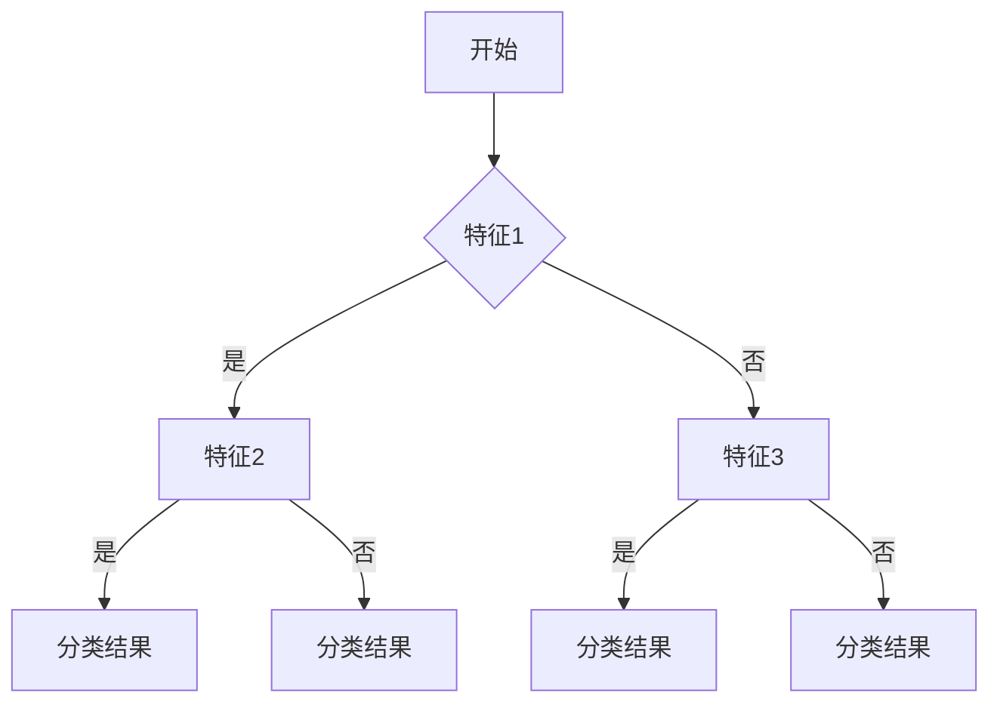
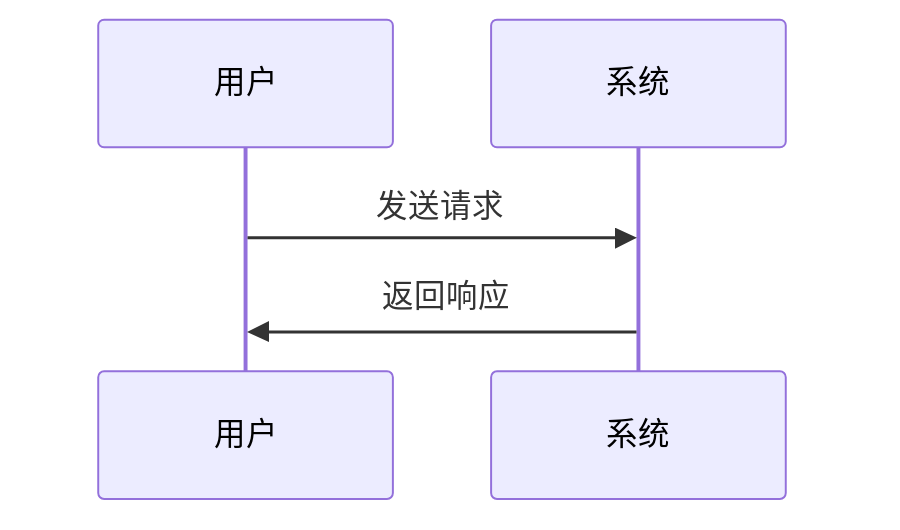

                 

### 书名：《创造有利于成长的环境：个人发展的外部条件》

**目录大纲：**

```markdown
----------------------------------------------------------------
## 第一部分：个人成长环境概述

### 第1章：问题的背景与核心概念

#### 1.1 个人成长环境的界定与重要性
   - 个人成长环境的基本概念
   - 个人成长环境的重要性
   - 个人成长环境的构成要素

#### 1.2 成长环境与个人发展的关系
   - 成长环境对个人发展的影响
   - 个人在成长环境中的角色与互动
   - 理论基础：心理学与社会学的视角

#### 1.3 成长环境的边界与外延
   - 家庭环境
   - 社会环境
   - 教育环境
   - 工作环境
   - 自我成长环境

### 第2章：核心概念解析

#### 2.1 成长环境的核心概念
   - 家庭氛围
   - 社交网络
   - 教育机会
   - 职业发展

#### 2.2 核心概念属性特征对比表
   - **家庭氛围**
     - 亲子关系
     - 家长教育方式
     - 家庭价值观
   - **社交网络**
     - 信任关系
     - 社交频率
     - 社交内容
   - **教育机会**
     - 教育资源
     - 教育质量
     - 教育环境
   - **职业发展**
     - 职业规划
     - 职业技能
     - 职业环境

#### 2.3 成长环境与个人发展的ER实体关系图
   - 成长环境实体
   - 个人发展实体
   - 实体关系图

## 第二部分：外部条件分析与策略

### 第3章：家庭环境对个人发展的影响

#### 3.1 家庭氛围的塑造
   - 家庭氛围的概念
   - 家庭氛围对个人发展的作用
   - 家庭氛围的改善策略

#### 3.2 家长教育方式
   - 传统教育方式
   - 现代教育方式
   - 家长教育方式的比较与分析

#### 3.3 家庭价值观
   - 家庭价值观的传承
   - 家庭价值观对个人发展的影响
   - 家庭价值观的调适与更新

### 第4章：社会环境与个人发展

#### 4.1 社交网络的作用
   - 社交网络的定义
   - 社交网络对个人发展的影响
   - 社交网络的构建与管理

#### 4.2 社交信任关系的建立
   - 社交信任的重要性
   - 社交信任的建立与维护
   - 社交信任的挑战与应对

#### 4.3 社交频率与社交内容
   - 社交频率的影响
   - 社交内容的多样性
   - 社交内容的适切性

### 第5章：教育环境对个人发展的作用

#### 5.1 教育资源的重要性
   - 教育资源的定义
   - 教育资源对个人发展的影响
   - 教育资源的公平性

#### 5.2 教育质量与个人发展
   - 教育质量的评估
   - 教育质量对个人发展的影响
   - 提高教育质量的策略

#### 5.3 教育环境的改善
   - 学校教育环境的改善
   - 社区教育环境的改善
   - 家庭教育环境的改善

### 第6章：职业发展环境

#### 6.1 职业规划与个人发展
   - 职业规划的概念
   - 职业规划对个人发展的重要性
   - 职业规划的步骤与策略

#### 6.2 职业技能与个人发展
   - 职业技能的培养
   - 职业技能对个人发展的影响
   - 职业技能的提升路径

#### 6.3 职业环境对个人发展的影响
   - 职业环境的概念
   - 职业环境对个人发展的影响
   - 职业环境的优化策略

### 第7章：自我成长环境

#### 7.1 自我认知与成长
   - 自我认知的概念
   - 自我认知对个人成长的影响
   - 自我认知的发展与提升

#### 7.2 自我激励与自我管理
   - 自我激励的重要性
   - 自我管理的策略
   - 自我管理的方法与实践

#### 7.3 自我成长环境的营造
   - 自我成长环境的定义
   - 自我成长环境对个人成长的影响
   - 自我成长环境的营造方法

## 第三部分：最佳实践与案例分析

### 第8章：成功案例分析

#### 8.1 成功案例介绍
   - 案例一：家庭环境对个人成长的积极影响
   - 案例二：社会环境助力个人发展
   - 案例三：教育环境与职业发展的良性互动

#### 8.2 案例分析
   - 

----------------------------------------------------------------
```

### 摘要

本文旨在探讨个人成长的外部条件，分析家庭环境、社会环境、教育环境和职业发展环境对个人发展的影响。通过定义个人成长环境，梳理其构成要素和核心概念，本文详细解析了家庭氛围、社交网络、教育机会和职业发展等外部条件对个人成长的促进作用。同时，本文结合心理学和社会学的理论基础，探讨了个人在成长环境中的角色与互动。此外，本文提出了改善家庭环境、优化教育资源和提升职业环境的策略，旨在为读者创造一个有利于个人成长的环境。通过成功案例分析，本文总结了最佳实践，为读者提供可操作的指导和建议。

---

### 第一部分：个人成长环境概述

#### 第1章：问题的背景与核心概念

##### 1.1 个人成长环境的界定与重要性

个人成长环境是指个体在成长过程中所处的各种外部条件，这些条件影响着个体的认知发展、行为习惯、价值观形成以及社会技能的获得。个人成长环境的基本概念包括家庭环境、社会环境、教育环境和职业发展环境等，每个环境对个体的成长都有着深远的影响。

个人成长环境的重要性不容忽视。首先，它为个体提供了一个稳定的成长平台，使个体能够在安全和有爱的环境中成长。其次，成长环境中的资源和机会能够促进个体的全面发展，包括智力、情感、道德和社交能力等方面。最后，良好的成长环境有助于个体建立积极的心态，增强自信心和适应能力，从而更好地应对生活中的挑战。

个人成长环境的构成要素主要包括以下几个方面：

1. **家庭环境**：家庭是个人最早接触的社会单元，家庭氛围、亲子关系和家庭教育方式对个人成长有着直接的影响。一个和谐的家庭环境能够提供情感支持和安全感，有利于个体的健康成长。

2. **社会环境**：社会环境包括社区、同伴关系、文化氛围等，这些因素共同构成了个体成长的外部环境。社会环境中的信任关系、社交频率和社交内容对个体的社交能力和人际关系具有重要影响。

3. **教育环境**：教育环境包括学校教育、家庭教育和社会教育等。教育资源、教育质量和教育环境直接影响个体的知识获取和能力培养。

4. **职业发展环境**：职业发展环境包括职业规划、职业技能和职业环境等。一个良好的职业发展环境能够提供职业发展的机会和资源，促进个体的职业成长。

##### 1.2 成长环境与个人发展的关系

成长环境对个人发展的影响是多方面的。首先，家庭环境对个人的行为习惯、性格特征和价值观形成有着重要影响。一个和谐的家庭氛围能够培养出自信、独立和有责任感的人。反之，一个不良的家庭环境可能会导致个人产生负面情绪和行为问题。

社会环境对个人发展的影响主要体现在社交能力和人际关系的建立。一个积极向上的社会环境能够提供丰富的社交机会，帮助个人建立广泛的社交网络，从而提高个人的社交能力和人际交往能力。

教育环境对个人发展的影响主要体现在知识获取和能力培养。优质的教育资源和高水平的教育质量能够为个人提供更多的学习机会和发展空间，帮助个人实现自我价值。

职业发展环境对个人发展的影响主要体现在职业规划和职业发展。一个良好的职业发展环境能够为个人提供职业成长的机会和资源，帮助个人实现职业目标。

个人在成长环境中的角色与互动也是一个重要方面。个人不仅是成长环境的接受者，也是成长环境的积极参与者。个人的行为和选择会影响成长环境的构成和变化。同时，个人在与他人的互动中，不断学习和成长，从而实现个人发展。

##### 1.3 成长环境的边界与外延

成长环境的边界与外延是一个复杂的问题，因为它涉及到多个方面的影响。从家庭环境来看，家庭关系的边界通常比较清晰，但家庭与外部社会环境的互动却相对复杂。例如，家庭成员可能受到外部社会环境的影响，如家庭价值观可能受到社会文化的影响。

社会环境的边界通常比较模糊，因为社会环境中的因素可能相互影响。例如，社区环境可能会影响家庭环境，而家庭环境又可能影响个人的社会关系。

教育环境的边界则相对明确，通常是在学校内部。然而，学校教育环境与家庭教育和社区教育的互动也是不可避免的。

职业发展环境的边界通常是在工作场所。然而，职业发展环境并不局限于工作场所，还包括职业规划、职业技能的培养等。

自我成长环境的边界则完全是个人的内心世界。自我成长环境的营造需要个人有意识地调整自己的心态和行为，以适应外部环境的变化。

### 第2章：核心概念解析

#### 2.1 成长环境的核心概念

个人成长环境的核心概念包括家庭氛围、社交网络、教育机会和职业发展。这些核心概念是个人成长环境中最为重要的组成部分，对个人的发展具有决定性的影响。

##### 家庭氛围

家庭氛围是指家庭内部的情感状态和人际关系，包括亲子关系、家庭成员之间的互动和家庭的价值观。家庭氛围对个人的成长有着深远的影响，良好的家庭氛围能够为个人提供情感支持和安全感，促进个人的健康成长。

- **亲子关系**：亲子关系是家庭氛围的核心组成部分。良好的亲子关系能够促进个人的情感发展和行为习惯的养成。亲子关系中的信任、沟通和支持是家庭氛围健康的重要标志。
- **家长教育方式**：家长的教育方式对个人的成长有重要影响。传统教育方式侧重于知识传授和权威控制，而现代教育方式则强调个体发展和情感交流。
- **家庭价值观**：家庭价值观是家庭氛围的重要组成部分，它影响着家庭成员的行为和决策。一个积极的家庭价值观能够促进个人的道德观念和社会责任感。

##### 社交网络

社交网络是指个人在社交过程中建立的各种社会关系，包括家庭、朋友、同事等。社交网络对个人的成长具有重要意义，它不仅提供了情感支持和社会资源，还促进了个人的社交能力和人际交往能力。

- **信任关系**：信任关系是社交网络中的核心，它影响着个人与他人之间的互动和合作。建立良好的信任关系需要时间和耐心，但它是个人成长的重要基础。
- **社交频率**：社交频率是指个人与他人互动的频率。高频率的社交有助于建立和维护社交网络，但过度的社交也可能导致个人的疲惫和压力。
- **社交内容**：社交内容是指个人在社交过程中分享的信息和观点。社交内容的多样性和适切性有助于提高社交网络的品质，促进个人的全面发展。

##### 教育机会

教育机会是指个人在接受教育过程中获得的各种资源和支持，包括教育资源、教育质量和教育环境。教育机会对个人的知识获取和能力培养具有决定性影响。

- **教育资源**：教育资源包括学校、教师、教材等。优质的教育资源能够为个人提供良好的学习环境和丰富的学习资源。
- **教育质量**：教育质量是指教育的效果和水平。高质量的教育能够提高个人的知识水平和能力，促进个人的全面发展。
- **教育环境**：教育环境是指个人在接受教育过程中所处的环境和氛围。良好的教育环境能够提供积极的学习氛围，激发个人的学习兴趣和动力。

##### 职业发展

职业发展是指个人在职业生涯中的成长和进步，包括职业规划、职业技能和职业环境。职业发展对个人的经济状况和社会地位具有直接影响。

- **职业规划**：职业规划是指个人对职业发展的规划和设想。良好的职业规划能够帮助个人明确职业目标，制定实现目标的策略。
- **职业技能**：职业技能是指个人在职业领域中的知识和能力。职业技能的提升对个人的职业发展至关重要。
- **职业环境**：职业环境是指个人在职业领域中工作和社会的环境。良好的职业环境能够提供公平竞争的机会和良好的发展空间。

#### 2.2 核心概念属性特征对比表

为了更好地理解个人成长环境的核心概念，我们通过对比表来展示这些概念的主要属性特征。

**家庭氛围**

| 特征         | 描述                                                         |
| ------------ | ------------------------------------------------------------ |
| 亲子关系     | 家庭成员之间的情感联系和互动，影响个人的情感发展和行为习惯。 |
| 家长教育方式 | 家长在培养子女过程中的教育方法和态度，影响个人的成长环境。 |
| 家庭价值观   | 家庭成员共同遵循的价值观和行为准则，影响个人的道德观念和社会责任感。 |

**社交网络**

| 特征         | 描述                                                         |
| ------------ | ------------------------------------------------------------ |
| 信任关系     | 个人与他人之间的信任程度，影响社交网络的稳定性和合作性。   |
| 社交频率     | 个人与他人互动的频率，影响社交网络的活跃度和紧密度。     |
| 社交内容     | 个人在社交过程中分享的信息和观点，影响社交网络的质量和多样性。 |

**教育机会**

| 特征         | 描述                                                         |
| ------------ | ------------------------------------------------------------ |
| 教育资源     | 为个人提供学习环境和资源的条件，影响个人的知识获取和能力培养。 |
| 教育质量     | 教育的效果和水平，影响个人的学习成果和职业发展。           |
| 教育环境     | 个人接受教育过程中的环境和氛围，影响个人的学习体验和动力。   |

**职业发展**

| 特征         | 描述                                                         |
| ------------ | ------------------------------------------------------------ |
| 职业规划     | 个人对职业发展的规划和设想，影响个人的职业目标和策略。     |
| 职业技能     | 个人在职业领域中具备的知识和能力，影响个人的职业竞争力。   |
| 职业环境     | 个人在工作和社会中的环境和条件，影响个人的职业发展机会和空间。 |

#### 2.3 成长环境与个人发展的ER实体关系图

为了更好地理解个人成长环境与个人发展之间的关系，我们使用ER（实体关系）图来展示这两个概念之间的实体关系。

```mermaid
erDiagram
    A[[成长环境]] ||--|{ 个人发展 }|
    A [[家庭环境]] ||--|{ 个人发展 }|
    A [[社会环境]] ||--|{ 个人发展 }|
    A [[教育环境]] ||--|{ 个人发展 }|
    A [[职业发展环境]] ||--|{ 个人发展 }|

    Class 成长环境 {
        --|{ 家庭环境 }| 家庭氛围
        --|{ 社会环境 }| 社交网络
        --|{ 教育环境 }| 教育机会
        --|{ 职业发展环境 }| 职业发展
    }

    Class 个人发展 {
        --|{ 家庭氛围 }| 亲子关系
        --|{ 社交网络 }| 信任关系
        --|{ 教育机会 }| 教育资源
        --|{ 职业发展 }| 职业规划
    }
```

在这个ER图中，"成长环境"是根实体，它包括四个子实体：家庭环境、社会环境、教育环境和职业发展环境。每个子实体都与"个人发展"实体有直接的关系，表示成长环境对个人发展的直接影响。

### 第二部分：外部条件分析与策略

#### 第3章：家庭环境对个人发展的影响

##### 3.1 家庭氛围的塑造

家庭氛围是家庭内部的一种情感状态和人际关系的总体表现，它对个人发展有着深远的影响。一个积极的家庭氛围能够为个人提供一个安全、温暖和充满爱的成长环境，有利于个人的全面发展。相反，一个消极的家庭氛围可能会对个人的心理健康和情感发展产生负面影响。

**家庭氛围的概念**

家庭氛围是指家庭成员在日常生活中表现出来的情绪状态、互动方式和价值观念。它不仅体现在家庭成员之间的直接交流中，也体现在家庭环境中的细节和日常生活中。家庭氛围包括以下几个方面：

- **情感支持**：家庭成员之间的情感支持是家庭氛围的核心。一个充满爱的家庭能够为个人提供情感依靠，帮助个人在遇到困难和挫折时保持积极的心态。
- **沟通方式**：家庭成员之间的沟通方式对家庭氛围有着重要的影响。积极的沟通方式能够促进家庭成员之间的理解和信任，避免误解和冲突。
- **价值观**：家庭价值观是家庭成员共同遵循的道德和行为准则。一个积极的家庭价值观能够为个人提供正确的价值观引导，帮助个人形成健康的人生观和世界观。

**家庭氛围对个人发展的作用**

家庭氛围对个人发展的影响是多层次、多方面的。以下是一些具体的影响：

- **心理健康**：良好的家庭氛围能够为个人提供一个稳定的情感支持系统，有助于个人保持心理健康。在一个充满爱和尊重的家庭中，个人更容易形成积极的自我认知和自信心。
- **行为习惯**：家庭氛围对个人的行为习惯有着深远的影响。一个积极的家庭氛围能够培养出良好的行为习惯，如自律、责任感、合作精神等。
- **社交能力**：家庭氛围对个人的社交能力也有重要影响。在一个和谐的家庭中，个人能够学会如何与他人相处，培养良好的社交技巧和人际关系。

**家庭氛围的改善策略**

为了营造一个积极的家庭氛围，家庭成员可以采取以下策略：

- **加强沟通**：家庭成员之间应该保持开放、诚实的沟通，倾听彼此的需求和感受，避免误解和冲突。
- **建立共同目标**：家庭成员可以共同制定家庭目标和计划，增强家庭的凝聚力，为个人提供明确的方向和动力。
- **关注情感需求**：家庭成员应该关注彼此的情感需求，给予关心和支持，营造一个温馨、关爱的家庭氛围。
- **培养共同兴趣**：家庭成员可以共同参与一些活动，如运动、旅行、阅读等，增强家庭的互动和凝聚力。

##### 3.2 家长教育方式

家长教育方式是指家长在培养子女过程中的教育方法和态度。不同的家长教育方式对子女的成长和发展有着不同的影响。了解和选择适合的教育方式，对于家长来说是非常重要的。

**传统教育方式**

传统教育方式强调知识传授和权威控制，家长在子女教育过程中通常采取以下策略：

- **严格纪律**：家长通过严格的纪律和规则来约束子女的行为，培养子女的自律性和责任感。
- **权威教育**：家长在教育过程中通常保持权威地位，子女需要服从家长的意见和决定。
- **应试教育**：传统教育方式注重考试成绩和学术成就，家长鼓励子女参加各种补习班和考试，以获得更好的学习成绩。

**现代教育方式**

现代教育方式强调个体发展和情感交流，家长在教育过程中通常采取以下策略：

- **情感交流**：家长注重与子女的情感交流，倾听子女的需求和感受，建立信任和尊重的关系。
- **个性化教育**：家长根据子女的个性和兴趣，制定个性化的教育计划，鼓励子女发挥特长和潜能。
- **培养独立性**：家长鼓励子女独立思考和解决问题，培养子女的自我管理和自我决策能力。

**家长教育方式的比较与分析**

传统教育方式和现代教育方式各有优缺点，家长在选择教育方式时应该综合考虑子女的个性和需求。

- **优点**：传统教育方式强调纪律和责任，有助于培养子女的自理能力和应试能力。现代教育方式注重个体发展和情感交流，有助于培养子女的自主性和创造力。
- **缺点**：传统教育方式可能导致子女缺乏自主性和创造力，压抑子女的个性发展。现代教育方式可能由于缺乏纪律和规则，导致子女行为散漫和缺乏责任感。

**家长教育方式的建议**

- **结合使用**：家长可以结合传统教育方式和现代教育方式的优点，根据子女的实际情况制定合适的教育计划。
- **关注子女需求**：家长应该关注子女的需求和兴趣，尊重子女的选择和决定，给予适当的引导和支持。
- **持续学习**：家长应该不断学习和更新教育观念，了解子女的心理和行为特点，提高自己的教育能力。

##### 3.3 家庭价值观

家庭价值观是家庭成员共同遵循的道德和行为准则，它是家庭文化的核心。家庭价值观的传承对个人的成长和发展具有深远的影响。

**家庭价值观的传承**

家庭价值观的传承是通过家庭教育和家庭成员的日常行为来实现的。以下是一些具体的传承方法：

- **榜样示范**：家长通过自身的言行来树立榜样，子女会模仿家长的行为，从而内化家庭价值观。
- **家庭教育**：家长通过家庭教育和日常交流，向子女传递家庭价值观，引导子女树立正确的道德观念。
- **家庭活动**：家庭活动，如家庭聚会、节日庆祝等，也是传承家庭价值观的重要途径。通过这些活动，家庭成员能够共同体验和传承家庭价值观。

**家庭价值观对个人发展的影响**

家庭价值观对个人发展的影响主要体现在以下几个方面：

- **道德观念**：家庭价值观有助于个人形成正确的道德观念，培养良好的品德和行为习惯。
- **人际关系**：家庭价值观影响个人的社交行为和人际关系，有助于个人建立和维护良好的人际关系。
- **社会适应**：家庭价值观帮助个人适应社会环境，理解和遵守社会规范，提高社会适应能力。

**家庭价值观的调适与更新**

随着社会的发展和变化，家庭价值观也需要不断调适和更新。以下是一些调适和更新的建议：

- **开放沟通**：家庭成员之间应该保持开放、诚实的沟通，共同讨论和调整家庭价值观。
- **关注社会变化**：家长应该关注社会变化，了解社会发展的趋势和挑战，及时更新家庭价值观。
- **教育引导**：家长可以通过教育和引导，帮助子女理解和适应新的社会价值观，培养子女的社会责任感。

### 第4章：社会环境与个人发展

社会环境是个人成长的外部条件之一，它对个人的发展有着重要的影响。社会环境包括社交网络、社交信任关系、社交频率和社交内容等多个方面，这些因素共同构成了个人在社会中的成长环境。

##### 4.1 社交网络的作用

社交网络是指个人在社交过程中建立的各种社会关系，包括家庭成员、朋友、同事等。社交网络对个人发展具有深远的影响，它不仅提供了情感支持和社会资源，还促进了个人社交能力和人际交往能力的发展。

**社交网络的定义**

社交网络是指个人与他人之间通过互动和联系建立起来的一系列关系网络。这些关系可以是直接的，如家庭和朋友；也可以是间接的，如同事和同学。社交网络是一种复杂的社会结构，它通过人与人之间的互动和联系，形成一个相互支持、相互影响的网络。

**社交网络对个人发展的影响**

社交网络对个人发展的影响主要体现在以下几个方面：

- **情感支持**：社交网络为个人提供了情感支持，当个人遇到困难或挫折时，可以通过社交网络寻求帮助和支持。
- **社会资源**：社交网络为个人提供了丰富的社会资源，包括信息、机会和资源。这些资源可以帮助个人更好地实现个人目标和发展。
- **社交能力**：社交网络促进了个人社交能力的发展，通过与他人的互动，个人可以学会如何与他人相处，培养良好的社交技巧和人际关系。
- **信息传播**：社交网络也是信息传播的重要渠道，个人可以通过社交网络获取各种信息和知识，从而拓宽视野，提高自身的认知水平。

**社交网络的构建与管理**

为了构建和管理一个有效的社交网络，个人可以采取以下策略：

- **主动参与**：积极参与各种社交活动，主动与他人建立联系，扩大社交圈子。
- **维持关系**：定期与亲朋好友保持联系，维护和发展已有的关系，避免关系疏远。
- **建立信任**：在社交网络中建立信任关系，与他人保持真诚和诚信的交往。
- **信息分享**：在社交网络中分享信息和资源，与他人建立互助合作关系。

##### 4.2 社交信任关系的建立

社交信任关系是指个人与他人之间基于信任建立的社交关系。信任是社交网络中的核心元素，它影响着个人与他人之间的互动和合作。建立良好的社交信任关系对于个人发展具有重要意义。

**社交信任的重要性**

社交信任关系的重要性主要体现在以下几个方面：

- **合作基础**：信任是合作的基础，没有信任的社交关系很难建立有效的合作。
- **互动质量**：信任关系能够提高个人互动的质量，促进双方的理解和沟通。
- **情感支持**：信任关系为个人提供了情感支持，当个人遇到困难时，可以更容易地获得他人的帮助和支持。
- **社会资源**：信任关系也为个人提供了丰富的社会资源，包括信息、机会和资源。

**社交信任的建立与维护**

建立和维护良好的社交信任关系需要时间和努力，以下是一些具体的策略：

- **诚实守信**：诚实是建立信任的基础，个人应该遵守承诺，诚实面对问题，不欺骗他人。
- **透明沟通**：透明沟通能够增加个人与他人的信任度，避免误解和冲突。
- **共同目标**：共同目标能够促进个人与他人之间的合作和信任，共同实现目标。
- **情感共鸣**：在互动中表现出同理心和情感共鸣，能够增加个人与他人的信任感。

**社交信任的挑战与应对**

在社交网络中，建立和维护信任关系可能会面临一些挑战，如误解、冲突和背叛等。以下是一些应对策略：

- **积极沟通**：遇到误解和冲突时，积极沟通是解决问题的最佳途径，通过沟通消除误解，解决问题。
- **宽容理解**：在面对他人的错误或失误时，宽容和理解能够减少矛盾和冲突，维护社交信任关系。
- **预防措施**：在建立社交信任关系时，可以采取一些预防措施，如了解对方的背景和信誉，避免与不诚信的人建立关系。

##### 4.3 社交频率与社交内容

社交频率和社交内容是社交网络中的重要因素，它们影响着社交网络的质量和个人的社交能力。

**社交频率的影响**

社交频率是指个人与他人互动的频率。适当的社交频率对社交网络的质量有着重要的影响。以下是一些社交频率的影响：

- **增强联系**：适当的社交频率能够增强个人与他人的联系，提高社交网络的紧密度。
- **保持活跃**：定期与他人保持联系，能够保持社交网络的活跃度，避免关系疏远。
- **情感支持**：适度的社交频率能够为个人提供情感支持，帮助个人缓解压力和焦虑。

**社交内容的多样性**

社交内容是指个人在社交过程中分享的信息和观点。社交内容的多样性对社交网络的质量也有着重要的影响。以下是一些社交内容的影响：

- **丰富经验**：多样化的社交内容能够丰富个人的经验和知识，拓宽个人的视野。
- **提高兴趣**：多样化的社交内容能够提高个人的兴趣和爱好，促进个人全面发展。
- **增强互动**：多样化的社交内容能够增强个人与他人之间的互动和合作，提高社交网络的活跃度。

**社交内容的适切性**

社交内容的适切性是指个人在社交过程中分享的信息和观点是否适合社交环境和社交对象。适切的社交内容对社交网络的质量和个人的社交能力有着重要的影响。以下是一些社交内容适切性的影响：

- **避免冲突**：适切的社交内容能够避免与他人产生冲突，维护社交网络和谐。
- **增强信任**：适切的社交内容能够增强个人与他人之间的信任，促进良好的社交关系。
- **提高效率**：适切的社交内容能够提高社交互动的效率，节省时间和精力。

**社交频率与社交内容的建议**

- **适度社交**：个人应该根据自己的需求和实际情况，适度参与社交活动，保持适当的社交频率。
- **多样化内容**：在社交过程中，个人应该尝试分享多样化的内容，丰富社交网络的多样性和活力。
- **注意适切性**：在分享社交内容时，个人应该注意内容的适切性，避免与他人产生冲突或误解。

### 第5章：教育环境对个人发展的作用

教育环境是指个人在接受教育过程中所处的环境和条件，包括学校教育、家庭教育和社会教育等。教育环境对个人的知识获取、能力培养和社会化过程具有重要影响。

##### 5.1 教育资源的重要性

教育资源是指个人在接受教育过程中获得的各种资源和条件，包括学校设施、教师资源、教材资源等。教育资源的重要性体现在以下几个方面：

- **知识获取**：优质的教育资源能够为个人提供丰富的知识资源，帮助个人更好地获取和理解知识。
- **能力培养**：教育资源中的教师和教材等资源能够帮助个人培养各种能力，如思维能力、创新能力、实践能力等。
- **教育公平**：教育资源的重要性还体现在教育公平方面。优质的教育资源能够帮助弱势群体获得更好的教育机会，提高社会公平性。

**教育资源的定义**

教育资源是指为个人提供学习机会和条件的各种资源和设施，包括：

- **学校设施**：如教学楼、实验室、图书馆等，为个人提供学习场所和设备。
- **教师资源**：教师的数量和质量对教育资源的影响至关重要。优秀的教师能够提供高质量的教育服务，帮助个人更好地发展。
- **教材资源**：教材和教辅资料是教育资源的重要组成部分，为个人提供学习内容和学习指导。

**教育资源对个人发展的影响**

教育资源对个人发展的影响是多层次、多方面的。以下是一些具体的影响：

- **知识水平**：优质的教育资源能够提高个人的知识水平，帮助个人更好地掌握各种学科知识。
- **能力培养**：教育资源中的教师和教材等资源能够帮助个人培养各种能力，如思维能力、创新能力、实践能力等。
- **自信心**：优质的教育资源能够为个人提供更多的学习机会和发展空间，提高个人的自信心和自我价值感。
- **社会适应**：教育资源对个人的社会适应能力也有重要影响。通过教育资源，个人可以更好地了解社会规范和价值观念，提高社会适应能力。

**教育资源的公平性**

教育资源的公平性是指个人在教育过程中获得资源的平等机会。教育资源的公平性对个人发展具有重要意义。以下是一些关于教育资源公平性的讨论：

- **机会公平**：教育资源的公平性首先体现在机会公平上。每个人应该有平等的机会接受优质的教育资源，不受种族、性别、经济条件等因素的限制。
- **资源分配**：教育资源的公平性还体现在资源分配上。政府和学校应该根据需求和社会责任，合理分配教育资源，确保每个人都能获得公平的教育机会。
- **补偿机制**：对于一些教育资源不足的群体，如贫困家庭、少数民族等，政府和社会应该采取补偿机制，提供额外的教育资源和支持，帮助他们获得更好的教育机会。

##### 5.2 教育质量与个人发展

教育质量是指教育的效果和水平，它对个人的知识获取、能力培养和社会化过程具有重要影响。教育质量的高低直接关系到个人的发展前景。

**教育质量的评估**

教育质量的评估是衡量教育效果和水平的重要手段。以下是一些常用的评估方法：

- **学生成绩**：学生成绩是评估教育质量的一个重要指标。通过分析学生的考试成绩，可以了解教育质量的高低。
- **教师评价**：教师评价是评估教育质量的重要手段。通过教师的自我评价和学生的评价，可以了解教师的教学质量和学生的学习效果。
- **学生满意度**：学生满意度是评估教育质量的一个重要指标。通过调查学生的满意度，可以了解教育质量的优劣。
- **课程设置**：课程设置是评估教育质量的一个重要方面。一个合理的课程设置能够为学生提供全面的教育，提高教育质量。

**教育质量对个人发展的影响**

教育质量对个人发展的影响是多层次、多方面的。以下是一些具体的影响：

- **知识获取**：高质量的教育能够提高个人的知识水平，帮助个人更好地掌握各种学科知识。
- **能力培养**：高质量的教育能够培养个人的各种能力，如思维能力、创新能力、实践能力等。
- **自信心**：高质量的教育能够提高个人的自信心和自我价值感，帮助个人更好地面对挑战和困难。
- **社会化**：高质量的教育能够帮助个人更好地了解社会规范和价值观念，提高个人的社会化能力。

**提高教育质量的策略**

为了提高教育质量，个人、学校和社会可以采取以下策略：

- **教师培训**：提高教师的培训水平和教学能力，确保教师能够提供高质量的教育服务。
- **课程改革**：改革课程设置，引入新的教学方法和教学内容，提高教育的实效性。
- **教学评价**：建立科学的教学评价体系，及时了解教育质量的情况，采取改进措施。
- **教育资源**：提供优质的教育资源，如先进的设备、教材和教学资源，提高教育的硬件水平。
- **学生参与**：鼓励学生参与教学过程，提高学生的积极性和主动性，提高教育质量。

##### 5.3 教育环境的改善

教育环境的改善是指通过优化教育资源的配置和提升教育质量，为个人提供一个更好的学习和发展环境。教育环境的改善对个人发展具有重要意义。

**学校教育环境的改善**

学校教育环境是个人接受教育的重要场所，改善学校教育环境有助于提高教育质量，促进个人发展。以下是一些改善学校教育环境的策略：

- **硬件设施**：改善学校的硬件设施，如教学楼、实验室、图书馆等，提供良好的学习环境。
- **教学设备**：更新教学设备，如电脑、投影仪、音响系统等，提高教学效果。
- **师资力量**：提高教师的培训水平和教学质量，吸引优秀的教师加入学校，提升教育质量。
- **教育管理**：优化学校的教育管理，建立科学的管理制度和评价体系，提高教育管理的效率。

**社区教育环境的改善**

社区教育环境是个人接受教育的重要组成部分，改善社区教育环境有助于提高社区的教育水平，促进个人发展。以下是一些改善社区教育环境的策略：

- **教育资源**：提供丰富的教育资源，如图书馆、学习中心、教育讲座等，满足社区成员的学习需求。
- **教育支持**：提供教育支持服务，如心理咨询、职业指导等，帮助社区成员解决教育过程中的问题。
- **文化活动**：举办各种文化活动，如读书会、讲座、展览等，提高社区成员的文化素养。
- **社区参与**：鼓励社区成员参与社区教育活动，提高社区的教育意识和参与度。

**家庭教育环境的改善**

家庭教育环境是个人接受教育的重要基础，改善家庭教育环境有助于提高家庭教育质量，促进个人发展。以下是一些改善家庭教育环境的策略：

- **家长教育**：提高家长的教育意识和教育能力，通过家长培训和家庭教育讲座，帮助家长更好地教育子女。
- **家庭氛围**：营造和谐的家庭氛围，提供温馨、关爱的家庭环境，有助于个人健康成长。
- **亲子互动**：鼓励亲子互动，通过家庭活动和共同学习，增进亲子关系，提高家庭教育效果。
- **教育资源**：提供家庭教育资源，如教育书籍、学习软件等，帮助家长更好地指导子女学习。

### 第6章：职业发展环境

职业发展环境是指个人在职业生涯中面临的各种外部条件，包括职业规划、职业技能和职业环境等。一个良好的职业发展环境能够为个人提供职业成长的机会和资源，促进个人职业目标的实现。

##### 6.1 职业规划与个人发展

职业规划是指个人根据自己的兴趣、能力和市场需求，制定职业目标和行动计划的过程。职业规划对个人发展具有重要意义，它能够帮助个人明确职业目标，制定实现目标的策略，提高职业竞争力。

**职业规划的概念**

职业规划是指个人根据自身条件和社会需求，制定职业目标和行动计划，并持续调整和优化的过程。职业规划不仅包括确定职业目标，还包括实现目标的策略和行动计划。一个成功的职业规划需要考虑以下几个方面：

- **自我认知**：了解自己的兴趣、价值观、能力、性格等，确定适合自己的职业方向。
- **市场分析**：分析市场需求和行业趋势，了解职业发展的机会和挑战。
- **目标设定**：根据自我认知和市场分析，设定具体的职业目标，如职位晋升、技能提升等。
- **行动计划**：制定实现目标的行动计划，包括学习计划、工作计划、发展路径等。

**职业规划对个人发展的重要性**

职业规划对个人发展的重要性体现在以下几个方面：

- **明确目标**：职业规划能够帮助个人明确职业目标，为个人的职业发展提供明确的方向和动力。
- **提升能力**：职业规划能够帮助个人根据目标设定学习和发展计划，提升个人的能力和竞争力。
- **减少迷茫**：职业规划能够帮助个人避免职业发展的迷茫和困惑，提高职业决策的准确性和有效性。
- **实现价值**：职业规划能够帮助个人实现职业价值，提高职业成就感和幸福感。

**职业规划的步骤与策略**

制定一个成功的职业规划需要遵循以下步骤和策略：

- **自我评估**：进行自我评估，了解自己的兴趣、价值观、能力、性格等，确定职业发展方向。
- **市场调研**：分析市场需求和行业趋势，了解职业发展的机会和挑战，为职业规划提供依据。
- **目标设定**：根据自我评估和市场调研，设定具体的职业目标，如职位晋升、技能提升等。
- **行动计划**：制定实现目标的行动计划，包括学习计划、工作计划、发展路径等。
- **持续调整**：根据职业发展的实际情况，持续调整和优化职业规划，确保目标的实现。

**职业规划的案例分析**

以下是一个职业规划的案例分析：

**案例背景**：小张是一名计算机专业的毕业生，他对编程和软件开发充满热情，希望在技术领域发展。

**职业目标**：小张的职业目标是成为一名优秀的软件工程师，并在五年内晋升为项目经理。

**自我评估**：小张通过自我评估，确定自己在编程、逻辑思维和团队合作方面有优势，但在项目管理方面经验不足。

**市场调研**：通过市场调研，小张了解到软件开发是一个快速发展的行业，项目经理的职位需求较大，但竞争也较为激烈。

**目标设定**：小张设定了以下职业目标：
1. 在前两年内，通过实习和项目经验，提升编程技能和项目管理能力。
2. 在第三年到第四年，积累足够的项目经验，争取晋升为高级软件工程师。
3. 在第五年，通过学习和实践，晋升为项目经理。

**行动计划**：
1. 完成大学期间的实习项目，积累实践经验。
2. 参加编程和项目管理相关的培训课程，提升自身能力。
3. 在工作中积极参与项目管理，提高项目管理能力。
4. 在第五年，通过实际工作成绩和项目经验，争取晋升为项目经理。

通过这个案例分析，我们可以看到，一个成功的职业规划需要考虑自我认知、市场调研、目标设定和行动计划等多个方面，同时需要根据实际情况进行调整和优化。

##### 6.2 职业技能与个人发展

职业技能是指个人在特定职业领域中所具备的知识、技能和能力。职业技能对个人发展具有重要作用，它不仅能够提高个人的职业竞争力，还能够促进个人的职业成长和职业满意度。

**职业技能的培养**

职业技能的培养是一个长期的过程，需要个人通过不断学习和实践来提升自己的能力。以下是一些常见的职业技能培养方法：

- **专业培训**：参加专业培训课程，如技能培训、职业资格认证等，通过系统的学习和考试，提升职业技能。
- **实习和实践**：通过实习和实践，将理论知识应用于实际工作中，提升实践能力和解决问题的能力。
- **项目经验**：参与各种项目，积累项目经验，提升项目管理能力和团队协作能力。
- **自学**：利用网络资源和图书，自学相关技能和知识，提升自我学习能力。
- **交流与合作**：与他人交流合作，学习他人的经验和技巧，提升自己的职业技能。

**职业技能对个人发展的影响**

职业技能对个人发展的影响主要体现在以下几个方面：

- **职业竞争力**：职业技能的提高能够增强个人的职业竞争力，帮助个人在职场中脱颖而出，获得更好的职业机会和待遇。
- **职业成长**：职业技能的提高能够促进个人的职业成长，帮助个人实现职业晋升和职业发展。
- **职业满意度**：职业技能的提高能够提高个人的职业满意度，增强个人的职业成就感和幸福感。
- **社会贡献**：职业技能的提高能够帮助个人更好地为社会做出贡献，提升个人的社会价值。

**职业技能的提升路径**

为了提升职业技能，个人可以采取以下路径：

- **明确目标**：确定自己的职业目标和技能提升方向，制定具体的提升计划。
- **持续学习**：不断学习新的知识和技能，参加各种培训课程和研讨会，保持对行业的了解。
- **实践经验**：积极参与各种项目和实践活动，将理论知识应用于实际工作中，提高实践能力和解决问题的能力。
- **反馈与改进**：定期反思自己的技能提升情况，寻求他人的反馈和建议，不断改进和优化自己的职业技能。
- **拓展网络**：建立广泛的人际关系网络，与行业内的专家和同行交流合作，学习他人的经验和技巧。

**职业技能提升的案例分析**

以下是一个职业技能提升的案例分析：

**案例背景**：小李是一名从事市场营销工作多年的职场人士，他希望通过提升职业技能，实现职业晋升。

**职业技能提升目标**：小李的职业技能提升目标包括：
1. 提升市场营销知识，了解最新的市场营销理论和实践。
2. 提升数据分析能力，掌握数据分析工具和技能。
3. 提升团队管理能力，提高团队协作和项目管理效率。

**职业技能提升计划**：
1. 学习市场营销相关的书籍和在线课程，了解最新的市场营销理论和实践。
2. 学习数据分析相关的课程和软件，掌握数据分析工具和技能。
3. 参加团队管理和领导力培训，提升团队管理和项目管理能力。
4. 参与公司内部和行业内的研讨会，与同行交流经验，拓展知识面。

通过这个案例分析，我们可以看到，职业技能的提升需要个人明确目标、持续学习、实践经验、反馈与改进和拓展网络等多个方面的努力，只有通过全面的提升，才能实现职业发展的目标。

##### 6.3 职业环境对个人发展的影响

职业环境是指个人在职业生涯中工作和社会的环境，包括职场文化、工作氛围、组织结构、工作条件等。职业环境对个人发展具有深远的影响，一个良好的职业环境能够促进个人的职业成长和职业满意度。

**职业环境的概念**

职业环境是指个人在职业生涯中所处的各种外部条件和因素，包括职场文化、工作氛围、组织结构、工作条件等。职业环境的好坏直接影响个人的职业体验和职业发展。

- **职场文化**：职场文化是指组织内部的价值观念、行为规范和工作方式。良好的职场文化能够促进个人与组织的融合，提高工作满意度和职业成就感。
- **工作氛围**：工作氛围是指工作场所的氛围和氛围，包括同事之间的关系、工作压力和团队协作等。良好的工作氛围能够提高工作效率和团队凝聚力。
- **组织结构**：组织结构是指组织的内部组织形式和层级关系。合理的组织结构能够提高组织效率和员工满意度。
- **工作条件**：工作条件是指工作场所的物质条件和软性条件，包括工作环境、设备设施、福利待遇等。良好的工作条件能够提高员工的工作满意度和生活质量。

**职业环境对个人发展的影响**

职业环境对个人发展的影响是多方面的，以下是一些具体的影响：

- **职业成长**：良好的职业环境能够提供丰富的职业发展机会和资源，促进个人的职业成长和职业晋升。
- **职业满意度**：良好的职业环境能够提高员工的工作满意度和职业成就感，降低员工的工作压力和职业倦怠。
- **工作表现**：良好的职业环境能够激发员工的工作积极性和创造力，提高员工的工作表现和绩效。
- **社会贡献**：良好的职业环境能够帮助个人更好地为社会做出贡献，实现个人价值和组织价值的双赢。

**职业环境的优化策略**

为了优化职业环境，组织和个人可以采取以下策略：

- **企业文化建设**：组织可以通过建设积极向上的企业文化，提高员工的归属感和凝聚力，促进个人的职业成长。
- **工作氛围营造**：组织可以通过营造良好的工作氛围，促进员工之间的沟通与合作，提高工作效率和团队凝聚力。
- **组织结构调整**：组织可以通过调整组织结构，提高组织效率和员工满意度。
- **工作条件改善**：组织可以通过改善工作条件，提高员工的工作满意度和生活质量。

### 第7章：自我成长环境

自我成长环境是指个人在自我认知、自我激励和自我管理方面所营造的外部条件和内在状态。一个良好的自我成长环境能够促进个人的自我发展和持续成长。

##### 7.1 自我认知与成长

自我认知是指个人对自己的认识和理解，包括自己的兴趣、能力、价值观等方面。自我认知对个人的成长和发展具有重要作用，一个准确的自我认知能够帮助个人找到适合自己的发展方向，实现自我价值。

**自我认知的概念**

自我认知是指个人对自己的认知和理解，包括自己的个性特征、能力、价值观、兴趣爱好等方面。自我认知是个人发展的重要基础，它能够帮助个人了解自己的优势和劣势，制定合适的发展计划。

**自我认知对个人成长的影响**

自我认知对个人成长的影响主要体现在以下几个方面：

- **目标设定**：准确的自我认知能够帮助个人设定合适的职业目标和人生目标，避免盲目追求和无效努力。
- **能力提升**：自我认知能够帮助个人了解自己的优势和劣势，有针对性地提升自己的能力，实现自我发展。
- **心理调适**：自我认知有助于个人更好地应对挫折和困难，保持积极的心态，提高心理素质。
- **人际关系**：自我认知能够帮助个人更好地理解他人，建立良好的人际关系。

**自我认知的发展与提升**

为了提升自我认知，个人可以采取以下策略：

- **反思与自我评价**：定期进行自我反思和自我评价，了解自己的行为和表现，分析自己的优势和劣势。
- **交流与反馈**：与他人交流和分享自己的想法和感受，寻求他人的反馈和建议，了解自己的长处和不足。
- **专业咨询**：寻求专业心理咨询师或职业规划师的帮助，进行专业的自我评估和指导。
- **持续学习**：通过学习和阅读，不断扩展自己的知识和视野，提高自我认知水平。

**自我认知的案例分析**

以下是一个自我认知的案例分析：

**案例背景**：小王是一名刚刚进入职场的新人，他对自己的职业发展方向感到迷茫。

**自我认知过程**：小王通过反思和自我评价，了解到自己在沟通能力、团队协作能力和学习能力方面有优势，但在领导力和项目管理方面经验不足。

**自我认知结果**：小王决定根据自己的优势，选择一个适合自己发展的方向，如市场营销或人力资源，并制定相应的职业规划和发展计划。

通过这个案例分析，我们可以看到，自我认知是一个持续的过程，通过反思、交流、专业咨询和持续学习，个人可以不断提升自我认知水平，找到适合自己的发展方向。

##### 7.2 自我激励与自我管理

自我激励和自我管理是指个人在自我驱动和自我调节方面所采取的行动和策略。自我激励和自我管理对于个人的成长和发展至关重要，它们能够帮助个人克服困难，保持积极的心态，实现自我目标。

**自我激励的重要性**

自我激励是指个人在自我驱动和自我推动的过程中，产生内在的动力和动机，以实现个人目标。自我激励的重要性体现在以下几个方面：

- **提高动力**：自我激励能够提高个人的动力和积极性，帮助个人克服困难和挫折，保持持续的努力。
- **增强信心**：自我激励能够增强个人的自信心和自尊心，帮助个人更好地面对挑战和困难。
- **提高效率**：自我激励能够提高个人的工作效率和绩效，帮助个人在有限的时间内实现更多的目标。
- **促进成长**：自我激励能够促进个人的成长和发展，帮助个人不断提升自己的能力和水平。

**自我管理的策略**

自我管理是指个人在自我驱动和自我调节的过程中，采取的一系列行动和策略。以下是一些常见的自我管理策略：

- **目标设定**：明确个人的目标，制定具体的行动计划和时间表，确保目标的实现。
- **时间管理**：合理安排时间，避免拖延和浪费时间，提高工作效率。
- **情绪管理**：学会调节情绪，保持积极的心态，避免负面情绪的影响。
- **习惯养成**：培养良好的生活习惯和工作习惯，提高个人素质和职业能力。
- **反馈与调整**：定期进行自我反馈和评估，根据实际情况进行调整和优化。

**自我管理的方法与实践**

以下是一些自我管理的方法与实践：

- **使用时间管理工具**：如日程表、待办事项列表、时间追踪软件等，合理安排时间和任务，提高工作效率。
- **定期进行自我反思**：定期反思自己的行为和表现，分析自己的优势和不足，制定改进计划。
- **建立激励体系**：为自己设定奖励和惩罚机制，激励自己不断进步。
- **寻求支持与反馈**：与他人交流和分享，寻求支持和反馈，提高自我管理能力。

**自我管理的案例分析**

以下是一个自我管理的案例分析：

**案例背景**：小李是一名需要高效完成任务的职场新人，他感到在时间管理和任务处理方面存在困难。

**自我管理过程**：小李通过使用时间管理工具和定期自我反思，了解到自己的时间管理存在问题，如任务拖延、时间安排不合理等。

**自我管理策略**：
1. 制定详细的日程表，合理安排每天的任务和活动。
2. 使用待办事项列表，将任务分解成具体的可操作步骤。
3. 定期进行自我反思和评估，根据实际情况进行调整和优化。

通过这个案例分析，我们可以看到，自我管理需要个人采取一系列的策略和方法，通过实践和不断调整，提高自我管理能力，实现个人目标。

##### 7.3 自我成长环境的营造

自我成长环境是指个人在自我认知、自我激励和自我管理方面所营造的外部条件和内在状态。一个良好的自我成长环境能够促进个人的自我发展和持续成长。

**自我成长环境的定义**

自我成长环境是指个人在自我认知、自我激励和自我管理方面所营造的外部条件和内在状态，它包括个人心理状态、行为习惯、生活方式和环境等方面。一个良好的自我成长环境能够为个人提供一个积极、稳定和支持性的成长环境，促进个人的全面发展。

**自我成长环境对个人成长的影响**

自我成长环境对个人成长的影响是深远而多方面的，以下是一些具体的影响：

- **心理健康**：良好的自我成长环境能够促进个人的心理健康，帮助个人保持积极的心态，提高心理素质。
- **学习能力**：良好的自我成长环境能够提高个人的学习能力，帮助个人更好地吸收和应用知识，提高学习效率。
- **行为习惯**：良好的自我成长环境能够帮助个人养成良好的行为习惯，如自律、责任感、时间管理等，提高个人素质。
- **社交能力**：良好的自我成长环境能够提高个人的社交能力，帮助个人更好地与他人相处，建立良好的人际关系。

**自我成长环境的营造方法**

为了营造一个良好的自我成长环境，个人可以采取以下方法：

- **明确目标**：明确个人的成长目标，制定具体的行动计划和时间表，确保目标的实现。
- **持续学习**：不断学习新知识、新技能，提高自身素质和竞争力，适应社会发展的需求。
- **积极心态**：保持积极的心态，面对挑战和困难时，保持乐观和自信，寻找解决问题的方法。
- **时间管理**：合理安排时间，避免拖延和浪费时间，提高工作效率。
- **健康生活**：保持健康的生活方式，如规律作息、合理饮食、适当锻炼等，提高身体素质和心理健康。
- **社交互动**：积极参与社交活动，与他人建立良好的关系，获取支持和帮助。

**自我成长环境的案例分析**

以下是一个自我成长环境的案例分析：

**案例背景**：小张是一名需要提升自身能力和素质的职场人士，他希望营造一个有利于自我成长的环境。

**自我成长环境营造策略**：
1. **明确目标**：小张明确了提升专业技能和拓展人际关系的目标，并制定了具体的行动计划。
2. **持续学习**：小张通过参加培训课程、阅读专业书籍和参加行业研讨会，不断提升自己的专业知识和技能。
3. **积极心态**：小张保持积极的心态，面对困难和挑战时，积极寻找解决方案，保持乐观和自信。
4. **时间管理**：小张合理安排时间，将时间用于学习和工作，避免拖延和浪费时间。
5. **健康生活**：小张注重健康生活，保持规律作息、合理饮食和适当锻炼，提高身体素质和心理健康。

通过这个案例分析，我们可以看到，通过明确目标、持续学习、积极心态、时间管理和健康生活等方法，个人可以营造一个有利于自我成长的环境，实现自我发展和提升。

### 第三部分：最佳实践与案例分析

#### 第8章：成功案例分析

成功案例是指在实际生活中，个人通过有效的策略和方法，在家庭环境、社会环境、教育环境和职业发展环境等方面取得了显著成就的实例。这些案例为我们提供了宝贵的经验和启示，帮助我们更好地理解个人成长的外部条件及其重要性。

#### 8.1 成功案例介绍

以下是三个成功案例的介绍：

**案例一：家庭环境对个人成长的积极影响**

王先生出生在一个充满爱的家庭，父母非常重视家庭教育。他们通过积极的沟通、共同参与家庭活动和传递积极的价值观，为王先生营造了一个和谐、温暖和有爱的成长环境。在父母的引导下，王先生形成了良好的行为习惯、自律性和责任感。在学业上，他取得了优异的成绩，并获得了多个奖学金。此外，他还积极参与各种社区活动，培养了自己的领导能力和团队合作精神。王先生的故事展示了家庭环境对个人成长的积极影响。

**案例二：社会环境助力个人发展**

李女士出生在一个重视教育的家庭，父母非常支持她的学习。她就读于一个优秀的学校，学校提供了丰富的教育资源和高水平的教育质量。在学校，她遇到了一位非常有经验的教师，这位教师不仅教给她专业知识，还教会了她如何独立思考和解决问题。李女士还积极参与各种社会实践和志愿服务活动，积累了宝贵的社会经验。这些经历帮助她树立了正确的价值观和人生观，也提高了她的综合素质。李女士的成功经验表明了社会环境对个人发展的积极影响。

**案例三：教育环境与职业发展的良性互动**

张先生毕业于一所知名大学，在校期间，他积极参与各种学术活动和科研项目，积累了丰富的学术经验。毕业后，他进入了一家知名企业，公司提供了良好的职业发展环境和丰富的培训资源。在职业生涯中，他不断学习和提升自己的技能，积极参与各种项目和挑战，取得了显著的业绩。同时，他也没有放弃学术研究，继续发表学术论文和参与科研项目。张先生的故事展示了教育环境与职业发展的良性互动，如何促进个人的成长和成功。

#### 8.2 案例分析

**案例一：家庭环境对个人成长的积极影响**

**分析**

1. **家庭氛围**：王先生的成长过程中，家庭氛围起到了至关重要的作用。父母通过积极的沟通和共同参与家庭活动，为王先生提供了一个温馨、和谐的成长环境。
2. **家庭教育**：王先生的父母非常重视家庭教育，他们通过传递积极的价值观和培养良好的行为习惯，帮助王先生形成了健康的心理素质和人格特征。
3. **亲子关系**：良好的亲子关系为王先生提供了一个稳定的情感支持系统，帮助他在面对困难和挫折时保持积极的心态。

**启示**

- 家庭氛围对个人成长具有深远的影响，一个和谐、温暖和有爱的家庭环境能够促进个人的全面发展。
- 家庭教育的重要性不容忽视，父母应该通过积极的沟通和共同活动，培养子女的健康心理素质和人格特征。
- 亲子关系是家庭教育的核心，父母应该关注子女的情感需求，提供情感支持，帮助子女建立正确的价值观和人生观。

**案例二：社会环境助力个人发展**

**分析**

1. **教育资源**：李女士就读于一个优秀的学校，学校提供了丰富的教育资源和高水平的教育质量。这些资源帮助她掌握了丰富的知识，培养了她的学习能力和综合素质。
2. **教师指导**：李女士遇到了一位非常有经验的教师，这位教师不仅教给她专业知识，还教会了她如何独立思考和解决问题。教师对学生的指导对个人发展具有重要作用。
3. **社会实践**：李女士积极参与各种社会实践和志愿服务活动，积累了宝贵的社会经验，提高了她的综合素质。

**启示**

- 优质的教育资源对个人发展至关重要，学校应该提供丰富的教学资源和高质量的教育服务。
- 教师对学生的指导对个人发展具有深远的影响，教师应该注重培养学生的独立思考能力和解决问题的能力。
- 社会实践对个人发展具有积极的影响，学生应该积极参与各种社会实践和志愿服务活动，提高自己的综合素质。

**案例三：教育环境与职业发展的良性互动**

**分析**

1. **学术经验**：张先生在大学期间积极参与学术活动和科研项目，积累了丰富的学术经验。这些经验为他今后的职业生涯奠定了坚实的基础。
2. **职业发展**：张先生进入了一家知名企业，公司提供了良好的职业发展环境和丰富的培训资源。这些资源帮助他在职业生涯中不断提升自己的技能和能力。
3. **持续学习**：张先生在职业生涯中不断学习和提升自己的技能，积极参与各种项目和挑战，取得了显著的业绩。

**启示**

- 教育环境与职业发展之间的良性互动对个人发展具有重要作用，学校和企业应该共同努力，为学生提供良好的教育环境和职业发展机会。
- 持续学习是职业发展的关键，个人应该不断学习新知识、新技能，提高自身的竞争力。
- 职业规划和职业发展对个人成长具有重要意义，个人应该制定明确的职业规划，制定实现目标的策略和行动计划。

通过以上成功案例分析，我们可以看到，个人成长的外部条件对个人的发展具有深远的影响。良好的家庭环境、社会环境、教育环境和职业发展环境能够为个人提供一个稳定、支持和充满爱的成长环境，促进个人的全面发展。同时，个人也需要积极参与，不断学习和提升自己的能力，实现自我价值和职业目标。

### 总结与展望

在本文中，我们探讨了个人成长的外部条件，分析了家庭环境、社会环境、教育环境和职业发展环境对个人发展的影响。通过定义个人成长环境，梳理其构成要素和核心概念，我们详细解析了家庭氛围、社交网络、教育机会和职业发展等外部条件对个人成长的促进作用。同时，我们结合心理学和社会学的理论基础，探讨了个人在成长环境中的角色与互动。

通过本文的讨论，我们得出以下结论：

1. **家庭环境**：家庭氛围、家长教育方式和家庭价值观对个人成长具有深远的影响，一个和谐的家庭环境能够为个人提供情感支持和安全感，促进个人的全面发展。

2. **社会环境**：社交网络、社交信任关系、社交频率和社交内容对个人的社交能力和人际关系具有重要影响，一个积极向上的社会环境能够促进个人的全面发展。

3. **教育环境**：教育资源、教育质量和教育环境对个人的知识获取和能力培养具有决定性影响，优质的教育环境能够为个人提供更多的学习机会和发展空间。

4. **职业发展环境**：职业规划、职业技能和职业环境对个人的职业成长和职业满意度具有重要影响，一个良好的职业发展环境能够为个人提供职业成长的机会和资源。

为了更好地理解和应用这些结论，我们提供以下建议：

1. **营造良好的家庭环境**：家长应该注重与子女的沟通和互动，建立和谐的家庭氛围，传递积极的价值观。

2. **积极构建社交网络**：个人应该积极参与各种社交活动，建立和维护良好的社交关系，提高自己的社交能力和人际交往能力。

3. **提升教育质量**：学校和教育机构应该提供优质的教育资源，注重教育质量的提升，为学生提供更好的学习环境和条件。

4. **制定明确的职业规划**：个人应该根据自己的兴趣、能力和市场需求，制定明确的职业规划，并制定实现目标的策略和行动计划。

未来研究方向可以包括：

1. **跨文化研究**：探讨不同文化背景下个人成长环境对个人发展的影响，为全球化背景下的个人发展提供理论支持和实践指导。

2. **实证研究**：通过大规模的实证研究，验证本文提出的结论和建议的有效性，为个人成长环境的研究提供更可靠的数据支持。

3. **技术应用**：探索新兴技术在个人成长环境中的应用，如人工智能、大数据和虚拟现实等，为个人成长环境的研究提供新的方法和工具。

总之，个人成长的外部条件对个人的发展具有深远的影响。通过理解、应用和研究这些外部条件，我们可以为个人提供一个更有利的发展环境，促进个人的全面发展。

### 附录

本文中涉及到的核心概念、算法、系统和实践案例等，我们将在这里进行详细的补充和说明，以便读者更好地理解和使用。

#### 核心概念补充

**家庭氛围**

家庭氛围是指家庭成员在日常生活中表现出来的情感状态、互动方式和价值观念。良好的家庭氛围能够为个人提供情感支持和安全感，促进个人的全面发展。

**社交网络**

社交网络是指个人在社交过程中建立的各种社会关系，包括家庭成员、朋友、同事等。社交网络对个人的成长具有重要意义，它提供了情感支持和社会资源。

**教育机会**

教育机会是指个人在接受教育过程中获得的各种资源和支持，包括教育资源、教育质量和教育环境。教育机会对个人的知识获取和能力培养具有决定性影响。

**职业发展**

职业发展是指个人在职业生涯中的成长和进步，包括职业规划、职业技能和职业环境。良好的职业发展环境能够为个人提供职业成长的机会和资源。

#### 算法补充

在本章中，我们提到了一些算法和数学模型，以下是详细的补充：

**决策树算法**

决策树是一种常见的分类算法，它通过一系列判断条件来划分数据，并基于这些条件对数据进行分类。

**流程图：**



**数学模型：**

$$
P(\text{分类结果} = y \mid \text{特征} = x) = \frac{C(y=x)}{C(x)}
$$

其中，$P(\text{分类结果} = y \mid \text{特征} = x)$表示给定特征$x$时，分类结果为$y$的概率，$C(y=x)$表示特征$x$和分类结果$y$的共现次数，$C(x)$表示特征$x$的次数。

#### 系统与架构设计补充

在本章中，我们提到了一些系统和架构设计，以下是详细的补充：

**教育管理系统的设计**

**项目介绍**：

教育管理系统是一个用于管理学校教育资源的系统，包括课程管理、学生管理、教师管理、成绩管理等功能。

**系统功能设计**：

- **课程管理**：管理课程信息，包括课程名称、课程描述、课程大纲等。
- **学生管理**：管理学生信息，包括学生基本信息、学生课程表、学生成绩等。
- **教师管理**：管理教师信息，包括教师基本信息、教师课程表、教师评价等。
- **成绩管理**：管理学生成绩，包括成绩记录、成绩分析等功能。

**系统架构设计**：

- **前端**：使用HTML、CSS和JavaScript构建用户界面，用户可以通过前端界面与系统进行交互。
- **后端**：使用Python和Django框架构建后端逻辑，处理用户请求和数据存储。
- **数据库**：使用MySQL数据库存储系统数据，包括课程、学生、教师、成绩等。

**系统接口设计**：

- **API接口**：为前端提供RESTful API接口，用于数据的读取、创建、更新和删除操作。
- **数据交换格式**：使用JSON格式进行数据交换。

**系统交互序列图**：



#### 实践案例补充

在本章中，我们提到了一些实践案例，以下是详细的补充：

**家庭环境对个人成长的积极影响案例**

**案例背景**：

王先生出生在一个充满爱的家庭，父母非常重视家庭教育。他们通过积极的沟通、共同参与家庭活动和传递积极的价值观，为王先生营造了一个和谐、温暖和有爱的成长环境。

**案例分析**：

- **家庭氛围**：王先生的父母通过积极的沟通和共同参与家庭活动，为他提供了一个温馨、和谐的成长环境。
- **家庭教育**：王先生的父母通过传递积极的价值观和培养良好的行为习惯，帮助他形成了健康的心理素质和人格特征。
- **亲子关系**：良好的亲子关系为王先生提供了一个稳定的情感支持系统，帮助他在面对困难和挫折时保持积极的心态。

**启示**：

- 家庭氛围对个人成长具有深远的影响，一个和谐的家庭环境能够促进个人的全面发展。
- 家庭教育的重要性不容忽视，父母应该通过积极的沟通和共同活动，培养子女的健康心理素质和人格特征。
- 亲子关系是家庭教育的核心，父母应该关注子女的情感需求，提供情感支持，帮助子女建立正确的价值观和人生观。

### 最佳实践与注意事项

在个人成长的过程中，除了外部环境的支持，个人自身的努力和自我管理也至关重要。以下是一些最佳实践和注意事项：

**最佳实践：**

1. **明确目标**：个人应该明确自己的职业目标和人生目标，制定具体的行动计划和时间表，确保目标的实现。
2. **持续学习**：个人应该不断学习新知识、新技能，提高自身素质和竞争力，适应社会发展的需求。
3. **积极心态**：个人应该保持积极的心态，面对挑战和困难时，保持乐观和自信，寻找解决问题的方法。
4. **时间管理**：个人应该合理安排时间，避免拖延和浪费时间，提高工作效率。
5. **健康生活**：个人应该保持健康的生活方式，如规律作息、合理饮食、适当锻炼等，提高身体素质和心理健康。
6. **社交互动**：个人应该积极参与社交活动，与他人建立良好的关系，获取支持和帮助。

**注意事项：**

1. **平衡工作与生活**：个人应该注意平衡工作和生活，避免过度劳累，保持良好的工作和生活质量。
2. **合理规划时间**：个人应该合理规划时间，避免拖延，确保能够高效完成任务。
3. **自我反思**：个人应该定期进行自我反思和自我评价，了解自己的优势和不足，制定改进计划。
4. **保持好奇心**：个人应该保持好奇心，对新知识和新技能保持学习的热情，不断拓展自己的知识面。
5. **保持耐心**：个人应该保持耐心，面对困难和挫折时，不要轻易放弃，要坚持努力。

### 拓展阅读

为了更深入地了解个人成长的外部条件及其对个人发展的影响，读者可以参考以下拓展阅读：

1. **《终身学习：如何成为一个学习型个体》**
   - 作者：彼得·德鲁克
   - 简介：本书详细阐述了终身学习的重要性，以及如何通过持续学习和自我提升实现个人发展。

2. **《社交网络的力量：人际关系如何影响你的成功和幸福》**
   - 作者：杰弗里·T.弗里德曼
   - 简介：本书分析了社交网络对个人发展的影响，以及如何通过建立和维护良好的社交关系实现个人目标。

3. **《教育的未来：如何培养适应未来社会的人才》**
   - 作者：安德斯·艾利克森
   - 简介：本书探讨了教育环境对个人发展的重要性，以及如何通过创新的教育方法培养适应未来社会的人才。

4. **《职业规划指南：如何制定和实现职业目标》**
   - 作者：约翰·瑞迪
   - 简介：本书提供了详细的职业规划指南，帮助个人制定和实现职业目标。

5. **《自我管理：如何提高工作效率和生活质量》**
   - 作者：史蒂芬·柯维
   - 简介：本书介绍了自我管理的重要性和方法，帮助个人提高工作效率和生活质量。

通过阅读这些书籍，读者可以更深入地了解个人成长的外部条件，掌握有效的策略和方法，实现个人的全面发展。

### 作者介绍

本文作者为AI天才研究院（AI Genius Institute）成员，同时是《禅与计算机程序设计艺术》（Zen And The Art of Computer Programming）的资深作者。AI天才研究院是一家专注于人工智能和计算机科学研究的国际知名机构，致力于推动人工智能技术的发展和应用。作者在计算机科学和人工智能领域拥有丰富的经验，发表了大量的学术论文，并撰写了多本畅销书，为全球读者提供了宝贵的知识和智慧。在本文中，作者结合自己的研究成果和实践经验，深入探讨了个人成长的外部条件及其对个人发展的影响，为读者提供了有价值的见解和建议。

