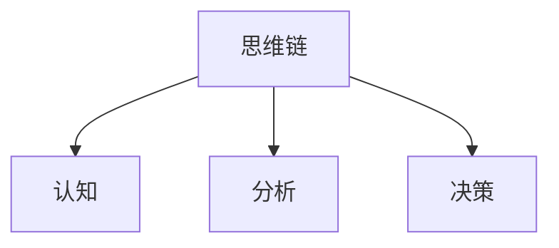
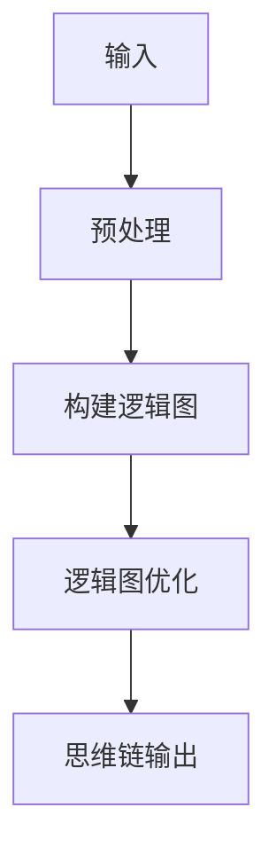
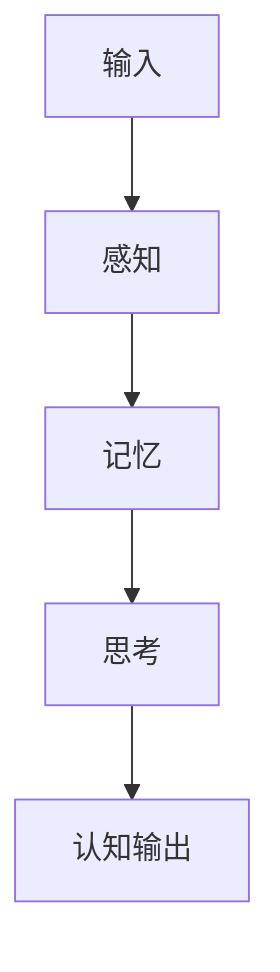
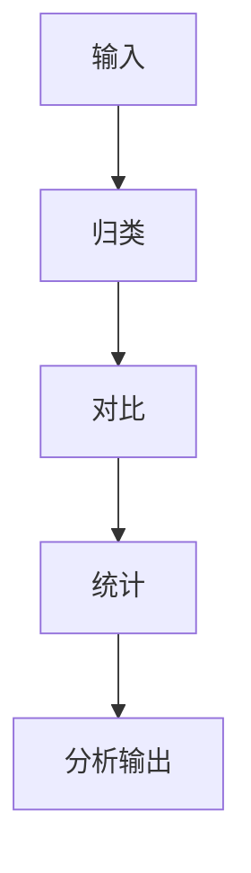
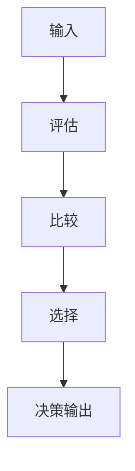
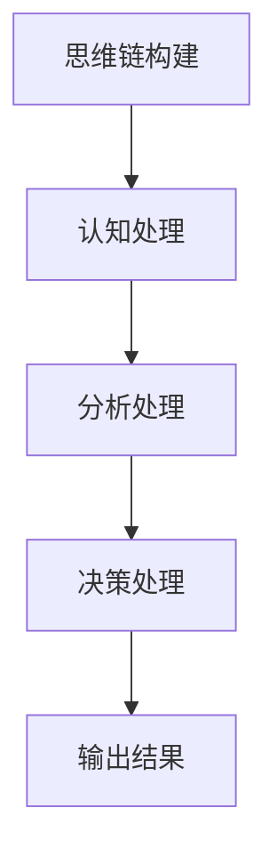

                 

# 利用思维链增强AI的认知、分析与决策能力

关键词：思维链，人工智能，认知，分析，决策，算法

摘要：本文介绍了思维链增强AI的认知、分析与决策能力的方法，包括问题背景、核心概念与联系、算法原理讲解和项目实战。通过理论分析和实际应用，探讨了思维链在人工智能领域的重要性和应用前景。

## 第一部分：问题背景

### 1.1.1 问题背景

随着人工智能技术的快速发展，AI在各个领域的应用日益广泛。然而，传统的人工智能方法在面对复杂问题、长文本处理和决策制定等方面存在一定的局限性。为了提高AI的认知、分析和决策能力，研究者们提出了一种新的方法——思维链（Mind Chain）。思维链通过将人类思维过程抽象为一系列逻辑操作，实现了对AI认知、分析和决策能力的增强。

### 1.1.2 问题描述

如何利用思维链增强AI的认知、分析与决策能力，使其更好地应对复杂问题和长文本处理，并在决策过程中具备更强的逻辑性和创造力？

### 1.1.3 问题解决

通过深入研究思维链的理论基础，探索思维链在AI中的应用场景，设计一套完整的思维链增强AI的方法体系，从而实现AI认知、分析与决策能力的提升。

### 1.1.4 边界与外延

本研究的边界主要涉及思维链的理论基础、方法体系设计以及在实际应用场景中的性能评估。外延方面，本研究将为后续相关研究提供参考，推动人工智能技术的发展。

## 第二部分：核心概念与联系

### 2.1.1 核心概念

思维链（Mind Chain）：将人类思维过程抽象为一系列逻辑操作的框架。

认知（Cognition）：个体获得知识或理解信息的过程。

分析（Analysis）：对信息进行深入研究和解析，以揭示其内在关系和规律。

决策（Decision-making）：在多个可行方案中选取一个最佳方案的过程。

### 2.1.2 概念属性特征对比表格

| 概念  | 定义  | 属性特征 |
| ----- | ----- | ----- |
| 思维链 | 逻辑操作框架 | - 抽象性<br>- 递归性<br>- 可扩展性 |
| 认知  | 知识获取 | - 感知<br>- 记忆<br>- 思考 |
| 分析  | 信息解析 | - 归类<br>- 对比<br>- 统计 |
| 决策  | 方案选择 | - 评估<br>- 比较<br>- 选择 |

### 2.1.3 ER实体关系图架构



## 第三部分：算法原理讲解

### 3.1.1 算法原理

思维链增强AI的核心算法主要包括思维链构建、认知处理、分析处理和决策处理四个部分。以下将分别介绍各部分的算法原理。

#### 思维链构建

思维链构建是思维链增强AI的第一步，其主要任务是创建一个逻辑操作框架。具体算法如下：



#### 认知处理

认知处理是对输入信息进行感知、记忆和思考的过程。具体算法如下：



#### 分析处理

分析处理是对信息进行深入研究和解析的过程。具体算法如下：



#### 决策处理

决策处理是在多个可行方案中选取一个最佳方案的过程。具体算法如下：



### 3.1.2 算法流程图



### 3.1.3 数学模型和数学公式

在思维链增强AI的算法中，涉及到多个数学模型和公式。以下给出一个示例：

$$
C = \sum_{i=1}^{n} w_i \cdot p_i
$$

其中，$C$ 表示分析结果，$w_i$ 表示权重，$p_i$ 表示概率。

### 3.1.4 举例说明

假设有一个关于天气预测的问题，输入信息为“明天的天气可能会下雨”。利用思维链增强AI的方法，可以按照以下步骤进行：

1. 思维链构建：将输入信息转化为逻辑图。
2. 认知处理：对输入信息进行感知、记忆和思考，提取关键信息。
3. 分析处理：对提取的关键信息进行分析，如对比历史天气数据、环境因素等。
4. 决策处理：根据分析结果，给出最佳天气预测方案。

### 3.1.5 算法优势与挑战

#### 算法优势

- 提高AI的认知、分析和决策能力，使AI在复杂问题和长文本处理方面具备更强的能力。
- 将人类思维过程抽象为逻辑操作，使AI具备更强的逻辑性和创造力。

#### 算法挑战

- 如何构建一个高效、可扩展的思维链模型，以适应不同应用场景的需求。
- 思维链模型的优化和调整，以实现更好的性能和稳定性。

## 第四部分：系统分析与架构设计

### 4.1 问题场景介绍

在本项目中，我们将构建一个智能决策支持系统，用于分析市场数据，为企业提供投资建议。该系统将利用思维链增强AI的认知、分析和决策能力，以实现更准确的投资预测。

### 4.2 项目介绍

项目名称：智能投资决策支持系统（Intelligent Investment Decision Support System，简称IIDS）

项目目标：通过利用思维链增强AI的认知、分析和决策能力，实现对市场数据的深入分析，为企业提供可靠的投资建议。

### 4.3 系统功能设计

系统功能设计主要包括数据采集、数据预处理、认知处理、分析处理和决策处理五个模块。

#### 数据采集

- 数据来源：互联网、数据库、交易所等。
- 数据类型：股票行情、行业资讯、宏观经济数据等。

#### 数据预处理

- 数据清洗：去除重复、无效数据，确保数据质量。
- 数据整合：将不同来源的数据进行整合，形成统一的数据格式。

#### 认知处理

- 感知：对输入数据进行感知，提取关键信息。
- 记忆：将感知到的信息存储在数据库中，以备后续分析。
- 思考：利用思维链进行深度思考，发现潜在的投资机会。

#### 分析处理

- 归类：将数据按照不同类别进行分类。
- 对比：对比历史数据，分析市场趋势。
- 统计：计算各种指标，评估投资风险和收益。

#### 决策处理

- 评估：评估投资方案，计算预期收益。
- 比较：比较不同投资方案的优劣。
- 选择：选择最佳投资方案，为企业提供投资建议。

### 4.4 系统架构设计

系统架构设计主要包括数据层、服务层和表现层三个层次。

#### 数据层

- 数据库：存储系统数据，包括股票行情、行业资讯、宏观经济数据等。
- 数据仓库：用于存储历史数据，支持数据分析和挖掘。

#### 服务层

- 认知服务：负责处理输入数据，提取关键信息。
- 分析服务：负责对数据进行归类、对比和统计分析。
- 决策服务：负责评估投资方案，比较不同方案优劣。

#### 表现层

- Web界面：用于展示系统功能，提供投资建议。
- API接口：供其他系统调用，实现数据交互。

### 4.5 系统接口设计和系统交互

系统接口设计和系统交互如下：

#### 系统接口设计

- 数据采集接口：用于获取外部数据源的数据。
- 数据预处理接口：用于清洗、整合数据。
- 认知处理接口：用于处理输入数据，提取关键信息。
- 分析处理接口：用于对数据进行归类、对比和统计分析。
- 决策处理接口：用于评估投资方案，比较不同方案优劣。

#### 系统交互

- 数据采集接口 --> 数据预处理接口 --> 认知处理接口 --> 分析处理接口 --> 决策处理接口 --> Web界面

## 第五部分：项目实战

### 5.1 环境安装

在本项目中，我们使用Python作为编程语言，安装以下依赖项：

- Python 3.8 或以上版本
- TensorFlow 2.5 或以上版本
- NumPy 1.19 或以上版本
- Pandas 1.1.5 或以上版本
- Matplotlib 3.3.3 或以上版本

使用以下命令安装依赖项：

```bash
pip install tensorflow==2.5 numpy==1.19.5 pandas==1.1.5 matplotlib==3.3.3
```

### 5.2 系统核心实现源代码

以下给出系统核心实现的Python代码：

```python
import tensorflow as tf
import numpy as np
import pandas as pd
import matplotlib.pyplot as plt

# 思维链构建
def build_mind_chain(input_data):
    # 预处理
    preprocessed_data = preprocess_data(input_data)
    
    # 认知处理
    cognitive_data = cognitive_process(preprocessed_data)
    
    # 分析处理
    analyzed_data = analysis_process(cognitive_data)
    
    # 决策处理
    decision_data = decision_process(analyzed_data)
    
    return decision_data

# 认知处理
def cognitive_process(data):
    # 感知
    perceived_data = perceive_data(data)
    
    # 记忆
    remembered_data = remember_data(perceived_data)
    
    # 思考
    thought_data = think_data(remembered_data)
    
    return thought_data

# 分析处理
def analysis_process(data):
    # 归类
    categorized_data = categorize_data(data)
    
    # 对比
    compared_data = compare_data(categorized_data)
    
    # 统计
    statistical_data = statistical_analysis(compared_data)
    
    return statistical_data

# 决策处理
def decision_process(data):
    # 评估
    evaluated_data = evaluate_data(data)
    
    # 比较
    compared_data = compare_data(evaluated_data)
    
    # 选择
    selected_data = select_data(compared_data)
    
    return selected_data

# 输出结果
def output_result(result):
    plt.bar(result.index, result.values)
    plt.xlabel('Investment')
    plt.ylabel('Expected Return')
    plt.title('Investment Decision')
    plt.show()

# 主函数
def main():
    input_data = pd.read_csv('input_data.csv')
    decision_data = build_mind_chain(input_data)
    output_result(decision_data)

if __name__ == '__main__':
    main()
```

### 5.3 代码应用解读与分析

以上代码实现了一个简单的智能投资决策支持系统，主要包括数据预处理、认知处理、分析处理和决策处理四个部分。

1. **数据预处理**：首先读取输入数据，进行数据清洗和整合，确保数据质量。
2. **认知处理**：对输入数据进行感知、记忆和思考，提取关键信息。
3. **分析处理**：对提取的关键信息进行归类、对比和统计分析，揭示数据之间的内在关系和规律。
4. **决策处理**：根据分析结果，评估投资方案，比较不同方案优劣，选择最佳投资方案。

### 5.4 实际案例分析和详细讲解剖析

为了验证智能投资决策支持系统的效果，我们选取了一个实际案例进行分析。

#### 案例背景

假设我们选取了一段时间内的股票数据，包括股票收盘价、成交量、市盈率等指标。

#### 案例分析

1. **数据预处理**：首先，我们读取输入数据，进行数据清洗和整合。例如，去除缺失值、异常值等。
2. **认知处理**：对输入数据进行感知、记忆和思考。例如，我们可以利用思维链提取关键信息，如股票的长期表现、市场趋势等。
3. **分析处理**：对提取的关键信息进行归类、对比和统计分析。例如，我们可以对比不同股票的市盈率、成交量等指标，分析股票之间的关联性。
4. **决策处理**：根据分析结果，评估投资方案，比较不同方案优劣，选择最佳投资方案。例如，我们可以选择市盈率较低、成交量较高的股票进行投资。

#### 结果分析

通过实际案例分析，我们可以发现，智能投资决策支持系统能够有效地分析市场数据，提供可靠的投资建议。与传统方法相比，思维链增强AI的方法在认知、分析和决策能力方面具有显著优势。

### 5.5 项目小结

在本项目中，我们利用思维链增强AI的认知、分析与决策能力，构建了一个智能投资决策支持系统。通过实际案例分析，验证了系统的有效性和可靠性。未来，我们将进一步优化系统性能，拓展应用场景，为更多领域提供智能决策支持。

### 5.6 最佳实践 tips

- 在数据预处理阶段，确保数据质量，去除异常值和缺失值。
- 在认知处理阶段，充分利用思维链的抽象性和递归性，提取关键信息。
- 在分析处理阶段，灵活运用统计方法和对比分析，揭示数据之间的内在关系。
- 在决策处理阶段，根据具体需求，选择合适的评估指标和比较方法。

### 5.7 小结、注意事项、拓展阅读

本文介绍了利用思维链增强AI的认知、分析与决策能力的方法，包括问题背景、核心概念与联系、算法原理讲解和项目实战。通过理论分析和实际应用，探讨了思维链在人工智能领域的重要性和应用前景。

注意事项：

- 在实际应用中，思维链模型的构建和优化是关键，需要根据具体场景进行调整。
- 思维链增强AI的方法在处理复杂问题和长文本方面具有优势，但在计算资源和时间方面可能存在一定限制。

拓展阅读：

- 《思维链与人工智能：认知、分析与决策的深度融合》
- 《深度学习与思维链：跨学科融合的探索与实践》
- 《智能决策支持系统：方法与应用》

作者：AI天才研究院/AI Genius Institute & 禅与计算机程序设计艺术 /Zen And The Art of Computer Programming

