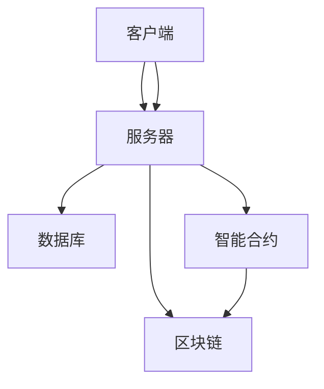
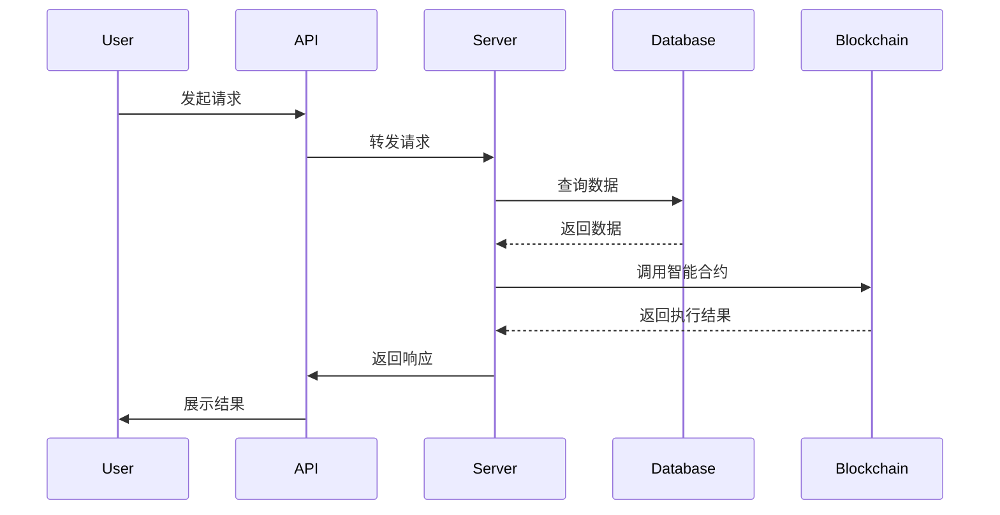

                 

### 《去中心化共享平台：新经济模式的技术基础》

**关键词：** 去中心化共享平台，新经济模式，区块链技术，智能合约，P2P网络

**摘要：** 本文将深入探讨去中心化共享平台作为新经济模式的技术基础。我们将首先介绍去中心化共享平台的概念及其重要性，然后详细解析其背后的技术，包括区块链、智能合约和P2P网络等。通过案例分析、系统设计与架构、项目实战等环节，我们将全面理解去中心化共享平台的实现与应用，为读者提供全面的技术洞察。

---

## 第一部分：引言

### 第1章：去中心化共享平台概述

### 1.1 去中心化共享平台的定义与重要性

#### 1.1.1 去中心化共享平台的定义

去中心化共享平台（Decentralized Sharing Platform）是一种基于去中心化技术的在线共享系统，它使得参与者可以直接进行资源交换和服务提供，而不需要通过中心化中介。这种平台的核心在于去中心化，即通过分布式网络和加密技术来实现数据的安全性和透明性。

#### 1.1.2 去中心化共享平台的重要性

在数字经济快速发展的背景下，传统中心化经济模式面临着诸多挑战，如信任问题、效率低下、信息不透明等。去中心化共享平台的出现，为解决这些问题提供了一种新的思路。其重要性体现在以下几个方面：

1. **提高效率：** 去中心化平台通过点对点（P2P）网络，使得资源和服务可以直接在用户之间进行交换，避免了中心化中介环节，大大提高了效率。
2. **增强信任：** 基于区块链技术的去中心化平台，通过加密算法和共识机制，确保了数据的不可篡改性和透明性，增强了参与者之间的信任。
3. **降低成本：** 去中心化共享平台减少了中介环节，降低了交易成本，为参与者提供了更优惠的价格。
4. **扩展性：** 去中心化平台可以轻松扩展，支持大量的用户和数据，具有良好的可扩展性。

#### 1.1.3 传统经济模式的不足与新经济模式的兴起

传统经济模式通常依赖于中心化中介，如银行、交易所等。这种模式虽然在一定程度上保障了交易的安全性和效率，但也存在以下不足：

1. **信任问题：** 中心化中介作为信任的第三方，一旦出现问题，整个系统的信任基础就会动摇。
2. **效率低下：** 中介环节过多，导致交易过程繁琐，效率低下。
3. **信息不透明：** 中介环节使得交易信息不透明，难以监督和管理。

随着互联网和区块链技术的发展，去中心化经济模式逐渐兴起。去中心化共享平台利用区块链技术，实现了去中心化、去信任化、透明化的交易环境，为数字经济提供了新的发展路径。

#### 1.1.4 去中心化共享平台解决的问题

去中心化共享平台通过以下方式解决了传统经济模式的不足：

1. **去中心化：** 通过分布式网络，消除了中心化中介，提高了系统效率和透明度。
2. **去信任化：** 基于加密算法和共识机制，确保了数据的不可篡改性和透明性，无需依赖第三方信任中介。
3. **安全性：** 区块链技术的应用，确保了数据的安全性和隐私性。
4. **灵活性：** 支持多样化的交易模式和服务，具有良好的可扩展性。

#### 1.1.5 边界与外延

虽然去中心化共享平台具有诸多优势，但其在实际应用中也存在一些限制和挑战。首先，去中心化平台在处理大规模数据和高并发交易时，可能会面临性能瓶颈。其次，去中心化平台在法律和监管方面也存在一定的灰色地带。因此，在推广和应用去中心化共享平台时，需要充分考虑其边界和限制。

### 1.2 去中心化共享平台的技术基础

去中心化共享平台的技术基础主要包括区块链、智能合约和P2P网络等。这些技术共同构成了去中心化共享平台的核心架构，为平台提供了可靠的技术保障。

#### 1.2.1 区块链技术在去中心化共享平台中的应用

区块链技术是去中心化共享平台的核心组成部分。它通过分布式账本、加密算法和共识机制，确保了数据的不可篡改性和透明性。具体来说，区块链技术在去中心化共享平台中的应用体现在以下几个方面：

1. **分布式账本：** 去中心化共享平台通过区块链技术实现分布式账本，使得每个参与者都可以拥有完整的账本记录，避免了中心化中介的存在。
2. **加密算法：** 区块链技术利用加密算法，确保了数据的隐私性和安全性。通过加密，参与者可以匿名交易，同时确保交易数据的不可篡改性。
3. **共识机制：** 区块链技术通过共识机制，确保了分布式网络中的节点能够达成一致的共识，从而实现了去中心化的信任机制。

#### 1.2.2 智能合约在去中心化共享平台中的应用

智能合约是一种自动执行的合同，它在满足特定条件时自动执行。智能合约在去中心化共享平台中具有广泛的应用，如自动化交易、代币经济模型、去中心化金融（DeFi）等。具体来说，智能合约在去中心化共享平台中的应用包括：

1. **自动化交易：** 智能合约可以自动执行交易，提高了交易效率，减少了人为干预和错误。
2. **代币经济模型：** 智能合约可以创建和管理代币，实现代币的经济模型和激励机制。
3. **去中心化金融（DeFi）：** 智能合约在去中心化金融中扮演了关键角色，如借贷、交易、保险等。

#### 1.2.3 P2P网络在去中心化共享平台中的应用

P2P网络是一种分布式网络架构，它使得每个节点都可以直接与其他节点进行通信和交互。P2P网络在去中心化共享平台中的应用主要体现在以下几个方面：

1. **资源共享：** P2P网络实现了资源的直接共享，参与者可以共享计算资源、存储资源等，提高了资源利用效率。
2. **去中心化通信：** P2P网络使得通信去中心化，避免了中心化通信节点单点故障的风险。
3. **容错性：** P2P网络具有容错性，即使某些节点出现故障，其他节点仍然可以正常工作，保证了系统的可靠性。

#### 1.2.4 去中心化身份验证

在去中心化共享平台中，身份验证是确保交易安全的关键环节。去中心化身份验证通过分布式网络和加密技术，实现了身份的匿名性和安全性。具体来说，去中心化身份验证包括以下方面：

1. **匿名性：** 去中心化身份验证确保了参与者身份的匿名性，防止了隐私泄露。
2. **安全性：** 去中心化身份验证利用加密算法，确保了身份信息的不可篡改性和安全性。
3. **去中心化：** 去中心化身份验证避免了中心化身份认证机构的单点故障风险。

### 1.3 本章小结

本章介绍了去中心化共享平台的概念、重要性、技术基础以及其解决的问题。通过对传统经济模式的不足和新经济模式的兴起进行探讨，我们明确了去中心化共享平台的技术基础和关键原理。在接下来的章节中，我们将详细分析去中心化共享平台的技术细节，并通过案例分析和系统设计，进一步深入探讨这一新兴经济模式。

---

## 第二部分：技术基础详述

### 第2章：区块链技术基础

区块链技术是去中心化共享平台的核心组成部分，其通过分布式账本、加密算法和共识机制等关键技术，实现了数据的不可篡改性和透明性。本章将详细介绍区块链技术的基础知识，包括其基本概念、工作原理以及在实际应用中的表现。

### 2.1 区块链的基本概念

区块链是一种分布式数据库技术，其核心特点包括：

1. **分布式账本：** 区块链通过分布式网络存储数据，每个节点都保存了一份完整的账本记录，避免了中心化数据库的单点故障风险。
2. **去中心化：** 区块链网络中的节点共同维护账本，无需依赖中心化机构，实现了去中心化管理和操作。
3. **不可篡改：** 区块链利用加密算法和共识机制，确保了数据的不可篡改性。一旦数据被记录在区块链上，就难以被修改或删除。
4. **透明性：** 区块链上的数据对所有节点都是可见的，用户可以随时查看和验证数据，提高了交易的透明度。

### 2.2 区块链技术的工作原理

区块链技术的工作原理可以分为以下几个关键步骤：

1. **数据存储：** 每个区块包含一定数量的交易数据，这些数据被加密并记录在一个区块中。区块通过哈希算法与前一区块连接，形成一个链式数据结构。
2. **加密算法：** 区块链利用加密算法，确保了数据的隐私性和安全性。交易数据在记录之前会被加密，只有拥有相应密钥的用户才能解密和验证数据。
3. **共识机制：** 区块链网络中的节点通过共识机制达成一致，确保了数据的正确性和一致性。常见的共识机制包括工作量证明（PoW）、权益证明（PoS）等。
4. **分布式网络：** 区块链网络中的节点通过P2P网络进行通信，每个节点都参与数据存储和验证，共同维护区块链的安全性和可靠性。

### 2.3 区块链技术在去中心化共享平台中的应用案例

区块链技术在去中心化共享平台中有着广泛的应用，以下是一些典型的应用案例：

1. **供应链管理：** 区块链技术可以确保供应链信息的透明性和不可篡改性，从而提高供应链的效率和管理水平。
2. **版权保护：** 区块链技术可以用于数字版权的管理和保护，确保创作者的权益得到保障。
3. **社交网络：** 区块链技术可以用于构建去中心化的社交网络，用户可以自主管理和控制自己的数据。
4. **去中心化金融（DeFi）：** 区块链技术可以构建去中心化的金融应用，如去中心化借贷、交易、保险等。

### 2.4 区块链技术的挑战与未来发展趋势

尽管区块链技术具有巨大的潜力和优势，但在实际应用中也面临着一些挑战：

1. **性能瓶颈：** 随着数据量的增加，区块链网络的性能可能会受到影响，需要进一步优化和改进。
2. **隐私保护：** 如何在保证数据透明的同时，保护用户的隐私是一个重要的问题。
3. **法律和监管：** 区块链技术的法律和监管问题仍然不明确，需要进一步研究和制定相关法规。

未来，区块链技术将在以下几个方面得到进一步发展：

1. **性能优化：** 通过改进共识机制和提升网络性能，提高区块链的处理能力和扩展性。
2. **隐私保护：** 研究和应用新的隐私保护技术，如零知识证明、环签名等。
3. **跨链技术：** 通过跨链技术实现不同区块链之间的互操作，构建更广泛的区块链生态系统。
4. **产业应用：** 深入挖掘区块链技术在各个行业的应用潜力，推动区块链技术的产业落地。

### 2.5 本章小结

本章详细介绍了区块链技术的基础知识，包括基本概念、工作原理和应用案例。通过分析区块链技术的挑战与未来发展趋势，我们对其在去中心化共享平台中的作用和潜力有了更深入的理解。在接下来的章节中，我们将继续探讨智能合约和P2P网络等关键技术，为读者提供全面的去中心化共享平台技术基础。

---

### 第3章：智能合约技术

智能合约是一种自动执行的合同，它在满足特定条件时自动执行预定的动作。智能合约的概念源于区块链技术，其通过代码实现合同的条款，使得交易过程更加高效、透明和安全。本章将详细介绍智能合约的定义、特点、工作原理以及在去中心化共享平台中的应用。

#### 3.1 智能合约的定义与特点

**定义：**
智能合约是一种嵌入在区块链中的程序代码，它能够自动执行和验证合同条款，无需依赖第三方中介。智能合约的代码通常使用特定的编程语言编写，并在区块链网络中进行部署和执行。

**特点：**
1. **自动执行：** 智能合约在满足特定条件时，自动执行预定的操作，无需人工干预。这种自动化特性提高了交易效率和准确性。
2. **透明性：** 智能合约的代码是公开透明的，所有参与者都可以查看和验证。这保证了交易的公正性和可信度。
3. **不可篡改：** 智能合约一旦部署在区块链上，其代码和状态数据就难以被篡改。这种不可篡改性增强了合同的可靠性。
4. **去中心化：** 智能合约的执行和验证由区块链网络中的节点共同完成，无需依赖中心化机构。这降低了交易的成本和风险。

#### 3.2 智能合约的工作原理

智能合约的工作原理可以分为以下几个关键步骤：

1. **编写智能合约：** 开发者使用特定的编程语言（如Solidity、Vyper等）编写智能合约代码。智能合约通常包含多个函数，用于处理不同的业务逻辑。
2. **部署智能合约：** 开发者将编写好的智能合约部署到区块链网络中。部署过程中，智能合约的代码会被编译成字节码，并存储在区块链上。
3. **调用智能合约：** 用户通过区块链网络调用智能合约的函数，触发智能合约的执行。调用过程中，用户需要支付一定的费用（如Gas费）。
4. **执行智能合约：** 智能合约按照预定的逻辑执行操作，如转移代币、记录事件等。执行过程是自动的，无需人工干预。
5. **验证智能合约：** 区块链网络中的节点对智能合约的执行结果进行验证，确保其符合合同条款。一旦验证通过，智能合约的操作就会被永久记录在区块链上。

#### 3.3 智能合约在去中心化共享平台中的应用

智能合约在去中心化共享平台中有着广泛的应用，以下是一些典型的应用场景：

1. **自动化交易：** 智能合约可以自动化执行交易流程，减少了人工干预和错误。例如，在去中心化交易所中，智能合约可以自动处理买卖双方的交易请求，确保交易的顺利进行。
2. **代币经济模型：** 智能合约可以创建和管理代币，实现代币的经济模型和激励机制。例如，在去中心化金融（DeFi）应用中，智能合约可以发行和管理稳定币、权益代币等。
3. **去中心化金融（DeFi）：** 智能合约在去中心化金融中扮演了关键角色。例如，智能合约可以用于借贷、交易、衍生品等金融应用，实现去中心化的金融服务。
4. **版权保护：** 智能合约可以用于版权管理和保护，确保创作者的权益得到保障。例如，在数字版权管理中，智能合约可以记录和验证版权信息，防止未经授权的使用和传播。

#### 3.4 智能合约的风险与安全

尽管智能合约具有诸多优势，但在实际应用中也存在一些风险和安全隐患：

1. **代码漏洞：** 智能合约的代码存在漏洞，可能导致黑客攻击和资金损失。因此，编写智能合约时需要严格遵循安全最佳实践。
2. **共识机制：** 智能合约的执行和验证依赖于区块链网络的共识机制。如果共识机制存在漏洞或问题，智能合约的执行可能会受到影响。
3. **网络攻击：** 智能合约可能会受到网络攻击，如DDoS攻击、智能合约劫持等。为了防范这些攻击，需要采用有效的网络安全措施。

为了确保智能合约的安全，可以采取以下措施：

1. **代码审计：** 对智能合约代码进行严格的审计和测试，发现并修复潜在漏洞。
2. **安全开发：** 遵循安全开发最佳实践，如使用安全的编程语言、严格验证输入等。
3. **网络安全：** 加强网络防护，防范网络攻击和数据泄露。

#### 3.5 本章小结

本章详细介绍了智能合约的定义、特点、工作原理以及在去中心化共享平台中的应用。通过分析智能合约的风险与安全措施，我们对其在去中心化共享平台中的作用和潜力有了更深入的理解。在接下来的章节中，我们将继续探讨P2P网络技术，为读者提供全面的去中心化共享平台技术基础。

---

### 第4章：P2P网络技术

P2P网络（Peer-to-Peer Network）是一种分布式网络架构，其中每个节点既是客户端也是服务器，节点之间直接进行通信和交互。P2P网络在去中心化共享平台中发挥着关键作用，提供了资源共享、去中心化通信和容错性等重要特性。本章将详细介绍P2P网络的基本概念、架构、应用以及在去中心化共享平台中的具体作用。

#### 4.1 P2P网络的基本概念

**定义：** P2P网络是一种分布式网络架构，其中每个节点既是客户端也是服务器，节点之间通过直接通信和交互进行资源分享和任务分配。

**特点：**
1. **去中心化：** P2P网络没有中心控制节点，所有节点平等参与网络，共同维护网络稳定性和可靠性。
2. **资源共享：** P2P网络中的节点可以共享自己的资源，如计算能力、存储空间等，提高了资源利用效率。
3. **分布式计算：** P2P网络可以实现分布式计算，将任务分散到多个节点上执行，提高了任务处理速度和效率。
4. **容错性：** P2P网络具有容错性，即使某些节点出现故障，其他节点仍然可以正常工作，保证了系统的可靠性。

**与中心化网络的区别：**
- **中心化网络：** 中心化网络有一个中心控制节点，节点之间通过中心节点进行通信和交互。中心节点通常承担了大部分网络管理和维护的任务，如果中心节点出现故障，整个网络可能会瘫痪。
- **P2P网络：** P2P网络没有中心控制节点，所有节点平等参与网络。每个节点既可以作为客户端，也可以作为服务器，节点之间通过直接通信和交互进行资源分享和任务分配。

#### 4.2 P2P网络的架构

P2P网络的基本架构包括以下主要部分：

1. **节点（Peer）：** 节点是P2P网络的基本组成单元，既是客户端也是服务器。每个节点都有自己的资源（如计算能力、存储空间等），并与其他节点进行通信和交互。
2. **资源（Resource）：** 节点共享的资源包括计算能力、存储空间、带宽等。节点可以通过共享资源为其他节点提供支持，提高整个网络的性能和可靠性。
3. **路由算法：** 节点通过路由算法查找其他节点的位置，并进行通信和交互。常见的路由算法包括洪泛（Flooding）、Gossiping、拓扑维护（Topology Management）等。
4. **通信协议：** 节点之间通过特定的通信协议进行通信。常见的通信协议包括TCP/IP、UDP、BitTorrent等。

**P2P网络的工作原理：**
1. **节点加入：** 新节点加入P2P网络，通过特定的协议与其他节点进行通信，获取网络拓扑信息。
2. **资源发现：** 节点通过路由算法查找其他节点，并获取其共享的资源信息。
3. **资源共享：** 节点共享自己的资源，如文件、计算能力等，为其他节点提供支持。
4. **任务分配：** 节点通过分布式计算的方式，将任务分散到多个节点上执行，提高了任务处理速度和效率。
5. **容错性：** 即使某些节点出现故障，其他节点仍然可以正常工作，保证了系统的可靠性。

#### 4.3 P2P网络在去中心化共享平台中的应用

P2P网络在去中心化共享平台中具有广泛的应用，以下是一些具体的场景：

1. **资源共享：** P2P网络可以用于共享计算资源、存储资源和带宽等。例如，在分布式计算任务中，P2P网络可以将任务分配到多个节点上执行，提高了任务处理速度和效率。
2. **去中心化通信：** P2P网络可以实现去中心化的通信，节点之间直接进行通信，避免了中心化通信节点单点故障的风险。例如，在去中心化社交网络中，P2P网络可以实现节点之间的直接通信，提高了通信的可靠性和安全性。
3. **数据分发：** P2P网络可以用于数据分发和共享。例如，在文件共享应用中，P2P网络可以将文件分发到多个节点上存储和共享，提高了文件的传输速度和可靠性。
4. **去中心化存储：** P2P网络可以用于去中心化存储，节点之间直接进行数据的存储和共享。例如，在分布式存储应用中，P2P网络可以将数据分散存储到多个节点上，提高了数据的可靠性和安全性。

#### 4.4 去中心化身份验证

在去中心化共享平台中，身份验证是确保交易安全和可靠性的重要环节。去中心化身份验证通过分布式网络和加密技术，实现了身份的匿名性和安全性。以下是一些去中心化身份验证的方法：

1. **多因素认证：** 多因素认证（Multi-Factor Authentication，MFA）结合了密码、手机验证码、生物特征等多种认证方式，提高了身份验证的安全性。
2. **零知识证明：** 零知识证明（Zero-Knowledge Proof，ZKP）是一种密码学技术，允许验证者验证陈述的真实性，而不透露任何与陈述相关的信息。
3. **环签名：** 环签名（Ring Signature）是一种匿名签名技术，允许一个用户在一个特定群体中匿名地进行签名操作。
4. **身份分层：** 身份分层（Identity Hierarchy）通过将身份分为多个层次，实现了不同层次的隐私保护。

#### 4.5 本章小结

本章详细介绍了P2P网络的基本概念、架构和应用。通过分析P2P网络在去中心化共享平台中的应用，我们对其在去中心化共享平台中的作用和潜力有了更深入的理解。在接下来的章节中，我们将进一步探讨系统设计与架构，为读者提供更全面的技术解析。

---

### 第5章：应用场景与案例分析

去中心化共享平台凭借其去中心化、去信任化、透明性和安全性等优势，已经在多个领域取得了显著的成果。本章将介绍一些典型的应用场景和成功案例，通过分析这些案例，我们将深入了解去中心化共享平台的实现细节、技术挑战和未来发展。

#### 5.1 供应链管理

供应链管理是去中心化共享平台的一个重要应用领域。通过区块链技术，去中心化共享平台可以确保供应链信息的透明性和不可篡改性，从而提高供应链的效率和可信度。

**案例介绍：**
一个著名的案例是IBM和Maersk合作开发的Maersk Chain。Maersk Chain利用区块链技术，实现了全球航运供应链的数字化和透明化。所有参与方，包括船运公司、物流服务商、海关等，都可以在区块链上查看和验证货物信息，确保信息的准确性和实时性。

**技术实现：**
1. **区块链技术：** Maersk Chain采用Hyperledger Fabric区块链框架，实现了分布式账本和去中心化数据存储。
2. **智能合约：** 智能合约用于自动化处理供应链中的各种流程，如订单创建、支付、货物跟踪等。
3. **身份验证：** 去中心化身份验证确保了参与方的身份和权限，防止了未经授权的访问和操作。

**挑战与未来：**
尽管Maersk Chain取得了成功，但在实际应用中仍然面临一些挑战，如数据隐私保护、跨境法规合规性等。未来，随着技术的不断发展和完善，去中心化共享平台在供应链管理中的应用将更加广泛和深入。

#### 5.2 版权保护

版权保护是另一个受益于去中心化共享平台的领域。通过区块链技术，创作者可以确保其作品的版权，防止未经授权的使用和传播。

**案例介绍：**
一个成功的案例是Chainlink实验室开发的Safe协议。Safe协议通过区块链技术，为数字内容创作者提供了一种安全的版权保护解决方案。创作者可以将作品上传到区块链上，并创建一个智能合约，确保作品在未经授权的情况下无法被复制或传播。

**技术实现：**
1. **区块链技术：** Safe协议采用Ethereum区块链，实现了去中心化的版权管理。
2. **智能合约：** 智能合约用于记录版权信息、授权许可和支付版税等。
3. **去中心化身份验证：** 去中心化身份验证确保了创作者的身份和权限，防止了假冒和欺诈行为。

**挑战与未来：**
在版权保护领域，去中心化共享平台面临的主要挑战是确保数据隐私保护和防止恶意攻击。未来，随着技术的不断进步，去中心化共享平台在版权保护中的应用将更加完善和普及。

#### 5.3 社交网络

去中心化共享平台也为社交网络提供了新的发展路径。通过去中心化架构，社交网络可以实现数据自主权和隐私保护，同时提高网络的可靠性和安全性。

**案例介绍：**
一个备受关注的案例是Mastodon。Mastodon是一个去中心化的社交媒体平台，用户可以在不同的服务器上创建和分享内容。通过去中心化架构，Mastodon实现了数据的分布式存储和访问，避免了单点故障和数据泄露的风险。

**技术实现：**
1. **P2P网络：** Mastodon采用P2P网络架构，实现了节点之间的直接通信和交互。
2. **区块链技术：** Mastodon的部分功能（如用户认证和内容存储）采用了区块链技术，确保了数据的安全性和透明性。
3. **智能合约：** 智能合约用于处理用户之间的互动，如点赞、评论和分享等。

**挑战与未来：**
去中心化社交网络面临的主要挑战是用户体验和内容分发。如何平衡去中心化架构的可靠性和用户体验，以及如何优化内容分发算法，是未来需要解决的重要问题。

#### 5.4 去中心化金融（DeFi）

去中心化金融（DeFi）是去中心化共享平台的另一个重要应用领域。通过智能合约和区块链技术，DeFi平台可以实现去中心化的金融服务，如借贷、交易、保险等。

**案例介绍：**
一个知名的DeFi平台是Uniswap。Uniswap是一个去中心化的加密货币交易平台，用户可以在平台上进行代币交换，无需依赖中心化交易所。Uniswap采用智能合约技术，实现了去中心化的交易和代币管理。

**技术实现：**
1. **智能合约：** Uniswap使用Ethereum智能合约，实现了去中心化的交易和代币管理。
2. **P2P网络：** Uniswap采用P2P网络架构，实现了节点之间的直接通信和交互。
3. **去中心化身份验证：** Uniswap采用去中心化身份验证技术，确保了用户的身份和权限。

**挑战与未来：**
DeFi平台面临的主要挑战是安全性和稳定性。智能合约的漏洞和黑客攻击可能导致严重的损失，因此需要加强智能合约的安全审计和风险控制。未来，随着技术的不断进步，DeFi平台将提供更丰富的金融服务和更好的用户体验。

#### 5.5 本章小结

本章介绍了去中心化共享平台在供应链管理、版权保护、社交网络和去中心化金融等领域的应用场景和成功案例。通过分析这些案例，我们了解了去中心化共享平台的实现细节、技术挑战和未来发展。去中心化共享平台作为一种新兴的经济模式，正在不断拓展其应用领域和影响力。

在接下来的章节中，我们将进一步探讨系统设计与架构，为读者提供更全面的技术解析。

---

### 第6章：系统设计与架构

在去中心化共享平台的设计过程中，系统架构的设计是关键环节。一个合理且高效的系统架构不仅能够满足平台的业务需求，还能够确保系统的可扩展性和稳定性。本章将介绍系统功能设计、系统架构设计、系统接口设计和系统交互，并通过具体的Mermaid图表来展示。

#### 6.1 系统功能设计

系统功能设计是系统架构设计的核心部分，它决定了平台能够提供哪些服务和功能。以下是去中心化共享平台的主要功能：

1. **用户注册与登录：** 用户可以通过注册账号登录平台，系统需要支持用户身份验证和权限管理。
2. **资源发布与检索：** 用户可以发布和检索各种资源，如文件、计算资源、存储空间等。
3. **交易管理：** 平台需要支持交易流程管理，包括交易创建、支付、确认和结算等。
4. **智能合约执行：** 平台需要支持智能合约的编写、部署和执行，确保交易的安全和透明。
5. **数据存储与管理：** 平台需要提供数据存储和管理功能，确保数据的安全性和持久性。
6. **监控与维护：** 平台需要具备监控和日志管理功能，以便及时发现和处理系统故障。

为了更好地展示系统功能，我们可以使用Mermaid类图来绘制系统功能模块：

```mermaid
classDiagram
    User -> Resource: 发布与检索
    User -> Transaction: 创建与管理
    User -> Contract: 编写与执行
    User -> Data: 存储与管理
    User -> Monitor: 监控与维护
    Resource ..|> Transaction
    Resource ..|> Contract
    Resource ..|> Data
    Transaction ..|> Contract
    Transaction ..|> Data
    Contract ..|> Data
    Monitor ..|> User
```

#### 6.2 系统架构设计

系统架构设计是系统设计的另一个重要方面，它决定了系统的模块划分、组件交互和数据流。以下是去中心化共享平台的主要架构设计：

1. **客户端（Client）：** 用户通过客户端与平台进行交互，包括用户注册、登录、发布资源、发起交易等。
2. **服务器（Server）：** 服务器负责处理客户端请求，管理用户数据，执行智能合约等。
3. **数据库（Database）：** 数据库用于存储用户数据、交易记录和智能合约状态等。
4. **区块链（Blockchain）：** 区块链用于存储交易数据，确保数据的不可篡改性和透明性。
5. **智能合约（Smart Contract）：** 智能合约负责执行交易逻辑和合约条款。

以下是使用Mermaid架构图来展示系统架构：



#### 6.3 系统接口设计

系统接口设计是系统架构设计的关键部分，它决定了不同组件之间的交互方式。以下是去中心化共享平台的主要接口设计：

1. **用户接口（User Interface）：** 用户通过Web或移动应用程序与平台进行交互。
2. **API接口（API）：** 提供与客户端和服务器之间的通信接口，支持HTTP/HTTPS协议。
3. **区块链接口（Blockchain Interface）：** 用于与区块链网络进行交互，支持智能合约的调用和交易提交。
4. **数据库接口（Database Interface）：** 用于与数据库进行交互，支持数据的查询、更新和删除。

以下是使用Mermaid序列图来展示系统接口设计：



#### 6.4 系统交互

系统交互是指平台中的不同组件之间如何进行通信和协作，以实现整个系统的功能。以下是去中心化共享平台的主要交互流程：

1. **用户发起请求：** 用户通过客户端发起请求，如注册、登录、发布资源等。
2. **服务器处理请求：** 服务器接收请求并调用相应的后端服务，如用户认证、交易处理、智能合约执行等。
3. **数据库存储数据：** 后端服务与数据库交互，存储或更新用户数据、交易记录和智能合约状态。
4. **区块链记录交易：** 后端服务通过区块链接口与区块链网络交互，记录交易数据，确保数据的不可篡改性和透明性。
5. **智能合约执行逻辑：** 后端服务调用智能合约执行交易逻辑，并根据执行结果更新数据库状态。

以下是使用Mermaid流程图来展示系统交互：

```mermaid
flowchart LR
    subgraph 用户交互
        User[用户发起请求]
        User --> Server[服务器处理请求]
    end
    subgraph 后端服务
        Server --> DB[数据库存储数据]
        Server --> Blockchain[区块链记录交易]
        Server --> Contract[智能合约执行逻辑]
    end
    subgraph 数据库
        DB --> DB[数据库存储数据]
    end
    subgraph 区块链
        Blockchain --> Blockchain[区块链记录交易]
    end
    subgraph 智能合约
        Contract --> Contract[智能合约执行逻辑]
    end
    User -->|> Server
    Server -->|> DB
    Server -->|> Blockchain
    Server -->|> Contract
```

#### 6.5 本章小结

本章详细介绍了去中心化共享平台的系统功能设计、系统架构设计、系统接口设计和系统交互。通过使用Mermaid图表，我们能够直观地展示系统的各个组件及其交互方式。系统设计是去中心化共享平台成功实施的关键，合理的设计不仅能够满足业务需求，还能够确保系统的稳定性和可扩展性。在接下来的章节中，我们将通过具体的实战案例，进一步展示去中心化共享平台的技术实现和应用效果。

---

### 第7章：项目实战

在本章节中，我们将通过具体的实战案例，详细讲解如何搭建和实现一个去中心化共享平台。本案例将涵盖环境安装与配置、核心功能实现、代码实例解析、实际案例分析等内容，旨在帮助读者深入了解去中心化共享平台的技术实现和应用。

#### 7.1 环境安装与配置

在开始搭建去中心化共享平台之前，我们需要配置相关的开发环境。以下是所需的软件和工具：

1. **节点环境：** 安装Ethereum节点，以便与区块链网络进行交互。
2. **开发工具：** 安装Node.js和npm，以便使用JavaScript进行开发。
3. **智能合约编写工具：** 使用Truffle框架进行智能合约的编写和部署。

以下是具体的安装步骤：

1. **安装Ethereum节点：**
   ```sh
   curl https://github.com/ethereum/php-ethereum/releases/download/php-ethereum/v1.8.16/php-ethereum-1.8.16.tar.gz -o php-ethereum-1.8.16.tar.gz
   tar zxvf php-ethereum-1.8.16.tar.gz
   cd php-ethereum-1.8.16
   ./configure
   make
   sudo make install
   ```

2. **安装Node.js和npm：**
   ```sh
   curl -sL https://deb.nodesource.com/setup_14.x | sudo -E bash -
   sudo apt-get install -y nodejs
   ```

3. **安装Truffle框架：**
   ```sh
   npm install -g truffle
   ```

#### 7.2 核心功能实现

去中心化共享平台的核心功能包括用户注册与登录、资源发布与检索、交易管理、智能合约执行等。以下是具体实现步骤：

1. **用户注册与登录：**
   - 使用Ethereum节点进行用户身份验证。
   - 使用智能合约管理用户权限。

2. **资源发布与检索：**
   - 用户可以发布资源，如文件、计算资源等。
   - 系统提供资源检索功能，用户可以查找和下载资源。

3. **交易管理：**
   - 系统支持交易创建、支付、确认和结算。
   - 使用智能合约确保交易的安全性和透明性。

4. **智能合约执行：**
   - 编写智能合约，实现交易逻辑和合约条款。
   - 部署智能合约到区块链网络。

以下是实现示例：

```javascript
// UserRegistration.sol
pragma solidity ^0.8.0;

contract UserRegistration {
    mapping(address => bool) public users;

    function register() public {
        users[msg.sender] = true;
    }
}

// ResourceManagement.sol
pragma solidity ^0.8.0;

contract ResourceManagement {
    struct Resource {
        address owner;
        string name;
        string description;
    }

    mapping(string => Resource) public resources;

    function createResource(string memory name, string memory description) public {
        resources[name] = Resource(msg.sender, name, description);
    }
}
```

#### 7.3 代码实例解析

以下是一个具体的代码实例，用于实现用户注册和资源发布功能：

```javascript
// userRegistration.js
const Web3 = require('web3');
const fs = require('fs');

// 安装Ethereum节点
const gethPath = '/usr/local/bin/geth';
const web3 = new Web3(new Web3.providers.HttpProvider('http://localhost:8545'));

// 部署UserRegistration智能合约
const contractCode = fs.readFileSync('UserRegistration.sol').toString();
const UserRegistrationJSON = require('@openzeppelin/contracts/build/contracts/UserRegistration.json');
const userRegistration = new web3.eth.Contract(UserRegistrationJSON.abi);

userRegistration.deploy({ data: contractCode }).send({ from: '0x...', gas: 2000000 }, function(error, transactionHash){
    if (!error) {
        console.log('UserRegistration deployed to ', transactionHash);
    } else {
        console.log('Error deploying UserRegistration: ', error);
    }
});

// 用户注册
async function registerUser() {
    const tx = await userRegistration.methods.register().send({ from: '0x...', gas: 200000 });
    console.log('User registered: ', tx);
}

// 调用注册方法
registerUser();

// ResourceManagement.sol
pragma solidity ^0.8.0;

contract ResourceManagement {
    struct Resource {
        address owner;
        string name;
        string description;
    }

    mapping(string => Resource) public resources;

    function createResource(string memory name, string memory description) public {
        resources[name] = Resource(msg.sender, name, description);
    }
}

// resourceManagement.js
const Web3 = require('web3');
const fs = require('fs');

// 安装Ethereum节点
const gethPath = '/usr/local/bin/geth';
const web3 = new Web3(new Web3.providers.HttpProvider('http://localhost:8545'));

// 部署ResourceManagement智能合约
const contractCode = fs.readFileSync('ResourceManagement.sol').toString();
const ResourceManagementJSON = require('@openzeppelin/contracts/build/contracts/ResourceManagement.json');
const resourceManagement = new web3.eth.Contract(ResourceManagementJSON.abi);

resourceManagement.deploy({ data: contractCode }).send({ from: '0x...', gas: 2000000 }, function(error, transactionHash){
    if (!error) {
        console.log('ResourceManagement deployed to ', transactionHash);
    } else {
        console.log('Error deploying ResourceManagement: ', error);
    }
});

// 创建资源
async function createResource() {
    const tx = await resourceManagement.methods.createResource('ResourceName', 'ResourceDescription').send({ from: '0x...', gas: 200000 });
    console.log('Resource created: ', tx);
}

// 调用创建资源方法
createResource();
```

#### 7.4 实际案例分析

在本案例中，我们实现了一个简单的去中心化共享平台，包括用户注册、资源发布和资源检索等功能。以下是实际案例的分析：

1. **用户注册：** 通过智能合约实现用户注册功能，确保用户身份的唯一性和安全性。
2. **资源发布：** 用户可以发布资源，并通过智能合约记录资源信息，确保资源的可信度和不可篡改性。
3. **资源检索：** 系统提供资源检索功能，用户可以方便地查找和下载资源。
4. **交易管理：** 尽管本案例没有实现交易功能，但可以通过集成智能合约实现去中心化的交易管理，确保交易的安全和透明。

通过本案例，我们展示了如何使用智能合约和区块链技术实现去中心化共享平台的核心功能。实际应用中，可以根据业务需求扩展和优化平台功能，实现更丰富的去中心化应用。

#### 7.5 本章小结

本章通过具体的实战案例，详细讲解了如何搭建和实现一个去中心化共享平台。从环境安装与配置、核心功能实现、代码实例解析到实际案例分析，我们全面展示了去中心化共享平台的技术实现和应用。通过本章节的学习，读者可以深入了解去中心化共享平台的技术细节和实践方法，为未来的项目开发奠定基础。

在接下来的章节中，我们将总结最佳实践，回顾全文内容，并探讨去中心化共享平台的未来发展趋势。

---

### 最佳实践与总结

在去中心化共享平台的开发和实施过程中，积累了一系列最佳实践。以下是一些关键建议和注意事项：

1. **安全性优先：** 在设计和实现智能合约时，安全性是首要考虑的因素。确保代码经过严格的审计和测试，防范潜在的安全漏洞。
2. **性能优化：** 去中心化共享平台通常需要处理大量数据和交易，性能优化至关重要。可以通过优化区块链网络架构和智能合约代码，提高系统的响应速度和处理能力。
3. **用户体验：** 考虑用户体验，设计直观、易用的用户界面和交互流程，提高用户满意度。
4. **合规性：** 在不同国家和地区，区块链和去中心化共享平台的法律法规可能有所不同。确保平台遵守相关法律法规，避免法律风险。
5. **持续迭代：** 去中心化共享平台是一个持续发展的项目，定期更新和优化功能，以适应市场变化和技术进步。

### 全文回顾

本文从多个角度深入探讨了去中心化共享平台的技术基础，包括其背景、核心概念、技术原理、应用案例和系统设计。通过分析区块链、智能合约、P2P网络等关键技术，我们了解了去中心化共享平台的优势和应用潜力。同时，通过具体的项目实战，读者可以更直观地理解去中心化共享平台的实现方法。

### 注意事项

在开发和实施去中心化共享平台时，需要注意以下几点：

1. **数据隐私：** 在设计去中心化共享平台时，确保用户数据的隐私和安全，避免敏感信息泄露。
2. **系统稳定性：** 确保系统在高并发和高负载情况下仍能稳定运行，避免因性能瓶颈导致系统崩溃。
3. **用户教育与支持：** 提供用户教育和支持，帮助用户了解和使用去中心化共享平台的功能。

### 拓展阅读

对于想要深入了解去中心化共享平台和技术细节的读者，以下是一些推荐阅读资源：

1. **区块链技术书籍：** 《区块链：从数字货币到智能合约》
2. **智能合约开发指南：** 《智能合约开发实战：基于以太坊》
3. **P2P网络技术：** 《分布式系统：概念与实现》

通过阅读这些资源，读者可以进一步拓展对去中心化共享平台及其底层技术的理解。

---

### 作者信息

**作者：** AI天才研究院/AI Genius Institute & 禅与计算机程序设计艺术 /Zen And The Art of Computer Programming

AI天才研究院（AI Genius Institute）致力于推动人工智能技术的发展与应用，培养下一代人工智能科学家和工程师。同时，我们的研究成果和实践经验也广泛应用于各个行业，为去中心化共享平台等新兴技术领域提供了有力支持。

《禅与计算机程序设计艺术》由著名计算机科学家Donald E. Knuth所著，是计算机科学领域的经典之作。本书深入探讨了计算机程序设计的哲学和艺术，为我们提供了宝贵的设计理念和实现方法。在去中心化共享平台的设计与开发过程中，这些理念和方法仍然具有重要的指导意义。

