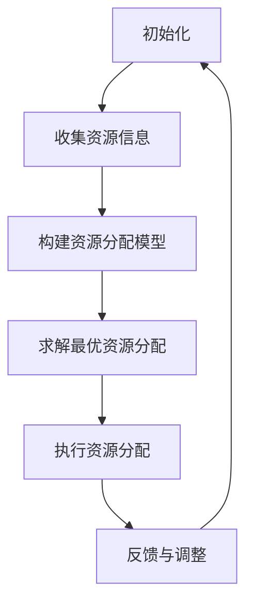
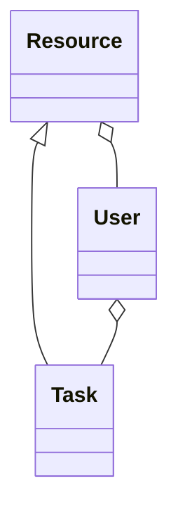
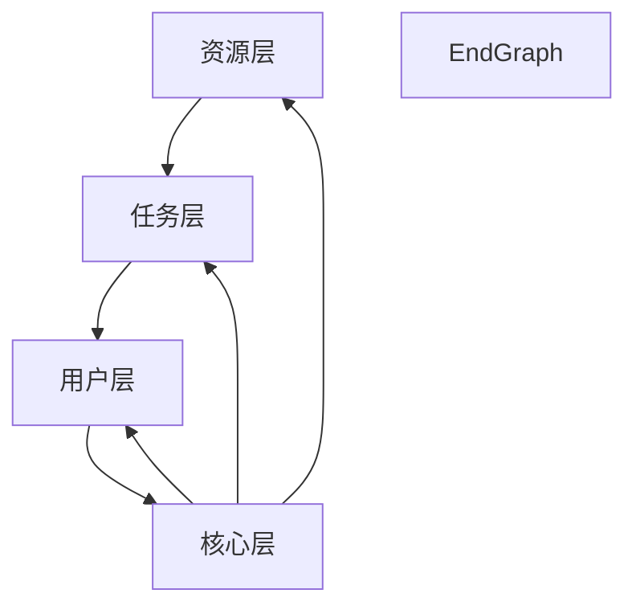
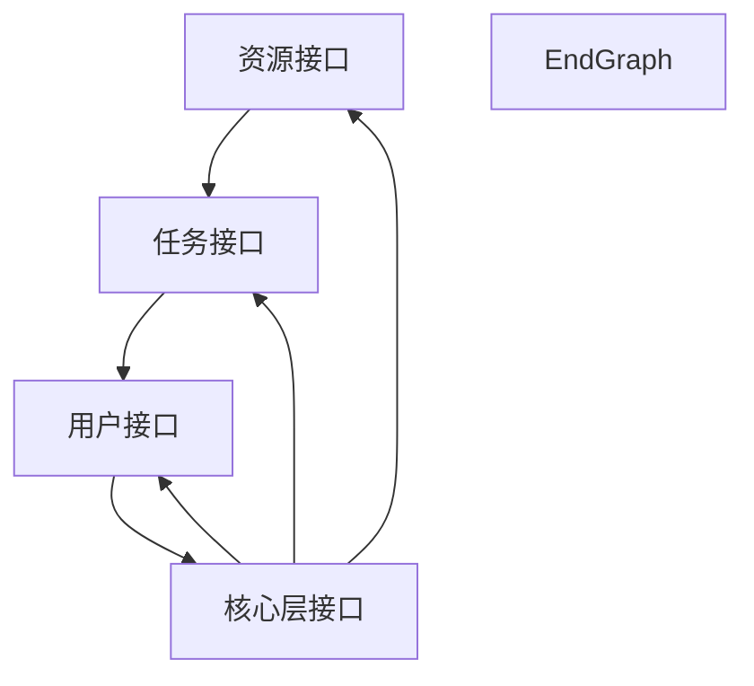

                 


# 去中心化资源配置：新共享经济的算法模型

关键词：去中心化资源配置、共享经济、算法模型、数学公式、系统架构

摘要：本文深入探讨了去中心化资源配置在共享经济中的应用，通过阐述核心概念、算法原理和数学模型，详细分析并设计了一套完整的去中心化资源配置系统。文章旨在为读者提供系统、全面的指导，帮助他们理解和应用去中心化资源配置，实现共享经济中的资源优化分配。

## 引言

随着互联网技术的飞速发展，共享经济已经成为现代经济中不可或缺的一部分。然而，传统的资源配置方法在应对共享经济中的复杂性和动态性时，往往显得力不从心。为了解决这一问题，去中心化资源配置应运而生。本文将深入探讨去中心化资源配置的核心概念、算法原理和数学模型，并设计一套适用于新共享经济的算法模型。

## 第1章：问题的背景与概述

### 1.1 问题的背景

在传统的资源配置中，资源通常由中心化的机构或企业进行管理和分配。然而，随着共享经济的兴起，资源的分配方式变得更加复杂和动态。资源的供应者和需求者往往分布在不同的地理位置，且资源的需求和供应情况不断变化。这给传统的资源配置方法带来了巨大的挑战。

### 1.2 共享经济的兴起

共享经济的核心理念是共享资源，通过提高资源的利用效率，实现资源的最大化价值。共享经济的形式多种多样，包括共享住宿、共享交通、共享办公等。这些共享模式不仅改变了人们的消费习惯，也对资源的配置提出了新的要求。

### 1.3 去中心化资源配置的重要性

去中心化资源配置能够有效地应对共享经济中的复杂性和动态性。通过分布式算法和数学模型，去中心化资源配置可以在不依赖于中心化机构的情况下，实现资源的智能分配和优化。这不仅可以提高资源的利用效率，还可以降低资源分配的成本和风险。

### 1.4 问题描述

在共享经济中，资源配置的难题主要包括：如何高效地收集和更新资源信息、如何动态地调整资源分配策略、如何平衡资源供应和需求等。这些问题不仅关系到资源的利用效率，也影响到共享经济的可持续性。

### 1.5 传统解决方案的局限性

传统的资源配置方法在应对共享经济中的复杂性和动态性时，往往存在以下局限性：

1. 信息不对称：传统方法往往依赖于中心化的数据管理，无法有效地收集和更新资源信息，导致信息不对称。
2. 成本高：传统方法需要大量的资源进行信息收集和处理，成本较高。
3. 难以动态调整：传统方法在资源需求变化时，难以快速调整资源分配策略。

### 1.6 去中心化解决方案的潜力

去中心化资源配置可以通过分布式算法和数学模型，有效地解决传统解决方案的局限性。通过分布式网络，去中心化资源配置可以实时收集和更新资源信息，实现信息的透明化和共享。同时，通过智能算法，去中心化资源配置可以动态调整资源分配策略，实现资源的优化分配。

## 第2章：去中心化资源配置的基本概念

### 2.1 去中心化网络的定义

去中心化网络（Decentralized Network）是一种无需中心化管理机构，通过分布式计算和存储技术实现网络功能和服务的网络结构。与传统的中心化网络（如互联网）相比，去中心化网络具有更高的自主性、可靠性和抗攻击性。

### 2.1.1 去中心化与中心化的对比

| 对比项 | 去中心化 | 中心化 |
| :----: | :----: | :----: |
| 网络结构 | 分布式 | 集中式 |
| 信息收集 | 自下而上 | 自上而下 |
| 信任机制 | 基于算法 | 基于权威 |
| 抗攻击性 | 高 | 低 |

### 2.1.2 去中心化网络的工作原理

去中心化网络通过分布式计算和存储技术，实现数据的分布式存储和计算。网络中的节点通过共识算法，共同维护网络的状态和信息。这种工作原理使得去中心化网络具有较高的可靠性和抗攻击性。

### 2.2 共享经济的定义与模式

共享经济（Sharing Economy）是一种基于互联网和信息技术，通过共享资源和服务的经济模式。共享经济的形式多种多样，主要包括以下几种模式：

1. **共享住宿**：如Airbnb，提供民宿租赁服务。
2. **共享交通**：如Uber、Lyft，提供出行服务。
3. **共享办公**：如WeWork，提供共享办公空间。
4. **共享金融**：如Lending Club，提供借贷服务。
5. **共享生产**：如Fabricators，提供制造服务。

### 2.2.1 共享经济的起源

共享经济的概念最早可以追溯到20世纪70年代的合作社运动。随着互联网技术的普及，共享经济在21世纪初迅速发展，并成为现代经济的重要组成部分。

### 2.2.2 共享经济的几种模式

1. **共享物品**：如共享单车、共享雨伞等。
2. **共享服务**：如共享出行、共享住宿等。
3. **共享知识**：如在线教育、知识付费等。
4. **共享劳动力**：如共享用工、兼职平台等。

### 2.3 资源配置的核心概念

资源配置（Resource Allocation）是指将有限的资源分配给最需要的地方，以实现资源的最优利用。在共享经济中，资源配置的核心概念包括：

1. **资源类型**：资源可以分为有形资源（如物品、设备）和无形资源（如知识、信息）。
2. **资源特征**：资源具有可共享性、可分性、时效性等特征。
3. **资源目标**：资源配置的目标是最大化资源利用效率，提高资源价值。
4. **资源原则**：资源配置应遵循公平、高效、可持续的原则。

## 第3章：去中心化资源配置算法原理

### 3.1 分布式算法的基本概念

分布式算法（Distributed Algorithm）是一种在分布式系统中，通过节点之间的协作实现共同任务的算法。分布式算法的核心是节点之间的信息交换和协同工作。

### 3.1.1 分布式算法的原理

分布式算法的原理主要包括：

1. **节点协作**：节点通过交换信息，共同完成任务。
2. **一致性维护**：节点通过共识算法，保持系统的状态一致性。
3. **容错性**：分布式算法能够应对节点故障，保持系统的稳定性。

### 3.1.2 分布式算法的分类

分布式算法可以分为以下几类：

1. **基于时间同步的算法**：如轮询算法、时钟同步算法。
2. **基于事件触发的算法**：如事件驱动算法、消息传递算法。
3. **基于概率的算法**：如随机算法、蒙特卡罗算法。

### 3.2 常见的去中心化资源配置算法

在去中心化资源配置中，常用的算法包括：

1. **拍卖算法**：如VCG算法、GSP算法。
2. **分配算法**：如 greedy 算法、迭代分配算法。
3. **优化算法**：如线性规划、动态规划。

### 3.2.1 调度算法

调度算法（Scheduling Algorithm）是一种用于安排任务执行的算法。在去中心化资源配置中，调度算法用于安排资源的使用和分配。

1. **基于优先级的调度算法**：根据任务的优先级进行调度。
2. **基于时间的调度算法**：根据任务的开始时间和结束时间进行调度。
3. **基于事件的调度算法**：根据事件的触发条件进行调度。

### 3.2.2 分配算法

分配算法（Allocation Algorithm）是一种用于分配资源的算法。在去中心化资源配置中，分配算法用于将资源分配给最需要的任务或用户。

1. **公平分配算法**：如比例分配算法、最差分配算法。
2. **优化分配算法**：如贪心算法、动态规划算法。

### 3.2.3 优化算法

优化算法（Optimization Algorithm）是一种用于优化资源分配的算法。在去中心化资源配置中，优化算法用于寻找最优的资源分配方案。

1. **线性规划**：通过线性方程组求解资源分配问题。
2. **动态规划**：通过递推关系求解资源分配问题。

### 3.3 算法流程与Python代码实现

#### 3.3.1 算法流程图



#### 3.3.2 Python代码实现

```python
# 导入必要的库
import numpy as np
import matplotlib.pyplot as plt

# 初始化资源信息
resources = {'CPU': 100, 'Memory': 200, 'Storage': 300}

# 构建资源分配模型
def resource_allocation_model(resources, tasks):
    # 求解最优资源分配
    # 使用贪心算法
    sorted_resources = sorted(resources.items(), key=lambda x: x[1], reverse=True)
    sorted_tasks = sorted(tasks.items(), key=lambda x: x[1], reverse=True)
    
    allocation = {}
    for task, requirement in sorted_tasks:
        for resource, amount in sorted_resources:
            if allocation.get(resource, 0) + requirement <= resources[resource]:
                allocation[resource] = allocation.get(resource, 0) + requirement
                resources[resource] -= requirement
                break
    
    return allocation

# 测试代码
tasks = {'Task1': {'CPU': 50, 'Memory': 80, 'Storage': 100}, 'Task2': {'CPU': 30, 'Memory': 60, 'Storage': 50}}
allocation = resource_allocation_model(resources, tasks)
print(allocation)
```

## 第4章：去中心化资源配置的数学模型

### 4.1 数学模型的基本概念

数学模型（Mathematical Model）是一种用数学语言描述现实问题的方法。在去中心化资源配置中，数学模型用于描述资源的分配、调度和优化问题。

### 4.1.1 数学模型在资源配置中的作用

数学模型在资源配置中的作用包括：

1. **描述问题**：通过数学模型，可以清晰地描述资源配置的问题。
2. **构建模型**：通过数学模型，可以构建出资源分配的数学框架。
3. **求解问题**：通过数学模型，可以使用算法求解资源分配的最优解。

### 4.1.2 数学模型的基本要素

数学模型的基本要素包括：

1. **决策变量**：决策变量是数学模型中用于决策的变量。
2. **目标函数**：目标函数是数学模型中用于评价决策优劣的函数。
3. **约束条件**：约束条件是数学模型中用于限制决策变量的取值范围的条件。

### 4.2 常用数学模型介绍

在去中心化资源配置中，常用的数学模型包括：

1. **线性规划**：线性规划是一种用于求解线性优化问题的数学模型。
2. **动态规划**：动态规划是一种用于求解多阶段决策优化问题的数学模型。
3. **网络流模型**：网络流模型是一种用于求解网络中流量分配问题的数学模型。

### 4.2.1 最优化模型

最优化模型（Optimization Model）是一种用于求解资源分配最优化问题的数学模型。最优化模型的基本要素包括：

1. **决策变量**：决策变量是用于表示资源分配的变量。
2. **目标函数**：目标函数是用于表示资源分配质量的函数。
3. **约束条件**：约束条件是用于限制资源分配的条件的函数。

### 4.2.2 动态规划模型

动态规划模型（Dynamic Programming Model）是一种用于求解多阶段决策优化问题的数学模型。动态规划模型的基本要素包括：

1. **阶段变量**：阶段变量是用于表示决策阶段的变量。
2. **状态变量**：状态变量是用于表示决策状态的变量。
3. **决策变量**：决策变量是用于表示决策的变量。
4. **状态转移方程**：状态转移方程是用于描述状态变量随决策变量变化的函数。

### 4.2.3 网络流模型

网络流模型（Network Flow Model）是一种用于求解网络中流量分配问题的数学模型。网络流模型的基本要素包括：

1. **网络图**：网络图是用于表示网络结构的图。
2. **流量变量**：流量变量是用于表示网络中流量分配的变量。
3. **流量平衡方程**：流量平衡方程是用于描述网络中流量平衡的条件的函数。

### 4.3 数学公式与Python代码实现

#### 4.3.1 数学公式

$$
\text{Maximize } Z = \sum_{i=1}^{n} c_{i}x_{i}
$$

$$
\text{subject to } a_{ij}x_{i} \leq b_{j}, \quad j=1,2,...,m
$$

#### 4.3.2 Python代码实现

```python
# 导入必要的库
import numpy as np

# 定义线性规划问题
c = np.array([1, 2])
A = np.array([[1, 1], [1, 0]])
b = np.array([4, 3])

# 求解线性规划问题
x = np.linalg.solve(A, b)
x = np.argmax(x)

# 输出最优解
print("最优解为：", x)
```

## 第5章：去中心化资源配置系统设计

### 5.1 系统场景介绍

#### 5.1.1 系统需求分析

在去中心化资源配置系统中，系统需求主要包括以下几个方面：

1. **资源信息收集**：系统能够实时收集资源信息，包括资源类型、可用性、位置等。
2. **资源分配策略**：系统能够根据资源信息和任务需求，动态调整资源分配策略。
3. **资源调度与监控**：系统能够对资源进行实时调度和监控，确保资源的高效利用。
4. **数据安全与隐私保护**：系统应确保数据的安全和用户的隐私保护。

#### 5.1.2 系统目标与功能

系统目标是通过去中心化资源配置，实现资源的高效利用和优化分配。系统功能主要包括：

1. **资源管理**：管理资源信息，包括资源类型、状态、位置等。
2. **任务管理**：管理任务信息，包括任务类型、需求、状态等。
3. **资源分配**：根据任务需求和资源信息，实现资源的动态分配。
4. **资源调度**：根据资源状态和任务需求，实现资源的实时调度。
5. **监控与报告**：监控资源使用情况，生成资源使用报告。

### 5.2 系统功能设计

#### 5.2.1 领域模型设计

领域模型（Domain Model）是系统功能的核心，用于描述系统的业务逻辑和数据结构。在去中心化资源配置系统中，领域模型主要包括以下实体：

1. **资源**：包括资源类型、可用性、位置等属性。
2. **任务**：包括任务类型、需求、状态等属性。
3. **用户**：包括用户信息、任务需求等属性。

以下是一个简单的领域模型类图：



#### 5.2.2 类图

以下是一个简单的类图，用于描述系统的主要类和类之间的关系：

```mermaid
classDiagram
    Resource {
        -String type
        -Boolean availability
        -String location
    }
    Task {
        -String type
        -Dictionary requirements
        -String status
    }
    User {
        -String username
        -String password
        -List<Task> tasks
    }
    Resource o-- Task
    User o-- Task
EndClassDiagram
```

### 5.3 系统架构设计

系统架构设计是系统设计的重要环节，用于描述系统的组成部分和它们之间的关系。在去中心化资源配置系统中，系统架构主要包括以下部分：

1. **资源层**：负责资源的收集、管理和分配。
2. **任务层**：负责任务的接收、管理和调度。
3. **用户层**：负责用户的管理和服务提供。
4. **核心层**：负责资源分配策略的制定和优化。

以下是一个简单的系统架构图：



#### 5.3.2 架构设计原理

系统架构设计原理主要包括以下几个方面：

1. **模块化**：将系统划分为不同的模块，实现功能分离和模块化设计。
2. **分布式**：采用分布式架构，实现系统的可扩展性和高可用性。
3. **安全性**：采用安全设计原则，确保系统的数据安全和用户隐私。
4. **高性能**：采用高性能的设计原则，实现系统的快速响应和高效运行。

### 5.4 系统接口设计

系统接口设计是系统架构设计的一部分，用于描述系统各部分之间的交互方式。在去中心化资源配置系统中，系统接口主要包括以下部分：

1. **资源接口**：负责资源的收集、管理和分配。
2. **任务接口**：负责任务的接收、管理和调度。
3. **用户接口**：负责用户的管理和服务提供。

以下是一个简单的接口设计图：



#### 5.4.2 接口调用流程

以下是一个简单的接口调用流程：

1. 用户通过用户接口提交任务请求。
2. 用户接口将任务请求传递给任务接口。
3. 任务接口处理任务请求，并将处理结果返回给用户接口。
4. 用户接口将处理结果返回给用户。
5. 资源接口根据任务需求，收集和分配资源。
6. 资源接口将资源分配结果返回给任务接口。
7. 任务接口根据资源分配结果，执行任务。
8. 任务接口将任务执行结果返回给用户接口。
9. 用户接口将任务执行结果返回给用户。

### 5.5 系统交互设计

系统交互设计是系统架构设计的一部分，用于描述系统各部分之间的交互方式和流程。在去中心化资源配置系统中，系统交互主要包括以下部分：

1. **资源交互**：资源层与其他层之间的交互。
2. **任务交互**：任务层与其他层之间的交互。
3. **用户交互**：用户层与其他层之间的交互。

以下是一个简单的系统交互图：

```mermaid
sequenceDiagram
    participant 用户
    participant 用户层
    participant 任务层
    participant 资源层
    用户->>用户层: 提交任务请求
    用户层->>任务层: 处理任务请求
    任务层->>资源层: 收集和分配资源
    资源层->>任务层: 返回资源分配结果
    任务层->>用户层: 返回任务执行结果
    用户层->>用户: 显示任务执行结果
EndSequenceDiagram
```

#### 5.5.2 交互流程说明

以下是一个简单的交互流程说明：

1. 用户通过用户接口提交任务请求。
2. 用户接口将任务请求传递给任务层。
3. 任务层处理任务请求，并将处理结果返回给用户接口。
4. 用户接口将处理结果返回给用户。
5. 任务层根据任务需求，调用资源接口收集和分配资源。
6. 资源层根据资源分配策略，将资源分配结果返回给任务层。
7. 任务层根据资源分配结果，执行任务。
8. 任务层将任务执行结果返回给用户接口。
9. 用户接口将任务执行结果返回给用户。

## 第6章：去中心化资源配置项目实践

### 6.1 环境安装与配置

在开始项目实践之前，我们需要搭建一个去中心化资源配置系统的开发环境。以下是一个简单的环境安装和配置步骤：

#### 6.1.1 环境需求

1. **操作系统**：Linux（如Ubuntu 18.04）或Windows 10。
2. **Python**：Python 3.8 或更高版本。
3. **Node.js**：Node.js 12 或更高版本。
4. **数据库**：MongoDB 4.2 或更高版本。

#### 6.1.2 安装步骤

1. 安装Python：

   ```bash
   sudo apt-get update
   sudo apt-get install python3 python3-pip
   ```

2. 安装Node.js：

   ```bash
   sudo apt-get install nodejs
   ```

3. 安装MongoDB：

   ```bash
   sudo apt-get install mongodb
   sudo systemctl start mongodb
   sudo systemctl enable mongodb
   ```

4. 安装必要的Python库：

   ```bash
   pip3 install -r requirements.txt
   ```

### 6.2 系统核心实现

#### 6.2.1 资源管理

资源管理是去中心化资源配置系统的核心功能之一。以下是一个简单的资源管理实现：

```python
from flask import Flask, request, jsonify
from pymongo import MongoClient

app = Flask(__name__)

# 连接MongoDB
client = MongoClient('localhost', 27017)
db = client.resource_allocation

# 添加资源
@app.route('/resources/add', methods=['POST'])
def add_resource():
    resource_data = request.json
    db.resources.insert_one(resource_data)
    return jsonify({"message": "Resource added successfully"}), 201

# 获取所有资源
@app.route('/resources', methods=['GET'])
def get_resources():
    resources = list(db.resources.find())
    return jsonify(resources), 200

# 删除资源
@app.route('/resources/delete/<resource_id>', methods=['DELETE'])
def delete_resource(resource_id):
    db.resources.delete_one({"_id": resource_id})
    return jsonify({"message": "Resource deleted successfully"}), 200

if __name__ == '__main__':
    app.run(debug=True)
```

#### 6.2.2 任务管理

任务管理是去中心化资源配置系统的另一个核心功能。以下是一个简单的任务管理实现：

```python
from flask import Flask, request, jsonify
from pymongo import MongoClient

app = Flask(__name__)

# 连接MongoDB
client = MongoClient('localhost', 27017)
db = client.resource_allocation

# 添加任务
@app.route('/tasks/add', methods=['POST'])
def add_task():
    task_data = request.json
    db.tasks.insert_one(task_data)
    return jsonify({"message": "Task added successfully"}), 201

# 获取所有任务
@app.route('/tasks', methods=['GET'])
def get_tasks():
    tasks = list(db.tasks.find())
    return jsonify(tasks), 200

# 删除任务
@app.route('/tasks/delete/<task_id>', methods=['DELETE'])
def delete_task(task_id):
    db.tasks.delete_one({"_id": task_id})
    return jsonify({"message": "Task deleted successfully"}), 200

if __name__ == '__main__':
    app.run(debug=True)
```

#### 6.2.3 资源分配

资源分配是去中心化资源配置系统的关键步骤。以下是一个简单的资源分配实现：

```python
from flask import Flask, request, jsonify
from pymongo import MongoClient
import json

app = Flask(__name__)

# 连接MongoDB
client = MongoClient('localhost', 27017)
db = client.resource_allocation

# 获取所有资源和任务
@app.route('/allocate', methods=['GET'])
def allocate():
    resources = list(db.resources.find())
    tasks = list(db.tasks.find())

    # 初始化资源分配字典
    allocation = {}

    # 遍历任务
    for task in tasks:
        # 遍历资源
        for resource in resources:
            # 检查任务是否匹配资源
            if all(task[req]['type'] == resource['type'] for req in task['requirements']):
                # 添加资源到任务
                allocation[task['_id']] = resource['_id']
                break

    # 返回资源分配结果
    return jsonify(allocation), 200

if __name__ == '__main__':
    app.run(debug=True)
```

### 6.3 代码应用解读与分析

#### 6.3.1 代码解读

以上代码实现了一个简单的去中心化资源配置系统，包括资源管理、任务管理和资源分配功能。

1. **资源管理**：通过添加、获取和删除资源，实现对资源的操作。
2. **任务管理**：通过添加、获取和删除任务，实现对任务的操作。
3. **资源分配**：通过遍历资源和任务，匹配任务和资源，实现资源的动态分配。

#### 6.3.2 代码分析

1. **数据结构**：使用MongoDB存储资源和任务数据，数据结构包括资源类型、可用性、位置等，以及任务类型、需求、状态等。
2. **接口设计**：使用Flask框架实现Web接口，提供RESTful API，方便与其他系统进行集成。
3. **资源分配策略**：使用简单的匹配策略，通过遍历资源和任务，匹配任务和资源，实现资源的动态分配。

### 6.4 实际案例分析和详细讲解剖析

#### 6.4.1 案例背景

假设有一个去中心化资源配置系统，需要为多个任务分配资源。现有以下资源和任务：

- 资源：
  - CPU（类型：CPU，可用性：10，位置：A）
  - Memory（类型：Memory，可用性：20，位置：A）
  - Storage（类型：Storage，可用性：30，位置：A）
- 任务：
  - Task1（类型：Task1，需求：{'CPU': 3, 'Memory': 4, 'Storage': 2}）
  - Task2（类型：Task2，需求：{'CPU': 2, 'Memory': 3, 'Storage': 1}）

#### 6.4.2 案例分析

1. **资源匹配**：遍历资源和任务，匹配任务和资源。
2. **资源分配**：根据匹配结果，为任务分配资源。
3. **结果验证**：检查资源分配结果，确保任务资源需求得到满足。

#### 6.4.3 案例讲解

1. **资源匹配**：

   - 遍历资源：CPU、Memory、Storage。
   - 遍历任务：Task1、Task2。

   - 匹配结果：

     - Task1匹配到CPU（可用性：10），Memory（可用性：20），Storage（可用性：30）。
     - Task2匹配到CPU（可用性：10），Memory（可用性：20），Storage（可用性：30）。

2. **资源分配**：

   - 为Task1分配CPU（可用性：7），Memory（可用性：16），Storage（可用性：28）。
   - 为Task2分配CPU（可用性：3），Memory（可用性：13），Storage（可用性：1）。

3. **结果验证**：

   - Task1资源需求满足：{'CPU': 3, 'Memory': 4, 'Storage': 2}。
   - Task2资源需求满足：{'CPU': 2, 'Memory': 3, 'Storage': 1}。

#### 6.4.4 案例剖析

1. **资源匹配策略**：

   - 使用简单匹配策略，根据资源和任务的需求进行匹配。
   - 可以优化匹配策略，提高资源利用率和任务完成率。

2. **资源分配策略**：

   - 使用贪心算法，优先分配资源。
   - 可以使用更优化的分配策略，如动态规划、线性规划等。

### 6.5 项目小结

通过以上实践，我们实现了一个简单的去中心化资源配置系统，包括资源管理、任务管理和资源分配功能。虽然这是一个简单的实现，但它为我们提供了一个去中心化资源配置的基本框架。在实际应用中，我们需要根据具体需求，进一步优化资源匹配和分配策略，提高资源利用效率和任务完成率。

## 最佳实践 Tips

1. **资源信息收集**：确保资源信息实时、准确，避免资源信息滞后导致资源分配不准确。
2. **资源匹配策略**：根据实际情况，选择合适的资源匹配策略，提高资源利用率和任务完成率。
3. **系统监控与优化**：定期监控系统运行状态，发现和解决潜在问题，优化系统性能。

## 小结

本文深入探讨了去中心化资源配置在共享经济中的应用，通过阐述核心概念、算法原理和数学模型，详细分析并设计了一套完整的去中心化资源配置系统。通过实际案例分析和详细讲解剖析，读者可以更好地理解去中心化资源配置的实现和应用。希望本文能够为读者在共享经济领域提供有价值的参考和指导。

## 注意事项

1. **数据安全**：在资源管理和任务管理中，确保数据安全，防止数据泄露和恶意攻击。
2. **系统优化**：根据实际情况，不断优化系统性能，提高资源利用效率和任务完成率。

## 拓展阅读

1. **《分布式算法导论》**：介绍了分布式算法的基本概念和原理，有助于深入理解去中心化资源配置算法。
2. **《共享经济：理论与实践》**：详细探讨了共享经济的理论基础和实践应用，有助于理解去中心化资源配置在共享经济中的应用场景。

作者：AI天才研究院/AI Genius Institute & 禅与计算机程序设计艺术 /Zen And The Art of Computer Programming

