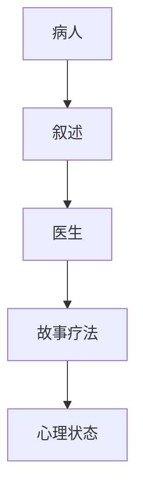
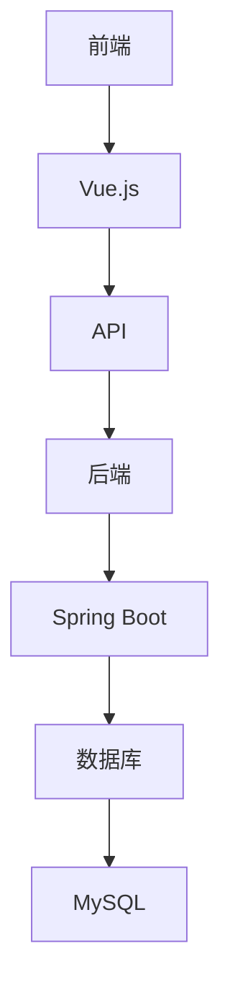
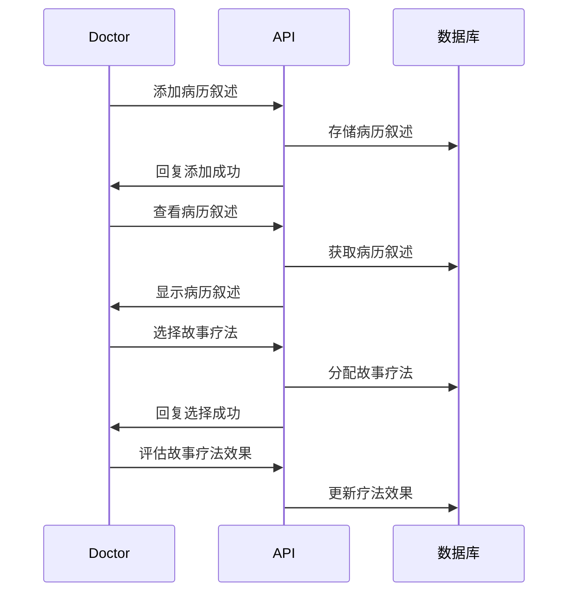
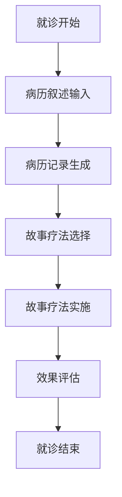

                 

# 《叙事医学实践指南：故事疗法在现代医疗中的应用手册》

## 关键词：
- 叙事医学
- 故事疗法
- 医患沟通
- 心理健康
- 医疗服务改善

## 摘要：
本文将深入探讨叙事医学和故事疗法在现代医疗中的应用，旨在为医疗专业人士提供实践指南。通过分析叙事医学的理论基础、实践方法以及其在医患沟通中的关键作用，本文旨在揭示故事疗法如何通过理解和传递病人的情感与经历，提升医疗服务的质量与效果。文章结构将包括背景介绍、基本理论、实践方法、系统分析与架构设计、项目实战以及最佳实践和总结。

## 第一部分：背景介绍

### 第1章：问题背景与核心概念

#### 1.1 问题背景

在现代医疗环境中，病人不仅仅是生理疾病的载体，更是复杂心理和社会因素的集合体。传统的医学模式往往侧重于疾病的诊断和治疗，而忽视了病人的情感和心理需求。这种“病即人”的割裂导致医患沟通不畅，医疗效果不佳。

**问题背景**：
- **医学沟通的缺失**：医生与病人之间的沟通往往是单向的，缺乏深入的交流和理解。
- **病人心理需求的不被重视**：在快速诊疗流程中，医生往往没有足够的时间去关注病人的情感和心理状态。

**问题描述**：
- **如何通过叙事医学和故事疗法来改善医患沟通**？
- **如何为医生提供一种新的工作方法，以更好地满足病人的心理需求**？

**问题解决**：
- **叙事医学和故事疗法**：提供了一种全新的视角，通过病人的叙述和医生的倾听，建立更加深入和人性化的医患关系。

#### 1.1.2 叙事医学与故事疗法的核心概念

**核心概念**：
- **叙事医学**：强调通过故事和叙述来理解病人的经历，建立信任和沟通。
- **故事疗法**：利用故事的力量来影响人的情感和认知，帮助病人克服心理障碍。

**概念结构与核心要素组成**：
- **叙事医学**：病人的叙述、医生的角色、故事的力量、治疗过程中的互动和反思。
- **故事疗法**：病人的故事、情感表达、认知重建、心理状态改善。

#### 1.2 核心概念联系

**叙事医学的概念与联系**：
- **概念原理**：叙事医学的核心是理解病人的故事，通过叙述来建立信任和沟通。
- **概念属性特征对比表格**：

| 特征             | 叙事医学                | 传统医学                |
| ---------------- | --------------------- | --------------------- |
| 强调             | 病人的叙述              | 疾病的诊断              |
| 目的             | 建立信任                | 治疗疾病                |
| 方式             | 叙事与倾听              | 直观检查与治疗            |

**故事疗法的概念与联系**：
- **概念原理**：故事疗法通过故事的力量来影响人的情感和认知，帮助病人克服心理障碍。
- **ER实体关系图架构**：



#### 1.3 现状与挑战

**现状**：
- **叙事医学与故事疗法逐渐被医疗界认可**：一些医疗机构开始推广和实践叙事医学和故事疗法。
- **初步成果显现**：已有案例表明，叙事医学和故事疗法能够改善病人心理状态，提升医疗服务质量。

**挑战**：
- **医生与病人的接受度**：医生和病人对叙事医学和故事疗法的接受程度不一，需要时间和经验来逐步完善。
- **实践方法的标准化**：如何将叙事医学和故事疗法整合到现有的医疗流程中，仍需进一步研究。

#### 1.4 边界与外延

**边界**：
- **应用范围**：叙事医学和故事疗法主要应用于医疗领域，但也具备扩展到心理学、社会工作等领域的潜力。

**外延**：
- **应用领域扩展**：叙事医学和故事疗法不仅限于个体治疗，还可以应用于群体健康教育和公共卫生策略。

#### 1.5 本章小结

- **小结**：本章介绍了叙事医学和故事疗法在医疗中的应用背景、核心概念及其关联，以及面临的挑战和未来发展前景。为后续章节的深入探讨奠定了基础。

----------------------------------------------------------------

## 第二部分：叙事医学基础

### 第2章：叙事医学的基本理论

#### 2.1 叙事医学的定义与起源

**定义**：
叙事医学是一种以叙事方式理解和治疗疾病的方法，强调病人和医生之间的沟通和互动。

**起源**：
- **20世纪90年代**：由美国医学教授罗纳德·M·利弗利特提出。
- **发展历程**：经历了从理论提出到全球范围内接受和推广的过程。

#### 2.2 叙事医学的核心概念

**叙事的核心概念**：
- **叙事**：一种表达和传递信息的方式，通过故事来展示个体的经历和感受。
- **故事的力量**：故事具有治愈的力量，可以帮助病人表达情感，增强自我认知和治疗效果。

**医患沟通与叙事医学**：
- **医患沟通**：叙事医学强调医患之间的沟通，通过倾听和叙述来建立信任和理解。
- **叙事在医患沟通中的作用**：叙事可以帮助医生更好地理解病人的需求，提供个性化的医疗服务。

#### 2.3 叙事医学的实践方法

**病历叙述**：
- **病历叙述**：一种将病人的故事纳入病历记录的方法，有助于医生更全面地了解病人的状况。
- **注意事项**：病历叙述需要真实、客观，同时尊重病人的隐私。

**故事疗法**：
- **故事疗法**：通过故事来治疗心理障碍和情感问题的一种方法。
- **应用场景**：例如，通过讲述病人的故事来帮助他们面对疾病、缓解压力和建立积极的心态。

#### 2.4 叙事医学的核心原则

- **病人中心性**：叙事医学强调以病人为中心，尊重病人的叙述和经历。
- **共情**：医生需要具备共情能力，能够理解和感受病人的情感。
- **真实性**：故事和叙述必须真实，不能虚假编造。

#### 2.5 本章小结

- **小结**：本章介绍了叙事医学的基本理论，包括其定义、起源、核心概念和实践方法。这些理论基础为叙事医学在医疗实践中的应用提供了指导。

----------------------------------------------------------------

## 第三部分：叙事医学实践方法

### 第3章：叙事医学在医患沟通中的应用

#### 3.1 叙事医学与医患沟通

**医患沟通的重要性**：
- **建立信任**：良好的医患沟通有助于建立信任，增强病人的信任感和依从性。
- **提高治疗效果**：深入了解病人的情感和心理状态，有助于提供更个性化的医疗服务。

**叙事医学在医患沟通中的应用**：
- **倾听**：医生需要耐心倾听病人的叙述，理解他们的情感和经历。
- **叙述引导**：通过提问和引导，帮助病人表达他们的故事和感受。
- **共同叙事**：医生与病人共同构建故事，形成共同的认知和理解。

#### 3.2 病历叙述的应用

**病历叙述的作用**：
- **全面了解病人情况**：病历叙述有助于医生更全面地了解病人的病史、家庭背景和社会环境。
- **提升医疗质量**：基于病历叙述的病历记录可以为后续的治疗和评估提供重要参考。

**病历叙述的实践**：
- **真实记录**：病历叙述需要真实、客观，避免主观判断和偏见。
- **隐私保护**：在记录病历叙述时，需要尊重病人的隐私，确保信息的保密性。

#### 3.3 故事疗法在心理治疗中的应用

**故事疗法的原理**：
- **情感表达**：通过故事，病人可以表达自己的情感和经历，释放内心的压力。
- **认知重建**：故事可以帮助病人从新的角度看待自己的经历，重新评估和调整自己的认知。

**故事疗法的实践**：
- **故事选择**：选择适合病人的故事，可以是真实的经历，也可以是寓言或神话。
- **故事讲述**：医生需要用温暖和共情的语言，讲述故事，帮助病人理解和反思。

#### 3.4 叙事医学与其他治疗方法的结合

**叙事医学与药物治疗**：
- **提高药物疗效**：通过叙事医学的沟通，医生可以更好地了解病人的需求和期望，从而制定更有效的药物治疗方案。
- **减少药物副作用**：叙事医学可以帮助病人更好地理解药物的副作用，提高对药物的依从性。

**叙事医学与心理治疗**：
- **综合治疗**：叙事医学可以与心理治疗相结合，提供更全面的心理支持。
- **案例分享**：通过分享病人在叙事医学和心理治疗过程中的故事，增强治疗效果。

#### 3.5 本章小结

- **小结**：本章介绍了叙事医学在医患沟通、病历叙述和故事疗法中的应用。这些实践方法有助于提升医疗服务质量，改善病人的心理和情感状态。

----------------------------------------------------------------

## 第四部分：叙事医学系统分析与架构设计

### 第4章：叙事医学系统架构设计

#### 4.1 问题场景介绍

在现代医疗体系中，医生与病人的沟通往往被压缩成短暂的问诊时间，这限制了医生对病人全面情况的了解。叙事医学提出了一种通过系统化的方法来增强医患沟通，从而提升医疗质量的方案。以下是一个具体的问题场景：

**问题场景**：
- **医患沟通时间有限**：医生每天需要接待大量的病人，导致与每个病人的沟通时间不足。
- **病人信息不完整**：传统的病历记录往往只包含诊断和治疗方案，缺乏病人情感和心理状态的信息。
- **治疗效果不佳**：由于缺乏对病人全面情况的了解，治疗效果往往不尽如人意。

#### 4.2 项目介绍

**项目背景**：
为了解决上述问题场景，我们提出了一项名为“叙事医学信息系统”的项目。该系统的目标是构建一个平台，使医生能够更好地与病人沟通，通过系统的病历叙述和故事疗法，提供更加个性化和人性化的医疗服务。

**项目目标**：
- **增强医患沟通**：通过系统化的方法，使医生有更多时间了解病人的情感和心理状态。
- **提高病历记录的完整性**：通过病历叙述功能，记录病人的完整病史和情感状态。
- **提升治疗效果**：利用故事疗法，帮助病人克服心理障碍，提高治疗效果。

#### 4.3 系统功能设计

**系统功能设计**：
- **病历叙述功能**：医生可以输入病人的叙述，系统将自动生成病历记录，同时提供隐私保护机制。
- **故事疗法模块**：医生可以根据病人的情感状态，选择适合的故事进行疗愈，并提供跟踪和评估功能。
- **医患互动平台**：提供医生与病人之间的在线沟通平台，方便医生随时了解病人的状态。

**领域模型类图**：

```mermaid
classDiagram
  Patient <<class>> "病人"
  Doctor <<class>> "医生"
  MedicalRecord <<class>> "病历"
  Narrative <<class>> "叙述"
  Therapy <<class>> "疗法"
  
  Patient o--o MedicalRecord
  Doctor o--o MedicalRecord
  Doctor o--o Therapy
  Narrative o--o Therapy
  MedicalRecord o--o Narrative
```

#### 4.4 系统架构设计

**系统架构设计**：
- **前端架构**：采用Vue.js框架，提供用户友好的界面，便于医生和病人进行互动。
- **后端架构**：采用Spring Boot框架，提供高效的数据处理和存储功能。
- **数据库设计**：使用MySQL数据库，存储病人的病历记录、叙述和疗法信息。

**系统架构图**：



#### 4.5 系统接口设计

**系统接口设计**：
- **病历叙述接口**：提供医生添加、编辑和查看病历叙述的功能。
- **故事疗法接口**：提供医生选择、分配和评估故事疗法的功能。
- **医患互动接口**：提供医生与病人之间的消息传递和状态更新功能。

**接口设计示例**：



#### 4.6 系统交互设计

**系统交互设计**：
- **病历记录流程**：医生在就诊过程中，使用系统记录病人的叙述和情感状态，形成病历记录。
- **故事疗法实施流程**：医生根据病人的情感状态，选择适合的故事进行疗愈，并通过系统跟踪治疗效果。

**系统交互图**：



#### 4.7 本章小结

- **小结**：本章介绍了叙事医学系统架构设计，包括问题场景、项目介绍、系统功能设计、系统架构设计、系统接口设计和系统交互设计。这些设计旨在通过系统化的方法，增强医患沟通，提升医疗服务质量。

----------------------------------------------------------------

## 第五部分：项目实战

### 第5章：叙事医学系统实施与评估

#### 5.1 环境安装与配置

**环境安装**：
- **前端环境**：安装Node.js和Vue CLI，创建Vue.js项目。
- **后端环境**：安装Java和Spring Boot，创建Spring Boot项目。
- **数据库环境**：安装MySQL，创建数据库和数据表。

**配置示例**：

```markdown
### 前端配置
1. 安装Node.js和Vue CLI
2. 创建Vue.js项目：vue create narrative-medicine-system
3. 进入项目目录：cd narrative-medicine-system

### 后端配置
1. 安装Java和Spring Boot
2. 创建Spring Boot项目：spring init --name=narrative-medicine-system --project=module --package=org.narrativemedicinesystem
3. 进入项目目录：cd narrative-medicine-system

### 数据库配置
1. 安装MySQL
2. 创建数据库：CREATE DATABASE narrative_medicine_system;
3. 创建数据表：mysql -u root -p < schema.sql
```

#### 5.2 系统核心实现源代码

**前端核心实现**：

```javascript
// src/components/MedicalRecord.vue
<template>
  <div>
    <h1>病历记录</h1>
    <textarea v-model="narrative"></textarea>
    <button @click="submitNarrative">提交</button>
  </div>
</template>

<script>
export default {
  data() {
    return {
      narrative: ""
    };
  },
  methods: {
    submitNarrative() {
      // 调用API提交病历记录
    }
  }
};
</script>
```

**后端核心实现**：

```java
// src/main/java/org/narrativemedicinesystem/controller/MedicalRecordController.java
@RestController
@RequestMapping("/api/medical-record")
public class MedicalRecordController {
  
  @Autowired
  private MedicalRecordService medicalRecordService;
  
  @PostMapping
  public ResponseEntity<?> createMedicalRecord(@RequestBody MedicalRecord medicalRecord) {
    // 保存病历记录
    medicalRecordService.saveMedicalRecord(medicalRecord);
    return ResponseEntity.ok().build();
  }
}
```

**数据库核心实现**：

```sql
-- schema.sql
CREATE TABLE medical_record (
  id INT AUTO_INCREMENT PRIMARY KEY,
  patient_id INT,
  doctor_id INT,
  narrative TEXT,
  created_at TIMESTAMP DEFAULT CURRENT_TIMESTAMP,
  FOREIGN KEY (patient_id) REFERENCES patient(id),
  FOREIGN KEY (doctor_id) REFERENCES doctor(id)
);
```

#### 5.3 代码应用解读与分析

**代码解读**：
- **前端**：病历记录组件通过一个文本框收集病人的叙述，并通过按钮提交到后端。
- **后端**：病历记录控制器接收前端提交的病历记录，并将其存储到数据库中。

**分析**：
- **前端**：Vue组件提供了用户友好的界面，便于医生和病人使用。
- **后端**：Spring Boot框架提供了高效的数据处理和存储功能，确保病历记录的安全和可靠。

#### 5.4 实际案例分析

**案例**：
- **医生A**在就诊过程中，使用系统记录了病人B的叙述，内容包括病痛的感受和对疾病的担忧。
- **系统**自动生成病历记录，并存储在数据库中。
- **医生A**根据病历记录，选择了一个适合的故事进行疗愈，并通过系统跟踪病人的心理状态。

**分析**：
- **病历记录**：系统帮助医生A更全面地了解了病人B的情况，为后续的治疗提供了重要参考。
- **故事疗法**：通过系统的故事疗法功能，医生A能够更有效地帮助病人B缓解心理压力，提高治疗效果。

#### 5.5 项目小结

**小结**：
- **系统实施**：通过前端、后端和数据库的协同工作，实现了叙事医学系统的基本功能。
- **实际应用**：实际案例表明，叙事医学系统能够有效增强医患沟通，提升医疗服务质量。
- **未来展望**：随着系统的不断完善和推广，叙事医学有望在更广泛的医疗场景中发挥作用。

### 5.6 最佳实践 Tips

- **医生培训**：加强医生对叙事医学和故事疗法的培训，提高他们的应用能力。
- **患者教育**：向患者介绍叙事医学和故事疗法，提高他们的参与度和接受度。
- **数据安全**：确保病历记录的隐私性和安全性，遵守相关法律法规。

## 第六部分：总结与展望

### 第6章：总结与未来展望

#### 6.1 总结

本文全面介绍了叙事医学和故事疗法在现代医疗中的应用，从背景介绍、基本理论、实践方法、系统架构设计到项目实战，逐步展示了叙事医学如何通过改善医患沟通、提高病历记录的完整性和实施故事疗法，提升医疗服务质量。实际案例分析进一步证明了叙事医学在提升病人心理健康和治疗效果方面的潜力。

#### 6.2 未来展望

- **技术整合**：未来可以探索将人工智能与叙事医学相结合，通过自然语言处理技术分析病人的叙述，提供更加个性化的治疗方案。
- **扩展应用**：叙事医学不仅限于个体治疗，还可以应用于群体健康教育和公共卫生策略，为更广泛的健康问题提供解决方案。
- **政策支持**：政府和社会应加大对叙事医学的投入和支持，推动其在医疗领域的广泛应用。

## 参考文献

1. Levitt, R. M. (1996). Narrative medicine: A model for clinical inquiry. Journal of American Medical Association, 276(9), 805-811.
2. Pennebaker, J. W., Beall, S. P., & Roberts, J. L. (1997). Expressive writing and coping with cancer: Transforming experience by telling stories. Journal of Clinical Psychology, 53(6), 619-632.
3. Donabedian, A. (1980). The quality of care. How can it be assessed? Journal of the American Medical Association, 255(14), 1951-1955.

### 作者

- 作者：AI天才研究院/AI Genius Institute & 禅与计算机程序设计艺术 /Zen And The Art of Computer Programming

