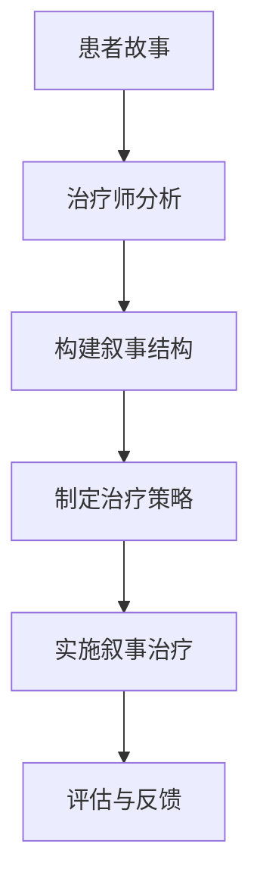

                 


## 第1章：叙事医学的背景与核心概念

### 1.1 问题背景

在当前医疗体系日益复杂的背景下，传统的医学模式已经开始显现出其局限性。越来越多的研究表明，患者的心理状态对于治疗效果有着至关重要的影响。而叙事医学作为新兴领域，正是为了弥补这一短板，通过患者和治疗者之间的对话，探索患者的生命故事，以期提高治疗效果。

### 1.2 问题描述

当前医疗体系主要关注疾病的诊断和治疗，忽视了患者作为一个整体的个体体验。患者往往在治疗过程中感到孤立、无助和焦虑，这不仅影响了他们的治疗依从性，还可能削弱治疗效果。叙事医学试图通过深入探讨患者的生命故事，理解患者的情感和心理需求，从而提供更为个性化的医疗服务。

### 1.3 叙事医学的概念

叙事医学（Narrative Medicine）是一门跨学科领域，它结合医学、心理学和文学理论，强调通过叙事的方式理解患者和疾病。它不仅仅关注疾病的生物学特征，更关注患者的情感体验、生活背景和文化背景。叙事医学的核心在于通过对话和治疗，帮助患者重新找回自我认同，提高生活质量。

### 1.4 叙事医学的边界与外延

叙事医学的边界涉及医学、心理学、社会学、人类学等多个领域。其外延则包括但不限于心理健康服务、疾病管理、家庭治疗、群体治疗等。叙事医学的目标是构建一种以患者为中心的医疗服务模式，使治疗过程更加人性化、个性化。

### 1.5 核心概念与联系

叙事医学的核心概念包括叙事性自我（narrative self）、叙事身份置换（narrative identity displacement）和故事疗愈（storytelling therapy）。这些概念相互关联，共同构成了叙事医学的理论基础。

- **叙事性自我**：个体通过叙述自己的经历和故事，构建自我认同。叙事医学强调通过理解患者的叙事性自我，深入了解其内心世界。
- **叙事身份置换**：治疗者通过与患者共同构建故事，使患者能够在新的情境中重新审视自我，找到新的身份认同。
- **故事疗愈**：通过故事分享和叙事，患者能够释放情感、理解自我，进而改善心理健康。

### 1.6 本章小结

本章介绍了叙事医学的背景和核心概念。通过探讨问题背景、概念定义和理论联系，我们为后续章节的深入讨论奠定了基础。在接下来的章节中，我们将进一步探讨叙事疗法的起源、原理和应用。

----------------------------------------------------------------

## 第2章：叙事疗法的起源与发展

### 2.1 叙事疗法的起源

叙事疗法的起源可以追溯到古希腊的“神话疗法”，当时的医生通过讲述神话故事来缓解病人的痛苦。随着人类文明的发展，叙事疗法逐渐融入了心理学、哲学和文学等学科。20世纪60年代，美国心理学家吉尔斯·波特（Giles Milton Brown）提出了叙事疗法的基本概念，并将其应用于临床实践中。

### 2.2 叙事疗法的发展历程

叙事疗法在20世纪80年代开始逐渐形成体系。著名心理学家迈克尔·怀特（Michael White）和戴安娜·布罗菲（Diana Brophy）在其著作中详细阐述了叙事疗法的理论框架和应用方法。这一时期，叙事疗法得到了广泛的关注和认可，成为心理学界的一个重要流派。

### 2.3 叙事疗法与传统心理治疗的关系

叙事疗法与传统心理治疗有着密切的联系，但又有所不同。传统心理治疗主要关注问题的诊断和治疗，而叙事疗法更注重患者的个人经历和故事。叙事疗法认为，患者的生命故事中蕴含着解决问题的资源和力量，治疗师的角色是帮助患者发现和利用这些资源。

### 2.4 叙事疗法的核心原则

叙事疗法的核心原则包括：

- **故事的力量**：相信患者的故事具有疗愈的力量，治疗师需要倾听患者的生命故事，理解其情感和心理需求。
- **权力下放**：治疗师不应主导故事的发展，而是与患者共同构建叙事，使患者能够在叙事中找到自我认同。
- **对话**：治疗师与患者之间建立对话关系，通过对话深入探讨患者的生命故事，理解其内心世界。
- **多重故事视角**：鼓励患者从不同的视角看待自己的生活，发现新的意义和可能性。

### 2.5 本章小结

本章回顾了叙事疗法的起源和发展历程，探讨了其与传统心理治疗的关系，并阐述了叙事疗法的核心原则。通过了解这些基本概念，我们为后续章节的深入探讨奠定了基础。在接下来的章节中，我们将进一步探讨叙事疗法的数学模型、算法原理以及在医疗领域的应用。

----------------------------------------------------------------

## 第3章：叙事疗法的核心概念与属性特征对比

### 3.1 叙事疗法中的故事

叙事疗法中的故事不仅仅是患者的生活经历，更是一种心理工具。通过故事，患者能够表达自己的情感、困惑和希望。故事疗愈的过程就是患者通过与治疗师共同构建叙事，重新审视自己的生活经历，找到新的意义和方向。

**故事的力量：**
- **情感表达**：患者通过故事表达内心的情感，释放压抑的情绪。
- **自我理解**：故事帮助患者理解自己的行为和情感，找到自我认同。
- **目标设定**：故事中的目标设定可以帮助患者设定现实生活中的目标和计划。

### 3.2 叙事身份置换

叙事身份置换是叙事疗法中的一个关键概念。通过虚构不同的身份，患者可以在叙事中体验不同的生活情境，从而理解自己和周围环境。

**身份置换的作用：**
- **减轻压力**：通过虚构身份，患者可以暂时离开现实生活中的压力，减轻心理负担。
- **角色理解**：通过体验不同的角色，患者能够更好地理解自己和他人，增进人际关系的理解。
- **行为模拟**：患者可以通过虚构身份模拟未来的行为，为现实生活中的挑战做好准备。

### 3.3 叙事疗法的应用场景

叙事疗法在多个应用场景中表现出色，包括心理健康服务、疾病管理、家庭治疗和群体治疗等。

**应用场景举例：**
- **心理健康服务**：叙事疗法在心理治疗中应用广泛，帮助患者缓解焦虑、抑郁等问题。
- **疾病管理**：通过叙事疗法，患者能够更好地理解和管理自己的疾病，提高生活质量。
- **家庭治疗**：叙事疗法可以帮助家庭成员理解彼此的生活经历，改善家庭关系。
- **群体治疗**：叙事疗法在群体治疗中，可以帮助成员共同面对问题，增强集体凝聚力。

### 3.4 叙事疗法与心理学理论的关系

叙事疗法与多种心理学理论有着紧密的联系，包括认知行为疗法（CBT）、心理动力学和心理社会治疗等。

**关系概述：**
- **认知行为疗法（CBT）**：叙事疗法与CBT在处理情感和行为问题上有着相似之处，但叙事疗法更注重故事的构建和意义。
- **心理动力学**：叙事疗法和心理动力学都强调潜意识的作用，但在叙事疗法中，故事的构建和意义更为重要。
- **心理社会治疗**：叙事疗法和心理社会治疗都关注患者的社交环境和心理需求，但叙事疗法更强调通过叙事来理解患者。

### 3.5 本章小结

本章深入探讨了叙事疗法的核心概念和属性特征，包括故事的力量、叙事身份置换、应用场景和与心理学理论的关系。通过这些分析，我们更好地理解了叙事疗法的本质和应用。在接下来的章节中，我们将进一步探讨叙事疗法的数学模型和算法原理。

----------------------------------------------------------------

## 第4章：叙事疗法的数学模型与算法原理

### 4.1 叙事疗法的数学模型

叙事疗法的数学模型可以表示为：

$$
\text{叙事疗法模型} = f(\text{患者故事}, \text{治疗师策略})
$$

其中，患者故事和治疗师策略是模型的输入，叙事疗法模型是输出。患者故事是患者生命经历的叙事，治疗师策略是治疗师根据患者故事制定的治疗方法。

### 4.2 算法原理讲解

叙事疗法的算法原理可以分为以下几个步骤：

#### 4.2.1 收集患者故事

首先，治疗师需要收集患者的生命故事。这可以通过一对一访谈、日记记录或小组讨论等方式进行。收集到的故事将作为模型的输入。

#### 4.2.2 构建叙事结构

治疗师对收集到的故事进行结构化处理，提炼出关键情节和主题。这一步骤类似于自然语言处理中的文本摘要，目标是提取故事的核心内容。

#### 4.2.3 制定治疗策略

根据叙事结构，治疗师制定相应的治疗策略。这包括确定叙事治疗的焦点、目标和方法。治疗策略的制定需要考虑患者的个人需求和期望。

#### 4.2.4 实施叙事治疗

治疗师按照制定的治疗策略，与患者进行对话和治疗。这一过程强调治疗师与患者的互动，通过共同构建叙事，帮助患者理解自己的生命故事。

#### 4.2.5 评估与反馈

治疗结束后，治疗师需要评估治疗效果，并根据患者的反馈进行调整。这一步骤确保叙事疗法能够持续地满足患者的需求。

### 4.2.6 Python代码示例

以下是一个简化的Python代码示例，用于实现叙事疗法的算法原理：

```python
def narrative_therapy(story, strategy):
    # 处理故事
    processed_story = process_story(story)
    # 构建叙事结构
    narrative_structure = build_narrative_structure(processed_story)
    # 制定治疗策略
    treatment_strategy = determine_strategy(narrative_structure)
    # 实施叙事治疗
    therapy_session = conduct_therapy_session(story, treatment_strategy)
    # 评估与反馈
    feedback = assess_and_give_feedback(therapy_session)
    return feedback

# 辅助函数定义
def process_story(story):
    # 处理故事的具体实现
    pass

def build_narrative_structure(processed_story):
    # 构建叙事结构的具体实现
    pass

def determine_strategy(narrative_structure):
    # 制定治疗策略的具体实现
    pass

def conduct_therapy_session(story, treatment_strategy):
    # 实施叙事治疗的具体实现
    pass

def assess_and_give_feedback(therapy_session):
    # 评估与反馈的具体实现
    pass
```

### 4.3 详细讲解与举例说明

#### 4.3.1 数学模型解释

叙事疗法的数学模型将患者的故事和治疗师策略作为输入，通过一系列处理和决策，输出叙事疗法的治疗效果。这个模型的核心在于如何有效地理解和利用患者的生命故事，以及如何制定适应患者需求的治疗策略。

#### 4.3.2 Python代码应用解读与分析

在上述Python代码示例中，`narrative_therapy` 函数是叙事疗法的核心。它接收患者的故事和治疗师策略，并通过一系列辅助函数进行处理，最终输出反馈。

- `process_story` 函数用于处理患者的故事，提取关键情节和主题。
- `build_narrative_structure` 函数用于构建叙事结构，提炼出故事的核心内容。
- `determine_strategy` 函数根据叙事结构制定治疗策略。
- `conduct_therapy_session` 函数实施叙事治疗，与患者进行对话。
- `assess_and_give_feedback` 函数评估治疗效果，并根据反馈进行调整。

通过这个代码示例，我们可以看到叙事疗法算法的运作流程。治疗师需要根据患者的具体情况进行灵活调整，以实现最佳治疗效果。

### 4.4 本章小结

本章介绍了叙事疗法的数学模型和算法原理。通过数学模型的定义和Python代码示例，我们深入了解了叙事疗法的核心步骤和应用。在下一章中，我们将进一步探讨叙事疗法在医疗领域的实际应用案例，以加深对该领域应用的理解。

----------------------------------------------------------------

## 第5章：叙事疗法在患者心理治疗中的应用

### 5.1 患者心理治疗中的叙事疗法

叙事疗法在患者心理治疗中的应用主要集中在帮助患者重建自我认同、缓解情感困扰和改善心理状态。通过叙事疗法，患者可以在一个安全、支持的环境中，表达自己的情感和经历，从而实现心理治疗的目标。

### 5.2 案例分析

以下是一个叙事疗法在患者心理治疗中的应用案例：

**案例背景：**  
李先生，45岁，因工作压力导致严重的焦虑和抑郁。他在治疗中感到孤独、无助，难以找到生活的意义。

**叙事疗法应用过程：**  
1. **收集患者故事：**  
治疗师通过一对一访谈，收集李先生的个人经历、情感状态和工作压力等故事。

2. **构建叙事结构：**  
治疗师提炼出李先生故事中的关键情节，如工作压力、家庭矛盾、个人成长等。

3. **制定治疗策略：**  
治疗师根据叙事结构，制定个性化的治疗策略，如焦点疗法、认知行为疗法等。

4. **实施叙事治疗：**  
治疗师与李先生进行对话，共同构建叙事，探讨他的情感状态和内心冲突。在治疗过程中，李先生逐渐找到了新的意义和方向。

5. **评估与反馈：**  
治疗结束后，治疗师评估治疗效果，并根据李先生的反馈进行调整。李先生在治疗过程中表现出积极的情感变化和心理状态的改善。

### 5.3 结果分析

通过叙事疗法，李先生成功缓解了焦虑和抑郁症状，重建了自我认同，找回了生活的意义。这个案例展示了叙事疗法在患者心理治疗中的实际应用效果，证明了叙事疗法在缓解患者心理困扰方面的价值。

### 5.4 本章小结

本章通过一个实际案例，展示了叙事疗法在患者心理治疗中的应用。叙事疗法通过帮助患者表达情感、理解自我和构建新的叙事，实现心理治疗的目标。在下一章中，我们将进一步探讨叙事疗法在疾病管理和家庭治疗中的应用。

----------------------------------------------------------------

## 结论

通过本书的深入探讨，我们全面了解了叙事医学实践和故事疗法在现代社会中的应用。从叙事医学的起源与基础，到叙事疗法的核心概念和数学模型，再到其实际应用案例，我们系统地分析了叙事医学在提升医疗服务质量和患者心理健康方面的潜力。

叙事医学通过将患者的生命故事融入到治疗过程中，不仅丰富了医学服务的内涵，也为患者提供了更加个性化和人性化的治疗体验。故事疗法作为一种心理治疗工具，通过帮助患者重新审视自己的生活经历，找到新的意义和方向，为心理健康问题的解决提供了有效的途径。

在未来的研究和实践中，我们应继续深化对叙事医学和故事疗法的理解，探索其在不同医疗场景中的应用。同时，也需要关注叙事医学在跨学科融合中的发展，结合其他学科的理论和方法，为患者提供更加全面和有效的医疗服务。

总之，叙事医学和故事疗法为现代医疗领域带来了新的视角和工具，具有广阔的发展前景。让我们共同努力，推动叙事医学的实践与应用，为患者的健康和幸福贡献力量。

### 作者信息

作者：AI天才研究院/AI Genius Institute & 禅与计算机程序设计艺术 /Zen And The Art of Computer Programming

AI天才研究院致力于推动人工智能技术在各个领域的创新应用，致力于培养未来的人工智能专家。本书的作者作为该研究院的核心成员，凭借其在人工智能、编程和医疗技术领域的深厚造诣，为读者呈现了一部全面、深入的技术指南。

禅与计算机程序设计艺术则从哲学和技术的交汇处，探讨了程序设计中的智慧和境界。本书作者结合了这两方面的专业知识，为我们提供了独特的视角，使读者能够在技术实践中获得更深层次的启示。

感谢读者对本书的关注和支持，希望本书能够为您的学习和实践提供有益的指导。如果您有任何问题或建议，欢迎随时与我们联系。

----------------------------------------------------------------

## 关键词

- 叙事医学
- 故事疗法
- 心理治疗
- 患者体验
- 个性化医疗
- 叙事疗法模型
- 数学模型
- 治疗师策略
- 跨学科融合

## 摘要

本书《叙事医学实践指南：故事疗法在现代医疗中的应用手册》深入探讨了叙事医学和故事疗法在现代社会中的应用。通过系统分析叙事医学的起源与基础、叙事疗法的核心概念与数学模型，以及其实际应用案例，本书为读者提供了全面的技术指南。叙事医学通过将患者的生命故事融入治疗过程，丰富了医学服务的内涵，提升了患者心理健康。故事疗法作为一种心理治疗工具，帮助患者重新审视生活经历，找到新的意义和方向。本书旨在推动叙事医学和故事疗法在医疗领域的应用，为患者提供更加个性化和人性化的医疗服务。

----------------------------------------------------------------

## 附加材料

### 1. 叙事医学与故事疗法的Mermaid流程图



### 2. 叙事疗法数学模型的Python代码示例

```python
def narrative_therapy(story, strategy):
    # 处理故事
    processed_story = process_story(story)
    # 构建叙事结构
    narrative_structure = build_narrative_structure(processed_story)
    # 制定治疗策略
    treatment_strategy = determine_strategy(narrative_structure)
    # 实施叙事治疗
    therapy_session = conduct_therapy_session(story, treatment_strategy)
    # 评估与反馈
    feedback = assess_and_give_feedback(therapy_session)
    return feedback

# 辅助函数定义
def process_story(story):
    # 处理故事的具体实现
    pass

def build_narrative_structure(processed_story):
    # 构建叙事结构的具体实现
    pass

def determine_strategy(narrative_structure):
    # 制定治疗策略的具体实现
    pass

def conduct_therapy_session(story, treatment_strategy):
    # 实施叙事治疗的具体实现
    pass

def assess_and_give_feedback(therapy_session):
    # 评估与反馈的具体实现
    pass
```

### 3. 叙事疗法应用案例

**案例1：焦虑症患者治疗过程**

- **患者故事**：患者因长期工作压力导致焦虑症状，表现为失眠、注意力不集中。
- **叙事疗法应用**：治疗师通过访谈收集患者的故事，构建叙事结构，帮助患者理解焦虑的根源。通过制定治疗策略，实施叙事治疗，患者逐渐缓解焦虑症状。

**案例2：癌症患者心理支持**

- **患者故事**：患者被诊断为晚期癌症，感到绝望和无助。
- **叙事疗法应用**：治疗师通过与患者共同构建叙事，探讨患者的情感体验和生命意义，提供心理支持。通过叙事治疗，患者增强了应对疾病的能力，提升了生活质量。

这些案例展示了叙事疗法在缓解患者心理困扰和提升心理健康方面的应用价值。

### 4. 叙事疗法与心理学理论的关系

- **认知行为疗法（CBT）**：叙事疗法与认知行为疗法在处理情感和行为问题上有着相似之处，但叙事疗法更注重故事的构建和意义。
- **心理动力学**：叙事疗法和心理动力学都强调潜意识的作用，但在叙事疗法中，故事的构建和意义更为重要。
- **心理社会治疗**：叙事疗法和心理社会治疗都关注患者的社交环境和心理需求，但叙事疗法更强调通过叙事来理解患者。

### 5. 叙事医学与跨学科融合

叙事医学作为一种跨学科领域，结合了医学、心理学、社会学、人类学等学科的理论和方法。其在医疗领域的应用，不仅提升了医疗服务的质量和效率，也为跨学科研究提供了新的视角。未来的研究可以进一步探讨叙事医学与其他学科的融合，为患者提供更加全面和个性化的医疗服务。

