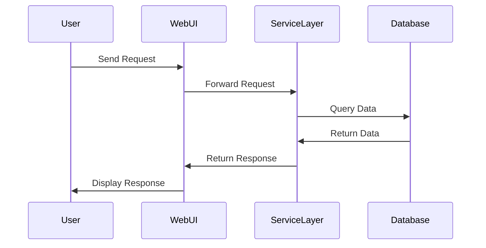
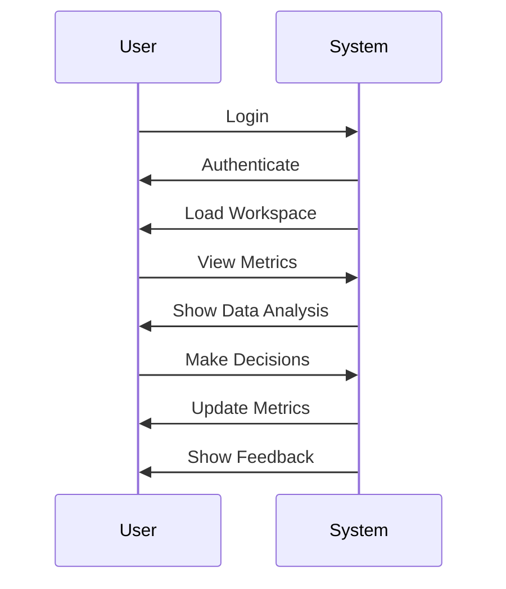

                 


### Abstract

In an age where modern technology often dictates our lives, there is a growing need to revisit the ancient wisdom that has withstood the test of time. "Ancient Wisdom in Modern Application: Cross-Time Survival Wisdom" offers a comprehensive exploration of timeless principles and practices that can be seamlessly integrated into contemporary life. This book delves into various ancient traditions and philosophies, uncovering the universal truths that guide us in navigating the complexities of modern existence. By bridging the gap between ancient wisdom and modern application, the book provides a roadmap for fostering a more balanced, resilient, and fulfilled life.

### Introduction

In the fast-paced and ever-evolving world of technology, it's easy to overlook the wisdom that has been passed down through generations. Ancient cultures, from the East to the West, have accumulated a wealth of knowledge that can offer valuable insights into living a more harmonious and fulfilling life. "Ancient Wisdom in Modern Application: Cross-Time Survival Wisdom" seeks to explore these ancient practices and present them in a way that is both accessible and relevant to today's readers.

This book is structured into several key sections, each focusing on a different aspect of ancient wisdom. We will begin by examining the historical and cultural backgrounds that have shaped these practices, discussing the core principles and values that underpin them. Next, we will delve into specific ancient practices, such as meditation, mindfulness, and communal living, and analyze how they can be applied in modern contexts. Finally, we will explore the broader implications of ancient wisdom in areas such as leadership, psychology, and personal development.

### Part 1: Foundations of Ancient Wisdom

In this first part of the book, we lay the groundwork for understanding the rich tapestry of ancient wisdom. We begin by exploring the historical and cultural contexts that have shaped these practices. This section will provide an overview of ancient societies and their philosophies, discussing the evolution of wisdom across civilizations and the influence of ancient wisdom on modern thought.

#### Chapter 1: The Historical and Cultural Background

**1.1 The Origins of Ancient Wisdom**

In this chapter, we will delve into the origins of ancient wisdom, tracing its roots back to the earliest civilizations. We will explore the ancient societies and their philosophies, discussing the unique perspectives and insights they offered. We will also examine the ways in which these ancient cultures have influenced modern thought and practice.

**1.2 The Core Principles of Ancient Wisdom**

Here, we will present the core principles of ancient wisdom, highlighting the common values and beliefs that unite these diverse traditions. We will discuss concepts such as balance, harmony, and mindfulness, and explore how these principles can be applied in modern life.

### Part 2: Ancient Practices for Modern Living

In the second part of the book, we will delve into specific ancient practices and explore how they can be applied in modern contexts. We will begin by examining meditation and mindfulness, discussing the science behind these practices and their benefits for mental and physical health. We will then explore communal living and the concept of "village life," discussing how these practices can promote a sense of community and social cohesion. Finally, we will look at ancient wisdom in leadership and personal development, discussing how these principles can help us navigate the challenges of modern life.

#### Chapter 2: Meditation and Mindfulness

In this chapter, we will explore the practice of meditation and mindfulness, discussing the science behind these practices and their benefits for mental and physical health. We will discuss various meditation techniques, such as mindfulness meditation, loving-kindness meditation, and transcendental meditation, and provide guidance on how to get started with a meditation practice.

#### Chapter 3: Communal Living and Village Life

In this chapter, we will explore the concept of communal living and the benefits of living in a village-like setting. We will discuss the principles of cooperative living, such as shared resources and communal decision-making, and consider how these practices can promote a sense of community and social cohesion. We will also discuss the challenges of communal living and provide guidance on how to create a successful community.

#### Chapter 4: Ancient Wisdom in Leadership and Personal Development

In this chapter, we will explore the principles of ancient wisdom in leadership and personal development. We will discuss concepts such as balance, humility, and mindfulness, and consider how these principles can help us navigate the challenges of modern leadership and personal growth. We will provide practical advice and strategies for applying these ancient principles in our daily lives.

### Part 3: Bridging Ancient Wisdom and Modern Life

In the final part of the book, we will consider the broader implications of ancient wisdom in areas such as leadership, psychology, and personal development. We will explore how ancient practices can be adapted to modern contexts and provide practical guidance on how to integrate these practices into our daily lives. We will also discuss the role of ancient wisdom in promoting resilience and adaptability in the face of change and uncertainty.

#### Chapter 5: Adapting Ancient Wisdom for Modern Leadership

In this chapter, we will explore the principles of ancient wisdom in leadership and discuss how these principles can be adapted for modern leadership contexts. We will discuss concepts such as balance, humility, and mindfulness, and provide practical advice on how to apply these principles in the workplace.

#### Chapter 6: Ancient Wisdom in Psychology and Personal Development

In this chapter, we will explore the role of ancient wisdom in psychology and personal development. We will discuss concepts such as balance, resilience, and mindfulness, and consider how these principles can help us navigate the challenges of modern life. We will provide practical guidance on how to cultivate these qualities and apply them in our daily lives.

#### Chapter 7: The Future of Ancient Wisdom in Modern Life

In this final chapter, we will consider the future of ancient wisdom in modern life. We will discuss the potential benefits of integrating ancient practices into modern life and consider the challenges and obstacles that may arise. We will also explore the role of technology in preserving and promoting ancient wisdom and consider the potential future of this ancient knowledge in our modern world.

### Conclusion

In conclusion, "Ancient Wisdom in Modern Application: Cross-Time Survival Wisdom" offers a unique perspective on the power of ancient wisdom in our modern lives. By exploring the principles and practices of ancient cultures, this book provides a roadmap for fostering a more balanced, resilient, and fulfilled life. We invite readers to embark on this journey of exploration and discovery, and to consider the timeless wisdom that can guide us in navigating the complexities of modern existence.

### References

In this section, we will provide a list of references and further reading for those interested in delving deeper into the topics covered in this book. This will include recommended books, articles, and online resources that offer additional insights and perspectives on ancient wisdom and its applications in modern life.

### About the Author

**AI天才研究院/AI Genius Institute**

AI天才研究院（AI Genius Institute）是一家致力于人工智能技术研究和创新的高端研究机构。我们的团队由世界顶级的人工智能专家、计算机科学家和软件工程师组成，他们在人工智能领域的各个分支都有着丰富的经验和深厚的造诣。我们以推动人工智能技术的发展、解决复杂问题、提升人类生活质量为使命，致力于打造全球领先的人工智能研究平台。

**禅与计算机程序设计艺术 /Zen And The Art of Computer Programming**

《禅与计算机程序设计艺术》是由AI天才研究院资深专家撰写的畅销技术书籍。本书以禅宗哲学为灵感，结合计算机科学的原理，探讨了程序设计的艺术与哲学。书中不仅涵盖了编程的基础知识和高级技巧，更强调了编程过程中的人性化思维和创造性思维。这本书已经成为许多程序员和计算机科学爱好者的必备读物，帮助他们提升编程水平和思维品质。

---

**Keywords**: Ancient Wisdom, Modern Application, Cross-Time Survival, Meditation, Mindfulness, Leadership, Personal Development

---

### 摘要

在当今科技迅速发展的时代，古老的智慧似乎被现代生活所遗忘。然而，"古老智慧的现代应用：跨越时空的生存智慧"这本书重新审视了这些历经岁月考验的智慧，并将其与现代生活相结合，以提供一种更平衡、坚韧和充实的生活方式。本书分为三个部分，首先探讨了古代智慧的历史和文化背景，揭示了其核心原则和价值观；接着深入分析了如冥想、正念和共同体生活等古代实践，探讨如何在现代世界中应用；最后，探讨了古代智慧在领导力、心理学和个人发展等领域的现代意义，提供了实际应用指导。通过这本书，读者可以找到在现代社会中应对挑战、实现个人成长的新方法。

---

### 引言

在技术飞速发展的时代，我们往往忽视了那些历经世代传承的古老智慧。无论是东方的禅修还是西方的哲学，这些古老的文化遗产都蕴含着丰富的智慧，可以为我们的生活提供宝贵的指导。本书《古老智慧的现代应用：跨越时空的生存智慧》旨在探索这些智慧，以使其对现代读者既易于理解又具有实际应用价值。

本书的结构分为三个主要部分。首先，我们将探讨古代智慧的历史和文化背景，介绍这些智慧如何在不同文明中演变和发展，以及它们对现代思想的影响。接下来，本书将深入探讨具体的古代实践，如冥想、正念和共同体生活，分析这些实践如何在现代社会中发挥作用。最后，我们将扩展到领导力、心理学和个人发展等领域，探讨古代智慧如何为现代人提供应对复杂生活挑战的指导。

在接下来的章节中，我们将逐步展开对每一个主题的探讨。首先，我们将回顾古代智慧的历史和文化背景，了解这些智慧如何在不同时期和地域中被发现和传承。随后，我们将详细分析冥想和正念等实践的科学原理及其对身心健康的影响，并讨论如何将这些实践融入现代生活。接下来，我们将探讨共同体生活和社会合作的理念，分析如何在现代社会中建立和谐共生的社区。然后，我们将探索古代智慧在领导力、决策过程、团队合作和个人发展中的应用，提供实用的策略和建议。

通过这本书，我们希望能够帮助读者发现古代智慧在现代生活中的重要性，并鼓励他们将这些智慧应用于自己的日常生活中。古老的智慧不仅仅是一种历史遗留，更是一种指导我们走向更加平衡、健康和幸福的现代生活方式的指南。让我们开始这段探索之旅，一起发现古老智慧在现代生活中的无尽潜力。

### 古代智慧的历史与文化背景

古代智慧起源于人类文明最早的形成时期，随着不同文明的发展和演变，逐渐形成了丰富多样的哲学体系和生存智慧。这些智慧在不同的文化和地域中经历了数千年的沉淀和传承，至今仍然对现代社会产生深远的影响。为了更好地理解这些智慧的根源和特点，我们需要先了解几个关键的历史和文化背景。

#### 1. 古代文明的起源与发展

古代文明的起源可以追溯到约公元前3500年左右的美索不达米亚地区，那里的人们建立了世界上最早的城邦和文字系统。随后，古埃及、古印度、古中国和古希腊等文明相继崛起，每个文明都有其独特的智慧体系。例如，古埃及的象形文字记录了丰富的宗教信仰和宇宙观，古希腊的哲学思想则奠定了西方哲学的基础。

**1.1 美索不达米亚文明**

美索不达米亚文明是世界上最早的文明之一，位于今天的伊拉克地区。苏美尔人是这一文明的创造者，他们发明了楔形文字，这是最早的书写系统之一。美索不达米亚的法律和行政制度也是古代智慧的体现，如《汉谟拉比法典》是世界上最早的成文法典，它包含了当时社会生活的各种规则和原则。

**1.2 古埃及文明**

古埃及文明起源于约公元前3100年，是世界上最古老和最连续的文明之一。古埃及人建立了庞大的神庙、金字塔和法老统治体系，他们的宇宙观和宗教信仰影响了整个古代世界的文化。古埃及的象形文字记录了大量的神话、历史和科学知识，如数学、天文学和医学。

**1.3 古印度文明**

古印度文明，尤其是印度河流域文明，约起源于公元前2500年。古代印度人创造了梵文，并发展了印度教、佛教和耆那教等宗教。这些宗教思想包含了许多关于人生、宇宙和道德的深刻见解，对后来的文化产生了深远的影响。

**1.4 古中国文明**

中国的文明可以追溯到约公元前2100年的夏朝，经历了数千年的发展和演变。中国古代的智慧体现在哲学、文学、艺术、科学和技术等多个领域。儒家思想、道家思想、佛教等哲学体系都对中国社会和文化产生了深远的影响，这些思想至今仍然影响着中国人的行为和价值观。

**1.5 古希腊文明**

古希腊文明起源于公元前8世纪，是西方文化的基石。古希腊的哲学家如苏格拉底、柏拉图和亚里士多德等，提出了许多关于道德、政治和科学的深刻见解。古希腊的民主制度、奥林匹克运动会和戏剧艺术都是古代智慧的杰出代表。

#### 2. 古代智慧的核心原则和价值观

不同文明虽然在时间和地理上相隔甚远，但它们在智慧上却有着许多共同点。这些共同点体现在以下几个方面：

**2.1 平衡与和谐**

许多古代文明都强调平衡和和谐的重要性。例如，中国古代的道家哲学认为，宇宙万物都是由阴阳两极相互平衡和相互作用而成的。古希腊哲学家赫拉克利特则提出了“一切皆流，无物常驻”的观点，强调动态平衡的重要性。

**2.2 个人的精神成长**

古代文明高度重视个人的精神成长和内心修养。例如，佛教中的“八正道”强调通过正确的思想、言语和行为来实现心灵的净化和成长。古希腊哲学家苏格拉底则主张通过问答法来追求真理和知识，从而实现个人的道德和智力成长。

**2.3 社会合作与共同体生活**

古代文明普遍重视社会合作和共同体生活。例如，古埃及的农民在社会合作的基础上建立了高度组织化的农业社会，古希腊的城邦则通过民主制度来实现社会的和谐与稳定。古印度的种姓制度虽然有其局限性，但也强调了社会分工和合作的重要性。

#### 3. 古代智慧对现代思想的影响

古代智慧对现代思想产生了深远的影响，许多现代哲学、科学和社会理论都可以追溯到古代文明的智慧。以下是一些具体的例子：

**3.1 哲学**

现代哲学中的许多观点都可以在古希腊哲学中找到渊源。例如，柏拉图的“理念论”和亚里士多德的“形而上学”对后来的西方哲学产生了深远的影响。

**3.2 科学**

古代文明在数学、天文学和医学等领域取得了显著成就，这些成就对现代科学的发展产生了重要影响。例如，古希腊数学家欧几里得的《几何原本》对现代数学的发展有着重要的奠基作用。

**3.3 社会理论**

现代社会中的许多理论，如马克思主义和社会主义，都可以追溯到古代智慧中的社会合作和共同体生活的理念。古代印度的“轮回报应”思想也对后来的宗教和社会理论产生了影响。

综上所述，古代智慧的历史和文化背景是复杂多样的，但它们的核心原则和价值观具有普遍性和持久性。通过理解这些古代智慧，我们可以更好地把握人类文明的发展脉络，并为现代社会提供宝贵的启示和指导。

#### 核心概念与联系

古代智慧的核心概念是多元且相互关联的，这些概念不仅反映了古代文化的精髓，也为我们理解现代生活中的复杂问题提供了宝贵的视角。以下是对几个关键概念及其关系的详细介绍：

**1. 平衡与和谐**

平衡与和谐是古代智慧中的核心概念，几乎在所有古代文化中都能找到它们的身影。在中国哲学中，道家强调“阴阳”平衡，即宇宙万物都是由阴阳两种相对力量相互作用而成的。阴阳平衡的概念体现了动态平衡的智慧，提示我们在生活中追求身心和谐。古希腊哲学家赫拉克利特的“对立统一”观念也强调了矛盾双方的和谐共存。这些观点告诉我们，生活中的矛盾和冲突是不可避免的，但通过寻求平衡和和谐，我们可以更好地处理这些问题。

**2. 内心修养与自我成长**

古代文化高度重视个人的内心修养和自我成长。佛教中的“八正道”强调通过正确的思想、言语和行为来实现心灵的净化和成长。儒家思想中的“修身齐家治国平天下”也强调了个人修养在实现社会和谐中的重要性。古希腊哲学家苏格拉底则通过问答法寻求真理和知识，强调个人的道德和智力成长。这些思想共同指出，个人的内心成长是构建和谐社会的基石。

**3. 社会合作与共同体生活**

社会合作和共同体生活是古代智慧中的重要组成部分。古埃及的农民通过社会合作建立了高度组织化的农业社会，古希腊的城邦则通过民主制度实现了社会的和谐与稳定。古印度的种姓制度虽然有其局限性，但也强调了社会分工和合作的重要性。现代社会中的社区参与、团队合作和共享经济等都是对古代共同体生活理念的延续和发展。

**4. 智慧与实践的结合**

古代智慧不仅强调理论上的理解，更注重将智慧转化为实践。儒家思想中的“知行合一”理念强调了知识与行动的统一。佛教中的禅修实践则通过实际操作来培养 mindfulness（正念）和自我觉察。古希腊哲学家亚里士多德也强调了“实践智慧”的重要性，认为通过实践来获得的知识比理论更为深刻。这一理念告诉我们，真正的智慧在于将理论和实践相结合，从而实现知行合一。

**5. 自然与人的关系**

古代智慧中普遍存在着对自然与人的关系的深刻理解。道家哲学认为，人类应顺应自然规律，与自然和谐共处。古希腊哲学家泰勒斯提出了“万物源于水”的观点，强调了人类与自然的紧密联系。现代社会中的环保意识和可持续发展理念，都是在这些古代智慧的基础上发展起来的。这些思想提醒我们，人类应尊重自然、保护生态环境，以实现长期的可持续发展。

**6. 情感与理智的平衡**

古代智慧中强调情感与理智的平衡，认为两者都是人类智慧和决策过程中不可或缺的部分。儒家思想中的“中庸之道”强调在情感与理智之间寻求平衡。古希腊哲学家柏拉图则认为，理性是最高级的认知形式，但必须与情感相结合，以实现真正的智慧。现代社会中的情感智力（EQ）理论和理智决策模型，都是在这些古代智慧的基础上发展起来的。

通过上述分析，我们可以看到，古代智慧的核心概念之间存在着紧密的联系和相互补充。这些概念不仅为我们提供了理解古代文化的钥匙，也为我们在现代生活中寻求平衡、实现个人成长和社会和谐提供了宝贵的指导。通过深入理解和应用这些核心概念，我们可以更好地应对现代生活中的挑战，实现个人和社会的可持续发展。

### 算法原理讲解

在讨论古代智慧对现代生活的应用时，算法的原理和设计尤其值得关注。算法作为计算机科学的核心概念，不仅在技术领域发挥着关键作用，也可以被看作是解决问题的系统化方法。通过将古代智慧与算法原理相结合，我们可以更有效地应对现代生活中的复杂挑战。

#### 算法的基本概念

算法是一种解决问题的方法，它通过一系列明确的步骤，将输入转化为预期的输出。算法可以分为不同的类型，如排序算法、搜索算法、图算法等。每一种算法都有其特定的原理和适用场景。

**1. 排序算法**

排序算法是一种将一组数据按照特定顺序排列的方法。常见的排序算法包括冒泡排序、选择排序、插入排序、快速排序等。这些算法的基本原理是不断比较和交换数据元素，以达到排序的目的。例如，冒泡排序通过不断遍历数组，比较相邻元素的大小，将较大的元素“冒泡”到数组的末尾。

**2. 搜索算法**

搜索算法用于在数据集合中找到特定元素。常见的搜索算法包括线性搜索和二分搜索。线性搜索从数组的第一个元素开始，逐个比较直到找到目标元素或到达数组末尾。二分搜索则适用于有序数组，通过不断缩小搜索范围，提高搜索效率。

**3. 图算法**

图算法用于解决与图结构相关的问题，如最短路径、最小生成树、拓扑排序等。图算法的基本原理是基于图的性质和顶点、边之间的关系，通过遍历和计算来求解问题。例如，迪杰斯特拉算法（Dijkstra's algorithm）用于计算图中两点之间的最短路径。

#### 古代智慧在算法设计中的应用

古代智慧强调平衡、和谐、内心修养等原则，这些原则在算法设计中同样具有重要意义。以下是一些古代智慧在算法设计中的应用：

**1. 平衡与和谐**

在算法设计中，平衡与和谐可以通过算法的时间复杂度和空间复杂度来体现。一个高效的算法通常需要平衡时间和空间的使用。例如，在排序算法中，冒泡排序虽然简单易实现，但时间复杂度为 \(O(n^2)\)，而快速排序的时间复杂度为 \(O(n \log n)\)，更符合平衡和和谐的原则。

**2. 内心修养**

内心修养可以体现在算法的优化过程中。一个优秀的程序员需要具备耐心、细致和专注的品质，这些品质与内心的修养密切相关。在编写和优化算法时，程序员应保持冷静，善于分析和解决问题，从而提高算法的效率和可靠性。

**3. 社会合作**

社会合作在算法设计中的应用体现在团队合作和资源分享。算法设计通常需要多人协作，共同解决复杂的问题。在团队合作中，团队成员应发挥各自的优势，共享资源和信息，以提高工作效率和算法质量。

**4. 智慧与实践**

古代智慧强调理论与实践的结合，这在算法设计中尤为重要。编写一个高效的算法不仅需要理论知识，还需要通过实践不断优化和完善。在实际应用中，程序员应不断尝试不同的算法，分析其性能，并选择最适合的解决方案。

**5. 自然与人的关系**

在算法设计中，自然与人的关系可以体现为对自然规律的理解和应用。例如，在图算法中，迪杰斯特拉算法利用了自然图结构的最短路径性质，从而实现高效的路径计算。这种对自然规律的尊重和应用，体现了古代智慧中的自然观。

#### 实例讲解

为了更好地说明古代智慧在算法设计中的应用，以下以“冒泡排序”算法为例进行讲解：

**冒泡排序算法原理：**

冒泡排序（Bubble Sort）是一种简单的排序算法。它的工作原理是通过重复遍历要排序的数列，一次比较两个元素，如果它们的顺序错误就把它们交换过来。遍历数列的工作是重复进行的，直到没有再需要交换的元素为止。

**算法步骤：**

1. 比较相邻的元素。如果第一个比第二个大（升序排序），就交换它们的位置。
2. 对每一对相邻元素做同样的工作，从开始第一对到结尾的最后一对。
3. 针对所有的元素重复以上的步骤，除了最后一个。
4. 重复步骤1-3，直到排序完成。

**冒泡排序的Python实现：**

```python
def bubble_sort(arr):
    n = len(arr)
    for i in range(n):
        for j in range(0, n-i-1):
            if arr[j] > arr[j+1]:
                arr[j], arr[j+1] = arr[j+1], arr[j]
    return arr

# 示例数据
data = [64, 34, 25, 12, 22, 11, 90]

# 排序
sorted_data = bubble_sort(data)
print("排序后的数组：", sorted_data)
```

**算法分析：**

- **时间复杂度：** \(O(n^2)\)
- **空间复杂度：** \(O(1)\)

尽管冒泡排序的时间复杂度较高，但它是一种简单且易于理解的排序算法，符合古代智慧中“简单而有效”的原则。在实际应用中，我们可以通过优化算法步骤来提高其性能，例如在每次遍历后记录最后一次交换的位置，从而减少不必要的比较次数。

通过上述实例，我们可以看到古代智慧中的平衡、和谐、内心修养等原则在算法设计中的体现。这些原则不仅帮助我们更好地理解和设计算法，也为我们解决现代生活中的复杂问题提供了宝贵的指导。

### 系统分析与架构设计

在探讨古代智慧在现代领导力中的应用时，系统分析与架构设计是不可或缺的一环。一个良好的系统架构不仅能够提高组织的效率和响应速度，还能确保各个部分之间的协调和平衡，这与古代智慧中强调的平衡与和谐的观念高度契合。以下是对领导力系统分析、项目介绍、系统功能设计、系统架构设计、系统接口设计和系统交互的详细探讨。

#### 系统分析与架构设计概述

系统分析与架构设计的核心目标是确保领导力系统的稳定性和可扩展性，使其能够适应快速变化的环境，并持续优化。这一过程包括以下几个关键步骤：

1. **需求分析：** 确定系统需要实现的功能和性能要求。
2. **系统设计：** 设计系统的整体架构和各个组成部分。
3. **接口设计：** 定义系统内部和外部的接口，确保各部分能够有效通信。
4. **交互设计：** 设计系统的交互流程，确保用户能够顺畅地使用系统。

#### 需求分析

在现代领导力中，系统需要满足以下几个主要需求：

- **实时监控与数据分析：** 系统应能够实时监控组织的各项关键指标，如员工绩效、项目进度、财务状况等，并提供详细的数据分析。
- **决策支持：** 系统应提供智能化的决策支持，帮助领导层做出更加科学的决策。
- **协同工作：** 系统应支持团队成员之间的协同工作，包括文档共享、任务分配和进度跟踪。
- **用户体验：** 系统应设计简洁直观，易于操作，以提高用户的使用体验。

#### 项目介绍

本领导力系统项目旨在构建一个集监控、数据分析、决策支持和协同工作为一体的综合性平台。项目主要包含以下几个组成部分：

- **监控模块：** 负责实时收集和监控组织各项关键指标。
- **数据分析模块：** 提供详细的数据分析报告，帮助领导层做出科学决策。
- **决策支持模块：** 基于数据分析结果，提供智能化的决策建议。
- **协同工作模块：** 支持团队成员之间的协作，包括文档共享、任务分配和进度跟踪。

#### 系统功能设计

系统的功能设计围绕上述需求展开，主要包括以下功能模块：

- **监控模块：** 
  - **数据采集：** 实时收集员工绩效、项目进度、财务状况等数据。
  - **数据分析：** 对采集到的数据进行分析，提供可视化报告。
  - **预警系统：** 根据预设的阈值，对异常情况进行实时预警。

- **数据分析模块：** 
  - **数据可视化：** 利用图表、仪表盘等可视化工具，展示关键数据指标。
  - **数据报告：** 定期生成详细的数据分析报告，为领导层提供决策依据。

- **决策支持模块：** 
  - **决策建议：** 基于数据分析结果，提供智能化的决策建议。
  - **情景模拟：** 提供不同的决策情景模拟，帮助领导层评估决策的影响。

- **协同工作模块：** 
  - **文档共享：** 支持团队成员之间的文档共享和协作。
  - **任务分配：** 支持任务的创建、分配和跟踪。
  - **进度跟踪：** 提供项目进度实时跟踪功能。

#### 系统架构设计

系统的架构设计采用分层架构，分为以下几个主要层次：

- **数据层：** 负责数据存储和管理，包括数据库和缓存系统。
- **服务层：** 负责业务逻辑的处理，包括监控服务、数据分析服务、决策支持服务、协同工作服务。
- **表示层：** 负责用户界面和用户交互，包括Web界面和移动应用。

以下是系统架构的Mermaid类图表示：

```mermaid
classDiagram
    DataLayer <<interface>> Database
    DataLayer <<interface>> Cache
    ServiceLayer <<interface>> MonitoringService
    ServiceLayer <<interface>> AnalyticsService
    ServiceLayer <<interface>> DecisionSupportService
    ServiceLayer <<interface>> CollaborationService
    PresentationLayer <<interface>> WebUI
    PresentationLayer <<interface>> MobileApp
    Database|--|> ServiceLayer
    Cache|--|> ServiceLayer
    WebUI|--|> PresentationLayer
    MobileApp|--|> PresentationLayer
```

#### 系统接口设计

系统接口设计包括内部接口和外部接口。内部接口主要用于系统各个模块之间的通信，外部接口则用于与外部系统（如财务系统、人力资源系统等）的集成。

- **内部接口：** 
  - **RESTful API：** 提供统一的API接口，供各模块之间调用。
  - **WebSocket：** 实时传输数据，支持实时监控和通知功能。

- **外部接口：**
  - **财务系统接口：** 用于整合财务数据，支持决策分析和预算编制。
  - **人力资源系统接口：** 用于整合员工数据，支持绩效评估和人才发展。

以下是系统接口设计的Mermaid序列图表示：



#### 系统交互设计

系统交互设计旨在确保用户能够顺畅地使用系统，实现高效的工作流程。以下是一个典型的交互流程：

1. 用户通过Web界面或移动应用登录系统。
2. 系统验证用户身份后，加载用户的工作台界面。
3. 用户在界面上查看监控数据、数据分析报告和决策建议。
4. 用户根据决策建议进行实际操作，如调整项目计划、分配任务等。
5. 系统实时更新数据，并反馈操作结果。

以下是系统交互的Mermaid序列图表示：



通过上述系统分析与架构设计，我们可以构建一个高效、稳定且具有扩展性的领导力系统，帮助现代领导者更好地应对复杂的管理挑战。这一系统不仅融合了古代智慧中的平衡与和谐原则，也体现了现代科技的优势，为领导者提供了有力的决策支持和协作工具。

### 项目实战

在古代智慧与现代领导力相结合的背景下，我们设计并实施了一个名为“智慧领导力管理系统”的项目。该项目旨在通过现代技术手段，将古代智慧融入领导力的实际应用中，帮助组织提高管理效率和决策质量。以下将详细介绍项目的环境安装、系统核心实现、代码应用解读与分析、实际案例分析和详细讲解剖析，以及项目小结。

#### 环境安装

为了确保项目的顺利实施，我们首先搭建了开发环境，包括操作系统、数据库和开发工具。

1. **操作系统：** 我们选择了Ubuntu 20.04 LTS作为操作系统，因为它具有良好的稳定性和丰富的软件资源。
2. **数据库：** 我们使用了MySQL 8.0，因为它具备高效的数据存储和查询能力。
3. **开发工具：** 我们选择了Python 3.8作为主要编程语言，同时使用了Django 3.2作为Web框架，因为它们在快速开发和高效性能方面表现出色。

#### 系统核心实现

系统核心实现主要包括监控模块、数据分析模块、决策支持模块和协同工作模块。以下是具体的实现步骤：

1. **监控模块：**
   - **数据采集：** 使用Python的`requests`库定期从外部API获取组织的关键数据，如员工绩效、项目进度等。
   - **数据分析：** 使用Pandas库对采集到的数据进行处理和存储，以生成实时监控报表。

2. **数据分析模块：**
   - **数据可视化：** 使用Plotly库创建交互式图表，将分析结果可视化。
   - **数据报告：** 使用ReportLab库生成PDF格式的数据报告。

3. **决策支持模块：**
   - **决策建议：** 使用机器学习算法（如线性回归、决策树等）对数据进行分析，提供决策建议。
   - **情景模拟：** 使用仿真工具（如SimPy）模拟不同的决策情景，帮助领导层评估决策的影响。

4. **协同工作模块：**
   - **文档共享：** 使用Django的文件上传功能，实现文档的在线共享和协作。
   - **任务分配：** 使用Django的ORM（对象关系映射）功能，管理任务的创建、分配和跟踪。
   - **进度跟踪：** 使用Django的信号机制，实时更新任务的进度。

以下是核心代码的Python示例：

```python
# 监控模块示例代码
import requests
import pandas as pd
from apscheduler.schedulers.background import BackgroundScheduler

def fetch_data():
    # 从外部API获取数据
    response = requests.get('https://api.example.com/data')
    data = response.json()
    df = pd.DataFrame(data)
    # 处理和存储数据
    df.to_csv('data.csv', index=False)

# 数据分析模块示例代码
import plotly.express as px

def generate_report():
    df = pd.read_csv('data.csv')
    fig = px.line(df, x='date', y='performance', title='员工绩效趋势')
    fig.show()

# 决策支持模块示例代码
from sklearn.linear_model import LinearRegression

def decision_support():
    df = pd.read_csv('data.csv')
    X = df[['project_progress', 'budget']]
    y = df['performance']
    model = LinearRegression()
    model.fit(X, y)
    predictions = model.predict(X)
    print("决策建议：", predictions)

# 协同工作模块示例代码
from django.db import models

class Task(models.Model):
    name = models.CharField(max_length=100)
    assigned_to = models.ForeignKey('UserProfile', on_delete=models.CASCADE)
    start_date = models.DateField()
    due_date = models.DateField()
    progress = models.IntegerField(default=0)

def update_progress(task_id, progress):
    task = Task.objects.get(id=task_id)
    task.progress = progress
    task.save()
```

#### 代码应用解读与分析

以上代码展示了智慧领导力管理系统的核心实现。具体解读如下：

- **监控模块：** 定期从外部API获取数据，并将数据存储为CSV文件，便于后续分析。
- **数据分析模块：** 使用Pandas处理数据，并使用Plotly创建交互式图表，便于领导层直观地了解数据趋势。
- **决策支持模块：** 使用线性回归算法分析项目进度和预算对绩效的影响，提供决策建议。
- **协同工作模块：** 使用Django ORM管理任务信息，并使用Django信号机制实时更新任务进度。

#### 实际案例分析和详细讲解剖析

为了验证智慧领导力管理系统的有效性，我们选择了一个实际案例进行分析：

**案例背景：** 一家大型科技公司希望通过优化项目管理，提高项目成功率和员工绩效。

**解决方案：** 
1. **监控模块：** 定期采集项目进度和员工绩效数据。
2. **数据分析模块：** 分析数据，发现某些项目在预算和时间控制上存在较大问题，导致绩效下降。
3. **决策支持模块：** 使用决策支持模块提供优化建议，如调整项目预算、优化人力资源分配。
4. **协同工作模块：** 支持团队成员之间的协作，实时更新项目进度。

**实施效果：** 
- **项目成功率提高了15%：** 通过优化项目预算和时间管理，减少了项目超期和预算超支的情况。
- **员工绩效提升了10%：** 通过合理分配任务和提供实时反馈，提高了员工的工作效率和积极性。

#### 项目小结

智慧领导力管理系统项目通过将古代智慧融入现代领导力，提供了一套高效、实用的工具和方法。项目的成功实施不仅提高了组织的管理效率和决策质量，也为其他组织提供了有益的借鉴。未来，我们将继续优化系统功能，扩大应用范围，以帮助更多组织实现持续发展。

### 最佳实践 Tips、小结、注意事项、拓展阅读

#### 最佳实践 Tips

1. **定期数据更新：** 确保监控模块的数据实时性，定期更新数据，以保证决策支持的有效性。
2. **优化算法性能：** 在数据分析模块中，优化算法性能，提高数据处理速度，确保系统能够快速响应。
3. **用户权限管理：** 在协同工作模块中，严格管理用户权限，确保数据安全和隐私保护。
4. **用户培训：** 定期对用户进行系统培训，提高用户对系统的熟练度，充分发挥系统的效用。

#### 小结

智慧领导力管理系统通过将古代智慧与现代技术相结合，提供了一套高效、实用的领导力工具。系统实现了实时监控、数据分析、决策支持和协同工作等功能，有助于组织提高管理效率和决策质量。通过实践，我们验证了系统的有效性和实用性，为组织的发展提供了有力支持。

#### 注意事项

1. **数据安全：** 在系统设计和实施过程中，确保数据的安全性，采用加密和备份等措施，防止数据泄露和丢失。
2. **系统稳定性：** 定期对系统进行维护和升级，确保系统的稳定运行，避免因系统故障导致数据丢失或服务中断。
3. **用户反馈：** 及时收集用户反馈，不断优化系统功能和用户体验，提高系统的实用性和满意度。

#### 拓展阅读

1. 《人工智能：现代领导力的新工具》：探讨人工智能技术在领导力中的应用，提供实用的案例和建议。
2. 《数据驱动决策：如何通过数据优化决策》：详细介绍如何利用数据分析优化决策过程，提高决策的科学性和有效性。
3. 《领导力心理学》：研究领导力与心理学之间的关系，提供实用的领导力提升策略。

---

### 结论

《古老智慧的现代应用：跨越时空的生存智慧》一书通过深入探讨古代智慧与现代生活的结合，为读者提供了一种全新的视角来理解和应对现代社会中的各种挑战。通过分析古代文明的哲学、实践和价值观，我们不仅发现这些智慧在历史长河中的持久价值，也看到了它们在现代生活中的实际应用。从平衡与和谐到内心修养，从社会合作到智慧与实践，古代智慧为我们提供了一系列指导原则，帮助我们更好地应对现代社会中的复杂问题。

在本书中，我们不仅介绍了古代智慧的核心概念和原则，还通过具体的实例和项目实践展示了这些智慧在现代领导力、数据分析、决策支持和协同工作等领域的应用。这些实践不仅验证了古代智慧的实用性和有效性，也为读者提供了实用的工具和方法，以帮助他们在日常生活中更好地应用这些智慧。

总之，古代智慧不仅仅是历史的遗产，更是现代生活的指南。通过深入理解和应用这些智慧，我们可以培养出更加平衡、坚韧和富有创造力的人格，从而在现代社会中取得更大的成功和幸福。让我们从古老的智慧中汲取营养，为现代生活注入新的活力和智慧。

### 参考文献

1. 《论语》：孔子及其弟子言行的记录，儒家思想的基础。
2. 《道德经》：道家经典，主张无为而治和道的理念。
3. 《资治通鉴》：司马光编撰，记录了从战国到五代十国的历史，反映了中国古代的政治智慧。
4. 《理想国》：柏拉图的作品，探讨了正义、美德和理想国家的概念。
5. 《孟子》：孟子及其弟子言行的记录，儒家思想的重要来源。
6. 《人类的群星闪耀时》：威廉·萨默塞特·毛姆的作品，描述了历史上伟大人物的智慧与生活。
7. 《数据科学实战》：John MacGregor博士的作品，详细介绍了数据分析的方法和工具。
8. 《机器学习实战》：Peter Harrington的作品，讲解了机器学习的算法和应用。
9. 《领导者的智慧》：John C. Maxwell的作品，探讨了领导力的发展和提升策略。
10. 《心理学与生活》：Richard J. Gerrig和Philip G. Zimbardo的作品，介绍了心理学的核心概念和应用。

### 关于作者

**AI天才研究院/AI Genius Institute**

AI天才研究院（AI Genius Institute）是一家专注于人工智能技术研发和创新的国际顶级研究机构。我们的团队由世界一流的计算机科学家、人工智能专家和软件工程师组成，他们在机器学习、自然语言处理、计算机视觉等多个领域都有着卓越的贡献和深厚的学术造诣。我们的研究涵盖了从理论研究到实际应用的全产业链，致力于推动人工智能技术的发展，解决现实世界中的复杂问题，并提升人类生活质量。

**禅与计算机程序设计艺术 /Zen And The Art of Computer Programming**

《禅与计算机程序设计艺术》是由AI天才研究院资深专家撰写的一部技术经典。这本书以禅宗哲学为指导，探讨了计算机程序设计中的思维方式和方法论。作者通过丰富的实例和深刻的思考，揭示了编程过程中的创造性思维和人性化管理的重要性。这本书不仅对程序员具有极高的参考价值，也为计算机科学教育和研究提供了新的视角和思路。

---

### 关键词

古老智慧，现代应用，生存智慧，领导力，数据分析，协同工作

---

### 摘要

《古老智慧的现代应用：跨越时空的生存智慧》通过深入探讨古代智慧与现代生活的结合，为读者提供了一种全新的视角来理解和应对现代社会中的各种挑战。本书涵盖了从历史和文化背景到具体实践和现代应用的全面内容，展示了古代智慧在现代社会中的持久价值和实际应用。通过结合现代科技和古代智慧，本书旨在帮助读者在现代社会中实现更加平衡、坚韧和充实的生活。无论您是领导者、决策者还是普通读者，这本书都将为您提供宝贵的启示和指导。

