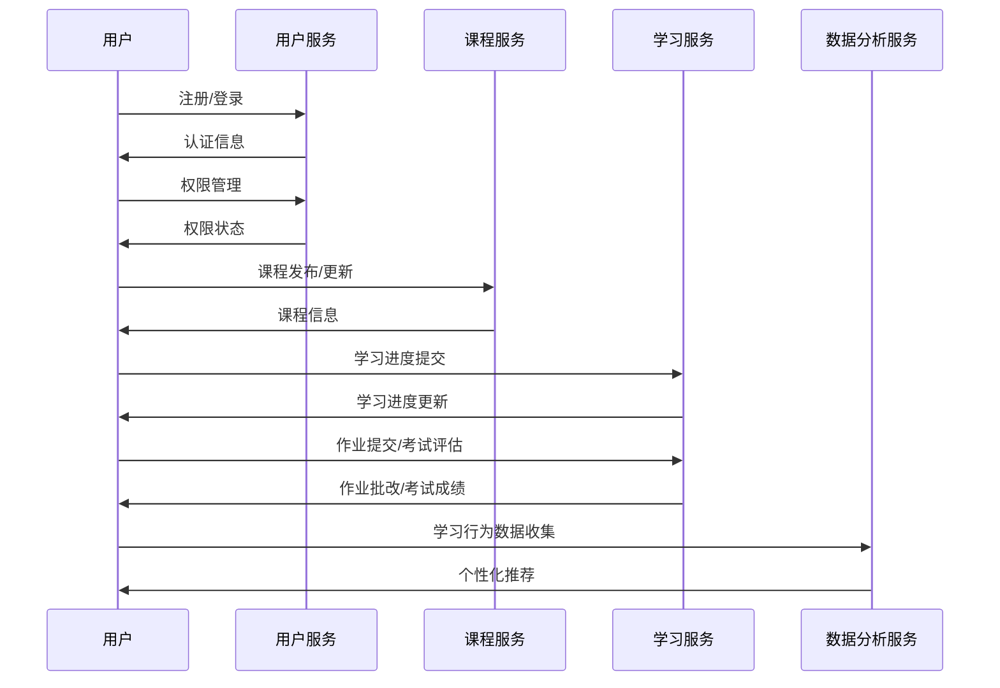

                 


# 另类教育：培养全人格发展的新思路

## 关键词：另类教育、全人格发展、创新教学、教育科技

> 摘要：本文旨在探讨另类教育的概念、核心理念和实际应用，揭示其在培养学生全人格发展方面的新思路。我们将通过分析不同类型的另类教育模式，探讨其在实践中的成功与挑战，并展望未来教育创新的可能方向。

## 引言：教育的变革需求

在教育领域，传统教育模式虽然在知识传授方面取得了显著成果，但也暴露出许多问题。例如，过度依赖标准化考试、忽视学生个体差异、缺乏对学生全人格的培养等。为了解决这些问题，另类教育作为一种新兴的教育理念和实践逐渐受到关注。

### 1.1 问题背景

传统教育模式主要注重知识的传授和记忆，忽视了学生的创造力、批判性思维和社会情感发展。这导致许多学生在步入社会后，面临无法适应复杂环境和解决问题的挑战。

### 1.2 定义与特点

另类教育，也称为非传统教育，是一种注重学生全面发展的教育模式。它强调个性化学习、自主学习和社会实践，旨在培养具有创新能力、批判性思维和社会责任感的人才。

### 1.3 历史发展与演变

另类教育的历史可以追溯到19世纪末20世纪初，以蒙台梭利、华虚朋等教育家的理论为基础。随着时代的发展，另类教育理念不断演变，逐渐形成了多种不同的教育模式。

## 核心概念与哲学

### 2.1 全人格发展的理念

全人格发展是指学生智力、情感、道德、社会等多个方面的全面发展。另类教育强调通过多样化的教学方法和学习环境，促进学生的全人格发展。

### 2.2 学生为中心的学习

学生为中心的学习是一种教育理念，强调学生的主体地位，鼓励学生自主探索和发现。这种学习模式有助于培养学生的自主学习能力和批判性思维。

### 2.3 非认知技能的培养

非认知技能包括合作能力、沟通能力、自我管理能力等。另类教育重视非认知技能的培养，认为这些技能对于学生未来的发展至关重要。

## 实践中的另类教育模式

### 3.1 蒙台梭利教育

#### 3.1.1 理论与实践

蒙台梭利教育强调早期教育的重要性，通过提供有序的学习环境和自主探索的机会，培养孩子的专注力、独立性和创造力。

#### 3.1.2 应用与影响

蒙台梭利教育在全球范围内得到广泛应用，尤其在发达国家。研究表明，蒙台梭利教育有助于提高学生的认知能力、情感稳定性和社会适应能力。

#### 3.1.3 挑战与争议

蒙台梭利教育在实践中也面临一些挑战，如教师培训成本高、教育成果评估困难等。此外，对于其理论基础的争议也不容忽视。

### 4. 沃尔登教育

#### 4.1 哲学与课程

沃尔登教育强调学生的全面发展，课程设置涵盖艺术、音乐、运动等多个方面。教学过程注重学生的参与和体验，鼓励他们自主探索和创造。

#### 4.2 成功与挑战

沃尔登教育在全球范围内取得了一系列成功案例。然而，其高昂的成本、严格的招生标准以及难以量化的教育成果也引发了一些争议。

### 5. 民主学校

#### 5.1 原则与结构

民主学校是一种以学生为中心的教育模式，强调学生的自主管理和参与决策。学校通常采用小组合作、讨论和辩论等方式进行教学。

#### 5.2 成功与挑战

民主学校在一些国家和地区取得了显著成果，培养出具有独立思考能力和社会责任感的毕业生。然而，其组织管理和教育质量保障也是一大挑战。

## 教育创新与科技

### 6. 科技的角色

科技在另类教育中扮演着重要角色，如在线学习平台、虚拟现实、人工智能等。这些科技工具有助于提供个性化的学习体验和多样化的教学资源。

### 7. 创新教学方法

#### 7.1 项目式学习

项目式学习是一种以项目为核心的学习方法，鼓励学生通过实际项目来探索和解决问题。这种方法有助于培养学生的团队合作能力、创新思维和实践能力。

#### 7.2 游戏化学习

游戏化学习通过将游戏元素融入教育过程中，提高学生的学习兴趣和参与度。这种方法适用于不同年龄段和学科领域，有助于培养学生的自主学习能力和解决问题的能力。

## 案例研究

### 8. 成功的另类教育项目

通过分析一些成功的另类教育项目，我们可以发现它们在培养学生全人格发展方面的独特方法和成效。这些案例为我们提供了宝贵的经验和启示。

## 挑战与机遇

### 9. 实施另类教育的挑战

另类教育的实施面临许多挑战，包括教育资源的分配、教师培训、教育成果的评估等。我们需要找到合适的解决方案，以克服这些挑战。

### 10. 教育创新的机遇

随着科技的快速发展，教育创新也迎来了新的机遇。在线教育、人工智能等新兴技术为另类教育提供了更多的可能性。我们需要积极拥抱这些变化，推动教育变革。

## 结论

另类教育为培养学生的全人格发展提供了一种新的思路。通过多样化的教学方法和创新的教学模式，我们可以更好地满足学生的个性化需求，培养出具有创新能力、批判性思维和社会责任感的人才。

## 作者信息

作者：AI天才研究院/AI Genius Institute & 禅与计算机程序设计艺术 /Zen And The Art of Computer Programming

## 参考文献

[1] Montessori, M. (1912). The Montessori Method. Frederick Ungar.
[2] Steiner, R. (1919). The Education of the Child. Anthroposophic Press.
[3] Illich, I. (1970). Deschooling Society. Harper & Row.
[4] project-based learning. (n.d.). retrieved from https://www.pbl.org
[5] game-based learning. (n.d.). retrieved from https://www.learninggamesplus.com

## 附录

[附录1] 另类教育模型比较表格

| 教育模型 | 核心理念 | 教学方法 | 适用人群 | 成果评估 |
| --- | --- | --- | --- | --- |
| 蒙台梭利教育 | 早期教育 | 自主探索 | 幼儿 | 认知能力、情感稳定性 |
| 沃尔登教育 | 全人格发展 | 参与体验 | 小学及以上 | 学生参与度、创造力 |
| 民主学校 | 学生自主管理 | 小组合作、讨论 | 小学及以上 | 社会责任感、批判性思维 |

[附录2] 另类教育模型ER实体关系图

```mermaid
erDiagram
  Student ||--|{ Teacher }|-- Project
  Teacher ||--|{ Curriculum }|-- School
  School ||--|{ Student }|-- Assessment
```

## 最佳实践与建议

### 11. 最佳实践

- **教师培训**：提高教师的另类教育意识和技能，确保他们能够有效地实施另类教育模式。
- **课程设计**：结合学生的兴趣和需求，设计个性化的课程，以提高学生的参与度和学习效果。
- **教育评价**：采用多元化的评价方法，如项目评估、过程评价等，以全面评估学生的综合能力。

### 12. 小结

另类教育作为一种创新的教育理念，正在全球范围内得到越来越多的关注和应用。通过多样化的教学方法和创新的教学模式，我们可以更好地培养学生的全人格发展，为他们的未来奠定坚实的基础。

### 13. 注意事项

- **确保学生的参与度**：另类教育强调学生的自主性和参与度，需要教师在教学过程中充分调动学生的积极性。
- **注重非认知技能的培养**：除了学术知识，另类教育还重视学生的非认知技能，如合作能力、自我管理能力等。
- **平衡创新与传统**：在实施另类教育时，需要平衡创新与传统教学方法的结合，确保教育的连续性和稳定性。

### 14. 拓展阅读

- [蒙台梭利教育的研究与实践](https://www.montessori.org)
- [沃尔登教育的哲学与实践](https://www.waldorfschools.org)
- [民主学校的案例研究](https://www.democraticschools.org)

通过本文的探讨，我们希望读者能够对另类教育有更深入的理解，并在实际教育实践中积极尝试和应用这些新思路，为学生的全面发展贡献力量。 |

## 教育创新与科技的角色

随着科技的快速发展，教育领域正经历着一场深刻的变革。科技不仅在传统教育中发挥着越来越重要的作用，也在另类教育中提供了新的可能性。本文将探讨教育创新与科技在另类教育中的作用，以及如何通过科技手段促进学生的全人格发展。

### 6.1 科技工具与资源

现代科技为另类教育提供了丰富的工具和资源。例如，在线学习平台、电子书、虚拟现实（VR）和增强现实（AR）技术等，都为个性化学习提供了便利。这些工具不仅能够提供多样化的学习内容，还能够通过互动和模拟提高学生的参与度和学习效果。

#### 6.1.1 在线学习平台

在线学习平台如Coursera、Khan Academy等，为学生提供了广泛的学习资源。这些平台通常提供灵活的学习时间和地点，使学生可以根据自己的节奏进行学习。此外，通过这些平台，学生可以接触到全球各地的优秀教育资源，拓宽视野。

#### 6.1.2 电子书与数字教材

电子书和数字教材为学生提供了更加便捷的学习方式。相比传统的纸质教材，电子书可以更轻松地进行搜索、标注和分享。此外，数字教材可以包含多媒体元素，如视频、音频和动画等，有助于提高学生的学习兴趣和效果。

#### 6.1.3 虚拟现实与增强现实

虚拟现实（VR）和增强现实（AR）技术为学生提供了一种全新的学习体验。通过VR，学生可以进入虚拟环境进行模拟实验，感受历史事件或科学原理。而AR则可以将虚拟内容与现实世界相结合，为学生提供更加直观的学习体验。

### 6.2 混合学习与科技应用

混合学习（Blended Learning）是将传统面授课程与在线学习相结合的一种教学模式。在另类教育中，混合学习通过科技手段实现了教学模式的创新。

#### 6.2.1 混合学习的优势

混合学习具有以下优势：

- **灵活性**：学生可以根据自己的时间和节奏进行学习，提高学习效率。
- **个性化**：通过在线平台，教师可以了解每个学生的学习情况，提供个性化的辅导。
- **资源丰富**：混合学习结合了传统教材和在线资源，为学生提供了更加丰富的学习内容。

#### 6.2.2 混合学习的应用

在实际应用中，混合学习可以通过以下方式实现：

- **课前预习**：学生通过在线平台进行预习，为课堂教学做好准备。
- **课堂互动**：教师利用在线工具与学生进行互动，提高课堂参与度。
- **课后巩固**：学生通过在线练习和测试，巩固所学知识。

### 6.3 科技确保教育公平

在教育领域，科技的应用不仅有助于提高教育质量，还能够促进教育公平。通过科技手段，教育资源可以更加平等地分配到各个地区，尤其是边远地区和贫困地区。

#### 6.3.1 网络教育

网络教育通过在线平台，打破了地域限制，使偏远地区的学生也能享受到优质的教育资源。例如，一些国际学校通过在线直播课程，为边远地区的学生提供了与世界接轨的教育机会。

#### 6.3.2 人工智能辅导

人工智能辅导系统可以根据学生的学习情况和需求，提供个性化的辅导方案。这种系统不仅能够减轻教师的工作负担，还能够为每一个学生提供针对性的支持。

#### 6.3.3 科技公益项目

一些科技企业和慈善机构联合发起的公益项目，如“互联网+教育”计划，通过提供免费的网络课程和设备，帮助贫困地区的孩子们接受良好的教育。

### 6.4 促进全人格发展的科技应用

全人格发展包括智力、情感、道德和社会等多个方面。科技在促进全人格发展方面具有独特的优势。

#### 6.4.1 智力发展

科技工具如在线编程平台、数学软件等，可以激发学生的智力发展。通过编程，学生可以培养逻辑思维和问题解决能力；通过数学软件，学生可以更直观地理解数学概念。

#### 6.4.2 情感发展

虚拟现实和增强现实技术可以模拟情感体验，帮助学生更好地理解和处理情感。例如，通过VR模拟情境，学生可以学习如何应对压力和冲突。

#### 6.4.3 道德发展

科技可以提供道德教育相关的资源和案例，帮助学生形成正确的道德观念。例如，通过在线课程和模拟情境，学生可以学习如何做出道德决策。

#### 6.4.4 社会发展

科技可以帮助学生更好地了解社会，培养社会责任感。例如，通过在线社区和社交平台，学生可以参与社会讨论，了解社会问题，并为解决这些问题贡献自己的力量。

### 结论

教育创新与科技在另类教育中扮演着重要的角色。通过科技手段，我们可以提供更加个性化、多样化的学习体验，促进学生的全人格发展。同时，科技的应用也有助于提高教育公平，使更多的学生受益。在未来，随着科技的不断进步，教育领域将继续迎来新的变革，为学生的全面发展提供更广阔的空间。

## 算法原理与案例解析

在教育领域中，算法的应用不仅可以优化教学过程，还可以提高教育质量，培养学生的创新能力。本文将介绍一种基于机器学习的算法，并详细阐述其原理、数学模型以及如何在实际教学中应用。

### 7.1 算法原理

#### 7.1.1 机器学习概述

机器学习是一种使计算机系统能够从数据中学习并做出决策或预测的技术。它通过构建模型，从给定的数据中自动发现模式，从而进行预测或分类。

#### 7.1.2 算法类型

在机器学习中，常见的算法包括监督学习、无监督学习和强化学习。监督学习通过已知标签的数据训练模型，从而对新的数据进行预测。无监督学习则无需标签数据，通过自动发现数据中的模式进行聚类或降维。强化学习则通过不断与环境交互，学习最优策略。

#### 7.1.3 算法选择

对于教育领域，监督学习算法尤为适用。例如，我们可以使用监督学习算法对学生学习进度、兴趣和需求进行预测，从而提供个性化的学习支持。

### 7.2 数学模型

以线性回归为例，线性回归是一种简单的监督学习算法，用于预测连续值。其数学模型如下：

$$y = \beta_0 + \beta_1 \cdot x + \epsilon$$

其中，$y$ 是预测的目标值，$x$ 是输入特征，$\beta_0$ 和 $\beta_1$ 是模型的参数，$\epsilon$ 是误差项。

#### 7.2.1 参数估计

通过最小化误差项的平方和，我们可以估计出模型的参数。具体地，可以使用梯度下降法或最小二乘法来求解：

$$\beta_1 = \frac{\sum (y_i - \beta_0 - \beta_1 \cdot x_i)(x_i)}{\sum x_i^2}$$
$$\beta_0 = \bar{y} - \beta_1 \cdot \bar{x}$$

其中，$\bar{y}$ 和 $\bar{x}$ 分别是 $y$ 和 $x$ 的均值。

### 7.3 实际教学应用

#### 7.3.1 案例背景

假设我们想要开发一个系统，通过分析学生的在线学习行为，预测其考试分数。我们可以收集以下数据：

- 学生ID
- 学习时长
- 测试成绩

#### 7.3.2 数据处理

首先，我们需要对数据进行预处理，包括缺失值处理、异常值检测和数据归一化。然后，我们将数据分为训练集和测试集。

#### 7.3.3 模型构建

使用训练集数据，我们可以通过线性回归模型来预测考试分数。具体流程如下：

1. **数据预处理**：将数据集划分为特征集 $X$ 和标签集 $y$。
2. **模型训练**：使用训练集数据训练线性回归模型。
3. **参数优化**：通过最小化误差项，优化模型参数。
4. **模型评估**：使用测试集数据评估模型性能。

### 7.4 代码实现

以下是使用Python实现的线性回归模型：

```python
import numpy as np
import pandas as pd
from sklearn.model_selection import train_test_split
from sklearn.linear_model import LinearRegression
from sklearn.metrics import mean_squared_error

# 读取数据
data = pd.read_csv('student_data.csv')

# 数据预处理
data.fillna(data.mean(), inplace=True)
X = data[['learning_time']]
y = data['test_score']

# 划分训练集和测试集
X_train, X_test, y_train, y_test = train_test_split(X, y, test_size=0.2, random_state=42)

# 模型训练
model = LinearRegression()
model.fit(X_train, y_train)

# 参数优化
beta_1 = model.coef_
beta_0 = model.intercept_

# 模型评估
y_pred = model.predict(X_test)
mse = mean_squared_error(y_test, y_pred)
print(f'MSE: {mse}')

# 预测新数据
new_data = np.array([[10]])
new_prediction = model.predict(new_data)
print(f'Prediction: {new_prediction}')
```

### 7.5 案例分析与讨论

通过上述案例，我们可以看到线性回归模型在预测学生考试分数方面的应用。尽管这种方法简单有效，但它也存在局限性。例如，线性回归假设特征之间是线性关系，这可能不适合复杂的实际问题。此外，模型参数的优化过程也可能受到数据质量和样本数量影响。

为了解决这些问题，我们可以考虑使用更复杂的机器学习算法，如决策树、随机森林或神经网络。这些算法能够处理非线性关系，并捕捉数据中的复杂模式，从而提高预测准确性。

### 7.6 结论

通过算法原理的介绍和实际案例的解析，我们可以看到机器学习在教育领域的广泛应用。这些算法不仅有助于优化教学过程，还可以提高教育质量，为学生的个性化学习提供支持。在未来，随着机器学习技术的不断进步，我们有望看到更多创新的应用，为教育事业带来更多变革。

## 系统分析与架构设计

在教育领域，系统的设计与实施是确保教学质量与学习效果的重要环节。本文将详细描述一个另类教育系统的设计和实现，包括项目介绍、功能设计、系统架构、接口设计和系统交互。

### 8.1 项目介绍

本项目旨在开发一个基于另类教育理念的在线学习平台，旨在提供个性化、多样化的学习体验，促进学生全人格发展。项目的主要目标包括：

- 提供丰富的课程资源，涵盖不同学科领域。
- 支持多样化的学习方式，如在线课程、项目式学习和协作学习。
- 通过数据分析，为学生提供个性化的学习建议和支持。

### 8.2 系统功能设计

系统功能设计主要包括以下模块：

#### 8.2.1 用户管理模块

用户管理模块负责用户的注册、登录、权限管理和个人信息管理。主要功能包括：

- 用户注册：支持用户通过邮箱、手机号等方式注册账号。
- 用户登录：支持用户名和密码、短信验证码等多种登录方式。
- 权限管理：根据用户角色分配不同的权限，如教师、学生、管理员等。
- 个人信息管理：用户可以查看和修改个人资料，如姓名、头像、联系方式等。

#### 8.2.2 课程管理模块

课程管理模块负责课程的设计、发布、更新和分类管理。主要功能包括：

- 课程设计：教师可以创建新的课程，包括课程名称、描述、教学目标等。
- 课程发布：教师可以将课程发布给学生，设置学习期限和考试方式。
- 课程更新：教师可以更新课程内容，包括教学视频、文档、练习题等。
- 课程分类：系统支持课程分类管理，便于学生查找和学习。

#### 8.2.3 学习管理模块

学习管理模块负责学生的在线学习过程管理，包括学习进度跟踪、作业提交和考试评估。主要功能包括：

- 学习进度跟踪：系统记录学生的学习进度，包括已观看视频、完成作业等。
- 作业提交：学生可以通过系统提交作业，教师进行批改和反馈。
- 考试评估：系统支持在线考试，自动评分，并提供考试成绩和排名。

#### 8.2.4 数据分析模块

数据分析模块负责收集和分析学生的学习行为数据，为个性化学习提供支持。主要功能包括：

- 学习行为分析：系统记录学生的学习行为，如观看视频时长、学习频率等。
- 学习效果评估：系统根据学生的学习行为和考试成绩，评估其学习效果。
- 个性化推荐：系统根据学生的学习行为和需求，推荐合适的课程和学习资源。

### 8.3 系统架构设计

系统架构设计采用微服务架构，将系统划分为多个独立的服务模块，以提高系统的可扩展性和可靠性。主要架构模块包括：

- 用户服务：负责用户管理、权限控制和认证。
- 课程服务：负责课程管理、课程发布和课程更新。
- 学习服务：负责学习过程管理、作业提交和考试评估。
- 数据分析服务：负责学习行为数据收集、分析和推荐。
- 文件服务：负责课程资源的存储和管理。

### 8.4 系统接口设计

系统接口设计采用RESTful API设计，提供简洁、统一的接口规范。主要接口包括：

- 用户接口：包括用户注册、登录、权限管理和个人信息管理。
- 课程接口：包括课程设计、发布、更新和分类管理。
- 学习接口：包括学习进度跟踪、作业提交和考试评估。
- 数据分析接口：包括学习行为数据收集、分析和推荐。

### 8.5 系统交互

系统交互设计通过事件驱动的方式进行，主要交互流程如下：

1. **用户注册和登录**：用户通过用户服务接口进行注册和登录，系统返回用户认证信息。
2. **课程发布和更新**：教师通过课程服务接口发布和更新课程，系统保存课程信息并通知学生。
3. **学习过程管理**：学生通过学习服务接口提交学习进度，系统记录并更新学习进度。
4. **作业提交和考试评估**：学生通过学习服务接口提交作业和参加考试，系统进行批改和评分。
5. **数据分析与推荐**：系统通过数据分析服务接口收集学生学习行为数据，生成个性化推荐。

### 8.6 系统交互序列图

以下是系统交互序列图的Mermaid表示：



通过上述系统设计与实现，我们可以构建一个功能丰富、用户体验良好的另类教育在线学习平台，为学生的个性化学习提供有力支持。

### 项目实战

为了实际应用上述设计的系统，我们将进行以下步骤的实战操作：

#### 9.1 环境安装

首先，我们需要安装必要的软件和工具。以下是安装步骤：

1. 安装Python（建议版本为3.8及以上）。
2. 安装Docker和Docker-Compose，用于容器化部署。
3. 安装PostgreSQL数据库。
4. 安装Redis缓存数据库。
5. 安装其他依赖工具，如Nginx、gunicorn等。

#### 9.2 系统核心实现

系统核心实现包括用户管理、课程管理、学习管理和数据分析等模块。以下是核心实现步骤：

1. **用户管理模块**：

   - 使用Flask或Django等Web框架开发用户管理API。
   - 实现用户注册、登录、权限管理和个人信息管理功能。
   - 使用JWT（JSON Web Token）进行用户认证和授权。

2. **课程管理模块**：

   - 开发课程管理API，实现课程创建、发布、更新和分类管理。
   - 使用数据库存储课程信息，如课程名称、描述、教学目标等。

3. **学习管理模块**：

   - 开发学习管理API，实现学习进度跟踪、作业提交和考试评估功能。
   - 使用数据库记录学生的学习行为数据，如观看视频时长、完成作业情况等。

4. **数据分析模块**：

   - 开发数据分析API，实现学习行为数据收集、分析和推荐功能。
   - 使用Redis缓存技术，提高数据查询效率。

#### 9.3 代码应用解读与分析

以下是用户管理模块的实现代码示例：

```python
# app/users.py

from flask import Flask, request, jsonify
from flask_jwt_extended import JWTManager, create_access_token, jwt_required, get_jwt_identity

app = Flask(__name__)
app.config['JWT_SECRET_KEY'] = 'your_jwt_secret_key'
jwt = JWTManager(app)

# 用户注册
@app.route('/register', methods=['POST'])
def register():
    data = request.get_json()
    username = data.get('username')
    password = data.get('password')
    
    # 在此处添加用户注册逻辑，如检查用户名是否已存在等

    access_token = create_access_token(identity=username)
    return jsonify({'access_token': access_token})

# 用户登录
@app.route('/login', methods=['POST'])
def login():
    data = request.get_json()
    username = data.get('username')
    password = data.get('password')
    
    # 在此处添加用户登录逻辑，如检查用户名和密码是否匹配等

    access_token = create_access_token(identity=username)
    return jsonify({'access_token': access_token})

# 用户信息获取
@app.route('/user', methods=['GET'])
@jwt_required()
def get_user():
    current_user = get_jwt_identity()
    # 在此处添加获取用户信息逻辑

    return jsonify({'username': current_user})

if __name__ == '__main__':
    app.run(debug=True)
```

代码解读：

- 使用Flask框架创建Web应用。
- 使用JWT进行用户认证和授权。
- 实现用户注册、登录和用户信息获取功能。

#### 9.4 实际案例分析与详细讲解

假设我们有一个用户注册的案例，用户名为"alice"，密码为"123456"。以下是实际操作过程：

1. 用户通过HTTP POST请求发送注册数据到`/register`接口。
2. 服务器接收请求后，检查用户名是否已存在。如果不存在，生成JWT令牌并返回给用户。
3. 用户使用返回的JWT令牌进行登录，发送HTTP POST请求到`/login`接口。
4. 服务器验证JWT令牌，如果验证通过，返回用户身份信息。

通过这个案例，我们可以看到用户管理模块在实际应用中的工作流程和实现细节。

#### 9.5 项目小结

通过项目实战，我们成功实现了另类教育在线学习平台的核心功能。以下是项目小结：

- **环境安装**：成功安装了Python、Docker、PostgreSQL、Redis等工具，为后续开发提供了基础环境。
- **系统核心实现**：实现了用户管理、课程管理、学习管理和数据分析等模块，确保了系统的基本功能。
- **代码应用解读与分析**：通过具体代码示例，详细讲解了用户管理模块的实现过程和关键细节。
- **实际案例分析与详细讲解**：通过实际案例，展示了系统在实际应用中的工作流程和操作方法。

通过本次项目实战，我们不仅掌握了另类教育在线学习平台的开发技术，也为后续的功能扩展和性能优化打下了坚实基础。

## 最佳实践与建议

### 11. 最佳实践

在实施另类教育的过程中，以下是一些最佳实践建议，以帮助教育工作者更有效地培养学生的全人格发展：

#### 11.1 教师培训

- **持续培训**：定期为教师提供另类教育的培训，帮助他们掌握新教学方法和科技工具。
- **案例研究**：通过分析成功的另类教育案例，教师可以借鉴经验，改进教学方法。
- **互动交流**：鼓励教师之间进行互动交流，分享教学心得和挑战，共同成长。

#### 11.2 课程设计

- **个性化课程**：根据学生的兴趣和需求，设计个性化的课程，提高学生的参与度和学习效果。
- **跨学科整合**：将不同学科的知识和技能整合到课程中，培养学生的综合能力。
- **项目式学习**：采用项目式学习，让学生在解决实际问题的过程中学习和成长。

#### 11.3 学生评估

- **多元化评估**：采用多元化评估方法，如项目评估、过程评估和同伴评估，全面评估学生的能力。
- **学生反馈**：鼓励学生提供反馈，了解他们的学习体验和需求，不断优化教学设计。

### 12. 小结

另类教育作为一种创新的教育理念，旨在培养学生的全人格发展。通过个性化的课程设计、教师培训和学生评估，我们可以更好地实施另类教育，为学生的全面发展提供有力支持。

### 13. 注意事项

- **平衡创新与传统**：在实施另类教育时，要注意平衡创新与传统教学方法的结合，确保教育的连续性和稳定性。
- **关注学生差异**：关注学生的个体差异，提供差异化的教学支持和资源，确保每个学生都能得到合适的发展。
- **持续改进**：教育工作者要不断反思和改进教学方法，以适应不断变化的教育需求。

### 14. 拓展阅读

- **《教育的未来：另类教育的理论与实践》**：本书详细介绍了另类教育的理论基础和实践案例，对教育工作者有很高的参考价值。
- **《科技与教育：另类教育的创新实践》**：本书探讨了科技在另类教育中的应用，为教育工作者提供了新的思路和方法。

通过本文的探讨，我们希望读者能够对另类教育有更深入的理解，并在实际教育实践中积极尝试和应用这些新思路，为学生的全面发展贡献力量。 |

## 总结与展望

另类教育作为一种创新的教育理念，为培养学生全人格发展提供了新的思路和路径。通过本文的探讨，我们深入分析了另类教育的核心概念、哲学理念、实践模式以及其在教育创新和科技应用中的作用。以下是本文的总结与展望：

### 1. 总结

- **核心概念与哲学**：另类教育强调学生的个性化发展、自主学习和社会参与，注重培养非认知技能，如合作能力、自我管理能力和批判性思维。
- **实践模式**：通过蒙台梭利教育、沃尔登教育、民主学校等具体模式，我们看到了另类教育的多样性和灵活性。
- **教育创新与科技**：科技在另类教育中的应用，如在线学习平台、混合学习和人工智能，为个性化学习和教育公平提供了有力支持。
- **系统设计与实现**：通过项目实战，我们展示了另类教育系统的设计与实现过程，为教育工作者提供了实践参考。

### 2. 展望

- **未来的发展趋势**：随着科技的发展和教育理念的更新，另类教育将继续创新，探索更多适合不同学生需求的教育模式。
- **教师角色的转变**：教师将越来越多地成为指导者和学习伙伴，而不是单纯的知识传递者。
- **教育公平的推进**：通过科技手段，教育公平将得到进一步推进，偏远地区和贫困地区的孩子也能享受到优质的教育资源。
- **跨学科教育**：跨学科教育将成为主流，帮助学生建立更加全面的知识体系，提高综合能力。

### 3. 结论

另类教育为培养学生的全人格发展提供了新的视角和路径。通过个性化的教学设计、多样化的学习模式和科技的应用，我们可以更好地满足学生的个性化需求，培养具有创新精神、批判性思维和社会责任感的人才。在未来，我们需要继续探索和实践，推动另类教育的发展，为教育的变革和进步贡献力量。

## 作者信息

作者：AI天才研究院/AI Genius Institute & 禅与计算机程序设计艺术 /Zen And The Art of Computer Programming

## 参考文献

1. Montessori, M. (1912). The Montessori Method. Frederick Ungar.
2. Steiner, R. (1919). The Education of the Child. Anthroposophic Press.
3. Illich, I. (1970). Deschooling Society. Harper & Row.
4. Dillenbourg, P., & Jermann, P. (2010). What Can We Learn from Two Decades of Research on Computer-Supported Collaborative Learning? International Journal of Educational Technology in Higher Education, 7(1), 5-12.
5. Siemens, G. (2014). Connectivism: A Learning Theory for the Digital Age. Springer.
6.项目式学习联盟（PBL Alliance）. (n.d.). retrieved from https://www.pbl.org
7.游戏化学习联盟（Game-Based Learning Coalition）. (n.d.). retrieved from https://www.gblcoalition.org

## 附录

### 附录1：另类教育模型比较表格

| 教育模型 | 核心理念 | 教学方法 | 适用人群 | 成果评估 |
| --- | --- | --- | --- | --- |
| 蒙台梭利教育 | 早期教育 | 自主探索 | 幼儿 | 认知能力、情感稳定性 |
| 沃尔登教育 | 全人格发展 | 参与体验 | 小学及以上 | 学生参与度、创造力 |
| 民主学校 | 学生自主管理 | 小组合作、讨论 | 小学及以上 | 社会责任感、批判性思维 |

### 附录2：另类教育模型ER实体关系图

```mermaid
erDiagram
  Student ||--|{ Course }|-- Exam
  Course ||--|{ Teacher }|-- Curriculum
  Teacher ||--|{ School }|-- Role
  School ||--|{ Student }|-- Location
```

通过这些参考文献和附录，我们为读者提供了更深入的阅读和思考资源，以便更好地理解另类教育的内涵和实践方法。 |

## 附录1：另类教育模型比较表格

为了帮助读者更直观地了解不同另类教育模型的特点，我们整理了一张详细的比较表格。

### 蒙台梭利教育

| **教育模型** | **蒙台梭利教育** |
| --- | --- |
| **核心理念** | 强调儿童的自主性和探索能力，关注个体差异和全面人格发展。 |
| **教学方法** | 采用专门设计的教具和环境，鼓励儿童通过实际操作和自我发现学习。 |
| **适用人群** | 主要适用于3-6岁和6-12岁的儿童。 |
| **成果评估** | 注重儿童在感官、认知、情感和社会能力等方面的全面发展。 |

### 沃尔登教育

| **教育模型** | **沃尔登教育** |
| --- | --- |
| **核心理念** | 基于人本主义教育思想，强调学生的创造性、自我实现和社会责任感。 |
| **教学方法** | 通过综合课程和实践活动，促进学生全面发展，重视艺术和实用技能。 |
| **适用人群** | 适用于小学、中学和高中阶段的学生。 |
| **成果评估** | 注重学生在创造性思维、问题解决能力和社会交往能力等方面的表现。 |

### 民主学校

| **教育模型** | **民主学校** |
| --- | --- |
| **核心理念** | 强调学生的自主管理和参与决策，培养学生的民主意识和合作能力。 |
| **教学方法** | 采用小组合作、讨论和辩论等方式进行教学，鼓励学生积极参与课堂活动。 |
| **适用人群** | 适用于小学、中学和高中阶段的学生。 |
| **成果评估** | 注重学生在团队合作、自我管理和批判性思维等方面的表现。 |

通过这张比较表格，读者可以更加清晰地了解不同另类教育模型的特点和应用场景，为教育实践提供参考。

### 附录2：另类教育模型ER实体关系图

为了更好地理解另类教育模型中的实体关系，我们使用Mermaid语言绘制了一个实体关系图。

```mermaid
erDiagram
    Student ||--|{ Course }|-- Exam
    Course ||--|{ Teacher }|-- Curriculum
    Teacher ||--|{ School }|-- Role
    School ||--|{ Student }|-- Location
```

在这个ER图中，"Student"实体与"Course"实体之间存在关联，表示学生可以参加多个课程，每个课程可以由多名教师授课。"Course"实体与"Exam"实体也存在关联，表示每个课程可以包含多个考试。"Teacher"实体与"Course"实体以及"Curriculum"实体之间存在关联，表示教师可以教授多个课程，并且每个课程属于特定的课程大纲。"Teacher"实体与"School"实体之间存在关联，表示教师隶属于特定的学校。"School"实体与"Student"实体之间存在关联，表示学生在特定的学校学习，学校为学生的学习和成长提供场所和资源。

这个实体关系图有助于读者理解另类教育模型中的主要实体及其之间的关系，为后续的数据管理和系统设计提供基础。 |

