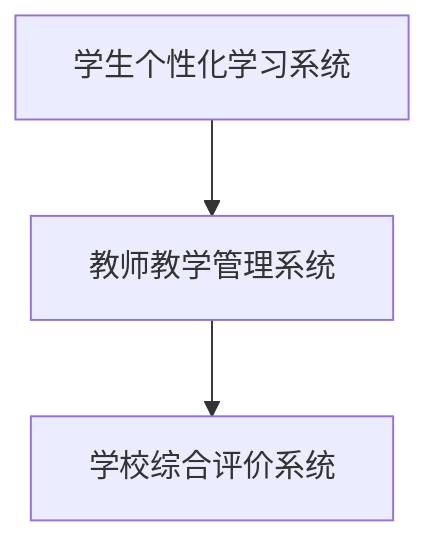
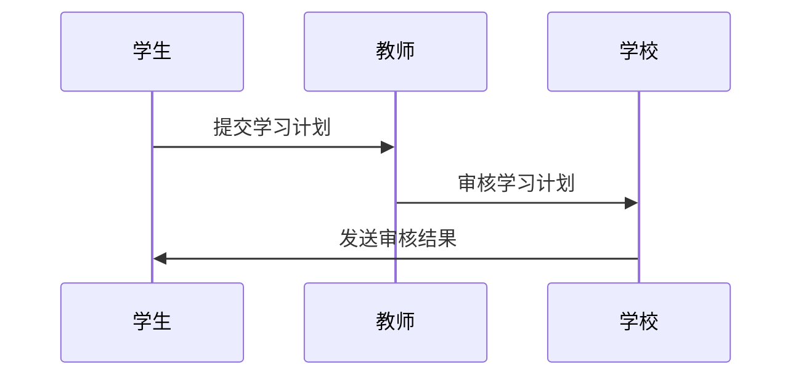
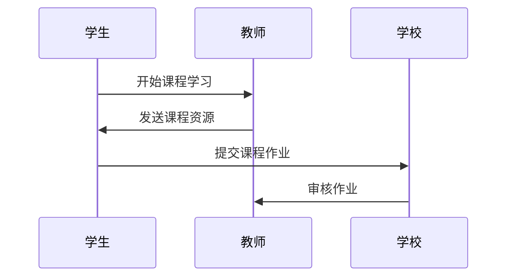

                 

# 另类教育：培养全人格发展的新方向

## 关键词

- 另类教育
- 全人格发展
- 个性化教育
- 实践导向
- 芬兰教育
- 中国教育
- 新加坡教育

## 摘要

本文旨在探讨另类教育作为一种新兴的教育理念，如何为培养具备全人格发展能力的学生提供新的方向。通过分析另类教育的定义、核心思想以及其实施策略，本文将对比芬兰、中国和新加坡的另类教育实践，以揭示其在促进学生全面发展、个性尊重和实践导向方面的优势。同时，本文还将讨论另类教育系统设计与实施的挑战与机遇，为未来教育改革提供有益的参考。

## 第一部分：背景介绍

### 第1章：问题背景

#### 1.1.1 教育现状与挑战

当前，传统教育体系在许多国家仍然占据主导地位。然而，随着社会的发展和个体需求的多元化，这一体系暴露出了诸多问题。首先，传统教育体系往往注重知识的传授，而忽视了学生的全面发展。学生在沉重的学业负担下，心理健康问题日益突出，如焦虑、抑郁等。此外，传统教育缺乏个性化和差异化，难以满足每个学生的独特需求，导致许多学生在学习过程中感到枯燥乏味，缺乏学习动力。

#### 1.1.2 另类教育的定义与核心思想

另类教育，顾名思义，是对传统教育模式的一种颠覆和创新。它起源于20世纪60年代的美国，旨在通过尊重学生的个性、注重实践和体验式学习，培养具备全人格发展的个体。另类教育的核心思想包括：全面发展、个性尊重和实践导向。全面发展强调在知识和技能之外，培养学生的人文素养、情感智慧和社会责任感；个性尊重则要求教育者关注学生的兴趣、特长和需求，提供差异化教学；实践导向强调学生在真实情境中学习，通过实际操作培养解决实际问题的能力。

#### 1.1.3 另类教育的优势与必要性

另类教育的优势在于它能够有效解决传统教育体系中的诸多问题。首先，它能够减轻学生的学业负担，改善学生的心理健康状况。通过个性化教育和实践导向，另类教育能够激发学生的学习兴趣，提高学习效率。其次，另类教育注重学生的全面发展，不仅传授知识，还培养学生的人文素养和社会责任感，使其成为具备综合素质的个体。在全球化背景下，这种能力显得尤为重要。因此，另类教育的出现具有必要性，它为教育改革提供了新的思路和方向。

## 第二部分：核心概念与联系

### 第2章：核心概念

#### 2.1.1 另类教育的核心概念

另类教育的核心概念包括全人格发展、个性化教育和实践导向。这些概念相互关联，共同构成了另类教育的理论基础。

- **全人格发展**：全人格发展是指在教育过程中，关注学生的心理、智力、道德、情感等多个方面，促使学生在各个方面得到协调发展。它强调教育不仅仅是知识的传授，更是学生综合能力的培养。
- **个性化教育**：个性化教育是根据学生的兴趣、特长和需求，进行差异化教学，使每个学生都能在适合自己的领域中发展。个性化教育关注学生的个体差异，尊重每个学生的独特性。
- **实践导向**：实践导向是指学生在真实情境中学习，通过实际操作获得知识和技能。实践导向强调理论联系实际，培养学生的动手能力和解决问题的能力。

#### 2.1.2 核心概念属性特征对比表格

| 概念       | 全人格发展 | 个性化教育 | 实践导向 |
|------------|------------|------------|----------|
| 定义       | 综合发展个体心理、智力、道德等多个方面 | 根据学生的兴趣、特长和需求进行差异化教学 | 强调学生在实践活动中获得知识和技能 |
| 关系       | 各个方面相互联系，共同发展 | 个性化教育是全人格发展的实现途径之一 | 实践导向是全人格发展的教学方式 |
| 重要性     | 提升学生的综合素质 | 促进学生的个性发展 | 培养学生的实践能力 |

#### 2.1.3 ER实体关系图架构

```mermaid
erDiagram
  Student ||--|{ Teacher }|-->: 教学关系
  Student ||--|{ Course }|-->: 学习关系
  Teacher ||--|{ Curriculum }|-->: 教学内容
  Course ||--|{ Assessment }|-->: 课程评价
```

在另类教育中，学生、教师、课程和评价构成了基本的教育实体。学生是教育的主体，教师是教育的引导者，课程是教育的载体，评价是教育的反馈机制。这种关系体现了另类教育中各要素之间的互动和关联。

## 第三部分：实践案例分析

### 第3章：实践案例分析

#### 3.1.1 案例一：芬兰的另类教育实践

芬兰被誉为世界上教育最成功的国家之一，其教育体系以另类教育理念为核心。芬兰的教育体系注重学生的个性化发展，强调学生的自主学习能力和创造力。在教育过程中，教师扮演的是引导者和支持者的角色，而非传统意义上的知识传授者。

- **个性化教育**：芬兰教育体系中的学生从小学起就接受个性化教育。学校会根据学生的兴趣、能力和需求，制定个性化的学习计划。这种个性化教育不仅体现在课程设置上，还包括学习方式和学习节奏的灵活调整。
- **实践导向**：芬兰的教育注重学生的实践能力培养。从小学到高中，学生都有大量的实践机会，如科学实验、艺术创作和社会实践等。通过这些实践活动，学生不仅能够学到知识，还能提高解决问题的能力和社会责任感。
- **教育成果**：芬兰的教育成果显著。根据国际学生评估项目（PISA）的数据，芬兰学生在全球范围内表现优异，尤其在阅读、数学和科学等领域具有显著优势。此外，芬兰学生的心理健康状况也较好，辍学率和犯罪率较低。

#### 3.1.2 案例二：中国的另类教育探索

中国的另类教育探索始于20世纪80年代，随着教育改革的不断深入，另类教育逐渐在一些学校和教育项目中得到推广。以下是一些代表性的另类教育实践案例：

- **华德福教育**：华德福教育是一种源自德国的另类教育体系，强调学生的全面发展，注重艺术和自然的结合。在中国，一些学校引进了华德福教育理念，开设了相关的课程和项目。
- **国际学校**：中国的国际学校普遍采用西方的教育模式和理念，注重学生的国际化发展和个性化教育。这些学校往往采用小班教学，提供丰富的课外活动和实践项目，以培养学生的综合素质。
- **创新实验室**：一些学校和教育机构建立了创新实验室，为学生提供动手实践的机会。这些实验室通常配备先进的设备和技术，教师扮演的是指导者和合作伙伴的角色。

#### 3.1.3 案例三：新加坡的另类教育模式

新加坡的教育体系以其严格的学术标准和高效的师资培训而闻名。近年来，新加坡也在积极推行另类教育，以应对全球化背景下的教育挑战。

- **全人教育**：新加坡的教育理念是全人教育，即培养全面发展的人。新加坡的教育体系强调学术成绩与品德、社交能力、创造力等非学术方面的平衡发展。
- **跨学科学习**：新加坡的教育注重跨学科学习，鼓励学生将不同学科的知识和技能相结合，培养解决问题的能力。例如，新加坡的中学课程中包含了科学、数学、文学等多个学科，通过项目式学习，促进学生综合能力的提升。
- **创新与创业教育**：新加坡政府高度重视创新和创业教育，在各级教育阶段都开设了相关的课程和活动。通过这些课程和活动，学生不仅能够学到创新思维和创业技能，还能培养团队协作和领导能力。

## 第四部分：系统设计与实施

### 第4章：系统设计与实施

#### 4.1.1 另类教育系统的需求分析

另类教育系统的需求分析是确保系统能够满足教育实践需求的关键步骤。以下是另类教育系统的需求分析：

- **学生需求分析**：学生是另类教育的核心，因此系统的设计必须充分考虑学生的需求。学生的需求包括个性化学习、实践机会、心理健康支持等。
- **教师需求分析**：教师是另类教育的实施者，系统的设计需要提供便捷的教学工具和资源，如在线课程、教学计划模板、学生反馈系统等。
- **学校管理需求分析**：学校管理层需要通过系统监控教学质量和学生表现，因此系统需要具备数据统计和分析功能，提供决策支持。

#### 4.1.2 另类教育系统的功能设计

另类教育系统的功能设计旨在支持个性化学习、教学管理和学校综合评价。以下是系统的功能模块：

- **学生个性化学习系统**：提供个性化学习路径规划、学习资源推荐、学习进度跟踪等功能。
- **教师教学管理系统**：包括课程管理、教学计划制定、学生成绩记录和教学质量评估等功能。
- **学校综合评价系统**：提供学生表现分析、教学质量评价、学校绩效评估等功能。

#### 4.1.3 另类教育系统的架构设计



在这个架构中，学生个性化学习系统是核心，它通过数据分析和个性化推荐，为学生提供定制化的学习体验。教师教学管理系统则支持教师的教学活动，提供便捷的教学工具和资源。学校综合评价系统则对学生的学习和教师的教学进行全面的评价，为教育决策提供数据支持。

#### 4.1.4 另类教育系统的接口设计



在这个接口设计中，学生提交学习计划，教师审核学习计划，学校反馈审核结果，形成了一个闭环的教育管理流程。

#### 4.1.5 另类教育系统的交互设计



在这个交互设计中，学生通过系统开始课程学习，教师发送课程资源，学生提交作业，学校审核作业，实现了学生、教师和学校之间的互动和协作。

## 第五部分：实施策略与建议

### 第5章：实施策略与建议

#### 5.1.1 另类教育的实施策略

实施另类教育需要系统的策略支持，以下是一些关键的实施策略：

- **教师培训与支持**：教师是另类教育的实施者，因此教师培训至关重要。教师需要了解另类教育的理念和方法，掌握相应的教学技能。学校可以组织培训课程、工作坊和研讨会，提供持续的专业发展支持。
- **教育资源建设**：另类教育需要丰富的教育资源支持。学校可以建立在线课程库、教学资源平台，为学生提供多样化的学习资源。同时，学校还可以引入外部教育资源，如虚拟实验室、在线辅导等。
- **学校管理与评价体系改革**：学校管理与评价体系需要与另类教育的理念和方法相匹配。学校可以建立学生个性化发展档案，定期进行学生表现评价，为教育决策提供数据支持。

#### 5.1.2 另类教育实施的挑战与应对

实施另类教育面临一系列挑战：

- **社会认知与接受度**：另类教育作为一种新兴的教育模式，其理念和方法可能与传统教育观念存在冲突。学校需要加强宣传，提高社会对另类教育的认知和接受度。
- **教师能力与专业发展**：教师需要具备较高的专业能力和教育技术素养。学校可以提供持续的教师培训和职业发展机会，提高教师的专业素养。
- **家长参与与支持**：家长是另类教育的重要参与者，其参与度和支持度直接影响教育的效果。学校需要与家长建立良好的沟通机制，促进家校合作。

#### 5.1.3 另类教育的未来发展趋势

随着技术的进步和社会的发展，另类教育将迎来新的发展机遇：

- **技术驱动下的另类教育创新**：人工智能、大数据、虚拟现实等技术的发展，为另类教育提供了新的工具和方法。学校可以运用这些技术，提升教育的个性化、互动性和实践性。
- **全球化背景下的另类教育交流**：全球化背景下，国际间的教育交流与合作日益频繁。学校可以通过国际合作项目，引进先进的教育理念和方法，推动另类教育的发展。
- **另类教育对教育体系的深远影响**：另类教育理念和方法将对传统教育体系产生深远影响。学校和教育机构需要积极适应这种变化，推动教育改革，培养具备全人格发展能力的未来人才。

## 第六部分：总结与展望

### 第6章：总结

另类教育作为一种新兴的教育理念，旨在培养具备全人格发展能力的学生。通过个性化教育、实践导向和全面发展，另类教育能够有效解决传统教育体系中的诸多问题。本文通过对芬兰、中国和新加坡的另类教育实践案例的分析，揭示了另类教育的优势和实践效果。同时，本文还讨论了另类教育系统的设计与实施，提出了实施策略与建议。展望未来，另类教育将在技术驱动、全球化背景下继续发展，对教育体系产生深远影响。

### 总结与展望

另类教育作为培养全人格发展的新方向，具有显著的优越性和必要性。它不仅关注学生的知识学习，更重视学生的全面发展，尊重个性，强调实践，为学生提供了更广阔的成长空间。通过对芬兰、中国和新加坡等国家的实践案例进行分析，我们可以看到另类教育在不同文化背景下都展现出了良好的效果。芬兰的个性化教育和实践导向，中国的多样化教育探索，新加坡的全人教育理念，都为另类教育提供了宝贵的经验和启示。

在实施策略方面，教师培训与支持、教育资源建设、学校管理与评价体系改革是关键。教师是另类教育的核心力量，他们的专业发展和教学能力的提升至关重要。同时，丰富的教育资源建设也为学生提供了更多样的学习路径和机会。学校管理与评价体系的改革，则有助于更好地适应另类教育的需求，提供全面的支持和反馈。

未来，随着技术的进步和全球化的发展，另类教育将迎来新的机遇。人工智能、大数据、虚拟现实等技术的应用，将进一步提升教育的个性化、互动性和实践性。国际间的教育交流与合作，也将促进另类教育的理念和方法在全球范围内的传播和应用。

总之，另类教育是教育改革的重要方向，它将为培养具备全人格发展能力的未来人才提供有力支持。我们期待着更多学校和教师在实践中探索和推广另类教育，为教育事业的进步贡献力量。

### 作者信息

作者：AI天才研究院/AI Genius Institute & 禅与计算机程序设计艺术 /Zen And The Art of Computer Programming

