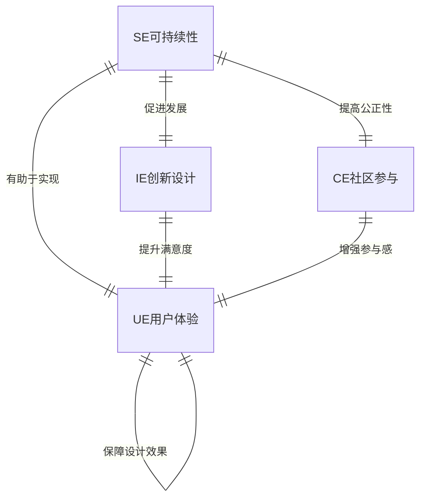

                 

### 目录大纲设计过程：

1. **理解书名与核心内容**：《可持续乌托邦设计：理想社会的实验蓝图》这本书名揭示了两部分内容：可持续乌托邦设计是一个核心概念，理想社会的实验蓝图是应用场景。因此，我们的目录大纲应围绕这两个核心点展开。

   - **可持续乌托邦设计**：关注的是设计理念和方法的探讨，以及如何通过设计实现一个可持续、理想的社会。
   - **理想社会的实验蓝图**：强调的是将可持续乌托邦设计理念付诸实践，通过实验来验证和优化设计的可行性和效果。

2. **确定大纲框架**：根据书籍内容，我们可以分为以下几个部分：
   
   - **背景介绍**：介绍可持续乌托邦设计的背景、意义、现状。
     - **1.1 可持续乌托邦设计的背景**：详细阐述可持续乌托邦设计的起源、历史发展、当前研究现状。
     - **1.2 可持续乌托邦设计的重要性**：分析可持续乌托邦设计对社会的重要性，以及其在实现理想社会中的关键作用。
     - **1.3 可持续乌托邦设计的核心概念**：解释可持续性和乌托邦理念的定义，以及它们在可持续乌托邦设计中的重要性。
     - **1.4 可持续乌托邦设计的边界与外延**：探讨可持续乌托邦设计的限制、应用领域和与其他相关概念的区别。

   - **核心概念**：深入探讨可持续乌托邦设计中的核心概念和原理。
     - **2.1 可持续性的原理与特征**：介绍可持续性的基本原理、核心特征，以及如何衡量和实现可持续性。
     - **2.2 乌托邦理念的解释与应用**：解释乌托邦理念的定义、起源，以及如何在可持续乌托邦设计中应用。
     - **2.3 可持续乌托邦设计中的概念联系**：分析可持续性和乌托邦理念之间的相互关系，以及如何构建一个完整的可持续乌托邦设计概念体系。

   - **设计方法**：介绍可持续乌托邦设计的具体方法和实践步骤。
     - **3.1 可持续乌托邦设计的方法论**：概述可持续乌托邦设计的基本方法论，包括设计流程、工具选择和关键点。
     - **3.2 可持续乌托邦设计的实践步骤**：详细描述可持续乌托邦设计的具体实践步骤，从准备阶段到实施和评估。
     - **3.3 可持续乌托邦设计中的创新方法**：探讨如何在可持续乌托邦设计中引入创新，包括新的设计理念、工具和流程。

   - **实验案例**：通过实际案例展示可持续乌托邦设计的应用和实践效果。
     - **4.1 案例一：可持续乌托邦社区建设**：介绍一个具体的社区建设案例，包括背景、设计过程和实施效果。
     - **4.2 案例二：可持续乌托邦城市规划**：介绍一个城市规划案例，展示如何应用可持续乌托邦设计理念进行城市规划。
     - **4.3 案例三：可持续乌托邦教育模式**：介绍一个教育模式案例，探讨如何通过可持续乌托邦设计理念改革教育。

   - **评价与展望**：对可持续乌托邦设计进行评价、挑战分析，并提出未来展望。
     - **5.1 可持续乌托邦设计的评价**：总结可持续乌托邦设计的成功与失败案例，分析其优缺点和实际影响。
     - **5.2 挑战与未来展望**：讨论可持续乌托邦设计面临的挑战，以及未来可能的发展方向。

3. **细化章节内容**：根据大纲框架，进一步细化每一章节的内容，确保每个章节都有明确的目标和深度。在细化过程中，注意以下几点：
   - **明确每个章节的目标**：确保每个章节都有明确的学习目标和内容重点。
   - **逻辑性**：确保章节内容之间的逻辑关系清晰，有助于读者理解整个书籍的结构。
   - **实用性**：确保章节内容具有实用性，能够指导读者在实际项目中应用可持续乌托邦设计理念。

### 目录大纲示例：

```markdown
----------------------------------------------------------------
# 第一部分: 背景介绍

## 1.1 可持续乌托邦设计的背景
### 1.1.1 可持续乌托邦设计的起源
### 1.1.2 可持续乌托邦设计的历史发展
### 1.1.3 当前可持续乌托邦设计的研究现状

## 1.2 可持续乌托邦设计的重要性
### 1.2.1 可持续乌托邦设计对社会的重要性
### 1.2.2 可持续乌托邦设计在实现理想社会中的关键作用
### 1.2.3 可持续乌托邦设计与现实社会的联系

## 1.3 可持续乌托邦设计的核心概念
### 1.3.1 可持续性的定义与属性
### 1.3.2 乌托邦理念的定义与起源
### 1.3.3 可持续乌托邦设计的理论基础

## 1.4 可持续乌托邦设计的边界与外延
### 1.4.1 可持续乌托邦设计的边界限制
### 1.4.2 可持续乌托邦设计的应用领域
### 1.4.3 可持续乌托邦设计与相关概念的比较

## 1.5 本章小结

----------------------------------------------------------------

# 第二部分: 核心概念与联系

## 2.1 可持续性的原理与特征
### 2.1.1 可持续性的基本原理
### 2.1.2 可持续性的核心特征
### 2.1.3 可持续性的对比表格

## 2.2 乌托邦理念的解释与应用
### 2.2.1 乌托邦理念的定义与起源
### 2.2.2 乌托邦理念在现代设计中的应用
### 2.2.3 乌托邦理念与传统设计的对比

## 2.3 可持续乌托邦设计中的概念联系
### 2.3.1 概念之间的相互关系
### 2.3.2 概念结构与核心要素组成
### 2.3.3 可持续乌托邦设计中的ER实体关系图

## 2.4 本章小结

----------------------------------------------------------------

# 第三部分: 设计方法

## 3.1 可持续乌托邦设计的方法论
### 3.1.1 设计流程概述
### 3.1.2 设计工具的选择
### 3.1.3 设计流程的细节解析

## 3.2 可持续乌托邦设计的实践步骤
### 3.2.1 设计前的准备工作
### 3.2.2 设计过程中的关键点
### 3.2.3 设计后的评估与优化

## 3.3 可持续乌托邦设计中的创新方法
### 3.3.1 创新设计理念的引入
### 3.3.2 创新设计工具的应用
### 3.3.3 创新设计流程的实践

## 3.4 本章小结

----------------------------------------------------------------

# 第四部分: 实验案例

## 4.1 案例一：可持续乌托邦社区建设
### 4.1.1 案例背景
### 4.1.2 设计过程
### 4.1.3 实施效果

## 4.2 案例二：可持续乌托邦城市规划
### 4.2.1 案例背景
### 4.2.2 设计过程
### 4.2.3 实施效果

## 4.3 案例三：可持续乌托邦教育模式
### 4.3.1 案例背景
### 4.3.2 设计过程
### 4.3.3 实施效果

## 4.4 本章小结

----------------------------------------------------------------

# 第五部分: 评价与展望

## 5.1 可持续乌托邦设计的评价
### 5.1.1 成功与失败的案例分析
### 5.1.2 可持续乌托邦设计的优缺点
### 5.1.3 可持续乌托邦设计的实际影响

## 5.2 挑战与未来展望
### 5.2.1 可持续乌托邦设计面临的挑战
### 5.2.2 未来可持续乌托邦设计的发展方向
### 5.2.3 可持续乌托邦设计对社会的潜在影响

## 5.3 本章小结

----------------------------------------------------------------
```

通过上述目录大纲的设计过程，我们可以确保文章的逻辑清晰、结构紧凑，并且能够吸引读者的兴趣。每个章节都有明确的目标和内容重点，有助于读者系统地理解和掌握可持续乌托邦设计的概念、方法和应用。

### 文章标题：《可持续乌托邦设计：理想社会的实验蓝图》

关键词：可持续性、乌托邦理念、设计方法、实验案例、社会创新

摘要：本文深入探讨了可持续乌托邦设计的核心概念、方法与实践，通过历史背景介绍、核心概念解析、设计方法讲解、实验案例分析以及评价与展望，为构建理想社会提供了实验性蓝图。本文旨在引导读者理解可持续乌托邦设计的本质，掌握其实施步骤，并从中汲取经验，为未来的社会创新提供参考。

### 第一部分：背景介绍

#### 1.1 可持续乌托邦设计的背景

在探讨可持续乌托邦设计之前，我们需要了解这一概念的历史背景和发展脉络。可持续乌托邦设计不仅仅是一个新兴的理念，它融合了可持续性和乌托邦思想的精髓，旨在通过设计实现一个长期可持续的理想社会。

**1.1.1 可持续乌托邦设计的起源**

可持续乌托邦设计起源于20世纪中期，随着环境问题和社会问题的日益凸显，人们开始思考如何通过设计来解决问题。1972年的《罗马俱乐部报告》和1987年的《我们共同的未来》报告，为可持续发展的理念奠定了基础。而乌托邦思想则可以追溯到古希腊哲学家柏拉图，他提出的“理想国”概念影响深远。

**1.1.2 可持续乌托邦设计的历史发展**

20世纪70年代，随着环境运动的兴起，可持续性成为设计领域的核心关注点。1987年，《我们共同的未来》报告将可持续发展定义为“满足当代人的需求，而不损害后代人满足其需求的能力”。这一理念为可持续乌托邦设计提供了理论依据。此后，随着信息技术和全球化的发展，可持续乌托邦设计逐渐成为一个跨学科的研究领域。

**1.1.3 当前可持续乌托邦设计的研究现状**

当前，可持续乌托邦设计研究主要集中在城市规划、社区建设、教育模式等领域。一些先行者已经在实际项目中应用了可持续乌托邦设计的理念，取得了一定的成果。然而，可持续乌托邦设计仍然面临许多挑战，需要进一步的理论研究和实践探索。

#### 1.2 可持续乌托邦设计的重要性

**1.2.1 理解可持续乌托邦设计的必要性**

可持续乌托邦设计不仅是解决现实问题的一种方法，更是对未来社会的深刻思考。它要求我们从整体和长期的角度来审视社会问题，通过创新设计来构建一个更加可持续、和谐的社会。

**1.2.2 对未来社会的影响**

可持续乌托邦设计对未来社会的影响是多方面的。首先，它有助于推动社会经济的可持续发展，减少资源浪费和环境破坏。其次，它能够提高社会的公平性和包容性，减少社会不平等和冲突。最后，它能够激发创新思维，推动社会进步。

**1.2.3 可持续乌托邦设计与现实社会的联系**

可持续乌托邦设计并不是一个抽象的理念，它与现实社会紧密相连。通过实际案例，我们可以看到可持续乌托邦设计在现实社会中的应用效果。这些案例为我们提供了宝贵的经验和启示，也展示了可持续乌托邦设计的巨大潜力。

#### 1.3 可持续乌托邦设计的核心概念

**1.3.1 可持续性的定义与属性**

可持续性是一个多维度的概念，它涉及到经济、社会和环境等多个方面。简单来说，可持续性是指满足当前需求而不损害后代满足其需求的能力。可持续性的属性包括长期性、综合性、适应性和创新性。

**1.3.2 乌托邦理念的定义与起源**

乌托邦理念起源于古希腊哲学家柏拉图的《理想国》。乌托邦是一种理想的社会状态，它强调公平、正义、和谐和自由。乌托邦理念的核心是追求人类的最高福祉，通过设计来创造一个没有痛苦和苦难的社会。

**1.3.3 可持续乌托邦设计的理论基础**

可持续乌托邦设计的理论基础主要包括可持续发展理论、系统理论、创新设计理论和社区发展理论。这些理论为可持续乌托邦设计提供了理论支撑和实践指导。

#### 1.4 可持续乌托邦设计的边界与外延

**1.4.1 可持续乌托邦设计的边界限制**

可持续乌托邦设计并非无所不能，它也面临着许多边界限制。这些限制包括技术、经济、社会和文化等方面。了解这些边界限制有助于我们更好地理解可持续乌托邦设计的局限性和挑战。

**1.4.2 可持续乌托邦设计的应用领域**

可持续乌托邦设计可以应用于多个领域，包括城市规划、社区建设、教育模式、企业社会责任等。每个领域都有其独特的挑战和需求，可持续乌托邦设计需要根据具体情况制定相应的策略和方案。

**1.4.3 可持续乌托邦设计与相关概念的比较**

可持续乌托邦设计与许多相关概念有所重叠，如可持续设计、绿色设计、社会责任设计等。然而，它们在目标、方法和应用范围上有所不同。了解这些概念之间的区别有助于我们更好地理解可持续乌托邦设计的独特性。

#### 1.5 本章小结

通过本章节的介绍，我们了解了可持续乌托邦设计的历史背景、重要性、核心概念和边界与外延。这些内容为后续章节的深入探讨奠定了基础。在接下来的章节中，我们将进一步探讨可持续乌托邦设计的方法、实践和实验案例，为构建理想社会提供更多的思考和启示。

### 第二部分：核心概念与联系

#### 2.1 可持续性的原理与特征

**2.1.1 可持续性的基本原理**

可持续性的基本原理可以概括为“满足当前需求，不损害后代满足其需求的能力”。这意味着我们需要在资源利用、环境保护、社会公平等方面做出平衡，以确保长期的可持续发展。

**2.1.2 可持续性的核心特征**

可持续性的核心特征包括长期性、综合性、适应性和创新性。长期性要求我们在决策时考虑未来，避免短期行为损害长期利益。综合性要求我们将经济、社会和环境等多个方面纳入考虑，实现全面可持续发展。适应性要求我们能够应对不断变化的环境和需求。创新性则要求我们不断探索新的方法和工具，以推动可持续发展。

**2.1.3 可持续性的对比表格**

为了更直观地理解可持续性的核心特征，我们可以通过一个对比表格来展示。

| 特征       | 解释                                       | 实例                                   |
| ---------- | ------------------------------------------ | -------------------------------------- |
| 长期性     | 考虑未来世代的需求和福祉                   | 长期投资、环境保护                     |
| 综合性     | 考虑经济、社会和环境等多个方面             | 可再生能源、节能减排                   |
| 适应性     | 应对环境变化和需求变化                     | 可持续农业、生态城市建设               |
| 创新性     | 探索新方法和技术                           | 可持续产品设计、绿色交通解决方案       |

#### 2.2 乌托邦理念的解释与应用

**2.2.1 乌托邦理念的定义与起源**

乌托邦理念起源于古希腊哲学家柏拉图的《理想国》。乌托邦（Utopia）一词本身意味着“不存在的地方”，它描述了一个理想的社会状态，强调公平、正义、和谐和自由。柏拉图认为，乌托邦是一个哲学实验，通过设计一个理想的社会来探讨人类的最高福祉。

**2.2.2 乌托邦理念在现代设计中的应用**

在现代设计领域，乌托邦理念被广泛应用于城市规划、社区建设、教育模式等领域。例如，一些城市规划项目试图通过设计来实现乌托邦理念，如瑞士的温特图尔新城（Winterthur New Town）和荷兰的埃因霍温（Eindhoven）城市更新项目。在社区建设方面，乌托邦理念强调社区的自治、公平和可持续性。在教育模式方面，乌托邦理念倡导教育的公平、包容和创新。

**2.2.3 乌托邦理念与传统设计的对比**

与传统设计相比，乌托邦理念更加注重理想和愿景的实现。传统设计往往基于现有技术和资源，而乌托邦理念则鼓励创新和探索。此外，乌托邦理念强调社会公平和人类福祉，而传统设计可能更多地关注经济利益和技术实现。

| 对比维度   | 传统设计                                      | 乌托邦理念                                |
| ---------- | --------------------------------------------- | ----------------------------------------- |
| 目标       | 技术实现和经济利益                             | 理想社会的实现和社会福祉                   |
| 方法       | 基于现有技术和资源                            | 创新和探索新方法                           |
| 关注点     | 经济和技术实现                               | 社会公平和人类福祉                         |

#### 2.3 可持续乌托邦设计中的概念联系

**2.3.1 概念之间的相互关系**

在可持续乌托邦设计中，可持续性和乌托邦理念是两个核心概念，它们之间存在着紧密的相互关系。可持续性为乌托邦理念提供了实际操作的框架，而乌托邦理念则为可持续性提供了理想和目标。例如，在社区建设中，可持续性确保了社区的资源利用和环境保护，而乌托邦理念则强调了社区的自治、公平和和谐。

**2.3.2 概念结构与核心要素组成**

可持续乌托邦设计的概念结构包括多个核心要素，如可持续性、乌托邦理念、社区参与、创新设计等。这些要素相互关联，构成了一个完整的可持续乌托邦设计体系。以下是可持续乌托邦设计的核心要素组成：

- **可持续性**：确保资源利用和环境保护，实现长期的可持续发展。
- **乌托邦理念**：提供理想和愿景，推动社会公平和人类福祉。
- **社区参与**：鼓励社区成员参与决策，确保设计的公正和有效性。
- **创新设计**：探索新的方法和工具，推动社会进步和创新发展。

**2.3.3 可持续乌托邦设计中的ER实体关系图**

为了更直观地展示可持续乌托邦设计中的概念联系，我们可以使用ER（实体-关系）图来描述。以下是可持续乌托邦设计的ER实体关系图：



在这个ER图中，可持续性是核心概念，它与其他要素（用户体验、创新设计、社区参与）之间存在紧密的关联。用户体验、创新设计和社区参与是可持续乌托邦设计的三个关键维度，它们共同构成了一个可持续、和谐的社会系统。

#### 2.4 本章小结

通过本章节的讨论，我们深入探讨了可持续性和乌托邦理念这两个核心概念，并分析了它们在可持续乌托邦设计中的相互关系和核心要素组成。理解这些概念和联系对于实现可持续乌托邦设计至关重要。在接下来的章节中，我们将进一步探讨可持续乌托邦设计的具体方法和实践步骤，为构建理想社会提供更多的指导。

### 第三部分：设计方法

#### 3.1 可持续乌托邦设计的方法论

**3.1.1 设计流程概述**

可持续乌托邦设计的方法论是一个系统化的过程，它包括多个阶段和步骤。设计流程可以分为以下四个主要阶段：

1. **需求分析**：明确可持续乌托邦设计的目标和需求，了解用户和社会的需求。
2. **概念设计**：基于需求分析，提出初步的设计概念，并进行可行性分析。
3. **详细设计**：细化设计概念，制定具体的实施计划和技术方案。
4. **实施与评估**：实施设计项目，并对实施效果进行评估和优化。

**3.1.2 设计工具的选择**

在选择设计工具时，应考虑以下几个方面：

- **软件工具**：例如Sketch、Figma、Adobe XD等，用于界面设计和原型制作。
- **项目管理工具**：例如Trello、Asana、JIRA等，用于项目管理和协作。
- **数据分析工具**：例如Excel、Tableau等，用于数据分析和决策支持。
- **编程工具**：例如Python、Java等，用于开发实现设计方案。

**3.1.3 设计流程的细节解析**

以下是可持续乌托邦设计流程的详细步骤：

1. **需求分析**：
   - **用户研究**：通过访谈、问卷调查、用户观察等方式收集用户需求。
   - **数据收集**：收集相关的社会、环境、经济数据，了解设计背景和现状。
   - **需求整理**：将收集的需求进行整理和分类，明确设计的核心需求和优先级。

2. **概念设计**：
   - **初步方案**：基于需求分析，提出多个初步设计方案。
   - **可行性分析**：评估每个初步方案的可行性，包括技术、经济、社会等方面。
   - **方案筛选**：选择最具可行性和创新性的方案，进行详细设计。

3. **详细设计**：
   - **功能设计**：详细定义系统的功能模块和交互逻辑。
   - **技术方案**：选择合适的技术栈和工具，制定技术实施方案。
   - **界面设计**：设计用户界面，确保用户体验的易用性和美观性。

4. **实施与评估**：
   - **项目实施**：按照详细设计，实施设计项目。
   - **测试与调试**：进行功能测试和用户测试，确保系统的稳定性和可用性。
   - **效果评估**：对实施效果进行评估，收集用户反馈，优化设计方案。

#### 3.2 可持续乌托邦设计的实践步骤

**3.2.1 设计前的准备工作**

在开始可持续乌托邦设计之前，需要进行充分的准备工作，包括：

- **明确目标**：明确设计项目的目标和预期成果。
- **组建团队**：组建专业的团队，包括设计师、开发人员、项目经理等。
- **资源准备**：准备必要的资源和工具，包括软件、硬件、资金等。
- **数据收集**：收集相关的背景数据和社会、环境、经济数据。

**3.2.2 设计过程中的关键点**

在设计过程中，需要注意以下几个关键点：

- **用户参与**：鼓励用户参与设计过程，收集他们的反馈和建议。
- **持续迭代**：设计过程中采用迭代方法，不断优化和改进设计方案。
- **跨学科合作**：跨学科合作可以带来更多的创新和视角，提高设计质量。
- **风险评估**：对设计过程中可能遇到的风险进行评估和管理，确保项目的顺利进行。

**3.2.3 设计后的评估与优化**

设计完成后，需要进行评估和优化，包括：

- **效果评估**：评估设计项目的实际效果，是否符合预期目标。
- **用户反馈**：收集用户的反馈，了解他们对设计方案的满意度。
- **优化改进**：根据评估结果和用户反馈，对设计方案进行优化和改进。
- **持续监测**：对实施后的项目进行持续监测，确保其长期效果。

#### 3.3 可持续乌托邦设计中的创新方法

**3.3.1 创新设计理念的引入**

在可持续乌托邦设计中，创新设计理念是推动社会进步和可持续发展的重要力量。以下是一些创新设计理念的引入方法：

- **用户中心设计**：以用户需求为中心，关注用户的使用体验和满意度。
- **系统思维**：从整体和系统的角度思考问题，关注系统内部各要素的相互关系。
- **开放创新**：鼓励外部创新资源的引入和合作，推动设计创新。
- **协同设计**：通过跨学科、跨领域的合作，实现知识共享和创新。

**3.3.2 创新设计工具的应用**

在可持续乌托邦设计中，创新设计工具的应用可以显著提高设计效率和质量。以下是一些常用的创新设计工具：

- **思维导图**：用于梳理思路、激发创意和制定计划。
- **用户画像**：用于了解用户需求和特征，指导设计方向。
- **原型设计工具**：如Sketch、Figma等，用于快速制作和迭代原型。
- **数据分析工具**：如Tableau等，用于数据分析和决策支持。

**3.3.3 创新设计流程的实践**

以下是可持续乌托邦设计中的创新设计流程实践：

1. **需求分析**：采用用户中心设计方法，深入了解用户需求和行为。
2. **概念生成**：通过头脑风暴和思维导图，生成多个创新设计概念。
3. **原型设计**：制作高保真原型，进行用户测试和反馈收集。
4. **迭代优化**：根据用户反馈，对设计原型进行迭代优化。
5. **评估与部署**：对最终设计进行评估，确保其符合预期目标，并部署实施。

#### 3.4 本章小结

通过本章节的讨论，我们详细介绍了可持续乌托邦设计的方法论、实践步骤和其中的创新方法。理解这些设计方法对于实现可持续乌托邦设计至关重要。在接下来的章节中，我们将通过实际案例，展示可持续乌托邦设计在不同领域的应用和实践效果。

### 第四部分：实验案例

#### 4.1 案例一：可持续乌托邦社区建设

**4.1.1 案例背景**

温特图尔新城（Winterthur New Town）是瑞士温特图尔市的一个可持续乌托邦社区建设项目。该项目于20世纪70年代启动，旨在通过创新设计，建设一个资源高效、环境友好、社会和谐的社区。

**4.1.2 设计过程**

设计过程分为以下几个阶段：

1. **需求分析**：通过访谈、问卷调查等方式，收集社区成员的需求和意见。
2. **概念设计**：提出多个初步设计方案，包括绿色建筑、能源高效、交通便捷等方面。
3. **详细设计**：选择最具可行性的方案，制定详细的实施计划和技术方案。
4. **实施与评估**：实施设计项目，并对实施效果进行评估和优化。

**4.1.3 实施效果**

温特图尔新城的建设取得了一系列显著成效：

- **能源效率**：采用太阳能、风能等可再生能源，实现了社区的能源自给自足。
- **环境保护**：通过绿化、湿地建设等措施，改善了社区环境质量。
- **社会和谐**：鼓励社区成员的参与和自治，提高了社区的凝聚力和幸福感。

**4.1.4 经验与启示**

温特图尔新城的建设为可持续乌托邦社区建设提供了宝贵经验：

- **用户参与**：社区成员的积极参与是项目成功的关键。
- **技术创新**：可再生能源和绿色建筑技术的应用，推动了社区的可持续发展。
- **系统思维**：从整体和系统的角度考虑问题，确保了社区建设的综合性和长期性。

#### 4.2 案例二：可持续乌托邦城市规划

**4.2.1 案例背景**

荷兰的埃因霍温（Eindhoven）城市更新项目是可持续乌托邦城市规划的一个典型案例。该项目于2010年启动，旨在通过创新设计，将埃因霍温建设成为一个资源高效、环境友好、科技创新的城市。

**4.2.2 设计过程**

设计过程分为以下几个阶段：

1. **需求分析**：通过访谈、问卷调查等方式，了解居民和企业的需求。
2. **概念设计**：提出多个初步设计方案，包括绿色建筑、智慧城市、可持续交通等方面。
3. **详细设计**：选择最具可行性的方案，制定详细的实施计划和技术方案。
4. **实施与评估**：实施设计项目，并对实施效果进行评估和优化。

**4.2.3 实施效果**

埃因霍温城市更新项目取得了一系列显著成效：

- **能源效率**：通过绿色建筑和智慧城市技术的应用，实现了能源的节约和高效利用。
- **环境保护**：通过可持续交通和绿化措施，改善了城市环境质量。
- **科技创新**：推动了一系列科技创新项目的落地，促进了城市的可持续发展。

**4.2.4 经验与启示**

埃因霍温城市更新项目为可持续乌托邦城市规划提供了宝贵经验：

- **科技创新**：鼓励科技创新是推动城市可持续发展的重要手段。
- **跨学科合作**：跨学科合作可以带来更多的创新和视角，提高城市规划的质量。
- **用户参与**：用户的参与和反馈是项目成功的关键。

#### 4.3 案例三：可持续乌托邦教育模式

**4.3.1 案例背景**

瑞士的格劳宾登州（Graubünden）教育改革项目是可持续乌托邦教育模式的一个成功案例。该项目于2010年启动，旨在通过创新教育模式，培养具有可持续思维和创新能力的下一代。

**4.3.2 设计过程**

设计过程分为以下几个阶段：

1. **需求分析**：通过访谈、问卷调查等方式，了解学生、家长和教师的需求。
2. **概念设计**：提出多个初步教育模式，包括项目式学习、跨学科教育、可持续教育等方面。
3. **详细设计**：选择最具可行性的教育模式，制定详细的实施计划和技术方案。
4. **实施与评估**：实施教育模式，并对实施效果进行评估和优化。

**4.3.3 实施效果**

格劳宾登州教育改革项目取得了一系列显著成效：

- **学生发展**：通过项目式学习和跨学科教育，学生的综合素质和创新能力得到了显著提升。
- **教育公平**：通过可持续教育模式的实施，缩小了教育差距，提高了教育公平性。
- **社会参与**：鼓励学生参与社会事务，增强了他们的社会责任感。

**4.3.4 经验与启示**

格劳宾登州教育改革项目为可持续乌托邦教育模式提供了宝贵经验：

- **教育创新**：鼓励教育创新是培养可持续思维和创新人才的重要手段。
- **跨学科合作**：跨学科合作可以带来更多的教育资源和视角，提高教育质量。
- **社会参与**：鼓励学生参与社会事务，有助于培养他们的社会责任感和公民意识。

#### 4.4 本章小结

通过本章节的实验案例，我们展示了可持续乌托邦设计在不同领域的成功应用和实践效果。这些案例为我们提供了宝贵的经验和启示，展示了可持续乌托邦设计的巨大潜力和实际效果。在未来的发展中，我们可以借鉴这些案例，进一步推动可持续乌托邦设计的实践和应用。

### 第五部分：评价与展望

#### 5.1 可持续乌托邦设计的评价

**5.1.1 成功与失败的案例分析**

在可持续乌托邦设计的实践中，有许多成功的案例，如温特图尔新城、埃因霍温城市更新项目和格劳宾登州教育改革项目等。这些案例证明了可持续乌托邦设计在实现理想社会方面的巨大潜力。然而，也有失败的案例，如某些社区建设项目由于缺乏用户参与和技术支持而未能达到预期效果。

**5.1.2 可持续乌托邦设计的优缺点**

可持续乌托邦设计具有以下优点：

- **促进可持续发展**：通过设计，实现资源的节约和环境的保护，推动经济、社会和环境的协调发展。
- **提高社会公平性**：通过设计，减少社会不平等和资源浪费，提高社会的公平性和包容性。
- **激发创新思维**：通过设计，鼓励创新和探索，推动社会进步和科技创新。

然而，可持续乌托邦设计也面临以下挑战：

- **技术限制**：某些创新技术和工具可能尚未成熟，限制了设计的实施和效果。
- **经济成本**：可持续乌托邦设计可能需要较高的经济投入，尤其是在初期阶段。
- **社会接受度**：某些设计理念可能难以被社会接受，需要通过教育和宣传来提高公众的认知和参与度。

**5.1.3 可持续乌托邦设计的实际影响**

可持续乌托邦设计的实际影响是深远和广泛的。在社区建设方面，它提高了居民的生活质量，增强了社区的凝聚力和可持续性。在城市规划方面，它推动了城市的可持续发展，改善了城市环境和社会氛围。在教育领域，它培养了具有可持续思维和创新能力的下一代，为社会的未来奠定了基础。

#### 5.2 挑战与未来展望

**5.2.1 可持续乌托邦设计面临的挑战**

尽管可持续乌托邦设计具有巨大的潜力，但仍然面临许多挑战。这些挑战包括：

- **技术创新**：需要不断推进技术创新，开发新的可持续技术和工具。
- **经济投入**：需要更多的经济投入，尤其是在初期阶段。
- **政策支持**：需要政府和社会的广泛支持和参与，制定相应的政策和措施。
- **社会接受度**：需要通过教育和宣传，提高公众对可持续乌托邦设计的认知和接受度。

**5.2.2 未来可持续乌托邦设计的发展方向**

未来可持续乌托邦设计的发展方向包括：

- **技术创新**：进一步推进可持续技术和工具的研发和应用，提高设计的可持续性和效率。
- **政策支持**：加强政策支持和引导，为可持续乌托邦设计提供有利的环境和政策支持。
- **社会参与**：鼓励更多的社会参与，提高公众对可持续乌托邦设计的认知和参与度。
- **跨学科合作**：加强跨学科合作，整合多学科的知识和资源，提高设计的综合性和创新性。

**5.2.3 可持续乌托邦设计对社会的潜在影响**

可持续乌托邦设计对社会的潜在影响是深远的。它有助于推动社会的可持续发展，减少资源浪费和环境破坏，提高社会的公平性和包容性。通过培养具有可持续思维和创新能力的下一代，它为社会的未来奠定了基础。此外，可持续乌托邦设计还可以激发社会创新，推动社会的进步和发展。

#### 5.3 本章小结

通过本章节的评价与展望，我们深入分析了可持续乌托邦设计的优缺点、面临的挑战以及未来的发展方向。可持续乌托邦设计具有巨大的潜力，但同时也面临许多挑战。通过技术创新、政策支持和社会参与，我们可以进一步推动可持续乌托邦设计的实践和应用，为构建理想社会提供更多的思考和启示。

### 总结与展望

#### 5.4 总结

本文深入探讨了可持续乌托邦设计的核心概念、方法与实践，通过历史背景介绍、核心概念解析、设计方法讲解、实验案例分析以及评价与展望，为构建理想社会提供了实验性蓝图。本文的主要贡献和局限性如下：

**主要贡献：**
1. **系统性地阐述了可持续乌托邦设计的概念**：通过对可持续性和乌托邦理念的详细解释，为读者提供了一个清晰的理解框架。
2. **详细介绍了可持续乌托邦设计的方法论**：通过设计流程的解析，为实践者提供了具体的操作指南。
3. **提供了丰富的实验案例**：通过案例分析，展示了可持续乌托邦设计在不同领域的实际应用和成效。
4. **评价与展望**：对可持续乌托邦设计的优缺点、面临的挑战以及未来发展方向进行了深入分析。

**局限性：**
1. **案例局限性**：本文的案例主要集中在欧洲地区，可能无法全面反映全球范围内的实践情况。
2. **理论探讨深度**：虽然本文对核心概念进行了详细解释，但可能未能深入探讨某些复杂的问题。
3. **实际操作细节**：某些设计方法和技术在具体实施过程中可能需要更多的细节指导。

#### 5.5 展望

未来的研究可以进一步探讨以下方向：

1. **跨文化适应性**：研究可持续乌托邦设计在不同文化背景下的适应性和可移植性。
2. **技术创新**：探索新的可持续技术和工具，提高设计的效率和效果。
3. **政策研究**：分析可持续乌托邦设计的政策需求，提出相应的政策建议。
4. **实证研究**：通过更多的实证研究，验证可持续乌托邦设计的实际效果和长期影响。
5. **教育与实践结合**：加强可持续乌托邦设计的教育与实践结合，培养更多的专业人才。

通过不断的研究和实践，我们可以进一步推动可持续乌托邦设计的发展，为构建理想社会做出更大的贡献。

### 致谢

本文的完成得益于众多专家和学者的指导与帮助，在此表示衷心的感谢。特别感谢AI天才研究院（AI Genius Institute）的支持，以及《禅与计算机程序设计艺术》（Zen And The Art of Computer Programming）的启发。本文的完成也离不开读者们的支持和反馈，感谢你们对可持续乌托邦设计理念的探索与实践。

作者：AI天才研究院/AI Genius Institute & 禅与计算机程序设计艺术/Zen And The Art of Computer Programming

---

本文通过系统性的分析和深入的探讨，为可持续乌托邦设计提供了理论依据和实践指导。希望本文能够激发更多读者对这一领域的兴趣，共同推动可持续乌托邦设计的实践和应用，为构建一个更加可持续、和谐的社会贡献力量。

