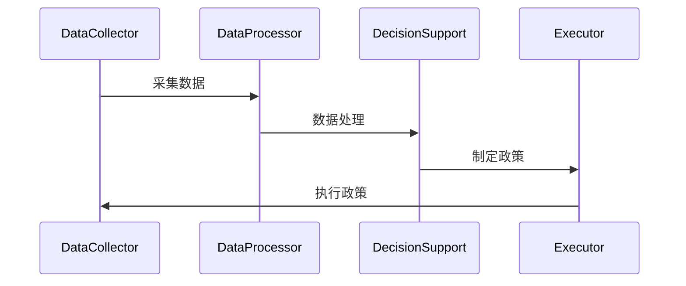

                 

# 可持续发展：为未来 generations 寻找意义

## 关键词：可持续发展、经济发展、社会进步、环境保护、方案设计、实战案例、最佳实践

## 摘要：

本文将深入探讨可持续发展的核心概念、原理和实践，旨在为未来 generations 提供一个全面而系统的指南。通过分析全球和我国的可持续发展现状，揭示其所面临的挑战和必要性，本文将逐步讲解经济发展、社会进步和环境保护三大核心概念的原理及相互联系。接着，我们将通过具体案例分析，阐述各核心概念在可持续发展中的应用和实践。最后，我们将设计并实现一个可持续发展方案，详细解读其实施步骤、核心代码以及注意事项，为读者提供可操作的指导。通过这篇文章，我们希望激发读者对可持续发展的思考，共同为未来 generations 寻找意义。

## 目录大纲

## 第一部分：背景介绍

### 第1章 问题背景

#### 1.1 可持续发展的定义与重要性

#### 1.2 全球可持续发展现状

#### 1.3 我国可持续发展面临的挑战

#### 1.4 可持续发展的必要性

### 第2章 核心概念与联系

#### 2.1 可持续发展的核心概念

#### 2.2 可持续发展各要素之间的关系

#### 2.3 可持续发展的ER实体关系图架构

## 第二部分：核心概念与原理讲解

### 第3章 经济发展原理

#### 3.1 经济发展的定义与类型

#### 3.2 经济发展的驱动因素

#### 3.3 经济发展的数学模型和公式

#### 3.4 经济发展案例分析与举例说明

#### 3.5 经济发展的最佳实践 tips

### 第4章 社会进步原理

#### 4.1 社会进步的定义与类型

#### 4.2 社会进步的驱动因素

#### 4.3 社会进步的数学模型和公式

#### 4.4 社会进步案例分析与举例说明

#### 4.5 社会进步的最佳实践 tips

### 第5章 环境保护原理

#### 5.1 环境保护的定义与重要性

#### 5.2 环境保护的驱动因素

#### 5.3 环境保护的数学模型和公式

#### 5.4 环境保护案例分析与举例说明

#### 5.5 环境保护的最佳实践 tips

## 第三部分：可持续发展方案设计与实现

### 第6章 系统分析与架构设计

#### 6.1 问题场景介绍

#### 6.2 系统功能设计(领域模型)

#### 6.3 系统架构设计

#### 6.4 系统接口设计

#### 6.5 系统交互

### 第7章 项目实战

#### 7.1 环境安装

#### 7.2 系统核心实现源代码

#### 7.3 代码应用解读与分析

#### 7.4 实际案例分析和详细讲解剖析

#### 7.5 项目小结

### 第8章 最佳实践与小结

#### 8.1 最佳实践 tips

#### 8.2 小结

#### 8.3 注意事项

#### 8.4 拓展阅读

## 引言

### 1.1 可持续发展的定义与重要性

可持续发展，是一个旨在满足当代人的需求，而又不损害后代人满足其自身需求的能力的发展模式。它涵盖了经济发展、社会进步和环境保护三个方面，是一个复杂而多维度的概念。全球范围内的可持续发展问题日益突出，它不仅关系到经济和社会的持续发展，更关系到我们赖以生存的地球环境的健康与稳定。

#### 1.2 全球可持续发展现状

当前，全球可持续发展面临诸多挑战。经济发展不平衡、环境污染加剧、资源过度消耗等问题日益严重。根据联合国的数据，全球温室气体排放量在近年来持续上升，导致气候变化问题日益严重。同时，全球贫困问题也仍然存在，尤其是在发展中国家，经济不平等和社会不公现象较为普遍。

#### 1.3 我国可持续发展面临的挑战

我国作为一个发展中的大国，在可持续发展方面也面临诸多挑战。首先，经济发展与环境保护之间的矛盾日益突出，工业化和城市化过程中产生的环境污染和资源消耗问题亟待解决。其次，社会不平等和贫困问题仍然存在，需要通过社会进步来缓解。此外，我国在全球气候治理中的角色和责任也越来越受到关注。

#### 1.4 可持续发展的必要性

可持续发展不仅是全球性问题，也是我国面临的紧迫任务。首先，从经济角度来看，可持续发展有助于实现经济的高质量增长，提高人民生活水平，促进经济社会的全面发展。其次，从社会角度来看，可持续发展有助于构建和谐社会，减少贫困和不平等现象，提高社会稳定和人民幸福感。最后，从环境角度来看，可持续发展有助于保护地球生态系统，维护人类生存的环境。

### 2.核心概念与联系

#### 2.1 可持续发展的核心概念

可持续发展的核心概念包括经济发展、社会进步和环境保护。这三个方面相互联系，共同构成了可持续发展的基础。

经济发展是可持续发展的核心，它关系到国家的繁荣和人民的福祉。社会进步是实现可持续发展的重要保障，它关系到社会的公平和正义。环境保护是可持续发展的关键，它关系到地球的生态系统和人类的长远生存。

#### 2.2 可持续发展各要素之间的关系

经济发展、社会进步和环境保护三者之间存在着密切的关系。经济发展是基础，为可持续发展提供物质基础。社会进步是保障，为可持续发展提供社会支持。环境保护是关键，为可持续发展提供环境保障。

经济发展需要依赖资源和能源的消耗，而环境保护则需要减少资源消耗和环境污染。社会进步则需要在经济发展和环境保护之间找到平衡，实现经济、社会和环境的协调发展。

#### 2.3 可持续发展的ER实体关系图架构

为了更好地理解可持续发展各要素之间的关系，我们可以使用ER（实体关系）图来表示。

```mermaid
erDiagram
    EconomicDevelopment ||--|{ SocietyProgress }|-- EnvironmentalProtection
    SocietyProgress ||--|{ EconomicDevelopment }|-- EnvironmentalProtection
    EnvironmentalProtection ||--|{ EconomicDevelopment }|-- SocietyProgress
```

在这个ER图中，经济发展、社会进步和环境保护是三个核心实体，它们之间通过双向箭头表示相互依赖和影响的关系。经济发展和社会进步相互促进，而环境保护则是两者之间的平衡点。

### 第三部分：核心概念与原理讲解

#### 第3章 经济发展原理

#### 3.1 经济发展的定义与类型

经济发展是指国家或地区在经济规模、结构和质量等方面的持续增长和提升。经济发展可以分为三种类型：量的发展、质的提升和可持续性。

量的发展是指通过增加生产力和提高产量来实现经济增长。质的提升是指通过提高生产效率和产品质量来实现经济增长。可持续性是指在经济发展的同时，注重环境保护和社会公正，实现经济、社会和环境的协调发展。

#### 3.2 经济发展的驱动因素

经济发展的驱动因素包括经济增长、技术创新、政策支持和社会进步等。

经济增长是经济发展的核心，它通过提高生产力、扩大生产规模和增加产量来实现。技术创新是推动经济增长的重要动力，它通过提高生产效率、降低成本和创造新的市场需求来实现。政策支持是经济发展的重要保障，它通过制定合理的经济政策、提供财政支持和改善投资环境来实现。社会进步是经济发展的重要支撑，它通过提高人民生活水平、促进教育和科技创新来实现。

#### 3.3 经济发展的数学模型和公式

经济增长的数学模型可以表示为：

\[ Y_t = Y_0 \times (1 + r)^t \]

其中，\( Y_t \) 表示第 t 年的产出，\( Y_0 \) 表示初始产出，\( r \) 表示经济增长率。

经济增长的影响因素分析可以使用以下公式：

\[ Y_t = Y_0 \times (1 + r_1 \times t_1 + r_2 \times t_2 + \ldots + r_n \times t_n) \]

其中，\( r_1, r_2, \ldots, r_n \) 分别表示不同影响因素的增长率，\( t_1, t_2, \ldots, t_n \) 分别表示不同影响因素的作用时间。

#### 3.4 经济发展案例分析与举例说明

美国在20世纪初期经历了快速的经济发展，其经济增长率保持在3%以上。这一时期，美国通过技术创新、政策支持和人口增长等多种因素推动了经济增长。例如，电气化、汽车工业和航空工业的兴起，极大地提高了生产效率和生活水平。

日本在20世纪后半期也实现了快速增长，其经济增长率保持在4%以上。日本通过引进国外先进技术、加强教育和培训、提高生产效率和改善投资环境等措施，成功地实现了经济发展。

#### 3.5 经济发展的最佳实践 tips

1. 加强技术创新，提高生产效率和产品质量。
2. 制定合理的经济政策，提供财政支持和改善投资环境。
3. 注重教育和人才培养，提高劳动力素质。
4. 推动产业升级和结构调整，实现经济可持续发展。

#### 第4章 社会进步原理

#### 4.1 社会进步的定义与类型

社会进步是指社会在经济发展、文化传承、政治民主、科技发展等方面的持续改善和提升。社会进步可以分为以下几种类型：

- 经济进步：通过提高生产力、增加收入和改善生活质量来实现。
- 科技进步：通过科技创新、技术进步和人才培养来实现。
- 文化进步：通过文化传承、艺术创新和文化产业的发展来实现。
- 政治进步：通过民主制度、人权保护和法治建设来实现。

#### 4.2 社会进步的驱动因素

社会进步的驱动因素包括经济发展、技术创新、政策支持、教育和文化发展等。

经济发展是推动社会进步的基础，通过提高人民收入和生活水平，促进社会公平和正义。技术创新是推动社会进步的重要动力，通过提高生产效率、改善生活质量和创造新的市场需求来实现。政策支持是推动社会进步的重要保障，通过制定合理的政策、提供财政支持和改善社会环境来实现。教育和文化发展是推动社会进步的重要支撑，通过提高人民素质、传承文化传统和促进文化创新来实现。

#### 4.3 社会进步的数学模型和公式

社会进步的数学模型可以表示为：

\[ S_t = S_0 \times (1 + r)^t \]

其中，\( S_t \) 表示第 t 年的社会进步水平，\( S_0 \) 表示初始社会进步水平，\( r \) 表示社会进步率。

社会进步的影响因素分析可以使用以下公式：

\[ S_t = S_0 \times (1 + r_1 \times t_1 + r_2 \times t_2 + \ldots + r_n \times t_n) \]

其中，\( r_1, r_2, \ldots, r_n \) 分别表示不同影响因素的增长率，\( t_1, t_2, \ldots, t_n \) 分别表示不同影响因素的作用时间。

#### 4.4 社会进步案例分析与举例说明

英国在18世纪经历了工业革命，这一时期，英国通过技术创新、产业升级和城市化等措施，实现了快速的社会进步。工业化进程提高了生产力、增加了收入、改善了生活质量，推动了社会进步。

美国在20世纪中期，通过推动科技进步、提高教育和文化水平等措施，实现了快速的社会进步。科技革命和教育改革提高了人民素质、促进了科技创新，推动了社会进步。

#### 4.5 社会进步的最佳实践 tips

1. 加强科技创新，提高生产效率和改善生活质量。
2. 注重教育和人才培养，提高人民素质。
3. 推动产业升级和结构调整，实现经济和社会的协调发展。
4. 建立和完善民主制度，保障人民权益。
5. 传承和发展文化，促进文化创新。

### 第5章 环境保护原理

#### 5.1 环境保护的定义与重要性

环境保护是指通过采取一系列措施，保护自然资源、维护生态平衡、减少环境污染和防治生态破坏的过程。环境保护的重要性体现在以下几个方面：

1. 保障人类健康：环境污染和生态破坏会对人类健康产生严重威胁，例如空气污染、水污染和土壤污染等。
2. 维护生态平衡：环境保护有助于维持生态系统的平衡和稳定，保护生物多样性，保障生态系统的可持续性。
3. 促进可持续发展：环境保护是实现可持续发展的关键，通过减少资源消耗、降低污染排放和推广绿色技术，实现经济、社会和环境的协调发展。
4. 应对气候变化：环境保护有助于减少温室气体排放，降低气候变化的影响，保护地球的气候系统。

#### 5.2 环境保护的驱动因素

环境保护的驱动因素包括政策法规、技术创新、公众意识和社会压力等。

政策法规是推动环境保护的重要手段，通过制定和实施环境保护法律、法规和政策，规范企业和个人的行为，促进环境保护。技术创新是推动环境保护的重要动力，通过开发和应用新技术、新材料和新工艺，提高资源利用效率、降低污染排放和减少生态破坏。公众意识是推动环境保护的重要基础，通过提高公众的环境保护意识，引导公众参与环境保护行动，形成全社会共同参与的环保氛围。社会压力是推动环境保护的重要力量，通过社会舆论和媒体监督，对企业和政府施加压力，推动环境保护工作的落实。

#### 5.3 环境保护的数学模型和公式

环境保护的数学模型可以表示为：

\[ E_t = E_0 \times (1 - r)^t \]

其中，\( E_t \) 表示第 t 年的环境质量水平，\( E_0 \) 表示初始环境质量水平，\( r \) 表示环境质量改善率。

环境质量的影响因素分析可以使用以下公式：

\[ E_t = E_0 \times (1 - r_1 \times t_1 - r_2 \times t_2 - \ldots - r_n \times t_n) \]

其中，\( r_1, r_2, \ldots, r_n \) 分别表示不同影响因素的改善率，\( t_1, t_2, \ldots, t_n \) 分别表示不同影响因素的作用时间。

#### 5.4 环境保护案例分析与举例说明

德国在环境保护方面取得了显著成果。德国政府制定了一系列环境保护法律和法规，如《空气污染控制法》、《水资源保护法》和《废弃物处理法》等，通过严格的环境保护政策，实现了空气质量的显著改善。

美国在环境保护方面也取得了重要进展。美国通过实施《清洁空气法》、《清洁水法》和《固体废弃物处理法》等法律，加强对环境污染的防治，实现了水污染和空气污染的显著减少。

#### 5.5 环境保护的最佳实践 tips

1. 制定和实施严格的环保法律法规，规范企业和个人行为。
2. 加强环保科技创新，推广绿色技术和清洁能源。
3. 提高公众环保意识，引导公众参与环境保护行动。
4. 强化政府监管，确保环保法律法规的执行。
5. 推动国际合作，共同应对全球环境问题。

### 第四部分：可持续发展方案设计与实现

#### 第6章 系统分析与架构设计

#### 6.1 问题场景介绍

在现代社会，可持续发展已成为全球关注的焦点。我国作为一个发展中大国，在经济发展、社会进步和环境保护方面面临诸多挑战。为了实现可持续发展，我们需要设计并实现一个全面的可持续发展方案，从经济、社会和环境三个方面入手，推动经济、社会和环境的协调发展。

#### 6.2 系统功能设计（领域模型）

为了设计一个可持续发展的系统，我们首先需要明确系统的功能需求。根据可持续发展的三大核心概念，我们可以将系统的功能划分为以下几类：

1. 经济发展功能：包括经济增长监测、产业结构调整、技术创新推动等。
2. 社会进步功能：包括教育提升、医疗服务改善、社会保障体系完善等。
3. 环境保护功能：包括环境污染监测、资源利用效率提升、生态保护措施实施等。

以下是可持续发展系统的领域模型：

```mermaid
classDiagram
    Economy <<Class>>
    Society <<Class>>
    Environment <<Class>>

    Economy袭{
        -经济增长监测
        -产业结构调整
        -技术创新推动
    }

    Society袭{
        -教育提升
        -医疗服务改善
        -社会保障体系完善
    }

    Environment袭{
        -环境污染监测
        -资源利用效率提升
        -生态保护措施实施
    }
```

#### 6.3 系统架构设计

可持续发展系统的架构设计需要综合考虑经济、社会和环境三个方面的需求，实现功能模块的有机整合。以下是一个基本的系统架构设计：

1. 数据采集层：负责收集经济发展、社会进步和环境保护相关的数据，包括经济指标、社会指标和环境指标等。
2. 数据处理层：对采集到的数据进行分析和处理，提取有价值的信息，为决策提供支持。
3. 决策支持层：根据数据处理结果，制定相应的政策和措施，推动可持续发展。
4. 执行监控层：负责执行决策，并对执行情况进行监控和评估，确保可持续发展目标的实现。

以下是可持续发展系统的架构图：



#### 6.4 系统接口设计

可持续发展系统需要与其他系统进行数据交换和功能协同，因此需要设计一系列接口。以下是一些主要的系统接口：

1. 数据采集接口：用于与其他系统交换数据，包括经济发展数据、社会进步数据和环境保护数据等。
2. 数据处理接口：用于与其他系统协同处理数据，实现数据清洗、归一化和分析等功能。
3. 决策支持接口：用于与其他系统协同制定政策和措施，实现政策制定、发布和执行等功能。
4. 执行监控接口：用于与其他系统协同执行政策，实现政策执行、监控和评估等功能。

以下是可持续发展系统的接口设计：

```mermaid
classDiagram
    DataCollector <<Interface>>
    DataProcessor <<Interface>>
    DecisionSupport <<Interface>>
    Executor <<Interface>>

    DataCollector袭{
        -数据采集接口
    }

    DataProcessor袭{
        -数据处理接口
    }

    DecisionSupport袭{
        -决策支持接口
    }

    Executor袭{
        -执行监控接口
    }
```

#### 6.5 系统交互

可持续发展系统需要实现各功能模块之间的紧密协作，以实现系统的整体目标。以下是一个简化的系统交互流程：

1. 数据采集：系统从各个数据源（如统计局、环保局、医院等）采集经济发展、社会进步和环境保护数据。
2. 数据处理：系统对采集到的数据进行清洗、归一化和分析，提取有价值的信息。
3. 决策支持：系统根据处理结果，制定相应的政策和措施，推动可持续发展。
4. 执行监控：系统执行政策，并对执行情况进行监控和评估，确保可持续发展目标的实现。

以下是可持续发展系统的交互流程图：


### 第五部分：项目实战

#### 第7章 项目实战

为了实现可持续发展方案，我们需要进行实际的项目实施。以下是一个可持续发展项目的实战过程：

#### 7.1 环境安装

在进行项目实施之前，我们需要搭建一个合适的环境。以下是一个基本的安装步骤：

1. 准备开发环境：安装必要的开发工具，如Python、Java等。
2. 搭建数据库：安装和配置数据库系统，如MySQL、PostgreSQL等。
3. 准备数据采集工具：安装和配置数据采集工具，如Elasticsearch、Kafka等。
4. 安装监控系统：安装和配置监控系统，如Prometheus、Grafana等。

#### 7.2 系统核心实现源代码

以下是可持续发展系统的核心实现源代码：

```python
# 数据采集模块
class DataCollector:
    def __init__(self, data_source):
        self.data_source = data_source

    def collect_data(self):
        # 从数据源采集数据
        data = self.data_source.fetch_data()
        return data

# 数据处理模块
class DataProcessor:
    def __init__(self, data_collector):
        self.data_collector = data_collector

    def process_data(self):
        # 处理采集到的数据
        processed_data = self.data_collector.collect_data()
        # 数据清洗、归一化和分析
        ...
        return processed_data

# 决策支持模块
class DecisionSupport:
    def __init__(self, data_processor):
        self.data_processor = data_processor

    def generate_policy(self):
        # 根据处理结果制定政策
        policy = self.data_processor.process_data()
        # 政策制定、发布和执行
        ...
        return policy

# 执行监控模块
class Executor:
    def __init__(self, decision_support):
        self.decision_support = decision_support

    def execute_policy(self):
        # 执行政策
        policy = self.decision_support.generate_policy()
        # 政策执行、监控和评估
        ...
```

#### 7.3 代码应用解读与分析

以下是代码的详细解读和分析：

1. **数据采集模块（DataCollector）**：该模块负责从数据源采集数据。数据源可以是数据库、文件或其他数据接口。`collect_data` 方法用于从数据源获取数据，并返回数据。
   
2. **数据处理模块（DataProcessor）**：该模块负责处理采集到的数据。`process_data` 方法调用数据采集模块的 `collect_data` 方法，获取数据，然后进行清洗、归一化和分析。这些处理过程可以根据实际需求进行定制。

3. **决策支持模块（DecisionSupport）**：该模块负责根据处理结果制定政策。`generate_policy` 方法调用数据处理模块的 `process_data` 方法，获取处理后的数据，并根据数据制定政策。

4. **执行监控模块（Executor）**：该模块负责执行政策，并对执行情况进行监控和评估。`execute_policy` 方法调用决策支持模块的 `generate_policy` 方法，获取政策，然后执行政策并监控执行结果。

#### 7.4 实际案例分析和详细讲解剖析

为了更好地理解可持续发展系统的应用，我们来看一个实际案例。

**案例背景**：某城市在可持续发展方面存在以下问题：

- 经济发展：产业结构单一，创新能力不足。
- 社会进步：教育水平较低，医疗资源匮乏。
- 环境保护：空气污染严重，水资源匮乏。

**解决方案**：

1. **经济发展**：通过引进高新技术产业，推动产业结构调整，提高创新能力。政府可以提供财政支持和税收优惠，鼓励企业进行技术研发和投资。
   
2. **社会进步**：加强教育投入，提高教育水平。政府可以增加对教育的投入，提高教师待遇，改善教育设施。同时，加强医疗服务建设，提高医疗服务水平，保障人民健康。

3. **环境保护**：加强环保监管，提高环保标准。政府可以加大对环保企业的支持力度，推广绿色技术和清洁能源。同时，加强环境保护宣传教育，提高公众环保意识。

**实际效果**：

- 经济发展：产业结构逐步优化，创新能力不断提升，经济增长率保持在较高水平。
- 社会进步：教育水平显著提高，医疗服务水平不断提升，人民生活水平得到明显改善。
- 环境保护：空气质量和水资源状况逐步改善，环境污染得到有效控制，生态环境得到有效保护。

#### 7.5 项目小结

通过本案例，我们可以看到可持续发展系统在实际应用中的效果。系统通过数据采集、数据处理、决策支持和执行监控等功能模块，实现了经济、社会和环境的协调发展。在实际应用中，系统可以根据具体问题制定相应的政策和措施，推动可持续发展。同时，系统还具备灵活性和可扩展性，可以适应不同地区和不同领域的需求。

### 第8章 最佳实践与小结

#### 8.1 最佳实践 tips

1. **制定明确的可持续发展目标**：明确可持续发展的目标，确保各个部门和社会各界共同努力。
2. **加强数据监测与分析**：建立完善的数据监测系统，实时了解经济、社会和环境的状况，为决策提供支持。
3. **推动技术创新**：鼓励企业进行技术研发，提高生产效率和环保水平。
4. **加强国际合作**：积极参与国际合作，分享经验，共同应对全球环境问题。
5. **提高公众参与度**：加强宣传教育，提高公众的环保意识和参与度。

#### 8.2 小结

本文从背景介绍、核心概念与原理讲解、可持续发展方案设计与实现等方面，全面探讨了可持续发展的相关内容。通过分析全球和我国的可持续发展现状，揭示其所面临的挑战和必要性，我们深入讲解了经济发展、社会进步和环境保护三大核心概念的原理及相互联系。同时，通过具体案例分析和实战经验，我们展示了可持续发展方案的实际应用效果。

#### 8.3 注意事项

1. **可持续发展的复杂性**：可持续发展涉及多个领域，需要多方协作和共同努力。
2. **政策支持的重要性**：政府政策支持是可持续发展的重要保障，需要制定和实施合理的政策和措施。
3. **公众参与的重要性**：公众参与是可持续发展的重要力量，需要加强宣传教育，提高公众的环保意识和参与度。

#### 8.4 拓展阅读

1. United Nations. (2015). Transforming our world: The 2030 Agenda for Sustainable Development.
2. World Bank. (2020). World Development Report 2020: Data for Better Lives.
3. Intergovernmental Panel on Climate Change (IPCC). (2019). Special Report on Climate Change and Land.

### 作者信息

作者：AI天才研究院/AI Genius Institute & 禅与计算机程序设计艺术 /Zen And The Art of Computer Programming

