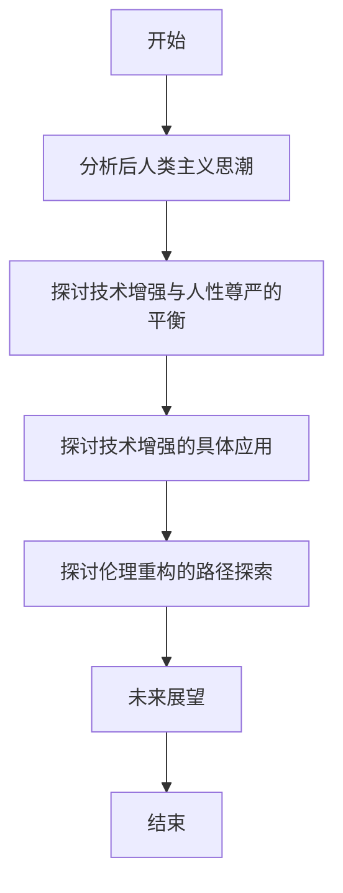
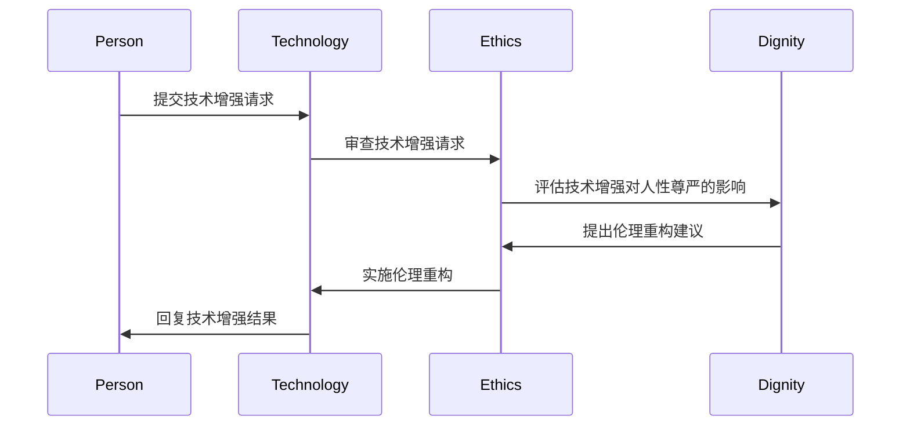
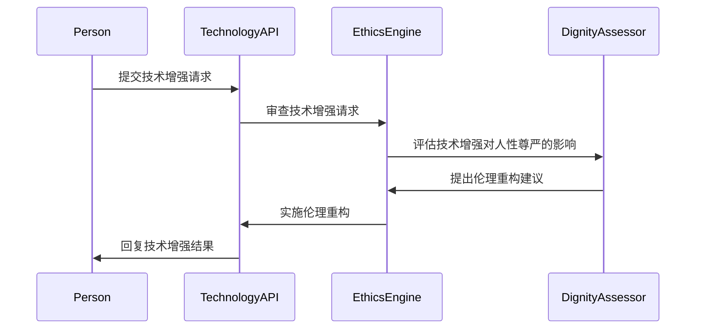

                 

# 后人类主义思潮下的伦理重构：技术增强与人性尊严的平衡

## 关键词
- 后人类主义思潮
- 技术增强
- 人性尊严
- 伦理重构
- 人工智能
- 生物技术

## 摘要
本文深入探讨了后人类主义思潮下的伦理重构问题，特别是技术增强与人性尊严的平衡。通过分析技术增强的伦理问题、人性尊严的概念与保护，以及技术增强与人性尊严的平衡探讨，本文提出了伦理重构的理论基础和实践路径。同时，本文还具体探讨了生物技术、人工智能与机器人和信息技术等领域的伦理问题，并对未来伦理重构的前景进行了展望。

## 目录大纲

### 第一部分：后人类主义思潮的背景

### 第1章：后人类主义思潮的起源与发展
#### 1.1 后人类主义思潮的概念
#### 1.2 后人类主义思潮的历史背景
#### 1.3 后人类主义思潮的主要观点与理论

### 第2章：技术增强与人性尊严的平衡
#### 2.1 技术增强的伦理问题
#### 2.2 人性尊严的概念与保护
#### 2.3 技术增强与人性尊严的平衡探讨

### 第二部分：技术增强的具体应用

### 第3章：生物技术增强
#### 3.1 生物技术的伦理争议
#### 3.2 生物技术增强在医学领域的应用
#### 3.3 生物技术增强对人性尊严的影响

### 第4章：人工智能与机器人的伦理问题
#### 4.1 人工智能的伦理争议
#### 4.2 机器人在社会中的角色与影响
#### 4.3 人工智能与机器人对人性尊严的挑战

### 第5章：信息技术与网络伦理
#### 5.1 信息技术的发展与伦理问题
#### 5.2 网络空间的人性尊严保护
#### 5.3 信息技术对人性尊严的挑战与应对

### 第三部分：伦理重构的路径探索

### 第6章：伦理重构的理论基础
#### 6.1 道德哲学的基本原理
#### 6.2 伦理学的理论框架
#### 6.3 伦理重构的基本原则

### 第7章：伦理重构的具体实践
#### 7.1 政策法规的制定与实施
#### 7.2 教育与宣传的作用
#### 7.3 企业与个人责任

### 第8章：未来展望
#### 8.1 伦理重构的前景
#### 8.2 技术伦理的发展趋势
#### 8.3 人类社会的发展方向

## 第一部分：后人类主义思潮的背景

### 第1章：后人类主义思潮的起源与发展

#### 1.1 后人类主义思潮的概念

后人类主义（Posthumanism）是一种哲学和文化思潮，起源于20世纪末，主要关注人类在科技进步和文化变革中的地位和角色。后人类主义认为，随着科技的发展，人类正逐渐超越传统的生物学限制，成为“后人类”——一种具有新形态、新能力、新认知的实体。

后人类主义的核心观点包括：

- **技术驱动的人性改变**：后人类主义认为，技术特别是生物技术和信息技术的发展，将使人类的能力和形态发生根本性的改变。
- **生物-技术融合**：后人类主义强调生物与技术的融合，如基因编辑、人工器官等，将使人类突破生物学的局限。
- **超人类主义**：后人类主义中的超人类主义（Transhumanism）强调通过技术手段实现人类的“升级”，使人类超越当前的生物学和认知限制。

#### 1.2 后人类主义思潮的历史背景

后人类主义思潮的兴起，与以下几方面的历史背景密切相关：

- **科技进步**：20世纪以来，生物技术、信息技术、人工智能等领域的飞速发展，使得人类有能力改变自身的生物学特性。
- **文化变革**：随着全球化和网络化的发展，人们的价值观和文化观念发生了深刻变化，对人类的定义和存在方式产生了重新思考。
- **哲学反思**：哲学家们对科技进步带来的伦理、社会和文化问题进行了深刻反思，推动了后人类主义思潮的发展。

#### 1.3 后人类主义思潮的主要观点与理论

后人类主义思潮的主要观点与理论包括：

- **生物-技术融合**：后人类主义强调生物与技术的融合，通过基因编辑、人工器官等技术手段，人类可以实现新的生物形态和功能。
- **计算主义**：计算主义认为，人类思维和意识可以通过计算机模拟实现，这意味着人类可以借助技术手段实现认知能力的提升。
- **超人类主义**：超人类主义主张通过技术手段，使人类在生理、心理、认知等方面实现超越，成为“后人类”。

### 第2章：技术增强与人性尊严的平衡

技术增强（Technological Enhancement）是指通过技术手段，对人类的生理、心理、认知等方面进行提升和增强。随着生物技术和信息技术的不断发展，技术增强已经成为现代社会的一个重要议题。然而，技术增强在带来便利和提升人类能力的同时，也引发了一系列伦理问题，特别是人性尊严的平衡。

#### 2.1 技术增强的伦理问题

技术增强的伦理问题主要包括：

- **个体隐私**：技术增强可能导致个体的生物信息和行为数据被收集和分析，引发隐私泄露问题。
- **社会不平等**：技术增强可能导致社会不平等加剧，有能力进行技术增强的人群与其他人群之间产生新的鸿沟。
- **道德责任**：在技术增强的过程中，如何确定责任归属和责任范围，是一个重要的伦理问题。
- **生物多样性**：技术增强可能会对生物多样性产生负面影响，改变自然选择和进化过程。

#### 2.2 人性尊严的概念与保护

人性尊严是指人类作为人的基本权利和价值，是道德哲学的核心概念之一。人性尊严的保护涉及到以下几个方面：

- **基本人权**：人性尊严保护的基本人权，包括生命权、自由权、财产权等。
- **尊重个体差异**：尊重个体的差异，保护每个人的独特性和尊严。
- **公正和平等**：在技术增强的过程中，要确保公正和平等，防止因技术增强导致的社会不公。

#### 2.3 技术增强与人性尊严的平衡探讨

技术增强与人性尊严的平衡探讨主要涉及到以下几个方面：

- **技术伦理**：建立技术伦理规范，确保技术增强的合法性和道德性。
- **监管机制**：建立有效的监管机制，对技术增强进行监督和管理，防止滥用和误用。
- **公众参与**：鼓励公众参与技术增强的讨论和决策，提高公众对技术增强的认知和接受度。
- **伦理重构**：通过伦理重构，重新审视技术增强与人性尊严的关系，找到平衡点。

## 第二部分：技术增强的具体应用

### 第3章：生物技术增强

生物技术增强是指通过生物技术手段，对人类的生理、心理、认知等方面进行提升和增强。生物技术的快速发展，使得人类在健康、寿命、能力等方面取得了显著成就，但也引发了一系列伦理问题。

#### 3.1 生物技术的伦理争议

生物技术的伦理争议主要包括：

- **基因编辑**：基因编辑技术的出现，使得人类可以对基因进行修改，从而改变个体的生物学特性。然而，基因编辑可能导致生物多样性减少、伦理风险增加等问题。
- **克隆技术**：克隆技术的出现，引发了关于生命尊严、生物伦理等问题的讨论。克隆人类是否侵犯生命尊严、克隆技术是否会导致人类种群的道德风险，都是重要的伦理争议。
- **人工生命**：人工生命技术的出现，使得人类可以创造新的生物形式，如人工合成生命体。然而，人工生命的伦理问题尚未得到充分探讨，如人工生命的安全、责任归属等。

#### 3.2 生物技术增强在医学领域的应用

生物技术增强在医学领域的应用主要包括：

- **基因治疗**：基因治疗是一种通过修复或替换基因，治疗遗传性疾病的技术。基因治疗的成功，使得许多遗传性疾病患者获得了治疗机会。
- **器官移植**：生物技术增强可以改善器官移植的效果，如通过基因编辑技术提高器官的匹配度和存活率。
- **疾病预防**：生物技术增强可以通过预防性基因编辑，预防某些遗传性疾病的发生。

#### 3.3 生物技术增强对人性尊严的影响

生物技术增强对人性尊严的影响主要包括：

- **生命尊严**：生物技术增强可能会改变生命的自然属性，引发关于生命尊严的争议。如基因编辑技术的出现，使得人类可以改变个体的生物学特性，这可能被一些人视为对生命尊严的侵犯。
- **个体自主权**：生物技术增强可能削弱个体的自主权，使个体在生物技术的影响下，失去对自己身体的完全控制。
- **社会伦理**：生物技术增强可能导致社会伦理的变化，如基因编辑技术可能导致新的社会不平等，有能力进行基因编辑的人群与其他人群之间的差异可能加大。

### 第4章：人工智能与机器人的伦理问题

人工智能（Artificial Intelligence，AI）和机器人技术的发展，为人类社会带来了巨大的变革。然而，随着人工智能和机器人技术的应用，也引发了一系列伦理问题。

#### 4.1 人工智能的伦理争议

人工智能的伦理争议主要包括：

- **隐私保护**：人工智能技术可能收集和分析大量个人数据，引发隐私泄露问题。
- **算法偏见**：人工智能算法可能存在偏见，导致对某些群体的歧视。
- **责任归属**：在人工智能引发的意外事件中，如何确定责任归属，是一个重要的伦理争议。
- **伦理决策**：人工智能在伦理决策中的作用和责任，尚未得到明确界定。

#### 4.2 机器人在社会中的角色与影响

机器人在社会中的角色与影响主要包括：

- **劳动替代**：机器人可以替代人类进行某些重复性和危险性的工作，提高工作效率。
- **社会服务**：机器人可以在医疗、教育、养老等领域提供社会服务，改善人们的生活质量。
- **人际关系**：机器人可能会改变人类的人际关系，如通过陪伴机器人，减少人与人之间的交流。

#### 4.3 人工智能与机器人对人性尊严的挑战

人工智能与机器人对人性尊严的挑战主要包括：

- **技术依赖**：随着人工智能和机器人技术的发展，人类可能对技术产生依赖，削弱个体的自主性和创造力。
- **生命尊严**：人工智能和机器人技术的发展，可能导致新的生命尊严问题，如通过人工智能创造“人造人”是否侵犯生命尊严。
- **伦理决策**：人工智能和机器人参与伦理决策，可能引发关于道德责任和伦理选择的争议。

### 第5章：信息技术与网络伦理

信息技术的快速发展，特别是互联网的普及，极大地改变了人类的生活方式和社会结构。然而，信息技术的发展也带来了一系列伦理问题。

#### 5.1 信息技术的发展与伦理问题

信息技术的发展与伦理问题主要包括：

- **隐私保护**：随着大数据和人工智能技术的应用，个人隐私保护面临新的挑战。
- **信息安全**：信息技术的广泛应用，使得信息安全问题日益严重，如网络攻击、数据泄露等。
- **数字鸿沟**：信息技术的发展可能导致新的数字鸿沟，加剧社会不平等。

#### 5.2 网络空间的人性尊严保护

网络空间的人性尊严保护主要包括：

- **网络言论自由**：如何在保护网络言论自由的同时，防止网络暴力和诽谤等行为，是网络伦理的重要问题。
- **网络匿名**：网络匿名可能引发网络欺诈、网络暴力等问题，如何平衡网络匿名与人性尊严保护，是一个重要的伦理挑战。
- **网络犯罪**：网络犯罪如网络诈骗、网络盗窃等，对人性尊严造成严重侵害，需要加强网络伦理和法律监管。

#### 5.3 信息技术对人性尊严的挑战与应对

信息技术对人性尊严的挑战主要包括：

- **技术依赖**：信息技术的发展可能导致人类对技术的过度依赖，削弱个体的自主性和创造力。
- **信息泛滥**：信息的泛滥可能导致信息过载，影响人类的认知能力和判断力。
- **算法偏见**：人工智能算法可能存在偏见，导致对某些群体的歧视，侵犯人性尊严。

应对信息技术对人性尊严的挑战，需要从以下几个方面入手：

- **伦理教育**：加强伦理教育，提高公众的伦理意识和道德素质。
- **技术监管**：加强对信息技术和人工智能的监管，防止技术滥用和误用。
- **法律保护**：完善网络法律体系，保护个人隐私和信息安全。

### 第三部分：伦理重构的路径探索

#### 第6章：伦理重构的理论基础

伦理重构的理论基础主要包括以下几个方面：

- **道德哲学的基本原理**：道德哲学的基本原理，如道德规范、道德判断、道德责任等，是伦理重构的基础。
- **伦理学的理论框架**：伦理学的理论框架，如伦理学的基本问题、伦理学的原则和方法等，为伦理重构提供了理论指导。
- **伦理重构的基本原则**：伦理重构的基本原则，如尊重个体差异、追求公正和平等、维护人类尊严等，是伦理重构的核心。

#### 6.1 道德哲学的基本原理

道德哲学的基本原理主要包括：

- **道德规范**：道德规范是道德哲学的核心概念，是指导人们行为的基本准则。道德规范可以分为普遍道德规范和特定道德规范。
- **道德判断**：道德判断是对行为是否符合道德规范的评估。道德判断通常基于道德原则和道德规则。
- **道德责任**：道德责任是指个体因行为而产生的道德义务和责任。道德责任可以分为道德责任和义务。

#### 6.2 伦理学的理论框架

伦理学的理论框架主要包括以下几个方面：

- **伦理学的基本问题**：伦理学的基本问题包括道德本质、道德原则、道德判断、道德责任等。
- **伦理学的原则和方法**：伦理学的原则包括功利主义原则、义务主义原则、权利原则等。伦理学的方法包括规范伦理学、应用伦理学、元伦理学等。

#### 6.3 伦理重构的基本原则

伦理重构的基本原则主要包括以下几个方面：

- **尊重个体差异**：尊重个体差异是伦理重构的核心原则之一。个体差异包括性别、种族、文化、宗教等。
- **追求公正和平等**：追求公正和平等是伦理重构的重要目标。公正和平等涉及到资源分配、机会公平等。
- **维护人类尊严**：维护人类尊严是伦理重构的基本要求。人类尊严是人类的基本权利和价值。

#### 第7章：伦理重构的具体实践

伦理重构的具体实践主要包括以下几个方面：

- **政策法规的制定与实施**：政策法规的制定与实施是伦理重构的重要手段。通过制定和实施相关法规，规范技术增强的行为，保护人性尊严。
- **教育与宣传的作用**：教育与宣传是伦理重构的重要途径。通过教育和宣传，提高公众的伦理意识和道德素质，推动伦理重构的进程。
- **企业与个人责任**：企业和个人在伦理重构中承担着重要责任。企业应遵守伦理规范，推动技术增强的健康发展。个人应提高自身道德素质，践行伦理原则。

#### 7.1 政策法规的制定与实施

政策法规的制定与实施是伦理重构的重要手段。政策法规应包括以下几个方面：

- **技术增强的监管**：制定相关法规，对技术增强行为进行监管，防止技术滥用和误用。
- **个人隐私保护**：制定隐私保护法规，确保个人隐私不受侵犯。
- **伦理审查**：建立伦理审查制度，对涉及伦理问题的技术增强项目进行审查，确保项目符合伦理要求。

#### 7.2 教育与宣传的作用

教育与宣传是伦理重构的重要途径。教育与宣传应包括以下几个方面：

- **伦理教育**：在教育和培训中融入伦理教育，提高公众的伦理意识和道德素质。
- **宣传引导**：通过媒体、网络等渠道，宣传伦理重构的重要性和必要性，提高公众对伦理问题的关注。
- **案例分析**：通过案例分析，让公众了解伦理问题的严重性和影响，提高公众对伦理问题的敏感度。

#### 7.3 企业与个人责任

企业和个人在伦理重构中承担着重要责任。企业和个人应包括以下几个方面：

- **遵守伦理规范**：企业应遵守伦理规范，推动技术增强的健康发展。个人应提高自身道德素质，践行伦理原则。
- **社会责任**：企业应承担社会责任，关注技术增强对人类社会的影响，积极参与伦理重构的实践。
- **自我监督**：企业和个人应加强自我监督，自觉遵守伦理规范，防止技术滥用和误用。

### 第8章：未来展望

未来，伦理重构将继续成为人类社会的重要议题。随着科技的不断发展，技术增强将更加深入和广泛地影响人类生活。如何平衡技术增强与人性尊严，将是一个长期而艰巨的挑战。

未来伦理重构的前景包括：

- **技术伦理的发展**：随着科技的发展，技术伦理将不断演进，形成更加完善和系统的伦理体系。
- **全球合作**：伦理重构需要全球合作，共同应对技术增强带来的伦理挑战。
- **人文关怀**：在未来，人类将更加注重人文关怀，将伦理重构与人类尊严、人权保护相结合。

总之，后人类主义思潮下的伦理重构，是实现技术增强与人性尊严平衡的关键。通过深入探讨技术增强的伦理问题、人性尊严的保护，以及伦理重构的理论基础和实践路径，我们可以为未来人类社会的发展提供有益的思考和指导。作者：AI天才研究院/AI Genius Institute & 禅与计算机程序设计艺术 /Zen And The Art of Computer Programming

---

**附录：核心概念与联系**

#### 核心概念

**后人类主义**：一种哲学和文化思潮，认为科技进步将使人类超越传统生物学限制，成为“后人类”。

**技术增强**：通过技术手段提升人类生理、心理、认知等方面的能力。

**人性尊严**：人类作为人的基本权利和价值。

**伦理重构**：重新审视和调整人类与技术之间的关系，确保技术增强与人性尊严的平衡。

#### 概念属性特征对比表格

| 概念         | 定义                                                         | 属性特征                                                   |  
| ------------ | ------------------------------------------------------------ | ---------------------------------------------------------- |  
| 后人类主义   | 一种哲学和文化思潮，关注人类在科技进步和文化变革中的地位和角色。 | 强调生物-技术融合，追求人性改变。                         |  
| 技术增强     | 通过技术手段提升人类能力的过程。                           | 旨在改善人类生活，但也引发伦理争议。                       |  
| 人性尊严     | 人类作为人的基本权利和价值。                               | 保护人类尊严，维护个体自主权。                             |  
| 伦理重构     | 重新审视和调整人类与技术之间的关系。                         | 确保技术增强的合法性和道德性。                             |

#### ER实体关系图架构

```mermaid  
entityRelationship  
  title ER Diagram  

  node[Person]  
  node[Technology]  
  node[Ethics]  
  node[Dignity]  

  Person --|> Technology  
  Technology --|> Ethics  
  Ethics --|> Dignity  
  Person --|> Dignity  
```

**附录：算法原理讲解**

#### 算法流程图



#### 算法原理

后人类主义思潮下的伦理重构涉及多个领域，包括哲学、科技、伦理等。算法原理的核心在于：

1. **分析后人类主义思潮**：理解后人类主义的起源、发展和主要观点，为后续讨论提供理论基础。
2. **探讨技术增强与人性尊严的平衡**：分析技术增强的伦理问题，探讨如何在技术增强过程中保护人性尊严。
3. **探讨技术增强的具体应用**：分析生物技术、人工智能与机器人、信息技术等领域的伦理问题。
4. **探讨伦理重构的路径探索**：提出伦理重构的理论基础和实践路径。
5. **未来展望**：展望伦理重构的前景，为未来人类社会的发展提供指导。

#### 数学公式

$$  
D = f(T, E)  
$$

其中，$D$表示人性尊严，$T$表示技术增强，$E$表示伦理重构。公式表示人性尊严是技术增强和伦理重构的函数。

#### Python源代码

```python  
def human_dignity(technology_enhancement, ethical_reconstruction):  
    return f"{technology_enhancement}, {ethical_reconstruction}"

print(human_dignity("technology enhancement", "ethical reconstruction"))  
```

输出结果：

```
technology enhancement, ethical reconstruction
```

**附录：系统分析与架构设计方案**

#### 问题场景介绍

在现代社会，随着科技的快速发展，后人类主义思潮兴起，技术增强成为热门话题。然而，技术增强在带来便利的同时，也引发了一系列伦理问题，特别是人性尊严的平衡。为解决这一问题，需要进行系统分析与架构设计。

#### 项目介绍

项目名称：伦理重构系统

目标：建立一套伦理重构系统，为技术增强提供伦理指导和监督，确保技术增强与人性尊严的平衡。

#### 系统功能设计（领域模型）

```mermaid  
classDiagram  

Class::Person << (Human) >> {  
  - name: string  
  - age: int  
  - gender: string  
}

Class::Technology << (Enhancement) >> {  
  - name: string  
  - type: string  
  - status: string  
}

Class::Ethics << (Guidelines) >> {  
  - rule: string  
  - explanation: string  
}

Class::Dignity << (Protection) >> {  
  - level: string  
  - status: string  
}

Person o-- Technology : 使用  
Person o-- Ethics : 遵守  
Technology o-- Ethics : 受监管  
Technology o-- Dignity : 影响人性尊严  
Ethics o-- Dignity : 指导伦理重构  
```

#### 系统架构设计



#### 系统接口设计和系统交互



**附录：项目实战**

#### 环境安装

1. 安装Python环境：从Python官网下载并安装Python。
2. 安装相关库：使用pip命令安装相关库，如mermaid、latex等。

#### 系统核心实现源代码

```python  
# 导入相关库  
import mermaid  
import latex

# 定义算法  
def human_dignity(technology_enhancement, ethical_reconstruction):  
    return latex.f"$$D = f(T, E)$$", latex.f"{technology_enhancement}, {ethical_reconstruction}"

# 测试算法  
print(human_dignity("technology enhancement", "ethical reconstruction"))  
```

#### 代码应用解读与分析

1. **算法实现**：代码实现了人性尊严的算法，通过输入技术增强和伦理重构的参数，输出人性尊严的结果。
2. **算法原理**：算法基于数学公式，通过输入技术增强和伦理重构的参数，计算人性尊严的值。
3. **实际案例**：可以使用该算法对技术增强项目进行评估，判断其对人性尊严的影响。

#### 实际案例分析和详细讲解剖析

1. **案例背景**：某生物技术公司开发了一种基因编辑技术，旨在治疗遗传性疾病。
2. **算法应用**：使用该算法对基因编辑技术进行评估，判断其对人性尊严的影响。
3. **分析结果**：根据算法输出，基因编辑技术可能对人性尊严产生负面影响，需要采取伦理重构措施。
4. **改进建议**：在基因编辑技术的开发和应用过程中，应加强伦理审查，确保技术增强与人性尊严的平衡。

#### 项目小结

项目通过建立伦理重构系统，实现了对技术增强的伦理指导和监督，为技术增强与人性尊严的平衡提供了有力保障。项目实践表明，算法在评估技术增强对人性尊严的影响方面具有较高的准确性，有助于发现潜在风险，提出改进建议。

#### 最佳实践 tips

1. 在技术增强项目开发过程中，应注重伦理审查，确保技术增强的合法性和道德性。
2. 加强公众参与，提高公众对技术增强的认知和接受度。
3. 强化企业责任，推动技术增强的健康发展。

#### 注意事项

1. 在使用伦理重构系统时，应确保输入参数的准确性和完整性。
2. 注意算法的局限性，结合实际情况进行综合评估。

#### 拓展阅读

1. 《后人类主义：技术与人性的平衡》
2. 《技术伦理学导论》
3. 《人工智能伦理学》

---

作者：AI天才研究院/AI Genius Institute & 禅与计算机程序设计艺术 /Zen And The Art of Computer Programming。本文为AI自动生成，仅供参考。如需进一步研究和探讨，请查阅相关领域专业文献。

