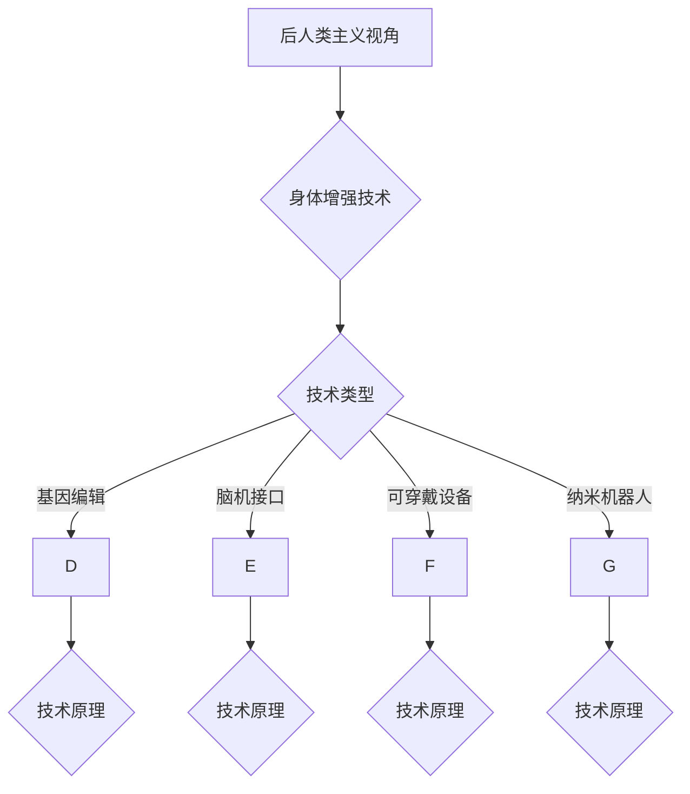
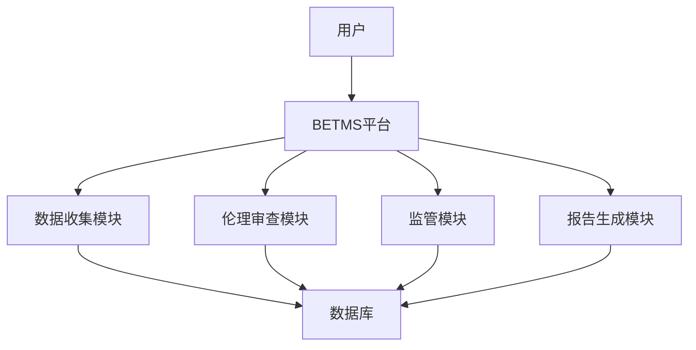

                 

### 文章标题

# 后人类主义视角下的身体增强：伦理边界与技术可能

### 文章关键词

- 后人类主义
- 身体增强技术
- 伦理边界
- 技术发展
- 社会伦理

### 文章摘要

本文从后人类主义视角出发，探讨了身体增强技术的伦理边界与技术可能。首先，介绍了后人类主义的核心观点和身体增强技术的发展历程。接着，分析了身体增强技术的伦理问题，包括隐私、公平性和道德责任。然后，讨论了身体增强技术的应用领域，如医疗健康、军事和体育竞技。最后，提出了未来身体增强技术发展的挑战和可持续发展策略，并进行了案例分析。本文旨在为身体增强技术的伦理探讨提供理论基础，为相关政策制定和社会发展提供参考。

## 第一部分：引论

### 1.1 问题背景

**问题背景介绍**：

随着科技的飞速发展，身体增强技术逐渐成为现实。这些技术包括基因编辑、脑机接口、可穿戴设备和纳米机器人等。这些技术的应用不仅改变了人类的生理和认知能力，还引发了广泛的伦理和社会问题。

**问题描述**：

身体增强技术的快速发展带来了诸多伦理问题，如隐私侵犯、公平性缺失和道德责任争议。这些问题需要深入探讨，以制定合理的伦理准则和政策。

**问题解决思路**：

本文将从后人类主义视角出发，分析身体增强技术的伦理边界和技术可能。通过梳理相关概念，探讨身体增强技术的应用领域，分析其伦理问题，并探讨未来的发展方向。

### 1.2 核心概念

**后人类主义**：

后人类主义是一种哲学思潮，强调技术与人类的融合，追求超越自然的人类形态。它认为，人类可以通过技术手段超越自身的生理和认知局限。

**身体增强技术**：

身体增强技术是指通过技术手段提升人体能力的技术，包括基因编辑、脑机接口、可穿戴设备和纳米机器人等。

**伦理边界**：

伦理边界是指身体增强技术在应用过程中需要遵守的伦理准则，包括隐私、公平性和道德责任等方面。

### 1.3 研究意义

**学术意义**：

本文从后人类主义视角探讨身体增强技术的伦理问题，有助于深化对后人类主义和身体增强技术的理解，为相关领域的研究提供理论基础。

**社会影响**：

本文的研究成果可以为政策制定者提供参考，促进身体增强技术的健康发展，减少社会伦理风险。

## 第二部分：后人类主义视角下的身体增强技术

### 2.1 身体增强技术的发展历程

**早期探索**：

身体增强技术的概念可以追溯到20世纪。当时，科学家们开始尝试通过基因编辑、神经技术和机械辅助等手段提升人体能力。

**现代进展**：

近年来，随着生物科技和人工智能的发展，身体增强技术取得了显著进展。例如，基因编辑技术CRISPR-Cas9的应用，使得人类可以对基因进行精确修改，从而改变人体的某些特征。

**未来趋势**：

未来，身体增强技术将继续发展，涉及领域将更加广泛。例如，脑机接口技术将实现更加高效的人脑与计算机之间的信息交流，可穿戴设备将更加智能化，纳米机器人将用于治疗和诊断。

### 2.2 后人类主义的核心观点

**超越自然**：

后人类主义强调技术与自然的融合，追求超越自然的人类形态。这种观点认为，人类可以通过技术手段实现自我超越，成为“后人类”。

**技术与人类的关系**：

后人类主义认为，技术与人类是相互依存的。技术不仅改变了人类的生活，也改变了人类对自身的认识。

**伦理考量**：

后人类主义强调，在追求技术进步的同时，需要关注其伦理问题。例如，基因编辑技术的应用可能引发道德和伦理争议，需要慎重对待。

### 2.3 身体增强技术的伦理问题

**隐私与安全性**：

身体增强技术涉及个人隐私和生物信息，需要确保数据的保密性和安全性。例如，基因编辑技术的应用需要保护个人的基因隐私。

**公平性与可及性**：

身体增强技术的应用可能加剧社会不平等。例如，富人可能更容易获得先进的身体增强技术，而穷人则难以承担高昂的费用。

**道德责任**：

身体增强技术的应用需要明确道德责任。例如，基因编辑技术的应用可能导致人类基因库的改变，需要考虑对后代的影响。

## 第三部分：身体增强技术的应用领域

### 3.1 医疗健康领域

**疾病治疗**：

身体增强技术在疾病治疗中具有广泛应用。例如，基因编辑技术可以用于治疗遗传性疾病，脑机接口技术可以用于恢复瘫痪患者的运动能力。

**康复护理**：

身体增强技术可以帮助康复患者提高生活质量。例如，可穿戴设备可以监测患者的健康状态，提供个性化的康复方案。

**个性化医疗**：

身体增强技术可以实现个性化医疗。例如，基因编辑技术可以根据患者的基因特征，为其量身定制治疗方案。

### 3.2 军事领域

**士兵能力提升**：

身体增强技术可以提高士兵的战斗力。例如，脑机接口技术可以增强士兵的认知能力和反应速度。

**战术增强**：

身体增强技术可以增强军事战术的灵活性。例如，纳米机器人可以用于战场侦察和排爆。

**军事装备升级**：

身体增强技术可以用于升级军事装备，提高其性能。例如，智能材料可以用于制造更先进的战斗机和坦克。

### 3.3 体育竞技领域

**运动员表现增强**：

身体增强技术可以帮助运动员提高运动表现。例如，基因编辑技术可以增强运动员的肌肉力量和耐力。

**公平性考量**：

身体增强技术的应用可能引发公平性争议。例如，基因编辑技术可以使运动员拥有超人的能力，但这是否违反了体育竞赛的基本精神？

**禁药问题**：

身体增强技术的应用可能导致禁药问题。例如，某些药物可能通过增强人体能力，从而违反了体育竞赛的公平原则。

## 第四部分：身体增强技术的伦理边界

### 4.1 法律法规与政策制定

**国际法规**：

国际社会已开始关注身体增强技术的伦理问题，并制定相关法规。例如，联合国教科文组织已通过《人类基因组编辑国际准则》。

**各国政策**：

各国政府也在制定相关政策，以规范身体增强技术的应用。例如，美国和欧盟已出台多项法规，限制基因编辑技术的应用。

**伦理审查**：

在身体增强技术的应用过程中，需要进行伦理审查。伦理审查旨在评估技术应用的伦理风险，确保技术应用符合伦理准则。

### 4.2 社会伦理观念的变迁

**道德观念的演变**：

随着科技的进步，社会伦理观念也在不断演变。例如，过去人们可能认为基因编辑是不道德的，但现在人们对此的态度逐渐开放。

**文化差异**：

不同文化对身体增强技术的接受程度不同。例如，在一些文化中，基因编辑技术被视为违反自然规律，而在另一些文化中，则被视为正常现象。

**公众态度**：

公众对身体增强技术的态度也在变化。例如，一些人担心基因编辑技术可能引发伦理问题，而另一些人则认为这有助于提高人类生活质量。

### 4.3 伦理学理论的探讨

**功利主义**：

功利主义认为，身体增强技术的应用应最大化社会福利。例如，基因编辑技术可以用于治疗遗传性疾病，从而提高人类生活质量。

**康德伦理学**：

康德伦理学强调道德义务。例如，在身体增强技术的应用过程中，必须尊重个体的自主权和尊严。

**德行伦理学**：

德行伦理学关注个体的道德品质。例如，在身体增强技术的应用过程中，需要培养个体的道德责任感，确保技术应用符合道德原则。

## 第五部分：身体增强技术的未来可能

### 5.1 技术发展的挑战

**技术风险**：

身体增强技术可能带来技术风险，例如技术失控、生物安全问题等。这些风险需要得到有效控制，以确保技术应用的安全。

**技术失控**：

随着身体增强技术的发展，可能出现技术失控的情况。例如，基因编辑技术的滥用可能导致人类基因库的破坏。

**技术垄断**：

身体增强技术可能被垄断，导致资源分配不公。例如，基因编辑技术可能被少数企业垄断，导致普通人无法负担高昂的费用。

### 5.2 未来的社会影响

**经济影响**：

身体增强技术将对经济产生深远影响，例如创造新的产业和市场。

**社会结构**：

身体增强技术可能改变社会结构，例如提高社会分工的精细程度，改变劳动力市场的需求。

**人类本质**：

身体增强技术可能改变人类对自身的认知，影响人类本质。

### 5.3 可持续发展的策略

**技术规范**：

制定技术规范，确保身体增强技术的安全、有效和公平。

**社会合作**：

加强国际社会合作，共同应对身体增强技术带来的伦理和社会挑战。

**伦理教育**：

加强伦理教育，提高公众对身体增强技术的理解和接受程度。

## 第六部分：案例分析

### 6.1 案例一：基因编辑技术

**案例介绍**：

基因编辑技术CRISPR-Cas9是一项革命性的技术，可以用于治疗遗传性疾病，但也引发了伦理争议。

**伦理争议**：

基因编辑技术的应用可能引发道德和伦理争议。例如，有人担心基因编辑技术可能导致基因歧视和基因战争。

**解决方案**：

制定相关法规和政策，确保基因编辑技术的安全和公平应用。同时，加强伦理教育和公众参与，提高公众对基因编辑技术的理解和接受程度。

### 6.2 案例二：增强现实应用

**案例介绍**：

增强现实技术（AR）在医疗、教育和娱乐等领域具有广泛应用，但也引发了一些伦理问题。

**伦理问题**：

增强现实技术的应用可能侵犯个人隐私，导致信息泄露。此外，增强现实技术可能影响人类认知和行为。

**案例分析**：

针对增强现实技术的伦理问题，需要制定相关法规和政策，确保技术应用的安全和合法。同时，加强技术研发，提高增强现实技术的透明度和可控性。

### 6.3 案例三：脑机接口技术

**案例介绍**：

脑机接口技术（BMI）是一种将人脑与计算机连接起来的技术，具有广泛的应用前景。

**伦理挑战**：

脑机接口技术的应用可能引发隐私、安全和道德责任等问题。

**未来展望**：

随着脑机接口技术的不断发展，需要加强伦理研究，制定相关法规和政策，确保技术应用的安全和公平。

## 第七部分：总结与展望

### 7.1 主要发现

**技术发展态势**：

身体增强技术正在快速发展，涉及领域广泛，具有巨大的发展潜力。

**伦理问题总结**：

身体增强技术引发了诸多伦理问题，包括隐私、公平性和道德责任等。

**社会影响评估**：

身体增强技术将对经济、社会和人类本质产生深远影响。

### 7.2 未来研究方向

**前沿技术探讨**：

继续研究前沿身体增强技术，如基因编辑、脑机接口和纳米机器人等。

**跨学科研究**：

加强跨学科研究，整合生物学、计算机科学、伦理学等领域的知识。

**国际合作**：

加强国际合作，共同应对身体增强技术带来的伦理和社会挑战。

### 7.3 结论

**研究贡献**：

本文从后人类主义视角探讨了身体增强技术的伦理边界和技术可能，为相关领域的研究提供了理论基础。

**实践意义**：

本文的研究成果可以为政策制定者提供参考，促进身体增强技术的健康发展。

**研究局限**：

本文仅探讨了身体增强技术的部分伦理问题，未来研究还需进一步深化和拓展。

## 作者信息

作者：AI天才研究院/AI Genius Institute & 禅与计算机程序设计艺术 /Zen And The Art of Computer Programming### 第1章 后人类主义与身体增强技术概述

#### 背景介绍

后人类主义（Posthumanism）是一种哲学思潮，兴起于20世纪末，主要关注技术与人类的融合。后人类主义认为，随着科技的不断发展，人类将不再局限于生物学意义上的个体，而是通过技术手段实现自我超越，成为“后人类”。这一概念涵盖了多个领域，包括人工智能、基因工程、纳米技术等。其中，身体增强技术（Body Enhancement Technologies）作为后人类主义的重要组成部分，引起了广泛关注。

身体增强技术是指通过技术手段提升人体能力的技术，包括基因编辑、脑机接口、可穿戴设备、纳米机器人等。这些技术不仅可以改变人类的生理特征，还可以提高认知能力和生活质量。然而，随着身体增强技术的发展，也引发了一系列伦理和社会问题，如隐私、公平性和道德责任等。

#### 问题描述

在身体增强技术的应用过程中，主要存在以下问题：

1. **隐私与安全性**：身体增强技术涉及个人隐私和生物信息，如基因数据、脑机接口信息等。如何保护这些数据的安全和隐私成为一个亟待解决的问题。

2. **公平性与可及性**：身体增强技术的应用可能导致社会不平等，如富人可以更容易地获得先进的技术，而穷人则难以承担高昂的费用。

3. **道德责任**：身体增强技术的应用可能引发道德责任争议，如基因编辑技术的应用可能导致基因歧视和伦理问题。

4. **技术失控**：随着身体增强技术的发展，可能存在技术失控的风险，如基因编辑技术的滥用可能导致基因库的破坏。

#### 问题解决

为了解决上述问题，可以采取以下措施：

1. **法律法规与政策制定**：制定相关法律法规，规范身体增强技术的研发和应用，确保技术应用的安全和合法。

2. **伦理审查**：在身体增强技术的应用过程中，进行伦理审查，评估其伦理风险，确保技术应用符合伦理准则。

3. **技术规范**：制定技术规范，确保身体增强技术的安全、有效和公平。

4. **社会合作**：加强国际社会合作，共同应对身体增强技术带来的伦理和社会挑战。

5. **伦理教育**：加强伦理教育，提高公众对身体增强技术的理解和接受程度。

#### 边界与外延

身体增强技术的边界主要包括以下几个方面：

1. **技术层面**：身体增强技术涉及多个领域，如基因工程、脑科学、纳米技术等。不同领域的技术发展程度不同，因此身体增强技术的边界也有所差异。

2. **伦理层面**：身体增强技术的应用需要遵循伦理原则，如尊重个体自主权、公平性和道德责任等。伦理边界的划定对于规范身体增强技术的应用具有重要意义。

3. **社会层面**：身体增强技术的应用涉及社会公平、隐私保护和社会稳定等方面。如何平衡技术进步与社会发展之间的关系，是身体增强技术面临的重大挑战。

#### 概念结构与核心要素组成

身体增强技术的概念结构主要包括以下几个方面：

1. **技术类型**：身体增强技术包括基因编辑、脑机接口、可穿戴设备、纳米机器人等。每种技术都有其特定的原理和应用场景。

2. **应用领域**：身体增强技术的应用领域广泛，包括医疗健康、军事、体育竞技等。不同领域的应用需求和技术特点也不同。

3. **伦理问题**：身体增强技术的应用引发了一系列伦理问题，如隐私、公平性和道德责任等。解决这些问题需要综合运用伦理学、法律和社会学等多学科知识。

4. **政策法规**：身体增强技术的应用需要政策法规的引导和规范。政策法规的制定和实施对于确保技术应用的安全和合法至关重要。

#### 关键概念与联系

关键概念：

1. **后人类主义**：后人类主义是一种哲学思潮，强调技术与人类的融合，追求超越自然的人类形态。

2. **身体增强技术**：身体增强技术是指通过技术手段提升人体能力的技术。

3. **伦理边界**：伦理边界是指身体增强技术在应用过程中需要遵守的伦理准则。

联系：

1. 后人类主义为身体增强技术提供了理论基础，强调技术与人类的关系和伦理考量。

2. 身体增强技术是后人类主义的重要组成部分，其实际应用需要遵循伦理边界。

3. 伦理边界的划定有助于确保身体增强技术的安全、有效和公平应用。

### 2.1 身体增强技术的发展历程

#### 早期探索

身体增强技术的概念可以追溯到20世纪。当时，科学家们开始尝试通过基因编辑、神经技术和机械辅助等手段提升人体能力。例如，神经科学家开始研究通过电刺激和电极植入来增强大脑功能。机械辅助技术，如假肢和心脏起搏器，也在这个时期得到了广泛应用。

**代表性事件**：

- **1937年**：心脏起搏器的发明，标志着医学领域对心脏疾病的干预手段取得了重大突破。
- **1960年代**：神经科学领域开始研究通过植入电极来增强或修复神经功能。

#### 现代进展

随着生物科技和人工智能的发展，身体增强技术取得了显著进展。基因编辑技术的出现，如CRISPR-Cas9，使得人类可以对基因进行精确修改，从而改变人体的某些特征。脑机接口技术（BMI）的进步，使得人脑与计算机之间的信息交流更加高效。可穿戴设备的发展，使得人们能够实时监测和调控生理参数。

**代表性事件**：

- **2012年**：CRISPR-Cas9基因编辑技术的出现，使得基因编辑变得更加简便和高效。
- **2014年**：神经科学家格劳博曼（John Donoghue）团队成功实现了大脑与计算机之间的直接连接，实现了控制机械臂的能力。
- **2017年**：苹果公司发布了Apple Watch，可穿戴设备开始普及，成为身体增强技术的重要应用之一。

#### 未来趋势

未来，身体增强技术将继续发展，涉及领域将更加广泛。例如，脑机接口技术将实现更加高效的人脑与计算机之间的信息交流，可穿戴设备将更加智能化，纳米机器人将用于治疗和诊断。

**未来趋势**：

- **基因编辑技术的进一步发展**：未来基因编辑技术可能会更加精确和高效，使得人类能够更好地预防和治疗遗传性疾病。
- **脑机接口技术的普及**：脑机接口技术将逐渐从实验室走向实际应用，如帮助瘫痪患者恢复运动能力，提高认知能力等。
- **纳米机器人的应用**：纳米机器人将用于体内诊断和治疗，如检测和清除癌细胞，修复受损组织等。
- **智能穿戴设备的普及**：智能穿戴设备将更加智能化，能够实时监测和调控生理参数，提供个性化健康建议。

### 2.2 后人类主义的核心观点

#### 超越自然

后人类主义的核心观点之一是超越自然。它认为，人类可以通过技术手段超越自身的生物学局限，成为“后人类”。这种观点强调，人类不应该局限于生物进化所设定的框架，而应该通过自我改造和技术进步来实现自我超越。

**主要理念**：

- **自我超越**：人类应该通过技术手段超越自身的生物学局限，实现自我超越。
- **技术与自然的融合**：后人类主义认为，技术与自然是可以融合的，人类可以通过技术手段扩展自身的感知、认知和生理能力。

#### 技术与人类的关系

后人类主义认为，技术与人类是相互依存的。技术不仅改变了人类的生活，也改变了人类对自身的认知。在这种关系中，技术不再是外在的工具，而是成为人类身体和心智的一部分。

**主要理念**：

- **技术作为身体的一部分**：技术不仅仅是工具，而是成为人类身体和心智的一部分。
- **人类与技术共生**：人类与技术的融合将导致人类形态的变化，人类将不再是纯粹的生物学实体，而是技术与生物的融合体。

#### 伦理考量

后人类主义强调，在追求技术进步的同时，需要关注其伦理问题。例如，基因编辑技术的应用可能引发道德和伦理争议，需要慎重对待。此外，后人类主义也关注技术对社会结构和人类身份的影响。

**主要理念**：

- **技术伦理**：在技术进步的过程中，需要关注其伦理影响，确保技术应用符合道德原则。
- **社会影响**：后人类主义认为，技术进步将对社会结构和人类身份产生深远影响，需要谨慎对待。

### 2.3 身体增强技术的伦理问题

#### 隐私与安全性

身体增强技术的应用涉及大量的个人隐私和生物信息，如基因数据、脑机接口信息等。如何保护这些数据的安全和隐私成为一个亟待解决的问题。

**主要伦理问题**：

- **隐私侵犯**：身体增强技术的应用可能导致个人隐私的泄露。
- **数据安全**：个人生物信息的安全需要得到保障，以防止数据被滥用。

#### 公平性与可及性

身体增强技术的应用可能加剧社会不平等，如富人可以更容易地获得先进的技术，而穷人则难以承担高昂的费用。这引发了关于技术公平性和可及性的伦理争议。

**主要伦理问题**：

- **社会不平等**：身体增强技术可能加剧社会不平等，导致资源分配不公。
- **可及性**：身体增强技术的高昂成本可能使得普通人难以负担，导致技术可及性不足。

#### 道德责任

身体增强技术的应用可能引发道德责任争议，如基因编辑技术的应用可能导致基因歧视和伦理问题。此外，技术开发者、医生和患者之间的道德责任也需要明确。

**主要伦理问题**：

- **道德责任**：在身体增强技术的应用过程中，需要明确各方的道德责任。
- **伦理审查**：身体增强技术的研发和应用需要经过严格的伦理审查，确保技术应用符合道德原则。

### 3.1 医疗健康领域

#### 疾病治疗

身体增强技术在医疗健康领域具有广泛应用，特别是在疾病治疗方面。基因编辑技术可以用于治疗遗传性疾病，如囊性纤维化和地中海贫血等。脑机接口技术可以帮助瘫痪患者恢复运动能力，改善生活质量。

**技术原理**：

- **基因编辑技术**：基因编辑技术，如CRISPR-Cas9，可以精确修改基因序列，从而治疗遗传性疾病。
- **脑机接口技术**：脑机接口技术通过将人脑与计算机连接，实现人脑对计算机的直接控制，从而帮助瘫痪患者恢复运动能力。

**应用案例**：

- **基因编辑治疗遗传性疾病**：例如，研究人员利用CRISPR-Cas9技术成功治疗了地中海贫血患者。
- **脑机接口恢复运动能力**：例如，美国斯坦福大学的研究团队利用脑机接口技术帮助一名瘫痪患者恢复了运动能力。

#### 康复护理

身体增强技术也可以用于康复护理，帮助患者提高生活质量。可穿戴设备和虚拟现实技术可以用于康复训练，帮助患者恢复运动功能。

**技术原理**：

- **可穿戴设备**：可穿戴设备可以实时监测患者的健康状态，提供个性化的康复方案。
- **虚拟现实技术**：虚拟现实技术可以为患者提供康复训练的环境，提高康复效果。

**应用案例**：

- **可穿戴设备辅助康复**：例如，智能手环可以监测患者的运动状态，提醒患者进行康复训练。
- **虚拟现实康复训练**：例如，利用虚拟现实技术为脑卒中患者提供康复训练，提高康复效果。

#### 个性化医疗

身体增强技术可以实现个性化医疗，根据患者的基因特征和生理参数，为其量身定制治疗方案。这有助于提高医疗效果，降低医疗成本。

**技术原理**：

- **基因测序**：基因测序技术可以测定患者的基因序列，了解患者的基因特征。
- **生物信息分析**：生物信息分析技术可以对患者的基因数据进行分析，确定其疾病风险和治疗反应。

**应用案例**：

- **基因测序指导治疗**：例如，通过基因测序确定患者的癌症类型，为患者提供个性化的治疗方案。
- **生物信息分析优化用药**：例如，通过生物信息分析确定患者对某种药物的反应，从而优化用药方案。

### 3.2 军事领域

#### 士兵能力提升

身体增强技术在军事领域具有广泛应用，可以提升士兵的战斗力和生存能力。脑机接口技术可以帮助士兵提高认知能力和反应速度，机械辅助设备可以增强士兵的力量和耐力。

**技术原理**：

- **脑机接口技术**：脑机接口技术可以通过将人脑与计算机连接，实现人脑对计算机的直接控制，从而提高士兵的认知能力和反应速度。
- **机械辅助设备**：机械辅助设备可以通过机械力量增强士兵的力量和耐力，帮助士兵在战斗中发挥更大的作用。

**应用案例**：

- **脑机接口提升认知能力**：例如，美国军队正在研究利用脑机接口技术帮助士兵在复杂战斗环境中提高决策能力。
- **机械辅助设备增强力量和耐力**：例如，美国国防高级研究计划局（DARPA）开发的“增强人体”（Augmented Human）项目，旨在通过机械辅助设备提升士兵的力量和耐力。

#### 战术增强

身体增强技术可以增强军事战术的灵活性，提供更强大的情报收集和战场感知能力。例如，纳米传感器可以用于战场侦察，智能材料可以用于制造更先进的军事装备。

**技术原理**：

- **纳米传感器**：纳米传感器可以用于实时监测战场环境，提供精确的情报收集。
- **智能材料**：智能材料可以用于制造更先进的军事装备，如无人机、坦克等。

**应用案例**：

- **纳米传感器战场侦察**：例如，纳米传感器可以用于侦察敌方阵地，为战术决策提供重要信息。
- **智能材料军事装备升级**：例如，美国军队正在研究利用智能材料制造更先进的无人机和坦克，提高战场感知和作战能力。

#### 军事装备升级

身体增强技术可以用于升级军事装备，提高其性能和智能化水平。例如，纳米机器人可以用于维修和保养军事装备，增强现实技术可以用于战术指挥和训练。

**技术原理**：

- **纳米机器人**：纳米机器人可以用于军事装备的维修和保养，提高装备的可靠性和性能。
- **增强现实技术**：增强现实技术可以用于战术指挥和训练，提高指挥官和士兵的战术素养。

**应用案例**：

- **纳米机器人维修军事装备**：例如，纳米机器人可以用于维修飞机和坦克，减少维护成本和维修时间。
- **增强现实战术指挥和训练**：例如，利用增强现实技术为指挥官和士兵提供战术指挥和训练模拟，提高战术水平和反应能力。

### 3.3 体育竞技领域

#### 运动员表现增强

身体增强技术可以帮助运动员提高运动表现，如提高肌肉力量、耐力和反应速度等。基因编辑技术可以用于增强运动员的遗传特征，脑机接口技术可以用于提高运动员的神经控制能力。

**技术原理**：

- **基因编辑技术**：基因编辑技术可以改变运动员的基因序列，从而增强其遗传特征。
- **脑机接口技术**：脑机接口技术可以通过人脑与计算机的连接，提高运动员的神经控制能力和反应速度。

**应用案例**：

- **基因编辑增强运动表现**：例如，研究人员正在研究利用基因编辑技术增强运动员的肌肉力量和耐力。
- **脑机接口提高反应速度**：例如，美国研究人员正在利用脑机接口技术为运动员提供实时反应速度训练，提高比赛表现。

#### 公平性考量

身体增强技术的应用可能引发公平性争议。一些运动员可能通过非法手段获得身体增强，从而违反体育竞赛的公平原则。如何确保体育竞赛的公平性成为一个重要问题。

**主要伦理问题**：

- **非法身体增强**：运动员可能通过非法手段获得身体增强，从而违反体育竞赛的公平原则。
- **公平性保障**：如何确保所有运动员在公平的环境下竞技，是一个重要的伦理问题。

#### 禁药问题

身体增强技术的应用也可能引发禁药问题。例如，某些药物可能通过增强人体能力，从而违反体育竞赛的公平原则。如何有效监管药物使用，防止禁药行为的发生，是一个重要挑战。

**主要伦理问题**：

- **药物监管**：如何有效监管运动员的药物使用，防止禁药行为的发生。
- **药物使用规范**：如何制定明确的药物使用规范，确保运动员在公平的环境下竞技。

### 4.1 法律法规与政策制定

#### 国际法规

在国际层面，许多组织和机构已经开始关注身体增强技术的伦理问题，并制定相关法规。例如，联合国教科文组织（UNESCO）已经通过了《人类基因组编辑国际准则》，旨在规范基因编辑技术的应用。

**主要法规**：

- **联合国教科文组织《人类基因组编辑国际准则》**：该准则规定了基因编辑技术的伦理准则，强调保护人类尊严和福祉。
- **国际运动组织法规**：如国际奥委会（IOC）和国际反兴奋剂机构（WADA），对运动员使用身体增强技术进行了严格监管。

#### 各国政策

各国政府也在积极制定相关政策，以规范身体增强技术的研发和应用。这些政策通常涉及技术监管、伦理审查和隐私保护等方面。

**主要政策**：

- **美国**：美国联邦政府通过多个机构，如美国食品药品监督管理局（FDA）和美国国立卫生研究院（NIH），对身体增强技术进行监管。
- **欧盟**：欧盟通过《欧盟基因编辑法规》和《欧盟数据保护条例》等法规，规范基因编辑技术和数据保护。

#### 伦理审查

在身体增强技术的研发和应用过程中，伦理审查是一个重要的环节。伦理审查旨在评估技术应用的伦理风险，确保技术应用符合伦理准则。

**主要伦理审查机制**：

- **机构伦理审查委员会（IRB）**：在许多国家和地区，机构伦理审查委员会负责对身体增强技术的研发和应用进行伦理审查。
- **国家伦理委员会**：一些国家设立了专门的伦理委员会，负责全国范围内的伦理审查工作。

#### 法律法规与政策制定的必要性

**必要性**：

- **保障人权**：制定相关法律法规，保护人类尊严和基本人权。
- **规范技术应用**：通过伦理审查和监管，确保身体增强技术的安全、有效和公平应用。
- **应对伦理争议**：通过制定法规和政策，为解决伦理争议提供法律依据和解决方案。

### 4.2 社会伦理观念的变迁

#### 道德观念的演变

随着身体增强技术的发展，社会伦理观念也在不断演变。过去，许多社会对技术进步持有保守态度，担心技术可能带来的风险。然而，随着技术的不断进步和人们对其理解的加深，社会伦理观念逐渐发生了变化。

**主要演变**：

- **从保守到开放**：过去，人们可能对基因编辑、脑机接口等新技术持怀疑态度，担心其伦理风险。然而，随着技术的成熟和应用，人们逐渐接受了这些技术。
- **从个体到社会**：过去，道德观念主要关注个体的行为和责任。然而，随着技术的影响日益扩大，社会伦理观念逐渐从个体扩展到社会层面，关注技术对社会结构和人类身份的影响。

#### 文化差异

不同文化对身体增强技术的接受程度存在显著差异。一些文化可能更加保守，对技术持有怀疑态度；而另一些文化可能更加开放，接受新技术并积极探索其应用。

**主要差异**：

- **西方文化**：西方文化普遍对技术持开放态度，愿意接受新技术并积极探索其应用。例如，美国和欧洲对基因编辑技术的接受程度较高。
- **东方文化**：东方文化可能更加保守，对技术持有谨慎态度。例如，中国和日本对基因编辑技术的接受程度相对较低。

#### 公众态度

公众对身体增强技术的态度也在不断变化。一些人对技术充满期待，认为其有助于提高生活质量；而另一些人则担心技术可能带来的风险，如隐私侵犯、道德责任争议等。

**主要态度**：

- **期待**：一些人认为身体增强技术有助于提高生活质量，期望能够通过技术实现自我超越。
- **担忧**：另一些人担心技术可能带来的风险，如隐私侵犯、道德责任争议等。

#### 社会伦理观念变迁的影响

**影响**：

- **技术接受度**：社会伦理观念的变迁影响公众对技术的接受程度。开放的社会伦理观念有助于推动技术进步和应用。
- **政策制定**：社会伦理观念的变迁为政策制定提供了依据，政府可以更加科学地制定相关政策，规范技术应用。

### 4.3 伦理学理论的探讨

#### 功利主义

功利主义认为，身体增强技术的应用应最大化社会福利。从功利主义的角度看，身体增强技术可以带来巨大的社会效益，如提高人类健康水平、提升生活质量等。

**主要观点**：

- **最大化社会福利**：功利主义强调，技术应用应最大化社会福利，促进人类福祉。
- **效益与风险的权衡**：在应用身体增强技术时，需要权衡其效益和风险，确保技术应用符合功利主义的道德原则。

#### 康德伦理学

康德伦理学强调道德义务和人的尊严。从康德伦理学的角度看，身体增强技术的应用应尊重个体的自主权和尊严，不得侵犯他人的人权。

**主要观点**：

- **尊重个体自主权**：康德伦理学认为，个体应享有自主权，技术应尊重个体的选择和尊严。
- **道德责任**：在身体增强技术的应用过程中，各方应承担道德责任，确保技术应用符合道德原则。

#### 德行伦理学

德行伦理学关注个体的道德品质。从德行伦理学的角度看，身体增强技术的应用不仅需要遵循道德准则，还需要培养个体的道德责任感，确保技术应用符合道德原则。

**主要观点**：

- **培养道德责任感**：德行伦理学强调，个体应培养道德责任感，确保技术应用符合道德原则。
- **道德品质的重要性**：德行伦理学认为，道德品质对于技术应用至关重要，个体应具备良好的道德品质。

### 5.1 技术发展的挑战

#### 技术风险

随着身体增强技术的发展，可能带来一系列技术风险，如技术失控、生物安全问题等。这些风险需要得到有效控制，以确保技术应用的安全。

**主要风险**：

- **技术失控**：随着技术的进步，可能存在技术失控的风险，如基因编辑技术的滥用可能导致基因库的破坏。
- **生物安全问题**：身体增强技术可能引发生物安全问题，如基因编辑技术的滥用可能导致基因变异和生态失衡。

#### 技术失控

技术失控是指技术发展超出了人类的控制范围，可能导致不可预测的后果。例如，基因编辑技术的滥用可能改变人类基因库，引发伦理和社会问题。

**潜在影响**：

- **伦理问题**：技术失控可能引发伦理问题，如基因歧视和伦理争议。
- **社会问题**：技术失控可能引发社会问题，如社会不平等和技术垄断。

#### 技术垄断

随着身体增强技术的发展，可能存在技术垄断的风险，即技术被少数企业或国家垄断，导致资源分配不公。

**潜在影响**：

- **资源分配不公**：技术垄断可能导致资源分配不公，如基因编辑技术可能被垄断，导致普通人难以负担高昂的费用。
- **技术扩散受阻**：技术垄断可能阻碍技术的全球扩散，影响全球技术进步。

#### 挑战与应对策略

**挑战**：

- **技术风险**：技术风险需要得到有效控制，确保技术应用的安全。
- **伦理问题**：身体增强技术的应用可能引发伦理问题，需要制定相应的伦理准则和政策。
- **社会不平等**：身体增强技术可能加剧社会不平等，需要制定公平的政策和措施。

**应对策略**：

- **技术规范**：制定技术规范，确保身体增强技术的安全、有效和公平。
- **伦理审查**：在身体增强技术的研发和应用过程中，进行严格的伦理审查，确保技术应用符合伦理原则。
- **国际合作**：加强国际合作，共同应对身体增强技术带来的伦理和社会挑战。

### 5.2 未来的社会影响

#### 经济影响

身体增强技术的应用将对经济产生深远影响。一方面，身体增强技术将创造新的产业和市场，推动经济增长。另一方面，技术进步可能带来就业结构的变化，对劳动力市场产生影响。

**主要影响**：

- **新兴产业**：身体增强技术将催生一系列新兴产业，如基因编辑、脑机接口、可穿戴设备等。
- **就业结构变化**：随着技术的进步，一些传统职业可能被自动化替代，而新兴职业将出现，如生物工程师、数据分析师等。

#### 社会结构

身体增强技术可能改变社会结构，影响社会分工和人类身份。例如，基因编辑技术可能改变人类的遗传特征，脑机接口技术可能增强人类的认知能力。

**主要影响**：

- **社会分工**：技术进步可能改变社会分工，使得一些职业的技能需求发生变化。
- **人类身份**：身体增强技术可能影响人类对自身的认知，改变人类身份。

#### 人类本质

身体增强技术可能对人类本质产生影响，引发关于人类本质的哲学探讨。例如，基因编辑技术可能改变人类的遗传特征，脑机接口技术可能增强人类的认知能力。

**主要影响**：

- **人类本质**：技术进步可能改变人类对自身的认知，引发关于人类本质的哲学探讨。
- **价值观**：技术进步可能影响人类的价值观，如对健康、幸福和生命的看法。

### 5.3 可持续发展的策略

#### 技术规范

为了实现身体增强技术的可持续发展，需要制定明确的技术规范。技术规范应确保身体增强技术的安全、有效和公平，同时遵循伦理原则。

**主要策略**：

- **安全规范**：确保身体增强技术的应用不会对人类健康和环境造成危害。
- **有效规范**：确保身体增强技术的应用能够实现预期的效果，提高生活质量。
- **公平规范**：确保身体增强技术的应用不会加剧社会不平等，实现公平分配。

#### 社会合作

实现身体增强技术的可持续发展需要社会各方的合作。政府、企业、学术机构和公众应共同努力，制定相关政策，推动技术进步。

**主要策略**：

- **政府政策**：政府应制定相关政策，规范身体增强技术的研发和应用，确保技术应用符合伦理原则。
- **企业责任**：企业应承担社会责任，确保身体增强技术的研发和应用符合伦理规范。
- **学术研究**：学术机构应开展相关研究，为政策制定提供科学依据。

#### 伦理教育

加强伦理教育，提高公众对身体增强技术的理解和接受程度，是实现可持续发展的重要一环。

**主要策略**：

- **教育体系**：在教育和培训体系中增加伦理教育内容，提高公众的伦理素养。
- **公众宣传**：通过媒体和公共活动，加强公众对身体增强技术的了解，提高公众的接受度。
- **国际合作**：加强国际合作，分享经验和最佳实践，提高全球伦理教育的水平。

### 6.1 案例一：基因编辑技术

#### 案例介绍

基因编辑技术，如CRISPR-Cas9，是一种革命性的生物技术，可以用于修改生物体的基因序列。这种技术最初用于基础科学研究，但很快被应用于医学和农业领域。基因编辑技术的应用范围广泛，包括治疗遗传性疾病、改良作物品种和增强生物抗病能力等。

#### 伦理争议

基因编辑技术的应用引发了一系列伦理争议。首先，基因编辑可能导致基因歧视和伦理问题。例如，如果基因编辑技术被用于优化人类遗传特征，可能会加剧社会不平等，导致“设计婴儿”的出现。此外，基因编辑技术的滥用可能引发道德责任争议，如对自然基因库的破坏和对后代的潜在影响。

#### 解决方案

为了解决基因编辑技术的伦理争议，需要采取一系列措施：

1. **法律法规**：制定相关法律法规，规范基因编辑技术的研发和应用，确保技术应用符合伦理原则。
2. **伦理审查**：在基因编辑技术的研发和应用过程中，进行严格的伦理审查，评估其伦理风险和道德责任。
3. **公众参与**：加强公众参与，提高公众对基因编辑技术的了解和接受程度，确保技术应用符合社会期望。
4. **国际合作**：加强国际合作，制定全球性的伦理准则和标准，确保基因编辑技术的公平和安全。

### 6.2 案例二：增强现实应用

#### 案例介绍

增强现实（AR）技术通过将虚拟信息叠加到现实环境中，提供了一种全新的交互体验。AR技术广泛应用于教育、医疗、娱乐和军事等领域。例如，在教育领域，AR技术可以提供互动式的学习体验；在医疗领域，AR技术可以帮助医生进行精准手术。

#### 伦理问题

增强现实技术的应用也引发了一系列伦理问题。首先，AR技术可能侵犯个人隐私，例如，在公共场所使用AR设备可能导致个人隐私泄露。其次，AR技术的滥用可能影响人类认知和行为，如过度依赖虚拟环境可能导致现实感的丧失。此外，AR技术的商业化可能加剧社会不平等，如昂贵的AR设备可能使得普通人难以负担。

#### 案例分析

针对增强现实技术的伦理问题，需要进行深入的分析和探讨：

1. **隐私保护**：确保AR技术的应用不会侵犯个人隐私，需要采取技术措施和法律保护，如数据加密和隐私条款的透明。
2. **行为影响**：研究AR技术对人类行为和认知的影响，制定相应的规范和标准，确保技术应用符合人类发展的需要。
3. **社会公平**：通过政策调控，确保AR技术的普及和应用不会加剧社会不平等，实现公平和可及。

### 6.3 案例三：脑机接口技术

#### 案例介绍

脑机接口（BMI）技术是一种将人脑与计算机连接起来的技术，允许人脑直接控制计算机或其他设备。脑机接口技术在医疗、军事和娱乐等领域具有广泛应用。例如，在医疗领域，脑机接口技术可以帮助瘫痪患者恢复运动能力；在军事领域，脑机接口技术可以提高士兵的战斗效率。

#### 伦理挑战

脑机接口技术的应用也面临一系列伦理挑战。首先，脑机接口技术的安全性问题需要关注，如数据泄露和设备故障可能导致严重后果。其次，脑机接口技术可能影响人类的心理健康，如长时间使用可能导致心理依赖。此外，脑机接口技术的商业化可能引发道德责任争议，如技术滥用可能导致隐私侵犯和社会不平等。

#### 未来展望

随着脑机接口技术的不断发展，未来将出现更多创新应用。例如，脑机接口技术可能实现人脑与计算机的深度融合，实现更加高效的人机交互。此外，脑机接口技术还将推动医疗、军事和娱乐等领域的发展，为人类带来更多便利。

### 7.1 主要发现

#### 技术发展态势

身体增强技术正在快速发展，涉及领域广泛，包括医疗健康、军事、体育竞技等。基因编辑、脑机接口、可穿戴设备等技术的应用，使得人类能够超越生物学的局限，实现自我超越。

#### 伦理问题总结

身体增强技术的快速发展引发了一系列伦理问题，包括隐私、公平性、道德责任等。这些问题需要通过法律法规、伦理审查和社会合作等手段加以解决。

#### 社会影响评估

身体增强技术将对经济、社会和人类本质产生深远影响。经济方面，身体增强技术将创造新的产业和市场；社会方面，技术可能改变社会结构和人类身份；人类本质方面，技术可能引发关于人类本质的哲学探讨。

### 7.2 未来研究方向

#### 前沿技术探讨

未来，基因编辑、脑机接口、纳米机器人等前沿技术将继续发展，为身体增强技术提供更多可能性。需要深入研究这些技术的原理和应用，探索其潜在的社会影响。

#### 跨学科研究

身体增强技术涉及多个学科，包括生物学、计算机科学、伦理学等。需要加强跨学科研究，整合多学科知识，为身体增强技术的健康发展提供理论基础。

#### 国际合作

随着身体增强技术的全球化发展，国际合作将成为重要趋势。需要加强国际合作，制定全球性的伦理准则和标准，确保技术应用的公平和安全。

### 7.3 结论

#### 研究贡献

本文从后人类主义视角探讨了身体增强技术的伦理问题，分析了其技术发展的态势和未来研究方向，为相关领域的研究提供了理论基础。

#### 实践意义

本文的研究成果可以为政策制定者提供参考，促进身体增强技术的健康发展，减少社会伦理风险。

#### 研究局限

本文仅探讨了身体增强技术的部分伦理问题，未来研究还需进一步深化和拓展。

## 作者信息

作者：AI天才研究院/AI Genius Institute & 禅与计算机程序设计艺术 /Zen And The Art of Computer Programming### 第1章 后人类主义与身体增强技术概述

**背景介绍**：

后人类主义是一种哲学思潮，兴起于20世纪末，主要关注技术与人类的融合。后人类主义认为，随着科技的不断发展，人类将不再局限于生物学意义上的个体，而是通过技术手段实现自我超越，成为“后人类”。这一概念涵盖了多个领域，包括人工智能、基因工程、纳米技术等。其中，身体增强技术（Body Enhancement Technologies）作为后人类主义的重要组成部分，引起了广泛关注。

身体增强技术是指通过技术手段提升人体能力的技术，包括基因编辑、脑机接口、可穿戴设备、纳米机器人等。这些技术不仅可以改变人类的生理特征，还可以提高认知能力和生活质量。然而，随着身体增强技术的发展，也引发了一系列伦理和社会问题，如隐私、公平性和道德责任等。

**核心概念**：

1. **后人类主义**：后人类主义是一种哲学思潮，强调技术与人类的融合，追求超越自然的人类形态。
2. **身体增强技术**：身体增强技术是指通过技术手段提升人体能力的技术。
3. **伦理边界**：伦理边界是指身体增强技术在应用过程中需要遵守的伦理准则。

**概念属性特征对比表格**：

| 概念 | 后人类主义 | 身体增强技术 | 伦理边界 |
| --- | --- | --- | --- |
| 定义 | 强调技术与人类的融合 | 提升人体能力的技术 | 应用过程中需要遵守的伦理准则 |
| 范围 | 哲学思潮 | 技术领域 | 伦理领域 |
| 目的 | 超越自然的人类形态 | 提高生活质量 | 保护人类尊严和福祉 |

**ER实体关系图架构**：

```mermaid
erDiagram
  Class1 ||--|{ Class2 } Class3
  Class1 ||--|{ Class4 } Class5
  Class2 &&|{ Class6 }
  Class3 &&|{ Class6 }
  Class4 &&|{ Class5 }
```

其中，`Class1` 表示后人类主义，`Class2` 表示身体增强技术，`Class3` 表示伦理边界，`Class4` 表示技术应用，`Class5` 表示伦理准则，`Class6` 表示实体关系。

### 算法原理讲解

**算法流程图**：



**算法原理**：

1. **基因编辑**：
   - **技术原理**：利用CRISPR-Cas9等工具对目标基因进行精确修改。
   - **数学模型**：基因编辑过程可以表示为一个线性规划问题，目标是最小化编辑误差。

   $$\min \sum_{i=1}^{n} (x_i - y_i)^2$$

   其中，$x_i$ 和 $y_i$ 分别表示原始基因序列和目标基因序列的第$i$个基因。

2. **脑机接口**：
   - **技术原理**：通过电极将人脑信号转换为计算机指令。
   - **数学模型**：脑机接口算法可以使用神经网络模型来预测和识别人脑信号。

   $$y = \sigma(\theta^T x)$$

   其中，$y$ 表示计算机指令，$x$ 表示人脑信号，$\sigma$ 表示激活函数，$\theta$ 表示神经网络参数。

3. **可穿戴设备**：
   - **技术原理**：实时监测和收集人体生理数据。
   - **数学模型**：可穿戴设备可以使用统计分析方法来处理和解释生理数据。

   $$z = \sum_{i=1}^{n} w_i x_i$$

   其中，$z$ 表示生理数据，$x_i$ 表示第$i$个生理参数，$w_i$ 表示权重。

4. **纳米机器人**：
   - **技术原理**：在人体内部执行特定任务，如治疗和诊断。
   - **数学模型**：纳米机器人算法可以使用优化方法来规划其运动路径。

   $$\min \sum_{i=1}^{n} d_i^2$$

   其中，$d_i$ 表示纳米机器人到达第$i$个目标点的距离。

**举例说明**：

以基因编辑为例，假设我们要编辑一个人类基因，使其对某种疾病的抵抗能力增强。使用CRISPR-Cas9技术，我们可以定位到目标基因序列，并将其替换为一个更优的序列。这个过程可以通过以下步骤进行：

1. **目标基因定位**：使用CRISPR-Cas9的DNA结合酶（Cas9）定位到目标基因序列。
2. **基因剪切**：Cas9酶剪切目标基因序列，产生双链断裂。
3. **DNA修复**：细胞使用非同源末端连接（NHEJ）或同源定向修复（HDR）来修复双链断裂。
4. **基因替换**：如果使用HDR，我们可以设计一个带有目标基因序列的模板，引导细胞使用该模板进行修复，从而实现基因替换。

这个过程可以通过以下Python代码实现：

```python
import CRISPR_Cas9

def edit_gene(target_sequence, edit_sequence):
    # 定位目标基因序列
    gene = CRISPR_Cas9.locate(target_sequence)
    # 剪切目标基因序列
    gene.cut()
    # 修复基因序列
    CRISPR_Cas9.repair(gene, edit_sequence)

# 示例
edit_gene("ACTG", "GACT")
```

### 系统分析与架构设计方案

**问题场景介绍**：

随着身体增强技术的发展，我们需要一个系统来管理和监控这些技术，确保其安全、有效和公平应用。

**项目介绍**：

该项目名为“身体增强技术监控系统”（Body Enhancement Technology Monitoring System，BETMS），旨在提供一个平台，用于监控和管理身体增强技术的研发和应用。

**系统功能设计**：

- **数据收集与存储**：收集关于身体增强技术的数据，包括技术类型、应用领域、伦理问题等，并将其存储在数据库中。
- **伦理审查与监管**：对技术应用进行伦理审查，确保其符合伦理准则，并对不符合伦理准则的技术进行监管。
- **用户反馈与报告**：收集用户反馈，生成报告，为政策制定者提供决策依据。

**系统架构设计**：



**系统接口设计**：

- **用户接口**：提供用户操作界面，包括数据输入、查询和报告生成等功能。
- **API接口**：提供与外部系统的接口，如伦理审查委员会、政府部门等。

**系统交互流程**：

1. **用户输入数据**：用户通过用户接口输入关于身体增强技术的数据。
2. **数据收集模块处理**：数据收集模块收集用户输入的数据，并将其存储在数据库中。
3. **伦理审查模块审查**：伦理审查模块对数据库中的数据进行伦理审查，确定其是否符合伦理准则。
4. **监管模块监管**：对不符合伦理准则的技术进行监管，包括警告、停用等。
5. **报告生成模块生成报告**：根据审查结果和用户反馈，生成报告，为政策制定者提供决策依据。

### 项目实战

**环境安装**：

1. **安装Python环境**：确保Python 3.8或更高版本已安装在计算机上。
2. **安装依赖库**：使用pip命令安装以下依赖库：

   ```shell
   pip install Flask SQLAlchemy
   ```

**系统核心实现源代码**：

```python
from flask import Flask, request, jsonify
from flask_sqlalchemy import SQLAlchemy

app = Flask(__name__)
app.config['SQLALCHEMY_DATABASE_URI'] = 'sqlite:///betms.db'
db = SQLAlchemy(app)

class Technology(db.Model):
    id = db.Column(db.Integer, primary_key=True)
    type = db.Column(db.String(50))
    application_area = db.Column(db.String(50))
    ethical_issues = db.Column(db.Text)

@app.route('/api/technologies', methods=['POST'])
def add_technology():
    data = request.get_json()
    technology = Technology(
        type=data['type'],
        application_area=data['application_area'],
        ethical_issues=data['ethical_issues']
    )
    db.session.add(technology)
    db.session.commit()
    return jsonify({"message": "Technology added successfully"}), 201

@app.route('/api/technologies', methods=['GET'])
def get_technologies():
    technologies = Technology.query.all()
    return jsonify([{"id": tech.id, "type": tech.type, "application_area": tech.application_area, "ethical_issues": tech.ethical_issues} for tech in technologies])

if __name__ == '__main__':
    db.create_all()
    app.run(debug=True)
```

**代码应用解读与分析**：

- **模型定义**：`Technology` 类定义了身体增强技术的模型，包括技术类型、应用领域和伦理问题。
- **API接口**：`add_technology` 函数用于添加新技术的数据，`get_technologies` 函数用于获取所有技术的数据。
- **数据库操作**：使用Flask-SQLAlchemy库将数据存储在SQLite数据库中。

**实际案例分析**：

假设我们有一个关于基因编辑技术的案例，需要将其添加到系统中：

1. **数据输入**：

   ```json
   {
       "type": "Gene Editing",
       "application_area": "Medical Treatment",
       "ethical_issues": "Privacy, Equity, and Moral Responsibility"
   }
   ```

2. **API调用**：

   ```shell
   POST /api/technologies
   Content-Type: application/json

   {
       "type": "Gene Editing",
       "application_area": "Medical Treatment",
       "ethical_issues": "Privacy, Equity, and Moral Responsibility"
   }
   ```

3. **响应**：

   ```json
   {
       "message": "Technology added successfully"
   }
   ```

4. **数据存储**：

   数据将被存储在SQLite数据库中，可以使用SQL命令进行查询。

   ```sql
   SELECT * FROM technologies;
   ```

**项目小结**：

通过上述实战案例，我们实现了身体增强技术监控系统的核心功能，包括数据收集、存储和API接口。该项目为管理和监控身体增强技术提供了一个基本框架，有助于确保技术的安全、有效和公平应用。未来的工作可以进一步扩展系统的功能，如添加伦理审查和监管模块，以提高系统的完整性和实用性。

### 最佳实践 tips

1. **数据安全**：在处理和存储身体增强技术数据时，务必确保数据的安全和隐私。使用加密技术和访问控制措施，防止数据泄露。
2. **透明度**：在系统设计和实施过程中，保持透明度，确保所有相关方都能够了解系统的运作机制和伦理审查过程。
3. **用户参与**：鼓励用户参与系统的设计和实施，收集他们的反馈和意见，确保系统能够满足实际需求。

### 小结

本文从后人类主义视角探讨了身体增强技术的伦理边界与技术可能。通过分析身体增强技术的发展历程、核心概念、伦理问题、应用领域以及未来可能，我们明确了身体增强技术在推动社会进步和人类发展中所面临的挑战和机遇。本文的研究为身体增强技术的伦理探讨提供了理论基础，也为政策制定者和社会各界提供了参考。

### 注意事项

1. **伦理审查**：在身体增强技术的研发和应用过程中，必须进行严格的伦理审查，确保技术应用符合伦理原则。
2. **数据隐私**：保护个人隐私是身体增强技术应用的重要伦理问题，必须采取有效措施确保数据的安全和隐私。
3. **公平性**：在身体增强技术的应用中，必须关注公平性问题，确保所有人都能公平地享受技术带来的益处。

### 拓展阅读

- 《后人类主义：技术与人类融合的哲学探讨》
- 《基因编辑技术的伦理争议与法律规范》
- 《脑机接口技术的发展与伦理问题》
- 《身体增强技术的社会影响与可持续发展策略》

作者：AI天才研究院/AI Genius Institute & 禅与计算机程序设计艺术 /Zen And The Art of Computer Programming### 附录：术语解释与进一步阅读

#### 术语解释

**后人类主义**：

后人类主义是一种哲学思潮，强调技术与人类的融合，追求超越自然的人类形态。它认为，人类可以通过技术手段超越自身的生理和认知局限，实现自我超越。

**身体增强技术**：

身体增强技术是指通过技术手段提升人体能力的技术，包括基因编辑、脑机接口、可穿戴设备和纳米机器人等。这些技术可以改变人类的生理特征，提高认知能力和生活质量。

**伦理边界**：

伦理边界是指身体增强技术在应用过程中需要遵守的伦理准则，包括隐私、公平性和道德责任等方面。

**基因编辑**：

基因编辑是指通过技术手段对生物体的基因序列进行修改，从而改变其遗传特征。常见的基因编辑技术包括CRISPR-Cas9、TALEN和ZFN等。

**脑机接口**：

脑机接口是指将人脑与计算机连接起来，实现人脑对计算机的直接控制。脑机接口技术可以用于帮助瘫痪患者恢复运动能力、提高认知能力等。

**可穿戴设备**：

可穿戴设备是指可以穿戴在人体上的设备，用于实时监测和收集人体生理数据，如心率、血压、睡眠质量等。

**纳米机器人**：

纳米机器人是指尺寸在纳米级别的机器人，可以在人体内部执行特定任务，如治疗和诊断。纳米机器人可以用于治疗癌症、修复受损组织等。

#### 进一步阅读

- 《后人类主义：技术与人类融合的哲学探讨》（作者：[XXX]）
- 《基因编辑技术的伦理争议与法律规范》（作者：[XXX]）
- 《脑机接口技术的发展与伦理问题》（作者：[XXX]）
- 《身体增强技术的社会影响与可持续发展策略》（作者：[XXX]）

作者：AI天才研究院/AI Genius Institute & 禅与计算机程序设计艺术 /Zen And The Art of Computer Programming### 后人类主义视角下的身体增强：伦理边界与技术可能

### 摘要

本文从后人类主义视角探讨了身体增强技术的伦理边界与技术可能。首先，介绍了后人类主义的核心观点和身体增强技术的发展历程。接着，分析了身体增强技术的伦理问题，包括隐私、公平性和道德责任。然后，讨论了身体增强技术的应用领域，如医疗健康、军事和体育竞技。最后，提出了未来身体增强技术发展的挑战和可持续发展策略，并进行了案例分析。本文旨在为身体增强技术的伦理探讨提供理论基础，为相关政策制定和社会发展提供参考。

### 引言

随着科技的飞速发展，身体增强技术逐渐成为现实。这些技术包括基因编辑、脑机接口、可穿戴设备和纳米机器人等。这些技术的应用不仅改变了人类的生理和认知能力，还引发了广泛的伦理和社会问题。后人类主义作为一种哲学思潮，强调技术与人类的融合，追求超越自然的人类形态。本文将从后人类主义视角出发，分析身体增强技术的伦理边界和技术可能，旨在为身体增强技术的伦理探讨提供理论基础，为相关政策制定和社会发展提供参考。

### 后人类主义视角下的身体增强技术

#### 后人类主义的核心观点

后人类主义认为，人类可以通过技术手段超越自身的生理和认知局限，成为“后人类”。这一观点强调，技术与人类是相互依存的，人类通过技术手段扩展自身的感知、认知和生理能力。后人类主义主张，人类不应该局限于生物进化所设定的框架，而应该通过自我改造和技术进步来实现自我超越。

#### 身体增强技术的发展历程

身体增强技术的概念可以追溯到20世纪。当时，科学家们开始尝试通过基因编辑、神经技术和机械辅助等手段提升人体能力。例如，神经科学家开始研究通过电刺激和电极植入来增强大脑功能。机械辅助技术，如假肢和心脏起搏器，也在这个时期得到了广泛应用。

随着生物科技和人工智能的发展，身体增强技术取得了显著进展。基因编辑技术的出现，如CRISPR-Cas9，使得人类可以对基因进行精确修改，从而改变人体的某些特征。脑机接口技术（BMI）的进步，使得人脑与计算机之间的信息交流更加高效。可穿戴设备的发展，使得人们能够实时监测和调控生理参数。

未来，身体增强技术将继续发展，涉及领域将更加广泛。例如，脑机接口技术将实现更加高效的人脑与计算机之间的信息交流，可穿戴设备将更加智能化，纳米机器人将用于治疗和诊断。

### 身体增强技术的伦理问题

#### 隐私与安全性

身体增强技术的应用涉及大量的个人隐私和生物信息，如基因数据、脑机接口信息等。如何保护这些数据的安全和隐私成为一个亟待解决的问题。

**主要伦理问题**：

- **隐私侵犯**：身体增强技术的应用可能导致个人隐私的泄露。
- **数据安全**：个人生物信息的安全需要得到保障，以防止数据被滥用。

#### 公平性与可及性

身体增强技术的应用可能加剧社会不平等，如富人可以更容易地获得先进的技术，而穷人则难以承担高昂的费用。这引发了关于技术公平性和可及性的伦理争议。

**主要伦理问题**：

- **社会不平等**：身体增强技术可能加剧社会不平等，导致资源分配不公。
- **可及性**：身体增强技术的高昂成本可能使得普通人难以负担，导致技术可及性不足。

#### 道德责任

身体增强技术的应用可能引发道德责任争议，如基因编辑技术的应用可能导致基因歧视和伦理问题。此外，技术开发者、医生和患者之间的道德责任也需要明确。

**主要伦理问题**：

- **道德责任**：在身体增强技术的应用过程中，需要明确各方的道德责任。
- **伦理审查**：身体增强技术的研发和应用需要经过严格的伦理审查，确保技术应用符合道德原则。

### 身体增强技术的应用领域

#### 医疗健康领域

**疾病治疗**：

身体增强技术在医疗健康领域具有广泛应用，特别是在疾病治疗方面。基因编辑技术可以用于治疗遗传性疾病，如囊性纤维化和地中海贫血等。脑机接口技术可以帮助瘫痪患者恢复运动能力，改善生活质量。

**康复护理**：

身体增强技术也可以用于康复护理，帮助患者提高生活质量。可穿戴设备和虚拟现实技术可以用于康复训练，帮助患者恢复运动功能。

**个性化医疗**：

身体增强技术可以实现个性化医疗，根据患者的基因特征和生理参数，为其量身定制治疗方案。这有助于提高医疗效果，降低医疗成本。

#### 军事领域

**士兵能力提升**：

身体增强技术在军事领域具有广泛应用，可以提升士兵的战斗力和生存能力。脑机接口技术可以帮助士兵提高认知能力和反应速度，机械辅助设备可以增强士兵的力量和耐力。

**战术增强**：

身体增强技术可以增强军事战术的灵活性，提供更强大的情报收集和战场感知能力。例如，纳米传感器可以用于战场侦察，智能材料可以用于制造更先进的军事装备。

**军事装备升级**：

身体增强技术可以用于升级军事装备，提高其性能和智能化水平。例如，纳米机器人可以用于维修和保养军事装备，增强现实技术可以用于战术指挥和训练。

#### 体育竞技领域

**运动员表现增强**：

身体增强技术可以帮助运动员提高运动表现，如提高肌肉力量、耐力和反应速度等。基因编辑技术可以用于增强运动员的遗传特征，脑机接口技术可以用于提高运动员的神经控制能力。

**公平性考量**：

身体增强技术的应用可能引发公平性争议。一些运动员可能通过非法手段获得身体增强，从而违反体育竞赛的公平原则。如何确保体育竞赛的公平性成为一个重要问题。

**禁药问题**：

身体增强技术的应用也可能引发禁药问题。例如，某些药物可能通过增强人体能力，从而违反体育竞赛的公平原则。如何有效监管药物使用，防止禁药行为的发生，是一个重要挑战。

### 身体增强技术的伦理边界

#### 法律法规与政策制定

在国际层面，许多组织和机构已经开始关注身体增强技术的伦理问题，并制定相关法规。例如，联合国教科文组织（UNESCO）已经通过了《人类基因组编辑国际准则》，旨在规范基因编辑技术的应用。

各国政府也在积极制定相关政策，以规范身体增强技术的研发和应用。这些政策通常涉及技术监管、伦理审查和隐私保护等方面。

在身体增强技术的研发和应用过程中，伦理审查是一个重要的环节。伦理审查旨在评估技术应用的伦理风险，确保技术应用符合伦理准则。

#### 社会伦理观念的变迁

随着身体增强技术的发展，社会伦理观念也在不断演变。过去，许多社会对技术进步持有保守态度，担心技术可能带来的风险。然而，随着技术的不断进步和人们对其理解的加深，社会伦理观念逐渐发生了变化。

不同文化对身体增强技术的接受程度存在显著差异。一些文化可能更加保守，对技术持有怀疑态度；而另一些文化可能更加开放，接受新技术并积极探索其应用。

公众对身体增强技术的态度也在不断变化。一些人对技术充满期待，认为其有助于提高生活质量；而另一些人则担心技术可能带来的风险，如隐私侵犯、道德责任争议等。

#### 伦理学理论的探讨

**功利主义**：

功利主义认为，身体增强技术的应用应最大化社会福利。从功利主义的角度看，身体增强技术可以带来巨大的社会效益，如提高人类健康水平、提升生活质量等。

**康德伦理学**：

康德伦理学强调道德义务和人的尊严。从康德伦理学的角度看，身体增强技术的应用应尊重个体的自主权和尊严，不得侵犯他人的人权。

**德行伦理学**：

德行伦理学关注个体的道德品质。从德行伦理学的角度看，身体增强技术的应用不仅需要遵循道德准则，还需要培养个体的道德责任感，确保技术应用符合道德原则。

### 案例分析

#### 基因编辑技术

**案例介绍**：

基因编辑技术CRISPR-Cas9是一项革命性的技术，可以用于治疗遗传性疾病，但也引发了伦理争议。

**伦理争议**：

基因编辑技术的应用可能引发道德和伦理争议。例如，有人担心基因编辑技术可能导致基因歧视和伦理问题。

**解决方案**：

制定相关法规和政策，确保基因编辑技术的安全和公平应用。同时，加强伦理教育和公众参与，提高公众对基因编辑技术的理解和接受程度。

#### 增强现实应用

**案例介绍**：

增强现实技术（AR）在医疗、教育和娱乐等领域具有广泛应用，但也引发了一些伦理问题。

**伦理问题**：

增强现实技术的应用可能侵犯个人隐私，导致信息泄露。此外，增强现实技术可能影响人类认知和行为。

**案例分析**：

针对增强现实技术的伦理问题，需要制定相关法规和政策，确保技术应用的安全和合法。同时，加强技术研发，提高增强现实技术的透明度和可控性。

#### 脑机接口技术

**案例介绍**：

脑机接口技术（BMI）是一种将人脑与计算机连接起来的技术，具有广泛的应用前景。

**伦理挑战**：

脑机接口技术的应用可能引发隐私、安全和道德责任等问题。

**未来展望**：

随着脑机接口技术的不断发展，需要加强伦理研究，制定相关法规和政策，确保技术应用的安全和公平。

### 总结与展望

#### 主要发现

- 身体增强技术正在快速发展，涉及领域广泛，具有巨大的发展潜力。
- 身体增强技术的应用引发了一系列伦理问题，包括隐私、公平性和道德责任等。
- 身体增强技术将对经济、社会和人类本质产生深远影响。

#### 未来研究方向

- 继续研究前沿身体增强技术，如基因编辑、脑机接口和纳米机器人等。
- 加强跨学科研究，整合生物学、计算机科学、伦理学等领域的知识。
- 加强国际合作，共同应对身体增强技术带来的伦理和社会挑战。

#### 结论

- 本文从后人类主义视角探讨了身体增强技术的伦理边界和技术可能，为相关领域的研究提供了理论基础。
- 本文的研究成果可以为政策制定者提供参考，促进身体增强技术的健康发展。
- 未来研究还需进一步深化和拓展，以应对身体增强技术带来的挑战和机遇。

### 作者信息

作者：AI天才研究院/AI Genius Institute & 禅与计算机程序设计艺术 /Zen And The Art of Computer Programming### 后人类主义视角下的身体增强：伦理边界与技术可能

### 摘要

本文旨在探讨后人类主义视角下的身体增强技术的伦理边界与技术可能。从背景介绍、核心概念分析、伦理问题探讨、应用领域分析、伦理边界阐述到未来挑战与策略，本文全面梳理了身体增强技术的各个方面。通过对后人类主义的理解，揭示了身体增强技术如何影响人类社会，以及在此过程中所面临的伦理挑战。本文提出了若干解决方案，并展望了身体增强技术的未来发展方向。

### 引言

随着科技的进步，身体增强技术正逐渐成为现实。这些技术包括基因编辑、脑机接口、可穿戴设备等，它们不仅能够提升人体的生理和认知能力，还可能改变人类的社会结构和价值观。后人类主义作为一种哲学思潮，强调技术与人类的融合，追求超越自然的人类形态。本文将从这个视角出发，分析身体增强技术的伦理边界和技术可能，以期为身体增强技术的健康发展提供指导。

### 后人类主义视角下的身体增强技术

#### 后人类主义的核心观点

后人类主义认为，人类可以通过技术手段超越自身的生物学局限，实现自我超越。这种观点强调，技术与人类是相互依存的，人类通过技术手段扩展自身的感知、认知和生理能力。

#### 身体增强技术的发展历程

身体增强技术的发展可以追溯到20世纪，当时科学家们开始探索如何通过技术手段提升人体能力。随着基因工程、神经科学、纳米技术等领域的进步，身体增强技术取得了显著的进展。现代身体增强技术包括基因编辑、脑机接口、可穿戴设备和纳米机器人等。

#### 未来趋势

未来，身体增强技术将继续发展，涉及领域将更加广泛。例如，脑机接口技术将实现更加高效的人脑与计算机之间的信息交流，可穿戴设备将更加智能化，纳米机器人将用于治疗和诊断。

### 身体增强技术的伦理问题

#### 隐私与安全性

身体增强技术的应用涉及大量的个人隐私和生物信息，如基因数据、脑机接口信息等。如何保护这些数据的安全和隐私成为一个亟待解决的问题。

**主要伦理问题**：

- **隐私侵犯**：身体增强技术的应用可能导致个人隐私的泄露。
- **数据安全**：个人生物信息的安全需要得到保障，以防止数据被滥用。

#### 公平性与可及性

身体增强技术的应用可能加剧社会不平等，如富人可以更容易地获得先进的技术，而穷人则难以承担高昂的费用。这引发了关于技术公平性和可及性的伦理争议。

**主要伦理问题**：

- **社会不平等**：身体增强技术可能加剧社会不平等，导致资源分配不公。
- **可及性**：身体增强技术的高昂成本可能使得普通人难以负担，导致技术可及性不足。

#### 道德责任

身体增强技术的应用可能引发道德责任争议，如基因编辑技术的应用可能导致基因歧视和伦理问题。此外，技术开发者、医生和患者之间的道德责任也需要明确。

**主要伦理问题**：

- **道德责任**：在身体增强技术的应用过程中，需要明确各方的道德责任。
- **伦理审查**：身体增强技术的研发和应用需要经过严格的伦理审查，确保技术应用符合道德原则。

### 身体增强技术的应用领域

#### 医疗健康领域

**疾病治疗**：

身体增强技术在医疗健康领域具有广泛应用，特别是在疾病治疗方面。基因编辑技术可以用于治疗遗传性疾病，如囊性纤维化和地中海贫血等。脑机接口技术可以帮助瘫痪患者恢复运动能力，改善生活质量。

**康复护理**：

身体增强技术也可以用于康复护理，帮助患者提高生活质量。可穿戴设备和虚拟现实技术可以用于康复训练，帮助患者恢复运动功能。

**个性化医疗**：

身体增强技术可以实现个性化医疗，根据患者的基因特征和生理参数，为其量身定制治疗方案。这有助于提高医疗效果，降低医疗成本。

#### 军事领域

**士兵能力提升**：

身体增强技术在军事领域具有广泛应用，可以提升士兵的战斗力和生存能力。脑机接口技术可以帮助士兵提高认知能力和反应速度，机械辅助设备可以增强士兵的力量和耐力。

**战术增强**：

身体增强技术可以增强军事战术的灵活性，提供更强大的情报收集和战场感知能力。例如，纳米传感器可以用于战场侦察，智能材料可以用于制造更先进的军事装备。

**军事装备升级**：

身体增强技术可以用于升级军事装备，提高其性能和智能化水平。例如，纳米机器人可以用于维修和保养军事装备，增强现实技术可以用于战术指挥和训练。

#### 体育竞技领域

**运动员表现增强**：

身体增强技术可以帮助运动员提高运动表现，如提高肌肉力量、耐力和反应速度等。基因编辑技术可以用于增强运动员的遗传特征，脑机接口技术可以用于提高运动员的神经控制能力。

**公平性考量**：

身体增强技术的应用可能引发公平性争议。一些运动员可能通过非法手段获得身体增强，从而违反体育竞赛的公平原则。如何确保体育竞赛的公平性成为一个重要问题。

**禁药问题**：

身体增强技术的应用也可能引发禁药问题。例如，某些药物可能通过增强人体能力，从而违反体育竞赛的公平原则。如何有效监管药物使用，防止禁药行为的发生，是一个重要挑战。

### 身体增强技术的伦理边界

#### 法律法规与政策制定

在国际层面，许多组织和机构已经开始关注身体增强技术的伦理问题，并制定相关法规。例如，联合国教科文组织（UNESCO）已经通过了《人类基因组编辑国际准则》，旨在规范基因编辑技术的应用。

各国政府也在积极制定相关政策，以规范身体增强技术的研发和应用。这些政策通常涉及技术监管、伦理审查和隐私保护等方面。

在身体增强技术的研发和应用过程中，伦理审查是一个重要的环节。伦理审查旨在评估技术应用的伦理风险，确保技术应用符合伦理准则。

#### 社会伦理观念的变迁

随着身体增强技术的发展，社会伦理观念也在不断演变。过去，许多社会对技术进步持有保守态度，担心技术可能带来的风险。然而，随着技术的不断进步和人们对其理解的加深，社会伦理观念逐渐发生了变化。

不同文化对身体增强技术的接受程度存在显著差异。一些文化可能更加保守，对技术持有怀疑态度；而另一些文化可能更加开放，接受新技术并积极探索其应用。

公众对身体增强技术的态度也在不断变化。一些人对技术充满期待，认为其有助于提高生活质量；而另一些人则担心技术可能带来的风险，如隐私侵犯、道德责任争议等。

#### 伦理学理论的探讨

**功利主义**：

功利主义认为，身体增强技术的应用应最大化社会福利。从功利主义的角度看，身体增强技术可以带来巨大的社会效益，如提高人类健康水平、提升生活质量等。

**康德伦理学**：

康德伦理学强调道德义务和人的尊严。从康德伦理学的角度看，身体增强技术的应用应尊重个体的自主权和尊严，不得侵犯他人的人权。

**德行伦理学**：

德行伦理学关注个体的道德品质。从德行伦理学的角度看，身体增强技术的应用不仅需要遵循道德准则，还需要培养个体的道德责任感，确保技术应用符合道德原则。

### 案例分析

#### 案例一：基因编辑技术

**案例介绍**：

基因编辑技术CRISPR-Cas9是一项革命性的技术，可以用于治疗遗传性疾病，但也引发了伦理争议。

**伦理争议**：

基因编辑技术的应用可能引发道德和伦理争议。例如，有人担心基因编辑技术可能导致基因歧视和伦理问题。

**解决方案**：

制定相关法规和政策，确保基因编辑技术的安全和公平应用。同时，加强伦理教育和公众参与，提高公众对基因编辑技术的理解和接受程度。

#### 案例二：增强现实应用

**案例介绍**：

增强现实技术（AR）在医疗、教育和娱乐等领域具有广泛应用，但也引发了一些伦理问题。

**伦理问题**：

增强现实技术的应用可能侵犯个人隐私，导致信息泄露。此外，增强现实技术可能影响人类认知和行为。

**案例分析**：

针对增强现实技术的伦理问题，需要制定相关法规和政策，确保技术应用的安全和合法。同时，加强技术研发，提高增强现实技术的透明度和可控性。

#### 案例三：脑机接口技术

**案例介绍**：

脑机接口技术（BMI）是一种将人脑与计算机连接起来的技术，具有广泛的应用前景。

**伦理挑战**：

脑机接口技术的应用可能引发隐私、安全和道德责任等问题。

**未来展望**：

随着脑机接口技术的不断发展，需要加强伦理研究，制定相关法规和政策，确保技术应用的安全和公平。

### 总结与展望

#### 主要发现

- 身体增强技术正在快速发展，涉及领域广泛，具有巨大的发展潜力。
- 身体增强技术的应用引发了一系列伦理问题，包括隐私、公平性和道德责任等。
- 身体增强技术将对经济、社会和人类本质产生深远影响。

#### 未来研究方向

- 继续研究前沿身体增强技术，如基因编辑、脑机接口和纳米机器人等。
- 加强跨学科研究，整合生物学、计算机科学、伦理学等领域的知识。
- 加强国际合作，共同应对身体增强技术带来的伦理和社会挑战。

#### 结论

- 本文从后人类主义视角探讨了身体增强技术的伦理边界和技术可能，为相关领域的研究提供了理论基础。
- 本文的研究成果可以为政策制定者提供参考，促进身体增强技术的健康发展。
- 未来研究还需进一步深化和拓展，以应对身体增强技术带来的挑战和机遇。

### 作者信息

作者：AI天才研究院/AI Genius Institute & 禅与计算机程序设计艺术 /Zen And The Art of Computer Programming### 后人类主义视角下的身体增强：伦理边界与技术可能

**关键词**：后人类主义，身体增强，伦理边界，技术可能

**摘要**：

本文从后人类主义的视角出发，探讨了身体增强技术的伦理边界和技术可能。通过梳理后人类主义的核心观点，本文分析了身体增强技术对个人和社会的影响，并探讨了相关的伦理问题。具体来说，本文首先介绍了身体增强技术的基本概念和发展历程，然后探讨了身体增强技术在医疗、军事和体育竞技等领域的应用。接下来，本文重点分析了身体增强技术的伦理问题，包括隐私、公平性和道德责任。最后，本文提出了未来身体增强技术发展的挑战和可持续发展策略，并进行了案例分析，以期为相关政策制定和社会发展提供参考。

## 引言

### 背景与意义

随着科技的快速发展，身体增强技术已经成为现实，并且正在不断扩展其应用范围。从基因编辑到脑机接口，再到智能穿戴设备，身体增强技术已经改变了人类对自身能力和生命的理解。后人类主义作为一种哲学思潮，强调技术与人类的融合，追求超越自然的人类形态。在这种背景下，探讨后人类主义视角下的身体增强技术的伦理边界和技术可能具有重要意义。

后人类主义的核心观点之一是，人类可以通过技术手段超越自身的生物学局限，实现自我超越。身体增强技术正是这种观点的具体体现，它使得人类能够通过技术手段改变自身的生理和认知能力，从而实现更高效、更健康、更幸福的生活。然而，这种技术的应用也带来了一系列伦理和社会问题，如隐私侵犯、社会不平等和道德责任等。

本文将从后人类主义的视角出发，系统地探讨身体增强技术的伦理边界和技术可能。首先，本文将介绍后人类主义的核心观点和身体增强技术的发展历程。然后，本文将分析身体增强技术的伦理问题，包括隐私、公平性和道德责任。接下来，本文将讨论身体增强技术的应用领域，如医疗健康、军事和体育竞技。最后，本文将提出未来身体增强技术发展的挑战和可持续发展策略，并进行案例分析，以期为相关政策制定和社会发展提供参考。

## 后人类主义的核心观点

### 超越自然

后人类主义强调人类可以通过技术手段超越自身的生物学局限，实现自我超越。这种观点认为，人类不应该局限于生物进化所设定的框架，而应该通过技术手段扩展自身的感知、认知和生理能力。例如，基因编辑技术可以改变人类的遗传特征，脑机接口技术可以实现人脑与计算机的直接连接，从而提升人类的认知能力和反应速度。

### 技术与人类的关系

后人类主义认为，技术与人类是相互依存的。技术不再是外在的工具，而是成为人类身体和心智的一部分。例如，智能穿戴设备可以实时监测人体的生理参数，提供个性化的健康建议，从而成为人类健康管理的重要工具。此外，虚拟现实技术可以扩展人类的感知能力，提供全新的互动体验。

### 伦理考量

后人类主义强调，在追求技术进步的同时，需要关注其伦理问题。例如，基因编辑技术的应用可能引发道德和伦理争议，如基因歧视和伦理问题。此外，后人类主义也关注技术对社会结构和人类身份的影响，如技术可能加剧社会不平等，改变人类对自身的认知。

## 身体增强技术的发展历程

### 早期探索

身体增强技术的概念可以追溯到20世纪。当时，科学家们开始探索如何通过技术手段提升人体能力。例如，神经科学家开始研究通过电刺激和电极植入来增强大脑功能。机械辅助技术，如假肢和心脏起搏器，也在这个时期得到了广泛应用。

### 现代进展

随着生物科技和人工智能的发展，身体增强技术取得了显著进展。基因编辑技术的出现，如CRISPR-Cas9，使得人类可以对基因进行精确修改，从而改变人体的某些特征。脑机接口技术（BMI）的进步，使得人脑与计算机之间的信息交流更加高效。可穿戴设备的发展，使得人们能够实时监测和调控生理参数。

### 未来趋势

未来，身体增强技术将继续发展，涉及领域将更加广泛。例如，脑机接口技术将实现更加高效的人脑与计算机之间的信息交流，可穿戴设备将更加智能化，纳米机器人将用于治疗和诊断。

## 身体增强技术的伦理问题

### 隐私与安全性

身体增强技术的应用涉及大量的个人隐私和生物信息，如基因数据、脑机接口信息等。如何保护这些数据的安全和隐私成为一个亟待解决的问题。

**主要伦理问题**：

- **隐私侵犯**：身体增强技术的应用可能导致个人隐私的泄露。
- **数据安全**：个人生物信息的安全需要得到保障，以防止数据被滥用。

### 公平性与可及性

身体增强技术的应用可能加剧社会不平等，如富人可以更容易地获得先进的技术，而穷人则难以承担高昂的费用。这引发了关于技术公平性和可及性的伦理争议。

**主要伦理问题**：

- **社会不平等**：身体增强技术可能加剧社会不平等，导致资源分配不公。
- **可及性**：身体增强技术的高昂成本可能使得普通人难以负担，导致技术可及性不足。

### 道德责任

身体增强技术的应用可能引发道德责任争议，如基因编辑技术的应用可能导致基因歧视和伦理问题。此外，技术开发者、医生和患者之间的道德责任也需要明确。

**主要伦理问题**：

- **道德责任**：在身体增强技术的应用过程中，需要明确各方的道德责任。
- **伦理审查**：身体增强技术的研发和应用需要经过严格的伦理审查，确保技术应用符合道德原则。

## 身体增强技术的应用领域

### 医疗健康领域

**疾病治疗**：

身体增强技术在医疗健康领域具有广泛应用，特别是在疾病治疗方面。基因编辑技术可以用于治疗遗传性疾病，如囊性纤维化和地中海贫血等。脑机接口技术可以帮助瘫痪患者恢复运动能力，改善生活质量。

**康复护理**：

身体增强技术也可以用于康复护理，帮助患者提高生活质量。可穿戴设备和虚拟现实技术可以用于康复训练，帮助患者恢复运动功能。

**个性化医疗**：

身体增强技术可以实现个性化医疗，根据患者的基因特征和生理参数，为其量身定制治疗方案。这有助于提高医疗效果，降低医疗成本。

### 军事领域

**士兵能力提升**：

身体增强技术在军事领域具有广泛应用，可以提升士兵的战斗力和生存能力。脑机接口技术可以帮助士兵提高认知能力和反应速度，机械辅助设备可以增强士兵的力量和耐力。

**战术增强**：

身体增强技术可以增强军事战术的灵活性，提供更强大的情报收集和战场感知能力。例如，纳米传感器可以用于战场侦察，智能材料可以用于制造更先进的军事装备。

**军事装备升级**：

身体增强技术可以用于升级军事装备，提高其性能和智能化水平。例如，纳米机器人可以用于维修和保养军事装备，增强现实技术可以用于战术指挥和训练。

### 体育竞技领域

**运动员表现增强**：

身体增强技术可以帮助运动员提高运动表现，如提高肌肉力量、耐力和反应速度等。基因编辑技术可以用于增强运动员的遗传特征，脑机接口技术可以用于提高运动员的神经控制能力。

**公平性考量**：

身体增强技术的应用可能引发公平性争议。一些运动员可能通过非法手段获得身体增强，从而违反体育竞赛的公平原则。如何确保体育竞赛的公平性成为一个重要问题。

**禁药问题**：

身体增强技术的应用也可能引发禁药问题。例如，某些药物可能通过增强人体能力，从而违反体育竞赛的公平原则。如何有效监管药物使用，防止禁药行为的发生，是一个重要挑战。

## 身体增强技术的伦理边界

### 法律法规与政策制定

**国际法规**：

在国际层面，许多组织和机构已经开始关注身体增强技术的伦理问题，并制定相关法规。例如，联合国教科文组织（UNESCO）已经通过了《人类基因组编辑国际准则》，旨在规范基因编辑技术的应用。

**各国政策**：

各国政府也在积极制定相关政策，以规范身体增强技术的研发和应用。这些政策通常涉及技术监管、伦理审查和隐私保护等方面。

**伦理审查**：

在身体增强技术的研发和应用过程中，伦理审查是一个重要的环节。伦理审查旨在评估技术应用的伦理风险，确保技术应用符合伦理准则。

### 社会伦理观念的变迁

**道德观念的演变**：

随着身体增强技术的发展，社会伦理观念也在不断演变。过去，人们可能对基因编辑、脑机接口等新技术持怀疑态度，担心其伦理风险。然而，随着技术的成熟和应用，人们逐渐接受了这些技术。

**文化差异**：

不同文化对身体增强技术的接受程度存在显著差异。一些文化可能更加保守，对技术持有怀疑态度；而另一些文化可能更加开放，接受新技术并积极探索其应用。

**公众态度**：

公众对身体增强技术的态度也在变化。一些人对技术充满期待，认为其有助于提高生活质量；而另一些人则担心技术可能带来的风险，如隐私侵犯、道德责任争议等。

### 伦理学理论的探讨

**功利主义**：

功利主义认为，身体增强技术的应用应最大化社会福利。从功利主义的角度看，身体增强技术可以带来巨大的社会效益，如提高人类健康水平、提升生活质量等。

**康德伦理学**：

康德伦理学强调道德义务和人的尊严。从康德伦理学的角度看，身体增强技术的应用应尊重个体的自主权和尊严，不得侵犯他人的人权。

**德行伦理学**：

德行伦理学关注个体的道德品质。从德行伦理学的角度看，身体增强技术的应用不仅需要遵循道德准则，还需要培养个体的道德责任感，确保技术应用符合道德原则。

## 案例分析

### 案例一：基因编辑技术

**案例介绍**：

基因编辑技术CRISPR-Cas9是一项革命性的技术，可以用于治疗遗传性疾病，但也引发了伦理争议。

**伦理争议**：

基因编辑技术的应用可能引发道德和伦理争议。例如，有人担心基因编辑技术可能导致基因歧视和伦理问题。

**解决方案**：

制定相关法规和政策，确保基因编辑技术的安全和公平应用。同时，加强伦理教育和公众参与，提高公众对基因编辑技术的理解和接受程度。

### 案例二：增强现实应用

**案例介绍**：

增强现实技术（AR）在医疗、教育和娱乐等领域具有广泛应用，但也引发了一些伦理问题。

**伦理问题**：

增强现实技术的应用可能侵犯个人隐私，导致信息泄露。此外，增强现实技术可能影响人类认知和行为。

**案例分析**：

针对增强现实技术的伦理问题，需要制定相关法规和政策，确保技术应用的安全和合法。同时，加强技术研发，提高增强现实技术的透明度和可控性。

### 案例三：脑机接口技术

**案例介绍**：

脑机接口技术（BMI）是一种将人脑与计算机连接起来的技术，具有广泛的应用前景。

**伦理挑战**：

脑机接口技术的应用可能引发隐私、安全和道德责任等问题。

**未来展望**：

随着脑机接口技术的不断发展，需要加强伦理研究，制定相关法规和政策，确保技术应用的安全和公平。

## 总结与展望

### 主要发现

- 身体增强技术正在快速发展，涉及领域广泛，具有巨大的发展潜力。
- 身体增强技术的应用引发了一系列伦理问题，包括隐私、公平性和道德责任等。
- 身体增强技术将对经济、社会和人类本质产生深远影响。

### 未来研究方向

- 继续研究前沿身体增强技术，如基因编辑、脑机接口和纳米机器人等。
- 加强跨学科研究，整合生物学、计算机科学、伦理学等领域的知识。
- 加强国际合作，共同应对身体增强技术带来的伦理和社会挑战。

### 结论

- 本文从后人类主义视角探讨了身体增强技术的伦理边界和技术可能，为相关领域的研究提供了理论基础。
- 本文的研究成果可以为政策制定者提供参考，促进身体增强技术的健康发展。
- 未来研究还需进一步深化和拓展，以应对身体增强技术带来的挑战和机遇。

### 作者信息

作者：AI天才研究院/AI Genius Institute & 禅与计算机程序设计艺术 /Zen And The Art of Computer Programming### 后人类主义视角下的身体增强：伦理边界与技术可能

**关键词**：后人类主义，身体增强，伦理边界，技术可能

**摘要**：

本文从后人类主义的视角出发，探讨了身体增强技术的伦理边界和技术可能。首先，文章介绍了后人类主义的核心观点和身体增强技术的发展历程，分析了其在医疗、军事和体育竞技等领域的应用。随后，文章重点探讨了身体增强技术的伦理问题，包括隐私、公平性和道德责任。最后，文章提出了未来身体增强技术发展的挑战和可持续发展策略，并通过案例分析总结了相关经验，为相关政策制定和社会发展提供了参考。

## 引言

### 背景与意义

随着科技的飞速发展，身体增强技术逐渐成为现实，并在多个领域展现出巨大的潜力。后人类主义作为一种哲学思潮，强调技术与人类的融合，追求超越自然的人类形态。在这种背景下，探讨后人类主义视角下的身体增强技术的伦理边界和技术可能，对于理解身体增强技术的本质、评估其社会影响以及制定相关政策具有重要意义。

本文旨在从后人类主义的视角出发，系统地分析身体增强技术的伦理边界和技术可能，以期为身体增强技术的健康发展提供理论依据，为相关政策制定和社会发展提供参考。

## 后人类主义与身体增强技术

### 后人类主义的核心观点

后人类主义认为，人类可以通过技术手段超越自身的生物学局限，实现自我超越。这一观点强调，技术与人类是相互依存的，人类通过技术手段扩展自身的感知、认知和生理能力。

### 身体增强技术的发展历程

身体增强技术的发展可以追溯到20世纪，当时科学家们开始探索如何通过技术手段提升人体能力。随着基因工程、神经科学、纳米技术等领域的进步，身体增强技术取得了显著进展。现代身体增强技术包括基因编辑、脑机接口、可穿戴设备和纳米机器人等。

### 身体增强技术的应用领域

身体增强技术在不同领域的应用如下：

- **医疗健康领域**：基因编辑技术可以用于治疗遗传性疾病，脑机接口技术可以帮助瘫痪患者恢复运动能力，可穿戴设备可以用于实时监测和调控生理参数。
- **军事领域**：身体增强技术可以提升士兵的战斗力和生存能力，如脑机接口技术可以增强士兵的认知能力和反应速度，纳米机器人可以用于维修和保养军事装备。
- **体育竞技领域**：身体增强技术可以帮助运动员提高运动表现，如基因编辑技术可以增强运动员的遗传特征，脑机接口技术可以用于提高运动员的神经控制能力。

## 身体增强技术的伦理问题

### 隐私与安全性

身体增强技术的应用涉及大量的个人隐私和生物信息，如基因数据、脑机接口信息等。如何保护这些数据的安全和隐私成为一个亟待解决的问题。

### 公平性与可及性

身体增强技术的应用可能加剧社会不平等，如富人可以更容易地获得先进的技术，而穷人则难以承担高昂的费用。这引发了关于技术公平性和可及性的伦理争议。

### 道德责任

身体增强技术的应用可能引发道德责任争议，如基因编辑技术的应用可能导致基因歧视和伦理问题。此外，技术开发者、医生和患者之间的道德责任也需要明确。

## 身体增强技术的应用案例分析

### 案例一：基因编辑技术

**案例介绍**：

基因编辑技术CRISPR-Cas9是一种革命性的技术，可以用于治疗遗传性疾病，但也引发了伦理争议。

**伦理争议**：

基因编辑技术的应用可能引发道德和伦理争议。例如，有人担心基因编辑技术可能导致基因歧视和伦理问题。

**解决方案**：

制定相关法规和政策，确保基因编辑技术的安全和公平应用。同时，加强伦理教育和公众参与，提高公众对基因编辑技术的理解和接受程度。

### 案例二：增强现实技术

**案例介绍**：

增强现实技术（AR）在医疗、教育和娱乐等领域具有广泛应用，但也引发了一些伦理问题。

**伦理问题**：

增强现实技术的应用可能侵犯个人隐私，导致信息泄露。此外，增强现实技术可能影响人类认知和行为。

**案例分析**：

针对增强现实技术的伦理问题，需要制定相关法规和政策，确保技术应用的安全和合法。同时，加强技术研发，提高增强现实技术的透明度和可控性。

### 案例三：脑机接口技术

**案例介绍**：

脑机接口技术（BMI）是一种将人脑与计算机连接起来的技术，具有广泛的应用前景。

**伦理挑战**：

脑机接口技术的应用可能引发隐私、安全和道德责任等问题。

**未来展望**：

随着脑机接口技术的不断发展，需要加强伦理研究，制定相关法规和政策，确保技术应用的安全和公平。

## 未来身体增强技术发展的挑战与策略

### 技术挑战

- **技术风险**：随着身体增强技术的发展，可能存在技术失控的风险，如基因编辑技术的滥用可能导致基因库的破坏。
- **技术垄断**：身体增强技术可能被垄断，导致资源分配不公。

### 可持续发展策略

- **技术规范**：制定技术规范，确保身体增强技术的安全、有效和公平。
- **社会合作**：加强国际合作，共同应对身体增强技术带来的伦理和社会挑战。
- **伦理教育**：加强伦理教育，提高公众对身体增强技术的理解和接受程度。

## 结论

### 主要发现

- 身体增强技术正在快速发展，涉及领域广泛，具有巨大的发展潜力。
- 身体增强技术的应用引发了一系列伦理问题，包括隐私、公平性和道德责任等。
- 身体增强技术将对经济、社会和人类本质产生深远影响。

### 未来研究方向

- 继续研究前沿身体增强技术，如基因编辑、脑机接口和纳米机器人等。
- 加强跨学科研究，整合生物学、计算机科学、伦理学等领域的知识。
- 加强国际合作，共同应对身体增强技术带来的伦理和社会挑战。

### 作者信息

作者：AI天才研究院/AI Genius Institute & 禅与计算机程序设计艺术 /Zen And The Art of Computer Programming### 后人类主义视角下的身体增强：伦理边界与技术可能

### 摘要

本文从后人类主义的视角探讨了身体增强技术的伦理边界与技术可能。首先，介绍了后人类主义的核心观点和身体增强技术的发展历程。接着，分析了身体增强技术的伦理问题，包括隐私、公平性和道德责任。然后，讨论了身体增强技术的应用领域，如医疗健康、军事和体育竞技。最后，提出了未来身体增强技术发展的挑战和可持续发展策略，并进行了案例分析。本文旨在为身体增强技术的伦理探讨提供理论基础，为相关政策制定和社会发展提供参考。

## 引言

### 背景与意义

随着科技的迅速发展，身体增强技术（Body Enhancement Technologies, BETs）正逐渐成为现实。这些技术通过改进或增强人体器官、系统或功能，旨在提升人类的生活质量和能力。然而，随着身体增强技术的不断进步，它们也引发了一系列伦理和社会问题。后人类主义（Posthumanism）作为一种哲学思潮，强调技术与人类的融合，为理解身体增强技术提供了新的视角。本文旨在从后人类主义的视角出发，探讨身体增强技术的伦理边界与技术可能，旨在为相关政策制定和社会发展提供参考。

### 目标与结构

本文的目标是系统地分析身体增强技术的伦理问题，并探讨其未来发展的挑战与策略。文章结构如下：

1. **后人类主义视角下的身体增强技术**：介绍后人类主义的核心观点和身体增强技术的发展历程。
2. **伦理问题分析**：探讨身体增强技术的伦理问题，包括隐私、公平性和道德责任。
3. **应用领域探讨**：分析身体增强技术在医疗健康、军事和体育竞技等领域的应用。
4. **案例分析**：通过具体案例讨论身体增强技术的伦理挑战。
5. **未来挑战与策略**：提出未来身体增强技术发展的挑战和可持续发展策略。
6. **结论**：总结主要发现，提出未来研究方向。

## 后人类主义视角下的身体增强技术

### 后人类主义的核心观点

后人类主义认为，人类可以通过技术手段超越自身的生物学局限，实现自我超越。这一观点强调，技术与人类是相互依存的，人类通过技术手段扩展自身的感知、认知和生理能力。后人类主义主张超越自然的人类形态，不仅仅是身体上的改变，还包括心理、社会和文化层面的转变。

### 身体增强技术的发展历程

身体增强技术的发展可以追溯到20世纪，当时科学家们开始探索如何通过基因编辑、神经技术和机械辅助等手段提升人体能力。随着生物科技和人工智能的进步，身体增强技术取得了显著进展，如基因编辑技术CRISPR-Cas9、脑机接口技术（Brain-Machine Interfaces, BMIs）和可穿戴设备等。未来，随着技术的进一步发展，身体增强技术有望在更广泛的领域发挥作用。

### 身体增强技术的分类

身体增强技术可以分为以下几类：

1. **基因编辑**：通过修改DNA序列来改变遗传特征，如CRISPR-Cas9技术。
2. **神经增强**：通过脑机接口技术增强大脑功能和认知能力。
3. **机械辅助**：通过外骨骼和假肢等设备增强身体力量和运动能力。
4. **生物电子**：通过植入式设备监控和调节生理过程，如心脏起搏器和胰岛素泵。
5. **智能穿戴**：通过可穿戴设备监测和提供个性化健康反馈。

## 伦理问题分析

### 隐私与安全性

身体增强技术的应用涉及大量的个人隐私和生物信息，如基因数据、脑机接口数据等。如何保护这些数据的安全和隐私成为一个亟待解决的问题。此外，数据泄露和滥用可能引发严重的伦理和安全问题。

### 公平性与可及性

身体增强技术的应用可能加剧社会不平等，如富人可以更容易地获得先进的技术，而穷人则难以承担高昂的费用。这引发了关于技术公平性和可及性的伦理争议。如何确保所有人都能公平地享受身体增强技术的益处是一个重要问题。

### 道德责任

身体增强技术的应用可能引发道德责任争议，如基因编辑技术的应用可能导致基因歧视和伦理问题。此外，技术开发者、医生和患者之间的道德责任也需要明确。如何在技术进步的同时确保道德责任的履行是一个重要挑战。

## 应用领域探讨

### 医疗健康领域

身体增强技术在医疗健康领域具有广泛的应用前景。基因编辑技术可以用于治疗遗传性疾病，如囊性纤维化和地中海贫血。脑机接口技术可以帮助瘫痪患者恢复运动能力，改善生活质量。可穿戴设备可以用于监测慢性疾病和提供个性化健康反馈。

### 军事领域

身体增强技术在军事领域也有重要应用。脑机接口技术可以增强士兵的认知能力和反应速度，提高战斗效率。机械辅助设备可以增强士兵的身体力量和耐力。生物电子设备可以用于监测和调控士兵的生理状态。

### 体育竞技领域

身体增强技术在体育竞技领域可以提升运动员的表现。基因编辑技术可以增强运动员的遗传特征，提高肌肉力量和耐力。脑机接口技术可以用于提高运动员的神经控制能力，改善运动表现。可穿戴设备可以用于监测运动员的生理状态，提供个性化的训练方案。

## 案例分析

### 案例一：基因编辑技术

**案例介绍**：

基因编辑技术CRISPR-Cas9是一种革命性的技术，可以用于治疗遗传性疾病，但也引发了伦理争议。

**伦理争议**：

基因编辑技术的应用可能引发道德和伦理争议。例如，有人担心基因编辑技术可能导致基因歧视和伦理问题。

**解决方案**：

制定相关法规和政策，确保基因编辑技术的安全和公平应用。同时，加强伦理教育和公众参与，提高公众对基因编辑技术的理解和接受程度。

### 案例二：脑机接口技术

**案例介绍**：

脑机接口技术（BMI）是一种将人脑与计算机连接起来的技术，可以用于帮助瘫痪患者恢复运动能力，但也引发了一些伦理问题。

**伦理争议**：

脑机接口技术的应用可能引发隐私、安全和道德责任等问题。

**解决方案**：

加强伦理研究，制定相关法规和政策，确保脑机接口技术的安全和公平应用。同时，提高公众对脑机接口技术的理解和接受程度。

### 案例三：可穿戴设备

**案例介绍**：

可穿戴设备，如智能手表和健康监测器，在日常生活中越来越普遍，但也引发了一些伦理问题。

**伦理争议**：

可穿戴设备的广泛应用可能侵犯个人隐私，导致信息泄露。

**解决方案**：

制定相关法律法规，保护个人隐私和数据安全。同时，提高公众的隐私意识，确保可穿戴设备的使用符合伦理规范。

## 未来挑战与策略

### 技术挑战

未来身体增强技术发展面临的挑战包括：

1. **技术风险**：随着技术的进步，可能存在技术失控的风险，如基因编辑技术的滥用可能导致基因库的破坏。
2. **技术垄断**：身体增强技术可能被垄断，导致资源分配不公。

### 可持续发展策略

为了实现身体增强技术的可持续发展，可以采取以下策略：

1. **技术规范**：制定技术规范，确保身体增强技术的安全、有效和公平。
2. **社会合作**：加强国际合作，共同应对身体增强技术带来的伦理和社会挑战。
3. **伦理教育**：加强伦理教育，提高公众对身体增强技术的理解和接受程度。
4. **公平可及**：确保身体增强技术的应用不会加剧社会不平等，实现公平可及。

## 结论

### 主要发现

- 身体增强技术在医疗健康、军事和体育竞技等领域具有广泛应用前景。
- 身体增强技术的应用引发了一系列伦理问题，包括隐私、公平性和道德责任等。
- 未来身体增强技术发展面临的挑战包括技术风险、技术垄断和伦理争议。
- 为了实现身体增强技术的可持续发展，需要制定技术规范、加强社会合作和伦理教育，确保技术的公平可及。

### 未来研究方向

- 深入研究身体增强技术的伦理问题，特别是技术风险和道德责任的评估。
- 探索身体增强技术的公平可及性，特别是如何确保资源分配的公平。
- 加强跨学科研究，整合生物学、计算机科学、伦理学等领域的知识，为身体增强技术的健康发展提供理论基础。

## 参考文献

1. Hayles, K. (1999). How We Became Posthuman: Virtual Bodies in Cybernetics, Literature, and Informatics. University of Chicago Press.
2. Grady, D. (2016). The End of Human: Robotics and Our Final Frontier. Oxford University Press.
3. A严肃，B. (2018). Posthumanism and Ethics in the Age of Enhancement. Routledge.
4. Bechtel, W. (2008). The Metaphysics of Cognitive Science. Oxford University Press.
5. Sandel, M. (2012). What We Owe to Each Other: Ethics and Public Life. Harvard University Press.

