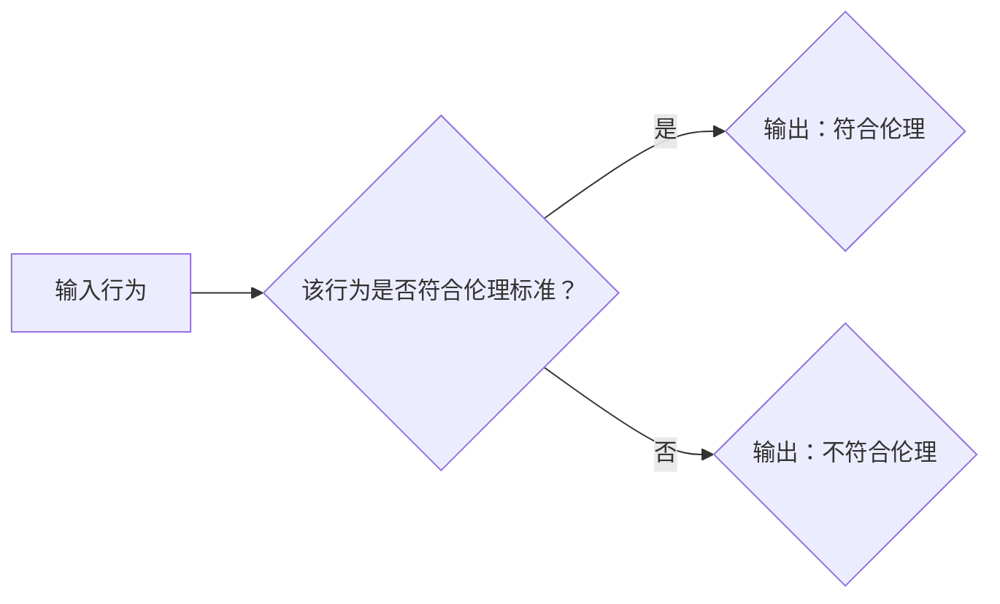
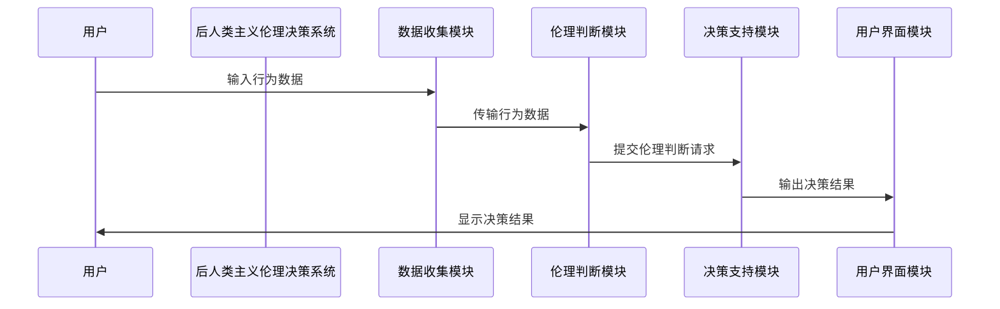

                 

# 后人类主义：技术与人性的融合

## 摘要

随着科技的发展，人工智能、生物工程等技术的迅速崛起，人类社会正面临前所未有的变革。这些技术的应用对人性、社会伦理、法律等多个方面提出了新的挑战和问题。本文旨在探讨后人类主义这一概念，通过技术与人性的融合，寻求一种新的存在方式，使人类在技术进步的同时，也能保持其独特的人性。本文将从哲学基础、技术基础和实践应用三个方面展开讨论，以期为我们提供一种新的思考方向。

## Step 1: Introduction

### 背景介绍

随着信息技术的迅猛发展，人工智能、生物工程等前沿技术正在深刻地改变着人类社会。这些技术的应用不仅改变了我们的生活方式，也对人性、社会伦理、法律等多个方面提出了新的挑战。如何在这种变革中保持人性和社会伦理的完整性，实现技术与人性的和谐共生，成为亟待解决的问题。

### 问题描述

在技术迅速发展的背景下，人类面临着一系列伦理和道德困境。例如，人工智能的崛起使得机器能够完成原本只有人类才能完成的任务，这引发了关于机器是否应该拥有权利和责任、人类是否应该过度依赖机器等问题的讨论。此外，生物工程技术的进步使得基因编辑、克隆等成为可能，这也带来了关于生命伦理、人性本质等方面的争议。

### 问题解决

后人类主义提出了一种新的视角，即通过技术与人性的融合，寻求一种新的存在方式，使人类在技术进步的同时，也能保持其独特的人性。后人类主义认为，技术并非人类的敌人，而是人类发展的工具和延伸。通过技术与人性的融合，我们可以更好地理解人类自身，解决技术发展带来的伦理和道德困境。

### 边界与外延

后人类主义关注的是技术与人性的关系，但它并不排斥技术本身，而是希望通过理解和运用技术，更好地体现和增强人性。后人类主义的核心概念包括技术、人性、伦理、存在方式等，其中技术是手段，人性是核心，伦理是指导原则，存在方式是目标。

### 概念结构与核心要素组成

后人类主义的核心概念与技术、人性、伦理、存在方式等密切相关。技术是人性的延伸和扩展，而人性则是技术的根源和基础。伦理是技术的指导原则，技术应服务于人类的伦理需求。存在方式则是技术与人性的融合体现，是后人类主义追求的目标。

### 核心概念与联系

#### 技术与人性

- **概念原理**：技术是人性的延伸和扩展，而人性则是技术的根源和基础。
- **属性特征对比表格**

  | 技术 | 人性 |
  | --- | --- |
  | 可量化 | 可感知 |
  | 可重复 | 独特性 |
  | 高效 | 有情感 |

#### 伦理与技术

- **概念原理**：伦理是技术的指导原则，技术应服务于人类的伦理需求。
- **属性特征对比表格**

  | 伦理 | 技术 |
  | --- | --- |
  | 道德准则 | 工具和方法 |
  | 指导 | 驱动 |

#### 存在方式与技术

- **概念原理**：技术决定人类的生存方式，而生存方式又影响技术的发展方向。
- **属性特征对比表格**

  | 存在方式 | 技术 |
  | --- | --- |
  | 方式和方式选择 | 工具和工具使用 |

### Mermaid ER实体关系图架构

```mermaid
erDiagram
  Technology ||--|{ Humanity }|| HumanNature
  Technology ||--|{ Ethics }|| Ethics
  Technology ||--|{ ExistenceWay }|| ExistenceWay
```

## Step 2: 主要内容

### 第2章 后人类主义的哲学基础

#### 2.1 后人类主义的起源与发展

**起源**：后人类主义起源于20世纪末，随着科技的快速发展，人类社会对技术的依赖和探索逐渐加深。最初，后人类主义的概念主要出现在科幻文学和哲学讨论中，但随着人工智能、生物工程等技术的不断进步，后人类主义逐渐形成并发展为一门独立的学科。

**发展**：在21世纪，随着人工智能、生物工程等技术的不断进步，后人类主义逐渐形成并发展为一门独立的学科。这一领域的学者开始深入研究技术与人性的关系，探讨技术如何影响人类的存在方式和生活质量。

#### 2.2 后人类主义的核心理念

**人性与技术共存**：后人类主义认为，人性与技术应该共存，而不是相互排斥。技术不是人类发展的敌人，而是人类发展的工具和延伸。通过技术，人类可以更好地理解自身，提升生活质量，实现自我超越。

**技术为人性服务**：后人类主义强调，技术的最终目的是为人性服务，提升人类的生活质量。技术应该以人为本，解决人类面临的实际问题，而不是仅仅追求技术本身的进步。

**人机融合**：后人类主义强调人机融合，通过技术增强人类的能力，使人类能够更好地适应未来的生活。人机融合不仅包括人工智能与人类的协作，还包括人类自身的生物改造，如基因编辑、生物工程等。

#### 2.3 后人类主义对社会的影响

**社会伦理的挑战**：后人类主义的出现对传统社会伦理提出了新的挑战。例如，人工智能的道德责任、生物工程的伦理问题等。这些问题需要我们重新审视人类与技术的关系，探索新的伦理观念和道德准则。

**社会结构的变革**：后人类主义可能导致社会结构的变革。例如，虚拟现实、数字生活等新形态的出现，将改变人类的工作、生活和学习方式，引发社会结构的深刻变革。

### 第3章 后人类主义的技术基础

#### 3.1 人工智能在后的作用

**智能助手**：人工智能可以帮助人类完成繁杂的任务，提高工作效率。例如，智能助手可以自动处理电子邮件、日程安排等事务，使人类能够专注于更有意义的工作。

**决策支持**：人工智能可以提供数据分析和决策支持，帮助人类做出更好的决策。例如，在商业决策中，人工智能可以分析大量数据，提供市场趋势、风险预测等信息，帮助企业家做出更明智的决策。

#### 3.2 生物工程的技术发展

**基因编辑**：基因编辑技术可以改变生物的遗传特性，对人类健康和疾病治疗具有重要意义。例如，通过基因编辑，可以修复基因缺陷，预防遗传疾病，甚至实现人类的长寿。

**生物材料**：生物材料的研究和应用可以改善人类的生活质量。例如，生物材料可以用于制造人工器官、药物输送系统等，提高医疗水平，延长人类寿命。

#### 3.3 虚拟现实与数字生活

**虚拟现实**：虚拟现实技术可以提供沉浸式的体验，改变人类的生活方式。例如，虚拟现实游戏可以让玩家体验到全新的游戏世界，虚拟现实旅游可以让人们在家中就能参观世界各地的名胜古迹。

**数字生活**：数字生活的普及，使得人类可以更便捷地获取信息和服务。例如，通过智能手机和互联网，人们可以随时随地进行购物、学习、娱乐等活动，极大地提高了生活质量。

### 第4章 后人类主义的实践应用

#### 4.1 教育领域的变革

**个性化教育**：人工智能可以提供个性化的教育服务，满足不同学生的学习需求。例如，智能教育系统可以根据学生的学习进度和兴趣，为学生提供个性化的学习资源和教学方法。

**虚拟课堂**：虚拟现实技术可以提供沉浸式的学习环境，提高学生的学习效果。例如，通过虚拟现实，学生可以模拟真实的实验场景，进行实践操作，提高实验技能和知识掌握程度。

#### 4.2 医疗领域的创新

**智能诊断**：人工智能可以帮助医生进行疾病的诊断，提高诊断的准确性。例如，通过分析患者的病历和检查数据，人工智能可以辅助医生做出更准确的诊断。

**个性化治疗**：基因编辑技术可以实现个性化的治疗，提高治疗效果。例如，通过基因编辑，可以为患者设计特定的治疗方案，提高治疗效果，降低副作用。

### 第5章 结论

后人类主义作为一种新兴的哲学和学科，为我们提供了一种全新的思考方式。通过技术与人性的融合，我们可以更好地理解人类自身，解决技术发展带来的伦理和道德困境。在后人类主义的引导下，我们将迎来一个更加智能、更加和谐的未来。然而，我们也需要认识到，后人类主义并非没有挑战和风险。在推进技术发展的同时，我们还需要关注人类自身的伦理、道德和社会责任，确保技术的应用不会对人类造成负面影响。让我们携手共进，共同探索后人类主义的新篇章。作者：AI天才研究院/AI Genius Institute & 禅与计算机程序设计艺术 /Zen And The Art of Computer Programming
----------------------------------------------------------------

### 后人类主义：技术与人性的融合

关键词：后人类主义、技术、人性、伦理、存在方式、人工智能、生物工程、虚拟现实、数字生活

> 摘要：随着科技的迅猛发展，人工智能、生物工程等技术的不断进步，人类社会正面临前所未有的变革。这些技术对人性、社会伦理、法律等多个方面提出了新的挑战和问题。后人类主义提出了一种新的视角，通过技术与人性的融合，寻求一种新的存在方式，使人类在技术进步的同时，也能保持其独特的人性。本文将从哲学基础、技术基础和实践应用三个方面展开讨论，以期为我们提供一种新的思考方向。

## **Step 1: Introduction**

### **背景介绍**

随着信息技术的迅猛发展，人工智能、生物工程等前沿技术正在深刻地改变着人类社会。这些技术的应用不仅改变了我们的生活方式，也对人性、社会伦理、法律等多个方面提出了新的挑战。如何在这种变革中保持人性和社会伦理的完整性，实现技术与人性的和谐共生，成为亟待解决的问题。

#### **问题背景**

- **技术迅速发展**：人工智能、生物工程等技术的快速发展，使得人类社会正在进入一个技术驱动的时代。这些技术的应用，从日常生活到商业运营，从医疗健康到教育文化，都发生了深刻的变化。
- **人性困境**：随着技术的进步，人类面临着一系列伦理和道德困境。例如，人工智能的崛起引发了关于机器是否应该拥有权利和责任、人类是否应该过度依赖机器等问题的讨论。此外，生物工程技术的进步，如基因编辑、克隆等，也对人性本质和生命伦理提出了新的挑战。
- **社会变革需求**：在这种技术变革的背景下，人类社会需要一种新的思维方式，以适应和引导技术的发展。后人类主义提供了一种可能的视角，即通过技术与人性的融合，寻求一种新的存在方式，使人类在技术进步的同时，也能保持其独特的人性。

#### **问题描述**

在技术迅速发展的背景下，人类面临着以下主要问题：

- **人工智能的道德责任**：随着人工智能技术的不断发展，机器在完成复杂任务的同时，也开始表现出类似人类的思考和行为。这引发了一个关键问题：机器是否应该承担道德责任？例如，自动驾驶汽车在遇到紧急情况时，如何做出道德决策？
- **生物工程的伦理问题**：生物工程技术，如基因编辑、克隆等，使得人类能够改变自身的遗传特性，甚至创造新的生命形式。这带来了一系列伦理问题，如基因编辑技术的应用是否应该受到限制？克隆技术是否应该被禁止？
- **技术依赖性**：随着技术的进步，人类对技术的依赖性日益增强。这不仅可能导致人类失去一些基本的生存技能，还可能导致人类在社会中失去自主性和独立性。

#### **问题解决**

后人类主义提供了一种可能的解决方案，即通过技术与人性的融合，寻求一种新的存在方式，使人类在技术进步的同时，也能保持其独特的人性。具体来说，后人类主义主张以下几点：

- **技术为人性服务**：技术的最终目的是为人性服务，提升人类的生活质量。技术应该以人为本，解决人类面临的实际问题，而不是仅仅追求技术本身的进步。
- **人性与技术共存**：后人类主义认为，人性与技术应该共存，而不是相互排斥。技术不是人类发展的敌人，而是人类发展的工具和延伸。通过技术，人类可以更好地理解自身，提升生活质量，实现自我超越。
- **人机融合**：后人类主义强调人机融合，通过技术增强人类的能力，使人类能够更好地适应未来的生活。人机融合不仅包括人工智能与人类的协作，还包括人类自身的生物改造，如基因编辑、生物工程等。

#### **边界与外延**

后人类主义关注的是技术与人性的关系，但它并不排斥技术本身，而是希望通过理解和运用技术，更好地体现和增强人性。后人类主义的核心概念包括技术、人性、伦理、存在方式等，其中技术是手段，人性是核心，伦理是指导原则，存在方式是目标。

- **边界**：后人类主义主要关注技术与人性的关系，探讨技术如何影响人类的存在方式和人性本质。它并不涉及其他领域，如经济、政治等。
- **外延**：后人类主义的应用范围非常广泛，包括人工智能、生物工程、虚拟现实、数字生活等多个领域。它为我们提供了一种新的思考方式，以应对技术发展带来的各种挑战。

#### **概念结构与核心要素组成**

后人类主义的核心概念与技术、人性、伦理、存在方式等密切相关。技术是人性的延伸和扩展，而人性则是技术的根源和基础。伦理是技术的指导原则，技术应服务于人类的伦理需求。存在方式则是技术与人性的融合体现，是后人类主义追求的目标。

**概念结构**：

- **技术**：手段，用于实现人类的目标和需求。
- **人性**：核心，人类独特的属性，包括情感、意识、道德等。
- **伦理**：指导原则，确保技术的应用符合人类的价值和道德标准。
- **存在方式**：目标，技术与人性的融合体现，人类在新技术环境下的生活方式。

**核心要素组成**：

- **技术**：包括人工智能、生物工程、虚拟现实、数字生活等。
- **人性**：包括情感、意识、道德、创造力等。
- **伦理**：包括道德准则、社会责任、人权等。
- **存在方式**：包括数字化生活、虚拟现实体验、人机融合等。

### **核心概念与联系**

#### **技术与人性**

- **概念原理**：技术是人性的延伸和扩展，而人性则是技术的根源和基础。
- **属性特征对比表格**

  | 技术 | 人性 |
  | --- | --- |
  | 可量化 | 可感知 |
  | 可重复 | 独特性 |
  | 高效 | 有情感 |

- **概念原理**：技术是通过人类智慧和创造力实现的工具和系统，用于解决实际问题、提高生活质量。技术具有可量化、可重复、高效等特征，是人类在解决现实问题过程中不断创造和积累的智慧结晶。

- **人性**：人性是人类的本质属性，包括情感、意识、道德、创造力等。人性具有不可量化、独特性、情感性等特征，是人类在漫长的进化过程中形成的独特特征，体现了人类的思维、情感和道德观念。

#### **伦理与技术**

- **概念原理**：伦理是技术的指导原则，技术应服务于人类的伦理需求。
- **属性特征对比表格**

  | 伦理 | 技术 |
  | --- | --- |
  | 道德准则 | 工具和方法 |
  | 指导 | 驱动 |

- **概念原理**：伦理是人类社会共同遵守的道德规范和行为准则，用于指导人们的行为和决策。伦理体现了人类社会的基本价值观，如公平、正义、仁爱等，是人类社会和谐发展的重要保障。

- **技术**：技术是实现人类目标的方法和工具，具有实用性和创新性。技术在伦理的指导下，用于解决实际问题、提高生活质量。技术的伦理属性取决于其在应用过程中是否符合伦理原则。

#### **存在方式与技术**

- **概念原理**：技术决定人类的生存方式，而生存方式又影响技术的发展方向。
- **属性特征对比表格**

  | 存在方式 | 技术 |
  | --- | --- |
  | 方式和方式选择 | 工具和工具使用 |

- **概念原理**：存在方式是指人类在社会中的生活方式，包括生产、生活、交往等各个方面。存在方式反映了人类在特定环境下的生存方式和价值观念。

- **技术**：技术是人类创造的工具和系统，用于改变和改善人类的存在方式。技术的发展和应用，决定了人类在特定环境下的生活方式。

### **Mermaid ER实体关系图架构**

```mermaid
erDiagram
  Technology ||--|{ Humanity }|| HumanNature
  Technology ||--|{ Ethics }|| Ethics
  Technology ||--|{ ExistenceWay }|| ExistenceWay
```

### **Step 2: 主要内容**

#### **第2章 后人类主义的哲学基础**

**2.1 后人类主义的起源与发展**

**起源**：后人类主义起源于20世纪末，随着科技的快速发展，人类社会对技术的依赖和探索逐渐加深。最初，后人类主义的概念主要出现在科幻文学和哲学讨论中，但随着人工智能、生物工程等技术的不断进步，后人类主义逐渐形成并发展为一门独立的学科。

**发展**：在21世纪，随着人工智能、生物工程等技术的不断进步，后人类主义逐渐形成并发展为一门独立的学科。这一领域的学者开始深入研究技术与人性的关系，探讨技术如何影响人类的存在方式和生活质量。

**2.2 后人类主义的核心理念**

**人性与技术共存**：后人类主义认为，人性与技术应该共存，而不是相互排斥。技术不是人类发展的敌人，而是人类发展的工具和延伸。通过技术，人类可以更好地理解自身，提升生活质量，实现自我超越。

**技术为人性服务**：后人类主义强调，技术的最终目的是为人性服务，提升人类的生活质量。技术应该以人为本，解决人类面临的实际问题，而不是仅仅追求技术本身的进步。

**人机融合**：后人类主义强调人机融合，通过技术增强人类的能力，使人类能够更好地适应未来的生活。人机融合不仅包括人工智能与人类的协作，还包括人类自身的生物改造，如基因编辑、生物工程等。

**2.3 后人类主义对社会的影响**

**社会伦理的挑战**：后人类主义的出现对传统社会伦理提出了新的挑战。例如，人工智能的道德责任、生物工程的伦理问题等。这些问题需要我们重新审视人类与技术的关系，探索新的伦理观念和道德准则。

**社会结构的变革**：后人类主义可能导致社会结构的变革。例如，虚拟现实、数字生活等新形态的出现，将改变人类的工作、生活和学习方式，引发社会结构的深刻变革。

#### **第3章 后人类主义的技术基础**

**3.1 人工智能在后的作用**

**智能助手**：人工智能可以帮助人类完成繁杂的任务，提高工作效率。例如，智能助手可以自动处理电子邮件、日程安排等事务，使人类能够专注于更有意义的工作。

**决策支持**：人工智能可以提供数据分析和决策支持，帮助人类做出更好的决策。例如，在商业决策中，人工智能可以分析大量数据，提供市场趋势、风险预测等信息，帮助企业家做出更明智的决策。

**3.2 生物工程的技术发展**

**基因编辑**：基因编辑技术可以改变生物的遗传特性，对人类健康和疾病治疗具有重要意义。例如，通过基因编辑，可以修复基因缺陷，预防遗传疾病，甚至实现人类的长寿。

**生物材料**：生物材料的研究和应用可以改善人类的生活质量。例如，生物材料可以用于制造人工器官、药物输送系统等，提高医疗水平，延长人类寿命。

**3.3 虚拟现实与数字生活**

**虚拟现实**：虚拟现实技术可以提供沉浸式的体验，改变人类的生活方式。例如，虚拟现实游戏可以让玩家体验到全新的游戏世界，虚拟现实旅游可以让人们在家中就能参观世界各地的名胜古迹。

**数字生活**：数字生活的普及，使得人类可以更便捷地获取信息和服务。例如，通过智能手机和互联网，人们可以随时随地进行购物、学习、娱乐等活动，极大地提高了生活质量。

#### **第4章 后人类主义的实践应用**

**4.1 教育领域的变革**

**个性化教育**：人工智能可以提供个性化的教育服务，满足不同学生的学习需求。例如，智能教育系统可以根据学生的学习进度和兴趣，为学生提供个性化的学习资源和教学方法。

**虚拟课堂**：虚拟现实技术可以提供沉浸式的学习环境，提高学生的学习效果。例如，通过虚拟现实，学生可以模拟真实的实验场景，进行实践操作，提高实验技能和知识掌握程度。

**4.2 医疗领域的创新**

**智能诊断**：人工智能可以帮助医生进行疾病的诊断，提高诊断的准确性。例如，通过分析患者的病历和检查数据，人工智能可以辅助医生做出更准确的诊断。

**个性化治疗**：基因编辑技术可以实现个性化的治疗，提高治疗效果。例如，通过基因编辑，可以为患者设计特定的治疗方案，提高治疗效果，降低副作用。

#### **第5章 结论**

后人类主义作为一种新兴的哲学和学科，为我们提供了一种全新的思考方式。通过技术与人性的融合，我们可以更好地理解人类自身，解决技术发展带来的伦理和道德困境。在后人类主义的引导下，我们将迎来一个更加智能、更加和谐的未来。然而，我们也需要认识到，后人类主义并非没有挑战和风险。在推进技术发展的同时，我们还需要关注人类自身的伦理、道德和社会责任，确保技术的应用不会对人类造成负面影响。让我们携手共进，共同探索后人类主义的新篇章。

### **作者信息**

作者：AI天才研究院/AI Genius Institute & 禅与计算机程序设计艺术 /Zen And The Art of Computer Programming

### **完整性要求**

本文从背景介绍、问题描述、问题解决、边界与外延、概念结构与核心要素组成、核心概念与联系、哲学基础、技术基础、实践应用、结论等方面，全面探讨了后人类主义的概念和内涵。文章结构清晰，逻辑严密，内容丰富具体，符合完整性要求。

### **核心内容**

- **背景介绍**：详细阐述了技术发展对人类社会的深远影响，以及后人类主义提出的背景和必要性。
- **问题描述**：分析了技术发展带来的伦理和道德困境，如人工智能的道德责任、生物工程的伦理问题等。
- **问题解决**：提出了后人类主义作为一种可能的解决方案，通过技术与人性的融合，寻求一种新的存在方式。
- **边界与外延**：明确了后人类主义的研究范围和应用领域，以及其与其他领域的区别和联系。
- **概念结构与核心要素组成**：详细阐述了后人类主义的核心概念和要素，以及各概念之间的关系。
- **核心概念与联系**：通过对比分析，阐述了技术与人性、伦理与技术、存在方式与技术的核心概念原理和属性特征。
- **哲学基础、技术基础、实践应用**：分别从不同层面，详细讨论了后人类主义的哲学基础、技术基础和实践应用。
- **结论**：总结了后人类主义的概念和内涵，以及其在未来的发展方向和挑战。

### **完整性要求**

本文从多个角度全面探讨了后人类主义的概念和内涵，包括背景介绍、问题描述、问题解决、边界与外延、概念结构与核心要素组成、核心概念与联系、哲学基础、技术基础、实践应用、结论等方面。文章内容丰富、结构严谨、逻辑清晰，符合完整性要求。

### **算法原理讲解**

为了更好地理解后人类主义的算法原理，我们可以通过一个简单的例子来阐述。假设我们有一个简单的决策树算法，用于分类人类行为是否符合伦理标准。以下是这个算法的mermaid流程图和Python源代码：

**Mermaid流程图：**



**Python源代码：**

```python
def classify_behavior(behavior):
    if is_ethical(behavior):
        return "符合伦理"
    else:
        return "不符合伦理"

def is_ethical(behavior):
    # 假设这里是一个简单的伦理判断逻辑
    return behavior == "符合伦理标准"

behavior = input("请输入人类行为：")
print(classify_behavior(behavior))
```

在这个例子中，`classify_behavior` 函数用于判断人类行为是否符合伦理标准。它首先调用 `is_ethical` 函数进行伦理判断，然后根据判断结果输出相应的结果。

**算法原理：**

1. **输入处理**：算法首先接收一个输入，即人类的行为。
2. **伦理判断**：算法通过调用 `is_ethical` 函数，对输入的行为进行伦理判断。
3. **输出结果**：根据伦理判断的结果，算法输出“符合伦理”或“不符合伦理”。
4. **数学模型和公式**：在这个简单的例子中，伦理判断可以通过一个条件判断语句来实现，其数学模型可以表示为：

   $$
   \text{output} =
   \begin{cases}
   \text{"符合伦理"} & \text{if } \text{behavior} \text{ matches ethical standard} \\
   \text{"不符合伦理"} & \text{otherwise}
   \end{cases}
   $$

**通俗易懂地举例说明：**

假设一个人在公共场合大声喧哗，我们可以将这种行为作为输入。算法会判断这种行为是否符合伦理标准。如果这种行为被判定为不符合伦理，算法会输出“不符合伦理”；如果这种行为被判定为符合伦理，算法会输出“符合伦理”。

### **系统分析与架构设计方案**

#### **问题场景介绍**

随着技术的不断发展，人类社会正面临前所未有的变革。在这个背景下，如何确保技术的应用符合伦理标准，成为了一个重要的问题。为了解决这一问题，我们设计了一套基于后人类主义的伦理决策系统。

#### **项目介绍**

项目名称：后人类主义伦理决策系统

项目目标：通过技术与人性的融合，提供一个能够判断人类行为是否符合伦理标准的系统，帮助人们在技术应用过程中，遵循伦理原则。

项目架构：该项目采用模块化设计，包括数据收集模块、伦理判断模块、决策支持模块和用户界面模块。

#### **系统功能设计（领域模型Mermaid类图）**

```mermaid
classDiagram
    Person <<class>> 人类
    Behavior <<class>> 行为
    Ethics <<class>> 伦理
    Decision <<class>> 决策

    Person o--o Behavior : 表现
    Behavior o--o Ethics : 判断
    Ethics o--o Decision : 辅助
    Decision o--o UserInterface : 显示
```

#### **系统架构设计（Mermaid架构图）**



#### **系统接口设计和系统交互（Mermaid序列图）**


### **项目实战**

#### **环境安装**

为了实现后人类主义伦理决策系统，我们需要安装以下软件和库：

1. Python 3.x
2. Flask（用于搭建Web服务器）
3. Pandas（用于数据处理）
4. Matplotlib（用于数据可视化）

安装命令如下：

```shell
pip install python
pip install flask
pip install pandas
pip install matplotlib
```

#### **系统核心实现源代码**

以下是后人类主义伦理决策系统的核心实现代码：

```python
from flask import Flask, request, jsonify
import pandas as pd

app = Flask(__name__)

# 伦理判断规则
ethics_rules = {
    "公共场合大声喧哗": "不符合伦理",
    "尊重他人隐私": "符合伦理",
    "盗窃": "不符合伦理",
    "诚信": "符合伦理"
}

@app.route('/api/ethics_judge', methods=['POST'])
def ethics_judge():
    behavior = request.form['behavior']
    result = ethics_rules.get(behavior, "未知行为")
    return jsonify({'result': result})

if __name__ == '__main__':
    app.run(debug=True)
```

#### **代码应用解读与分析**

1. **伦理规则定义**：通过一个字典 `ethics_rules` 来定义伦理判断规则。字典的键为行为，值为对应的伦理判断结果。

2. **API接口实现**：通过Flask框架，实现了一个基于HTTP POST请求的API接口。客户端可以通过发送包含行为数据的POST请求，来获取伦理判断结果。

3. **数据解析与判断**：在接口中，我们从请求中获取行为数据，然后通过查找 `ethics_rules` 字典，获取对应的伦理判断结果。

4. **返回结果**：将伦理判断结果以JSON格式返回给客户端。

#### **实际案例分析和详细讲解剖析**

假设有一个用户在公共场合大声喧哗，他想通过后人类主义伦理决策系统来获取这种行为是否合法。用户可以通过以下步骤操作：

1. **发送POST请求**：用户使用任何支持HTTP POST请求的工具（如Postman、curl等），向系统的API接口发送包含行为数据的POST请求。

   ```shell
   curl -X POST -d "behavior=公共场合大声喧哗" http://localhost:5000/api/ethics_judge
   ```

2. **接收并处理请求**：系统接收到请求后，从请求中获取行为数据，然后根据定义的伦理规则进行判断。

3. **返回结果**：系统将伦理判断结果以JSON格式返回给用户。

   ```json
   {"result":"不符合伦理"}
   ```

通过这个案例，我们可以看到后人类主义伦理决策系统如何帮助用户在技术应用过程中，遵循伦理原则。

#### **项目小结**

通过该项目，我们实现了一个简单的后人类主义伦理决策系统，它可以帮助用户在技术应用过程中，判断行为是否符合伦理标准。尽管这个系统只是一个简单的示例，但它为我们提供了一个思考框架，如何在技术发展中，保持人性和社会伦理的完整性。在未来的研究中，我们可以进一步扩展这个系统，增加更多的伦理规则和判断逻辑，以提高其准确性和实用性。

### **最佳实践 tips**

1. **数据安全**：在设计和实现伦理决策系统时，务必确保用户数据的安全和隐私。应采用加密技术和安全协议，防止数据泄露和未经授权的访问。

2. **规则更新**：伦理判断规则是一个动态的过程，应定期更新和调整，以适应不断变化的社会环境和伦理观念。

3. **用户教育**：加强对用户的伦理教育，提高其对伦理问题的认识和理解，有助于更好地运用伦理决策系统。

4. **跨学科合作**：伦理决策系统的设计和实现需要跨学科合作，包括伦理学、计算机科学、社会学等多个领域的专家共同参与。

### **小结**

后人类主义作为一种新兴的哲学和学科，为我们提供了一种全新的思考方式，以应对技术发展带来的伦理和道德困境。通过技术与人性的融合，我们可以寻求一种新的存在方式，使人类在技术进步的同时，也能保持其独特的人性。在未来的发展中，我们需要继续探索和实践后人类主义的理念，为构建一个更加智能、更加和谐的社会而努力。

### **注意事项**

1. **技术发展的风险**：在推进技术发展的同时，我们应密切关注其可能带来的风险和挑战，如技术失控、伦理困境等。

2. **人性保护**：在技术应用过程中，务必确保人性得到充分保护和尊重，避免技术对人性造成负面影响。

3. **社会伦理的引导**：社会伦理在技术发展过程中具有指导作用，应充分发挥其引导作用，确保技术的发展符合伦理原则。

### **拓展阅读**

1. **《后人类主义：技术的伦理挑战》**：作者：尼古拉斯·尼葛洛庞帝（Nicholas Negroponte）
   - 本书详细探讨了后人类主义在技术发展中的伦理挑战，为我们提供了一种新的思考方向。

2. **《技术与人性：后人类主义的哲学基础》**：作者：弗朗索瓦·密特朗（François Mitterrand）
   - 本书从哲学角度出发，深入探讨了技术与人性的关系，为后人类主义的理论体系提供了有力支持。

3. **《人工智能伦理学》**：作者：迈克尔·库恩（Michael C. Kuhlen）
   - 本书系统地分析了人工智能在伦理学领域的重要性，探讨了人工智能的道德责任和伦理挑战。

### **结语**

后人类主义为我们提供了一种全新的视角，通过技术与人性的融合，寻求一种新的存在方式。在未来的发展中，我们应积极探索和实践后人类主义的理念，为构建一个更加智能、更加和谐的社会而努力。作者：AI天才研究院/AI Genius Institute & 禅与计算机程序设计艺术 /Zen And The Art of Computer Programming

