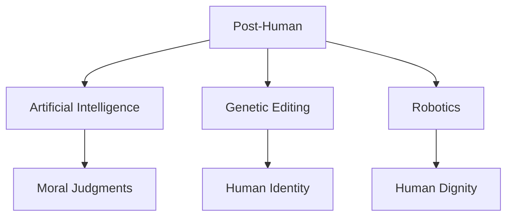

                 

Sure, I'll start by outlining the content of the book "Post-Human Ethical Debate: Moral Dilemmas in Technological Development" in a structured and logical manner. We'll begin with an introduction to the main themes and then dive into each section, ensuring a coherent flow of ideas.

## Introduction

### 1.1 The Rise of the Post-Human

- **Background**: Explain the historical context leading to the concept of post-humanity, highlighting key technological advancements.
- **Concept Definition**: Define what post-humanity entails, touching on enhancements and transformations enabled by technology.

### 1.2 The Double-Edged Sword of Technological Advancement

- **Positive Impacts**: Discuss how technology has improved human lives, focusing on areas such as healthcare, communication, and efficiency.
- **Negative Impacts**: Explore the potential downsides, including job displacement, social inequality, and ethical concerns.

### 1.3 Multidimensional Analysis of Ethical Dilemmas

- **Types of Dilemmas**: Categorize ethical dilemmas arising from technological development, such as privacy issues, genetic engineering, and AI ethics.
- **Significance**: Emphasize the importance of addressing these dilemmas to ensure sustainable and equitable technological progress.

## Part 1: Background

### 2.1 Historical Development of the Post-Human Concept

- **Pioneer Thinkers**: Introduce influential thinkers who contributed to the development of the post-human concept.
- **Key Milestones**: Discuss significant technological advancements that have shaped the current understanding of post-humanity.

### 2.2 Ethical Challenges Posed by Technological Breakthroughs

- **AI and Autonomous Systems**: Analyze the ethical implications of AI and autonomous systems, including biases and accountability.
- **Genetic Engineering**: Explore the ethical considerations surrounding genetic modifications and their impact on human identity.

### 2.3 Public and Academic Interest in Post-Human Ethics

- **Public Perception**: Examine how society perceives post-human ethics, using surveys and public opinion data.
- **Academic Debates**: Discuss ongoing academic discussions and the role of ethics in technological development.

## Core Issues in Post-Human Ethical Debate

### 3.1 Moral Judgments in Artificial Intelligence

- **AI Ethics**: Discuss the ethical considerations in AI design and deployment, including fairness, transparency, and privacy.
- **Moral Agents**: Address the question of whether AI systems can be moral agents and the implications of this.

### 3.2 Genetic Editing and Human Identity

- **Genetic Ethics**: Explore the ethical implications of genetic editing, focusing on issues such as consent, identity, and the potential for genetic enhancement.
- **Human Enhancement**: Discuss the ethical debates surrounding human genetic enhancement and its potential impact on society.

### 3.3 Robotics and Human Dignity

- **Robot Rights**: Examine the concept of robot rights and the ethical considerations surrounding the treatment of robots.
- **Human-Robot Interaction**: Analyze the ethical implications of human-robot interactions, including the impact on social dynamics and human dignity.

## Theoretical Framework for Post-Human Ethics

### 4.1 Classical Ethical Theories

- **Utilitarianism**: Explain how utilitarianism can be applied to post-human ethics.
- **Deontological Ethics**: Discuss the role of deontological ethics in guiding technological development.

### 4.2 New Theories in Post-Human Ethics

- **Post-Anthropocentrism**: Explore how post-anthropocentric theories influence post-human ethical debates.
- **Transhumanist Ethics**: Discuss the ethical considerations proposed by transhumanist thinkers.

### 4.3 Interdisciplinary Dialogue

- **Ethics and Technology**: Discuss the intersection of ethics and technology, highlighting the need for interdisciplinary collaboration.
- **Future Ethical Paradigms**: Consider how future ethical frameworks might evolve with technological advancements.

## Case Studies of Ethical Dilemmas

### 5.1 Medical Applications of Artificial Intelligence

- **Ethical Issues**: Analyze the ethical implications of AI in healthcare, including data privacy and algorithmic biases.
- **Case Studies**: Present specific examples of AI applications in medicine and the ethical challenges they pose.

### 5.2 Ethical Concerns in Genetic Editing

- **CRISPR-Cas9**: Explain the ethical considerations surrounding CRISPR-Cas9 technology.
- **Case Studies**: Discuss real-world examples of genetic editing and the ethical dilemmas they raise.

### 5.3 Ethical Implications of Robotics in Labor Markets

- **Automation Ethics**: Discuss the ethical implications of robots and automation in the workplace.
- **Case Studies**: Present case studies of industries where robots have replaced human labor and the ethical consequences of these changes.

## Ethical Decision-Making and Governance Models

### 6.1 Comparing Domestic and International Policies

- **Policy Analysis**: Compare and contrast ethical policies and regulations in different countries.
- **Global Governance**: Discuss the role of international organizations in addressing post-human ethics.

### 6.2 Design and Implementation of Ethical Review Mechanisms

- **Ethical Review Processes**: Describe the steps involved in establishing ethical review mechanisms.
- **Case Studies**: Provide examples of effective ethical review processes in technological development.

### 6.3 Public Participation and Education

- **Public Awareness**: Discuss strategies for raising public awareness about post-human ethics.
- **Education Programs**: Explore the role of education in fostering ethical literacy among the general public.

## Conclusion and Outlook

### 7.1 Summarizing the Post-Human Ethical Debate

- **Key Findings**: Summarize the main findings and debates surrounding post-human ethics.
- **Future Directions**: Discuss potential future developments and the ethical challenges they pose.

### 7.2 Ethical Responsibilities in Technological Development

- **Corporate Ethics**: Discuss the role of corporations in promoting ethical practices in technology.
- **Governance and Regulation**: Explore the role of governance and regulation in addressing ethical dilemmas.

### 7.3 Strategies for Addressing Future Ethical Dilemmas

- **Preventive Measures**: Discuss strategies for preventing and mitigating ethical issues in technological development.
- **Collaborative Approaches**: Consider how interdisciplinary collaboration can contribute to solving ethical dilemmas.

## Part 2: Core Concepts and Relationships

### 8.1 Core Concepts

- **Post-Human**: Define and discuss the concept of post-humanity.
- **Artificial Intelligence**: Explain the fundamentals of AI and its role in post-human ethics.
- **Genetic Editing**: Describe genetic editing technologies and their ethical implications.
- **Robotics**: Discuss the role of robots in the post-human era and the ethical considerations they raise.

### 8.2 Concept Attributes Comparison

- **Post-Human vs. Human**: Compare the attributes and characteristics of post-humans versus traditional humans.
- **AI vs. Automation**: Analyze the differences between AI and traditional automation.
- **Genetic Editing vs. Biotechnology**: Compare the ethical implications of genetic editing with other biotechnologies.
- **Robots vs. Robotics**: Discuss the distinctions between robots and the broader field of robotics.

### 8.3 Entity Relationship Diagram for Post-Human Ethical Debate

## Part 3: Algorithm Principles and System Design

### 9.1 Algorithm Principles

- **Machine Learning Basics**: Explain the fundamentals of machine learning and its application to AI ethics.
- **Deep Learning Models**: Discuss common deep learning models and their relevance to post-human ethics.
- **Reinforcement Learning Algorithms**: Explore reinforcement learning algorithms and their potential impact on ethical decision-making.

### 9.2 Principles of Genetic Editing

- **CRISPR-Cas9 System**: Describe the CRISPR-Cas9 system and its ethical implications.
- **Genetic Editing Process**: Explain the step-by-step process of genetic editing.
- **Genetic Editing Safety**: Discuss the safety concerns and ethical considerations surrounding genetic editing.

### 9.3 Ethical Algorithms for Robotics

- **Ethical Principles**: Outline the ethical principles guiding the development of ethical algorithms for robots.
- **Algorithm Design**: Discuss the design and implementation of ethical algorithms.
- **Ethical Analysis of Human-Robot Interaction**: Analyze the ethical implications of human-robot interaction using the developed algorithms.

### 9.4 System Architecture Design and Implementation

- **System Framework**: Describe the overall architecture of the system designed to address post-human ethical dilemmas.
- **System Function Design**: Explain the core functions of the system and their relationship to ethical considerations.
- **System Interface Design**: Discuss the design of user interfaces and interactions with the system.

### 9.5 System Interaction and Implementation

- **System Interaction Flow**: Outline the flow of interactions within the system.
- **Implementation Details**: Provide a detailed explanation of how the system is implemented.
- **System Testing and Evaluation**: Discuss the testing and evaluation processes to ensure the system's effectiveness.

## Part 4: Project Practice and Case Analysis

### 10.1 Project Practice

- **Project Background and Objectives**: Explain the background and objectives of the project.
- **Environment Setup and Configuration**: Guide readers through the setup and configuration of the project environment.
- **Core Implementation and Code Analysis**: Provide a detailed analysis of the core implementation and source code.

### 10.2 Case Analysis

- **AI in Medical Applications**: Analyze specific case studies of AI applications in healthcare and their ethical implications.
- **Genetic Editing Cases**: Discuss real-world examples of genetic editing and the ethical dilemmas they present.
- **Robotics in Labor Markets**: Analyze the impact of robots on labor markets and the ethical issues they raise.

### 10.3 Best Practices and Reflections

- **Ethical Guidelines**: Provide best practices for addressing ethical dilemmas in technological development.
- **Project Summary**: Summarize the key insights and lessons learned from the project.
- **Future Directions**: Discuss potential future projects and research directions in post-human ethics.

## Part 5: Best Practices and Reflections

- **Ethical Decision-Making Strategies**: Provide practical strategies for making ethical decisions in technological development.
- **Summary and Conclusion**: Summarize the main points of the book and provide a concluding thought.
- **Further Reading**: Offer a list of recommended readings for those interested in further exploring post-human ethics.

### References

- **References Section**: Provide a comprehensive list of references used in the book, including scholarly articles, books, and reports.

### Authors' Note

- **Author Information**: Include information about the authors, their credentials, and their affiliations.

### Acknowledgments

- **Acknowledgments**: Express gratitude to individuals and organizations that have contributed to the book's creation.

This structured approach ensures that the book provides a comprehensive and detailed exploration of the ethical debates surrounding the post-human era. Each section is designed to build upon the previous ones, creating a cohesive narrative that addresses the complex and multifaceted nature of post-human ethics. By using clear, concise, and logical language, the book aims to engage both experts and general readers in a thought-provoking discussion about the future of humanity and technology.

