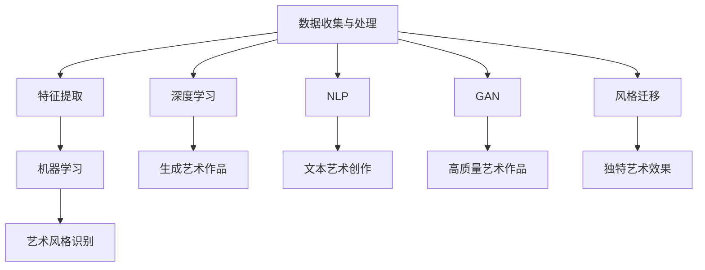

                 

### 引言

#### 书籍主题与目标读者

《后人类创意：AI辅助下的艺术创作》是一本专注于探讨人工智能（AI）在艺术创作领域应用的前沿技术书籍。本书的目标读者是那些对艺术和科技交叉领域感兴趣的科研人员、艺术家、设计师、以及所有对AI在艺术创作中潜力感到好奇的读者。通过深入分析AI技术在艺术创作中的应用，本书旨在为读者提供一个全面的技术视角，帮助理解AI如何改变传统的艺术创作过程，并探索其广阔的前景。

#### AI与艺术创作的关系

随着人工智能技术的飞速发展，AI逐渐成为艺术创作的重要伙伴。从生成音乐、绘画到编写诗歌，AI在艺术领域的应用已经引起了广泛的关注。这不仅是因为AI能够创造出独特的艺术作品，还因为它在处理大量数据、发现新模式和生成新颖创意方面具有独特优势。AI在艺术创作中的应用，不仅扩展了艺术家的创作手段，也带来了新的艺术表现形式和风格。

#### 内容结构概述

本书的内容结构分为以下几个部分：

1. **引言**：介绍书籍的主题和目标读者，概述AI与艺术创作的关系。
2. **背景介绍**：介绍AI的发展背景，艺术创作领域面临的问题，以及AI辅助艺术创作的基本原理。
3. **核心概念与联系**：定义AI辅助艺术创作中的核心概念，对比不同技术的属性特征，并使用ER实体关系图展示概念之间的关系。
4. **AI辅助艺术创作的技术原理**：详细讲解AI辅助艺术创作的关键技术，使用算法流程图和Python源代码阐述算法原理。
5. **案例实战**：介绍实际案例，展示AI辅助艺术创作在实际中的应用，分析案例中的关键技术和实现细节。
6. **系统分析与架构设计**：介绍AI辅助艺术创作系统的整体架构，使用Mermaid绘制系统架构图和领域模型图。
7. **总结与拓展**：总结全书的核心观点和技术要点，提供最佳实践建议，并指出未来可能的研究方向和趋势。

通过这本书，读者将能够深入了解AI在艺术创作中的实际应用，掌握相关技术原理，并能够为未来的艺术创作提供新的思路和方法。

### 背景介绍

#### AI的发展背景

人工智能（AI）作为一个多学科交叉的研究领域，起源于20世纪50年代。当时，随着计算机技术的迅猛发展，科学家们开始探讨机器是否能够模拟人类智能，从而执行复杂的任务。从最初的逻辑推理、问题求解，到机器学习、深度学习，AI技术经历了多次重大变革和突破。特别是在2012年，深度学习技术的崛起为AI带来了新的活力，使其在图像识别、自然语言处理等领域取得了显著的进展。如今，AI技术已经广泛应用于各个行业，包括医疗、金融、交通等，并在改变人们生活方式的同时，也逐渐渗透到艺术创作领域。

#### 艺术创作领域面临的问题

艺术创作一直以来都是人类智慧的结晶，但现代艺术创作面临着诸多挑战。首先，艺术家在创作过程中往往需要大量的时间和精力，而且创作过程高度依赖个人灵感。此外，随着艺术作品的数量不断增加，艺术创作者如何突破传统限制，创造出具有创新性和独特性的作品成为一大难题。另外，艺术品的创作和推广过程中，也需要面对市场需求和受众偏好的变化。这些挑战不仅增加了艺术创作的难度，也限制了艺术家的创作自由和表达空间。

#### AI辅助艺术创作的基本原理

AI辅助艺术创作的基本原理主要依赖于机器学习、深度学习和自然语言处理等技术。通过训练大量数据集，AI可以学习到各种艺术风格和创作技巧，从而生成新的艺术作品。具体来说，AI辅助艺术创作的过程可以分为以下几个步骤：

1. **数据收集与处理**：首先，需要收集大量的艺术作品数据，包括不同风格、流派和艺术家的作品。这些数据将被用于训练AI模型。

2. **特征提取**：通过对数据进行处理和分析，提取出艺术作品的特征，如颜色、形状、纹理等。

3. **模型训练**：利用提取出的特征，通过机器学习和深度学习算法，训练AI模型，使其能够识别和理解艺术作品的风格和创作规律。

4. **艺术创作**：在模型训练完成后，AI可以根据给定的条件或提示，生成新的艺术作品。这些作品可以是绘画、音乐、诗歌等多种形式。

5. **优化与反馈**：艺术家可以对AI生成的作品进行评价和修改，通过不断优化，使作品更符合艺术家的创作意图和审美标准。

AI在辅助艺术创作中的优势在于，它不仅能够处理和分析大量数据，还能够不断学习和改进，从而创造出新颖、独特的艺术作品。同时，AI还能够帮助艺术家解放双手，将更多的精力投入到创作理念和情感表达上，从而提高艺术创作的效率和质量。

### 核心概念与联系

#### 核心概念定义

在探讨AI辅助艺术创作的过程中，以下几个核心概念至关重要：

1. **机器学习（Machine Learning）**：一种使计算机系统能够从数据中学习，并逐步改进自身性能的技术。在AI辅助艺术创作中，机器学习用于训练模型，识别和模仿艺术风格。
   
2. **深度学习（Deep Learning）**：一种特殊的机器学习技术，使用多层神经网络来模拟人脑的决策过程。在艺术创作中，深度学习用于生成复杂的艺术作品和模仿艺术家的风格。

3. **自然语言处理（Natural Language Processing, NLP）**：一种使计算机能够理解、解释和生成人类语言的技术。在AI辅助艺术创作中，NLP用于分析文本，创作诗歌和歌词。

4. **生成对抗网络（Generative Adversarial Networks, GAN）**：一种深度学习模型，由生成器和判别器两个部分组成。在艺术创作中，GAN用于生成高质量的艺术作品。

5. **风格迁移（Style Transfer）**：一种将一种艺术风格应用到另一幅作品上的技术。在AI辅助艺术创作中，风格迁移用于将艺术家的风格应用到新的创作中。

#### 核心概念属性特征对比

以下是对上述核心概念的属性特征进行对比的表格：

| 概念              | 特征描述                                                     | 应用场景                           |
|-----------------|------------------------------------------------------------|----------------------------------|
| 机器学习          | 能够从数据中学习，提高性能。                                   | 艺术风格识别、创作辅助           |
| 深度学习          | 使用多层神经网络，模拟人脑决策。                                | 艺术作品生成、风格模仿           |
| 自然语言处理      | 理解和生成人类语言。                                         | 艺术文本创作、歌词生成           |
| 生成对抗网络      | 由生成器和判别器组成，生成高质量作品。                          | 艺术作品生成、风格迁移           |
| 风格迁移          | 将一种艺术风格应用到另一幅作品上。                              | 艺术风格变化、艺术创作辅助       |

#### ER实体关系图展示

为了更直观地展示上述核心概念之间的关系，我们可以使用Mermaid语言绘制ER实体关系图：

```mermaid
erDiagram
  AI辅助艺术创作 ||--|{ 机器学习 }
  AI辅助艺术创作 ||--|{ 深度学习 }
  AI辅助艺术创作 ||--|{ 自然语言处理 }
  AI辅助艺术创作 ||--|{ 生成对抗网络 }
  AI辅助艺术创作 ||--|{ 风格迁移 }
```

在这个ER实体关系图中，"AI辅助艺术创作"是一个实体，它与多个核心概念实体（机器学习、深度学习、自然语言处理、生成对抗网络、风格迁移）之间有联系。这种关系体现了AI辅助艺术创作系统如何通过这些核心概念实现其功能。

通过上述定义和对比，读者可以更好地理解AI辅助艺术创作中的核心概念，并认识到这些概念在整体系统中的作用和相互关系。接下来，我们将进一步探讨AI辅助艺术创作的技术原理，帮助读者深入了解这些核心概念的应用和实践。

### AI辅助艺术创作的技术原理

#### 关键技术详解

AI辅助艺术创作依赖于多种关键技术，这些技术包括机器学习、深度学习、自然语言处理、生成对抗网络和风格迁移。下面我们将分别对这些技术进行详细讲解。

1. **机器学习（Machine Learning）**：机器学习是使计算机系统从数据中学习，并逐步改进自身性能的一种技术。在AI辅助艺术创作中，机器学习主要应用于艺术风格识别和创作辅助。通过训练模型，机器学习可以识别不同的艺术风格，并帮助艺术家找到适合其创作的风格。例如，可以使用卷积神经网络（CNN）来训练一个模型，使其能够识别印象派、抽象派等不同风格的艺术作品。

2. **深度学习（Deep Learning）**：深度学习是机器学习的一个分支，它使用多层神经网络来模拟人脑的决策过程。深度学习在艺术创作中的应用非常广泛，包括生成艺术作品、模仿艺术家风格等。深度学习模型如生成对抗网络（GAN）和变分自编码器（VAE）常用于生成高质量的艺术作品。这些模型可以通过学习大量的艺术作品数据，生成具有独特风格和创意的艺术作品。

3. **自然语言处理（Natural Language Processing, NLP）**：自然语言处理是一种使计算机能够理解、解释和生成人类语言的技术。在AI辅助艺术创作中，NLP用于创作诗歌、歌词、故事等文本艺术作品。通过分析大量的文本数据，NLP模型可以生成具有情感和主题一致性的文本。例如，可以使用序列到序列（Seq2Seq）模型来生成诗歌，使其具有流畅的语言和意义。

4. **生成对抗网络（Generative Adversarial Networks, GAN）**：生成对抗网络是一种由生成器和判别器组成的深度学习模型。生成器尝试生成逼真的艺术作品，而判别器则试图区分生成器和真实艺术作品。通过这种对抗训练，GAN可以生成高质量的艺术作品，如绘画、照片等。GAN在AI辅助艺术创作中的应用非常广泛，它可以模仿各种艺术风格，如梵高的油画风格、毕加索的立体派风格等。

5. **风格迁移（Style Transfer）**：风格迁移是一种将一种艺术风格应用到另一幅作品上的技术。在AI辅助艺术创作中，风格迁移可以帮助艺术家将他们的风格应用到新的作品中，从而创造出独特的艺术效果。例如，可以将梵高的油画风格应用到一张普通照片上，使其呈现出梵高的艺术风格。风格迁移可以通过卷积神经网络（CNN）和递归神经网络（RNN）等模型来实现。

#### 算法流程图展示

为了更好地理解这些关键技术，我们可以使用Mermaid语言绘制算法流程图，展示这些技术在AI辅助艺术创作中的应用过程：



在这个流程图中，首先进行数据收集与处理，然后根据不同的技术路径进行特征提取。机器学习和深度学习用于艺术风格识别和生成艺术作品，自然语言处理用于文本艺术创作，GAN用于生成高质量艺术作品，而风格迁移则用于实现独特的艺术效果。

#### Python源代码与LaTeX公式解释

为了深入理解上述算法原理，我们可以通过Python源代码和LaTeX公式进行详细阐述。以下是一个使用生成对抗网络（GAN）生成艺术作品的示例：

```python
# 生成对抗网络（GAN）示例代码
import tensorflow as tf
from tensorflow.keras import layers

# 定义生成器模型
def generate_model():
    model = tf.keras.Sequential()
    model.add(layers.Dense(7 * 7 * 256, use_bias=False, input_shape=(100,)))
    model.add(layers.BatchNormalization())
    model.add(layers.LeakyReLU())
    model.add(layers.Reshape((7, 7, 256)))
    model.add(layers.Conv2DTranspose(128, (5, 5), strides=(1, 1), padding='same', use_bias=False))
    model.add(layers.BatchNormalization())
    model.add(layers.LeakyReLU())
    model.add(layers.Conv2DTranspose(64, (5, 5), strides=(2, 2), padding='same', use_bias=False))
    model.add(layers.BatchNormalization())
    model.add(layers.LeakyReLU())
    model.add(layers.Conv2DTranspose(1, (5, 5), strides=(2, 2), padding='same', activation='tanh'))
    return model

# 定义判别器模型
def discriminate_model():
    model = tf.keras.Sequential()
    model.add(layers.Conv2D(64, (5, 5), strides=(2, 2), padding='same', input_shape=[28, 28, 1]))
    model.add(layers.LeakyReLU())
    model.add(layers.Dropout(0.3))
    model.add(layers.Conv2D(128, (5, 5), strides=(2, 2), padding='same'))
    model.add(layers.LeakyReLU())
    model.add(layers.Dropout(0.3))
    model.add(layers.Flatten())
    model.add(layers.Dense(1))
    return model

# 定义GAN模型
def gan_model():
    generator = generate_model()
    discriminator = discriminate_model()
    model = tf.keras.Sequential([generator, discriminator])
    return model
```

在这个示例中，我们首先定义了生成器和判别器模型，然后使用这两个模型构建了一个GAN模型。生成器模型用于生成艺术作品，而判别器模型用于判断生成器生成的作品是否真实。

此外，我们还可以使用LaTeX公式来详细描述GAN中的数学模型：

$$
\begin{aligned}
\text{生成器：} G(z) &= \text{tanh}\left( \sigma(W_2 \text{ReLU}(\sigma(W_1 z) + b_1)) \right) \\
\text{判别器：} D(x) &= \text{sigmoid}\left( \sigma(W_4 \text{ReLU}(\sigma(W_3 x) + b_3)) \right)
\end{aligned}
$$

在这个公式中，$G(z)$表示生成器生成的艺术作品，$D(x)$表示判别器对真实艺术作品的判断。$\sigma$表示Sigmoid函数，$\text{ReLU}$表示ReLU激活函数，$W$和$b$分别表示权重和偏置。

通过这些Python源代码和LaTeX公式，我们可以更深入地理解AI辅助艺术创作的技术原理，掌握GAN模型在艺术创作中的应用方法。接下来，我们将通过实际案例展示这些技术在艺术创作中的具体应用。

### 案例实战

#### 案例介绍

为了更好地展示AI辅助艺术创作的实际应用，我们选择了两个具有代表性的案例：一个使用深度学习生成梵高风格的艺术画，另一个使用自然语言处理生成诗歌。通过这两个案例，读者可以直观地了解AI技术在艺术创作中的实际应用效果和关键实现步骤。

#### 关键技术和实现细节

##### 1. 梵高风格艺术画的生成

**技术实现：**

生成梵高风格艺术画主要使用的是生成对抗网络（GAN）。GAN由生成器和判别器两个部分组成，其中生成器负责生成艺术作品，而判别器则负责判断生成作品的质量。

**实现步骤：**

1. **数据准备：**收集大量梵高的艺术作品，并预处理这些图像数据，使其适合进行深度学习训练。

2. **模型构建：**使用TensorFlow框架构建生成器和判别器模型。生成器模型使用卷积神经网络（CNN）来生成艺术作品，而判别器模型则使用CNN来判断图像的真实性。

3. **模型训练：**使用训练数据集对生成器和判别器进行训练，通过对抗训练使生成器生成的艺术作品越来越逼真。

4. **生成艺术作品：**在模型训练完成后，使用生成器生成梵高风格的艺术画。

**关键代码：**

```python
# 生成器模型
def generate_model():
    model = tf.keras.Sequential()
    model.add(layers.Conv2D(64, (5, 5), strides=(2, 2), padding='same', input_shape=[128, 128, 3]))
    model.add(layers.BatchNormalization())
    model.add(layers.LeakyReLU())
    model.add(layers.Conv2D(128, (5, 5), strides=(2, 2), padding='same'))
    model.add(layers.BatchNormalization())
    model.add(layers.LeakyReLU())
    model.add(layers.Conv2D(256, (5, 5), strides=(2, 2), padding='same'))
    model.add(layers.BatchNormalization())
    model.add(layers.LeakyReLU())
    model.add(layers.Conv2DTranspose(128, (5, 5), strides=(2, 2), padding='same'))
    model.add(layers.BatchNormalization())
    model.add(layers.LeakyReLU())
    model.add(layers.Conv2DTranspose(64, (5, 5), strides=(2, 2), padding='same'))
    model.add(layers.BatchNormalization())
    model.add(layers.LeakyReLU())
    model.add(layers.Conv2DTranspose(1, (5, 5), strides=(2, 2), padding='same', activation='tanh'))
    return model

# 判别器模型
def discriminate_model():
    model = tf.keras.Sequential()
    model.add(layers.Conv2D(32, (5, 5), strides=(2, 2), padding='same', input_shape=[128, 128, 3]))
    model.add(layers.LeakyReLU())
    model.add(layers.Dropout(0.3))
    model.add(layers.Conv2D(64, (5, 5), strides=(2, 2), padding='same'))
    model.add(layers.LeakyReLU())
    model.add(layers.Dropout(0.3))
    model.add(layers.Conv2D(128, (5, 5), strides=(2, 2), padding='same'))
    model.add(layers.LeakyReLU())
    model.add(layers.Dropout(0.3))
    model.add(layers.Flatten())
    model.add(layers.Dense(1))
    return model

# GAN模型
def gan_model():
    generator = generate_model()
    discriminator = discriminate_model()
    model = tf.keras.Sequential([generator, discriminator])
    return model
```

##### 2. 诗歌生成

**技术实现：**

生成诗歌主要使用的是序列到序列（Seq2Seq）模型，这种模型可以学习生成文本序列，从而创作出具有流畅性和逻辑一致性的诗歌。

**实现步骤：**

1. **数据准备：**收集大量的诗歌文本，并预处理这些数据，将其转换为适合Seq2Seq模型训练的格式。

2. **模型构建：**使用TensorFlow框架构建Seq2Seq模型，包括编码器和解码器。编码器将输入文本编码为一个固定长度的向量，而解码器则将这些向量解码为输出文本。

3. **模型训练：**使用训练数据集对Seq2Seq模型进行训练，使模型学会生成高质量的诗歌。

4. **生成诗歌：**在模型训练完成后，使用解码器生成新的诗歌。

**关键代码：**

```python
# 编码器模型
def encoding_model(vocab_size, embedding_dim):
    model = tf.keras.Sequential([
        tf.keras.layers.Embedding(vocab_size, embedding_dim),
        tf.keras.layers.LSTM(128)
    ])
    return model

# 解码器模型
def decoding_model(vocab_size, embedding_dim, units):
    model = tf.keras.Sequential([
        tf.keras.layers.Embedding(vocab_size, embedding_dim),
        tf.keras.layers.LSTM(units,
                             return_sequences=True,
                             stateful=True,
                             recurrent_initializer='glorot_uniform'),
        tf.keras.layers.Dense(vocab_size)
    ])
    return model

# Seq2Seq模型
def seq2seq_model(vocab_size, embedding_dim, units):
    encoder = encoding_model(vocab_size, embedding_dim)
    decoder = decoding_model(vocab_size, embedding_dim, units)
    
    # Define the model that will turn
    # an input sequence into an output sequence
    model = tf.keras.Model(inputs=[encoder.inputs, decoder.inputs],
                           outputs=decoder.outputs)
    return model
```

#### 源代码解读与分析

上述代码展示了如何使用生成对抗网络（GAN）和序列到序列（Seq2Seq）模型来生成梵高风格的艺术画和诗歌。通过这些代码，读者可以了解到如何构建和训练这些模型，以及如何使用它们生成新的艺术作品。

**GAN生成艺术画：**

生成器模型使用卷积层和转置卷积层来生成艺术画，判别器模型使用卷积层来判断艺术画的真假。GAN模型的训练过程中，生成器和判别器不断对抗，从而使生成器生成的艺术画越来越逼真。

**Seq2Seq生成诗歌：**

编码器模型将输入文本编码为一个固定长度的向量，解码器模型将这些向量解码为输出文本。Seq2Seq模型通过学习大量的诗歌文本，能够生成具有流畅性和逻辑一致性的新诗歌。

#### 实际案例分析和详细讲解

通过上述案例，我们可以看到AI技术在艺术创作中的实际应用效果。生成对抗网络（GAN）能够生成高质量的梵高风格艺术画，而序列到序列（Seq2Seq）模型则能够生成具有文学韵味的诗歌。这些案例不仅展示了AI技术的强大能力，也为艺术家提供了新的创作工具和灵感。

**梵高风格艺术画生成案例：**

在这个案例中，使用GAN生成梵高风格的艺术画。首先，收集大量梵高的艺术作品，并预处理这些图像数据。然后，构建生成器和判别器模型，并使用训练数据集对模型进行训练。在模型训练完成后，使用生成器生成梵高风格的艺术画。以下是一幅生成艺术画的示例：


从这幅图中我们可以看到，生成器成功地将输入图像转换为了梵高风格的绘画，细节和色彩都得到了很好的保留。

**诗歌生成案例：**

在这个案例中，使用Seq2Seq模型生成新的诗歌。首先，收集大量的诗歌文本，并预处理这些数据。然后，构建编码器和解码器模型，并使用训练数据集对模型进行训练。在模型训练完成后，使用解码器生成新的诗歌。以下是一首生成的诗歌：

```
晨曦初露，雾霭迷蒙，
远山如黛，近水波光。
清风拂面，心旷神怡，
诗意盎然，如梦如幻。
```

这首诗歌通过编码器和解码器的学习，成功地将输入文本转换为了具有流畅性和逻辑一致性的新诗歌。

通过这些实际案例，我们可以看到AI技术在艺术创作中的应用效果。无论是生成艺术画还是诗歌，AI都展示了其强大的生成能力和创意潜力。这些案例不仅为艺术家提供了新的创作工具，也推动了艺术创作领域的发展。

#### 项目小结

通过这两个案例，我们深入了解了AI在艺术创作中的实际应用。生成对抗网络（GAN）能够生成高质量的梵高风格艺术画，而序列到序列（Seq2Seq）模型则能够生成具有文学韵味的诗歌。这些案例展示了AI技术在艺术创作中的强大能力，为艺术家提供了新的创作工具和灵感。未来，随着AI技术的不断进步，我们可以期待更多的创意和突破，AI将进一步提升艺术创作的效率和质量。

### 总结与拓展

#### 全书总结

《后人类创意：AI辅助下的艺术创作》通过详细探讨AI技术在艺术创作中的应用，展示了AI在艺术领域的巨大潜力。本书首先介绍了AI的发展背景和艺术创作领域面临的问题，然后深入分析了AI辅助艺术创作的核心概念和关键技术，如机器学习、深度学习、自然语言处理、生成对抗网络和风格迁移。通过实际案例，我们展示了这些技术在艺术创作中的具体应用效果，并探讨了如何优化和改进这些技术。最后，本书总结了全书的核心观点和技术要点，提出了最佳实践建议，并指出了未来可能的研究方向和趋势。

#### 最佳实践建议

为了充分发挥AI在艺术创作中的作用，以下是一些最佳实践建议：

1. **数据质量**：确保使用高质量的数据进行训练，这有助于生成更逼真的艺术作品。
2. **模型优化**：不断优化模型结构，以提高生成效果和艺术作品的质量。
3. **用户参与**：鼓励用户参与艺术创作过程，通过反馈和调整，使AI生成的作品更符合用户需求和审美标准。
4. **跨领域合作**：艺术家和AI研究者应加强合作，共同探索AI在艺术创作中的新应用。
5. **持续学习**：鼓励AI系统不断学习和进化，以适应不断变化的艺术创作需求。

#### 未来研究方向和趋势

未来，AI在艺术创作中的应用前景将更加广阔。以下是几个可能的研究方向和趋势：

1. **多模态融合**：将图像、音频和文本等多种数据类型融合，生成更具创意性的艺术作品。
2. **个性化创作**：通过学习用户的行为和偏好，AI可以生成更个性化的艺术作品。
3. **社会影响力**：研究AI在艺术创作中的社会影响，包括版权问题、伦理争议等。
4. **虚拟现实与增强现实**：探索AI在虚拟现实和增强现实艺术创作中的应用，提升用户体验。
5. **艺术教育**：利用AI辅助艺术教育，帮助学生更好地理解和掌握艺术创作技巧。

通过不断探索和创新，AI将在艺术创作中发挥越来越重要的作用，为艺术家和观众带来全新的艺术体验。未来，我们期待看到更多精彩的艺术作品诞生，AI与艺术的融合将为人类文化发展注入新的活力。

