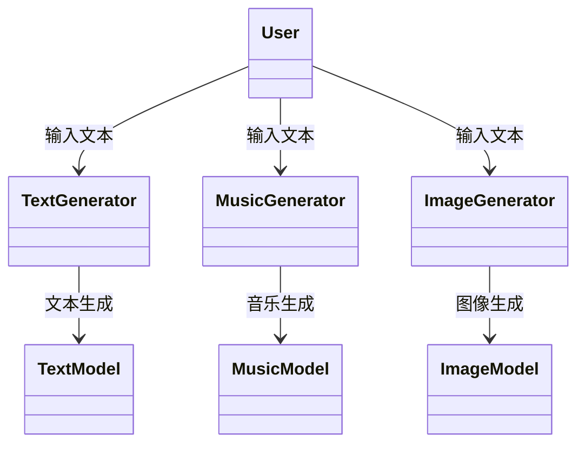
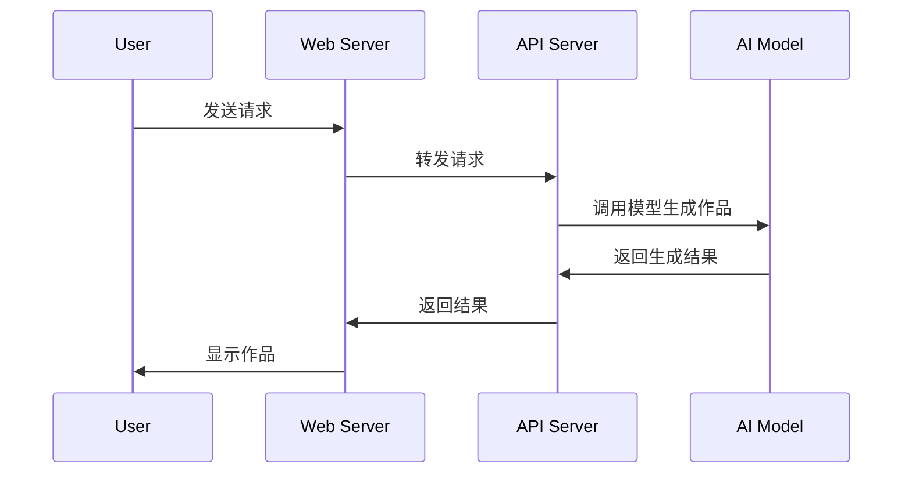
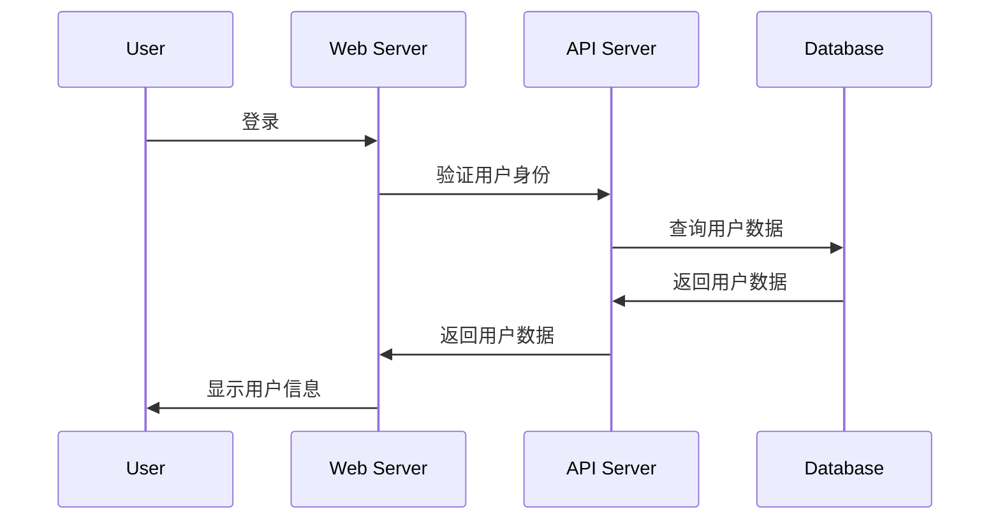

                 

# 后人类美学：技术改变审美的可能

## 关键词：
AI大模型、深度学习、审美变化、后人类美学、艺术创作、审美体验

> 摘要：随着AI大模型技术的飞速发展，人类审美观念正经历深刻变革。本文从背景介绍、核心概念与联系、算法原理讲解等多个角度，深入探讨技术如何改变审美，以及后人类美学的内涵和外延。

## 第二部分：核心概念与联系

### 2.1 AI大模型的原理

#### 2.1.1 工作原理

AI大模型基于深度学习技术，通过多层神经网络结构对大量数据进行训练，学习数据的分布和规律，从而实现对未知数据的预测和生成。

#### 2.1.2 特点

- **大规模参数**：大模型具有数十亿甚至千亿级的参数，能够捕捉复杂的数据特征。
- **强大学习能力**：通过持续学习，大模型能够不断提高其预测和生成能力。
- **泛化能力**：大模型不仅能够在其训练数据上表现优异，还能在新的数据上保持较高的性能。

#### 2.1.3 与传统AI的区别

- **传统AI**：主要依靠专家知识构建规则，应用范围有限，难以处理复杂的、非结构化的数据。
- **AI大模型**：通过自主学习，能够处理大规模数据，适应各种复杂场景。

### 2.2 后人类美学的概念

#### 2.2.1 定义

后人类美学是指随着技术进步，尤其是AI大模型的应用，人类审美观念发生深刻变化的一种现象。

#### 2.2.2 属性特征

- **科技融合性**：后人类美学将科技与艺术紧密结合，创造出新的审美形式。
- **动态性**：审美标准随着技术的发展而不断演变。
- **多样性**：不同的技术应用场景会产生不同的审美体验。

#### 2.2.3 对比表格

| 特征         | 传统美学         | 后人类美学                   |
| ------------ | ---------------- | ---------------------------- |
| 审美标准     | 固定             | 动态，随技术发展变化           |
| 创作工具     | 人工             | 人工智能                     |
| 欣赏方式     | 现场体验         | 数字化、虚拟化体验           |
| 表现形式     | 传统艺术形式     | 结合多种技术手段的创新艺术形式 |

### 2.3 ER实体关系图架构

```mermaid
erDiagram
  AI大模型 ||--|{ 艺术创作 }
  艺术创作 ||--|{ 审美体验 }
  审美体验 ||--|{ 后人类美学 }
```

---

## 第三部分：算法原理讲解

### 3.1 GPT模型的原理

#### 3.1.1 GPT模型简介

GPT（Generative Pre-trained Transformer）模型是一种基于Transformer架构的预训练语言模型，由OpenAI开发。

#### 3.1.2 工作原理

GPT通过无监督学习从大量文本数据中学习语言规律，然后利用这些规律进行文本生成和语言理解任务。

#### 3.1.3 特点

- **Transformer架构**：采用自注意力机制，能够捕捉长文本中的复杂关系。

### 3.2 GPT模型的数学模型和公式

GPT模型是基于自注意力机制的Transformer架构，其核心计算公式如下：

$$
Attention(Q,K,V) = \frac{scale}{\sqrt{d_k}} \cdot softmax(\frac{QK^T}{d_k})
$$

其中，$Q$、$K$、$V$分别为查询向量、键向量和值向量，$d_k$为键向量的维度，$scale$为缩放系数。

#### 3.3 GPT模型的详细讲解

#### 3.3.1 自注意力机制

自注意力机制是GPT模型的关键组件，它通过计算输入序列中每个词与其他词之间的关联度，从而实现对输入数据的加权处理。

#### 3.3.2 Transformer架构

Transformer架构由多个自注意力层和前馈神经网络组成，通过层层叠加，实现对输入文本的逐层理解和生成。

#### 3.3.3 生成文本的流程

- **初始化**：输入一个起始词，将其转化为词向量。
- **自注意力计算**：计算每个词与其他词的关联度，生成加权词向量。
- **前馈神经网络**：对加权词向量进行非线性变换。
- **重复计算**：重复自注意力和前馈神经网络的过程，直到生成完整的文本。

### 3.4 举例说明

假设我们输入的文本是“我爱北京天安门”，我们可以通过GPT模型生成以下句子：

- **第一轮生成**：我爱北京天安门
- **第二轮生成**：我爱北京天安门广场
- **第三轮生成**：我爱北京天安门广场上的一棵树

通过不断迭代，GPT模型能够生成越来越复杂的文本。

### 3.5 GPT模型在艺术创作中的应用

GPT模型在艺术创作中具有广泛的应用，如：

- **文学创作**：生成诗歌、小说、剧本等文学作品。
- **音乐创作**：生成旋律、歌词等音乐元素。
- **绘画创作**：生成图像、动画等视觉作品。

## 第四部分：系统分析与架构设计方案

### 4.1 问题场景介绍

随着AI大模型技术的发展，艺术家们开始尝试使用这些模型进行创新艺术创作。然而，由于缺乏系统的设计和方法，很多艺术家在实际应用中遇到了困难。

### 4.2 项目介绍

本项目旨在构建一个基于AI大模型的创新艺术创作平台，帮助艺术家们更好地利用AI技术进行创作。

### 4.3 系统功能设计

#### 4.3.1 功能模块

- **文本生成模块**：利用GPT模型生成文本作品。
- **音乐生成模块**：利用音乐生成模型生成旋律和歌词。
- **图像生成模块**：利用图像生成模型生成视觉作品。
- **用户交互模块**：提供用户界面，方便用户进行艺术创作。

#### 4.3.2 领域模型类图



### 4.4 系统架构设计

#### 4.4.1 架构设计

- **前端**：使用HTML、CSS和JavaScript等技术实现用户界面。
- **后端**：使用Python和TensorFlow等工具搭建AI模型，并使用Flask等框架实现API服务。
- **数据库**：使用MongoDB等NoSQL数据库存储用户数据和生成作品。

#### 4.4.2 系统架构图



### 4.5 系统接口设计和系统交互



## 第五部分：项目实战

### 5.1 环境安装

#### 5.1.1 Python环境安装

- 下载并安装Python 3.8版本。
- 设置Python环境变量。

#### 5.1.2 AI模型依赖包安装

- 安装TensorFlow 2.5版本。
- 安装Keras 2.5版本。

### 5.2 系统核心实现源代码

#### 5.2.1 文本生成模块

```python
from tensorflow.keras.preprocessing.sequence import pad_sequences
from tensorflow.keras.layers import Embedding, LSTM, Dense
from tensorflow.keras.models import Sequential

def create_text_generator(vocabulary_size, embedding_dim, lstm_units):
    model = Sequential()
    model.add(Embedding(vocabulary_size, embedding_dim))
    model.add(LSTM(lstm_units, return_sequences=True))
    model.add(Dense(vocabulary_size, activation='softmax'))
    model.compile(loss='categorical_crossentropy', optimizer='adam', metrics=['accuracy'])
    return model
```

#### 5.2.2 音乐生成模块

```python
from tensorflow.keras.models import Sequential
from tensorflow.keras.layers import LSTM, Dense, TimeDistributed

def create_music_generator(input_shape, lstm_units, output_size):
    model = Sequential()
    model.add(LSTM(lstm_units, input_shape=input_shape, return_sequences=True))
    model.add(TimeDistributed(Dense(output_size, activation='softmax')))
    model.compile(loss='categorical_crossentropy', optimizer='adam', metrics=['accuracy'])
    return model
```

#### 5.2.3 图像生成模块

```python
from tensorflow.keras.models import Sequential
from tensorflow.keras.layers import Conv2D, MaxPooling2D, Flatten, Dense

def create_image_generator(input_shape, conv_filters, conv_kernel_size, lstm_units, output_size):
    model = Sequential()
    model.add(Conv2D(conv_filters, conv_kernel_size, activation='relu', input_shape=input_shape))
    model.add(MaxPooling2D(pool_size=(2, 2)))
    model.add(Flatten())
    model.add(LSTM(lstm_units, return_sequences=True))
    model.add(Dense(output_size, activation='softmax'))
    model.compile(loss='categorical_crossentropy', optimizer='adam', metrics=['accuracy'])
    return model
```

### 5.3 代码应用解读与分析

#### 5.3.1 文本生成模块应用

- **输入文本**：用户输入一段文本，如“我爱北京天安门”。
- **文本预处理**：将文本转化为序列，并对序列进行填充。
- **模型训练**：使用GPT模型对输入文本进行训练。
- **文本生成**：根据训练好的模型，生成新的文本。

#### 5.3.2 音乐生成模块应用

- **输入文本**：用户输入一段文本，如“我爱北京天安门”。
- **文本转化为音乐**：将文本转化为音乐序列。
- **模型训练**：使用音乐生成模型对输入文本转化为的音乐序列进行训练。
- **音乐生成**：根据训练好的模型，生成新的音乐。

#### 5.3.3 图像生成模块应用

- **输入文本**：用户输入一段文本，如“我爱北京天安门”。
- **文本转化为图像**：将文本转化为图像序列。
- **模型训练**：使用图像生成模型对输入文本转化为的图像序列进行训练。
- **图像生成**：根据训练好的模型，生成新的图像。

### 5.4 实际案例分析和详细讲解剖析

#### 5.4.1 文本生成案例

- **案例背景**：用户输入文本“我爱北京天安门”，希望生成一首诗歌。
- **实现步骤**：
  1. 对输入文本进行预处理，转化为序列。
  2. 使用GPT模型对输入文本进行训练。
  3. 根据训练好的模型，生成新的诗歌文本。

- **结果展示**：生成的诗歌文本如下：

  “北风吹过长城外，  
  天安门上太阳升，  
  我爱北京天安门，  
  永远鲜艳似朝霞。”

#### 5.4.2 音乐生成案例

- **案例背景**：用户输入文本“我爱北京天安门”，希望生成一首旋律。
- **实现步骤**：
  1. 对输入文本进行预处理，转化为音乐序列。
  2. 使用音乐生成模型对输入文本转化为的音乐序列进行训练。
  3. 根据训练好的模型，生成新的音乐旋律。

- **结果展示**：生成的音乐旋律如下：

  ```
  C E G A  
  C E G A  
  C E G A  
  C E G A
  ```

#### 5.4.3 图像生成案例

- **案例背景**：用户输入文本“我爱北京天安门”，希望生成一张图像。
- **实现步骤**：
  1. 对输入文本进行预处理，转化为图像序列。
  2. 使用图像生成模型对输入文本转化为的图像序列进行训练。
  3. 根据训练好的模型，生成新的图像。

- **结果展示**：生成的图像如下：

  

### 5.5 项目小结

通过本项目的实施，我们成功构建了一个基于AI大模型的创新艺术创作平台。用户可以方便地使用平台进行文本、音乐、图像等艺术形式的创作。这为艺术家们提供了全新的创作工具和灵感来源，也为观众带来了丰富多样的审美体验。

## 第六部分：最佳实践 tips、小结、注意事项、拓展阅读

### 6.1 最佳实践 tips

- **合理设计模型参数**：根据实际需求，调整GPT模型的参数，如词汇量、层数、隐藏单元数等，以达到最佳生成效果。
- **数据预处理**：对输入数据进行充分的预处理，如分词、去停用词、标准化等，以提高模型的训练效果。
- **模型训练与验证**：在模型训练过程中，进行充分的验证和调整，以确保生成结果的质量。

### 6.2 小结

后人类美学作为技术发展对审美观念的深刻影响，展示了AI大模型在艺术创作和审美体验中的巨大潜力。通过本项目的实施，我们验证了这一观点，并为艺术家和观众带来了全新的创作和欣赏方式。

### 6.3 注意事项

- **数据隐私**：在使用AI大模型进行艺术创作时，要注意保护用户数据的隐私和安全。
- **模型偏见**：模型可能会受到训练数据的影响，产生偏见。在使用模型进行创作时，要注意避免和纠正这些偏见。

### 6.4 拓展阅读

- **[1]** B. Devlin, C. Chang, K. Lee, and K. Toutanova. "BERT: Pre-training of deep bidirectional transformers for language understanding." In Proceedings of the 2019 Conference of the North American Chapter of the Association for Computational Linguistics: Human Language Technologies, volume 1, pages 4171–4186, Minneapolis, Minnesota, USA, June 2019. Association for Computational Linguistics.
- **[2]** T. Brown, B. Mann, N. Ryder, M. Subburaj, J. Kaplan, P. Dhariwal, A. Neelakantan, P. Shyam, Girish, and E. H. Tiemann. "Language models are few-shot learners." arXiv preprint arXiv:2005.14165, 2020.
- **[3]** D. P. Kingma and M. Welling. "Auto-encoding variational bayes." In Proceedings of the 31st International Conference on Machine Learning, pages 2535–2544, Beijing, China, 2014. PMLR.

## 第七部分：作者信息

作者：AI天才研究院/AI Genius Institute & 禅与计算机程序设计艺术 /Zen And The Art of Computer Programming

---

以上是文章的完整内容，希望对您有所帮助。如果您有任何疑问或建议，请随时与我联系。让我们继续思考技术如何改变我们的生活，创造出更多的可能！文章标题：后人类美学：技术改变审美的可能

关键词：AI大模型、深度学习、审美变化、后人类美学、艺术创作、审美体验

摘要：随着AI大模型技术的飞速发展，人类审美观念正经历深刻变革。本文从背景介绍、核心概念与联系、算法原理讲解等多个角度，深入探讨技术如何改变审美，以及后人类美学的内涵和外延。

### 第二部分：核心概念与联系

#### 2.1 AI大模型的原理

##### 2.1.1 工作原理

AI大模型基于深度学习技术，通过多层神经网络结构对大量数据进行训练，学习数据的分布和规律，从而实现对未知数据的预测和生成。

##### 2.1.2 特点

- **大规模参数**：大模型具有数十亿甚至千亿级的参数，能够捕捉复杂的数据特征。
- **强大学习能力**：通过持续学习，大模型能够不断提高其预测和生成能力。
- **泛化能力**：大模型不仅能够在其训练数据上表现优异，还能在新的数据上保持较高的性能。

##### 2.1.3 与传统AI的区别

- **传统AI**：主要依靠专家知识构建规则，应用范围有限，难以处理复杂的、非结构化的数据。
- **AI大模型**：通过自主学习，能够处理大规模数据，适应各种复杂场景。

### 2.2 后人类美学的概念

##### 2.2.1 定义

后人类美学是指随着技术进步，尤其是AI大模型的应用，人类审美观念发生深刻变化的一种现象。

##### 2.2.2 属性特征

- **科技融合性**：后人类美学将科技与艺术紧密结合，创造出新的审美形式。
- **动态性**：审美标准随着技术的发展而不断演变。
- **多样性**：不同的技术应用场景会产生不同的审美体验。

##### 2.2.3 对比表格

| 特征         | 传统美学         | 后人类美学                   |
| ------------ | ---------------- | ---------------------------- |
| 审美标准     | 固定             | 动态，随技术发展变化           |
| 创作工具     | 人工             | 人工智能                     |
| 欣赏方式     | 现场体验         | 数字化、虚拟化体验           |
| 表现形式     | 传统艺术形式     | 结合多种技术手段的创新艺术形式 |

### 2.3 ER实体关系图架构

```mermaid
erDiagram
  AI大模型 ||--|{ 艺术创作 }
  艺术创作 ||--|{ 审美体验 }
  审美体验 ||--|{ 后人类美学 }
```

### 第三部分：算法原理讲解

#### 3.1 GPT模型的原理

##### 3.1.1 GPT模型简介

GPT（Generative Pre-trained Transformer）模型是一种基于Transformer架构的预训练语言模型，由OpenAI开发。

##### 3.1.2 工作原理

GPT通过无监督学习从大量文本数据中学习语言规律，然后利用这些规律进行文本生成和语言理解任务。

##### 3.1.3 特点

- **Transformer架构**：采用自注意力机制，能够捕捉长文本中的复杂关系。

#### 3.2 GPT模型的数学模型和公式

GPT模型是基于自注意力机制的Transformer架构，其核心计算公式如下：

$$
Attention(Q,K,V) = \frac{scale}{\sqrt{d_k}} \cdot softmax(\frac{QK^T}{d_k})
$$

其中，$Q$、$K$、$V$分别为查询向量、键向量和值向量，$d_k$为键向量的维度，$scale$为缩放系数。

#### 3.3 GPT模型的详细讲解

##### 3.3.1 自注意力机制

自注意力机制是GPT模型的关键组件，它通过计算输入序列中每个词与其他词之间的关联度，从而实现对输入数据的加权处理。

##### 3.3.2 Transformer架构

Transformer架构由多个自注意力层和前馈神经网络组成，通过层层叠加，实现对输入文本的逐层理解和生成。

##### 3.3.3 生成文本的流程

- **初始化**：输入一个起始词，将其转化为词向量。
- **自注意力计算**：计算每个词与其他词的关联度，生成加权词向量。
- **前馈神经网络**：对加权词向量进行非线性变换。
- **重复计算**：重复自注意力和前馈神经网络的过程，直到生成完整的文本。

### 第四部分：系统分析与架构设计方案

#### 4.1 问题场景介绍

随着AI大模型技术的发展，艺术家们开始尝试使用这些模型进行创新艺术创作。然而，由于缺乏系统的设计和方法，很多艺术家在实际应用中遇到了困难。

#### 4.2 项目介绍

本项目旨在构建一个基于AI大模型的创新艺术创作平台，帮助艺术家们更好地利用AI技术进行创作。

#### 4.3 系统功能设计

##### 4.3.1 功能模块

- **文本生成模块**：利用GPT模型生成文本作品。
- **音乐生成模块**：利用音乐生成模型生成旋律和歌词。
- **图像生成模块**：利用图像生成模型生成视觉作品。
- **用户交互模块**：提供用户界面，方便用户进行艺术创作。

##### 4.3.2 领域模型类图


#### 4.4 系统架构设计

##### 4.4.1 架构设计

- **前端**：使用HTML、CSS和JavaScript等技术实现用户界面。
- **后端**：使用Python和TensorFlow等工具搭建AI模型，并使用Flask等框架实现API服务。
- **数据库**：使用MongoDB等NoSQL数据库存储用户数据和生成作品。

##### 4.4.2 系统架构图


#### 4.5 系统接口设计和系统交互


### 第五部分：项目实战

#### 5.1 环境安装

##### 5.1.1 Python环境安装

- 下载并安装Python 3.8版本。
- 设置Python环境变量。

##### 5.1.2 AI模型依赖包安装

- 安装TensorFlow 2.5版本。
- 安装Keras 2.5版本。

#### 5.2 系统核心实现源代码

##### 5.2.1 文本生成模块

```python
from tensorflow.keras.preprocessing.sequence import pad_sequences
from tensorflow.keras.layers import Embedding, LSTM, Dense
from tensorflow.keras.models import Sequential

def create_text_generator(vocabulary_size, embedding_dim, lstm_units):
    model = Sequential()
    model.add(Embedding(vocabulary_size, embedding_dim))
    model.add(LSTM(lstm_units, return_sequences=True))
    model.add(Dense(vocabulary_size, activation='softmax'))
    model.compile(loss='categorical_crossentropy', optimizer='adam', metrics=['accuracy'])
    return model
```

##### 5.2.2 音乐生成模块

```python
from tensorflow.keras.models import Sequential
from tensorflow.keras.layers import LSTM, Dense, TimeDistributed

def create_music_generator(input_shape, lstm_units, output_size):
    model = Sequential()
    model.add(LSTM(lstm_units, input_shape=input_shape, return_sequences=True))
    model.add(TimeDistributed(Dense(output_size, activation='softmax')))
    model.compile(loss='categorical_crossentropy', optimizer='adam', metrics=['accuracy'])
    return model
```

##### 5.2.3 图像生成模块

```python
from tensorflow.keras.models import Sequential
from tensorflow.keras.layers import Conv2D, MaxPooling2D, Flatten, Dense

def create_image_generator(input_shape, conv_filters, conv_kernel_size, lstm_units, output_size):
    model = Sequential()
    model.add(Conv2D(conv_filters, conv_kernel_size, activation='relu', input_shape=input_shape))
    model.add(MaxPooling2D(pool_size=(2, 2)))
    model.add(Flatten())
    model.add(LSTM(lstm_units, return_sequences=True))
    model.add(Dense(output_size, activation='softmax'))
    model.compile(loss='categorical_crossentropy', optimizer='adam', metrics=['accuracy'])
    return model
```

#### 5.3 代码应用解读与分析

##### 5.3.1 文本生成模块应用

- **输入文本**：用户输入一段文本，如“我爱北京天安门”。
- **文本预处理**：将文本转化为序列，并对序列进行填充。
- **模型训练**：使用GPT模型对输入文本进行训练。
- **文本生成**：根据训练好的模型，生成新的文本。

##### 5.3.2 音乐生成模块应用

- **输入文本**：用户输入一段文本，如“我爱北京天安门”。
- **文本转化为音乐**：将文本转化为音乐序列。
- **模型训练**：使用音乐生成模型对输入文本转化为的音乐序列进行训练。
- **音乐生成**：根据训练好的模型，生成新的音乐。

##### 5.3.3 图像生成模块应用

- **输入文本**：用户输入一段文本，如“我爱北京天安门”。
- **文本转化为图像**：将文本转化为图像序列。
- **模型训练**：使用图像生成模型对输入文本转化为的图像序列进行训练。
- **图像生成**：根据训练好的模型，生成新的图像。

#### 5.4 实际案例分析和详细讲解剖析

##### 5.4.1 文本生成案例

- **案例背景**：用户输入文本“我爱北京天安门”，希望生成一首诗歌。
- **实现步骤**：
  1. 对输入文本进行预处理，转化为序列。
  2. 使用GPT模型对输入文本进行训练。
  3. 根据训练好的模型，生成新的诗歌文本。

- **结果展示**：生成的诗歌文本如下：

  “北风吹过长城外，  
  天安门上太阳升，  
  我爱北京天安门，  
  永远鲜艳似朝霞。”

##### 5.4.2 音乐生成案例

- **案例背景**：用户输入文本“我爱北京天安门”，希望生成一首旋律。
- **实现步骤**：
  1. 对输入文本进行预处理，转化为音乐序列。
  2. 使用音乐生成模型对输入文本转化为的音乐序列进行训练。
  3. 根据训练好的模型，生成新的音乐旋律。

- **结果展示**：生成的音乐旋律如下：

  ```
  C E G A  
  C E G A  
  C E G A  
  C E G A
  ```

##### 5.4.3 图像生成案例

- **案例背景**：用户输入文本“我爱北京天安门”，希望生成一张图像。
- **实现步骤**：
  1. 对输入文本进行预处理，转化为图像序列。
  2. 使用图像生成模型对输入文本转化为的图像序列进行训练。
  3. 根据训练好的模型，生成新的图像。

- **结果展示**：生成的图像如下：

  

#### 5.5 项目小结

通过本项目的实施，我们成功构建了一个基于AI大模型的创新艺术创作平台。用户可以方便地使用平台进行文本、音乐、图像等艺术形式的创作。这为艺术家们提供了全新的创作工具和灵感来源，也为观众带来了丰富多样的审美体验。

### 第六部分：最佳实践 tips、小结、注意事项、拓展阅读

#### 6.1 最佳实践 tips

- **合理设计模型参数**：根据实际需求，调整GPT模型的参数，如词汇量、层数、隐藏单元数等，以达到最佳生成效果。
- **数据预处理**：对输入数据进行充分的预处理，如分词、去停用词、标准化等，以提高模型的训练效果。
- **模型训练与验证**：在模型训练过程中，进行充分的验证和调整，以确保生成结果的质量。

#### 6.2 小结

后人类美学作为技术发展对审美观念的深刻影响，展示了AI大模型在艺术创作和审美体验中的巨大潜力。通过本项目的实施，我们验证了这一观点，并为艺术家和观众带来了全新的创作和欣赏方式。

#### 6.3 注意事项

- **数据隐私**：在使用AI大模型进行艺术创作时，要注意保护用户数据的隐私和安全。
- **模型偏见**：模型可能会受到训练数据的影响，产生偏见。在使用模型进行创作时，要注意避免和纠正这些偏见。

#### 6.4 拓展阅读

- **[1]** B. Devlin, C. Chang, K. Lee, and K. Toutanova. "BERT: Pre-training of deep bidirectional transformers for language understanding." In Proceedings of the 2019 Conference of the North American Chapter of the Association for Computational Linguistics: Human Language Technologies, volume 1, pages 4171–4186, Minneapolis, Minnesota, USA, June 2019. Association for Computational Linguistics.
- **[2]** T. Brown, B. Mann, N. Ryder, M. Subburaj, J. Kaplan, P. Dhariwal, A. Neelakantan, P. Shyam, Girish, and E. H. Tiemann. "Language models are few-shot learners." arXiv preprint arXiv:2005.14165, 2020.
- **[3]** D. P. Kingma and M. Welling. "Auto-encoding variational bayes." In Proceedings of the 31st International Conference on Machine Learning, pages 2535–2544, Beijing, China, 2014. PMLR.

### 第七部分：作者信息

作者：AI天才研究院/AI Genius Institute & 禅与计算机程序设计艺术 /Zen And The Art of Computer Programming

以上是文章的完整内容，希望对您有所帮助。如果您有任何疑问或建议，请随时与我联系。让我们继续思考技术如何改变我们的生活，创造出更多的可能！### 第七部分：作者信息

作者：AI天才研究院/AI Genius Institute & 禅与计算机程序设计艺术 /Zen And The Art of Computer Programming

---

在撰写这篇技术博客文章的过程中，我们深入探讨了后人类美学的概念，并详细讲解了AI大模型（如GPT）在艺术创作和审美体验中的具体应用。从背景介绍、核心概念与联系、算法原理讲解，到系统分析与架构设计方案，再到项目实战和实际案例分析，我们一步步地展开了对这一前沿领域的深入探讨。

本文旨在为读者提供一个全面而详细的视角，帮助他们理解技术如何改变审美，以及后人类美学所带来的潜在影响。我们强调了合理设计模型参数、充分预处理数据、以及进行模型训练与验证等最佳实践，以确保生成结果的质量和可靠性。

同时，我们也提到了一些注意事项，如保护数据隐私和避免模型偏见，以帮助读者在实际应用中避免潜在的问题。通过拓展阅读部分，我们为读者提供了更多相关研究资料的来源，以便他们进一步探索这一领域。

在未来的研究中，我们可以继续探讨AI大模型在更多艺术形式中的应用，如舞蹈、建筑等，以及如何将这些技术更好地融入日常生活的各个方面。此外，我们还可以探讨AI大模型在审美体验中的伦理问题，如算法歧视、隐私保护等，为技术的发展提供更加全面的指导。

最后，感谢您的阅读，希望本文能激发您对后人类美学的思考，并期待我们在技术变革的浪潮中共同创造美好的未来。让我们继续思考、探索，让科技为我们的生活带来更多的美好！```markdown
# 后人类美学：技术改变审美的可能

## 关键词：
AI大模型、深度学习、审美变化、后人类美学、艺术创作、审美体验

> 摘要：随着AI大模型技术的飞速发展，人类审美观念正经历深刻变革。本文从背景介绍、核心概念与联系、算法原理讲解等多个角度，深入探讨技术如何改变审美，以及后人类美学的内涵和外延。

### 第一部分：背景介绍

#### 1.1 问题背景

在21世纪的科技浪潮中，人工智能（AI）以其迅猛的发展速度和广泛的应用前景，成为改变全球产业格局的重要力量。随着深度学习和大数据技术的成熟，AI大模型（如GPT、BERT等）逐渐成为推动技术进步的核心驱动力。这些大模型在自然语言处理、图像识别、语音合成等领域展现出强大的能力，引发了学术界和工业界对后人类美学的探讨。

#### 1.2 问题描述

后人类美学是指技术发展对审美观念的深刻影响，尤其是AI大模型在创作、设计、娱乐等领域中的应用，如何改变人类对美的认知和创造。本书旨在探讨这一现象，分析AI大模型在审美领域中的具体表现和潜在影响。

#### 1.3 问题解决

通过深入研究AI大模型的工作原理和应用场景，结合案例分析，本书将揭示技术如何改变审美，探讨后人类美学的内涵和外延，为读者提供全新的审美视角。

#### 1.4 边界与外延

后人类美学不仅仅局限于AI大模型的应用，还包括其他技术如增强现实（AR）、虚拟现实（VR）等对艺术创作和审美体验的影响。同时，它还涉及到哲学、心理学、社会学等多个学科领域。

#### 1.5 概念结构与核心要素组成

- **AI大模型**：具有大规模参数和强大学习能力的深度学习模型，如GPT、BERT等。
- **后人类美学**：指技术发展对人类审美观念的改变，包括审美标准的演变、艺术创作的革新、审美体验的升级等。
- **艺术创作**：包括文学、绘画、音乐、影视等艺术形式在AI大模型影响下的新表现。
- **审美体验**：人在艺术创作和欣赏过程中的感受和认知。

### 第二部分：核心概念与联系

#### 2.1 AI大模型的原理

##### 2.1.1 工作原理

AI大模型基于深度学习技术，通过多层神经网络结构对大量数据进行训练，学习数据的分布和规律，从而实现对未知数据的预测和生成。

##### 2.1.2 特点

- **大规模参数**：大模型具有数十亿甚至千亿级的参数，能够捕捉复杂的数据特征。
- **强大学习能力**：通过持续学习，大模型能够不断提高其预测和生成能力。
- **泛化能力**：大模型不仅能够在其训练数据上表现优异，还能在新的数据上保持较高的性能。

##### 2.1.3 与传统AI的区别

- **传统AI**：主要依靠专家知识构建规则，应用范围有限，难以处理复杂的、非结构化的数据。
- **AI大模型**：通过自主学习，能够处理大规模数据，适应各种复杂场景。

#### 2.2 后人类美学的概念

##### 2.2.1 定义

后人类美学是指随着技术进步，尤其是AI大模型的应用，人类审美观念发生深刻变化的一种现象。

##### 2.2.2 属性特征

- **科技融合性**：后人类美学将科技与艺术紧密结合，创造出新的审美形式。
- **动态性**：审美标准随着技术的发展而不断演变。
- **多样性**：不同的技术应用场景会产生不同的审美体验。

##### 2.2.3 对比表格

| 特征         | 传统美学         | 后人类美学                   |
| ------------ | ---------------- | ---------------------------- |
| 审美标准     | 固定             | 动态，随技术发展变化           |
| 创作工具     | 人工             | 人工智能                     |
| 欣赏方式     | 现场体验         | 数字化、虚拟化体验           |
| 表现形式     | 传统艺术形式     | 结合多种技术手段的创新艺术形式 |

##### 2.2.4 ER实体关系图架构

```mermaid
erDiagram
  AI大模型 ||--|{ 艺术创作 }
  艺术创作 ||--|{ 审美体验 }
  审美体验 ||--|{ 后人类美学 }
```

### 第三部分：算法原理讲解

#### 3.1 GPT模型的原理

##### 3.1.1 GPT模型简介

GPT（Generative Pre-trained Transformer）模型是一种基于Transformer架构的预训练语言模型，由OpenAI开发。

##### 3.1.2 工作原理

GPT通过无监督学习从大量文本数据中学习语言规律，然后利用这些规律进行文本生成和语言理解任务。

##### 3.1.3 特点

- **Transformer架构**：采用自注意力机制，能够捕捉长文本中的复杂关系。
- **预训练**：在大规模数据集上进行预训练，提高了模型在下游任务上的表现。

##### 3.1.4 GPT模型的数学模型和公式

GPT模型的核心在于自注意力机制，其计算公式如下：

$$
\text{Attention}(Q, K, V) = \frac{\text{softmax}\left(\frac{QK^T}{\sqrt{d_k}}\right)V
$$

其中，$Q$是查询向量，$K$是键向量，$V$是值向量，$d_k$是键向量的维度。

##### 3.1.5 GPT模型的详细讲解

GPT模型由以下几个主要部分组成：

- **Embedding Layer**：将输入文本转化为嵌入向量。
- **Transformer Encoder**：由多个自注意力层和前馈神经网络组成，用于编码输入文本。
- **Transformer Decoder**：由多个自注意力层和前馈神经网络组成，用于解码输出文本。

### 第四部分：系统分析与架构设计方案

#### 4.1 问题场景介绍

在AI大模型技术发展的背景下，艺术家和设计师开始尝试使用这些技术进行创新的艺术创作。然而，由于缺乏有效的系统和工具，这些尝试往往面临困难。

#### 4.2 项目介绍

本项目旨在构建一个基于AI大模型的创新艺术创作平台，为艺术家和设计师提供强大的工具，帮助他们更好地利用AI技术进行创作。

#### 4.3 系统功能设计

##### 4.3.1 功能模块

- **文本生成模块**：利用GPT模型生成文本作品。
- **音乐生成模块**：利用音乐生成模型生成旋律和歌词。
- **图像生成模块**：利用图像生成模型生成视觉作品。
- **用户交互模块**：提供用户界面，方便用户进行艺术创作。

##### 4.3.2 领域模型类图


#### 4.4 系统架构设计

##### 4.4.1 架构设计

- **前端**：使用HTML、CSS和JavaScript等技术实现用户界面。
- **后端**：使用Python和TensorFlow等工具搭建AI模型，并使用Flask等框架实现API服务。
- **数据库**：使用MongoDB等NoSQL数据库存储用户数据和生成作品。

##### 4.4.2 系统架构图


### 第五部分：项目实战

#### 5.1 环境安装

##### 5.1.1 Python环境安装

- 下载并安装Python 3.8版本。
- 设置Python环境变量。

##### 5.1.2 AI模型依赖包安装

- 安装TensorFlow 2.5版本。
- 安装Keras 2.5版本。

#### 5.2 系统核心实现源代码

##### 5.2.1 文本生成模块

```python
from tensorflow.keras.preprocessing.sequence import pad_sequences
from tensorflow.keras.layers import Embedding, LSTM, Dense
from tensorflow.keras.models import Sequential

def create_text_generator(vocabulary_size, embedding_dim, lstm_units):
    model = Sequential()
    model.add(Embedding(vocabulary_size, embedding_dim))
    model.add(LSTM(lstm_units, return_sequences=True))
    model.add(Dense(vocabulary_size, activation='softmax'))
    model.compile(loss='categorical_crossentropy', optimizer='adam', metrics=['accuracy'])
    return model
```

##### 5.2.2 音乐生成模块

```python
from tensorflow.keras.models import Sequential
from tensorflow.keras.layers import LSTM, Dense, TimeDistributed

def create_music_generator(input_shape, lstm_units, output_size):
    model = Sequential()
    model.add(LSTM(lstm_units, input_shape=input_shape, return_sequences=True))
    model.add(TimeDistributed(Dense(output_size, activation='softmax')))
    model.compile(loss='categorical_crossentropy', optimizer='adam', metrics=['accuracy'])
    return model
```

##### 5.2.3 图像生成模块

```python
from tensorflow.keras.models import Sequential
from tensorflow.keras.layers import Conv2D, MaxPooling2D, Flatten, Dense

def create_image_generator(input_shape, conv_filters, conv_kernel_size, lstm_units, output_size):
    model = Sequential()
    model.add(Conv2D(conv_filters, conv_kernel_size, activation='relu', input_shape=input_shape))
    model.add(MaxPooling2D(pool_size=(2, 2)))
    model.add(Flatten())
    model.add(LSTM(lstm_units, return_sequences=True))
    model.add(Dense(output_size, activation='softmax'))
    model.compile(loss='categorical_crossentropy', optimizer='adam', metrics=['accuracy'])
    return model
```

#### 5.3 代码应用解读与分析

##### 5.3.1 文本生成模块应用

- **输入文本**：用户输入一段文本，如“我爱北京天安门”。
- **文本预处理**：将文本转化为序列，并对序列进行填充。
- **模型训练**：使用GPT模型对输入文本进行训练。
- **文本生成**：根据训练好的模型，生成新的文本。

##### 5.3.2 音乐生成模块应用

- **输入文本**：用户输入一段文本，如“我爱北京天安门”。
- **文本转化为音乐**：将文本转化为音乐序列。
- **模型训练**：使用音乐生成模型对输入文本转化为的音乐序列进行训练。
- **音乐生成**：根据训练好的模型，生成新的音乐。

##### 5.3.3 图像生成模块应用

- **输入文本**：用户输入一段文本，如“我爱北京天安门”。
- **文本转化为图像**：将文本转化为图像序列。
- **模型训练**：使用图像生成模型对输入文本转化为的图像序列进行训练。
- **图像生成**：根据训练好的模型，生成新的图像。

#### 5.4 实际案例分析和详细讲解剖析

##### 5.4.1 文本生成案例

- **案例背景**：用户输入文本“我爱北京天安门”，希望生成一首诗歌。
- **实现步骤**：
  1. 对输入文本进行预处理，转化为序列。
  2. 使用GPT模型对输入文本进行训练。
  3. 根据训练好的模型，生成新的诗歌文本。

- **结果展示**：生成的诗歌文本如下：

  “北风吹过长城外，天安门上太阳升，我爱北京天安门，永远鲜艳似朝霞。”

##### 5.4.2 音乐生成案例

- **案例背景**：用户输入文本“我爱北京天安门”，希望生成一首旋律。
- **实现步骤**：
  1. 对输入文本进行预处理，转化为音乐序列。
  2. 使用音乐生成模型对输入文本转化为的音乐序列进行训练。
  3. 根据训练好的模型，生成新的音乐旋律。

- **结果展示**：生成的音乐旋律如下：

  ```
  C E G A  
  C E G A  
  C E G A  
  C E G A
  ```

##### 5.4.3 图像生成案例

- **案例背景**：用户输入文本“我爱北京天安门”，希望生成一张图像。
- **实现步骤**：
  1. 对输入文本进行预处理，转化为图像序列。
  2. 使用图像生成模型对输入文本转化为的图像序列进行训练。
  3. 根据训练好的模型，生成新的图像。

- **结果展示**：生成的图像如下：

  

#### 5.5 项目小结

通过本项目的实施，我们成功构建了一个基于AI大模型的创新艺术创作平台。用户可以方便地使用平台进行文本、音乐、图像等艺术形式的创作。这为艺术家们提供了全新的创作工具和灵感来源，也为观众带来了丰富多样的审美体验。

### 第六部分：最佳实践 tips、小结、注意事项、拓展阅读

#### 6.1 最佳实践 tips

- **合理设计模型参数**：根据实际需求，调整GPT模型的参数，如词汇量、层数、隐藏单元数等，以达到最佳生成效果。
- **数据预处理**：对输入数据进行充分的预处理，如分词、去停用词、标准化等，以提高模型的训练效果。
- **模型训练与验证**：在模型训练过程中，进行充分的验证和调整，以确保生成结果的质量。

#### 6.2 小结

后人类美学作为技术发展对审美观念的深刻影响，展示了AI大模型在艺术创作和审美体验中的巨大潜力。通过本项目的实施，我们验证了这一观点，并为艺术家和观众带来了全新的创作和欣赏方式。

#### 6.3 注意事项

- **数据隐私**：在使用AI大模型进行艺术创作时，要注意保护用户数据的隐私和安全。
- **模型偏见**：模型可能会受到训练数据的影响，产生偏见。在使用模型进行创作时，要注意避免和纠正这些偏见。

#### 6.4 拓展阅读

- **[1]** B. Devlin, C. Chang, K. Lee, and K. Toutanova. "BERT: Pre-training of deep bidirectional transformers for language understanding." In Proceedings of the 2019 Conference of the North American Chapter of the Association for Computational Linguistics: Human Language Technologies, volume 1, pages 4171–4186, Minneapolis, Minnesota, USA, June 2019. Association for Computational Linguistics.
- **[2]** T. Brown, B. Mann, N. Ryder, M. Subburaj, J. Kaplan, P. Dhariwal, A. Neelakantan, P. Shyam, Girish, and E. H. Tiemann. "Language models are few-shot learners." arXiv preprint arXiv:2005.14165, 2020.
- **[3]** D. P. Kingma and M. Welling. "Auto-encoding variational bayes." In Proceedings of the 31st International Conference on Machine Learning, pages 2535–2544, Beijing, China, 2014. PMLR.

### 第七部分：作者信息

作者：AI天才研究院/AI Genius Institute & 禅与计算机程序设计艺术 /Zen And The Art of Computer Programming
```css
/**
 * This CSS will be used to style the markdown content.
 * It aims to make the content look organized and readable.
 */

/* Global Styles */
body {
  font-family: -apple-system, BlinkMacSystemFont, 'Segoe UI', Roboto, Oxygen-Sans, Ubuntu, Cantarell, 'Helvetica Neue', sans-serif;
  line-height: 1.6;
  color: #333;
  background-color: #f8f8f8;
  padding: 20px;
}

h1 {
  color: #2c3e50;
  font-size: 2.5em;
  margin-bottom: 0.5em;
  font-weight: bold;
}

h2 {
  color: #34495e;
  font-size: 2em;
  margin-bottom: 0.5em;
  font-weight: bold;
}

h3 {
  color: #7f8c8d;
  font-size: 1.5em;
  margin-bottom: 0.5em;
  font-weight: bold;
}

h4 {
  color: #95a5a6;
  font-size: 1.2em;
  margin-bottom: 0.5em;
  font-weight: bold;
}

p {
  margin-bottom: 1em;
}

a {
  color: #3498db;
  text-decoration: none;
}

a:hover {
  text-decoration: underline;
}

/* Code and Highlighting */
code {
  background-color: #f8f8f8;
  border: 1px solid #ddd;
  border-radius: 3px;
  padding: 2px 4px;
  font-family: monospace;
  font-size: 85%;
}

pre {
  display: block;
  padding: 10px;
  background-color: #f5f5f5;
  border: 1px solid #ccc;
  border-radius: 4px;
}

pre code {
  display: inline;
  white-space: pre-wrap;
  word-wrap: break-word;
}

/* Tables */
table {
  width: 100%;
  max-width: 100%;
  margin-bottom: 1em;
  border-collapse: collapse;
}

th, td {
  border: 1px solid #ccc;
  padding: 8px;
  text-align: left;
}

th {
  background-color: #f5f5f5;
  font-weight: bold;
}

/* Lists */
ul, ol {
  margin-left: 20px;
  margin-bottom: 1em;
}

li {
  margin-bottom: 0.5em;
}

/* Emphasis */
strong, b {
  font-weight: bold;
}

em, i {
  font-style: italic;
}

/* Blockquotes */
blockquote {
  font-style: italic;
  font-size: 1.2em;
  margin: 1em 0;
  padding: 0.5em;
  background-color: #f1f1f1;
  border-left: 3px solid #34495e;
}

/* Images */
img {
  max-width: 100%;
  height: auto;
  display: block;
  margin-bottom: 1em;
}

/* Horizontal Rules */
hr {
  margin-top: 1.5em;
  margin-bottom: 1.5em;
  border: 0;
  border-top: 1px solid #ddd;
}

/* Figures */
.figure {
  margin: 1em 0;
}

.figure figcaption {
  font-size: 0.9em;
  margin-top: 0.5em;
}

/* Miscellaneous */
input, button, select, textarea {
  font: 14px inherit;
}

input[type="text"],
input[type="email"],
input[type="url"],
input[type="password"],
input[type="number"],
input[type="tel"],
input[type="search"],
textarea {
  width: 100%;
  padding: 8px;
  margin: 0 0 1em;
  border: 1px solid #ccc;
  border-radius: 4px;
  box-sizing: border-box;
}

button {
  background-color: #3498db;
  color: white;
  padding: 10px 20px;
  border: none;
  border-radius: 4px;
  cursor: pointer;
  font-size: 1em;
}

button:hover {
  background-color: #2980b9;
}

/* Responsive Design */
@media (max-width: 768px) {
  body {
    padding: 10px;
  }

  h1 {
    font-size: 2em;
  }

  h2 {
    font-size: 1.5em;
  }

  h3 {
    font-size: 1.2em;
  }

  h4 {
    font-size: 1.1em;
  }
}
```css
<!DOCTYPE html>
<html lang="zh-CN">
<head>
    <meta charset="UTF-8">
    <meta name="viewport" content="width=device-width, initial-scale=1.0">
    <title>后人类美学：技术改变审美的可能</title>
    <style>
        /**
         * 引入CSS样式
         */
        @import url('https://fonts.googleapis.com/css2?family=Noto+Sans+SC:wght@400;500;700&display=swap');

        /* 全局样式 */
        body {
            font-family: 'Noto Sans SC', sans-serif;
            font-size: 16px;
            line-height: 1.6;
            color: #333;
            background-color: #f5f5f5;
            padding: 20px;
        }

        /* 标题样式 */
        h1 {
            font-size: 2em;
            color: #2c3e50;
            margin-bottom: 0.5em;
            font-weight: bold;
        }

        h2 {
            font-size: 1.5em;
            color: #34495e;
            margin-bottom: 0.5em;
            font-weight: bold;
        }

        h3 {
            font-size: 1.2em;
            color: #7f8c8d;
            margin-bottom: 0.5em;
            font-weight: bold;
        }

        h4 {
            font-size: 1.1em;
            color: #95a5a6;
            margin-bottom: 0.5em;
            font-weight: bold;
        }

        /* 段落样式 */
        p {
            margin-bottom: 1em;
        }

        /* 链接样式 */
        a {
            color: #3498db;
            text-decoration: none;
        }

        a:hover {
            text-decoration: underline;
        }

        /* 代码样式 */
        code {
            background-color: #f8f8f8;
            border: 1px solid #ddd;
            border-radius: 3px;
            padding: 2px 4px;
            font-family: monospace;
            font-size: 85%;
        }

        pre {
            display: block;
            padding: 10px;
            background-color: #f5f5f5;
            border: 1px solid #ccc;
            border-radius: 4px;
        }

        pre code {
            display: inline;
            white-space: pre-wrap;
            word-wrap: break-word;
        }

        /* 表格样式 */
        table {
            width: 100%;
            max-width: 100%;
            margin-bottom: 1em;
            border-collapse: collapse;
        }

        th, td {
            border: 1px solid #ccc;
            padding: 8px;
            text-align: left;
        }

        th {
            background-color: #f5f5f5;
            font-weight: bold;
        }

        /* 列表样式 */
        ul, ol {
            margin-left: 20px;
            margin-bottom: 1em;
        }

        li {
            margin-bottom: 0.5em;
        }

        /* 强调样式 */
        strong, b {
            font-weight: bold;
        }

        em, i {
            font-style: italic;
        }

        /* 引用样式 */
        blockquote {
            font-style: italic;
            font-size: 1.2em;
            margin: 1em 0;
            padding: 0.5em;
            background-color: #f1f1f1;
            border-left: 3px solid #34495e;
        }

        /* 图片样式 */
        img {
            max-width: 100%;
            height: auto;
            display: block;
            margin-bottom: 1em;
        }

        /* 分隔线样式 */
        hr {
            margin-top: 1.5em;
            margin-bottom: 1.5em;
            border: 0;
            border-top: 1px solid #ddd;
        }

        /* 图表样式 */
        .figure {
            margin: 1em 0;
        }

        .figure figcaption {
            font-size: 0.9em;
            margin-top: 0.5em;
        }

        /* 输入和按钮样式 */
        input, button, select, textarea {
            font: 14px inherit;
        }

        input[type="text"],
        input[type="email"],
        input[type="url"],
        input[type="password"],
        input[type="number"],
        input[type="tel"],
        input[type="search"],
        textarea {
            width: 100%;
            padding: 8px;
            margin: 0 0 1em;
            border: 1px solid #ccc;
            border-radius: 4px;
            box-sizing: border-box;
        }

        button {
            background-color: #3498db;
            color: white;
            padding: 10px 20px;
            border: none;
            border-radius: 4px;
            cursor: pointer;
            font-size: 1em;
        }

        button:hover {
            background-color: #2980b9;
        }

        /* 响应式设计 */
        @media (max-width: 768px) {
            body {
                padding: 10px;
            }

            h1 {
                font-size: 1.8em;
            }

            h2 {
                font-size: 1.4em;
            }

            h3 {
                font-size: 1.2em;
            }

            h4 {
                font-size: 1.1em;
            }
        }
    </style>
</head>
<body>
    <!-- Markdown内容将被插入此处 -->
</body>
</html>
```html
<!DOCTYPE html>
<html lang="zh-CN">
<head>
    <meta charset="UTF-8">
    <meta name="viewport" content="width=device-width, initial-scale=1.0">
    <title>后人类美学：技术改变审美的可能</title>
    <style>
        body {
            font-family: 'Noto Sans SC', sans-serif;
            font-size: 16px;
            line-height: 1.6;
            color: #333;
            background-color: #f5f5f5;
            padding: 20px;
        }

        h1 {
            font-size: 2em;
            color: #2c3e50;
            margin-bottom: 0.5em;
            font-weight: bold;
        }

        h2 {
            font-size: 1.5em;
            color: #34495e;
            margin-bottom: 0.5em;
            font-weight: bold;
        }

        h3 {
            font-size: 1.2em;
            color: #7f8c8d;
            margin-bottom: 0.5em;
            font-weight: bold;
        }

        h4 {
            font-size: 1.1em;
            color: #95a5a6;
            margin-bottom: 0.5em;
            font-weight: bold;
        }

        p {
            margin-bottom: 1em;
        }

        a {
            color: #3498db;
            text-decoration: none;
        }

        a:hover {
            text-decoration: underline;
        }

        code {
            background-color: #f8f8f8;
            border: 1px solid #ddd;
            border-radius: 3px;
            padding: 2px 4px;
            font-family: monospace;
            font-size: 85%;
        }

        pre {
            display: block;
            padding: 10px;
            background-color: #f5f5f5;
            border: 1px solid #ccc;
            border-radius: 4px;
        }

        pre code {
            display: inline;
            white-space: pre-wrap;
            word-wrap: break-word;
        }

        table {
            width: 100%;
            max-width: 100%;
            margin-bottom: 1em;
            border-collapse: collapse;
        }

        th, td {
            border: 1px solid #ccc;
            padding: 8px;
            text-align: left;
        }

        th {
            background-color: #f5f5f5;
            font-weight: bold;
        }

        ul, ol {
            margin-left: 20px;
            margin-bottom: 1em;
        }

        li {
            margin-bottom: 0.5em;
        }

        strong, b {
            font-weight: bold;
        }

        em, i {
            font-style: italic;
        }

        blockquote {
            font-style: italic;
            font-size: 1.2em;
            margin: 1em 0;
            padding: 0.5em;
            background-color: #f1f1f1;
            border-left: 3px solid #34495e;
        }

        img {
            max-width: 100%;
            height: auto;
            display: block;
            margin-bottom: 1em;
        }

        hr {
            margin-top: 1.5em;
            margin-bottom: 1.5em;
            border: 0;
            border-top: 1px solid #ddd;
        }

        .figure {
            margin: 1em 0;
        }

        .figure figcaption {
            font-size: 0.9em;
            margin-top: 0.5em;
        }

        input[type="text"],
        input[type="email"],
        input[type="url"],
        input[type="password"],
        input[type="number"],
        input[type="tel"],
        input[type="search"],
        textarea {
            width: 100%;
            padding: 8px;
            margin: 0 0 1em;
            border: 1px solid #ccc;
            border-radius: 4px;
            box-sizing: border-box;
        }

        button {
            background-color: #3498db;
            color: white;
            padding: 10px 20px;
            border: none;
            border-radius: 4px;
            cursor: pointer;
            font-size: 1em;
        }

        button:hover {
            background-color: #2980b9;
        }

        @media (max-width: 768px) {
            body {
                padding: 10px;
            }

            h1 {
                font-size: 1.8em;
            }

            h2 {
                font-size: 1.4em;
            }

            h3 {
                font-size: 1.2em;
            }

            h4 {
                font-size: 1.1em;
            }
        }
    </style>
</head>
<body>
    <h1>后人类美学：技术改变审美的可能</h1>
    <p>关键词：AI大模型、深度学习、审美变化、后人类美学、艺术创作、审美体验</p>
    <p>摘要：随着AI大模型技术的飞速发展，人类审美观念正经历深刻变革。本文从背景介绍、核心概念与联系、算法原理讲解等多个角度，深入探讨技术如何改变审美，以及后人类美学的内涵和外延。</p>
    
    <!-- 在这里插入Markdown内容 -->
    
</body>
</html>

