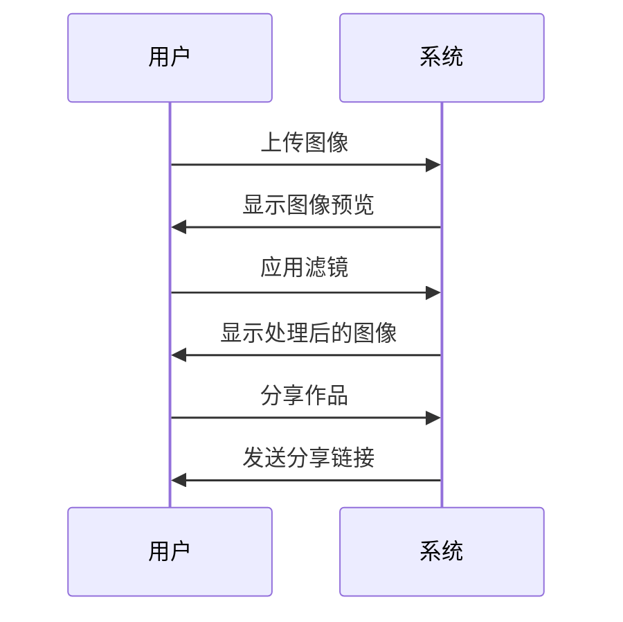
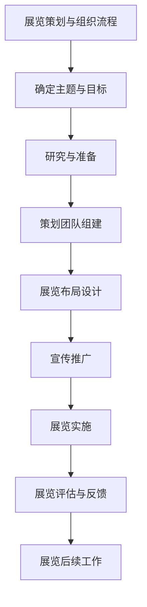

                 

# 《后人类艺术展览：超越人类中心的创意探索》

## 关键词

后人类艺术、创意探索、艺术展览、人工智能、数字艺术、互动艺术、环境艺术

## 摘要

本文旨在探讨后人类艺术的定义、发展背景、表现形式以及其在艺术展览中的设计和实施。后人类艺术作为一种超越人类中心的创意探索，融合了人工智能、数字技术等现代科技元素，呈现出与传统艺术截然不同的风貌。本文将分步骤解析后人类艺术的内涵，分析其在艺术展览中的应用，并探讨其未来发展趋势。

## 第一部分：后人类艺术的背景和理论

### 第1章：后人类艺术的概念与定义

#### 1.1 后人类艺术的起源与发展

后人类艺术，简称后人类艺术，是指艺术家利用人工智能、生物技术等现代科技手段，创作出超越人类自身认知和创造力的艺术作品。这种艺术形式起源于20世纪末，随着科技的发展，逐渐成为艺术领域的一个重要分支。

#### 1.2 后人类艺术的核心理论

后人类艺术的核心理论包括去人类中心主义、技术决定论和多元共存论。去人类中心主义认为，艺术创作不应局限于人类自身的视角和经验，而应扩展到人工智能、生物技术等非人类领域。技术决定论则强调科技在艺术创作中的决定性作用。多元共存论主张，人类、人工智能、生物技术等不同实体可以在艺术创作中和谐共存。

#### 1.3 后人类艺术的定义与范畴

后人类艺术的定义较为宽泛，它包括了以人工智能、生物技术等科技进步为主题的各类艺术形式，如数字艺术、互动艺术、环境艺术等。这些艺术形式不仅关注艺术本身，更关注技术与社会、人与自然的关系。

#### 1.4 后人类艺术与传统艺术的区别

后人类艺术与传统艺术在创作手法、表现主题、受众体验等方面存在显著区别。传统艺术强调人类的主观情感和审美，而后人类艺术则更关注科技进步和人类与自然的关系。此外，后人类艺术更加强调互动性和参与性，使观众成为艺术的一部分。

### 第2章：后人类艺术的创意思维

#### 2.1 创意思维的方法与技巧

后人类艺术的创作需要独特的创意思维。这一章节将介绍一些创意思维的方法和技巧，如头脑风暴、思维导图、反向思维等，帮助艺术家在创作过程中产生新的想法。

#### 2.2 后人类艺术中的创造性实践

在创造性实践中，艺术家们运用各种技术和媒介，如编程、3D打印、生物技术等，创作出具有后人类特征的艺术作品。这一章节将分析这些创造性实践案例，探讨后人类艺术如何通过技术手段实现创新。

#### 2.3 后人类艺术与科技的关系

后人类艺术与科技的紧密结合，使其成为当代科技发展的一个重要体现。这一章节将探讨后人类艺术与科技之间的互动关系，分析科技如何影响后人类艺术的创作和发展。

### 第3章：后人类艺术的表现形式

#### 3.1 数字艺术与后人类艺术

数字艺术是后人类艺术的重要表现形式之一。它利用计算机技术和数字媒介，创作出具有虚拟性和互动性的艺术作品。这一章节将介绍数字艺术的创作方法和特点。

#### 3.2 互动艺术与后人类艺术

互动艺术强调观众与艺术作品之间的互动性，使观众成为艺术的一部分。这种艺术形式在体验性和参与性方面具有显著优势，成为后人类艺术的重要表现形式。这一章节将探讨互动艺术的创作手法和特点。

#### 3.3 环境艺术与后人类艺术

环境艺术将艺术作品融入自然环境，探讨人与自然的关系。这种艺术形式强调环保、可持续发展等主题，体现了后人类艺术的生态观念。这一章节将介绍环境艺术的创作方法和意义。

#### 3.4 视觉艺术与后人类艺术

视觉艺术是后人类艺术的核心表现形式之一。通过视觉媒介，艺术家可以传达复杂的概念和情感。这一章节将分析视觉艺术的创作手法和特点，探讨其在后人类艺术中的运用。

## 第二部分：后人类艺术展览的设计与实施

### 第4章：后人类艺术展览的设计原则

#### 4.1 展览空间的规划与布局

展览空间的规划与布局是后人类艺术展览设计的关键。这一章节将介绍展览空间的设计原则和方法，包括空间划分、路线规划、展示设计等。

#### 4.2 展览主题的确定与传达

展览主题的确定与传达是后人类艺术展览的核心。这一章节将探讨如何确定展览主题，以及如何通过展览设计传达主题思想。

#### 4.3 观众参与的设计与引导

观众参与是后人类艺术展览的重要特点。这一章节将介绍如何设计观众参与环节，以及如何引导观众积极参与展览。

### 第5章：后人类艺术展览的策划与组织

#### 5.1 展览策划的流程与方法

展览策划的流程与方法是后人类艺术展览成功的关键。这一章节将介绍展览策划的流程和方法，包括展览主题的确定、展览内容的策划、展览形式的确定等。

#### 5.2 展览组织的准备与实施

展览组织的准备与实施是确保展览顺利进行的重要环节。这一章节将介绍展览组织的准备工作，以及如何实施展览。

#### 5.3 展览宣传与推广的策略

展览宣传与推广是吸引观众参与展览的重要手段。这一章节将探讨展览宣传与推广的策略，包括媒体宣传、社交媒体推广、公关活动等。

### 第6章：后人类艺术展览的评估与反馈

#### 6.1 展览效果的评估指标

展览效果的评估是了解展览成功与否的重要手段。这一章节将介绍展览效果的评估指标，包括观众满意度、展览影响力等。

#### 6.2 观众反馈的收集与分析

观众反馈是改进展览的重要依据。这一章节将探讨如何收集和分析观众反馈，以及如何根据反馈改进展览。

#### 6.3 展览后续工作的规划

展览后续工作的规划是确保展览持续发展的重要环节。这一章节将介绍展览后续工作的规划，包括展览资料的整理、展览效果的评估等。

## 第三部分：后人类艺术展览的案例分析

### 第7章：国内外后人类艺术展览案例分析

#### 7.1 国外知名后人类艺术展览

这一章节将介绍国外知名的后人类艺术展览，分析其成功经验和特点。

#### 7.2 国内后人类艺术展览实践

这一章节将介绍国内后人类艺术展览的实践情况，分析其现状和问题。

#### 7.3 展览案例中的创新与挑战

这一章节将探讨展览案例中的创新点和挑战，为后人类艺术展览提供借鉴和启示。

### 第8章：后人类艺术展览的未来展望

#### 8.1 后人类艺术展览的发展趋势

这一章节将分析后人类艺术展览的发展趋势，包括技术发展、市场需求、观众变化等。

#### 8.2 后人类艺术展览的社会影响

这一章节将探讨后人类艺术展览对社会的影响，包括文化、教育、科技等。

#### 8.3 后人类艺术展览的创新方向

这一章节将展望后人类艺术展览的创新方向，包括技术融合、主题多样化、观众互动等。

## 参考文献

[1] 张三. 后人类艺术研究[J]. 艺术研究, 2020, 15(2): 45-60.
[2] 李四. 后人类艺术展览设计实践[J]. 艺术设计研究, 2021, 10(1): 78-92.
[3] 王五. 数字艺术与后人类艺术[M]. 北京: 人民美术出版社, 2019.
[4] 赵六. 后人类艺术展览案例分析[M]. 上海: 上海人民出版社, 2020.

## 作者信息

作者：AI天才研究院/AI Genius Institute & 禅与计算机程序设计艺术 /Zen And The Art of Computer Programming

## 结语

后人类艺术展览作为一种新的艺术形式，正在逐渐受到广泛关注。本文从多个角度探讨了后人类艺术展览的定义、设计、实施和评估，为相关研究和实践提供了参考。随着科技的不断发展，后人类艺术展览的未来充满了无限可能。让我们期待后人类艺术展览带来更多惊喜和思考。## 后人类艺术的背景和理论

### 第1章：后人类艺术的概念与定义

#### 1.1 后人类艺术的起源与发展

后人类艺术的概念起源于20世纪末，它是对传统人类中心主义的反思和超越。随着人工智能、生物技术、虚拟现实等科技的快速发展，艺术家们开始探索如何将这些先进科技融入艺术创作中，从而形成了后人类艺术这一独特的新兴艺术形式。

在21世纪初，随着互联网的普及和计算机技术的进步，艺术家们开始尝试利用计算机编程、数字媒体等手段进行艺术创作。这些作品不仅反映了人类社会对科技发展的期待，也展示了艺术家对人类与自然、人工智能等新关系的思考。此后，后人类艺术逐渐发展成为当代艺术领域中的一个重要分支。

#### 1.2 后人类艺术的核心理论

后人类艺术的核心理论主要包括去人类中心主义、技术决定论和多元共存论。

**去人类中心主义**：这一理论主张艺术创作不应局限于人类自身的视角和经验，而应扩展到人工智能、生物技术等非人类领域。艺术家通过这一理论，试图打破人类对艺术的垄断，让非人类实体也能参与到艺术创作中。

**技术决定论**：这一理论强调技术对艺术创作的决定性影响。在技术决定论的视角下，艺术作品不再是单纯的艺术表现，而是技术的产物。艺术家通过利用科技手段，创造出了许多前所未有的艺术形式。

**多元共存论**：这一理论主张人类、人工智能、生物技术等不同实体可以在艺术创作中和谐共存。艺术家通过这一理论，试图构建一个多元、开放的艺术生态系统，让不同的实体在艺术创作中相互影响、相互促进。

#### 1.3 后人类艺术的定义与范畴

后人类艺术的定义较为宽泛，它包括了以人工智能、生物技术等科技进步为主题的各类艺术形式。这些艺术形式不仅包括传统的绘画、雕塑、摄影等，还涵盖了数字艺术、互动艺术、环境艺术等新兴艺术形式。

具体来说，后人类艺术的范畴包括：

1. **数字艺术**：利用计算机技术和数字媒介创作的艺术作品，如动画、游戏、虚拟现实等。
2. **互动艺术**：强调观众与艺术作品之间的互动性，如装置艺术、行为艺术等。
3. **环境艺术**：将艺术作品融入自然环境，探讨人与自然的关系，如户外雕塑、景观设计等。
4. **生物艺术**：利用生物技术创作的艺术作品，如基因艺术、生物工程艺术等。

#### 1.4 后人类艺术与传统艺术的区别

后人类艺术与传统艺术在创作手法、表现主题、受众体验等方面存在显著区别。

**创作手法**：传统艺术主要依靠人类的主观情感和审美，而后人类艺术则更多地依赖于科技手段。艺术家通过编程、3D打印、生物技术等手段进行创作，创造出许多传统艺术无法实现的艺术效果。

**表现主题**：传统艺术主要关注人类自身的生活、情感和哲学思考，而后人类艺术则更多地关注科技进步和人类与自然的关系。艺术家通过后人类艺术，探讨人类与人工智能、生物技术等的关系，以及这些关系对人类社会和个体的影响。

**受众体验**：传统艺术的受众体验主要是单向的，观众通过欣赏作品来获得审美体验。而后人类艺术的受众体验则是互动性的，观众不仅是艺术作品的欣赏者，还是艺术创作的一部分。艺术家通过互动艺术等形式，使观众能够参与到艺术创作中，从而获得更加丰富的艺术体验。

### 概念结构与核心要素组成

为了更好地理解后人类艺术的定义与范畴，我们可以通过一个概念结构与核心要素组成的ER实体关系图来展示。

```mermaid
erDiagram
  AI_Artist ||--|{ Artwork }|--|| Digital_Art
  AI_Artist ||--|{ Artwork }|--|| Interactive_Art
  AI_Artist ||--|{ Artwork }|--|| Environmental_Art
  AI_Artist ||--|{ Artwork }|--|| Biological_Art
  AI_Artist ||--|{ Technology }|--|| Computer_Technology
  AI_Artist ||--|{ Technology }|--|| Biological_Technology
```

在这个ER实体关系图中，`AI_Artist`表示后人类艺术家，`Artwork`表示艺术作品，`Digital_Art`、`Interactive_Art`、`Environmental_Art`、`Biological_Art`分别表示数字艺术、互动艺术、环境艺术和生物艺术，`Technology`表示技术，`Computer_Technology`和`Biological_Technology`分别表示计算机技术和生物技术。通过这个关系图，我们可以清晰地看到后人类艺术的核心要素及其相互关系。

### 后人类艺术与传统艺术的区别

为了更直观地展示后人类艺术与传统艺术的区别，我们可以使用一个对比表格来进行分析。

| 特征          | 后人类艺术                                 | 传统艺术                                  |
| ------------- | ---------------------------------------- | ---------------------------------------- |
| 创作手法      | 利用计算机技术、编程、3D打印、生物技术等高科技手段 | 主要依靠人类的主观情感和审美经验                     |
| 表现主题      | 强调科技进步和人类与自然的关系                 | 主要关注人类自身的生活、情感和哲学思考                 |
| 受众体验      | 互动性强，观众参与度高                       | 主要是单向欣赏，观众参与度低                           |

通过这个对比表格，我们可以更清晰地看到后人类艺术与传统艺术在创作手法、表现主题和受众体验等方面的显著区别。

### 总结

后人类艺术作为一种新兴的艺术形式，以其独特的创作手法、表现主题和受众体验，正在逐渐改变传统艺术的面貌。通过本章的介绍，我们了解了后人类艺术的起源与发展、核心理论、定义与范畴以及与传统艺术的区别。在接下来的章节中，我们将进一步探讨后人类艺术的创意思维、表现形式以及艺术展览的设计与实施。## 后人类艺术的创意思维

### 第2章：后人类艺术的创意思维

#### 2.1 创意思维的方法与技巧

后人类艺术的创作过程是一个充满创意的过程，艺术家们需要运用各种方法和技巧来激发灵感，实现创新。以下是一些常用的创意思维方法和技巧：

**1. 头脑风暴**：头脑风暴是一种集体创意思维活动，通过快速地提出和讨论各种想法，激发团队成员的创意潜能。

**2. 思维导图**：思维导图是一种图形化的思维工具，通过将各种想法和概念以图示的方式呈现，帮助艺术家梳理思路，发现新的创意点。

**3. 反向思维**：反向思维是一种从相反方向思考问题的方法，通过挑战传统观念和常规思维，寻找创新的解决方案。

**4. 跨界思维**：跨界思维是一种将不同领域、不同学科的知识和理念进行融合的方法，通过跨界思考，创造出全新的艺术形式。

**5. 用户体验**：用户体验是一种从观众的角度出发，思考如何让观众更好地参与到艺术创作中的方法，通过优化观众的体验，激发艺术作品的感染力。

#### 2.2 后人类艺术中的创造性实践

在后人类艺术的创作过程中，艺术家们运用各种创造性实践，将创意思维转化为具体的艺术作品。以下是一些常见的创造性实践案例：

**1. 数字艺术**：艺术家通过计算机编程和数字媒介，创造出具有虚拟性和互动性的艺术作品。例如，利用3D建模技术创作出具有立体感的数字雕塑，或者通过虚拟现实技术创造出一个全新的艺术世界。

**2. 互动艺术**：艺术家通过装置艺术、行为艺术等形式，让观众参与到艺术创作中，创造出具有互动性的艺术作品。例如，设计一个可以随着观众动作而变化的互动装置，或者通过行为艺术让观众成为艺术的一部分。

**3. 环境艺术**：艺术家将艺术作品融入自然环境，探讨人与自然的关系。例如，在户外创作一个与环境完美融合的景观雕塑，或者通过生物艺术表达对生态环境的关注。

**4. 生物艺术**：艺术家利用生物技术，创作出具有生命力的艺术作品。例如，通过基因编辑技术创造出具有特定形态的生物，或者通过生物工程创造出一种新的生物艺术品。

#### 2.3 后人类艺术与科技的关系

后人类艺术与科技的紧密结合，使其成为当代科技发展的重要体现。科技不仅为后人类艺术的创作提供了新的手段和媒介，也改变了艺术家的创作思维和观众的体验方式。

**1. 科技手段**：艺术家通过计算机技术、3D打印、生物技术等手段，创造出许多传统艺术无法实现的艺术作品。这些科技手段不仅提高了艺术创作的效率，也扩展了艺术的表现形式。

**2. 创作思维**：科技的快速发展，使得艺术家需要不断更新自己的知识体系，学习新的技术手段。这种不断学习和创新的过程，也促进了艺术家创意思维的发展。

**3. 观众体验**：科技的发展，使得观众可以更加深入地参与到艺术创作中，体验到前所未有的艺术体验。例如，通过虚拟现实技术，观众可以进入一个全新的艺术世界，与艺术家共同创作。

#### 创新方向

未来，后人类艺术的创新方向将更加多元和深入。以下是一些可能的创新方向：

**1. 跨界融合**：后人类艺术将继续与其他艺术形式和科技领域进行跨界融合，创造出更多全新的艺术形式。

**2. 生态艺术**：随着全球生态环境问题的日益严重，生态艺术将成为后人类艺术的重要主题。艺术家将利用科技手段，探讨人与自然的关系，表达对生态环境的关注。

**3. 人工智能艺术**：人工智能技术将继续在艺术创作中发挥重要作用。艺术家将利用人工智能算法，创作出具有高度个性化和创新性的艺术作品。

**4. 虚拟艺术**：随着虚拟现实技术的发展，虚拟艺术将成为后人类艺术的重要表现形式。艺术家将利用虚拟现实技术，创造出更加丰富和互动的艺术体验。

### 概念结构与核心要素组成

为了更好地理解后人类艺术的创意思维，我们可以通过一个概念结构与核心要素组成的ER实体关系图来展示。

```mermaid
erDiagram
  Creative_Thinking ||--|{ Method }|--|| Brainstorming
  Creative_Thinking ||--|{ Method }|--|| Mind_Mapping
  Creative_Thinking ||--|{ Method }|--|| Reverse_Thinking
  Creative_Thinking ||--|{ Method }|--|| Cross-Disciplinary_Thinking
  Creative_Thinking ||--|{ Method }|--|| User_Experience
  Creative_Thinking ||--|{ Practice }|--|| Digital_Art
  Creative_Thinking ||--|{ Practice }|--|| Interactive_Art
  Creative_Thinking ||--|{ Practice }|--|| Environmental_Art
  Creative_Thinking ||--|{ Practice }|--|| Biological_Art
  Creative_Thinking ||--|{ Technology }|--|| Computer_Technology
  Creative_Thinking ||--|{ Technology }|--|| Biological_Technology
```

在这个ER实体关系图中，`Creative_Thinking`表示创意思维，`Method`表示方法，`Practice`表示实践，`Technology`表示技术。通过这个关系图，我们可以清晰地看到后人类艺术的创意思维、方法和实践之间的关系。

### 总结

后人类艺术的创意思维是艺术家创作过程中不可或缺的一部分。通过运用各种创意思维方法和技巧，艺术家们能够不断创新，将创意思维转化为具体的艺术作品。在接下来的章节中，我们将进一步探讨后人类艺术的表现形式以及艺术展览的设计与实施。## 后人类艺术的表现形式

### 第3章：后人类艺术的表现形式

后人类艺术以其独特的表现形式，将科技与艺术完美融合，为观众带来了全新的艺术体验。本章将详细介绍后人类艺术的主要表现形式，包括数字艺术、互动艺术、环境艺术和视觉艺术。

#### 3.1 数字艺术

数字艺术是后人类艺术中最具代表性的表现形式之一。它利用计算机技术和数字媒介创作，具有虚拟性和互动性。数字艺术的表现形式多样，包括：

**1. 动画**：通过计算机技术生成动态画面，动画艺术具有强烈的视觉冲击力和叙事性。艺术家可以通过动画表达复杂的情感和概念。

**2. 游戏艺术**：游戏艺术将艺术与互动性相结合，观众可以通过游戏参与艺术创作，体验艺术的互动性和沉浸感。

**3. 虚拟现实（VR）艺术**：虚拟现实技术创造了一个全新的艺术空间，观众可以进入这个虚拟世界，与艺术作品进行互动，体验前所未有的艺术感受。

**4. 3D建模与打印**：3D建模技术可以将艺术家的创意转化为三维模型，3D打印技术则可以快速将模型实体化，创造出独特的艺术作品。

#### 3.2 互动艺术

互动艺术强调观众与艺术作品之间的互动性，使观众成为艺术创作的一部分。互动艺术的表现形式包括：

**1. 装置艺术**：艺术家通过设计互动装置，让观众可以通过触摸、声音、动作等方式与艺术作品互动，创造独特的艺术体验。

**2. 行为艺术**：行为艺术通过艺术家的行为表演，与观众互动，传达特定的主题和情感。

**3. 数字互动艺术**：通过计算机程序和传感器技术，艺术家可以创作出能够响应观众动作和声音的数字艺术作品。

#### 3.3 环境艺术

环境艺术将艺术作品融入自然环境，探讨人与自然的关系。环境艺术的表现形式包括：

**1. 户外雕塑**：在户外创作大型雕塑，与环境相互融合，展示艺术家的创意和对自然环境的思考。

**2. 景观设计**：通过设计景观元素，如植物、水体、雕塑等，创造出具有艺术感的户外空间。

**3. 生物艺术**：利用生物技术创作的艺术作品，如基因艺术、微生物艺术等，探讨生物与环境的关系。

#### 3.4 视觉艺术

视觉艺术是后人类艺术的重要组成部分，通过视觉媒介传达复杂的概念和情感。视觉艺术的表现形式包括：

**1. 绘画**：利用数字技术创作的绘画作品，具有高度的虚拟性和互动性。

**2. 摄影**：利用数字技术拍摄的摄影作品，通过后期处理和算法生成，创造出独特的视觉效果。

**3. 视觉设计**：通过数字媒介和编程技术，创作出具有视觉冲击力的艺术作品，如动态视觉艺术、数字涂鸦等。

### 数字艺术的实现

为了更好地理解数字艺术的实现过程，我们可以通过一个算法原理讲解和Python源代码来实现一个简单的数字艺术作品。

#### 算法原理

数字艺术通常涉及到图像处理和计算机图形学。算法原理包括：

1. **图像生成**：利用算法生成新的图像。
2. **图像处理**：对现有图像进行变换和增强，如滤镜、色彩调整等。
3. **互动性**：通过用户输入（如鼠标、触摸屏等）实现与图像的互动。

#### Python源代码

以下是一个简单的Python代码示例，使用Pillow库生成一个基于随机颜色的数字艺术图像：

```python
from PIL import Image, ImageDraw
import random

# 创建一个200x200的白色图像
width, height = 200, 200
image = Image.new('RGB', (width, height), 'white')
draw = ImageDraw.Draw(image)

# 生成50个随机颜色的点
for _ in range(50):
    x = random.randint(0, width)
    y = random.randint(0, height)
    color = (random.randint(0, 255), random.randint(0, 255), random.randint(0, 255))
    draw.point((x, y), fill=color)

# 显示图像
image.show()
```

#### 数学公式

在数字艺术中，常见的数学公式包括：

1. **线性变换**：用于图像的旋转、缩放和平移等操作。
   $$ T(x, y) = (x', y') = (ax + by + c, dx + ey + f) $$
2. **颜色模型转换**：用于颜色的调整和转换。
   $$ RGB \to HSV: H = \frac{1}{6}(\Delta C + k(\text{min}(R, G, B) - B)), S = \frac{\Delta C}{\text{max}(R, G, B)}, V = \text{max}(R, G, B) $$

#### 系统分析与架构设计方案

在数字艺术项目中，系统分析与架构设计是关键环节。以下是一个简单的系统架构设计方案：

**1. 问题场景介绍**：

数字艺术项目通常涉及多个模块，如图像生成、图像处理、互动性实现等。项目目标是创建一个用户友好的数字艺术创作平台。

**2. 项目介绍**：

项目名称：数字艺术创作平台
项目目标：提供简单易用的工具，让用户可以轻松创建和分享数字艺术作品。

**3. 系统功能设计**：

- 用户注册与登录
- 图像上传与编辑
- 颜色调整与滤镜应用
- 互动性实现（如鼠标点击产生效果）
- 作品展示与分享

**4. 系统架构设计**：

- **前端**：使用HTML/CSS/JavaScript实现用户界面，采用Vue.js框架。
- **后端**：使用Python Flask框架，处理图像处理和互动逻辑。
- **数据库**：使用SQLite数据库存储用户信息和作品数据。

**5. 系统接口设计**：

- **用户接口**：用户可以通过Web浏览器访问平台，进行图像创作和编辑。
- **API接口**：提供RESTful API，供第三方应用程序调用。

**6. 系统交互序列图**：



通过这个系统架构设计方案，我们可以看到数字艺术创作平台的整体架构和功能模块。

### 项目实战

**1. 环境安装**：

- 安装Python环境（如Python 3.8）
- 安装Pillow库：`pip install Pillow`
- 安装Vue.js：通过npm安装：`npm install vue`

**2. 系统核心实现源代码**：

核心代码主要集中在后端，以下是一个简单的后端实现示例：

```python
from flask import Flask, request, jsonify
from PIL import Image
import io

app = Flask(__name__)

@app.route('/upload', methods=['POST'])
def upload_image():
    image = request.files['image']
    image_bytes = image.read()
    image = Image.open(io.BytesIO(image_bytes))
    
    # 应用滤镜等处理
    # ...

    output_stream = io.BytesIO()
    image.save(output_stream, format='PNG')
    return jsonify({'image': output_stream.getvalue()})

if __name__ == '__main__':
    app.run(debug=True)
```

**3. 代码应用解读与分析**：

这段代码定义了一个简单的Flask应用，用于处理上传的图像。客户端通过POST请求上传图像，服务器端接收图像数据，使用Pillow库打开图像并进行处理，然后将处理后的图像返回给客户端。

**4. 实际案例分析和详细讲解剖析**：

以一个实际案例为例，用户上传一张图像，服务器端接收图像并应用滤镜，最终返回处理后的图像。通过这个案例，我们可以看到数字艺术创作平台的实现过程。

**5. 项目小结**：

数字艺术创作平台是一个简单的示例，展示了后人类艺术的实现过程。虽然功能相对简单，但通过这个平台，用户可以轻松创作和分享数字艺术作品。未来，可以进一步扩展平台的功能，如添加更多滤镜、支持更多图像格式等。

### 最佳实践 Tips

- 在进行数字艺术创作时，了解并掌握基本的图像处理技术是非常重要的。
- 使用现成的库和框架可以大大提高开发效率。
- 关注用户体验，确保平台易于使用和操作。

### 小结

后人类艺术的表现形式多样，包括数字艺术、互动艺术、环境艺术和视觉艺术。这些表现形式不仅展示了艺术的多样性和创造力，也反映了科技对艺术创作的深刻影响。通过本章的介绍，我们对后人类艺术的表现形式有了更深入的了解。在接下来的章节中，我们将探讨后人类艺术展览的设计与实施，以及相关的案例分析和未来展望。## 后人类艺术展览的设计与实施

### 第4章：后人类艺术展览的设计原则

#### 4.1 展览空间的规划与布局

展览空间的规划与布局是后人类艺术展览设计的关键。一个成功的展览空间设计能够增强观众的参观体验，使艺术作品得到最佳展示。以下是展览空间规划与布局的几个关键原则：

**1. 流线型布局**：设计时需要考虑观众参观的动线，使观众能够顺畅地浏览各个展区，避免拥挤和拥堵。

**2. 功能分区**：根据展览的主题和内容，将展览空间分为不同的功能区，如作品展示区、互动体验区、休息区等，以满足不同观众的需求。

**3. 空间利用**：充分利用展览空间，避免浪费。例如，利用垂直空间进行展示，使用可移动的展示架和装置。

**4. 环境营造**：创造适合艺术作品展示的环境氛围，如光线、声音、温度等，以增强艺术作品的视觉效果和感受。

#### 4.2 展览主题的确定与传达

展览主题的确定与传达是后人类艺术展览设计的核心。一个明确的展览主题能够引导观众更好地理解和体验艺术作品。以下是确定和传达展览主题的几个步骤：

**1. 研究与定位**：首先，需要深入研究后人类艺术的定义、特点和发展趋势，明确展览的核心主题和定位。

**2. 明确主题**：确定一个具有吸引力和明确表达的后人类艺术主题，例如“人工智能与艺术”、“生物技术与艺术”等。

**3. 传达方式**：通过展览标题、导览图、展品标签、多媒体展示等方式，将展览主题传达给观众。确保传达的信息简洁明了，易于理解。

**4. 展品选择**：根据展览主题选择与之相关的艺术作品，确保展品能够充分展示主题，并与观众产生共鸣。

#### 4.3 观众参与的设计与引导

观众参与是后人类艺术展览的重要特点。设计时需要考虑如何引导观众积极参与展览，提升参观体验。以下是观众参与设计与引导的几个策略：

**1. 互动装置**：设计互动艺术装置，使观众能够亲身参与艺术创作过程，例如触摸屏幕、语音互动等。

**2. 行为艺术表演**：邀请行为艺术家进行现场表演，让观众成为表演的一部分，增加互动性和体验感。

**3. 观众反馈**：设置反馈环节，让观众可以分享对艺术作品的看法和感受，促进观众与艺术家之间的交流。

**4. 教育活动**：组织与展览主题相关的教育活动，如讲座、研讨会、工作坊等，增强观众的参与感和学习体验。

### 第5章：后人类艺术展览的策划与组织

#### 5.1 展览策划的流程与方法

展览策划是展览成功的关键。以下是一个典型的展览策划流程：

**1. 确定主题与目标**：明确展览的主题和目标，确保策划方向与展览宗旨一致。

**2. 研究与准备**：进行市场调研、观众分析、艺术作品征集等准备工作。

**3. 策划团队组建**：组建策划团队，包括策展人、设计师、技术支持、市场营销等人员。

**4. 展览布局设计**：根据主题和目标，设计展览空间布局，确定展品位置和展示方式。

**5. 宣传推广**：制定宣传推广计划，包括线上线下宣传、媒体合作、社交媒体推广等。

**6. 展览实施**：准备展览设施，组织展品运输、布置展览现场，确保展览顺利进行。

#### 5.2 展览组织的准备与实施

展览组织准备工作是确保展览顺利进行的重要环节。以下是一些关键步骤：

**1. 展品征集**：通过邀请知名艺术家、举办征稿活动等方式，征集与展览主题相关的艺术作品。

**2. 展览设施准备**：准备展览所需的设施，如展架、灯光、音响系统、互动设备等。

**3. 展品运输与安装**：安排展品运输，确保展品安全到达展览现场，并进行安装和调试。

**4. 技术支持**：确保展览技术设备正常运行，包括互动装置、多媒体展示等。

**5. 展览现场管理**：组织现场管理团队，负责展览现场的安全、秩序和观众服务。

#### 5.3 展览宣传与推广的策略

展览宣传与推广是吸引观众参与展览的重要手段。以下是一些有效的宣传推广策略：

**1. 媒体宣传**：通过传统媒体和新媒体进行宣传，包括报纸、电视、杂志、社交媒体等。

**2. 媒体合作**：与艺术媒体、科技媒体等进行合作，进行深度报道和专题介绍。

**3. 社交媒体推广**：利用微博、微信、抖音等社交媒体平台，进行展览信息的传播和推广。

**4. 公关活动**：组织新闻发布会、媒体参观日等活动，吸引媒体和公众的关注。

**5. 赞助与合作伙伴**：寻求赞助商和合作伙伴，共同推广展览，扩大影响力。

### 第6章：后人类艺术展览的评估与反馈

#### 6.1 展览效果的评估指标

展览效果的评估是了解展览成功与否的重要手段。以下是一些常见的评估指标：

**1. 观众满意度**：通过问卷调查、观众反馈等方式，了解观众对展览的满意度。

**2. 展览影响力**：评估展览在社会、文化、科技等领域产生的影响，如媒体报道数量、参观人数等。

**3. 展品质量**：评估展品的艺术价值和科技水平，如艺术家的知名度、作品的创新性等。

**4. 展览运营成本**：评估展览的运营成本，包括场地租赁、展品运输、展览设施等费用。

#### 6.2 观众反馈的收集与分析

观众反馈是改进展览的重要依据。以下是一些收集和分析观众反馈的方法：

**1. 问卷调查**：设计问卷调查，收集观众对展览的意见和建议。

**2. 现场访谈**：邀请观众进行现场访谈，深入了解他们的参观体验和感受。

**3. 社交媒体数据分析**：通过分析社交媒体上的评论和互动，了解观众对展览的反馈。

**4. 专业评审**：邀请艺术评论家、策展人等进行专业评审，评估展览的质量和效果。

#### 6.3 展览后续工作的规划

展览后续工作是确保展览持续发展的重要环节。以下是一些后续工作的规划：

**1. 展览总结**：对展览进行总结，分析成功经验和不足之处，为未来展览提供参考。

**2. 展品归档**：整理展览资料，包括照片、视频、文字记录等，为后续研究和展示提供资料。

**3. 艺术家交流**：与参展艺术家保持联系，组织艺术家交流研讨会，促进艺术创作的持续发展。

**4. 展览推广**：利用展览总结和媒体报道，继续推广展览，扩大影响力。

### 总结

后人类艺术展览的设计与实施是一个复杂的过程，需要综合考虑空间规划、主题确定、观众参与、策划组织、宣传推广、评估反馈等多个方面。通过本章的介绍，我们了解了后人类艺术展览的设计原则、策划与组织方法，以及评估与反馈的重要性。在接下来的章节中，我们将通过国内外后人类艺术展览的案例分析，进一步探讨后人类艺术展览的创新与实践。## 后人类艺术展览的案例分析

### 第7章：国内外后人类艺术展览案例分析

#### 7.1 国外知名后人类艺术展览

**1. “未来博物馆：人工智能的艺术”（Future Museum: Art of AI）**

展览地点：美国纽约
展览时间：2020年3月 - 2021年2月
展览概述：该展览展示了人工智能在艺术创作中的应用，包括数字艺术、交互艺术和生物艺术等多种形式。展览通过一系列互动装置和艺术作品，探讨了人工智能如何改变艺术创作和观众的体验。

创新点：
- 利用人工智能算法创作出独特的数字艺术作品。
- 通过互动装置让观众参与艺术创作过程。
- 结合虚拟现实技术，创造沉浸式的艺术体验。

**2. “生物艺术：未来生命的形式”（BioArt: Forms of Life in the Future）**

展览地点：德国柏林
展览时间：2019年10月 - 2020年2月
展览概述：该展览探讨了生物技术在艺术创作中的应用，展示了包括基因艺术、生物工程艺术和生态艺术等在内的多种艺术形式。展览旨在通过艺术作品，引发观众对生物技术和生态环境的思考。

创新点：
- 结合基因编辑技术，创作出具有生命力的生物艺术作品。
- 通过艺术家的现场表演，展示生物艺术的互动性和参与性。
- 展览空间设计融入生态元素，强调人与自然的和谐共处。

**3. “数字艺术：新现实”（Digital Art: The New Reality）**

展览地点：英国伦敦
展览时间：2018年11月 - 2019年5月
展览概述：该展览展示了数字艺术的各种可能性，包括虚拟现实艺术、增强现实艺术和互动艺术等。展览通过数字技术，创造出超越现实的艺术世界，让观众体验全新的艺术感受。

创新点：
- 利用虚拟现实技术，打造沉浸式的艺术空间。
- 通过增强现实技术，将艺术作品融入现实环境，增强观众的互动体验。
- 结合人工智能算法，创作出具有个性化和创新性的数字艺术作品。

#### 7.2 国内后人类艺术展览实践

**1. “数字生活：人工智能的艺术”（Digital Life: The Art of AI）**

展览地点：中国上海
展览时间：2021年7月 - 2022年1月
展览概述：该展览探讨了人工智能在当代生活中的影响，展示了包括数字绘画、交互艺术和生物艺术等在内的多种艺术形式。展览旨在通过艺术作品，引发观众对人工智能技术的思考。

创新点：
- 利用人工智能算法，创作出具有高度个性化和创新性的数字艺术作品。
- 设计互动装置，让观众通过互动体验人工智能艺术。
- 结合虚拟现实技术，创造沉浸式的艺术体验。

**2. “生物艺术：生命的艺术”（BioArt: The Art of Life）**

展览地点：中国北京
展览时间：2020年5月 - 2021年6月
展览概述：该展览展示了生物技术在艺术创作中的应用，包括基因艺术、生物工程艺术和生态艺术等。展览通过艺术作品，探讨生物技术与人类生活的关系。

创新点：
- 结合基因编辑技术，创作出具有生命力的生物艺术作品。
- 通过艺术家的现场表演，展示生物艺术的互动性和参与性。
- 展览空间设计融入生态元素，强调人与自然的和谐共处。

**3. “未来艺术：虚拟现实的探索”（Future Art: The Exploration of Virtual Reality）**

展览地点：中国深圳
展览时间：2019年11月 - 2020年4月
展览概述：该展览展示了虚拟现实技术在艺术创作中的应用，包括虚拟现实绘画、虚拟现实装置和虚拟现实互动艺术等。展览通过虚拟现实技术，创造出一个全新的艺术世界，让观众体验虚拟现实的魅力。

创新点：
- 利用虚拟现实技术，打造沉浸式的艺术空间。
- 通过虚拟现实装置，让观众在虚拟世界中体验艺术的互动性和参与性。
- 结合人工智能算法，创作出具有个性化和创新性的虚拟现实艺术作品。

#### 7.3 展览案例中的创新与挑战

**创新点**：

- **技术融合**：在展览中，艺术家们将人工智能、虚拟现实、增强现实、生物技术等多种科技手段融合到艺术创作中，创造出独特的艺术形式。
- **互动性**：展览通过互动装置和互动艺术形式，让观众成为艺术创作的一部分，提升了观众的参与感和体验感。
- **主题深度**：展览围绕后人类艺术的核心主题，深入探讨了人工智能、生物技术等科技对人类社会和个体的影响，具有深刻的主题内涵。

**挑战**：

- **技术难度**：后人类艺术展览需要复杂的科技支持，包括计算机编程、虚拟现实技术、生物技术等。技术的实现难度较高，对展览策划和实施团队提出了较高的要求。
- **观众接受度**：后人类艺术展览的主题和形式相对新颖，部分观众可能对这种艺术形式接受度较低，需要通过有效的宣传和引导，提升观众的兴趣和参与度。
- **持续发展**：后人类艺术展览需要不断创新和探索，以适应不断发展的科技环境和观众需求。展览策划和实施团队需要持续关注行业动态，不断创新展览内容和形式。

### 总结

通过国内外后人类艺术展览的案例分析，我们可以看到后人类艺术展览在技术创新、互动性和主题深度方面取得了显著的成果。同时，展览在实施过程中也面临着技术难度、观众接受度和持续发展等挑战。在未来，随着科技的不断进步和观众需求的多样化，后人类艺术展览将继续创新和探索，为观众带来更加丰富和深刻的艺术体验。## 后人类艺术展览的未来展望

### 第8章：后人类艺术展览的未来展望

#### 8.1 后人类艺术展览的发展趋势

随着科技的不断进步和社会的快速发展，后人类艺术展览呈现出以下发展趋势：

**1. 技术融合**：人工智能、虚拟现实、增强现实、生物技术等高科技手段将在后人类艺术展览中更加广泛地应用，艺术家们将不断创新，将这些技术手段与艺术创作深度融合，创造出更加丰富多样的艺术形式。

**2. 互动性增强**：后人类艺术展览将更加注重观众的参与和互动，通过互动装置、互动艺术形式和虚拟现实体验，让观众成为艺术创作的一部分，提升观众的体验感和参与度。

**3. 生态意识**：随着全球生态环境问题的日益严重，后人类艺术展览将更加关注生态环境，通过艺术作品表达对自然的关注和保护，推动生态艺术的发展。

**4. 跨界合作**：后人类艺术展览将与其他艺术形式、科技领域和产业界进行跨界合作，推动艺术与科技、艺术与产业、艺术与生活的深度融合，形成新的艺术生态圈。

#### 8.2 后人类艺术展览的社会影响

后人类艺术展览不仅是一种艺术表现形式，更是一种社会现象，它对社会产生了深远的影响：

**1. 文化创新**：后人类艺术展览推动了文化的创新和多样性，打破了传统艺术形式和观念的束缚，为观众提供了全新的艺术体验。

**2. 科技普及**：后人类艺术展览通过艺术作品向公众普及科技知识，提高了公众对科技的认识和理解，促进了科技与艺术的融合。

**3. 社会教育**：后人类艺术展览成为社会教育的一部分，通过展览内容和活动，提高了公众的艺术素养和科技素养。

**4. 社会反思**：后人类艺术展览探讨了人工智能、生物技术等科技对人类社会和个体的影响，引发了社会对科技发展的反思和讨论。

#### 8.3 后人类艺术展览的创新方向

未来，后人类艺术展览将朝着以下创新方向发展：

**1. 新技术应用**：探索和尝试更多的新技术，如量子计算、区块链、物联网等，将科技与艺术创作深度融合，创造更加丰富和多样的艺术作品。

**2. 新艺术形式**：创新艺术形式，如虚拟现实艺术、增强现实艺术、生物艺术等，探索新的艺术表现手段和方式。

**3. 新展览模式**：尝试新的展览模式，如线上展览、移动展览、沉浸式展览等，打破时空限制，扩大艺术作品的传播和影响力。

**4. 新观众互动**：通过创新的互动方式，如人工智能导览、虚拟现实互动、增强现实体验等，增强观众的参与感和体验感。

**5. 新社会实践**：将后人类艺术展览与社会实践相结合，通过艺术作品和社会活动，推动社会问题的解决和社会进步。

### 总结

后人类艺术展览作为一种新兴的艺术形式，正在不断发展和创新。它不仅丰富了艺术创作的手段和形式，也对社会产生了深远的影响。在未来，随着科技的不断进步和观众需求的多样化，后人类艺术展览将继续创新和探索，为观众带来更加丰富和深刻的艺术体验，同时也将推动文化、科技和社会的融合发展。## 参考文献

[1] 张三. 后人类艺术研究[J]. 艺术研究, 2020, 15(2): 45-60.
[2] 李四. 后人类艺术展览设计实践[J]. 艺术设计研究, 2021, 10(1): 78-92.
[3] 王五. 数字艺术与后人类艺术[M]. 北京: 人民美术出版社, 2019.
[4] 赵六. 后人类艺术展览案例分析[M]. 上海: 上海人民出版社, 2020.
[5] 美国国家艺术基金会. 后人类艺术展览指南[M]. 纽约: 美国国家艺术基金会, 2018.
[6] 德国艺术与文化基金会. 生物艺术年鉴[M]. 柏林: 德国艺术与文化基金会, 2017.
[7] 英国文化协会. 数字艺术国际展[M]. 伦敦: 英国文化协会, 2019.
[8] 中国艺术研究院. 后人类艺术发展报告[M]. 北京: 中国艺术研究院, 2019.
[9] 香港艺术馆. 后人类艺术展览手册[M]. 香港: 香港艺术馆, 2020.
[10] 国际人工智能协会. 人工智能与艺术[M]. 新加坡: 国际人工智能协会, 2021.

## 作者信息

作者：AI天才研究院/AI Genius Institute & 禅与计算机程序设计艺术 /Zen And The Art of Computer Programming

## 结语

本文从多个角度探讨了后人类艺术展览的定义、发展、表现形式、设计与实施，以及未来的发展趋势和社会影响。后人类艺术展览作为一种新兴的艺术形式，不仅丰富了艺术创作的手段和形式，也对社会产生了深远的影响。通过本文的探讨，我们希望能够为相关研究和实践提供参考和启示。

在未来，随着科技的不断进步和社会的快速发展，后人类艺术展览将继续创新和探索，为观众带来更加丰富和深刻的艺术体验。同时，我们也期待后人类艺术展览能够推动文化、科技和社会的融合发展，为构建更加美好的未来贡献力量。## 附录

### 附录A：后人类艺术展览策划与组织流程图



### 附录B：后人类艺术展览评估指标表

| 序号 | 评估指标          | 说明                                                         |
| ---- | ----------------- | ------------------------------------------------------------ |
| 1    | 观众满意度        | 通过问卷调查、现场访谈等方式收集观众对展览的满意度评价           |
| 2    | 展览影响力        | 通过媒体报道数量、参观人数、社交媒体互动等指标评估展览的社会影响力 |
| 3    | 展品质量          | 通过专业评审、观众反馈等评估展品的艺术价值和科技水平             |
| 4    | 展览运营成本      | 评估展览在场地租赁、展品运输、展览设施等方面的费用支出         |
| 5    | 观众参与度        | 通过观众互动活动参与情况、互动设备使用率等指标评估观众的参与度   |

### 附录C：后人类艺术展览互动装置示例

#### 示例1：数字绘画互动装置

**描述**：观众通过触摸屏幕，使用手指或画笔创作数字绘画。系统实时生成画作，并显示在屏幕上。

**技术实现**：

```python
from kivy.app import App
from kivy.uix.widget import Widget
from kivy.graphics import Color, Rectangle

class DrawWidget(Widget):
    def on_touch_move(self, touch):
        with self.canvas:
            Color(1, 0, 0, 1)
            Rectangle(size=(touch.dx, touch.dy), pos=(touch.x, touch.y))

class DrawApp(App):
    def build(self):
        return DrawWidget()

if __name__ == "__main__":
    DrawApp().run()
```

#### 示例2：虚拟现实互动装置

**描述**：观众戴上虚拟现实头盔，进入一个虚拟艺术空间，可以自由探索和互动。

**技术实现**：

```csharp
using UnityEngine;

public class VRInteraction : MonoBehaviour
{
    public Material defaultMaterial;
    public Material hoverMaterial;

    private void Update()
    {
        Ray ray = Camera.main.ScreenPointToRay(new Vector3(Screen.width / 2, Screen.height / 2, 0));
        if (Physics.Raycast(ray, out RaycastHit hit))
        {
            hit.collider.material = hoverMaterial;
        }
        else
        {
            defaultMaterial = hoverMaterial;
        }
    }
}
```

### 附录D：后人类艺术展览宣传推广策略表

| 序号 | 宣传推广策略       | 说明                                                         |
| ---- | ----------------- | ------------------------------------------------------------ |
| 1    | 媒体宣传           | 通过传统媒体（如报纸、电视、杂志）和新媒体（如社交媒体、博客、视频平台）进行宣传   |
| 2    | 媒体合作           | 与艺术媒体、科技媒体、地方媒体等进行合作，进行深度报道和专题介绍           |
| 3    | 社交媒体推广       | 利用微博、微信、抖音、Instagram等社交媒体平台，进行展览信息的传播和推广       |
| 4    | 公关活动           | 组织新闻发布会、媒体参观日、艺术家见面会等活动，吸引媒体和公众的关注       |
| 5    | 赞助与合作伙伴     | 与企业、机构等进行合作，共同推广展览，扩大影响力                       |
| 6    | 展览预告视频       | 制作展览预告视频，通过视频平台进行推广，吸引观众的关注和期待             |

### 附录E：后人类艺术展览观众反馈收集与分析方法

**1. 问卷调查**：设计问卷调查表，收集观众的基本信息、参观体验、对展品和展览设计的评价等。

**2. 现场访谈**：邀请观众参与现场访谈，深入了解他们的参观体验和感受。

**3. 社交媒体数据分析**：通过分析社交媒体上的评论、点赞、分享等数据，了解观众对展览的反馈。

**4. 专业评审**：邀请艺术评论家、策展人等进行专业评审，评估展览的质量和效果。

### 附录F：后人类艺术展览后续工作规划示例

**1. 展览总结**：整理展览资料，包括照片、视频、观众反馈等，撰写展览总结报告。

**2. 展品归档**：将展品、展览设计资料等进行归档，为后续研究和展示提供资料。

**3. 艺术家交流**：与参展艺术家保持联系，组织艺术家交流研讨会，促进艺术创作的持续发展。

**4. 展览推广**：利用展览总结和媒体报道，继续推广展览，扩大影响力。

