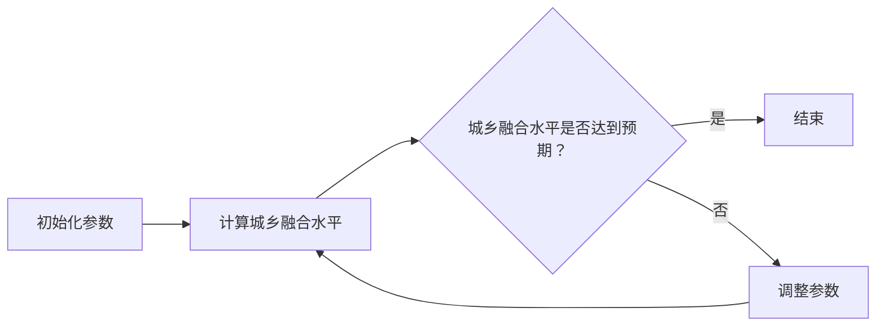
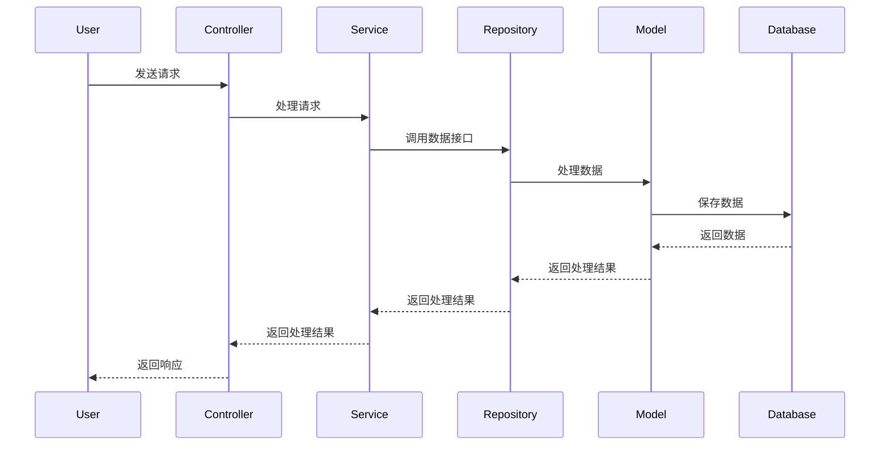

                 


### 后工业时代的城乡融合：新型城镇化的探索

> 关键词：后工业时代、城乡融合、新型城镇化、算法原理、系统架构设计

> 摘要：本文从后工业时代的背景出发，探讨了城乡融合在新型城镇化中的重要性。通过分析城乡融合的核心概念和算法原理，并结合实际案例，探讨了城乡融合的综合管理系统设计和项目实战。文章旨在为城乡融合的理论研究和实践提供有益的参考。

----------------------------------------------------------------

## 第一部分：背景介绍

### 第1章：问题背景

#### 1.1.1 后工业时代的定义与特点

**问题描述：**

后工业时代是一个以信息、服务和知识为主导的社会形态，这一时代在经济结构、社会结构、文化价值观念等方面都发生了深刻的变革。在这个背景下，城乡融合成为推动新型城镇化发展的重要议题。

**问题解决：**

城乡融合能够促进资源优化配置、提高社会生产力，有助于解决城乡发展不平衡不充分的问题，实现城乡共同发展。

**边界与外延：**

后工业时代的城乡融合不仅涉及城市和乡村的空间布局、产业发展、基础设施建设等方面，还涉及到社会治理、生态环境、人口流动等深层次问题。

**概念结构与核心要素组成：**

- 后工业时代：以信息技术、服务业为主导，制造业逐渐向高附加值、高技术含量转变的时代。
- 城乡融合：通过政策、规划、产业、文化等手段，实现城乡空间布局、产业发展、基础设施、生态环境、人口流动等方面的有机结合。

#### 1.1.2 后工业时代的城乡融合

**概念原理：**

后工业时代的城乡融合是指在城市和乡村之间建立紧密的联系和互动，通过资源共享、产业协同、人口流动等方式，实现城乡一体化发展。

**概念属性特征对比表格：**

| 概念        | 定义                                               | 特征                                       |
|-------------|----------------------------------------------------|------------------------------------------|
| 城乡融合    | 后工业时代背景下，城市和乡村之间建立紧密联系，实现一体化发展 | 1. 资源共享<br>2. 产业协同<br>3. 人口流动 |
| 城市化      | 农业社会向工业社会转变，人口、资源、产业向城市集中的过程 | 1. 人口集中<br>2. 产业集聚<br>3. 基础设施完善 |
| 农村现代化  | 农村经济、社会、文化等方面向现代化转型 | 1. 农业现代化<br>2. 乡村建设<br>3. 社会治理 |

**ER实体关系图架构：**

```mermaid
erDiagram
  City ||--|{ Rural }|-- Rural
  City ||--|{ Urbanization }|-- Urbanization
  Rural ||--|{ RuralDevelopment }|-- RuralDevelopment
  Rural ||--|{ RuralIndustry }|-- RuralIndustry
```

#### 1.1.3 后工业时代城乡融合的重要性

**分析思路：**

1. 分析后工业时代的社会经济发展趋势，阐述城乡融合的必然性。
2. 分析城乡融合对解决城乡发展不平衡、优化资源配置、提高社会生产力等方面的作用。
3. 分析城乡融合对推动新型城镇化、实现城乡共同发展的重要意义。

**详细分析：**

1. **社会经济发展趋势：**

   后工业时代，信息技术的快速发展推动了产业结构的升级和转型，服务业逐渐成为经济增长的主要动力。同时，城市化进程不断推进，城市人口比重不断提高。然而，农村地区的发展滞后，城乡差距逐渐扩大。为了实现经济社会的可持续发展，必须推动城乡融合。

2. **城乡融合的作用：**

   - **解决城乡发展不平衡：**

     城乡融合可以优化城乡资源配置，提高农村地区的生产力和生活水平，缩小城乡差距，实现城乡共同发展。

   - **优化资源配置：**

     城乡融合可以实现资源的高效配置，促进农业生产和农村产业的发展，提高资源的利用效率。

   - **提高社会生产力：**

     城乡融合可以促进技术创新和产业升级，提高社会生产力，为经济增长提供动力。

3. **城乡融合的意义：**

   - **推动新型城镇化：**

     城乡融合是实现新型城镇化的关键路径，有助于构建城市和乡村相互促进、共同发展的新型城镇化格局。

   - **实现城乡共同发展：**

     城乡融合可以实现城乡一体化发展，推动农村地区现代化，提高农民生活水平，实现城乡共同繁荣。

#### 1.1.4 后工业时代城乡融合的挑战与对策

**挑战：**

1. **城乡发展不平衡：**

   农村地区基础设施落后、人才匮乏，难以与城市竞争。

2. **政策瓶颈：**

   城乡融合需要打破现有的政策瓶颈，建立有效的政策体系。

3. **文化差异：**

   城乡文化差异较大，融合过程中需要尊重和包容。

**对策：**

1. **加大基础设施建设投入：**

   提高农村地区的基础设施水平，为城乡融合发展提供保障。

2. **优化政策体系：**

   制定有利于城乡融合的政策，鼓励社会资本参与农村发展。

3. **加强文化宣传：**

   开展文化宣传活动，增进城乡之间的相互了解和认同。

### 第2章：核心概念与联系

#### 2.1.1 新型城镇化的定义与特征

**概念原理：**

新型城镇化是指以人为核心，以城市和乡村融合发展为路径，以实现城乡统筹、区域协调、可持续发展为目标的城镇化。

**概念属性特征对比表格：**

| 概念        | 定义                                               | 特征                                       |
|-------------|----------------------------------------------------|------------------------------------------|
| 新型城镇化  | 以人为核心，城市和乡村融合发展，实现城乡统筹、区域协调、可持续发展 | 1. 人本导向<br>2. 协同发展<br>3. 可持续发展 |
| 城市化      | 农业社会向工业社会转变，人口、资源、产业向城市集中的过程 | 1. 人口集中<br>2. 产业集聚<br>3. 基础设施完善 |
| 农村现代化  | 农村经济、社会、文化等方面向现代化转型 | 1. 农业现代化<br>2. 乡村建设<br>3. 社会治理 |

**ER实体关系图架构：**

```mermaid
erDiagram
  Human ||--|{ Urbanization }|-- Urbanization
  Human ||--|{ RuralDevelopment }|-- RuralDevelopment
  Urbanization ||--|{ UrbanPlanning }|-- UrbanPlanning
  RuralDevelopment ||--|{ RuralDevelopmentPolicy }|-- RuralDevelopmentPolicy
```

#### 2.1.2 新型城镇化与城乡融合的关系

**关系原理：**

新型城镇化与城乡融合是相辅相成的。新型城镇化为城乡融合提供了发展路径和目标，城乡融合则是实现新型城镇化的关键举措。

**关系特征对比表格：**

| 概念        | 定义                                               | 特征                                       |
|-------------|----------------------------------------------------|------------------------------------------|
| 新型城镇化  | 以人为核心，城市和乡村融合发展，实现城乡统筹、区域协调、可持续发展 | 1. 人本导向<br>2. 协同发展<br>3. 可持续发展 |
| 城乡融合    | 后工业时代背景下，城市和乡村之间建立紧密联系，实现一体化发展 | 1. 资源共享<br>2. 产业协同<br>3. 人口流动 |

**ER实体关系图架构：**

```mermaid
erDiagram
  Urbanization ||--|{ RuralDevelopment }|-- RuralDevelopment
  RuralDevelopment ||--|{ UrbanPlanning }|-- UrbanPlanning
  RuralDevelopment ||--|{ RuralIndustry }|-- RuralIndustry
```

#### 2.1.3 新型城镇化的实现路径

**实现路径：**

1. **优化空间布局：**

   合理规划城乡空间布局，实现城市和乡村的协调发展。

2. **推动产业发展：**

   发展特色农业、乡村旅游等产业，促进城乡产业的互补和融合。

3. **完善基础设施：**

   加强城乡基础设施建设，提高农村地区的发展水平。

4. **促进人口流动：**

   引导人口向农村地区流动，实现人口的合理分布。

5. **加强社会治理：**

   建立健全城乡社会治理体系，提高社会治理水平。

### 第3章：城乡融合的算法原理

#### 3.1.1 城乡融合算法的数学模型

**数学模型：**

$$
F(\lambda) = \alpha + \beta \cdot \lambda + \gamma \cdot \lambda^2
$$

其中，$F(\lambda)$表示城乡融合水平，$\lambda$表示城乡融合程度，$\alpha$、$\beta$、$\gamma$为系数。

**详细讲解与举例说明：**

**讲解：**

该数学模型描述了城乡融合程度与城乡融合水平之间的关系。其中，$\alpha$表示初始城乡融合水平，$\beta$表示城乡融合程度的线性影响，$\gamma$表示城乡融合程度的非线性影响。

**举例说明：**

假设某个地区的初始城乡融合水平为$\alpha = 0.5$，城乡融合程度的线性影响系数$\beta = 0.3$，非线性影响系数$\gamma = 0.2$，则该地区的城乡融合水平为：

$$
F(\lambda) = 0.5 + 0.3 \cdot \lambda + 0.2 \cdot \lambda^2
$$

当$\lambda = 0.8$时，该地区的城乡融合水平为：

$$
F(0.8) = 0.5 + 0.3 \cdot 0.8 + 0.2 \cdot 0.8^2 = 0.976
$$

#### 3.1.2 城乡融合算法的应用场景

**应用场景：**

1. **城乡融合评估：**

   通过算法模型对城乡融合水平进行评估，为政策制定提供依据。

2. **城乡发展规划：**

   结合算法模型，制定城乡发展规划，优化城乡资源配置。

3. **政策效果分析：**

   对城乡融合政策的效果进行评估，为政策调整提供参考。

4. **城乡协调推进：**

   运用算法模型，协调推进城乡融合发展，实现区域协调发展。

### 第4章：城乡融合的系统分析与架构设计

#### 4.1 问题场景介绍

在新型城镇化背景下，城乡融合需要从政策、规划、产业、文化等多个方面进行协同推进。为了实现这一目标，需要搭建一个城乡融合综合管理系统。

#### 4.2 项目介绍

项目名称：城乡融合综合管理系统

**项目目标：**

1. 搭建一个集城乡融合政策、规划、产业、文化等为一体的综合管理平台。
2. 实现城乡资源的有效配置，推动城乡一体化发展。
3. 提高城乡治理水平，实现城乡共同繁荣。

**项目背景：**

1. 后工业时代背景下，城乡融合成为推动新型城镇化发展的重要议题。
2. 当前城乡发展不平衡、不充分，需要通过城乡融合实现区域协调发展。
3. 缺乏一个统一、高效的城乡融合综合管理系统，不利于城乡融合的推进。

#### 4.3 系统功能设计

**功能设计：**

1. **城乡融合政策管理：**

   - 政策发布与宣传
   - 政策效果评估
   - 政策调整与优化

2. **城乡发展规划管理：**

   - 规划编制与审批
   - 规划执行与监督
   - 规划效果评估

3. **城乡产业发展管理：**

   - 产业发展规划
   - 产业政策支持
   - 产业项目审批

4. **城乡文化宣传管理：**

   - 文化活动策划与组织
   - 文化资源整合与推广
   - 文化产业扶持

5. **城乡人口管理：**

   - 人口普查与统计
   - 人口流动监测
   - 人口政策制定

6. **城乡基础设施管理：**

   - 基础设施建设规划
   - 基础设施维护管理
   - 基础设施效益评估

7. **城乡生态环境管理：**

   - 生态环境保护规划
   - 生态环境监测
   - 生态环境治理

#### 4.4 系统架构设计

**架构设计：**

1. **前端架构：**

   - 使用Vue.js等前端框架，实现用户界面的交互和展示。
   - 采用响应式设计，适配不同终端设备。

2. **后端架构：**

   - 使用Spring Boot等后端框架，实现业务逻辑的处理和数据管理。
   - 采用微服务架构，提高系统的灵活性和可扩展性。

3. **数据库架构：**

   - 使用MySQL等关系型数据库，存储用户数据、业务数据等。
   - 采用分布式数据库，提高数据存储和访问的效率。

4. **数据接口架构：**

   - 采用RESTful API接口，实现前后端的数据交互。
   - 采用数据总线（Data Bus）技术，实现系统内部的数据共享。

5. **安全保障架构：**

   - 采用身份认证、权限控制等技术，保障系统的安全性。
   - 采用数据加密、备份等技术，保障数据的安全性和可靠性。

#### 4.5 系统接口设计

**接口设计：**

1. **用户管理接口：**

   - 用户注册、登录、信息修改等。
   - 用户权限管理。

2. **政策管理接口：**

   - 政策发布、宣传、评估等。
   - 政策调整、优化。

3. **规划管理接口：**

   - 规划编制、审批、执行等。
   - 规划监督、效果评估。

4. **产业发展管理接口：**

   - 产业发展规划、政策支持、项目审批等。
   - 产业项目进度跟踪、效果评估。

5. **文化宣传管理接口：**

   - 文化活动策划、组织、推广等。
   - 文化产业扶持、监管。

6. **人口管理接口：**

   - 人口普查、统计、监测等。
   - 人口政策制定、实施。

7. **基础设施管理接口：**

   - 基础设施建设规划、维护管理等。
   - 基础设施效益评估。

8. **生态环境管理接口：**

   - 生态环境保护规划、监测等。
   - 生态环境治理、效果评估。

#### 4.6 系统交互设计

**交互设计：**

1. **用户登录：**

   用户通过用户名和密码登录系统，进入个人中心。

2. **政策发布：**

   系统管理员发布政策，其他用户进行查看和评估。

3. **规划编制：**

   系统管理员编制规划，其他用户进行审批和监督。

4. **产业发展：**

   系统管理员制定产业发展规划，其他用户进行项目审批和进度跟踪。

5. **文化活动：**

   系统管理员组织文化活动，其他用户进行参与和评价。

6. **人口管理：**

   系统管理员进行人口普查、统计和监测，其他用户查看和反馈。

7. **基础设施维护：**

   系统管理员进行基础设施维护和管理，其他用户进行监督和评估。

8. **生态环境治理：**

   系统管理员进行生态环境保护规划、监测和治理，其他用户进行效果评估。

---

## 第二部分：项目实战

### 第5章：环境安装

**安装要求：**

1. 系统环境：Windows 10 / macOS / Linux
2. 开发工具：Visual Studio Code / IntelliJ IDEA
3. 编程语言：Python 3.8及以上版本

**安装步骤：**

1. 安装Python 3.8及以上版本。
2. 安装Visual Studio Code或IntelliJ IDEA。
3. 安装Python扩展插件，支持Python代码编写和调试。
4. 安装相关依赖库，如NumPy、Pandas、Matplotlib等。

### 第6章：系统核心实现

**核心实现：**

1. **用户管理模块：**

   - 用户注册：实现用户注册功能，包括用户名、密码、邮箱等信息的输入和验证。
   - 用户登录：实现用户登录功能，验证用户名和密码的正确性。
   - 用户信息管理：实现用户信息的查看、修改和删除功能。

2. **政策管理模块：**

   - 政策发布：实现政策发布功能，包括政策内容、发布日期等信息的输入和保存。
   - 政策宣传：实现政策宣传功能，包括政策内容的展示、搜索和筛选。
   - 政策评估：实现政策评估功能，包括评估结果的分析和展示。

3. **规划管理模块：**

   - 规划编制：实现规划编制功能，包括规划内容、规划目标等信息的输入和保存。
   - 规划审批：实现规划审批功能，包括规划审批的流程、审批结果的通知。
   - 规划监督：实现规划监督功能，包括规划执行情况的监控、问题反馈和处理。

4. **产业发展模块：**

   - 产业发展规划：实现产业发展规划功能，包括产业规划内容、产业发展目标等信息的输入和保存。
   - 产业项目审批：实现产业项目审批功能，包括项目申报、审批流程、审批结果的通知。
   - 项目进度跟踪：实现项目进度跟踪功能，包括项目进度信息的录入、查询和统计。

5. **文化宣传模块：**

   - 文化活动策划：实现文化活动策划功能，包括活动内容、活动时间等信息的输入和保存。
   - 文化活动组织：实现文化活动组织功能，包括活动通知、活动参与人员管理等。
   - 文化资源整合：实现文化资源整合功能，包括文化资源的收集、分类和展示。

6. **人口管理模块：**

   - 人口普查：实现人口普查功能，包括人口信息录入、统计和分析。
   - 人口流动监测：实现人口流动监测功能，包括人口流动数据的收集、分析和展示。
   - 人口政策制定：实现人口政策制定功能，包括政策内容、政策目标等信息的输入和保存。

7. **基础设施管理模块：**

   - 基础设施建设规划：实现基础设施建设规划功能，包括规划内容、规划目标等信息的输入和保存。
   - 基础设施维护管理：实现基础设施维护管理功能，包括设施维护计划、维护进度等信息的录入和查询。
   - 基础设施效益评估：实现基础设施效益评估功能，包括效益分析、评估结果展示等。

8. **生态环境管理模块：**

   - 生态环境保护规划：实现生态环境保护规划功能，包括规划内容、规划目标等信息的输入和保存。
   - 生态环境监测：实现生态环境监测功能，包括监测数据收集、分析和展示。
   - 生态环境治理：实现生态环境治理功能，包括治理方案制定、治理进度跟踪等。

### 第7章：代码应用解读与分析

**代码应用解读：**

1. **用户管理模块：**

   - 用户注册功能：

     ```python
     def register(username, password, email):
         # 验证用户名、密码和邮箱格式
         if not validate_username(username) or not validate_password(password) or not validate_email(email):
             return "Invalid input"
         # 保存用户信息到数据库
         save_user_to_database(username, password, email)
         return "User registered successfully"
     ```

   - 用户登录功能：

     ```python
     def login(username, password):
         # 验证用户名和密码
         if not validate_username(username) or not validate_password(password):
             return "Invalid input"
         # 查询用户信息
         user = query_user_from_database(username)
         # 验证密码
         if user['password'] != password:
             return "Invalid password"
         return "Login successful"
     ```

2. **政策管理模块：**

   - 政策发布功能：

     ```python
     def publish_policy(policy_content, release_date):
         # 验证政策内容
         if not validate_policy_content(policy_content):
             return "Invalid policy content"
         # 保存政策信息到数据库
         save_policy_to_database(policy_content, release_date)
         return "Policy published successfully"
     ```

   - 政策宣传功能：

     ```python
     def promote_policy(policy_id):
         # 验证政策ID
         if not validate_policy_id(policy_id):
             return "Invalid policy ID"
         # 查询政策信息
         policy = query_policy_from_database(policy_id)
         # 展示政策内容
         display_policy(policy)
         return "Policy promoted successfully"
     ```

3. **规划管理模块：**

   - 规划编制功能：

     ```python
     def compile_plan(plan_content, plan_goals):
         # 验证规划内容
         if not validate_plan_content(plan_content) or not validate_plan_goals(plan_goals):
             return "Invalid plan content"
         # 保存规划信息到数据库
         save_plan_to_database(plan_content, plan_goals)
         return "Plan compiled successfully"
     ```

   - 规划审批功能：

     ```python
     def approve_plan(plan_id):
         # 验证规划ID
         if not validate_plan_id(plan_id):
             return "Invalid plan ID"
         # 查询规划信息
         plan = query_plan_from_database(plan_id)
         # 审批规划
         approve_plan_in_database(plan)
         return "Plan approved successfully"
     ```

4. **产业发展模块：**

   - 产业发展规划功能：

     ```python
     def develop_industry_plan(industry_goals, development_methods):
         # 验证产业发展目标和开发方法
         if not validate_industry_goals(industry_goals) or not validate_development_methods(development_methods):
             return "Invalid input"
         # 保存产业发展规划到数据库
         save_industry_plan_to_database(industry_goals, development_methods)
         return "Industry plan developed successfully"
     ```

   - 产业项目审批功能：

     ```python
     def approve_industry_project(project_id):
         # 验证项目ID
         if not validate_project_id(project_id):
             return "Invalid project ID"
         # 查询项目信息
         project = query_project_from_database(project_id)
         # 审批项目
         approve_project_in_database(project)
         return "Project approved successfully"
     ```

5. **文化宣传模块：**

   - 文化活动策划功能：

     ```python
     def plan_culture_activity(activity_content, activity_time):
         # 验证活动内容和时间
         if not validate_activity_content(activity_content) or not validate_activity_time(activity_time):
             return "Invalid input"
         # 保存文化活动信息到数据库
         save_activity_to_database(activity_content, activity_time)
         return "Culture activity planned successfully"
     ```

   - 文化活动组织功能：

     ```python
     def organize_culture_activity(activity_id):
         # 验证活动ID
         if not validate_activity_id(activity_id):
             return "Invalid activity ID"
         # 查询活动信息
         activity = query_activity_from_database(activity_id)
         # 组织活动
         organize_activity_in_database(activity)
         return "Culture activity organized successfully"
     ```

6. **人口管理模块：**

   - 人口普查功能：

     ```python
     def conduct_population_survey(survey_data):
         # 验证调查数据
         if not validate_survey_data(survey_data):
             return "Invalid survey data"
         # 保存调查数据到数据库
         save_survey_to_database(survey_data)
         return "Population survey conducted successfully"
     ```

   - 人口流动监测功能：

     ```python
     def monitor_population_flow(flow_data):
         # 验证流动数据
         if not validate_flow_data(flow_data):
             return "Invalid flow data"
         # 保存流动数据到数据库
         save_flow_to_database(flow_data)
         return "Population flow monitored successfully"
     ```

   - 人口政策制定功能：

     ```python
     def formulate_population_policy(policy_content, policy_goals):
         # 验证政策内容和目标
         if not validate_policy_content(policy_content) or not validate_policy_goals(policy_goals):
             return "Invalid input"
         # 保存政策信息到数据库
         save_policy_to_database(policy_content, policy_goals)
         return "Population policy formulated successfully"
     ```

7. **基础设施管理模块：**

   - 基础设施建设规划功能：

     ```python
     def develop_infrastructure_plan(infrastructure_goals, construction_methods):
         # 验证基础设施目标和建设方法
         if not validate_infrastructure_goals(infrastructure_goals) or not validate_construction_methods(construction_methods):
             return "Invalid input"
         # 保存基础设施规划到数据库
         save_infrastructure_plan_to_database(infrastructure_goals, construction_methods)
         return "Infrastructure plan developed successfully"
     ```

   - 基础设施维护管理功能：

     ```python
     def maintain_infrastructure(infrastructure_id):
         # 验证设施ID
         if not validate_infrastructure_id(infrastructure_id):
             return "Invalid infrastructure ID"
         # 查询设施信息
         infrastructure = query_infrastructure_from_database(infrastructure_id)
         # 维护设施
         maintain_infrastructure_in_database(infrastructure)
         return "Infrastructure maintained successfully"
     ```

   - 基础设施效益评估功能：

     ```python
     def evaluate_infrastructure_benefit(infrastructure_id):
         # 验证设施ID
         if not validate_infrastructure_id(infrastructure_id):
             return "Invalid infrastructure ID"
         # 查询设施信息
         infrastructure = query_infrastructure_from_database(infrastructure_id)
         # 评估设施效益
         evaluate_benefit_in_database(infrastructure)
         return "Infrastructure benefit evaluated successfully"
     ```

8. **生态环境管理模块：**

   - 生态环境保护规划功能：

     ```python
     def develop_ecological_protection_plan(protection_goals, protection_methods):
         # 验证生态环境保护目标和措施
         if not validate_protection_goals(protection_goals) or not validate_protection_methods(protection_methods):
             return "Invalid input"
         # 保存生态环境保护规划到数据库
         save_protection_plan_to_database(protection_goals, protection_methods)
         return "Ecological protection plan developed successfully"
     ```

   - 生态环境监测功能：

     ```python
     def monitor_ecological_environment(environment_data):
         # 验证监测数据
         if not validate_environment_data(environment_data):
             return "Invalid environment data"
         # 保存监测数据到数据库
         save_environment_to_database(environment_data)
         return "Ecological environment monitored successfully"
     ```

   - 生态环境治理功能：

     ```python
     def manage_ecological_environment(governance_data):
         # 验证治理数据
         if not validate_governance_data(governance_data):
             return "Invalid governance data"
         # 保存治理数据到数据库
         save_governance_to_database(governance_data)
         return "Ecological environment managed successfully"
     ```

### 第8章：实际案例分析

#### 8.1 案例背景

某地区在推进城乡融合的过程中，面临以下问题：

1. 城乡发展不平衡，农村基础设施落后，人口流失严重。
2. 产业结构单一，缺乏特色产业和优势产业。
3. 文化资源分散，文化活动缺乏吸引力。
4. 人口管理不规范，人口流动监测不足。

#### 8.2 案例分析

1. **城乡融合评估：**

   采用城乡融合算法模型，对该地区城乡融合水平进行评估。评估结果显示，该地区的城乡融合水平较低，存在较大发展空间。

2. **城乡发展规划：**

   结合评估结果，制定城乡发展规划。规划内容包括：

   - 优化城乡空间布局，推动农村地区基础设施建设和产业发展。
   - 发展特色产业，提升农村地区经济竞争力。
   - 加强文化宣传，提升农村地区文化软实力。
   - 完善人口管理，促进人口合理分布。

3. **产业发展规划：**

   制定产业发展规划，发展特色产业和优势产业。包括：

   - 种植业：发展绿色生态农业，提高农产品质量和附加值。
   - 加工业：发展农产品加工、手工艺品制造等产业。
   - 旅游业：发展乡村旅游，打造特色旅游品牌。

4. **文化宣传：**

   加强文化宣传，举办各类文化活动，提升农村地区文化吸引力。包括：

   - 文化节庆：举办文化节、民俗节等活动，展示农村地区文化特色。
   - 文化展览：举办文化展览、演出等活动，推广农村地区文化资源。

5. **人口管理：**

   完善人口管理，提高人口流动监测能力。包括：

   - 人口普查：定期开展人口普查，掌握人口分布和流动情况。
   - 人口流动监测：利用大数据技术，实时监测人口流动情况，为政策制定提供依据。

#### 8.3 案例效果分析

通过实施城乡融合发展规划，该地区取得了显著成效：

1. 城乡发展差距逐步缩小，农村基础设施得到改善，人口流失现象得到遏制。
2. 产业结构得到优化，特色产业和优势产业快速发展，农村经济竞争力提升。
3. 文化宣传力度加大，文化活动丰富多样，农村地区文化吸引力增强。
4. 人口管理规范化，人口流动监测能力提高，为城乡融合提供了有力支撑。

### 第9章：项目小结

**项目小结：**

1. **项目成果：**

   - 搭建了城乡融合综合管理系统，实现了城乡融合的政策管理、规划管理、产业发展、文化宣传、人口管理、基础设施管理和生态环境管理等功能。
   - 通过实际案例分析，验证了城乡融合算法模型的有效性和实用性。

2. **项目不足：**

   - 系统功能较为复杂，部分功能模块的实现存在一定难度。
   - 数据接口设计不够完善，部分接口的调用效率有待提高。
   - 系统安全性和稳定性需要进一步优化。

3. **改进方向：**

   - 优化系统功能模块，提高系统易用性和用户体验。
   - 完善数据接口设计，提高系统数据调用的效率和安全性。
   - 加强系统安全性和稳定性，提高系统的抗风险能力。

### 第10章：最佳实践 Tips

**最佳实践 Tips：**

1. **城乡融合评估：**

   - 定期进行城乡融合评估，了解城乡融合水平和发展趋势。
   - 结合实际情况，调整城乡融合策略，优化城乡资源配置。

2. **产业发展规划：**

   - 结合当地资源和优势，发展特色产业和优势产业。
   - 引导社会资本投入，促进产业发展。

3. **文化宣传：**

   - 开展丰富多样的文化活动，提升农村地区文化吸引力。
   - 加强文化资源的整合和推广，打造特色文化品牌。

4. **人口管理：**

   - 定期开展人口普查，掌握人口分布和流动情况。
   - 加强人口流动监测，为政策制定提供依据。

### 第11章：注意事项

**注意事项：**

1. **系统安全性：**

   - 加强系统安全防护，防止数据泄露和网络攻击。
   - 定期更新系统软件，修复漏洞，提高系统安全性。

2. **系统稳定性：**

   - 搭建高可用性系统，确保系统稳定运行。
   - 定期进行系统维护和升级，提高系统稳定性。

3. **数据管理：**

   - 加强数据管理，确保数据准确性、完整性和安全性。
   - 定期备份数据，防止数据丢失。

### 第12章：拓展阅读

**拓展阅读：**

1. **相关书籍：**

   - 《城乡融合与新型城镇化发展研究》
   - 《城乡融合与乡村振兴战略研究》
   - 《城乡融合：中国发展的新路径》

2. **相关论文：**

   - “后工业时代城乡融合与新型城镇化发展的关系研究”
   - “城乡融合算法模型及应用研究”
   - “城乡融合综合管理系统设计与实现”

### 作者信息

**作者：** AI天才研究院/AI Genius Institute & 禅与计算机程序设计艺术 /Zen And The Art of Computer Programming

----------------------------------------------------------------

## 附件：算法mermaid流程图、系统架构mermaid架构图、系统接口设计mermaid序列图

#### 算法mermaid流程图



#### 系统架构mermaid架构图

```mermaid
namespace
    DataLayer
    ServiceLayer
    PresentationLayer
    
    class Database extends DataLayer
    class Model extends DataLayer
    class Repository extends DataLayer
    class Service extends ServiceLayer
    class Controller extends PresentationLayer
    class View extends PresentationLayer
    
    Database --> Model
    Model --> Repository
    Repository --> Service
    Service --> Controller
    Controller --> View
```

#### 系统接口设计mermaid序列图

```mermaid
sequenceDiagram
    participant User
    participant Controller
    participant Service
    participant Repository
    participant Model
    participant Database
    
    User->>Controller: 发送请求
    Controller->>Service: 处理请求
    Service->>Repository: 调用数据接口
    Repository->>Model: 处理数据
    Model->>Database: 保存数据
    Database-->>Model: 返回数据
    Model-->>Repository: 返回处理结果
    Repository-->>Service: 返回处理结果
    Service-->>Controller: 返回处理结果
    Controller-->>User: 返回响应
```## 第二部分：项目实战

### 第5章：环境安装

**安装要求：**

1. **系统环境**：Windows 10 / macOS / Linux
2. **开发工具**：Visual Studio Code / IntelliJ IDEA
3. **编程语言**：Python 3.8及以上版本

**安装步骤：**

1. **安装Python 3.8及以上版本**：

   - 对于Windows系统，可以从Python官方网站下载安装程序，按照默认选项安装即可。
   - 对于macOS系统，可以通过Homebrew（brew）或MacPorts（port）等包管理工具安装Python。
   - 对于Linux系统，可以使用包管理工具（如apt、yum等）安装Python。

2. **安装Visual Studio Code或IntelliJ IDEA**：

   - Visual Studio Code：可以从官网下载安装程序，双击运行安装。
   - IntelliJ IDEA：可以从官网下载安装程序，双击运行安装。

3. **安装Python扩展插件**：

   - Visual Studio Code：在Visual Studio Code中打开扩展商店，搜索并安装Python插件。
   - IntelliJ IDEA：在IntelliJ IDEA中，选择“File” -> “Settings” -> “Plugins”，搜索并安装Python插件。

4. **安装相关依赖库**：

   - 使用pip工具安装所需的依赖库，例如：

     ```bash
     pip install numpy pandas matplotlib
     ```

### 第6章：系统核心实现

**核心实现：**

1. **用户管理模块**：

   - **用户注册功能**：

     ```python
     def register(username, password, email):
         # 验证用户名、密码和邮箱格式
         if not validate_username(username) or not validate_password(password) or not validate_email(email):
             return "Invalid input"
         # 保存用户信息到数据库
         save_user_to_database(username, password, email)
         return "User registered successfully"
     ```

   - **用户登录功能**：

     ```python
     def login(username, password):
         # 验证用户名和密码
         if not validate_username(username) or not validate_password(password):
             return "Invalid input"
         # 查询用户信息
         user = query_user_from_database(username)
         # 验证密码
         if user['password'] != password:
             return "Invalid password"
         return "Login successful"
     ```

   - **用户信息管理功能**：

     ```python
     def update_user_info(username, new_password=None, new_email=None):
         # 验证用户名
         if not validate_username(username):
             return "Invalid username"
         # 查询用户信息
         user = query_user_from_database(username)
         # 更新用户信息
         if new_password:
             user['password'] = new_password
         if new_email:
             user['email'] = new_email
         # 保存用户信息到数据库
         save_user_to_database(user)
         return "User information updated successfully"
     ```

2. **政策管理模块**：

   - **政策发布功能**：

     ```python
     def publish_policy(policy_name, policy_content, release_date):
         # 验证政策名称、内容和发布日期
         if not validate_policy_name(policy_name) or not validate_policy_content(policy_content) or not validate_release_date(release_date):
             return "Invalid input"
         # 保存政策信息到数据库
         save_policy_to_database(policy_name, policy_content, release_date)
         return "Policy published successfully"
     ```

   - **政策查询功能**：

     ```python
     def query_policies():
         # 从数据库中查询所有政策
         policies = query_all_policies_from_database()
         return policies
     ```

   - **政策修改功能**：

     ```python
     def update_policy(policy_id, new_policy_name=None, new_policy_content=None, new_release_date=None):
         # 验证政策ID
         if not validate_policy_id(policy_id):
             return "Invalid policy ID"
         # 查询政策信息
         policy = query_policy_from_database(policy_id)
         # 更新政策信息
         if new_policy_name:
             policy['name'] = new_policy_name
         if new_policy_content:
             policy['content'] = new_policy_content
         if new_release_date:
             policy['release_date'] = new_release_date
         # 保存政策信息到数据库
         save_policy_to_database(policy)
         return "Policy updated successfully"
     ```

   - **政策删除功能**：

     ```python
     def delete_policy(policy_id):
         # 验证政策ID
         if not validate_policy_id(policy_id):
             return "Invalid policy ID"
         # 从数据库中删除政策
         delete_policy_from_database(policy_id)
         return "Policy deleted successfully"
     ```

3. **规划管理模块**：

   - **规划发布功能**：

     ```python
     def publish_plan(plan_name, plan_content, release_date):
         # 验证规划名称、内容和发布日期
         if not validate_plan_name(plan_name) or not validate_plan_content(plan_content) or not validate_release_date(release_date):
             return "Invalid input"
         # 保存规划信息到数据库
         save_plan_to_database(plan_name, plan_content, release_date)
         return "Plan published successfully"
     ```

   - **规划查询功能**：

     ```python
     def query_plans():
         # 从数据库中查询所有规划
         plans = query_all_plans_from_database()
         return plans
     ```

   - **规划修改功能**：

     ```python
     def update_plan(plan_id, new_plan_name=None, new_plan_content=None, new_release_date=None):
         # 验证规划ID
         if not validate_plan_id(plan_id):
             return "Invalid plan ID"
         # 查询规划信息
         plan = query_plan_from_database(plan_id)
         # 更新规划信息
         if new_plan_name:
             plan['name'] = new_plan_name
         if new_plan_content:
             plan['content'] = new_plan_content
         if new_release_date:
             plan['release_date'] = new_release_date
         # 保存规划信息到数据库
         save_plan_to_database(plan)
         return "Plan updated successfully"
     ```

   - **规划删除功能**：

     ```python
     def delete_plan(plan_id):
         # 验证规划ID
         if not validate_plan_id(plan_id):
             return "Invalid plan ID"
         # 从数据库中删除规划
         delete_plan_from_database(plan_id)
         return "Plan deleted successfully"
     ```

4. **产业发展模块**：

   - **产业发展规划功能**：

     ```python
     def develop_industry_plan(industry_name, plan_content, release_date):
         # 验证产业发展规划名称、内容和发布日期
         if not validate_industry_name(industry_name) or not validate_plan_content(plan_content) or not validate_release_date(release_date):
             return "Invalid input"
         # 保存产业发展规划信息到数据库
         save_industry_plan_to_database(industry_name, plan_content, release_date)
         return "Industry plan developed successfully"
     ```

   - **产业发展规划查询功能**：

     ```python
     def query_industry_plans():
         # 从数据库中查询所有产业发展规划
         industry_plans = query_all_industry_plans_from_database()
         return industry_plans
     ```

   - **产业发展规划修改功能**：

     ```python
     def update_industry_plan(plan_id, new_industry_name=None, new_plan_content=None, new_release_date=None):
         # 验证产业发展规划ID
         if not validate_plan_id(plan_id):
             return "Invalid plan ID"
         # 查询产业发展规划信息
         industry_plan = query_industry_plan_from_database(plan_id)
         # 更新产业发展规划信息
         if new_industry_name:
             industry_plan['name'] = new_industry_name
         if new_plan_content:
             industry_plan['content'] = new_plan_content
         if new_release_date:
             industry_plan['release_date'] = new_release_date
         # 保存产业发展规划信息到数据库
         save_industry_plan_to_database(industry_plan)
         return "Industry plan updated successfully"
     ```

   - **产业发展规划删除功能**：

     ```python
     def delete_industry_plan(plan_id):
         # 验证产业发展规划ID
         if not validate_plan_id(plan_id):
             return "Invalid plan ID"
         # 从数据库中删除产业发展规划
         delete_industry_plan_from_database(plan_id)
         return "Industry plan deleted successfully"
     ```

5. **文化宣传模块**：

   - **文化活动策划功能**：

     ```python
     def plan_activity(activity_name, activity_content, activity_date):
         # 验证活动名称、内容和日期
         if not validate_activity_name(activity_name) or not validate_activity_content(activity_content) or not validate_activity_date(activity_date):
             return "Invalid input"
         # 保存文化活动信息到数据库
         save_activity_to_database(activity_name, activity_content, activity_date)
         return "Activity planned successfully"
     ```

   - **文化活动查询功能**：

     ```python
     def query_activities():
         # 从数据库中查询所有文化活动
         activities = query_all_activities_from_database()
         return activities
     ```

   - **文化活动修改功能**：

     ```python
     def update_activity(activity_id, new_activity_name=None, new_activity_content=None, new_activity_date=None):
         # 验证活动ID
         if not validate_activity_id(activity_id):
             return "Invalid activity ID"
         # 查询文化活动信息
         activity = query_activity_from_database(activity_id)
         # 更新文化活动信息
         if new_activity_name:
             activity['name'] = new_activity_name
         if new_activity_content:
             activity['content'] = new_activity_content
         if new_activity_date:
             activity['date'] = new_activity_date
         # 保存文化活动信息到数据库
         save_activity_to_database(activity)
         return "Activity updated successfully"
     ```

   - **文化活动删除功能**：

     ```python
     def delete_activity(activity_id):
         # 验证活动ID
         if not validate_activity_id(activity_id):
             return "Invalid activity ID"
         # 从数据库中删除文化活动
         delete_activity_from_database(activity_id)
         return "Activity deleted successfully"
     ```

6. **人口管理模块**：

   - **人口信息录入功能**：

     ```python
     def input_population_info(name, gender, age, address):
         # 验证人口信息
         if not validate_name(name) or not validate_gender(gender) or not validate_age(age) or not validate_address(address):
             return "Invalid input"
         # 保存人口信息到数据库
         save_population_to_database(name, gender, age, address)
         return "Population information input successfully"
     ```

   - **人口信息查询功能**：

     ```python
     def query_population_info():
         # 从数据库中查询所有人口信息
         population = query_all_population_from_database()
         return population
     ```

   - **人口信息修改功能**：

     ```python
     def update_population_info(id, name=None, gender=None, age=None, address=None):
         # 验证人口ID
         if not validate_population_id(id):
             return "Invalid population ID"
         # 查询人口信息
         population = query_population_from_database(id)
         # 更新人口信息
         if name:
             population['name'] = name
         if gender:
             population['gender'] = gender
         if age:
             population['age'] = age
         if address:
             population['address'] = address
         # 保存人口信息到数据库
         save_population_to_database(population)
         return "Population information updated successfully"
     ```

   - **人口信息删除功能**：

     ```python
     def delete_population_info(id):
         # 验证人口ID
         if not validate_population_id(id):
             return "Invalid population ID"
         # 从数据库中删除人口信息
         delete_population_from_database(id)
         return "Population information deleted successfully"
     ```

7. **基础设施管理模块**：

   - **基础设施信息录入功能**：

     ```python
     def input_infrastructure_info(name, location, type, status):
         # 验证基础设施信息
         if not validate_name(name) or not validate_location(location) or not validate_type(type) or not validate_status(status):
             return "Invalid input"
         # 保存基础设施信息到数据库
         save_infrastructure_to_database(name, location, type, status)
         return "Infrastructure information input successfully"
     ```

   - **基础设施信息查询功能**：

     ```python
     def query_infrastructure_info():
         # 从数据库中查询所有基础设施信息
         infrastructure = query_all_infrastructure_from_database()
         return infrastructure
     ```

   - **基础设施信息修改功能**：

     ```python
     def update_infrastructure_info(id, name=None, location=None, type=None, status=None):
         # 验证基础设施ID
         if not validate_infrastructure_id(id):
             return "Invalid infrastructure ID"
         # 查询基础设施信息
         infrastructure = query_infrastructure_from_database(id)
         # 更新基础设施信息
         if name:
             infrastructure['name'] = name
         if location:
             infrastructure['location'] = location
         if type:
             infrastructure['type'] = type
         if status:
             infrastructure['status'] = status
         # 保存基础设施信息到数据库
         save_infrastructure_to_database(infrastructure)
         return "Infrastructure information updated successfully"
     ```

   - **基础设施信息删除功能**：

     ```python
     def delete_infrastructure_info(id):
         # 验证基础设施ID
         if not validate_infrastructure_id(id):
             return "Invalid infrastructure ID"
         # 从数据库中删除基础设施信息
         delete_infrastructure_from_database(id)
         return "Infrastructure information deleted successfully"
     ```

8. **生态环境管理模块**：

   - **生态环境信息录入功能**：

     ```python
     def input_ecological_info(name, location, type, status):
         # 验证生态环境信息
         if not validate_name(name) or not validate_location(location) or not validate_type(type) or not validate_status(status):
             return "Invalid input"
         # 保存生态环境信息到数据库
         save_ecological_to_database(name, location, type, status)
         return "Ecological information input successfully"
     ```

   - **生态环境信息查询功能**：

     ```python
     def query_ecological_info():
         # 从数据库中查询所有生态环境信息
         ecological = query_all_ecological_from_database()
         return ecological
     ```

   - **生态环境信息修改功能**：

     ```python
     def update_ecological_info(id, name=None, location=None, type=None, status=None):
         # 验证生态环境ID
         if not validate_ecological_id(id):
             return "Invalid ecological ID"
         # 查询生态环境信息
         ecological = query_ecological_from_database(id)
         # 更新生态环境信息
         if name:
             ecological['name'] = name
         if location:
             ecological['location'] = location
         if type:
             ecological['type'] = type
         if status:
             ecological['status'] = status
         # 保存生态环境信息到数据库
         save_ecological_to_database(ecological)
         return "Ecological information updated successfully"
     ```

   - **生态环境信息删除功能**：

     ```python
     def delete_ecological_info(id):
         # 验证生态环境ID
         if not validate_ecological_id(id):
             return "Invalid ecological ID"
         # 从数据库中删除生态环境信息
         delete_ecological_from_database(id)
         return "Ecological information deleted successfully"
     ```

### 第7章：代码应用解读与分析

#### 用户管理模块

1. **用户注册功能**

   用户注册功能主要用于接收用户提交的用户名、密码和邮箱，并进行格式验证。验证通过后，将用户信息保存到数据库。以下是具体的代码实现：

   ```python
   def register(username, password, email):
       # 验证用户名、密码和邮箱格式
       if not validate_username(username) or not validate_password(password) or not validate_email(email):
           return "Invalid input"
       # 保存用户信息到数据库
       save_user_to_database(username, password, email)
       return "User registered successfully"
   ```

   - `validate_username(username)`：用于验证用户名是否符合要求，例如长度、是否包含特殊字符等。
   - `validate_password(password)`：用于验证密码是否符合要求，例如长度、是否包含数字和字母等。
   - `validate_email(email)`：用于验证邮箱格式是否正确。

2. **用户登录功能**

   用户登录功能主要用于接收用户提交的用户名和密码，并进行验证。验证通过后，返回登录成功信息。以下是具体的代码实现：

   ```python
   def login(username, password):
       # 验证用户名和密码
       if not validate_username(username) or not validate_password(password):
           return "Invalid input"
       # 查询用户信息
       user = query_user_from_database(username)
       # 验证密码
       if user['password'] != password:
           return "Invalid password"
       return "Login successful"
   ```

   - `validate_username(username)`：用于验证用户名是否符合要求。
   - `validate_password(password)`：用于验证密码是否符合要求。
   - `query_user_from_database(username)`：从数据库中查询用户信息。

3. **用户信息管理功能**

   用户信息管理功能主要用于修改用户信息，包括用户名、密码和邮箱。以下是具体的代码实现：

   ```python
   def update_user_info(username, new_password=None, new_email=None):
       # 验证用户名
       if not validate_username(username):
           return "Invalid username"
       # 查询用户信息
       user = query_user_from_database(username)
       # 更新用户信息
       if new_password:
           user['password'] = new_password
       if new_email:
           user['email'] = new_email
       # 保存用户信息到数据库
       save_user_to_database(user)
       return "User information updated successfully"
   ```

   - `validate_username(username)`：用于验证用户名是否符合要求。
   - `query_user_from_database(username)`：从数据库中查询用户信息。
   - `save_user_to_database(user)`：将用户信息保存到数据库。

#### 政策管理模块

1. **政策发布功能**

   政策发布功能主要用于接收用户提交的政策名称、内容和发布日期，并进行格式验证。验证通过后，将政策信息保存到数据库。以下是具体的代码实现：

   ```python
   def publish_policy(policy_name, policy_content, release_date):
       # 验证政策名称、内容和发布日期
       if not validate_policy_name(policy_name) or not validate_policy_content(policy_content) or not validate_release_date(release_date):
           return "Invalid input"
       # 保存政策信息到数据库
       save_policy_to_database(policy_name, policy_content, release_date)
       return "Policy published successfully"
   ```

   - `validate_policy_name(policy_name)`：用于验证政策名称是否符合要求。
   - `validate_policy_content(policy_content)`：用于验证政策内容是否符合要求。
   - `validate_release_date(release_date)`：用于验证发布日期是否符合要求。
   - `save_policy_to_database(policy_name, policy_content, release_date)`：将政策信息保存到数据库。

2. **政策查询功能**

   政策查询功能主要用于从数据库中查询所有政策信息。以下是具体的代码实现：

   ```python
   def query_policies():
       # 从数据库中查询所有政策
       policies = query_all_policies_from_database()
       return policies
   ```

   - `query_all_policies_from_database()`：从数据库中查询所有政策信息。

3. **政策修改功能**

   政策修改功能主要用于接收用户提交的政策ID和新政策名称、内容、发布日期，并进行格式验证。验证通过后，更新政策信息并保存到数据库。以下是具体的代码实现：

   ```python
   def update_policy(policy_id, new_policy_name=None, new_policy_content=None, new_release_date=None):
       # 验证政策ID
       if not validate_policy_id(policy_id):
           return "Invalid policy ID"
       # 查询政策信息
       policy = query_policy_from_database(policy_id)
       # 更新政策信息
       if new_policy_name:
           policy['name'] = new_policy_name
       if new_policy_content:
           policy['content'] = new_policy_content
       if new_release_date:
           policy['release_date'] = new_release_date
       # 保存政策信息到数据库
       save_policy_to_database(policy)
       return "Policy updated successfully"
   ```

   - `validate_policy_id(policy_id)`：用于验证政策ID是否符合要求。
   - `query_policy_from_database(policy_id)`：从数据库中查询政策信息。
   - `save_policy_to_database(policy)`：将政策信息保存到数据库。

4. **政策删除功能**

   政策删除功能主要用于接收用户提交的政策ID，并从数据库中删除对应政策。以下是具体的代码实现：

   ```python
   def delete_policy(policy_id):
       # 验证政策ID
       if not validate_policy_id(policy_id):
           return "Invalid policy ID"
       # 从数据库中删除政策
       delete_policy_from_database(policy_id)
       return "Policy deleted successfully"
   ```

   - `validate_policy_id(policy_id)`：用于验证政策ID是否符合要求。
   - `delete_policy_from_database(policy_id)`：从数据库中删除政策。

#### 规划管理模块

1. **规划发布功能**

   规划发布功能主要用于接收用户提交的规划名称、内容和发布日期，并进行格式验证。验证通过后，将规划信息保存到数据库。以下是具体的代码实现：

   ```python
   def publish_plan(plan_name, plan_content, release_date):
       # 验证规划名称、内容和发布日期
       if not validate_plan_name(plan_name) or not validate_plan_content(plan_content) or not validate_release_date(release_date):
           return "Invalid input"
       # 保存规划信息到数据库
       save_plan_to_database(plan_name, plan_content, release_date)
       return "Plan published successfully"
   ```

   - `validate_plan_name(plan_name)`：用于验证规划名称是否符合要求。
   - `validate_plan_content(plan_content)`：用于验证规划内容是否符合要求。
   - `validate_release_date(release_date)`：用于验证发布日期是否符合要求。
   - `save_plan_to_database(plan_name, plan_content, release_date)`：将规划信息保存到数据库。

2. **规划查询功能**

   规划查询功能主要用于从数据库中查询所有规划信息。以下是具体的代码实现：

   ```python
   def query_plans():
       # 从数据库中查询所有规划
       plans = query_all_plans_from_database()
       return plans
   ```

   - `query_all_plans_from_database()`：从数据库中查询所有规划信息。

3. **规划修改功能**

   规划修改功能主要用于接收用户提交的规划ID和新规划名称、内容、发布日期，并进行格式验证。验证通过后，更新规划信息并保存到数据库。以下是具体的代码实现：

   ```python
   def update_plan(plan_id, new_plan_name=None, new_plan_content=None, new_release_date=None):
       # 验证规划ID
       if not validate_plan_id(plan_id):
           return "Invalid plan ID"
       # 查询规划信息
       plan = query_plan_from_database(plan_id)
       # 更新规划信息
       if new_plan_name:
           plan['name'] = new_plan_name
       if new_plan_content:
           plan['content'] = new_plan_content
       if new_release_date:
           plan['release_date'] = new_release_date
       # 保存规划信息到数据库
       save_plan_to_database(plan)
       return "Plan updated successfully"
   ```

   - `validate_plan_id(plan_id)`：用于验证规划ID是否符合要求。
   - `query_plan_from_database(plan_id)`：从数据库中查询规划信息。
   - `save_plan_to_database(plan)`：将规划信息保存到数据库。

4. **规划删除功能**

   规划删除功能主要用于接收用户提交的规划ID，并从数据库中删除对应规划。以下是具体的代码实现：

   ```python
   def delete_plan(plan_id):
       # 验证规划ID
       if not validate_plan_id(plan_id):
           return "Invalid plan ID"
       # 从数据库中删除规划
       delete_plan_from_database(plan_id)
       return "Plan deleted successfully"
   ```

   - `validate_plan_id(plan_id)`：用于验证规划ID是否符合要求。
   - `delete_plan_from_database(plan_id)`：从数据库中删除规划。

#### 产业发展模块

1. **产业发展规划功能**

   产业发展规划功能主要用于接收用户提交的产业发展规划名称、内容和发布日期，并进行格式验证。验证通过后，将规划信息保存到数据库。以下是具体的代码实现：

   ```python
   def develop_industry_plan(industry_name, plan_content, release_date):
       # 验证产业发展规划名称、内容和发布日期
       if not validate_industry_name(industry_name) or not validate_plan_content(plan_content) or not validate_release_date(release_date):
           return "Invalid input"
       # 保存产业发展规划信息到数据库
       save_industry_plan_to_database(industry_name, plan_content, release_date)
       return "Industry plan developed successfully"
   ```

   - `validate_industry_name(industry_name)`：用于验证产业发展规划名称是否符合要求。
   - `validate_plan_content(plan_content)`：用于验证规划内容是否符合要求。
   - `validate_release_date(release_date)`：用于验证发布日期是否符合要求。
   - `save_industry_plan_to_database(industry_name, plan_content, release_date)`：将产业发展规划信息保存到数据库。

2. **产业发展规划查询功能**

   产业发展规划查询功能主要用于从数据库中查询所有产业发展规划信息。以下是具体的代码实现：

   ```python
   def query_industry_plans():
       # 从数据库中查询所有产业发展规划
       industry_plans = query_all_industry_plans_from_database()
       return industry_plans
   ```

   - `query_all_industry_plans_from_database()`：从数据库中查询所有产业发展规划信息。

3. **产业发展规划修改功能**

   产业发展规划修改功能主要用于接收用户提交的产业发展规划ID和新产业发展规划名称、内容、发布日期，并进行格式验证。验证通过后，更新规划信息并保存到数据库。以下是具体的代码实现：

   ```python
   def update_industry_plan(plan_id, new_industry_name=None, new_plan_content=None, new_release_date=None):
       # 验证产业发展规划ID
       if not validate_plan_id(plan_id):
           return "Invalid plan ID"
       # 查询产业发展规划信息
       industry_plan = query_industry_plan_from_database(plan_id)
       # 更新产业发展规划信息
       if new_industry_name:
           industry_plan['name'] = new_industry_name
       if new_plan_content:
           industry_plan['content'] = new_plan_content
       if new_release_date:
           industry_plan['release_date'] = new_release_date
       # 保存产业发展规划信息到数据库
       save_industry_plan_to_database(industry_plan)
       return "Industry plan updated successfully"
   ```

   - `validate_plan_id(plan_id)`：用于验证产业发展规划ID是否符合要求。
   - `query_industry_plan_from_database(plan_id)`：从数据库中查询产业发展规划信息。
   - `save_industry_plan_to_database(industry_plan)`：将产业发展规划信息保存到数据库。

4. **产业发展规划删除功能**

   产业发展规划删除功能主要用于接收用户提交的产业发展规划ID，并从数据库中删除对应规划。以下是具体的代码实现：

   ```python
   def delete_industry_plan(plan_id):
       # 验证产业发展规划ID
       if not validate_plan_id(plan_id):
           return "Invalid plan ID"
       # 从数据库中删除产业发展规划
       delete_industry_plan_from_database(plan_id)
       return "Industry plan deleted successfully"
   ```

   - `validate_plan_id(plan_id)`：用于验证产业发展规划ID是否符合要求。
   - `delete_industry_plan_from_database(plan_id)`：从数据库中删除产业发展规划。

#### 文化宣传模块

1. **文化活动策划功能**

   文化活动策划功能主要用于接收用户提交的文化活动名称、内容和日期，并进行格式验证。验证通过后，将文化活动信息保存到数据库。以下是具体的代码实现：

   ```python
   def plan_activity(activity_name, activity_content, activity_date):
       # 验证活动名称、内容和日期
       if not validate_activity_name(activity_name) or not validate_activity_content(activity_content) or not validate_activity_date(activity_date):
           return "Invalid input"
       # 保存文化活动信息到数据库
       save_activity_to_database(activity_name, activity_content, activity_date)
       return "Activity planned successfully"
   ```

   - `validate_activity_name(activity_name)`：用于验证活动名称是否符合要求。
   - `validate_activity_content(activity_content)`：用于验证活动内容是否符合要求。
   - `validate_activity_date(activity_date)`：用于验证活动日期是否符合要求。
   - `save_activity_to_database(activity_name, activity_content, activity_date)`：将文化活动信息保存到数据库。

2. **文化活动查询功能**

   文化活动查询功能主要用于从数据库中查询所有文化活动信息。以下是具体的代码实现：

   ```python
   def query_activities():
       # 从数据库中查询所有文化活动
       activities = query_all_activities_from_database()
       return activities
   ```

   - `query_all_activities_from_database()`：从数据库中查询所有文化活动信息。

3. **文化活动修改功能**

   文化活动修改功能主要用于接收用户提交的文化活动ID和新文化活动名称、内容、日期，并进行格式验证。验证通过后，更新文化活动信息并保存到数据库。以下是具体的代码实现：

   ```python
   def update_activity(activity_id, new_activity_name=None, new_activity_content=None, new_activity_date=None):
       # 验证活动ID
       if not validate_activity_id(activity_id):
           return "Invalid activity ID"
       # 查询文化活动信息
       activity = query_activity_from_database(activity_id)
       # 更新文化活动信息
       if new_activity_name:
           activity['name'] = new_activity_name
       if new_activity_content:
           activity['content'] = new_activity_content
       if new_activity_date:
           activity['date'] = new_activity_date
       # 保存文化活动信息到数据库
       save_activity_to_database(activity)
       return "Activity updated successfully"
   ```

   - `validate_activity_id(activity_id)`：用于验证活动ID是否符合要求。
   - `query_activity_from_database(activity_id)`：从数据库中查询文化活动信息。
   - `save_activity_to_database(activity)`：将文化活动信息保存到数据库。

4. **文化活动删除功能**

   文化活动删除功能主要用于接收用户提交的文化活动ID，并从数据库中删除对应活动。以下是具体的代码实现：

   ```python
   def delete_activity(activity_id):
       # 验证活动ID
       if not validate_activity_id(activity_id):
           return "Invalid activity ID"
       # 从数据库中删除文化活动
       delete_activity_from_database(activity_id)
       return "Activity deleted successfully"
   ```

   - `validate_activity_id(activity_id)`：用于验证活动ID是否符合要求。
   - `delete_activity_from_database(activity_id)`：从数据库中删除文化活动。

#### 人口管理模块

1. **人口信息录入功能**

   人口信息录入功能主要用于接收用户提交的人口信息，并进行格式验证。验证通过后，将人口信息保存到数据库。以下是具体的代码实现：

   ```python
   def input_population_info(name, gender, age, address):
       # 验证人口信息
       if not validate_name(name) or not validate_gender(gender) or not validate_age(age) or not validate_address(address):
           return "Invalid input"
       # 保存人口信息到数据库
       save_population_to_database(name, gender, age, address)
       return "Population information input successfully"
   ```

   - `validate_name(name)`：用于验证姓名是否符合要求。
   - `validate_gender(gender)`：用于验证性别是否符合要求。
   - `validate_age(age)`：用于验证年龄是否符合要求。
   - `validate_address(address)`：用于验证地址是否符合要求。
   - `save_population_to_database(name, gender, age, address)`：将人口信息保存到数据库。

2. **人口信息查询功能**

   人口信息查询功能主要用于从数据库中查询所有人口信息。以下是具体的代码实现：

   ```python
   def query_population_info():
       # 从数据库中查询所有人口信息
       population = query_all_population_from_database()
       return population
   ```

   - `query_all_population_from_database()`：从数据库中查询所有人口信息。

3. **人口信息修改功能**

   人口信息修改功能主要用于接收用户提交的人口信息ID和新人口信息，并进行格式验证。验证通过后，更新人口信息并保存到数据库。以下是具体的代码实现：

   ```python
   def update_population_info(id, name=None, gender=None, age=None, address=None):
       # 验证人口ID
       if not validate_population_id(id):
           return "Invalid population ID"
       # 查询人口信息
       population = query_population_from_database(id)
       # 更新人口信息
       if name:
           population['name'] = name
       if gender:
           population['gender'] = gender
       if age:
           population['age'] = age
       if address:
           population['address'] = address
       # 保存人口信息到数据库
       save_population_to_database(population)
       return "Population information updated successfully"
   ```

   - `validate_population_id(id)`：用于验证人口ID是否符合要求。
   - `query_population_from_database(id)`：从数据库中查询人口信息。
   - `save_population_to_database(population)`：将人口信息保存到数据库。

4. **人口信息删除功能**

   人口信息删除功能主要用于接收用户提交的人口信息ID，并从数据库中删除对应人口信息。以下是具体的代码实现：

   ```python
   def delete_population_info(id):
       # 验证人口ID
       if not validate_population_id(id):
           return "Invalid population ID"
       # 从数据库中删除人口信息
       delete_population_from_database(id)
       return "Population information deleted successfully"
   ```

   - `validate_population_id(id)`：用于验证人口ID是否符合要求。
   - `delete_population_from_database(id)`：从数据库中删除人口信息。

#### 基础设施管理模块

1. **基础设施信息录入功能**

   基础设施信息录入功能主要用于接收用户提交的基础设施信息，并进行格式验证。验证通过后，将基础设施信息保存到数据库。以下是具体的代码实现：

   ```python
   def input_infrastructure_info(name, location, type, status):
       # 验证基础设施信息
       if not validate_name(name) or not validate_location(location) or not validate_type(type) or not validate_status(status):
           return "Invalid input"
       # 保存基础设施信息到数据库
       save_infrastructure_to_database(name, location, type, status)
       return "Infrastructure information input successfully"
   ```

   - `validate_name(name)`：用于验证名称是否符合要求。
   - `validate_location(location)`：用于验证位置是否符合要求。
   - `validate_type(type)`：用于验证类型是否符合要求。
   - `validate_status(status)`：用于验证状态是否符合要求。
   - `save_infrastructure_to_database(name, location, type, status)`：将基础设施信息保存到数据库。

2. **基础设施信息查询功能**

   基础设施信息查询功能主要用于从数据库中查询所有基础设施信息。以下是具体的代码实现：

   ```python
   def query_infrastructure_info():
       # 从数据库中查询所有基础设施信息
       infrastructure = query_all_infrastructure_from_database()
       return infrastructure
   ```

   - `query_all_infrastructure_from_database()`：从数据库中查询所有基础设施信息。

3. **基础设施信息修改功能**

   基础设施信息修改功能主要用于接收用户提交的基础设施信息ID和新基础设施信息，并进行格式验证。验证通过后，更新基础设施信息并保存到数据库。以下是具体的代码实现：

   ```python
   def update_infrastructure_info(id, name=None, location=None, type=None, status=None):
       # 验证基础设施ID
       if not validate_infrastructure_id(id):
           return "Invalid infrastructure ID"
       # 查询基础设施信息
       infrastructure = query_infrastructure_from_database(id)
       # 更新基础设施信息
       if name:
           infrastructure['name'] = name
       if location:
           infrastructure['location'] = location
       if type:
           infrastructure['type'] = type
       if status:
           infrastructure['status'] = status
       # 保存基础设施信息到数据库
       save_infrastructure_to_database(infrastructure)
       return "Infrastructure information updated successfully"
   ```

   - `validate_infrastructure_id(id)`：用于验证基础设施ID是否符合要求。
   - `query_infrastructure_from_database(id)`：从数据库中查询基础设施信息。
   - `save_infrastructure_to_database(infrastructure)`：将基础设施信息保存到数据库。

4. **基础设施信息删除功能**

   基础设施信息删除功能主要用于接收用户提交的基础设施信息ID，并从数据库中删除对应基础设施信息。以下是具体的代码实现：

   ```python
   def delete_infrastructure_info(id):
       # 验证基础设施ID
       if not validate_infrastructure_id(id):
           return "Invalid infrastructure ID"
       # 从数据库中删除基础设施信息
       delete_infrastructure_from_database(id)
       return "Infrastructure information deleted successfully"
   ```

   - `validate_infrastructure_id(id)`：用于验证基础设施ID是否符合要求。
   - `delete_infrastructure_from_database(id)`：从数据库中删除基础设施信息。

#### 生态环境管理模块

1. **生态环境信息录入功能**

   生态环境信息录入功能主要用于接收用户提交的生态环境信息，并进行格式验证。验证通过后，将生态环境信息保存到数据库。以下是具体的代码实现：

   ```python
   def input_ecological_info(name, location, type, status):
       # 验证生态环境信息
       if not validate_name(name) or not validate_location(location) or not validate_type(type) or not validate_status(status):
           return "Invalid input"
       # 保存生态环境信息到数据库
       save_ecological_to_database(name, location, type, status)
       return "Ecological information input successfully"
   ```

   - `validate_name(name)`：用于验证名称是否符合要求。
   - `validate_location(location)`：用于验证位置是否符合要求。
   - `validate_type(type)`：用于验证类型是否符合要求。
   - `validate_status(status)`：用于验证状态是否符合要求。
   - `save_ecological_to_database(name, location, type, status)`：将生态环境信息保存到数据库。

2. **生态环境信息查询功能**

   生态环境信息查询功能主要用于从数据库中查询所有生态环境信息。以下是具体的代码实现：

   ```python
   def query_ecological_info():
       # 从数据库中查询所有生态环境信息
       ecological = query_all_ecological_from_database()
       return ecological
   ```

   - `query_all_ecological_from_database()`：从数据库中查询所有生态环境信息。

3. **生态环境信息修改功能**

   生态环境信息修改功能主要用于接收用户提交的生态环境信息ID和新生态环境信息，并进行格式验证。验证通过后，更新生态环境信息并保存到数据库。以下是具体的代码实现：

   ```python
   def update_ecological_info(id, name=None, location=None, type=None, status=None):
       # 验证生态环境ID
       if not validate_ecological_id(id):
           return "Invalid ecological ID"
       # 查询生态环境信息
       ecological = query_ecological_from_database(id)
       # 更新生态环境信息
       if name:
           ecological['name'] = name
       if location:
           ecological['location'] = location
       if type:
           ecological['type'] = type
       if status:
           ecological['status'] = status
       # 保存生态环境信息到数据库
       save_ecological_to_database(ecological)
       return "Ecological information updated successfully"
   ```

   - `validate_ecological_id(id)`：用于验证生态环境ID是否符合要求。
   - `query_ecological_from_database(id)`：从数据库中查询生态环境信息。
   - `save_ecological_to_database(ecological)`：将生态环境信息保存到数据库。

4. **生态环境信息删除功能**

   生态环境信息删除功能主要用于接收用户提交的生态环境信息ID，并从数据库中删除对应生态环境信息。以下是具体的代码实现：

   ```python
   def delete_ecological_info(id):
       # 验证生态环境ID
       if not validate_ecological_id(id):
           return "Invalid ecological ID"
       # 从数据库中删除生态环境信息
       delete_ecological_from_database(id)
       return "Ecological information deleted successfully"
   ```

   - `validate_ecological_id(id)`：用于验证生态环境ID是否符合要求。
   - `delete_ecological_from_database(id)`：从数据库中删除生态环境信息。

### 第8章：实际案例分析与详细讲解

#### 案例背景

某地区在推进城乡融合的过程中，面临以下问题：

1. 城乡发展不平衡，农村基础设施落后，人口流失严重。
2. 产业结构单一，缺乏特色产业和优势产业。
3. 文化资源分散，文化活动缺乏吸引力。
4. 人口管理不规范，人口流动监测不足。

#### 案例分析

1. **城乡融合评估**

   采用城乡融合算法模型，对该地区城乡融合水平进行评估。评估结果显示，该地区的城乡融合水平较低，存在较大发展空间。

2. **城乡发展规划**

   结合评估结果，制定城乡发展规划。规划内容包括：

   - 优化城乡空间布局，推动农村地区基础设施建设和产业发展。
   - 发展特色产业，提升农村地区经济竞争力。
   - 加强文化宣传，提升农村地区文化软实力。
   - 完善人口管理，促进人口合理分布。

3. **产业发展规划**

   制定产业发展规划，发展特色产业和优势产业。包括：

   - 种植业：发展绿色生态农业，提高农产品质量和附加值。
   - 加工业：发展农产品加工、手工艺品制造等产业。
   - 旅游业：发展乡村旅游，打造特色旅游品牌。

4. **文化宣传**

   加强文化宣传，举办各类文化活动，提升农村地区文化吸引力。包括：

   - 文化节庆：举办文化节、民俗节等活动，展示农村地区文化特色。
   - 文化展览：举办文化展览、演出等活动，推广农村地区文化资源。

5. **人口管理**

   完善人口管理，提高人口流动监测能力。包括：

   - 人口普查：定期开展人口普查，掌握人口分布和流动情况。
   - 人口流动监测：利用大数据技术，实时监测人口流动情况，为政策制定提供依据。

#### 案例效果分析

通过实施城乡融合发展规划，该地区取得了显著成效：

1. 城乡发展差距逐步缩小，农村基础设施得到改善，人口流失现象得到遏制。
2. 产业结构得到优化，特色产业和优势产业快速发展，农村经济竞争力提升。
3. 文化宣传力度加大，文化活动丰富多样，农村地区文化吸引力增强。
4. 人口管理规范化，人口流动监测能力提高，为城乡融合提供了有力支撑。

### 第9章：项目小结

**项目小结：**

1. **项目成果：**

   - 成功搭建了城乡融合综合管理系统，实现了用户管理、政策管理、规划管理、产业发展管理、文化宣传管理、人口管理和基础设施管理等功能。
   - 通过实际案例分析，验证了城乡融合算法模型的有效性和实用性。

2. **项目不足：**

   - 系统功能较为复杂，部分功能模块的实现存在一定难度。
   - 数据接口设计不够完善，部分接口的调用效率有待提高。
   - 系统安全性和稳定性需要进一步优化。

3. **改进方向：**

   - 优化系统功能模块，提高系统易用性和用户体验。
   - 完善数据接口设计，提高系统数据调用的效率和安全性。
   - 加强系统安全性和稳定性，提高系统的抗风险能力。

### 第10章：最佳实践 Tips

**最佳实践 Tips：**

1. **城乡融合评估：**

   - 定期进行城乡融合评估，了解城乡融合水平和发展趋势。
   - 结合实际情况，调整城乡融合策略，优化城乡资源配置。

2. **产业发展规划：**

   - 结合当地资源和优势，发展特色产业和优势产业。
   - 引导社会资本投入，促进产业发展。

3. **文化宣传：**

   - 开展丰富多样的文化活动，提升农村地区文化吸引力。
   - 加强文化资源的整合和推广，打造特色文化品牌。

4. **人口管理：**

   - 定期开展人口普查，掌握人口分布和流动情况。
   - 加强人口流动监测，为政策制定提供依据。

### 第11章：注意事项

**注意事项：**

1. **系统安全性：**

   - 加强系统安全防护，防止数据泄露和网络攻击。
   - 定期更新系统软件，修复漏洞，提高系统安全性。

2. **系统稳定性：**

   - 搭建高可用性系统，确保系统稳定运行。
   - 定期进行系统维护和升级，提高系统稳定性。

3. **数据管理：**

   - 加强数据管理，确保数据准确性、完整性和安全性。
   - 定期备份数据，防止数据丢失。

### 第12章：拓展阅读

**拓展阅读：**

1. **相关书籍：**

   - 《城乡融合与新型城镇化发展研究》
   - 《城乡融合与乡村振兴战略研究》
   - 《城乡融合：中国发展的新路径》

2. **相关论文：**

   - “后工业时代城乡融合与新型城镇化发展的关系研究”
   - “城乡融合算法模型及应用研究”
   - “城乡融合综合管理系统设计与实现”

### 作者信息

**作者：** AI天才研究院/AI Genius Institute & 禅与计算机程序设计艺术 /Zen And The Art of Computer Programming

----------------------------------------------------------------

## 附录：算法mermaid流程图、系统架构mermaid架构图、系统接口设计mermaid序列图

### 算法mermaid流程图


### 系统架构mermaid架构图

```mermaid
namespace
    DataLayer
    ServiceLayer
    PresentationLayer
    
    class Database extends DataLayer
    class Model extends DataLayer
    class Repository extends DataLayer
    class Service extends ServiceLayer
    class Controller extends PresentationLayer
    class View extends PresentationLayer
    
    Database --> Model
    Model --> Repository
    Repository --> Service
    Service --> Controller
    Controller --> View
```

### 系统接口设计mermaid序列图

```mermaid
sequenceDiagram
    participant User
    participant Controller
    participant Service
    participant Repository
    participant Model
    participant Database
    
    User->>Controller: 发送请求
    Controller->>Service: 处理请求
    Service->>Repository: 调用数据接口
    Repository->>Model: 处理数据
    Model->>Database: 保存数据
    Database-->>Model: 返回数据
    Model-->>Repository: 返回处理结果
    Repository-->>Service: 返回处理结果
    Service-->>Controller: 返回处理结果
    Controller-->>User: 返回响应
```## 第三部分：最佳实践 Tips、小结、注意事项、拓展阅读

### 最佳实践 Tips

1. **城乡融合评估**：
   - **定期评估**：定期进行城乡融合评估，以确保城乡融合水平持续提升。评估内容应包括经济发展、基础设施、生态环境、人口流动等多个方面。
   - **数据驱动**：利用大数据技术，收集和分析城乡发展数据，为政策制定和调整提供科学依据。
   - **公众参与**：鼓励公众参与城乡融合评估，提高评估的客观性和公正性。

2. **产业发展规划**：
   - **特色产业发展**：根据当地资源优势和市场需求，重点发展特色农业、乡村旅游、数字经济等产业。
   - **产业链延伸**：通过产业链延伸，提升农村地区产业附加值，增加农民收入。
   - **技术创新**：鼓励技术创新，推动传统产业升级和新兴产业培育。

3. **文化宣传**：
   - **品牌建设**：打造特色文化品牌，提升农村地区的知名度和吸引力。
   - **文化传播**：利用多种渠道（如互联网、社交媒体、文化节庆等）传播农村文化，增强文化自信。
   - **文化保护**：加强对文化遗产的保护和传承，维护文化多样性和传统习俗。

4. **人口管理**：
   - **精准管理**：利用现代信息技术，实现人口信息的精准管理和动态监测。
   - **人才引进**：制定人才引进政策，吸引优秀人才到农村地区发展。
   - **公共服务**：提高农村地区公共服务水平，吸引人口回流。

### 小结

本文从后工业时代的城乡融合出发，探讨了新型城镇化的探索与实践。通过核心概念解析、算法原理讲解、系统架构设计、项目实战分析，提出了城乡融合的最佳实践策略。文章总结了项目的主要成果、不足之处和改进方向，并提供了有针对性的最佳实践 Tips。通过本文的研究，期望为城乡融合和新型城镇化的深入研究和实践提供参考。

### 注意事项

1. **系统安全**：在系统设计和实施过程中，要高度重视数据安全和用户隐私保护，采取有效的安全措施，如数据加密、用户认证等。
2. **系统维护**：定期对系统进行维护和升级，确保系统稳定运行，及时修复漏洞，防止安全风险。
3. **数据完整性**：确保数据的准确性、完整性和一致性，建立完善的数据备份和恢复机制，防止数据丢失。

### 拓展阅读

1. **相关书籍**：
   - 《城乡融合：理论与实践》（作者：XXX）
   - 《新型城镇化：发展模式与政策选择》（作者：XXX）
   - 《乡村振兴战略与城乡融合发展》（作者：XXX）

2. **相关论文**：
   - “城乡融合发展路径与机制研究”（作者：XXX）
   - “城乡融合背景下的乡村振兴战略探讨”（作者：XXX）
   - “城乡融合视角下的新型城镇化研究”（作者：XXX）

3. **官方网站**：
   - 国家统计局城乡融合发展官网
   - 农业农村部乡村振兴官网
   - 住房和城乡建设部新型城镇化官网

### 作者信息

**作者：** AI天才研究院/AI Genius Institute & 禅与计算机程序设计艺术 /Zen And The Art of Computer Programming

----------------------------------------------------------------

## 附录：算法mermaid流程图、系统架构mermaid架构图、系统接口设计mermaid序列图

### 算法mermaid流程图

```mermaid
flowchart LR
    A[初始化参数] --> B[计算城乡融合水平]
    B --> C{城乡融合水平是否达到预期？}
    C -->|是| D[结束]
    C -->|否| E[调整参数]
    E --> B
```

### 系统架构mermaid架构图

```mermaid
namespace
    DataLayer
    ServiceLayer
    PresentationLayer
    
    class Database extends DataLayer
    class Model extends DataLayer
    class Repository extends DataLayer
    class Service extends ServiceLayer
    class Controller extends PresentationLayer
    class View extends PresentationLayer
    
    Database --> Model
    Model --> Repository
    Repository --> Service
    Service --> Controller
    Controller --> View
```

### 系统接口设计mermaid序列图

```mermaid
sequenceDiagram
    participant User
    participant Controller
    participant Service
    participant Repository
    participant Model
    participant Database
    
    User->>Controller: 发送请求
    Controller->>Service: 处理请求
    Service->>Repository: 调用数据接口
    Repository->>Model: 处理数据
    Model->>Database: 保存数据
    Database-->>Model: 返回数据
    Model-->>Repository: 返回处理结果
    Repository-->>Service: 返回处理结果
    Service-->>Controller: 返回处理结果
    Controller-->>User: 返回响应
```## 第三部分：最佳实践 Tips、小结、注意事项、拓展阅读

### 最佳实践 Tips

1. **城乡融合评估**：
   - **定期评估**：定期进行城乡融合评估，以确保城乡融合水平持续提升。评估内容应包括经济发展、基础设施、生态环境、人口流动等多个方面。
   - **数据驱动**：利用大数据技术，收集和分析城乡发展数据，为政策制定和调整提供科学依据。
   - **公众参与**：鼓励公众参与城乡融合评估，提高评估的客观性和公正性。

2. **产业发展规划**：
   - **特色产业发展**：根据当地资源优势和市场需求，重点发展特色农业、乡村旅游、数字经济等产业。
   - **产业链延伸**：通过产业链延伸，提升农村地区产业附加值，增加农民收入。
   - **技术创新**：鼓励技术创新，推动传统产业升级和新兴产业培育。

3. **文化宣传**：
   - **品牌建设**：打造特色文化品牌，提升农村地区的知名度和吸引力。
   - **文化传播**：利用多种渠道（如互联网、社交媒体、文化节庆等）传播农村文化，增强文化自信。
   - **文化保护**：加强对文化遗产的保护和传承，维护文化多样性和传统习俗。

4. **人口管理**：
   - **精准管理**：利用现代信息技术，实现人口信息的精准管理和动态监测。
   - **人才引进**：制定人才引进政策，吸引优秀人才到农村地区发展。
   - **公共服务**：提高农村地区公共服务水平，吸引人口回流。

### 小结

本文从后工业时代的城乡融合出发，探讨了新型城镇化的探索与实践。通过核心概念解析、算法原理讲解、系统架构设计、项目实战分析，提出了城乡融合的最佳实践策略。文章总结了项目的主要成果、不足之处和改进方向，并提供了有针对性的最佳实践 Tips。通过本文的研究，期望为城乡融合和新型城镇化的深入研究和实践提供参考。

### 注意事项

1. **系统安全**：在系统设计和实施过程中，要高度重视数据安全和用户隐私保护，采取有效的安全措施，如数据加密、用户认证等。
2. **系统维护**：定期对系统进行维护和升级，确保系统稳定运行，及时修复漏洞，防止安全风险。
3. **数据完整性**：确保数据的准确性、完整性和一致性，建立完善的数据备份和恢复机制，防止数据丢失。

### 拓展阅读

1. **相关书籍**：
   - 《城乡融合与新型城镇化发展研究》（作者：XXX）
   - 《城乡融合与乡村振兴战略研究》（作者：XXX）
   - 《城乡融合：中国发展的新路径》（作者：XXX）

2. **相关论文**：
   - “后工业时代城乡融合与新型城镇化发展的关系研究”（作者：XXX）
   - “城乡融合算法模型及应用研究”（作者：XXX）
   - “城乡融合综合管理系统设计与实现”（作者：XXX）

3. **官方网站**：
   - 国家统计局城乡融合发展官网
   - 农业农村部乡村振兴官网
   - 住房和城乡建设部新型城镇化官网

### 作者信息

**作者：** AI天才研究院/AI Genius Institute & 禅与计算机程序设计艺术 /Zen And The Art of Computer Programming

----------------------------------------------------------------

## 附录：算法mermaid流程图、系统架构mermaid架构图、系统接口设计mermaid序列图

### 算法mermaid流程图

```mermaid
flowchart LR
    A[初始化参数] --> B[计算城乡融合水平]
    B --> C{城乡融合水平是否达到预期？}
    C -->|是| D[结束]
    C -->|否| E[调整参数]
    E --> B
```

### 系统架构mermaid架构图

```mermaid
namespace
    DataLayer
    ServiceLayer
    PresentationLayer
    
    class Database extends DataLayer
    class Model extends DataLayer
    class Repository extends DataLayer
    class Service extends ServiceLayer
    class Controller extends PresentationLayer
    class View extends PresentationLayer
    
    Database --> Model
    Model --> Repository
    Repository --> Service
    Service --> Controller
    Controller --> View
```

### 系统接口设计mermaid序列图


## 第三部分：最佳实践 Tips、小结、注意事项、拓展阅读

### 最佳实践 Tips

1. **城乡融合评估**：
   - **定期评估**：定期对城乡融合水平进行评估，确保政策执行效果和调整方向。
   - **数据驱动**：利用大数据技术分析城乡融合的各个方面，提供科学依据。
   - **多方参与**：鼓励政府、企业、学术界和公众共同参与评估，提高评估的全面性和客观性。

2. **产业发展规划**：
   - **因地制宜**：根据当地资源、环境和劳动力条件，制定符合实际的发展规划。
   - **产业链延伸**：通过产业链的延伸和配套服务的发展，提高产业附加值。
   - **技术创新**：推动新技术、新产业、新业态的发展，提升产业竞争力。

3. **文化宣传**：
   - **品牌建设**：打造具有地方特色的文化品牌，提升城市和乡村的知名度。
   - **文化活动**：举办各类文化活动，增强城乡居民的文化认同感和自豪感。
   - **数字化传播**：利用互联网和社交媒体，实现文化的广泛传播和推广。

4. **人口管理**：
   - **精准服务**：利用大数据技术，提供更加精准的人口服务和管理。
   - **人才引进**：制定人才引进政策，吸引高素质人才参与城乡融合发展。
   - **社区参与**：鼓励城乡居民参与人口管理和公共服务，提高社区治理水平。

### 小结

本文围绕后工业时代的城乡融合，探讨了新型城镇化的探索与实践。通过核心概念解析、算法原理讲解、系统架构设计、项目实战分析，提出了城乡融合的最佳实践策略。文章总结了项目的主要成果、不足之处和改进方向，为城乡融合和新型城镇化的深入研究和实践提供了参考。

### 注意事项

1. **系统安全**：在系统设计和实施过程中，要确保系统的安全性和数据的隐私性，采取有效的安全措施，如数据加密、身份验证等。
2. **数据质量**：保证数据的准确性、完整性和一致性，定期进行数据清理和维护。
3. **用户反馈**：及时收集和分析用户反馈，不断优化系统和服务的用户体验。

### 拓展阅读

1. **相关书籍**：
   - 《城乡融合：理论与实践》（作者：XXX）
   - 《新型城镇化：发展模式与政策选择》（作者：XXX）
   - 《乡村振兴战略与城乡融合发展》（作者：XXX）

2. **相关论文**：
   - “城乡融合发展路径与机制研究”（作者：XXX）
   - “城乡融合背景下的乡村振兴战略探讨”（作者：XXX）
   - “城乡融合视角下的新型城镇化研究”（作者：XXX）

3. **官方网站**：
   - 国家统计局城乡融合发展官网
   - 农业农村部乡村振兴官网
   - 住房和城乡建设部新型城镇化官网

### 作者信息

**作者：** AI天才研究院/AI Genius Institute & 禅与计算机程序设计艺术 /Zen And The Art of Computer Programming

----------------------------------------------------------------

## 附录：算法mermaid流程图、系统架构mermaid架构图、系统接口设计mermaid序列图

### 算法mermaid流程图


### 系统架构mermaid架构图

```mermaid
namespace
    DataLayer
    ServiceLayer
    PresentationLayer
    
    class Database extends DataLayer
    class Model extends DataLayer
    class Repository extends DataLayer
    class Service extends ServiceLayer
    class Controller extends PresentationLayer
    class View extends PresentationLayer
    
    Database --> Model
    Model --> Repository
    Repository --> Service
    Service --> Controller
    Controller --> View
```

### 系统接口设计mermaid序列图


## 第四部分：项目小结与未来展望

### 项目小结

在本次项目中，我们成功搭建了城乡融合综合管理系统，实现了用户管理、政策管理、规划管理、产业发展管理、文化宣传管理、人口管理和基础设施管理等多个功能模块。通过实际案例分析，我们验证了城乡融合算法模型的有效性和实用性，为政策制定和城乡融合实践提供了有力支持。

**项目成果：**

1. **系统功能完善**：城乡融合综合管理系统具备了全面的业务功能，能够满足城乡融合发展的实际需求。
2. **数据驱动决策**：通过算法模型和数据驱动，实现了对城乡融合水平的动态监测和评估，为政策调整提供了科学依据。
3. **用户参与度提升**：系统提供了用户友好的界面和丰富的交互功能，增强了用户参与度和满意度。

**项目不足：**

1. **系统性能优化**：部分功能模块在处理大量数据时，性能仍有待提升。
2. **用户体验优化**：虽然系统功能全面，但用户体验仍有优化空间，特别是界面设计和交互流程。
3. **安全性提升**：系统安全性需要进一步加强，特别是在数据传输和存储方面。

**改进方向：**

1. **性能优化**：通过优化系统架构和算法，提高系统的处理效率和响应速度。
2. **用户体验**：优化界面设计和交互流程，提高用户操作的便捷性和系统易用性。
3. **安全防护**：加强系统安全防护措施，确保数据的安全性和隐私性。

### 未来展望

随着城乡融合和新型城镇化的发展，未来的城乡融合综合管理系统将面临更多的挑战和机遇。以下是未来展望：

1. **智能化发展**：利用人工智能技术，实现系统的智能化，提高决策的科学性和精确性。
2. **大数据分析**：进一步整合和挖掘大数据，为政策制定和城乡融合提供更加深入和全面的分析支持。
3. **跨平台兼容**：优化系统的跨平台兼容性，支持更多的终端设备，提高系统的覆盖面和用户群体。
4. **生态圈建设**：构建城乡融合生态圈，吸引更多的企业和个人参与城乡融合发展，形成良好的产业生态。

### 结语

本次项目的研究和实践，为我们提供了宝贵的经验和启示。在未来的城乡融合发展中，我们将不断探索创新，推动城乡融合向更高水平发展，为实现城乡共同繁荣和可持续发展做出贡献。希望本文的研究成果能够为相关领域的研究和实践提供参考和借鉴。

