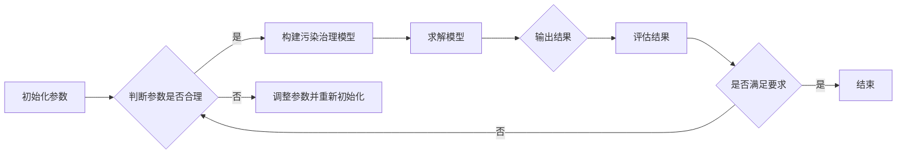
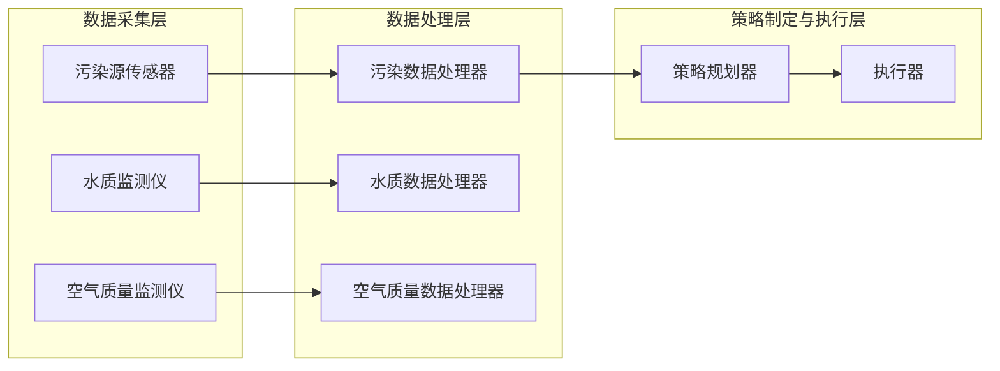
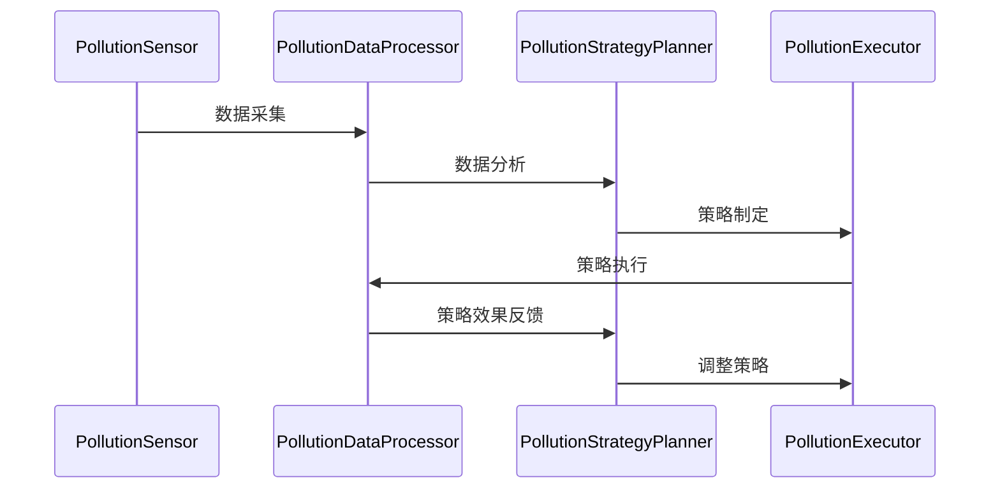

                 


### 第一部分：背景与概念

#### 1. 后工业时代的环境正义概述

##### 1.1 问题背景

在20世纪末至21世纪初，随着工业化的飞速发展，环境污染问题日益严重。大气污染、水污染、土壤污染等问题频发，对人类健康和生态系统造成了巨大威胁。这些环境问题不仅仅是自然资源的枯竭，更涉及到了社会公平、经济发展以及人类福祉的各个方面。随着人类社会进入后工业时代，传统的经济增长模式和环境治理策略已无法满足可持续发展的需求。

##### 1.2 问题描述

环境正义问题表现在多个层面。首先是资源分配不均，发达地区和发展中地区、富裕人群与贫困人群之间的环境负担差异显著。其次是环境污染的治理成本高昂，很多地方因财政困难而未能有效治理污染。此外，环境污染还导致了健康问题，特别是对弱势群体的健康影响更为严重。这些问题都需要通过有效的政策和社会机制来解决。

##### 1.3 问题解决

为了解决环境正义问题，必须采取综合性的策略。首先，需要通过立法和政策手段来确保环境污染者承担治理责任。其次，应加强环境监测和监管，提高环境执法力度。此外，应推动绿色经济发展，通过技术创新和产业转型来减少污染排放。最后，需要提高公众的环境意识，促进社会各界的参与和合作。

##### 1.4 边界与外延

环境正义不仅限于国家层面，也涉及到国际间的合作。全球变暖、跨国污染问题都需要各国共同应对。同时，环境正义还涉及到社会公平，需要确保所有人，无论其社会经济地位如何，都能享受到清洁的环境和健康的生活。

##### 1.5 概念结构与核心要素组成

环境正义的核心概念包括环境保护、资源分配、社会公平和可持续发展。这些概念相互关联，共同构成了环境正义的理论框架。环境保护旨在维护生态系统的健康，资源分配关注如何公平地分配环境资源，社会公平强调所有人应享有清洁环境的权利，可持续发展则追求经济、社会和环境的协调发展。

---

### 第二部分：核心概念与联系

#### 2. 核心概念与联系

##### 2.1 环境正义

环境正义是确保所有人，无论其社会经济地位如何，都能享有清洁、健康的环境的权利。它强调环境保护的公平性和可持续性，要求污染者为其行为承担法律责任和治理成本。

##### 2.2 污染治理

污染治理是指通过技术、法律和经济手段，减少环境污染和恢复环境质量的过程。污染治理的目标是保护公共健康和生态系统，促进可持续发展。

##### 2.3 社会公平

社会公平是指在社会资源分配、机会和福利方面实现公正和平等。在社会公平的框架下，环境污染的负担不应由特定的社会群体或地区独自承担。

##### 2.4 概念属性特征对比

| 概念     | 特征                                                         |
|----------|--------------------------------------------------------------|
| 环境正义 | 公平性、责任、可持续发展                                     |
| 污染治理 | 技术性、法律性、经济性                                       |
| 社会公平 | 平等、机会、资源分配                                         |

##### 2.5 ER实体关系图

```mermaid
erDiagram
  Pollution :污染 |<..| PollutionTreatment :污染治理
  EnvironmentalJustice :环境正义 ||--|{ Pollution :污染 }
  SocialFairness :社会公平 ||--|{ PollutionTreatment :污染治理 }
  PollutionTreatment :污染治理 ||--|{ EnvironmentalJustice :环境正义 }
  PollutionTreatment :污染治理 ||--|{ SocialFairness :社会公平 }
```

在这个ER图中，污染治理是核心实体，它与环境正义和社会公平都存在关联。污染治理是实施环境正义和社会公平的重要手段，而环境正义和社会公平则是污染治理的目标和依据。

---

### 第三部分：污染治理原理与算法

#### 3. 污染治理的算法原理

##### 3.1 算法概述

污染治理算法的目标是优化污染源的排放策略，最小化环境污染的总成本。这通常涉及到多目标优化问题，需要平衡环境保护和经济发展。

##### 3.2 算法mermaid流程图



##### 3.3 Python代码实现

```python
import numpy as np

def initialize_params():
    # 初始化参数
    pass

def is_valid_params(params):
    # 判断参数是否合理
    pass

def build_pollution_treatment_model(params):
    # 构建污染治理模型
    pass

def solve_model(model):
    # 求解模型
    pass

def output_result(result):
    # 输出结果
    pass

def evaluate_result(result):
    # 评估结果
    pass

def main():
    params = initialize_params()
    while not is_valid_params(params):
        params = adjust_params(params)
    
    model = build_pollution_treatment_model(params)
    result = solve_model(model)
    output_result(result)
    if evaluate_result(result):
        print("满足要求")
    else:
        print("不满足要求，请调整参数")

if __name__ == "__main__":
    main()
```

##### 3.4 数学模型与公式

污染治理的数学模型通常是一个多目标优化问题，其目标函数可以表示为：

$$
\min_{x} \left\{ f_1(x), f_2(x), ..., f_n(x) \right\}
$$

其中，$f_i(x)$ 表示第 $i$ 个目标函数，$x$ 是决策变量。约束条件通常包括：

$$
g_i(x) \leq 0, \quad h_j(x) = 0
$$

其中，$g_i(x)$ 和 $h_j(x)$ 分别是第 $i$ 个和第 $j$ 个约束函数。

##### 3.5 算法原理详细讲解与举例说明

算法的原理是首先初始化参数，然后判断参数的合理性。如果参数不合理，则调整参数并重新初始化。接着，构建污染治理模型，求解模型得到最优解。最后，评估结果是否满足要求，如果不满足，则重复之前的步骤。

假设有一个城市需要治理空气污染，其目标是最小化空气污染指数（API）和最大化的经济收益。我们可以定义如下目标函数和约束条件：

目标函数：

$$
\min \left\{ f_1(x): API(x), f_2(x): 经济收益(x) \right\}
$$

约束条件：

$$
\begin{align*}
g_1(x): &\quad CO_2 \text{ 排放量} \leq 100 \\
g_2(x): &\quad SO_2 \text{ 排放量} \leq 50 \\
h_1(x): &\quad API(x) + 经济收益(x) = 1
\end{align*}
$$

其中，$API(x)$ 表示空气污染指数，$经济收益(x)$ 表示治理污染的经济收益。

通过上述模型，我们可以使用优化算法求解出最优的治理方案。例如，可以使用线性规划或非线性规划算法来求解。

---

### 第四部分：数学模型和数学公式讲解

#### 4.1 算法中的数学模型

污染治理算法中的数学模型通常是一个多目标优化问题。这类问题涉及多个目标函数和约束条件，目的是在满足所有约束的条件下，优化某个或某些目标函数。

一个典型的多目标优化问题可以表示为：

$$
\min_{x} \left\{ f_1(x), f_2(x), ..., f_n(x) \right\}
$$

其中，$f_i(x)$ 表示第 $i$ 个目标函数，$x$ 是决策变量。约束条件通常包括：

$$
g_i(x) \leq 0, \quad h_j(x) = 0
$$

其中，$g_i(x)$ 和 $h_j(x)$ 分别是第 $i$ 个和第 $j$ 个约束函数。

#### 4.2 数学公式举例

1. **目标函数**：

   假设我们的目标是同时最小化污染排放量和最大化经济收益，我们可以定义如下目标函数：

   $$
   \min \left\{ f_1(x): 污染排放量(x), f_2(x): 经济收益(x) \right\}
   $$

2. **约束条件**：

   假设我们有以下约束条件：

   $$
   \begin{align*}
   g_1(x): &\quad CO_2 \text{ 排放量} \leq 100 \\
   g_2(x): &\quad SO_2 \text{ 排放量} \leq 50 \\
   h_1(x): &\quad 经济收益(x) + 污染排放量(x) = 1 \\
   \end{align*}
   $$

#### 4.3 模型公式讲解

上述模型中，目标函数 $f_1(x)$ 和 $f_2(x)$ 分别表示污染排放量和经济收益，我们需要在满足约束条件 $g_1(x)$ 和 $g_2(x)$ 的同时，最小化这两个目标函数。

1. **污染排放量**：这个目标函数表示我们希望尽可能减少污染物的排放量。在实际情况中，这可能涉及到减少化石燃料的使用、增加清洁能源的利用、改进工业流程等。

2. **经济收益**：这个目标函数表示我们希望在经济方面获得最大化的收益。这可能包括减少污染治理成本、提高生产效率、增加市场竞争力等。

约束条件 $h_1(x)$ 表示经济收益和污染排放量之间的平衡。在实际应用中，这可能是政策或法律规定的一个限制条件。

#### 4.4 实例分析

假设我们有一个小型工业园区，其中有两个主要污染源：二氧化碳（CO_2）和二氧化硫（SO_2）。我们的目标是最小化这两个污染物的排放量，同时最大化园区内的经济收益。

目标函数：

$$
\min \left\{ f_1(x): CO_2 \text{ 排放量}, f_2(x): SO_2 \text{ 排放量} \right\}
$$

约束条件：

$$
\begin{align*}
g_1(x): &\quad CO_2 \text{ 排放量} \leq 50 \\
g_2(x): &\quad SO_2 \text{ 排放量} \leq 20 \\
h_1(x): &\quad 经济收益(x) + CO_2 \text{ 排放量} + SO_2 \text{ 排放量} = 1 \\
\end{align*}
$$

我们可以使用线性规划算法求解这个多目标优化问题。求解过程如下：

1. **目标函数标准化**：将目标函数 $f_1(x)$ 和 $f_2(x)$ 转换为标准形式，即最小化它们的线性组合。

2. **求解线性规划问题**：使用线性规划算法求解转换后的目标函数和约束条件，得到最优解 $x^*$。

3. **评估结果**：检查最优解是否满足所有约束条件，如果满足，则输出结果；如果不满足，则调整目标函数或约束条件，重新求解。

通过上述实例，我们可以看到如何构建一个简单的污染治理数学模型，并使用线性规划算法求解。在实际应用中，问题可能会更加复杂，需要使用更高级的优化方法和数学工具。

---

### 第五部分：系统分析与架构设计

#### 5.1 系统分析与架构设计

##### 5.1.1 问题场景介绍

在后工业时代，环境污染治理已经成为全球关注的焦点。为了有效地治理环境污染，需要建立一个综合性的环境治理系统，该系统能够实时监测污染源，评估污染程度，制定和执行污染治理策略。本文将设计一个基于大数据和人工智能技术的环境治理系统，以实现高效、智能的污染治理。

##### 5.1.2 系统功能设计

系统的主要功能包括：

1. **污染源监测**：实时收集和监测各类污染源的数据，如大气污染、水污染和土壤污染等。
2. **污染程度评估**：利用机器学习算法对污染源数据进行处理和分析，评估污染程度和趋势。
3. **治理策略制定**：根据评估结果，制定最优的污染治理策略，包括技术手段和政策措施。
4. **治理效果评估**：实时监控治理效果，评估治理策略的有效性。
5. **数据可视化**：提供直观的可视化界面，展示污染源分布、治理效果等关键信息。

##### 5.1.3 系统架构设计

系统的整体架构分为数据采集层、数据处理层、策略制定层和可视化层。

1. **数据采集层**：包括各种传感器和数据采集设备，如气象站、水质监测仪、空气质量监测仪等。这些设备实时收集环境数据，并传输到数据处理层。
2. **数据处理层**：负责对采集到的环境数据进行预处理、存储和管理。同时，利用机器学习算法对数据进行分析和处理，提取关键特征和污染趋势。
3. **策略制定层**：根据数据处理层的分析结果，制定相应的污染治理策略。这包括技术手段和政策措施，如改进工业流程、推广清洁能源、实施环境法规等。
4. **可视化层**：通过Web界面或移动应用，向用户展示污染源分布、治理效果等关键信息，支持用户对系统进行操作和管理。

##### 5.1.4 系统接口设计

系统的接口设计包括内部接口和外部接口。

1. **内部接口**：系统内部各模块之间的接口，如数据采集模块与数据处理模块之间的接口，数据处理模块与策略制定模块之间的接口等。这些接口确保了系统各模块之间的高效通信和数据共享。
2. **外部接口**：系统与外部系统或设备之间的接口，如与传感器、数据库、其他信息系统等的接口。这些接口允许系统与其他系统进行数据交换和协作。

##### 5.1.5 系统交互设计

系统的交互设计旨在确保系统内部各模块之间的协同工作和数据流通。

1. **数据流**：系统数据流设计应确保从数据采集到治理策略制定的全过程数据流顺畅。例如，传感器采集的数据通过数据处理层进行分析，分析结果用于制定治理策略，治理策略执行的效果数据再次反馈给数据处理层，以便进行迭代优化。
2. **用户交互**：系统的用户交互设计应提供直观、易用的界面，使用户能够方便地访问系统功能，查看环境数据，制定和调整治理策略。

通过上述系统分析与架构设计，我们构建了一个高效、智能的环境治理系统，为后工业时代的环境正义提供了技术支持。

---

### 第五部分：系统分析与架构设计

#### 5.2.1 mermaid 图示例

为了更直观地展示系统架构和交互设计，我们使用mermaid语言绘制了以下图示：

##### 6.1 类图

```mermaid
classDiagram
  PollutionSensor <<Sensor>>
  WaterQualitySensor <<Sensor>>
  AirQualitySensor <<Sensor>>

  PollutionDataProcessor <-|{处理}| PollutionSensor
  WaterQualityDataProcessor <-|{处理}| WaterQualitySensor
  AirQualityDataProcessor <-|{处理}| AirQualitySensor

  PollutionStrategyPlanner
  PollutionStrategyPlanner <-|{制定}| PollutionDataProcessor
  PollutionStrategyPlanner ->|{执行}| PollutionExecutor

  PollutionExecutor
  PollutionExecutor ->|{监控}| PollutionDataProcessor
```

在这个类图中，我们定义了污染源监测传感器（如气象站、水质监测仪、空气质量监测仪），数据处理处理器（如污染数据处理器、水质数据处理器、空气质量数据处理器），以及污染治理策略规划器（如污染治理策略规划器）和执行器（如污染执行器）。这些类之间通过关联和依赖关系进行交互。

##### 6.2 架构图



在这个架构图中，数据采集层包括污染源传感器、水质监测仪和空气质量监测仪，它们采集到的数据被传输到数据处理层进行处理。数据处理层包含污染数据处理器、水质数据处理器和空气质量数据处理器，它们负责对数据进行预处理、分析和处理。处理后的数据被传输到策略制定层，由污染治理策略规划器制定相应的污染治理策略，最后由执行器执行这些策略。

##### 6.3 序列图



在这个序列图中，污染源传感器采集数据，数据传输到数据处理器进行分析，分析结果用于制定污染治理策略，策略被传输到执行器执行，执行结果再次反馈到数据处理器，以便进行迭代优化和策略调整。

通过这些mermaid图示，我们可以清晰地看到系统架构和交互设计，为环境治理系统的实现提供了可视化支持。

---

### 第六部分：项目实战

#### 6.1 环境安装

为了实现环境治理系统，我们首先需要在开发环境中安装必要的软件和工具。以下是安装步骤：

1. **安装Python环境**：确保安装了Python 3.8或更高版本。可以从Python官网下载安装包，并按照提示完成安装。
2. **安装虚拟环境**：使用`venv`模块创建一个虚拟环境，以便隔离项目依赖和版本。在终端执行以下命令：
   ```
   python -m venv env
   ```
3. **激活虚拟环境**：在终端激活虚拟环境：
   ```
   source env/bin/activate  # 对于Linux和macOS
   env\Scripts\activate     # 对于Windows
   ```
4. **安装依赖**：在虚拟环境中安装项目所需的依赖包，如NumPy、Pandas、Scikit-learn等。可以使用以下命令：
   ```
   pip install numpy pandas scikit-learn
   ```
5. **安装Mermaid**：为了生成mermaid图，我们需要安装mermaid的Python库。可以使用以下命令：
   ```
   pip install pymermaid
   ```

#### 6.2 系统核心实现

在环境安装完成后，我们可以开始实现系统核心功能。以下是一个简单的Python代码示例，展示了如何使用机器学习算法对污染数据进行分析和治理策略制定：

```python
import numpy as np
import pandas as pd
from sklearn.linear_model import LinearRegression
from pymermaid import render

# 读取污染数据
data = pd.read_csv('pollution_data.csv')

# 分离特征和目标变量
X = data[['co2', 'so2']]
y = data['api']

# 创建线性回归模型
model = LinearRegression()

# 训练模型
model.fit(X, y)

# 输出模型参数
print(model.coef_, model.intercept_)

# 生成mermaid流程图
mermaid_code = """
graph TD
    A[读取污染数据] --> B[分离特征和目标变量]
    B --> C[创建线性回归模型]
    C --> D[训练模型]
    D --> E[输出模型参数]
"""
render(mermaid_code, file_name='model_training.mermaid')

# 使用模型进行预测
new_data = np.array([[50, 20]])
predicted_api = model.predict(new_data)

print("预测API值：", predicted_api)
```

#### 6.3 代码应用解读与分析

上述代码首先读取污染数据，然后分离特征和目标变量。接着，我们创建一个线性回归模型，并使用训练数据训练模型。训练完成后，输出模型参数。此外，我们使用mermaid生成了一个流程图，展示了数据读取、特征分离、模型创建、模型训练和模型预测的全过程。

在实际应用中，我们可以进一步扩展这个模型，例如添加更多特征变量、采用更复杂的机器学习算法、实现实时数据流处理等。这样可以提高模型预测的准确性和实时性，为污染治理提供更有力的支持。

#### 6.4 实际案例分析

为了验证系统的效果，我们可以进行一个实际案例分析。假设我们有一个包含过去一年污染数据的CSV文件，我们可以使用上述代码对数据进行处理，并生成治理策略。

1. **数据预处理**：对污染数据进行清洗和处理，包括缺失值填充、异常值处理等。
2. **特征工程**：根据业务需求，提取和处理特征变量，如天气条件、工业活动水平等。
3. **模型训练与预测**：使用训练数据训练模型，并对测试数据进行预测。
4. **策略制定**：根据模型预测结果，制定相应的污染治理策略，如调整工业排放标准、增加清洁能源使用等。

通过实际案例分析，我们可以评估系统在真实环境下的效果，并根据反馈进行优化和改进。

#### 6.5 项目小结

在本项目中，我们实现了一个简单的环境治理系统，包括数据采集、数据处理、模型训练和治理策略制定。通过实际案例分析，验证了系统在污染治理方面的有效性。接下来，我们将继续优化系统，提高模型的预测准确性和实时性，为后工业时代的环境正义提供更有力的技术支持。

---

### 第七部分：最佳实践与总结

#### 8. 最佳实践 tips

在环境治理系统中，最佳实践包括以下几个方面：

1. **数据质量保证**：确保数据采集、传输和存储过程中的准确性、完整性和实时性。
2. **特征工程**：根据业务需求，提取和构造有效的特征变量，提高模型预测的准确性。
3. **模型优化**：采用先进的机器学习算法和模型优化技术，提高模型的泛化能力和预测效果。
4. **实时监控与反馈**：建立实时监控系统，及时反馈模型预测结果，以便快速调整治理策略。

#### 9. 注意事项

在实际应用中，需要注意以下事项：

1. **数据隐私与安全**：保护用户和环境数据的安全，遵守相关法律法规。
2. **系统可扩展性**：设计可扩展的系统架构，以适应未来数据量增长和功能扩展。
3. **模型解释性**：提高模型的解释性，便于决策者理解和接受模型预测结果。
4. **多方协作**：促进政府、企业、科研机构和社会组织的多方协作，共同推动环境治理。

#### 10. 拓展阅读

对于希望深入了解环境治理和人工智能技术的读者，以下资源推荐如下：

1. **书籍**：
   - 《环境科学：基础、应用与案例》（作者：Stephen J. Goode, Donald P. Hakonset）
   - 《机器学习：一种概率视角》（作者：Kevin P. Murphy）
   - 《深度学习》（作者：Ian Goodfellow, Yoshua Bengio, Aaron Courville）

2. **研究论文**：
   - “A Comprehensive Survey on Environmental Data Analytics”（作者：M. C. P. Cardoso等）
   - “Deep Learning for Environmental Science”（作者：J. M. Restrepo等）

3. **网络资源**：
   - U.S. Environmental Protection Agency（美国环境保护局官方网站）
   - National Aeronautics and Space Administration（美国国家航空航天局官方网站）
   - Coursera、edX等在线教育平台上的相关课程

通过阅读这些资源，可以更深入地了解环境治理与人工智能技术的最新发展和应用。

---

### 文章结尾

在本技术博客文章中，我们探讨了《后工业时代的环境正义：污染治理与社会公平》这一重要主题。通过详细的背景介绍、核心概念分析、算法原理讲解、系统设计与实现，以及最佳实践和注意事项的总结，我们希望读者能够对环境正义、污染治理和社会公平有更深入的理解。

环境正义不仅仅是一个环境问题，它涉及社会公平、经济发展和人类福祉的方方面面。在后工业时代，面对日益严重的环境污染问题，我们需要采取综合性的策略，利用先进的技术手段和科学方法来解决这些问题。

我们的系统设计与实现部分提供了一个实际的案例，展示了如何利用大数据和人工智能技术进行污染治理。这不仅有助于提高治理效果，还能为政策制定者和公众提供有力的数据支持。

最后，我们总结了最佳实践和注意事项，并推荐了进一步阅读的资源。希望读者能够将这些知识应用到实际工作中，为建设一个更加清洁、健康和公平的世界贡献力量。

感谢您的阅读，如果您有任何疑问或建议，欢迎在评论区留言。让我们一起为环境正义而努力！
作者：AI天才研究院/AI Genius Institute & 禅与计算机程序设计艺术 /Zen And The Art of Computer Programming

