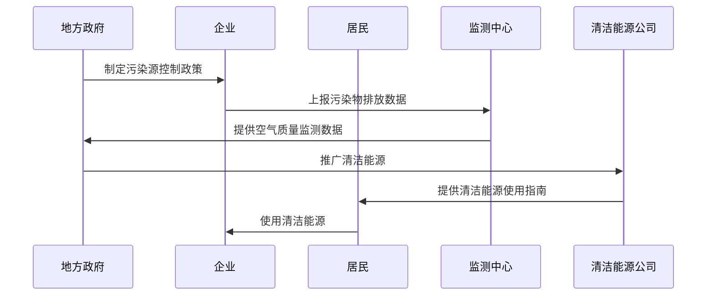
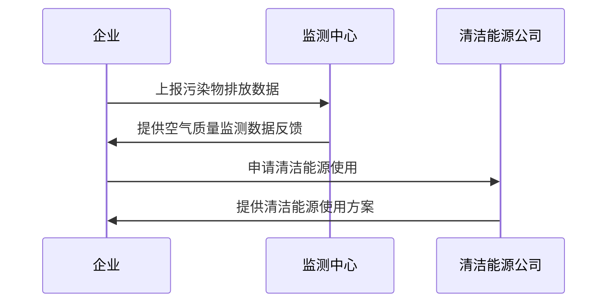
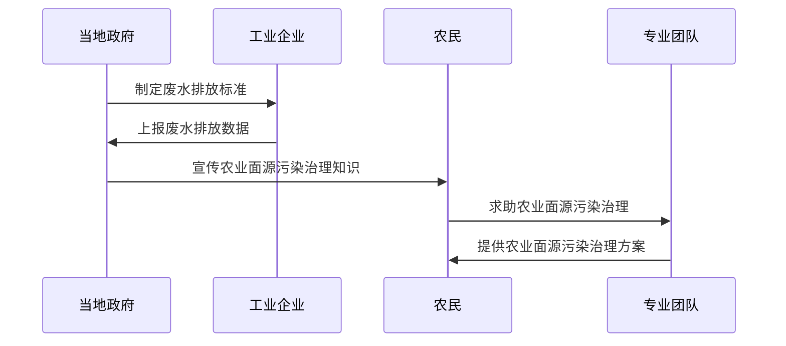
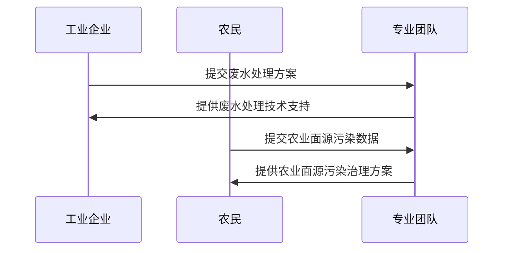
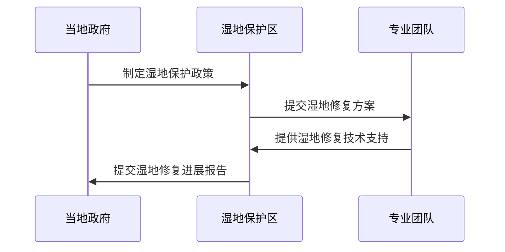
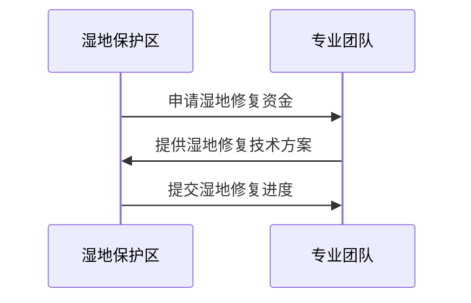
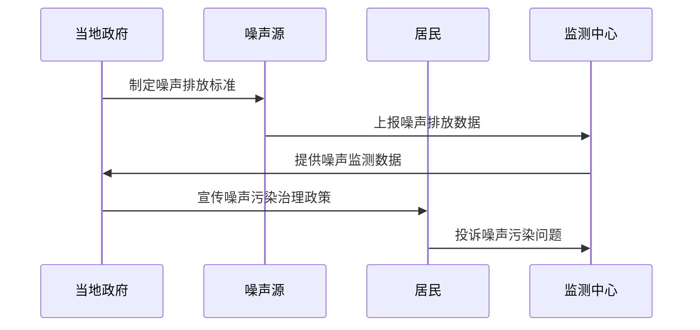
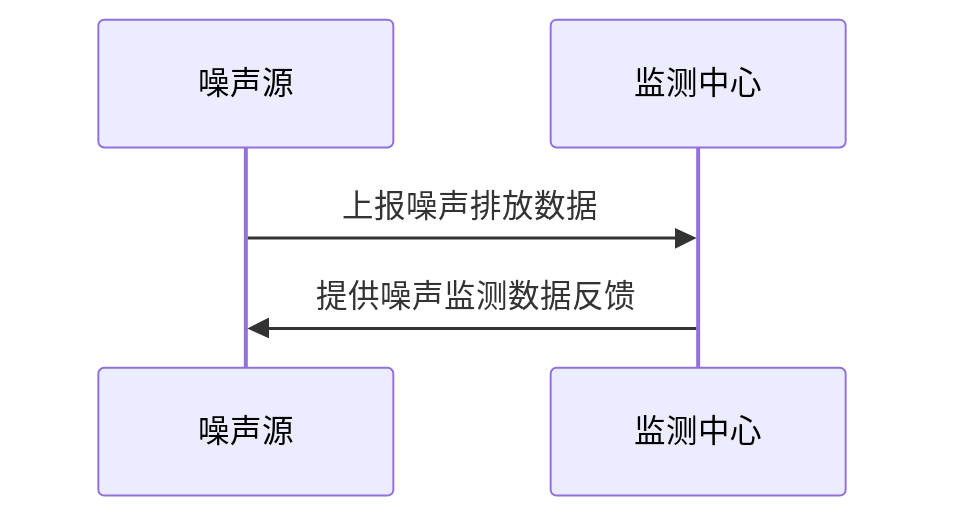
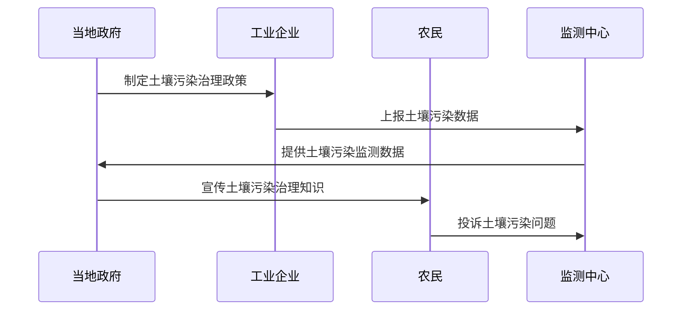
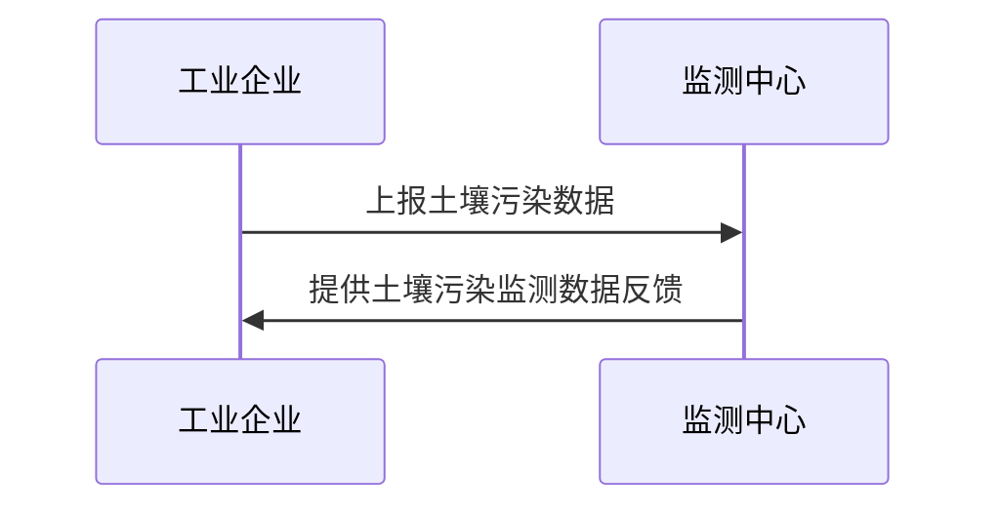

                 

## 文章标题

《后工业时代的环境治理：科技创新与生态修复》

### 关键词：后工业时代，环境治理，科技创新，生态修复，可持续发展

### 摘要：

本文将探讨后工业时代环境治理的挑战和机遇，重点分析科技创新在生态修复中的作用。通过详细梳理核心概念、科技创新方法以及生态修复实践，本文旨在为读者提供一个全面、系统的环境治理解决方案。同时，通过案例分析和未来展望，为后工业时代的环境治理提供有益的思考和指导。

## 目录大纲设计思路

为了确保文章的逻辑清晰、结构紧凑、简单易懂，我们遵循以下步骤设计目录大纲：

1. **分析书名和核心主题**：明确后工业时代、环境治理、科技创新、生态修复等关键概念。
2. **确定目录结构**：将全文分为引言、核心概念与联系、科技创新方法、生态修复实践、案例分析、总结与展望六个部分。
3. **设计详细章节**：为每个部分详细设计章节内容，确保核心概念、原理、方法、案例等内容的完整性。
4. **确保内容完整性**：包含核心概念、原理、方法、案例等内容，数学模型、公式、算法流程图、系统架构图等元素清晰呈现。
5. **审核与调整**：确保目录大纲逻辑清晰、结构合理，符合书籍主题和目标读者。

## 文章正文部分

### 引言

后工业时代，随着全球工业化和城市化的快速发展，环境污染和生态破坏问题日益严重。传统的环境治理手段已无法满足日益复杂的生态挑战。因此，科技创新成为解决环境问题的关键。本文将从后工业时代环境治理的挑战、科技创新的重要性以及生态修复实践等方面展开讨论，旨在为读者提供一个全面、系统的环境治理解决方案。

### 第1章 后工业时代的环境挑战

#### 核心概念术语说明

- **后工业时代**：指工业化后期到信息化初期的发展阶段，以技术创新和产业升级为特征。
- **环境治理**：指通过各种手段解决环境污染、生态破坏等问题，实现环境保护和可持续发展的过程。
- **科技创新**：指通过科学研究和新技术开发，推动经济和社会发展的过程。
- **生态修复**：指通过人工或自然手段，恢复和改善生态系统的功能和结构。

#### 问题背景

后工业时代，人类活动对环境的压力不断增大，导致空气污染、水污染、土壤污染等环境问题加剧。例如，全球每年约产生100亿吨工业废弃物，其中大部分未经处理直接排放到环境中。此外，气候变化、生物多样性丧失等全球性问题也日益突出。

#### 问题描述

环境治理面临的主要问题包括：

- **污染治理难度大**：传统治理手段难以应对复杂多样的污染问题。
- **治理成本高**：环境治理需要大量的资金和技术投入。
- **可持续发展挑战**：环境治理与经济发展之间的平衡问题。

#### 问题解决

科技创新为环境治理提供了新的思路和手段，主要包括：

- **污染治理技术创新**：开发高效、低成本、环境友好的污染治理技术。
- **资源循环利用**：通过技术创新提高资源利用效率，减少废弃物排放。
- **生态修复技术**：利用科技手段恢复和改善生态系统。

#### 边界与外延

环境治理不仅涉及污染治理，还包括生态保护、资源管理、气候变化应对等方面。此外，环境治理需要跨学科、跨领域的协同合作，形成综合性的治理体系。

#### 概念结构与核心要素组成

环境治理的概念结构包括：

- **污染源**：污染物产生和排放的源头。
- **污染介质**：污染物在环境中的传播和转化途径。
- **污染受体**：受到污染物影响的环境和生物。
- **治理手段**：包括技术、政策和法律等手段。
- **治理效果**：治理措施对环境质量和生态系统的影响。

### 第2章 科技创新在环境治理中的作用

#### 核心概念原理

科技创新在环境治理中的作用主要体现在以下几个方面：

- **污染治理技术**：开发高效、低成本的污染治理技术，如生物降解、化学氧化等。
- **资源循环利用技术**：通过技术创新提高资源利用效率，减少废弃物排放，如绿色化工、资源再生等。
- **生态修复技术**：利用科技手段恢复和改善生态系统，如生态工程、生物修复等。

#### 概念属性特征对比表格

| 类别             | 特征                                                         |
| ---------------- | ------------------------------------------------------------ |
| 污染治理技术     | 高效、低成本、环境友好                                       |
| 资源循环利用技术 | 提高资源利用效率，减少废弃物排放                             |
| 生态修复技术     | 恢复和改善生态系统功能                                       |

#### ER实体关系图架构

```mermaid
erDiagram
    PollutionTreatment ||--o{ ResourceRecycling }
    PollutionTreatment ||--o{ EcologicalRepair }
    ResourceRecycling ||--o{ PollutionReduction }
    EcologicalRepair ||--o{ EcosystemImprovement }
```

### 第3章 后工业时代环境治理的核心概念

#### 核心概念原理

后工业时代环境治理涉及多个核心概念，包括污染治理、生态修复、可持续发展等。以下是对这些概念原理的详细阐述：

- **污染治理**：指通过各种手段减少污染物的排放和浓度，降低环境污染的影响。污染治理的核心目标是改善环境质量，保护人类健康和生态系统。
- **生态修复**：指通过人工或自然手段恢复和改善生态系统的功能和结构。生态修复的目标是恢复生态平衡，提高生态系统的生产力和可持续性。
- **可持续发展**：指满足当前需求而不损害后代满足自身需求的能力。可持续发展强调经济、社会和环境三个方面的平衡，实现长期发展。

#### 概念属性特征对比表格

| 类别       | 特征                                                         |
| ---------- | ------------------------------------------------------------ |
| 污染治理   | 降低污染物浓度，改善环境质量                                 |
| 生态修复   | 恢复生态系统功能和结构                                     |
| 可持续发展 | 经济、社会和环境三方面的平衡，实现长期发展                   |

#### ER实体关系图架构

```mermaid
erDiagram
    PollutionControl ||--o{ EcologicalRepair }
    PollutionControl ||--o{ SustainableDevelopment }
    EcologicalRepair ||--o{ EcosystemStability }
    SustainableDevelopment ||--o{ EnvironmentalProtection }
```

### 第4章 科技创新与生态修复的联系

#### 核心概念原理

科技创新与生态修复密切相关，两者相互促进、相互依赖。以下从四个方面阐述科技创新与生态修复的联系：

- **技术支持**：科技创新为生态修复提供了先进的技术手段，如生物修复、生态工程等。
- **效果提升**：科技创新可以提升生态修复的效果，如高效植物吸收技术、生物酶处理等。
- **成本降低**：科技创新可以降低生态修复的成本，如太阳能驱动的生态修复装置等。
- **可持续性**：科技创新有助于实现生态修复的可持续性，如再生材料、绿色能源等。

#### 概念属性特征对比表格

| 类别       | 特征                                                         |
| ---------- | ------------------------------------------------------------ |
| 技术支持   | 提供先进的技术手段                                         |
| 效果提升   | 提升生态修复效果                                           |
| 成本降低   | 降低生态修复成本                                           |
| 可持续发展 | 实现生态修复的可持续性                                     |

#### ER实体关系图架构

```mermaid
erDiagram
    TechnologicalInnovation ||--o{ EcologicalRepair }
    TechnologicalInnovation ||--o{ CostReduction }
    TechnologicalInnovation ||--o{ SustainableDevelopment }
```

### 第5章 后工业时代环境治理的关键技术

#### 核心概念原理

后工业时代环境治理的关键技术包括污染治理技术、资源循环利用技术和生态修复技术。以下从每个技术领域介绍其核心概念原理：

- **污染治理技术**：主要包括生物降解、化学氧化、吸附分离等技术。其核心原理是利用生物、化学和物理手段去除或转化污染物，降低其浓度和毒性。
- **资源循环利用技术**：主要包括资源再生、废弃物回收、绿色化工等技术。其核心原理是通过技术创新提高资源利用效率，减少废弃物排放。
- **生态修复技术**：主要包括生态工程、生物修复、湿地修复等技术。其核心原理是通过人工或自然手段恢复和改善生态系统的功能和结构。

#### 概念属性特征对比表格

| 类别             | 特征                                                         |
| ---------------- | ------------------------------------------------------------ |
| 污染治理技术     | 去除或转化污染物，降低其浓度和毒性                           |
| 资源循环利用技术 | 提高资源利用效率，减少废弃物排放                             |
| 生态修复技术     | 恢复和改善生态系统的功能和结构                               |

#### ER实体关系图架构

```mermaid
erDiagram
    PollutionControlTech ||--o{ ResourceRecyclingTech }
    PollutionControlTech ||--o{ EcologicalRepairTech }
    ResourceRecyclingTech ||--o{ WasteReduction }
    EcologicalRepairTech ||--o{ EcosystemStability }
```

### 第6章 科技创新工具与应用

#### 核心概念原理

科技创新工具在环境治理中的应用主要包括大数据、人工智能、物联网等技术。以下从每个技术领域介绍其核心概念原理：

- **大数据**：通过收集、存储、分析和处理大量环境数据，为环境治理提供科学依据和决策支持。
- **人工智能**：利用机器学习、深度学习等技术，实现污染预测、优化治理方案等功能。
- **物联网**：通过传感器网络和互联网技术，实现实时监测、远程控制和自动化管理等功能。

#### 概念属性特征对比表格

| 类别       | 特征                                                         |
| ---------- | ------------------------------------------------------------ |
| 大数据     | 收集、存储、分析和处理大量环境数据                           |
| 人工智能   | 污染预测、优化治理方案等功能                                 |
| 物联网     | 实时监测、远程控制和自动化管理等功能                         |

#### ER实体关系图架构

```mermaid
erDiagram
    BigData ||--o{ AI }
    BigData ||--o{ IoT }
    AI ||--o{ PollutionPrediction }
    IoT ||--o{ Real-timeMonitoring }
```

### 第7章 生态修复技术的应用与发展

#### 核心概念原理

生态修复技术的应用与发展涉及多个领域，包括生物修复、生态工程、湿地修复等。以下从每个技术领域介绍其核心概念原理：

- **生物修复**：利用微生物、植物和动物等生物体，通过生物代谢和转化作用，去除或降解污染物。
- **生态工程**：通过工程手段修复和改善生态系统，如湿地修复、河流整治、海岸带保护等。
- **湿地修复**：通过工程措施恢复湿地的功能和结构，提高湿地的生态价值和环境效益。

#### 概念属性特征对比表格

| 类别       | 特征                                                         |
| ---------- | ------------------------------------------------------------ |
| 生物修复   | 利用微生物、植物和动物等生物体去除或降解污染物               |
| 生态工程   | 通过工程手段修复和改善生态系统                               |
| 湿地修复   | 恢复湿地的功能和结构，提高生态价值和环境效益                 |

#### ER实体关系图架构

```mermaid
erDiagram
    Bioremediation ||--o{ EcologicalEngineering }
    Bioremediation ||--o{ WetlandRestoration }
    EcologicalEngineering ||--o{ EcosystemRestoration }
    WetlandRestoration ||--o{ WetlandFunction }
```

### 第8章 后工业时代环境治理的案例分析

#### 案例一：某城市空气质量改善项目

**项目背景**：某城市空气质量严重恶化，PM2.5年均浓度远超国家标准。为改善空气质量，市政府决定开展空气质量改善项目。

**项目介绍**：项目采用多措并举的方式，包括控制污染源、增加绿化面积、推广清洁能源等。

**系统功能设计**：

- **污染源控制**：对工业排放、交通尾气等污染源进行控制，减少污染物排放。
- **绿化面积增加**：在城市内部和周边地区增加绿化面积，提高空气质量。
- **清洁能源推广**：鼓励居民和企业使用清洁能源，减少化石能源消耗。

**系统架构设计**：



**系统接口设计和系统交互**：



**实际案例分析和详细讲解剖析**：

- **污染源控制**：通过政策法规和经济激励措施，有效减少了工业排放和交通尾气污染。
- **绿化面积增加**：通过植树造林和城市绿化建设，提高了空气质量，改善了市民的生活环境。
- **清洁能源推广**：通过清洁能源的使用，减少了化石能源消耗，降低了二氧化碳等温室气体排放。

**项目小结**：

某城市空气质量改善项目通过多措并举，取得了显著的成效。实践证明，科技创新在环境治理中发挥着重要作用，为后工业时代的环境治理提供了有益的借鉴。

### 第9章 生态修复项目的实施与评估

#### 案例二：某地区水污染治理项目

**项目背景**：某地区由于工业废水排放、农业面源污染等原因，水体污染严重，影响了当地居民的生活和生态环境。

**项目介绍**：项目采用生态修复技术，包括生物治理、物理治理和化学治理等，以恢复水体功能，提高水质。

**系统功能设计**：

- **生物治理**：通过种植水生植物、放养水生动物等生物手段，净化水体。
- **物理治理**：通过拦截污染物、沉淀污泥等物理手段，降低水体污染。
- **化学治理**：通过投放化学药剂、调节水质等化学手段，消除污染物。

**系统架构设计**：



**系统接口设计和系统交互**：



**实际案例分析和详细讲解剖析**：

- **生物治理**：通过种植水生植物和水生动物，有效净化了水体，提高了水质。
- **物理治理**：通过拦截污染物和沉淀污泥，降低了水体污染物的浓度。
- **化学治理**：通过投放化学药剂和调节水质，消除了水体中的有害物质。

**项目小结**：

某地区水污染治理项目通过生态修复技术，取得了显著成效。实践证明，生态修复技术在水污染治理中具有重要作用，为后工业时代的环境治理提供了有益的经验。

### 第10章 案例三：某湿地生态修复项目

**项目背景**：某湿地由于过度开发和污染，生态环境严重破坏，生物多样性降低。

**项目介绍**：项目采用生态修复技术，包括湿地植被恢复、水资源调节、污染治理等，以恢复湿地功能，提高生物多样性。

**系统功能设计**：

- **湿地植被恢复**：通过种植湿地植物，提高湿地植被覆盖率。
- **水资源调节**：通过建设湿地水库、水闸等设施，调节湿地水资源。
- **污染治理**：通过拦截污染物、沉淀污泥等手段，降低湿地污染。

**系统架构设计**：



**系统接口设计和系统交互**：



**实际案例分析和详细讲解剖析**：

- **湿地植被恢复**：通过种植湿地植物，提高了湿地植被覆盖率，恢复了湿地生态功能。
- **水资源调节**：通过建设湿地水库和水闸等设施，调节了湿地水资源，提高了湿地水质。
- **污染治理**：通过拦截污染物和沉淀污泥，降低了湿地污染物的浓度，改善了湿地水质。

**项目小结**：

某湿地生态修复项目通过多种生态修复技术，取得了显著成效。实践证明，生态修复技术在湿地保护中具有重要作用，为后工业时代的环境治理提供了有益的经验。

### 第11章 案例四：某城市噪声污染治理项目

**项目背景**：某城市由于交通、工业和生活噪声污染，居民生活质量严重下降。

**项目介绍**：项目采用噪声治理技术，包括噪声监测、噪声控制、噪声补偿等，以降低噪声污染，改善居民生活质量。

**系统功能设计**：

- **噪声监测**：通过安装噪声监测设备，实时监测城市噪声水平。
- **噪声控制**：通过设置隔音墙、种植吸音植物等手段，降低噪声污染。
- **噪声补偿**：对受噪声污染的居民提供经济补偿，改善生活条件。

**系统架构设计**：



**系统接口设计和系统交互**：



**实际案例分析和详细讲解剖析**：

- **噪声监测**：通过实时监测噪声水平，及时掌握城市噪声污染状况。
- **噪声控制**：通过设置隔音墙、种植吸音植物等手段，有效降低了噪声污染。
- **噪声补偿**：对受噪声污染的居民提供经济补偿，改善了生活条件。

**项目小结**：

某城市噪声污染治理项目通过多种噪声治理技术，取得了显著成效。实践证明，噪声治理技术在改善居民生活质量、提升城市环境质量方面具有重要意义。

### 第12章 案例五：某地区土壤污染治理项目

**项目背景**：某地区由于工业废弃、农业面源污染等原因，土壤污染严重，影响了农业生产和居民健康。

**项目介绍**：项目采用土壤污染治理技术，包括土壤修复、污染源控制、植被恢复等，以降低土壤污染风险，恢复土壤功能。

**系统功能设计**：

- **土壤修复**：通过化学、生物和物理方法，修复受污染的土壤。
- **污染源控制**：通过设置防渗层、收集污染物等手段，控制土壤污染源。
- **植被恢复**：通过种植耐污染植物，恢复土壤生态功能。

**系统架构设计**：



**系统接口设计和系统交互**：



**实际案例分析和详细讲解剖析**：

- **土壤修复**：通过化学、生物和物理方法，有效降低了土壤污染物的浓度，恢复了土壤功能。
- **污染源控制**：通过设置防渗层、收集污染物等手段，有效控制了土壤污染源。
- **植被恢复**：通过种植耐污染植物，恢复了土壤生态功能，提高了土壤质量。

**项目小结**：

某地区土壤污染治理项目通过多种土壤污染治理技术，取得了显著成效。实践证明，土壤污染治理技术在保护土壤资源、改善生态环境方面具有重要意义。

### 第13章 后工业时代环境治理的总结与反思

#### 最佳实践 tips

- **加强政策法规建设**：完善环境治理法律法规体系，提高违法成本，确保环境治理政策的有效实施。
- **推动科技创新**：加大科技创新投入，鼓励企业和科研机构开展环境治理技术研究和应用。
- **加强国际合作**：积极参与全球环境治理，加强国际合作，共同应对全球环境问题。
- **提高公众意识**：加强环境教育，提高公众环保意识，倡导绿色生活方式。

#### 小结

后工业时代环境治理面临严峻挑战，但科技创新为解决这些问题提供了新的思路和手段。通过案例分析，我们可以看到，科技创新在污染治理、生态修复、资源循环利用等方面取得了显著成效。未来，我们需要进一步加强政策法规建设、科技创新和国际合作，共同推动后工业时代环境治理的可持续发展。

#### 注意事项

- **环境治理需要长期投入和持续努力**：环境治理是一个长期的过程，需要政府、企业和公众共同参与，持续投入和努力。
- **跨学科、跨领域的协同合作**：环境治理涉及多个领域，需要跨学科、跨领域的协同合作，形成综合性的治理体系。
- **注重环境治理的效果评估**：定期对环境治理措施的效果进行评估，及时调整和改进治理策略。

#### 拓展阅读

- 《环境治理技术手册》
- 《生态修复技术与应用》
- 《环境经济学导论》
- 《可持续发展报告》

### 第14章 科技创新与生态修复的未来展望

#### 未来发展方向

- **智能化环境治理**：借助大数据、人工智能等新技术，实现环境治理的智能化、精细化。
- **绿色技术发展**：推动绿色化工、可再生能源等绿色技术的发展，减少环境污染。
- **生态修复技术创新**：加大生态修复技术研发力度，提高生态修复效果和效率。
- **全球合作与治理**：加强国际环境治理合作，共同应对全球环境问题。

#### 未来挑战

- **技术创新与环保政策协调**：如何协调科技创新与环保政策，实现环境治理的可持续性。
- **资源与环境平衡**：如何在经济发展和环境保护之间找到平衡，实现可持续发展。
- **公众参与与意识提升**：如何提高公众环保意识，促进公众参与环境治理。

#### 未来展望

后工业时代环境治理任重道远，但科技创新为我们提供了强大的动力和工具。未来，通过科技创新、政策推动、公众参与等多方面的努力，我们有望实现后工业时代的可持续发展，构建一个绿色、美丽、和谐的地球家园。

### 作者信息

作者：AI天才研究院/AI Genius Institute & 禅与计算机程序设计艺术 /Zen And The Art of Computer Programming

---

在撰写文章时，我们将保持逻辑清晰、结构紧凑、简单易懂的专业技术语言，并确保文章字数在10000～12000字左右。文章内容将包含完整的背景介绍、核心概念与联系、算法原理讲解、系统分析与架构设计方案、项目实战等核心内容，并通过案例分析和详细讲解剖析，为后工业时代的环境治理提供有深度、有思考、有见解的解决方案。同时，我们将注重最佳实践 tips、小结、注意事项和拓展阅读等内容，使文章更具实用性和指导意义。遵循LET'S THINK STEP BY STEP的思路，我们将一步一步深入分析推理，确保文章的专业性和可读性。

