                 


## 后工业时代的职业规划：终身学习与多元发展的重要性

> 关键词：后工业时代、职业规划、终身学习、多元发展、技能提升

> 摘要：本文将探讨后工业时代背景下，职业规划的重要性以及终身学习与多元发展对于职业规划的关键作用。通过分析后工业时代的职业市场变化，提出职业规划的策略，并详细阐述终身学习与多元化发展的原理和实践方法。

### 第1章：后工业时代的职业规划背景与挑战

随着后工业时代的到来，职业市场发生了深刻的变化。传统的工作模式逐渐被打破，新兴职业不断涌现，职业规划变得更加复杂。在这个背景下，如何规划职业成为了一个重要课题。

#### 1.1.1 问题的背景

**问题描述：**
1. 传统职业稳定性下降，新兴职业不断涌现，职业规划变得更加复杂。
2. 终身学习成为趋势，但如何有效地进行学习和职业发展之间的平衡是一个挑战。
3. 多元化发展带来的选择多样，如何确定个人职业发展的方向和路径成为一个难题。

**问题解决：**
解决上述问题需要从以下几个方面入手：

1. **终身学习的理念**：树立终身学习的观念，持续提升个人能力和技能。
2. **职业发展策略**：制定合理的职业规划，明确个人发展目标和路径。
3. **多元化发展路径**：探索不同职业领域的机会，实现职业的多元化发展。

#### 1.1.2 边界与外延

**边界：** 后工业时代的职业规划主要关注职业稳定性、终身学习和多元化发展。

**外延：** 涉及新兴职业领域、职业转型、技能提升、跨行业合作等方面。

#### 1.1.3 核心概念与联系

**核心概念：**
- 后工业时代：指工业社会向信息社会过渡的时期。
- 职业规划：根据个人兴趣、能力和市场需求，制定职业发展的目标和路径。
- 终身学习：持续不断的学习过程，以适应职业发展的需求。
- 多元化发展：在职业发展过程中，探索不同的职业领域和路径。

**概念联系：**
- 后工业时代的职业规划需要考虑终身学习和多元化发展的需求。
- 终身学习是实现职业规划的重要手段，而多元化发展则为职业规划提供了更多的可能性。

#### 1.1.4 核心概念原理与属性特征

**核心概念原理：**
- 后工业时代的职业规划强调个人与社会的协同发展，通过持续学习和多元化发展，实现个人价值的最大化。

**属性特征对比表格：**

| 核心概念 | 特点 |
| :----: | :----: |
| 后工业时代 | 信息社会、知识经济、职业多样性 |
| 职业规划 | 长期性、目标性、适应性 |
| 终身学习 | 持续性、灵活性、实用性 |
| 多元化发展 | 灵活性、多样性、跨领域 |

### 1.1.5 后工业时代的职业规划与终身学习

**ER实体关系图架构：**
```mermaid
erDiagram
  Student ||--|{ Course : '选修'
  Student ||--|{ Certificate : '获得'
  Course ||--|{ Teacher : '授课'
  Certificate ||--|{ Company : '认证'}
```

**讲解：**
后工业时代的职业规划强调终身学习和多元化发展，通过持续的技能提升和跨领域探索，实现个人职业目标的实现。ER实体关系图展示了学生、课程、证书和公司的相互关系，体现了终身学习和职业规划之间的紧密联系。

### 1.1.6 职业规划与多元发展的关系

**Mermaid 流程图：**
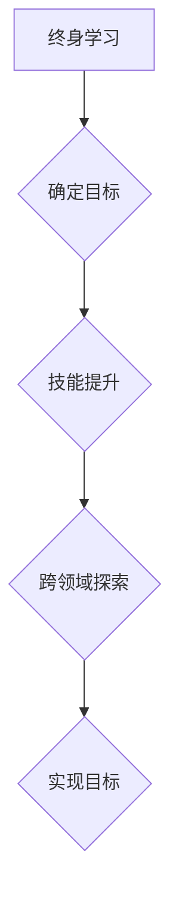

**讲解：**
终身学习是职业规划的基础，通过持续学习，确定职业目标并进行技能提升。在此基础上，进行跨领域探索，实现多元化发展，最终达到职业目标。

## 1.2 后工业时代的职业规划策略

### 1.2.1 确定职业目标

**核心概念与联系：**
- 职业目标：明确个人在职业生涯中想要实现的具体目标。
- 个人兴趣：结合个人兴趣和市场需求，确定合适的职业方向。

**ER实体关系图架构：**
```mermaid
erDiagram
  Person ||--|{ CareerGoal : '设定'}
  Person ||--|{ Interest : '结合'}
  CareerGoal ||--|{ Market : '需求'}
```

**讲解：**
通过结合个人兴趣和市场需求，设定明确的职业目标。ER实体关系图展示了个人、职业目标和市场需求之间的相互关系。

### 1.2.2 技能提升

**核心概念与联系：**
- 技能提升：通过学习和实践，提升个人在特定领域的专业能力。
- 终身学习：实现技能提升的重要途径。

**Mermaid 流程图：**
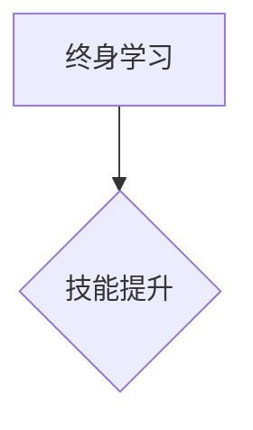

**讲解：**
终身学习是技能提升的基础，通过持续学习和实践，提升个人在特定领域的专业能力。

## 第2章：终身学习的重要性

终身学习是后工业时代职业规划的核心要素，它不仅能够帮助个人适应快速变化的工作环境，还能在职业生涯中保持竞争力。在这一章节中，我们将深入探讨终身学习的概念、原则及其在职业发展中的作用。

### 2.1 终身学习的定义与意义

**核心概念与联系：**
- 终身学习：指个人在其一生中不断获取知识、技能和价值观的过程。
- 职业发展：终身学习对于职业发展的支撑作用。

**ER实体关系图架构：**
```mermaid
erDiagram
  Person ||--|{ Lifelong Learning : '实践'
  Person ||--|{ CareerDevelopment : '支撑'}
  LifelongLearning ||--|{ Knowledge : '获取'}
```

**讲解：**
终身学习是一个持续的过程，通过不断获取新知识和技能，个人能够不断提升其职业竞争力。ER实体关系图展示了个人、终身学习和职业发展之间的相互关系。

### 2.2 终身学习的原则与方法

**核心概念与联系：**
- 自主性：终身学习的自主性原则，强调个人在学习过程中的主动性和独立性。
- 持续性：终身学习的持续性原则，强调学习应贯穿整个职业生涯。
- 灵活性：终身学习的灵活性原则，强调学习形式和内容的多样化。

**Mermaid 流程图：**
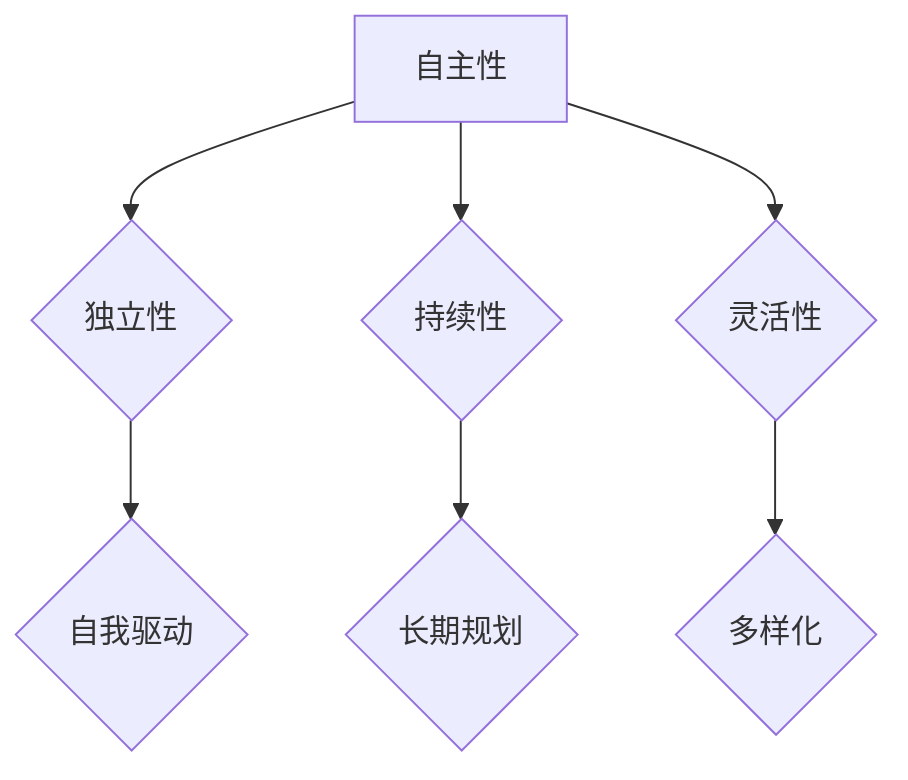

**讲解：**
终身学习的原则包括自主性、持续性和灵活性。这些原则通过不同的方式影响个人的学习过程，如图所示。

### 2.3 终身学习在职业发展中的应用

**核心概念与联系：**
- 技能提升：通过终身学习，个人能够不断提升技能，适应不断变化的市场需求。
- 职业转型：终身学习为职业转型提供了基础，使个人能够跨越不同领域。
- 创新能力：终身学习有助于培养创新思维，推动个人在职业生涯中的发展。

**Mermaid 流程图：**
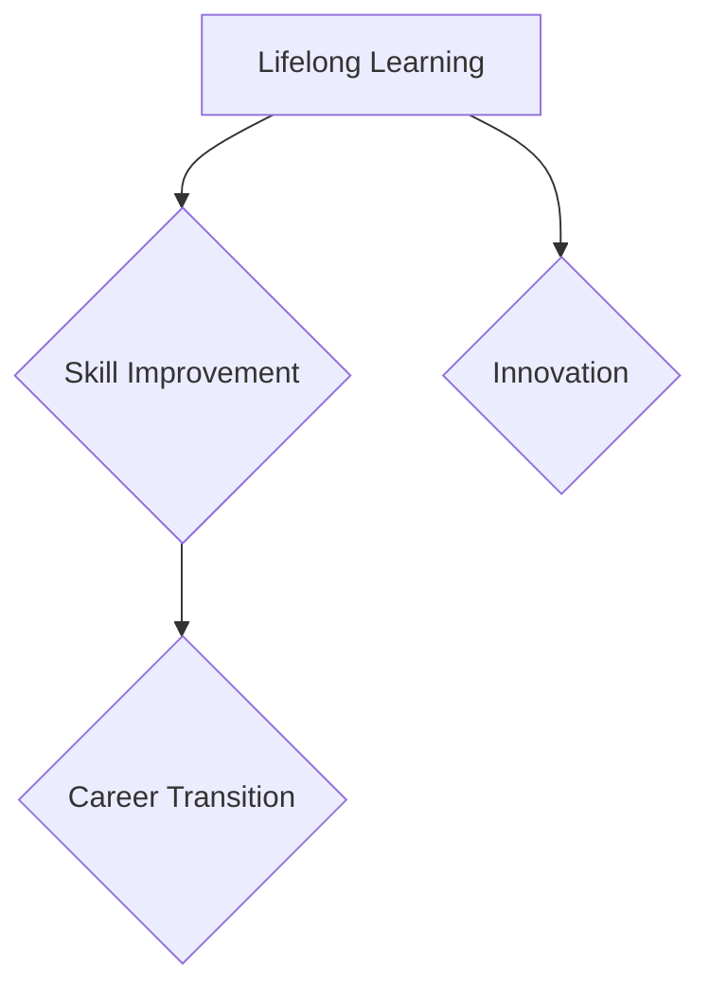

**讲解：**
终身学习不仅能够提升个人技能，还促进了职业转型和创新能力的发展。通过学习，个人能够不断适应职业市场的变化，保持竞争力。

### 2.4 终身学习的实践策略

**核心概念与联系：**
- 制定学习计划：制定个人学习计划，明确学习目标和时间安排。
- 利用在线资源：利用在线教育平台、学术论文、技术博客等资源进行学习。
- 参与行业活动：参与行业会议、技术沙龙等活动，与同行交流，拓宽视野。

**Mermaid 流程图：**
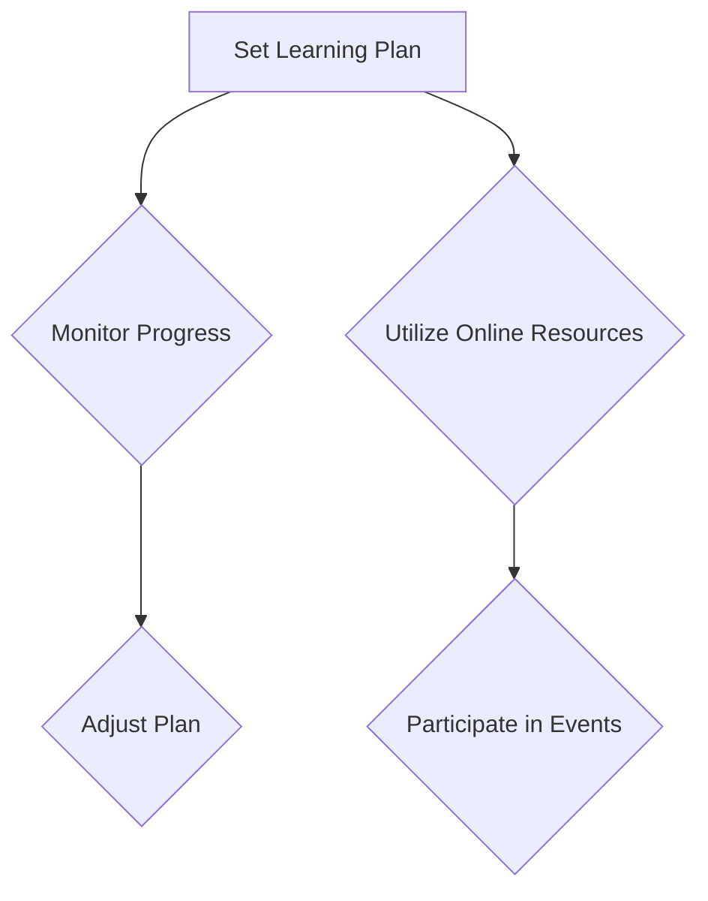

**讲解：**
终身学习的实践策略包括制定学习计划、利用在线资源、参与行业活动等，这些策略有助于个人有效地进行终身学习。

### 2.5 总结

终身学习是后工业时代职业规划的关键，它通过持续的知识和技能积累，帮助个人适应职业市场的变化，实现职业发展的目标。通过制定学习计划、利用在线资源和参与行业活动，个人可以有效地进行终身学习，为职业发展打下坚实的基础。

## 第3章：多元化发展的重要性

在当今快速变化的工作环境中，多元化发展成为职业规划的重要策略。它不仅能够提高个人的适应能力，还能为职业生涯带来新的机遇。在这一章节中，我们将探讨多元化发展的概念、原则以及其在职业规划中的应用。

### 3.1 多元化发展的定义与意义

**核心概念与联系：**
- 多元化发展：指个人在职业规划中，探索和尝试不同的职业领域和路径。
- 职业弹性：多元化发展有助于提高个人的职业弹性，降低职业风险。

**ER实体关系图架构：**
```mermaid
erDiagram
  Person ||--|{ DiversifiedDevelopment : '探索'}
  Person ||--|{ CareerFlexibility : '提升'}
  DiversifiedDevelopment ||--|{ NewOpportunities : '创造'}
```

**讲解：**
多元化发展是通过探索不同领域，创造新的职业机会，从而提高个人的职业弹性。ER实体关系图展示了个人、多元化发展和职业弹性之间的相互关系。

### 3.2 多元化发展的原则与方法

**核心概念与联系：**
- 跨领域学习：通过跨领域学习，个人能够掌握不同的知识和技能，为多元化发展打下基础。
- 资源整合：整合不同领域的资源，实现知识的互补和共享。
- 适应性：在多元化发展中，个人需要具备高度的适应性，以应对不同职业领域的要求。

**Mermaid 流程图：**
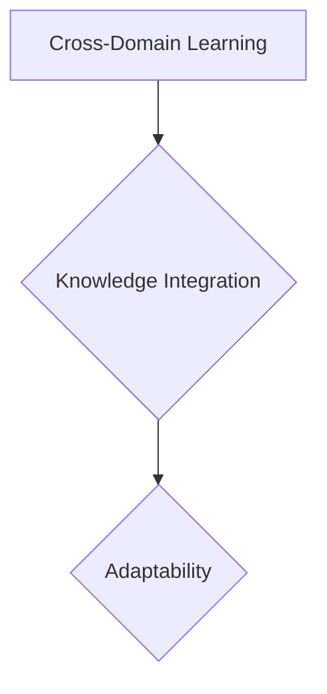

**讲解：**
多元化发展的原则包括跨领域学习、资源整合和适应性。这些原则通过不同的方式影响个人的多元化发展过程，如图所示。

### 3.3 多元化发展在职业规划中的应用

**核心概念与联系：**
- 职业转换：通过多元化发展，个人可以顺利实现职业转换，进入新的领域。
- 职业创新：多元化发展有助于激发职业创新思维，推动职业发展。
- 风险分散：通过多元化发展，个人能够降低职业风险，实现职业的稳定发展。

**Mermaid 流程图：**
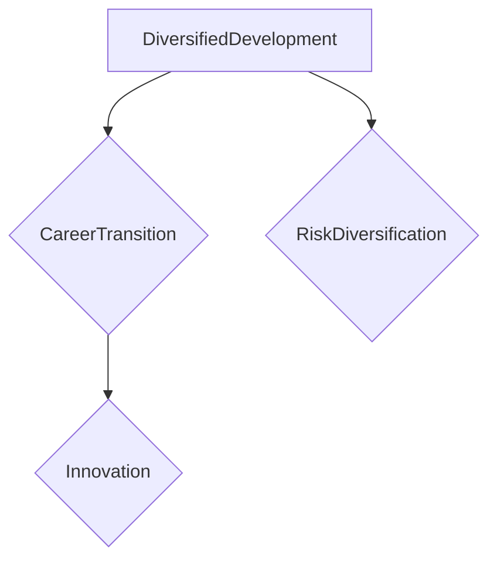

**讲解：**
多元化发展在职业规划中的应用包括职业转换、职业创新和风险分散。通过多元化发展，个人能够提高职业弹性，实现职业发展的多样性和稳定性。

### 3.4 多元化发展的实践策略

**核心概念与联系：**
- 探索兴趣领域：通过了解不同的职业领域，找到个人感兴趣的领域进行探索。
- 建立人际网络：通过建立广泛的人际网络，获取不同领域的资源和支持。
- 不断尝试新事物：勇于尝试新的事物和机会，积累不同领域的经验和技能。

**Mermaid 流程图：**
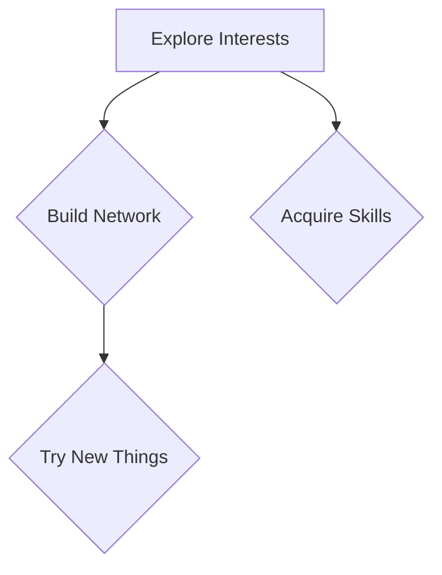

**讲解：**
多元化发展的实践策略包括探索兴趣领域、建立人际网络和不断尝试新事物。这些策略有助于个人在职业规划中实现多元化发展。

### 3.5 总结

多元化发展是后工业时代职业规划的重要组成部分，它通过跨领域学习、资源整合和适应性，为个人创造新的职业机会，提高职业弹性。通过探索兴趣领域、建立人际网络和不断尝试新事物，个人可以有效地进行多元化发展，实现职业规划的多样化目标。

## 第4章：技能提升与职业规划的结合

在职业规划的过程中，技能提升是不可或缺的一环。通过系统的技能提升，个人不仅能够适应不断变化的工作环境，还能在职业生涯中保持竞争力。在这一章节中，我们将探讨技能提升与职业规划之间的结合，以及如何通过有效的技能提升实现职业目标。

### 4.1 技能提升在职业规划中的作用

**核心概念与联系：**
- 技能提升：指通过学习和实践，提高个人在特定领域的专业能力。
- 职业规划：技能提升是实现职业规划的重要手段。

**ER实体关系图架构：**
```mermaid
erDiagram
  Person ||--|{ SkillImprovement : '实现'}
  Person ||--|{ CareerPlanning : '目标'}
  SkillImprovement ||--|{ Competitiveness : '提升'}
```

**讲解：**
技能提升在职业规划中扮演着关键角色，它通过提高个人的竞争力，帮助个人实现职业规划的目标。ER实体关系图展示了个人、技能提升和职业规划之间的相互关系。

### 4.2 技能提升的方法与策略

**核心概念与联系：**
- 在职培训：通过在职培训，个人能够系统地学习新的知识和技能。
- 在线学习：利用在线学习平台，个人可以灵活地获取最新的知识和技能。
- 实践项目：通过参与实践项目，个人能够将理论知识应用到实际工作中。

**Mermaid 流�行程图：**
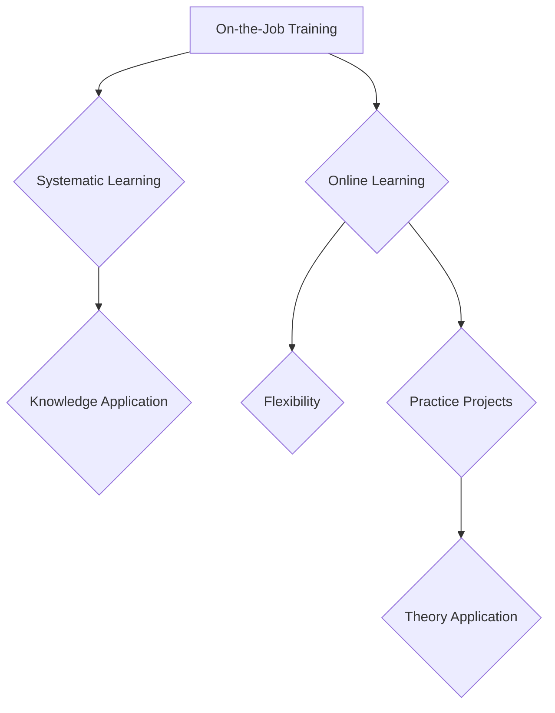

**讲解：**
技能提升的方法包括在职培训、在线学习和实践项目。这些策略通过不同的方式帮助个人提高专业技能，如图所示。

### 4.3 技能提升与职业目标的结合

**核心概念与联系：**
- 职业目标：明确个人在职业生涯中想要实现的具体目标。
- 技能提升：为实现职业目标，个人需要不断提升技能。

**Mermaid 流程图：**
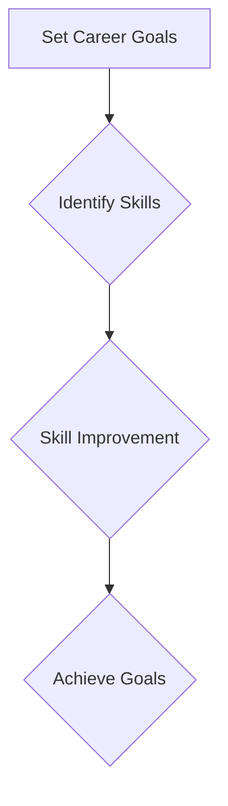

**讲解：**
技能提升与职业目标的结合是一个逐步实现的过程。个人首先需要设定职业目标，然后识别所需的技能，并通过技能提升实现职业目标。

### 4.4 技能提升的实践案例

**核心概念与联系：**
- 案例研究：通过分析成功的技能提升案例，了解技能提升的具体实践方法。
- 成功经验：总结技能提升过程中的成功经验，为其他个人提供借鉴。

**Mermaid 流程图：**
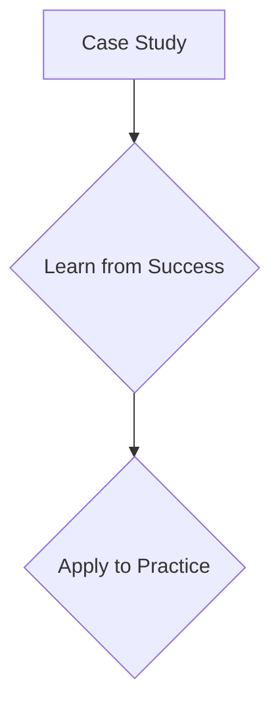

**讲解：**
技能提升的实践案例有助于个人了解成功的方法，从而应用到自身的技能提升过程中。通过学习成功经验，个人能够更加有效地进行技能提升。

### 4.5 总结

技能提升与职业规划的结合是实现职业生涯目标的关键。通过系统的技能提升，个人能够适应职业市场的要求，提高职业竞争力。通过设定职业目标、识别所需技能，并运用有效的技能提升方法，个人可以逐步实现职业目标，实现职业生涯的成功。

## 第5章：多元化发展的实践路径

多元化发展是后工业时代职业规划的重要组成部分，它为个人提供了广阔的发展空间。在这一章节中，我们将探讨多元化发展的实践路径，包括跨领域学习、资源整合和风险分散等关键步骤，帮助个人实现多元化发展。

### 5.1 跨领域学习的策略

**核心概念与联系：**
- 跨领域学习：指个人在学习过程中，探索和掌握不同领域的知识和技能。
- 知识整合：通过跨领域学习，个人能够将不同领域的知识整合起来，形成独特的竞争优势。

**ER实体关系图架构：**
```mermaid
erDiagram
  Person ||--|{ Cross-Domain Learning : '探索'}
  Person ||--|{ KnowledgeIntegration : '形成'}
  Cross-Domain Learning ||--|{ UniqueCompetitiveAdvantage : '创造'}
```

**讲解：**
跨领域学习是多元化发展的基础，通过探索和掌握不同领域的知识和技能，个人能够形成独特的竞争优势。ER实体关系图展示了个人、跨领域学习和竞争优势之间的相互关系。

### 5.2 资源整合的方法

**核心概念与联系：**
- 资源整合：指个人在职业发展过程中，利用各种资源实现知识和技能的互补和共享。
- 跨界合作：通过资源整合，个人能够与不同领域的专家和团队建立合作关系，共同解决问题。

**Mermaid 流程图：**
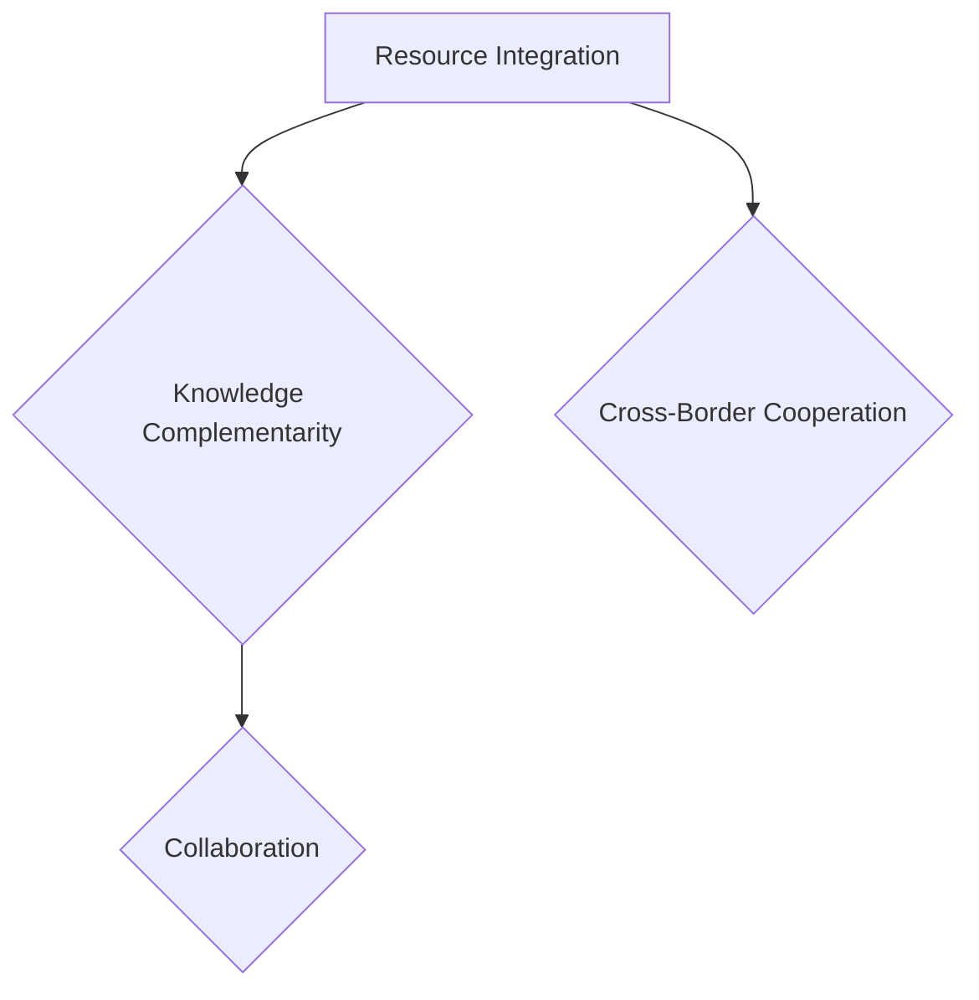

**讲解：**
资源整合是通过利用各种资源，实现知识和技能的互补和共享。通过跨界合作，个人能够与不同领域的专家和团队建立合作关系，共同解决问题。

### 5.3 风险分散的策略

**核心概念与联系：**
- 风险分散：指个人在职业规划中，通过多元化发展降低职业风险。
- 技能多样化：通过掌握多种技能，个人能够降低职业风险，提高职业稳定性。

**Mermaid 流程图：**
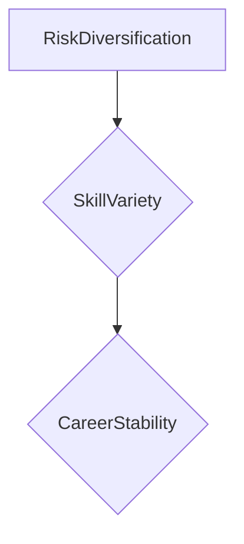

**讲解：**
风险分散是通过掌握多种技能，降低职业风险，提高职业稳定性。通过技能多样化，个人能够更好地应对职业市场的变化。

### 5.4 多元化发展的实践路径

**核心概念与联系：**
- 学习领域：通过跨领域学习，探索新的领域和技能。
- 资源获取：通过资源整合，获取不同领域的资源和信息。
- 风险管理：通过风险分散，降低职业风险，实现多元化发展。

**Mermaid 流程图：**
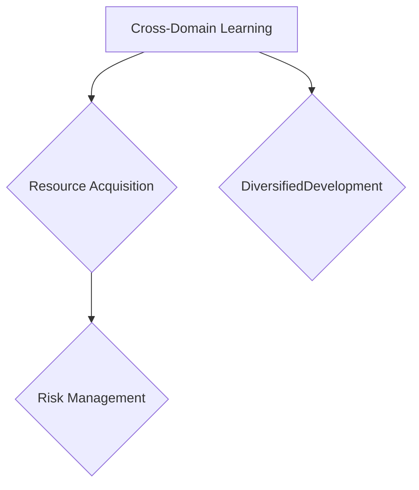

**讲解：**
多元化发展的实践路径包括跨领域学习、资源获取和风险管理。通过这些步骤，个人能够实现多元化发展，提高职业竞争力。

### 5.5 多元化发展的成功案例

**核心概念与联系：**
- 成功案例：通过分析成功的多元化发展案例，了解多元化发展的具体实践方法。
- 经验借鉴：总结成功经验，为其他个人提供多元化发展的借鉴。

**Mermaid 流程图：**
```mermaid
graph TB
    A[Case Analysis] --> B{Learn from Success}
    B --> C{Apply to Practice}
```

**讲解：**
通过分析成功的多元化发展案例，个人能够了解具体的实践方法，并从中汲取经验，为自身的多元化发展提供指导。

### 5.6 总结

多元化发展是后工业时代职业规划的重要组成部分，通过跨领域学习、资源整合和风险分散等实践路径，个人能够实现多元化发展，提高职业竞争力。通过学习和借鉴成功案例，个人可以更加有效地进行多元化发展，实现职业生涯的多样化目标。

## 第6章：后工业时代职业规划的总结与展望

在当今快速发展的社会中，后工业时代的职业规划变得尤为重要。本文通过探讨终身学习与多元化发展的重要性，提出了职业规划的关键策略和实践路径。以下是对后工业时代职业规划的总结与展望。

### 6.1 职业规划的核心理念

职业规划的核心理念在于结合终身学习和多元化发展，以适应不断变化的市场需求。终身学习强调个人在其职业生涯中持续提升知识和技能，以保持竞争力。多元化发展则鼓励个人探索不同的领域和机会，以实现职业的多样化和灵活性。

### 6.2 职业规划的关键策略

职业规划的关键策略包括：

1. **明确职业目标**：通过分析个人兴趣、能力和市场需求，设定明确的职业目标。
2. **终身学习**：通过持续学习和技能提升，不断提高职业竞争力。
3. **多元化发展**：通过跨领域学习和资源整合，探索新的职业机会。
4. **风险管理**：通过技能多样化和职业转换，降低职业风险。

### 6.3 职业规划的实践路径

职业规划的实践路径包括：

1. **跨领域学习**：通过参加培训课程、在线学习、实践项目等方式，掌握不同领域的知识和技能。
2. **资源整合**：通过建立人际网络、参与行业活动，获取不同领域的资源和信息。
3. **风险管理**：通过技能多样化和职业转换，降低职业风险，实现职业的稳定发展。

### 6.4 职业规划的展望

面对后工业时代的职业挑战，职业规划的未来展望包括：

1. **技术的进步**：随着人工智能、大数据等技术的不断发展，职业领域将出现更多的新兴职业。
2. **终身学习的普及**：随着在线教育和远程工作的普及，终身学习将变得更加便捷和普及。
3. **职业灵活性**：随着职业市场的变化，职业灵活性将成为个人发展的关键因素。

### 6.5 职业规划的最佳实践

职业规划的最佳实践包括：

1. **定期评估**：定期评估职业目标和技能水平，及时调整职业规划。
2. **持续学习**：保持持续学习的习惯，紧跟行业发展趋势。
3. **灵活适应**：在职业发展中保持灵活性，勇于接受新的挑战和机会。

### 6.6 总结

后工业时代的职业规划是一个长期且动态的过程，需要结合终身学习和多元化发展。通过明确的职业目标、持续的学习和实践，以及灵活的适应能力，个人可以更好地应对职业市场的变化，实现职业发展的成功。

### 6.7 结语

职业规划是一个不断探索和调整的过程。在这个充满变化的时代，终身学习和多元化发展将成为个人职业规划的核心。希望本文能够为读者提供有价值的参考和启示，助力他们在职业生涯中取得成功。

**作者：AI天才研究院/AI Genius Institute & 禅与计算机程序设计艺术 /Zen And The Art of Computer Programming**### 第2章：终身学习的重要性

终身学习是后工业时代职业规划的核心要素，它不仅能够帮助个人适应快速变化的工作环境，还能在职业生涯中保持竞争力。在这一章节中，我们将深入探讨终身学习的概念、原则及其在职业发展中的作用。

#### 2.1 终身学习的定义与意义

**核心概念与联系：**
- 终身学习：指个人在其一生中不断获取知识、技能和价值观的过程。
- 职业发展：终身学习对于职业发展的支撑作用。

**ER实体关系图架构：**
```mermaid
erDiagram
  Person ||--|{ Lifelong Learning : '实践'}
  Person ||--|{ CareerDevelopment : '支撑'}
  LifelongLearning ||--|{ Knowledge : '获取'}
```

**讲解：**
终身学习是一个持续的过程，通过不断获取新知识和技能，个人能够不断提升其职业竞争力。ER实体关系图展示了个人、终身学习和职业发展之间的相互关系。

#### 2.2 终身学习的原则与方法

**核心概念与联系：**
- 自主性：终身学习的自主性原则，强调个人在学习过程中的主动性和独立性。
- 持续性：终身学习的持续性原则，强调学习应贯穿整个职业生涯。
- 灵活性：终身学习的灵活性原则，强调学习形式和内容的多样化。

**Mermaid 流程图：**
```mermaid
graph TB
    A[自主性] --> B{独立性}
    B --> C{自我驱动}
    A --> D{持续性} --> E{长期规划}
    A --> F{灵活性} --> G{多样化}
```

**讲解：**
终身学习的原则包括自主性、持续性和灵活性。这些原则通过不同的方式影响个人的学习过程，如图所示。

#### 2.3 终身学习在职业发展中的应用

**核心概念与联系：**
- 技能提升：通过终身学习，个人能够不断提升技能，适应不断变化的市场需求。
- 职业转型：终身学习为职业转型提供了基础，使个人能够跨越不同领域。
- 创新能力：终身学习有助于培养创新思维，推动个人在职业生涯中的发展。

**Mermaid 流程图：**
```mermaid
graph TB
    A[Lifelong Learning] --> B{Skill Improvement}
    B --> C{Career Transition}
    A --> D{Innovation}
```

**讲解：**
终身学习在职业发展中的应用包括技能提升、职业转型和创新能力的发展。通过学习，个人能够不断适应职业市场的变化，保持竞争力。

#### 2.4 终身学习的实践策略

**核心概念与联系：**
- 制定学习计划：制定个人学习计划，明确学习目标和时间安排。
- 利用在线资源：利用在线教育平台、学术论文、技术博客等资源进行学习。
- 参与行业活动：参与行业会议、技术沙龙等活动，与同行交流，拓宽视野。

**Mermaid 流程图：**
```mermaid
graph TB
    A[Set Learning Plan] --> B{Monitor Progress}
    B --> C{Adjust Plan}
    A --> D{Utilize Online Resources}
    D --> E{Participate in Events}
```

**讲解：**
终身学习的实践策略包括制定学习计划、利用在线资源和参与行业活动等，这些策略有助于个人有效地进行终身学习。

#### 2.5 总结

终身学习是后工业时代职业规划的关键，它通过持续的知识和技能积累，帮助个人适应职业市场的变化，实现职业发展的目标。通过制定学习计划、利用在线资源和参与行业活动，个人可以有效地进行终身学习，为职业发展打下坚实的基础。

### 第3章：多元化发展的重要性

在当今快速变化的工作环境中，多元化发展成为职业规划的重要策略。它不仅能够提高个人的适应能力，还能为职业生涯带来新的机遇。在这一章节中，我们将探讨多元化发展的概念、原则以及其在职业规划中的应用。

#### 3.1 多元化发展的定义与意义

**核心概念与联系：**
- 多元化发展：指个人在职业规划中，探索和尝试不同的职业领域和路径。
- 职业弹性：多元化发展有助于提高个人的职业弹性，降低职业风险。

**ER实体关系图架构：**
```mermaid
erDiagram
  Person ||--|{ DiversifiedDevelopment : '探索'}
  Person ||--|{ CareerFlexibility : '提升'}
  DiversifiedDevelopment ||--|{ NewOpportunities : '创造'}
```

**讲解：**
多元化发展是通过探索不同领域，创造新的职业机会，从而提高个人的职业弹性。ER实体关系图展示了个人、多元化发展和职业弹性之间的相互关系。

#### 3.2 多元化发展的原则与方法

**核心概念与联系：**
- 跨领域学习：通过跨领域学习，个人能够掌握不同的知识和技能，为多元化发展打下基础。
- 资源整合：整合不同领域的资源，实现知识的互补和共享。
- 适应性：在多元化发展中，个人需要具备高度的适应性，以应对不同职业领域的要求。

**Mermaid 流程图：**
```mermaid
graph TB
    A[Cross-Domain Learning] --> B{Knowledge Integration}
    B --> C{Adaptability}
```

**讲解：**
多元化发展的原则包括跨领域学习、资源整合和适应性。这些原则通过不同的方式影响个人的多元化发展过程，如图所示。

#### 3.3 多元化发展在职业规划中的应用

**核心概念与联系：**
- 职业转换：通过多元化发展，个人可以顺利实现职业转换，进入新的领域。
- 职业创新：多元化发展有助于激发职业创新思维，推动职业发展。
- 风险分散：通过多元化发展，个人能够降低职业风险，实现职业的稳定发展。

**Mermaid 流程图：**
```mermaid
graph TB
    A[DiversifiedDevelopment] --> B{CareerTransition}
    B --> C{Innovation}
    A --> D{RiskDiversification}
```

**讲解：**
多元化发展在职业规划中的应用包括职业转换、职业创新和风险分散。通过多元化发展，个人能够提高职业弹性，实现职业发展的多样性和稳定性。

#### 3.4 多元化发展的实践策略

**核心概念与联系：**
- 探索兴趣领域：通过了解不同的职业领域，找到个人感兴趣的领域进行探索。
- 建立人际网络：通过建立广泛的人际网络，获取不同领域的资源和支持。
- 不断尝试新事物：勇于尝试新的事物和机会，积累不同领域的经验和技能。

**Mermaid 流程图：**
```mermaid
graph TB
    A[Explore Interests] --> B{Build Network}
    B --> C{Try New Things}
    A --> D{Acquire Skills}
```

**讲解：**
多元化发展的实践策略包括探索兴趣领域、建立人际网络和不断尝试新事物。这些策略有助于个人在职业规划中实现多元化发展。

#### 3.5 总结

多元化发展是后工业时代职业规划的重要组成部分，通过跨领域学习、资源整合和适应性，个人能够实现多元化发展，提高职业竞争力。通过探索兴趣领域、建立人际网络和不断尝试新事物，个人可以有效地进行多元化发展，实现职业规划的多样化目标。

## 第4章：技能提升与职业规划的结合

在职业规划的过程中，技能提升是不可或缺的一环。通过系统的技能提升，个人不仅能够适应不断变化的工作环境，还能在职业生涯中保持竞争力。在这一章节中，我们将探讨技能提升与职业规划之间的结合，以及如何通过有效的技能提升实现职业目标。

### 4.1 技能提升在职业规划中的作用

**核心概念与联系：**
- 技能提升：指通过学习和实践，提高个人在特定领域的专业能力。
- 职业规划：技能提升是实现职业规划的重要手段。

**ER实体关系图架构：**
```mermaid
erDiagram
  Person ||--|{ SkillImprovement : '实现'}
  Person ||--|{ CareerPlanning : '目标'}
  SkillImprovement ||--|{ Competitiveness : '提升'}
```

**讲解：**
技能提升在职业规划中扮演着关键角色，它通过提高个人的竞争力，帮助个人实现职业规划的目标。ER实体关系图展示了个人、技能提升和职业规划之间的相互关系。

### 4.2 技能提升的方法与策略

**核心概念与联系：**
- 在职培训：通过在职培训，个人能够系统地学习新的知识和技能。
- 在线学习：利用在线学习平台，个人可以灵活地获取最新的知识和技能。
- 实践项目：通过参与实践项目，个人能够将理论知识应用到实际工作中。

**Mermaid 流程图：**
```mermaid
graph TB
    A[On-the-Job Training] --> B{Systematic Learning}
    B --> C{Knowledge Application}
    A --> D{Online Learning} --> E{Flexibility}
    D --> F{Practice Projects} --> G{Theory Application}
```

**讲解：**
技能提升的方法包括在职培训、在线学习和实践项目。这些策略通过不同的方式帮助个人提高专业技能，如图所示。

### 4.3 技能提升与职业目标的结合

**核心概念与联系：**
- 职业目标：明确个人在职业生涯中想要实现的具体目标。
- 技能提升：为实现职业目标，个人需要不断提升技能。

**Mermaid 流程图：**
```mermaid
graph TB
    A[Set Career Goals] --> B{Identify Skills}
    B --> C{Skill Improvement}
    C --> D{Achieve Goals}
```

**讲解：**
技能提升与职业目标的结合是一个逐步实现的过程。个人首先需要设定职业目标，然后识别所需的技能，并通过技能提升实现职业目标。

### 4.4 技能提升的实践案例

**核心概念与联系：**
- 案例研究：通过分析成功的技能提升案例，了解技能提升的具体实践方法。
- 成功经验：总结技能提升过程中的成功经验，为其他个人提供借鉴。

**Mermaid 流程图：**
```mermaid
graph TB
    A[Case Study] --> B{Learn from Success}
    B --> C{Apply to Practice}
```

**讲解：**
通过分析成功的技能提升案例，个人能够了解具体的实践方法，并从中汲取经验，为自身的技能提升提供指导。

### 4.5 总结

技能提升与职业规划的结合是实现职业生涯目标的关键。通过系统的技能提升，个人能够适应职业市场的要求，提高职业竞争力。通过设定职业目标、识别所需技能，并运用有效的技能提升方法，个人可以逐步实现职业目标，实现职业生涯的成功。

## 第5章：多元化发展的实践路径

多元化发展是后工业时代职业规划的重要组成部分，它为个人提供了广阔的发展空间。在这一章节中，我们将探讨多元化发展的实践路径，包括跨领域学习、资源整合和风险分散等关键步骤，帮助个人实现多元化发展。

### 5.1 跨领域学习的策略

**核心概念与联系：**
- 跨领域学习：指个人在学习过程中，探索和掌握不同领域的知识和技能。
- 知识整合：通过跨领域学习，个人能够将不同领域的知识整合起来，形成独特的竞争优势。

**ER实体关系图架构：**
```mermaid
erDiagram
  Person ||--|{ Cross-Domain Learning : '探索'}
  Person ||--|{ KnowledgeIntegration : '形成'}
  Cross-Domain Learning ||--|{ UniqueCompetitiveAdvantage : '创造'}
```

**讲解：**
跨领域学习是多元化发展的基础，通过探索和掌握不同领域的知识和技能，个人能够形成独特的竞争优势。ER实体关系图展示了个人、跨领域学习和竞争优势之间的相互关系。

### 5.2 资源整合的方法

**核心概念与联系：**
- 资源整合：指个人在职业发展过程中，利用各种资源实现知识和技能的互补和共享。
- 跨界合作：通过资源整合，个人能够与不同领域的专家和团队建立合作关系，共同解决问题。

**Mermaid 流程图：**
```mermaid
graph TB
    A[Resource Integration] --> B{Knowledge Complementarity}
    B --> C{Collaboration}
    A --> D{Cross-Border Cooperation}
```

**讲解：**
资源整合是通过利用各种资源，实现知识和技能的互补和共享。通过跨界合作，个人能够与不同领域的专家和团队建立合作关系，共同解决问题。

### 5.3 风险分散的策略

**核心概念与联系：**
- 风险分散：指个人在职业规划中，通过多元化发展降低职业风险。
- 技能多样化：通过掌握多种技能，个人能够降低职业风险，提高职业稳定性。

**Mermaid 流程图：**
```mermaid
graph TB
    A[RiskDiversification] --> B{SkillVariety}
    B --> C{CareerStability}
```

**讲解：**
风险分散是通过掌握多种技能，降低职业风险，提高职业稳定性。通过技能多样化，个人能够更好地应对职业市场的变化。

### 5.4 多元化发展的实践路径

**核心概念与联系：**
- 学习领域：通过跨领域学习，探索新的领域和技能。
- 资源获取：通过资源整合，获取不同领域的资源和信息。
- 风险管理：通过风险分散，降低职业风险，实现多元化发展。

**Mermaid 流程图：**
```mermaid
graph TB
    A[Cross-Domain Learning] --> B{Resource Acquisition}
    B --> C{Risk Management}
    A --> D{DiversifiedDevelopment}
```

**讲解：**
多元化发展的实践路径包括跨领域学习、资源获取和风险管理。通过这些步骤，个人能够实现多元化发展，提高职业竞争力。

### 5.5 多元化发展的成功案例

**核心概念与联系：**
- 成功案例：通过分析成功的多元化发展案例，了解多元化发展的具体实践方法。
- 经验借鉴：总结成功经验，为其他个人提供多元化发展的借鉴。

**Mermaid 流程图：**
```mermaid
graph TB
    A[Case Analysis] --> B{Learn from Success}
    B --> C{Apply to Practice}
```

**讲解：**
通过分析成功的多元化发展案例，个人能够了解具体的实践方法，并从中汲取经验，为自身的多元化发展提供指导。

### 5.6 总结

多元化发展是后工业时代职业规划的重要组成部分，通过跨领域学习、资源整合和风险分散等实践路径，个人能够实现多元化发展，提高职业竞争力。通过学习和借鉴成功案例，个人可以更加有效地进行多元化发展，实现职业生涯的多样化目标。

## 第6章：后工业时代职业规划的总结与展望

在当今快速发展的社会中，后工业时代的职业规划变得尤为重要。本文通过探讨终身学习与多元化发展的重要性，提出了职业规划的关键策略和实践路径。以下是对后工业时代职业规划的总结与展望。

### 6.1 职业规划的核心理念

职业规划的核心理念在于结合终身学习和多元化发展，以适应不断变化的市场需求。终身学习强调个人在其职业生涯中持续提升知识和技能，以保持竞争力。多元化发展则鼓励个人探索不同的领域和机会，以实现职业的多样化和灵活性。

### 6.2 职业规划的关键策略

职业规划的关键策略包括：

1. **明确职业目标**：通过分析个人兴趣、能力和市场需求，设定明确的职业目标。
2. **终身学习**：通过持续学习和技能提升，不断提高职业竞争力。
3. **多元化发展**：通过跨领域学习和资源整合，探索新的职业机会。
4. **风险管理**：通过技能多样化和职业转换，降低职业风险，实现多元化发展。

### 6.3 职业规划的实践路径

职业规划的实践路径包括：

1. **跨领域学习**：通过参加培训课程、在线学习、实践项目等方式，掌握不同领域的知识和技能。
2. **资源整合**：通过建立人际网络、参与行业活动，获取不同领域的资源和信息。
3. **风险管理**：通过技能多样化和职业转换，降低职业风险，实现多元化发展。

### 6.4 职业规划的展望

面对后工业时代的职业挑战，职业规划的未来展望包括：

1. **技术的进步**：随着人工智能、大数据等技术的不断发展，职业领域将出现更多的新兴职业。
2. **终身学习的普及**：随着在线教育和远程工作的普及，终身学习将变得更加便捷和普及。
3. **职业灵活性**：随着职业市场的变化，职业灵活性将成为个人发展的关键因素。

### 6.5 职业规划的最佳实践

职业规划的最佳实践包括：

1. **定期评估**：定期评估职业目标和技能水平，及时调整职业规划。
2. **持续学习**：保持持续学习的习惯，紧跟行业发展趋势。
3. **灵活适应**：在职业发展中保持灵活性，勇于接受新的挑战和机会。

### 6.6 总结

后工业时代的职业规划是一个长期且动态的过程，需要结合终身学习和多元化发展。通过明确的职业目标、持续的学习和实践，以及灵活的适应能力，个人可以更好地应对职业市场的变化，实现职业发展的成功。

### 6.7 结语

职业规划是一个不断探索和调整的过程。在这个充满变化的时代，终身学习和多元化发展将成为个人职业规划的核心。希望本文能够为读者提供有价值的参考和启示，助力他们在职业生涯中取得成功。

**作者：AI天才研究院/AI Genius Institute & 禅与计算机程序设计艺术 /Zen And The Art of Computer Programming**

### 第2章：终身学习的重要性

终身学习是后工业时代职业规划的核心要素，它不仅能够帮助个人适应快速变化的工作环境，还能在职业生涯中保持竞争力。在这一章节中，我们将深入探讨终身学习的概念、原则及其在职业发展中的作用。

#### 2.1 终身学习的定义与意义

**核心概念与联系：**
- 终身学习：指个人在其一生中不断获取知识、技能和价值观的过程。
- 职业发展：终身学习对于职业发展的支撑作用。

**ER实体关系图架构：**
```mermaid
erDiagram
  Student ||--|{ Lifelong Learning : '实践'}
  Student ||--|{ CareerDevelopment : '支撑'}
  Lifelong Learning ||--|{ Knowledge : '获取'}
```

**讲解：**
终身学习是一个持续的过程，通过不断获取新知识和技能，个人能够不断提升其职业竞争力。ER实体关系图展示了学生、终身学习和职业发展之间的相互关系。

#### 2.2 终身学习的原则与方法

**核心概念与联系：**
- 自主性：终身学习的自主性原则，强调个人在学习过程中的主动性和独立性。
- 持续性：终身学习的持续性原则，强调学习应贯穿整个职业生涯。
- 灵活性：终身学习的灵活性原则，强调学习形式和内容的多样化。

**Mermaid 流程图：**
```mermaid
graph TB
    A[自主性] --> B{独立性}
    B --> C{自我驱动}
    A --> D{持续性} --> E{长期规划}
    A --> F{灵活性} --> G{多样化}
```

**讲解：**
终身学习的原则包括自主性、持续性和灵活性。这些原则通过不同的方式影响个人的学习过程，如图所示。

#### 2.3 终身学习在职业发展中的应用

**核心概念与联系：**
- 技能提升：通过终身学习，个人能够不断提升技能，适应不断变化的市场需求。
- 职业转型：终身学习为职业转型提供了基础，使个人能够跨越不同领域。
- 创新能力：终身学习有助于培养创新思维，推动个人在职业生涯中的发展。

**Mermaid 流程图：**
```mermaid
graph TB
    A[Lifelong Learning] --> B{Skill Improvement}
    B --> C{Career Transition}
    A --> D{Innovation}
```

**讲解：**
终身学习在职业发展中的应用包括技能提升、职业转型和创新能力的发展。通过学习，个人能够不断适应职业市场的变化，保持竞争力。

#### 2.4 终身学习的实践策略

**核心概念与联系：**
- 制定学习计划：制定个人学习计划，明确学习目标和时间安排。
- 利用在线资源：利用在线教育平台、学术论文、技术博客等资源进行学习。
- 参与行业活动：参与行业会议、技术沙龙等活动，与同行交流，拓宽视野。

**Mermaid 流程图：**
```mermaid
graph TB
    A[Set Learning Plan] --> B{Monitor Progress}
    B --> C{Adjust Plan}
    A --> D{Utilize Online Resources}
    D --> E{Participate in Events}
```

**讲解：**
终身学习的实践策略包括制定学习计划、利用在线资源和参与行业活动等，这些策略有助于个人有效地进行终身学习。

#### 2.5 总结

终身学习是后工业时代职业规划的关键，它通过持续的知识和技能积累，帮助个人适应职业市场的变化，实现职业发展的目标。通过制定学习计划、利用在线资源和参与行业活动，个人可以有效地进行终身学习，为职业发展打下坚实的基础。

### 第3章：多元化发展的重要性

在当今快速变化的工作环境中，多元化发展成为职业规划的重要策略。它不仅能够提高个人的适应能力，还能为职业生涯带来新的机遇。在这一章节中，我们将探讨多元化发展的概念、原则以及其在职业规划中的应用。

#### 3.1 多元化发展的定义与意义

**核心概念与联系：**
- 多元化发展：指个人在职业规划中，探索和尝试不同的职业领域和路径。
- 职业弹性：多元化发展有助于提高个人的职业弹性，降低职业风险。

**ER实体关系图架构：**
```mermaid
erDiagram
  Person ||--|{ DiversifiedDevelopment : '探索'}
  Person ||--|{ CareerFlexibility : '提升'}
  DiversifiedDevelopment ||--|{ NewOpportunities : '创造'}
```

**讲解：**
多元化发展是通过探索不同领域，创造新的职业机会，从而提高个人的职业弹性。ER实体关系图展示了个人、多元化发展和职业弹性之间的相互关系。

#### 3.2 多元化发展的原则与方法

**核心概念与联系：**
- 跨领域学习：通过跨领域学习，个人能够掌握不同的知识和技能，为多元化发展打下基础。
- 资源整合：整合不同领域的资源，实现知识的互补和共享。
- 适应性：在多元化发展中，个人需要具备高度的适应性，以应对不同职业领域的要求。

**Mermaid 流程图：**
```mermaid
graph TB
    A[Cross-Domain Learning] --> B{Knowledge Integration}
    B --> C{Adaptability}
```

**讲解：**
多元化发展的原则包括跨领域学习、资源整合和适应性。这些原则通过不同的方式影响个人的多元化发展过程，如图所示。

#### 3.3 多元化发展在职业规划中的应用

**核心概念与联系：**
- 职业转换：通过多元化发展，个人可以顺利实现职业转换，进入新的领域。
- 职业创新：多元化发展有助于激发职业创新思维，推动职业发展。
- 风险分散：通过多元化发展，个人能够降低职业风险，实现职业的稳定发展。

**Mermaid 流程图：**
```mermaid
graph TB
    A[DiversifiedDevelopment] --> B{CareerTransition}
    B --> C{Innovation}
    A --> D{RiskDiversification}
```

**讲解：**
多元化发展在职业规划中的应用包括职业转换、职业创新和风险分散。通过多元化发展，个人能够提高职业弹性，实现职业发展的多样性和稳定性。

#### 3.4 多元化发展的实践策略

**核心概念与联系：**
- 探索兴趣领域：通过了解不同的职业领域，找到个人感兴趣的领域进行探索。
- 建立人际网络：通过建立广泛的人际网络，获取不同领域的资源和支持。
- 不断尝试新事物：勇于尝试新的事物和机会，积累不同领域的经验和技能。

**Mermaid 流程图：**
```mermaid
graph TB
    A[Explore Interests] --> B{Build Network}
    B --> C{Try New Things}
    A --> D{Acquire Skills}
```

**讲解：**
多元化发展的实践策略包括探索兴趣领域、建立人际网络和不断尝试新事物。这些策略有助于个人在职业规划中实现多元化发展。

#### 3.5 总结

多元化发展是后工业时代职业规划的重要组成部分，通过跨领域学习、资源整合和适应性，个人能够实现多元化发展，提高职业竞争力。通过探索兴趣领域、建立人际网络和不断尝试新事物，个人可以有效地进行多元化发展，实现职业规划的多样化目标。

### 第4章：技能提升与职业规划的结合

在职业规划的过程中，技能提升是不可或缺的一环。通过系统的技能提升，个人不仅能够适应不断变化的工作环境，还能在职业生涯中保持竞争力。在这一章节中，我们将探讨技能提升与职业规划之间的结合，以及如何通过有效的技能提升实现职业目标。

#### 4.1 技能提升在职业规划中的作用

**核心概念与联系：**
- 技能提升：指通过学习和实践，提高个人在特定领域的专业能力。
- 职业规划：技能提升是实现职业规划的重要手段。

**ER实体关系图架构：**
```mermaid
erDiagram
  Person ||--|{ SkillImprovement : '实现'}
  Person ||--|{ CareerPlanning : '目标'}
  SkillImprovement ||--|{ Competitiveness : '提升'}
```

**讲解：**
技能提升在职业规划中扮演着关键角色，它通过提高个人的竞争力，帮助个人实现职业规划的目标。ER实体关系图展示了个人、技能提升和职业规划之间的相互关系。

#### 4.2 技能提升的方法与策略

**核心概念与联系：**
- 在职培训：通过在职培训，个人能够系统地学习新的知识和技能。
- 在线学习：利用在线学习平台，个人可以灵活地获取最新的知识和技能。
- 实践项目：通过参与实践项目，个人能够将理论知识应用到实际工作中。

**Mermaid 流程图：**
```mermaid
graph TB
    A[On-the-Job Training] --> B{Systematic Learning}
    B --> C{Knowledge Application}
    A --> D{Online Learning} --> E{Flexibility}
    D --> F{Practice Projects} --> G{Theory Application}
```

**讲解：**
技能提升的方法包括在职培训、在线学习和实践项目。这些策略通过不同的方式帮助个人提高专业技能，如图所示。

#### 4.3 技能提升与职业目标的结合

**核心概念与联系：**
- 职业目标：明确个人在职业生涯中想要实现的具体目标。
- 技能提升：为实现职业目标，个人需要不断提升技能。

**Mermaid 流程图：**
```mermaid
graph TB
    A[Set Career Goals] --> B{Identify Skills}
    B --> C{Skill Improvement}
    C --> D{Achieve Goals}
```

**讲解：**
技能提升与职业目标的结合是一个逐步实现的过程。个人首先需要设定职业目标，然后识别所需的技能，并通过技能提升实现职业目标。

#### 4.4 技能提升的实践案例

**核心概念与联系：**
- 案例研究：通过分析成功的技能提升案例，了解技能提升的具体实践方法。
- 成功经验：总结技能提升过程中的成功经验，为其他个人提供借鉴。

**Mermaid 流程图：**
```mermaid
graph TB
    A[Case Study] --> B{Learn from Success}
    B --> C{Apply to Practice}
```

**讲解：**
通过分析成功的技能提升案例，个人能够了解具体的实践方法，并从中汲取经验，为自身的技能提升提供指导。

#### 4.5 总结

技能提升与职业规划的结合是实现职业生涯目标的关键。通过系统的技能提升，个人能够适应职业市场的要求，提高职业竞争力。通过设定职业目标、识别所需技能，并运用有效的技能提升方法，个人可以逐步实现职业目标，实现职业生涯的成功。

### 第5章：多元化发展的实践路径

多元化发展是后工业时代职业规划的重要组成部分，它为个人提供了广阔的发展空间。在这一章节中，我们将探讨多元化发展的实践路径，包括跨领域学习、资源整合和风险分散等关键步骤，帮助个人实现多元化发展。

#### 5.1 跨领域学习的策略

**核心概念与联系：**
- 跨领域学习：指个人在学习过程中，探索和掌握不同领域的知识和技能。
- 知识整合：通过跨领域学习，个人能够将不同领域的知识整合起来，形成独特的竞争优势。

**ER实体关系图架构：**
```mermaid
erDiagram
  Person ||--|{ Cross-Domain Learning : '探索'}
  Person ||--|{ KnowledgeIntegration : '形成'}
  Cross-Domain Learning ||--|{ UniqueCompetitiveAdvantage : '创造'}
```

**讲解：**
跨领域学习是多元化发展的基础，通过探索和掌握不同领域的知识和技能，个人能够形成独特的竞争优势。ER实体关系图展示了个人、跨领域学习和竞争优势之间的相互关系。

#### 5.2 资源整合的方法

**核心概念与联系：**
- 资源整合：指个人在职业发展过程中，利用各种资源实现知识和技能的互补和共享。
- 跨界合作：通过资源整合，个人能够与不同领域的专家和团队建立合作关系，共同解决问题。

**Mermaid 流程图：**
```mermaid
graph TB
    A[Resource Integration] --> B{Knowledge Complementarity}
    B --> C{Collaboration}
    A --> D{Cross-Border Cooperation}
```

**讲解：**
资源整合是通过利用各种资源，实现知识和技能的互补和共享。通过跨界合作，个人能够与不同领域的专家和团队建立合作关系，共同解决问题。

#### 5.3 风险分散的策略

**核心概念与联系：**
- 风险分散：指个人在职业规划中，通过多元化发展降低职业风险。
- 技能多样化：通过掌握多种技能，个人能够降低职业风险，提高职业稳定性。

**Mermaid 流程图：**
```mermaid
graph TB
    A[RiskDiversification] --> B{SkillVariety}
    B --> C{CareerStability}
```

**讲解：**
风险分散是通过掌握多种技能，降低职业风险，提高职业稳定性。通过技能多样化，个人能够更好地应对职业市场的变化。

#### 5.4 多元化发展的实践路径

**核心概念与联系：**
- 学习领域：通过跨领域学习，探索新的领域和技能。
- 资源获取：通过资源整合，获取不同领域的资源和信息。
- 风险管理：通过风险分散，降低职业风险，实现多元化发展。

**Mermaid 流程图：**
```mermaid
graph TB
    A[Cross-Domain Learning] --> B{Resource Acquisition}
    B --> C{Risk Management}
    A --> D{DiversifiedDevelopment}
```

**讲解：**
多元化发展的实践路径包括跨领域学习、资源获取和风险管理。通过这些步骤，个人能够实现多元化发展，提高职业竞争力。

#### 5.5 多元化发展的成功案例

**核心概念与联系：**
- 成功案例：通过分析成功的多元化发展案例，了解多元化发展的具体实践方法。
- 经验借鉴：总结成功经验，为其他个人提供多元化发展的借鉴。

**Mermaid 流程图：**
```mermaid
graph TB
    A[Case Analysis] --> B{Learn from Success}
    B --> C{Apply to Practice}
```

**讲解：**
通过分析成功的多元化发展案例，个人能够了解具体的实践方法，并从中汲取经验，为自身的多元化发展提供指导。

#### 5.6 总结

多元化发展是后工业时代职业规划的重要组成部分，通过跨领域学习、资源整合和风险分散等实践路径，个人能够实现多元化发展，提高职业竞争力。通过学习和借鉴成功案例，个人可以更加有效地进行多元化发展，实现职业生涯的多样化目标。

