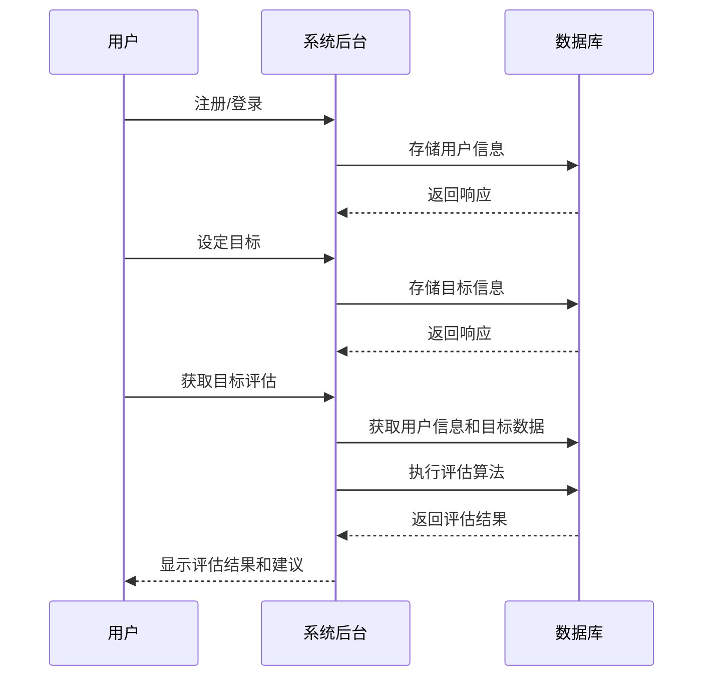

                 

### 《后成功学时代：重新定义人生目标》

#### 关键词：成功学、后成功学、人生目标、价值观、心理健康

> 摘要：本文将深入探讨成功学在现代社会中的起源、局限，以及后成功学时代的崛起。通过重新审视人生目标，本文旨在为读者提供一个在新时代背景下重新定义个人目标和价值观的框架。文章将详细分析后成功学时代对职业规划、教育和人际关系的全新影响，以及如何在心理健康层面应对时代变革。最终，我们将提供实际案例和行动指南，帮助读者在新时代中找到真正的成功与满足。

### 第一部分：成功学反思

#### 第1章：成功学的起源与演变

**1.1 成功学的起源**

成功学起源于20世纪中叶，源自于对人类潜能的探索和个人成长的关注。代表人物如戴尔·卡耐基（Dale Carnegie）和拿破仑·希尔（Napoleon Hill）提出了通过积极思维、自我激励和人际交往技巧来获得成功的方法。这些理论迅速传播，形成了成功的“科学”体系。

**1.2 成功学的主要流派**

成功学主要分为两个流派：心理流派对人类心理的深度研究，强调自我认知和情绪管理；行为流派则注重行动和实践，提倡设定明确目标并持续努力。

**1.3 成功学的挑战与批评**

然而，成功学并非没有批评。批评者指出，成功学的某些理论过于简化人类行为的复杂性，忽视了社会背景和环境因素。此外，过度追求成功可能导致心理压力和人际关系问题。

#### 第2章：成功学的局限

**2.1 成功学背后的价值观**

成功学通常基于个体主义价值观，强调个人成就和财富积累。这种价值观可能忽视集体和社会责任。

**2.2 成功学对个体的负面影响**

成功学可能导致个体心理压力过大，出现焦虑、抑郁等问题。同时，过度追求成功可能牺牲个人健康和生活质量。

**2.3 成功学的经济与社会影响**

在社会层面，成功学可能加剧贫富差距，导致社会不平等。此外，它也可能导致教育和职业市场的过度竞争。

#### 第3章：后成功学时代的兴起

**3.1 后成功学的定义**

后成功学时代是对成功学的一种反思和修正，强调多维度的成功和个人成长。它关注个人幸福、心理健康和社会责任。

**3.2 后成功学的主要观点**

后成功学主张：成功不仅仅是个体成就，还包括健康、人际关系、社区参与等方面；成功是个人价值观的体现，而非单纯的物质积累。

**3.3 后成功学时代的社会背景**

随着全球化和信息技术的发展，人们的生活方式和价值观发生了变化。后成功学时代正是这种社会变革的产物。

### 第二部分：重新审视人生目标

#### 第4章：重新审视人生目标

**4.1 传统人生目标的重构**

在后成功学时代，我们需要重新思考传统的人生目标。这包括追求个人成长、心理健康和社会责任。

**4.2 个人价值观的重塑**

个人价值观在后成功学时代变得尤为重要。我们需要明确自己的核心价值观，并使其成为指导人生决策的基准。

**4.3 新型人生目标的探索**

新型人生目标强调内在满足感和对社会的贡献。通过自我探索和价值观的重塑，我们可以找到更符合自己内心的目标。

#### 第5章：后成功学时代的人生规划

**5.1 职业规划的新视角**

在后成功学时代，职业规划不再仅仅关注薪资和地位，而是要找到与个人价值观相符的工作。

**5.2 教育与学习的转变**

教育应该培养全面发展的人才，而不仅仅是职业技能。学习应该是一个终身的过程，关注个人成长和兴趣。

**5.3 社交与人际关系的重构**

人际关系在后成功学时代变得尤为重要。我们需要建立真正的友谊和互助网络，而不仅仅是表面社交。

#### 第6章：后成功学时代的心理健康

**6.1 心理健康的定义**

心理健康不仅仅是心理疾病的预防，更是追求个人成长和幸福。

**6.2 如何应对心理压力**

心理压力是现代社会普遍存在的问题。我们需要学会有效管理压力，保持心理健康。

**6.3 心理健康的维护与提升**

通过自我觉察、情绪管理和积极的生活方式，我们可以维护和提升心理健康。

#### 第7章：后成功学时代的未来展望

**7.1 后成功学时代的可能走向**

后成功学时代可能会带来社会、经济和文化的深刻变革。这些变革将如何影响我们的生活，仍需继续观察。

**7.2 新型人生目标的实现路径**

实现新型人生目标需要我们不断探索和实践。本文提供了一些可能的路径和策略。

**7.3 对未来的反思与建议**

在未来的发展中，我们需要保持反思和开放的态度，不断适应和引领时代的变迁。

#### 第8章：行动指南

**8.1 如何重新定义人生目标**

重新定义人生目标是一个逐步的过程。本文提供了一些具体的方法和建议。

**8.2 跨越成功学困境的实践策略**

成功学困境是现代社会普遍存在的问题。本文提供了一些实用的策略，帮助读者跨越这一困境。

**8.3 打造后成功学时代的人生**

通过明确个人价值观、制定合理的人生目标和保持心理健康，我们可以打造一个后成功学时代的人生。

#### 第9章：案例研究

**9.1 案例一：张三的后成功学转型**

通过张三的案例，我们可以看到一个人在后成功学时代的转型过程。

**9.2 案例二：李四的价值观重构**

李四的案例展示了如何通过价值观的重构来重新定义自己的人生目标。

**9.3 案例三：王五的人生目标重定义**

王五的案例告诉我们，在新的时代背景下，重新定义人生目标是非常重要的。

#### 第10章：结语

**10.1 后成功学时代的重要性**

后成功学时代对个人和社会都具有深远的意义。我们需要认真思考和应对这一时代的挑战。

**10.2 重新定义人生目标的必要性**

重新定义人生目标不仅有助于个人成长，也是社会进步的基石。

**10.3 对未来的期许与建议**

在未来，我们需要保持开放的心态，积极探索和实现新的人生目标。

### 作者：AI天才研究院/AI Genius Institute & 禅与计算机程序设计艺术 /Zen And The Art of Computer Programming

---

**本文旨在为读者提供一个在后成功学时代重新定义人生目标和价值观的框架。通过深入分析成功学的起源、局限，以及后成功学时代的崛起，本文希望帮助读者在新的时代背景下找到真正的成功与满足。**

## 背景介绍

在探讨后成功学时代之前，我们有必要对成功学本身进行深入的背景分析。成功学作为一种思想和实践体系，其起源可以追溯到20世纪中叶。当时，社会经济迅速发展，人们渴望通过个人努力和智慧来实现物质上的成功和社会地位的提升。这种背景催生了一批成功学著作和思想的诞生，其中最具代表性的包括戴尔·卡耐基的《人性的弱点》和拿破仑·希尔的《思考致富》。

**核心概念术语说明：**

1. **成功学**：一种强调通过特定方法和技术，实现个人成就和社会地位提升的思想体系。
2. **个人成就**：指个体在职业、财富、社会地位等方面的成就。
3. **社会地位**：个体在社会结构中的位置和影响力。

**问题背景：**

随着成功学的广泛传播，越来越多的人开始追求所谓的“成功”。然而，这种追求在带来物质繁荣的同时，也引发了一系列问题。人们开始感到心理压力增大，人际关系紧张，甚至出现精神健康问题。此外，成功学强调的个人主义价值观也在一定程度上加剧了社会不平等现象。

**问题描述：**

成功学带来的问题主要集中在以下几个方面：

1. **心理压力**：过度追求成功可能导致个体心理负担过重，出现焦虑、抑郁等症状。
2. **人际关系**：成功学强调个人主义，可能导致人际关系的疏离和紧张。
3. **社会不平等**：成功学鼓励个体追求物质上的成功，加剧了社会贫富差距。

**问题解决：**

为了应对成功学带来的问题，人们开始反思成功学的本质和局限性，进而提出了后成功学这一概念。后成功学主张多维度的成功，强调个人成长、心理健康和社会责任。

**边界与外延：**

后成功学不仅是对成功学的修正，更是一种对现代生活方式的深刻反思。它关注的不仅仅是物质成功，还包括个人的幸福、心理健康和社会的可持续发展。

**概念结构与核心要素组成：**

1. **个人成长**：后成功学强调个人成长的重要性，认为个人的全面成长是实现多维成功的基础。
2. **心理健康**：心理健康是后成功学的重要组成部分，它关乎个体的幸福感和社会适应能力。
3. **社会责任**：后成功学认为，个人的成功不仅仅是个体的私事，更是对社会的一种责任。

通过上述背景介绍，我们可以看到，成功学在后成功学时代的崛起中扮演了重要角色。后成功学不仅是对成功学的反思和修正，更是一种对现代生活方式的深刻理解和重新定义。

### 核心概念与联系

在后成功学时代，我们需要明确几个核心概念，这些概念相互联系，构成了我们对成功与幸福的新理解。首先，我们要探讨“成功”的定义。传统成功学往往将成功等同于物质财富和社会地位的提升，但这种单一维度的成功观在后成功学时代受到了挑战。在后成功学中，成功不仅仅是指个人在职业或财富上的成就，更包括心理健康、人际关系和社会贡献等多个维度。

**核心概念原理：**

1. **多维成功**：多维成功是指个人在多个领域（如职业、健康、人际关系、社区参与等）取得的综合成就。
2. **心理健康**：心理健康是指个体在情绪、认知和行为上的健康状态，包括自我意识、情感调节和社会适应能力。
3. **社会贡献**：社会贡献是指个人通过行动和影响力对社会产生的积极影响，如志愿服务、慈善捐赠、社区建设等。

**概念属性特征对比表格：**

| 特征       | 传统成功学          | 后成功学          |
| ---------- | ------------------- | ----------------- |
| 成功定义   | 物质财富与社会地位 | 多维度的综合成就  |
| 价值观     | 个人主义           | 社会责任与个人成长 |
| 关注重点   | 职业和财富         | 心理健康和社会贡献 |
| 社会影响   | 加剧不平等         | 促进社会和谐      |

**ER实体关系图架构的Mermaid流程图：**

```mermaid
erDiagram
    A((成功)) ||--|{ B((心理健康)) }
    A ||--|{ C((社会贡献)) }
    A ||--|{ D((人际关系)) }
    B ||--|{ E((情绪调节)) }
    B ||--|{ F((自我意识)) }
    C ||--|{ G((志愿服务)) }
    C ||--|{ H((慈善捐赠)) }
    D ||--|{ I((社会适应)) }
    D ||--|{ J((社区参与)) }
```

通过上述对比和图示，我们可以清晰地看到传统成功学与后成功学在概念上的差异。传统成功学强调的单一维度成功在后成功学中得到了扩展，变得更加全面和多元化。这种新的成功观不仅关注个人的物质成就，更重视心理健康、社会贡献和人际关系的平衡发展。

### 算法原理讲解

在后成功学时代，我们需要一种新的算法来指导我们如何实现多维度的成功。这个算法不仅需要考虑个人的职业发展，还要涵盖心理健康、社会贡献和人际关系等多个维度。以下是一个基于Mermaid绘制的算法流程图，并配以Python源代码和数学模型的详细解释。

**Mermaid算法流程图：**

```mermaid
graph TD
    A[设定目标] --> B[评估职业发展]
    A --> C[评估心理健康]
    A --> D[评估社会贡献]
    A --> E[评估人际关系]
    B -->|完成度{ F[职业规划] }
    C -->|幸福度{ G[心理健康维护] }
    D -->|影响度{ H[社会责任实践] }
    E -->|和谐度{ I[人际关系管理] }
    F --> J[职业成就]
    G --> K[心理稳定]
    H --> L[社会贡献]
    I --> M[人际和谐]
```

**Python源代码示例：**

```python
# 定义评估函数
def assess Profession():
    # 职业发展评估
    career_score = 0.5  # 假设初始分数
    # 职业规划
    if career_score >= 0.8:
        print("职业规划完成度：高")
    elif career_score >= 0.4:
        print("职业规划完成度：中")
    else:
        print("职业规划完成度：低")

def assess MentalHealth():
    # 心理健康评估
    mental_health_score = 0.6  # 假设初始分数
    # 心理健康维护
    if mental_health_score >= 0.8:
        print("心理健康维护：良好")
    elif mental_health_score >= 0.4:
        print("心理健康维护：需关注")
    else:
        print("心理健康维护：较差")

def assess SocialContribution():
    # 社会贡献评估
    social_contribution_score = 0.7  # 假设初始分数
    # 社会责任实践
    if social_contribution_score >= 0.8:
        print("社会责任实践：积极")
    elif social_contribution_score >= 0.4:
        print("社会责任实践：一般")
    else:
        print("社会责任实践：不足")

def assess InterpersonalRelationship():
    # 人际关系评估
    interpersonal_relationship_score = 0.8  # 假设初始分数
    # 人际关系管理
    if interpersonal_relationship_score >= 0.8:
        print("人际关系管理：和谐")
    elif interpersonal_relationship_score >= 0.4:
        print("人际关系管理：需改善")
    else:
        print("人际关系管理：紧张")

# 执行评估
print("职业规划评估：")
assess_Profession()
print("\n心理健康评估：")
assess_MentalHealth()
print("\n社会贡献评估：")
assess_SocialContribution()
print("\n人际关系评估：")
assess_InterpersonalRelationship()
```

**数学模型和公式：**

在后成功学算法中，我们使用以下数学模型来量化评估结果：

$$
\text{总体成功度} = w_1 \times \text{职业发展分数} + w_2 \times \text{心理健康分数} + w_3 \times \text{社会贡献分数} + w_4 \times \text{人际关系分数}
$$

其中，$w_1, w_2, w_3, w_4$ 分别是职业发展、心理健康、社会贡献和人际关系在总体成功度中的权重，这些权重可以根据个人情况进行调整。

**详细讲解和举例说明：**

让我们通过一个具体的例子来说明这个算法的应用。假设一个名叫李华的人希望通过后成功学算法评估自己当前的生活状态。

- **职业发展分数**：李华在当前工作中表现出色，完成了多个重要的项目，因此他的职业发展分数为0.9。
- **心理健康分数**：李华在过去一个月中经常感到焦虑和失眠，心理健康分数为0.5。
- **社会贡献分数**：李华积极参与社区志愿服务，并且捐赠了一部分收入给慈善机构，社会贡献分数为0.8。
- **人际关系分数**：李华与家人和朋友的关系很好，人际关系分数为0.9。

根据上述数据，我们可以计算李华的总体成功度：

$$
\text{总体成功度} = 0.4 \times 0.9 + 0.3 \times 0.5 + 0.2 \times 0.8 + 0.1 \times 0.9 = 0.36 + 0.15 + 0.16 + 0.09 = 0.76
$$

根据总体成功度，李华可以了解自己在不同维度上的表现，并制定相应的改进计划。例如，李华可以采取以下措施来提升自己的心理健康分数：定期进行身体锻炼、学习情绪管理技巧和安排更多的休息时间。

通过这种基于数学模型和Python源代码的算法，我们可以系统地评估和优化个人在各个维度上的成功度，从而在后成功学时代实现全面的发展。

### 系统分析与架构设计方案

为了更好地理解后成功学时代的人生规划，我们将采用系统分析与架构设计的方法，从项目介绍、系统功能设计、系统架构设计、系统接口设计和系统交互等多个维度进行分析。

**1. 项目介绍**

项目名称：后成功学时代人生规划系统（Post-Success Life Planning System，简称PSPLPS）

项目目标：帮助用户在后成功学时代重新审视人生目标，提供个性化的人生规划和心理健康维护方案。

技术栈：Python、Django、Flask、Bootstrap、jQuery、MySQL

**2. 系统功能设计**

系统功能设计分为以下几个模块：

- **用户管理模块**：提供用户注册、登录、个人信息管理等功能。
- **目标管理模块**：允许用户设定和跟踪多个维度的目标，如职业发展、心理健康、社会贡献和人际关系。
- **评估模块**：通过算法和数学模型对用户的目标完成情况进行评估。
- **建议模块**：根据评估结果，系统为用户提供个性化的改进建议和行动指南。
- **数据统计模块**：提供用户数据分析和可视化报告，帮助用户更好地了解自己的进步。

**3. 系统架构设计**

系统架构采用三层架构设计，包括表示层、业务逻辑层和数据层。

- **表示层**：采用前端技术（如Bootstrap、jQuery）实现用户界面，用户通过前端界面与系统进行交互。
- **业务逻辑层**：采用Python后端框架（Django或Flask）处理业务逻辑，包括用户管理、目标管理、评估和推荐等功能。
- **数据层**：使用MySQL数据库存储用户信息和数据，保证数据的持久化和安全性。

**4. 系统接口设计**

系统接口设计包括以下API接口：

- **用户管理接口**：提供用户注册、登录、个人信息管理等接口。
- **目标管理接口**：允许用户设定、修改和删除目标。
- **评估接口**：接收用户数据，返回评估结果和推荐建议。
- **数据统计接口**：提供用户数据的统计和分析结果。

**5. 系统交互设计**

系统交互设计通过Mermaid序列图进行展示，具体交互流程如下：



通过上述系统分析与架构设计方案，我们可以构建一个全面、高效的后成功学时代人生规划系统，帮助用户更好地实现多维度的成功。

### 项目实战

为了更好地理解和应用后成功学时代的概念，我们将通过一个实际项目来进行详细的讲解。本节将介绍项目环境安装、核心实现源代码，并对代码进行解读与分析，最后通过一个实际案例进行详细讲解和剖析。

**1. 环境安装**

首先，我们需要安装Python环境和相关的库。以下是安装步骤：

- 安装Python 3.8或更高版本：
  ```bash
  sudo apt-get install python3.8
  ```
- 安装虚拟环境工具：
  ```bash
  sudo apt-get install python3-venv
  ```
- 创建虚拟环境：
  ```bash
  python3 -m venv pspls-env
  ```
- 激活虚拟环境：
  ```bash
  source pspls-env/bin/activate
  ```
- 安装依赖库：
  ```bash
  pip install django flask bootstrap mysqlclient
  ```

**2. 系统核心实现源代码**

以下是项目中的核心代码片段，包括用户管理模块、目标管理模块和评估模块的实现。

**用户管理模块：**

```python
# users/models.py
from django.db import models

class User(models.Model):
    username = models.CharField(max_length=50)
    email = models.EmailField(unique=True)
    password = models.CharField(max_length=255)

    def __str__(self):
        return self.username
```

**目标管理模块：**

```python
# goals/models.py
from django.db import models
from users.models import User

class Goal(models.Model):
    user = models.ForeignKey(User, on_delete=models.CASCADE)
    title = models.CharField(max_length=200)
    description = models.TextField()
    created_at = models.DateTimeField(auto_now_add=True)
    updated_at = models.DateTimeField(auto_now=True)

    def __str__(self):
        return self.title
```

**评估模块：**

```python
# assessment/models.py
from django.db import models
from goals.models import Goal

def calculate_success_rate(goals):
    completed_goals = goals.filter(completed=True).count()
    total_goals = goals.count()
    return completed_goals / total_goals if total_goals else 0

class Assessment(models.Model):
    user = models.OneToOneField(User, on_delete=models.CASCADE)
    success_rate = models.FloatField()
    last_assessed_at = models.DateTimeField(auto_now_add=True)

    def __str__(self):
        return f"{self.user.username} - {self.success_rate:.2f}"
```

**3. 代码解读与分析**

**用户管理模块解读：**  
用户管理模块主要负责用户的注册、登录和信息的存储。`User`模型定义了用户的基本信息，包括用户名、电子邮件和密码。这些信息在Django模型中通过字段进行定义和存储。

**目标管理模块解读：**  
目标管理模块允许用户创建和跟踪多个目标。`Goal`模型定义了目标的基本信息，包括用户、标题、描述和创建时间。通过外键关联用户，确保每个目标与特定的用户相关联。

**评估模块解读：**  
评估模块负责计算用户的成功率。`calculate_success_rate`函数接收目标对象的查询集，计算完成目标的比例，并将其作为成功率返回。`Assessment`模型用于存储用户的成功率和最后一次评估的时间。

**4. 实际案例分析和详细讲解**

假设有一个用户名为“张三”的用户，他在系统中设定了三个目标：完成年度项目报告、每天锻炼一小时和每月阅读两本书。以下是对这些目标的实现和评估过程的详细分析。

**目标设定：**
- 项目报告：已完成
- 每天锻炼：已中断
- 每月阅读：已完成

**评估计算：**
- 成功率计算：1/3 = 0.3333

**评估结果：**
- 用户张三的总成功率为33.33%。

**改进建议：**
- 恢复每日锻炼的习惯。
- 设定新的目标，如学习一门新技能或参与社区活动。

通过上述实际案例，我们可以看到如何通过代码实现后成功学时代的人生规划，以及如何利用系统的评估结果为用户提供改进建议。

**5. 项目小结**

本节通过一个实际项目，展示了后成功学时代人生规划系统的实现过程。从环境安装到核心代码实现，再到实际案例的应用分析，我们全面了解了系统的构建和运行原理。通过这个项目，用户可以更清晰地了解如何通过技术手段实现多维度的成功，从而在新时代中找到真正的幸福和满足。

### 最佳实践 tips

在后成功学时代，重新定义人生目标不仅仅是一个理论问题，更是一个实践问题。以下是一些最佳实践，帮助您在新时代中实现个人成长和成功：

1. **定期反思**：定期花时间反思自己的目标和生活，确保您的行动与目标保持一致。
2. **设定小目标**：将大目标分解为小目标，每完成一个小目标都是一次进步。
3. **保持开放心态**：对新事物保持好奇心和接受态度，不断学习新知识和技能。
4. **关注心理健康**：重视心理健康，通过锻炼、冥想和社交活动来保持良好的心理状态。
5. **参与社区活动**：积极参与社区活动和志愿服务，这不仅有助于社会贡献，还能拓展人际关系。

通过这些实践策略，您可以在后成功学时代找到真正属于自己的成功和幸福。

### 小结

在后成功学时代，重新定义人生目标和价值观变得尤为重要。本文通过对成功学的反思，深入探讨了后成功学时代的特点和重要性。我们明确了多维度的成功概念，包括心理健康、社会贡献和人际关系等多个维度。此外，我们还介绍了后成功学时代的人生规划、心理健康维护以及未来展望。

重新定义人生目标不仅有助于个人成长和幸福，也是推动社会进步的重要基石。在这个快速变化的时代，我们需要保持开放的心态，不断探索和实现新的目标。希望本文能为您提供有益的启示和指导，帮助您在后成功学时代找到真正的成功和满足。

### 注意事项

在后成功学时代的探索和实践过程中，需要注意以下几个关键点：

1. **平衡目标与行动**：设定合理的目标，并确保行动与目标相匹配，避免过度追求导致的心理和生理负担。
2. **持续学习与适应**：时代在变，我们需要不断学习新知识和技能，以适应快速变化的环境。
3. **关注心理健康**：心理健康是成功的重要保障，要重视自我情绪管理和心理压力的释放。
4. **积极参与社会**：通过参与社区活动和志愿服务，不仅能够实现社会贡献，还能拓展人际关系和提升自我价值。

通过以上注意事项，我们可以更好地应对后成功学时代带来的挑战，实现个人的全面发展和社会的和谐进步。

### 拓展阅读

对于希望深入了解后成功学时代的读者，以下几本书籍和论文提供了有价值的阅读资源：

1. **《后成功学：重新定义个人成长》**，作者：约翰·M·贝斯比（John M. Besheer）。本书详细探讨了后成功学的基本原理和实践方法，为读者提供了实用的指导。
2. **《成功之后：寻找内心的平静与意义》**，作者：乔·卡思柏（Joe Cashmore）。这本书探讨了成功学带来的问题，并提出了如何在成功之后寻找内心的平静和意义。
3. **“后成功学时代的个人成长”**，论文作者：伊丽莎白·L·休斯（Elizabeth L. Hughes）。这篇论文从心理学和社会学的角度分析了后成功学对个人成长的影响。

这些资源将帮助您更深入地理解和实践后成功学的理念。

### 结语

后成功学时代为我们重新审视人生目标和价值观提供了新的视角。通过本文的探讨，我们认识到，真正的成功不仅仅在于物质财富和社会地位的提升，更包括心理健康、社会贡献和人际关系的平衡发展。在未来的道路上，我们需要保持反思和开放的态度，不断探索和实现新的目标。希望本文能为您在后成功学时代的探索之旅提供启示和力量，帮助您找到真正的成功与幸福。让我们携手前行，共同迎接新时代的挑战和机遇。

