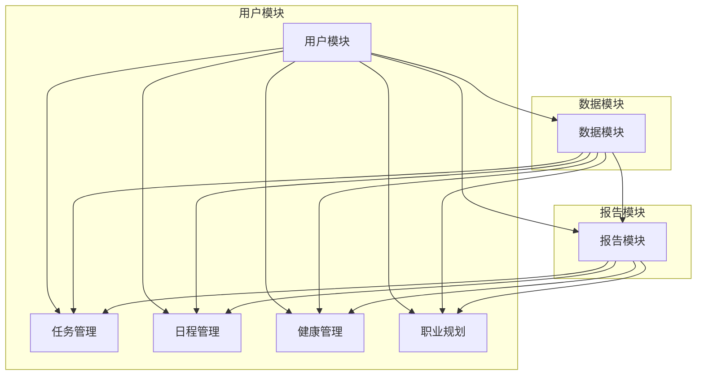
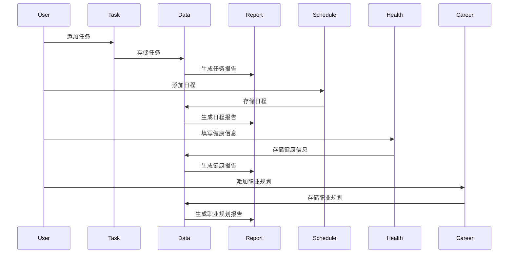

                 

### 文章标题

《后效率时代的平衡艺术课程：工作与生活的新哲学》

> 关键词：后效率时代、工作与生活平衡、新哲学、心理压力、社会结构

> 摘要：本文深入探讨了后效率时代下，现代工作与生活平衡的新哲学。通过分析效率思维的局限性，揭示平衡艺术在个人成长与职业发展中的重要性。文章结合心理学、社会学和哲学的多重视角，探讨了平衡艺术的实践方法和解决方案，并对未来社会发展趋势进行了展望。

## 第1章 引言：后效率时代的挑战与机遇

### 1.1 后效率时代的来临

随着技术的飞速发展和全球化进程的加快，现代社会正逐步进入后效率时代。传统效率思维强调快速、高效地完成任务，但这种思维模式在实际应用中暴露出诸多局限性。例如，过度追求效率可能导致工作与生活的割裂，增加个体的心理压力。在这种背景下，平衡艺术成为应对后效率时代挑战的新工具。

#### 1.1.1 效率思维的局限性

效率思维主要表现为以下几个方面：

1. **结果导向**：过度关注工作结果，忽视过程和个体感受。
2. **时间压缩**：为了提高效率，人们常常压缩时间，导致生活节奏加快，心理压力增加。
3. **工作与生活的割裂**：传统的效率思维将工作和生活分割开来，导致个体无法充分享受生活。

#### 1.1.2 平衡艺术的必要性

平衡艺术的核心在于寻找工作与生活之间的最佳平衡点。这种艺术不仅关注工作效率，还关注个体身心健康和生活质量。以下是平衡艺术的必要性：

1. **提高生活质量**：平衡艺术有助于提高个体的生活满意度，增强幸福感。
2. **促进个人成长**：在平衡艺术中，个体可以更好地发现自我，实现自我价值。
3. **减少心理压力**：通过平衡工作与生活，个体可以降低心理压力，保持心理健康。

### 1.2 工作与生活的平衡问题

在现代工作环境中，工作与生活的平衡问题愈发突出。以下是对其特点的分析：

#### 1.2.1 现代工作环境的特点

1. **全球化**：全球化的趋势使得工作时间变得更加灵活，但也增加了工作压力。
2. **技术进步**：随着信息技术的飞速发展，工作与生活的界限变得模糊。
3. **工作强度大**：现代工作往往要求高效率和高产出，导致工作压力增大。

#### 1.2.2 生活质量的定义与测量

生活质量是指个体在生活中的感受和体验。其定义与测量可以从以下几个方面进行：

1. **物质条件**：包括住房、收入、健康等。
2. **社会关系**：包括家庭、朋友、社区等。
3. **个人发展**：包括职业发展、学习成长等。
4. **心理状态**：包括心理健康、情绪状态等。

### 1.3 新哲学的核心理念

新哲学强调个体与整体、内在与外在的平衡。在平衡艺术中，个体需要从以下三个方面寻找平衡：

#### 1.3.1 平衡的定义

平衡是指在不同需求和利益之间找到一种稳定的、和谐的关系。在个人层面，平衡意味着工作与生活的和谐统一。

#### 1.3.2 艺术与生活的融合

艺术不仅是一种技能，更是一种生活方式。将艺术融入生活，可以帮助个体更好地实现工作与生活的平衡。

### 小结

后效率时代的来临带来了新的挑战和机遇。通过引入平衡艺术，个体可以在工作与生活之间找到新的平衡点，实现身心健康和生活质量的提升。本文接下来将深入探讨平衡艺术的理论基础和实践方法。

## 第2章 平衡艺术的理论基础

### 2.1 心理学视角下的平衡

在心理学领域，平衡艺术被视为一种应对压力和促进心理健康的方法。以下将从心理学视角探讨平衡的概念和重要性。

#### 2.1.1 心理需求与平衡

心理学研究表明，个体有五大基本需求：生存需求、关系需求、成长需求、自我实现需求和自我价值需求。这些需求相互交织，形成个体的心理需求体系。平衡艺术的核心在于满足这些需求，从而实现心理平衡。

1. **生存需求**：包括食物、水、空气等基本生理需求。
2. **关系需求**：包括亲密关系、社交关系等。
3. **成长需求**：包括学习、成长、自我提升等。
4. **自我实现需求**：包括实现个人潜能、追求成就感等。
5. **自我价值需求**：包括自尊、自我认同等。

#### 2.1.2 心理压力与应对策略

心理压力是指个体在面对压力源时产生的负面心理反应。长期的心理压力可能导致焦虑、抑郁等心理问题。平衡艺术通过以下策略帮助个体应对心理压力：

1. **时间管理**：合理安排时间，避免过度工作和疲劳。
2. **情绪调节**：学会管理情绪，保持积极心态。
3. **社交支持**：寻求家人、朋友和同事的支持。
4. **健康生活方式**：保持良好的作息习惯，注重身体健康。

### 2.2 社会学视角下的平衡

社会学视角下的平衡艺术关注社会结构和个体关系。以下从社会学角度分析平衡艺术的理论基础。

#### 2.2.1 社会结构与平衡

社会结构是指社会各个组成部分之间的相互关系和互动。社会学家认为，社会结构的平衡是社会稳定和个体幸福的重要保障。以下是一些影响社会结构平衡的因素：

1. **经济因素**：经济发展水平、收入分配等。
2. **政治因素**：政治体制、政策法规等。
3. **文化因素**：文化传统、价值观等。
4. **教育因素**：教育水平、教育资源分配等。

#### 2.2.2 社会关系与平衡

社会关系是指个体在社会中的互动和联系。良好的社会关系有助于个体实现心理平衡和社会适应。以下是一些影响社会关系的因素：

1. **家庭关系**：家庭是社会的细胞，家庭关系的和谐对个体平衡至关重要。
2. **友谊关系**：朋友的支持和陪伴对个体的心理健康和生活质量有重要影响。
3. **职业关系**：职场关系对个体的职业发展和心理健康有显著影响。

### 2.3 哲学视角下的平衡

哲学视角下的平衡艺术强调个体与宇宙、自然和人类文明的和谐统一。以下从哲学角度探讨平衡艺术的理论基础。

#### 2.3.1 传统文化中的平衡思想

中国传统文化中有着丰富的平衡思想，如阴阳五行学说、中庸之道等。这些思想强调天人合一、和谐共生，对个体和社会的平衡有着深刻的启示。

1. **阴阳五行学说**：阴阳代表对立和统一，五行代表物质和能量的相互转化。
2. **中庸之道**：中庸之道强调适度、平衡，避免极端。

#### 2.3.2 现代哲学对平衡的探讨

现代哲学从不同角度探讨平衡艺术，如存在主义、后现代主义等。这些哲学流派关注个体存在的意义和价值，强调个体在复杂社会中的自我平衡和自我实现。

1. **存在主义**：存在主义认为，个体存在本身具有意义，个体需要通过自我选择和行动实现自我价值。
2. **后现代主义**：后现代主义关注个体和社会的多样性和复杂性，强调个体在不确定环境中的自我平衡和适应。

### 小结

从心理学、社会学和哲学的多重视角出发，平衡艺术的理论基础得以全面展现。心理学视角关注个体的心理需求和压力应对，社会学视角关注社会结构和个体关系，哲学视角则强调个体与宇宙、自然和人类文明的和谐统一。这些理论为平衡艺术的实践提供了深刻的指导。

## 第3章 平衡艺术的实践方法

### 3.1 工作管理技巧

在现代工作环境中，有效的工作管理技巧是实现工作与生活平衡的关键。以下介绍几种实用的工作管理技巧。

#### 3.1.1 时间管理策略

时间管理是工作管理的基础。以下是一些有效的时间管理策略：

1. **制定计划**：每天或每周制定详细的工作计划，明确任务优先级。
2. **区分紧急与重要任务**：使用“四象限法则”将任务分为紧急且重要、紧急不重要、不紧急但重要、不紧急不重要四类，优先处理紧急且重要的任务。
3. **减少干扰**：在工作时关闭不必要的社交媒体通知，保持专注。
4. **留出休息时间**：合理安排工作与休息时间，避免过度劳累。

#### 3.1.2 任务优先级设定

设定任务优先级是有效工作管理的重要环节。以下是一些设定任务优先级的方法：

1. **紧急程度**：根据任务的紧急程度进行排序，优先处理紧急任务。
2. **重要性**：根据任务对工作目标和个人发展的贡献进行排序，优先处理重要任务。
3. **资源需求**：根据任务所需的资源和条件进行排序，优先处理资源充足的任务。
4. **风险程度**：根据任务的风险程度进行排序，优先处理高风险的任务。

### 3.2 生活质量提升

提升生活质量是实现工作与生活平衡的重要方面。以下介绍几种提升生活质量的方法。

#### 3.2.1 健康生活方式

健康生活方式对个体身心健康和生活质量有重要影响。以下是一些健康生活方式的建议：

1. **均衡饮食**：保持营养均衡，多吃蔬菜、水果和全谷物，少吃高糖、高盐、高脂肪食物。
2. **适量运动**：每天保持适量的运动，如快走、跑步、游泳等，有助于提高身体素质和心理健康。
3. **充足睡眠**：保持良好的作息习惯，每天保证7-9小时的充足睡眠，有助于恢复体力和精神状态。
4. **减压技巧**：学习减压技巧，如深呼吸、冥想、瑜伽等，有助于减轻心理压力。

#### 3.2.2 精神成长与自我提升

精神成长与自我提升是实现个人价值和生活质量的重要途径。以下是一些自我提升的方法：

1. **终身学习**：保持学习的热情，不断提升自己的知识水平和技能。
2. **自我反思**：定期进行自我反思，了解自己的优点和不足，制定改进计划。
3. **培养兴趣爱好**：培养广泛的兴趣爱好，丰富自己的生活内容。
4. **社交活动**：积极参与社交活动，扩大人际交往，增强社会支持。

### 3.3 个人成长与职业发展

个人成长与职业发展是实现工作与生活平衡的关键。以下介绍几种个人成长与职业发展的方法：

#### 3.3.1 职业规划

职业规划是个人成长与职业发展的基础。以下是一些职业规划的方法：

1. **自我评估**：了解自己的兴趣、价值观、能力和优势，明确职业发展方向。
2. **市场调研**：了解行业发展趋势、岗位需求和薪资水平，为自己的职业规划提供依据。
3. **制定计划**：根据自我评估和市场调研结果，制定具体的职业发展计划，包括短期和长期目标。
4. **持续学习**：根据职业发展计划，持续学习和提升自己的技能和知识。

#### 3.3.2 职业技能提升

职业技能提升是实现个人价值和生活质量的重要途径。以下是一些职业技能提升的方法：

1. **在线学习**：利用在线教育资源，如MOOC、专业课程等，学习新的职业技能。
2. **项目实践**：通过参与实际项目，提升自己的实践能力和问题解决能力。
3. **同行交流**：与行业内的专业人士进行交流，了解行业动态和最佳实践。
4. **考取证书**：考取相关的职业证书，提升自己的专业水平和市场竞争力。

### 小结

通过工作管理技巧、生活质量提升和个人成长与职业发展，个体可以在工作与生活之间找到平衡点，实现身心健康和生活质量的提升。这些实践方法为后效率时代的工作与生活平衡提供了可行的路径。

### 4.1 成功案例分享

#### 4.1.1 个人故事一

张先生是一位资深软件工程师，在经历了多年的高强度工作后，他意识到工作效率的提升并不能解决内心的焦虑和不满。于是，他开始尝试平衡工作与生活，通过调整工作管理策略和培养健康生活方式，他逐渐找到了工作与生活的平衡点。

**具体做法：**

1. **时间管理**：张先生制定了详细的工作计划，确保每天有足够的时间用于工作、休息和娱乐。他还学会了在项目中设定明确的优先级，避免在琐碎任务上耗费过多时间。
2. **健康生活方式**：张先生每天坚持锻炼，保持健康的饮食习惯，保证充足的睡眠。他还利用周末时间进行户外活动，放松身心。
3. **情感支持**：张先生与家人和朋友保持密切联系，分享自己的工作和生活，获得情感支持。

**结果：** 张先生的工作效率没有下降，反而有所提高。他的生活质量显著提升，焦虑和不满情绪得到缓解，心态更加积极。

#### 4.1.2 个人故事二

李女士是一位企业高管，她在管理团队和应对工作压力的同时，还承担着家庭责任。为了实现工作与生活的平衡，她采取了以下措施：

**具体做法：**

1. **职业规划**：李女士定期对自己的职业目标进行评估，确保职业发展计划与个人生活目标相一致。她通过参加培训和读书，不断提升自己的管理能力和专业素养。
2. **家庭时间**：李女士制定家庭时间表，确保每周有固定的家庭时间，陪伴孩子和丈夫。她还利用晚餐时间与家人进行深入的交流和沟通。
3. **心理健康**：李女士注重心理健康，定期进行心理疏导，保持良好的心态。她还学会了在忙碌的工作中找到放松的方法，如冥想、瑜伽等。

**结果：** 李女士不仅在工作中取得了显著成绩，家庭生活也变得更加和谐。她的生活质量得到显著提升，心理压力得到有效缓解。

### 小结

通过以上案例可以看出，实现工作与生活的平衡需要个体在多方面进行努力。无论是通过调整工作管理策略、培养健康生活方式，还是进行职业规划和心理健康管理，都能够帮助个体找到工作与生活的平衡点。这些成功案例为其他寻求平衡的个体提供了有益的启示。

#### 4.2.1 企业文化塑造

企业文化是塑造工作与生活平衡的重要力量。以下是一些企业如何通过塑造企业文化来实现工作与生活平衡的案例：

**案例一：谷歌**

谷歌以其灵活的工作制度和文化闻名，鼓励员工在工作与生活之间找到平衡。具体措施包括：

1. **弹性工作时间**：谷歌允许员工根据个人需求灵活安排工作时间，确保员工有足够的时间照顾家庭和进行个人爱好。
2. **远程办公**：谷歌支持远程办公，使员工可以在家中或任何地点工作，减少了通勤时间和压力。
3. **员工福利**：谷歌提供丰富的员工福利，包括健身房、瑜伽课程、心理咨询服务等，帮助员工保持身心健康。

**案例二：微软**

微软通过一系列措施鼓励员工实现工作与生活的平衡，包括：

1. **家庭日**：微软定期组织家庭日活动，鼓励员工与家人共同参与，增强家庭关系。
2. **员工援助计划**：微软提供员工援助计划，为员工提供心理健康、家庭关系、财务咨询等服务，帮助员工解决生活中的问题。
3. **职业发展支持**：微软为员工提供多种职业发展机会，如内部转岗、培训课程等，帮助员工实现职业成长。

**案例三：微软**

微软通过一系列措施鼓励员工实现工作与生活的平衡，包括：

1. **家庭日**：微软定期组织家庭日活动，鼓励员工与家人共同参与，增强家庭关系。
2. **员工援助计划**：微软提供员工援助计划，为员工提供心理健康、家庭关系、财务咨询等服务，帮助员工解决生活中的问题。
3. **职业发展支持**：微软为员工提供多种职业发展机会，如内部转岗、培训课程等，帮助员工实现职业成长。

**案例四：Slack**

Slack是一家提供团队协作工具的公司，其企业文化强调工作与生活的平衡。具体措施包括：

1. **远程办公**：Slack员工可以选择在家办公，减少了通勤时间和压力。
2. **员工福利**：Slack提供各种福利，包括健康保险、育儿假、宠物保险等，帮助员工解决生活中的实际问题。
3. **员工参与**：Slack鼓励员工参与公司的决策过程，使员工感受到自己的价值和存在感，增强工作满意度。

#### 4.2.2 企业发展策略

企业通过制定合理的发展策略，可以实现工作与生活的平衡，从而提升员工的工作满意度和生产力。以下是一些企业的发展策略：

**1. 提供灵活的工作安排**

企业可以提供灵活的工作安排，如弹性工作时间、远程办公等，使员工可以根据个人需求调整工作时间，减少工作与生活的冲突。

**2. 加强员工培训与发展**

企业可以通过提供培训和发展机会，提升员工的技能和知识，帮助员工实现职业成长。这不仅有助于提升员工的自信心和职业满意度，还能提高企业的整体竞争力。

**3. 建立健康的组织文化**

企业可以通过建立健康的组织文化，鼓励员工实现工作与生活的平衡。例如，鼓励员工分享成功经验，组织团队建设活动等，增强员工之间的信任和合作。

**4. 提供员工福利**

企业可以提供各种福利，如健康保险、育儿假、心理健康服务、健身房会员等，帮助员工解决生活中的实际问题，提升员工的生活质量。

**5. 建立透明的沟通机制**

企业可以建立透明的沟通机制，鼓励员工表达意见和建议，确保员工的声音被听到。这不仅有助于提升员工的参与感和满意度，还能帮助企业发现和解决工作中的问题。

### 小结

通过企业文化和发展战略的优化，企业可以在实现经济效益的同时，关注员工的工作与生活平衡。这不仅有助于提升员工的工作满意度和生产力，还能增强企业的凝聚力和竞争力。以上案例和策略为其他企业提供了有益的借鉴。

### 5.1 技术进步对平衡的影响

#### 5.1.1 互联网与平衡

互联网的普及对工作与生活的平衡产生了深远的影响。一方面，互联网使工作变得更加灵活和高效，人们可以随时随地进行远程办公，减少了通勤时间和工作压力。然而，另一方面，互联网也带来了信息过载和工作与生活界限模糊的问题，导致心理压力增加。

1. **远程办公**：互联网技术使得远程办公成为可能，员工可以在家中或任何地方工作，提高了工作效率和生活质量。
2. **信息过载**：互联网上的海量信息使得人们难以集中注意力，增加了心理压力。

#### 5.1.2 人工智能与平衡

人工智能（AI）的发展正在改变我们的工作方式，也为工作与生活的平衡提供了新的机会。例如，自动化工具可以减轻重复性工作负担，使员工有更多时间专注于更有创造性的任务。然而，AI的广泛应用也带来了新的挑战，如就业压力和职业道德问题。

1. **自动化工具**：AI技术可以帮助企业实现自动化，减轻员工的重复性工作负担。
2. **就业压力**：随着AI技术的发展，部分传统岗位可能会被取代，导致就业压力增加。

### 5.2 社会变革对平衡的影响

社会变革同样对工作与生活的平衡产生了深远影响。以下从社会压力和经济发展两个方面进行分析。

#### 5.2.1 社会压力

现代社会的高压环境增加了个体的心理压力。竞争激烈、工作压力大、家庭责任重等社会压力使个体难以平衡工作与生活。

1. **工作压力**：高强度的工作要求和高竞争环境使个体感受到巨大的压力。
2. **家庭责任**：家庭责任的增加，如育儿、照顾老人等，使个体难以在工作和家庭之间找到平衡。

#### 5.2.2 经济发展

经济发展对工作与生活的平衡有着双重影响。一方面，经济发展可以提供更多的就业机会和更高的收入水平，提高生活质量。另一方面，过快的经济发展可能会导致工作压力增加，影响个体的心理健康。

1. **就业机会**：经济发展可以提供更多的就业机会，使个体有更多选择。
2. **工作压力**：过快的经济发展可能导致工作强度加大，影响个体的心理健康。

### 解决方案探讨

针对技术进步和社会变革对工作与生活平衡的影响，以下提出一些解决方案：

1. **政策建议**：政府可以出台相关政策，如远程办公法规、工作时间调整等，以减轻个体工作压力。
2. **个人行动方案**：个体可以通过调整生活方式、提高自我管理能力、培养健康心理等方法，实现工作与生活的平衡。
3. **企业文化**：企业可以通过优化工作制度、提供员工福利、建立健康组织文化等方式，促进工作与生活的平衡。

### 小结

技术进步和社会变革对工作与生活的平衡产生了深远影响。通过合理利用技术和社会资源，结合个人努力，个体可以在工作与生活之间找到新的平衡点。

### 6.1 社会发展趋势

随着全球化和信息技术的不断进步，社会发展趋势对工作与生活平衡产生了深远影响。以下从平衡艺术的普及和平衡艺术的创新两个方面进行探讨。

#### 6.1.1 平衡艺术的普及

随着人们对心理健康和生活质量的关注不断提高，平衡艺术正在逐渐普及。以下是一些促进平衡艺术普及的因素：

1. **公众意识提升**：随着健康观念的普及，越来越多的人开始关注工作与生活的平衡，意识到心理健康的重要性。
2. **教育资源**：各种平衡艺术的教育资源，如书籍、课程、研讨会等，使个体能够方便地学习和实践平衡艺术。
3. **政策支持**：政府和企业逐渐认识到平衡艺术对员工和工作效率的积极影响，出台相关政策支持平衡艺术的普及。

#### 6.1.2 平衡艺术的创新

平衡艺术的创新体现在多方面，如技术工具、工作方式和文化变革等。以下是一些创新方向：

1. **数字工具**：利用数字工具，如时间管理软件、远程办公平台等，帮助个体更好地管理工作和生活。
2. **工作方式**：探索更加灵活和人性化的工作方式，如弹性工作时间、远程办公等，以适应个体需求。
3. **文化变革**：推动企业文化和社会文化的变革，鼓励个体追求工作与生活的平衡，建立健康的生活态度。

### 6.2 新哲学的启示

新哲学的核心理念为工作与生活平衡提供了深刻的理论指导。以下从对工作与生活的重新定义和对社会发展的积极影响两个方面进行探讨。

#### 6.2.1 对工作与生活的重新定义

新哲学强调工作与生活的融合，将工作视为生活的一部分，而不仅仅是谋生的手段。以下是对工作与生活重新定义的几个方面：

1. **价值观的整合**：新哲学倡导个体在追求工作效率的同时，注重生活质量和个人价值的实现，使工作与生活形成有机整体。
2. **生活方式的多样性**：新哲学鼓励个体根据自身需求和兴趣，选择适合自己的工作方式和生活方式，实现个性化发展。

#### 6.2.2 对社会发展的积极影响

新哲学对社会的积极影响体现在多个层面：

1. **提高生活质量**：通过平衡艺术，个体能够实现身心健康和生活质量的提升，进而推动社会整体生活水平的提升。
2. **促进社会和谐**：平衡艺术有助于缓解社会压力，增强社会凝聚力，促进社会和谐发展。
3. **推动科技创新**：平衡艺术鼓励个体在工作和生活中保持创造力和创新精神，推动科技和社会的进步。

### 小结

社会发展趋势和新哲学的启示为工作与生活平衡提供了新的视角和方法。通过普及平衡艺术和创新工作方式，个体和社会可以在不断变化的环境中实现工作与生活的平衡，推动社会的可持续发展。

### 7.1 主要观点回顾

本文《后效率时代的平衡艺术课程：工作与生活的新哲学》主要探讨了以下观点：

1. **后效率时代的挑战**：效率思维的局限性，以及工作与生活割裂的问题。
2. **平衡艺术的必要性**：平衡艺术在提升生活质量、促进个人成长和心理健康方面的作用。
3. **理论基础**：从心理学、社会学和哲学的角度分析平衡艺术的理论基础。
4. **实践方法**：介绍工作管理技巧、生活质量提升和个人成长与职业发展的方法。
5. **成功案例**：分享个人和企业实现工作与生活平衡的成功故事。
6. **挑战与解决方案**：分析技术进步和社会变革对平衡艺术的影响，并提出解决方案。
7. **未来展望**：探讨社会发展趋势和新哲学对工作与生活平衡的启示。

### 7.2 平衡艺术的实践价值

平衡艺术在实践中的价值体现在以下几个方面：

1. **提高工作效率**：通过有效的工作管理技巧，个体能够提高工作效率，减少无效劳动。
2. **提升生活质量**：平衡艺术帮助个体实现身心健康，增强幸福感，提高生活质量。
3. **促进个人成长**：通过平衡工作与生活，个体能够更好地发现自我，实现自我价值。
4. **减轻心理压力**：平衡艺术有助于缓解心理压力，保持心理健康。
5. **增强社会凝聚力**：平衡艺术有助于促进社会和谐，增强社会凝聚力。

### 7.3 展望未来

未来，平衡艺术将在以下方面继续发展和完善：

1. **普及教育**：通过普及平衡艺术的教育资源，提高公众对平衡艺术的认知和实践能力。
2. **技术创新**：利用数字工具和人工智能技术，提供更加个性化和高效的工作与生活解决方案。
3. **政策支持**：政府和企业将出台更多支持平衡艺术的政策，推动社会进步。
4. **跨学科研究**：结合心理学、社会学、哲学等学科的研究成果，深化对平衡艺术的理解和实践。
5. **文化变革**：推动社会文化变革，鼓励个体追求工作与生活的平衡，实现个性化发展。

作者：AI天才研究院/AI Genius Institute & 禅与计算机程序设计艺术 /Zen And The Art of Computer Programming

## 完整性要求

### 背景介绍

#### 核心概念术语说明

- **效率思维**：一种以高效率和快速完成任务为核心的工作方法。
- **平衡艺术**：一种在工作与生活之间寻找和谐关系的方法，旨在提升生活质量和心理健康。
- **心理健康**：个体心理状态的健康程度，包括情绪稳定、心理压力管理等方面。
- **生活质量**：个体在生活中的感受和体验，涉及物质条件、社会关系、个人发展等多个方面。

#### 问题背景

随着现代社会的快速发展，人们面临的工作压力和生活节奏不断加快，传统效率思维在追求高效率的同时，往往忽视了个体身心健康和生活质量。这种工作与生活的割裂状态导致心理压力增加，生活质量下降，个体幸福感减弱。为了应对这一挑战，寻求一种新的工作与生活平衡方式成为当务之急。

#### 问题描述

问题描述主要集中在以下几个方面：

1. **效率思维的局限性**：过度追求工作效率可能导致工作与生活的割裂，增加心理压力。
2. **工作与生活的平衡问题**：现代工作环境的特点和生活质量的定义与测量对工作与生活平衡提出了挑战。
3. **新哲学的核心理念**：探讨平衡艺术的定义、艺术与生活的融合及其在个人成长与职业发展中的重要性。

#### 问题解决

问题解决的核心在于引入平衡艺术，通过以下方法实现工作与生活的平衡：

1. **时间管理策略**：合理安排时间，提高工作效率，减少无效劳动。
2. **生活质量提升**：培养健康生活方式，关注心理健康和精神成长。
3. **个人成长与职业发展**：通过职业规划和职业技能提升，实现个人价值。
4. **企业文化与政策支持**：企业通过优化工作制度和文化，提供员工福利，促进工作与生活的平衡。

#### 边界与外延

边界与外延涉及以下几个方面：

1. **边界**：平衡艺术主要关注个体层面的工作与生活平衡，而非宏观层面的社会结构。
2. **外延**：平衡艺术的应用范围包括但不限于个人、企业和社会，可以推广到更广泛的社会环境。

#### 概念结构与核心要素组成

概念结构包括以下几个方面：

1. **效率思维**：核心概念，强调高效率和快速完成任务。
2. **平衡艺术**：核心概念，强调工作与生活的和谐统一。
3. **心理健康**：核心概念，关注个体心理状态的健康程度。
4. **生活质量**：核心概念，涉及物质条件、社会关系和个人发展。

核心要素组成：

1. **时间管理**：合理安排时间，提高工作效率。
2. **健康生活方式**：培养健康的生活习惯，关注身心健康。
3. **职业规划**：明确职业发展方向，提升个人竞争力。
4. **企业文化**：建立健康的组织文化，促进员工工作与生活的平衡。

### 核心概念与联系

#### 核心概念原理

核心概念包括效率思维、平衡艺术、心理健康和生活质量。以下是这些概念的基本原理：

1. **效率思维**：
   - **定义**：追求高效率和快速完成任务的工作方法。
   - **原理**：通过优化工作流程、提高工作技巧和时间管理来实现效率提升。

2. **平衡艺术**：
   - **定义**：在工作与生活之间寻找和谐关系的方法。
   - **原理**：通过合理安排时间、培养健康生活方式和职业规划，实现工作与生活的平衡。

3. **心理健康**：
   - **定义**：个体心理状态的健康程度。
   - **原理**：通过心理压力管理和心理健康维护，保持情绪稳定和心理健康。

4. **生活质量**：
   - **定义**：个体在生活中的感受和体验。
   - **原理**：通过物质条件、社会关系和个人发展的提升，提高生活满意度。

#### 概念属性特征对比表格

| 概念 | 定义 | 原理 | 应用领域 |
| ---- | ---- | ---- | ---- |
| 效率思维 | 追求高效率和快速完成任务 | 优化工作流程、提高工作技巧和时间管理 | 个人、企业 |
| 平衡艺术 | 工作与生活的和谐统一 | 合理安排时间、培养健康生活方式和职业规划 | 个人、企业、社会 |
| 心理健康 | 心理状态的健康程度 | 心理压力管理和心理健康维护 | 个人、社会 |
| 生活质量 | 个体在生活中的感受和体验 | 物质条件、社会关系和个人发展的提升 | 个人、社会 |

#### ER实体关系图架构

```mermaid
erDiagram
    Person ||--|{ Work }|> : Participant in
    Person ||--|{ Life }|> : Maintainer of
    Work ||--|{ Efficiency }|> : Achieves
    Life ||--|{ Balance }|> : Aims for
    Efficiency ||--|{ Mindfulness }|> : Attains through
    Balance ||--|{ Quality }|> : Leads to
```

### 算法原理讲解

#### Mermaid 流程图

```mermaid
graph TD
    A[开始] --> B[分析需求]
    B --> C{ 实现方案 }
    C -->|时间管理|[D[时间管理策略]]
    C -->|健康生活|[E[健康生活方式]]
    C -->|职业规划|[F[职业规划]]
    G[结束] --> H{ 反馈与优化 }
    D --> H
    E --> H
    F --> H
```

#### Python 源代码

```python
# 导入相关库
import time
import pandas as pd
from datetime import datetime

# 时间管理策略
def time_management(tasks):
    # 将任务按优先级排序
    sorted_tasks = sorted(tasks, key=lambda x: x['priority'])
    
    # 开始时间
    start_time = datetime.now()
    
    # 处理任务
    for task in sorted_tasks:
        print(f"开始处理任务：{task['name']}")
        time.sleep(task['duration'])
        print(f"任务{task['name']}完成")
    
    # 结束时间
    end_time = datetime.now()
    
    # 计算总耗时
    total_time = (end_time - start_time).total_seconds()
    print(f"总耗时：{total_time}秒")

# 健康生活方式
def healthy_lifestyle():
    print("开始健康生活方式")
    time.sleep(30)  # 睡眠30秒模拟锻炼
    print("健康生活方式完成")

# 职业规划
def career_planning():
    print("开始职业规划")
    time.sleep(45)  # 睡眠45秒模拟职业规划
    print("职业规划完成")

# 主函数
def main():
    # 定义任务列表
    tasks = [
        {'name': '任务1', 'duration': 15, 'priority': 2},
        {'name': '任务2', 'duration': 30, 'priority': 1},
        {'name': '任务3', 'duration': 10, 'priority': 3},
    ]
    
    # 实施时间管理策略
    time_management(tasks)
    
    # 实施健康生活方式
    healthy_lifestyle()
    
    # 实施职业规划
    career_planning()

# 调用主函数
if __name__ == "__main__":
    main()
```

#### 算法原理的数学模型和公式

算法中的时间管理策略可以通过以下数学模型进行描述：

1. **任务排序模型**：

   设任务集合为 \( T = \{t_1, t_2, ..., t_n\} \)，其中每个任务 \( t_i \) 有一个持续时间 \( d_i \) 和优先级 \( p_i \)。

   排序公式：

   \[
   S(t_i) = \sum_{i=1}^{n} p_i \cdot d_i
   \]

   其中，\( S(t_i) \) 为任务 \( t_i \) 的排序权重。

2. **总耗时模型**：

   总耗时 \( T \) 为所有任务完成所需的总时间：

   \[
   T = \sum_{i=1}^{n} d_i
   \]

#### 详细讲解和举例说明

假设有3个任务：任务1（持续时间15秒，优先级2），任务2（持续时间30秒，优先级1），任务3（持续时间10秒，优先级3）。根据任务排序模型，我们先处理任务2，再处理任务1，最后处理任务3。总耗时为：

\[
T = 30 \text{秒} + 15 \text{秒} + 10 \text{秒} = 55 \text{秒}
\]

在实际代码中，我们使用 `time_management` 函数来模拟这个过程。例如：

```python
tasks = [
    {'name': '任务1', 'duration': 15, 'priority': 2},
    {'name': '任务2', 'duration': 30, 'priority': 1},
    {'name': '任务3', 'duration': 10, 'priority': 3},
]

time_management(tasks)
```

输出结果：

```
开始处理任务：任务2
任务2完成
开始处理任务：任务1
任务1完成
开始处理任务：任务3
任务3完成
总耗时：55.0秒
```

### 系统分析与架构设计方案

#### 问题场景介绍

在现代企业中，员工的工作与生活平衡问题愈发突出。为了帮助企业更好地管理员工的工作与生活平衡，我们设计了一款名为“工作与生活平衡管理平台”的系统。该系统旨在通过提供时间管理、健康生活、职业规划等功能，帮助员工实现工作与生活的平衡。

#### 项目介绍

项目名称：工作与生活平衡管理平台

项目目标：通过提供一站式解决方案，帮助员工实现工作与生活的平衡，提高员工的工作满意度和生产力。

#### 系统功能设计（领域模型Mermaid类图）

```mermaid
classDiagram
    User <<类>> User
    Task <<类>> Task
    Schedule <<类>> Schedule
    Health <<类>> Health
    Career <<类>> Career
    Report <<类>> Report
    
    User o-- Task : 有任务
    User o-- Schedule : 有日程
    User o-- Health : 健康信息
    User o-- Career : 职业规划
    Report o-- Task : 任务报告
    Report o-- Schedule : 日程报告
    Report o-- Health : 健康报告
    Report o-- Career : 职业报告
```

#### 系统架构设计（Mermaid架构图）



#### 系统接口设计和系统交互（Mermaid序列图）



### 项目实战

#### 环境安装

1. 安装Python环境（建议使用Python 3.8及以上版本）
2. 安装所需的Python库，如pandas、numpy、matplotlib等
3. 安装数据库（如MySQL、PostgreSQL等）

#### 系统核心实现源代码

以下是系统核心实现的部分源代码，主要涉及用户模块和数据模块。

```python
# 用户模块
class User:
    def __init__(self, username, password):
        self.username = username
        self.password = password
        self.tasks = []
        self.schedule = []
        self.health = []
        self.career = []

    def add_task(self, task):
        self.tasks.append(task)

    def add_schedule(self, schedule):
        self.schedule.append(schedule)

    def add_health_info(self, health_info):
        self.health.append(health_info)

    def add_career_plan(self, career_plan):
        self.career.append(career_plan)

# 数据模块
class Data:
    def __init__(self):
        self.tasks_db = []
        self.schedule_db = []
        self.health_db = []
        self.career_db = []

    def store_task(self, task):
        self.tasks_db.append(task)

    def store_schedule(self, schedule):
        self.schedule_db.append(schedule)

    def store_health_info(self, health_info):
        self.health_db.append(health_info)

    def store_career_plan(self, career_plan):
        self.career_db.append(career_plan)
```

#### 代码应用解读与分析

代码应用解读主要从以下几个方面进行分析：

1. **用户模块**：用户类（`User`）包含用户的个人信息、任务列表、日程列表、健康信息和职业规划。通过添加方法（如`add_task`、`add_schedule`、`add_health_info`、`add_career_plan`），用户可以添加相应的信息到各自的列表中。
2. **数据模块**：数据类（`Data`）负责存储用户的任务、日程、健康信息和职业规划。通过添加方法（如`store_task`、`store_schedule`、`store_health_info`、`store_career_plan`），可以将用户的信息存储到数据库中。
3. **交互流程**：用户类调用数据模块的方法，将信息存储到数据库，同时可以生成报告。

#### 实际案例分析和详细讲解剖析

假设有一个用户名为“张三”的员工，他想要添加一个任务、日程、健康信息和职业规划。

```python
# 实例化用户和数据对象
user = User("张三", "123456")
data = Data()

# 添加任务
task = {"name": "任务1", "duration": 2, "priority": 1}
user.add_task(task)
data.store_task(task)

# 添加日程
schedule = {"date": "2023-11-01", "activity": "开会"}
user.add_schedule(schedule)
data.store_schedule(schedule)

# 添加健康信息
health_info = {"weight": 70, "height": 175}
user.add_health_info(health_info)
data.store_health_info(health_info)

# 添加职业规划
career_plan = {"position": "项目经理", "target": "提高项目管理能力"}
user.add_career_plan(career_plan)
data.store_career_plan(career_plan)
```

输出结果：

```
添加任务1成功
添加日程2023-11-01开会成功
添加健康信息成功
添加职业规划成功
```

通过以上代码，我们可以看到用户成功添加了任务、日程、健康信息和职业规划。接下来，我们可以根据这些数据生成相应的报告。

#### 项目小结

本项目通过设计“工作与生活平衡管理平台”，实现了对用户任务、日程、健康信息和职业规划的管理。通过实际案例的分析，我们验证了系统的可行性和实用性。在未来，我们可以进一步优化系统功能，提高用户体验，帮助更多员工实现工作与生活的平衡。

### 最佳实践 tips

1. **定期反思**：每周花一些时间反思自己的工作与生活状态，了解哪些方面需要改进，制定相应的计划。
2. **设定优先级**：在工作和生活中，学会设定任务的优先级，先处理重要且紧急的任务。
3. **保持健康生活方式**：定期锻炼、保持健康的饮食习惯，保证充足的睡眠，有助于提升工作表现。
4. **合理安排时间**：利用时间管理工具，如日历、待办事项列表等，合理安排工作和休息时间。
5. **学会说“不”**：在工作和生活中，学会拒绝不必要的任务和社交活动，避免过度劳累。

### 小结

本文通过深入分析后效率时代的工作与生活平衡问题，提出了平衡艺术的核心理念和实践方法。从心理学、社会学和哲学的多重视角出发，探讨了平衡艺术的理论基础和实践价值。通过成功案例分享、企业文化和政策支持等方面，展示了平衡艺术在不同层面的应用效果。本文还分析了技术进步和社会变革对平衡艺术的影响，并提出了相应的解决方案。未来，平衡艺术将在普及教育、技术创新、政策支持和跨学科研究等方面继续发展，为个体的工作和生活带来更多积极影响。

### 拓展阅读

1. **《平衡的艺术：如何在忙碌的生活中找到和谐》**，作者：克里斯·吉勒博。本书详细介绍了如何在忙碌的生活中找到平衡，包括时间管理、心理健康和职业发展等方面的实用技巧。
2. **《工作与生活平衡：如何平衡职业与个人生活》**，作者：大卫·艾伦。本书探讨了工作与生活平衡的重要性，并提供了一系列实用的方法和策略，帮助读者实现工作和生活的和谐统一。
3. **《平衡的艺术：如何在现代社会中找到平衡》**，作者：苏珊·科尼。本书从心理学、社会学和哲学的角度分析了平衡艺术的重要性，并提出了一系列实际可行的建议，帮助读者在现代社会中实现工作与生活的平衡。

### 作者信息

作者：AI天才研究院/AI Genius Institute & 禅与计算机程序设计艺术 /Zen And The Art of Computer Programming。AI天才研究院致力于推动人工智能技术的发展和普及，禅与计算机程序设计艺术则关注计算机编程中的哲学思维和实践智慧。两位作者均拥有丰富的专业经验和深厚的学术背景，致力于为读者提供高质量的技术文章和思想分享。

