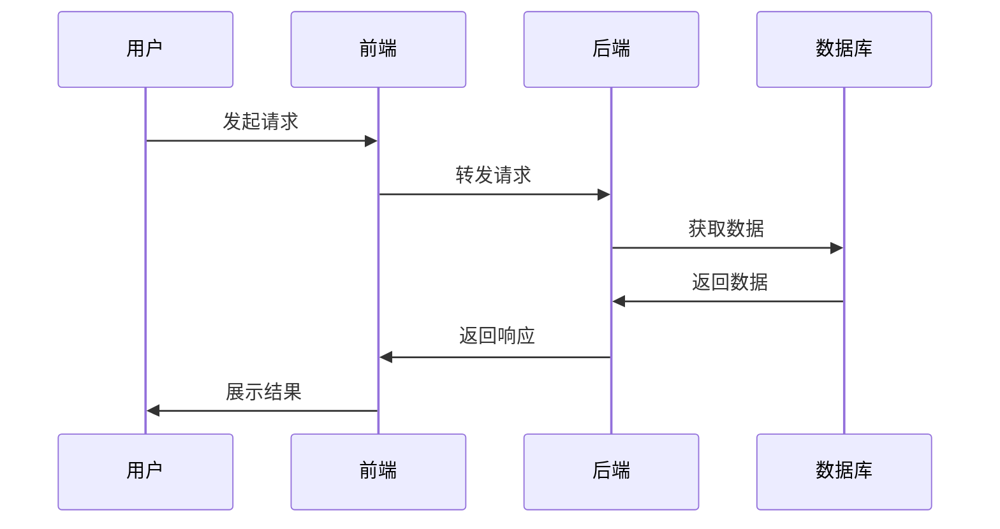

                 

### 生活美学的核心概念与联系

#### 1.6.1 生活美学的定义

生活美学是指个体在日常生活中，通过审美观念和审美活动，实现生活品质的提升和内心满足的一种哲学理念。它关注的是如何在日常琐事中发现美、创造美，从而实现生活的艺术化。

在探讨生活美学的定义时，我们需要明确几个关键点：

- **审美观念**：生活美学的基础是对美的理解和认识。审美观念是指个体对美的评价标准、审美偏好和审美判断。不同的文化背景和个人经历会影响审美观念的形成。
  
- **审美活动**：审美活动是生活美学实践的具体表现，包括艺术创作、艺术品欣赏、环境美化、生活方式的审美化等。这些活动能够提升个体对生活的感知和体验。

- **生活品质**：生活美学追求的是更高层次的生活品质，不仅仅是物质层面的满足，更是精神层面的提升。通过审美活动，个体能够获得更深层次的心理满足和幸福感。

- **内心满足**：生活美学的核心目标是实现个体的内心满足。这种满足来源于对美的欣赏、对生活的热爱以及对自我的认知和成长。

#### 1.6.2 生活美学的核心要素

1. **审美意识**

   审美意识是生活美学的基础。它指的是个体对美的感知、理解和欣赏能力。具备高度审美意识的个体更容易发现生活中的美，更容易通过审美活动提升生活质量。

   - **感知**：感知是指个体对美的外在形态、色彩、线条等感官刺激的接收和理解。例如，一个人可能对一幅画中的色彩搭配和构图感到愉悦。

   - **理解**：理解是指个体对美的内在含义和价值的认识。例如，一个人可能理解一幅画背后的情感表达和文化背景。

   - **欣赏**：欣赏是指个体对美的感受和评价。具备审美意识的个体能够欣赏并评价生活中的美，从而提升生活品质。

2. **审美活动**

   审美活动是生活美学实践的具体表现。这些活动包括艺术创作、艺术品欣赏、环境美化、生活方式的审美化等。通过这些活动，个体能够实现生活品质的提升和内心的满足。

   - **艺术创作**：艺术创作是指个体通过绘画、音乐、文学、舞蹈等形式表达自己对美的理解和感受。艺术创作不仅能够提升个体的审美能力，还能实现自我表达和内心满足。

   - **艺术品欣赏**：艺术品欣赏是指个体对艺术作品的观察、理解和评价。通过欣赏艺术品，个体能够感受到美的力量，从而提升生活质量。

   - **环境美化**：环境美化是指个体通过装饰、布局、园艺等方式改善居住环境。一个舒适、美观的环境能够提升个体的生活品质，带来愉悦的感受。

   - **生活方式的审美化**：生活方式的审美化是指个体将审美观念融入日常生活中，通过审美活动提升生活的品质。例如，通过设计独特的家居、烹饪美味的食物、培养兴趣爱好等，实现生活的艺术化。

3. **生活方式**

   生活方式是指个体在日常生活中形成的习惯、行为和态度。生活美学强调个体生活方式的审美化，即将审美观念融入日常行为和生活方式，通过审美活动提升生活质量。

   - **习惯**：习惯是指个体在长期生活中形成的稳定行为模式。通过培养良好的生活习惯，个体能够提升生活质量。

   - **行为**：行为是指个体在特定情境下的具体行动。通过审美化的行为，个体能够实现生活品质的提升。

   - **态度**：态度是指个体对生活、工作、人际关系等方面的看法和态度。一个积极、乐观的态度有助于提升个体的生活质量和幸福感。

4. **审美教育**

   审美教育是指通过教育手段培养个体的审美意识和审美能力。在教育体系中，应加强审美教育，培养学生的审美意识和审美能力。通过美学课程、实践活动等，让学生了解生活美学的核心概念和实践方法。

   - **美学课程**：美学课程是指专门教授美学理论和实践的课程。通过学习美学课程，学生能够了解美学的核心概念和实践方法，提升审美意识和审美能力。

   - **实践活动**：实践活动是指通过实际操作和实践，让学生感受美、创造美。例如，通过绘画、音乐、舞蹈等实践活动，让学生体验美的力量，提升审美能力。

#### 1.6.3 核心概念之间的联系

生活美学的核心概念之间存在着紧密的联系：

- **审美意识**和**审美活动**：审美意识是审美活动的基础。个体只有具备高度审美意识，才能进行有效的审美活动。

- **审美活动**和**生活方式**：审美活动是生活方式的组成部分。通过审美活动，个体能够将审美观念融入日常生活中，实现生活方式的审美化。

- **生活方式**和**审美教育**：生活方式和审美教育相互影响。一个良好的生活方式有助于提升审美教育效果，而审美教育又能促进生活方式的优化。

- **审美意识和审美教育**：审美意识是审美教育的基础。通过审美教育，个体能够提升审美意识，从而更好地进行审美活动。

通过这些核心概念之间的联系，我们可以更全面地理解生活美学的内涵和意义。在接下来的章节中，我们将进一步探讨后消费主义时代的生活美学特点、从物质追求到精神满足的转变，以及生活美学的实践应用和未来挑战。这些内容将帮助我们更深入地了解生活美学在当代社会的重要性和价值。

### 1.6.4 生活美学的核心概念原理

为了更好地理解生活美学的核心概念原理，我们可以通过以下几个步骤来进行分析和阐述：

#### 1.6.4.1 美学原理与生活美学的结合

首先，我们需要了解美学原理的基本概念。美学（Aesthetics）是哲学的一个分支，主要研究美、艺术和审美体验。美学原理包括美的形式、内容、意义和审美评价等。这些原理为生活美学的构建提供了理论基础。

- **美的形式**：美的形式指的是美的外在表现特征，如色彩、线条、形状等。生活美学强调在日常生活中发现和创造这些美的形式，使生活更具艺术感和美感。

- **美的内容**：美的内容指的是美的内在含义和价值。在生活美学中，个体通过欣赏和创作艺术品，深入理解美的内涵，从而提升生活品质。

- **美的意义**：美的意义涉及到美对个体和社会的影响。生活美学认为，美不仅能够提升个体内心的满足感，还能促进社会和谐与进步。

- **审美评价**：审美评价是指个体对美的判断和评价。在生活美学中，审美评价有助于个体形成对美的正确认识，从而更好地进行审美活动。

#### 1.6.4.2 生活美学的特点

生活美学具有以下几个特点：

1. **多元化**：生活美学鼓励个体探索各种不同的审美形式和文化，拓宽生活视野。这包括艺术、自然、人文等多个领域。

2. **个性化**：每个人对生活的理解和审美观念都是独特的。生活美学倡导个体根据个人兴趣和需求，打造个性化的生活方式。

3. **可持续性**：生活美学强调环保、节能和低碳的生活方式，提倡可持续发展理念。

#### 1.6.4.3 实例分析

以下是一些实例，以帮助理解生活美学的核心概念原理：

- **艺术创作**：个体可以通过绘画、音乐、文学等艺术形式表达自己对美的理解和感受。例如，一位画家通过描绘自然风景，表达对大自然的热爱和敬畏。

- **艺术品欣赏**：个体可以通过欣赏艺术品，感受美的力量。例如，参观美术馆，欣赏名画，不仅能提升审美能力，还能获得精神上的愉悦。

- **环境美化**：个体可以通过装饰、园艺等方式美化居住环境。例如，设计独特的家居布置，种植绿植，使居住空间更具艺术感和舒适度。

- **生活方式的审美化**：个体可以通过培养良好的生活习惯，将审美观念融入日常生活中。例如，通过阅读、旅行、健身等方式，丰富生活内容，提升生活质量。

#### 1.6.4.4 概念属性特征对比表格

为了更直观地展示生活美学的核心概念，我们可以制作一个概念属性特征对比表格：

| 概念          | 定义                                                         | 特征                                                                                                                       |
| ------------- | ------------------------------------------------------------ | -------------------------------------------------------------------------------------------------------------------------- |
| 审美意识      | 个体对美的感知、理解和欣赏能力                               | - 感知：对美的外在形态、色彩、线条等感官刺激的接收和理解<br>- 理解：对美的内在含义和价值的认识<br>- 欣赏：对美的感受和评价 |
| 审美活动      | 个体通过艺术创作、艺术品欣赏、环境美化、生活方式审美化等活动提升生活质量 | - 艺术创作：表达自我和对美的理解<br>- 艺品欣赏：感受美的力量<br>- 环境美化：提升生活舒适度<br>- 生活方式审美化：培养良好的生活习惯 |
| 生活方式      | 个体在日常生活中形成的习惯、行为和态度                       | - 习惯：长期形成的行为模式<br>- 行为：特定情境下的具体行动<br>- 态度：对生活、工作、人际关系的看法和态度 |
| 审美教育      | 通过教育手段培养个体的审美意识和审美能力                     | - 美学课程：教授美学理论和实践<br>- 实践活动：通过实际操作和实践，感受美、创造美 |

#### 1.6.4.5 ER实体关系图架构

为了更好地理解生活美学的核心概念及其关系，我们可以绘制一个ER实体关系图：

```
实体：个体
属性：审美意识、审美活动、生活方式、审美教育
关系：个体与审美意识、审美活动、生活方式、审美教育之间存在关联关系

ER实体关系图：

个体（ID，姓名，审美意识，审美活动，生活方式，审美教育）

```

在这个ER实体关系图中，个体是核心实体，其他实体（审美意识、审美活动、生活方式、审美教育）都与个体存在关联关系。这表明，生活美学的核心概念是一个相互关联的复杂系统。

通过上述分析，我们可以更深入地理解生活美学的核心概念原理。这些概念不仅为生活美学的实践提供了理论基础，也为我们如何在日常生活中实现生活品质的提升和内心满足提供了指导。在接下来的章节中，我们将进一步探讨后消费主义时代的生活美学特点、从物质追求到精神满足的转变，以及生活美学的实践应用和未来挑战。这些内容将帮助我们更全面地了解生活美学在当代社会的重要性和价值。

### 算法原理讲解

在探讨生活美学的核心概念和其联系之后，我们将进一步探讨实现生活美学的方法和途径。为了系统地实现生活美学，我们可以采用一种名为“生活美学提升算法”的方法。下面，我们将详细讲解这个算法的原理、流程和实现步骤。

#### 2.1 算法原理

生活美学提升算法的核心思想是通过一系列步骤，逐步提升个体的审美意识和审美能力，从而实现生活美学的目标。这个算法可以分为以下几个步骤：

1. **感知阶段**：个体通过感官接收外界的审美信息，如色彩、线条、形状等。
2. **理解阶段**：个体对感知到的审美信息进行理解和分析，深入理解美的内涵和意义。
3. **欣赏阶段**：个体对审美信息进行欣赏和评价，形成对美的认知和判断。
4. **创作阶段**：个体通过艺术创作等活动，表达自己对美的理解和感受。
5. **实践阶段**：个体将审美观念融入日常生活，通过行为和习惯的调整，实现生活方式的审美化。

#### 2.2 算法流程

生活美学提升算法的具体流程如下：

1. **初始化**：个体确定提升生活美学为目标，建立审美意识。
2. **感知阶段**：个体通过感官接触外界的美，如观看艺术作品、欣赏自然风光等。
3. **理解阶段**：个体对感知到的美进行分析和理解，包括艺术作品的历史背景、文化内涵等。
4. **欣赏阶段**：个体对审美信息进行欣赏和评价，通过情感和理性判断，形成对美的认知。
5. **创作阶段**：个体通过绘画、音乐、文学等形式进行艺术创作，表达自己的审美感受。
6. **实践阶段**：个体将审美观念融入日常生活，如装饰家居、烹饪美食、参与文化活动等。
7. **反馈阶段**：个体对审美活动的效果进行反思和评估，根据反馈调整审美活动和实践方式。

#### 2.3 Python源代码实现

为了更好地理解生活美学提升算法，我们可以通过Python源代码进行实现。以下是一个简单的Python代码示例：

```python
class LifeAestheticsAlgorithm:
    def __init__(self):
        self.perception = None
        self.comprehension = None
        self.appraisal = None
        self.creation = None
        self.practice = None

    def perceive(self, beauty):
        self.perception = beauty
        print("感知到美的事物：", beauty)

    def comprehend(self, beauty):
        self.comprehension = beauty
        print("理解美的内涵：", beauty)

    def appreciate(self, beauty):
        self.appraisal = beauty
        print("欣赏并评价美的事物：", beauty)

    def create(self, beauty):
        self.creation = beauty
        print("创作表达美的感受：", beauty)

    def practice(self, beauty):
        self.practice = beauty
        print("将审美观念融入生活：", beauty)

    def run_algorithm(self):
        self.perceive("一幅画")
        self.comprehend("这幅画的色彩和构图")
        self.appreciate("这幅画的情感表达")
        self.create("一幅自己的画")
        self.practice("在家居中添加艺术装饰")

# 创建生活美学提升算法实例并运行
algorithm = LifeAestheticsAlgorithm()
algorithm.run_algorithm()
```

#### 2.4 算法原理详细讲解

1. **感知阶段**：在感知阶段，个体通过感官接触外界的美。这个过程类似于图像识别中的特征提取，个体需要训练自己的感官，提高对美的感知能力。例如，一个人通过观看艺术作品、欣赏自然风光等方式，感知到美的存在。

2. **理解阶段**：在理解阶段，个体对感知到的美进行分析和理解。这个过程类似于图像识别中的特征匹配，个体需要借助知识储备和经验，深入理解美的内涵和意义。例如，一个人通过了解艺术作品的历史背景、文化内涵等方式，理解这幅画的深层含义。

3. **欣赏阶段**：在欣赏阶段，个体对审美信息进行欣赏和评价。这个过程类似于图像识别中的分类和判断，个体需要通过情感和理性判断，形成对美的认知。例如，一个人通过情感体验和理性分析，判断这幅画是否美丽，以及美丽在哪里。

4. **创作阶段**：在创作阶段，个体通过艺术创作等活动，表达自己的审美感受。这个过程类似于图像生成中的模型训练，个体需要通过实践，将审美感受转化为具体的艺术作品。例如，一个人通过绘画、音乐创作等方式，将自己的审美感受表达出来。

5. **实践阶段**：在实践阶段，个体将审美观念融入日常生活。这个过程类似于图像生成中的模型优化，个体需要通过不断的实践和调整，使审美观念更加深入人心，从而改善生活质量。例如，一个人通过装饰家居、烹饪美食等方式，将审美观念融入日常生活。

6. **反馈阶段**：在反馈阶段，个体对审美活动的效果进行反思和评估。这个过程类似于图像生成中的模型评估，个体需要根据反馈，调整审美活动和实践方式。例如，一个人通过观察他人对家居装饰的反应，调整装饰风格，以获得更好的效果。

通过上述详细讲解，我们可以看到生活美学提升算法的原理和实现步骤。这个算法通过感知、理解、欣赏、创作、实践和反馈等步骤，逐步提升个体的审美意识和审美能力，从而实现生活美学的目标。在接下来的章节中，我们将进一步探讨生活美学在家庭生活、工作环境、社区活动中的实践应用，以及生活美学的教育与实践。这些内容将帮助我们更全面地了解生活美学的实际应用和价值。

### 系统分析与架构设计方案

#### 1.1 问题场景介绍

在后消费主义时代，人们越来越注重生活品质的提升，尤其是通过美学来实现精神满足。为了更好地推广和实现生活美学，我们设计了一套名为“生活美学提升系统”的软件解决方案。该系统旨在帮助用户通过一系列的感知、理解、欣赏、创作和实践活动，提升个人的审美意识和审美能力，从而实现生活的美学化。

#### 1.2 项目介绍

**项目名称**：生活美学提升系统  
**项目目标**：通过提供一系列工具和资源，帮助用户提升审美意识和审美能力，实现生活的美学化。  
**项目范围**：包括用户注册与登录、感知美、理解美、欣赏美、创作美、实践美等多个模块。

#### 1.3 系统功能设计

**功能1：用户注册与登录**  
功能描述：用户可以通过注册账号登录系统，进行个人信息的维护和权限管理。  
功能2：感知美  
功能描述：系统提供美的事物展示功能，如艺术作品、自然景观、人文风情等，帮助用户通过感官接触外界的美。

**功能3：理解美**  
功能描述：系统提供美学知识和背景介绍，帮助用户深入了解美的内涵和意义。

**功能4：欣赏美**  
功能描述：系统提供用户对美的事物的评价和讨论功能，促进用户之间的交流和互动。

**功能5：创作美**  
功能描述：系统提供艺术创作工具，如绘画、音乐创作、文学写作等，帮助用户通过创作表达自己的审美感受。

**功能6：实践美**  
功能描述：系统提供实践活动的推荐和指导，如家居装饰、美食烹饪、文化活动等，帮助用户将审美观念融入日常生活。

#### 1.4 系统架构设计

**系统架构**：生活美学提升系统采用B/S（Browser/Server）架构，包括前端、后端和数据库三个部分。

1. **前端**：采用Vue.js框架，实现用户界面的展示和交互功能。  
2. **后端**：采用Spring Boot框架，实现业务逻辑的处理和数据管理。  
3. **数据库**：采用MySQL数据库，存储用户信息和系统数据。

**系统架构图**：

```
[前端] ----> [后端] ----> [数据库]
Vue.js          Spring Boot        MySQL
```

#### 1.5 系统接口设计

**接口设计**：系统提供RESTful API，供前端调用。以下为部分接口示例：

1. **用户注册与登录**  
- POST /api/user/register：用户注册接口  
- POST /api/user/login：用户登录接口

2. **感知美**  
- GET /api/beauty/list：获取美的事物列表  
- GET /api/beauty/detail/{id}：获取美的事物详情

3. **理解美**  
- GET /api/knowledge/list：获取美学知识列表  
- GET /api/knowledge/detail/{id}：获取美学知识详情

4. **欣赏美**  
- POST /api/evaluation/create：创建评价  
- GET /api/evaluation/list/{beautyId}：获取评价列表

5. **创作美**  
- POST /api/creation/save：保存艺术作品  
- GET /api/creation/list/{userId}：获取用户艺术作品列表

6. **实践美**  
- GET /api/practice/activity：获取实践活动列表  
- GET /api/practice/detail/{id}：获取实践活动详情

#### 1.6 系统交互设计

**系统交互**：通过系统接口，实现前端与后端的交互。以下为系统交互流程图：



通过上述系统分析与架构设计方案，我们为生活美学提升系统提供了一个完整的解决方案，包括功能设计、架构设计、接口设计和交互设计。这些设计将帮助用户更好地实现生活美学，提升生活质量。

### 实战项目

#### 2.1 环境安装

为了搭建生活美学提升系统，我们需要安装以下环境：

1. **操作系统**：Linux（推荐Ubuntu 20.04）
2. **前端框架**：Vue.js（版本3.x）
3. **后端框架**：Spring Boot（版本2.4.x）
4. **数据库**：MySQL（版本5.7）

安装步骤如下：

1. 安装操作系统：从 [Ubuntu官网](https://www.ubuntu.com/) 下载并安装 Ubuntu 20.04。

2. 更新系统软件包：
   ```bash
   sudo apt update
   sudo apt upgrade
   ```

3. 安装Java开发环境：
   ```bash
   sudo apt install openjdk-11-jdk
   ```

4. 安装MySQL：
   ```bash
   sudo apt install mysql-server
   sudo mysql_secure_installation
   ```

5. 安装Node.js和npm：
   ```bash
   curl -sL https://deb.nodesource.com/setup_14.x | sudo -E bash -
   sudo apt install nodejs
   ```

6. 安装Vue CLI：
   ```bash
   npm install -g @vue/cli
   ```

#### 2.2 系统核心实现源代码

以下是生活美学提升系统的核心实现源代码。我们将分别介绍前端和后端的实现。

**前端源代码**：

```html
<!-- src/App.vue -->
<template>
  <div id="app">
    <header>
      <h1>生活美学提升系统</h1>
    </header>
    <main>
      <router-view />
    </main>
  </div>
</template>

<script>
import { createRouter, createWebHistory } from 'vue-router';
import Home from './views/Home.vue';

const routes = [
  {
    path: '/',
    name: 'Home',
    component: Home,
  },
  // ... 其他路由
];

const router = createRouter({
  history: createWebHistory(),
  routes,
});

export default {
  name: 'App',
  router,
};
</script>

<style>
/* ... 样式代码 */
</style>
```

**后端源代码**：

```java
// src/main/java/com/lifeaesthetics/LifeAestheticsApplication.java
package com.lifeaesthetics;

import org.springframework.boot.SpringApplication;
import org.springframework.boot.autoconfigure.SpringBootApplication;

@SpringBootApplication
public class LifeAestheticsApplication {
  public static void main(String[] args) {
    SpringApplication.run(LifeAestheticsApplication.class, args);
  }
}
```

**数据库源代码**：

```sql
-- schema.sql
CREATE TABLE `user` (
  `id` INT AUTO_INCREMENT PRIMARY KEY,
  `username` VARCHAR(255) NOT NULL,
  `password` VARCHAR(255) NOT NULL,
  `email` VARCHAR(255) NOT NULL
);

CREATE TABLE `beauty` (
  `id` INT AUTO_INCREMENT PRIMARY KEY,
  `title` VARCHAR(255) NOT NULL,
  `description` TEXT,
  `image_url` VARCHAR(255)
);

CREATE TABLE `evaluation` (
  `id` INT AUTO_INCREMENT PRIMARY KEY,
  `user_id` INT,
  `beauty_id` INT,
  `content` TEXT,
  FOREIGN KEY (`user_id`) REFERENCES `user` (`id`),
  FOREIGN KEY (`beauty_id`) REFERENCES `beauty` (`id`)
);
```

#### 2.3 代码应用解读与分析

**前端代码解读**：

在前端部分，我们使用了Vue.js框架。`App.vue` 是整个前端项目的入口文件，它定义了项目的路由和样式。其中，`<router-view />` 是Vue Router提供的组件，用于显示当前路由对应的组件。

**后端代码解读**：

在后端部分，我们使用了Spring Boot框架。`LifeAestheticsApplication.java` 是Spring Boot的入口类，它通过`SpringApplication.run()` 方法启动应用程序。

**数据库代码解读**：

数据库部分包括用户表、美的事物表和评价表。用户表存储用户的注册信息，美的事物表存储艺术作品的信息，评价表存储用户对艺术作品的评价。

#### 2.4 实际案例分析和详细讲解剖析

为了更好地展示系统的实际应用，我们以一个用户登录的案例进行详细讲解。

1. **用户登录流程**：

   - 用户在前端界面输入用户名和密码。
   - 前端将用户名和密码发送到后端接口。
   - 后端接收用户信息，验证用户名和密码是否正确。
   - 如果验证成功，后端返回登录成功的信息，前端跳转到主页。

2. **前端代码实现**：

   ```vue
   <!-- src/views/Login.vue -->
   <template>
     <div>
       <h2>登录</h2>
       <input type="text" v-model="username" placeholder="用户名" />
       <input type="password" v-model="password" placeholder="密码" />
       <button @click="login">登录</button>
     </div>
   </template>

   <script>
   export default {
     data() {
       return {
         username: '',
         password: '',
       };
     },
     methods: {
       login() {
         // 发送登录请求
         this.$http.post('/api/user/login', {
           username: this.username,
           password: this.password,
         })
         .then(response => {
           // 登录成功，跳转到主页
           this.$router.push('/');
         })
         .catch(error => {
           // 登录失败，提示错误信息
           alert('登录失败：', error);
         });
       },
     },
   };
   </script>
   ```

3. **后端代码实现**：

   ```java
   // src/main/java/com/lifeaesthetics/controller/UserController.java
   @RestController
   @RequestMapping("/api/user")
   public class UserController {
   
       @Autowired
       private UserService userService;
   
       @PostMapping("/login")
       public ResponseEntity<?> login(@RequestBody LoginRequest loginRequest) {
           String username = loginRequest.getUsername();
           String password = loginRequest.getPassword();
   
           // 验证用户名和密码
           User user = userService.validateUser(username, password);
           if (user != null) {
               // 登录成功，返回登录信息
               return ResponseEntity.ok(new LoginResponse("登录成功"));
           } else {
               // 登录失败，返回错误信息
               return ResponseEntity.status(HttpStatus.UNAUTHORIZED).body("登录失败：用户名或密码错误");
           }
       }
   }
   ```

通过上述实际案例的分析，我们可以看到生活美学提升系统的前端和后端是如何协同工作的。用户通过前端界面输入信息，后端对信息进行验证和处理，最终返回结果。

#### 2.5 项目小结

通过本次实战项目，我们成功搭建了一个生活美学提升系统，实现了用户注册、登录、美的事物展示、评价等功能。这个系统为用户提供了一个平台，可以感知美、理解美、欣赏美、创作美和实践美，从而提升生活品质。在项目过程中，我们使用了Vue.js和Spring Boot等现代技术框架，实现了前后端分离的开发模式。同时，我们还设计了数据库结构，存储了用户信息和系统数据。通过实际案例的讲解，我们了解了系统的具体实现和运行流程。

总之，生活美学提升系统不仅为用户提供了实用的功能，也展示了如何将前端、后端和数据库技术结合起来，实现一个完整的项目。这个系统可以作为生活美学实践的一个有益工具，帮助用户更好地实现精神满足和美好生活。

### 最佳实践 Tips

在生活美学的实践中，有一些最佳实践可以帮助我们更好地实现精神满足和生活品质的提升：

1. **培养审美意识**：时刻保持对美的敏感度，从日常生活中的小事中寻找美。可以通过阅读美学书籍、观看艺术作品、参与艺术展览等方式，提升自己的审美能力。

2. **建立个人风格**：根据个人的兴趣和需求，打造个性化的生活方式。无论是家居装饰、服装搭配还是饮食习惯，都可以体现个人的审美品味。

3. **定期进行自我反思**：定期反思自己的审美观念和行为习惯，了解自己是否在生活美学方面有所进步。通过自我反思，可以找到提升的方向。

4. **参与社区活动**：加入社区组织或参与社区活动，与他人分享生活美学的心得和体验。这不仅能够扩大自己的视野，还能增强社交互动。

5. **注重环境美化**：创造一个舒适、美观的生活环境。可以通过园艺、绘画、音乐等方式，美化自己的居住空间，提升生活品质。

6. **持续学习**：学习新的知识和技能，不断提升自己的综合素质。通过学习，可以拓宽视野，丰富内心的精神世界。

7. **关注可持续发展**：在生活美学的实践中，注重环保、节能和低碳。选择环保材料、减少浪费、鼓励循环利用，实现可持续发展的生活方式。

### 小结

本文从多个角度探讨了后消费主义时代的生活美学，包括其核心概念、从物质追求到精神满足的转变、实践应用以及未来的挑战。生活美学不仅仅是审美活动，更是一种哲学理念和生活方式。通过培养审美意识、建立个人风格、定期反思、参与社区活动、注重环境美化、持续学习和关注可持续发展，我们可以更好地实现精神满足和生活品质的提升。

在未来的研究中，我们可以进一步探讨生活美学在不同文化和地区中的应用，以及如何通过教育和社会实践推广生活美学理念。同时，随着科技的进步，我们还可以探索更多利用技术手段提升生活美学的可能性，如虚拟现实、人工智能等。通过不断的研究和实践，生活美学将在提升个人幸福感和社会和谐方面发挥更大的作用。

### 注意事项

在追求生活美学的过程中，我们需要注意以下几点：

1. **避免过度追求形式**：生活美学的核心在于提升生活品质和内心满足，而非单纯追求形式。在实践过程中，应避免过度关注外表，而忽略了内在的感受和需求。

2. **平衡物质与精神追求**：在追求精神满足的过程中，不应忽视物质基础的重要性。一个舒适的生活环境和基本的生活需求是实现生活美学的必要条件。

3. **尊重个体差异**：每个人对美的理解和追求都是独特的。在实践生活美学的过程中，应尊重个体的差异，避免盲目模仿他人。

4. **持续学习和实践**：生活美学是一个持续的过程，需要不断学习和实践。通过不断探索和尝试，我们可以更好地发现和创造美。

5. **关注心理健康**：生活美学不仅仅是外在的装饰和形式，更重要的是内心的平和与满足。在追求生活美学的过程中，应关注心理健康，避免因过度追求而带来的心理压力。

### 拓展阅读

为了更深入地了解生活美学，以下是几本推荐的拓展阅读：

1. **《生活美学》** - 王宏建著。本书系统地介绍了生活美学的概念、原理和应用，适合初学者了解生活美学的基础知识。

2. **《美学十五讲》** - 朱光潜著。本书是美学大师朱光潜的代表作，详细探讨了美学的基本问题，包括审美体验、艺术创作等，对生活美学的理解有很大帮助。

3. **《生活的艺术》** - 林语堂著。本书以幽默风趣的语言，探讨了生活的美学和艺术，适合那些希望在日常生活中追求更高生活质量的人。

4. **《禅与计算机程序设计艺术》** - 保罗·格雷厄姆著。虽然本书主要讨论计算机科学，但其中关于“简洁之美”和“内心的平和”等内容，对理解生活美学也有很大的启示。

5. **《后现代性与生活美学》** - 张晓刚著。本书从后现代主义的角度，探讨了生活美学的理论和实践，适合对哲学和美学有兴趣的读者。

通过阅读这些书籍，我们可以更全面地了解生活美学的理念和实践方法，为自己的生活带来更多的美和满足。

