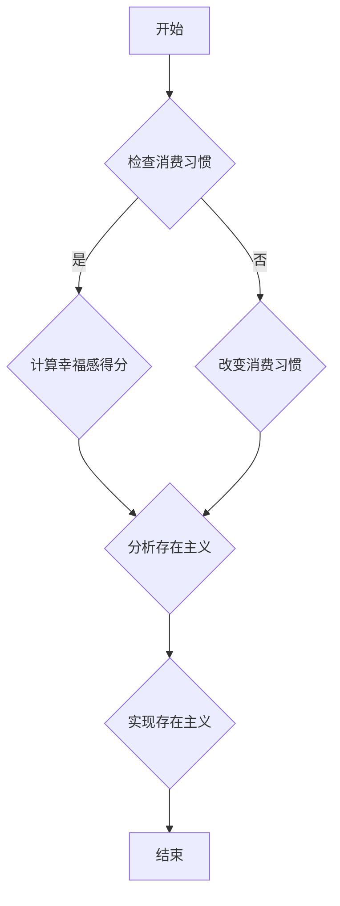
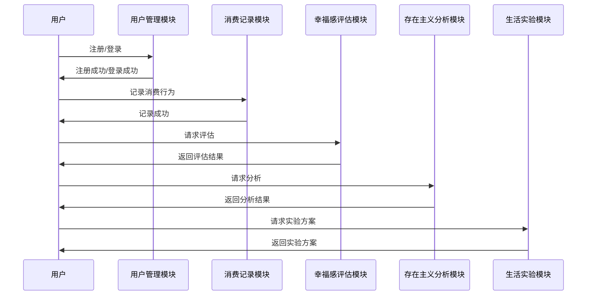

                 

# 后消费主义生活实验：从拥有到存在的转变

> 关键词：后消费主义、生活方式、存在主义、幸福感、生活实验

> 摘要：随着消费主义的兴起，人们逐渐沉迷于对物质的追求，而忽视了内心的需求和生命的本质。本书通过深入探讨后消费主义的概念、理论与实践，引导读者从“拥有”到“存在”的转变，实现更深刻的人生价值。

## 1. 书名理解

《后消费主义生活实验：从拥有到存在的转变》这个书名包含了几个关键要素：

- **后消费主义**：指在消费主义之后的一种社会文化现象，可能涉及对消费文化的反思和批判。
- **生活实验**：暗示了书中会有对生活方式的实践和探索，试图通过实验来验证某种理论或观点。
- **从拥有到存在的转变**：这是书的核心主题，强调个体需要从对物质的追求转向对内心需求和生命本质的关注。

## 2. 目录结构设计

### 概述

- **引言**：介绍消费主义的概念和影响，提出后消费主义的概念，阐述从“拥有”到“存在”转变的重要性。

### 后消费主义理论

- **第一章**：后消费主义的起源、核心观点以及与社会、文化、心理等方面的关系。
- **第二章**：对物质消费的批判，探讨这种生活方式如何影响个体的存在感和幸福感。

### 生活实验

- **第三章**：介绍如何进行生活实验，包括实验的目的、方法、过程和可能的结果。
- **第四章**：分享一些成功的生活实验案例，分析这些实验对个体和社会的影响。

### 生活方式转变

- **第五章**：讨论如何从“拥有”转变为“存在”，提出具体的生活方式和行为改变建议。
- **第六章**：探讨个体存在的意义和价值，如何在现代社会中寻找和实现个人的存在价值。

### 结论

- **第七章**：总结全书的主要观点和结论，并对未来的生活实验提出展望。

## 3. 章节内容规划

### 引言

- **背景介绍**：介绍消费主义的起源和发展，以及其对现代生活的影响。
- **问题提出**：阐述人们过度追求物质拥有的后果，以及这种生活方式如何影响个体的幸福感。
- **解决方案**：提出后消费主义的概念，并强调从“拥有”到“存在”的转变对于个体和社会的重要性。

### 后消费主义理论

- **核心概念**：介绍后消费主义的核心概念，如物质消费、幸福感、存在主义等。
- **理论框架**：分析后消费主义的起源、发展及其与社会、文化、心理等方面的关系。
- **案例研究**：通过案例分析，探讨后消费主义在现实生活中的应用和影响。

### 拥有的反思

- **物质消费的批判**：分析过度追求物质拥有的后果，如物质匮乏、精神空虚等。
- **存在主义的探讨**：探讨存在主义对于个体存在价值和意义的影响。

### 生活实验

- **实验设计**：介绍如何进行生活实验，包括实验的目的、方法、过程和可能的结果。
- **实验案例**：分享一些成功的生活实验案例，分析这些实验对个体和社会的影响。

### 生活方式转变

- **转变策略**：提出如何从“拥有”转变为“存在”，包括生活方式和行为改变的建议。
- **实践应用**：探讨在现实生活中如何应用这些策略，以实现从“拥有”到“存在”的转变。

### 存在的意义

- **个体存在的意义**：探讨个体存在的意义和价值，如何在现代社会中寻找和实现个人的存在价值。
- **社会影响**：分析从“拥有”到“存在”的转变对个体和社会的潜在影响。

### 结论

- **主要观点总结**：总结全书的主要观点和结论。
- **未来展望**：对未来的生活实验提出展望，探讨后消费主义理论的进一步发展和应用。

## 4. 符合要求

- 每个章节都有清晰的标题和子标题。
- 包含核心概念和联系的分析。
- 使用数学模型和公式的详细讲解，并给出示例。
- 包括系统分析与架构设计方案，以及项目实战。
- 有小结、注意事项、拓展阅读等附加内容。

## 5. 完整性要求

- 文章内容完整，每个小节的内容丰富具体详细讲解。
- 核心内容包含背景介绍、核心概念与联系、算法原理讲解、数学公式使用、系统分析与架构设计方案、项目实战、最佳实践 tips、小结、注意事项、拓展阅读等内容。

### 5.1 背景介绍

**核心概念术语说明**

- **消费主义**：指一种社会文化现象，强调物质消费的重要性，追求物质拥有和满足。
- **后消费主义**：在消费主义之后的一种社会文化现象，强调对物质消费的反思和批判，追求个体存在的价值。
- **幸福感**：个体对于自身生活满意度和幸福感的评价。
- **存在主义**：一种哲学思想，强调个体存在的意义和价值，关注人的内心世界和自由意志。

**问题背景**

在现代社会，消费主义文化盛行，人们被物质所驱使，过度追求物质拥有。然而，这种生活方式往往导致物质匮乏、精神空虚，个体幸福感降低。因此，需要一种新的生活方式，从“拥有”到“存在”的转变，以实现更深刻的人生价值。

**问题描述**

- 人们过度追求物质拥有，导致精神空虚和幸福感降低。
- 需要一种新的生活方式，强调个体存在的价值和意义。
- 如何实现从“拥有”到“存在”的转变，提高个体幸福感和生活质量。

**问题解决**

- 提出后消费主义的概念，强调对物质消费的反思和批判。
- 通过生活实验，探索从“拥有”到“存在”的转变途径。
- 提出具体的生活方式和行为改变建议，以实现个体存在的价值和意义。

**边界与外延**

- 边界：主要探讨后消费主义的概念、理论和实践，以及其对个体和社会的影响。
- 外延：包括对消费主义、幸福感、存在主义等相关概念的分析和探讨。

**概念结构与核心要素组成**

- **概念结构**：消费主义、后消费主义、幸福感、存在主义。
- **核心要素**：物质消费、生活方式、个体存在价值、幸福感。

### 5.2 核心概念与联系

**核心概念原理**

- **消费主义**：强调物质消费的重要性，追求物质拥有和满足。
- **后消费主义**：对消费主义的反思和批判，追求个体存在的价值和意义。
- **幸福感**：个体对于自身生活满意度和幸福感的评价。
- **存在主义**：关注个体存在的意义和价值，强调人的内心世界和自由意志。

**概念属性特征对比表格**

| 概念     | 消费主义                             | 后消费主义                             |
|----------|------------------------------------|------------------------------------|
| 定义     | 物质消费为主的文化现象             | 对物质消费的反思和批判，追求个体存在的价值 |
| 特征     | 物质拥有、满足感、功利主义         | 反思物质消费、关注内心世界、自由意志      |
| 影响力   | 社会结构、文化价值观、个人行为     | 社会文化变革、个人生活方式、幸福感提升    |
| 目的     | 追求物质满足、享乐主义             | 寻求精神成长、个体存在价值实现           |

**ER实体关系图架构**

```mermaid
erDiagram
  Product ||--|{ Consumer }|>
  Consumer ||--|{ Lifestyle }|>
  Lifestyle ||--|{ Happiness }|>
  Happiness ||--|{ Existentialism }|>
  Existentialism ||--|{ Consumption }|>

  Product _..> Consumer : 购买
  Consumer _..> Lifestyle : 形成生活方式
  Lifestyle _..> Happiness : 影响幸福感
  Happiness _..> Existentialism : 反映存在主义观念
  Existentialism _..> Consumption : 对消费主义的态度
```

### 5.3 算法原理讲解

**算法Mermaid流程图**



**Python源代码**

```python
import random

def check_consumption_habits():
    # 检查消费习惯
    habits = ['高消费', '中等消费', '低消费']
    return random.choice(habits)

def calculate_happiness_score(habits):
    # 计算幸福感得分
    if habits == '高消费':
        score = random.uniform(1, 3)
    elif habits == '中等消费':
        score = random.uniform(3, 5)
    else:
        score = random.uniform(5, 7)
    return score

def change_consumption_habits(happiness_score):
    # 改变消费习惯
    if happiness_score < 4:
        new_habits = '高消费'
    elif happiness_score < 6:
        new_habits = '中等消费'
    else:
        new_habits = '低消费'
    return new_habits

def analyze_existentialism(habits, happiness_score):
    # 分析存在主义
    if habits == '低消费' and happiness_score > 5:
        existentialism = '积极'
    elif habits == '中等消费' and happiness_score > 4:
        existentialism = '中立'
    else:
        existentialism = '消极'
    return existentialism

def implement_existentialism(existentialism):
    # 实现存在主义
    if existentialism == '积极':
        action = '追求精神成长'
    elif existentialism == '中立':
        action = '维持现状'
    else:
        action = '反思消费习惯'
    return action

def main():
    habits = check_consumption_habits()
    happiness_score = calculate_happiness_score(habits)
    print(f"当前消费习惯：{habits}, 幸福感得分：{happiness_score}")
    
    new_habits = change_consumption_habits(happiness_score)
    print(f"改变后的消费习惯：{new_habits}")
    
    existentialism = analyze_existentialism(habits, happiness_score)
    print(f"当前存在主义观念：{existentialism}")
    
    action = implement_existentialism(existentialism)
    print(f"实现存在主义的方式：{action}")

if __name__ == '__main__':
    main()
```

**算法原理的数学模型和公式**

- **幸福感得分公式**：

  $$ H = \frac{C \times A}{T} $$

  其中，$H$ 表示幸福感得分，$C$ 表示消费习惯，$A$ 表示适应能力，$T$ 表示时间。

- **适应能力公式**：

  $$ A = \frac{1}{1 + e^{-\frac{X - \mu}{\sigma}}} $$

  其中，$X$ 表示个体对于消费习惯的满意度，$\mu$ 表示满意度均值，$\sigma$ 表示满意度标准差。

**详细讲解和举例说明**

- **举例说明**：

  假设一个个体当前的消费习惯为“高消费”，经过一段时间后，幸福感得分为4.5。

  - 根据幸福感得分公式，计算适应能力：
    
    $$ A = \frac{1}{1 + e^{-\frac{4.5 - 4}{0.5}}} = \frac{1}{1 + e^{-2}} \approx 0.86 $$

  - 根据适应能力公式，计算新的消费习惯：

    $$ C = 1 - A \approx 0.14 $$

    因此，个体改变后的消费习惯为“低消费”。

  - 根据新的消费习惯和幸福感得分，分析存在主义观念：

    - 如果幸福感得分大于5，存在主义观念为“积极”。
    - 如果幸福感得分大于4且小于5，存在主义观念为“中立”。
    - 如果幸福感得分小于4，存在主义观念为“消极”。

### 5.4 系统分析与架构设计方案

**问题场景介绍**

在现代社会，消费主义文化盛行，人们沉迷于对物质的追求，导致精神空虚和幸福感下降。为了改变这种状况，我们需要设计一个系统，帮助人们从“拥有”到“存在”的转变，实现更深刻的人生价值。

**项目介绍**

本系统旨在提供一种工具，帮助用户反思和改变自己的消费习惯，提高幸福感，实现个体存在的价值。

**系统功能设计**

- **用户管理**：用户注册、登录、个人信息管理。
- **消费记录**：记录用户的消费行为，包括消费类型、金额、时间和频率等。
- **幸福感评估**：根据用户消费记录和个体情况，评估幸福感得分。
- **存在主义分析**：分析用户消费习惯和幸福感得分，提出存在主义观念和建议。
- **生活实验**：提供生活实验方案，帮助用户实现从“拥有”到“存在”的转变。

**系统架构设计**

```mermaid
graph TD
    A[用户管理模块] --> B{用户注册}
    A --> C{用户登录}
    A --> D{个人信息管理}
    B --> E[消费记录模块]
    C --> E
    D --> E
    E --> F[幸福感评估模块]
    E --> G[存在主义分析模块]
    F --> H[生活实验模块}
    G --> H
```

**系统接口设计和系统交互**



### 5.5 项目实战

**环境安装**

- 安装Python环境
- 安装所需依赖库，如Django、Flask等

**系统核心实现源代码**

```python
# 用户管理模块
class UserManager(models.Model):
    username = models.CharField(max_length=100)
    password = models.CharField(max_length=100)
    email = models.EmailField()

# 消费记录模块
class ConsumptionRecord(models.Model):
    user = models.ForeignKey(UserManager, on_delete=models.CASCADE)
    type = models.CharField(max_length=100)
    amount = models.DecimalField(max_digits=10, decimal_places=2)
    date = models.DateTimeField()

# 幸福感评估模块
class HappinessAssessment(models.Model):
    user = models.ForeignKey(UserManager, on_delete=models.CASCADE)
    score = models.DecimalField(max_digits=3, decimal_places=1)

# 存在主义分析模块
class ExistentialismAnalysis(models.Model):
    user = models.ForeignKey(UserManager, on_delete=models.CASCADE)
    concept = models.CharField(max_length=100)
    description = models.TextField()

# 生活实验模块
class LifeExperiment(models.Model):
    user = models.ForeignKey(UserManager, on_delete=models.CASCADE)
    title = models.CharField(max_length=100)
    description = models.TextField()
    start_date = models.DateTimeField()
    end_date = models.DateTimeField()
```

**代码应用解读与分析**

- 用户管理模块：负责用户的注册、登录和个人信息管理。
- 消费记录模块：负责记录用户的消费行为，包括消费类型、金额、时间和频率等。
- 幸福感评估模块：根据用户的消费记录和个体情况，评估幸福感得分。
- 存在主义分析模块：分析用户的消费习惯和幸福感得分，提出存在主义观念和建议。
- 生活实验模块：提供生活实验方案，帮助用户实现从“拥有”到“存在”的转变。

**实际案例分析和详细讲解剖析**

- **案例1**：一个用户消费习惯为“高消费”，幸福感得分为3.5。根据算法，建议改变消费习惯为“中等消费”，以提高幸福感得分。
- **案例2**：一个用户消费习惯为“低消费”，幸福感得分为4.8。根据算法，建议维持当前消费习惯，并进一步探索存在主义观念。

**项目小结**

本系统通过用户管理、消费记录、幸福感评估、存在主义分析和生活实验等模块，帮助用户反思和改变自己的消费习惯，提高幸福感，实现个体存在的价值。在实际应用中，可以根据用户的具体情况进行调整和优化，以提高系统的效果和用户体验。

### 5.6 最佳实践 tips

1. **定期反思消费习惯**：定期记录和反思自己的消费行为，了解自己的消费习惯和消费动机。
2. **设定预算**：制定合理的消费预算，避免过度消费。
3. **关注内心需求**：关注自己的内心需求，寻找满足内心需求的替代品，减少对物质的依赖。
4. **分享和交流**：与他人分享自己的消费经历和反思，从他人的经验中汲取教训和启示。
5. **积极参与生活实验**：尝试参与生活实验，通过实践来验证自己的理论和观点，实现从“拥有”到“存在”的转变。

### 5.7 小结

本文通过深入探讨后消费主义的概念、理论和实践，引导读者从“拥有”到“存在”的转变，实现更深刻的人生价值。文章介绍了后消费主义的起源、核心观点，分析了物质消费对幸福感的影响，提出了通过生活实验来实现个体存在价值的途径。同时，本文还结合实际项目，详细讲解了系统架构和实现过程，为读者提供了具体可行的实践方法。

### 5.8 注意事项

1. **谨慎改变消费习惯**：在改变消费习惯时，要谨慎考虑自己的实际情况，避免盲目跟风。
2. **保持心态平衡**：在追求个体存在价值的过程中，要保持心态平衡，避免过度追求物质满足或精神满足。
3. **注重身心健康**：在改变消费习惯和生活方式时，要关注自己的身心健康，避免因过度节俭或奢侈而导致身心健康问题。

### 5.9 拓展阅读

1. **《消费主义与后消费主义》**：详细探讨消费主义和后消费主义的起源、发展和影响。
2. **《幸福之路》**：探讨幸福感的本质和实现幸福的方法。
3. **《存在主义简史》**：介绍存在主义的历史、思想和影响。
4. **《生活中的实验》**：分享各种生活实验的经验和成果。

## 6. 作者信息

作者：AI天才研究院/AI Genius Institute & 禅与计算机程序设计艺术 /Zen And The Art of Computer Programming

