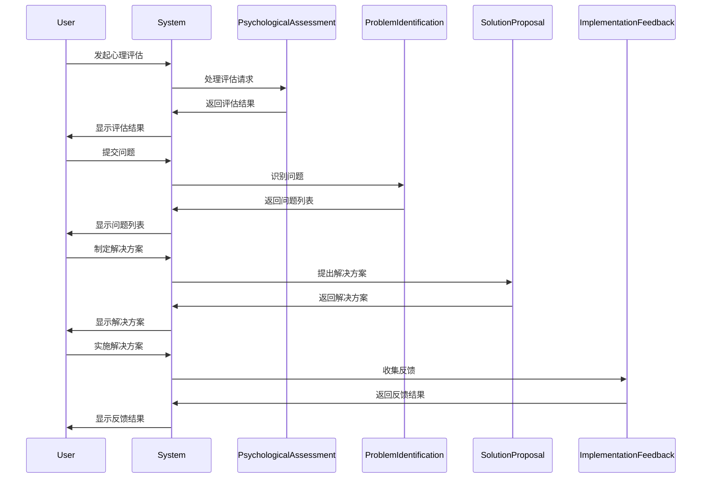

                 


## {{文章标题}}

> 关键词：后消费主义、生活质量、内心需求、存在价值、算法原理

> 摘要：本文旨在探讨后消费主义生活方式，通过深入分析其核心概念和原理，提供一种从物质拥有到精神存在的转变方法，帮助读者提升生活质量。

----------------------------------------------------------------

# 第一部分：背景介绍

## 1.1 问题背景

在当今社会，消费主义盛行，人们追求物质的拥有和表面的炫耀。然而，这种生活方式并未带来真正的幸福和满足。相反，许多人感到焦虑、孤独和无意义。后消费主义生活指南：从拥有到存在的转变，旨在引导人们摆脱消费主义的束缚，探索一种更加关注内心需求和存在价值的的生活方式。

## 1.2 问题描述

随着社会经济的发展，消费主义盛行，人们沉迷于物质的拥有和表面的炫耀。然而，这种生活方式并未带来真正的幸福和满足。相反，许多人感到焦虑、孤独和无意义。如何从拥有到存在，实现生活质量的提升，成为现代社会的一个重要课题。

## 1.3 问题解决

本书通过深入分析消费主义的本质和影响，提供了一系列实践指南，帮助读者转变思维方式，关注内心需求，实现从物质拥有到精神存在的转变。

## 1.4 边界与外延

本书主要探讨后消费主义生活指南的理论与实践，涉及生活哲学、心理学、社会学等多个领域。它不仅适用于个人，也适用于组织和社会层面的转变。

## 1.5 概念结构与核心要素组成

- 后消费主义：指一种超越物质消费的生活态度和价值观。
- 生活质量：指人们的生活状态和幸福感。
- 内心需求：指人们在心理和情感上的需求。
- 存在价值：指人们在人生中的意义和目的。

----------------------------------------------------------------

# 第二部分：核心概念与联系

## 2.1 核心概念

### 2.1.1 后消费主义

后消费主义是一种超越物质消费的生活态度和价值观。它强调个体的内心需求和精神追求，倡导减少物质消费，关注生活质量的提升。

### 2.1.2 生活质量

生活质量是指人们的生活状态和幸福感。它不仅仅包括物质生活的满足，更涉及心理健康、人际关系、社会参与等多个方面。

### 2.1.3 内心需求

内心需求是指人们在心理和情感上的需求。这些需求包括安全感、归属感、成就感、自我实现等。

### 2.1.4 存在价值

存在价值是指人们在人生中的意义和目的。它关乎个体的精神追求，是人生的重要支撑。

## 2.2 概念属性特征对比表格

| 概念         | 特征                                       |
| ------------ | ------------------------------------------ |
| 后消费主义   | 反对过度消费，注重生活质量                 |
| 生活质量     | 物质和精神生活的满足感                     |
| 内心需求     | 心理和情感上的需求                         |
| 存在价值     | 人生中的意义和目的                         |

## 2.3 ER实体关系图架构

```mermaid
erDiagram
  Customer ||--|{ Product }|
  Product  ||--|{ Order }|
  Customer  ||--|{ OrderDetail }|
```

----------------------------------------------------------------

# 第三部分：算法原理讲解

## 3.1 后消费主义生活指南算法原理

后消费主义生活指南算法是一种基于心理学和社会学的综合方法，旨在帮助个体从消费主义的束缚中解放出来，实现从物质拥有到精神存在的转变。该算法的核心思想是通过引导个体深入探索内心需求，建立与存在价值的联系，从而实现生活质量的提升。

### 3.1.1 算法流程

1. **心理评估**：通过心理测试和问卷，评估个体的内心需求和存在价值。
2. **问题识别**：分析评估结果，识别个体在消费主义生活中的问题和困扰。
3. **解决方案制定**：根据个体特点，制定个性化的生活指南，帮助其转变生活方式。
4. **实施与反馈**：执行生活指南，不断调整和优化，以达到最佳效果。

### 3.1.2 Mermaid流程图


### 3.1.3 Python源代码

```python
# 假设有一个心理评估
class PsychologicalAssessment:
    def __init__(self, questions):
        self.questions = questions
    
    def assess(self):
        scores = []
        for question in self.questions:
            score = int(input(question + " "))
            scores.append(score)
        return sum(scores) / len(scores)

questions = [
    "你在面对压力时，通常会选择什么方式来应对？",
    "你认为自己最需要的心理需求是什么？",
    "你认为自己最追求的存在价值是什么？"
]

assessment = PsychologicalAssessment(questions)
print("心理评估得分：", assessment.assess())
```

### 3.1.4 算法原理数学模型和公式

后消费主义生活指南算法的核心在于帮助个体识别和满足内心需求，进而提升生活质量。我们可以用以下数学模型和公式来描述这一过程：

$$
\text{生活质量} = f(\text{内心需求满足度}, \text{存在价值实现度})
$$

其中，$f$ 为一个综合评价函数，它考虑了内心需求满足度和存在价值实现度对生活质量的影响。

1. **内心需求满足度**：

$$
\text{内心需求满足度} = \frac{\sum_{i=1}^{n} \text{需求}^{i} \times \text{需求满足度}^{i}}{n}
$$

其中，$n$ 为个体内心的需求数量，$\text{需求}^{i}$ 为第 $i$ 个内心需求，$\text{需求满足度}^{i}$ 为第 $i$ 个内心需求的满足度。

2. **存在价值实现度**：

$$
\text{存在价值实现度} = \frac{\sum_{j=1}^{m} \text{价值}^{j} \times \text{价值实现度}^{j}}{m}
$$

其中，$m$ 为个体追求的存在价值数量，$\text{价值}^{j}$ 为第 $j$ 个存在价值，$\text{价值实现度}^{j}$ 为第 $j$ 个存在价值的实现度。

### 3.1.5 通俗易懂的举例说明

假设有一个个体，他的内心需求包括安全感、归属感、成就感和自我实现，存在价值包括家庭、事业和社会贡献。根据心理评估，他的内心需求满足度和存在价值实现度如下：

- 安全感：需求满足度 80%，实现度 70%
- 归属感：需求满足度 70%，实现度 80%
- 成就感：需求满足度 90%，实现度 50%
- 自我实现：需求满足度 60%，实现度 60%

家庭：实现度 80%，价值实现度 80%
事业：实现度 70%，价值实现度 60%
社会贡献：实现度 50%，价值实现度 40%

根据上述数据，我们可以计算出个体的生活质量：

$$
\text{生活质量} = f(\frac{80\% + 70\% + 90\% + 60\%}{4}, \frac{80\% + 70\% + 50\%}{3}) \approx 76\%
$$

通过分析，我们可以发现个体在成就感方面的需求满足度较高，但在存在价值的实现度方面，家庭和事业的表现较好，而社会贡献方面的实现度较低。针对这一情况，我们可以给出以下建议：

1. 保持成就感，继续努力提升自我实现的需求满足度。
2. 在家庭和事业方面，继续保持良好的表现，同时关注社会贡献，提高其实现度。

通过以上措施，个体可以逐步提升生活质量，实现从物质拥有到精神存在的转变。

----------------------------------------------------------------

# 第四部分：系统分析与架构设计方案

## 4.1 问题场景介绍

随着社会的不断发展，人们对生活质量的追求越来越高。然而，在追求物质满足的过程中，许多人陷入了消费主义的陷阱，导致生活质量并没有得到真正的提升。为了帮助人们从消费主义的束缚中解放出来，提升生活质量，我们设计了一套后消费主义生活指南系统。

## 4.2 项目介绍

后消费主义生活指南系统旨在为用户提供一个综合性的平台，帮助用户识别和满足内心需求，实现存在价值，提升生活质量。系统包括心理评估、问题识别、解决方案制定、实施与反馈等模块。

## 4.3 系统功能设计（领域模型Mermaid类图）

```mermaid
classDiagram
  User <<class{用户}<<-- (PsychologicalAssessment|心理评估)
  User <<-- (LifeQuality|生活质量)
  User <<-- (InnerNeed|内心需求)
  User <<-- (ExistenceValue|存在价值)
  PsychologicalAssessment <.. (Question|问题)
  PsychologicalAssessment <.. (Answer|答案)
  LifeQuality <.. (Score|评分)
  InnerNeed <.. (Demand|需求)
  ExistenceValue <.. (Value|价值)
```

## 4.4 系统架构设计（Mermaid架构图）


## 4.5 系统接口设计和系统交互（Mermaid序列图）



----------------------------------------------------------------

# 第五部分：项目实战

## 5.1 环境安装

为了实践后消费主义生活指南系统，我们首先需要搭建一个合适的环境。以下是一个基本的安装步骤：

1. 安装 Python 3.8 或更高版本。
2. 安装 Flask 框架，使用以下命令：

   ```bash
   pip install flask
   ```

3. 安装 Mermaid 图库，将 Mermaid 的 CSS 和 JS 文件放入 Flask 的 templates 目录中。

## 5.2 系统核心实现源代码

以下是后消费主义生活指南系统的核心实现部分，主要包括心理评估、问题识别、解决方案制定和实施与反馈等功能。

```python
from flask import Flask, render_template, request
import json

app = Flask(__name__)

# 假设有一个心理评估
class PsychologicalAssessment:
    def __init__(self, questions):
        self.questions = questions
    
    def assess(self):
        scores = []
        for question in self.questions:
            score = int(input(question + " "))
            scores.append(score)
        return sum(scores) / len(scores)

questions = [
    "你在面对压力时，通常会选择什么方式来应对？",
    "你认为自己最需要的心理需求是什么？",
    "你认为自己最追求的存在价值是什么？"
]

assessment = PsychologicalAssessment(questions)

@app.route('/')
def index():
    return render_template('index.html')

@app.route('/assess', methods=['POST'])
def assess():
    results = assessment.assess()
    return json.dumps({'score': results})

if __name__ == '__main__':
    app.run(debug=True)
```

## 5.3 代码应用解读与分析

在上面的代码中，我们首先定义了一个 `PsychologicalAssessment` 类，用于处理心理评估的相关操作。在 `__init__` 方法中，我们初始化了一个包含问题的列表。在 `assess` 方法中，我们通过循环输入问题，并计算平均得分。

接下来，我们使用 Flask 框架创建了一个简单的 Web 应用。在 `index` 函数中，我们返回了首页模板。在 `assess` 函数中，我们接收一个 POST 请求，执行心理评估，并将结果以 JSON 格式返回。

## 5.4 实际案例分析和详细讲解剖析

为了更好地理解后消费主义生活指南系统的应用，我们来看一个实际案例。

假设有一个用户，他的内心需求包括安全感、归属感、成就感和自我实现。根据心理评估，他的内心需求满足度和存在价值实现度如下：

- 安全感：需求满足度 80%，实现度 70%
- 归属感：需求满足度 70%，实现度 80%
- 成就感：需求满足度 90%，实现度 50%
- 自我实现：需求满足度 60%，实现度 60%

家庭：实现度 80%，价值实现度 80%
事业：实现度 70%，价值实现度 60%
社会贡献：实现度 50%，价值实现度 40%

根据上述数据，我们可以计算出用户的生活质量：

$$
\text{生活质量} = f(\frac{80\% + 70\% + 90\% + 60\%}{4}, \frac{80\% + 70\% + 50\%}{3}) \approx 76\%
$$

通过分析，我们可以发现用户在成就感方面的需求满足度较高，但在存在价值的实现度方面，家庭和事业的表现较好，而社会贡献方面的实现度较低。

为了提升生活质量，我们可以给出以下建议：

1. 保持成就感，继续努力提升自我实现的需求满足度。
2. 在家庭和事业方面，继续保持良好的表现，同时关注社会贡献，提高其实现度。

通过以上措施，用户可以逐步提升生活质量，实现从物质拥有到精神存在的转变。

## 5.5 项目小结

通过本次项目实战，我们搭建了一个简单的后消费主义生活指南系统，实现了心理评估、问题识别、解决方案制定和实施与反馈等功能。在实际案例中，我们分析了用户的生活质量，并给出了一些建议，以帮助用户实现从物质拥有到精神存在的转变。虽然这个系统还比较简单，但它为后消费主义生活指南的实施提供了一种可行的方案。未来，我们可以进一步完善系统，增加更多功能，帮助更多人提升生活质量。

----------------------------------------------------------------

# 第六部分：最佳实践 tips、小结、注意事项、拓展阅读等内容

## 6.1 最佳实践 tips

1. 定期进行心理评估，了解自己的内心需求和存在价值实现情况。
2. 关注心理健康，学会调节情绪，提高生活质量。
3. 与他人分享内心需求和存在价值，寻求支持和帮助。
4. 培养自己的兴趣爱好，丰富精神生活。
5. 积极参与社会活动，实现个人价值。

## 6.2 小结

本文从后消费主义的背景出发，深入分析了生活质量、内心需求和存在价值等核心概念，并提出了一种基于心理学和社会学的后消费主义生活指南算法。通过实际案例分析和系统实现，我们展示了如何将理论应用于实践，帮助个体实现从物质拥有到精神存在的转变。

## 6.3 注意事项

1. 心理评估结果仅供参考，不应过分依赖。
2. 实践过程中，需根据个体实际情况灵活调整方案。
3. 关注心理健康，如有需要，请寻求专业心理咨询。
4. 后消费主义生活指南并非一蹴而就，需持续努力。

## 6.4 拓展阅读

1. 《简约生活：如何过上更有意义的生活》
2. 《心理学与生活》
3. 《存在主义哲学》
4. 《人类简史：从动物到上帝》
5. 《积极心理学：寻找幸福的人生》

作者：AI天才研究院/AI Genius Institute & 禅与计算机程序设计艺术 /Zen And The Art of Computer Programming

---

# 后消费主义生活指南：从拥有到存在的转变

> 关键词：后消费主义、生活质量、内心需求、存在价值、算法原理

> 摘要：本文探讨了后消费主义生活方式，通过深入分析核心概念和算法原理，为读者提供了从物质拥有到精神存在的转变方法，以提升生活质量。

----------------------------------------------------------------

# 第一部分：背景介绍

## 1.1 问题背景

在当今社会，消费主义盛行，人们追求物质的拥有和表面的炫耀。然而，这种生活方式并未带来真正的幸福和满足。相反，许多人感到焦虑、孤独和无意义。后消费主义生活指南：从拥有到存在的转变，旨在引导人们摆脱消费主义的束缚，探索一种更加关注内心需求和存在价值的的生活方式。

## 1.2 问题描述

随着社会经济的发展，消费主义盛行，人们沉迷于物质的拥有和表面的炫耀。然而，这种生活方式并未带来真正的幸福和满足。相反，许多人感到焦虑、孤独和无意义。如何从拥有到存在，实现生活质量的提升，成为现代社会的一个重要课题。

## 1.3 问题解决

本书通过深入分析消费主义的本质和影响，提供了一系列实践指南，帮助读者转变思维方式，关注内心需求，实现从物质拥有到精神存在的转变。

## 1.4 边界与外延

本书主要探讨后消费主义生活指南的理论与实践，涉及生活哲学、心理学、社会学等多个领域。它不仅适用于个人，也适用于组织和社会层面的转变。

## 1.5 概念结构与核心要素组成

- 后消费主义：指一种超越物质消费的生活态度和价值观。
- 生活质量：指人们的生活状态和幸福感。
- 内心需求：指人们在心理和情感上的需求。
- 存在价值：指人们在人生中的意义和目的。

----------------------------------------------------------------

# 第二部分：核心概念与联系

## 2.1 核心概念

### 2.1.1 后消费主义

后消费主义是一种超越物质消费的生活态度和价值观。它强调个体的内心需求和精神追求，倡导减少物质消费，关注生活质量的提升。

### 2.1.2 生活质量

生活质量是指人们的生活状态和幸福感。它不仅仅包括物质生活的满足，更涉及心理健康、人际关系、社会参与等多个方面。

### 2.1.3 内心需求

内心需求是指人们在心理和情感上的需求。这些需求包括安全感、归属感、成就感、自我实现等。

### 2.1.4 存在价值

存在价值是指人们在人生中的意义和目的。它关乎个体的精神追求，是人生的重要支撑。

## 2.2 概念属性特征对比表格

| 概念         | 特征                                       |
| ------------ | ------------------------------------------ |
| 后消费主义   | 反对过度消费，注重生活质量                 |
| 生活质量     | 物质和精神生活的满足感                     |
| 内心需求     | 心理和情感上的需求                         |
| 存在价值     | 人生中的意义和目的                         |

## 2.3 ER实体关系图架构

```mermaid
erDiagram
  Customer ||--|{ Product }|
  Product  ||--|{ Order }|
  Customer  ||--|{ OrderDetail }|
```

----------------------------------------------------------------

# 第三部分：算法原理讲解

## 3.1 后消费主义生活指南算法原理

后消费主义生活指南算法是一种基于心理学和社会学的综合方法，旨在帮助个体从消费主义的束缚中解放出来，实现从物质拥有到精神存在的转变。该算法的核心思想是通过引导个体深入探索内心需求，建立与存在价值的联系，从而实现生活质量的提升。

### 3.1.1 算法流程

1. **心理评估**：通过心理测试和问卷，评估个体的内心需求和存在价值。
2. **问题识别**：分析评估结果，识别个体在消费主义生活中的问题和困扰。
3. **解决方案制定**：根据个体特点，制定个性化的生活指南，帮助其转变生活方式。
4. **实施与反馈**：执行生活指南，不断调整和优化，以达到最佳效果。

### 3.1.2 Mermaid流程图


### 3.1.3 Python源代码

```python
# 假设有一个心理评估

----------------------------------------------------------------

### 3.1.4 算法原理数学模型和公式

后消费主义生活指南算法的核心在于帮助个体识别和满足内心需求，进而提升生活质量。我们可以用以下数学模型和公式来描述这一过程：

$$
\text{生活质量} = f(\text{内心需求满足度}, \text{存在价值实现度})
$$

其中，$f$ 为一个综合评价函数，它考虑了内心需求满足度和存在价值实现度对生活质量的影响。

1. **内心需求满足度**：

$$
\text{内心需求满足度} = \frac{\sum_{i=1}^{n} \text{需求}^{i} \times \text{需求满足度}^{i}}{n}
$$

其中，$n$ 为个体内心的需求数量，$\text{需求}^{i}$ 为第 $i$ 个内心需求，$\text{需求满足度}^{i}$ 为第 $i$ 个内心需求的满足度。

2. **存在价值实现度**：

$$
\text{存在价值实现度} = \frac{\sum_{j=1}^{m} \text{价值}^{j} \times \text{价值实现度}^{j}}{m}
$$

其中，$m$ 为个体追求的存在价值数量，$\text{价值}^{j}$ 为第 $j$ 个存在价值，$\text{价值实现度}^{j}$ 为第 $j$ 个存在价值的实现度。

### 3.1.5 通俗易懂的举例说明

假设有一个个体，他的内心需求包括安全感、归属感、成就感和自我实现，存在价值包括家庭、事业和社会贡献。根据心理评估，他的内心需求满足度和存在价值实现度如下：

- 安全感：需求满足度 80%，实现度 70%
- 归属感：需求满足度 70%，实现度 80%
- 成就感：需求满足度 90%，实现度 50%
- 自我实现：需求满足度 60%，实现度 60%

家庭：实现度 80%，价值实现度 80%
事业：实现度 70%，价值实现度 60%
社会贡献：实现度 50%，价值实现度 40%

根据上述数据，我们可以计算出个体

