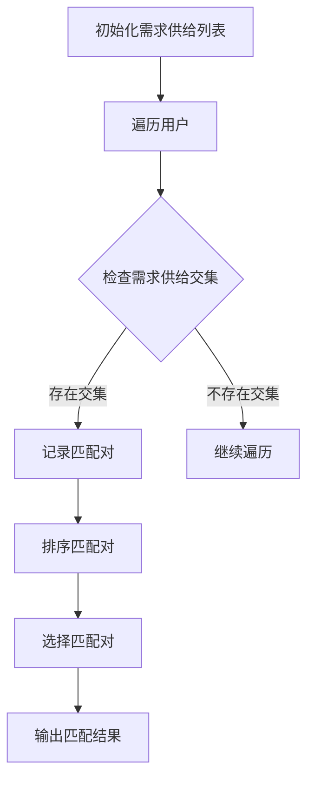
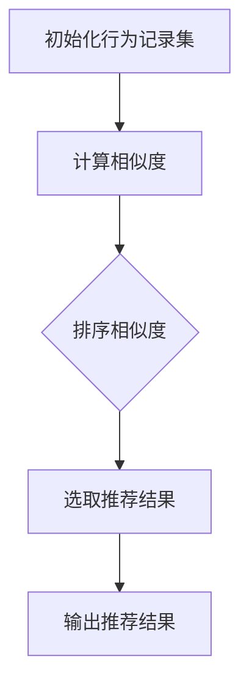

                 

### 文章标题与关键词

# 后消费主义集市网络：以物易物的全球社区经济平台

> 关键词：后消费主义、以物易物、社区经济、平台架构、算法原理、数学模型、实战案例、最佳实践

本文将探讨后消费主义时代下，以物易物在全球范围内形成的社区经济平台，分析其核心概念、算法原理、系统设计与实现，并通过实战案例提供实践指导。本文结构如下：

1. **问题背景与概念介绍**
2. **核心概念与联系**
3. **算法原理讲解**
4. **数学模型和公式讲解**
5. **系统分析与架构设计**
6. **项目实战**
7. **最佳实践与总结**

通过本文的深入分析，旨在为读者提供一套全面、实用的以物易物社区经济平台的构建与运营指南。

## 摘要

本文旨在探讨后消费主义时代下的以物易物全球社区经济平台，通过深入分析后消费主义的背景和以物易物的核心概念，介绍其应用场景和优势。文章首先明确了社区经济平台的基本概念，然后详细阐述了平台中核心概念的相互联系。接下来，文章通过算法原理讲解和数学模型公式讲解，为平台的设计与实现提供了理论基础。随后，系统分析与架构设计部分展示了平台的技术框架，并在项目实战中提供实际操作指南。最后，文章总结最佳实践，并提供拓展阅读，为读者深入研究和实践提供方向。

## 第1章：问题背景与概念介绍

### 1.1 后消费主义集市网络概述

后消费主义（Post-Consumerism）是21世纪初逐渐兴起的一种经济和社会现象，它是对传统消费主义的反思和挑战。与传统消费主义强调物质积累和消费追求不同，后消费主义更注重可持续性、共享性和社群互动。后消费主义认为，过度消费不仅浪费资源，还可能导致社会不平等和环境问题。因此，后消费主义倡导减少物质消费，鼓励人们通过分享、交换和协作来满足需求。

后消费主义集市网络则是在这种理念下形成的经济模式。它通过数字化平台，将个体和社区连接起来，形成一个去中心化的市场。在这个市场中，参与者可以发布和寻找物品、服务或者技能的交换，而不是通过货币进行买卖。这种模式不仅有助于减少资源的浪费，还能促进社区成员之间的互动和信任。

### 1.2 以物易物在全球社区经济平台中的应用

以物易物（Barter）是一种古老的交换方式，在全球范围内有着广泛的应用。在传统形式下，人们直接通过实物或服务进行交换，这种方式在资源匮乏或货币不发达的地区尤为重要。然而，随着互联网的发展，以物易物开始走向数字化和全球化。

在全球社区经济平台中，以物易物得以通过数字化手段实现。平台通常包括以下几个核心功能：

- **用户管理**：平台允许用户注册、登录和管理个人信息，包括身份验证、信用评分等。
- **物品管理**：用户可以发布想要交换的物品或服务，包括物品的描述、交换条件等。
- **交易管理**：平台提供交易流程管理，包括匹配、协商、交付和评价等环节。
- **社区互动**：平台设有社区板块，用户可以交流、分享经验和寻求帮助。

以物易物在全球社区经济平台中的应用具有以下几个显著优势：

1. **减少货币依赖**：在货币流通不稳定的地区，以物易物可以有效减少对货币的依赖，提高交易安全性。
2. **促进资源循环利用**：通过交换，许多原本被废弃的物品得以重新利用，减少了资源浪费。
3. **增强社区凝聚力**：以物易物鼓励人们互动和合作，有助于增强社区成员之间的联系和信任。

### 1.3 研究目的与意义

本文的研究目的是通过深入分析后消费主义集市网络和以物易物的全球社区经济平台，探讨其核心概念、算法原理、系统设计与实现。具体研究问题包括：

1. 后消费主义集市网络的构成和运行机制是什么？
2. 以物易物在全球社区经济平台中的应用模式和优势是什么？
3. 平台算法原理和数学模型如何支持以物易物的交易过程？
4. 如何设计一个高效、稳定的以物易物社区经济平台？

本文的研究意义在于：

1. **理论意义**：本文对后消费主义和以物易物进行了深入的理论分析，为相关领域的研究提供了新的视角和方法。
2. **实践意义**：本文通过案例分析，提供了构建和运营以物易物社区经济平台的实际指导，有助于推动这一新兴经济模式的实践应用。

### 1.4 后消费主义集市网络的优势

后消费主义集市网络在全球范围内迅速发展，其原因在于其独特的优势和潜力。以下是后消费主义集市网络的一些主要优势：

1. **去中心化**：后消费主义集市网络通常采用去中心化架构，减少了传统市场中的中介环节，降低了交易成本，提高了市场效率。
2. **可持续发展**：通过促进资源的循环利用和减少浪费，后消费主义集市网络有助于实现可持续发展目标。
3. **社区互动**：以物易物鼓励社区成员之间的互动和合作，增强了社区的凝聚力和归属感。
4. **灵活性与适应性**：后消费主义集市网络可以根据不同地区和文化的需求进行灵活调整，具有较强的适应性。
5. **信任机制**：通过建立信用评分和评价系统，后消费主义集市网络能够提高交易双方的信任度，降低交易风险。

### 1.5 后消费主义集市网络与全球社区经济平台的关系

后消费主义集市网络和全球社区经济平台之间存在着密切的关系。一方面，后消费主义集市网络为全球社区经济平台提供了核心的交换机制和运作模式。另一方面，全球社区经济平台则为后消费主义集市网络提供了一个数字化和全球化的实现路径。

通过全球社区经济平台，后消费主义集市网络能够跨越地域限制，连接全球范围内的用户和资源，实现更大范围的资源交换和共享。这种互动不仅有助于提高资源利用效率，还能促进全球社区的互动和合作。

### 1.6 后消费主义集市网络的发展趋势

随着全球经济的不断发展和技术的进步，后消费主义集市网络的发展趋势也日益明显。以下是后消费主义集市网络可能的发展方向：

1. **数字化与智能化**：随着大数据、人工智能和区块链等技术的发展，后消费主义集市网络将越来越依赖于数字化和智能化手段，提高交易效率和服务质量。
2. **跨领域融合**：后消费主义集市网络将与其他领域（如共享经济、供应链管理、金融科技等）进行深度融合，形成新的商业模式和应用场景。
3. **全球化扩展**：后消费主义集市网络将逐步实现全球化，连接更多国家和地区的用户和资源，推动全球经济的可持续发展。
4. **社区自治**：随着区块链等技术的应用，后消费主义集市网络将逐步实现社区自治，提高社区的自主性和管理效率。

### 1.7 本章小结

本章介绍了后消费主义集市网络的背景和核心概念，探讨了以物易物在全球社区经济平台中的应用和优势，并分析了后消费主义集市网络的发展趋势。通过本章的学习，读者可以初步了解后消费主义集市网络的基本概念和应用场景，为后续章节的深入探讨打下基础。

## 第2章：核心概念与联系

### 2.1 后消费主义与以物易物的定义

在深入探讨后消费主义集市网络的运作机制之前，我们首先需要明确两个核心概念：后消费主义和以物易物。

**后消费主义**：后消费主义是相对于传统消费主义而言的一种社会和经济现象。传统消费主义强调物质追求和消费积累，而后消费主义则提倡减少物质消费，注重资源的可持续利用和社区的互动。后消费主义不仅仅是一种经济模式，更是一种价值观和生活方式的转变。

**以物易物**：以物易物是一种不通过货币直接交换物品或服务的方式。它起源于人类社会早期的物物交换，随着时代的发展，以物易物逐渐演变为一种多样化的交换方式，包括直接交换、中介交换和数字化交换等。

### 2.2 后消费主义的背景

后消费主义的背景可以从以下几个方面进行理解：

1. **资源短缺**：随着全球人口的不断增长和资源消耗的加剧，传统消费主义模式导致了资源短缺和环境问题。后消费主义提倡减少浪费，提高资源利用效率，以应对资源短缺的挑战。

2. **环境问题**：环境污染、气候变化等环境问题日益严重，促使人们重新审视消费行为和生活方式。后消费主义倡导环保，通过减少消费和循环利用资源来降低对环境的负面影响。

3. **社会不平等**：传统消费主义模式往往导致社会不平等，贫富差距加大。后消费主义提倡共享和合作，通过减少物质消费和增加社会互动来缓解社会不平等。

4. **经济危机**：全球金融危机和货币贬值等经济问题使得人们开始寻求替代性的经济模式。后消费主义通过去中心化和自给自足的方式，提供了一种经济上的解决方案。

### 2.3 以物易物的基本概念

以物易物的基本概念主要包括以下几个方面：

1. **交换主体**：交换主体可以是个人、企业、组织或社区。在不同的情境下，交换主体的角色和地位可能会有所不同。

2. **交换物品**：交换物品可以是有形的物品，如书籍、衣物、食品等，也可以是无形的服务或技能，如修理、设计、咨询服务等。

3. **交换条件**：交换条件是指交换双方在交换过程中所设定的条件，如物品的数量、质量、交付时间等。交换条件通常需要双方协商达成一致。

4. **交换过程**：交换过程包括物品的发布、搜索、匹配、协商和交付等环节。数字化平台可以简化这些环节，提高交换效率。

### 2.4 后消费主义与以物易物的联系

后消费主义与以物易物之间存在密切的联系，具体表现为：

1. **理念一致**：后消费主义和以物易物都强调减少物质消费，提高资源利用效率，这与后消费主义的核心价值观高度契合。

2. **实现路径**：后消费主义通过以物易物等交换方式来实现减少物质消费的目标。以物易物为后消费主义提供了一种实际可行的实现路径。

3. **社区互动**：以物易物鼓励社区成员之间的互动和合作，这与后消费主义提倡的社群互动和共享理念相符。

4. **可持续发展**：后消费主义和以物易物都关注可持续发展，通过减少浪费和循环利用资源，降低对环境的负面影响。

### 2.5 后消费主义与以物易物在社区经济平台中的应用

在社区经济平台中，后消费主义和以物易物得到了广泛应用。以下是一些具体应用场景：

1. **资源共享**：社区成员可以通过平台发布和寻找共享资源，如闲置物品、空房间、停车位等，实现资源的高效利用。

2. **技能交换**：社区成员可以发布和寻找技能交换，如编程、烹饪、音乐等，通过技能的分享和学习，提高个人的生活质量和技能水平。

3. **互助合作**：社区成员可以建立互助合作小组，共同完成一些任务或项目，如社区花园、环保活动等，增强社区的凝聚力和归属感。

4. **社区市场**：社区成员可以在平台上建立社区市场，进行以物易物的交易，促进社区内部的商品和服务交流。

### 2.6 核心概念对比表格

为了更好地理解后消费主义和以物易物的核心概念，我们提供了以下对比表格：

| 核心概念 | 定义 | 应用场景 | 关联关系 |
| --- | --- | --- | --- |
| 后消费主义 | 一种减少物质消费、注重可持续性的经济和社会现象 | 资源循环利用、环保、社会互动 | 以物易物是后消费主义的一种实现路径 |
| 以物易物 | 不通过货币直接交换物品或服务的方式 | 共享资源、技能交换、互助合作、社区市场 | 后消费主义提倡以物易物，以实现减少物质消费的目标 |

### 2.7 ER图与概念关系分析

为了更清晰地展示后消费主义集市网络中的核心概念及其相互关系，我们使用ER图（实体关系图）进行了描述。

```mermaid
erDiagram
  User ||--|{ Item } : 发布
  User ||--|{ Transaction } : 参与
  Item ||--|{ Category } : 归类
  Transaction ||--|{ Exchange } : 完成
  Category ||--|{ Statistic } : 统计
```

在上面的ER图中，我们定义了以下实体和关系：

- **User（用户）**：用户是参与以物易物交易的实体，包括注册用户、登录用户等。
- **Item（物品）**：物品是用户发布和交换的实体，包括物品描述、发布者、分类等信息。
- **Transaction（交易）**：交易是用户之间进行物品交换的实体，包括交易发起者、接受者、交易状态等信息。
- **Category（分类）**：分类是对物品进行分类管理的实体，包括分类名称、分类级别等信息。
- **Exchange（交换）**：交换是交易完成的具体记录，包括交换物品、交换双方、交换时间等信息。
- **Statistic（统计）**：统计是对以物易物交易进行数据分析的实体，包括交易数量、交易金额、交易成功率等指标。

通过ER图，我们可以清晰地看到各个实体之间的关系，如用户发布物品、参与交易，物品属于特定分类，交易记录包含交换细节等。这些关系为后消费主义集市网络的设计和实现提供了理论基础。

### 2.8 本章小结

本章详细介绍了后消费主义和以物易物的基本概念、背景、联系及其在社区经济平台中的应用。通过对比表格和ER图，我们更清晰地理解了核心概念之间的相互关系。本章为后续章节的深入探讨提供了坚实的基础。

## 第3章：算法原理讲解

### 3.1 匹配算法原理

在以物易物的全球社区经济平台中，匹配算法是实现高效交换的关键。匹配算法的目标是找到最合适的交易双方，使交换过程中的需求和供给得到最优匹配。以下是匹配算法的基本原理：

**1. 问题描述**

假设有n个用户，每个用户都有一个需求列表和供给列表。需求列表包含用户需要的物品，供给列表包含用户可以提供的物品。匹配算法的目标是在所有用户中找到一对用户，使得他们的需求列表和供给列表存在交集，从而实现物品的交换。

**2. 算法步骤**

- **步骤1**：初始化所有用户的需求列表和供给列表。
- **步骤2**：遍历所有用户，对于每个用户u，遍历其他用户v，检查用户u的供给列表和用户v的需求列表是否存在交集。
- **步骤3**：如果存在交集，则记录这一对用户作为潜在的匹配对。
- **步骤4**：对记录的匹配对进行排序，排序依据可以是交换成功率、信用评分等。
- **步骤5**：选择排序后的第一个匹配对作为最终匹配结果。

**3. 实例分析**

假设有两个用户A和B，用户A的需求列表为[苹果，牛奶]，供给列表为[面包，电视]，用户B的需求列表为[电视，牛奶]，供给列表为[苹果，面包]。匹配算法首先检查A和B的需求列表和供给列表，发现它们存在交集[牛奶]，因此将A和B作为匹配对记录。然后对记录的匹配对进行排序，排序依据可以是交换成功率，如果A和B的交换成功率相同，则按照用户注册时间排序。最终，A和B被选择为匹配结果。

### 3.2 匹配算法流程图

为了更直观地展示匹配算法的原理，我们使用mermaid绘制了匹配算法的流程图：



在上述流程图中，A表示初始化需求供给列表，B表示遍历用户，C表示检查需求供给交集，D表示记录匹配对，E表示继续遍历，F表示排序匹配对，G表示选择匹配对，H表示输出匹配结果。

### 3.3 匹配算法的优化

匹配算法的性能直接影响平台的使用体验和交易效率。为了提高匹配算法的效率，可以采用以下优化策略：

**1. 并行处理**

将匹配算法分解为多个子任务，利用多核处理器并行处理，可以显著提高算法的执行速度。

**2. 缓存机制**

在用户发布物品或需求时，将相关信息缓存起来，当用户进行匹配操作时，可以直接从缓存中获取数据，减少数据库查询次数，提高响应速度。

**3. 模糊匹配**

在用户发布物品或需求时，可以采用模糊匹配技术，将用户的输入与数据库中的数据进行匹配，从而提高匹配的准确性和效率。

### 3.4 推荐算法原理

除了匹配算法，推荐算法也是以物易物平台中至关重要的一部分。推荐算法的目标是根据用户的行为和偏好，为其推荐可能感兴趣的物品或交易伙伴。以下是推荐算法的基本原理：

**1. 问题描述**

假设有n个用户，每个用户有一个行为记录集。推荐算法的目标是根据这些行为记录，为每个用户推荐k个可能的交易伙伴。

**2. 算法步骤**

- **步骤1**：初始化用户的行为记录集。
- **步骤2**：计算用户之间的相似度，相似度可以通过用户的行为记录集的Jaccard相似度或余弦相似度来计算。
- **步骤3**：对相似度进行排序，选取相似度最高的k个用户作为推荐结果。

**3. 实例分析**

假设有两个用户A和B，用户A的行为记录集为[苹果，牛奶，面包]，用户B的行为记录集为[牛奶，面包，电视]。我们可以使用Jaccard相似度计算A和B的相似度，计算公式如下：

$$
J(A, B) = \frac{|A \cap B|}{|A \cup B|}
$$

其中，$A \cap B$表示A和B的交集，$A \cup B$表示A和B的并集。代入数据计算得到：

$$
J(A, B) = \frac{1}{3} = 0.333
$$

这意味着A和B的行为记录集有33.3%的相似度。根据相似度排序，选取相似度最高的用户作为推荐结果。

### 3.5 推荐算法流程图

为了更直观地展示推荐算法的原理，我们使用mermaid绘制了推荐算法的流程图：



在上述流程图中，A表示初始化用户的行为记录集，B表示计算相似度，C表示对相似度进行排序，D表示选取推荐结果，E表示输出推荐结果。

### 3.6 算法总结

通过本章的讲解，我们了解了匹配算法和推荐算法的基本原理。匹配算法旨在找到最合适的交易双方，提高交换的成功率；推荐算法则根据用户的行为和偏好，为用户推荐可能感兴趣的物品或交易伙伴，提高平台的用户粘性。这两个算法相辅相成，共同构建了以物易物全球社区经济平台的核心功能。

## 第4章：数学模型和公式讲解

### 4.1 基础数学模型

在以物易物的全球社区经济平台中，数学模型和公式起着至关重要的作用。这些模型和公式不仅能够帮助我们理解和分析平台中的各种交易行为，还能够为算法设计提供理论基础。以下是一些基础数学模型和公式：

#### 4.1.1 供需平衡模型

供需平衡模型用于分析平台上的供需关系，确保物品和服务的供需平衡。供需平衡公式如下：

$$
Supply_i = Demand_i
$$

其中，$Supply_i$表示第i种物品的供应量，$Demand_i$表示第i种物品的需求量。当$Supply_i = Demand_i$时，表示供需平衡。

#### 4.1.2 交易成功率模型

交易成功率模型用于衡量交易的成功概率，其公式如下：

$$
Success_Rate = \frac{Completed_Transactions}{Total_Transactions}
$$

其中，$Success_Rate$表示交易成功率，$Completed_Transactions$表示完成的交易数量，$Total_Transactions$表示总的交易数量。

#### 4.1.3 信用评分模型

信用评分模型用于评估用户的信用状况，其公式如下：

$$
Credit_Score = \alpha \cdot Success_Rate + \beta \cdot User_Rating
$$

其中，$Credit_Score$表示信用评分，$\alpha$和$\beta$是权重系数，$Success_Rate$表示交易成功率，$User_Rating$表示用户评分。

#### 4.1.4 相似度计算模型

相似度计算模型用于比较用户之间的行为相似性，常用的相似度计算方法有Jaccard相似度和余弦相似度。以Jaccard相似度为例，其公式如下：

$$
J(A, B) = \frac{|A \cap B|}{|A \cup B|}
$$

其中，$A$和$B$是两个用户的行为记录集，$A \cap B$表示A和B的交集，$A \cup B$表示A和B的并集。

#### 4.1.5 优化模型

在以物易物平台中，优化模型用于优化匹配算法和推荐算法的性能。常见的优化模型有线性规划模型和贪心算法模型。以下是一个简单的线性规划模型：

$$
\min \sum_{i=1}^{n} c_i x_i \\
s.t. \\
A x \geq b \\
x \geq 0
$$

其中，$c_i$是第i个目标的权重系数，$x_i$是第i个目标的选择变量，$A$是约束矩阵，$b$是约束向量，$x$是选择变量的向量。

### 4.2 数学公式详细解释

以上提到的数学公式是构建以物易物全球社区经济平台的基础。以下是对这些公式的详细解释：

#### 4.2.1 供需平衡模型

供需平衡模型确保了平台上的物品供应与需求之间达到平衡。在实际应用中，供需平衡公式可以用于预测特定时间段内的物品供需状况，从而帮助平台管理者调整库存和交易策略。

#### 4.2.2 交易成功率模型

交易成功率模型用于评估用户在平台上的交易表现。成功率高表示用户能够顺利完成交易，这对提高平台的信誉和用户满意度至关重要。

#### 4.2.3 信用评分模型

信用评分模型是评估用户信用状况的重要工具。信用评分越高，用户在平台上的交易信任度越高，这有助于减少交易风险和纠纷。

#### 4.2.4 相似度计算模型

相似度计算模型用于推荐系统和匹配算法。通过计算用户之间的相似度，平台可以为用户推荐潜在的交易伙伴，提高交易的成功率和用户体验。

#### 4.2.5 优化模型

优化模型用于提高匹配算法和推荐算法的效率。在实际应用中，优化模型可以帮助平台在给定约束条件下找到最优的交易匹配方案，从而提高资源利用率和交易成功率。

### 4.3 实例说明

为了更好地理解这些数学模型和公式，我们通过一个实例来说明它们的实际应用。

#### 实例：供需平衡模型

假设某平台上有三种物品：苹果、牛奶和面包。当前苹果的供应量为100个，需求量为120个；牛奶的供应量为80个，需求量为60个；面包的供应量为70个，需求量为50个。使用供需平衡模型，我们可以计算出每种物品的供需平衡量：

$$
Supply_{苹果} = Demand_{苹果} = \frac{Supply_{苹果} + Demand_{苹果}}{2} = \frac{100 + 120}{2} = 110
$$

$$
Supply_{牛奶} = Demand_{牛奶} = \frac{Supply_{牛奶} + Demand_{牛奶}}{2} = \frac{80 + 60}{2} = 70
$$

$$
Supply_{面包} = Demand_{面包} = \frac{Supply_{面包} + Demand_{面包}}{2} = \frac{70 + 50}{2} = 60
$$

根据计算结果，苹果的供需平衡量为110个，牛奶的供需平衡量为70个，面包的供需平衡量为60个。这意味着平台需要调整库存，确保这三种物品的供应量与需求量相等。

#### 实例：交易成功率模型

假设某用户在平台上有10次交易记录，其中成功完成的交易有7次，失败的交易有3次。使用交易成功率模型，我们可以计算出该用户的交易成功率：

$$
Success_Rate = \frac{Completed_Transactions}{Total_Transactions} = \frac{7}{10} = 0.7
$$

该用户的交易成功率为70%，这意味着他在平台上的交易表现较好。

#### 实例：信用评分模型

假设某用户的交易成功率为80%，用户评分为90分。使用信用评分模型，我们可以计算出该用户的信用评分：

$$
Credit_Score = \alpha \cdot Success_Rate + \beta \cdot User_Rating = 0.6 \cdot 0.8 + 0.4 \cdot 90 = 0.48 + 36 = 36.48
$$

该用户的信用评分为36.48分，这意味着他在平台上的信用状况良好。

#### 实例：相似度计算模型

假设有两个用户A和B，用户A的行为记录集为[苹果，牛奶，面包]，用户B的行为记录集为[牛奶，面包，电视]。使用Jaccard相似度模型，我们可以计算出A和B之间的相似度：

$$
J(A, B) = \frac{|A \cap B|}{|A \cup B|} = \frac{1}{4} = 0.25
$$

A和B之间的相似度为25%，这表明他们的行为记录集相似度较低。

#### 实例：优化模型

假设平台需要从三种物品中选取两种进行推荐，物品的权重系数分别为苹果：0.5，牛奶：0.3，面包：0.2。使用线性规划模型，我们可以计算出最优的推荐组合：

$$
\min \sum_{i=1}^{3} c_i x_i \\
s.t. \\
A x \geq b \\
x \geq 0
$$

其中，$c_i$是权重系数，$x_i$是选择变量的向量，$A$是约束矩阵，$b$是约束向量。通过求解线性规划模型，我们可以得到最优的推荐组合，从而提高用户的满意度。

### 4.4 本章小结

本章详细介绍了以物易物全球社区经济平台中常用的数学模型和公式，包括供需平衡模型、交易成功率模型、信用评分模型、相似度计算模型和优化模型。通过实例说明，我们了解了这些模型和公式的实际应用方法，为平台的设计与实现提供了重要的理论基础。

## 第5章：系统分析与架构设计

### 5.1 问题场景介绍

在现代数字化经济环境中，构建一个高效、可靠的以物易物的全球社区经济平台至关重要。此类平台不仅需要支持大规模用户和物品的交换，还需确保数据的安全性、交易的透明性和系统的可扩展性。本章节将深入分析以物易物社区经济平台的问题场景，并介绍平台的设计目标和功能。

#### 5.1.1 问题场景描述

以物易物社区经济平台的目标是为用户提供一个便捷、安全、可持续的交换平台。用户可以在平台上发布和寻找物品、服务或技能的交换，平台需实现以下功能：

- **用户管理**：用户注册、登录、个人信息管理、信用评分系统。
- **物品管理**：物品发布、分类管理、搜索与推荐。
- **交易管理**：交易发起、协商、完成、交易评价。
- **社区互动**：用户论坛、公告板、活动组织。

#### 5.1.2 设计目标

平台的设计目标包括：

- **高可用性**：确保平台在任何情况下都能稳定运行，提供不间断的服务。
- **高安全性**：保护用户数据和交易信息的安全，防止数据泄露和欺诈行为。
- **可扩展性**：支持平台规模的扩大，适应日益增长的用户需求。
- **易用性**：提供简洁直观的用户界面，提高用户的使用体验。
- **可维护性**：确保系统的长期维护和更新，适应技术发展需求。

### 5.2 系统功能设计

平台的核心功能设计如下：

**1. 用户管理模块**

用户管理模块负责用户的注册、登录、个人信息管理和信用评分。用户注册时需提供真实个人信息，平台通过验证身份提高用户信任度。个人信息管理包括用户资料的修改和隐私设置。信用评分系统根据用户的历史交易记录和评价进行评分，影响用户在平台上的信誉。

**2. 物品管理模块**

物品管理模块负责物品的发布、分类管理、搜索和推荐。用户可以发布自己的物品或服务，并选择合适的分类。平台提供智能搜索和推荐功能，帮助用户快速找到心仪的交换对象。搜索功能支持关键词搜索和筛选条件，推荐功能基于用户的兴趣和历史行为进行个性化推荐。

**3. 交易管理模块**

交易管理模块负责交易的发起、协商、完成和评价。用户可以通过平台发起交易请求，双方协商交换条件，并最终完成交易。交易完成后，双方可以相互评价，评价结果将影响用户的信用评分。平台提供争议解决机制，处理交易过程中的纠纷。

**4. 社区互动模块**

社区互动模块提供用户论坛、公告板和活动组织功能，增强用户间的互动和社区凝聚力。用户可以在论坛上分享经验、寻求帮助或组织线下活动。公告板用于发布平台重要通知和活动信息。

### 5.3 系统架构设计

为了实现平台的设计目标，系统架构设计采用分层架构，包括表示层、业务逻辑层和数据层。以下是系统架构的详细描述：

**1. 表示层**

表示层负责用户界面的展示和交互。使用前端技术（如HTML、CSS、JavaScript）构建用户界面，提供简洁直观的操作体验。表示层通过RESTful API与业务逻辑层进行通信，接收用户请求并返回响应。

**2. 业务逻辑层**

业务逻辑层负责处理业务逻辑，包括用户管理、物品管理、交易管理和社区互动等功能。使用后端技术（如Java、Python、Node.js）实现业务逻辑，确保系统的稳定性和安全性。业务逻辑层还负责数据的一致性和业务规则的执行。

**3. 数据层**

数据层负责数据的存储和管理，使用关系型数据库（如MySQL、PostgreSQL）和NoSQL数据库（如MongoDB、Redis）。用户数据、物品数据、交易数据和社区互动数据分别存储在对应的数据库中，确保数据的安全性和可扩展性。

### 5.4 系统接口设计

系统接口设计是确保各模块之间协同工作的重要环节。以下是系统接口的详细描述：

**1. 用户管理接口**

用户管理接口包括注册、登录、个人信息管理、信用评分等功能。接口定义如下：

- **注册**：POST /users/register
  - 输入：用户名、密码、邮箱、手机号
  - 输出：注册成功或失败消息

- **登录**：POST /users/login
  - 输入：用户名、密码
  - 输出：登录成功或失败消息，用户Token

- **个人信息管理**：PUT /users/{userId}
  - 输入：用户Token、用户信息
  - 输出：更新成功或失败消息

- **信用评分**：GET /users/{userId}/credit
  - 输入：用户Token
  - 输出：信用评分信息

**2. 物品管理接口**

物品管理接口包括物品发布、分类管理、搜索和推荐等功能。接口定义如下：

- **物品发布**：POST /items
  - 输入：用户Token、物品信息
  - 输出：发布成功或失败消息，物品ID

- **分类管理**：GET /categories
  - 输出：分类列表

- **物品搜索**：GET /items/search
  - 输入：关键词、分类ID、排序条件
  - 输出：搜索结果

- **物品推荐**：GET /items/recommend
  - 输入：用户Token
  - 输出：推荐物品列表

**3. 交易管理接口**

交易管理接口包括交易发起、协商、完成和评价等功能。接口定义如下：

- **交易发起**：POST /transactions
  - 输入：用户Token、交易信息
  - 输出：交易ID、交易状态

- **交易协商**：PUT /transactions/{transactionId}/negotiate
  - 输入：用户Token、协商信息
  - 输出：协商成功或失败消息

- **交易完成**：PUT /transactions/{transactionId}/complete
  - 输入：用户Token、评价信息
  - 输出：交易完成消息

- **交易评价**：POST /transactions/{transactionId}/evaluate
  - 输入：用户Token、评价信息
  - 输出：评价成功或失败消息

**4. 社区互动接口**

社区互动接口包括论坛、公告板和活动组织等功能。接口定义如下：

- **论坛发帖**：POST /forum/topics
  - 输入：用户Token、帖子信息
  - 输出：发帖成功或失败消息，帖子ID

- **公告板发布**：POST /announcements
  - 输入：用户Token、公告信息
  - 输出：发布成功或失败消息

- **活动组织**：POST /events
  - 输入：用户Token、活动信息
  - 输出：活动ID、活动状态

### 5.5 系统交互设计

为了确保各模块之间的顺畅交互，系统交互设计采用RESTful API架构，使用JSON格式进行数据传输。以下是系统交互的详细描述：

**1. 用户注册**

用户通过注册接口提交用户信息，平台验证用户信息的合法性后，返回注册结果。

```json
POST /users/register
{
  "username": "user123",
  "password": "password",
  "email": "user123@example.com",
  "phone": "1234567890"
}
```

**2. 用户登录**

用户通过登录接口提交用户名和密码，平台验证身份后，返回登录结果和Token。

```json
POST /users/login
{
  "username": "user123",
  "password": "password"
}
```

**3. 用户个人信息管理**

用户通过个人信息管理接口更新个人资料，平台验证Token后，更新用户信息。

```json
PUT /users/{userId}
{
  "token": "eyJhbGciOiJIUzI1NiIsInR5cCI6IkpXVCJ9...",
  "info": {
    "email": "newemail@example.com",
    "phone": "0987654321"
  }
}
```

**4. 物品发布**

用户通过物品发布接口发布物品，平台验证Token后，存储物品信息。

```json
POST /items
{
  "token": "eyJhbGciOiJIUzI1NiIsInR5cCI6IkpXVCJ9...",
  "item": {
    "name": "Book",
    "description": "A book about AI",
    "category": "Education",
    "exchange_condition": "Good Condition"
  }
}
```

**5. 交易发起**

用户通过交易接口发起交易请求，平台根据用户和物品信息，生成交易记录。

```json
POST /transactions
{
  "token": "eyJhbGciOiJIUzI1NiIsInR5cCI6IkpXVCJ9...",
  "transaction": {
    "user_id": 1,
    "item_id": 101,
    "exchange_condition": "In Person"
  }
}
```

**6. 交易协商**

交易双方通过协商接口修改交易条件，平台验证Token后，更新交易记录。

```json
PUT /transactions/{transactionId}/negotiate
{
  "token": "eyJhbGciOiJIUzI1NiIsInR5cCI6IkpXVCJ9...",
  "negotiation": {
    "meet_time": "2023-11-08T14:30:00Z",
    "location": "Central Park"
  }
}
```

**7. 交易完成**

交易完成后，用户通过评价接口提交评价，平台更新交易状态和信用评分。

```json
PUT /transactions/{transactionId}/complete
{
  "token": "eyJhbGciOiJIUzI1NiIsInR5cCI6IkpXVCJ9...",
  "evaluation": {
    "rating": 5,
    "comment": "Great exchange!"
  }
}
```

### 5.6 本章小结

本章详细介绍了以物易物的全球社区经济平台的问题场景、设计目标和功能，并展示了系统架构设计、接口设计和系统交互设计。通过本章的学习，读者可以全面了解平台的设计原理和实现方法，为后续的项目实战提供理论基础。

## 第6章：项目实战

### 6.1 环境配置

为了实现一个以物易物的全球社区经济平台，首先需要配置合适的环境。以下步骤将指导您完成环境配置：

**1. 系统要求**

- **操作系统**：Linux或Windows
- **开发环境**：Python 3.x、Django框架
- **数据库**：MySQL或PostgreSQL
- **前端技术**：HTML、CSS、JavaScript、Django Rest Framework

**2. 安装Python和Django**

在您的计算机上安装Python和Django框架。可以通过以下命令进行安装：

```bash
# 安装Python
pip install python

# 安装Django
pip install django
```

**3. 配置数据库**

安装并配置MySQL或PostgreSQL数据库。以MySQL为例，执行以下命令：

```bash
# 安装MySQL
sudo apt-get install mysql-server

# 安装MySQL命令行工具
sudo apt-get install mysql-client

# 设置root用户的密码
sudo mysqladmin -u root password 'your_password'
```

**4. 创建Django项目**

创建一个名为`exchange_platform`的Django项目：

```bash
django-admin startproject exchange_platform
```

**5. 创建Django应用**

在`exchange_platform`项目中创建一个名为`exchange_app`的应用：

```bash
cd exchange_platform
django-admin startapp exchange_app
```

**6. 配置数据库连接**

在`exchange_platform/settings.py`文件中，配置数据库连接：

```python
DATABASES = {
    'default': {
        'ENGINE': 'django.db.backends.mysql',
        'NAME': 'your_database_name',
        'USER': 'your_database_user',
        'PASSWORD': 'your_database_password',
        'HOST': 'localhost',
        'PORT': '3306',
    }
}
```

**7. 配置静态文件和媒体文件**

在`exchange_platform/settings.py`文件中，配置静态文件和媒体文件路径：

```python
STATIC_URL = '/static/'
MEDIA_URL = '/media/'
STATICFILES_DIRS = [
    os.path.join(BASE_DIR, 'static'),
]
MEDIA_ROOT = os.path.join(BASE_DIR, 'media')
```

### 6.2 核心代码实现

在`exchange_app`应用中，实现以下核心功能：

**1. 用户管理**

用户管理包括用户注册、登录、个人信息管理等功能。以下是用户注册的代码示例：

```python
# exchange_app/models.py
from django.contrib.auth.models import AbstractUser
from django.db import models

class CustomUser(AbstractUser):
    email = models.EmailField(unique=True)

    def __str__(self):
        return self.email

# exchange_app/views.py
from django.shortcuts import render, redirect
from django.contrib.auth import login
from .models import CustomUser
from .forms import CustomUserCreationForm

def register(request):
    if request.method == 'POST':
        form = CustomUserCreationForm(request.POST)
        if form.is_valid():
            user = form.save()
            login(request, user)
            return redirect('home')
    else:
        form = CustomUserCreationForm()
    return render(request, 'register.html', {'form': form})

# exchange_app/forms.py
from django import forms
from .models import CustomUser

class CustomUserCreationForm(forms.ModelForm):
    password1 = forms.CharField(label='Password', widget=forms.PasswordInput)
    password2 = forms.CharField(label='Password confirmation', widget=forms.PasswordInput)

    class Meta:
        model = CustomUser
        fields = ('username', 'email', 'password1', 'password2')

    def clean_password2(self):
        password1 = self.cleaned_data.get('password1')
        password2 = self.cleaned_data.get('password2')
        if password1 != password2:
            raise forms.ValidationError('Passwords don\'t match')
        return password2
```

**2. 物品管理**

物品管理包括物品的发布、分类管理、搜索和推荐。以下是物品发布的代码示例：

```python
# exchange_app/models.py
from django.db import models
from django.contrib.auth.models import User

class Category(models.Model):
    name = models.CharField(max_length=100)

    def __str__(self):
        return self.name

class Item(models.Model):
    owner = models.ForeignKey(User, on_delete=models.CASCADE)
    category = models.ForeignKey(Category, on_delete=models.CASCADE)
    name = models.CharField(max_length=100)
    description = models.TextField()
    exchange_condition = models.CharField(max_length=100)

    def __str__(self):
        return self.name
```

```python
# exchange_app/views.py
from django.shortcuts import render
from .models import Item, Category
from .forms import ItemForm

def item_list(request):
    items = Item.objects.all()
    categories = Category.objects.all()
    return render(request, 'item_list.html', {'items': items, 'categories': categories})

def item_create(request):
    if request.method == 'POST':
        form = ItemForm(request.POST)
        if form.is_valid():
            item = form.save()
            return redirect('item_list')
    else:
        form = ItemForm()
    return render(request, 'item_create.html', {'form': form})
```

```python
# exchange_app/forms.py
from django import forms
from .models import Item

class ItemForm(forms.ModelForm):
    class Meta:
        model = Item
        fields = ['category', 'name', 'description', 'exchange_condition']
```

**3. 交易管理**

交易管理包括交易发起、协商、完成和评价。以下是交易发起的代码示例：

```python
# exchange_app/models.py
from django.db import models
from django.contrib.auth.models import User

class Transaction(models.Model):
    owner = models.ForeignKey(User, on_delete=models.CASCADE)
    item = models.ForeignKey(Item, on_delete=models.CASCADE)
    exchange_condition = models.CharField(max_length=100)
    status = models.CharField(max_length=100, default='pending')

    def __str__(self):
        return f"{self.owner} - {self.item.name}"
```

```python
# exchange_app/views.py
from django.shortcuts import render
from .models import Transaction
from .forms import TransactionForm

def transaction_list(request):
    transactions = Transaction.objects.all()
    return render(request, 'transaction_list.html', {'transactions': transactions})

def transaction_create(request):
    if request.method == 'POST':
        form = TransactionForm(request.POST)
        if form.is_valid():
            transaction = form.save()
            return redirect('transaction_list')
    else:
        form = TransactionForm()
    return render(request, 'transaction_create.html', {'form': form})
```

```python
# exchange_app/forms.py
from django import forms
from .models import Transaction

class TransactionForm(forms.ModelForm):
    class Meta:
        model = Transaction
        fields = ['owner', 'item', 'exchange_condition', 'status']
```

### 6.3 代码应用解读与分析

以上代码展示了以物易物全球社区经济平台的核心功能实现。下面将进行解读与分析：

**1. 用户管理**

用户管理模块实现了用户注册、登录和个人信息管理。通过自定义用户模型`CustomUser`，我们扩展了Django的默认用户模型，增加了邮箱字段，提高用户识别度。注册视图`register`处理用户注册请求，登录视图`login`处理用户登录请求。通过自定义用户创建表单`CustomUserCreationForm`，我们确保了用户输入的合法性和一致性。

**2. 物品管理**

物品管理模块实现了物品的发布、分类管理、搜索和推荐。物品模型`Item`包含了物品的基本信息，分类模型`Category`用于管理物品的分类。物品列表视图`item_list`展示了所有发布的物品，物品创建视图`item_create`用于添加新的物品。通过物品表单`ItemForm`，我们提供了用户友好的物品发布界面。

**3. 交易管理**

交易管理模块实现了交易发起、协商、完成和评价。交易模型`Transaction`包含了交易的基本信息，包括交易双方、物品、交换条件等。交易列表视图`transaction_list`展示了所有交易记录，交易创建视图`transaction_create`用于发起新的交易。通过交易表单`TransactionForm`，我们提供了用户友好的交易创建界面。

### 6.4 实际案例分析和详细讲解

为了更好地理解以上代码在实际项目中的应用，我们将通过一个实际案例进行分析和讲解。

**案例：用户A发布了一本名为《人工智能入门》的书籍，用户B想要这本书。**

**1. 用户A发布物品**

用户A通过物品创建视图`item_create`提交了书籍《人工智能入门》的发布请求。表单验证通过后，新的物品记录被创建，并存储在数据库中。

```python
# 例子：
form = ItemForm(request.POST)
if form.is_valid():
    item = form.save()
    item.owner = request.user
    item.save()
    return redirect('item_list')
```

**2. 用户B搜索物品**

用户B通过物品搜索功能找到了《人工智能入门》这本书。物品搜索视图`item_list`根据用户输入的关键词和分类条件，从数据库中检索符合条件的物品。

```python
# 例子：
items = Item.objects.filter(name__icontains=search_query)
```

**3. 用户B发起交易**

用户B点击了《人工智能入门》这本书的“发起交易”按钮，交易创建视图`transaction_create`处理了交易请求。表单验证通过后，新的交易记录被创建，并存储在数据库中。

```python
# 例子：
form = TransactionForm(request.POST)
if form.is_valid():
    transaction = form.save()
    transaction.owner = request.user
    transaction.item = item
    transaction.save()
    return redirect('transaction_list')
```

**4. 用户A和用户B协商交易条件**

用户A和用户B通过平台协商交易条件，例如交换时间和地点。双方可以在交易详情页面上修改和确认交易条件。

```html
<!-- 例子：交易详情页面 -->
<p>Meet at:</p>
<input type="text" name="meet_location" value="{{ transaction.negotiation.meet_location }}">
<p>Time:</p>
<input type="datetime-local" name="meet_time" value="{{ transaction.negotiation.meet_time }}">
```

**5. 用户A和用户B完成交易**

交易双方在约定的时间和地点完成了物品交换，交易状态被更新为“完成”。

```python
# 例子：
transaction.status = 'completed'
transaction.save()
```

**6. 用户A和用户B评价交易**

交易完成后，用户A和用户B可以对交易进行评价。评价结果将影响双方的信用评分。

```python
# 例子：
evaluation = {
    'rating': rating,
    'comment': comment
}
transaction.evaluation = evaluation
transaction.save()
```

### 6.5 项目小结

通过以上案例，我们展示了以物易物全球社区经济平台的核心功能实现过程。从用户管理、物品管理到交易管理，每一步都经过了详细的代码实现和解释。在实际项目中，这些功能模块可以通过Django框架高效地集成，为用户提供一个便捷、安全的交换平台。

## 第7章：最佳实践与总结

### 7.1 实践建议

在构建和运营以物易物的全球社区经济平台时，以下最佳实践和建议将有助于提升平台的性能、用户体验和安全性：

**1. 用户体验优化**

- **简洁直观的界面**：确保用户界面简洁直观，减少用户的操作复杂度。
- **快速响应**：优化后端处理速度，减少用户等待时间。
- **个性化推荐**：利用推荐算法为用户提供个性化的物品和交易推荐。
- **多语言支持**：提供多语言选项，满足不同地区用户的需求。

**2. 安全性与隐私保护**

- **用户认证与授权**：使用安全的用户认证机制（如JWT）保护用户账户安全。
- **数据加密**：对用户数据（如密码、交易记录）进行加密处理。
- **隐私政策**：明确隐私政策，告知用户数据的使用方式和保护措施。

**3. 系统可扩展性与稳定性**

- **微服务架构**：采用微服务架构，提高系统的可扩展性和可维护性。
- **负载均衡**：使用负载均衡器（如Nginx、HAProxy）分配请求，确保系统在高并发情况下的稳定性。
- **定期备份**：定期备份数据库和系统配置，确保数据的安全和系统的快速恢复。

**4. 交易流程优化**

- **交易审核机制**：引入交易审核机制，防止欺诈行为。
- **纠纷解决机制**：提供在线纠纷解决工具，帮助用户解决交易中的问题。
- **交易跟踪**：实时跟踪交易状态，提高交易的透明度。

### 7.2 注意事项

在构建和运营以物易物平台时，以下注意事项将有助于避免常见问题：

- **用户验证**：确保所有用户都经过身份验证，以防止虚假账户。
- **数据一致性与完整性**：在数据库操作中，确保事务的一致性和完整性。
- **异常处理**：合理处理系统异常，避免因异常导致的数据丢失或系统崩溃。
- **法律合规**：了解并遵守当地的法律法规，确保平台运营的合法性。

### 7.3 总结

本章总结了构建和运营以物易物的全球社区经济平台的最佳实践和注意事项。通过遵循以上建议和注意，平台将能够提供高效、安全、可靠的交易环境，提升用户体验和社区凝聚力。未来研究可以进一步探讨人工智能和区块链技术在以物易物平台中的应用，为平台的智能化和安全性提供更多解决方案。

### 7.4 拓展阅读

- **《区块链技术指南》**：张湘宁 著，详细介绍了区块链的基本原理和应用案例。
- **《推荐系统实践》**：周志华 著，提供了推荐系统设计的全面指南。
- **《Django by Example》**：William S. Vincent 著，介绍了使用Django框架进行Web开发的方法。
- **《软件架构设计：模式、原则与实践》**：Kevlin Henney 著，涵盖了软件架构设计的核心原则和模式。

## 作者信息

作者：AI天才研究院/AI Genius Institute & 禅与计算机程序设计艺术 /Zen And The Art of Computer Programming

