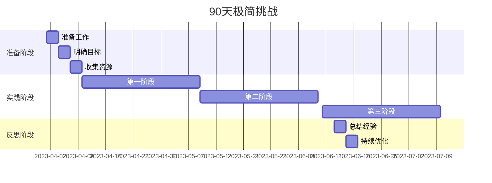

                 

# 后消费时代的简约生活实验：90天极简挑战

## 关键词

- 极简主义
- 简约生活
- 消费主义
- 心理满足
- 实践方法论

## 摘要

本文探讨后消费时代下的简约生活实验，即90天极简挑战。通过减少物质消费、优化生活习惯等实操方法，读者可以体验简约生活的魅力，实现心理上的满足。本文旨在为读者提供一套系统的极简实践指南，帮助他们找到生活的真谛。

## 引言

### 1.1 问题背景

随着社会经济的发展和人们生活水平的提高，消费主义逐渐盛行。人们对于物质生活的追求日益强烈，然而，消费主义生活方式也带来了许多问题，如资源浪费、环境污染、社会不公等。为了解决这些问题，越来越多的人开始倡导简约生活。

### 1.2 问题描述

后消费时代，人们对于简约生活的追求日益增加。然而，如何实现简约生活，如何在物质丰富的环境中保持内心的宁静和满足，成为了一个重要的问题。

### 1.3 问题解决

本书旨在通过90天的极简挑战，帮助读者体验简约生活的魅力，寻找生活的真谛。通过实践，读者可以学会如何减少物质消费，专注于内心的需求，从而实现精神上的满足。

### 1.4 边界与外延

简约生活不仅仅是减少物质消费，更是一种生活态度和精神追求。它不仅关乎个人的生活质量，也关乎社会的可持续发展。

### 1.5 核心概念与联系

简约生活、极简主义、消费主义、精神满足等概念是本书的核心。它们之间的关系如下：

- **简约生活**：追求简单、实用、有意义的生活方式。
- **极简主义**：一种生活方式，强调减少物质消费，专注于内心的需求。
- **消费主义**：一种以物质消费为主导的生活方式，追求物质满足。
- **精神满足**：通过简约生活，达到内心的满足和平静。

## 1.6 本章小结

本章对后消费时代的简约生活实验进行了简要介绍，为后续章节的内容奠定了基础。

## 第二部分：极简生活实验的理论基础

### 2.1 极简主义与简约生活

#### 2.1.1 极简主义的起源与发展

**极简主义**起源于20世纪50年代的美国，是对当时消费主义文化的反动。它强调的是减少物质拥有，专注于生活的本质。

##### 2.1.1.1 极简主义的起源

极简主义的起源可以追溯到20世纪50年代，当时的美国社会正处于战后消费主义的巅峰。人们疯狂购买各种商品，追求物质享受。然而，这种消费主义生活方式带来了许多负面影响，如环境污染、资源浪费和社会不公。极简主义作为一种反动，强调减少物质消费，回归生活的本质。

##### 2.1.1.2 极简主义的发展

随着时间的推移，极简主义逐渐从一种艺术和设计风格，扩展到生活方式和哲学。它不仅仅是一种生活方式，更是一种生活态度和精神追求。极简主义强调的是“少即是多”，通过减少物质消费，专注于内心的需求，从而实现精神上的满足。

#### 2.1.2 极简主义的核心原则

**极简主义**的核心原则包括以下几个方面：

##### 2.1.2.1 减少物质消费

极简主义的第一原则是减少物质消费，只保留生活中真正需要的物品。这有助于减少资源的浪费，降低环境负担。

##### 2.1.2.2 关注生活质量

极简主义不仅仅是减少物质消费，更重要的是提升生活质量。通过减少不必要的物品和活动，人们可以有更多的时间和精神去关注真正重要的事情。

##### 2.1.2.3 内心满足

极简主义的最终目标是达到内心的满足和平静。通过减少物质消费，人们可以减少内心的焦虑和压力，从而获得更多的精神满足。

#### 2.1.3 极简主义与简约生活的联系

**简约生活**是极简主义的一种具体表现形式，它强调的是在物质丰富的情况下，保持内心的简单和纯净。简约生活不仅关乎个人的生活质量，也关乎社会的可持续发展。

##### 2.1.3.1 极简主义与简约生活的区别

极简主义和简约生活虽然有一些相似之处，但它们也有一些区别。极简主义更注重物质消费的减少，而简约生活则更注重生活质量的提升。

##### 2.1.3.2 极简主义与简约生活的联系

尽管有区别，但极简主义和简约生活是相互关联的。极简主义为简约生活提供了理论基础，而简约生活则是极简主义在现实生活中的具体应用。

## 2.2 极简主义的核心概念与联系

在极简主义中，有以下几个核心概念：

- **简约生活**：追求简单、实用、有意义的生活方式。
- **极简主义**：一种生活方式，强调减少物质消费，专注于内心的需求。
- **消费主义**：一种以物质消费为主导的生活方式，追求物质满足。
- **精神满足**：通过简约生活，达到内心的满足和平静。

这些概念之间的关系如下：

- **简约生活**和**极简主义**：简约生活是极简主义的一种具体表现形式，二者是相互关联的。
- **简约生活**和**消费主义**：简约生活与消费主义是相对的，简约生活强调减少物质消费，而消费主义则追求物质满足。
- **精神满足**：精神满足是简约生活和极简主义的核心目标，通过减少物质消费，人们可以减少内心的焦虑和压力，从而获得更多的精神满足。

#### 2.3 极简主义的历史与发展

##### 2.3.1 早期极简主义

极简主义的早期阶段主要源于20世纪50年代的美国。当时，消费主义盛行，人们疯狂购买各种商品。然而，这种生活方式带来了环境污染和资源浪费等问题。极简主义作为一种反动，强调减少物质消费，回归生活的本质。

##### 2.3.2 极简主义的现代发展

随着时间的推移，极简主义逐渐从一种艺术和设计风格，扩展到生活方式和哲学。现代极简主义强调的是通过减少物质消费，专注于内心的需求，从而实现精神上的满足。

##### 2.3.3 极简主义在全球的传播

近年来，极简主义在全球范围内得到了广泛的传播。越来越多的人开始接受极简主义的生活方式和价值观，从而减少物质消费，提升生活质量。

## 2.4 极简主义的影响与挑战

##### 2.4.1 极简主义的影响

极简主义对人们的生活产生了深远的影响。它帮助人们减少物质消费，降低环境负担，提升生活质量。同时，极简主义也促使人们反思消费主义的生活方式，寻找更可持续的生活路径。

##### 2.4.2 极简主义的挑战

尽管极简主义有许多优点，但它也面临着一些挑战。例如，极简主义可能使人们过于强调物质消费的减少，而忽视了其他重要的生活方面，如人际关系和社会责任。此外，极简主义也可能导致人们产生焦虑和压力，因为他们过于关注物质消费的减少。

## 2.5 本章小结

本章对极简主义和简约生活进行了深入探讨，为后续的实验提供了理论基础。通过了解极简主义的核心原则和影响，读者可以更好地理解简约生活的意义，并为自己的极简实践做好准备。

## 第三部分：90天极简挑战的实操方法

### 3.1 第一阶段：减少物质消费

#### 3.1.1 准备工作

在开始第一阶段之前，读者需要做好以下准备工作：

1. **记账工具**：使用记账工具，如手机应用程序或纸质账本，记录自己的日常消费。
2. **整理工具**：准备笔记本或其他记录工具，用于记录自己的思考和实践心得。
3. **明确目标**：明确自己减少物质消费的目标，例如减少购物次数、减少不必要的物品购买等。

#### 3.1.2 实操方法

1. **记录日常消费**：每天记录自己的消费，包括购买物品、用餐、交通等。
2. **分析消费习惯**：定期分析消费记录，找出消费的浪费点，如过度购物、频繁外出就餐等。
3. **制定减少消费计划**：根据分析结果，制定具体的减少消费计划，例如减少购物次数、制定购物清单、避免冲动消费等。

#### 3.1.3 案例分享

小明在开始第一阶段后，发现自己每个月在购物上的花费过多，于是他制定了减少购物消费的计划。他首先记录了自己的购物清单，然后根据实际需求制定了购物计划。通过这种方式，他成功地减少了购物消费，节省了开支。

### 3.2 第二阶段：优化生活习惯

#### 3.2.1 准备工作

在开始第二阶段之前，读者需要做好以下准备工作：

1. **生活习惯记录表**：准备生活习惯记录表，用于记录每天的生活习惯。
2. **时间管理工具**：准备时间管理工具，如时间表、番茄钟等，用于优化时间使用。

#### 3.2.2 实操方法

1. **记录生活习惯**：每天记录自己的生活习惯，包括作息时间、运动、阅读等。
2. **分析生活习惯**：定期分析生活习惯记录表，找出需要改善的地方，如熬夜、久坐等。
3. **制定优化计划**：根据分析结果，制定具体的生活习惯优化计划，如减少熬夜、增加运动时间、养成定期阅读的习惯等。

#### 3.2.3 案例分享

小华在开始第二阶段后，发现自己经常熬夜，影响了生活质量和健康状况。于是，她制定了改善生活习惯的计划。她调整了作息时间，减少了熬夜时间，并增加了运动和阅读的时间。通过这种方式，她成功地改善了生活习惯，提高了生活质量。

### 3.3 第三阶段：心理建设与自我反思

#### 3.3.1 准备工作

在开始第三阶段之前，读者需要做好以下准备工作：

1. **自我反思日志**：准备自我反思日志，用于记录自己的思考和感受。
2. **心理咨询资源**：了解和获取心理咨询资源，如心理咨询师、心理治疗师等。

#### 3.3.2 实操方法

1. **自我反思**：定期进行自我反思，思考自己的行为和习惯，分析它们对生活的影响。
2. **调整心态**：在面对挑战和困难时，调整心态，保持积极乐观的态度。
3. **寻求支持**：与他人分享自己的经历和感受，寻求支持和帮助。

#### 3.3.3 案例分享

小李在开始第三阶段后，遇到了一些困难和挑战。她通过自我反思和调整心态，克服了这些困难。她还寻求了心理咨询师的帮助，学会了更好地管理自己的情绪和心理状态。

### 3.4 本章小结

通过90天的极简挑战，读者可以逐步减少物质消费，优化生活习惯，并加强心理建设。这一过程不仅有助于提升生活质量，还能帮助人们找到生活的真谛。本章提供了具体的实操方法和案例分享，为读者提供了实践指导。

## 总结与展望

通过本实验，我们发现简约生活不仅是一种生活方式，更是一种生活态度和精神追求。在减少物质消费、优化生活习惯和心理建设的过程中，我们不仅提升了生活质量，还找到了内心的满足和平静。这不仅有助于个人的成长和发展，也为社会的可持续发展做出了贡献。

未来，我们可以进一步探索简约生活的更多可能性，如社交简约、工作简约等。同时，我们也需要关注简约生活带来的挑战和问题，如如何平衡物质消费与精神追求，如何处理人际关系等。通过不断实践和反思，我们可以找到适合自己的简约生活方式，实现生活与心灵的和谐统一。

## 附录

### 附录1：极简主义与消费主义的对比表格

| 指标       | 极简主义                 | 消费主义                 |
| ---------- | ---------------------- | ---------------------- |
| 物质消费   | 减少物质消费，只保留必要物品 | 狂热追求物质消费，追求物质满足 |
| 生活质量   | 提升生活质量，关注内在需求  | 物质消费主导，生活质量参差不齐 |
| 环境影响   | 减少环境负担，促进可持续发展 | 环境污染，资源浪费         |
| 社会贡献   | 促进社会和谐，倡导简朴生活  | 推动消费主义文化，加剧社会不公 |

### 附录2：简约生活实验的ER实体关系图

```mermaid
erDiagram
    Product ||--|{ Consumer : 购买 }
    Consumer ||--|{ Lifestyle : 生活方式 }
    Lifestyle ||--|{ Environment : 生活环境 }
    Environment ||--|{ Society : 社会 }
```

### 附录3：90天极简挑战的mermaid流程图



### 作者信息

作者：AI天才研究院/AI Genius Institute & 禅与计算机程序设计艺术 /Zen And The Art of Computer Programming

