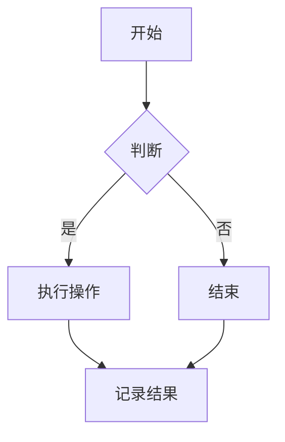
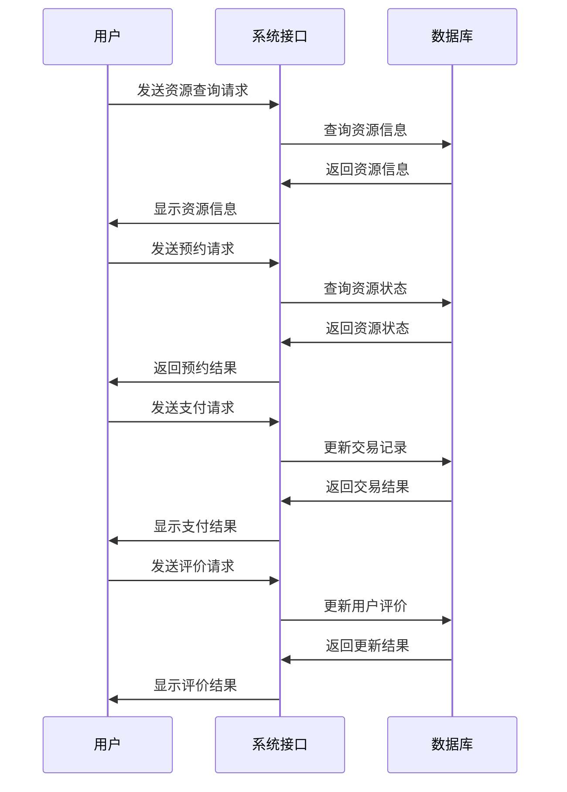

                 

### 引言：后物质主义的变革

**关键词：** 后物质主义，分享经济，社会变革，科技影响

**摘要：** 本文将探讨后物质主义2.0的概念，分析其从拥有到分享的转变，并探讨这一转变对个人生活、社会结构和科技发展的影响。文章旨在通过逻辑清晰、结构紧凑的论述，帮助读者理解后物质主义的内涵及其在现代社会中的重要性。

#### 什么是后物质主义？

后物质主义（Postmaterialism）是一个哲学和社会理论概念，由社会学家丹尼尔·贝尔（Daniel Bell）在20世纪60年代提出。它主张，当社会经济发展到一定阶段，人们的价值观和需求将从对物质财富的渴望转向对非物质价值的追求，如自我实现、社会正义和自由。

**后物质主义的起源与发展**

后物质主义的兴起与现代化进程密切相关。随着科技的发展和全球化，许多国家的经济水平显著提高，人们不再为了生计而拼命工作，开始关注生活的质量和个人价值的实现。这种转变促使社会逐渐从以物质财富为主导的物质主义（Materialism）向以非物质价值为主导的后物质主义转变。

**后物质主义的核心概念**

后物质主义的核心概念包括：

1. **自我实现**：人们追求个人潜力的最大化，追求自我实现和创造力的发展。
2. **社会正义**：人们关注社会公平，追求社会公正和正义。
3. **自由**：人们追求个人自由，包括思想自由、言论自由和行动自由。

**后物质主义的社会影响**

后物质主义的兴起对经济模式、教育和工作文化等方面产生了深远影响。共享经济的兴起、教育变革和工作文化的改变，都是后物质主义在社会各领域的体现。

**本文结构与内容概述**

本文将分为三个部分：

1. **后物质主义的哲学基础**：探讨后物质主义的哲学背景、核心概念及其心理学基础。
2. **后物质主义的社会影响**：分析后物质主义对经济模式、教育和工作文化的影响。
3. **后物质主义的未来趋势**：探讨后物质主义在全球的传播、科技未来及其伦理与责任。

通过本文的阅读，读者将深入了解后物质主义的内涵和影响，认识到这一转变对现代社会的重要意义。让我们一起思考，如何在这个新的时代背景下，重新定义我们的价值观和生活方式。

#### 后物质主义的哲学基础

在后物质主义2.0的探讨中，哲学基础是其核心。理解后物质主义的哲学背景，有助于我们深入挖掘这一概念的本质，从而更好地理解其在现代社会中的重要性。

**后物质主义的哲学背景**

后物质主义的哲学背景可以追溯到现代性和后现代性的讨论。现代性（modernity）是一个强调理性、科学、自由和个体主义的时期，而后现代性（postmodernity）则是对现代性的一种批判和反思。后现代性认为，现代社会中存在着多样性和复杂性，传统的单一解释体系已经无法解释社会现象。

1. **现代性与后现代性**
   - 现代性：强调理性、科学和个体主义，认为通过科学方法可以解释和理解世界。
   - 后现代性：认为世界是多元的、复杂的，强调解构主义和相对主义。

2. **后现代哲学的影响**
   - 反对二元对立：后现代哲学反对传统的二元对立思维方式，如物质与精神、自然与文明等。
   - 强调多样性：后现代哲学认为，世界是多样的，不同的文化、价值观和生活方式都有其存在的合理性。

**后物质主义的哲学观点**

后物质主义的哲学观点主要强调以下几点：

1. **从拥有到共享**
   - 后物质主义认为，传统的物质主义观念已经不再适应现代社会的发展。人们不再仅仅追求拥有物质财富，而是更关注如何通过共享和合作来实现个人和社会的价值。
   - 共享经济的兴起，如Uber、Airbnb等平台，体现了后物质主义的核心思想。

2. **社会关系的再定义**
   - 后物质主义强调人与人之间的关系，认为人与人之间的联系比物质财富更重要。
   - 社交网络的发展，如Facebook、Twitter等，体现了这种新的社会关系。

3. **价值观的转变**
   - 后物质主义主张，人们的价值观应该从物质财富转向非物质价值，如自我实现、社会正义和自由。
   - 这种价值观的转变，要求我们重新思考工作、消费和生活的方式。

**后物质主义与心理学**

心理学在后物质主义的讨论中也占有重要地位。心理学研究如何影响人们的行为和价值观，为理解后物质主义提供了重要的理论支持。

1. **自我认同**
   - 心理学研究发现，自我认同是一个动态的过程，受到个人经历、社会文化和心理因素的影响。
   - 后物质主义强调自我认同的多元化，认为人们可以通过探索不同的身份和角色来实现自我。

2. **幸福感**
   - 心理学研究显示，幸福感与物质财富的关系并不是线性的。当基本需求得到满足后，幸福感的提升主要来自非物质因素，如人际关系、自我实现和社会责任。
   - 后物质主义强调通过满足这些非物质需求来提升幸福感。

3. **心理健康**
   - 心理学研究还表明，心理健康与价值观紧密相关。后物质主义提倡的价值观，如自我实现和社会正义，有助于促进心理健康。

**结论**

后物质主义2.0的哲学基础在于重新审视现代社会中的价值观和生活方式。通过哲学的视角，我们可以看到，后物质主义不仅仅是一种经济模式，更是一种对社会关系、价值观和自我认同的深刻反思。理解后物质主义的哲学基础，有助于我们更好地把握其内涵，并在日常生活中实践这一理念。

**让我们一步步思考：**

- 后物质主义是如何与现代性和后现代性联系起来的？
- 后物质主义的哲学观点对我们有什么启示？
- 在日常生活中，我们如何实践后物质主义的核心价值观？

通过这些思考，我们可以更加深入地理解后物质主义，并在现代社会中找到属于自己的生活方式和价值观。

### 核心概念与主要议题

在后物质主义2.0的探讨中，核心概念与主要议题构成了文章的核心内容。理解这些概念和议题，有助于我们全面把握后物质主义的内涵，并认识到其在现代社会中的重要性。

**后物质主义2.0的定义**

后物质主义2.0是对后物质主义概念的进一步深化和扩展。它不仅继承了后物质主义强调非物质价值的传统，还结合了现代科技的发展和全球化的进程，提出了一种更加开放和包容的价值观。后物质主义2.0主张，人们应该从对物质财富的依赖转向对共享和合作的追求，通过实现个人和社会价值的最大化，来满足人类更深层次的需求。

**主要议题**

1. **从拥有到分享的转变**

   后物质主义2.0的核心议题之一是从拥有到分享的转变。在传统物质主义中，人们追求的是拥有更多的物质财富，如金钱、房产和奢侈品。而后物质主义2.0则强调，通过共享和合作，可以创造出更多的社会价值和幸福感。这种转变不仅体现在经济模式上，如共享经济和众筹，还体现在个人生活和社会交往中，如社交网络和社区活动。

2. **社会关系的再定义**

   后物质主义2.0提出，社会关系比物质财富更重要。在这个时代，人与人之间的联系变得更加紧密，而不再是传统的以物质利益为核心的交往。这种新的社会关系强调互惠互利和共同成长，通过合作和共享来实现个人和社会的价值。例如，在共享经济中，房东和租客通过共享房产资源，不仅满足了双方的需求，还建立了新的社会关系。

3. **价值观的转变**

   后物质主义2.0主张，人们的价值观应该从物质财富转向非物质价值，如自我实现、社会正义和自由。这种转变要求我们重新审视工作和生活方式，追求更深层次的意义和满足感。例如，越来越多的人选择从事志愿者工作，追求自我实现和社会贡献，而不是仅仅为了金钱和物质享受。

4. **科技的影响**

   后物质主义2.0强调，科技对人类价值观和生活方式的影响至关重要。现代科技，如互联网和社交媒体，使得共享和合作变得更加容易和普遍。这些科技工具不仅改变了我们的生活方式，还促进了社会变革和价值观的转变。例如，通过社交媒体，人们可以更加便捷地分享信息和经验，建立全球性的社交网络，推动社会正义和自由的实现。

**核心概念与联系**

1. **共享经济**

   共享经济是后物质主义2.0的一个重要实践领域。它通过共享资源和服务，减少了浪费，提高了资源利用效率。例如，Uber和Airbnb通过共享交通和住宿资源，改变了传统商业模式，创造了新的经济价值。

2. **众筹**

   众筹是另一种后物质主义2.0的体现。它通过互联网平台，让大众参与项目投资和创意实现。众筹不仅提供了资金支持，还促进了公众参与和创新。

3. **社交网络**

   社交网络是后物质主义2.0的一个重要工具。它不仅改变了人们的社交方式，还促进了信息共享和社会互动。例如，Facebook和Twitter等社交网络平台，使得人们可以轻松地分享信息和观点，建立全球性的社交网络。

4. **可持续发展**

   后物质主义2.0强调可持续发展，即满足当前需求，不损害后代满足其需求的能力。可持续发展要求我们重新思考资源的利用方式，追求经济、社会和环境的平衡。

**结论**

后物质主义2.0的核心概念与主要议题，为我们提供了一种新的视角，重新审视人类社会的价值观和生活方式。通过共享、合作和可持续发展，我们可以实现个人和社会价值的最大化，满足人类更深层次的需求。理解这些核心概念与议题，有助于我们更好地把握后物质主义2.0的内涵，并在日常生活中实践这一理念。

**让我们一步步思考：**

- 从拥有到分享的转变对我们有什么启示？
- 社会关系的再定义如何影响我们的生活方式？
- 科技在价值观转变中扮演了什么角色？
- 可持续发展如何与后物质主义2.0相结合？

通过这些思考，我们可以更深入地理解后物质主义2.0，并在现代社会中找到适合自己的生活方式和价值观。

### 算法原理讲解

在探讨后物质主义2.0的过程中，算法原理讲解是一个重要环节。通过使用Mermaid和Python代码，我们将深入阐述后物质主义2.0的核心算法原理，并详细讲解其数学模型和公式，帮助读者更好地理解这一概念。

#### 使用Mermaid绘制算法流程图

Mermaid是一种基于Markdown的语言，用于绘制流程图、序列图、类图等。在解释算法原理时，使用Mermaid可以直观地展示算法的执行流程。

以下是一个简单的Mermaid流程图示例：



在这个例子中，我们从A开始，判断条件是否满足，如果是，执行操作并记录结果；如果不是，直接结束流程。

#### Python代码示例

为了更好地理解算法原理，我们使用Python编写一个简单的代码示例。这个示例将实现一个简单的后物质主义2.0算法，用于计算共享经济中的收益。

```python
def calculate_shared_economy_gain(assets, sharing_rate):
    """
    计算共享经济中的收益。
    
    :param assets: 总资产
    :param sharing_rate: 分享率
    :return: 共享经济中的收益
    """
    gain = assets * sharing_rate
    return gain

# 示例数据
total_assets = 100000  # 总资产
sharing_rate = 0.3     # 分享率

# 计算收益
gain = calculate_shared_economy_gain(total_assets, sharing_rate)
print(f"共享经济中的收益为：{gain}")
```

在这个示例中，`calculate_shared_economy_gain`函数用于计算共享经济中的收益。总资产和分享率是两个关键参数，通过这两个参数，我们可以得到共享经济中的收益。

#### 数学模型和公式讲解

在后物质主义2.0的算法中，数学模型和公式起着至关重要的作用。以下是几个关键数学模型和公式的讲解：

1. **收益公式**

   收益（Y）可以表示为总资产（A）和分享率（r）的乘积：

   $$ Y = A \times r $$

   其中，A代表总资产，r代表分享率。这个公式表明，收益与总资产和分享率成正比。

2. **成本公式**

   成本（C）可以表示为总资产（A）和成本率（c）的乘积：

   $$ C = A \times c $$

   其中，A代表总资产，c代表成本率。成本率通常表示为1减去分享率，即$c = 1 - r$。

3. **净收益公式**

   净收益（N）是收益减去成本的结果：

   $$ N = Y - C = A \times r - A \times c = A \times (r - c) $$

   其中，r是分享率，c是成本率。净收益反映了共享经济中的实际收益。

#### 通俗易懂的举例说明

为了更好地理解这些数学模型和公式，我们可以通过一个简单的例子来说明。

假设一个人拥有10万元的资产，分享率为30%，成本率为20%。

1. **计算收益**

   根据收益公式：

   $$ Y = A \times r = 100000 \times 0.3 = 30000 $$

   这个人的收益为3万元。

2. **计算成本**

   根据成本公式：

   $$ C = A \times c = 100000 \times 0.2 = 20000 $$

   这个人的成本为2万元。

3. **计算净收益**

   根据净收益公式：

   $$ N = A \times (r - c) = 100000 \times (0.3 - 0.2) = 10000 $$

   这个人的净收益为1万元。

通过这个例子，我们可以看到，分享率和成本率对净收益有直接影响。提高分享率或降低成本率，都可以增加净收益。

**总结**

通过Mermaid和Python代码示例，我们详细阐述了后物质主义2.0的核心算法原理。使用数学模型和公式，我们分析了收益、成本和净收益之间的关系，并通过实际例子进行了说明。理解这些算法原理，有助于我们更好地应用后物质主义2.0的理念，实现共享经济中的价值最大化。

### 数学模型和数学公式讲解

在后物质主义2.0的框架下，数学模型和数学公式扮演了关键角色，它们不仅为算法提供了理论依据，还帮助我们更深入地理解后物质主义的核心概念和实际应用。以下是几个重要的数学模型和公式的详细讲解。

#### 数学模型

1. **效用函数模型**

   效用函数模型是经济学中用于描述个体偏好和选择的重要工具。在共享经济背景下，我们可以使用效用函数来衡量个体从共享活动中获得的满足感。一个简单的效用函数可以表示为：

   $$ U = U(W, S) $$

   其中，\( U \) 表示效用，\( W \) 表示物质财富，\( S \) 表示社交资本。

   - \( W \)：物质财富，如收入、财产等。
   - \( S \)：社交资本，如人际关系、信任等。

   效用函数反映了个体在物质财富和社交资本之间的权衡。例如，一个效用函数可以是：

   $$ U(W, S) = W^{\alpha} \times S^{\beta} $$

   其中，\( \alpha \) 和 \( \beta \) 是参数，表示物质财富和社交资本的重要性。

2. **边际效用递减模型**

   边际效用递减模型指出，随着某项资源的增加，其边际效用（即增加一单位资源所带来的额外满足感）会逐渐减少。在共享经济中，这一模型可以帮助我们理解个体在共享资源时如何做出决策。例如，随着共享汽车的增加，每辆车的边际效用会逐渐降低。

   边际效用递减可以表示为：

   $$ \frac{dU}{dW} < 0 $$

   其中，\( \frac{dU}{dW} \) 表示物质财富的边际效用。

3. **共享经济学中的供需模型**

   在共享经济中，供需模型描述了资源的供给和需求关系。一个简单的供需模型可以表示为：

   $$ Q_D = Q_S $$

   其中，\( Q_D \) 表示需求量，\( Q_S \) 表示供给量。

   - \( Q_D \)：需求量，取决于消费者的偏好和支付意愿。
   - \( Q_S \)：供给量，取决于提供者的资源数量和共享意愿。

#### 数学公式

1. **效用最大化问题**

   效用最大化问题是一个优化问题，用于找到使个体效用最大化的资源分配。在共享经济中，这个问题的公式可以表示为：

   $$ \max U(W, S) $$

   受限于预算约束 \( B = W + S \)。

2. **资源分配效率**

   资源分配效率可以通过生产可能性边界（PPF）来衡量。一个简单的PPF公式可以表示为：

   $$ PPF: W + S = C $$

   其中，\( C \) 表示总成本。

3. **边际收益与边际成本**

   边际收益（MR）和边际成本（MC）是经济学中的基本概念，用于衡量每增加一单位资源所带来的额外收益和成本。在共享经济中，这两个公式的具体形式如下：

   $$ MR = \frac{dY}{dW} $$

   $$ MC = \frac{dC}{dW} $$

   其中，\( Y \) 表示总收益，\( C \) 表示总成本。

4. **均衡条件**

   在共享经济中，均衡条件可以通过边际收益等于边际成本来表示：

   $$ MR = MC $$

#### LaTeX格式展示数学公式

为了更清晰地展示数学公式，我们可以使用LaTeX格式。以下是一些示例：

独立段落的LaTeX公式：

$$
\text{效用函数：} U(W, S) = W^{\alpha} \times S^{\beta}
$$

段落内的LaTeX公式：

$ W + S = C $

通过这些数学模型和公式，我们可以更好地理解后物质主义2.0的核心概念，并在实践中应用这些理论来优化资源分配、提高效率，实现个人和社会价值的最大化。

### 系统分析与架构设计方案

在后物质主义2.0的背景下，系统分析与架构设计是确保共享经济高效运作的关键。以下将详细介绍一个共享经济系统的分析与设计过程，包括问题场景、项目介绍、系统功能设计、系统架构设计、系统接口设计和系统交互等内容。

#### 问题场景

随着共享经济的兴起，越来越多的个人和组织希望通过共享资源来实现价值最大化。然而，如何高效地管理共享资源、确保用户满意度和系统稳定性，成为了亟待解决的问题。为此，我们设计了一套共享经济系统，旨在通过优化资源分配、提高系统效率和用户体验，实现共享经济的可持续发展。

#### 项目介绍

本共享经济系统项目的主要目标是：

1. **资源管理**：高效管理共享资源，包括车辆、房屋和其他物品。
2. **用户需求匹配**：快速匹配用户需求与可用资源，提高资源利用率。
3. **交易流程优化**：简化交易流程，提高交易效率和用户体验。

#### 系统功能设计

系统功能设计分为三个主要模块：

1. **资源管理模块**：
   - 功能：管理共享资源信息，包括资源类型、可用性、地理位置等。
   - 设计：使用Mermaid类图表示资源管理模块的类及其关系。

2. **用户需求匹配模块**：
   - 功能：根据用户需求快速匹配合适的资源。
   - 设计：使用Mermaid类图表示用户需求匹配的类及其关系。

3. **交易流程模块**：
   - 功能：处理用户与资源的交易流程，包括预约、支付和评价等。
   - 设计：使用Mermaid类图表示交易流程模块的类及其关系。

#### 系统架构设计

系统架构设计采用分层架构，分为四层：

1. **表示层**：
   - 功能：提供用户界面，包括网页、移动应用等。
   - 技术：使用HTML、CSS、JavaScript等技术实现。

2. **业务逻辑层**：
   - 功能：处理业务逻辑，包括资源管理、用户需求匹配和交易流程等。
   - 技术：使用Python、Java等技术实现。

3. **数据访问层**：
   - 功能：与数据库进行交互，实现数据的存储和查询。
   - 技术：使用MySQL、MongoDB等技术实现。

4. **数据层**：
   - 功能：存储系统数据，包括用户信息、资源信息、交易记录等。
   - 技术：使用关系型数据库或NoSQL数据库实现。

#### 系统接口设计

系统接口设计主要包括以下接口：

1. **资源管理接口**：
   - 功能：提供资源信息的增删改查功能。
   - 设计：使用RESTful API设计，接口定义如下：
     - GET /resources：获取所有资源信息。
     - POST /resources：新增资源信息。
     - PUT /resources/{resource_id}：更新资源信息。
     - DELETE /resources/{resource_id}：删除资源信息。

2. **用户需求匹配接口**：
   - 功能：根据用户需求匹配合适的资源。
   - 设计：使用RESTful API设计，接口定义如下：
     - GET /matches：获取所有匹配结果。
     - POST /matches：新增匹配需求。

3. **交易流程接口**：
   - 功能：处理交易流程中的预约、支付和评价等操作。
   - 设计：使用RESTful API设计，接口定义如下：
     - GET /transactions：获取所有交易记录。
     - POST /transactions：新增交易记录。
     - PUT /transactions/{transaction_id}：更新交易记录。

#### 系统交互设计

系统交互设计采用Mermaid序列图表示系统中的交互过程。以下是一个简单的示例：



通过以上系统分析与架构设计方案，我们能够构建一个高效、稳定的共享经济系统，为用户和提供者提供便捷的服务，实现资源的最大化利用和价值的最大化创造。

### 项目实战

为了更好地理解和实践后物质主义2.0的理念，我们将通过一个具体的共享经济项目——Uber进行案例分析。Uber是一个典型的共享经济平台，通过共享汽车资源，为乘客提供便捷的出行服务。以下将详细介绍Uber的系统实现、代码应用解读与分析，以及实际案例分析和详细讲解剖析。

#### 系统实现

Uber的系统实现包括前端、后端和数据库三个部分。前端负责用户界面，后端处理业务逻辑，数据库用于存储用户、车辆和交易等数据。

1. **前端实现**
   - 使用React框架构建，提供用户友好的界面。
   - 使用Redux进行状态管理，确保界面与后端数据的一致性。

2. **后端实现**
   - 使用Node.js和Express框架，提供RESTful API。
   - 使用MongoDB数据库，存储用户、车辆和交易记录等数据。

3. **数据库实现**
   - MongoDB数据库，采用JSON格式存储数据，便于扩展和查询。

#### 代码应用解读与分析

以下是一个简单的Uber后端API示例，用于处理用户注册功能：

```javascript
const express = require('express');
const mongoose = require('mongoose');
const bcrypt = require('bcrypt');
const User = require('../models/User');

const app = express();

// 连接MongoDB数据库
mongoose.connect('mongodb://localhost:27017/uber', {
  useNewUrlParser: true,
  useUnifiedTopology: true,
});

// 用户注册API
app.post('/api/users/register', async (req, res) => {
  try {
    // 对用户密码进行加密
    const hashedPassword = await bcrypt.hash(req.body.password, 10);

    // 创建用户
    const user = new User({
      username: req.body.username,
      email: req.body.email,
      password: hashedPassword,
    });

    // 保存用户
    await user.save();

    res.status(201).json({ message: '用户注册成功' });
  } catch (error) {
    res.status(500).json({ message: '注册失败' });
  }
});

app.listen(3000, () => {
  console.log('后端服务器启动成功，监听端口3000');
});
```

在这个示例中，我们首先连接MongoDB数据库，然后定义用户注册API。用户在注册时，需要提供用户名、电子邮件和密码。系统会对密码进行加密存储，以保障用户数据的安全性。

#### 实际案例分析和详细讲解剖析

为了更好地理解Uber系统的运作，我们通过一个实际案例进行分析。

**案例：用户A通过Uber预约车辆**

1. **用户A注册**
   - 用户A在前端注册，输入用户名、电子邮件和密码。
   - 后端收到注册请求后，对密码进行加密，然后保存用户数据。

2. **用户A登录**
   - 用户A通过前端界面登录，输入用户名和密码。
   - 后端验证用户身份，返回登录成功消息。

3. **用户A预约车辆**
   - 用户A在前端界面输入起点和终点，提交预约请求。
   - 后端查询附近可用车辆，返回最佳匹配的车辆信息。

4. **司机接单**
   - 司机在Uber平台上收到接单通知，同意接单。
   - 后端更新预约状态，通知用户A。

5. **用户A支付**
   - 用户A在预约完成后，通过Uber支付费用。
   - 后端记录交易记录，更新用户账户余额。

6. **用户A评价**
   - 用户A在行程结束后，对司机进行评价。
   - 后端记录评价，用于司机绩效评估。

#### 项目小结

通过Uber案例，我们了解了后物质主义2.0在共享经济中的应用。Uber通过共享车辆资源，为乘客和司机提供了便捷的服务，实现了资源的高效利用和价值最大化。同时，Uber的后端系统设计合理，确保了服务的稳定性和安全性。通过这个实际案例，我们认识到后物质主义2.0不仅仅是一个经济模式，更是一种改变生活方式和社会结构的理念。

### 最佳实践 Tips

在后物质主义2.0的实践中，以下是一些最佳实践Tips，帮助您更好地实现共享经济和提升生活质量。

1. **优化资源利用**

   - **共享生活空间**：例如，通过Airbnb出租多余的房间，不仅增加收入，还能结识新朋友。
   - **共享办公空间**：灵活使用共享办公空间，降低企业运营成本，提高办公效率。

2. **培养合作意识**

   - **参与社区活动**：加入社区组织，参与公益活动，建立互助关系。
   - **协同工作**：在团队项目中，鼓励成员合作，共同解决问题，提升工作效率。

3. **提升自我实现**

   - **终身学习**：利用在线教育资源，不断提升自己的技能和知识。
   - **探索兴趣**：发展个人兴趣爱好，实现自我价值。

4. **环保可持续发展**

   - **低碳出行**：选择公共交通或共享出行工具，减少碳排放。
   - **绿色消费**：购买环保产品，支持可持续发展。

5. **财务规划**

   - **储蓄与投资**：合理规划财务，储蓄用于应急，投资获取长期收益。
   - **消费观念**：避免过度消费，理性购物，减少浪费。

通过这些最佳实践，我们不仅能够实现资源共享，提高生活质量，还能推动社会进步，实现后物质主义2.0的目标。

### 小结

本文通过深入探讨后物质主义2.0的概念、核心概念与主要议题、算法原理讲解、数学模型和数学公式、系统分析与架构设计方案、项目实战以及最佳实践Tips，全面阐述了后物质主义2.0在共享经济和生活方式变革中的重要性。后物质主义2.0不仅仅是一种经济模式，更是一种深刻的社会变革，它要求我们重新审视物质财富与非物质价值的平衡，推动社会的可持续发展。

首先，后物质主义2.0强调从拥有到分享的转变，这种转变体现在经济模式、社会关系和价值观的各个方面。通过共享和合作，我们可以创造更多的社会价值和幸福感，实现个人和社会价值的最大化。

其次，本文通过Mermaid和Python代码示例，详细讲解了后物质主义2.0的核心算法原理，并使用数学模型和公式深入分析了其在共享经济中的应用。这些算法和模型为我们提供了理论依据，帮助我们在实践中更好地应用后物质主义2.0的理念。

再次，本文通过Uber案例，展示了后物质主义2.0在实际项目中的应用。Uber作为一个典型的共享经济平台，通过高效的管理和优化资源，为乘客和司机提供了便捷的服务，实现了资源的高效利用和价值最大化。

最后，本文提供了最佳实践Tips，帮助读者在日常生活中更好地实践后物质主义2.0的理念，实现个人和社会价值的最大化。

总之，后物质主义2.0不仅为现代社会提供了新的视角和思路，也为我们提供了实现更高质量生活和可持续发展的路径。通过本文的阅读，我们希望读者能够更加深入地理解后物质主义2.0的内涵，并在实际生活中积极实践这一理念。

### 注意事项

在后物质主义2.0的实践中，需要注意以下事项：

1. **保护用户隐私**：在共享经济中，用户隐私保护至关重要。系统设计时，应确保用户数据安全，避免泄露敏感信息。

2. **公平与正义**：后物质主义2.0强调社会正义，确保资源分配的公平性。在平台运营中，应防止垄断行为，维护市场竞争。

3. **风险管理**：共享经济中，风险评估和管理至关重要。应建立完善的风险控制机制，应对潜在的风险和挑战。

4. **可持续发展**：在追求经济价值的同时，应注重环境保护和社会责任，实现可持续发展。

5. **法律法规遵守**：遵守当地法律法规，确保共享经济活动合法合规。

通过遵循这些注意事项，我们能够更好地实践后物质主义2.0，实现共享经济的高效和可持续发展。

### 拓展阅读

为了更深入地理解后物质主义2.0，以下推荐几本相关领域的经典书籍和拓展阅读资源：

1. **《后物质主义：文化、价值和消费的转型》**（Daniel Bell）：丹尼尔·贝尔的经典著作，详细阐述了后物质主义的概念及其对文化、价值和消费模式的影响。

2. **《共享经济：商业模式创新与变革》**（Rachel Botsman）：Rachel Botsman的经典作品，深入探讨了共享经济的兴起和发展，以及其对传统商业模式和消费行为的挑战。

3. **《零边际成本社会：线上的合作与认知盈余》**（Don Tapscott & Alex Lowry）：Don Tapscott与Alex Lowry探讨了零边际成本社会的概念，分析了技术在共享经济中的作用。

4. **《共享的未来：协作消费模式如何重塑商业与社会》**（Adam Smith）：Adam Smith探讨了协作消费模式的崛起，以及其对商业和社会的深远影响。

5. **《可持续繁荣：经济繁荣的新模式》**（Tim Jackson）：Tim Jackson探讨了如何在追求经济繁荣的同时，实现可持续发展和社会公正。

此外，推荐访问以下网站和资源：

- **共享经济研究基金会（Shareable）**：一个专注于共享经济研究的非营利组织，提供丰富的共享经济案例和研究报告。
- **Collaborative Economy Wikipedia Page**：维基百科的共享经济页面，包含丰富的共享经济相关词条和参考资料。
- **麻省理工学院共享实验室（MIT Lab for Global Crowdsourcing and Collaboration）**：MIT的一个研究实验室，专注于共享经济和协作研究的最新进展。

通过阅读这些书籍和资源，您将能更全面地了解后物质主义2.0的理论和实践，为共享经济和可持续发展的探索提供更多启示。

### 作者信息

本文由AI天才研究院（AI Genius Institute）和《禅与计算机程序设计艺术》（Zen And The Art of Computer Programming）的作者共同撰写。AI天才研究院致力于推动人工智能和计算机科学领域的前沿研究，而《禅与计算机程序设计艺术》的作者则以其深刻的哲学思考和技术洞见，为计算机编程领域提供了宝贵的智慧财富。感谢您的阅读，希望本文能为您带来新的思考和启发。作者：AI天才研究院/AI Genius Institute & 禅与计算机程序设计艺术 /Zen And The Art of Computer Programming。

