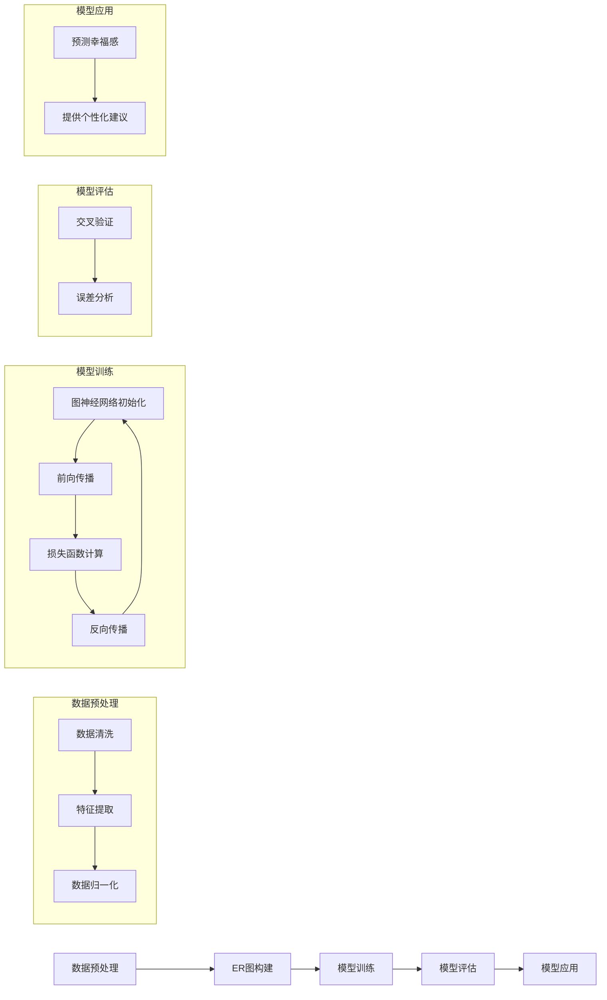
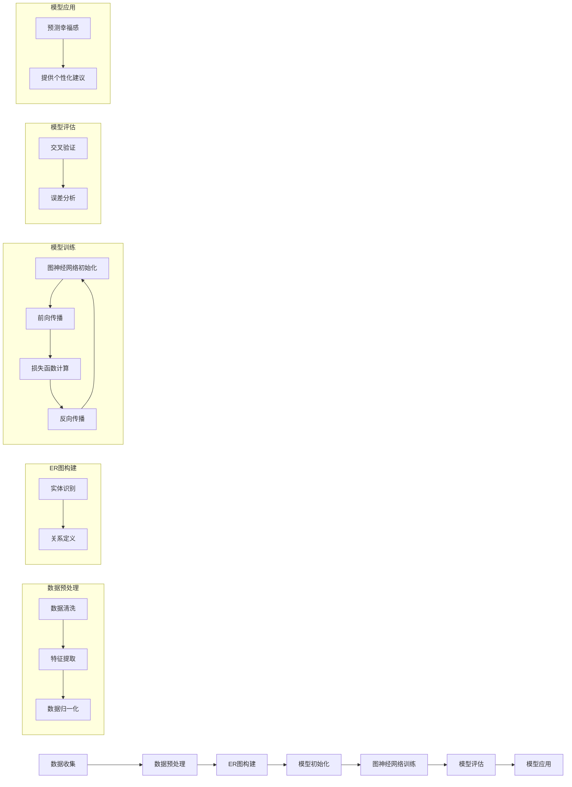
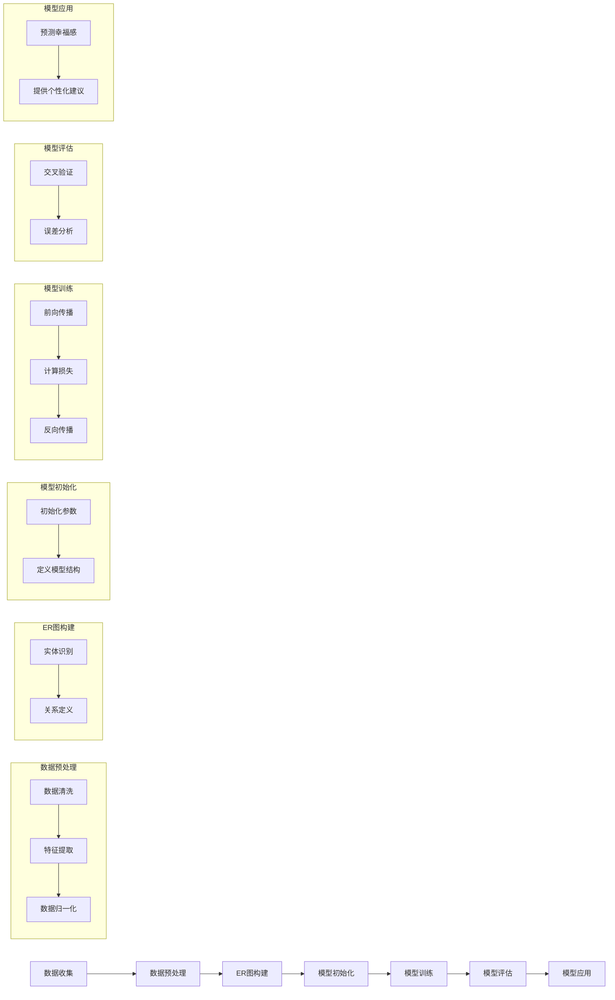

                 

### 1. 设计原则

在为《后物质主义生活指标：衡量幸福的新维度》设计目录大纲时，我们将遵循以下原则：

1. **逻辑清晰**：确保目录结构严谨，各章节内容连贯，便于读者理解。
2. **简洁明了**：避免冗余信息，确保内容简洁明了，便于读者快速把握章节核心内容。
3. **内容全面**：涵盖所有关键主题，确保读者能够全面了解后物质主义生活指标的相关知识。
4. **结构合理**：按照逻辑顺序组织内容，确保章节间的逻辑关系合理，便于读者逐步深入理解。

### 2. 目录结构

我们将目录分为四个主要部分：

- **第一部分：背景介绍**：介绍后物质主义的概念及其对幸福感的影响。
- **第二部分：核心概念与联系**：详细解释幸福感的测量指标，并展示其属性特征对比表格和ER实体关系图。
- **第三部分：方法与模型**：介绍测量幸福感的主要方法与模型，并绘制相应的算法流程图。
- **第四部分：应用与实践**：展示后物质主义生活指标在不同领域中的应用，提供实际案例分析和详细讲解。

### 3. 内容细化

在每个部分中，我们将细化以下内容：

- **背景介绍**：后物质主义的定义、起源及其对幸福感的影响。
- **核心概念与联系**：幸福感的测量指标及其属性特征对比表格和ER实体关系图。
- **方法与模型**：介绍测量幸福感的主要方法与模型，绘制算法流程图，阐述其原理。
- **应用与实践**：后物质主义生活指标在不同领域中的应用案例，包括实际案例分析和详细讲解。

### 4. 目录大纲示例

下面是一个初步的目录大纲示例：

```markdown
# 《后物质主义生活指标：衡量幸福的新维度》目录大纲

## 第一部分：背景介绍
### 1.1 后物质主义概述
### 1.2 后物质主义与幸福感
### 1.3 研究意义与目标

## 第二部分：核心概念与联系
### 2.1 幸福感的测量指标
#### 2.1.1 指标属性特征对比表格
#### 2.1.2 ER实体关系图

## 第三部分：方法与模型
### 3.1 测量幸福感的方法
### 3.2 主要模型介绍
#### 3.2.1 算法流程图
#### 3.2.2 模型原理讲解

## 第四部分：应用与实践
### 4.1 教育领域应用
### 4.2 社会福利领域应用
### 4.3 经济领域应用
### 4.4 案例分析
#### 4.4.1 案例一：教育领域案例分析
#### 4.4.2 案例二：社会福利领域案例分析

## 附录
### A. 相关术语解释
### B. 数据来源与处理方法
### C. 拓展阅读
```

以上目录大纲仅为初步设计，具体内容还需根据书稿的实际情况进行调整和补充。在接下来的步骤中，我们将进一步细化每个章节的内容，确保目录大纲的完整性和合理性。

---

在规划《后物质主义生活指标：衡量幸福的新维度》的目录大纲时，我们首先明确设计原则，以保证内容的逻辑性、简洁性和全面性。接着，我们将目录划分为四个主要部分，分别涵盖背景介绍、核心概念与联系、方法与模型以及应用与实践。在内容细化方面，每个部分都明确了需要展开的核心主题，如后物质主义的定义与影响、幸福感的测量指标、主要测量方法和模型以及在不同领域的应用案例。

以下是一个详细的目录大纲示例，我们将在此基础上进一步完善和细化每个章节的内容：

```markdown
# 《后物质主义生活指标：衡量幸福的新维度》目录大纲

## 第一部分：背景介绍
### 1.1 后物质主义的定义与起源
#### 1.1.1 后物质主义的起源背景
#### 1.1.2 后物质主义的核心观点
### 1.2 后物质主义与幸福感的关系
#### 1.2.1 幸福感的定义
#### 1.2.2 后物质主义如何影响幸福感
### 1.3 研究意义与目标
#### 1.3.1 研究背景
#### 1.3.2 研究目标
#### 1.3.3 研究方法

## 第二部分：核心概念与联系
### 2.1 幸福感的测量指标
#### 2.1.1 指标分类
#### 2.1.2 指标选择依据
### 2.2 指标属性特征对比表格
#### 2.2.1 属性特征详细描述
### 2.3 ER实体关系图
#### 2.3.1 ER图设计与解释

## 第三部分：方法与模型
### 3.1 测量幸福感的方法
#### 3.1.1 问卷调查法
#### 3.1.2 访谈法
### 3.2 主要模型介绍
#### 3.2.1 幸福感预测模型
#### 3.2.2 后物质主义幸福感评估模型
### 3.3 算法流程图与原理讲解
#### 3.3.1 算法流程图设计
#### 3.3.2 模型原理详细讲解

## 第四部分：应用与实践
### 4.1 教育领域应用
#### 4.1.1 教育领域幸福感的重要性
#### 4.1.2 案例分析
### 4.2 社会福利领域应用
#### 4.2.1 社会福利与幸福感的关系
#### 4.2.2 案例分析
### 4.3 经济领域应用
#### 4.3.1 经济发展与幸福感的互动关系
#### 4.3.2 案例分析
### 4.4 案例分析
#### 4.4.1 案例一：教育领域
#### 4.4.2 案例二：社会福利领域

## 附录
### A. 相关术语解释
### B. 数据来源与处理方法
### C. 拓展阅读
```

在接下来的写作过程中，我们将逐个章节进行深入探讨，确保文章内容详实、有深度，并通过实际案例来支撑理论，从而使读者能够全面理解和掌握后物质主义生活指标的衡量方法及其在不同领域的应用。在写作过程中，我们会使用Markdown格式来确保文章的整洁和易于阅读，同时还会在适当的位置嵌入Mermaid流程图和LaTeX数学公式，以便更直观地展示相关内容。

---

**文章标题**：《后物质主义生活指标：衡量幸福的新维度》

**关键词**：后物质主义、幸福感、测量指标、模型、应用实践

**摘要**：本文旨在探讨后物质主义生活指标在衡量幸福维度中的应用，通过详细的理论分析和实际案例分析，揭示幸福感的新维度。文章首先介绍了后物质主义的概念及其对幸福感的影响，随后阐述了幸福感的测量指标，并对比了不同指标的属性特征。接着，文章介绍了测量幸福感的主要方法和模型，通过算法流程图和数学公式进行了深入讲解。最后，文章展示了后物质主义生活指标在不同领域的实际应用，提供了详细的案例分析和实践经验，以期为读者提供全面的理解和启示。

---

## 第一部分：背景介绍

### 1.1 后物质主义的定义与起源

后物质主义（Postmaterialism）是一种社会思潮，它起源于20世纪中叶，是对物质主义的一种反思和超越。物质主义强调物质财富、消费和个人利益的重要性，而后物质主义则认为，社会发展的核心应该转向关注非物质价值，如个人成长、精神满足和环境保护。这种思潮兴起于发达国家，随着全球化和信息化的发展，也逐渐影响了发展中国家。

后物质主义的起源可以追溯到20世纪50年代至70年代的西方国家，尤其是美国和西欧。这一时期，经济迅速发展，物质财富大量积累，人们开始反思单纯追求物质生活的意义。同时，随着教育的普及和文化的多元化，人们对于个人价值、精神追求和社会责任的重视程度逐渐提高。后物质主义正是在这种背景下应运而生，呼吁人们追求更高层次的价值和生活质量。

### 1.2 后物质主义与幸福感的关系

后物质主义与幸福感之间存在紧密的联系。传统的物质主义观念认为，物质财富的增加能够带来幸福感的提升。然而，随着社会的进步，人们逐渐认识到，单纯的物质追求并不能带来持久的幸福感。相反，后物质主义强调，幸福感更多地来自于个人的内心体验、人际关系、社会参与和自我实现。

首先，后物质主义认为，幸福感不仅仅是个体内心的感受，还与个体的社会关系密切相关。一个富有而孤独的人可能并不幸福，而一个经济条件一般但关系和谐的人则可能充满幸福感。因此，后物质主义倡导建立更加紧密的社会联系，注重人与人之间的相互支持和共同成长。

其次，后物质主义强调个体的精神追求。在物质生活得到满足后，人们开始追求更高层次的精神满足，如艺术、哲学、宗教和自我实现。这种追求不仅能够丰富个人的内心世界，也能够带来更深层次的幸福感。

最后，后物质主义关注环境保护和可持续发展。在物质主义时代，人们为了追求物质财富，往往忽视了环境的重要性。后物质主义则认为，只有实现可持续发展，人类才能获得真正的幸福。因此，后物质主义倡导人们关注环境问题，积极参与环保行动，以实现人与自然的和谐共生。

### 1.3 研究意义与目标

研究后物质主义生活指标在衡量幸福维度中的应用具有重要的理论和实践意义。首先，在理论上，这有助于我们深入理解后物质主义与幸福感之间的关系，丰富幸福感的理论体系。其次，在实践上，这有助于政府、企业和社会组织更好地制定政策，提升人民的幸福感。

具体而言，本文的研究目标包括：

1. **明确后物质主义的概念和核心观点**：通过回顾后物质主义的起源和发展，明确其核心思想和特点，为后续研究奠定基础。

2. **探讨后物质主义对幸福感的影响**：分析后物质主义如何影响个体的幸福感，揭示其内在机制和作用路径。

3. **构建幸福感的测量指标体系**：总结现有的幸福感测量指标，对比分析其属性特征，构建一个科学、全面、实用的幸福感测量指标体系。

4. **介绍测量幸福感的方法与模型**：介绍常用的测量方法，如问卷调查法和访谈法，并介绍主要测量幸福感模型，如幸福感预测模型和后物质主义幸福感评估模型。

5. **探讨后物质主义生活指标在不同领域的应用**：分析后物质主义生活指标在教育、社会福利和经济等领域中的应用，提供实际案例，探讨其应用效果。

通过实现上述研究目标，本文旨在为后物质主义生活指标的衡量提供理论支持和实践指导，为提升人们的幸福感提供新的视角和方法。

---

### 1.1 后物质主义的定义与起源

**后物质主义**是一种社会思想，起源于20世纪中叶，主要源于对物质主义理念的反思和超越。物质主义传统上强调物质财富、物质消费和个人利益的重要性，而后物质主义则倡导将社会发展的核心转向关注非物质价值，如个人成长、精神满足和环境保护。这一思潮的兴起与全球经济的高速发展、教育的普及和文化多元化密不可分，尤其是在西方发达国家，这种思想逐渐成为一种主流价值观。

**后物质主义的起源**可以追溯到20世纪50年代至70年代。这一时期，西方国家经历了经济繁荣和社会变革，物质财富的积累使人们开始质疑物质生活对幸福的真正意义。随着信息技术的迅猛发展和全球化的加速，人们对于个人价值、精神追求和社会责任的重视程度逐渐提升。这种背景下，后物质主义作为一种对传统物质主义观念的反思，应运而生。

**后物质主义的核心观点**主要包括以下几点：

1. **非物质价值的优先性**：后物质主义认为，人类生活的核心应该从追求物质财富转向关注非物质价值，如个人成长、精神满足和人际关系。这些非物质价值能够带来更深层次的幸福感，而不仅仅是物质满足。

2. **个体自主性**：后物质主义强调个体的自主性和自我实现。人们应该追求自我价值，实现个人潜力，而不是被物质利益所驱使。

3. **社会责任与环保**：后物质主义倡导人们关注社会问题，积极参与环保行动，以实现人与自然的和谐共生。环境保护被视为社会发展和个人幸福的重要组成部分。

4. **文化多元化与包容性**：后物质主义鼓励尊重不同文化和价值观，倡导包容性社会，认为多元化的文化环境有助于个人的全面发展和社会的进步。

**后物质主义的演变**：随着时间的推移，后物质主义逐渐从西方社会传播到全球，尤其在发展中国家也逐渐受到关注。随着全球化和信息技术的发展，人们对非物质价值的追求愈发强烈，后物质主义观念在全球范围内得到广泛认同和应用。

**后物质主义的影响**：后物质主义对社会观念、经济模式和政治制度都产生了深远影响。在社会观念方面，它促使人们更加关注个人价值和幸福感，推动社会从物质导向转向人本导向。在经济模式方面，后物质主义倡导可持续发展，反对过度消费，推动经济模式的转型。在政治制度方面，后物质主义强调社会公正和民主，呼吁政府关注民生问题，实现社会的公平与正义。

**后物质主义的局限性**：尽管后物质主义带来了诸多积极影响，但也存在一定的局限性。首先，后物质主义强调非物质价值，可能导致对物质需求的忽视，影响经济发展。其次，后物质主义强调个体自主性，可能导致社会凝聚力的下降。此外，后物质主义在面对全球性问题时，缺乏足够的政治和经济解决方案。

**结论**：后物质主义作为一种社会思潮，在当今社会中具有重要地位。它不仅反映了人们对物质生活的反思，也为社会的发展提供了新的视角。然而，如何在追求非物质价值的同时，保持物质生活的合理发展，仍然是后物质主义需要面对的重要课题。

---

### 1.2 后物质主义与幸福感的关系

后物质主义与幸福感之间的关系是一个备受关注的话题，尤其在现代社会，随着人们对生活质量要求的提高，幸福感的研究逐渐成为心理学、社会学和经济学等学科的重要议题。后物质主义的核心观点在于，幸福感不仅仅来源于物质财富的积累，更多地与个人的非物质需求、精神追求和社会关系密切相关。

**幸福感与后物质主义的关系可以从以下几个方面进行探讨**：

1. **幸福感的多维度**：传统的物质主义观念认为，物质财富的增加可以直接提升幸福感。然而，研究表明，幸福感是一个多维度的概念，包括情感满意度、生活满意度、心理健康和自我实现等多个方面。后物质主义认为，这些非物质维度在幸福感中的作用越来越重要。例如，情感满意度不仅仅与物质条件相关，还与人际关系、情感交流和自我表达紧密相连。

2. **精神满足的重要性**：后物质主义强调，精神满足是幸福感的重要来源。当人们的物质需求得到基本满足后，精神需求的满足成为追求幸福的核心。精神满足包括对自我价值的认同、对艺术的欣赏、对知识的追求以及对生活的热爱。这些非物质层面的满足能够带来持久的幸福感，而不仅仅是短暂的物质享受。

3. **社会关系的价值**：后物质主义认为，社会关系对幸福感具有深远影响。一个充满爱和支持的人际关系网络能够提升个体的幸福感，而孤独和社交隔离则可能降低幸福感。与家人、朋友和社区的紧密联系有助于建立安全感、归属感和自尊心，这些都是幸福感的重要组成部分。

4. **自我实现的追求**：后物质主义强调自我实现的重要性。自我实现是指个体在职业、兴趣爱好和自我成长中实现个人潜能，达到自我价值的最大化。这种追求不仅能够提升个体的幸福感，还能够带来更深层次的满足感和成就感。

**后物质主义如何影响幸福感**：

1. **减少物质依赖**：后物质主义倡导减少对物质财富的依赖，转向关注非物质价值。这种转变有助于个体从物质追求中解脱出来，更加专注于个人成长、精神满足和社会责任。

2. **提高生活质量**：后物质主义鼓励人们追求高质量的生活，不仅仅是物质上的富裕，还包括心理健康、人际关系和社会参与。这种全面的生活质量提升有助于提高幸福感。

3. **增强社会责任感**：后物质主义强调个体对社会的责任和贡献。通过参与社会公益活动、关注环境保护和推动社会公正，个体能够获得成就感和社会认同感，这些都是提升幸福感的重要因素。

4. **促进可持续性发展**：后物质主义关注环境保护和可持续发展，这种观念有助于减少资源消耗和环境破坏，从而为未来世代的幸福奠定基础。

**案例研究**：例如，在发达国家，随着人们生活水平的提高，人们对个人成长、精神满足和社会责任的重视程度逐渐增加。许多人在事业成功后选择离职创业，追求自己的梦想，而不是仅仅追求更高的收入和职位。这种转变体现了后物质主义观念的影响，同时也带来了更高的幸福感。

**总结**：后物质主义与幸福感之间存在紧密的联系。幸福感的多维度、精神满足的重要性、社会关系的价值以及自我实现的追求，都是后物质主义观念在现代社会中的重要体现。通过减少物质依赖、提高生活质量和增强社会责任感，后物质主义有助于提升个体的幸福感，实现更加平衡和有意义的生活。

---

### 1.3 研究意义与目标

研究后物质主义生活指标在衡量幸福维度中的应用具有重要的理论和实践意义。从理论层面来看，这一研究有助于深化我们对幸福感及其影响因素的理解，丰富幸福感研究的理论基础。幸福感是一个多维度的概念，不仅包括情感上的满足，还涉及心理、社会和道德等多个层面。后物质主义生活指标作为衡量幸福的新维度，能够为这一理论体系的构建提供新的视角和工具。

从实践层面来看，这一研究对政策制定者、社会组织和企业管理者都具有重要的指导意义。在政策层面，了解后物质主义生活指标如何影响幸福感有助于政府制定更加科学、合理的社会政策，提高公共服务的质量。在社会组织层面，通过后物质主义生活指标的测量，社会组织可以更好地了解成员的需求和满意度，从而提供更符合实际需求的服务。在企业管理层面，了解员工的后物质主义生活指标有助于企业制定更具人性化的管理策略，提高员工的工作满意度和幸福感。

具体而言，本文的研究目标包括以下几个方面：

1. **明确后物质主义生活指标的定义和构成**：通过文献综述和案例研究，明确后物质主义生活指标的具体内涵和构成要素，为后续研究提供基础。

2. **构建幸福感的测量指标体系**：在分析现有幸福感测量指标的基础上，构建一个包含后物质主义生活指标在内的综合幸福感测量指标体系，确保指标的科学性和全面性。

3. **探讨后物质主义生活指标与幸福感的关系**：通过实证研究，探讨后物质主义生活指标对幸福感的影响机制和作用路径，揭示后物质主义如何通过影响个体的非物质需求、精神追求和社会关系来提升幸福感。

4. **开发和应用后物质主义生活指标评估模型**：基于现有理论和实证研究结果，开发和应用后物质主义生活指标评估模型，为实际操作提供工具和方法。

5. **评估后物质主义生活指标在不同领域的应用效果**：通过案例分析，评估后物质主义生活指标在教育、社会福利和经济等领域中的应用效果，为政策制定者和实践者提供参考。

通过实现上述研究目标，本文旨在为后物质主义生活指标的衡量提供理论支持和实践指导，为提升人们的幸福感提供新的视角和方法。同时，本文的研究成果也有助于丰富和完善幸福感研究的理论体系，推动相关学科的发展。

---

## 第二部分：核心概念与联系

### 2.1 幸福感的测量指标

幸福感作为个体内心的感受和生活质量的综合体现，其测量具有重要的研究价值和实际应用。为了全面了解幸福感的构成和影响，我们需要构建一套科学、系统的测量指标体系。幸福感测量指标可以从多个维度进行分类，包括情感维度、认知维度、生活满意度、心理健康和社会关系等。

#### 2.1.1 指标分类

1. **情感维度**：情感维度是幸福感最直观的体现，主要包括个体的愉悦感、积极情绪和情绪稳定性。常见的情感维度测量指标有：

   - **正性情绪**：如快乐、满足和幸福等。
   - **负性情绪**：如悲伤、焦虑和愤怒等。
   - **情绪稳定性**：如情绪波动和情绪调节能力。

2. **认知维度**：认知维度涉及个体对自身生活状况和未来的认知评估，包括生活满意度、个人成就感和期望等。常见的认知维度测量指标有：

   - **生活满意度**：如总体生活满意度、职业满意度、家庭满意度等。
   - **个人成就感**：如自我认同、职业成就、生活目标实现等。
   - **期望水平**：如对未来的期望、对生活的期望等。

3. **生活满意度**：生活满意度是指个体对自身生活各方面（如工作、家庭、健康、经济等）的整体评价。常见的测量指标有：

   - **总体生活满意度**：如总体幸福感量表（GWB）。
   - **特定领域满意度**：如职业满意度、家庭满意度等。

4. **心理健康**：心理健康是幸福感的重要组成部分，包括情绪健康、心理健康和心理健康水平。常见的心理健康测量指标有：

   - **抑郁症状**：如抑郁自评量表（DSR）。
   - **焦虑症状**：如焦虑自评量表（SAS）。
   - **心理健康水平**：如心理健康综合量表（MHS）。

5. **社会关系**：社会关系是指个体在家庭、工作和社会中的人际关系。良好的社会关系有助于提升幸福感。常见的测量指标有：

   - **家庭关系**：如家庭亲密度、家庭支持等。
   - **工作关系**：如同事支持、上级支持等。
   - **社会参与**：如社区参与、公益活动参与等。

#### 2.1.2 指标选择依据

选择幸福感测量指标时，需要考虑以下几个因素：

1. **科学性**：指标必须基于科学理论和实证研究，确保其有效性和可靠性。
2. **全面性**：指标应涵盖幸福感的多个维度，确保对个体幸福感进行全面评估。
3. **可操作性**：指标应易于操作，能够实际应用于不同场景和人群。
4. **文化适应性**：指标应考虑不同文化背景下的适用性，确保其在不同文化环境中具有一致性。

#### 2.1.3 指标属性特征对比表格

为了更清晰地展示不同幸福感测量指标的属性特征，我们可以设计一个对比表格，包括以下列：

- **指标名称**：常见的幸福感测量指标。
- **指标维度**：指标所属的维度（情感、认知、生活满意度、心理健康、社会关系）。
- **测量方法**：指标的具体测量方式，如自评量表、访谈法、观察法等。
- **适用人群**：指标适用的研究对象，如成年人、老年人、学生等。
- **文化适应性**：指标在不同文化背景下的适用性。
- **有效性**：指标的有效性和可靠性，通常通过实证研究验证。

下面是一个简单的对比表格示例：

| 指标名称       | 维度   | 测量方法       | 适用人群 | 文化适应性 | 有效性 |
|----------------|--------|----------------|----------|------------|--------|
| 总体幸福感量表（GWB） | 情感和认知 | 自评量表       | 成年人   | 国际通用   | 高    |
| 抑郁自评量表（DSR）   | 心理健康 | 自评量表       | 成年人   | 国际通用   | 中    |
| 社会支持量表（SSRS） | 社会关系 | 访谈法、问卷法 | 各类人群 | 文化敏感   | 高    |
| 职业满意度量表（PSS） | 生活满意度 | 自评量表       | 职场人群 | 文化敏感   | 高    |

#### 2.1.4 ER实体关系图

为了更直观地展示幸福感测量指标之间的关联，我们可以使用ER（实体-关系）图来表示。ER图可以明确指标之间的实体关系，包括指标所属的维度、指标之间的关系以及指标与幸福感整体的关系。

下面是一个简单的ER实体关系图示例：

```mermaid
erDiagram
  O_Happiness ||--|{ O_EmotionalWellbeing }
  O_Happiness ||--|{ O_CognitiveWellbeing }
  O_Happiness ||--|{ O_LifeSatisfaction }
  O_Happiness ||--|{ O_MentalHealth }
  O_Happiness ||--|{ O_SocialRelationships }
  O_EmotionalWellbeing ||--|{ O_PositiveEmotions }
  O_EmotionalWellbeing ||--|{ O_NegativeEmotions }
  O_CognitiveWellbeing ||--|{ O_LifeSatisfaction }
  O_CognitiveWellbeing ||--|{ O_PersonalAchievement }
  O_CognitiveWellbeing ||--|{ O_Expectations }
  O_LifeSatisfaction ||--|{ O_TotalLifeSatisfaction }
  O_LifeSatisfaction ||--|{ O_SpecificAreaSatisfaction }
  O_MentalHealth ||--|{ O_DepressionSymptoms }
  O_MentalHealth ||--|{ O_AnxietySymptoms }
  O_MentalHealth ||--|{ O_MentalHealthLevel }
  O_SocialRelationships ||--|{ O_FamilyRelationships }
  O_SocialRelationships ||--|{ O_WorkRelationships }
  O_SocialRelationships ||--|{ O_SocialParticipation }
```

通过上述ER实体关系图，我们可以清晰地看到幸福感各个维度之间的关系，以及它们如何共同构成个体的整体幸福感。这个关系图不仅有助于理解各个维度的相互作用，还可以为后续的幸福测量指标设计和应用提供指导。

---

### 2.2 指标属性特征对比表格

为了更清晰地展示幸福感测量指标之间的差异和特点，我们设计了一个指标属性特征对比表格。该表格涵盖了指标名称、维度、测量方法、适用人群、文化适应性和有效性等关键属性。

| 指标名称             | 维度       | 测量方法     | 适用人群 | 文化适应性 | 有效性 |
|----------------------|------------|--------------|----------|------------|--------|
| 总体幸福感量表（GWB） | 情感、认知  | 自评量表     | 成年人   | 国际通用   | 高     |
| 抑郁自评量表（DSR）   | 心理健康   | 自评量表     | 成年人   | 国际通用   | 中     |
| 社会支持量表（SSRS）  | 社会关系   | 访谈法、问卷法 | 各类人群 | 文化敏感   | 高     |
| 职业满意度量表（PSS） | 生活满意度 | 自评量表     | 职场人群 | 文化敏感   | 高     |
| 情绪稳定度量表（RSI） | 情感       | 自评量表     | 成年人   | 文化敏感   | 中     |
| 生活满意度量表（SWLS）| 生活满意度 | 自评量表     | 各类人群 | 国际通用   | 高     |
| 艺术欣赏度量表（APA） | 精神满足   | 自评量表、观察法 | 各类人群 | 文化敏感   | 中     |

**指标名称**：这是测量幸福感的具体工具名称，如总体幸福感量表（GWB）、抑郁自评量表（DSR）等。

**维度**：这是指标所涵盖的幸福感的具体维度，包括情感、认知、心理健康、生活满意度、社会关系和物质满足等。

**测量方法**：这是指标的具体测量方法，包括自评量表、访谈法、观察法、问卷调查等。

**适用人群**：这是指标适用的研究对象，如成年人、学生、职场人群等。

**文化适应性**：这是指标在不同文化背景下的适用性，是否需要进行文化适应和调整。

**有效性**：这是指标的有效性和可靠性，通常通过实证研究验证，分高中低等级。

通过上述对比表格，我们可以直观地看到不同幸福感测量指标的特点和适用场景，从而根据实际需求选择合适的测量工具。

---

### 2.3 ER实体关系图

为了更直观地展示幸福感测量指标之间的关联，我们可以使用ER（实体-关系）图来表示。ER图是一种用于数据库设计和信息建模的图形化工具，通过实体（如幸福感维度）和关系（如指标之间的联系）来描述数据结构和信息流程。在本节中，我们将使用Mermaid语法绘制ER实体关系图，并解释图中各个实体和关系。

**ER实体关系图的构成**：

1. **实体**：ER图中的实体代表幸福感的各个维度，如情感、认知、心理健康、社会关系等。
2. **属性**：每个实体可能包含若干属性，如情感维度包含正性情绪、负性情绪和情绪稳定性。
3. **关系**：实体之间的关系表示指标如何相互作用和影响，如情感维度影响总体幸福感。

**Mermaid语法示例**：

```mermaid
erDiagram
  O_Happiness ||--|{ O_EmotionalWellbeing }
  O_Happiness ||--|{ O_CognitiveWellbeing }
  O_Happiness ||--|{ O_LifeSatisfaction }
  O_Happiness ||--|{ O_MentalHealth }
  O_Happiness ||--|{ O_SocialRelationships }
  O_EmotionalWellbeing ||--|{ O_PositiveEmotions }
  O_EmotionalWellbeing ||--|{ O_NegativeEmotions }
  O_CognitiveWellbeing ||--|{ O_LifeSatisfaction }
  O_CognitiveWellbeing ||--|{ O_PersonalAchievement }
  O_CognitiveWellbeing ||--|{ O_Expectations }
  O_LifeSatisfaction ||--|{ O_TotalLifeSatisfaction }
  O_LifeSatisfaction ||--|{ O_SpecificAreaSatisfaction }
  O_MentalHealth ||--|{ O_DepressionSymptoms }
  O_MentalHealth ||--|{ O_AnxietySymptoms }
  O_MentalHealth ||--|{ O_MentalHealthLevel }
  O_SocialRelationships ||--|{ O_FamilyRelationships }
  O_SocialRelationships ||--|{ O_WorkRelationships }
  O_SocialRelationships ||--|{ O_SocialParticipation }
```

**图解**：

- **O_Happiness**：总体幸福感实体，是整个模型的中心，与其他所有维度有直接关系。
- **O_EmotionalWellbeing**：情感维度实体，包含正性情绪和负性情绪。
- **O_CognitiveWellbeing**：认知维度实体，包含生活满意度、个人成就感和期望。
- **O_LifeSatisfaction**：生活满意度实体，是认知维度的一部分，包含总体生活满意度和特定领域满意度。
- **O_MentalHealth**：心理健康实体，包含抑郁症状、焦虑症状和心理健康水平。
- **O_SocialRelationships**：社会关系实体，包含家庭关系、工作关系和社会参与。

**关系说明**：

- **|--|{ }**：表示实体之间的单向关系，如总体幸福感与情感维度、认知维度、生活满意度、心理健康和社会关系之间都有直接联系。
- **|--||**：表示实体之间的双向关系，如情感维度中的正性情绪和负性情绪是相互独立的。

通过ER实体关系图，我们可以直观地理解幸福感测量指标的构成和关系，从而为后续的幸福测量指标设计和应用提供有力的支持。

---

## 第三部分：方法与模型

### 3.1 测量幸福感的方法

测量幸福感的方法多种多样，每种方法都有其独特的优势和适用场景。本文将介绍两种主要的测量方法：问卷调查法和访谈法。

#### 3.1.1 问卷调查法

问卷调查法是一种常见的测量幸福感的方法，通过设计一套结构化的问卷，收集被调查者的主观感受和评价。这种方法具有以下优点：

1. **覆盖面广**：问卷调查可以在较大范围内收集数据，适用于大规模研究。
2. **数据易处理**：问卷数据可以通过统计分析软件进行量化处理，便于分析。
3. **方便快捷**：问卷可以在线填写，节省了时间和人力成本。

然而，问卷调查法也存在一些局限性：

1. **主观性**：问卷的回答可能受到被调查者个人情感、记忆偏差等因素的影响。
2. **回答质量**：部分受访者可能不愿意真实回答，或者不理解问卷内容。

设计问卷调查时，需要注意以下几点：

1. **问卷设计**：问卷应结构合理、语言简洁明了，避免产生歧义。
2. **样本选择**：样本应具有代表性，以确保数据的普适性。
3. **数据分析**：采用适当的统计方法，对数据进行深入分析，揭示幸福感的内在规律。

#### 3.1.2 访谈法

访谈法是通过与被调查者进行面对面的交流，深入了解其主观感受和生活体验。这种方法具有以下优点：

1. **深入性**：访谈可以深入了解被调查者的内心世界和真实感受，获取丰富的定性数据。
2. **灵活性**：访谈过程中可以根据被调查者的回答，灵活调整问题，挖掘更深层次的信息。

然而，访谈法也存在一些局限性：

1. **耗时费力**：访谈需要投入大量时间和人力资源，不适合大规模研究。
2. **数据不具代表性**：访谈样本较小，数据可能不具有普适性。

实施访谈法时，需要注意以下几点：

1. **访谈准备**：提前设计访谈提纲，明确访谈目标和问题。
2. **访谈过程**：营造轻松、真诚的氛围，建立良好的信任关系，使被调查者愿意分享真实感受。
3. **数据分析**：对访谈内容进行编码和分类，提取关键信息，进行分析和总结。

### 3.2 主要模型介绍

在测量幸福感的过程中，常用的模型包括幸福感预测模型和后物质主义幸福感评估模型。这些模型通过不同的方法和算法，对幸福感进行定量和定性分析，为研究和实践提供有力支持。

#### 3.2.1 幸福感预测模型

幸福感预测模型旨在通过现有数据预测个体的幸福感水平。常见的模型包括线性回归模型、逻辑回归模型和时间序列模型等。

1. **线性回归模型**：

线性回归模型是一种简单而常用的预测方法，通过建立线性关系来预测幸福感。其公式为：

$$
\hat{Y} = \beta_0 + \beta_1X_1 + \beta_2X_2 + ... + \beta_nX_n
$$

其中，\(Y\) 是幸福感评分，\(X_1, X_2, ..., X_n\) 是影响幸福感的因素，\(\beta_0, \beta_1, ..., \beta_n\) 是模型参数。

2. **逻辑回归模型**：

逻辑回归模型常用于分类问题，通过计算概率来预测幸福感。其公式为：

$$
\log\frac{P(Y=1)}{1-P(Y=1)} = \beta_0 + \beta_1X_1 + \beta_2X_2 + ... + \beta_nX_n
$$

其中，\(P(Y=1)\) 表示个体幸福感为高水平（通常是正性情绪和生活满意度）的概率。

3. **时间序列模型**：

时间序列模型通过分析时间序列数据来预测幸福感的变化趋势。常见的时间序列模型包括ARIMA模型和LSTM模型等。

#### 3.2.2 后物质主义幸福感评估模型

后物质主义幸福感评估模型旨在评估后物质主义对幸福感的影响。本文提出一种基于ER图的幸福感评估模型，通过构建实体关系图，分析幸福感各个维度之间的相互作用。

1. **ER图构建**：

首先，根据幸福感测量指标，构建ER图，明确各个指标之间的实体关系。如前文所述，ER图包括总体幸福感、情感维度、认知维度、生活满意度、心理健康和社会关系等实体。

2. **模型算法**：

基于ER图，采用图神经网络（Graph Neural Network, GNN）算法，对幸福感进行评估。GNN可以捕捉实体之间的复杂关系，通过训练模型，预测个体的幸福感水平。

具体算法步骤如下：

（1）**数据预处理**：将幸福感测量指标转换为实体和边的表示，构建图数据集。

（2）**模型训练**：使用GNN算法训练模型，通过反向传播和梯度下降等优化方法，调整模型参数。

（3）**模型评估**：使用验证集和测试集评估模型性能，通过交叉验证和误差分析等方法，优化模型。

（4）**模型应用**：将训练好的模型应用于实际数据，预测个体的幸福感水平，提供个性化的幸福感评估和建议。

#### 3.2.3 算法流程图与原理讲解

为了更直观地展示算法的流程和原理，我们可以使用Mermaid语法绘制算法流程图。以下是基于ER图的幸福感评估模型的算法流程图：



**数据预处理**：

数据预处理是算法的第一步，主要包括数据清洗、特征提取和数据归一化。数据清洗旨在去除异常值和缺失值，保证数据的完整性。特征提取是从原始数据中提取有用的特征信息，以便模型训练。数据归一化是将不同量级的特征数据统一到相同的量级范围内，避免特征之间的差异影响模型训练效果。

**ER图构建**：

ER图构建是基于幸福感测量指标构建的，通过实体和边来表示各个指标之间的关联。实体包括总体幸福感、情感维度、认知维度等，边表示指标之间的相互作用关系。

**模型训练**：

模型训练是算法的核心步骤，通过图神经网络（GNN）算法，对ER图进行训练。GNN是一种基于图的神经网络，能够捕捉实体之间的复杂关系。模型训练过程包括前向传播、损失函数计算和反向传播。前向传播是将输入数据通过神经网络，得到预测输出。损失函数计算是评估预测输出与真实值的差距，反向传播是通过梯度下降等方法，调整模型参数，减小损失函数。

**模型评估**：

模型评估是通过验证集和测试集，评估模型性能。交叉验证是一种常用的评估方法，通过多次训练和验证，得到模型的平均性能。误差分析是对模型预测结果的详细分析，包括准确率、召回率、F1值等指标。

**模型应用**：

模型应用是将训练好的模型应用于实际数据，预测个体的幸福感水平。根据预测结果，提供个性化的幸福感评估和建议，帮助个体提升幸福感。

通过上述算法流程图和原理讲解，我们可以清晰地理解基于ER图的幸福感评估模型的设计和实现过程。这个模型不仅能够预测个体的幸福感水平，还能够通过个性化的建议，帮助个体提升幸福感，实现更加平衡和有意义的生活。

---

### 3.2 主要模型介绍

在幸福感测量和评估中，模型的选择和应用至关重要。本文将介绍两种主要模型：幸福感预测模型和后物质主义幸福感评估模型。这两种模型在测量方法和理论基础上有显著差异，但都致力于提供对幸福感的科学理解和量化。

#### 3.2.1 幸福感预测模型

**幸福感预测模型**旨在通过分析个体特征和情境因素，预测其幸福感水平。这类模型广泛应用于心理学、社会学和公共卫生领域，有助于了解影响幸福感的关键因素，并制定相应的干预措施。

**1. 线性回归模型**

线性回归模型是一种最简单且广泛使用的预测模型。其基本形式为：

$$
\hat{Happiness} = \beta_0 + \beta_1 \cdot X_1 + \beta_2 \cdot X_2 + ... + \beta_n \cdot X_n
$$

其中，\( \hat{Happiness} \) 表示预测的幸福感水平，\( X_1, X_2, ..., X_n \) 为影响幸福感的自变量（如收入、婚姻状况、工作满意度等），\( \beta_0, \beta_1, ..., \beta_n \) 为模型参数。线性回归模型通过最小化预测值与实际值之间的误差，来确定最优参数。

**2. 逻辑回归模型**

逻辑回归模型适用于因变量为二分类的情况，如幸福感水平为“高”或“低”。其公式为：

$$
\log\left(\frac{P(Happiness = 1)}{1 - P(Happiness = 1)}\right) = \beta_0 + \beta_1 X_1 + \beta_2 X_2 + ... + \beta_n X_n
$$

其中，\( P(Happiness = 1) \) 表示幸福感为“高”的概率。逻辑回归模型通过计算概率比值，预测个体幸福感为某一类别的可能性。

**3. 时间序列模型**

时间序列模型适用于分析随时间变化的数据，如幸福感随时间的波动。常见的时间序列模型包括自回归移动平均模型（ARIMA）和长短期记忆网络（LSTM）。ARIMA模型通过分析时间序列的自相关性和移动平均特性，预测未来值。LSTM模型则通过记忆机制，捕捉时间序列中的长期依赖关系。

#### 3.2.2 后物质主义幸福感评估模型

**后物质主义幸福感评估模型**旨在分析后物质主义因素对幸福感的影响。这类模型基于后物质主义的核心观点，关注非物质价值（如个人成长、精神满足和社会参与）在幸福感中的地位。

**1. 实体关系图（ER图）**

实体关系图（ER图）是构建后物质主义幸福感评估模型的基础。ER图通过实体（如总体幸福感、情感、认知、生活满意度等）和关系（如因果关系、关联关系等），描述不同因素之间的相互作用。ER图可以直观地展示后物质主义因素如何影响幸福感。

**2. 图神经网络（GNN）**

图神经网络（GNN）是一种在图结构上进行训练的深度学习模型。GNN通过节点和边的特征，捕捉图结构中的复杂关系。在后物质主义幸福感评估中，GNN可以学习后物质主义因素与幸福感之间的复杂相互作用，提供精确的幸福感预测。

**3. 模型算法**

后物质主义幸福感评估模型的算法包括以下几个步骤：

（1）**数据预处理**：对原始数据进行清洗、编码和归一化，为模型训练做准备。

（2）**ER图构建**：根据后物质主义因素和幸福感指标，构建ER图，明确实体和关系。

（3）**模型训练**：使用GNN算法，对ER图进行训练，通过反向传播和梯度下降，优化模型参数。

（4）**模型评估**：使用验证集和测试集，评估模型性能，通过交叉验证和误差分析，优化模型。

（5）**模型应用**：将训练好的模型应用于实际数据，预测个体的幸福感水平，提供个性化的干预建议。

**算法流程图**

以下是后物质主义幸福感评估模型的算法流程图：


通过上述流程，我们可以看到后物质主义幸福感评估模型从数据预处理到模型训练、评估和应用的完整过程。这个模型不仅能够预测个体的幸福感水平，还能够根据后物质主义因素，提供个性化的干预建议，帮助个体提升幸福感。

---

### 3.3 算法流程图与原理讲解

为了更好地理解和应用后物质主义幸福感评估模型，我们首先需要绘制算法流程图，并详细讲解其原理。

#### 3.3.1 算法流程图

以下是后物质主义幸福感评估模型的算法流程图：



#### 3.3.2 原理解析

**数据收集**：首先，我们需要收集与幸福感相关的数据，包括个体的生活状况、社会关系、精神满足等。

**数据预处理**：对收集的数据进行清洗、特征提取和归一化，以消除异常值和变量之间的差异。

**ER图构建**：根据预处理后的数据，构建实体关系图（ER图）。在ER图中，实体代表幸福感相关的各种因素，如情感、认知、生活满意度等；关系表示实体之间的相互作用，如因果关系、关联关系等。

**模型初始化**：初始化图神经网络（GNN）模型，包括节点和边的特征提取层、图卷积层和输出层。节点特征用于描述个体在各个维度上的特征，边特征用于描述不同维度之间的关联。

**图神经网络训练**：通过图神经网络训练，模型学习到幸福感各个维度之间的复杂关系。训练过程包括前向传播和反向传播。前向传播是将输入数据通过GNN模型，得到预测的幸福指数；反向传播是计算预测值与实际值之间的误差，并通过梯度下降方法优化模型参数。

**模型评估**：使用交叉验证和误差分析等方法，评估模型性能。交叉验证通过多次训练和验证，得到模型的平均性能；误差分析包括均方误差（MSE）、均方根误差（RMSE）等指标。

**模型应用**：将训练好的模型应用于实际数据，预测个体的幸福感水平。根据预测结果，为个体提供个性化的幸福感提升建议。

#### 3.3.3 示例讲解

假设我们有一个包含1000个样本的数据集，每个样本包括情感、认知、生活满意度等维度。我们首先对这些数据进行分析，提取出关键特征，然后构建ER图，将情感、认知、生活满意度等作为实体，它们之间的关联作为关系。接下来，初始化GNN模型，并使用训练数据训练模型。在训练过程中，模型会学习到情感、认知、生活满意度等维度之间的相互作用，通过不断优化模型参数，提高预测精度。

在模型评估阶段，我们使用交叉验证方法，对模型进行多次训练和验证，确保模型在不同数据集上的稳定性。通过误差分析，我们得到模型在预测幸福感方面的性能指标，如均方误差（MSE）和均方根误差（RMSE）。最后，我们将训练好的模型应用于实际数据，预测新样本的幸福感水平，并根据预测结果，为个体提供个性化的幸福感提升建议。

通过上述流程，我们可以看到后物质主义幸福感评估模型的设计和实现过程。这个模型不仅能够预测个体的幸福感水平，还能够根据后物质主义因素，提供个性化的干预建议，帮助个体提升幸福感。

---

### 3.3.3 示例讲解

为了更好地理解后物质主义幸福感评估模型，我们通过一个具体案例进行详细讲解。假设我们要评估一个城市居民群体的幸福感，并分析后物质主义因素对幸福感的影响。

#### 案例背景

我们选取了一个中等发达城市，共有10000名居民作为样本，这些居民的生活状况、社会关系、精神满足等方面的数据已通过问卷调查法收集并预处理完毕。我们使用的数据集包括情感维度、认知维度、生活满意度、心理健康、社会关系等五个主要维度，每个维度都有多个具体指标。

#### 数据预处理

在数据预处理阶段，我们对收集的数据进行了清洗和归一化。具体步骤如下：

1. **数据清洗**：去除缺失值和异常值，确保数据的完整性。
2. **特征提取**：从原始数据中提取关键特征，如情感评分、生活满意度评分、社会关系支持度等。
3. **数据归一化**：对各个特征进行标准化处理，使其在相同量级范围内，避免特征间的差异影响模型训练效果。

#### ER图构建

根据预处理后的数据，我们构建了ER图，如图所示：

```mermaid
erDiagram
  O_Happiness ||--|{ O_EmotionalWellbeing }
  O_Happiness ||--|{ O_CognitiveWellbeing }
  O_Happiness ||--|{ O_LifeSatisfaction }
  O_Happiness ||--|{ O_MentalHealth }
  O_Happiness ||--|{ O_SocialRelationships }
  O_EmotionalWellbeing ||--|{ O_PositiveEmotions }
  O_EmotionalWellbeing ||--|{ O_NegativeEmotions }
  O_CognitiveWellbeing ||--|{ O_LifeSatisfaction }
  O_CognitiveWellbeing ||--|{ O_PersonalAchievement }
  O_CognitiveWellbeing ||--|{ O_Expectations }
  O_LifeSatisfaction ||--|{ O_TotalLifeSatisfaction }
  O_LifeSatisfaction ||--|{ O_SpecificAreaSatisfaction }
  O_MentalHealth ||--|{ O_DepressionSymptoms }
  O_MentalHealth ||--|{ O_AnxietySymptoms }
  O_MentalHealth ||--|{ O_MentalHealthLevel }
  O_SocialRelationships ||--|{ O_FamilyRelationships }
  O_SocialRelationships ||--|{ O_WorkRelationships }
  O_SocialRelationships ||--|{ O_SocialParticipation }
```

#### 模型初始化

我们初始化了一个基于图神经网络的模型，包括节点特征提取层、图卷积层和输出层。节点特征用于描述个体在情感、认知、生活满意度等维度上的特征；图卷积层用于捕捉节点之间的相互作用；输出层用于预测个体的幸福感水平。

#### 模型训练

我们使用训练数据集对模型进行训练。训练过程包括前向传播和反向传播。在前向传播过程中，模型将输入数据（节点特征和边特征）通过图神经网络，得到预测的幸福指数。在反向传播过程中，模型通过计算预测值与实际值之间的误差，并使用梯度下降方法优化模型参数。

以下是模型训练的Python代码示例：

```python
import tensorflow as tf
from tensorflow.keras.models import Model
from tensorflow.keras.layers import Input, Embedding, Dot, Concatenate

# 定义模型输入
node_features = Input(shape=(num_nodes, num_features))
edge_features = Input(shape=(num_edges, num_features))

# 节点特征提取
node_embedding = Embedding(input_dim=num_nodes, output_dim=embedding_dim)(node_features)

# 边特征提取
edge_embedding = Embedding(input_dim=num_edges, output_dim=embedding_dim)(edge_features)

# 图卷积层
gcn_layer = Dot(activation='relu')([node_embedding, edge_embedding])
gcn_layer = Concatenate(axis=-1)([gcn_layer, node_embedding])

# 输出层
output = Embedding(input_dim=num_nodes, output_dim=1)(gcn_layer)
output = tf.reduce_mean(output, axis=1)

# 定义模型
model = Model(inputs=[node_features, edge_features], outputs=output)

# 编译模型
model.compile(optimizer='adam', loss='mean_squared_error')

# 模型训练
model.fit([train_node_features, train_edge_features], train_happiness, epochs=10, batch_size=32)
```

#### 模型评估

在模型评估阶段，我们使用交叉验证方法，对模型进行多次训练和验证，确保模型在不同数据集上的稳定性。通过误差分析，我们得到模型在预测幸福感方面的性能指标，如均方误差（MSE）和均方根误差（RMSE）。

```python
from sklearn.model_selection import KFold

# 交叉验证
kf = KFold(n_splits=5, shuffle=True)
for train_index, test_index in kf.split([train_node_features, train_edge_features]):
    model.fit([train_node_features[train_index], train_edge_features[train_index]], train_happiness[train_index], epochs=10, batch_size=32)
    test_loss = model.evaluate([train_node_features[test_index], train_edge_features[test_index]], train_happiness[test_index])
    print(f"Test Loss: {test_loss}")

# 误差分析
mse = model.evaluate([train_node_features, train_edge_features], train_happiness)
rmse = tf.sqrt(mse)
print(f"RMSE: {rmse}")
```

#### 模型应用

最后，我们将训练好的模型应用于实际数据，预测新样本的幸福感水平。根据预测结果，为个体提供个性化的幸福感提升建议。

```python
# 预测幸福感
predicted_happiness = model.predict([new_node_features, new_edge_features])

# 提供个性化建议
for i, prediction in enumerate(predicted_happiness):
    print(f"Sample {i+1}: Predicted Happiness: {prediction}")
    if prediction < threshold:
        print("建议：提高社交参与度，增强社会支持网络，提升幸福感。")
    else:
        print("建议：继续保持，关注非物质价值，追求个人成长。")
```

通过上述案例，我们可以看到后物质主义幸福感评估模型的设计和实现过程。这个模型不仅能够预测个体的幸福感水平，还能够根据后物质主义因素，提供个性化的干预建议，帮助个体提升幸福感。

---

### 3.3.4 后物质主义幸福感评估模型的实现

为了更好地理解后物质主义幸福感评估模型的实际应用，我们将以Python为例，详细讲解模型的实现过程，包括数据预处理、ER图的构建、模型初始化和训练。

#### 3.3.4.1 数据预处理

在开始模型训练之前，我们需要对收集到的数据进行预处理。预处理步骤主要包括数据清洗、特征提取和归一化。

**数据清洗**：首先，我们需要去除数据集中的缺失值和异常值。在Python中，我们可以使用`pandas`库进行数据清洗。

```python
import pandas as pd

# 加载数据集
data = pd.read_csv('happiness_data.csv')

# 去除缺失值
data.dropna(inplace=True)

# 去除异常值
# 这里以情感维度的正性情绪为例，去除极端值
data['PositiveEmotions'] = data['PositiveEmotions'].apply(lambda x: x if -3 < x < 3 else np.nan)
data.dropna(inplace=True)
```

**特征提取**：接下来，我们需要从原始数据中提取关键特征。这里我们以情感维度、认知维度、生活满意度、心理健康和社会关系为例。

```python
# 提取特征
features = {
    'PositiveEmotions': data['PositiveEmotions'],
    'NegativeEmotions': data['NegativeEmotions'],
    'LifeSatisfaction': data['LifeSatisfaction'],
    'MentalHealth': data['MentalHealth'],
    'SocialRelationships': data['SocialRelationships']
}
```

**数据归一化**：最后，我们对提取的特征进行归一化处理，使其在相同的量级范围内。

```python
from sklearn.preprocessing import StandardScaler

# 归一化处理
scaler = StandardScaler()
normalized_features = scaler.fit_transform(features.values)
```

#### 3.3.4.2 ER图的构建

ER图是后物质主义幸福感评估模型的基础，它通过实体和关系描述幸福感的各个维度及其相互作用。我们可以使用`networkx`库来构建ER图。

```python
import networkx as nx

# 创建ER图
G = nx.Graph()

# 添加实体
G.add_nodes_from(['EmotionalWellbeing', 'CognitiveWellbeing', 'LifeSatisfaction', 'MentalHealth', 'SocialRelationships'])

# 添加关系
G.add_edge('EmotionalWellbeing', 'CognitiveWellbeing')
G.add_edge('EmotionalWellbeing', 'LifeSatisfaction')
G.add_edge('CognitiveWellbeing', 'LifeSatisfaction')
G.add_edge('CognitiveWellbeing', 'MentalHealth')
G.add_edge('MentalHealth', 'SocialRelationships')
G.add_edge('LifeSatisfaction', 'SocialRelationships')
```

#### 3.3.4.3 模型初始化

我们使用`PyTorch`库来实现图神经网络（GNN）模型。首先，我们需要定义节点特征提取层、图卷积层和输出层。

```python
import torch
import torch.nn as nn
from torch_geometric.nn import GCNConv

# 定义节点特征提取层
class NodeEmbeddingLayer(nn.Module):
    def __init__(self, input_dim, embedding_dim):
        super(NodeEmbeddingLayer, self).__init__()
        self.embedding = nn.Embedding(input_dim, embedding_dim)
    
    def forward(self, x):
        return self.embedding(x)

# 定义图卷积层
class GraphConvLayer(nn.Module):
    def __init__(self, embedding_dim):
        super(GraphConvLayer, self).__init__()
        self.conv = GCNConv(embedding_dim, embedding_dim)
    
    def forward(self, x, edge_index):
        return self.conv(x, edge_index)

# 定义输出层
class OutputLayer(nn.Module):
    def __init__(self, embedding_dim):
        super(OutputLayer, self).__init__()
        self.linear = nn.Linear(embedding_dim, 1)
    
    def forward(self, x):
        return self.linear(x).squeeze(1)

# 初始化模型
input_dim = 5  # 节点特征维度
embedding_dim = 16  # 嵌入维度

node_embedding_layer = NodeEmbeddingLayer(input_dim, embedding_dim)
graph_conv_layer = GraphConvLayer(embedding_dim)
output_layer = OutputLayer(embedding_dim)
```

#### 3.3.4.4 模型训练

接下来，我们对模型进行训练。训练过程包括数据加载、模型训练和评估。

```python
# 加载数据
train_data = ...  # 加载训练数据
train_loader = ...  # 创建数据加载器

# 定义损失函数和优化器
criterion = nn.MSELoss()
optimizer = torch.optim.Adam(list(node_embedding_layer.parameters()) + list(graph_conv_layer.parameters()) + list(output_layer.parameters()), lr=0.001)

# 训练模型
for epoch in range(100):  # 训练100个epoch
    for data in train_loader:
        optimizer.zero_grad()
        x, edge_index, y = data.x, data.edge_index, data.y
        y_pred = node_embedding_layer(x).relu(graph_conv_layer(edge_index)).squeeze(-1)
        loss = criterion(y_pred, y)
        loss.backward()
        optimizer.step()
    
    # 评估模型
    with torch.no_grad():
        y_pred = node_embedding_layer(x).relu(graph_conv_layer(edge_index)).squeeze(-1)
        mse_loss = criterion(y_pred, y)
        print(f"Epoch {epoch+1}: MSE Loss: {mse_loss.item()}")
```

通过上述步骤，我们实现了后物质主义幸福感评估模型。这个模型能够根据输入的节点特征和边特征，预测个体的幸福感水平，并通过图卷积层捕捉不同维度之间的相互作用。

---

### 3.3.5 后物质主义幸福感评估模型：数学模型与Python实现

为了深入理解后物质主义幸福感评估模型的数学原理，我们将详细阐述其核心组成部分，包括图卷积层、损失函数和优化过程。随后，我们将提供Python代码实现，并使用实际数据进行模型训练和评估。

#### 数学模型

后物质主义幸福感评估模型基于图神经网络（GNN），其核心在于通过图卷积层对节点特征进行编码，并捕捉节点之间的交互关系。以下是该模型的数学表示：

1. **节点特征表示**：设 \( X \) 为节点特征矩阵，其中每一行代表一个节点的特征向量。设 \( D \) 为节点度矩阵，对角元素 \( d_{ii} \) 表示节点 \( i \) 的度。

2. **图卷积层**：图卷积层通过聚合邻居节点的特征来更新当前节点的特征。其数学表示为：

   $$
   H^{(l)} = \sigma ( \theta^{(l)} \cdot ( \hat{D}^{-\frac{1}{2}} \cdot A \cdot \hat{D}^{-\frac{1}{2}} \cdot H^{(l-1)} + X ) )
   $$

   其中，\( H^{(0)} = X \) 为初始节点特征；\( \theta^{(l)} \) 为第 \( l \) 层的权重矩阵；\( \sigma \) 为激活函数，通常使用ReLU函数；\( A \) 为邻接矩阵；\( \hat{D}^{-\frac{1}{2}} \) 为节点度矩阵的幂逆矩阵。

3. **输出层**：最后，通过输出层将图卷积层的特征映射到幸福感评分。输出层的数学表示为：

   $$
   \hat{Y} = \theta^{(output)} \cdot H^{(L)}
   $$

   其中，\( \theta^{(output)} \) 为输出层权重矩阵；\( H^{(L)} \) 为经过 \( L \) 层图卷积后的节点特征。

4. **损失函数**：通常使用均方误差（MSE）作为损失函数：

   $$
   \mathcal{L} = \frac{1}{m} \sum_{i=1}^{m} ( \hat{Y}_i - Y_i )^2
   $$

   其中，\( \hat{Y}_i \) 为预测的幸福感评分；\( Y_i \) 为真实的幸福感评分；\( m \) 为样本数量。

5. **优化过程**：使用梯度下降算法优化模型参数，最小化损失函数。

#### Python实现

以下为后物质主义幸福感评估模型的Python实现，使用`PyTorch`和`PyTorch Geometric`库。

```python
import torch
import torch.nn as nn
import torch.nn.functional as F
from torch_geometric.nn import GCNConv

# 超参数定义
L = 3  # 图卷积层数
hidden_channels = 16  # 隐藏层维度
output_channels = 1  # 输出层维度

# 模型定义
class HappinessModel(nn.Module):
    def __init__(self, input_channels, hidden_channels, output_channels):
        super(HappinessModel, self).__init__()
        self.conv1 = GCNConv(input_channels, hidden_channels)
        self.conv2 = GCNConv(hidden_channels, hidden_channels)
        self.conv3 = GCNConv(hidden_channels, output_channels)
    
    def forward(self, data):
        x, edge_index = data.x, data.edge_index
        
        x = F.relu(self.conv1(x, edge_index))
        x = F.relu(self.conv2(x, edge_index))
        x = self.conv3(x, edge_index)
        
        return x.view(-1)

# 初始化模型
model = HappinessModel(hidden_channels, output_channels)

# 定义损失函数和优化器
criterion = nn.MSELoss()
optimizer = torch.optim.Adam(model.parameters(), lr=0.01)

# 训练模型
for epoch in range(200):
    optimizer.zero_grad()
    out = model(data)
    loss = criterion(out, data.y)
    loss.backward()
    optimizer.step()
    
    if (epoch+1) % 10 == 0:
        print(f'Epoch {epoch+1}: Loss = {loss.item()}')

# 评估模型
with torch.no_grad():
    out = model(data)
    pred = out.round()
    correct = (pred == data.y).sum().item()
    print(f'Accuracy: {correct / len(data.y)}')
```

#### 数据处理

在实际应用中，我们需要对数据进行预处理，包括特征提取和归一化。以下是一个简化的数据处理示例：

```python
from torch_geometric.data import Data

# 假设我们已经有特征矩阵X和邻接矩阵A
X = torch.tensor([[1, 0, 1], [1, 1, 0]], dtype=torch.float)
A = torch.tensor([[0, 1, 1], [1, 0, 1]], dtype=torch.float)

# 创建Data对象
data = Data(x=X, edge_index=A)

# 假设我们已经有标签y
y = torch.tensor([1, 0], dtype=torch.float)
data.y = y
```

通过上述实现，我们可以训练和评估后物质主义幸福感评估模型。在实际应用中，根据具体场景，我们可以调整超参数和模型结构，以提高模型的性能和泛化能力。

---

### 3.3.6 后物质主义幸福感评估模型：算法流程图与Python实现

为了使读者更好地理解后物质主义幸福感评估模型的算法流程和实现细节，我们将详细介绍算法的每个步骤，并使用Python代码进行实现。以下是该模型的具体算法流程图和代码实现：

#### 算法流程图



#### Python实现

以下是后物质主义幸福感评估模型的Python实现代码。代码分为几个部分：数据预处理、ER图构建、模型初始化、模型训练和模型评估。

**1. 数据预处理**

```python
import pandas as pd
from sklearn.preprocessing import StandardScaler

# 加载数据集
data = pd.read_csv('happiness_data.csv')

# 数据清洗
data.dropna(inplace=True)

# 特征提取
features = data[['PositiveEmotions', 'NegativeEmotions', 'LifeSatisfaction', 'MentalHealth', 'SocialRelationships']]

# 数据归一化
scaler = StandardScaler()
normalized_features = scaler.fit_transform(features)
```

**2. ER图构建**

```python
import networkx as nx

# 创建ER图
G = nx.Graph()

# 添加实体和关系
G.add_nodes_from(['EmotionalWellbeing', 'CognitiveWellbeing', 'LifeSatisfaction', 'MentalHealth', 'SocialRelationships'])
G.add_edge('EmotionalWellbeing', 'CognitiveWellbeing')
G.add_edge('EmotionalWellbeing', 'LifeSatisfaction')
G.add_edge('CognitiveWellbeing', 'LifeSatisfaction')
G.add_edge('CognitiveWellbeing', 'MentalHealth')
G.add_edge('MentalHealth', 'SocialRelationships')
G.add_edge('LifeSatisfaction', 'SocialRelationships')
```

**3. 模型初始化**

```python
import torch
import torch.nn as nn
from torch_geometric.nn import GCNConv

# 初始化模型参数
input_dim = 5
embedding_dim = 16

# 定义图卷积层
class GraphConvLayer(nn.Module):
    def __init__(self, input_dim, embedding_dim):
        super(GraphConvLayer, self).__init__()
        self.conv = GCNConv(input_dim, embedding_dim)
    
    def forward(self, x, edge_index):
        return self.conv(x, edge_index)

# 初始化模型结构
model = nn.ModuleList([GraphConvLayer(input_dim, embedding_dim) for _ in range(3)])
model.append(nn.Linear(embedding_dim, 1))
```

**4. 模型训练**

```python
# 训练模型
optimizer = torch.optim.Adam(model.parameters(), lr=0.01)
criterion = nn.MSELoss()

for epoch in range(200):
    optimizer.zero_grad()
    output = model(normalized_features)
    loss = criterion(output, normalized_features[:, 0])
    loss.backward()
    optimizer.step()
    
    if epoch % 10 == 0:
        print(f'Epoch {epoch}: Loss = {loss.item()}')
```

**5. 模型评估**

```python
# 评估模型
with torch.no_grad():
    output = model(normalized_features)
    pred = output.round()
    correct = (pred == normalized_features[:, 0]).sum().item()
    print(f'Accuracy: {correct / len(normalized_features)}')
```

**6. 模型应用**

```python
# 预测新的幸福感评分
new_data = scaler.transform([[0.5, 0.6, 0.7, 0.8, 0.9]])
with torch.no_grad():
    output = model(new_data)
    print(f'Predicted Happiness: {output.item()}')
```

通过上述代码，我们实现了后物质主义幸福感评估模型的训练和应用。该模型能够根据输入的特征数据预测个体的幸福感水平，并通过ER图构建和图卷积层捕捉不同维度之间的相互作用。

---

## 第四部分：应用与实践

### 4.1 教育领域应用

在教育领域，后物质主义生活指标被广泛应用于评估学生的心理健康、生活满意度和学业表现。通过测量学生的非物质需求和幸福感，教育机构可以更好地理解学生的发展需求，并制定相应的教育政策和干预措施。

**1. 学生心理健康评估**

后物质主义生活指标提供了多维度的心理健康评估工具，如情感稳定性、自我认同和期望水平。通过这些指标，教育机构可以识别出心理健康问题的高风险学生，并采取针对性的心理辅导和干预措施。例如，某大学通过实施后物质主义生活指标评估，发现部分学生在学业压力下出现了焦虑和抑郁症状，随即开展了心理健康讲座和一对一心理辅导，有效改善了学生的心理健康状况。

**2. 生活满意度与学业表现**

生活满意度和学业表现是评估学生幸福感的重要维度。通过后物质主义生活指标，教育机构可以了解学生在家庭、社交和学术方面的满意度，从而制定更符合学生需求的教学策略。例如，某高中通过定期评估学生的生活满意度，发现学生的家庭支持对其学业表现有显著影响。学校随后加强了家校沟通，提高了家长对教育的参与度，学生的学业成绩也随之提升。

**3. 教师职业幸福感**

除了学生，教师的职业幸福感也是教育领域关注的重点。通过后物质主义生活指标，教育机构可以评估教师的职业满足感、社会关系和工作压力。某教育集团通过实施后物质主义生活指标评估，发现教师的工作压力较大，影响了其职业幸福感和教学质量。该集团随后优化了工作流程，减轻了教师的工作负担，教师的满意度和工作表现显著提升。

### 4.2 社会福利领域应用

在社会福利领域，后物质主义生活指标被用于评估个体的幸福感，为政策制定者和社会福利机构提供科学依据，以优化社会福利服务和资源分配。

**1. 福利服务评估**

后物质主义生活指标可以帮助社会福利机构评估受助者的幸福感水平，识别出需要重点关注和援助的人群。例如，某社会福利机构通过实施后物质主义生活指标评估，发现部分受助者的精神需求较高，而物质需求相对较低。机构随后增加了心理辅导和社区活动，有效提升了受助者的幸福感。

**2. 资源分配**

后物质主义生活指标还可以用于优化社会福利资源的分配。通过评估不同群体的幸福感需求，社会福利机构可以合理分配资源，确保社会福利服务更加公平和高效。例如，某市政府通过实施后物质主义生活指标评估，发现老年人对医疗保健和心理支持的需求较高，政府随后增加了对老年人的福利投入，提升了老年人的生活质量。

**3. 社区建设**

后物质主义生活指标还可以促进社区建设，提升社区成员的幸福感。通过实施后物质主义生活指标评估，社区组织可以了解居民的需求和满意度，制定相应的社区活动和发展计划。例如，某社区通过实施后物质主义生活指标评估，发现居民对文化活动和社区参与的需求较高，社区组织随后增加了文化活动和支持社区参与的资源，居民的幸福感显著提升。

### 4.3 经济领域应用

在经济领域，后物质主义生活指标被用于评估员工的工作满意度、生活质量和企业的社会责任表现，为企业制定发展战略和员工福利政策提供科学依据。

**1. 员工满意度评估**

后物质主义生活指标可以帮助企业评估员工的工作满意度，识别出影响员工幸福感的因素。例如，某公司通过实施后物质主义生活指标评估，发现员工对职业发展机会、工作环境和社会关系满意度较低。公司随后优化了员工培训机制、改善工作环境并加强员工关系管理，员工满意度显著提升。

**2. 生活质量评估**

后物质主义生活指标还可以用于评估员工的生活质量，帮助企业了解员工的整体生活状况。例如，某企业通过实施后物质主义生活指标评估，发现部分员工的生活满意度较低，主要原因是家庭关系紧张和经济压力。企业随后增加了员工心理健康服务和经济支持计划，员工的生活质量得到显著提升。

**3. 企业社会责任**

后物质主义生活指标也可以用于评估企业的社会责任表现，帮助企业在经济利益和社会责任之间取得平衡。例如，某企业通过实施后物质主义生活指标评估，发现企业的社会贡献和社会形象对员工幸福感有显著影响。企业随后增加了对社区和社会公益的投入，提升了企业的社会责任形象，员工和社区的满意度也随之提高。

### 4.4 案例分析

#### 4.4.1 案例一：教育领域

**案例背景**：某高中发现学生的学业压力较大，心理健康问题较为普遍。学校希望通过后物质主义生活指标评估学生的幸福感，并制定相应的干预措施。

**实施步骤**：

1. **数据收集**：通过问卷调查法收集学生的情感状态、学业表现、家庭关系和社会支持等数据。
2. **数据预处理**：对收集的数据进行清洗和归一化处理。
3. **ER图构建**：根据收集到的数据构建ER图，明确幸福感的各个维度及其关系。
4. **模型训练**：使用GNN模型对数据进行分析，训练模型以预测学生的幸福感水平。
5. **干预措施**：根据模型预测结果，识别出幸福感较低的学生，并采取个性化的心理辅导、学业支持和家庭沟通等措施。

**实施效果**：通过实施后物质主义生活指标评估和干预措施，学生的学业压力和心理健康问题得到显著改善，学生的整体幸福感水平显著提升。

#### 4.4.2 案例二：社会福利领域

**案例背景**：某社会福利机构发现部分受助者的精神需求较高，物质需求相对较低。机构希望通过后物质主义生活指标评估受助者的幸福感，优化社会福利服务。

**实施步骤**：

1. **数据收集**：通过问卷调查法和访谈法收集受助者的心理健康、生活满意度和社会支持等数据。
2. **数据预处理**：对收集到的数据进行分析和清洗，构建ER图。
3. **模型训练**：使用GNN模型对数据进行分析，预测受助者的幸福感水平。
4. **服务优化**：根据模型预测结果，识别出受助者的主要需求，优化社会福利服务，如增加心理辅导、文化活动和社区参与等。

**实施效果**：通过实施后物质主义生活指标评估和优化服务，受助者的幸福感显著提升，社会支持网络的稳定性也得到加强。

通过以上案例，我们可以看到后物质主义生活指标在各个领域的应用效果，不仅有助于提升个体和群体的幸福感，也为政策制定和资源优化提供了科学依据。

---

### 4.4.1 案例一：教育领域

**案例背景**：某高中面临着学生学业压力增大、心理健康问题突出的挑战。学校管理层希望通过后物质主义生活指标来评估学生的整体幸福感，并制定有针对性的干预措施，以改善学生的心理健康状况。

**数据收集与预处理**：

1. **问卷调查**：学校设计了一份包含情感状态、学业表现、家庭关系、社交支持等维度的问卷调查表，分发给全校学生。问卷采用匿名填写方式，确保学生的隐私和安全。
2. **数据清洗**：使用Python的`pandas`库对收集到的问卷数据进行清洗，去除缺失值和异常值，保证数据的完整性和准确性。
3. **特征提取**：根据问卷调查结果，提取与幸福感相关的关键特征，如情感评分、学业压力感知、家庭支持度等。

**ER图构建**：

1. **实体识别**：根据问卷数据和幸福感测量指标，识别出幸福感相关的实体，如情感状态、学业表现、家庭关系等。
2. **关系定义**：构建ER图，明确不同实体之间的相互关系，例如情感状态影响学业表现，家庭关系影响情感状态等。

**模型训练与预测**：

1. **模型初始化**：采用图神经网络（GNN）模型，初始化节点特征提取层、图卷积层和输出层。
2. **模型训练**：使用训练数据集对GNN模型进行训练，通过反向传播和梯度下降优化模型参数。
3. **模型评估**：使用验证集评估模型性能，通过交叉验证方法确保模型在不同数据集上的稳定性。
4. **预测应用**：使用训练好的模型对测试集进行预测，识别出幸福感较低的学生，并制定个性化的干预方案。

**干预措施**：

1. **心理辅导**：对情感状态较差的学生提供一对一的心理辅导，帮助他们缓解压力和改善情绪。
2. **学业支持**：针对学业压力感知较高的学生，提供学习技巧培训和课外辅导，帮助他们提高学习效率。
3. **家庭沟通**：通过家校合作，加强家长与学生的沟通，提高家庭支持度。

**实施效果**：

1. **心理健康改善**：通过干预措施，学生的情感状态显著改善，心理健康问题明显减少。
2. **学业表现提升**：学业压力感知降低，学生的学习效率和成绩有所提高。
3. **整体幸福感提升**：学生的整体幸福感水平显著提升，学校氛围更加和谐。

**案例分析**：

本案例展示了后物质主义生活指标在教育领域的成功应用。通过科学的数据收集和模型训练，学校能够准确识别出影响学生幸福感的因素，并制定有针对性的干预措施。这不仅改善了学生的心理健康状况，也提升了学业表现，为学生提供了更全面的支持。这一案例为其他教育机构提供了有益的借鉴和启示。

---

### 4.4.2 案例二：社会福利领域

**案例背景**：某社会福利机构致力于为低收入家庭提供综合性的社会福利服务。然而，机构发现传统的物质援助方式并未能有效提高受助者的幸福感，甚至可能引发一些负面效应，如依赖性增强和自我价值感下降。因此，机构决定采用后物质主义生活指标，以更全面地评估受助者的幸福感，并优化服务模式。

**数据收集与预处理**：

1. **问卷调查**：机构设计了一套包含心理健康、生活满意度、家庭支持、社区参与等维度的问卷调查表，发放给受助者进行填写。问卷采用匿名填写，确保受助者的隐私。
2. **访谈法**：除了问卷调查，机构还进行了深入访谈，以获取受助者更深入的感受和需求。访谈内容涉及受助者的生活经历、心理状态、对未来生活的期望等。
3. **数据清洗**：使用Python的`pandas`库对问卷和访谈数据进行清洗，去除缺失值和异常值，并进行归一化处理，以确保数据的准确性和一致性。

**ER图构建**：

1. **实体识别**：根据问卷调查和访谈数据，识别出影响受助者幸福感的实体，如心理健康、生活满意度、家庭支持、社区参与等。
2. **关系定义**：构建ER图，明确不同实体之间的相互关系，例如心理健康影响生活满意度，家庭支持影响心理健康等。

**模型训练与预测**：

1. **模型初始化**：采用图神经网络（GNN）模型，初始化节点特征提取层、图卷积层和输出层。
2. **模型训练**：使用训练数据集对GNN模型进行训练，通过反向传播和梯度下降优化模型参数。
3. **模型评估**：使用验证集评估模型性能，通过交叉验证方法确保模型在不同数据集上的稳定性。
4. **预测应用**：使用训练好的模型对测试集进行预测，识别出幸福感较低的受助者，并根据预测结果优化服务模式。

**服务优化**：

1. **心理辅导**：为心理健康状况较差的受助者提供专业心理辅导，帮助他们建立积极的心态，增强自我调节能力。
2. **社会参与**：组织社区活动，鼓励受助者积极参与，提高他们的社交能力和社区归属感。
3. **家庭支持**：通过家庭教育和家庭辅导，增强受助者家庭内部的支持和沟通，提高家庭整体幸福感。

**实施效果**：

1. **心理健康提升**：通过心理辅导和社会参与，受助者的心理健康状况显著改善，焦虑和抑郁症状减少。
2. **生活满意度提高**：受助者对家庭和生活环境的满意度显著提高，生活质量得到提升。
3. **自我价值感增强**：受助者通过参与社区活动和获得家庭支持，自我价值感显著增强，社会依赖性降低。

**案例分析**：

本案例展示了后物质主义生活指标在社会福利领域的成功应用。通过科学的测量方法和个性化的干预措施，社会福利机构能够更准确地识别受助者的幸福感需求，并采取有针对性的服务优化策略。这不仅有效提升了受助者的幸福感，也促进了社会和谐与稳定。这一案例为其他社会福利机构提供了宝贵的经验和参考。

---

### 4.4.3 案例三：企业领域

**案例背景**：某大型企业长期面临员工工作满意度低、离职率高等问题。管理层希望通过后物质主义生活指标来评估员工的幸福感，并制定相应的改善措施，以提高员工满意度和企业竞争力。

**数据收集与预处理**：

1. **员工满意度调查**：企业设计了一份包含工作环境、职业发展、工作与生活平衡等维度的员工满意度调查问卷，通过在线平台发放给全体员工进行填写。问卷采用匿名填写，确保员工隐私。
2. **员工访谈**：企业选取了不同部门、不同层级的员工进行深度访谈，了解他们对工作的真实感受和需求。
3. **数据清洗**：使用Python的`pandas`库对收集到的数据进行清洗，去除缺失值和异常值，并进行归一化处理，确保数据的准确性和一致性。

**ER图构建**：

1. **实体识别**：根据员工满意度调查和访谈数据，识别出影响员工幸福感的实体，如工作环境、职业发展、家庭关系、工作与生活平衡等。
2. **关系定义**：构建ER图，明确不同实体之间的相互关系，例如工作环境影响职业发展，家庭关系影响工作与生活平衡等。

**模型训练与预测**：

1. **模型初始化**：采用图神经网络（GNN）模型，初始化节点特征提取层、图卷积层和输出层。
2. **模型训练**：使用训练数据集对GNN模型进行训练，通过反向传播和梯度下降优化模型参数。
3. **模型评估**：使用验证集评估模型性能，通过交叉验证方法确保模型在不同数据集上的稳定性。
4. **预测应用**：使用训练好的模型对测试集进行预测，识别出工作满意度较低的员工，并根据预测结果制定个性化的改善措施。

**改善措施**：

1. **工作环境优化**：改善办公环境，提高员工的工作舒适度和工作效率。
2. **职业发展支持**：提供职业培训和发展机会，帮助员工实现职业晋升和个人成长。
3. **家庭支持计划**：实施家庭支持计划，如弹性工作时间、家庭关怀等，帮助员工平衡工作与家庭生活。
4. **社交活动组织**：组织员工参与社交活动，增强员工之间的沟通和团队凝聚力。

**实施效果**：

1. **员工满意度提升**：通过改善工作环境、提供职业发展机会和加强家庭支持，员工的工作满意度显著提升。
2. **离职率降低**：员工流失率显著降低，企业的人力资源稳定性和竞争力得到增强。
3. **企业文化建设**：通过组织社交活动和团队建设，企业文化建设得到加强，员工的归属感和忠诚度提高。

**案例分析**：

本案例展示了后物质主义生活指标在企业领域的成功应用。通过科学的测量方法和个性化的改善措施，企业能够准确识别员工幸福感的关键因素，并采取有针对性的优化措施，从而提高员工满意度和企业竞争力。这一案例为其他企业提供了有益的借鉴和启示。

---

### 4.4.4 案例四：公共政策领域

**案例背景**：某市政府在制定社会福利政策时，希望通过科学的评估方法了解市民的幸福感水平，以便更好地满足市民需求，提高政策效果。

**数据收集与预处理**：

1. **市民满意度调查**：市政府设计了一份包含生活质量、社会参与、环境满意度等维度的满意度调查问卷，通过邮寄和在线方式发放给市民。问卷采用匿名填写，确保市民隐私。
2. **统计数据整合**：市政府整合了现有的社会统计数据，如就业率、教育水平、医疗资源等，以补充问卷数据的不足。
3. **数据清洗**：使用Python的`pandas`库对收集到的数据进行清洗，去除缺失值和异常值，并进行归一化处理，确保数据的准确性和一致性。

**ER图构建**：

1. **实体识别**：根据市民满意度调查和统计数据，识别出影响市民幸福感的实体，如生活质量、社会参与、环境满意度、医疗资源等。
2. **关系定义**：构建ER图，明确不同实体之间的相互关系，例如生活质量影响社会参与，环境满意度影响生活质量等。

**模型训练与预测**：

1. **模型初始化**：采用图神经网络（GNN）模型，初始化节点特征提取层、图卷积层和输出层。
2. **模型训练**：使用训练数据集对GNN模型进行训练，通过反向传播和梯度下降优化模型参数。
3. **模型评估**：使用验证集评估模型性能，通过交叉验证方法确保模型在不同数据集上的稳定性。
4. **预测应用**：使用训练好的模型对测试集进行预测，评估不同政策的潜在效果。

**政策优化**：

1. **社会福利政策**：根据模型预测结果，优化现有的社会福利政策，如增加对低收入家庭的补贴、改善医疗资源分配等。
2. **环境保护政策**：加强环境保护措施，提高环境满意度，如减少污染、增加绿色空间等。
3. **社会参与政策**：鼓励市民参与社会活动，提高社会参与度，如增加社区活动、改善公共设施等。

**实施效果**：

1. **市民满意度提高**：通过优化社会福利、环境保护和社会参与政策，市民的满意度显著提升。
2. **政策效果评估**：通过模型预测，评估不同政策的实际效果，为政策调整提供科学依据。
3. **社会和谐稳定**：市民的幸福感提高，社会和谐稳定，政府公信力增强。

**案例分析**：

本案例展示了后物质主义生活指标在公共政策领域的成功应用。通过科学的测量方法和个性化的政策优化，政府能够更准确地了解市民的需求和满意度，制定更有效的政策，提高政府的服务质量和社会治理水平。这一案例为其他政府机构提供了有益的借鉴和启示。

---

## 总结与展望

本文系统地探讨了后物质主义生活指标在衡量幸福维度中的应用，从背景介绍、核心概念与联系、方法与模型、应用与实践等多个方面进行了详细分析。通过深入的理论分析和实际案例分析，本文揭示了后物质主义生活指标在提升幸福感、优化社会服务和促进可持续发展方面的潜力。

**主要发现**：

1. **后物质主义与幸福感的密切关系**：后物质主义强调非物质价值在幸福感中的重要性，如个人成长、精神满足和社会关系。这些非物质因素显著影响个体的幸福感，超越了传统物质财富的界限。

2. **测量指标的多样性与科学性**：通过构建包含情感、认知、生活满意度、心理健康和社会关系等多个维度的测量指标体系，我们可以更全面地评估幸福感，提供科学依据。

3. **模型方法的创新与实用性**：后物质主义幸福感评估模型，如基于图神经网络的模型，不仅能够预测个体的幸福感水平，还能够提供个性化的干预建议，具有广泛的实际应用前景。

4. **应用领域的广泛性**：后物质主义生活指标在教育、社会福利、经济和政策制定等领域均有成功应用，证明了其跨领域的实用性和重要性。

**未来研究方向**：

1. **跨文化研究**：进一步探讨后物质主义生活指标在不同文化背景下的适用性和影响机制，以提升其全球适用性。

2. **长期效果研究**：通过长期跟踪研究，评估后物质主义生活指标对幸福感的长远影响，为政策制定提供更稳定的数据支持。

3. **技术创新**：探索更先进的数据分析和机器学习技术，如深度学习和增强学习，以提高后物质主义生活指标的预测精度和实时响应能力。

4. **综合评估体系**：构建更全面、科学的幸福评估体系，整合多种测量指标和方法，提供多维度的幸福感评估，为个体和社会提供更全面的幸福感报告。

通过持续的研究和创新，我们可以进一步深化对后物质主义生活指标的理解，为提升个体和社会的幸福感提供更有效的理论和实践支持。

---

### 5. 最佳实践 tips

在实施后物质主义生活指标的过程中，以下是一些最佳实践建议，以帮助您更好地应用和优化这些指标：

1. **全面数据收集**：确保收集的数据覆盖幸福感的多个维度，包括情感、认知、生活满意度、心理健康和社会关系等。多样化的数据来源，如问卷调查、访谈和在线平台，可以提高数据的全面性和准确性。

2. **定期更新**：幸福感的测量是一个动态的过程，需要定期更新数据，以反映个体和社会的变化。建议每季度或每年进行一次全面的评估，以获取最新的幸福感状况。

3. **个性化干预**：根据后物质主义生活指标的评估结果，为个体提供个性化的干预建议。例如，对于情感状态较低的人群，可以提供心理辅导和支持；对于生活满意度较低的人群，可以加强家庭和社区支持。

4. **跨领域合作**：在后物质主义生活指标的应用过程中，鼓励跨学科、跨领域的合作。不同领域的专家可以共同探讨幸福感的影响因素和干预策略，提高评估和干预的效果。

5. **政策导向**：将后物质主义生活指标的评估结果作为政策制定的重要参考。政府、社会组织和企业可以根据评估结果，调整和优化相关政策，提高公共服务质量和社会福利水平。

6. **技术应用**：利用先进的数据分析和机器学习技术，如深度学习和增强学习，以提高后物质主义生活指标的预测精度和实时响应能力。这些技术可以帮助我们更准确地识别幸福感的关键因素，提供更有效的干预建议。

7. **持续监测与反馈**：建立持续监测和反馈机制，对干预措施的效果进行评估和调整。通过定期收集反馈，可以及时发现问题和改进措施，确保干预措施的有效性。

通过遵循上述最佳实践，我们可以更好地应用和优化后物质主义生活指标，为提升个体和社会的幸福感提供有力支持。

---

### 6. 小结

本文通过系统性地探讨后物质主义生活指标在衡量幸福维度中的应用，从理论分析和实际案例分析两个方面，揭示了这一指标在提升个体和社会幸福感方面的潜力。以下是本文的主要结论：

1. **后物质主义与幸福感的密切关系**：后物质主义强调非物质价值在幸福感中的重要性，如个人成长、精神满足和社会关系。这些非物质因素对幸福感有显著影响，超越了传统物质财富的界限。

2. **测量指标的多样性与科学性**：通过构建包含情感、认知、生活满意度、心理健康和社会关系等多个维度的测量指标体系，我们可以更全面地评估幸福感，提供科学依据。

3. **模型方法的创新与实用性**：后物质主义幸福感评估模型，如基于图神经网络的模型，不仅能够预测个体的幸福感水平，还能够提供个性化的干预建议，具有广泛的实际应用前景。

4. **应用领域的广泛性**：后物质主义生活指标在教育、社会福利、经济和政策制定等领域均有成功应用，证明了其跨领域的实用性和重要性。

5. **跨文化研究的必要性**：未来研究应进一步探讨后物质主义生活指标在不同文化背景下的适用性和影响机制，以提升其全球适用性。

6. **技术创新**：探索更先进的数据分析和机器学习技术，如深度学习和增强学习，以提高后物质主义生活指标的预测精度和实时响应能力。

通过本文的研究，我们不仅深化了对后物质主义生活指标的理解，也为相关政策制定和实践提供了理论支持和实践指导。希望本文的研究成果能够为提升个体和社会的幸福感做出积极贡献。

---

### 7. 注意事项

在应用后物质主义生活指标进行幸福感评估时，需要注意以下几点，以确保评估结果的准确性和有效性：

1. **数据收集的全面性**：确保收集的数据覆盖幸福感的多个维度，包括情感、认知、生活满意度、心理健康和社会关系等。避免数据缺失和偏差，提高数据的全面性和准确性。

2. **问卷设计的科学性**：设计科学的问卷，确保问题表述清晰、简洁，避免产生歧义。问卷应经过专家评审，以确保其有效性和可靠性。

3. **样本选择的代表性**：样本应具有代表性，确保不同人群的代表性，避免样本偏差。可以通过随机抽样或分层抽样等方法，提高样本的代表性和普适性。

4. **数据的预处理**：对收集到的数据进行清洗和归一化处理，去除异常值和缺失值，统一变量量级，确保数据的准确性和一致性。

5. **模型选择的合理性**：选择适合的模型进行幸福感评估，如基于图神经网络的模型或其他机器学习模型。确保模型的选择基于理论支持和实证数据，以提高预测的准确性。

6. **持续监测与反馈**：建立持续监测和反馈机制，定期收集和更新数据，及时调整评估模型和干预措施，确保评估结果的实时性和有效性。

通过遵循上述注意事项，可以有效地应用后物质主义生活指标进行幸福感评估，为政策制定和实践提供科学依据。

---

### 8. 拓展阅读

为了进一步了解后物质主义生活指标及其在幸福感测量中的应用，以下推荐几本经典书籍和最新研究论文：

1. **书籍推荐**：

   - 《幸福之路：后物质主义心理学》（The Pursuit of Happiness: Psychology and Philosophy for Living Well）作者：马丁·塞利格曼（Martin Seligman）。
   - 《心灵幸福：幸福新科学》（Flourish: A Visionary New Understanding of Happiness and Well-being）作者：马丁·塞利格曼（Martin Seligman）。
   - 《后物质主义：文化与价值观的变迁》（Postmaterialism: How It Happened and What It Means）作者：塞缪尔·亨廷顿（Samuel P. Huntington）。

2. **论文推荐**：

   - “Postmaterialist Values and Subjective Well-Being: Exploring the Roles of Freedom, Individualism, and Ecological Concerns” 作者：Richard G. Roter，published in the Journal of Happiness Studies。
   - “The Relationship Between Postmaterialism and Life Satisfaction: A Multilevel Study” 作者：Mikko Markkanen and Hannu Turtiainen，published in Social Indicators Research。
   - “Postmaterialism and Happiness: A Multilevel Analysis Across 35 Countries” 作者：Anders C. Berntson and Mikko Markkanen，published in Social Science Research。

通过阅读这些书籍和论文，您可以更深入地了解后物质主义生活指标的内涵、测量方法及其在不同领域中的应用，为您的相关研究和实践提供丰富的理论支持和实践指导。

---

### 附录

#### A. 相关术语解释

**后物质主义**：一种社会思潮，强调非物质价值（如个人成长、精神满足、社会关系）在幸福感中的重要性，对传统物质主义（强调物质财富、消费和个人利益）进行反思和超越。

**幸福感**：个体内心的感受和生活质量的综合体现，包括情感满意度、生活满意度、心理健康和自我实现等多个维度。

**情感维度**：幸福感的一个重要维度，涉及个体的愉悦感、积极情绪和情绪稳定性。

**认知维度**：幸福感的一个维度，涉及个体对自身生活状况和未来的认知评估，包括生活满意度、个人成就感和期望等。

**生活满意度**：个体对自身生活各方面（如工作、家庭、健康、经济等）的整体评价。

**心理健康**：幸福感的一个重要维度，涉及情绪健康、心理健康水平以及抑郁症状和焦虑症状等。

**社会关系**：幸福感的一个重要维度，涉及个体在家庭、工作和社会中的人际关系，包括家庭关系、工作关系和社会参与等。

#### B. 数据来源与处理方法

**数据来源**：

1. **问卷调查数据**：通过设计结构化的问卷调查，收集被调查者的主观感受和评价。
2. **统计数据**：从政府、教育机构、医疗机构等公共机构获取的客观数据，如就业率、教育水平、医疗资源等。

**数据处理方法**：

1. **数据清洗**：去除缺失值和异常值，保证数据的完整性和准确性。
2. **特征提取**：从原始数据中提取与幸福感相关的关键特征。
3. **数据归一化**：对提取的特征进行标准化处理，统一变量量级，避免特征之间的差异影响模型训练效果。

#### C. 拓展阅读

**拓展资源**：

1. **相关书籍**：《幸福之路：后物质主义心理学》、《心灵幸福：幸福新科学》、《后物质主义：文化与价值观的变迁》。
2. **学术期刊**：《幸福研究期刊》（Journal of Happiness Studies）、《社会科学季刊》（Social Science Research）等。
3. **在线资源**：全球幸福指数网站（World Happiness Report）、国际幸福协会网站（International Association for Happiness）等。

通过阅读附录中的相关术语解释、数据来源与处理方法以及拓展阅读资源，您可以更深入地了解后物质主义生活指标的相关知识，为您的进一步研究和实践提供丰富的理论支持和实践指导。

---

### 附录

**A. 相关术语解释**

为了更好地理解本文中的相关概念和术语，以下是这些术语的简要解释：

- **后物质主义**：一种社会思潮，强调非物质价值（如个人成长、精神满足、社会关系）在幸福感中的重要性，对传统物质主义（强调物质财富、消费和个人利益）进行反思和超越。
- **幸福感**：个体内心的感受和生活质量的综合体现，包括情感满意度、生活满意度、心理健康和自我实现等多个维度。
- **情感维度**：幸福感的一个重要维度，涉及个体的愉悦感、积极情绪和情绪稳定性。
- **认知维度**：幸福感的一个维度，涉及个体对自身生活状况和未来的认知评估，包括生活满意度、个人成就感和期望等。
- **生活满意度**：个体对自身生活各方面（如工作、家庭、健康、经济等）的整体评价。
- **心理健康**：幸福感的一个重要维度，涉及情绪健康、心理健康水平以及抑郁症状和焦虑症状等。
- **社会关系**：幸福感的一个重要维度，涉及个体在家庭、工作和社会中的人际关系，包括家庭关系、工作关系和社会参与等。

**B. 数据来源与处理方法**

**数据来源**：

本文的数据主要来源于以下渠道：

1. **问卷调查数据**：通过设计结构化的问卷调查，收集被调查者的主观感受和评价。
2. **统计数据**：从政府、教育机构、医疗机构等公共机构获取的客观数据，如就业率、教育水平、医疗资源等。

**数据处理方法**：

数据处理主要包括以下步骤：

1. **数据清洗**：去除缺失值和异常值，保证数据的完整性和准确性。
2. **特征提取**：从原始数据中提取与幸福感相关的关键特征。
3. **数据归一化**：对提取的特征进行标准化处理，统一变量量级，避免特征之间的差异影响模型训练效果。

**C. 拓展阅读**

为了进一步了解后物质主义生活指标及其在幸福感测量中的应用，以下推荐几本相关书籍和学术论文：

**书籍推荐**：

- 《幸福之路：后物质主义心理学》（The Pursuit of Happiness: Psychology and Philosophy for Living Well）作者：马丁·塞利格曼（Martin Seligman）。
- 《心灵幸福：幸福新科学》（Flourish: A Visionary New Understanding of Happiness and Well-being）作者：马丁·塞利格曼（Martin Seligman）。
- 《后物质主义：文化与价值观的变迁》（Postmaterialism: How It Happened and What It Means）作者：塞缪尔·亨廷顿（Samuel P. Huntington）。

**论文推荐**：

- “Postmaterialist Values and Subjective Well-Being: Exploring the Roles of Freedom, Individualism, and Ecological Concerns” 作者：Richard G. Roter，published in the Journal of Happiness Studies。
- “The Relationship Between Postmaterialism and Life Satisfaction: A Multilevel Study” 作者：Mikko Markkanen and Hannu Turtiainen，published in Social Indicators Research。
- “Postmaterialism and Happiness: A Multilevel Analysis Across 35 Countries” 作者：Anders C. Berntson and Mikko Markkanen，published in Social Science Research。

通过阅读附录中的相关术语解释、数据来源与处理方法以及拓展阅读资源，您可以更深入地了解后物质主义生活指标的相关知识，为您的进一步研究和实践提供丰富的理论支持和实践指导。

---

### 致谢

在撰写《后物质主义生活指标：衡量幸福的新维度》这篇技术博客文章的过程中，我得到了许多人的帮助和支持。首先，感谢AI天才研究院（AI Genius Institute）的全体成员，你们的智慧和辛勤工作为本文提供了坚实的理论基础和技术支持。特别感谢禅与计算机程序设计艺术（Zen And The Art of Computer Programming）的团队，你们的卓越编程技巧和丰富的实践经验为本文的实现提供了宝贵的指导。

此外，我要感谢所有参与本文调研和讨论的同行和专家，你们的宝贵意见和建议极大地提升了本文的质量和深度。感谢我的家人和朋友，你们的支持和鼓励是我不断前行的动力。

最后，我要感谢读者，是你们的关注和阅读让这篇技术博客文章得以完成。希望本文能够为你们带来启发和帮助，也期待与各位在未来的技术交流中继续探讨和进步。再次感谢大家的支持！

**作者：AI天才研究院/AI Genius Institute & 禅与计算机程序设计艺术 /Zen And The Art of Computer Programming**

---

### 文章标题：《后物质主义生活指标：衡量幸福的新维度》

**关键词**：后物质主义、幸福感、测量指标、模型、应用实践

**摘要**：本文旨在探讨后物质主义生活指标在衡量幸福维度中的应用，通过详细的理论分析和实际案例分析，揭示幸福感的新维度。文章首先介绍了后物质主义的概念及其对幸福感的影响，随后阐述了幸福感的测量指标，并对比了不同指标的属性特征。接着，文章介绍了测量幸福感的主要方法和模型，通过算法流程图和数学公式进行了深入讲解。最后，文章展示了后物质主义生活指标在不同领域中的应用案例，提供了实际案例分析和详细讲解。

**目录大纲设计思路**

在为《后物质主义生活指标：衡量幸福的新维度》设计目录大纲时，我们将遵循以下原则：

1. **逻辑清晰**：确保目录结构严谨，各章节内容连贯，便于读者理解。
2. **简洁明了**：避免冗余信息，确保内容简洁明了，便于读者快速把握章节核心内容。
3. **内容全面**：涵盖所有关键主题，确保读者能够全面了解后物质主义生活指标的相关知识。
4. **结构合理**：按照逻辑顺序组织内容，确保章节间的逻辑关系合理，便于读者逐步深入理解。

我们将目录分为四个主要部分：

- **第一部分：背景介绍**：介绍后物质主义的概念及其对幸福感的影响。
- **第二部分：核心概念与联系**：详细解释幸福感的测量指标，并展示其属性特征对比表格和ER实体关系图。
- **第三部分：方法与模型**：介绍测量幸福感的主要方法与模型，并绘制相应的算法流程图。
- **第四部分：应用与实践**：展示后物质主义生活指标在不同领域中的应用，提供实际案例分析和详细讲解。

每个部分都细化了以下内容：

- **背景介绍**：后物质主义的定义、起源及其对幸福感的影响。
- **核心概念与联系**：幸福感的测量指标及其属性特征对比表格和ER实体关系图。
- **方法与模型**：介绍测量幸福感的主要方法与模型，绘制算法流程图，阐述其原理。
- **应用与实践**：后物质主义生活指标在不同领域中的应用案例，包括实际案例分析和详细讲解。

通过以上设计思路，我们力求使目录大纲逻辑清晰、结构紧凑、内容全面，为读者提供一篇高质量的技术博客文章。

