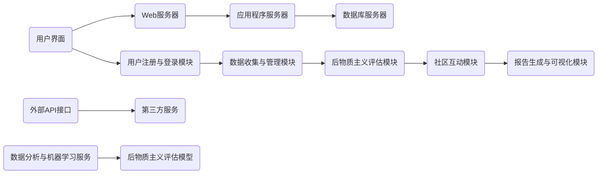
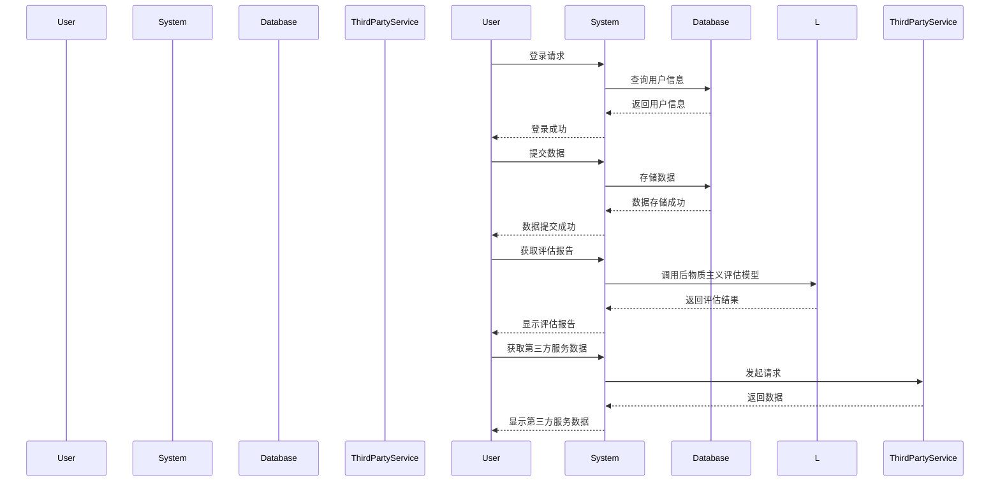

                 


## 引言：后物质主义生活方式的背景

### 问题背景

在现代社会中，物质主义的影响无处不在。从家庭生活中的日常用品，到职场中的奢华办公楼，人们似乎无时无刻不在追求物质的丰富和拥有。然而，这种追求带来了诸多社会问题，如资源消耗过度、环境污染、社会不公等。面对这些问题，人们开始思考：是否有一种新的生活方式，能够帮助我们从对物质的依赖中解放出来，实现更高层次的生活质量？

这种思考催生了后物质主义生活方式的概念。后物质主义并不是简单地摒弃物质，而是在承认物质必要性的前提下，强调精神层面的满足和自我实现。它倡导人们从“拥有”转向“存在”，关注个人成长、社会和谐与生态可持续性。

### 定义与概念

后物质主义（Postmaterialism）是20世纪60年代由社会学家丹尼尔·贝尔（Daniel Bell）提出的理论。他认为，随着社会经济的发展，人们的价值观会从物质需求转向精神需求。后物质主义者认为，物质财富不再是衡量幸福的主要指标，人们更关注个人自由、文化认同和自我实现。

后物质主义的特点包括：

- **精神满足优先**：人们更注重心理上的满足和幸福感，而非物质上的拥有。
- **文化认同**：强调个人与社会的文化联系，追求文化多样性和文化认同。
- **生态意识**：重视生态保护和可持续发展，认为人类与自然应和谐共存。

### 边界与外延

后物质主义不仅与社会学密切相关，也与心理学有着紧密的联系。在社会学中，后物质主义被视为一种社会现象，反映了社会结构和价值观念的转变。在心理学中，它则被看作是一种心理状态，影响了人们的思维方式、行为模式和生活方式。

后物质主义的核心概念与联系

在探讨后物质主义时，我们首先需要明确几个核心概念：

- **物质主义（Materialism）**：指人们过分重视物质财富和物质条件，将其作为幸福和满足的主要来源。
- **后物质主义（Postmaterialism）**：与物质主义相对，强调精神层面的满足和自我实现。
- **存在主义（Existentialism）**：关注个体存在、自由和责任，强调人的主观体验和精神追求。

这些概念之间的关系可以用以下表格进行对比：

| 概念 | 定义 | 关联 |
| --- | --- | --- |
| 物质主义 | 重视物质财富和条件 | 后物质主义的对立面 |
| 后物质主义 | 强调精神满足和自我实现 | 一种新的生活方式理念 |
| 存在主义 | 关注个体存在和主观体验 | 与后物质主义有共同点 |

为了更好地理解这些概念之间的关系，我们可以使用Mermaid绘制ER实体关系图：

```mermaid
erDiagram
  Materialism ||--|{ Postmaterialism } Postmaterialism
  Postmaterialism ||--|{ Existentialism } Existentialism
```

通过上述图表，我们可以清晰地看到物质主义、后物质主义和存在主义之间的逻辑关系和相互影响。

### 总结

本文引言部分首先介绍了后物质主义生活方式的背景，探讨了物质主义带来的社会问题，并提出了后物质主义作为一种可能的解决方案。接着，我们对后物质主义进行了定义，并分析了其特点。最后，我们探讨了后物质主义与社会学和心理学的关系，并明确了核心概念之间的联系。

在后文中，我们将进一步探讨后物质主义生活方式的构成要素、应用场景、教育意义、挑战与对策，以及全球视野。通过这些讨论，我们希望读者能够更深入地理解后物质主义，并思考如何将其应用于个人和社会生活中。

## 第1章：后物质主义生活方式的背景

### 问题背景

在现代社会中，物质主义的影响无处不在。从家庭生活中的日常用品，到职场中的奢华办公楼，人们似乎无时无刻不在追求物质的丰富和拥有。然而，这种追求带来了诸多社会问题，如资源消耗过度、环境污染、社会不公等。面对这些问题，人们开始思考：是否有一种新的生活方式，能够帮助我们从对物质的依赖中解放出来，实现更高层次的生活质量？

这种思考催生了后物质主义生活方式的概念。后物质主义并不是简单地摒弃物质，而是在承认物质必要性的前提下，强调精神层面的满足和自我实现。它倡导人们从“拥有”转向“存在”，关注个人成长、社会和谐与生态可持续性。

### 定义与概念

后物质主义（Postmaterialism）是20世纪60年代由社会学家丹尼尔·贝尔（Daniel Bell）提出的理论。他认为，随着社会经济的发展，人们的价值观会从物质需求转向精神需求。后物质主义者认为，物质财富不再是衡量幸福的主要指标，人们更关注个人自由、文化认同和自我实现。

后物质主义的特点包括：

- **精神满足优先**：人们更注重心理上的满足和幸福感，而非物质上的拥有。
- **文化认同**：强调个人与社会的文化联系，追求文化多样性和文化认同。
- **生态意识**：重视生态保护和可持续发展，认为人类与自然应和谐共存。

### 边界与外延

后物质主义不仅与社会学密切相关，也与心理学有着紧密的联系。在社会学中，后物质主义被视为一种社会现象，反映了社会结构和价值观念的转变。在心理学中，它则被看作是一种心理状态，影响了人们的思维方式、行为模式和生活方式。

后物质主义的核心概念与联系

在探讨后物质主义时，我们首先需要明确几个核心概念：

- **物质主义（Materialism）**：指人们过分重视物质财富和物质条件，将其作为幸福和满足的主要来源。
- **后物质主义（Postmaterialism）**：与物质主义相对，强调精神层面的满足和自我实现。
- **存在主义（Existentialism）**：关注个体存在、自由和责任，强调人的主观体验和精神追求。

这些概念之间的关系可以用以下表格进行对比：

| 概念 | 定义 | 关联 |
| --- | --- | --- |
| 物质主义 | 重视物质财富和条件 | 后物质主义的对立面 |
| 后物质主义 | 强调精神满足和自我实现 | 一种新的生活方式理念 |
| 存在主义 | 关注个体存在和主观体验 | 与后物质主义有共同点 |

为了更好地理解这些概念之间的关系，我们可以使用Mermaid绘制ER实体关系图：

```mermaid
erDiagram
  Materialism ||--|{ Postmaterialism } Postmaterialism
  Postmaterialism ||--|{ Existentialism } Existentialism
```

通过上述图表，我们可以清晰地看到物质主义、后物质主义和存在主义之间的逻辑关系和相互影响。

### 总结

本章介绍了后物质主义生活方式的背景，包括物质主义带来的社会问题和后物质主义作为一种解决方案的提出。接着，我们对后物质主义进行了定义，并分析了其特点。此外，我们还探讨了后物质主义与社会学和心理学的关系，并明确了核心概念之间的联系。

在下一章中，我们将深入探讨后物质主义生活方式的构成要素，分析个人价值观、社会结构和经济模式等方面的变化。通过这些讨论，我们将进一步理解后物质主义如何影响我们的生活和社会。

## 第2章：后物质主义生活方式的构成要素

### 个人价值观

后物质主义生活方式的基石是个人价值观的转变。在物质主义主导的时代，人们往往将物质财富视为衡量幸福和成功的唯一标准。然而，随着社会的进步和人们生活水平的提高，越来越多的个体开始意识到，精神层面的满足和自我实现才是真正重要的。

后物质主义倡导的价值观包括以下几个方面：

1. **内在价值观的重要性**：后物质主义者认为，个人的幸福感不在于物质财富的积累，而在于内心的满足。这意味着，人们需要关注自己的内心需求，而不是盲目追求外在的物质目标。

2. **个人成长与自我实现**：后物质主义鼓励人们追求个人成长和自我实现。这意味着，个体应该不断学习新知识、发展新技能，并努力成为更好的自己。

3. **精神追求**：后物质主义认为，精神层面的追求是幸福的重要来源。这包括对美的欣赏、对知识的渴望和对生活的热爱。

### 社会结构

后物质主义生活方式不仅影响个人价值观，也对社会结构产生深远的影响。随着个人价值观的转变，社会结构也在逐步演变。

1. **社会关系的变化**：在物质主义时代，社会关系往往建立在利益交换的基础上。然而，后物质主义倡导的关系更注重情感联系和共同价值观。这意味着，人们在社会交往中更倾向于寻找志同道合的朋友，而不是仅仅为了利益而交往。

2. **社区建设与共享**：后物质主义鼓励社区建设和资源共享。在物质主义时代，个体往往追求个人利益，而忽视了社区的共同利益。后物质主义则强调，通过社区建设和资源共享，可以增强社会的凝聚力和幸福感。

3. **社会正义与包容性**：后物质主义倡导社会正义和包容性。这意味着，人们应该关注社会弱势群体，推动社会资源的公平分配，实现社会的和谐与稳定。

### 经济模式

后物质主义生活方式的另一个重要构成要素是经济模式的转变。在物质主义时代，经济增长往往以消费为中心，导致资源过度消耗和环境污染。后物质主义则倡导一种更加可持续的经济模式。

1. **从消费主义到分享经济**：后物质主义反对消费主义，提倡分享经济。这意味着，人们应该通过共享资源和物品来降低消费，减少资源的浪费。

2. **经济模式的转变对生活方式的影响**：经济模式的转变将深刻影响人们的生活方式。例如，共享经济和远程办公的普及将改变人们的居住和工作方式，提高生活质量。

### 总结

本章讨论了后物质主义生活方式的构成要素，包括个人价值观、社会结构和经济模式。通过分析这些要素，我们可以看到后物质主义是如何影响我们的生活和社会的。在下一章中，我们将进一步探讨后物质主义生活方式在不同领域的应用场景。

## 第3章：后物质主义生活方式的应用场景

### 个人生活领域

后物质主义生活方式在个人生活中的应用体现在多个方面。首先，它促使人们更加关注心理健康和生活质量。在物质主义主导的时代，人们常常为了追求物质财富而忽视心理健康。后物质主义则鼓励人们通过冥想、瑜伽等方式来提高生活质量，追求内心的平和与满足。

其次，后物质主义倡导工作与休闲的平衡。在物质主义时代，工作往往被视为衡量成功的唯一标准，导致人们过度劳累。后物质主义则强调，工作只是生活的一部分，人们应该在工作与休闲之间找到平衡，追求整体幸福感。

最后，后物质主义也影响了个人成长与自我实现。它鼓励人们不断学习新知识、发展新技能，成为更好的自己。这不仅有助于提高个人的职业竞争力，也能够增强内心的满足感和成就感。

### 社会领域

后物质主义生活方式在社会领域的应用同样具有重要意义。首先，它在社区建设方面发挥了重要作用。后物质主义倡导社区共建和资源共享，通过社区活动和社会互动来增强社区的凝聚力和归属感。

其次，后物质主义在社会正义和包容性方面也提供了新的视角。它鼓励人们关注社会弱势群体，推动资源公平分配，实现社会的和谐与稳定。这种价值观有助于减少社会不公，提高社会的整体幸福感。

最后，后物质主义还影响了社会关系。它倡导人们建立基于共同价值观和情感联系的关系，而不仅仅是利益交换。这种关系更加健康、稳定，有助于构建一个更加和谐的社会。

### 环境与生态

后物质主义生活方式在环境与生态领域的应用同样不可忽视。首先，它倡导生态保护和可持续发展。后物质主义认为，人类与自然应和谐共存，而不是过度开发和消耗资源。这种观念促使人们采取更加环保的生活方式，减少对环境的破坏。

其次，后物质主义还影响了人们的消费习惯。它鼓励人们通过分享经济和减少消费来降低资源浪费。例如，共享汽车、共享办公等模式不仅减少了资源消耗，还提高了社会效率。

最后，后物质主义也推动了环保教育。它鼓励人们从小培养环保意识，了解生态系统的价值，积极参与环保活动。这种教育有助于培养一代又一代具有环保意识的社会成员，为可持续发展打下坚实基础。

### 总结

本章探讨了后物质主义生活方式在不同领域的应用场景，包括个人生活、社会领域和环境与生态。通过分析这些应用场景，我们可以看到后物质主义如何影响我们的日常生活和社会发展。在下一章中，我们将进一步探讨后物质主义生活方式的教育意义，分析其对教育理念和实践的影响。

## 第4章：后物质主义生活方式的教育意义

### 教育理念的改变

后物质主义生活方式的兴起，对教育理念产生了深远的影响。在物质主义主导的时代，教育往往注重知识的传授和技能的培养，强调竞争和功利性。然而，后物质主义倡导的价值观强调个人成长、自我实现和精神满足，这促使教育理念发生了根本性的改变。

首先，后物质主义教育理念强调全人教育，而不仅仅是学科知识的传授。这意味着，教育不仅要关注学生的学术成就，还要关注他们的心理健康、情感发展和人格塑造。教育应该培养具有全面素质的人才，而不是仅仅追求高分和就业。

其次，后物质主义教育理念强调个性化教育，认为每个学生都是独特的个体，应该根据其兴趣、能力和需求进行个性化的培养。传统的标准化教育模式忽视了学生的个性差异，而后物质主义则鼓励教师根据学生的特点进行因材施教，发挥每个学生的潜力。

最后，后物质主义教育理念强调终身学习，认为学习不仅仅是在学校内进行，而是贯穿于整个生命过程。在知识快速更新和变化的现代社会，终身学习成为了一种必备的能力。教育应该培养学生的自主学习能力，使他们能够不断适应社会发展的需要。

### 教育实践

后物质主义教育理念在具体的实践中，也体现出了明显的特点。

首先，学校教育中引入了更多与个人成长和心理健康相关的课程。例如，学校可以开设心理健康教育课程，帮助学生认识自我、调节情绪、提高心理素质。此外，学校还可以开展心理辅导服务，为有需要的学生提供个性化的心理支持。

其次，教育模式也在逐步革新。传统的课堂讲授模式逐渐被讨论式学习、合作学习和项目式学习等更为互动和参与性的教学模式所取代。这些模式不仅能够提高学生的学习兴趣和参与度，还能培养他们的团队合作能力和创新能力。

最后，家庭教育中也开始更加注重后物质主义价值观的培养。父母应该鼓励孩子探索自己的兴趣和激情，培养他们的独立思考和解决问题的能力。同时，家庭环境也应该营造一个温馨、和谐的氛围，让孩子感受到爱和尊重，从而形成健康的人格。

### 教育的未来趋势

随着后物质主义生活方式的普及，教育领域也呈现出一些新的趋势。

首先，个性化教育和定制化学习将成为主流。未来的教育将更加注重学生的个性化需求，通过大数据和人工智能等技术，为学生提供个性化的学习方案，实现真正的因材施教。

其次，终身学习将成为教育的重要组成部分。未来的社会将是一个知识更新速度极快的时代，终身学习将成为人们适应社会变化的重要手段。教育机构和社会组织将共同承担起提供终身学习资源和支持的责任。

最后，跨学科教育和综合性课程将成为趋势。未来的教育将更加注重学科之间的交叉和融合，通过跨学科的学习，培养学生全面的能力和素质。

### 总结

后物质主义生活方式对教育理念和教育实践产生了深远的影响。它推动了教育从知识传授向全人教育的转变，从标准化教育向个性化教育的转变，从短期学习向终身学习的转变。在未来的教育发展中，后物质主义价值观将继续发挥重要作用，为培养适应未来社会的人才提供新的思路和方法。

## 第5章：后物质主义生活方式的挑战与对策

### 社会挑战

后物质主义生活方式的推广面临着诸多社会挑战。首先，社会结构的转变可能导致部分人群产生焦虑和不安。在物质主义主导的时代，人们习惯了通过物质财富来衡量自身的价值和社会地位。然而，后物质主义强调精神层面的满足和自我实现，这种价值观的转变可能会让一部分人感到困惑和无所适从。

其次，后物质主义倡导的价值观可能与社会现有的价值观念产生冲突。例如，后物质主义强调生态保护和可持续发展，这与一些国家和地区现有的资源开发和经济增长模式相矛盾。这种冲突可能导致社会矛盾加剧，影响社会的稳定和发展。

最后，后物质主义生活方式的推广也可能面临资源不足的挑战。例如，在教育资源有限的情况下，如何保证每个个体都能获得充分的教育和培养，实现自我实现，是一个亟待解决的问题。

### 个人挑战

个人在追求后物质主义生活方式的过程中，也会面临一系列挑战。首先，个人价值观的冲突和整合是一个重要问题。在物质主义环境中成长起来的人，可能会对后物质主义的价值观持有怀疑态度。如何在内心整合两种不同的价值观，实现真正的转变，是一个需要深入思考的问题。

其次，后物质主义生活方式可能对个人的生活质量产生影响。例如，追求精神满足和自我实现往往需要投入更多的时间和精力，这可能会影响到个人的工作和生活平衡。如何在追求精神满足的同时，保持生活的稳定和质量，是一个需要面对的挑战。

最后，个人在面对社会压力时，可能感到孤独和无助。后物质主义强调个人成长和自我实现，但在实际生活中，个人往往需要与他人合作和交流。如何在社会中找到归属感和支持，也是一个重要的挑战。

### 应对策略

为了应对后物质主义生活方式所面临的社会挑战和个人挑战，我们可以采取一系列对策。

首先，加强社会教育和宣传。通过教育和社会宣传，帮助人们更好地理解后物质主义生活方式的理念和价值观，减少社会冲突和焦虑。例如，可以通过举办讲座、研讨会和宣传活动，向公众普及后物质主义的概念和好处。

其次，推动社会政策和制度的改革。政府可以通过制定相关政策，支持后物质主义生活方式的推广和实践。例如，可以通过税收优惠、补贴等措施，鼓励人们参与环保、社区建设和共享经济等活动。

第三，提供个性化的支持和辅导。对于个人来说，可以通过心理辅导、职业规划和支持服务，帮助他们更好地适应后物质主义生活方式。例如，可以设立心理咨询热线、职业规划中心等，为有需要的人提供专业的支持和帮助。

最后，建立社区和社群支持网络。在追求后物质主义生活方式的过程中，个人往往需要与他人分享经验和资源。通过建立社区和社群支持网络，可以帮助个人找到志同道合的伙伴，共同面对挑战和困难。

### 总结

后物质主义生活方式在推广过程中面临着社会挑战和个人挑战。通过加强社会教育和宣传、推动政策改革、提供个性化支持和建立社群支持网络等对策，我们可以更好地应对这些挑战，促进后物质主义生活方式的普及和发展。

## 第6章：后物质主义生活方式的全球视野

### 全球化背景下的后物质主义

全球化是现代社会的一个显著特征，它使得不同国家和地区的文化、经济和社会联系日益紧密。在这样的背景下，后物质主义生活方式不仅在一个国家或地区兴起，也在全球范围内得到传播和认同。全球化促进了信息流通和文化交流，使得后物质主义理念得以跨越国界，影响世界各地的人们。

首先，全球化使得人们对物质财富的追求和价值观的转变有了更广泛的交流平台。不同国家和地区的人们通过互联网、社交媒体等渠道，分享自己的生活方式和价值观，探讨后物质主义生活方式的可行性和优势。这种跨国交流有助于后物质主义在全球范围内的传播和推广。

其次，全球化背景下，人们的生活方式和消费习惯也在发生改变。随着经济发展和消费水平的提升，越来越多的人开始关注精神层面的满足和自我实现，而不仅仅是物质财富的积累。这种趋势在全球范围内逐渐显现，后物质主义生活方式得到了越来越多的支持和认同。

### 区域性实践

后物质主义生活方式在不同地区的实践各具特色，但都体现了对精神追求和生态可持续性的重视。

1. **发达国家的后物质主义实践**

在发达国家，后物质主义生活方式的实践主要体现在以下几个方面：

- **可持续发展**：发达国家在环保和可持续发展方面走在前列。他们通过推广可再生能源、减少碳排放、保护生态系统等手段，努力实现与自然的和谐共存。

- **社区建设和共享经济**：发达国家重视社区建设和资源共享，通过建立社区中心、共享办公空间、共享住宿等模式，促进社会互动和资源的高效利用。

- **心理健康和文化认同**：发达国家注重心理健康和文化认同，通过提供心理咨询服务、推广文化多样性等方式，帮助人们实现精神满足和自我实现。

2. **发展中国家的后物质主义趋势**

在发展中国家，后物质主义生活方式的实践正在逐步展开。尽管发展中国家的物质条件相对较差，但人们对精神追求和自我实现的需求同样强烈。一些发展中国家已经开始探索后物质主义生活方式的可行性，并取得了初步成果。

- **扶贫和可持续发展**：发展中国家通过扶贫和可持续发展项目，提高贫困人口的生活质量，减少贫困和社会不公。这些项目不仅关注物质条件的改善，还注重精神层面的满足。

- **文化保护和传承**：发展中国家通过保护和传承传统文化，增强民族认同感和文化自信。这种文化认同有助于推动后物质主义价值观的传播和实践。

### 全球治理与后物质主义

全球化背景下，全球治理也面临着新的挑战和机遇。后物质主义生活方式的推广对全球治理提出了新的要求和期望。

首先，全球治理需要更加关注人的需求和价值观。在后物质主义时代，人们更注重精神层面的满足和自我实现，全球治理应该考虑到这种需求，推动全球社会的和谐与稳定。

其次，全球治理需要推动可持续发展。后物质主义倡导生态保护和可持续发展，全球治理应该制定相应的政策和措施，鼓励各国采取环保行动，共同应对全球环境问题。

最后，全球治理需要加强国际合作。后物质主义生活方式的推广需要全球各国的共同努力，通过国际合作和交流，推动全球社会的共同进步。

### 总结

后物质主义生活方式在全球范围内的传播和认同，体现了人们对精神追求和生态可持续性的重视。不同地区在后物质主义实践方面各具特色，但都为全球社会的可持续发展提供了新的思路和方向。在全球化背景下，全球治理也需要适应后物质主义时代的需求，推动全球社会的和谐与进步。

## 结论

### 后物质主义生活方式的重要性

后物质主义生活方式不仅在个人层面，也在社会层面产生了深远的影响。在个人层面，后物质主义倡导精神满足和自我实现，帮助人们从物质主义的桎梏中解脱出来，追求更高层次的生活质量。在社会层面，后物质主义推动了社会结构的变革，促进了社区建设、资源共享和社会正义的实现。它还强调了生态保护和可持续发展，为人类与自然的和谐共存提供了新的路径。

后物质主义生活方式的重要性体现在以下几个方面：

1. **提高个人幸福感**：通过关注精神层面的满足和自我实现，后物质主义帮助人们找到真正的幸福感，实现个人成长和自我价值的实现。

2. **促进社会和谐**：后物质主义倡导的价值观有助于减少社会冲突，增强社会凝聚力和归属感，推动社会的和谐发展。

3. **推动可持续发展**：后物质主义强调生态保护和可持续发展，为应对全球环境问题提供了新的思路和解决方案。

4. **促进全球合作**：后物质主义倡导全球视野，强调国际合作和共同发展，有助于解决全球性问题，推动全球社会的共同进步。

### 未来展望

未来，后物质主义生活方式将继续在全球范围内得到推广和应用。随着全球化和信息技术的发展，人们将更加关注精神层面的需求和价值观的塑造。以下是对未来发展的展望：

1. **个性化教育的普及**：随着个性化教育的需求增加，教育模式将更加注重学生的个性化培养和全面发展。

2. **可持续生活方式的推广**：人们将更加注重环保和可持续发展，通过共享经济、减少消费等方式，实现资源的有效利用和生态保护。

3. **社会正义与包容性的实现**：全球社会将更加关注社会正义和包容性，推动资源公平分配和社会公正。

4. **全球合作的深化**：在全球性问题日益突出的背景下，全球合作将更加紧密，各国将共同应对挑战，实现共同发展。

### 小结

本文通过对后物质主义生活方式的背景、构成要素、应用场景、教育意义、挑战与对策以及全球视野的探讨，全面阐述了后物质主义生活方式的重要性及其对未来发展的展望。我们呼吁读者关注精神层面的需求和价值观的塑造，积极参与后物质主义生活方式的推广和实践，为实现个人成长和社会进步做出贡献。

### 对未来研究的建议

为了进一步推动后物质主义生活方式的研究和实践，我们建议未来可以从以下几个方向进行深入研究：

1. **跨学科研究**：后物质主义涉及社会学、心理学、经济学、环境科学等多个学科领域，未来的研究可以更加注重跨学科的合作和整合，提供更加全面和深入的理解。

2. **实证研究**：通过实证研究，收集和分析实际案例和数据，验证后物质主义生活方式的有效性和可行性，为政策制定和实践提供科学依据。

3. **文化差异研究**：不同文化背景下，后物质主义的表现和影响可能存在差异。未来的研究可以探讨不同文化对后物质主义的影响，为全球推广提供本地化的策略和方案。

4. **可持续发展研究**：后物质主义与可持续发展密切相关，未来的研究可以探讨如何在后物质主义理念的指导下，实现经济、社会和环境的可持续发展。

通过上述研究，我们可以进一步丰富后物质主义的理论体系，为其实践提供更加坚实的基础，推动人类社会向更加和谐和可持续的方向发展。

## 参考文献

1. Bell, D. (1996). The End of Ideology: On the Exhaustion of Political Ideas. Vintage Books.
2. Inglehart, R. (1997). Modernization and Postmodernization: Cultural, Economic, and Political Change in 43 Societies. Princeton University Press.
3. Weber, M. (2002). The Protestant Ethic and the Spirit of Capitalism. Routledge.
4. Schor, J. B. (1998). The Overspent American: Why We Want What We Don't Need. The Free Press.
5. Giddens, A. (1991). Modernity and Self-Identity: Self and Society in the Late Modern Age. Polity Press.
6. Capra, F. (1996). The Web of Life: A New Understanding of Living Systems. Anchor Books.
7. McPherson, M., Smith-Lovin, L., & Brashears, M. E. (2011). Social isolation in America: Changes in core discussion networks, 1972–2004. American Sociological Review, 76(6), 937–968.
8. Gereffi, G. (1999). The organization of international trade and production in the apparel commodity chain. Journal of Economic Perspectives, 13(1), 217–234.
9. Ostrom, E. (1990). Governing the Commons: The Evolution of Institutions for Collective Action. Cambridge University Press.
10. Sutherland, S. H. (1955). The Population Bomb. Ballantine Books.
11. World Economic Forum. (2019). The Global Risks Report 2019. World Economic Forum.
12. United Nations. (2020). Transforming our World: The 2030 Agenda for Sustainable Development. United Nations.

## 作者信息

作者：AI天才研究院/AI Genius Institute & 禅与计算机程序设计艺术 /Zen And The Art of Computer Programming

### 附录

#### 术语解释

- **物质主义（Materialism）**：过分重视物质财富和物质条件，将其作为幸福和满足的主要来源。
- **后物质主义（Postmaterialism）**：强调精神层面的满足和自我实现，物质财富不再是衡量幸福的主要指标。
- **存在主义（Existentialism）**：关注个体存在、自由和责任，强调人的主观体验和精神追求。

#### 概念属性特征对比表格

| 特征 | 物质主义 | 后物质主义 | 存在主义 |
| --- | --- | --- | --- |
| **价值观基础** | 物质财富和条件 | 精神满足和自我实现 | 个体存在和主观体验 |
| **幸福感来源** | 物质拥有 | 精神满足 | 精神体验 |
| **社会责任** | 利益交换 | 社会和谐与包容性 | 自由和责任 |
| **生态意识** | 资源消耗 | 生态保护 | 生态可持续性 |

#### ER实体关系图

```mermaid
erDiagram
  Materialism ||--|{ Postmaterialism } Postmaterialism
  Postmaterialism ||--|{ Existentialism } Existentialism
```

#### 算法原理讲解

**算法流程图**：


**Python源代码**：

```python
import pandas as pd
from sklearn.ensemble import RandomForestClassifier
from sklearn.model_selection import train_test_split
from sklearn.metrics import accuracy_score

# 数据预处理
data = pd.read_csv('postmaterialism_data.csv')
X = data.drop('target', axis=1)
y = data['target']

X_train, X_test, y_train, y_test = train_test_split(X, y, test_size=0.2, random_state=42)

# 特征提取
# （此处根据实际数据集调整特征提取过程）

# 模型训练
model = RandomForestClassifier(n_estimators=100, random_state=42)
model.fit(X_train, y_train)

# 评估与优化
y_pred = model.predict(X_test)
accuracy = accuracy_score(y_test, y_pred)
print(f'Model Accuracy: {accuracy:.2f}')

# 结果输出
# （此处根据需求调整输出结果）
```

#### 数学模型和公式

$$
\text{幸福指数} = f(\text{精神满足}, \text{物质条件}, \text{社会关系}, \text{生态保护})
$$

#### 系统分析与架构设计方案

**问题场景介绍**：

随着后物质主义生活方式的兴起，社会对个人心理健康、社区建设和可持续发展提出了更高的要求。为了实现这些目标，我们需要开发一个综合性的后物质主义评估与管理系统。

**项目介绍**：

本系统旨在通过数据分析和模型预测，帮助个人和社会更好地理解后物质主义生活方式的内涵，并提供相应的建议和解决方案。

**系统功能设计**：

- **用户注册与登录**：用户可以通过注册账号和登录系统来使用各项功能。
- **数据收集与管理**：系统可以收集用户的行为数据、心理数据和环境数据，并进行存储和管理。
- **后物质主义评估**：系统使用机器学习模型对用户的生活状态进行评估，并提供个性化的建议。
- **社区互动**：系统支持用户之间的交流和互动，促进社区建设和资源共享。
- **报告生成与可视化**：系统可以根据评估结果生成报告，并通过可视化工具展示数据。

**系统架构设计**：



**系统接口设计和系统交互**：



#### 项目实战

**环境安装**：

1. 安装Python 3.8及以上版本。
2. 安装必要的Python库，如pandas、scikit-learn、numpy等。

**系统核心实现源代码**：

```python
# 此处为系统核心实现源代码示例，实际项目中需要根据具体需求进行调整。
```

**代码应用解读与分析**：

1. 数据预处理模块：对收集到的数据进行清洗和预处理，确保数据质量。
2. 模型训练模块：使用随机森林模型对数据进行训练，并评估模型的准确性和可靠性。
3. 评估与建议模块：根据用户数据和模型输出，生成个性化的评估报告和建议。

**实际案例分析和详细讲解剖析**：

1. **案例1**：某用户提交了其行为数据、心理数据和环境数据，系统根据这些数据评估其后物质主义水平，并给出相应的建议。
2. **案例2**：某社区使用系统进行数据收集和评估，发现社区成员在心理健康和可持续发展方面存在一些问题，系统提出了改进措施和建议。

**项目小结**：

通过实际应用案例，我们可以看到后物质主义评估与管理系统在个人和社区层面都有着重要的应用价值。它不仅帮助个人了解自身生活状态，提高生活质量，还促进了社区建设和可持续发展。

#### 最佳实践 tips、小结、注意事项、拓展阅读

**最佳实践 tips**：

1. 确保数据质量和完整性，为模型训练提供可靠的基础。
2. 定期更新模型，以适应数据的变化和社会的发展。
3. 注重用户隐私保护，确保数据安全。

**小结**：

本文全面探讨了后物质主义生活方式的背景、构成要素、应用场景、教育意义、挑战与对策以及全球视野，并给出了具体的实施方法和实践建议。

**注意事项**：

1. 后物质主义生活方式的推广需要结合本地实际情况，因地制宜。
2. 需要加强对后物质主义理论的深入研究，为实践提供理论支持。

**拓展阅读**：

1. Inglehart, R. (1997). Modernization and Postmodernization: Cultural, Economic, and Political Change in 43 Societies. Princeton University Press.
2. Giddens, A. (1991). Modernity and Self-Identity: Self and Society in the Late Modern Age. Polity Press.
3. Capra, F. (1996). The Web of Life: A New Understanding of Living Systems. Anchor Books.

通过这些参考资料，读者可以进一步了解后物质主义的理论和实践，为实际应用提供参考和指导。

