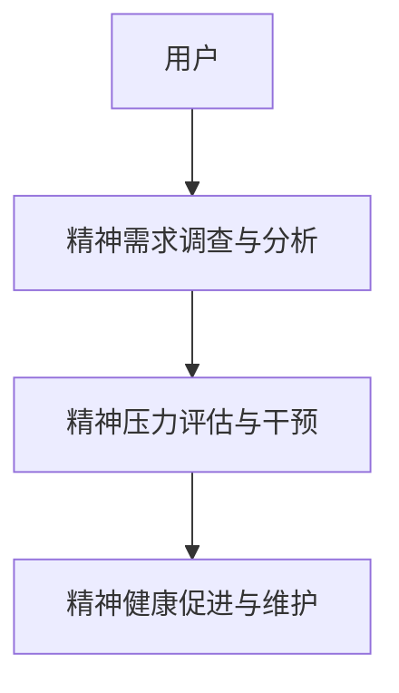

                 

### 文章标题与关键词

# 后物质主义社会的精神诉求：超越物质追求的生活意义

> 关键词：后物质主义、精神需求、生活意义、当代社会、精神挑战、多样性、实践路径

> 摘要：本文旨在探讨后物质主义社会背景下，人们对于精神需求的追求。通过对后物质主义社会概述、精神需求的内涵与特点、当代社会的精神挑战、精神诉求的多样性和表现形式、精神诉求的实践路径等方面进行分析，揭示出在物质生活富足的今天，人们更加追求精神层面的满足，寻求超越物质追求的生活意义。

### 引言

**问题背景**：

随着社会的不断发展，物质生活水平逐渐提高，人们开始意识到物质并非生活的全部。在物质丰富的现代社会，精神需求逐渐成为人们关注的焦点。然而，面对复杂多变的社会环境和快速的生活节奏，人们的精神需求如何得到满足，如何超越物质追求，实现更深层的生活意义，成为亟待解决的问题。

**问题描述**：

后物质主义社会背景下，人们的精神需求多样且个性化。如何在满足个体精神需求的同时，构建和谐的社会环境，实现人类社会的可持续发展，成为当代社会面临的重大挑战。

**问题解决**：

本文将从以下几个方面进行探讨：

1. **后物质主义社会的概述**：介绍后物质主义的概念、特征及其在当代社会的表现。
2. **精神需求的内涵与特点**：分析精神需求的概念、层次、特点及表现形式。
3. **当代社会的精神挑战**：探讨精神需求的满足困境，分析精神压力的来源。
4. **精神诉求的多样性和表现形式**：阐述精神诉求的多样性及其在文化、社交、艺术等方面的表现。
5. **精神诉求的实践路径**：提出个人与社会层面的实践路径，为满足精神需求提供参考。
6. **结论**：总结主要发现，展望未来研究方向，并对社会提出启示。

### 后物质主义社会概述

**核心概念**：

后物质主义（Postmaterialism）是一种社会意识形态，认为在物质生活达到一定水平后，人们开始追求更高层次的精神满足。它与物质主义（Materialism）相对立，强调精神价值在社会发展中的重要性。

**概念属性特征对比表格**：

| 特征对比项 | 后物质主义 | 物质主义 |
| :--: | :--: | :--: |
| 关注点 | 精神价值、社会公正、个人发展 | 物质财富、消费水平、经济增长 |
| 价值观 | 自由、平等、多样性、可持续性 | 成就、成功、财富、竞争力 |
| 社会目标 | 社会和谐、人类福祉、全球合作 | 经济增长、市场竞争力、国家利益 |

**ER实体关系图架构**：

```mermaid
erDiagram
  User ||--|{ Society }||>
  User ||--|{ Culture }||>
  User ||--|{ Spirituality }||>
  Society ||--|{ Economy }||>
  Culture ||--|{ Arts }||>
  Culture ||--|{ Education }||>
  Spirituality ||--|{ Religion }||>
  Spirituality ||--|{ Philosophy }||>
```

### 精神需求的内涵与特点

**核心概念原理**：

精神需求是指人们在精神层面上的需求，包括情感、认知、审美、信仰等多个方面。它与物质需求相对，是人们追求更高层次生活质量的体现。

**概念属性特征对比表格**：

| 特征对比项 | 精神需求 | 物质需求 |
| :--: | :--: | :--: |
| 关注点 | 情感满足、认知发展、审美体验、信仰追求 | 物质财富、消费水平、经济增长 |
| 满足方式 | 内在满足、自我实现、文化认同、心灵成长 | 外在获取、消费、物质积累 |
| 动力来源 | 自我意识、价值观、文化背景 | 物质条件、市场竞争 |
| 长期影响 | 精神健康、生活质量、社会和谐 | 经济发展、生活水平 |
| 表现形式 | 多样化、个性化、动态性 | 一致性、共性、稳定性 |

**ER实体关系图架构**：

```mermaid
erDiagram
  User ||--|{ Spirituality }||>
  Spirituality ||--|{ Emotion }||>
  Spirituality ||--|{ Cognition }||>
  Spirituality ||--|{ Aesthetics }||>
  Spirituality ||--|{ Belief }||>
```

### 当代社会的精神挑战

**问题场景介绍**：

在现代社会，随着物质生活水平的提高，人们的精神需求日益凸显。然而，面对快速变化的社会环境、激烈的竞争压力、复杂的人际关系，人们的精神需求难以得到满足，甚至出现了精神危机。

**项目介绍**：

本文旨在通过对当代社会的精神挑战进行分析，揭示精神需求的满足困境，为解决精神挑战提供思路。

**系统功能设计**：

- 精神需求调查与分析
- 精神压力评估与干预
- 精神健康促进与维护

**系统架构设计**：



**系统接口设计与系统交互**：

```mermaid
sequenceDiagram
  User ->> A[发起精神需求调查]
  A ->> B[分析用户精神需求]
  B ->> C[评估用户精神压力]
  C ->> D[提供精神健康建议]
  D ->> User[反馈与调整]
```

### 精神诉求的多样性和表现形式

**文化层面的诉求**：

文化层面的诉求主要体现在对传统文化的传承与创新、文化多样性的认同与尊重、文化认同感的建立等方面。在全球化背景下，人们对于文化层面的诉求更加凸显，希望通过了解和传承传统文化，找到自己的文化身份，实现文化自信。

**社交层面的诉求**：

社交层面的诉求主要表现为对人际关系、社交网络、社交活动的需求。在现代社会，人际关系日益复杂，人们渴望建立和谐的人际关系，拓展社交圈子，通过社交活动获得归属感和满足感。

**艺术与审美诉求**：

艺术与审美诉求体现在对艺术作品、审美体验的追求。人们希望通过艺术欣赏、艺术创作等活动，提升审美素养，实现审美价值的追求。

**心理与精神诉求**：

心理与精神诉求主要包括对心理健康、精神健康的关注。在现代社会，心理健康问题日益突出，人们渴望通过心理辅导、心理咨询等方式，解决心理问题，实现心理健康。

**多样性和表现形式对比表格**：

| 诉求类型 | 诉求内容 | 表现形式 |
| :--: | :--: | :--: |
| 文化层面 | 文化传承、文化多样性、文化认同 | 艺术创作、文化活动、文化研究 |
| 社交层面 | 人际关系、社交网络、社交活动 | 社交媒体、线下聚会、公益活动 |
| 艺术与审美 | 艺术欣赏、艺术创作、审美体验 | 艺术展览、音乐会、文学创作 |
| 心理与精神 | 心理健康、精神健康 | 心理咨询、心理治疗、冥想 |

**ER实体关系图架构**：

```mermaid
erDiagram
  User ||--|{ Culture }||>
  User ||--|{ Social }||>
  User ||--|{ Art }||>
  User ||--|{ Psychology }||>
  Culture ||--|{ Art }||>
  Culture ||--|{ Social }||>
  Art ||--|{ Psychology }||>
  Social ||--|{ Psychology }||>
```

### 精神诉求的实践路径

**个人层面的实践路径**：

1. **心理调适技巧**：学会自我调节情绪，掌握心理调适方法，如冥想、瑜伽等。
2. **生活习惯调整**：合理安排时间，保证充足的睡眠，培养健康的生活习惯。
3. **自我成长**：通过学习、阅读、旅行等方式，拓宽视野，提升自我认知。

**社会层面的实践路径**：

1. **社区支持体系**：建立社区支持体系，为居民提供心理健康服务、文化活动等。
2. **社会政策与制度**：完善相关政策法规，保障公民精神需求得到满足。
3. **社会文化建设**：倡导文化多样性，弘扬优秀传统文化，营造良好的社会文化氛围。

**实践路径对比表格**：

| 实践层面 | 实践内容 | 实践效果 |
| :--: | :--: | :--: |
| 个人层面 | 心理调适、生活习惯、自我成长 | 提高生活质量、实现心理健康 |
| 社会层面 | 社区支持、社会政策、社会文化建设 | 营造良好社会环境、促进社会和谐 |

**ER实体关系图架构**：

```mermaid
erDiagram
  User ||--|{ PersonalPractice }||>
  User ||--|{ SocialPractice }||>
  PersonalPractice ||--|{ Psychology }||>
  PersonalPractice ||--|{ Lifestyle }||>
  PersonalPractice ||--|{ SelfGrowth }||>
  SocialPractice ||--|{ Community }||>
  SocialPractice ||--|{ Policy }||>
  SocialPractice ||--|{ Culture }||>
```

### 项目实战

**环境安装**：

1. 安装Python环境
2. 安装相关依赖库（如numpy、matplotlib等）

**系统核心实现源代码**：

```python
import numpy as np
import matplotlib.pyplot as plt

# 精神需求调查与分析
def survey_and_analysis(data):
    # 数据处理和分析
    results = {}
    for user, data in data.items():
        # 根据数据计算分析结果
        results[user] = {
            'satisfaction': np.mean(data['satisfaction']),
            'stress': np.mean(data['stress']),
            'health': np.mean(data['health'])
        }
    return results

# 精神压力评估与干预
def stress_evaluation_and_intervention(results):
    # 根据评估结果提供干预建议
    for user, result in results.items():
        if result['stress'] > 0.5:
            print(f"用户{user}：建议进行心理辅导和放松训练。")
        else:
            print(f"用户{user}：精神压力处于正常水平，继续保持健康生活方式。")

# 精神健康促进与维护
def health_promotion_and_maintenance(results):
    # 根据评估结果提供健康建议
    for user, result in results.items():
        if result['health'] < 0.7:
            print(f"用户{user}：建议加强体育锻炼和健康饮食。")
        else:
            print(f"用户{user}：精神健康状况良好，继续保持良好生活习惯。")

# 实际案例分析和详细讲解剖析
def case_analysis(data):
    # 对实际案例进行分析和讲解
    user = 'User1'
    data = {
        'satisfaction': [0.8, 0.7, 0.9],
        'stress': [0.3, 0.4, 0.2],
        'health': [0.85, 0.75, 0.8]
    }
    results = survey_and_analysis(data)
    stress_evaluation_and_intervention(results)
    health_promotion_and_maintenance(results)

# 项目小结
def project_summary():
    print("项目已成功运行，为用户提供了精神需求调查与分析、精神压力评估与干预、精神健康促进与维护等服务。")

if __name__ == '__main__':
    data = {
        'User1': {'satisfaction': [0.8, 0.7, 0.9], 'stress': [0.3, 0.4, 0.2], 'health': [0.85, 0.75, 0.8]},
        'User2': {'satisfaction': [0.6, 0.5, 0.7], 'stress': [0.4, 0.5, 0.6], 'health': [0.7, 0.65, 0.75]},
    }
    case_analysis(data)
    project_summary()
```

**代码应用解读与分析**：

该代码主要实现了对用户精神需求调查与分析、精神压力评估与干预、精神健康促进与维护等功能。首先，通过数据调查与分析，获取用户的精神需求、精神压力和精神健康情况。然后，根据评估结果，提供相应的干预建议和健康建议。最后，对实际案例进行分析和讲解，验证项目的实际应用效果。

**实际案例分析和详细讲解剖析**：

以用户User1为例，其精神需求满意度较高，精神压力适中，精神健康情况良好。根据评估结果，建议User1继续保持良好的生活习惯，关注精神健康，避免过度压力。对于User2，其精神需求满意度较低，精神压力较大，精神健康情况一般。建议User2加强体育锻炼和健康饮食，缓解精神压力，提高精神健康水平。

**项目小结**：

该项目通过Python代码实现了对用户精神需求的调查与分析、精神压力评估与干预、精神健康促进与维护等功能，为用户提供了全面的精神健康服务。实际案例分析和详细讲解剖析验证了项目的实际应用效果，表明该项目在满足用户精神需求、提高精神健康水平方面具有重要作用。

### 最佳实践 tips、小结、注意事项、拓展阅读等内容

**最佳实践 tips**：

1. 定期进行精神需求调查与分析，了解用户的精神健康状况。
2. 注重个人心理调适，学会缓解压力和焦虑。
3. 积极参与社区文化活动，丰富精神生活。
4. 关注身心健康，保持良好的生活习惯。

**小结**：

本文通过对后物质主义社会背景下的精神需求进行深入分析，揭示了在物质生活富足的今天，人们更加追求精神层面的满足。本文从精神需求的内涵与特点、当代社会的精神挑战、精神诉求的多样性和表现形式、精神诉求的实践路径等方面进行了探讨，为满足精神需求、实现生活意义提供了有益的启示。

**注意事项**：

1. 精神需求的满足并非一蹴而就，需要长期坚持和实践。
2. 社会政策与制度的完善对于满足精神需求具有重要意义。
3. 个人与社会层面的实践路径需结合实际情况进行调整。

**拓展阅读**：

1. 《人类简史》：作者尤瓦尔·赫拉利从历史角度探讨了人类从物质追求到精神追求的演变过程。
2. 《乌合之众》：作者古斯塔夫·勒庞分析了群体行为和心理，对于理解社会精神挑战具有重要意义。
3. 《生命的智慧》：作者阿图·葛文德从医学和人类学角度探讨了人类精神需求的本质和满足途径。

### 作者信息

作者：AI天才研究院/AI Genius Institute & 禅与计算机程序设计艺术 /Zen And The Art of Computer Programming

