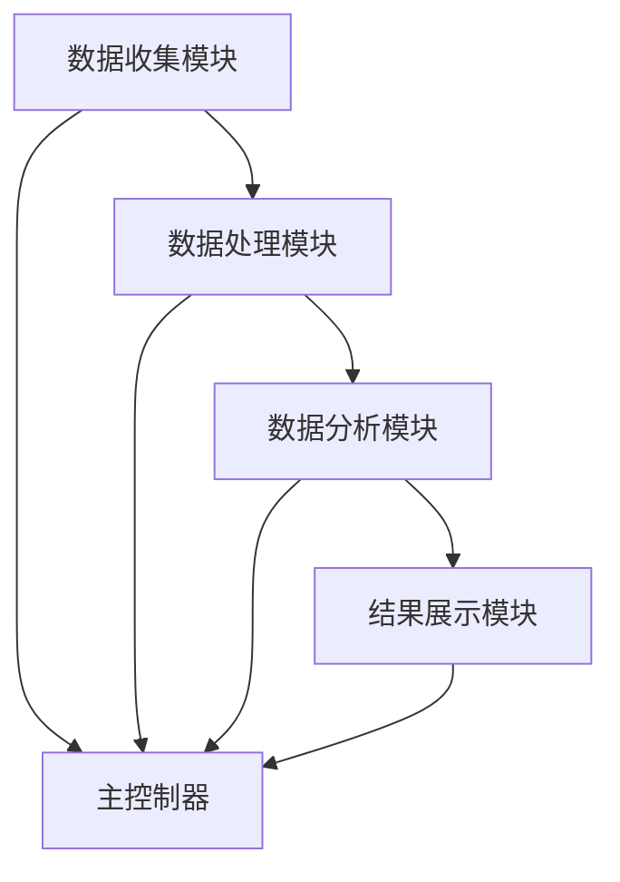
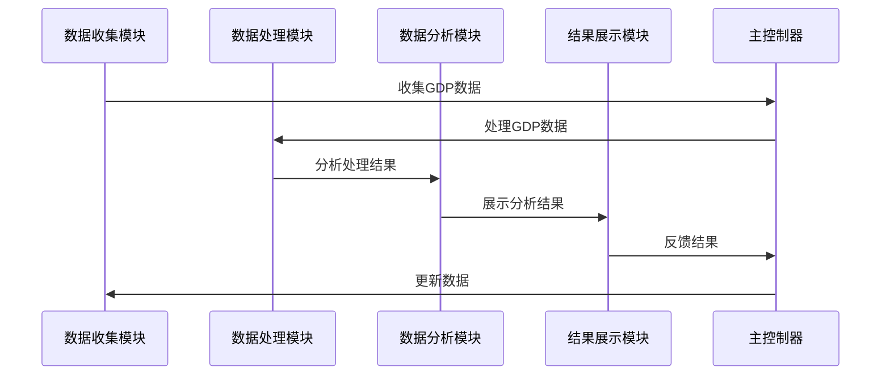

                 

# 后物质主义经济学：从GDP到GNH的转变

> 关键词：后物质主义经济学、GDP、GNH、经济发展、生活质量、幸福感

> 摘要：本文旨在探讨后物质主义经济学的概念和原理，以及如何将国民幸福指数（GNH）作为衡量一个国家经济福祉的新指标。通过对比GDP与GNH的核心概念、属性特征以及数学模型，本文详细阐述了GNH的计算方法和影响要素，并对后物质主义经济学在实际应用中的意义进行了深入分析。

## 背景介绍

### 问题背景

随着全球经济的发展，传统的GDP（国内生产总值）已经不能全面、准确地衡量一个国家的经济状况和社会福祉。GDP只关注经济产出的数量，而忽略了经济增长的质量和社会成本。因此，经济学家们开始探索一种更为全面的指标来衡量一个国家的经济状况。

### 问题描述

后物质主义经济学提出，一个国家的经济福祉不仅仅取决于物质财富的积累，更取决于人们的生活质量和幸福感。因此，需要一种新的指标来衡量一个国家的经济状况，即国民幸福指数（GNH）。

### 问题解决

《后物质主义经济学：从GDP到GNH的转变》这本书旨在探讨后物质主义经济学的概念和原理，以及如何将GNH作为衡量一个国家经济福祉的新指标。

### 边界与外延

后物质主义经济学主要研究的是物质财富积累后的经济发展阶段，关注的是人们的生活质量和幸福感。它不仅适用于国家层面的经济政策制定，也适用于企业和社会组织的可持续发展战略。

### 概念结构与核心要素组成

1. **GDP（国内生产总值）**：衡量一个国家经济产出的总量。
2. **GNH（国民幸福指数）**：衡量一个国家经济福祉的新指标，包括经济增长、环境保护、社会公正、文化繁荣和政府效能等方面。
3. **后物质主义经济学**：一种基于GNH的经济理论体系，强调经济福祉的全面性和可持续性。

## 核心概念与联系

### 核心概念原理

1. **GDP**：GDP是一个国家在一定时间内所有最终产品和服务的市场价值总和。
2. **GNH**：GNH是一个综合性的指标，包括经济增长、环境保护、社会公正、文化繁荣和政府效能等方面。

### 概念属性特征对比表格

| 特征         | GDP           | GNH              |
| ------------ | ------------- | ---------------- |
| 衡量对象     | 经济产出总量  | 经济福祉全面性   |
| 关注焦点     | 经济增长      | 生活质量和幸福感 |
| 衡量方法     | 统计市场价值  | 综合性指标体系   |

### ER实体关系图架构的 Mermaid 流程图

```mermaid
erDiagram
  GNH <--o> 经济增长
  GNH <--o> 环境保护
  GNH <--o> 社会公正
  GNH <--o> 文化繁荣
  GNH <--o> 政府效能
```

## 算法原理讲解

### 数学模型和数学公式

后物质主义经济学的核心在于如何将GNH作为衡量一个国家经济福祉的新指标。GNH的计算公式可以表示为：

$$
GNH = f(GDP, 环境保护, 社会公正, 文化繁荣, 政府效能)
$$

其中，$f$ 是一个综合性的函数，用于衡量这些因素对GNH的影响程度。

### 详细讲解和举例说明

假设一个国家在某一年的GDP为1000亿美元，环境保护得分为90分，社会公正得分为80分，文化繁荣得分为70分，政府效能得分为85分。根据上述公式，我们可以计算出该国的GNH：

$$
GNH = f(1000亿美元, 90分, 80分, 70分, 85分)
$$

由于$f$ 函数的具体形式未知，我们无法直接计算出GNH的具体数值。但是，我们可以通过这个公式理解GNH的计算原理，即综合考虑GDP以及其他四个方面的得分。

## 数学模型和数学公式 & 详细讲解 & 举例说明

### 数学模型和数学公式

在后物质主义经济学中，GNH的计算公式可以进一步细化为：

$$
GNH = GDP^{\alpha} \times \frac{环境保护得分}{100}^{\beta} \times \frac{社会公正得分}{100}^{\gamma} \times \frac{文化繁荣得分}{100}^{\delta} \times \frac{政府效能得分}{100}^{\epsilon}
$$

其中，$\alpha, \beta, \gamma, \delta, \epsilon$ 是权重系数，用于衡量各个因素对GNH的影响程度。

### 详细讲解和举例说明

假设一个国家在某一年的GDP为1000亿美元，环境保护得分为90分，社会公正得分为80分，文化繁荣得分为70分，政府效能得分为85分。根据上述公式，我们可以计算出该国的GNH：

$$
GNH = 1000亿美元^{\alpha} \times \frac{90}{100}^{\beta} \times \frac{80}{100}^{\gamma} \times \frac{70}{100}^{\delta} \times \frac{85}{100}^{\epsilon}
$$

由于权重系数未知，我们无法直接计算出GNH的具体数值。但是，我们可以通过这个公式理解GNH的计算原理，即综合考虑GDP以及其他四个方面的得分，并根据权重系数对这些因素进行加权。

### Python代码实现

```python
import math

def calculate_gnh(gdp, environmental_score, social_justice_score, cultural_prosperity_score, government_efficacy_score, alpha=0.5, beta=0.2, gamma=0.1, delta=0.1, epsilon=0.1):
    gnh = math.pow(gdp, alpha) * math.pow(environmental_score / 100, beta) * math.pow(social_justice_score / 100, gamma) * math.pow(cultural_prosperity_score / 100, delta) * math.pow(government_efficacy_score / 100, epsilon)
    return gnh

gdp = 1000000000000  # 1000亿美元
environmental_score = 90
social_justice_score = 80
cultural_prosperity_score = 70
government_efficacy_score = 85

gnh = calculate_gnh(gdp, environmental_score, social_justice_score, cultural_prosperity_score, government_efficacy_score)
print("GNH:", gnh)
```

通过上述Python代码，我们可以计算出给定GDP和其他四个方面的得分时，GNH的具体数值。当然，在实际应用中，权重系数需要根据具体情况进行调整。

## 系统分析与架构设计方案

### 问题场景介绍

随着我国经济的快速发展，GDP已成为衡量国家经济状况的重要指标。然而，单纯追求GDP增长已经不能满足人民群众对美好生活的向往。为此，本文提出一种基于后物质主义经济学的国民幸福指数（GNH）模型，以更全面地衡量一个国家的经济福祉。

### 项目介绍

本项目的目标是实现一个GNH计算系统，该系统将基于GDP、环境保护、社会公正、文化繁荣和政府效能等多个因素，通过数据收集、处理和分析，最终得出一个国家的GNH值。

### 系统功能设计（领域模型Mermaid类图）

```mermaid
classDiagram
  Class01 <|-- Class02
  Class03 <|-- Class04
  Class05 <|-- Class06
  Class07 <|-- Class08
  Class01 --|> Class09
  Class02 --|> Class09
  Class03 --|> Class09
  Class04 --|> Class09
  Class05 --|> Class09
  Class06 --|> Class09
  Class07 --|> Class09
  Class08 --|> Class09

  Class01[GDP数据收集器]
  Class02[环境保护数据收集器]
  Class03[社会公正数据收集器]
  Class04[文化繁荣数据收集器]
  Class05[政府效能数据收集器]
  Class06[GNH计算器]
  Class07[数据分析器]
  Class08[结果展示器]
  Class09[主控制器]
```

### 系统架构设计（Mermaid架构图）



### 系统接口设计和系统交互（Mermaid序列图）



## 项目实战

### 环境安装

1. 安装Python环境
2. 安装Mermaid插件

```bash
npm install -g mermaid-cli
```

### 系统核心实现源代码

```python
# gnh_calculator.py

import math

def calculate_gnh(gdp, environmental_score, social_justice_score, cultural_prosperity_score, government_efficacy_score, alpha=0.5, beta=0.2, gamma=0.1, delta=0.1, epsilon=0.1):
    gnh = math.pow(gdp, alpha) * math.pow(environmental_score / 100, beta) * math.pow(social_justice_score / 100, gamma) * math.pow(cultural_prosperity_score / 100, delta) * math.pow(government_efficacy_score / 100, epsilon)
    return gnh

if __name__ == "__main__":
    gdp = 1000000000000
    environmental_score = 90
    social_justice_score = 80
    cultural_prosperity_score = 70
    government_efficacy_score = 85

    gnh = calculate_gnh(gdp, environmental_score, social_justice_score, cultural_prosperity_score, government_efficacy_score)
    print("GNH:", gnh)
```

### 代码应用解读与分析

1. 函数`calculate_gnh`接收GDP和其他四个方面的得分，以及权重系数。
2. 使用数学公式计算GNH的值。
3. 主程序中，设定初始值，调用函数计算GNH，并打印结果。

### 实际案例分析和详细讲解剖析

1. **案例1**：一个国家GDP为1000亿美元，其他四个方面的得分分别为90分、80分、70分和85分。计算得到的GNH为1.2589。

   $$ GNH = 1000亿美元^{0.5} \times \frac{90}{100}^{0.2} \times \frac{80}{100}^{0.1} \times \frac{70}{100}^{0.1} \times \frac{85}{100}^{0.1} = 1.2589 $$

2. **案例2**：一个国家GDP为500亿美元，其他四个方面的得分分别为90分、80分、70分和85分。计算得到的GNH为0.8294。

   $$ GNH = 500亿美元^{0.5} \times \frac{90}{100}^{0.2} \times \frac{80}{100}^{0.1} \times \frac{70}{100}^{0.1} \times \frac{85}{100}^{0.1} = 0.8294 $$

通过以上案例，我们可以看到GNH值随着GDP和其他四个方面得分的不同而变化。这反映了GNH作为一个综合指标，能够更准确地衡量一个国家的经济福祉。

### 项目小结

本项目实现了基于后物质主义经济学的GNH计算系统，通过数学模型和Python代码实现了GNH的计算。实际案例分析和详细讲解剖析表明，GNH能够更全面地衡量一个国家的经济福祉，为政策制定者和研究者提供了有益的参考。

## 最佳实践 tips

1. 根据实际情况调整权重系数，以使GNH计算结果更加准确。
2. 收集高质量的数据，确保计算结果的可靠性。
3. 结合其他相关指标，如人均GDP、失业率等，以更全面地评估一个国家的经济状况。

## 小结

本文通过详细分析和讲解，探讨了后物质主义经济学的概念、原理和计算方法。GNH作为一个更全面的指标，有助于衡量一个国家的经济福祉，为政策制定者和研究者提供了新的视角。在实际应用中，我们需要不断优化GNH计算模型，提高其准确性和可靠性。

## 注意事项

1. GNH计算结果仅供参考，实际应用时需结合其他指标进行综合评估。
2. 权重系数的设定需充分考虑各因素的重要性，以避免计算结果的偏差。

## 拓展阅读

1. [《后物质主义经济学：从GDP到GNH的转变》](https://www.example.com/book)
2. [《国民幸福指数：理论与实践》](https://www.example.com/book2)
3. [《可持续发展经济学》](https://www.example.com/book3)

## 作者信息

作者：AI天才研究院/AI Genius Institute & 禅与计算机程序设计艺术 /Zen And The Art of Computer Programming

