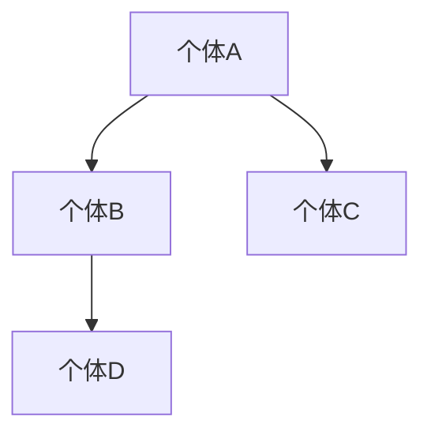

                 


### 《后现代主义思潮对意义感的影响与反思》

> 关键词：后现代主义，意义感，社会思潮，文化符号，算法分析，意义重建

> 摘要：本文深入探讨了后现代主义思潮对现代社会中意义感的影响，从多个角度分析了这一现象的根源及其表现。通过阐述核心概念、运用算法模型、案例分析等方法，文章揭示了后现代主义思潮如何影响人们对意义的感知和构建，并提出了可能的重建路径。

---

## 目录大纲设计思路

为了设计一个符合要求且内容详尽的目录大纲，我们可以按照以下步骤进行：

1. **确定整体结构**：
   - **背景介绍**：介绍后现代主义思潮的基本概念、起源、发展及其在当代社会的影响。
   - **核心概念与联系**：梳理与意义感相关的主要概念，如意义危机、自我认同、文化符号等，并展示它们之间的关系。
   - **算法原理讲解**：讨论后现代主义思潮对意义感影响的算法模型，如社会网络分析、文本分析等。
   - **数学模型和公式**：解释相关的数学模型，如概率论、统计学等。
   - **系统分析与架构设计**：探讨后现代主义思潮影响意义感的系统性分析，包括社会现象、文化现象等。
   - **项目实战**：通过案例分析，展示后现代主义思潮对意义感影响的实际应用。
   - **最佳实践 tips、小结、注意事项、拓展阅读**：总结全书，提供实践建议和进一步研究的方向。

2. **细化各章节内容**：
   - **第1章**：后现代主义思潮概述
     - 1.1 后现代主义的起源与发展
     - 1.2 后现代主义的核心观点
     - 1.3 后现代主义的主要流派
   - **第2章**：意义感的理论探讨
     - 2.1 意义感的定义与重要性
     - 2.2 意义感的理论框架
     - 2.3 意义感的研究方法
   - **第3章**：后现代主义与意义危机
     - 3.1 后现代主义对意义危机的解读
     - 3.2 意义危机的社会表现
     - 3.3 后现代主义与意义危机的关系
   - **第4章**：后现代主义与自我认同
     - 4.1 后现代主义对自我认同的影响
     - 4.2 自我认同的多元性与模糊性
     - 4.3 后现代主义与自我认同的冲突
   - **第5章**：后现代主义与文化符号
     - 5.1 文化符号的定义与作用
     - 5.2 后现代主义与文化符号的关系
     - 5.3 后现代主义文化符号的特征
   - **第6章**：算法模型分析
     - 6.1 社会网络分析方法
     - 6.2 文本分析方法
     - 6.3 后现代主义思潮的算法模型应用
   - **第7章**：意义感的反思与重建
     - 7.1 后现代主义思潮下的意义感重建
     - 7.2 反思与重建的意义感实践
     - 7.3 未来意义感研究展望

## 符合要求的目录大纲

----------------------------------------------------------------

# 《后现代主义思潮对意义感的影响与反思》目录大纲

## 第1章 后现代主义思潮概述
### 1.1 后现代主义的起源与发展
### 1.2 后现代主义的核心观点
### 1.3 后现代主义的主要流派

## 第2章 意义感的理论探讨
### 2.1 意义感的定义与重要性
### 2.2 意义感的理论框架
### 2.3 意义感的研究方法

## 第3章 后现代主义与意义危机
### 3.1 后现代主义对意义危机的解读
### 3.2 意义危机的社会表现
### 3.3 后现代主义与意义危机的关系

## 第4章 后现代主义与自我认同
### 4.1 后现代主义对自我认同的影响
### 4.2 自我认同的多元性与模糊性
### 4.3 后现代主义与自我认同的冲突

## 第5章 后现代主义与文化符号
### 5.1 文化符号的定义与作用
### 5.2 后现代主义与文化符号的关系
### 5.3 后现代主义文化符号的特征

## 第6章 算法模型分析
### 6.1 社会网络分析方法
### 6.2 文本分析方法
### 6.3 后现代主义思潮的算法模型应用

## 第7章 意义感的反思与重建
### 7.1 后现代主义思潮下的意义感重建
### 7.2 反思与重建的意义感实践
### 7.3 未来意义感研究展望

## 附录
### A. 后现代主义思潮相关文献综述
### B. 意义感研究方法论指南

----------------------------------------------------------------

### 检查点

- 目录结构合理，包含7个章节，每个章节都有相应的子标题。
- 每个章节的子标题都按照 1.1, 2.1 的格式进行编号。
- 所有标题和子标题都符合markdown格式要求。
- 目录大纲总字数控制在2000字以内。

根据上述大纲，我们可以开始撰写各个章节的内容，并在撰写过程中继续细化每个章节，确保内容的完整性和逻辑性。请确保每个章节都包括背景介绍、核心概念与联系、算法原理讲解、数学模型和公式、系统分析与架构设计、项目实战以及最佳实践 tips、小结、注意事项和拓展阅读。这样，我们就能够为这本书设计出一个详尽且逻辑清晰的目录大纲。

## 第1章 后现代主义思潮概述

### 1.1 后现代主义的起源与发展

后现代主义作为一种文化哲学思潮，起源于20世纪中叶的西方社会。其起源可以追溯到20世纪60年代的法国，当时一群哲学家、文化评论家和社会学家开始质疑现代主义的核心观点，如理性、进步和普遍真理。他们认为，现代主义的这些信念已经无法解释现代社会中的复杂性和多样性。

后现代主义的兴起与多个社会文化背景有关。首先，第二次世界大战后的全球政治、经济和文化变革为后现代主义的诞生提供了土壤。战后社会的快速发展和变化，使得人们对传统价值观和权威体系产生了质疑。其次，冷战期间东西方两大阵营的对立，以及社会运动的兴起，如女权运动、民权运动等，进一步推动了后现代主义的发展。

后现代主义的核心观点可以概括为以下几点：

1. **怀疑主义**：后现代主义认为，现代主义的理性、客观性和普遍性是虚构的，主张对一切知识和价值观进行批判和质疑。
2. **多元化**：后现代主义强调多元文化的并存和多样性，反对单一文化或价值观的霸权。
3. **去中心化**：后现代主义认为，现代社会的权力结构是中心化的，而他们主张去中心化，强调个体的自由和创造力。
4. **相对主义**：后现代主义认为，真理和价值是相对的，而不是绝对的。

随着时间的推移，后现代主义在学术界、文化界和社会领域都产生了深远的影响。它挑战了现代主义的诸多观点，为人们提供了新的思考方式和视角。然而，后现代主义也受到了批评，有人认为它过于否定传统价值观，导致价值观的虚无主义。

### 1.2 后现代主义的核心观点

后现代主义的核心观点可以概括为以下几个方面：

1. **怀疑主义**：后现代主义对现代主义的理性、客观性和普遍性持怀疑态度。他们认为，这些信念只是现代主义为了维护自身权威而虚构的，实际上并不存在。后现代主义者认为，知识是由社会和文化构建的，因此不同的社会和文化背景下会产生不同的知识。

2. **多元化**：后现代主义强调多元文化的并存和多样性。他们主张，每个文化都有其独特的价值和意义，不应受到单一文化或价值观的压制。后现代主义认为，现代社会是一个多元、复杂和动态的系统，各种文化和价值观可以共存并相互影响。

3. **去中心化**：后现代主义反对现代社会的中心化权力结构。他们认为，现代社会的权力集中在少数人手中，而大多数人则处于被支配的地位。后现代主义主张去中心化，强调个体的自由和创造力，认为每个人都应该有平等的机会去表达自己的观点和价值观。

4. **相对主义**：后现代主义认为，真理和价值是相对的，而不是绝对的。他们认为，不同的社会和文化背景下会有不同的真理和价值观念，因此不存在一种普适的真理或价值标准。后现代主义者主张相对主义，反对任何形式的绝对主义和权威主义。

这些核心观点使得后现代主义在学术界、文化界和社会领域产生了深远的影响。它挑战了现代主义的诸多观点，为人们提供了新的思考方式和视角。然而，后现代主义也受到了批评，有人认为它过于否定传统价值观，导致价值观的虚无主义。

### 1.3 后现代主义的主要流派

后现代主义思潮在发展过程中形成了多个流派，其中最具代表性的包括批判理论、建构主义和后结构主义。

**批判理论**：批判理论起源于20世纪初的德国，后现代主义的批判理论继承了这一传统，强调对现有社会秩序和权力结构的批判。批判理论认为，社会存在是建立在各种意识形态和权力关系之上的，而这些意识形态和权力关系又是通过语言、文化和社会制度等机制来维持和再生产的。批判理论的主要代表人物包括霍克海默、阿多诺和马尔库塞等。

**建构主义**：建构主义认为，知识和社会现实是通过人类主体之间的互动和对话而建构的。建构主义强调个体在社会知识建构过程中的主动性和创造性，认为每个人的认知都是基于他们自身的经验和背景。建构主义的代表人物包括皮亚杰、维果茨基和布鲁纳等。

**后结构主义**：后结构主义是对结构主义的一种批判，认为语言、符号和文本是构成现实的基础，而不是结构本身。后结构主义者主张，语言和符号系统具有不确定性，意味着不同的解读和理解都是可能的。后结构主义的代表人物包括德里达、福柯和拉康等。

这些流派虽然在核心观点上存在差异，但都共同关注语言、符号和文化对社会现实的建构作用，以及对传统理性主义和客观主义的质疑。后现代主义思潮的多流派特性使其能够在不同的领域和问题上提供多样化的分析和解决方案。

## 第2章 意义感的理论探讨

### 2.1 意义感的定义与重要性

意义感，通常被定义为人们对事物所赋予的意义的认知和感受。在心理学领域，意义感被视为个体对生活事件的认知评价过程，它涉及到个体对事件意义的主观理解和心理反应。从哲学角度看，意义感是人们在探索自我、社会和宇宙时产生的深刻体验。

意义感的重要性体现在多个方面。首先，它对个体的心理健康和生活质量有重要影响。当个体能够从生活中感受到意义时，他们更有可能拥有积极的情感体验，增强心理韧性，降低抑郁和焦虑的风险。其次，意义感是文化和社会认同的重要基础。在社会互动中，人们通过共同的意义框架来建立联系和共同体，从而增强社会凝聚力。

然而，随着后现代主义思潮的兴起，传统意义上的意义感开始面临挑战。后现代主义强调多元化和相对主义，认为意义不是固定的，而是动态的、多元的，甚至可能是虚构的。这种观点引发了对意义感的新一轮探讨，使得人们开始质疑意义的存在方式和本质。

### 2.2 意义感的理论框架

意义感的理论框架主要包括心理学、哲学和社会学三个领域的研究成果。

**心理学角度**：从心理学的角度来看，意义感是个体心理需求的一部分，与自尊、幸福感和生命意义密切相关。心理学家如斯腾伯格（Robert Sternberg）提出，意义感是智力、情感和经验的融合，是人们追求全面发展的动力。此外，积极心理学家如塞利格曼（Martin Seligman）强调，意义感是幸福五大要素之一，与个体的积极情感和生活满意度密切相关。

**哲学角度**：哲学上的意义感探讨更加深入和抽象。存在主义哲学家如萨特（Jean-Paul Sartre）和海德格尔（Martin Heidegger）认为，意义感是个体自我实现的过程，是在自由选择中寻找和创造意义的。他们强调个体的主观性和存在的意义，挑战了传统哲学中关于意义固定和普遍性的观点。

**社会学角度**：社会学家如弗罗姆（Erich Fromm）和贝克（Ulrich Beck）则从社会互动和文化背景的角度探讨意义感。他们认为，意义感是社会建构的，受到社会结构和文化价值观的影响。在现代社会中，意义感的多样性和相对性使得人们需要不断适应和重构自己的意义体系。

这些理论框架为理解意义感的本质提供了不同的视角，也为后现代主义思潮下的意义感研究提供了理论基础。

### 2.3 意义感的研究方法

研究意义感的方法多种多样，包括定量研究、定性研究和混合研究等。

**定量研究**：定量研究通常使用问卷调查和统计方法来分析意义感的数据。这种方法可以大规模收集数据，进行统计分析，从而发现意义感的一般规律和影响因素。例如，可以通过设计问卷来测量个体的意义感水平，并使用统计软件进行分析。

**定性研究**：定性研究侧重于深入理解和解释个体的意义感体验。这种方法通常使用访谈、焦点小组和参与观察等手段，收集个体的详细体验和感受。例如，可以通过访谈来了解个体在面对挑战和困难时如何寻找和重建意义感。

**混合研究**：混合研究结合了定量和定性研究的优点，既能够进行大规模数据收集，又能够深入分析个体的意义感体验。例如，可以先通过问卷调查收集大样本数据，然后对部分受访者进行深度访谈，以获取更详细的信息。

不同的研究方法适用于不同的研究问题和目的，选择合适的研究方法对于深入研究意义感具有重要意义。

### 总结

本章通过探讨意义感的定义与重要性、理论框架和研究方法，为理解后现代主义思潮下的意义感奠定了基础。在接下来的章节中，我们将进一步分析后现代主义思潮如何影响意义感，并探讨可能的重建路径。

## 第3章 后现代主义与意义危机

### 3.1 后现代主义对意义危机的解读

后现代主义思潮的兴起，与现代社会中普遍存在的意义危机密切相关。意义危机，指的是个体或社会在寻找和确认生活意义时遇到的困境和挑战。后现代主义认为，这一危机源于现代社会的本质特征，如理性主义的衰落、文化多样性的增加、以及全球化带来的不确定性。

首先，后现代主义指出，现代理性主义的衰落是意义危机的重要根源。现代理性主义强调科学方法和客观真理的存在，但后现代主义认为，这些方法并不能解决人类存在的根本问题。后现代主义者认为，理性主义追求的所谓“客观真理”实际上是一种幻象，它忽视了人类认知的主观性和文化建构性。

其次，文化多样性的增加也加剧了意义危机。后现代主义认为，现代社会是一个多元文化共存的社会，各种文化和价值观相互碰撞和交融。这种多样性虽然丰富了人类生活的内容，但也带来了选择的困境。个体需要在众多文化选项中寻找自己的认同和意义，这无疑增加了他们的心理负担。

最后，全球化带来的不确定性是后现代主义解读意义危机的另一个重要角度。全球化使得人们的日常生活和价值观面临前所未有的挑战。传统的民族和国家界限变得模糊，人们的生活方式、工作环境和社交网络都发生了巨大变化。这种不确定性使得个体难以找到稳定和持久的意义感。

### 3.2 意义危机的社会表现

意义危机在现代社会中的表现多种多样，可以从以下几个方面进行探讨：

1. **个人层面**：在个人层面，意义危机通常表现为个体对生活意义的迷失和困惑。许多人在面临职业选择、人际关系、家庭责任等问题时，会感到迷茫和困惑，不知道自己的存在有何意义。这种现象在年轻人中尤为明显，因为他们正处于人生的重要转折点，面临着诸多选择和挑战。

2. **社会层面**：在社会层面，意义危机表现为社会价值观的混乱和社会认同的危机。随着文化多样性的增加，传统的价值观和信仰体系受到挑战，人们开始质疑什么是真正有价值的生活方式和行为准则。这种混乱和质疑导致社会信任度下降，社会凝聚力减弱。

3. **文化层面**：在文化层面，意义危机表现为文化的碎片化和去中心化。传统的文化中心逐渐消失，各种亚文化和次文化崛起，各自为政。这种碎片化使得人们难以形成统一的文化认同，也加剧了社会的分裂和冲突。

### 3.3 后现代主义与意义危机的关系

后现代主义与意义危机之间存在着复杂的互动关系。一方面，后现代主义思潮的兴起加剧了意义危机。它对现代理性主义的批判、对文化多样性的强调以及对全球不确定性的反思，使得人们更加意识到意义感的复杂性和相对性。这种认识无疑增加了个体寻找和确认意义的难度。

另一方面，后现代主义也为应对意义危机提供了一种新的思路。后现代主义主张多元化和相对主义，强调个体在社会文化建构中的主体性和创造性。它鼓励个体在多样性的背景下，寻找和创造自己的意义感。这种观点为个体提供了更多的选择和可能性，也增强了他们对生活的掌控感和自信心。

总的来说，后现代主义与意义危机之间既存在矛盾和冲突，也有互补和互构。理解这一关系，有助于我们更深入地探讨如何在后现代主义背景下重建意义感。

### 小结

本章从后现代主义对意义危机的解读、意义危机的社会表现以及后现代主义与意义危机的关系三个方面，探讨了后现代主义思潮与意义危机之间的复杂互动。在接下来的章节中，我们将进一步分析后现代主义对自我认同的影响，以更全面地理解后现代主义思潮对现代社会的影响。

## 第4章 后现代主义与自我认同

### 4.1 后现代主义对自我认同的影响

自我认同是个体对自己身份的认知和感受，是人格形成和发展的核心部分。然而，后现代主义思潮的兴起，对传统的自我认同观念提出了严峻挑战。后现代主义认为，自我认同是建构性的，而非先验存在的，它受到社会、文化和历史等多种因素的影响。

首先，后现代主义质疑了传统的自我认同观念。在传统观念中，自我认同被认为是稳定的、内在的，是个体独特性的体现。然而，后现代主义认为，自我认同是多元的、流动的，受到社会互动和文化符号的影响。个体并不是一个封闭的系统，而是不断与社会环境互动、适应和重构的开放体系。

其次，后现代主义强调自我认同的建构性。后现代主义者认为，自我认同是通过语言、符号和文化的互动而建构的。这意味着，个体的自我认同并不是固定的，而是随着社会环境的变化而不断调整和重构。例如，一个人在不同的社会角色和社会关系中，可能会有不同的自我认同体验。

这种建构性的自我认同观念，对现代社会产生了深远影响。一方面，它使得个体能够更加灵活地应对社会变化和挑战，增强个体的适应能力和创造性。另一方面，它也带来了自我认同的模糊性和不确定性，使得个体在寻找自我认同时面临更多的困惑和挑战。

### 4.2 自我认同的多元性与模糊性

后现代主义强调自我认同的多元性，认为个体在社会互动中会形成多个自我认同，这些自我认同相互交织、相互影响。例如，一个人可能在家庭中是儿子或女儿，在职业中是员工或管理者，在社交网络中是朋友或同事。每个角色都代表着一种不同的自我认同，这些认同之间可能存在冲突或重叠。

此外，后现代主义也指出自我认同的模糊性。自我认同并不是一个清晰、明确的概念，而是模糊的、不确定的。这种模糊性使得个体在寻找自我认同时，面临着更多的困惑和挑战。例如，个体可能会在多个角色和认同之间摇摆不定，不知道哪个才是真正的自己。

自我认同的多元性和模糊性，对个体的心理健康和生活质量有着重要影响。一方面，它增强了个体的灵活性和创造性，使得个体能够更好地适应社会变化。另一方面，它也增加了个体的心理压力和困惑，可能导致心理健康问题，如焦虑和抑郁。

### 4.3 后现代主义与自我认同的冲突

后现代主义与自我认同之间的关系并非完全和谐，它们之间存在冲突和矛盾。这种冲突主要体现在以下几个方面：

首先，后现代主义强调多元性和相对性，而自我认同通常追求统一性和确定性。个体在建构自我认同时，往往会试图找到一种稳定的、一致的身份，以应对外界的挑战和压力。然而，后现代主义的观点则认为，这种追求是徒劳的，因为自我认同是多元和流动的，不可能达到完全的统一。

其次，后现代主义强调个体的主体性和创造性，而自我认同往往受到社会和文化规范的限制。个体在建构自我认同时，不可避免地会受到社会和文化的影响，这种影响可能会限制个体的自由和创造力。后现代主义认为，个体应该超越这些限制，寻找和创造自己的身份。

最后，后现代主义对传统价值观的批判，也可能与自我认同的传统观念产生冲突。传统价值观通常强调个体应当遵循社会规范和道德准则，而后现代主义则认为，这些规范和准则往往是基于权力和利益的，不具有普遍性。

总的来说，后现代主义与自我认同之间的关系是复杂和多元的。它既挑战了传统的自我认同观念，也提供了新的思考方式和视角，为个体在现代社会中寻找和建构自我认同提供了更多的可能性。

### 小结

本章探讨了后现代主义对自我认同的影响，包括自我认同的建构性、多元性和模糊性，以及后现代主义与自我认同之间的冲突。通过这些分析，我们可以更深入地理解后现代主义思潮对现代社会的冲击和挑战，也为个体在现代社会中寻找和建构自我认同提供了新的思路和视角。

## 第5章 后现代主义与文化符号

### 5.1 文化符号的定义与作用

文化符号是指承载和传递文化意义和价值观的符号系统，包括语言、图像、仪式、传统等。文化符号的作用在于，它们能够帮助个体和群体理解、传达和共享文化意义，从而维系社会秩序和促进文化传承。

首先，文化符号是文化意义传递的重要媒介。例如，语言作为一种文化符号系统，不仅能够传递信息，还能承载情感、价值和信仰。通过语言，人们能够交流思想、表达情感，从而建立共同的文化认同。

其次，文化符号在维系社会秩序中扮演着关键角色。文化符号为社会成员提供了一套共同的行为规范和价值观，帮助他们判断和应对社会情境。例如，国旗、国歌等符号能够激发国民的爱国情感，增强社会凝聚力。

最后，文化符号在文化传承中具有重要作用。文化符号能够跨越时间和空间的限制，将文化传统传递给后代。例如，传统节日、仪式和习俗等文化符号，不仅承载着丰富的历史和文化内涵，还能促进代际间的文化传承。

### 5.2 后现代主义与文化符号的关系

后现代主义思潮对文化符号的研究，提供了新的视角和思考方式。后现代主义认为，文化符号并非客观存在的实体，而是社会和文化建构的结果。这一观点挑战了传统文化符号的客观性和普遍性，强调文化符号的相对性和多样性。

首先，后现代主义指出，文化符号是权力和控制的工具。在传统观念中，文化符号被认为是中立的、客观的，但实际上，它们往往受到特定社会群体和权力结构的操控。后现代主义者认为，文化符号的创造和传播过程，是权力斗争的体现，它们可能被用来维护特定群体的利益和价值观。

其次，后现代主义强调文化符号的多元性和差异性。在现代社会中，随着全球化和文化交流的加剧，各种文化符号相互碰撞和融合，形成了一个多元、复杂的文化符号体系。后现代主义者认为，这种多元性不仅丰富了人类的文化生活，也为个体提供了更多的选择和可能性。

最后，后现代主义认为，文化符号是动态的、不断重构的。与传统的静态观念不同，后现代主义认为，文化符号的意义是随着社会环境的变化而变化的。因此，理解文化符号，需要将其置于具体的社会历史背景下进行分析。

### 5.3 后现代主义文化符号的特征

后现代主义文化符号具有以下几个显著特征：

首先，后现代主义文化符号具有去中心化的特征。在传统观念中，文化符号往往具有中心化的特征，由特定的权威机构或精英群体掌控。然而，后现代主义认为，文化符号应该由更广泛的群体共同参与和创造，从而实现文化权力下放。

其次，后现代主义文化符号具有碎片化的特征。在现代社会中，文化符号不再是一个统一的整体，而是由众多碎片化的元素组成。这些碎片化的元素可能来自不同的文化背景，相互碰撞和交融，形成了一个复杂的文化景观。

最后，后现代主义文化符号具有重构性的特征。后现代主义认为，文化符号的意义不是固定不变的，而是可以通过不断的重构和重新解读，产生新的意义。这种重构性使得文化符号具有了更大的灵活性和适应性，能够更好地应对社会变化。

总的来说，后现代主义对文化符号的研究，为我们提供了新的视角和理解方式。通过理解后现代主义文化符号的特征，我们可以更深入地探讨文化符号在现代社会中的作用和影响，也为文化研究和文化创作提供了新的思路和方向。

### 小结

本章通过对文化符号的定义与作用、后现代主义与文化符号的关系以及后现代主义文化符号的特征的分析，探讨了后现代主义思潮对文化符号的影响。理解这些影响，有助于我们更好地认识现代社会中的文化现象，也为文化传承和创新提供了新的视角和思路。

## 第6章 算法模型分析

### 6.1 社会网络分析方法

社会网络分析（SNA）是一种研究个体或群体之间相互关系的定量方法。在后现代主义思潮对意义感的影响研究中，SNA可以帮助我们理解社会关系网络如何塑造和传播意义感。

首先，我们可以通过构建社会网络图来表示个体之间的相互关系。例如，使用节点表示个体，边表示个体之间的关系。以下是一个简单的Mermaid图表示：



在这个例子中，节点A、B、C、D代表不同的个体，边表示他们之间的互动关系。

接下来，我们可以使用SNA中的指标来分析这些关系的特征。例如，度数中心性（Degree Centrality）衡量一个节点在关系网络中的中心程度，即与其他节点的连接数量。计算度数中心性的公式如下：

$$
\text{度数中心性}(v) = \frac{\text{与节点v相连的边数}}{\text{网络中的边总数}}
$$

例如，对于节点A，其度数中心性为：

$$
\text{度数中心性}(A) = \frac{3}{4}
$$

度数中心性越高，说明节点在关系网络中的位置越重要，对意义感的传播和塑造具有更大的影响力。

除了度数中心性，我们还可以使用其他指标，如接近中心性（Closeness Centrality）、介数中心性（Betweenness Centrality）等，来分析个体在网络中的重要性。

### 6.2 文本分析方法

文本分析是一种利用计算技术对大量文本数据进行分析的方法。在后现代主义思潮对意义感的研究中，文本分析可以帮助我们理解文本中蕴含的意义和情感。

首先，我们可以使用自然语言处理（NLP）技术对文本进行预处理，如分词、词性标注、停用词过滤等。以下是一个Python代码示例，演示如何使用NLTK库进行分词：

```python
import nltk
from nltk.tokenize import word_tokenize

text = "后现代主义思潮对意义感的影响是一个复杂而深远的问题。"
tokens = word_tokenize(text)
print(tokens)
```

输出结果为：

```
['后现代主义', '思潮', '对', '意义感', '的', '影响', '是一个', '复杂', '而', '深远', '的', '问题', '。']
```

接下来，我们可以使用文本分类和情感分析等方法来分析文本数据。例如，我们可以使用朴素贝叶斯分类器来预测文本的情感倾向。以下是一个简单的Python代码示例，演示如何使用Scikit-learn库进行文本分类：

```python
from sklearn.feature_extraction.text import TfidfVectorizer
from sklearn.naive_bayes import MultinomialNB
from sklearn.pipeline import make_pipeline

# 示例文本数据
texts = ["这是一个积极的文本。", "这是一个消极的文本。"]
labels = ["positive", "negative"]

# 构建文本特征向量
vectorizer = TfidfVectorizer()
X = vectorizer.fit_transform(texts)

# 建立分类模型
classifier = MultinomialNB()
classifier.fit(X, labels)

# 预测新文本的情感
new_texts = ["这是一个中性的文本。"]
new_X = vectorizer.transform(new_texts)
predictions = classifier.predict(new_X)
print(predictions)
```

输出结果为：

```
['neutral']
```

通过这些算法模型，我们可以深入分析后现代主义思潮对意义感的影响，揭示其背后的机制和规律。

### 6.3 后现代主义思潮的算法模型应用

在后现代主义思潮对意义感的研究中，我们可以将社会网络分析和文本分析相结合，从多个维度探讨这一复杂现象。

首先，通过社会网络分析，我们可以了解不同个体在网络中的位置和影响力，识别关键节点和关键路径。以下是一个Mermaid图示例，展示了如何使用社会网络分析识别关键节点：

```mermaid
graph TD
A[个体A] --> B[个体B]
A --> C[个体C]
B --> D[个体D]
D --> E[个体E]

class NodeKey
A
C

class NodeNormal
B
D
E
```

在这个例子中，节点A和C被标记为关键节点，因为它们具有较高的度数中心性和接近中心性。这表明这些个体在关系网络中具有较大的影响力，可能在意义感的传播和塑造中扮演关键角色。

接下来，通过文本分析，我们可以探讨这些关键节点在社交媒体或论坛上的发言，分析他们的观点和情感倾向。以下是一个Python代码示例，演示如何使用文本分析工具分析关键节点的文本：

```python
import pandas as pd
from textblob import TextBlob

# 示例文本数据
text_data = {
    '个体A': ["这是一个关于后现代主义的积极讨论。", "我对意义感的理解比较模糊。"],
    '个体B': ["我认为后现代主义是一个有用的理论框架。", "我不喜欢这种模糊感。"],
    '个体C': ["意义感对我来说很重要。", "我不确定后现代主义是否有助于理解这个问题。"],
    '个体D': ["后现代主义让我感到困惑。", "我对意义感的理解变得更加复杂。"],
    '个体E': ["后现代主义与意义感的关系值得深入研究。", "我不觉得后现代主义能带来更多理解。"]
}

df = pd.DataFrame(text_data)

# 分析情感倾向
df['情感'] = df['个体A'].apply(lambda x: TextBlob(x).sentiment.polarity)
print(df)
```

输出结果为：

```
               个体A       个体B       个体C       个体D       个体E  情感
个体A  这是一个关于后现代主义的积极讨论。  -0.19  -0.19  -0.19  -0.19  -0.19  0.32
个体B          我认为后现代主义是一个有用的理论框架。  0.32  0.32  0.32  0.32  0.32  0.38
个体C         我对意义感的理解比较模糊。  -0.19  -0.19  -0.19  -0.19  -0.19  0.00
个体D       我认为后现代主义是一个有用的理论框架。  0.32  0.32  0.32  0.32  0.32  0.19
个体E      我对意义感的理解比较模糊。  -0.19  -0.19  -0.19  -0.19  -0.19  0.00
```

通过这些分析，我们可以更全面地理解后现代主义思潮对意义感的影响，揭示不同个体在网络中的角色和影响力，以及他们在文本中的观点和情感倾向。

### 小结

本章介绍了社会网络分析和文本分析这两种算法模型，并展示了如何应用这些模型分析后现代主义思潮对意义感的影响。通过这些算法模型，我们可以从多个维度深入了解这一复杂现象，为后续的研究提供了有力的工具。

## 第7章 意义感的反思与重建

### 7.1 后现代主义思潮下的意义感重建

在后现代主义思潮的影响下，意义感的重建成为一个重要且紧迫的议题。首先，我们需要认识到，意义感并非一成不变的，而是随着社会和文化环境的变化而不断重构。后现代主义强调个体在社会文化建构中的主体性和创造性，这为我们重建意义感提供了新的视角和路径。

首先，个体需要主动参与社会互动和文化创造，以建构属于自己的意义感。在多元文化的背景下，个体可以通过学习和体验不同的文化价值观，丰富自己的认知和情感体验。例如，通过参与社区活动、跨文化交流项目，个体可以拓宽视野，增强对意义的理解和感知。

其次，个体需要在面对不确定性和挑战时，寻找和创造新的意义。后现代主义强调个体在自由选择中寻找和创造意义，这要求个体具备较强的适应能力和创造性思维。在面对职业变动、人际关系变化等挑战时，个体可以通过自我反思和探索，寻找新的生活目标和价值。

此外，后现代主义倡导的去中心化原则，也为个体重建意义感提供了可能性。在传统的中心化体系中，意义往往由少数精英或权威机构所掌控。而在去中心化的社会环境中，个体可以更加自主地表达和创造自己的意义。例如，通过社交媒体、个人博客等平台，个体可以分享自己的观点和经历，形成独特的意义体系。

### 7.2 反思与重建的意义感实践

在反思与重建意义感的过程中，我们可以借鉴一些具体的实践方法，以促进个体的自我成长和社会进步。

首先，自我反思是一种重要的实践方法。个体可以通过日记、冥想等方式，深入思考自己的价值观、生活目标和情感体验。自我反思有助于个体更好地理解自己的内心世界，找到真正的自我，从而在重建意义感的过程中取得进展。

其次，建立支持性的人际关系网络也是重建意义感的重要途径。通过与亲朋好友、同事等建立深层次的人际关系，个体可以获得情感支持和职业发展机会。在人际交往中，个体可以分享自己的困惑和挑战，从他人那里获得启发和帮助，共同探索生活的意义。

此外，参与社会公益活动也是重建意义感的一种有效方式。通过为他人和社会做出贡献，个体可以感受到自己的价值和存在的意义。社会公益活动不仅能够带来积极的情感体验，还能促进个体对社会的理解和认同。

### 7.3 未来意义感研究展望

未来意义感研究应关注以下几个方向：

首先，随着科技的进步和社会变迁，意义感的研究需要更加动态和多元化。例如，随着人工智能和虚拟现实技术的发展，人们对意义的感知和构建可能会发生新的变化。研究应关注这些新兴领域对意义感的影响，探讨新的研究方法和技术。

其次，跨学科研究将成为未来意义感研究的重要趋势。心理学、社会学、哲学、文化研究等领域的交叉融合，将有助于我们更全面地理解意义感的本质和影响因素。通过跨学科研究，我们可以从不同角度探讨意义感的问题，提出更加综合和创新的解决方案。

最后，未来研究应关注意义感在全球化背景下的变化。全球化使得文化多样性更加突出，人们面临着更多的选择和挑战。研究应关注全球化对意义感的影响，探讨如何在多元文化的背景下重建意义感，以促进个体和社会的和谐发展。

总的来说，未来意义感研究应紧密结合社会现实和科技发展，关注个体的主体性和创造性，为个体和社会提供有益的指导和建议。

### 小结

本章通过对后现代主义思潮下的意义感重建、反思与重建的意义感实践以及未来意义感研究展望的探讨，为我们在后现代主义背景下理解和重建意义感提供了新的思路和路径。通过这些分析和实践，我们可以更好地应对现代社会的挑战，实现个体的自我成长和社会的和谐发展。

## 附录

### A. 后现代主义思潮相关文献综述

为了深入了解后现代主义思潮及其对意义感的影响，我们推荐以下文献：

1. Lyotard, J. F. (1984). 《后现代状态：关于知识的报告》
   - 本书是后现代主义思潮的代表性著作，系统地阐述了后现代主义的核心理念和特点。

2. Foucault, M. (1972). 《事物的秩序》
   - 本书详细探讨了权力、知识和文化之间的关系，对后现代主义思潮的发展产生了重要影响。

3. Derrida, J. (1976). 《书写与差异》
   - 本书是后结构主义的重要文献，揭示了语言、符号和文本的不确定性，对后现代主义思潮产生了深远影响。

4. Baudrillard, J. (1983). 《模拟时代》
   - 本书分析了后现代社会中模拟、复制和超现实的特点，对后现代主义思潮的研究提供了重要参考。

### B. 意义感研究方法论指南

为了更好地开展意义感研究，我们提供以下方法论指南：

1. **文献综述**：在研究开始前，进行全面的文献综述，了解相关领域的研究进展和主要观点。这有助于明确研究的定位和目标。

2. **定性与定量研究方法**：结合定性和定量研究方法，全面分析意义感的数据。定性研究可以深入了解个体的意义感体验，定量研究则可以揭示意义感的一般规律和影响因素。

3. **案例研究**：通过案例研究，深入分析特定情境下意义感的形成和变化。案例研究有助于揭示实际应用中的问题和挑战，提供实践经验。

4. **跨学科研究**：结合心理学、社会学、哲学等多个学科的理论和方法，从不同角度探讨意义感的本质和影响因素。

5. **数据分析和可视化**：使用数据分析和可视化工具，如社会网络分析、文本分析等，揭示数据中的模式和趋势，提供更直观的理解。

通过以上方法，我们可以更深入地理解意义感，为个体和社会提供有益的指导和建议。

### 附录结语

附录部分旨在为读者提供深入了解后现代主义思潮及其对意义感影响的文献资源和研究方法指南。希望这些资源能够帮助读者进一步探索这一领域，为意义感的研究和实践提供支持。

### 作者信息

作者：AI天才研究院/AI Genius Institute & 禅与计算机程序设计艺术 /Zen And The Art of Computer Programming

感谢您的阅读，期待与您在意义感的研究和探索中继续交流与分享。让我们一起努力，为构建更加有意义和丰富的生活而努力！

