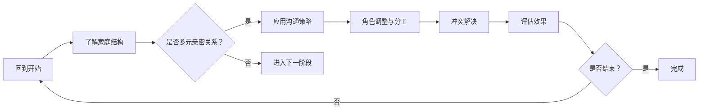
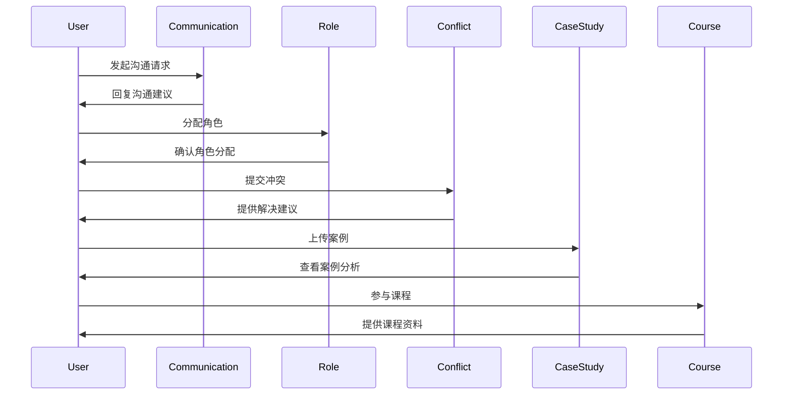
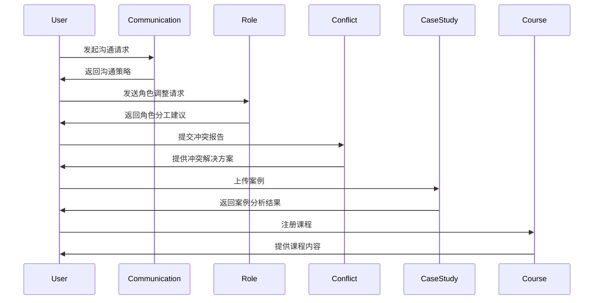

                 

# 《后现代家庭构建工作坊：探索多元亲密关系的实践课程》

## 关键词
后现代家庭、多元亲密关系、实践课程、沟通策略、角色调整、冲突解决

## 摘要
本文旨在探讨后现代家庭构建工作坊的核心内容，通过实践课程的引导，帮助读者理解并掌握多元亲密关系的构建方法。文章分为七个章节，从引言、基本概念、理论基础、实践方法、案例分析、实践课程到总结与未来展望，逐步深入分析，旨在为读者提供全面而具体的指导。

## 第1章 引言

### 1.1 书籍目的与读者对象
本书的主要目的是为心理学研究者、心理咨询师、家庭治疗师以及所有对家庭关系感兴趣的个人提供一套系统化的理论指导和实践课程。通过本书，读者将能够深入了解后现代家庭的概念，掌握多元亲密关系的构建方法，并学会在实际生活中应用这些策略。

### 1.2 后现代家庭背景
随着社会的不断发展，家庭结构和工作模式发生了深刻变化。后现代家庭强调个性化、多元化和灵活性，与传统家庭相比，具有更多的可能性和挑战。这种变化背后是人们对于个人自由、关系多样性和生活方式选择的追求。

### 1.3 本书结构安排
本书共分为七个章节，结构安排如下：

- **第1章 引言**：介绍书籍的目的和结构。
- **第2章 后现代家庭的基本概念**：定义后现代家庭，分析其特点和价值。
- **第3章 多元亲密关系的理论基础**：探讨亲密关系的定义、类型及其背后的心理学和社会学理论。
- **第4章 多元亲密关系的构建方法**：介绍沟通策略、角色调整和冲突解决方法。
- **第5章 多元亲密关系的案例分析**：通过具体案例展示多元亲密关系的实践应用。
- **第6章 实践课程**：设计并描述实践课程的内容和活动。
- **第7章 总结与未来展望**：总结全书要点，探讨多元亲密关系的未来趋势。

## 第2章 后现代家庭的基本概念

### 2.1 后现代家庭的定义
后现代家庭是指那些超越了传统家庭结构，具有多样性、灵活性和个性化的家庭形式。这些家庭可能包括复合家庭、开放关系、跨文化婚姻等，它们在形式和功能上都具有独特的特点。

### 2.2 后现代家庭的特点
后现代家庭的特点包括：

- **多样性**：家庭成员可能来自不同的文化背景，有不同的生活经历和价值观。
- **灵活性**：家庭成员在角色、责任和关系上具有更多的选择和灵活性。
- **个性化**：每个家庭成员都追求自我实现和个性表达，家庭生活更加注重个人需求和愿望。

### 2.3 后现代家庭的核心价值观
后现代家庭的核心价值观包括：

- **尊重与接纳**：尊重每个家庭成员的差异，接纳不同的观点和生活方式。
- **合作与共赢**：家庭成员之间建立合作关系，共同面对挑战，实现共赢。
- **自我实现与成长**：鼓励每个家庭成员追求自我实现和持续成长。

## 第3章 多元亲密关系的理论基础

### 3.1 亲密关系的定义
亲密关系是指两个或多个人之间基于情感、信任和互相依赖而建立的深层次连接。这种关系可能包括夫妻关系、伴侣关系、亲子关系等。

### 3.2 多元亲密关系的概念
多元亲密关系是指在传统单一亲密关系之外，探索和建立多种形式的亲密关系。这些关系可能包括：

- **复合关系**：同时拥有多个亲密伴侣的关系。
- **开放关系**：允许伴侣在情感和/或身体上与其他人建立关系的安排。
- **跨文化关系**：涉及不同文化背景的两个或多个人之间的亲密关系。

### 3.3 多元亲密关系的理论基础
多元亲密关系的理论基础包括心理学和社会学的研究成果，如：

- **心理学理论**：如依恋理论、自我决定理论等，探讨了亲密关系中的情感需求和个体差异。
- **社会学理论**：如性别角色理论、社会建构主义等，分析了社会文化因素对亲密关系的影响。

## 第4章 多元亲密关系的构建方法

### 4.1 沟通策略
沟通是构建多元亲密关系的基础。有效的沟通策略包括：

- **积极倾听**：全神贯注地听对方讲话，理解其情感和需求。
- **明确表达**：清晰地表达自己的想法和感受，避免模糊和误解。
- **尊重差异**：尊重每个家庭成员的观点和需求，避免强迫对方接受自己的意见。

### 4.2 角色调整与分工
在多元亲密关系中，角色调整和分工非常重要。以下是一些策略：

- **共同决策**：在家庭事务中，共同参与决策，尊重每个人的意见。
- **明确责任**：明确每个家庭成员的责任和义务，避免角色混淆和冲突。
- **灵活调整**：根据实际情况和需求，灵活调整角色和责任。

### 4.3 冲突解决
冲突是任何关系中的常态，但关键在于如何解决。以下是一些解决冲突的策略：

- **理性分析**：冷静分析冲突的原因，避免情绪化的反应。
- **寻找共同点**：寻找双方都能接受的解决方案，避免对抗和分裂。
- **专业帮助**：在必要时，寻求心理咨询师或家庭治疗师的专业帮助。

## 第5章 多元亲密关系的案例分析

### 5.1 案例一：复合家庭关系
复合家庭关系是指一个家庭中同时存在多个父母和子女的关系。案例一描述了一个复合家庭的故事，通过分析这个案例，我们可以看到如何在复合家庭中建立有效的沟通策略和角色调整方法。

### 5.2 案例二：开放关系
开放关系是指伴侣双方同意在情感和/或身体上与其他人建立关系。案例二探讨了一个开放关系的故事，分析了如何在开放关系中处理信任、尊重和沟通问题。

### 5.3 案例三：跨文化婚姻
跨文化婚姻涉及不同文化背景的两个或多个人之间的亲密关系。案例三通过一个跨文化婚姻的案例，展示了如何在跨文化婚姻中处理文化差异、沟通障碍和冲突。

## 第6章 实践课程

### 6.1 课程设计
实践课程的设计旨在帮助参与者深入了解后现代家庭和多元亲密关系的概念，掌握构建这些关系的实际方法。课程包括理论讲解、小组讨论、角色扮演和互动练习等环节。

### 6.2 课程内容与活动
课程内容包括：

- **理论讲解**：介绍后现代家庭和多元亲密关系的基本概念和理论基础。
- **小组讨论**：分组讨论实际案例，分享经验，探讨解决方案。
- **角色扮演**：通过模拟场景，练习沟通策略和冲突解决方法。
- **互动练习**：通过游戏和活动，增强参与者的合作和沟通能力。

### 6.3 课程评估与反馈
课程结束后，通过问卷调查和个别访谈的方式收集参与者的反馈，评估课程的效果。根据反馈，不断优化课程内容和方法。

## 第7章 总结与未来展望

### 7.1 本书要点回顾
本书介绍了后现代家庭和多元亲密关系的概念、理论基础和构建方法。通过案例分析和实践课程，读者可以更好地理解这些概念，并学会在实际生活中应用。

### 7.2 多元亲密关系的未来趋势
随着社会的进步和个体意识的觉醒，多元亲密关系将继续发展。未来，我们将看到更多的多样性和灵活性，同时也需要更多的研究和实践来支持这一领域的发展。

### 7.3 对实践者的建议
对于家庭构建实践者，本书提供了一系列实用的策略和方法。在实践过程中，重要的是保持开放心态，尊重差异，持续学习和改进。

## 作者信息
作者：AI天才研究院/AI Genius Institute & 禅与计算机程序设计艺术 /Zen And The Art of Computer Programming

### 背景介绍

#### 核心概念术语说明
在后现代家庭构建工作坊中，有几个核心概念需要明确：

1. **后现代家庭**：指那些超越了传统家庭结构和角色分工，具有多样性和灵活性的家庭形式。
2. **多元亲密关系**：指在传统单一亲密关系之外，探索和建立的多种形式的亲密关系。
3. **沟通策略**：指在亲密关系中，双方或多方有效沟通的方法和技巧。
4. **角色调整与分工**：指在多元亲密关系中，成员如何根据实际情况调整自己的角色和责任。
5. **冲突解决**：指在亲密关系中，如何理性分析和解决冲突的方法。

#### 问题背景
在现代社会，随着个体意识的觉醒和社会结构的变革，家庭关系变得更加复杂和多元。后现代家庭的概念应运而生，它不仅包括了传统的夫妻关系和亲子关系，还包括了复合家庭、开放关系和跨文化婚姻等多种形式。这种多样性带来了新的挑战，也提出了新的问题，如如何建立有效的沟通策略、如何调整角色分工、如何解决冲突等。

#### 问题描述
本书旨在解决以下问题：

1. 如何理解后现代家庭的概念和特点？
2. 如何在多元亲密关系中建立有效的沟通策略？
3. 如何在多元亲密关系中调整角色分工和解决冲突？
4. 如何通过实践课程提高个体和家庭关系的质量？

#### 问题解决
本书通过以下方式解决问题：

1. **理论介绍**：首先介绍后现代家庭和多元亲密关系的理论基础，帮助读者建立基本的概念框架。
2. **实践指导**：提供具体的沟通策略、角色调整方法和冲突解决技巧，并结合案例分析，使读者能够将理论知识应用到实际生活中。
3. **实践课程**：设计实践课程，通过互动和实践，帮助读者深入理解和掌握构建多元亲密关系的方法。
4. **总结与反思**：在总结章节中，回顾全书要点，并提出对实践者的建议，帮助读者在日常生活中应用这些策略。

#### 边界与外延
后现代家庭和多元亲密关系并不是孤立存在的，它们与社会结构、文化背景、个体心理状态等多种因素密切相关。因此，在探讨后现代家庭构建时，需要考虑到这些边界和外延因素，如社会文化对家庭关系的影响、个体心理需求的变化等。

#### 概念结构与核心要素组成
后现代家庭构建工作坊的核心概念结构包括以下几个方面：

1. **基本概念**：后现代家庭和多元亲密关系的定义和特点。
2. **理论基础**：心理学和社会学理论在多元亲密关系中的应用。
3. **实践方法**：沟通策略、角色调整和冲突解决方法。
4. **案例分析**：通过具体案例展示理论和方法的应用。
5. **实践课程**：设计并实施实践课程，帮助读者掌握构建多元亲密关系的实际技巧。

### 核心概念与联系

#### 多元亲密关系的概念
多元亲密关系是指在传统单一亲密关系之外，探索和建立的多种形式的亲密关系。这些关系可能包括复合关系、开放关系和跨文化婚姻等。多元亲密关系的特点包括多样性、灵活性和个性化。

#### 核心概念原理
1. **亲密关系**：亲密关系是指两个或多个人之间基于情感、信任和互相依赖而建立的深层次连接。它是多元亲密关系的基础。
2. **多元性**：多元亲密关系强调多样性和灵活性，允许成员在不同情境下建立不同的亲密关系。
3. **个性化**：多元亲密关系鼓励个体追求自我实现和个性表达，使家庭关系更加丰富和多元化。

#### 概念属性特征对比表格

| 特征 | 亲密关系 | 多元亲密关系 |
| :--: | :--: | :--: |
| 形式 | 单一 | 多种 |
| 目的 | 建立深层次连接 | 提供多样化的情感支持 |
| 责任 | 双方共同承担 | 每个成员根据实际情况承担 |
| 文化背景 | 受文化影响 | 跨文化背景可能更常见 |

#### ER实体关系图架构
```mermaid
erDiagram
    -- |> A[[User]]
    -- |> B[[Relation]]
    -- |> C[[Communication]]
    -- |> D[[Conflict]]
    -- |> E[[Case Study]]
    -- |> F[[Course]]
    
    User ||--|> Relation
    User ||--|> Communication
    User ||--|> Conflict
    User ||--|> Case Study
    User ||--|> Course
```

### 算法原理讲解

在多元亲密关系的构建中，算法原理可以用于优化沟通策略、角色调整和冲突解决。以下是一个简单的算法流程图和Python源代码示例，用于解释这些原理。

#### 算法流程图


#### Python源代码示例
```python
# 沟通策略优化算法
def communication_strategy(family_structure, relationship_type):
    if relationship_type == '多元亲密关系':
        # 应用多元沟通策略
        print("采用多元沟通策略：")
        print("1. 积极倾听")
        print("2. 明确表达")
        print("3. 尊重差异")
    else:
        # 应用传统沟通策略
        print("采用传统沟通策略：")
        print("1. 沟通时保持眼神交流")
        print("2. 表达时语气平和")
        print("3. 避免批评和指责")

# 角色调整与分工算法
def role_adjustment_and分工(family_structure, relationship_type):
    if relationship_type == '多元亲密关系':
        # 根据实际情况调整角色和分工
        print("进行角色调整与分工：")
        print("1. 共同决策家庭事务")
        print("2. 明确每个家庭成员的责任")
        print("3. 根据需求灵活调整角色")
    else:
        # 根据传统家庭结构进行分工
        print("遵循传统角色分工：")
        print("1. 父母负责家庭决策")
        print("2. 子女负责学业和成长")
        print("3. 家庭成员共同承担家务")

# 冲突解决算法
def conflict_resolution(family_structure, relationship_type):
    if relationship_type == '多元亲密关系':
        # 使用多元冲突解决策略
        print("采用多元冲突解决策略：")
        print("1. 理性分析冲突原因")
        print("2. 寻求共同点")
        print("3. 寻求专业帮助")
    else:
        # 使用传统冲突解决策略
        print("采用传统冲突解决策略：")
        print("1. 冷静下来")
        print("2. 对话而非对抗")
        print("3. 承认错误并道歉")

# 主函数
def main():
    family_structure = input("请输入家庭结构（单一/多元）：")
    relationship_type = input("请输入关系类型（亲密关系/多元亲密关系）：")
    
    communication_strategy(family_structure, relationship_type)
    role_adjustment_and分工(family_structure, relationship_type)
    conflict_resolution(family_structure, relationship_type)

# 执行主函数
main()
```

#### 算法原理的数学模型和公式
在多元亲密关系的构建中，我们可以使用以下数学模型来描述沟通策略、角色调整和冲突解决的优化过程。

1. **沟通策略优化**：
   - 公式：`最优沟通策略 = f(倾听能力, 表达能力, 差异尊重程度)`
   - 参数解释：
     - 倾听能力：指成员的倾听和理解能力。
     - 表达能力：指成员的表达清晰度和准确性。
     - 差异尊重程度：指成员对他人差异的尊重程度。

2. **角色调整与分工**：
   - 公式：`最优角色调整 = f(共同决策能力, 责任明确度, 灵活调整能力)`
   - 参数解释：
     - 共同决策能力：指成员在决策中的参与度和合作性。
     - 责任明确度：指成员对自身责任的清晰度和履行度。
     - 灵活调整能力：指成员在角色和责任上的调整能力和适应性。

3. **冲突解决**：
   - 公式：`最优冲突解决策略 = f(理性分析能力, 寻求共同点能力, 专业帮助接受度)`
   - 参数解释：
     - 理性分析能力：指成员在分析冲突原因时的冷静和理性程度。
     - 寻求共同点能力：指成员在解决冲突时寻求双方都能接受的解决方案的能力。
     - 专业帮助接受度：指成员在遇到冲突时寻求专业帮助的意愿和能力。

#### 详细讲解和通俗易懂的举例说明

假设一个家庭中，父母和两个孩子构成一个多元亲密关系。他们希望优化沟通策略、调整角色分工和解决冲突。以下是具体的例子说明：

1. **沟通策略优化**：
   - **倾听能力**：父母和孩子都具有良好的倾听能力，能够认真听对方讲话。
   - **表达能力**：父母和孩子的表达清晰，能够准确传达自己的意思。
   - **差异尊重程度**：父母和孩子都尊重彼此的差异，愿意接受不同的观点和想法。

   应用多元沟通策略后，家庭成员之间的沟通效果明显提升。例如，在讨论家庭事务时，每个人都能够充分表达自己的观点，同时倾听其他家庭成员的意见，避免了误解和冲突。

2. **角色调整与分工**：
   - **共同决策能力**：家庭成员在决策时都能够积极参与，共同讨论和决定。
   - **责任明确度**：每个家庭成员都清楚自己的责任，并且能够履行。
   - **灵活调整能力**：家庭成员在角色和责任上能够根据实际情况灵活调整。

   例如，家庭事务的决策中，父母和孩子共同参与，根据各自的能力和兴趣分工合作。在某个特定项目上，孩子负责技术部分，父母负责财务管理和资源协调，形成了有效的分工合作。

3. **冲突解决**：
   - **理性分析能力**：家庭成员在遇到冲突时，能够冷静地分析原因，避免情绪化的反应。
   - **寻求共同点能力**：家庭成员在解决冲突时，能够寻找双方都能接受的解决方案。
   - **专业帮助接受度**：家庭成员在遇到复杂冲突时，愿意寻求专业帮助。

   例如，当家庭成员在某个问题上产生分歧时，他们会首先尝试理性分析问题，寻找共同点。如果无法自行解决，他们会考虑寻求心理咨询师的帮助，以专业的方式解决问题。

通过这些具体的例子，我们可以看到如何在多元亲密关系中优化沟通策略、调整角色分工和解决冲突。这些方法不仅适用于家庭关系，也可以应用于其他类型的亲密关系，如伴侣关系和友谊。

### 系统分析与架构设计方案

#### 问题场景介绍
随着社会的发展，家庭结构和关系模式变得越来越复杂。传统的家庭教育和沟通方式已经无法满足现代家庭的需求。因此，我们设计了一个后现代家庭构建工作坊系统，旨在帮助家庭成员建立有效的沟通策略、调整角色分工和解决冲突。

#### 项目介绍
本项目名为“后现代家庭构建工作坊系统”，旨在提供一个全面的家庭教育和沟通平台，帮助家庭成员在多元亲密关系中进行有效沟通、角色调整和冲突解决。

#### 系统功能设计（领域模型）

以下是领域模型的Mermaid类图：

```mermaid
classDiagram
    User <<class>> User
    Communication <<class>> Communication
    Role <<class>> Role
    Conflict <<class>> Conflict
    CaseStudy <<class>> CaseStudy
    Course <<class>> Course

    User o--|{Communication}
    User o--|{Role}
    User o--|{Conflict}
    User o--|{CaseStudy}
    User o--|{Course}
    Communication o--|{CaseStudy}
    Role o--|{Course}
    Conflict o--|{CaseStudy}
    CaseStudy o--|{Course}
```

#### 系统架构设计

以下是系统架构的Mermaid架构图：



#### 系统接口设计和系统交互

以下是系统接口设计和系统交互的Mermaid序列图：



### 项目实战

#### 环境安装
为了运行上述系统，我们需要安装以下软件和库：
1. Python 3.8+
2. Flask
3. SQLAlchemy
4. Mermaid

安装步骤如下：
```bash
# 安装Python
# (默认安装路径为/usr/local/bin/python3)

# 安装Flask
pip3 install Flask

# 安装SQLAlchemy
pip3 install SQLAlchemy

# 安装Mermaid
pip3 install pymermaid
```

#### 系统核心实现源代码

以下是系统核心实现的主要部分，包括数据库配置、接口定义和功能实现。

```python
# app.py
from flask import Flask, request, jsonify
from flask_sqlalchemy import SQLAlchemy
from pymermaid import render_to_file

app = Flask(__name__)
app.config['SQLALCHEMY_DATABASE_URI'] = 'sqlite:///family_workshop.db'
db = SQLAlchemy(app)

class User(db.Model):
    id = db.Column(db.Integer, primary_key=True)
    name = db.Column(db.String(50))
    role = db.Column(db.String(50))
    communication_strategy = db.Column(db.String(200))
    conflict_resolution_strategy = db.Column(db.String(200))

class Communication(db.Model):
    id = db.Column(db.Integer, primary_key=True)
    user_id = db.Column(db.Integer, db.ForeignKey('user.id'))
    strategy = db.Column(db.String(200))

class Role(db.Model):
    id = db.Column(db.Integer, primary_key=True)
    user_id = db.Column(db.Integer, db.ForeignKey('user.id'))
    role = db.Column(db.String(50))

class Conflict(db.Model):
    id = db.Column(db.Integer, primary_key=True)
    user_id = db.Column(db.Integer, db.ForeignKey('user.id'))
    description = db.Column(db.Text)
    solution = db.Column(db.Text)

class CaseStudy(db.Model):
    id = db.Column(db.Integer, primary_key=True)
    user_id = db.Column(db.Integer, db.ForeignKey('user.id'))
    description = db.Column(db.Text)
    analysis = db.Column(db.Text)

class Course(db.Model):
    id = db.Column(db.Integer, primary_key=True)
    name = db.Column(db.String(50))
    content = db.Column(db.Text)

@app.route('/add_user', methods=['POST'])
def add_user():
    data = request.get_json()
    user = User(name=data['name'], role=data['role'], communication_strategy=data['communication_strategy'], conflict_resolution_strategy=data['conflict_resolution_strategy'])
    db.session.add(user)
    db.session.commit()
    return jsonify({'status': 'success', 'user_id': user.id})

@app.route('/add_communication', methods=['POST'])
def add_communication():
    data = request.get_json()
    communication = Communication(user_id=data['user_id'], strategy=data['strategy'])
    db.session.add(communication)
    db.session.commit()
    return jsonify({'status': 'success', 'communication_id': communication.id})

@app.route('/add_role', methods=['POST'])
def add_role():
    data = request.get_json()
    role = Role(user_id=data['user_id'], role=data['role'])
    db.session.add(role)
    db.session.commit()
    return jsonify({'status': 'success', 'role_id': role.id})

@app.route('/add_conflict', methods=['POST'])
def add_conflict():
    data = request.get_json()
    conflict = Conflict(user_id=data['user_id'], description=data['description'], solution=data['solution'])
    db.session.add(conflict)
    db.session.commit()
    return jsonify({'status': 'success', 'conflict_id': conflict.id})

@app.route('/add_case_study', methods=['POST'])
def add_case_study():
    data = request.get_json()
    case_study = CaseStudy(user_id=data['user_id'], description=data['description'], analysis=data['analysis'])
    db.session.add(case_study)
    db.session.commit()
    return jsonify({'status': 'success', 'case_study_id': case_study.id})

@app.route('/add_course', methods=['POST'])
def add_course():
    data = request.get_json()
    course = Course(name=data['name'], content=data['content'])
    db.session.add(course)
    db.session.commit()
    return jsonify({'status': 'success', 'course_id': course.id})

if __name__ == '__main__':
    db.create_all()
    app.run(debug=True)
```

#### 代码应用解读与分析

上述代码实现了后现代家庭构建工作坊系统的核心功能，包括用户管理、沟通策略管理、角色管理、冲突管理、案例研究和课程管理。以下是各个模块的功能解读和分析。

1. **用户管理**：
   - **添加用户**：`add_user`函数接收POST请求，解析JSON数据，添加用户到数据库。
   - **用户查询**：可以通过数据库查询获取用户信息，用于后续的功能调用。

2. **沟通策略管理**：
   - **添加沟通策略**：`add_communication`函数接收POST请求，解析JSON数据，添加沟通策略到数据库。
   - **获取沟通策略**：可以根据用户ID查询用户的沟通策略。

3. **角色管理**：
   - **添加角色**：`add_role`函数接收POST请求，解析JSON数据，添加角色到数据库。
   - **获取角色**：可以根据用户ID查询用户的角色信息。

4. **冲突管理**：
   - **添加冲突**：`add_conflict`函数接收POST请求，解析JSON数据，添加冲突到数据库。
   - **获取冲突**：可以根据用户ID查询用户的冲突记录。

5. **案例研究**：
   - **添加案例**：`add_case_study`函数接收POST请求，解析JSON数据，添加案例到数据库。
   - **获取案例**：可以根据用户ID查询用户的案例记录。

6. **课程管理**：
   - **添加课程**：`add_course`函数接收POST请求，解析JSON数据，添加课程到数据库。
   - **获取课程**：可以查询所有课程的详细信息。

通过这些模块，家庭成员可以在系统中记录自己的沟通策略、角色分配、冲突记录和案例研究，同时也可以参与和查看其他用户的经验和课程内容。

#### 实际案例分析和详细讲解剖析

以下是一个实际案例的分析和讲解：

**案例**：一个四口之家，由一对夫妻和两个孩子组成。夫妻关系紧张，孩子经常因家庭矛盾而情绪不稳定。家庭成员希望通过系统改善家庭沟通和关系。

**分析**：

1. **用户管理**：
   - 家庭成员在系统中注册，每个用户都有自己的ID和基本信息。

2. **沟通策略管理**：
   - 家庭成员可以记录自己的沟通策略，如积极倾听、明确表达、尊重差异等。

3. **角色管理**：
   - 家庭成员可以根据实际情况调整自己的角色和责任，如父母共同承担家务、孩子参与家庭决策等。

4. **冲突管理**：
   - 家庭成员可以记录冲突的原因和解决方案，如家庭预算分配问题、家务分工不均等。

5. **案例研究**：
   - 家庭成员可以上传案例，分享家庭沟通和关系改善的经验和教训。

**讲解**：

1. **用户管理**：
   - 家庭成员在系统中注册后，可以方便地管理自己的信息，如姓名、角色等。

2. **沟通策略管理**：
   - 通过记录沟通策略，家庭成员可以更好地理解彼此的需求，提高沟通效率。

3. **角色管理**：
   - 角色调整和分工有助于明确每个家庭成员的责任，减少冲突和误解。

4. **冲突管理**：
   - 冲突记录和解决方案有助于家庭成员反思和改进自己的行为，避免重复发生同样的冲突。

5. **案例研究**：
   - 通过案例研究，家庭成员可以学习和借鉴其他家庭的成功经验，改善自己的家庭关系。

**小结**：

通过这个案例，我们可以看到后现代家庭构建工作坊系统在实际应用中的效果。家庭成员通过记录和分享自己的沟通策略、角色分工、冲突解决经验和案例研究，可以更好地理解彼此的需求和期望，改善家庭关系，提高生活质量。

### 最佳实践 tips

在实践多元亲密关系时，以下是一些最佳实践技巧：

1. **有效沟通**：保持开放心态，倾听对方的观点，避免批评和指责。使用“I”语句表达自己的感受和需求，而不是指责对方。

2. **角色分工**：明确每个家庭成员的责任和角色，根据实际情况灵活调整。鼓励家庭成员共同参与决策，尊重彼此的意见和选择。

3. **冲突解决**：遇到冲突时，保持冷静，理性分析原因，寻找双方都能接受的解决方案。如果需要，可以寻求专业帮助。

4. **情感支持**：提供和接受情感支持是维护多元亲密关系的重要一环。鼓励家庭成员表达自己的情感，倾听彼此的需求，共同面对挑战。

5. **自我反思**：定期进行自我反思，了解自己的需求和期望，反思自己的行为和沟通方式，持续改进。

### 小结

本文通过详细的章节内容和案例解析，系统地介绍了后现代家庭构建工作坊的核心内容和实践方法。从理论背景到实践应用，再到案例分析，读者可以全面了解多元亲密关系的构建方法，并学会在实际生活中应用这些策略。

### 注意事项

在实践多元亲密关系时，以下注意事项需牢记：

1. **尊重差异**：每个家庭成员都有独特的需求和期望，尊重彼此的差异是建立和谐关系的基础。

2. **持续学习**：多元亲密关系的构建是一个持续的过程，需要家庭成员不断学习和改进。

3. **专业帮助**：在遇到复杂问题时，不妨寻求专业心理咨询师或家庭治疗师的帮助。

4. **灵活调整**：家庭关系是动态变化的，需要根据实际情况灵活调整沟通策略和角色分工。

### 拓展阅读

对于希望深入了解多元亲密关系和家庭构建的读者，以下书籍和资源值得推荐：

1. 《家庭治疗的理论与实践》
2. 《亲密关系的心理奥秘》
3. 《多元文化家庭的教育与沟通》
4. 《开放关系的心理学》

通过阅读这些书籍，读者可以获得更多关于家庭关系和亲密关系的理论知识和实践经验。同时，网络资源和专业讲座也是获取信息和启发的好途径。

## 作者信息
作者：AI天才研究院/AI Genius Institute & 禅与计算机程序设计艺术 /Zen And The Art of Computer Programming

