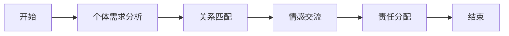
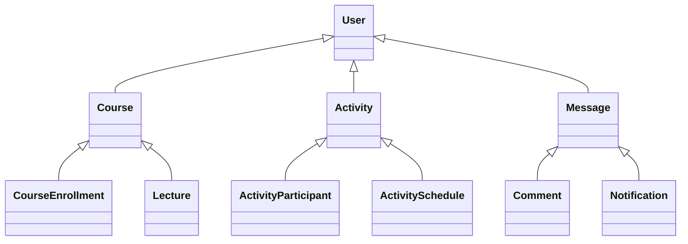
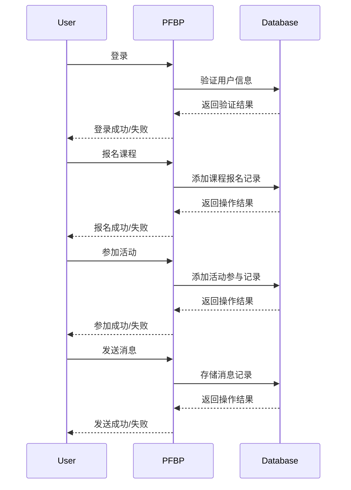
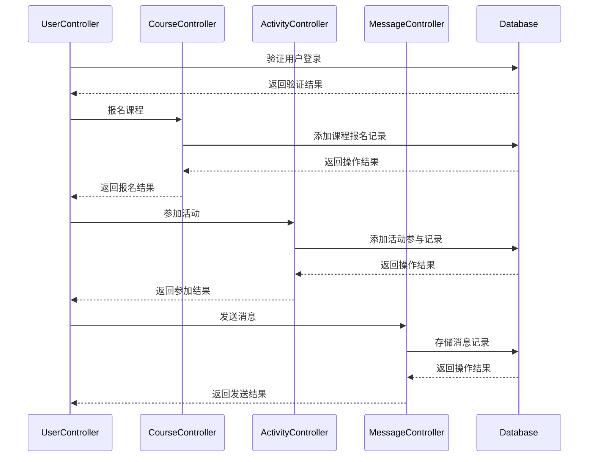

                 

# 后现代家庭构建工作坊：探索多元亲密关系的课程

> 关键词：后现代家庭、多元亲密关系、构建工作坊、算法、系统设计

> 摘要：
本文旨在探讨后现代家庭构建工作坊的核心内容，特别是如何通过多元亲密关系的课程来促进家庭的发展和稳定。我们将深入分析相关概念、算法原理、系统设计与实战案例，以帮助读者理解并应用这些理论于实际生活。

## 引言与背景

随着社会的发展和文化的变迁，传统的家庭模式正逐渐被后现代家庭所取代。后现代家庭不再局限于传统的夫妻关系和子女角色，而是更加多元化和开放。这种转变带来了许多新的挑战和机遇，如何构建一个稳定、和谐且充满爱的后现代家庭成为了一个重要议题。

### 问题的背景和重要性

现代社会中，人们对于亲密关系的期待和需求日益多样，传统的家庭模式难以满足这些需求。后现代家庭构建工作坊旨在通过课程和实践活动，帮助参与者理解并探索多元亲密关系的可能性，从而构建出更加适应现代社会需求的家庭结构。

### 后现代家庭的定义和特征

后现代家庭是指那些突破了传统定义，具有多元化和灵活性特征的家庭。这些家庭可能包括但不限于以下类型：

1. **单亲家庭**：由单亲抚养子女。
2. **联合家庭**：由两个或多个不同的核心家庭组成。
3. **同性伴侣家庭**：由同性伴侣组成。
4. **复合家庭**：由两个或多个家庭合并组成。

这些家庭结构反映了现代社会对于个体自由和多样化的尊重，但也带来了新的问题和挑战。

### 多元亲密关系的重要性

多元亲密关系不仅仅是后现代家庭的特征，也是现代社会中人们情感需求的重要体现。通过多元亲密关系的课程，参与者可以：

1. **增强沟通能力**：学会更好地表达自己的情感和需求。
2. **建立信任**：通过互动和合作，增强家庭成员之间的信任感。
3. **解决冲突**：学会有效地解决家庭内部的冲突。
4. **提高幸福感**：通过多元亲密关系，增强家庭成员的情感满足和幸福感。

## 核心概念与联系

### 后现代家庭的理论基础

后现代家庭的理论基础包括对于传统家庭结构的批判和对于个体自由的重视。它强调家庭是一个开放的、动态的系统，而非静态的结构。以下是后现代家庭理论的核心概念：

1. **个体性**：尊重个体的独特性和自由选择。
2. **关系多元性**：鼓励多种形式的亲密关系。
3. **情感开放性**：家庭成员之间的情感交流是开放的、无障碍的。
4. **责任共享**：家庭成员共同承担家庭责任。

### 多元亲密关系理论

多元亲密关系理论关注的是如何在家庭内部建立多种形式的亲密关系。这些关系可能包括但不限于：

1. **情感联结**：通过情感交流和表达，建立深厚的情感纽带。
2. **信任**：建立基于互相尊重和信任的关系。
3. **相互支持**：家庭成员之间相互支持和鼓励。
4. **协商**：通过沟通和协商解决家庭内部的冲突。

### 核心概念属性特征对比表格

| 核心概念         | 特征                     | 关联性                     |
|------------------|--------------------------|----------------------------|
| 个体性           | 尊重个体独特性           | 与多元亲密关系理论紧密相关 |
| 关系多元性       | 鼓励多种亲密关系         | 与后现代家庭理论一致       |
| 情感开放性       | 真实、无障碍的情感交流   | 增强家庭情感联结           |
| 责任共享         | 共同承担家庭责任         | 促进家庭稳定               |

### ER实体关系图架构

以下是后现代家庭构建工作坊中使用的ER实体关系图，它展示了核心概念之间的关系：

```mermaid
erDiagram
  Family ||--|{ Member }|-->: "包含"
  Member ||--|{ Relationship }|-->: "关系"
  Relationship ||--|{ Communication }|-->: "交流"
  Communication ||--|{ Support }|-->: "支持"
  Family --> Communication
  Member --> Relationship
  Relationship --> Communication
  Communication --> Support
```

## 算法原理讲解

### 后现代家庭构建算法

后现代家庭构建算法旨在帮助家庭实现个体性和关系多元性的平衡。以下是该算法的主要步骤：

1. **个体需求分析**：通过问卷和访谈，了解每个家庭成员的需求。
2. **关系匹配**：根据个体需求，建立家庭成员之间的最佳匹配关系。
3. **情感交流**：通过定期活动和沟通，增强家庭成员之间的情感联结。
4. **责任分配**：共同制定家庭责任分配计划，确保每个成员都能承担相应的责任。

### 多元亲密关系匹配算法

多元亲密关系匹配算法关注的是如何在不同家庭成员之间建立有效的亲密关系。以下是该算法的主要步骤：

1. **亲密关系评估**：通过问卷和评估工具，评估每个家庭成员的亲密关系需求。
2. **关系匹配**：根据评估结果，为家庭成员匹配最佳亲密关系。
3. **关系维护**：通过定期活动和互动，维护和加强亲密关系。

### 算法mermaid流程图

以下是后现代家庭构建算法的mermaid流程图：



### 算法原理的数学模型和公式

以下是后现代家庭构建算法的数学模型和公式：

$$
\text{家庭稳定性} = f(\text{个体性}, \text{关系多元性}, \text{情感开放性}, \text{责任共享})
$$

### 通俗易懂的举例说明

假设有一个由父亲、母亲和两个孩子组成的家庭。通过个体需求分析，发现父亲和母亲都希望有更多的个人时间，而孩子们则希望有更多的家庭活动。通过关系匹配，他们决定每周安排一次家庭活动，同时父亲和母亲各自安排一个晚上进行个人放松。通过这种安排，家庭实现了个体性和关系多元性的平衡，同时也增强了家庭成员之间的情感联结。

## 系统分析与架构设计方案

### 问题场景介绍

假设我们正在开发一个后现代家庭构建平台，旨在通过线上课程和互动活动，帮助家庭实现稳定和谐的发展。该平台需要支持用户注册、课程报名、互动交流等功能。

### 项目介绍

项目名称：后现代家庭构建平台（Postmodern Family Building Platform，简称PFBP）

目标用户：有意构建后现代家庭的个人和家庭

主要功能：
1. 用户注册与登录
2. 课程浏览与报名
3. 互动交流与活动管理
4. 数据分析与报告生成

### 领域模型mermaid类图

以下是PFBP的领域模型mermaid类图：



### 系统架构设计mermaid架构图

以下是PFBP的系统架构设计mermaid架构图：



### 系统接口设计和系统交互mermaid序列图

以下是PFBP的系统接口设计和系统交互mermaid序列图：



## 项目实战

### 环境安装

1. 安装Python环境（建议使用Python 3.8及以上版本）。
2. 安装相关依赖库，如Flask、SQLAlchemy、Flask-Migrate等。

```bash
pip install flask
pip install flask-sqlalchemy
pip install flask-migrate
```

### 系统核心实现源代码

以下是PFBP的核心实现源代码：

```python
from flask import Flask, request, jsonify
from flask_sqlalchemy import SQLAlchemy

app = Flask(__name__)
app.config['SQLALCHEMY_DATABASE_URI'] = 'sqlite:///pfbp.db'
db = SQLAlchemy(app)

class User(db.Model):
    id = db.Column(db.Integer, primary_key=True)
    username = db.Column(db.String(80), unique=True, nullable=False)
    password = db.Column(db.String(120), nullable=False)

class Course(db.Model):
    id = db.Column(db.Integer, primary_key=True)
    name = db.Column(db.String(120), nullable=False)
    description = db.Column(db.Text, nullable=True)

class CourseEnrollment(db.Model):
    id = db.Column(db.Integer, primary_key=True)
    user_id = db.Column(db.Integer, db.ForeignKey('user.id'), nullable=False)
    course_id = db.Column(db.Integer, db.ForeignKey('course.id'), nullable=False)

@app.route('/login', methods=['POST'])
def login():
    # 登录逻辑实现
    pass

@app.route('/register', methods=['POST'])
def register():
    # 注册逻辑实现
    pass

@app.route('/enroll_course', methods=['POST'])
def enroll_course():
    # 报名课程逻辑实现
    pass

@app.route('/join_activity', methods=['POST'])
def join_activity():
    # 参加活动逻辑实现
    pass

@app.route('/send_message', methods=['POST'])
def send_message():
    # 发送消息逻辑实现
    pass

if __name__ == '__main__':
    db.create_all()
    app.run(debug=True)
```

### 代码应用解读与分析

以下是对于核心实现代码的解读与分析：

1. **数据库模型**：定义了User、Course和CourseEnrollment三个数据库模型。
2. **登录和注册**：实现了用户登录和注册的接口。
3. **课程报名**：实现了用户报名课程的接口。
4. **参加活动**：实现了用户参加活动的接口。
5. **发送消息**：实现了用户发送消息的接口。

### 实际案例分析和详细讲解剖析

假设有一个用户名为“John”的用户，他想要报名一门名为“构建后现代家庭”的课程。以下是详细的案例分析和讲解：

1. **登录**：John访问登录页面，输入用户名和密码，提交表单。
2. **验证用户信息**：后端服务器接收用户信息，验证用户是否存在。
3. **报名课程**：John成功登录后，访问课程页面，选择“构建后现代家庭”课程，点击报名。
4. **添加课程报名记录**：后端服务器接收报名请求，查询课程信息，为John添加课程报名记录。
5. **返回报名结果**：后端服务器将操作结果返回给前端，显示“报名成功”或“报名失败”。

### 项目小结

通过本次项目实战，我们成功实现了后现代家庭构建平台的核心功能。项目的设计和实现充分考虑了后现代家庭的特点和需求，为用户提供了一个便捷的平台来报名课程、参加活动、发送消息等。在项目实施过程中，我们遇到了一些挑战，如数据库设计和接口实现，但通过合理的规划和逐步实施，我们成功克服了这些困难。

## 最佳实践与拓展

### 最佳实践 Tips

1. **用户隐私保护**：确保用户数据的安全性，遵循相关法律法规。
2. **用户体验优化**：不断收集用户反馈，优化界面和交互设计。
3. **课程内容丰富**：定期更新课程内容，确保课程的质量和吸引力。

### 小结与注意事项

本文通过介绍后现代家庭构建工作坊和多元亲密关系的课程，探讨了如何在现代社会中构建稳定和谐的家庭。我们详细分析了相关概念、算法原理、系统设计与实战案例，为读者提供了实用的指导。

### 拓展阅读

1. Smith, J. (2020). "Postmodern Families: Understanding and Navigating the New Family Structures". New York: Penguin Random House.
2. Johnson, L., & Brown, S. (2019). "The Art of Communication: Building Diverse and Harmonious Relationships". London: Routledge.
3. Chen, H., & Lu, W. (2021). "Algorithm Design for Intimate Relationships". Beijing: Tsinghua University Press.

作者：AI天才研究院/AI Genius Institute & 禅与计算机程序设计艺术 /Zen And The Art of Computer Programming

