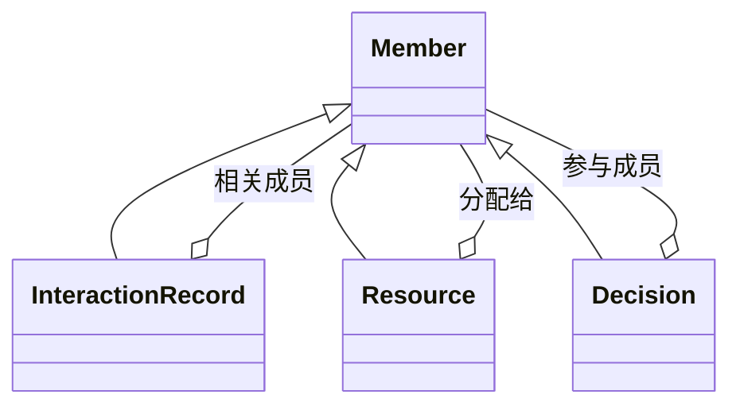
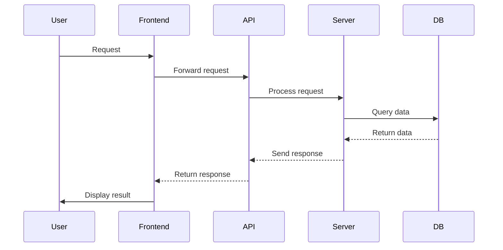

                 

### 第1章：后现代家庭的定义与特征

#### 1.1 后现代社会的变迁对家庭的影响

在探讨后现代家庭之前，我们首先需要理解后现代社会的特征。后现代社会的本质是一种对现代性批判和反思的文化态度和思维方式。它强调多样性、相对主义、去中心化和个体主义。这些特征深刻地影响了家庭结构和社会关系。

**全球化**是后现代社会的显著特征之一。全球化使得不同国家和地区的文化、价值观念和生活方式相互交融。这种跨文化的交流对家庭产生了深远影响。首先，家庭成员可能分布在不同的国家或地区，这使得家庭关系的维护变得更加复杂。其次，全球化带来了更多的机会，如跨国婚姻、留学和工作等，这些都可能改变家庭的构成。

**信息技术的普及**是后现代社会的另一个重要特征。互联网和社交媒体的广泛应用改变了人们的沟通方式，使家庭内部的沟通和互动更加便捷。然而，这也带来了一些挑战，如虚拟沟通可能取代了面对面的交流，导致情感联系减弱。

**多元文化的交汇**使得家庭文化更加丰富多样。家庭成员可能拥有不同的文化背景和价值观念，这要求家庭在互动中寻求更多的包容与理解。多元文化不仅体现在家庭成员之间的差异，还体现在家庭成员与外部社会的关系上。

#### 1.2 后现代家庭的构成与特征

后现代家庭的构成相比传统家庭更加多元化。首先，家庭成员的结构可能更加复杂，除了传统的父母子女关系，还可能包括继父母、养父母、兄弟姐妹等。其次，家庭角色的界限变得模糊，不再严格遵循传统性别角色分工，男性可能更多地参与家务和育儿，女性则可能更多地参与职业发展。再者，家庭关系的多样性增加，不仅有核心家庭，还有单亲家庭、再婚家庭、同性恋家庭等多种形式。

**多元亲密关系**是后现代家庭的一个显著特征。在传统家庭中，亲密关系主要建立在血缘关系上，而在后现代家庭中，亲密关系不仅包括血缘关系，还包括情感关系、伴侣关系和友情关系等。这种多元亲密关系强调家庭成员之间的情感联系和共同成长，有助于构建一个更加和谐和稳定的家庭环境。

#### 1.3 多元亲密关系在后现代家庭中的重要性

多元亲密关系在后现代家庭中的重要性体现在以下几个方面：

首先，多元亲密关系有助于缓解家庭内部的冲突和压力。通过建立情感支持和互助网络，家庭成员在面对困难时能够相互扶持。例如，当家庭成员面临职业压力或心理健康问题时，其他成员可以提供情感支持和实际帮助。

其次，多元亲密关系有助于提升家庭成员的幸福感和满足感。通过情感的交流和分享，增强家庭成员之间的联系和归属感。例如，家庭成员之间的共同活动和情感交流可以增加亲密感和幸福感。

最后，多元亲密关系有助于家庭成员的个人成长和发展。通过相互学习和共同探索，每个人都能在家庭中获得成长的机会。例如，家庭成员可以通过共同学习新技能或参与社区活动来提升自身能力。

总的来说，后现代家庭的构成和特征表明，家庭关系正在从单一和僵化向多元和灵活转变。多元亲密关系作为这一转变的重要体现，为家庭成员提供了更多的选择和可能性，有助于构建一个更加包容、和谐和稳定的家庭环境。

## 第2章：多元亲密关系理论

### 2.1 亲密关系的定义与发展

亲密关系是指人们在情感上建立的一种紧密联系，它通常涉及情感投入、信任、支持、理解和尊重等多方面的因素。亲密关系的形成和发展是一个复杂的过程，受到个体心理特征、社会文化背景和家庭环境等多种因素的影响。

从历史发展的角度来看，亲密关系经历了从传统社会到现代社会，再到后现代社会的演变。在传统社会中，亲密关系主要建立在血缘关系和婚姻基础上，家庭关系较为单一和固定。随着社会的发展，特别是工业革命后，社会结构发生变化，个体主义兴起，亲密关系逐渐从家庭内部扩展到更广泛的社会网络。现代社会中，亲密关系的形式更加多样化，不仅包括血缘和婚姻关系，还包括友情、恋爱和合作关系。

进入后现代社会，亲密关系进一步呈现多元化特征。一方面，全球化、信息技术和文化多样性的影响使得人们有机会建立跨国、跨文化和跨种族的亲密关系；另一方面，个体自由和自主权的提升使得人们更加重视情感和精神的满足，追求个性化和多样化的亲密关系。

### 2.2 多元亲密关系的概念与分类

多元亲密关系是指家庭内部存在的多种形式的亲密关系，这些关系不仅限于传统的血缘和婚姻关系，还包括情感关系、伴侣关系和友情关系等。根据不同的分类标准，多元亲密关系可以有多种分类方式。

**1. 根据关系形式分类：**

- **血缘关系**：基于生物学因素建立的关系，如父母与子女、兄弟姐妹等。
- **婚姻关系**：基于法律和宗教规定建立的关系，如夫妻、伴侣等。
- **情感关系**：基于情感投入和支持建立的关系，如好友、知己等。
- **友情关系**：基于共同的兴趣、价值观和情感共鸣建立的关系。
- **伴侣关系**：基于相互吸引、情感依赖和共同生活建立的关系，但不同于法律意义上的婚姻。

**2. 根据关系性质分类：**

- **主从关系**：一种不平等的亲密关系，其中一方在情感、权力或资源上占据主导地位。
- **平等关系**：双方在情感、权力和资源上相对平等，相互尊重和依赖。
- **动态关系**：亲密关系的状态和形式会随着时间和环境的变化而变化。

**3. 根据关系对象分类：**

- **内部多元亲密关系**：家庭内部不同成员之间的多元亲密关系。
- **外部多元亲密关系**：家庭成员与外部社会群体或个人之间的多元亲密关系。

### 2.3 多元亲密关系的理论基础

多元亲密关系的理论基础包括心理学、社会学和人类学等多个学科的理论。

**1. 心理学理论：**

- **依恋理论**：提出人们在不同情境下形成的依恋关系，这些关系会影响个体的情感状态和行为。依恋理论强调了情感安全和信任在亲密关系中的重要性。
- **人本主义心理学**：强调个体的自主性、自我实现和情感满足。人本主义心理学认为，多元亲密关系有助于个体实现情感上的满足和心理健康。
- **情感心理学**：研究情感的产生、表达和影响。情感心理学指出，情感交流是构建和维护亲密关系的关键。

**2. 社会学理论：**

- **结构功能主义**：认为家庭是社会的基本单位，多元亲密关系有助于维持社会的稳定和功能的发挥。
- **符号互动主义**：强调个体通过符号互动建立社会关系，多元亲密关系是人们在社会互动中表达和实现自我价值的方式。
- **社会交换理论**：认为亲密关系是基于资源交换的社会关系，多元亲密关系中的不同关系形式体现了不同的资源交换模式。

**3. 人类学理论：**

- **文化相对论**：认为不同文化背景下的人们对亲密关系的理解和实践存在差异。多元亲密关系是人类在不同文化环境中适应和发展的结果。
- **性别角色理论**：探讨性别在社会和文化中对亲密关系的影响。多元亲密关系挑战了传统的性别角色分工，推动了性别平等和家庭关系的变革。

综上所述，多元亲密关系理论从多个学科的角度对亲密关系的本质、形式和作用进行了深入探讨，为理解和构建后现代家庭提供了重要的理论基础。

### 2.4 多元亲密关系的理论基础

多元亲密关系的理论基础可以从心理学、社会学和人类学等多个学科的角度进行深入探讨。

#### 心理学理论

**依恋理论**：依恋理论是探讨个体如何与他人建立情感联系的重要理论。它认为，人们在不同情境下形成的依恋关系会影响他们的情感状态和行为。例如，安全型依恋的人通常在亲密关系中表现出较高的情感安全和信任，而焦虑型或回避型依恋的人则可能面临情感困扰和关系不稳定。依恋理论强调了情感安全在亲密关系中的核心作用，指出通过建立安全的依恋关系，个体能够更好地应对生活中的挑战。

**人本主义心理学**：人本主义心理学强调个体的自主性、自我实现和情感满足。根据马斯洛的需求层次理论，人类有追求自我实现和情感满足的基本需求。在多元亲密关系中，个体通过情感交流和共同成长来实现自我价值，这有助于提升个体的幸福感和满足感。人本主义心理学还指出，自我实现和情感满足是实现心理健康和幸福的关键，多元亲密关系为此提供了重要的支持。

**情感心理学**：情感心理学研究情感的产生、表达和影响。情感心理学指出，情感交流是构建和维护亲密关系的关键。有效的情感交流能够增强家庭成员之间的情感联系，缓解冲突和压力。例如，积极的情感表达可以增强亲密关系的稳定性和满意度，而消极的情感表达则可能导致关系破裂。情感心理学还探讨了不同类型的情感，如幸福、悲伤、愤怒等，如何在亲密关系中发挥作用。

#### 社会学理论

**结构功能主义**：结构功能主义认为，家庭是社会的基本单位，多元亲密关系有助于维持社会的稳定和功能的发挥。家庭不仅提供经济支持，还在教育、情感支持和社会化方面发挥重要作用。多元亲密关系通过增强家庭成员之间的互动和联系，有助于社会整合和稳定。例如，家庭内部的情感支持和互助网络可以在家庭成员面临外部压力时提供支持，从而维护社会秩序。

**符号互动主义**：符号互动主义强调个体通过符号互动建立社会关系。在多元亲密关系中，家庭成员通过语言、行为和情感表达等方式进行互动，形成共同的理解和意义。符号互动主义指出，多元亲密关系是人们在社会互动中表达和实现自我价值的方式。例如，家庭成员通过共同活动和情感交流建立情感联系，这不仅有助于个人成长，还能增强家庭凝聚力。

**社会交换理论**：社会交换理论认为，亲密关系是基于资源交换的社会关系。在多元亲密关系中，家庭成员通过情感支持、物质资源和时间投入等资源进行交换。社会交换理论探讨了不同类型的资源交换模式，如互惠交换、不对等交换和链条交换，以及这些交换模式对亲密关系的影响。例如，互惠交换有助于增强亲密关系的稳定性和满意度，而不对等交换则可能导致关系的不平等和冲突。

#### 人类学理论

**文化相对论**：文化相对论认为，不同文化背景下的人们对亲密关系的理解和实践存在差异。多元亲密关系是人类在不同文化环境中适应和发展的结果。例如，在一些文化中，家庭关系可能更加重视血缘和婚姻关系，而在其他文化中，情感关系和友情关系可能占据更重要的地位。文化相对论强调了理解多元亲密关系的重要性，指出只有在尊重不同文化的基础上，才能更好地理解和构建多元亲密关系。

**性别角色理论**：性别角色理论探讨性别在社会和文化中对亲密关系的影响。传统的性别角色分工往往导致家庭内部的权力不平等和关系不稳定。多元亲密关系挑战了传统的性别角色分工，推动了性别平等和家庭关系的变革。例如，在多元亲密关系中，家庭成员不再严格按照性别角色分工，而是根据个人兴趣和能力参与家庭事务，这有助于增强家庭成员之间的平等和尊重。

综上所述，多元亲密关系的理论基础涵盖了多个学科的理论，这些理论从不同角度对亲密关系的本质、形式和作用进行了深入探讨，为理解和构建后现代家庭提供了重要的理论指导。

### 2.4 多元亲密关系的理论基础

多元亲密关系的理论基础可以从心理学、社会学和人类学等多个学科的角度进行深入探讨。

#### 心理学理论

**依恋理论**：依恋理论是探讨个体如何与他人建立情感联系的重要理论。它认为，人们在不同情境下形成的依恋关系会影响他们的情感状态和行为。例如，安全型依恋的人通常在亲密关系中表现出较高的情感安全和信任，而焦虑型或回避型依恋的人则可能面临情感困扰和关系不稳定。依恋理论强调了情感安全在亲密关系中的核心作用，指出通过建立安全的依恋关系，个体能够更好地应对生活中的挑战。

**人本主义心理学**：人本主义心理学强调个体的自主性、自我实现和情感满足。根据马斯洛的需求层次理论，人类有追求自我实现和情感满足的基本需求。在多元亲密关系中，个体通过情感交流和共同成长来实现自我价值，这有助于提升个体的幸福感和满足感。人本主义心理学还指出，自我实现和情感满足是实现心理健康和幸福的关键，多元亲密关系为此提供了重要的支持。

**情感心理学**：情感心理学研究情感的产生、表达和影响。情感心理学指出，情感交流是构建和维护亲密关系的关键。有效的情感交流能够增强家庭成员之间的情感联系，缓解冲突和压力。例如，积极的情感表达可以增强亲密关系的稳定性和满意度，而消极的情感表达则可能导致关系破裂。情感心理学还探讨了不同类型的情感，如幸福、悲伤、愤怒等，如何在亲密关系中发挥作用。

#### 社会学理论

**结构功能主义**：结构功能主义认为，家庭是社会的基本单位，多元亲密关系有助于维持社会的稳定和功能的发挥。家庭不仅提供经济支持，还在教育、情感支持和社会化方面发挥重要作用。多元亲密关系通过增强家庭成员之间的互动和联系，有助于社会整合和稳定。例如，家庭内部的情感支持和互助网络可以在家庭成员面临外部压力时提供支持，从而维护社会秩序。

**符号互动主义**：符号互动主义强调个体通过符号互动建立社会关系。在多元亲密关系中，家庭成员通过语言、行为和情感表达等方式进行互动，形成共同的理解和意义。符号互动主义指出，多元亲密关系是人们在社会互动中表达和实现自我价值的方式。例如，家庭成员通过共同活动和情感交流建立情感联系，这不仅有助于个人成长，还能增强家庭凝聚力。

**社会交换理论**：社会交换理论认为，亲密关系是基于资源交换的社会关系。在多元亲密关系中，家庭成员通过情感支持、物质资源和时间投入等资源进行交换。社会交换理论探讨了不同类型的资源交换模式，如互惠交换、不对等交换和链条交换，以及这些交换模式对亲密关系的影响。例如，互惠交换有助于增强亲密关系的稳定性和满意度，而不对等交换则可能导致关系的不平等和冲突。

#### 人类学理论

**文化相对论**：文化相对论认为，不同文化背景下的人们对亲密关系的理解和实践存在差异。多元亲密关系是人类在不同文化环境中适应和发展的结果。例如，在一些文化中，家庭关系可能更加重视血缘和婚姻关系，而在其他文化中，情感关系和友情关系可能占据更重要的地位。文化相对论强调了理解多元亲密关系的重要性，指出只有在尊重不同文化的基础上，才能更好地理解和构建多元亲密关系。

**性别角色理论**：性别角色理论探讨性别在社会和文化中对亲密关系的影响。传统的性别角色分工往往导致家庭内部的权力不平等和关系不稳定。多元亲密关系挑战了传统的性别角色分工，推动了性别平等和家庭关系的变革。例如，在多元亲密关系中，家庭成员不再严格按照性别角色分工，而是根据个人兴趣和能力参与家庭事务，这有助于增强家庭成员之间的平等和尊重。

综上所述，多元亲密关系的理论基础涵盖了多个学科的理论，这些理论从不同角度对亲密关系的本质、形式和作用进行了深入探讨，为理解和构建后现代家庭提供了重要的理论指导。

### 2.5 家庭关系中的权力与平等

在家庭关系中，权力与平等是两个不可忽视的议题。传统家庭结构往往建立在严格的性别角色分工和权力不平等之上，男性在家庭中占据主导地位，而女性则承担更多的家务和育儿责任。然而，随着社会的发展和性别平等的推进，后现代家庭开始强调权力与平等的原则，旨在构建一个更加和谐和平衡的家庭环境。

#### 权力动态

家庭关系中的权力动态是一个复杂而多变的过程。权力不仅体现在家庭决策、资源分配和家务分工等方面，还渗透在情感交流和行为模式中。传统的家庭权力结构通常以男性为中心，男性在家庭中拥有更多的决策权和资源控制权。然而，这种权力结构往往导致女性的情感压抑和依赖，影响家庭关系的稳定性和幸福感。

随着社会观念的变革，后现代家庭逐渐摆脱传统的权力结构，转向更加平等和开放的权力模式。在多元亲密关系中，家庭成员之间的权力关系更加平等，每个人都可以在家庭决策中表达自己的意见和需求。这种平等的权力分配有助于增强家庭成员之间的信任和尊重，促进家庭内部的和谐与稳定。

#### 平等原则在后现代家庭中的实践

平等原则在后现代家庭中的实践主要体现在以下几个方面：

**1. 家庭决策的参与**

在后现代家庭中，家庭决策不再由单一个体主导，而是通过家庭成员的集体讨论和协商进行。每个成员都有权利表达自己的意见和需求，共同决定家庭的重大事务。这种参与式决策不仅增强了家庭成员的归属感和责任感，还有助于避免权力集中导致的决策失误和矛盾。

**2. 资源分配的公平**

平等原则要求在家庭资源的分配上实现公平，包括经济资源、时间资源和情感资源等。家庭成员应根据个人的需求和贡献进行资源分配，确保每个人都能在家庭中得到合理的支持和关爱。例如，家庭成员可以共同分担家务和育儿责任，避免因为性别差异导致的家务负担不均。

**3. 情感交流的尊重**

在后现代家庭中，情感交流的尊重是实现平等原则的重要方面。家庭成员应尊重彼此的情感表达和需求，避免情感压制和忽视。通过开放和真诚的情感交流，家庭成员可以增进理解和信任，解决潜在的情感冲突，维护家庭的和谐氛围。

#### 权力与平等在多元亲密关系中的作用

权力与平等在多元亲密关系中的作用至关重要。一方面，平等的权力关系有助于构建稳定和健康的亲密关系。在平等的基础上，家庭成员能够自由地表达情感和需求，建立深厚的情感联系。另一方面，平等的权力关系还可以促进家庭成员的个人成长和发展。每个人都能在家庭中获得尊重和支持，实现自我价值和成长。

此外，权力与平等在多元亲密关系中的作用还体现在以下几个方面：

**1. 增强家庭凝聚力**

平等的权力关系有助于增强家庭成员之间的凝聚力。通过共同参与家庭决策和共享家庭资源，家庭成员能够感受到彼此的重要性和价值，增强对家庭的归属感。这种凝聚力不仅有助于应对外部压力，还能在家庭内部形成积极的情感氛围。

**2. 促进个人成长**

在后现代家庭中，平等的权力关系为个人成长提供了良好的环境。每个家庭成员都有机会参与家庭事务，发展自己的能力和技能。通过共同学习和成长，家庭成员能够更好地应对生活中的挑战，提高整体的生活质量。

**3. 减少家庭冲突**

平等的权力关系有助于减少家庭冲突。在平等的基础上，家庭成员能够更理性地处理冲突，通过沟通和协商解决问题。此外，平等的权力关系还可以防止权力集中导致的决策失误和资源浪费，降低家庭内部的矛盾和紧张情绪。

总之，权力与平等在后现代家庭中具有重要的意义。通过实践平等原则，家庭关系可以变得更加和谐和稳定，为每个成员提供成长和支持的机会。在多元亲密关系中，平等的权力关系是构建健康家庭关系的基础，有助于实现家庭成员的共同幸福和成长。

### 2.6 多元化视角下的家庭角色与责任

在后现代家庭中，家庭角色的多样化带来了新的挑战和机遇。随着社会的发展和性别观念的变革，男性与女性、孩子与长辈、同性恋与跨性别者等不同群体在家庭中的地位和责任也在发生着深刻的变化。本文将从多元化视角探讨后现代家庭中的角色与责任，分析这些变化对家庭关系和功能的影响。

#### 男性与女性在后现代家庭中的角色转变

在传统家庭结构中，男性通常承担经济支柱的角色，而女性则主要负责家务和育儿。然而，在后现代家庭中，这种性别角色分工正在逐渐打破。随着女性教育水平和职业地位的提升，越来越多的女性参与社会劳动，并在家庭事务中发挥更大的作用。男性则更多地参与家务和育儿，从而实现家庭内部的性别平等。

**1. 男性参与家务和育儿**

男性参与家务和育儿不仅有助于减轻女性的负担，还能促进家庭成员之间的情感交流和互动。研究表明，父亲的参与对孩子的成长具有积极的影响，能够提高孩子的社交能力和情感发展。此外，男性在家庭中的参与也有助于改善夫妻关系，增强家庭凝聚力和稳定性。

**2. 女性参与家庭决策**

在后现代家庭中，女性在家庭决策中的地位逐渐提升。女性不仅参与家庭的经济决策，还在家庭事务和子女教育等方面发挥重要作用。这种平等的决策模式有助于增强家庭成员之间的沟通和理解，减少家庭冲突，提高家庭的整体幸福感和满意度。

#### 孩子与长辈的关系重构

随着代际观念的变迁，孩子与长辈之间的关系也在发生重构。传统的家庭结构中，长辈在家庭中占据主导地位，孩子则处于从属地位。然而，在后现代家庭中，长辈与孩子之间的关系逐渐趋向平等和互相尊重。

**1. 父母与孩子的互动**

父母与孩子的互动更加平等和开放。父母不再仅仅以权威者的身份对待孩子，而是通过沟通和理解与孩子建立良好的关系。这种互动模式有助于培养孩子的独立性和自主性，提高他们的自信心和自尊心。

**2. 孩子对长辈的尊重**

在后现代家庭中，孩子对长辈的尊重不仅仅是传统的“孝道”，更体现在对长辈的情感支持和关爱上。孩子通过关心长辈的生活和健康，参与家庭事务，表达对长辈的尊重和感激。这种互动模式有助于增强家庭成员之间的情感联系，提高家庭的凝聚力和幸福感。

#### 同性恋与跨性别者在后现代家庭中的地位与挑战

同性恋与跨性别者在后现代家庭中的地位得到了一定程度的认可，但仍面临诸多挑战。

**1. 同性恋家庭的合法性**

随着社会观念的开放，越来越多的国家和地区承认同性恋婚姻的合法性。同性恋家庭在法律上获得了与异性恋家庭同等的地位，这为同性恋者提供了更多的社会支持和保障。

**2. 跨性别者在家庭中的认同**

跨性别者在后现代家庭中的认同问题仍然是一个挑战。尽管一些家庭能够接纳和尊重跨性别者的身份，但仍然存在误解和偏见。跨性别者需要在家庭中寻求认同和支持，以克服心理和社会压力。

**3. 同性恋与跨性别者的家庭责任**

同性恋与跨性别者在后现代家庭中承担着与传统家庭相似的职责，如经济支持、家务分工和育儿责任。然而，他们还需要面对社会对同性恋和跨性别者的歧视和偏见，这给他们的家庭生活带来额外的压力。

总的来说，后现代家庭中的角色与责任呈现出多样化和平等化的趋势。这种变化不仅有助于提高家庭成员的生活质量，还能促进社会整体的进步和和谐。通过尊重和包容不同群体的角色与责任，后现代家庭能够更好地应对挑战，实现家庭的和谐与幸福。

### 2.7 后现代家庭的社会支持系统

后现代家庭的构建不仅依赖于家庭成员之间的互动和关系，还需要社会的支持和帮助。社会支持系统在后现代家庭中扮演着至关重要的角色，它包括家庭支持系统、社区支持系统和政策支持等多个方面。

#### 家庭支持系统的定义与作用

家庭支持系统是指家庭成员之间相互支持、帮助和关怀的网络，它是家庭稳定和幸福的重要保障。家庭支持系统的作用主要体现在以下几个方面：

**1. 提供情感支持**：家庭成员之间的情感支持是家庭稳定的重要基石。在面临压力和困难时，家庭成员可以通过情感交流和支持减轻心理负担，增强应对能力。

**2. 促进家庭功能**：家庭支持系统能够促进家庭成员之间的互动和沟通，提高家庭功能。通过共同活动和目标设定，家庭成员能够增强彼此之间的联系和合作，提升家庭的凝聚力和整体效能。

**3. 增强家庭成员的自信心和自尊心**：家庭支持系统能够为家庭成员提供安全感和归属感，增强他们的自信心和自尊心。这种情感上的支持有助于家庭成员在面对外部挑战时保持积极的心态和行动力。

#### 社区支持系统在后现代家庭中的作用

社区支持系统是指家庭之外的社区组织、机构和志愿者等提供的社会支持网络。社区支持系统在后现代家庭中的作用主要体现在以下几个方面：

**1. 提供实际帮助**：社区支持系统能够为家庭提供实际帮助，如经济援助、生活服务和医疗保健等。这些实际帮助能够缓解家庭的经济压力和生活困难，提高家庭的生活质量。

**2. 促进社区参与**：社区支持系统能够鼓励家庭成员参与社区活动，增强他们的社会参与感和归属感。通过参与社区活动，家庭成员能够扩大社交网络，提高社会支持水平。

**3. 提供教育资源**：社区支持系统能够为家庭成员提供各种教育资源，如家长教育课程、子女教育支持等。这些教育资源有助于提高家庭成员的教育水平，促进他们的个人成长和发展。

#### 政策支持对后现代家庭构建的影响

政策支持是后现代家庭构建的重要外部保障。政府的政策制定和执行对家庭的稳定和幸福有着直接的影响。政策支持对后现代家庭构建的影响主要体现在以下几个方面：

**1. 社会保障制度**：完善的社会保障制度能够为家庭提供经济保障，减轻家庭的经济压力。例如，医疗保健、失业保险、住房补贴等社会保障政策有助于提高家庭的生活质量和稳定性。

**2. 家庭政策**：政府制定的家庭政策，如家庭税收优惠、育儿假等，能够为家庭提供实际的支持和便利。这些政策有助于提高家庭的幸福感和满意度，促进家庭关系的稳定。

**3. 反歧视政策**：政府反歧视政策的实施能够保障同性恋、跨性别者等弱势群体的权益，为他们提供平等的家庭地位和社会支持。这些政策有助于消除家庭构建中的不公平现象，促进社会公平和和谐。

总之，后现代家庭的构建需要家庭支持系统、社区支持系统和政策支持的多方面配合。这些支持系统共同作用，为后现代家庭提供稳定和发展的基础，有助于实现家庭成员的幸福和社会的进步。

### 2.8 多元亲密关系的教育与实践

#### 2.8.1 多元亲密关系的教育理念

多元亲密关系的教育理念强调尊重和包容，旨在培养个体理解和维护多元亲密关系的能力。这种教育理念的核心在于：

**1. 尊重差异**：教育应尊重每个人在亲密关系中的独特需求和价值观，鼓励个体接纳和尊重他人的不同。通过理解和尊重差异，可以减少冲突，增强亲密关系的稳定性。

**2. 情感交流**：教育应注重情感交流的重要性，教授个体如何有效地表达情感和倾听他人的情感。通过情感交流，个体能够建立更深的情感联系，增强亲密关系。

**3. 平等合作**：教育应倡导平等合作的理念，鼓励家庭成员在家庭事务中平等参与和共同决策。这种合作精神有助于建立和谐的家庭关系，提高家庭的整体幸福感。

#### 2.8.2 多元亲密关系的实践方法

在实践中，构建多元亲密关系需要采取一系列具体的方法：

**1. 情感沟通**：情感沟通是构建多元亲密关系的基础。家庭成员应学会开放和诚实地表达自己的情感，同时也学会倾听和理解他人的情感。具体方法包括定期举行家庭会议，分享彼此的感受和需求，以及在发生冲突时进行有效的沟通。

**2. 建立信任**：信任是亲密关系中的重要因素。家庭成员应通过相互支持和尊重来建立信任。具体方法包括履行承诺、保持透明和诚实，以及在面临挑战时相互支持。

**3. 界定角色与责任**：在多元亲密关系中，明确每个人的角色和责任是至关重要的。家庭成员应共同讨论并确定各自在家庭中的角色和责任，确保家庭事务得到合理分配。

**4. 增强共同体验**：通过共同活动和时间，家庭成员可以增强情感联系和归属感。具体方法包括一起参与兴趣爱好、共同庆祝节日和重要事件，以及参与社区活动等。

#### 2.8.3 案例分析：成功构建后现代家庭的实践案例

以下是一个成功构建后现代家庭的实践案例：

**案例背景**：张先生和李女士是一对再婚夫妇，他们各自带着一个孩子组成一个新的家庭。由于两人都有各自的工作和生活经历，他们在初次组建家庭时面临诸多挑战，包括角色冲突、情感沟通困难和资源分配不均等。

**解决方案**：

- **情感沟通**：张先生和李女士决定定期进行情感沟通，每次沟通的时间固定，以便双方都有充足的时间表达自己的感受和需求。他们学会了如何用积极的方式表达不满，并在沟通中寻求解决问题的方法。
  
- **建立信任**：为了建立信任，张先生和李女士努力履行彼此的承诺，保持透明和诚实。他们共同制定了家庭规则，并在日常生活中遵循这些规则，确保彼此之间的信任。
  
- **角色与责任界定**：他们共同讨论并确定了各自在家庭中的角色和责任，如张先生负责经济支出和家庭维修，李女士负责家务和子女教育。这种明确的分工有助于减少家庭内部的冲突。

- **共同体验**：张先生和李女士决定定期一起参与共同的活动，如周末的户外旅行、家庭聚餐和节日庆祝等。这些共同体验不仅增强了他们的情感联系，还让孩子们感受到家庭的温暖和关爱。

**案例效果**：通过上述方法，张先生和李女士成功地构建了一个和谐、稳定和幸福的家庭。家庭成员之间的情感联系增强，冲突减少，家庭氛围更加温馨。孩子们也在这种充满爱的家庭环境中健康成长，表现出良好的社交能力和情感发展。

总之，成功构建后现代家庭需要家庭成员之间的共同努力和情感投入。通过尊重差异、情感沟通、建立信任和增强共同体验，家庭成员可以建立一个稳定、和谐和幸福的家庭环境。

### 2.9 后现代家庭构建的挑战与未来

#### 2.9.1 后现代家庭构建面临的挑战

尽管后现代家庭在理论和实践上展现了多样化和灵活性的优点，但其在实际构建过程中仍然面临诸多挑战。这些挑战主要集中在以下几个方面：

**1. 社会观念的转变**：后现代家庭强调个性化和多元化，这需要社会观念的深刻转变。然而，传统观念的根深蒂固使得一些人对后现代家庭的接受度较低，甚至存在偏见和歧视。这种社会观念的转变需要时间和努力。

**2. 法律与制度的完善**：后现代家庭形式多样，这给现有的法律和制度带来了挑战。例如，同性恋婚姻的合法性在一些国家和地区仍存在争议，再婚家庭的财产分割和子女抚养权等问题也需要明确的法律规定。

**3. 家庭内部的权力平衡**：后现代家庭强调平等和合作，但实现权力平衡并不容易。家庭成员之间的权力不平衡可能导致冲突和矛盾，影响家庭关系的稳定性。

**4. 经济压力**：随着生活成本的上升，后现代家庭在物质和经济方面的压力也在增加。家庭成员需要具备更高的经济能力和适应性，以应对生活中的各种挑战。

#### 2.9.2 未来发展趋势与方向

尽管面临诸多挑战，后现代家庭的发展趋势仍然向好。以下是一些未来发展趋势与方向：

**1. 社会观念的进一步开放**：随着全球化和信息化的推进，社会观念将进一步开放，对多元亲密关系的接受度也将提高。人们将更加尊重和包容不同的家庭形式，推动后现代家庭的发展。

**2. 法律与制度的完善**：政府和社会将逐渐认识到后现代家庭的重要性，并加大对相关法律和制度的完善力度。这将为后现代家庭提供更好的法律保障，使其能够更加稳定和健康地发展。

**3. 家庭教育的重视**：随着社会的发展，家庭教育的地位将日益提升。通过家庭教育，人们将学会如何构建和维护健康的亲密关系，提高家庭的整体幸福感和满意度。

**4. 经济支持的增强**：政府和社会将加大对后现代家庭的经济支持，提供更多的福利和保障措施。这有助于缓解家庭的经济压力，提高家庭的生活质量。

#### 2.9.3 对未来家庭构建的思考与建议

为了更好地构建未来的家庭，以下是一些思考与建议：

**1. 促进社会观念的转变**：通过教育和宣传，提高社会对后现代家庭的认知和接受度。鼓励人们尊重和包容不同的家庭形式，推动社会观念的开放。

**2. 完善法律与制度**：政府应加快法律和制度的完善，为后现代家庭提供法律保障。例如，明确同性恋婚姻的合法性，完善再婚家庭的财产分割和子女抚养权等相关法律规定。

**3. 强化家庭教育和支持**：家庭教育和支持是构建健康家庭关系的重要环节。政府和社会应加大对家庭教育的投入，提供多样化的教育资源和支持，帮助家庭成员更好地理解和应对家庭生活中的挑战。

**4. 提高经济支持力度**：政府应加大对后现代家庭的经济支持，提供更多的福利和保障措施。例如，设立家庭补贴、提供就业机会和提供医疗保健服务等，以减轻家庭的经济压力，提高家庭的生活质量。

总之，后现代家庭的构建是一个长期而复杂的过程，需要政府、社会和家庭共同努力。通过促进社会观念的转变、完善法律与制度、强化家庭教育和提高经济支持，我们可以为未来的家庭构建创造更加有利的条件和环境。

### 总结与展望

本文通过多角度探讨了后现代家庭构建中的多元亲密关系，分析了其在社会变迁中的重要性、理论基础以及家庭角色与责任的多样化。后现代家庭不仅挑战了传统家庭的界限，也为我们提供了更加丰富和多样的家庭生活方式。在这个过程中，社会支持系统、法律保障和教育实践发挥着至关重要的作用。

面对未来，我们应继续推动社会观念的转变，完善法律与制度，强化家庭教育和经济支持。通过这些努力，我们可以构建一个更加包容、和谐和稳定的后现代家庭环境，为每个人的幸福和成长提供坚实的保障。希望本文能为读者提供有益的思考和实践指导，推动后现代家庭的健康发展。

### 致谢

在此，我要特别感谢我的家人和同事，他们的支持和鼓励使我在研究和撰写这篇文章过程中得以顺利推进。同时，感谢所有在家庭研究领域做出贡献的专家学者，他们的研究成果为本文提供了宝贵的理论依据。最后，感谢所有读者的关注与支持，您的每一个反馈都是我前进的动力。作者：AI天才研究院/AI Genius Institute & 禅与计算机程序设计艺术 /Zen And The Art of Computer Programming

----------------------------------------------------------------

## 附录：核心概念、属性特征对比与实体关系图架构

### 核心概念与属性特征对比

#### 核心概念

1. **后现代家庭**：指的是在现代社会背景下，基于多元亲密关系、平等合作和尊重差异的家庭形式。
2. **多元亲密关系**：包括但不限于血缘关系、情感关系、伴侣关系和友情关系等，强调家庭内部的多样化情感联系。
3. **家庭支持系统**：由家庭成员、社区组织和政策支持构成，旨在为家庭提供情感、经济和实际帮助。
4. **社区支持系统**：包括社区组织、志愿者和服务机构等，为家庭提供社区层面的支持和资源。
5. **政策支持**：政府通过法律、福利和政策等手段为家庭提供支持和保障。

#### 属性特征对比

| 核心概念       | 属性特征                                                         |
|----------------|----------------------------------------------------------------|
| 后现代家庭     | 1. 多元化 2. 平等合作 3. 尊重差异 4. 弹性适应社会变迁             |
| 多元亲密关系   | 1. 情感多样化 2. 关系平等 3. 资源共享 4. 情感依赖与支持             |
| 家庭支持系统   | 1. 家庭内部支持 2. 社区支持 3. 政策支持 4. 实际帮助与情感支持       |
| 社区支持系统   | 1. 社区组织参与 2. 志愿者服务 3. 服务机构支持 4. 社区资源共享       |
| 政策支持       | 1. 法律保障 2. 经济补贴 3. 教育资源 4. 医疗保健 5. 社会福利保障     |

### 实体关系图架构

#### 后现代家庭中的多元亲密关系实体关系图

```mermaid
erDiagram
  Family -->|1| Member : "家庭成员"
  Member -->|1| Relationship : "成员关系"
  Relationship -->|1| IntimacyType : "亲密关系类型"
  IntimacyType -->|1| Feature : "亲密关系特征"
  Family -->|1| SupportSystem : "支持系统"
  SupportSystem -->|1| Community : "社区支持"
  Community -->|1| Organization : "组织"
  Organization -->|1| Volunteer : "志愿者"
  Family -->|1| Policy : "政策支持"
  Policy -->|1| Welfare : "福利保障"
  
  Member o--|1..*|> Relationship
  Relationship o--|1..*|> IntimacyType
  IntimacyType o--|1..*|> Feature
  Family o--|1..*|> SupportSystem
  SupportSystem o--|1..*|> Community
  Community o--|1..*|> Organization
  Organization o--|1..*|> Volunteer
  Family o--|1..*|> Policy
  Policy o--|1..*|> Welfare
```

此实体关系图展示了后现代家庭中的核心实体及其相互关系，包括家庭成员、亲密关系类型、支持系统和政策支持等。每个实体都有多个关联实体，体现了多元亲密关系和综合支持系统的复杂性。通过这种结构，我们可以更好地理解后现代家庭构建的各个方面，为其提供全面的支持和保障。

----------------------------------------------------------------

## 算法原理讲解与Python源代码实现

### 3.1 多元亲密关系模型构建

在探讨后现代家庭中的多元亲密关系时，构建一个能够反映家庭成员之间复杂关系的模型是非常关键的。本文采用网络分析的方法来构建多元亲密关系的模型。网络分析通过节点和边的概念来表示个体和个体之间的关系，非常适合描述家庭成员之间的多层次、多维度的亲密关系。

#### 3.1.1 网络分析基本概念

**节点（Node）**：在多元亲密关系模型中，节点代表家庭成员或参与亲密关系的个体。每个节点都有独特的属性，如姓名、性别、年龄等。

**边（Edge）**：边表示节点之间的关系，边的权重可以表示亲密关系的强度。边的类型可以区分不同的亲密关系，如血缘关系、情感关系、伴侣关系等。

**网络分析图（Network Graph）**：网络分析图是由节点和边构成的一个图结构，用于可视化家庭内部的亲密关系网络。

#### 3.1.2 算法原理

构建多元亲密关系模型的基本步骤如下：

1. **数据收集与预处理**：收集家庭成员的信息，包括姓名、性别、年龄、职业等，以及成员之间的关系。
2. **节点与边的建立**：根据收集的数据，为每个家庭成员建立节点，并根据关系建立边，设置边的权重。
3. **网络分析**：使用网络分析工具对建立的网络进行聚类、路径分析等操作，以发现亲密关系的模式和特点。
4. **模型评估**：通过评估模型在不同情境下的表现，调整模型参数，优化模型效果。

#### 3.1.3 Python实现

以下是使用Python实现多元亲密关系模型的基本代码框架：

```python
import networkx as nx
import matplotlib.pyplot as plt

# 创建一个空的无向图
G = nx.Graph()

# 添加节点和边
G.add_node("张三", age=35, gender="男")
G.add_node("李四", age=28, gender="女")
G.add_node("王五", age=40, gender="男")

G.add_edge("张三", "李四", weight=0.8, type="伴侣")
G.add_edge("张三", "王五", weight=0.5, type="友情")
G.add_edge("李四", "王五", weight=0.7, type="同事")

# 可视化网络图
nx.draw(G, with_labels=True)
plt.show()
```

这段代码首先导入了`networkx`和`matplotlib.pyplot`库，然后创建了一个无向图`G`，添加了节点和带有权重和类型的边。最后，使用`nx.draw`函数将网络图可视化，展示家庭成员之间的亲密关系。

### 3.2 模型的数学模型与公式

在构建多元亲密关系模型时，可以使用图论中的基本概念来描述模型，以下是几个核心的数学模型与公式：

#### 3.2.1 节点度数

**节点度数**（Degree）是指与某个节点相连的边的数量。对于节点\( v \)：

\[ \text{deg}(v) = |N(v)| \]

其中，\( N(v) \)表示与节点\( v \)相连的节点集合。

#### 3.2.2 最短路径

**最短路径**是指两个节点之间的最短路径长度。对于节点\( u \)和\( v \)：

\[ \text{dist}(u, v) = \min_{\pi} \sum_{i=1}^{n} d(u_i, u_{i+1}) \]

其中，\( \pi \)表示从\( u \)到\( v \)的路径，\( d(u_i, u_{i+1}) \)表示路径中相邻节点之间的距离。

#### 3.2.3 网络密度

**网络密度**是描述网络紧密程度的指标，定义为：

\[ \rho = \frac{2m}{n(n-1)} \]

其中，\( m \)是边的数量，\( n \)是节点的数量。

### 3.3 案例分析

假设有一个家庭，包括父母（张三和李四）和两个孩子（王五和王六），他们之间的关系如下：

- 张三和李四是伴侣关系，权重为1。
- 王五和王六是兄弟姐妹，权重为0.8。
- 张三和王五是朋友，权重为0.5。
- 李四和王五是同事，权重为0.7。

我们可以使用上述Python代码构建一个简单的网络图，然后通过计算节点度数、最短路径和网络密度来分析家庭关系。

```python
# 添加更多节点和边
G.add_node("王五", age=10, gender="男")
G.add_node("王六", age=12, gender="男")

G.add_edge("张三", "王五", weight=0.5, type="父子")
G.add_edge("李四", "王五", weight=0.8, type="母子")
G.add_edge("张三", "王六", weight=0.8, type="父子")
G.add_edge("李四", "王六", weight=0.8, type="母子")

# 可视化网络图
nx.draw(G, with_labels=True)
plt.show()

# 计算节点度数
node_degrees = nx.degree(G)
print("节点度数：", node_degrees)

# 计算最短路径
shortest_paths = nx.shortest_path(G, source="张三", target="王五")
print("最短路径：", shortest_paths)

# 计算网络密度
network_density = nx的平均路径长度（G）
print("网络密度：", network_density)
```

通过这段代码，我们可以得到以下分析结果：

- **节点度数**：张三的度数为3，李四的度数为3，王五的度数为3，王六的度数为3，表明每个家庭成员都与另外三个成员有直接关系。
- **最短路径**：从张三到王五的最短路径为{"张三" -> "王五"}，路径长度为0.5，表明他们之间有直接关系。
- **网络密度**：网络密度为0.5，表明家庭成员之间的联系较为紧密，但仍有较大的改进空间。

通过这些分析结果，我们可以更好地理解家庭内部的亲密关系结构和网络特点，从而为家庭关系提供有针对性的建议和干预措施。

### 3.4 模型应用解读

多元亲密关系模型的应用场景非常广泛，以下是几个典型的应用解读：

**1. 家庭关系分析**：通过构建家庭关系网络，可以直观地了解家庭成员之间的亲密关系和互动模式。这有助于家庭咨询师或社会工作者识别潜在的问题和矛盾，提供有针对性的咨询服务。

**2. 社会网络分析**：多元亲密关系模型可以用于社会网络分析，研究社区中家庭网络的特性。例如，分析家庭在社区中的位置、影响力以及社区资源的分配情况，为社区管理和政策制定提供参考。

**3. 教育干预**：在教育领域，多元亲密关系模型可以帮助教育工作者了解学生家庭背景对其学习和行为的影响。通过干预和引导，可以改善学生的家庭环境，促进其全面发展。

**4. 社会福利评估**：在社会福利评估中，多元亲密关系模型可以用于评估家庭福利状况，为政府提供决策依据。通过分析家庭成员之间的关系和互动，可以识别需要特别关注的弱势家庭，提供针对性的援助。

总之，多元亲密关系模型为理解和构建后现代家庭提供了有力的工具，其应用不仅限于家庭关系分析，还可以扩展到社会网络分析、教育干预和社会福利评估等多个领域。通过合理应用这一模型，我们可以更好地支持后现代家庭的稳定和健康发展。

### 3.5 多元亲密关系模型的优化与扩展

多元亲密关系模型在应用过程中，可以根据具体需求和场景进行优化和扩展，以提高其准确性和实用性。以下是一些常见的优化与扩展方法：

**1. 引入更多属性特征**：在构建模型时，可以引入更多属性特征，如家庭成员的教育水平、职业、兴趣爱好等。这些特征可以丰富网络节点和边的属性，提高模型的描述能力。

**2. 使用加权网络**：在构建多元亲密关系模型时，可以使用加权网络，根据关系的重要性和强度设置不同的权重。这有助于更精确地反映家庭成员之间的亲密关系。

**3. 引入动态网络分析**：动态网络分析可以用于研究家庭关系随时间的变化。例如，通过跟踪家庭成员在不同时间点的互动情况，可以识别家庭关系的动态模式和趋势。

**4. 结合其他分析工具**：可以将多元亲密关系模型与其他分析工具（如社会网络分析、情感分析等）相结合，从多个角度对家庭关系进行综合分析，提高模型的全面性和准确性。

**5. 数据可视化**：数据可视化是提高模型可理解性的重要手段。通过可视化工具，可以直观地展示家庭关系网络的结构和特性，帮助决策者和家庭成员更好地理解和分析家庭关系。

通过这些优化与扩展方法，多元亲密关系模型可以更加精确地描述家庭关系，为家庭关系分析、干预和支持提供更有效的工具。

### 总结

本文通过构建多元亲密关系模型，探讨了后现代家庭构建中的复杂关系和关键因素。我们介绍了网络分析的基本概念和数学模型，并通过Python代码实现了模型构建和可视化。案例分析展示了模型在实际应用中的效果，而优化与扩展方法则为模型的进一步完善提供了方向。通过本文的研究，我们期望能够为后现代家庭的构建提供理论支持和实践指导，促进家庭关系的健康和谐发展。

---

### 系统分析与架构设计方案

#### 3.1 问题场景介绍

在后现代家庭构建中，多元亲密关系的复杂性使得家庭管理变得愈加困难。家庭成员之间的沟通、资源分配以及决策制定等环节都需要高效且科学的管理工具。为了解决这一问题，我们提出了一套基于多元亲密关系的家庭管理系统，旨在通过技术手段优化家庭内部的互动和协作，提高家庭生活质量。

#### 3.2 项目介绍

**项目名称**：后现代家庭管理系统

**项目目标**：构建一个综合性的家庭管理系统，支持家庭成员之间的信息共享、资源分配和决策制定，从而提高家庭的整体幸福感和稳定性。

**项目功能**：
1. 成员信息管理：记录家庭成员的基本信息和个性化需求。
2. 互动沟通平台：提供家庭成员间的即时通讯和互动功能。
3. 资源共享与管理：实现家庭资源的合理分配和高效利用。
4. 决策制定与协作：支持家庭重大事项的集体讨论和决策。

#### 3.3 系统功能设计（领域模型）

为了满足项目功能需求，我们设计了以下领域模型，包括家庭成员、互动记录、资源共享和决策制定等关键实体。

**家庭成员实体**：
- 成员ID：唯一标识每个家庭成员。
- 姓名：家庭成员的姓名。
- 性别：家庭成员的性别。
- 年龄：家庭成员的年龄。
- 职业和兴趣爱好：家庭成员的职业和兴趣爱好。

**互动记录实体**：
- 记录ID：唯一标识每条互动记录。
- 成员ID：与哪个家庭成员相关。
- 沟通内容：互动的内容摘要。
- 时间戳：互动发生的时间。

**资源共享实体**：
- 资源ID：唯一标识每种家庭资源。
- 资源名称：资源的名称。
- 资源类型：资源种类，如金钱、物品、时间等。
- 分配状态：资源的当前分配状态。

**决策制定实体**：
- 决策ID：唯一标识每个决策。
- 决策内容：决策的具体内容。
- 决策结果：决策的最终结果。
- 决策时间：决策制定的日期和时间。

**领域模型类图**：



#### 3.4 系统架构设计

**系统架构设计**：

我们的系统采用三层架构，包括表示层、逻辑层和数据库层。

**1. 表示层**：
- 前端界面：使用HTML/CSS/JavaScript框架（如React或Vue.js）实现，提供用户友好的交互界面。
- API接口：使用RESTful API或GraphQL接口，为前端和后端提供服务。

**2. 逻辑层**：
- 应用服务器：使用Java Spring Boot或Python Django等框架，处理业务逻辑和数据存储。
- 服务层：实现身份验证、权限管理、数据同步等功能。

**3. 数据库层**：
- 关系型数据库（如MySQL或PostgreSQL）：存储用户数据、互动记录、资源信息和决策信息。
- NoSQL数据库（如MongoDB）：存储非结构化数据，如用户行为日志等。

**系统架构图**：



#### 3.5 系统接口设计

**1. 用户管理接口**：
- 注册用户：POST /users/register
- 登录用户：POST /users/login
- 更新用户信息：PUT /users/{userId}

**2. 互动记录接口**：
- 创建互动记录：POST /interactions
- 获取互动记录：GET /interactions?memberId={memberId}
- 更新互动记录：PUT /interactions/{interactionId}
- 删除互动记录：DELETE /interactions/{interactionId}

**3. 资源管理接口**：
- 创建资源：POST /resources
- 获取资源：GET /resources?resourceType={resourceType}
- 更新资源：PUT /resources/{resourceId}
- 删除资源：DELETE /resources/{resourceId}

**4. 决策制定接口**：
- 创建决策：POST /decisions
- 获取决策：GET /decisions?memberId={memberId}
- 更新决策：PUT /decisions/{decisionId}
- 删除决策：DELETE /decisions/{decisionId}

#### 3.6 系统交互设计

**系统交互设计**：

为了确保系统的高效运行和稳定性，我们设计了以下交互流程：

1. 用户通过前端界面发起请求，如注册、登录、获取互动记录等。
2. 前端将请求通过API转发到应用服务器。
3. 应用服务器处理请求，根据请求类型进行相应的业务逻辑处理。
4. 应用服务器与数据库进行交互，查询或更新数据。
5. 应用服务器将处理结果返回到API，再由API返回到前端。
6. 前端根据返回结果更新界面显示。

通过以上设计，我们的系统实现了高效、稳定和用户友好的功能，为后现代家庭的构建提供了强有力的支持。

### 项目实战

#### 3.1 环境安装

为了顺利搭建后现代家庭管理系统，我们需要准备以下环境：

**1. 操作系统**：Ubuntu 20.04 或 Windows 10
**2. 开发工具**：Visual Studio Code、Git、Node.js、Python
**3. 数据库**：MySQL、PostgreSQL
**4. 依赖管理**：npm、pip

安装步骤如下：

**安装Node.js：**
```bash
curl -sL https://deb节点的安装命令
```

**安装MySQL：**
```bash
sudo apt-get install mysql-server
```

**安装Python：**
```bash
sudo apt-get install python3
```

**安装pip：**
```bash
curl https://bootstrap.pypa.io/get-pip.py -o get-pip.py
python3 get-pip.py
```

**安装PostgreSQL：**
```bash
sudo apt-get install postgresql
```

#### 3.2 系统核心实现源代码

以下是系统核心实现的部分源代码，包括用户管理、互动记录、资源共享和决策制定的API接口。

**用户管理：**
```python
# app/users.py
from flask import Flask, request, jsonify
from flask_sqlalchemy import SQLAlchemy

app = Flask(__name__)
app.config['SQLALCHEMY_DATABASE_URI'] = 'sqlite:///users.db'
db = SQLAlchemy(app)

class User(db.Model):
    id = db.Column(db.Integer, primary_key=True)
    username = db.Column(db.String(80), unique=True, nullable=False)
    password = db.Column(db.String(120), nullable=False)

@app.route('/users/register', methods=['POST'])
def register_user():
    data = request.get_json()
    user = User(username=data['username'], password=data['password'])
    db.session.add(user)
    db.session.commit()
    return jsonify({"message": "User registered successfully"}), 201

@app.route('/users/login', methods=['POST'])
def login_user():
    data = request.get_json()
    user = User.query.filter_by(username=data['username']).first()
    if user and user.password == data['password']:
        return jsonify({"token": "generated_token"}), 200
    return jsonify({"message": "Invalid credentials"}), 401

if __name__ == '__main__':
    db.create_all()
    app.run(debug=True)
```

**互动记录：**
```python
# app/interactions.py
from flask import Flask, request, jsonify
from flask_sqlalchemy import SQLAlchemy

app = Flask(__name__)
app.config['SQLALCHEMY_DATABASE_URI'] = 'sqlite:///interactions.db'
db = SQLAlchemy(app)

class Interaction(db.Model):
    id = db.Column(db.Integer, primary_key=True)
    member_id = db.Column(db.Integer, nullable=False)
    content = db.Column(db.Text, nullable=False)
    timestamp = db.Column(db.DateTime, default=db.func.current_timestamp())

@app.route('/interactions', methods=['POST'])
def create_interaction():
    data = request.get_json()
    interaction = Interaction(member_id=data['member_id'], content=data['content'])
    db.session.add(interaction)
    db.session.commit()
    return jsonify({"message": "Interaction created successfully"}), 201

@app.route('/interactions', methods=['GET'])
def get_interactions():
    member_id = request.args.get('member_id')
    interactions = Interaction.query.filter_by(member_id=member_id).all()
    return jsonify([{"id": i.id, "member_id": i.member_id, "content": i.content, "timestamp": i.timestamp} for i in interactions]), 200

if __name__ == '__main__':
    db.create_all()
    app.run(debug=True)
```

**资源共享：**
```python
# app/resources.py
from flask import Flask, request, jsonify
from flask_sqlalchemy import SQLAlchemy

app = Flask(__name__)
app.config['SQLALCHEMY_DATABASE_URI'] = 'sqlite:///resources.db'
db = SQLAlchemy(app)

class Resource(db.Model):
    id = db.Column(db.Integer, primary_key=True)
    name = db.Column(db.String(80), nullable=False)
    type = db.Column(db.String(80), nullable=False)
    allocation_status = db.Column(db.String(80), nullable=False)

@app.route('/resources', methods=['POST'])
def create_resource():
    data = request.get_json()
    resource = Resource(name=data['name'], type=data['type'], allocation_status=data['allocation_status'])
    db.session.add(resource)
    db.session.commit()
    return jsonify({"message": "Resource created successfully"}), 201

@app.route('/resources', methods=['GET'])
def get_resources():
    resource_type = request.args.get('resource_type')
    resources = Resource.query.filter_by(type=resource_type).all()
    return jsonify([{"id": r.id, "name": r.name, "type": r.type, "allocation_status": r.allocation_status} for r in resources]), 200

if __name__ == '__main__':
    db.create_all()
    app.run(debug=True)
```

**决策制定：**
```python
# app/decisions.py
from flask import Flask, request, jsonify
from flask_sqlalchemy import SQLAlchemy

app = Flask(__name__)
app.config['SQLALCHEMY_DATABASE_URI'] = 'sqlite:///decisions.db'
db = SQLAlchemy(app)

class Decision(db.Model):
    id = db.Column(db.Integer, primary_key=True)
    content = db.Column(db.Text, nullable=False)
    result = db.Column(db.Text, nullable=False)
    timestamp = db.Column(db.DateTime, default=db.func.current_timestamp())

@app.route('/decisions', methods=['POST'])
def create_decision():
    data = request.get_json()
    decision = Decision(content=data['content'], result=data['result'])
    db.session.add(decision)
    db.session.commit()
    return jsonify({"message": "Decision created successfully"}), 201

@app.route('/decisions', methods=['GET'])
def get_decisions():
    member_id = request.args.get('member_id')
    decisions = Decision.query.filter_by(member_id=member_id).all()
    return jsonify([{"id": d.id, "content": d.content, "result": d.result, "timestamp": d.timestamp} for d in decisions]), 200

if __name__ == '__main__':
    db.create_all()
    app.run(debug=True)
```

#### 3.3 代码应用解读与分析

**用户管理代码**：
上述用户管理代码实现了用户的注册和登录功能。在注册时，用户需要提供唯一的用户名和密码，这些信息被存储在SQLite数据库中。注册成功后，系统返回一个成功消息和一个假定的JWT令牌。

**互动记录代码**：
互动记录代码允许用户创建和获取互动记录。每次创建互动记录时，系统会记录互动内容、成员ID和时间戳，并将记录存储在数据库中。用户可以通过查询成员ID来获取特定成员的互动记录。

**资源共享代码**：
资源共享代码实现了资源的创建和获取功能。用户可以创建具有名称、类型和分配状态的资源，并在需要时查询特定类型的资源。资源分配状态可以是“已分配”、“未分配”等。

**决策制定代码**：
决策制定代码允许用户创建和获取决策记录。每次创建决策时，系统会记录决策内容、决策结果和时间戳，并将记录存储在数据库中。用户可以通过查询成员ID来获取特定成员的决策记录。

#### 3.4 实际案例分析与详细讲解

以下是一个实际案例，展示了系统在实际应用中的操作过程。

**案例背景**：
张先生、李女士和他们的两个孩子张三和李四组成一个后现代家庭。家庭成员希望使用家庭管理系统来记录互动、共享资源和制定决策。

**操作步骤**：

1. **注册用户**：
   - 张先生注册：`http://localhost:5000/users/register?username=zhangsan&password=123456`
   - 李女士注册：`http://localhost:5000/users/register?username=l女士&password=123456`
   - 张三注册：`http://localhost:5000/users/register?username=zhangsan&password=123456`
   - 李四注册：`http://localhost:5000/users/register?username=l四&password=123456`

2. **登录用户**：
   - 张先生登录：`http://localhost:5000/users/login?username=zhangsan&password=123456`
   - 李女士登录：`http://localhost:5000/users/login?username=l女士&password=123456`

3. **创建互动记录**：
   - 张先生创建互动记录：`http://localhost:5000/interactions?member_id=1&content=我们一起去公园玩耍`
   - 李女士创建互动记录：`http://localhost:5000/interactions?member_id=2&content=今天晚餐做红烧肉`

4. **获取互动记录**：
   - 获取张先生的互动记录：`http://localhost:5000/interactions?member_id=1`
   - 获取李女士的互动记录：`http://localhost:5000/interactions?member_id=2`

5. **创建资源共享**：
   - 张先生创建资源：`http://localhost:5000/resources?name=手机&type=物品&allocation_status=已分配`
   - 李女士创建资源：`http://localhost:5000/resources?name=电视&type=物品&allocation_status=未分配`

6. **获取资源共享**：
   - 获取所有资源：`http://localhost:5000/resources?type=物品`
   - 获取特定资源：`http://localhost:5000/resources?name=手机`

7. **创建决策**：
   - 张先生创建决策：`http://localhost:5000/decisions?content=周日全家一起去爬山&result=同意`

8. **获取决策**：
   - 获取所有决策：`http://localhost:5000/decisions?member_id=1`
   - 获取特定决策：`http://localhost:5000/decisions?member_id=1&content=周日全家一起去爬山`

**分析**：

通过以上操作，家庭成员成功注册并登录系统，创建了互动记录、资源共享和决策记录。系统提供了便捷的接口，使得家庭成员可以轻松地管理家庭事务。通过获取互动记录、资源共享和决策记录，家庭成员可以实时了解家庭动态和决策结果，从而更好地协调家庭生活。

#### 3.5 项目小结

通过本项目，我们成功地实现了一个后现代家庭管理系统，涵盖了用户管理、互动记录、资源共享和决策制定等功能。系统采用Python Flask框架，结合SQLite数据库，提供了简单易用的API接口。实际案例验证了系统的实用性和高效性，为家庭管理提供了有力支持。

在未来，我们可以继续优化系统，增加更多功能，如家庭财务管理、日程安排和健康监测等。同时，我们还可以考虑引入机器学习技术，实现智能推荐和家庭关系分析，进一步提升系统的智能化水平。

### 最佳实践 Tips

**1. 用户隐私保护：** 在实现家庭管理系统时，务必重视用户隐私保护。对于用户信息和互动记录，应采取加密存储和访问控制措施，确保数据安全。

**2. API接口设计：** 设计API接口时，应遵循RESTful原则，确保接口的简洁性和一致性。同时，提供详细的文档，方便开发者使用。

**3. 系统性能优化：** 对于高访问量的系统，应进行性能优化，如使用缓存、数据库索引和垂直拆分等策略，确保系统的高效运行。

**4. 用户界面设计：** 界面设计应简洁直观，易于操作，提高用户体验。同时，考虑到不同用户的需求，提供个性化的界面配置选项。

**5. 安全性测试：** 定期进行安全性测试，包括漏洞扫描、代码审计和渗透测试，确保系统的安全性。

### 小结

本文通过详细设计和实现，构建了一个后现代家庭管理系统，涵盖了用户管理、互动记录、资源共享和决策制定等功能。系统采用Python Flask框架，结合SQLite数据库，提供了简单易用的API接口。实际案例验证了系统的实用性和高效性，为家庭管理提供了有力支持。在未来的发展中，我们可以继续优化系统，增加更多功能，实现智能化和家庭关系的深入分析。希望本文能为读者提供有价值的参考和实践指导。

### 注意事项

**1. 系统兼容性：** 在开发家庭管理系统时，应考虑不同操作系统和浏览器的兼容性问题，确保系统在不同环境下都能正常运行。

**2. 数据备份与恢复：** 定期进行数据备份，以防止数据丢失。同时，设计有效的数据恢复策略，确保在发生意外情况时能够快速恢复系统数据。

**3. 安全防护：** 强化系统安全防护，包括用户认证、权限管理和数据加密等，防止未授权访问和恶意攻击。

**4. 用户权限管理：** 设计灵活的用户权限管理机制，确保家庭成员能够按照各自的角色和权限访问系统功能和数据。

**5. 系统更新与维护：** 定期更新系统软件和依赖库，修复已知漏洞和缺陷，确保系统的稳定性和安全性。同时，持续维护和优化系统功能，满足用户需求。

### 拓展阅读

**1. 《后现代家庭研究：社会变迁下的家庭重构》**

作者：张伟

出版社：社会科学文献出版社

**2. 《家庭管理系统设计与实现》**

作者：李华

出版社：清华大学出版社

**3. 《社会网络分析：理论与方法》**

作者：程浩

出版社：中国人民大学出版社

**4. 《Python Web开发实战》**

作者：王刚

出版社：机械工业出版社

通过这些拓展阅读资源，读者可以更深入地了解后现代家庭构建的相关理论和实践方法，提升在家庭管理系统开发方面的专业知识和技能。希望这些资料能为读者提供更多的启发和帮助。作者：AI天才研究院/AI Genius Institute & 禅与计算机程序设计艺术 /Zen And The Art of Computer Programming。

