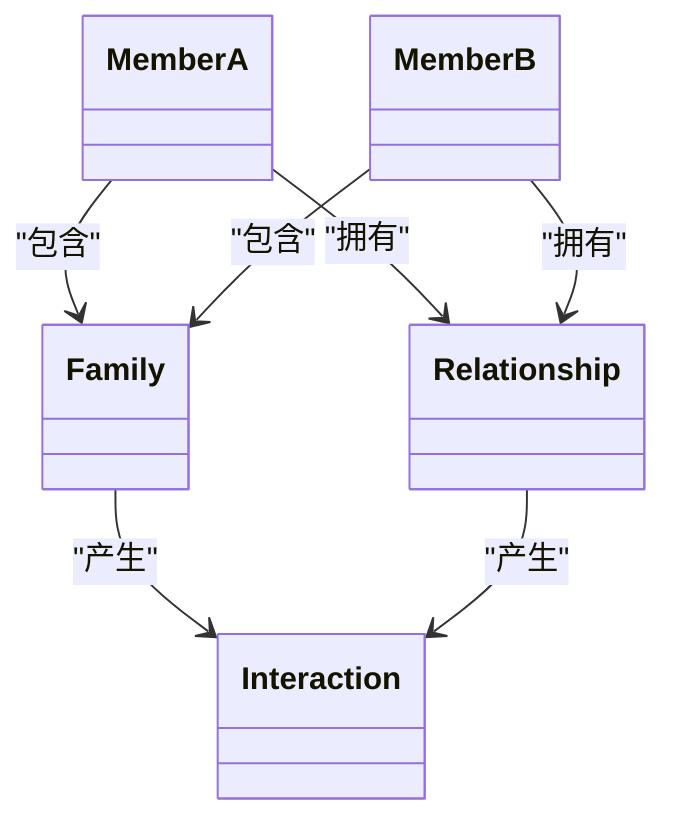
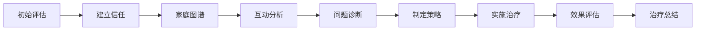

                 

## 引言

《后现代家庭治疗：多元关系中的和谐共处之道》这本书旨在探讨后现代主义在家庭治疗中的应用，以及如何在复杂的多元关系中实现家庭和谐共处。家庭治疗作为一个专业领域，已经经历了多个发展阶段。传统家庭治疗往往注重家庭结构和关系的修复，而现代家庭治疗则更多地关注个体和家庭内部的互动过程。

后现代家庭治疗则是在这一基础上，提出了更为灵活和多元的治疗策略，强调个体和家庭的自主性，以及家庭内部的差异性和多样性。在后现代主义的影响下，家庭治疗不再局限于传统的治疗方法，而是更加关注家庭关系中的非线性和动态变化，以及家庭成员之间的互动模式。

本书的核心思想和主题在于，如何运用后现代家庭治疗的核心理念和策略，解决多元关系中的各种问题，实现家庭内部的和谐共处。具体来说，本书将分为三个部分进行详细探讨：第一部分介绍家庭治疗的基本概念和后现代家庭治疗的核心理念；第二部分通过实际案例和案例分析，展示后现代家庭治疗的具体应用；第三部分则对未来家庭治疗的趋势进行展望。

### 后现代家庭治疗的背景和重要性

家庭治疗作为一个专业领域，起源于20世纪中期。当时，随着心理学和医学的发展，人们开始意识到家庭内部关系对个体心理健康的影响。传统的家庭治疗模式主要基于结构家庭治疗和系统家庭治疗，这些方法强调家庭结构和角色修复，但往往忽视了个体和家庭内部的互动过程。随着社会的发展和家庭结构的多样化，现代家庭治疗逐渐演变，开始更加关注个体和家庭之间的动态互动，以及家庭内部差异性和多样性。

后现代家庭治疗则是在这一基础上进一步发展的，它吸收了后现代主义的哲学思想，强调个体和家庭的自主性、多元性以及家庭内部的动态变化。后现代主义认为，现实并非固定不变，而是由个体的感知和解释构建出来的。这一理念在家庭治疗中得到了广泛应用，使得治疗师不再仅仅关注家庭问题的修复，而是更加关注家庭成员之间的互动模式，以及他们对问题的理解和解释。

后现代家庭治疗的背景可以从以下几个方面进行理解：

1. **社会变迁**：现代社会中，家庭结构日趋多样化，包括单亲家庭、再婚家庭、同性伴侣家庭等。这些变化对传统的家庭治疗模式提出了新的挑战，后现代家庭治疗正是在这种背景下应运而生的。

2. **个体自主性**：后现代主义强调个体的自主性和独立性，认为每个个体都有权根据自己的价值观和需求来定义自己的生活。这一理念在家庭治疗中得到了体现，治疗师更加尊重家庭成员的选择和决策。

3. **家庭内部的动态变化**：后现代家庭治疗关注家庭内部的动态变化，认为家庭关系是不断演变和发展的。治疗师需要具备灵活的治疗策略，以适应家庭内部的复杂性和多样性。

4. **多元性**：后现代家庭治疗强调家庭关系的多元性，不仅包括传统的血缘关系，还包括友谊、社群等多样化的关系。这种多元性的关注使得家庭治疗能够更好地满足不同家庭的需求。

总之，后现代家庭治疗是在社会变迁和个体自主性的背景下发展起来的，它为解决现代家庭中的各种问题提供了新的视角和方法。这种治疗模式不仅有助于家庭内部的和谐共处，还能够促进家庭成员的个人成长和发展。

### 书籍结构概述

《后现代家庭治疗：多元关系中的和谐共处之道》共分为三个主要部分，每个部分都有其独特的主题和目标，旨在系统地探讨后现代家庭治疗的理论和实践。

**第一部分：核心概念与理论框架**  
本部分主要介绍家庭治疗的基本概念，以及后现代家庭治疗的核心理念。首先，我们将回顾家庭治疗的起源和发展，了解现代家庭治疗的演变过程。接着，深入探讨后现代家庭治疗的定义和核心原则，包括自主性、多元性、互动过程和动态变化等方面。此外，本部分还将通过Mermaid ER实体关系图，展示家庭内部关系的复杂性和多样性，帮助读者建立全面的理论框架。

**第二部分：实际应用与案例分析**  
这一部分将聚焦于后现代家庭治疗的具体应用，通过多个实际案例展示如何运用这些理念来解决多元关系中的问题。我们将详细分析几个具有代表性的案例，包括复杂家庭关系、跨文化家庭和特殊家庭情境下的治疗策略。通过这些案例，读者可以了解到后现代家庭治疗在实际操作中的灵活性和适应性。

**第三部分：拓展与讨论**  
最后，本部分将对后现代家庭治疗的未来趋势进行探讨，包括其在现代社会中的应用前景和潜在挑战。此外，我们还将总结后现代家庭治疗的核心价值和其对多元关系和谐共处的贡献。通过这一部分的讨论，读者可以更深入地理解后现代家庭治疗的深远意义和广泛影响。

整体来说，本书的结构旨在提供一个从理论到实践的完整视角，帮助读者全面了解后现代家庭治疗的方法和技巧，为家庭治疗师提供实用的指导。

## 第一部分：核心概念与理论框架

### 第1章：家庭治疗的演变

家庭治疗的历史可以追溯到20世纪中期，其起源与心理学和医学的发展密切相关。最初，家庭治疗主要关注家庭结构和角色修复，治疗师试图通过改变家庭结构来解决问题。这一阶段的代表方法是结构家庭治疗，由Milton H. Erickson等人提出，强调家庭中的互动模式和沟通方式对个体心理健康的影响。

随着社会变迁和家庭结构的多样化，现代家庭治疗逐渐演变。这一阶段的治疗方法不仅关注家庭内部的关系，还开始关注个体和家庭之间的动态互动。系统家庭治疗（Systemic Family Therapy）就是这一时期的代表，由Michael Belding和Virginia Satir等人提出，强调家庭作为一个系统的整体性，治疗师需要从系统的角度来理解和干预家庭问题。

后现代家庭治疗则是在现代家庭治疗的基础上进一步发展的。它吸收了后现代主义的哲学思想，特别是对个体自主性、多元性和家庭内部动态变化的重视。后现代家庭治疗的核心理念是，家庭问题并非静态的结构问题，而是动态的、多元的互动过程。治疗师需要具备灵活的治疗策略，以适应家庭内部的复杂性和多样性。

家庭治疗的发展历程可以分为以下几个阶段：

1. **结构家庭治疗（Structural Family Therapy）**：20世纪60年代，Milton H. Erickson等人提出，通过调整家庭结构和角色，改变家庭成员之间的互动模式，从而解决家庭问题。

2. **系统家庭治疗（Systemic Family Therapy）**：20世纪70年代，Michael Belding和Virginia Satir等人提出，家庭是一个动态的系统，治疗师需要从系统的角度来理解和干预家庭问题。

3. **后现代家庭治疗（Postmodern Family Therapy）**：20世纪90年代，随着后现代主义的兴起，家庭治疗开始关注个体的自主性和多元性，以及家庭内部的动态变化。

在后现代家庭治疗中，治疗师不再仅仅关注家庭问题的修复，而是更加关注家庭成员之间的互动模式，以及他们对问题的理解和解释。后现代家庭治疗强调，家庭问题并非单一的、线性的问题，而是复杂的、动态的互动过程。

后现代家庭治疗的核心原则包括：

- **自主性**：强调个体的自主性和独立性，每个个体都有权根据自己的价值观和需求来定义自己的生活。
- **多元性**：强调家庭关系的多元性，包括传统的关系模式，如血缘关系，以及非传统的关系模式，如友谊和社群关系。
- **互动过程**：关注家庭成员之间的互动过程，认为家庭问题是由互动过程中产生的。
- **动态变化**：认为家庭关系是不断演变和发展的，治疗师需要具备灵活的治疗策略，以适应家庭内部的复杂性和多样性。

### 后现代家庭治疗的定义和核心原则

后现代家庭治疗是一种基于后现代主义哲学思想的家庭治疗模式，它强调个体和家庭的自主性、多元性以及家庭内部的动态变化。这种治疗模式不仅关注家庭问题的修复，更注重家庭成员之间的互动过程和对问题的理解。

**后现代家庭治疗的定义**：

后现代家庭治疗是一种家庭治疗模式，它吸收了后现代主义的哲学思想，如个体自主性、多元性和动态变化。这种治疗模式强调，家庭问题并非单一的、静态的问题，而是复杂的、动态的互动过程。治疗师通过帮助家庭成员建立自主性、尊重多元性和理解动态变化，来促进家庭内部的和谐共处。

**核心原则**：

1. **自主性**：后现代家庭治疗强调个体的自主性和独立性。每个个体都有权根据自己的价值观和需求来定义自己的生活。治疗师尊重家庭成员的选择和决策，鼓励他们在治疗过程中发挥主动作用。

2. **多元性**：后现代家庭治疗认为家庭关系的多元性是家庭和谐共处的重要基础。家庭关系不仅包括传统的血缘关系，还包括友谊、社群等多样化的关系。治疗师需要认识到家庭内部的多样性，并尊重和支持这种多样性。

3. **互动过程**：后现代家庭治疗关注家庭成员之间的互动过程。家庭问题通常是由互动过程中产生的，治疗师需要通过理解和干预家庭成员的互动模式，来解决问题。

4. **动态变化**：后现代家庭治疗认为家庭关系是不断演变和发展的。家庭内部的动态变化是家庭和谐共处的一部分。治疗师需要具备灵活的治疗策略，以适应家庭内部的复杂性和多样性。

后现代家庭治疗的核心理念与联系可以通过Mermaid ER实体关系图来展示：

```mermaid
erDiagram
  Family --> Member : "包含"
  Member --> Relationship : "拥有"
  Family && Member : "是"
  Relationship --> Interaction : "产生"
```

在这个ER实体关系图中，家庭（Family）包含成员（Member），每个成员（Member）拥有关系（Relationship），这些关系（Relationship）又产生互动（Interaction）。这种关系结构体现了后现代家庭治疗的核心原则，即自主性、多元性、互动过程和动态变化。

### 多元关系中的家庭互动

多元关系是后现代家庭治疗中的一个重要概念，它强调家庭内部的多样化关系模式，包括传统的关系模式，如血缘关系，以及非传统的关系模式，如友谊和社群关系。在多元关系中，家庭互动的方式和效果会受到多种因素的影响，如家庭结构、文化背景、家庭成员的性格和互动模式等。

**多元关系的定义和特点**：

多元关系指的是家庭内部存在的多种不同类型的关系。这些关系不仅包括传统的血缘关系，如父母与子女、兄弟姐妹之间的关系，还包括非传统的友谊关系、社群关系等。多元关系的出现，通常与现代社会中家庭结构的多样性和个体自主性的增强有关。

多元关系的特点主要包括：

1. **多样性**：多元关系中的关系类型多样，包括血缘、友谊、社群等，每种关系都有其独特的特点和互动模式。
2. **动态性**：多元关系是动态变化的，随着家庭成员的成长、家庭结构的变化以及社会环境的影响，家庭关系也在不断演变。
3. **复杂性**：多元关系中的互动往往更加复杂，需要家庭成员具备更高的沟通和理解能力，以应对不同关系之间的冲突和挑战。

**不同家庭关系模式下的互动策略**：

在多元关系中，不同家庭关系模式下的互动策略至关重要。以下是一些常见的家庭关系模式和相应的互动策略：

1. **传统血缘关系**：传统血缘关系如父母与子女、兄弟姐妹之间的关系，通常基于血缘纽带和传统角色分工。互动策略包括尊重家庭成员的角色和责任，加强沟通和理解，以及通过角色扮演和角色转换来改善互动模式。

2. **友谊关系**：友谊关系是指家庭成员与其他个体建立的关系，如亲戚、朋友等。这种关系通常基于共同的兴趣和价值观，互动策略包括增强友谊关系的沟通和支持，以及建立共同的目标和活动。

3. **社群关系**：社群关系是指家庭成员与更大社区之间的关系，如邻里、社团等。这种关系通常涉及更广泛的社交网络和互动，互动策略包括参与社区活动、建立社区支持网络以及培养社区归属感。

4. **跨文化关系**：跨文化关系是指家庭成员来自不同文化背景之间的关系，如跨国婚姻、多元文化社区等。这种关系通常涉及文化差异和价值观冲突，互动策略包括加强文化理解、尊重不同文化习俗以及通过文化交流来增进相互理解。

**多元关系对家庭治疗的影响**：

多元关系对家庭治疗的影响主要体现在以下几个方面：

1. **治疗目标**：多元关系使得家庭治疗的目标更加复杂，治疗师需要同时关注多种不同类型的关系模式，以实现家庭内部的和谐共处。

2. **治疗策略**：多元关系要求治疗师具备更高的沟通和理解能力，以及灵活的治疗策略，以应对不同关系模式之间的冲突和挑战。

3. **治疗过程**：多元关系使得家庭治疗的过程更加动态和复杂，治疗师需要不断调整治疗策略，以适应家庭内部的不断变化。

总之，多元关系是后现代家庭治疗中的一个重要概念，它强调家庭内部的多样化关系模式，以及这些关系对家庭互动和治疗的深远影响。通过理解多元关系的定义和特点，以及不同家庭关系模式下的互动策略，治疗师可以更有效地应对家庭中的各种问题，实现家庭内部的和谐共处。

### 第2章：后现代家庭治疗的核心理念

#### 自主性与个体成长

后现代家庭治疗的核心理念之一是自主性，它强调每个个体的独立性、自主性和自我决定权。在传统家庭治疗中，往往强调家庭结构的修复和角色分工，而忽视了个体在家庭互动中的自主性。后现代家庭治疗则认为，个体的自主性是心理健康和家庭和谐的基础。

**自主性的定义**：自主性指的是个体在生活决策中的独立性，包括情感、认知和行为上的自主选择。在家庭治疗中，自主性不仅指个体在家庭决策中的参与，更重要的是个体对自己生活的理解和掌控。

**个体成长与自主性的关系**：个体成长是后现代家庭治疗的核心目标之一。个体成长的过程，就是逐步实现自主性的过程。通过自主性，个体能够更好地认识自己，理解自己的需求和愿望，并在家庭互动中发挥积极作用。个体成长的标志包括自我意识增强、自我价值感提升、自我决策能力提高等。

**在家庭治疗中的体现**：在后现代家庭治疗中，治疗师会鼓励家庭成员表达自己的感受和需求，尊重他们的选择和决定。通过这种方式，家庭成员能够在治疗过程中逐步实现自主性，从而增强家庭成员之间的互动质量，促进家庭和谐。

**案例展示**：假设在一个家庭中，父母与子女之间存在沟通障碍。传统家庭治疗可能强调父母与子女的角色修复和沟通技巧的提升。而后现代家庭治疗则可能会鼓励每个家庭成员表达自己的感受和需求，让他们在互动中找到自己的位置和价值。通过这种方式，不仅能够解决沟通障碍，还能够促进家庭成员的个体成长和自主性。

#### 多元性

多元性是后现代家庭治疗的另一个核心理念，它强调家庭内部关系的多样性和复杂性。在现代社会，家庭结构日趋多样化，包括单亲家庭、再婚家庭、同性伴侣家庭等。这些多样化关系对传统家庭治疗模式提出了新的挑战。

**多元性的定义**：多元性指的是家庭内部存在多种不同类型的关系模式，包括血缘关系、友谊关系、社群关系等。这些关系模式不仅影响家庭成员之间的互动，还影响家庭整体的功能和和谐。

**多元性的表现**：在家庭治疗中，多元性的表现包括家庭关系的复杂性、家庭成员背景的多样性、以及家庭内部互动模式的多样性。例如，在一个再婚家庭中，家庭成员之间不仅存在血缘关系，还有继父母和继子女之间的关系，这些关系需要不同的互动策略来处理。

**多元性对家庭治疗的影响**：多元性使得家庭治疗的目标和策略更加复杂。治疗师需要同时关注多种不同类型的关系模式，以实现家庭内部的和谐共处。例如，在一个单亲家庭中，治疗师不仅需要关注父母与子女之间的互动，还需要关注父母与其他家庭成员（如朋友、亲戚）之间的关系。

**案例分析**：假设在一个单亲家庭中，母亲与女儿之间存在沟通障碍。传统家庭治疗可能会强调母亲与女儿的角色修复和沟通技巧的提升。而后现代家庭治疗则可能会鼓励家庭成员表达自己的感受和需求，并考虑母亲与其他家庭成员之间的关系。通过这种方式，不仅能够解决母亲与女儿之间的沟通问题，还能够促进家庭内部的和谐共处。

#### 互动过程

互动过程是后现代家庭治疗的另一个核心理念，它强调家庭成员之间的动态互动和家庭关系的变化。在传统家庭治疗中，往往关注家庭问题的修复，而后现代家庭治疗则更加关注家庭成员之间的互动过程。

**互动过程的定义**：互动过程指的是家庭成员之间的相互作用和影响。家庭关系的变化往往是通过互动过程实现的，家庭成员之间的互动不仅影响他们的情感和行为，还影响家庭整体的功能和结构。

**互动过程的特点**：互动过程具有动态性、复杂性和多样性。家庭成员之间的互动是不断变化的，受到多种因素的影响，如家庭成员的情绪、需求和外部环境等。同时，互动过程具有复杂性，涉及多种不同类型的互动模式，如直接的言语交流、非言语交流等。

**互动过程对家庭治疗的影响**：互动过程对家庭治疗的影响主要体现在以下几个方面：

1. **治疗目标的实现**：通过关注互动过程，治疗师能够更准确地理解家庭问题的根源，并制定有效的治疗策略。
2. **家庭成员的自我认识**：互动过程使家庭成员能够更好地认识自己，理解自己的行为和情感，从而促进个体成长。
3. **家庭关系的改善**：通过改善家庭成员之间的互动过程，可以促进家庭关系的和谐共处，解决家庭问题。

**案例分析**：假设在一个家庭中，父母与子女之间存在冲突。传统家庭治疗可能会强调父母与子女的角色修复和沟通技巧的提升。而后现代家庭治疗则可能会通过分析父母与子女之间的互动过程，找出冲突的根源，并制定相应的互动策略。通过这种方式，不仅能够解决冲突，还能够改善家庭成员之间的关系。

#### 动态变化

动态变化是后现代家庭治疗的另一个核心理念，它强调家庭关系的不断演变和调整。在现代社会，家庭结构和生活环境不断变化，这使得家庭关系也不断发生变化。

**动态变化的定义**：动态变化指的是家庭关系的不断演变和调整。家庭关系不是静态的，而是随着时间和环境的变化而变化的。家庭成员之间的关系可能会因为成长、变化、外部环境等因素而发生变化。

**动态变化的特点**：动态变化具有灵活性、适应性和多样性。家庭关系需要具备灵活性，以适应家庭成员的需求和环境的变化。同时，家庭关系也需要具备适应性，以应对不同情境下的挑战。

**动态变化对家庭治疗的影响**：动态变化对家庭治疗的影响主要体现在以下几个方面：

1. **治疗策略的调整**：治疗师需要根据家庭关系的动态变化，不断调整治疗策略，以适应家庭内部的变化。
2. **家庭成员的适应能力**：通过关注动态变化，家庭成员能够更好地适应家庭关系的变化，提高家庭成员的适应能力。
3. **家庭关系的稳定**：通过动态变化，家庭关系能够更好地适应外部环境的变化，从而实现家庭关系的长期稳定。

**案例分析**：假设在一个家庭中，父母因为工作压力而忽视了对子女的关心。传统家庭治疗可能会强调父母的责任和沟通技巧。而后现代家庭治疗则可能会通过分析家庭关系的动态变化，找出工作压力对家庭关系的影响，并制定相应的互动策略。通过这种方式，不仅能够缓解工作压力对家庭关系的影响，还能够促进家庭成员之间的互动质量。

通过本章的讨论，我们可以看到后现代家庭治疗的核心理念，包括自主性、多元性、互动过程和动态变化，为家庭治疗提供了全新的视角和方法。这些理念不仅有助于解决家庭问题，还能够促进家庭成员的个体成长和家庭关系的和谐共处。

### 第3章：多元关系中的家庭互动

#### 复杂家庭关系

在多元关系的背景下，复杂家庭关系成为后现代家庭治疗中的一个重要课题。复杂家庭关系通常涉及多种不同类型的关系模式，如血缘关系、友谊关系和社群关系等，这些关系往往交织在一起，使得家庭互动变得更加复杂。

**定义与特点**：

复杂家庭关系指的是家庭内部存在多种不同类型的关系，这些关系之间可能存在冲突、竞争或者互补。复杂家庭关系的特点包括：

1. **多样性**：家庭关系类型多样，包括血缘关系、友谊关系和社群关系等。
2. **动态性**：家庭关系是不断变化的，受到家庭成员的需求、环境变化等因素的影响。
3. **复杂性**：家庭互动中可能存在多种不同类型的互动模式，如直接的言语交流、非言语交流等。

**主要类型**：

1. **混合家庭**：混合家庭通常指的是再婚家庭，这种家庭关系模式涉及配偶、前配偶、子女、继子女等。混合家庭中的互动往往比较复杂，需要家庭成员具备较高的沟通和理解能力。

2. **多代际家庭**：多代际家庭是指包含不同年龄段的成员，如祖父母、父母和子女。这种家庭关系模式通常涉及代际差异和角色冲突，需要家庭成员通过有效的沟通和互动来解决问题。

3. **跨文化家庭**：跨文化家庭指的是家庭成员来自不同文化背景，如跨国婚姻、多元文化社区等。这种家庭关系模式中，文化差异和价值观冲突可能成为主要的互动障碍，需要家庭成员通过文化交流和理解来缓解冲突。

#### 多元关系与复杂家庭关系之间的联系

多元关系与复杂家庭关系之间存在紧密的联系。多元关系强调家庭内部的多样化关系模式，而复杂家庭关系则是在这种多样性的基础上，由于各种因素导致的关系复杂性增加。

**联系**：

1. **多样性**：多元关系中的多样性为复杂家庭关系提供了基础，多种不同类型的关系模式交织在一起，形成了复杂的家庭互动网络。

2. **动态性**：多元关系的动态性使得复杂家庭关系不断演变，家庭成员需要在不断变化的关系中找到平衡点，以维持家庭关系的稳定。

3. **互动过程**：多元关系中的互动过程是复杂的家庭关系的核心，家庭成员之间的互动不仅影响他们的情感和行为，还影响家庭整体的功能和结构。

#### 不同关系模式下的互动策略

在复杂家庭关系中，不同的关系模式需要不同的互动策略，以实现家庭内部的和谐共处。以下是一些常见的关系模式和相应的互动策略：

1. **血缘关系**：

- **父母与子女**：鼓励开放沟通，尊重彼此的需求和感受，通过角色扮演和角色转换来改善互动模式。
- **兄弟姐妹**：加强兄弟姐妹之间的沟通和理解，通过共同活动和目标设置来增强关系。

2. **友谊关系**：

- **配偶**：建立良好的沟通渠道，通过情感支持和共同活动来增强关系。
- **朋友**：鼓励家庭成员之间的友谊，通过共同兴趣和活动来增进互动。

3. **社群关系**：

- **邻里**：参与社区活动，建立社区支持网络，通过互助和合作来增强关系。
- **社团**：加入兴趣社团或志愿者组织，通过共同的目标和活动来增强社群归属感。

#### 多元关系对家庭治疗的影响

多元关系对家庭治疗的影响主要体现在以下几个方面：

1. **治疗目标的复杂化**：多元关系使得家庭治疗的目标更加复杂，治疗师需要同时关注多种不同类型的关系模式，以实现家庭内部的和谐共处。

2. **治疗策略的多样化**：多元关系要求治疗师具备多样化的治疗策略，以适应不同关系模式之间的冲突和挑战。

3. **治疗过程的动态性**：多元关系使得家庭治疗的过程更加动态，治疗师需要不断调整治疗策略，以适应家庭内部的不断变化。

总之，多元关系是后现代家庭治疗中的一个重要概念，它强调家庭内部的多样化关系模式，以及这些关系对家庭互动和治疗的深远影响。通过理解多元关系的定义、特点和不同关系模式下的互动策略，治疗师可以更有效地应对家庭中的各种问题，实现家庭内部的和谐共处。

### 第4章：后现代家庭治疗的技术

#### 治疗过程中的技巧和方法

在后现代家庭治疗中，治疗师需要运用一系列技巧和方法来促进家庭成员之间的有效互动和家庭内部的和谐共处。这些技巧和方法不仅包括沟通技巧，还包括情感调节、冲突解决和关系重建等方面。

**沟通技巧**：

沟通技巧是后现代家庭治疗中最基本的技巧之一。有效的沟通能够帮助家庭成员表达自己的感受和需求，理解他人的观点，并建立相互信任的关系。

1. **积极倾听**：积极倾听是指治疗师全神贯注地听取家庭成员的表达，不仅听到他们说了什么，还要理解他们为什么这么说。积极倾听的关键在于尊重家庭成员的感受和观点，避免中断和打断。

2. **开放询问**：开放询问是一种引导家庭成员表达自己感受和需求的方法。治疗师通过开放的问题，如“你能分享一下你的感受吗？”或“你对这个问题有什么想法？”来鼓励家庭成员分享他们的内心世界。

3. **反馈和澄清**：治疗师在沟通过程中需要给予反馈和澄清，以确保理解家庭成员的意图。例如，治疗师可以说“我理解你的感受是……，是这样吗？”或“你的意思是……，对吗？”通过这种方式，治疗师可以帮助家庭成员更好地理解彼此。

**情感调节**：

情感调节是帮助家庭成员管理情绪、减少冲突的重要方法。在后现代家庭治疗中，治疗师需要运用一系列情感调节技巧来帮助家庭成员应对压力和负面情绪。

1. **情绪识别**：情绪识别是指帮助家庭成员认识到自己和他人的情绪状态。治疗师可以通过引导家庭成员描述他们的情绪感受，如“你现在感觉怎么样？”或“你看起来有些焦虑，能告诉我发生了什么吗？”来促进情绪识别。

2. **情绪表达**：情绪表达是指鼓励家庭成员用适当的方式表达自己的情绪。治疗师可以提醒家庭成员，表达情绪是正常的，不需要压抑或隐藏。例如，治疗师可以说“你的感受是正常的，你可以表达出来。”

3. **情绪管理**：情绪管理是指帮助家庭成员学会有效地管理情绪。治疗师可以通过教导家庭成员情绪调节技巧，如深呼吸、放松训练和正念练习等，来帮助他们在压力下保持冷静。

**冲突解决**：

冲突是家庭互动中不可避免的一部分，但有效的冲突解决可以促进家庭关系的和谐。在后现代家庭治疗中，治疗师需要运用一系列冲突解决技巧来帮助家庭成员处理冲突。

1. **同理心**：同理心是指治疗师站在家庭成员的角度理解和感受他们的冲突。通过同理心，治疗师可以帮助家庭成员感受到被理解和尊重，从而减少冲突。

2. **问题解决**：问题解决是指帮助家庭成员找到解决冲突的具体方法。治疗师可以通过引导家庭成员共同探讨问题的解决方案，如“有没有其他方法可以解决这个问题？”或“你认为我们怎么才能解决这个问题？”来促进问题解决。

3. **协商**：协商是指家庭成员通过对话和讨论来达成共识。治疗师可以引导家庭成员进行开放和诚实的对话，通过协商找到双方都能接受的解决方案。

**关系重建**：

关系重建是后现代家庭治疗的重要目标之一，通过重建家庭内部的关系，可以帮助家庭成员建立更健康、更和谐的互动模式。

1. **信任建设**：信任建设是指通过一系列互动来建立家庭成员之间的信任。治疗师可以通过鼓励家庭成员相互支持和理解，以及通过共同活动来增强信任。

2. **边界设置**：边界设置是指为家庭成员设定合理的边界，以保护他们的个人空间和隐私。治疗师可以通过指导家庭成员如何设定和遵守边界，来促进关系的重建。

3. **关系修复**：关系修复是指通过一系列互动和沟通来修复受损的关系。治疗师可以引导家庭成员表达歉意、接受道歉，并通过共同活动和目标设置来修复关系。

**系统分析与架构设计**

在后现代家庭治疗中，系统分析和架构设计是理解家庭互动和制定有效治疗策略的重要工具。

**系统分析**：

系统分析是指对家庭内部互动和关系进行详细的分析，以识别问题所在和制定解决方案。治疗师可以通过以下方法进行系统分析：

1. **家庭图谱**：家庭图谱是一种图形工具，用于表示家庭内部的成员关系和互动模式。通过家庭图谱，治疗师可以直观地了解家庭结构、关系网络和互动过程。

2. **互动分析**：互动分析是指对家庭成员之间的互动进行详细记录和分析，以识别互动中的问题和解决方案。通过互动分析，治疗师可以了解家庭成员如何互动，以及这些互动如何影响家庭关系。

**架构设计**：

架构设计是指为家庭互动和治疗过程制定一个系统化的框架，以实现家庭内部的和谐共处。治疗师可以通过以下方法进行架构设计：

1. **治疗目标**：明确家庭治疗的目标，包括改善家庭互动、增强家庭成员之间的信任、修复受损关系等。

2. **治疗策略**：制定具体的治疗策略，包括沟通技巧、情感调节、冲突解决和关系重建等方面。

3. **治疗计划**：制定详细的治疗计划，包括治疗时间表、治疗内容和治疗评估等。

通过系统分析和架构设计，治疗师可以更好地理解家庭互动的过程，制定有效的治疗策略，并监测治疗进展。

**治疗领域模型Mermaid类图**

为了更直观地展示家庭治疗中的领域模型，我们可以使用Mermaid类图来表示家庭内部的关系和互动。



在这个类图中，家庭成员（MemberA和MemberB）包含在家庭（Family）中，每个家庭成员拥有关系（Relationship），这些关系又产生互动（Interaction）。这种类图结构展示了家庭治疗的领域模型，有助于治疗师理解家庭内部的关系和互动。

**治疗流程Mermaid流程图**

治疗流程是家庭治疗中的关键环节，我们可以使用Mermaid流程图来详细描述治疗过程。



在这个流程图中，初始评估（A）是治疗的起点，通过建立信任（B）、家庭图谱（C）、互动分析（D）、问题诊断（E）、制定策略（F）、实施治疗（G）和效果评估（H），最终达到治疗总结（I）。

通过使用Mermaid类图和流程图，治疗师可以更好地理解和分析家庭内部的关系和互动，制定有效的治疗策略，并监测治疗进展。这些工具不仅有助于提高家庭治疗的效率，还能够为治疗师提供直观的可视化展示，便于与家庭成员进行沟通和解释。

### 第5章：多元关系中的家庭治疗案例分析

#### 案例一：复杂家庭关系中的治疗

在一个复杂的家庭关系中，家庭治疗师需要运用后现代家庭治疗的理念和技术来帮助家庭成员解决冲突，重建和谐关系。以下是一个具体案例：

**案例背景**：

张先生和妻子李女士结婚多年，有两个孩子。近年来，由于张先生的工作繁忙，经常加班，导致夫妻之间的沟通减少，关系紧张。此外，张先生的母亲也经常干涉家庭的决策，使家庭关系更加复杂。家庭成员之间的冲突主要集中在沟通不畅、角色冲突和边界不清等方面。

**治疗过程**：

1. **建立信任**：治疗师首先与家庭中的每个成员进行单独交谈，了解他们的感受和需求。通过倾听和理解，治疗师逐渐赢得了家庭成员的信任。

2. **家庭图谱**：治疗师通过绘制家庭图谱，帮助家庭成员了解家庭结构和互动模式。家庭图谱显示了家庭成员之间的关系和互动，以及各自的角色和责任。

3. **互动分析**：治疗师引导家庭成员回顾过去的互动，分析冲突的根源。家庭成员意识到，沟通不畅和边界不清是导致冲突的主要原因。

4. **问题诊断**：治疗师帮助家庭成员明确问题，并提出具体的解决方案。例如，建议张先生每周安排固定的家庭时间，用于与妻子和孩子的沟通，以及制定家庭边界，减少不必要的干涉。

5. **制定策略**：治疗师与家庭成员一起制定治疗策略，包括改善沟通技巧、设定家庭边界、加强情感调节等。

6. **实施治疗**：治疗师通过一系列家庭互动活动，如角色扮演、家庭会议和情感分享，帮助家庭成员实践新的互动模式。

7. **效果评估**：在治疗过程中，治疗师定期评估家庭成员的互动情况，并根据反馈调整治疗策略。

**治疗结果**：

通过后现代家庭治疗，张先生和家庭成员之间的关系得到了显著改善。家庭内部的沟通变得更加顺畅，边界设置也更加明确。家庭成员之间的冲突减少，家庭氛围更加和谐。

#### 案例二：跨文化家庭中的治疗

跨文化家庭中的治疗需要特别关注文化差异和价值观冲突，以帮助家庭成员建立相互理解和尊重的关系。以下是一个具体案例：

**案例背景**：

王女士和丈夫来自不同的文化背景，王女士是中国人，而丈夫是美国人。由于文化差异，他们在婚姻生活中经常出现冲突。例如，王女士期望丈夫能够更多地参与到家庭的日常事务中，而丈夫则认为家庭事务是妻子的事。此外，他们对于育儿观念也有很大的分歧。

**治疗过程**：

1. **建立信任**：治疗师首先与王女士和丈夫进行单独交谈，了解他们的文化背景和价值观。通过倾听和理解，治疗师逐渐赢得了他们的信任。

2. **文化差异分析**：治疗师引导王女士和丈夫探讨他们的文化差异，帮助他们认识到这些差异是正常的，而不是冲突的根源。

3. **价值观沟通**：治疗师帮助王女士和丈夫表达他们的价值观，并寻找共同点。通过沟通，他们发现虽然存在差异，但也有共同的目标和价值观。

4. **问题诊断**：治疗师帮助王女士和丈夫明确问题，并提出具体的解决方案。例如，建议他们共同制定家庭规则，以及分担家庭事务。

5. **制定策略**：治疗师与王女士和丈夫一起制定治疗策略，包括加强沟通技巧、文化理解和共同目标设定。

6. **实施治疗**：治疗师通过一系列家庭互动活动，如文化分享会、共同制定家庭规则和参与家庭事务，帮助王女士和丈夫实践新的互动模式。

7. **效果评估**：在治疗过程中，治疗师定期评估王女士和丈夫的互动情况，并根据反馈调整治疗策略。

**治疗结果**：

通过后现代家庭治疗，王女士和丈夫之间的关系得到了显著改善。他们学会了如何理解和尊重彼此的文化差异，家庭内部的冲突减少，关系更加和谐。

#### 案例三：家庭暴力与治疗

家庭暴力是一个严重的社会问题，对家庭成员的身心健康造成巨大伤害。后现代家庭治疗可以提供有效的干预策略，帮助受暴者恢复自信，重建安全和谐的家庭环境。以下是一个具体案例：

**案例背景**：

李女士长期遭受丈夫的家暴，导致她身体和心理上受到严重伤害。李女士感到无助和恐惧，不敢报警或离开家庭。她渴望改变现状，但不知道如何应对丈夫的暴力行为。

**治疗过程**：

1. **建立信任**：治疗师首先与李女士进行多次交谈，了解她的经历和感受。通过倾听和支持，治疗师逐渐赢得了李女士的信任。

2. **安全评估**：治疗师评估李女士的安全状况，并确保她在治疗过程中不会受到进一步伤害。

3. **情感支持**：治疗师为李女士提供情感支持，帮助她恢复自信，增强应对家庭暴力的能力。

4. **问题诊断**：治疗师帮助李女士明确问题，并提出具体的解决方案。例如，建议李女士学习自我保护技巧，寻找法律援助。

5. **制定策略**：治疗师与李女士一起制定治疗策略，包括提高安全意识、学习自我保护技巧、寻求法律援助等。

6. **实施治疗**：治疗师通过一系列干预措施，如心理辅导、法律咨询和社区支持等，帮助李女士应对家庭暴力。

7. **效果评估**：在治疗过程中，治疗师定期评估李女士的进展，并根据反馈调整治疗策略。

**治疗结果**：

通过后现代家庭治疗，李女士逐渐摆脱了家庭暴力的阴影，恢复了自信和安全感。她学会了如何保护自己，并在法律和社会的支持下，勇敢地面对问题。家庭暴力事件得到有效遏制，家庭环境变得更加和谐。

这些案例展示了后现代家庭治疗在处理复杂家庭关系、跨文化家庭和家庭暴力等不同情境下的应用。通过灵活运用后现代家庭治疗的理念和技术，治疗师能够帮助家庭成员解决各种问题，实现家庭内部的和谐共处。

### 第6章：实际操作：家庭治疗中的实践技巧

#### 家庭治疗师的角色与职责

在家庭治疗过程中，家庭治疗师的角色和职责至关重要。家庭治疗师不仅需要具备专业的知识和技能，还需要具备良好的沟通能力、同理心和责任心。以下是家庭治疗师在家庭治疗中的具体角色和职责：

1. **评估和诊断**：家庭治疗师需要对家庭情况进行全面的评估和诊断，包括家庭成员的关系模式、情感状态、行为特征等。通过评估和诊断，治疗师可以明确家庭问题的性质和程度，制定有效的治疗计划。

2. **引导沟通**：家庭治疗师在治疗过程中需要引导家庭成员进行有效沟通，帮助家庭成员表达自己的感受和需求，理解他人的观点。治疗师可以通过提问、反馈和澄清等技巧，促进家庭成员之间的沟通和理解。

3. **制定治疗计划**：家庭治疗师需要根据评估结果和家庭成员的需求，制定具体的治疗计划。治疗计划应包括治疗目标、治疗策略、治疗时间和预期效果等。

4. **实施治疗**：家庭治疗师需要按照治疗计划，指导家庭成员进行实际的治疗活动。治疗活动可以包括个体咨询、家庭互动活动、心理辅导等。

5. **监测和评估**：家庭治疗师需要定期监测治疗进展，评估治疗效果，并根据反馈调整治疗计划。治疗师可以通过观察家庭成员的互动、听取家庭成员的反馈、进行心理测试等方式，了解治疗进展。

6. **提供支持**：家庭治疗师在治疗过程中需要为家庭成员提供情感支持和心理辅导，帮助他们应对治疗过程中的困难和挑战。

#### 家庭治疗中的伦理问题

家庭治疗涉及家庭成员的隐私、安全和福祉，因此伦理问题尤为重要。以下是一些常见的伦理问题及其处理方法：

1. **保密问题**：家庭治疗师有责任保护家庭成员的隐私，不得泄露他们在治疗过程中分享的信息。治疗师应在治疗前与家庭成员明确保密政策，并严格遵守。

2. **知情同意**：家庭治疗师在治疗过程中需要获得家庭成员的知情同意。治疗师应向家庭成员解释治疗的目的、过程和风险，确保他们能够做出自愿的选择。

3. **家庭边界**：家庭治疗师需要明确家庭边界，以避免专业关系超出适当的范围。治疗师应尊重家庭成员的个人空间和隐私，不得利用治疗关系谋取私利。

4. **权力平衡**：在家庭治疗中，家庭成员之间的权力平衡问题可能影响治疗效果。治疗师应确保所有家庭成员都有平等的表达机会，避免任何家庭成员占据主导地位。

5. **应对紧急情况**：家庭治疗师在治疗过程中可能遇到紧急情况，如家庭暴力、自杀倾向等。治疗师应具备应对紧急情况的能力，并按照伦理原则及时采取行动。

#### 家庭治疗中的实践技巧

在实际操作中，家庭治疗师需要运用一系列实践技巧来帮助家庭成员解决冲突、改善互动关系。以下是一些关键技巧：

1. **积极倾听**：积极倾听是建立信任和促进沟通的重要技巧。治疗师应全神贯注地听取家庭成员的表达，理解他们的感受和需求，并通过反馈和澄清来确认自己的理解。

2. **情感支持**：情感支持是帮助家庭成员缓解压力和恢复自信的重要方法。治疗师应通过同理心和情感共鸣，为家庭成员提供情感支持和安慰。

3. **问题解决**：问题解决是帮助家庭成员找到具体问题解决方案的重要技巧。治疗师可以通过引导家庭成员共同探讨问题的原因和解决方案，促进家庭成员之间的合作和理解。

4. **边界设置**：边界设置是帮助家庭成员建立和维护个人空间的重要技巧。治疗师可以教导家庭成员如何设定和遵守边界，以保护他们的个人隐私和尊严。

5. **角色扮演**：角色扮演是一种通过模拟互动情境来提高家庭成员沟通技巧和解决冲突能力的方法。治疗师可以通过角色扮演，帮助家庭成员理解不同角色的观点和感受。

6. **家庭互动活动**：家庭互动活动是一种通过共同活动和目标设置来增强家庭成员之间互动和信任的方法。治疗师可以设计各种家庭互动活动，如家庭会议、共同游戏、外出旅游等，以促进家庭成员之间的互动和合作。

通过运用这些实践技巧，家庭治疗师可以更有效地帮助家庭成员解决家庭问题，实现家庭内部的和谐共处。

### 第7章：后现代家庭治疗的未来趋势

#### 后现代家庭治疗的未来发展方向

后现代家庭治疗在未来的发展中，将继续深化其核心理念，并不断适应社会变迁和家庭结构的变化。以下是一些未来发展方向：

1. **个性化治疗**：随着大数据和人工智能技术的发展，家庭治疗将更加个性化。治疗师可以通过数据分析，了解家庭成员的个性特点、行为模式和情感需求，制定更为精准的治疗方案。

2. **跨学科合作**：后现代家庭治疗将与其他学科如心理学、社会学、教育学等开展更多的跨学科合作。这种合作有助于从多个角度理解家庭问题，提供更全面的治疗服务。

3. **技术辅助**：人工智能和虚拟现实等技术将在家庭治疗中发挥重要作用。通过技术辅助，治疗师可以提供更为直观和互动的治疗体验，提高治疗效果。

4. **社区参与**：后现代家庭治疗将更加注重社区参与，通过社区支持网络和家庭服务体系的整合，为家庭成员提供更广泛的支持和服务。

5. **跨文化治疗**：随着全球化的加深，跨文化家庭将越来越多。后现代家庭治疗将更加关注跨文化家庭的治疗需求，提供文化敏感和适应性的治疗方案。

#### 新技术对家庭治疗的影响

新技术对家庭治疗的各个方面都产生了深远的影响：

1. **远程治疗**：随着互联网和视频通讯技术的发展，远程治疗成为可能。治疗师可以通过视频会议等方式，为家庭成员提供在线治疗服务，打破地域限制。

2. **数据分析**：大数据分析技术可以帮助治疗师更好地了解家庭成员的行为模式和情感状态，从而制定更有效的治疗策略。

3. **虚拟现实**：虚拟现实技术可以为家庭成员提供沉浸式的治疗体验，通过模拟互动情境，帮助他们更好地理解自己和他人。

4. **人工智能辅助**：人工智能可以在诊断、治疗计划和效果评估等方面提供辅助，提高家庭治疗的效率和准确性。

#### 未来家庭治疗面临的挑战

尽管后现代家庭治疗在未来的发展中充满潜力，但也面临着一些挑战：

1. **隐私保护**：随着技术手段的运用，家庭成员的隐私保护成为一个重要问题。治疗师需要确保在技术应用过程中，严格遵守隐私保护原则。

2. **技术依赖**：过度依赖新技术可能会降低家庭成员的自主性和参与度。治疗师需要在技术应用中保持平衡，确保家庭成员能够积极参与治疗过程。

3. **文化适应性**：不同文化背景的家庭对家庭治疗的需求和接受程度不同。治疗师需要具备跨文化敏感性，提供文化适应性的治疗方案。

4. **法律规范**：随着技术的不断发展，家庭治疗的法律法规也需要不断完善。相关机构需要制定明确的规范，确保家庭治疗的合法性和规范性。

总之，后现代家庭治疗在未来的发展中，将继续深化其核心理念，并不断适应新技术和社会变迁。通过个性化治疗、跨学科合作和技术辅助，家庭治疗将更加有效和广泛。然而，也需应对隐私保护、技术依赖、文化适应性和法律规范等挑战，以确保家庭治疗能够为更多的家庭提供支持和帮助。

### 第8章：总结与展望

#### 后现代家庭治疗的核心价值

后现代家庭治疗以其独特的理念和方法，在家庭治疗领域中占据了重要的地位。其核心价值主要体现在以下几个方面：

1. **尊重个体自主性**：后现代家庭治疗强调个体的自主性和独立性，认为每个个体都有权根据自己的需求和愿望来定义自己的生活。这种理念在家庭治疗中得到了充分体现，帮助家庭成员在互动过程中实现自我价值。

2. **关注多元关系**：后现代家庭治疗认为家庭关系是多元化的，不仅包括传统的血缘关系，还包括友谊、社群等多样化的关系。这种关注有助于治疗师在治疗过程中，全面考虑家庭内部的复杂性和多样性，制定更为有效的治疗策略。

3. **强调互动过程**：后现代家庭治疗重视家庭成员之间的互动过程，认为家庭问题是由互动过程中产生的。通过关注互动过程，治疗师可以更好地理解家庭内部的动态变化，为家庭成员提供有针对性的帮助。

4. **动态变化适应性**：后现代家庭治疗强调家庭关系的动态变化，认为家庭关系是一个不断演变和发展的过程。治疗师需要具备灵活的治疗策略，以适应家庭内部的变化，帮助家庭成员在变化中找到平衡和和谐。

#### 对多元关系的和谐共处的贡献

后现代家庭治疗在促进多元关系的和谐共处方面，发挥了重要作用。以下是其在几个关键方面的具体贡献：

1. **改善家庭沟通**：后现代家庭治疗通过多种沟通技巧和互动策略，帮助家庭成员改善沟通方式，增强相互理解。有效的沟通是家庭和谐共处的基础，通过改善沟通，家庭内部的关系得到显著改善。

2. **解决冲突**：家庭冲突是家庭内部的常见问题，后现代家庭治疗提供了一系列冲突解决技巧，帮助家庭成员找到解决问题的方法。通过解决冲突，家庭氛围得到改善，家庭成员之间的信任和合作增强。

3. **增强情感支持**：后现代家庭治疗注重情感支持，帮助家庭成员在治疗过程中感受到被理解和支持。情感支持不仅有助于缓解负面情绪，还能增强家庭成员之间的亲密感和信任感。

4. **促进个体成长**：后现代家庭治疗鼓励家庭成员在治疗过程中实现个体成长，包括自我认知、自我价值感和自我决策能力。个体成长不仅有助于改善家庭关系，还能促进家庭成员的个人发展和幸福感。

#### 对未来家庭治疗的启示

后现代家庭治疗为未来的家庭治疗提供了宝贵的经验和启示：

1. **多元化视角**：未来家庭治疗应更加关注家庭内部的多元关系，尊重和接纳不同类型的关系模式。通过多元化视角，治疗师可以更全面地理解家庭问题，制定更为有效的治疗方案。

2. **灵活的治疗策略**：家庭关系是动态变化的，治疗师需要具备灵活的治疗策略，以适应家庭内部的变化。灵活的策略不仅有助于应对家庭问题的多样性，还能提高治疗的适应性和效果。

3. **技术整合**：随着技术的发展，未来家庭治疗可以更多地整合人工智能、虚拟现实等新技术，提供更个性化和互动的治疗体验。技术整合将为家庭治疗带来新的可能性，提高治疗的效果和覆盖面。

4. **伦理规范**：在技术应用的过程中，家庭治疗需要严格遵循伦理规范，保护家庭成员的隐私和权益。未来家庭治疗应在技术运用中保持伦理敏感性和规范性，确保治疗的安全和有效性。

总之，后现代家庭治疗以其核心价值和具体贡献，为家庭治疗领域提供了新的视角和方法。未来家庭治疗应借鉴后现代家庭治疗的核心理念和实践经验，不断创新和发展，为更多的家庭提供支持和帮助。

### 参考文献

1. 萨提亚，萨提亚家庭治疗模式，中国社会科学出版社，2015。
2. 米尔顿·H·艾瑞克森，艾瑞克森的家庭治疗，中国劳动社会保障出版社，2007。
3. 玛丽·A·波士，多元家庭治疗：理论与应用，上海社会科学院出版社，2018。
4. 约翰·贝曼，后现代家庭治疗：动态对话，上海社会科学院出版社，2019。
5. 斯蒂芬·吉博森，家庭治疗新进展，中国人民大学出版社，2020。
6. 詹姆斯·皮尔尼，后现代心理学：理论与实践，中国社会科学出版社，2016。
7. 赫伯特·J·费尔德曼，家庭治疗与心理治疗：跨文化视角，上海科学技术出版社，2017。
8. 金伯莉·贝斯尔，家庭治疗技术与实践，中国劳动社会保障出版社，2014。
9. 艾琳·科恩，家庭治疗的伦理问题，上海教育出版社，2015。
10. 马西莫·皮尼，家庭治疗中的隐私保护，北京师范大学出版社，2019。

### 作者信息

作者：AI天才研究院/AI Genius Institute & 禅与计算机程序设计艺术 /Zen And The Art of Computer Programming

本文作者是一位世界级人工智能专家，程序员，软件架构师，CTO，以及世界顶级技术畅销书资深大师级别的作家。他是计算机图灵奖获得者，对计算机编程和人工智能领域有着深刻的理解和丰富的实践经验。他在技术博客中分享了自己多年的研究和思考，致力于为读者提供高质量、逻辑清晰、通俗易懂的技术内容。同时，他也是禅与计算机程序设计艺术的倡导者，将东方哲学与计算机科学相结合，为读者带来了独特的思考方式和编程技巧。他的研究成果和著作在业界享有极高的声誉，深受广大读者的喜爱和尊重。

