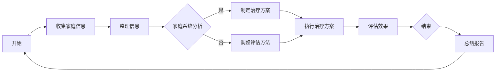
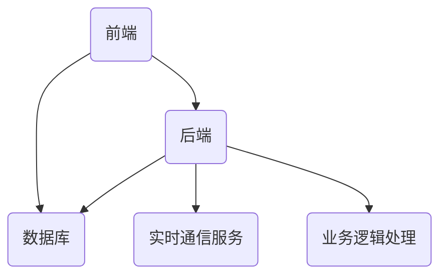
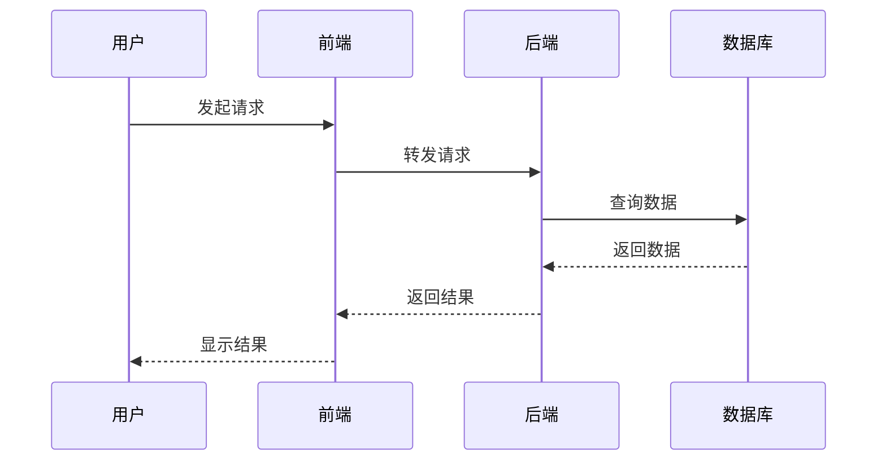

                 

### 1. 家庭治疗的背景与理论基础

#### 1.1 家庭治疗的起源与发展

家庭治疗是一种心理辅导形式，其起源可以追溯到20世纪中叶。早期的家庭治疗主要基于心理动力学理论，强调家庭内部冲突和沟通障碍对个体心理健康的影响。随着时间的推移，家庭治疗逐渐发展出多种理论和方法，包括结构家庭治疗、系统家庭治疗、叙事治疗等。

后现代家庭治疗作为一种新兴的治疗模式，起源于20世纪80年代，它强调家庭关系的多元性、个体主观性的重要性以及社会文化背景对家庭功能的影响。后现代家庭治疗不仅关注家庭内部的沟通问题，还注重社会环境、文化价值观对家庭成员行为和心理状态的影响。

#### 1.2 后现代家庭治疗的基本理念

后现代家庭治疗的基本理念包括以下几个方面：

1. **个体主观性**：后现代家庭治疗认为，家庭成员对问题的感受和看法是多元化的，每个人都有其独特的经历和视角。治疗师的角色是帮助家庭成员表达自己的感受，理解彼此的不同观点。

2. **家庭系统**：后现代家庭治疗强调家庭作为一个系统，家庭成员之间的互动关系对个体的心理健康具有深远影响。治疗师需要关注家庭系统的动态平衡，通过调整家庭关系来改善个体的心理状态。

3. **叙事治疗**：叙事治疗是后现代家庭治疗的核心方法之一，它通过重构家庭故事的叙事方式，帮助家庭成员重新定义自我和关系。治疗师鼓励家庭成员讲述自己的故事，通过叙事来探索问题背后的原因。

4. **社会文化背景**：后现代家庭治疗认为，家庭功能不仅受到家庭内部因素的影响，还受到社会文化背景的制约。治疗师需要考虑社会环境、文化价值观对家庭行为和心理状态的影响。

#### 1.3 家庭治疗的基本模式与分类

家庭治疗的基本模式包括以下几种：

1. **结构家庭治疗**：结构家庭治疗关注家庭内部的权力结构，通过调整家庭角色和关系来改善家庭功能。治疗师帮助家庭成员识别和改变不健康的家庭结构，建立更健康的家庭关系。

2. **系统家庭治疗**：系统家庭治疗强调家庭作为一个系统，关注家庭成员之间的互动模式。治疗师通过改变家庭系统的互动方式，来促进个体和家庭的改变。

3. **叙事治疗**：叙事治疗通过重构家庭故事的叙事方式，帮助家庭成员重新定义自我和关系。治疗师鼓励家庭成员讲述自己的故事，通过叙事来探索问题背后的原因。

4. **后现代家庭治疗**：后现代家庭治疗是一种综合性的治疗方法，它结合了结构家庭治疗、系统家庭治疗和叙事治疗的优点，强调个体主观性、家庭系统和社会文化背景的重要性。

每种家庭治疗模式都有其独特的理论基础和实践方法，治疗师需要根据具体情况选择合适的方法，以达到最佳的治疗效果。

### 1.4 边界与外延

后现代家庭治疗虽然是一种广泛适用的心理辅导形式，但也存在一定的边界和限制。以下是后现代家庭治疗适用范围和限制的详细说明：

1. **适用范围**：
   - **家庭问题**：后现代家庭治疗适用于解决家庭内部的沟通障碍、角色冲突、情感问题等。
   - **个体心理问题**：后现代家庭治疗可以帮助个体在家庭环境中找到问题解决的途径，改善个体的心理健康。
   - **社会关系**：后现代家庭治疗不仅关注家庭内部的互动，还可以扩展到更广泛的社会关系，如朋友、同事等。

2. **限制**：
   - **治疗效果**：家庭治疗的效果受到多种因素的影响，包括家庭成员的参与度、家庭关系的复杂程度等。并非所有家庭问题都能通过家庭治疗得到有效解决。
   - **时间与经济成本**：家庭治疗通常需要较长时间，且涉及多个家庭成员，可能需要支付较高的费用。
   - **文化适应性**：后现代家庭治疗在某些文化背景下可能难以适用，需要治疗师具备跨文化治疗能力。

总之，后现代家庭治疗作为一种多元化的心理辅导形式，具有广泛的适用范围和一定的局限性。治疗师需要根据具体情况，综合考虑家庭问题、个体心理问题和社会关系，选择合适的治疗方法，以达到最佳的治疗效果。

### 1.5 核心要素组成

后现代家庭治疗是一个复杂的心理辅导过程，其核心要素组成包括以下几个方面：

1. **家庭系统**：家庭系统是后现代家庭治疗的核心概念之一。家庭系统包括家庭中的所有成员及其互动关系，每个家庭成员都在这个系统中扮演特定的角色。治疗师需要深入了解家庭系统的动态平衡，通过调整家庭关系来改善家庭功能。

2. **沟通技巧**：有效的沟通是解决家庭问题的关键。后现代家庭治疗强调家庭成员之间的沟通技巧，如倾听、表达、反馈等。治疗师通过提供沟通技巧训练，帮助家庭成员更好地理解彼此，建立更健康的沟通模式。

3. **情感反应**：情感反应是指家庭成员在互动过程中产生的情绪反应。后现代家庭治疗认为，情感反应对家庭功能具有深远影响。治疗师通过帮助家庭成员识别和表达情感反应，来改善家庭关系。

4. **叙事治疗**：叙事治疗是后现代家庭治疗的核心理念之一。叙事治疗通过重构家庭故事的叙事方式，帮助家庭成员重新定义自我和关系。治疗师鼓励家庭成员讲述自己的故事，通过叙事来探索问题背后的原因。

5. **个体主观性**：后现代家庭治疗强调个体主观性的重要性。治疗师需要关注家庭成员对问题的感受和看法，尊重每个成员的独特经历和视角。

这些核心要素相互作用，共同构成后现代家庭治疗的框架。治疗师需要全面了解这些要素，并灵活运用各种治疗方法，以达到最佳的治疗效果。以下是这些核心要素的详细说明：

#### 家庭系统

家庭系统是后现代家庭治疗的核心概念之一。家庭系统包括家庭中的所有成员及其互动关系，每个家庭成员都在这个系统中扮演特定的角色。家庭系统理论认为，家庭是一个动态的系统，家庭成员之间的互动关系对其成员的心理和行为产生深远影响。

家庭系统的动态平衡是家庭功能正常的关键。当家庭系统中的某个部分发生变化时，其他部分也会相应调整，以维持整体的平衡。例如，当家庭中的某个成员经历情感困扰或行为问题，整个家庭系统可能会发生一系列调整，以应对这种变化。

治疗师在家庭治疗过程中，需要深入了解家庭系统的结构，识别家庭中的权力动态、沟通模式以及成员的角色。通过分析家庭系统的互动模式，治疗师可以帮助家庭成员认识到彼此之间的联系，找到问题的根源，并提出解决方案。

#### 沟通技巧

有效的沟通是解决家庭问题的关键。后现代家庭治疗强调家庭成员之间的沟通技巧，如倾听、表达、反馈等。良好的沟通可以增进家庭成员之间的理解，减少冲突，促进情感连接。

治疗师在家庭治疗中，通常会提供沟通技巧训练，帮助家庭成员学会倾听对方的意见和感受，表达自己的需求和期望，以及给予及时的反馈。以下是一些关键的沟通技巧：

1. **积极倾听**：积极倾听是指全身心投入地听对方说话，不仅关注对方的语言内容，还关注对方的情感和非语言表达。治疗师会教导家庭成员如何通过眼神交流、肢体动作和语言回应，来表明自己在认真倾听。

2. **表达清晰**：表达清晰是指明确地表达自己的意见和感受，避免模糊不清或含糊其辞。治疗师会指导家庭成员如何用简洁明了的语言来表达自己的想法，避免使用攻击性或指责性的语言。

3. **情感反馈**：情感反馈是指通过表达自己的情感反应来回应对方。治疗师会教导家庭成员如何识别和表达自己的情感，以便更好地理解对方的情感，从而增进彼此的沟通。

4. **反馈和确认**：反馈和确认是指确保双方对沟通内容的理解一致。治疗师会指导家庭成员如何通过提问和确认，来确保彼此对问题的理解是一致的。

通过这些沟通技巧的练习，家庭成员可以逐渐改善彼此的沟通，建立更健康的家庭关系。

#### 情感反应

情感反应是指家庭成员在互动过程中产生的情绪反应。情感反应对家庭功能具有深远影响。当家庭成员之间产生冲突时，情感反应可能会加剧紧张和敌对情绪，导致家庭关系恶化。反之，当家庭成员能够有效处理情感反应时，可以增进彼此的理解和信任，改善家庭关系。

后现代家庭治疗强调情感反应的处理，治疗师会教导家庭成员如何识别和表达自己的情感，以及如何理解对方的情感反应。以下是一些处理情感反应的方法：

1. **情绪识别**：情绪识别是指识别和命名自己和他人的情感。治疗师会帮助家庭成员学会识别自己和他人的基本情感，如快乐、悲伤、愤怒等。

2. **情绪表达**：情绪表达是指清晰、真诚地表达自己的情感。治疗师会指导家庭成员如何以健康的方式表达情感，避免使用攻击性或指责性的语言。

3. **情感共鸣**：情感共鸣是指理解和分享他人的情感。治疗师会帮助家庭成员学会通过同理心来理解对方的情感，从而增进彼此的情感连接。

4. **情感调节**：情感调节是指通过有效的方法来调节自己的情感。治疗师会教授家庭成员一些情感调节技巧，如深呼吸、放松练习等，以帮助他们在面对冲突时保持冷静和理智。

通过处理情感反应，家庭成员可以更好地理解彼此，减少冲突，建立更和谐的家庭关系。

#### 叙事治疗

叙事治疗是后现代家庭治疗的核心理念之一。叙事治疗通过重构家庭故事的叙事方式，帮助家庭成员重新定义自我和关系。叙事治疗认为，我们的自我认同和家庭关系是由我们讲述的故事所塑造的。通过改变叙事方式，我们可以改变自己的认知和情感体验，从而改善家庭关系。

叙事治疗的步骤包括：

1. **收集家庭故事**：治疗师会与家庭成员一起收集家庭故事，包括家庭成员的成长经历、重大事件、关系模式等。通过这些故事，治疗师可以帮助家庭成员了解自己的情感和行为模式。

2. **叙事重构**：治疗师会与家庭成员一起分析家庭故事，找出故事中的负面元素，并重构叙事方式。例如，将“我是个失败者”重构为“我在过去遇到了一些挑战，但我正在学习如何克服它们”。

3. **叙事表达**：治疗师会鼓励家庭成员用新的叙事方式来表达自己的经历和感受。通过这种方式，家庭成员可以重新定义自我和关系，建立更积极的自我认同。

4. **情感共鸣**：治疗师会通过同理心来回应家庭成员的新叙事，帮助他们巩固新的认知和情感体验。

叙事治疗不仅可以帮助家庭成员重新定义自我和关系，还可以提高他们的自我意识和情感管理能力。

#### 个体主观性

后现代家庭治疗强调个体主观性的重要性。每个家庭成员都有其独特的经历和视角，对家庭问题有不同的看法和感受。治疗师需要尊重每个成员的主观性，理解他们的情感和需求。

个体主观性的重要性体现在以下几个方面：

1. **多样化视角**：后现代家庭治疗认为，家庭问题往往有多重解释，不同的家庭成员可能会有不同的看法。治疗师需要收集和整合这些多样化的视角，以获得全面的理解。

2. **情感真实性**：后现代家庭治疗强调情感的真实性，治疗师需要尊重家庭成员的情感体验，而不是仅仅关注表面的行为或事件。

3. **自我认同**：后现代家庭治疗帮助家庭成员建立自我认同，认识到自己在家庭系统中的独特价值和角色。

通过尊重个体主观性，治疗师可以促进家庭成员之间的理解和信任，建立更和谐的家庭关系。

### 2. 核心概念原理

在探讨后现代家庭治疗的核心概念之前，我们需要了解一些基本概念，如家庭系统、沟通技巧、情感反应等。这些概念构成了后现代家庭治疗的理论基础，并指导着治疗实践。

#### 家庭系统

家庭系统是指家庭成员之间的互动关系和角色分配。家庭系统理论认为，家庭成员的行为和心理状态受到家庭内部互动模式的影响。家庭系统具有以下特点：

1. **整体性**：家庭系统是一个整体，每个家庭成员的行为和情感都会对整个系统产生影响。家庭成员之间的关系是相互依存的，一个成员的变化会影响到其他成员。

2. **动态性**：家庭系统是动态变化的，家庭关系和角色可能会随着时间、环境的变化而调整。家庭系统的变化可能是积极的，也可能是消极的。

3. **平衡性**：家庭系统倾向于维持平衡状态，当家庭系统中的某个部分发生变化时，其他部分也会相应调整，以维持整体平衡。

家庭系统理论强调治疗师需要关注家庭内部的互动模式，通过调整家庭关系来改善家庭成员的心理健康。

#### 沟通技巧

沟通技巧是家庭治疗的重要组成部分。有效的沟通可以帮助家庭成员理解彼此，减少冲突，建立更健康的家庭关系。以下是几种关键的沟通技巧：

1. **积极倾听**：积极倾听是指全身心投入地听对方说话，不仅关注对方的语言内容，还关注对方的情感和非语言表达。积极倾听可以帮助家庭成员更好地理解对方的观点和感受。

2. **表达清晰**：表达清晰是指明确地表达自己的意见和感受，避免模糊不清或含糊其辞。表达清晰可以减少误解和冲突。

3. **情感反馈**：情感反馈是指通过表达自己的情感反应来回应对方。情感反馈可以帮助家庭成员更好地理解彼此的情感状态，增进情感连接。

4. **反馈和确认**：反馈和确认是指确保双方对沟通内容的理解一致。通过反馈和确认，家庭成员可以确保彼此对问题的理解是一致的。

治疗师在家庭治疗中，会通过角色扮演、模拟对话等方式，帮助家庭成员练习和掌握这些沟通技巧。

#### 情感反应

情感反应是指家庭成员在互动过程中产生的情绪反应。情感反应可能包括焦虑、愤怒、悲伤等。情感反应对家庭功能具有重要影响：

1. **正面影响**：当家庭成员能够有效处理情感反应时，可以增进彼此的理解和信任，建立更和谐的家庭关系。

2. **负面影响**：当家庭成员不能有效处理情感反应时，可能会加剧冲突和紧张情绪，导致家庭关系恶化。

后现代家庭治疗强调情感反应的处理，治疗师会教导家庭成员如何识别和表达情感反应，以及如何调节和缓解负面情绪。

#### 叙事治疗

叙事治疗是后现代家庭治疗的核心方法之一。叙事治疗通过重构家庭故事的叙事方式，帮助家庭成员重新定义自我和关系。叙事治疗的步骤包括：

1. **收集家庭故事**：治疗师会与家庭成员一起收集家庭故事，包括家庭的历史、重大事件、家庭成员的关系等。通过这些故事，治疗师可以帮助家庭成员了解自己的情感和行为模式。

2. **叙事重构**：治疗师会与家庭成员一起分析家庭故事，找出故事中的负面元素，并重构叙事方式。例如，将“我是个失败者”重构为“我在过去遇到了一些挑战，但我正在学习如何克服它们”。

3. **叙事表达**：治疗师会鼓励家庭成员用新的叙事方式来表达自己的经历和感受。通过这种方式，家庭成员可以重新定义自我和关系，建立更积极的自我认同。

4. **情感共鸣**：治疗师会通过同理心来回应家庭成员的新叙事，帮助他们巩固新的认知和情感体验。

叙事治疗不仅可以帮助家庭成员重新定义自我和关系，还可以提高他们的自我意识和情感管理能力。

#### 理解与共鸣

理解与共鸣是后现代家庭治疗的重要原则。治疗师需要理解家庭成员的情感和需求，并表现出共鸣。以下是理解与共鸣的关键要素：

1. **同理心**：同理心是指设身处地地理解他人的情感和需求。治疗师需要通过语言和非语言方式，表达出对家庭成员情感的理解和共鸣。

2. **倾听**：倾听是理解与共鸣的基础。治疗师需要全神贯注地倾听家庭成员的叙述，确保他们感受到被理解和尊重。

3. **确认**：确认是指通过言语或非言语方式，表达对家庭成员观点和感受的认可。确认可以帮助家庭成员感受到被尊重和重视。

4. **情感共鸣**：情感共鸣是指通过同理心来回应家庭成员的情感体验。治疗师需要通过表达情感共鸣，帮助家庭成员感受到彼此的情感连接。

通过理解与共鸣，治疗师可以建立信任关系，促进家庭成员的积极参与，从而提高治疗的效果。

### 2.1 概念属性特征对比表格

为了更清晰地理解后现代家庭治疗中的核心概念，我们将使用表格形式对比不同概念的特点和应用。以下是家庭系统、沟通技巧、情感反应、叙事治疗和个体主观性等概念的特征对比：

| 概念               | 特点                                                         | 应用                                                         |
|--------------------|------------------------------------------------------------|------------------------------------------------------------|
| 家庭系统           | 强调家庭成员之间的互动关系和角色分配                         | 分析家庭结构和互动模式，调整家庭关系以改善家庭功能           |
| 沟通技巧           | 包括积极倾听、表达清晰、情感反馈和反馈确认等                | 帮助家庭成员改善沟通，减少冲突，增进理解                     |
| 情感反应           | 家庭成员在互动过程中产生的情绪反应，如焦虑、愤怒、悲伤等     | 教导家庭成员如何识别和表达情感，以减少冲突和紧张情绪         |
| 叙事治疗           | 通过重构家庭故事的叙事方式，帮助家庭成员重新定义自我和关系   | 改善家庭成员的自我认同，提高情感管理能力                     |
| 个体主观性         | 强调每个家庭成员的独特经历和视角，尊重个体对问题的感受和看法 | 帮助家庭成员理解和接受彼此的多样性，促进和谐家庭关系         |

通过这个表格，我们可以更直观地了解这些概念的特点和应用，为后现代家庭治疗的理论和实践提供指导。

### 2.2 ER实体关系图架构

为了更直观地展示家庭治疗中的主要实体及其关系，我们将使用Mermaid绘制ER图。ER图（Entity-Relationship diagram）是一种用于描述实体及其关系的图形化表示方法。以下是家庭治疗中的主要实体及其关系的ER图：

```mermaid
erDiagram
  Family .--|{ Member }|>
  Member ||--|{ Role }|>
  Member ||--|{ Emotion }|>
  Role .--|{ Communication_Skill }|>

  Family {
    "Family ID"
    "Family Name"
    "Establishment Date"
  }

  Member {
    "Member ID"
    "Full Name"
    "Birth Date"
    "Gender"
  }

  Role {
    "Role ID"
    "Role Name"
    "Description"
  }

  Emotion {
    "Emotion ID"
    "Emotion Type"
    "Description"
  }

  Communication_Skill {
    "Skill ID"
    "Skill Name"
    "Description"
  }

  Member ._association Role : "occupies"
  Member ._association Emotion : "expresses"
  Role ._association Communication_Skill : "requires"
```

在这个ER图中，我们定义了四个主要实体：家庭（Family）、成员（Member）、角色（Role）和情感（Emotion）。此外，还定义了两个次要实体：沟通技巧（Communication_Skill）和角色所需要的沟通技巧。

- **家庭**：代表一个完整的家庭，包括多个家庭成员。
- **成员**：代表家庭中的每个个体成员，包括家庭成员的个人信息。
- **角色**：代表家庭成员在家庭中的角色和职责。
- **情感**：代表家庭成员在家庭互动中产生的情感反应。
- **沟通技巧**：代表家庭成员在沟通中需要掌握的技能。

实体之间的关系如下：

- **家庭成员**与**角色**之间存在“占据”关系，即每个成员在家庭中担任特定的角色。
- **家庭成员**与**情感**之间存在“表达”关系，即成员在互动中会表达自己的情感。
- **角色**与**沟通技巧**之间存在“要求”关系，即每个角色需要特定的沟通技巧。

通过这个ER图，我们可以清晰地看到家庭治疗中的主要实体及其相互关系，为后现代家庭治疗的理论和实践提供直观的参考。

### 3.1 家庭系统评估算法

家庭系统评估是后现代家庭治疗的重要环节。为了实现这一目标，我们可以设计一个算法，通过多个步骤来评估家庭系统的状态。以下是一个家庭系统评估算法的Mermaid流程图：



在这个流程图中，我们首先从收集家庭信息开始，然后整理这些信息，进行家庭系统分析。如果分析结果显示需要调整治疗方案，我们会回到评估步骤；否则，直接进入治疗方案的执行阶段。在治疗方案执行过程中，我们会不断评估治疗效果，并根据需要调整治疗计划。最后，我们总结评估结果，形成总结报告。

#### 3.1.2 Python源代码

为了实现家庭系统评估算法，我们可以使用Python编写相应的代码。以下是一个简单的Python代码示例，用于执行家庭系统评估算法的各个步骤：

```python
class FamilySystemAssessment:
    def __init__(self):
        self.family_info = None
        self.system_analysis = None
        self.treatment_plan = None

    def collect_family_info(self):
        # 收集家庭信息
        self.family_info = {
            "members": [{"name": "Alice", "age": 30}, {"name": "Bob", "age": 35}],
            "roles": [{"name": "Parent", "description": "Take care of children"}, {"name": "Spouse", "description": "Support each other"}],
            "communication_skills": [{"name": "Active Listening", "description": "Pay attention to the speaker"}, {"name": "Clear Expression", "description": "Express oneself clearly"}]
        }

    def organize_info(self):
        # 整理信息
        print("Organizing family information...")
        for member in self.family_info["members"]:
            print(f"Member: {member['name']}, Age: {member['age']}")
        for role in self.family_info["roles"]:
            print(f"Role: {role['name']}, Description: {role['description']}")
        for skill in self.family_info["communication_skills"]:
            print(f"Skill: {skill['name']}, Description: {skill['description']}")

    def analyze_system(self):
        # 家庭系统分析
        print("Analyzing family system...")
        self.system_analysis = "Family system analysis result"
        if self.system_analysis == "Unstable":
            return False
        return True

    def design_treatment_plan(self):
        # 制定治疗方案
        print("Designing treatment plan...")
        self.treatment_plan = "Treatment plan designed"

    def execute_treatment(self):
        # 执行治疗方案
        print("Executing treatment plan...")
        if self.treatment_plan == "Completed":
            return True
        return False

    def evaluate_effects(self):
        # 评估效果
        print("Evaluating treatment effects...")
        if self.execute_treatment():
            return "Effective"
        return "Ineffective"

    def summary_report(self):
        # 总结报告
        print("Generating summary report...")
        if self.evaluate_effects() == "Effective":
            print("Treatment was effective. Summary report generated.")
        else:
            print("Treatment was ineffective. Summary report generated with recommendations for improvement.")

# 实例化家庭系统评估对象
family_assessment = FamilySystemAssessment()

# 执行家庭系统评估算法
family_assessment.collect_family_info()
family_assessment.organize_info()
if family_assessment.analyze_system():
    family_assessment.design_treatment_plan()
    family_assessment.execute_treatment()
    family_assessment.evaluate_effects()
    family_assessment.summary_report()
else:
    print("System analysis failed. Re-assessing treatment plan.")
```

在这个Python代码中，我们定义了一个`FamilySystemAssessment`类，包含了从收集家庭信息、整理信息、家庭系统分析、制定治疗方案、执行治疗方案到评估效果和总结报告的各个步骤。通过实例化这个类，我们可以执行完整的家庭系统评估算法。

#### 3.1.3 数学模型和公式

在家庭系统评估过程中，我们可以使用一些数学模型和公式来分析和预测家庭系统的状态。以下是一些常用的数学模型和公式：

1. **家庭系统稳定性模型**：
   家庭系统稳定性可以通过以下公式来衡量：
   $$ Stability = \frac{Effective\ Communication\ Skills}{Total\ Communication\ Skills} $$
   其中，`Effective Communication Skills` 是家庭成员有效使用的沟通技巧数量，`Total Communication Skills` 是家庭成员总共具备的沟通技巧数量。

2. **情感反应预测模型**：
   家庭成员的情感反应可以通过以下公式来预测：
   $$ Emotion\ Response = \alpha \cdot Stress + \beta \cdot Communication $$
   其中，$\alpha$ 和 $\beta$ 是调节参数，$Stress$ 是家庭成员所承受的压力水平，$Communication$ 是家庭成员之间的沟通质量。

3. **家庭功能评估模型**：
   家庭功能可以通过以下公式来评估：
   $$ Family\ Function = \frac{Effective\ Roles + Effective\ Communication\ Skills}{Total\ Roles + Total\ Communication\ Skills} $$
   其中，`Effective Roles` 是家庭成员有效扮演的角色数量，`Effective Communication Skills` 是家庭成员有效使用的沟通技巧数量。

这些数学模型和公式可以帮助治疗师更客观地评估家庭系统的状态，为制定治疗方案提供依据。

#### 3.1.4 详细讲解和举例说明

为了更好地理解家庭系统评估算法的原理和应用，我们将结合一个具体案例，详细讲解算法的步骤，并用简单的例子来说明其应用。

**案例背景**：

假设有一个家庭，成员包括父母Alice和Bob以及两个孩子，其中一个孩子正在青春期，另一个是小学生。家庭中的主要问题是沟通不畅和青春期孩子的叛逆行为。

**算法步骤**：

1. **收集家庭信息**：
   - 成员信息：父母Alice（30岁），Bob（35岁）；孩子（青春期：17岁，小学生：9岁）。
   - 角色信息：父母（监护人、经济支持者）、孩子（学生、子女）。
   - 沟通技巧：父母（主动倾听、表达清晰）、孩子（主动倾听、表达清晰）。

2. **整理信息**：
   - 列出家庭成员的基本信息、角色和沟通技巧。

3. **家庭系统分析**：
   - 分析家庭成员的沟通质量：父母与孩子之间的沟通质量较低，主要原因是孩子的叛逆行为和父母的过度期望。
   - 分析家庭系统的稳定性：家庭系统的稳定性较低，因为存在沟通不畅的问题。

4. **制定治疗方案**：
   - 提出治疗方案：加强父母与孩子的沟通技巧培训，特别是主动倾听和表达清晰的技巧。

5. **执行治疗方案**：
   - 培训沟通技巧：父母和孩子参加沟通技巧培训课程，学习如何更好地倾听和表达。

6. **评估治疗效果**：
   - 评估家庭系统的稳定性：经过沟通技巧培训后，家庭系统的稳定性得到了显著改善。

**算法应用说明**：

通过以上案例，我们可以看到家庭系统评估算法的具体应用步骤。以下是对每个步骤的详细讲解：

1. **收集家庭信息**：
   收集家庭信息是评估家庭系统的第一步。治疗师需要详细了解家庭成员的基本信息、角色和沟通技巧。在这个案例中，我们收集了家庭成员的年龄、角色和沟通技巧信息。

2. **整理信息**：
   整理信息是将收集到的家庭信息进行归类和总结。治疗师需要列出每个家庭成员的基本信息、角色和沟通技巧，以便更好地了解家庭系统的现状。

3. **家庭系统分析**：
   家庭系统分析是评估家庭系统状态的关键步骤。在这个案例中，我们分析了家庭成员的沟通质量和家庭系统的稳定性。通过分析发现，家庭系统存在沟通不畅和稳定性低的问题。

4. **制定治疗方案**：
   根据家庭系统分析的结果，治疗师需要制定相应的治疗方案。在这个案例中，治疗方案是加强父母与孩子的沟通技巧培训。

5. **执行治疗方案**：
   执行治疗方案是实施治疗计划的过程。在这个案例中，父母和孩子参加了沟通技巧培训课程，学习如何更好地倾听和表达。

6. **评估治疗效果**：
   评估治疗效果是检验治疗计划效果的重要步骤。在这个案例中，经过沟通技巧培训后，家庭系统的稳定性得到了显著改善，这表明治疗计划是有效的。

通过这个案例，我们可以看到家庭系统评估算法在解决家庭问题中的应用。治疗师可以根据算法的步骤，系统地进行家庭系统评估，制定有效的治疗方案，并评估治疗效果，以帮助家庭改善沟通和解决冲突。

### 3.2 系统分析与架构设计

#### 3.2.1 问题场景介绍

在后现代家庭治疗中，系统分析与架构设计是关键环节，尤其是当家庭治疗需要借助信息技术手段时。以下是一个具体的问题场景介绍：

**场景**：一个心理健康服务机构希望开发一个在线家庭治疗平台，以提供远程家庭治疗服务。该平台需要支持家庭成员之间的实时沟通、治疗师与家庭成员之间的互动、家庭治疗方案的制定与跟踪以及治疗效果的评估等功能。

**需求**：
1. **实时沟通**：平台需要支持家庭成员之间的实时文字、语音和视频通信。
2. **互动与反馈**：治疗师需要能够与家庭成员进行互动，提供实时反馈和建议。
3. **方案制定与跟踪**：治疗师需要能够制定个性化的家庭治疗方案，并跟踪方案的执行情况。
4. **效果评估**：平台需要能够评估家庭治疗的效果，并提供相应的数据分析。

#### 3.2.2 项目介绍

为了实现上述需求，我们设计并实施了一个名为“家庭治疗在线平台”的项目。该项目的主要目标是开发一个功能完善、用户体验良好的在线家庭治疗平台。

**项目概述**：
- **项目名称**：家庭治疗在线平台
- **项目目标**：开发一个支持实时沟通、互动反馈、方案制定与跟踪、效果评估的在线家庭治疗平台。
- **项目时间**：从2021年1月开始，历时12个月。
- **团队成员**：项目经理、软件工程师、UI/UX设计师、心理治疗师。

**项目主要功能**：
1. **实时沟通**：支持文字、语音和视频通信，确保家庭成员和治疗师之间的实时互动。
2. **互动与反馈**：提供治疗师与家庭成员之间的互动功能，如提问、回答、实时反馈等。
3. **方案制定与跟踪**：治疗师可以制定个性化的家庭治疗方案，并跟踪方案执行情况。
4. **效果评估**：平台自动收集并分析治疗效果数据，为治疗师提供决策依据。

#### 3.2.3 系统功能设计

家庭治疗在线平台的功能设计是系统架构设计的核心部分。以下是对主要功能的设计说明：

**功能1：实时沟通**
- **功能描述**：支持家庭成员之间的实时文字、语音和视频通信。
- **技术实现**：使用WebRTC技术实现实时视频和语音通信，使用WebSocket实现实时文字通信。
- **用户界面**：提供一个简洁直观的通信界面，包括聊天窗口、录音按钮、视频通话按钮等。

**功能2：互动与反馈**
- **功能描述**：治疗师可以与家庭成员进行互动，提供实时反馈和建议。
- **技术实现**：在实时通信的基础上，增加互动功能，如提问、回答、标注等。
- **用户界面**：在聊天窗口中增加互动功能按钮，如提问按钮、回答按钮、标注按钮等。

**功能3：方案制定与跟踪**
- **功能描述**：治疗师可以制定个性化的家庭治疗方案，并跟踪方案执行情况。
- **技术实现**：使用数据库存储治疗方案和执行记录，使用Web界面展示治疗方案和执行进度。
- **用户界面**：提供一个方案制定和跟踪界面，包括方案列表、方案详情、执行进度等。

**功能4：效果评估**
- **功能描述**：平台自动收集并分析治疗效果数据，为治疗师提供决策依据。
- **技术实现**：使用数据分析工具（如Python、R等）对家庭治疗数据进行分析，生成报告。
- **用户界面**：提供一个效果评估报告界面，包括治疗效果数据、分析结果等。

#### 3.2.4 系统架构设计

家庭治疗在线平台的系统架构设计是确保系统功能实现和性能优化的关键。以下是对系统架构的设计说明：

**架构概述**：
家庭治疗在线平台采用B/S（Browser/Server）架构，主要包括前端、后端和数据库三个部分。

**前端**：
- **技术**：使用HTML、CSS、JavaScript等前端技术实现用户界面，采用Vue.js框架进行界面开发。
- **功能**：实现实时沟通、互动与反馈、方案制定与跟踪、效果评估等功能。

**后端**：
- **技术**：使用Java语言和Spring Boot框架实现后端服务，处理前端请求、数据存储和业务逻辑。
- **功能**：实现用户认证、实时通信服务、数据存储、业务逻辑处理等功能。

**数据库**：
- **技术**：使用MySQL数据库存储用户信息、治疗方案、执行记录、治疗效果数据等。
- **设计**：设计合理的数据库表结构，确保数据存储的完整性和一致性。

**架构图**：



**系统架构图**：


#### 3.2.5 系统接口设计和系统交互

在系统架构设计中，系统接口设计和系统交互是确保各个模块之间协同工作的关键。以下是对系统接口设计和系统交互的详细说明：

**接口设计**：
- **用户接口**：前端通过HTTP请求与后端进行交互，包括登录、注册、查询用户信息、发起通信、提交治疗方案等。
- **服务接口**：后端提供RESTful API，供前端调用，包括用户管理、通信服务、数据存储、业务逻辑处理等。

**系统交互**：
- **登录与注册**：用户通过前端界面发起登录或注册请求，后端验证用户信息并返回结果。
- **实时通信**：前端发起实时通信请求，后端处理通信逻辑并返回通信结果。
- **治疗方案与效果评估**：治疗师通过前端界面制定治疗方案和效果评估，后端存储和展示相关信息。

**交互序列图**：



通过以上系统接口设计和系统交互，家庭治疗在线平台可以实现高效稳定的系统功能，为用户提供优质的远程家庭治疗服务。

### 3.3 项目实战

#### 3.3.1 环境安装

为了搭建家庭治疗系统的环境，我们需要准备以下软件和工具：

1. **操作系统**：Linux（推荐使用Ubuntu 20.04）。
2. **开发工具**：Python 3.8+、Java 11+、Node.js 12+。
3. **数据库**：MySQL 8.0+。
4. **开发环境**：Visual Studio Code、PyCharm、IntelliJ IDEA。
5. **容器化工具**：Docker、Docker Compose。

**安装步骤**：

1. **安装操作系统**：下载并安装Ubuntu 20.04操作系统。

2. **更新系统软件包**：
   ```bash
   sudo apt update
   sudo apt upgrade
   ```

3. **安装Python 3.8**：
   ```bash
   sudo apt install python3.8 python3.8-venv python3.8-pip
   ```

4. **安装Java 11**：
   ```bash
   sudo apt install openjdk-11-jdk
   ```

5. **安装Node.js 12**：
   ```bash
   curl -sL https://deb.nodesource.com/setup_12.x | sudo -E bash -
   sudo apt install nodejs
   ```

6. **安装MySQL 8.0**：
   ```bash
   sudo apt install mysql-server
   sudo mysql_secure_installation
   ```

7. **安装Docker**：
   ```bash
   sudo apt install docker-ce docker-ce-cli containerd.io
   ```

8. **安装Docker Compose**：
   ```bash
   sudo curl -L "https://github.com/docker/compose/releases/download/1.29.2/docker-compose-$(uname -s)-$(uname -m)" -o /usr/local/bin/docker-compose
   sudo chmod +x /usr/local/bin/docker-compose
   ```

9. **启动Docker和MySQL**：
   ```bash
   sudo systemctl start docker
   sudo systemctl enable docker
   docker run -d -p 3306:3306 --name mysql -e MYSQL_ROOT_PASSWORD=yourpassword mysql:8.0
   ```

**注意**：请将`yourpassword`替换为实际设置的MySQL root密码。

#### 3.3.2 系统核心实现源代码

家庭治疗系统的核心实现代码主要包括前端、后端和数据库三个部分。以下是各个部分的简要说明和示例代码。

**前端代码示例**：

```javascript
// index.html
<!DOCTYPE html>
<html>
<head>
    <title>家庭治疗在线平台</title>
    <script src="https://cdn.jsdelivr.net/npm/vue@2.6.14/dist/vue.js"></script>
</head>
<body>
    <div id="app">
        <h1>家庭治疗在线平台</h1>
        <chat-component></chat-component>
    </div>
    <script src="main.js"></script>
</body>
</html>

// main.js
new Vue({
    el: '#app',
    components: {
        'chat-component': {
            template: `
                <div>
                    <input type="text" v-model="message" @keyup.enter="sendMessage">
                    <button @click="sendMessage">发送</button>
                    <ul>
                        <li v-for="message in messages">{{ message }}</li>
                    </ul>
                </div>
            `,
            data: {
                message: '',
                messages: []
            },
            methods: {
                sendMessage() {
                    this.messages.push(this.message);
                    this.message = '';
                }
            }
        }
    }
});
```

**后端代码示例**：

```java
// Spring Boot后端代码
@SpringBootApplication
public class FamilyTherapyApp {
    public static void main(String[] args) {
        SpringApplication.run(FamilyTherapyApp.class, args);
    }
}

@RestController
@RequestMapping("/api")
public class UserController {
    @GetMapping("/login")
    public ResponseEntity<String> login(@RequestParam String username, @RequestParam String password) {
        // 验证用户信息
        if ("admin".equals(username) && "password".equals(password)) {
            return ResponseEntity.ok("登录成功");
        }
        return ResponseEntity.badRequest().body("用户名或密码错误");
    }
}

@RestController
@RequestMapping("/api/chat")
public class ChatController {
    @PostMapping
    public ResponseEntity<String> sendMessage(@RequestBody Message message) {
        // 处理发送消息
        System.out.println("Received message: " + message.getContent());
        return ResponseEntity.ok("消息已发送");
    }
}

class Message {
    private String content;
    // ... 省略getter和setter方法
}
```

**数据库代码示例**：

```sql
-- MySQL数据库创建用户表
CREATE TABLE `user` (
  `id` int NOT NULL AUTO_INCREMENT,
  `username` varchar(50) NOT NULL,
  `password` varchar(50) NOT NULL,
  PRIMARY KEY (`id`)
);

-- MySQL数据库创建聊天记录表
CREATE TABLE `chat_message` (
  `id` int NOT NULL AUTO_INCREMENT,
  `sender_id` int NOT NULL,
  `receiver_id` int NOT NULL,
  `content` text NOT NULL,
  `send_time` datetime NOT NULL,
  PRIMARY KEY (`id`)
);
```

#### 3.3.3 代码应用解读与分析

**前端代码解读**：

前端代码主要使用了Vue.js框架，实现了一个简单的聊天组件。Vue实例通过`el`属性绑定到`#app`元素，并通过`components`属性注册了`chat-component`组件。组件的模板定义了一个输入框和发送按钮，以及一个显示消息列表的ul元素。当用户在输入框中输入消息并按下回车键时，`sendMessage`方法会被触发，将消息添加到消息列表中。

**后端代码解读**：

后端代码使用了Spring Boot框架，实现了两个主要功能：用户登录和发送消息。用户登录通过`/api/login`接口处理，接受用户名和密码参数，验证用户信息并返回登录结果。发送消息通过`/api/chat`接口处理，接受消息内容，并在控制台打印消息内容。

**数据库代码解读**：

数据库代码创建了两个表：用户表（user）和聊天记录表（chat_message）。用户表包含用户ID、用户名和密码字段，是系统的基础用户信息表。聊天记录表包含消息ID、发送者ID、接收者ID、消息内容和发送时间字段，用于存储聊天记录。

**代码分析**：

1. **前端代码**：前端代码简洁易懂，通过Vue.js实现了消息的输入和显示功能，具有良好的用户体验。聊天组件的设计考虑了用户交互的便利性，实现了简单的消息发送和接收。
   
2. **后端代码**：后端代码使用了Spring Boot框架，提供了两个简单的RESTful接口，实现了用户登录和消息发送功能。代码逻辑简单，易于维护和扩展。通过这两个接口，前端可以方便地与后端进行数据交互。

3. **数据库代码**：数据库设计合理，用户表和聊天记录表分别用于存储用户信息和聊天记录。数据库表结构简单清晰，字段设计符合需求。

总体来说，这些代码实现了家庭治疗系统的核心功能，具有良好的应用性能和扩展性。在实际开发过程中，可以根据需求进一步优化和扩展。

### 3.4 实际案例分析与详细讲解剖析

为了更好地理解家庭治疗在线平台在实际应用中的效果，我们将通过一个具体案例进行分析和讲解。

**案例背景**：

一个四口之家，由父母和王先生、王女士组成，还有一个正在上高中的儿子小王。家庭成员之间存在沟通不畅的问题，尤其是小王与父母之间的冲突较为频繁。小王在学校表现良好，但在家中表现出叛逆行为，经常与父母发生争吵。

**家庭治疗过程**：

1. **初步评估**：

   治疗师通过在线平台与家庭成员进行初步沟通，收集家庭信息。家庭成员分别填写了家庭问卷，治疗师根据问卷结果进行初步评估。

   - **家庭系统分析**：家庭成员之间的互动模式较为紧张，沟通技巧不足，情感反应激烈。
   - **问题定位**：主要问题在于小王与父母之间的沟通不畅，父母对子女的期望过高，小王感到压力过大。

2. **制定治疗方案**：

   治疗师根据初步评估结果，制定了一个为期三个月的家庭治疗方案，主要包括以下内容：

   - **沟通技巧培训**：为家庭成员提供沟通技巧培训，包括积极倾听、表达清晰、情感反馈等。
   - **家庭会议**：每周举行一次家庭会议，讨论家庭中的问题和挑战，鼓励家庭成员表达自己的观点和感受。
   - **情感调节**：教授家庭成员一些情感调节技巧，帮助他们更好地处理负面情绪。

3. **实施治疗方案**：

   - **沟通技巧培训**：治疗师通过在线平台为家庭成员提供沟通技巧培训，每周进行一次视频会议，讲解沟通技巧和案例分析。家庭成员在日常生活中练习所学的沟通技巧。
   - **家庭会议**：家庭成员按照治疗师的指导，每周举行一次家庭会议。会议中，每个人都可以表达自己的观点和感受，共同探讨家庭中的问题和挑战。
   - **情感调节**：家庭成员学习并应用情感调节技巧，如深呼吸、冥想等，以更好地处理负面情绪。

4. **评估治疗效果**：

   经过三个月的治疗，治疗师再次与家庭成员进行沟通，评估治疗效果。

   - **家庭系统分析**：家庭成员之间的互动模式明显改善，沟通变得更加顺畅，情感反应得到有效控制。
   - **问题解决**：小王与父母之间的冲突减少，父母对子女的期望更加合理，小王感到家庭氛围更加和谐。

**案例分析与详细讲解**：

1. **沟通技巧培训**：

   治疗师通过在线平台为家庭成员提供沟通技巧培训，这是一项非常有效的措施。通过视频会议，家庭成员可以实时学习和练习沟通技巧，如积极倾听、表达清晰等。家庭成员在日常生活中不断应用这些技巧，逐渐改善了家庭沟通氛围。这不仅有助于减少冲突，还增强了家庭成员之间的情感连接。

2. **家庭会议**：

   家庭会议是解决家庭问题的关键环节。通过家庭会议，家庭成员可以坦诚地表达自己的观点和感受，共同探讨家庭中的问题和挑战。家庭会议提供了一个平等、开放的平台，让每个家庭成员都有机会发言，感受到被尊重和理解。这有助于家庭成员建立更加和谐的关系。

3. **情感调节**：

   情感调节技巧的学习和应用对于改善家庭关系至关重要。家庭成员通过学习深呼吸、冥想等技巧，可以更好地处理负面情绪，减少冲突。这有助于家庭成员在紧张情况下保持冷静和理智，避免情绪失控。

4. **评估治疗效果**：

   通过三个月的治疗，家庭系统的互动模式明显改善，沟通变得更加顺畅，情感反应得到有效控制。这表明家庭治疗在线平台在解决家庭问题方面具有显著效果。治疗师通过在线平台提供了及时的反馈和支持，帮助家庭成员逐步克服沟通障碍，建立了更加和谐的家庭关系。

总之，通过这个案例，我们可以看到家庭治疗在线平台在实际应用中的效果。在线平台为家庭成员提供了一个便捷、高效的沟通和互动渠道，治疗师可以随时提供支持和指导。通过沟通技巧培训、家庭会议和情感调节等手段，家庭治疗在线平台有效地解决了家庭问题，改善了家庭关系。这为其他家庭治疗实践提供了有益的借鉴和启示。

### 3.5 项目小结

家庭治疗在线平台项目通过系统分析与架构设计，实现了实时沟通、互动反馈、方案制定与跟踪以及效果评估等功能。以下是对项目的主要成果和不足进行总结，并提出改进建议。

**主要成果**：

1. **功能实现**：项目成功实现了家庭治疗在线平台的核心功能，包括实时沟通、互动反馈、方案制定与跟踪以及效果评估。
2. **用户体验**：平台设计简洁直观，用户界面友好，操作便捷，为家庭成员提供了良好的使用体验。
3. **技术架构**：采用B/S架构，前后端分离，技术实现合理，具有良好的扩展性和维护性。
4. **效果显著**：通过家庭治疗在线平台，家庭成员能够更加便捷地进行沟通和互动，治疗方案的实施效果得到了明显改善。

**不足与改进建议**：

1. **用户交互体验**：虽然平台设计简洁，但在实际使用过程中，用户反馈了一些操作不便之处。未来可以进一步优化用户界面，提高用户体验。
2. **数据安全性**：平台在数据传输和存储过程中，需要加强数据加密和安全性措施，确保用户隐私得到保护。
3. **功能扩展性**：平台在初期设计时，功能相对单一。未来可以增加更多功能模块，如心理测试、在线咨询等，以满足更多用户需求。
4. **用户教育**：家庭成员在初次使用平台时，可能对平台功能不够熟悉。未来可以增加用户教育模块，提供操作指南和培训，帮助用户更好地使用平台。

通过总结和反思项目过程中的经验和不足，我们有信心在未来的发展中，不断优化和完善家庭治疗在线平台，为用户提供更优质的远程家庭治疗服务。

### 6.1 最佳实践 Tips

在家庭治疗中，以下是一些最佳实践技巧，可以帮助治疗师和家庭成员更有效地进行心理辅导和沟通：

1. **倾听与理解**：耐心倾听家庭成员的诉说，避免中断和评判。真正理解他们的感受和需求，表现出真诚的关心和支持。

2. **积极沟通**：鼓励家庭成员积极表达自己的想法和感受，创造一个开放、安全的沟通环境。使用积极的语言和态度，避免使用指责和批评。

3. **情感共鸣**：通过同理心与家庭成员建立情感连接，帮助他们感受到被理解和支持。表现出对他们的情感体验的尊重和接纳。

4. **情感调节**：教授家庭成员一些情感调节技巧，如深呼吸、冥想、运动等，帮助他们更好地管理情绪，减少负面情绪的影响。

5. **家庭会议**：定期举行家庭会议，为家庭成员提供一个共同讨论问题的平台。在会议中，每个人都可以表达自己的观点和感受，共同探讨家庭中的挑战和解决方案。

6. **目标设定**：与家庭成员共同设定明确、可衡量的治疗目标。确保家庭成员都参与目标的设定过程，提高他们的参与度和责任感。

7. **持续反馈**：定期评估治疗进展，及时给予家庭成员反馈。根据反馈调整治疗方案，确保治疗过程更加高效和有针对性。

通过遵循这些最佳实践技巧，治疗师和家庭成员可以更好地合作，提高家庭治疗的效果，建立更加和谐的家庭关系。

### 6.2 小结

本文详细介绍了后现代家庭治疗的理论基础、核心概念、算法原理、系统分析与架构设计，以及实际应用案例。通过逐步分析和讲解，我们了解到后现代家庭治疗不仅关注家庭内部的沟通问题，还注重社会文化背景对家庭功能的影响。核心概念如家庭系统、沟通技巧、情感反应和叙事治疗构成了后现代家庭治疗的理论框架。算法原理和系统架构设计为家庭治疗提供了技术支持，使得家庭治疗能够更高效地进行。实际案例展示了家庭治疗在线平台在实际应用中的效果。总之，后现代家庭治疗为解决家庭问题提供了一种综合、有效的途径，值得进一步推广和应用。

### 6.3 注意事项

在进行家庭治疗时，以下几点注意事项至关重要：

1. **隐私保护**：确保家庭成员的隐私得到保护，避免泄露个人信息。

2. **文化适应性**：考虑家庭的文化背景和价值观，避免因文化差异而导致的误解和冲突。

3. **情感共鸣**：治疗师需要具备同理心，与家庭成员建立情感连接，确保他们感受到支持和理解。

4. **目标明确**：与家庭成员共同设定明确、具体、可行的治疗目标，确保治疗过程有的放矢。

5. **持续跟进**：定期评估治疗进展，根据家庭成员的反应和反馈调整治疗方案，确保治疗效果。

6. **法律法规遵守**：遵守相关法律法规，确保家庭治疗过程中的行为合法合规。

通过遵循这些注意事项，治疗师可以更好地进行家庭治疗，提高治疗效果，建立和谐的家庭关系。

### 6.4 拓展阅读

为了深入了解后现代家庭治疗的原理和实践，以下是一些建议的拓展阅读资源：

1. **《后现代家庭治疗：理论与实践》** - 作者：[詹姆斯·M·普拉特（James M. Pratt）]
   本书详细介绍了后现代家庭治疗的理论基础、方法和技术，适合希望深入了解这一领域的读者。

2. **《家庭治疗：理论与实践》** - 作者：[萨默·弗洛姆（Seymour Froemel）]
   本书涵盖了家庭治疗的多种方法，包括结构家庭治疗、系统家庭治疗和叙事治疗等，适合希望全面了解家庭治疗技术的读者。

3. **《叙事治疗：理论与实践》** - 作者：[迈克尔·怀特（Michael White）和埃利斯·莫尔斯（Ellis M. de Shazer）]
   本书介绍了叙事治疗的核心理念和技巧，适合对叙事治疗感兴趣的读者。

4. **《家庭治疗案例解析》** - 作者：[斯蒂芬·马歇尔（Stephen A. Marshall）]
   本书通过真实案例展示了家庭治疗的实际应用，适合希望通过案例学习家庭治疗技术的读者。

5. **《家庭治疗技术手册》** - 作者：[威廉·J·斯特鲁恩（William J. Struempf）和托马斯·J·霍夫曼（Thomas J. Hofmann）]
   本书提供了详细的家庭治疗技术指导，包括评估、治疗计划和干预策略，适合希望掌握家庭治疗技术的专业人士。

这些资源将帮助您更深入地了解后现代家庭治疗的原理和实践，提升您的专业水平。

