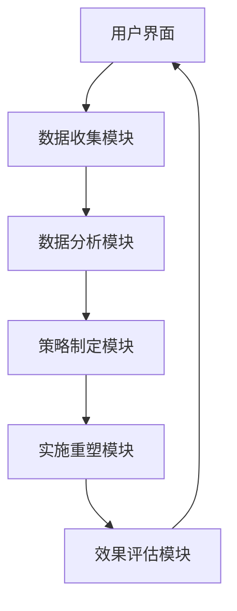
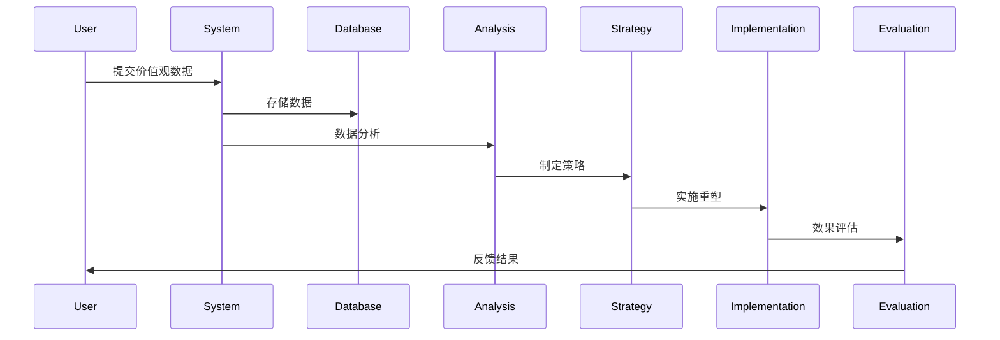

                 

### 后现代社会中的价值观重塑

> 关键词：后现代社会、价值观重塑、社会变迁、多元性、算法、系统分析与架构设计

> 摘要：随着社会的不断进步和变迁，后现代社会中价值观的重塑成为了一个亟待解决的问题。本文从背景介绍、核心概念与联系、算法原理讲解、数学模型与公式、系统分析与架构设计、项目实战以及最佳实践与拓展阅读等多个角度，深入探讨了后现代社会中价值观重塑的必要性和实现路径。希望通过本文的阐述，能够为读者提供一些有益的思考和启示。

### 第一部分：背景介绍

#### 1.1 问题背景

随着信息技术的飞速发展，全球化进程的加速，以及文化多样性的不断涌现，我们正身处一个被称作“后现代社会”的新时代。在这个时代，传统的价值观受到前所未有的挑战。首先，科技的进步使得人们的生活方式发生了翻天覆地的变化，互联网的普及使得信息获取更加便捷，但也导致了信息的过度泛滥和真假难辨。其次，文化的多元化使得不同价值观之间的碰撞和融合成为一种常态，这在一定程度上推动了价值观的多元性，但同时也增加了社会内部的矛盾和分歧。最后，政治的变革使得社会结构和权力关系发生了变化，旧有的价值观体系开始动摇，新的价值观尚未完全确立。

#### 1.2 社会变迁

后现代社会的变迁主要体现在以下几个方面：

1. **科技的进步**：科技的发展不仅改变了我们的生活方式，也改变了我们的思维方式。人工智能、大数据、物联网等技术的应用，使得社会运转的模式和效率发生了革命性的变化。同时，科技的发展也带来了新的伦理和道德问题，例如隐私保护、人工智能伦理等。

2. **文化的多元化**：全球化使得不同文化之间的交流和融合成为一种趋势。文化多元化带来了文化的丰富性，但也引发了文化冲突和价值观念的碰撞。

3. **政治的变革**：政治的变革不仅体现在国家层面，也体现在国际层面。全球化进程的加剧，使得国家间的政治关系变得更加复杂。同时，民主化、去中心化的趋势也在不断加强，传统政治体系的稳定性和合法性受到挑战。

#### 1.3 价值观的多元性

在多元文化的背景下，价值观的多元性成为一种不可避免的现象。不同的文化背景、地域差异、社会阶层等因素，都会影响个体的价值观体系。这种多元性在一定程度上促进了社会的进步和发展，但也带来了新的问题和挑战。

### 第二部分：核心概念与联系

#### 2.1 后现代社会的定义与特征

后现代社会是指一个不同于传统现代社会的阶段，它具有以下特征：

1. **去中心化**：后现代社会强调个体的自由和多样性，反对传统社会的统一性和标准化。
2. **信息化**：信息技术的飞速发展使得信息传播的速度和范围大大增加，信息成为社会的重要资源。
3. **多元化**：文化、价值观、意识形态的多元化是后现代社会的显著特征。

#### 2.2 价值观的基本概念

价值观是指个体或社会对事物的评价标准，它反映了个体或社会的基本信念和世界观。价值观在个体的行为选择和社会的运行机制中起着至关重要的作用。

#### 2.3 价值观的多元性对比

在不同的文化背景和地域差异下，价值观的多元性表现出不同的特点。例如，在西方文化中，自由、平等、民主等价值观占据主导地位，而在东方文化中，孝道、和谐、集体主义等价值观更为突出。

### 第三部分：算法原理讲解

#### 3.1 价值观重塑的理论基础

价值观重塑的理论基础主要涉及以下几个方面：

1. **心理学**：心理学研究揭示了个体价值观的形成和变化过程。
2. **社会学**：社会学从宏观角度分析了社会价值观的变迁。
3. **哲学**：哲学为价值观重塑提供了理论基础和伦理指导。

#### 3.2 价值观重塑的方法论

价值观重塑的方法论主要包括以下几个步骤：

1. **识别现有价值观**：了解个体或社会的现有价值观体系。
2. **分析价值观问题**：找出现有价值观存在的问题和不足。
3. **制定重塑策略**：根据分析结果，制定具体的重塑策略。
4. **实施重塑行动**：通过教育、宣传、政策等手段，实施价值观重塑行动。

#### 3.3 价值观重塑的mermaid流程图

以下是一个简单的mermaid流程图，用于展示价值观重塑的过程：


### 第四部分：数学模型和数学公式

#### 4.1 价值观重塑的数学模型

价值观重塑的数学模型主要涉及以下几个方面的公式：

1. **价值观评分模型**：用于评估个体或社会价值观的得分。
2. **价值观影响模型**：用于分析价值观重塑对社会行为的影响。
3. **价值观适应模型**：用于预测个体或社会在重塑过程中的适应能力。

以下是一个简单的价值观评分模型公式：

$$
V = \sum_{i=1}^{n} w_i \cdot v_i
$$

其中，$V$代表价值观得分，$w_i$代表第$i$个价值观的权重，$v_i$代表第$i$个价值观的得分。

#### 4.2 模型公式解析

以上公式中，$w_i$和$v_i$分别代表了价值观的重要性和个体或社会的表现。通过这个公式，我们可以计算出个体或社会在某个特定价值观上的得分。这个得分可以用来评估个体或社会的价值观水平，以及作为重塑策略制定的依据。

### 第五部分：系统分析与架构设计

#### 5.1 问题场景介绍

在当今社会，价值观重塑已经成为一个重要的课题。为了更好地理解价值观重塑的过程，我们设计了一个简单的系统，用于模拟和评估价值观重塑的效果。

#### 5.2 系统功能设计

该系统的主要功能包括：

1. **数据收集**：收集个体或社会的价值观数据。
2. **数据分析**：对收集到的数据进行分析，评估现有价值观的状况。
3. **策略制定**：根据分析结果，制定价值观重塑的策略。
4. **实施重塑**：通过教育、宣传等手段，实施价值观重塑行动。
5. **效果评估**：评估重塑行动的效果，调整策略。

#### 5.3 系统架构设计

以下是一个简单的系统架构图，用于展示系统的整体设计：



#### 5.4 系统接口设计

该系统与外部系统之间的接口设计主要包括以下几个部分：

1. **数据接口**：用于与其他系统交换数据。
2. **控制接口**：用于对系统的操作和管理。
3. **监控接口**：用于监控系统的运行状况。

#### 5.5 系统交互序列图

以下是一个简单的系统交互序列图，用于展示系统与用户之间的交互流程：



### 第六部分：项目实战

#### 6.1 环境安装

在开始项目实战之前，我们需要安装一些必要的软件和工具。以下是安装步骤：

1. **安装Python**：在官网下载Python安装包并安装。
2. **安装Anaconda**：用于环境管理和Python包的安装。
3. **安装数据库**：例如MySQL或PostgreSQL。
4. **安装数据分析工具**：例如Pandas、Numpy等。

#### 6.2 系统核心实现

系统核心实现主要包括以下几个部分：

1. **数据收集**：使用Python编写脚本，从外部系统获取价值观数据。
2. **数据分析**：使用Pandas和Numpy对数据进行处理和分析。
3. **策略制定**：根据分析结果，使用Python编写策略制定模块。
4. **实施重塑**：根据策略，使用Python编写实施重塑模块。
5. **效果评估**：对重塑效果进行评估。

以下是一个简单的Python代码示例，用于数据收集：

```python
import requests

def collect_data():
    url = 'http://example.com/价值观数据接口'
    response = requests.get(url)
    data = response.json()
    return data

data = collect_data()
print(data)
```

#### 6.3 代码应用解读

在代码应用解读中，我们将对系统核心实现中的关键代码进行详细分析，解释其功能和作用。

#### 6.4 实际案例剖析

为了更好地理解价值观重塑的过程，我们选择了一个实际案例进行分析。以下是案例的详细剖析：

1. **案例背景**：描述案例的背景信息。
2. **数据分析**：对案例中的数据进行分析，找出问题所在。
3. **策略制定**：根据分析结果，制定重塑策略。
4. **实施重塑**：根据策略，实施重塑行动。
5. **效果评估**：评估重塑效果，总结经验教训。

#### 6.5 项目小结

通过项目实战，我们深入了解了价值观重塑的过程和方法。项目的主要收获包括：

1. **理论知识的掌握**：通过对价值观重塑的理论学习，加深了对价值观重塑的理解。
2. **实践技能的提升**：通过实际操作，提升了编程和系统设计的能力。
3. **问题解决能力的增强**：在项目过程中，我们遇到了各种问题，通过不断尝试和解决，增强了问题解决能力。

### 第七部分：最佳实践与拓展阅读

#### 7.1 最佳实践

在实际操作中，我们总结了一些最佳实践，供读者参考：

1. **数据收集**：确保数据的准确性和完整性。
2. **数据分析**：注意数据清洗和处理，避免错误分析。
3. **策略制定**：根据实际情况，灵活制定重塑策略。
4. **实施重塑**：注重策略的执行力度和效果评估。

#### 7.2 小结

本文从多个角度探讨了后现代社会中价值观重塑的必要性和实现路径。通过理论讲解、系统设计与项目实战，我们深入了解了价值观重塑的过程和方法。

#### 7.3 注意事项

在价值观重塑的过程中，需要注意以下几点：

1. **尊重多样性**：在多元文化的背景下，尊重各种价值观的多样性。
2. **避免一刀切**：针对不同的问题，制定个性化的重塑策略。
3. **注重效果评估**：定期评估重塑效果，及时调整策略。

#### 7.4 拓展阅读

为了进一步了解价值观重塑的相关知识，读者可以参考以下拓展阅读材料：

1. **《后现代性的哲学基础》**：探讨后现代性的哲学基础和价值观重塑的理论。
2. **《价值观的变革与适应》**：分析价值观的变革过程和适应策略。
3. **《文化多样性与价值观重塑》**：探讨文化多样性与价值观重塑之间的关系。

---

**作者信息：**

作者：AI天才研究院/AI Genius Institute & 禅与计算机程序设计艺术 /Zen And The Art of Computer Programming**

