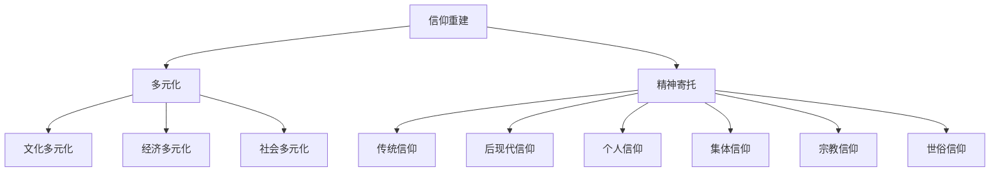
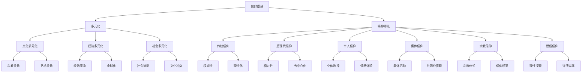

                 

### 文章标题

在瞬息万变的后现代社会，信仰的重建成为了一个紧迫而复杂的议题。随着文化的多元化、经济的全球化和社会的复杂化，人们对于精神寄托的需求愈发强烈，但同时也面临着前所未有的挑战。本文将深入探讨后现代社会的信仰重建，如何在多元化的世界中寻找精神的家园。

关键词：后现代，信仰重建，多元化，精神寄托，文化，经济，社会

#### 摘要

本文旨在解析后现代社会中信仰重建的必要性和复杂性。通过分析后现代社会的特征，探讨多元化对信仰的影响，揭示人们在精神困境中寻找寄托的动机与形式，构建信仰重建的理论基础，并对比传统信仰与后现代信仰的差异。文章还将通过具体案例和实践路径，探讨信仰重建的可能性和成功因素，最后展望信仰重建的未来，提出相关建议。

### 目录大纲

```markdown
----------------------------------------------------------------
# 《后现代社会的信仰重建：在多元化中寻找精神寄托》

# 第一部分: 背景介绍

## 第1章: 后现代社会的概念与特点
### 1.1 后现代主义的兴起
### 1.2 后现代社会的特征
### 1.3 后现代主义与信仰的关系

## 第2章: 多元化的影响
### 2.1 文化多元化对信仰的冲击
### 2.2 经济多元化对信仰的影响
### 2.3 社会多元化对信仰的挑战

## 第3章: 精神寄托的需求
### 3.1 后现代社会中的精神困境
### 3.2 寻找精神寄托的动机
### 3.3 精神寄托的种类与形式

# 第二部分: 核心概念与联系

## 第4章: 信仰重建的理论基础
### 4.1 信仰的本质与特征
### 4.2 信仰重建的理论框架
### 4.3 信仰重建的核心要素

## 第5章: 核心概念对比
### 5.1 传统信仰与后现代信仰的对比
### 5.2 个人信仰与集体信仰的对比
### 5.3 宗教信仰与世俗信仰的对比

## 第6章: ER实体关系图架构


# 第三部分: 实践探索

## 第7章: 信仰重建的实践路径
### 7.1 教育与信仰重建
### 7.2 社区与信仰重建
### 7.3 媒体与信仰重建

## 第8章: 信仰重建的案例分析
### 8.1 案例一：中国的基督教信仰重建
### 8.2 案例二：西方的世俗化信仰重建
### 8.3 案例三：日本的宗教信仰重建

## 第9章: 信仰重建的成功因素
### 9.1 政策与法律支持
### 9.2 社会环境因素
### 9.3 个人因素

# 第四部分: 拓展与思考

## 第10章: 信仰重建的未来展望
### 10.1 信仰重建的挑战与机遇
### 10.2 信仰重建的趋势分析
### 10.3 信仰重建的潜在影响

## 第11章: 小结与建议
### 11.1 全书回顾
### 11.2 信仰重建的重要意义
### 11.3 阅读指南与进一步研究

----------------------------------------------------------------
```

### 第一部分: 背景介绍

#### 第1章: 后现代社会的概念与特点

**1.1 后现代主义的兴起**

后现代主义（Postmodernism）作为一个广泛的文化和哲学思潮，起源于20世纪中叶。它的兴起与对现代主义及其前现代时期的思想、艺术和文化的批判紧密相关。后现代主义的核心观点是对现代性本身的质疑和反思，它认为现代主义所追求的理性、客观性和统一性是不存在的，而是由多种话语和视角所构成的复杂网络。

后现代主义的代表人物包括让-弗朗索瓦·利奥塔（Jean-François Lyotard）、米歇尔·福柯（Michel Foucault）、让-鲍德里亚（Jean Baudrillard）等。他们的著作揭示了权力、知识和话语的动态关系，挑战了传统的权威结构和认知模式。

**1.2 后现代社会的特征**

后现代社会的特征可以从多个维度来理解，其中最为显著的是：

1. **多元化**：后现代社会是一个多元文化、多价值观、多意识形态并存的社会。文化的全球化使得各种文化形式和价值观相互碰撞和融合，从而形成了复杂多样的社会景观。

2. **去中心化**：后现代主义强调去中心化和去权威化。权力不再集中在少数人手中，而是分散在社会的各个层面。传统的中心化结构和层级体系受到质疑，人们开始寻求更加平等和开放的交流方式。

3. **相对主义**：后现代主义认为真理是相对的，没有绝对的标准。不同的文化、个人和群体都有自己的真理和认知方式，这些真理和认知方式无法通过单一的标准进行评判。

4. **不确定性**：后现代社会充满了不确定性和不可预测性。社会变革的速度加快，新技术和全球化趋势使得社会结构和生活方式不断发生变化，人们对未来的预期变得模糊。

**1.3 后现代主义与信仰的关系**

后现代主义对信仰提出了严峻的挑战。它质疑传统宗教和哲学体系的权威性，认为信仰和理性是分离的。在这样一个多元化和去中心化的社会中，传统信仰的统一性和普遍性受到质疑，人们开始寻找更加个人化和多元化的信仰形式。

同时，后现代主义也为信仰重建提供了新的视角。它鼓励人们从多元文化的交流中寻找精神寄托，提倡个体在多样化的信仰形式中自主选择和构建自己的信仰体系。

#### 第2章: 多元化的影响

**2.1 文化多元化对信仰的冲击**

文化多元化是后现代社会的一个显著特征，它深刻地影响了人们的信仰。在多元文化的背景下，各种信仰和价值观相互交织和碰撞，使得传统信仰的统一性受到冲击。

首先，文化多元化导致了信仰的多样化。人们在接触不同文化的同时，也会接触到不同的信仰形式，从而拓宽了他们的信仰视野。然而，这种多样性也可能导致信仰的混乱和冲突。不同信仰之间的差异和矛盾可能会引发社会冲突，甚至导致宗教极端主义。

其次，文化多元化挑战了传统信仰的普遍性和权威性。在多元文化的背景下，人们不再接受单一的信仰体系，而是倾向于自主选择和构建自己的信仰。这种去中心化的信仰形式削弱了传统宗教和哲学体系的权威地位，迫使信仰体系进行自我调整和重构。

**2.2 经济多元化对信仰的影响**

经济的多元化也是后现代社会的一个重要特征。全球化使得经济活动跨越国界，不同国家和地区的经济体系相互交织。这种经济多元化对信仰产生了深远的影响。

首先，经济多元化可能导致社会阶层的流动和变化。随着经济的多元化，人们的社会地位和财富分配发生变化，这可能会影响他们的信仰。例如，一些新兴的经济体可能会出现新的宗教信仰和价值观，而这些信仰和价值观可能与传统的宗教和价值观相冲突。

其次，经济多元化也可能导致信仰的商业化和市场化。在追求经济利益的过程中，宗教和信仰被商业化，成为一种消费品。这种现象可能导致信仰的异化和功利化，削弱其精神寄托的功能。

**2.3 社会多元化对信仰的挑战**

社会多元化是后现代社会的另一个重要特征。社会的多元化表现在人口结构、社会关系、生活方式等多个方面，这给信仰带来了巨大的挑战。

首先，社会多元化可能导致社会分裂和分裂。不同社会群体之间的差异和冲突可能导致信仰的分裂和多元化。例如，种族、性别、宗教等因素都可能成为信仰分裂的原因。

其次，社会多元化也可能导致信仰的异化和扭曲。在多元化的社会中，不同信仰之间的碰撞和融合可能导致信仰的异化和扭曲。一些信仰可能被商业化、功利化，甚至被政治化，从而失去了其原本的精神内涵。

最后，社会多元化要求信仰体系进行自我调整和重构。为了适应多元化的社会环境，信仰体系需要不断更新和重构，以保持其活力和适应性。这需要信仰体系具有开放性和包容性，能够接纳和融合不同的信仰形式和价值观。

#### 第3章: 精神寄托的需求

**3.1 后现代社会中的精神困境**

后现代社会中的精神困境是一个普遍存在的问题。随着社会的发展和变革，人们面临着前所未有的压力和挑战。这些压力和挑战不仅来自于物质生活的压力，也来自于精神层面的困扰。

首先，物质生活的压力是导致精神困境的一个重要因素。后现代社会的竞争激烈，人们为了生存和发展需要付出巨大的努力。这种物质压力可能导致焦虑、抑郁等精神问题。

其次，精神困境还源于人们对于生活意义的迷失。在多元化的社会中，人们面临着众多的选择和机会，但同时也面临着选择的困惑和不确定性。人们不知道应该如何选择，也不知道自己的选择是否能够带来真正的幸福和满足。

**3.2 寻找精神寄托的动机**

在精神困境中，人们往往会产生寻找精神寄托的动机。这种动机源于对生活意义的追求和对心理健康的需要。

首先，寻找精神寄托是对生活意义的追求。人们在生活中会遇到各种困难和挑战，但只有通过找到生活的意义，才能在困境中坚持下去。信仰可以为人们提供生活的意义和方向，帮助他们找到内心的平静和安宁。

其次，寻找精神寄托也是对心理健康的需要。在精神困境中，人们往往会感到孤独、无助和迷茫。信仰可以提供一种心理支持，帮助人们缓解焦虑、抑郁等心理问题，提高心理健康水平。

**3.3 精神寄托的种类与形式**

精神寄托的形式多种多样，不同的信仰和价值观都可以被视为一种精神寄托。以下是一些常见的精神寄托形式：

1. **宗教信仰**：宗教信仰是一种传统的精神寄托形式。宗教信仰可以提供人们生活的意义和目标，帮助人们面对生活中的困难和挑战。

2. **哲学思想**：哲学思想是一种理性的精神寄托形式。通过哲学思考，人们可以理解生命的本质和意义，找到内心的平静和安宁。

3. **文化艺术**：文化艺术是一种感性的精神寄托形式。艺术作品和文学作品可以触动人们的心灵，激发他们对生命的热爱和对美的追求。

4. **人际关系**：人际关系是一种情感上的精神寄托形式。与家人、朋友和爱人的相处可以给人们带来温暖和安慰，缓解心理压力。

5. **个人兴趣**：个人兴趣是一种个性化的精神寄托形式。通过追求个人兴趣和爱好，人们可以找到内心的满足和快乐。

### 第二部分: 核心概念与联系

#### 第4章: 信仰重建的理论基础

**4.1 信仰的本质与特征**

信仰是人类社会的一个重要组成部分，它是人们对生命、世界和宇宙的理性认知和感性体验。信仰的本质在于其超越性，它超越了人类日常生活的经验和认知，提供了一种更广阔的视角和更深刻的理解。

信仰具有以下几个基本特征：

1. **超越性**：信仰超越了个人的感知和经验，指向一个更高的实体或原则。信仰的对象可以是神、宇宙、自然或某种理念。

2. **理性与感性**：信仰既是理性的，也是感性的。信仰的理性基础在于其逻辑性和一致性，而信仰的感性基础在于其对人的心灵产生的影响。

3. **持久性**：信仰通常具有持久性，不会因为外在环境的变化而轻易改变。信仰是一种长期的心理和行为习惯。

4. **社会性**：信仰具有社会性，它不仅仅是个体的私人事务，也是社会文化的一部分。信仰在人们的社会互动中发挥着重要作用，影响着社会的价值观和行为规范。

**4.2 信仰重建的理论框架**

信仰重建是一个复杂的过程，需要从多个角度进行思考和设计。以下是一个基本的信仰重建理论框架：

1. **自我认识**：信仰重建的第一步是自我认识，即了解自己的信仰背景、信仰内容和信仰动机。通过自我反思，个体可以更好地理解自己的信仰，并识别出需要调整和重建的部分。

2. **文化适应**：信仰重建需要考虑文化背景的影响。在多元化的社会中，个体需要适应不同的文化和价值观，这可能会对他们的信仰产生冲击和挑战。文化适应要求个体具有开放性和包容性，能够接受和融合不同的信仰形式。

3. **理性思考**：信仰重建需要理性的思考和批判性思维。个体需要通过理性分析，评估自己的信仰是否合理、一致，并识别出其中可能存在的偏见和误解。理性思考有助于个体建立一个更加清晰和稳定的信仰体系。

4. **情感共鸣**：信仰重建还需要情感共鸣，即个体需要找到与自己的信仰产生共鸣的情感体验。情感共鸣可以增强个体对信仰的忠诚度和认同感，从而推动信仰重建的进程。

5. **社会实践**：信仰重建是一个实践过程，需要在社会实践中不断验证和调整。个体需要通过实际行动，将自己的信仰转化为具体的行为和生活方式，从而在实践中深化对信仰的理解和认同。

**4.3 信仰重建的核心要素**

信仰重建的核心要素包括以下几个方面：

1. **知识教育**：信仰重建需要知识的积累和教育。个体需要通过学习了解不同信仰的历史、理论和实践，从而扩展自己的知识视野。

2. **价值观塑造**：信仰重建需要塑造正确的价值观。价值观是个体信仰的基础，决定了个体如何理解和评价世界。通过塑造正确的价值观，个体可以建立更加健康和积极的信仰体系。

3. **情感管理**：信仰重建需要有效的情感管理。情感是个体信仰的重要组成部分，影响着个体的信仰体验和行为。通过有效的情感管理，个体可以更好地应对生活中的挑战和压力。

4. **社会互动**：信仰重建需要积极参与社会互动。社会互动可以帮助个体了解不同的信仰观点和价值观，从而促进信仰的多元化和包容性。

5. **持续反思**：信仰重建是一个持续的过程，需要不断的反思和调整。个体需要定期反思自己的信仰，识别出其中可能存在的偏见和误解，并做出相应的调整和改进。

#### 第5章: 核心概念对比

**5.1 传统信仰与后现代信仰的对比**

传统信仰和后现代信仰是两种截然不同的信仰形式，它们在多个方面存在显著的差异。

1. **统一性与多样性**：传统信仰强调信仰的统一性和普遍性，认为有一种唯一的真理和信仰体系。而后现代信仰强调信仰的多样性和相对性，认为不同的信仰和价值观都有其存在的价值。

2. **权威性与去权威性**：传统信仰通常依赖于权威机构和权威人物，如宗教领袖或哲学家。而后现代信仰强调去权威性，认为信仰应该由个体自主选择和构建。

3. **理性性与情感性**：传统信仰强调理性性和逻辑性，认为信仰应该基于理性的思考和论证。而后现代信仰强调情感性和体验性，认为信仰应该源于个体的情感体验和内心感受。

4. **稳定性与变动性**：传统信仰通常具有稳定性，认为信仰不应该轻易改变。而后现代信仰则强调变动性和灵活性，认为信仰应该随着社会和环境的变化而调整。

**5.2 个人信仰与集体信仰的对比**

个人信仰和集体信仰是两种不同的信仰形式，它们在信仰的主体、内容和实践方式上存在差异。

1. **信仰主体**：个人信仰强调个体作为信仰主体的独立性，信仰是个人的选择和体验。而集体信仰强调信仰的集体性，认为信仰是整个群体的共同信念和价值体系。

2. **信仰内容**：个人信仰的内容通常是个体对生命、世界和宇宙的个人理解和体验。而集体信仰的内容是整个群体共同认可的信仰体系和价值观。

3. **信仰实践**：个人信仰的实践通常是个体的个人行为和生活方式。而集体信仰的实践是群体的共同行为和集体活动。

4. **信仰变迁**：个人信仰的变迁通常是个人自主选择的结果，而集体信仰的变迁通常受到社会和文化因素的影响。

**5.3 宗教信仰与世俗信仰的对比**

宗教信仰和世俗信仰是两种不同的信仰形式，它们在信仰的对象、内容和实践方式上存在显著差异。

1. **信仰对象**：宗教信仰的对象是神、神性或某种超自然力量。而世俗信仰的对象是自然、社会或某种理性原则。

2. **信仰内容**：宗教信仰的内容通常包括对神、天堂和来世的信仰，以及相应的宗教仪式和规范。而世俗信仰的内容通常是对自然、社会和人类生存的理解和信仰。

3. **信仰实践**：宗教信仰的实践通常包括宗教仪式、祈祷和宗教教育。而世俗信仰的实践通常包括科学探索、社会参与和道德实践。

4. **信仰变迁**：宗教信仰的变迁通常受到宗教传统和宗教领袖的影响。而世俗信仰的变迁通常受到科学进步和社会发展的推动。

#### 第6章: ER实体关系图架构

为了更好地理解信仰重建中的核心概念和它们之间的关系，我们可以使用实体关系图（Entity-Relationship Diagram，ERD）来构建一个概念模型。以下是一个简化的ERD示例，展示了信仰重建相关的核心实体和它们之间的关系。



在这个ERD中：

- **信仰重建（A）** 是核心实体，代表了整个信仰重建过程。
- **多元化（B）** 和 **精神寄托（C）** 是信仰重建的两个关键维度。
- **文化多元化（D）、经济多元化（E）和社会多元化（F）** 分别代表了多元化在不同领域的体现。
- **传统信仰（G）、后现代信仰（H）、个人信仰（I）、集体信仰（J）、宗教信仰（K）和世俗信仰（L）** 是信仰重建的具体形式。

通过这个ERD，我们可以更直观地理解各个核心概念之间的相互关系，以及它们在信仰重建过程中的作用。

### 第三部分: 实践探索

#### 第7章: 信仰重建的实践路径

**7.1 教育与信仰重建**

教育在信仰重建中扮演着至关重要的角色。通过教育，个体可以获得关于不同信仰形式和价值观的知识，从而拓宽自己的信仰视野。以下是一些具体的实践路径：

1. **跨学科教育**：学校和教育机构可以开设跨学科的课程，涵盖宗教、哲学、文化等领域，帮助学生了解不同信仰的历史、理论和实践。

2. **批判性思维训练**：培养学生的批判性思维，鼓励他们质疑传统信仰，理性分析不同的信仰观点，从而形成自己独立的信仰体系。

3. **宗教和文化体验**：组织宗教和文化体验活动，如宗教仪式、节日庆典、文化交流等，让学生亲身感受不同信仰的文化氛围，增强对多元信仰的理解和尊重。

4. **心理咨询与辅导**：提供心理咨询和辅导服务，帮助学生处理信仰冲突和心理困境，引导他们找到适合自己的信仰路径。

**7.2 社区与信仰重建**

社区是信仰重建的重要平台。通过社区活动，个体可以建立社会支持网络，获得信仰上的帮助和指导。以下是一些实践路径：

1. **信仰社区建设**：建立信仰社区，鼓励不同信仰背景的人们共同参与，开展宗教和文化交流活动，促进信仰的多元化和包容性。

2. **社区论坛与讨论**：组织社区论坛和讨论会，提供平台供居民分享自己的信仰经历和观点，促进信仰的深入探讨和交流。

3. **志愿者服务**：鼓励居民参与志愿者服务，通过实际行动体现信仰的价值观，增强对社区的认同感和归属感。

4. **社区辅导与支持**：为信仰上有困扰的居民提供辅导和支持，帮助他们解决信仰问题，找到信仰上的出路。

**7.3 媒体与信仰重建**

媒体在信仰重建中发挥着越来越重要的作用。通过媒体，信仰可以传播和推广，信仰重建的理念可以普及。以下是一些实践路径：

1. **宗教与文化传播**：利用电视、广播、互联网等媒体平台，传播宗教和文化知识，展示不同信仰的仪式、节日和传统，增强公众对多元信仰的理解和尊重。

2. **网络社区与讨论**：建立网络社区和讨论平台，鼓励公众在线分享自己的信仰经验和观点，开展跨地域、跨文化的信仰交流。

3. **数字宗教资源**：开发数字宗教资源，如在线课程、电子书籍、音频讲座等，方便公众随时学习和了解不同的信仰形式和价值观。

4. **媒体监督与引导**：加强对宗教和文化的媒体监督，引导媒体客观、公正地报道宗教和文化事件，避免偏见和误解。

#### 第8章: 信仰重建的案例分析

**8.1 案例一：中国的基督教信仰重建**

中国的基督教信仰重建是一个典型的多元文化背景下的信仰重建案例。在过去的几十年中，中国经历了快速的社会变迁和文化多元化，基督教在中国的传播和发展也面临着一系列挑战。

1. **历史背景**：新中国成立后，基督教经历了多次政治运动，信仰环境受到了限制。改革开放以来，随着社会的开放和多元，基督教在中国逐渐复兴。

2. **实践路径**：中国的基督教信仰重建主要采取了以下实践路径：
   - **宗教活动规范化**：政府加强对宗教活动的管理，规范宗教场所和宗教活动的运作，为基督教的健康发展提供了保障。
   - **宗教教育与培训**：基督教团体加强内部培训和教育，提高信徒的信仰水平和宗教素养，增强信仰的内在动力。
   - **文化交流与对话**：基督教团体积极参与社会和文化活动，与其他宗教和文化进行对话和交流，促进多元文化的共存和融合。

3. **效果评估**：中国的基督教信仰重建在一定程度上取得了成功。信徒数量不断增加，基督教的影响力也在逐渐扩大。同时，基督教在社会公益事业和文化交流中发挥了积极作用。

**8.2 案例二：西方的世俗化信仰重建**

西方的世俗化信仰重建是一个典型的后现代背景下的信仰重建案例。在西方国家，随着现代化的进程和宗教的衰退，世俗信仰逐渐成为主流。

1. **历史背景**：西方国家的世俗化进程始于18世纪的启蒙运动，随着科学的发展和理性的崛起，宗教的影响力逐渐减弱。

2. **实践路径**：西方的世俗化信仰重建主要采取了以下实践路径：
   - **世俗教育**：西方国家加强世俗教育，培养学生的批判性思维和理性精神，减少对宗教的依赖。
   - **文化多样性**：西方国家推崇文化多样性，鼓励不同信仰和价值观的共存，促进社会和谐。
   - **公民社会建设**：西方国家重视公民社会建设，鼓励民众参与社会事务，通过实际行动体现世俗价值观。

3. **效果评估**：西方的世俗化信仰重建在一定程度上取得了成功。世俗信仰成为了社会主流，人们的信仰观念更加开放和多元化。同时，世俗信仰也面临着一些挑战，如道德滑坡和价值真空等问题。

**8.3 案例三：日本的宗教信仰重建**

日本的宗教信仰重建是一个在传统与现代之间寻找平衡的案例。在二战后，日本经历了快速的现代化进程，传统宗教信仰受到了冲击。

1. **历史背景**：二战后，日本社会发生了深刻的变化，宗教信仰面临着重新审视和重建的问题。

2. **实践路径**：日本的宗教信仰重建主要采取了以下实践路径：
   - **传统与现代结合**：日本宗教团体积极探索传统宗教与现代生活方式的结合，如发展佛教生活实践和心灵修养课程。
   - **宗教现代化**：日本宗教团体进行宗教现代化改革，引入现代管理理念和服务模式，提高宗教的社会适应能力。
   - **文化交流与融合**：日本宗教团体积极参与国际宗教和文化交流，吸收外来宗教的先进理念和经验。

3. **效果评估**：日本的宗教信仰重建在一定程度上取得了成功。传统宗教信仰得到了复兴，现代宗教形式也得到了广泛接受。同时，宗教在促进社会和谐和文化传承中发挥了重要作用。

#### 第9章: 信仰重建的成功因素

**9.1 政策与法律支持**

政策与法律支持是信仰重建的重要保障。政府应该制定和实施相关政策，保护宗教信仰自由，为宗教活动的开展提供法律保障。以下是一些具体措施：

1. **宗教政策**：政府应该制定包容性的宗教政策，保障不同宗教的平等权利，促进宗教和谐。
2. **宗教法律**：政府应该完善宗教法律体系，规范宗教活动，防止宗教极端主义和宗教冲突。
3. **财政支持**：政府可以提供财政支持，资助宗教教育和宗教文化建设，促进宗教的健康发展。

**9.2 社会环境因素**

社会环境因素对信仰重建具有重大影响。一个开放、包容、多元的社会环境有利于信仰的多样性和包容性。以下是一些具体措施：

1. **社会教育**：加强社会教育，培养民众对不同宗教和价值观的理解和尊重，减少宗教偏见和歧视。
2. **文化交流**：鼓励文化交流，促进不同宗教和文化之间的对话和融合，增强社会的包容性。
3. **社会参与**：鼓励民众积极参与社会事务，通过实际行动体现自己的信仰和价值，促进社会和谐。

**9.3 个人因素**

个人因素是信仰重建的内在动力。个体的信仰选择和信仰实践对信仰重建具有决定性影响。以下是一些具体措施：

1. **自我认知**：个体应该加强自我认知，了解自己的信仰背景和信仰动机，明确自己的信仰方向。
2. **理性思考**：个体应该进行理性思考，评估自己的信仰是否合理、一致，识别出其中可能存在的偏见和误解。
3. **情感管理**：个体应该进行有效的情感管理，找到与自己的信仰产生共鸣的情感体验，增强对信仰的忠诚度和认同感。
4. **实践探索**：个体应该通过实际行动，将自己的信仰转化为具体的行为和生活方式，在实践中深化对信仰的理解和认同。

### 第四部分: 拓展与思考

#### 第10章: 信仰重建的未来展望

**10.1 信仰重建的挑战与机遇**

信仰重建面临着一系列挑战和机遇。首先，全球化、技术进步和文化多元化等外部因素将继续影响信仰的发展和重建。这些因素既为信仰重建提供了新的动力和资源，也带来了新的挑战和不确定性。

**挑战：**
1. **文化冲突**：不同文化和信仰之间的冲突可能会加剧，影响信仰重建的进程。
2. **信仰异化**：商业化、政治化等趋势可能导致信仰的异化和扭曲，削弱其精神寄托的功能。
3. **信息泛滥**：信息的爆炸性增长可能导致信仰的迷失和混淆，个体难以找到适合自己的信仰路径。

**机遇：**
1. **多元文化共存**：全球化促进了多元文化的共存，为信仰的多样性和包容性提供了可能。
2. **科技赋能**：科技的进步为信仰传播和信仰体验提供了新的平台和方式，有助于信仰的普及和深入。
3. **社会参与**：随着社会的开放和多元，个体在社会事务中的参与度提高，信仰可以更贴近现实生活，发挥更大的社会功能。

**10.2 信仰重建的趋势分析**

信仰重建将呈现以下几个趋势：

1. **个性化和多元化**：个体将更加注重自己的信仰个性化和多元化，不再接受单一的信仰体系。
2. **理性化和科学化**：信仰重建将更加注重理性思考和科学论证，减少盲目信仰和迷信。
3. **数字化和虚拟化**：随着数字化和虚拟技术的发展，信仰将更加依赖于数字平台和虚拟空间，形成虚拟宗教社区和信仰体验。
4. **社会化和参与化**：信仰将更加注重与社会实际的结合，个体将通过实际行动体现自己的信仰和价值。

**10.3 信仰重建的潜在影响**

信仰重建对社会和个人将产生深远的影响：

**对社会：**
1. **社会和谐**：信仰重建有助于减少社会冲突和矛盾，促进社会和谐。
2. **文化传承**：信仰重建有助于保护和传承不同文化和信仰的精髓，促进文化多样性。
3. **社会进步**：信仰重建可以为社会提供精神动力和道德支持，推动社会的进步和发展。

**对个人：**
1. **心理健康**：信仰重建有助于缓解心理压力，提高心理健康水平。
2. **个人成长**：信仰重建可以促进个体的自我认知和成长，帮助个体找到生活的意义和方向。
3. **价值观塑造**：信仰重建有助于塑造个体的价值观，提高道德素质和社会责任感。

#### 第11章: 小结与建议

**11.1 全书回顾**

本书从后现代社会的背景出发，探讨了信仰重建的必要性和复杂性。通过分析多元文化、经济和社会对信仰的影响，揭示了人们在精神困境中寻找寄托的动机与形式。本书提出了信仰重建的理论基础，对比了传统信仰与后现代信仰的差异，并提供了实践探索和案例分析的路径。同时，本书还展望了信仰重建的未来，提出了相关建议。

**11.2 信仰重建的重要意义**

信仰重建在后现代社会中具有重要意义：

1. **精神寄托**：信仰重建为个体提供了精神寄托，帮助他们在多元化和不确定的社会中找到内心的平静和安宁。
2. **社会和谐**：信仰重建有助于减少社会冲突和矛盾，促进社会和谐。
3. **文化传承**：信仰重建有助于保护和传承不同文化和信仰的精髓，促进文化多样性。
4. **个体成长**：信仰重建可以促进个体的自我认知和成长，帮助个体找到生活的意义和方向。
5. **价值观塑造**：信仰重建有助于塑造个体的价值观，提高道德素质和社会责任感。

**11.3 阅读指南与进一步研究**

对于读者，本书提供了一个全面了解信仰重建的理论和实践框架。以下是一些建议：

1. **深入阅读**：读者可以根据自己的兴趣，深入阅读相关章节，特别是对信仰重建的理论基础和实践路径进行深入研究。
2. **实践探索**：读者可以尝试参与宗教和文化活动，亲身体验信仰重建的过程，并将自己的经验进行反思和总结。
3. **学术研究**：对于学术研究者，本书提供了一个研究信仰重建的框架和视角，可以进一步探讨信仰重建的理论模型和实践方法。
4. **拓展阅读**：推荐读者阅读相关领域的经典著作，如宗教哲学、社会学和文化研究等方面的书籍，以拓宽自己的知识视野。

### 作者信息

作者：AI天才研究院/AI Genius Institute & 禅与计算机程序设计艺术 /Zen And The Art of Computer Programming

### 结束语

信仰重建是一个长期而复杂的任务，需要个体、社会和政府的共同努力。在后现代社会的多元化背景下，信仰重建不仅关乎个体的精神健康，也关乎社会的和谐与进步。让我们共同探索信仰重建的路径，为后现代社会找到精神的家园。

