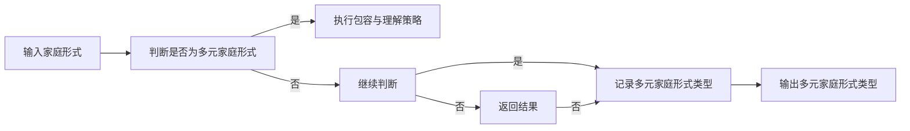
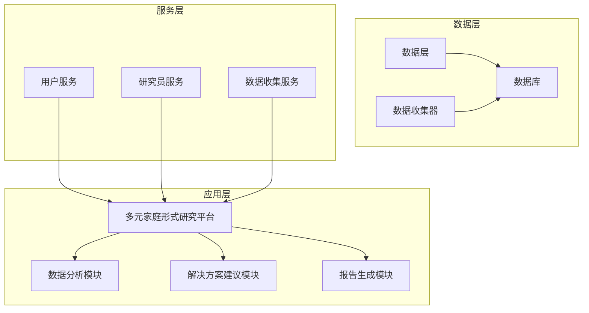
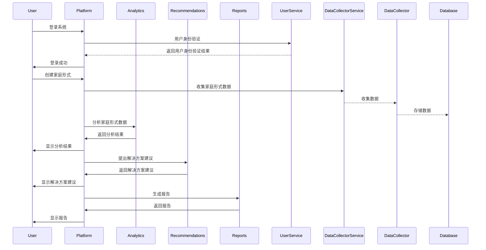

                 


### 背景介绍

#### 核心概念术语说明

在后现代社会的家庭观念研究中，需要理解一些核心概念和术语，以便更好地把握文章的主题和内容。

**后现代主义（Postmodernism）**：后现代主义是一种文化、哲学和社会思潮，起源于20世纪中叶。它反对现代主义的统一、客观和理性观念，强调多样性和相对主义，认为真理不是客观存在的，而是由个人或文化群体建构的。

**家庭观念（Family Concepts）**：家庭观念指的是社会对家庭的定义、角色、功能和结构的一般看法。在后现代社会，家庭观念经历了重大变革，不再局限于传统的定义，而是变得更加多元和包容。

**多元家庭形式（Diverse Family Forms）**：多元家庭形式指的是在后现代社会中出现的新型家庭结构，包括但不限于单亲家庭、再婚家庭、同性恋家庭、跨国婚姻家庭、临时家庭和在线家庭。

**包容与理解（Inclusion and Understanding）**：包容与理解指的是社会对多元家庭形式的态度和行为，包括接受、尊重和支持这些家庭形式，而不是排斥或歧视。

**社会态度变迁（Social Attitude Shifts）**：社会态度变迁指的是随着社会的发展和价值观的变化，人们对家庭观念的态度也发生改变，从传统的单一模式转向更加多元和包容的模式。

#### 问题背景

在后现代社会，随着全球化、技术进步和文化交流的增加，家庭观念发生了深刻的变化。传统的家庭模式逐渐被多元家庭形式所替代，这带来了一系列的社会问题和挑战。然而，这些变化也带来了新的机遇，要求社会对多元家庭形式进行包容和理解。

**问题描述**

在当前的社会背景下，如何理解多元家庭形式，如何在社会政策、教育体系和媒体传播中体现对这些家庭形式的包容与理解，是一个亟待解决的问题。具体问题包括：

1. **法律政策支持**：如何制定和实施有利于多元家庭形式的法律政策，保障这些家庭的基本权益？
2. **社会态度变迁**：如何改变传统的家庭观念，使社会对多元家庭形式持开放和接纳的态度？
3. **教育体系中的多元家庭观念教育**：如何将多元家庭观念融入教育体系中，培养新一代对多元家庭形式的理解和尊重？
4. **媒体对多元家庭形象的塑造**：如何通过媒体传播，树立多元家庭形象的正面形象，减少歧视和误解？

#### 问题解决

解决这些问题的关键在于逐步分析和推理，提出具体的策略和措施，并加以实施。

1. **法律政策支持**：
   - **立法保障**：制定相关法律法规，明确多元家庭形式的合法地位和权益。
   - **政策实施**：通过政策执行，确保多元家庭形式在就业、医疗、教育等方面的平等权益。

2. **社会态度变迁**：
   - **公众教育**：通过公共宣传和教育，提高公众对多元家庭形式的认识和接纳度。
   - **舆论引导**：通过媒体传播，树立多元家庭形象的正面形象，引导社会舆论向包容和理解的方向发展。

3. **教育体系中的多元家庭观念教育**：
   - **课程设置**：在课程中增加多元家庭观念的内容，培养学生的包容和理解能力。
   - **教师培训**：对教师进行培训，提高他们对多元家庭形式的敏感性和教育能力。

4. **媒体对多元家庭形象的塑造**：
   - **内容创作**：鼓励媒体创作更多展现多元家庭形象的节目和作品。
   - **媒体监督**：对媒体报道进行监督，确保不出现歧视和负面报道。

#### 边界与外延

多元家庭形式的边界和范围随着社会的发展而不断变化，但一些基本类型是相对稳定的。例如，单亲家庭、再婚家庭和同性恋家庭是较为常见和稳定的多元家庭形式。

此外，随着技术的发展和互联网的普及，临时家庭和在线家庭等形式也在逐渐兴起。这些新型家庭形式不仅带来了新的挑战，也为家庭观念的研究提供了新的视角和方向。

#### 概念结构与核心要素组成

多元家庭形式的包容与理解涉及多个核心要素，包括：

- **法律政策**：保障多元家庭形式的合法地位和权益。
- **社会态度**：社会对多元家庭形式的接纳程度和态度。
- **教育体系**：多元家庭观念在教育中的体现和传播。
- **媒体传播**：媒体在塑造多元家庭形象中的角色和责任。

这些核心要素相互作用，共同构成了多元家庭形式的包容与理解的社会框架。

### 核心概念与联系

#### 核心概念原理

在后现代社会的家庭观念中，核心概念包括后现代主义、家庭观念、多元家庭形式和包容与理解。

**后现代主义**：后现代主义认为真理是相对的，不存在绝对真理。它强调多样性和相对主义，反对现代主义的统一和客观性。

**家庭观念**：家庭观念是指社会对家庭的基本看法，包括家庭的角色、功能和结构。在后现代主义的影响下，家庭观念变得更加多元和包容。

**多元家庭形式**：多元家庭形式是指不同于传统家庭结构的家庭形式，包括单亲家庭、再婚家庭、同性恋家庭等。

**包容与理解**：包容与理解是指社会对多元家庭形式的接纳和支持，包括法律政策支持、社会态度变迁、教育体系中的多元家庭观念教育和媒体传播。

#### 概念属性特征对比表格

| 概念         | 定义                                                         | 属性特征                                                     |
| ------------ | ------------------------------------------------------------ | ------------------------------------------------------------ |
| 后现代主义   | 一种文化、哲学和社会思潮，强调多样性和相对主义，反对现代主义的统一和客观性。 | - 强调相对主义<br>- 反对统一性<br>- 崇尚多样性           |
| 家庭观念     | 社会对家庭的基本看法，包括家庭的角色、功能和结构。             | - 随着社会变迁而变化<br>- 受文化背景影响<br>- 包容性增加   |
| 多元家庭形式 | 不同于传统家庭结构的家庭形式。                             | - 单亲家庭<br>- 再婚家庭<br>- 同性恋家庭<br>- 跨国婚姻家庭 |
| 包容与理解   | 社会对多元家庭形式的接纳和支持。                           | - 法律政策支持<br>- 社会态度变迁<br>- 教育体系中的多元家庭观念教育<br>- 媒体传播 |

#### ER实体关系图架构

```mermaid
erDiagram
    FamilyConcept --> Postmodernism : 后现代主义影响家庭观念
    FamilyConcept --> DiverseFamilyForm : 家庭观念决定家庭形式
    SocialInclusion --> LawPolicy : 法律政策支持包容与理解
    SocialInclusion --> SocialAttitude : 社会态度变迁支持包容与理解
    SocialInclusion --> Education : 教育体系中的多元家庭观念教育
    SocialInclusion --> Media : 媒体传播塑造多元家庭形象
```

### 算法原理讲解

为了更好地理解后现代社会的家庭观念和多元家庭形式的包容与理解，我们可以使用一个简单的算法模型来描述这一过程。

#### 算法流程图



#### Python源代码

```python
def is_diverse_family_form(family_form):
    # 输入家庭形式
    family_forms = ["single_parent", "remarried", "same_sex", "international", "temporary", "online"]
    
    # 判断是否为多元家庭形式
    if family_form in family_forms:
        # 执行包容与理解策略
        execute_inclusion_strategy(family_form)
    else:
        # 继续判断
        if not is_single_family_form(family_form):
            # 记录多元家庭形式类型
            record_diverse_family_form_type(family_form)
    
    # 输出多元家庭形式类型
    print(f"Diverse Family Form Type: {family_form}")

def execute_inclusion_strategy(family_form):
    # 根据家庭形式执行相应的包容与理解策略
    strategies = {
        "single_parent": "provide financial support and social services",
        "remarried": "ensure legal rights and support family reunification",
        "same_sex": "promote equal rights and anti-discrimination policies",
        "international": "facilitate cross-cultural understanding and support",
        "temporary": "offer temporary housing and support services",
        "online": "establish online communities and provide digital resources"
    }
    print(f"Executing inclusion strategy for {family_form}: {strategies[family_form]}")

def record_diverse_family_form_type(family_form):
    # 记录多元家庭形式类型
    print(f"Recording diverse family form type: {family_form}")

def is_single_family_form(family_form):
    # 判断家庭形式是否为单一家庭形式
    single_family_forms = ["traditional", "single_parent", "childless"]
    return family_form in single_family_forms

# 测试算法
is_diverse_family_form("single_parent")
is_diverse_family_form("remarried")
is_diverse_family_form("married")
```

#### 算法原理与数学模型

该算法的核心思想是根据输入的家庭形式判断其是否属于多元家庭形式，并根据不同类型执行相应的包容与理解策略。

1. **输入家庭形式**：输入一个家庭形式，例如 "single_parent"，"remarried" 等。
2. **判断是否为多元家庭形式**：判断输入的家庭形式是否属于预先定义的多元家庭形式列表。
3. **执行包容与理解策略**：根据输入的家庭形式类型，执行相应的包容与理解策略。
4. **记录多元家庭形式类型**：对于不属于多元家庭形式的输入，判断是否属于单一家庭形式，并记录多元家庭形式类型。

#### 数学模型

为了更好地描述该算法的数学模型，我们可以使用概率论中的条件概率来表示。

- **P(D|F)**：在家庭形式 F 的情况下，属于多元家庭形式 D 的概率。
- **P(D)**：属于多元家庭形式 D 的总体概率。
- **P(F|D)**：在多元家庭形式 D 的情况下，家庭形式 F 的概率。

数学模型的具体公式如下：

$$
P(D|F) = \frac{P(F \cap D)}{P(F)}
$$

其中，**P(F)** 是家庭形式 F 的概率，**P(F \cap D)** 是家庭形式 F 和多元家庭形式 D 同时发生的概率。

#### 举例说明

假设一个家庭形式为 "single_parent"，我们可以计算其属于多元家庭形式 "single_parent" 的概率。

1. **P(single_parent)**：单亲家庭的概率。
2. **P(single_parent \cap diverse_family_form)**：单亲家庭并且属于多元家庭形式的概率。

根据条件概率的公式，我们可以计算：

$$
P(single_parent | diverse_family_form) = \frac{P(single_parent \cap diverse_family_form)}{P(diverse_family_form)}
$$

通过这个算法模型，我们可以定量地分析多元家庭形式的包容与理解，为政策制定和社会实践提供科学依据。

### 数学公式与图解

为了更清晰地理解多元家庭形式的包容与理解，我们可以使用数学公式和图解来描述核心概念之间的关系。

#### 数学公式

1. **多元家庭形式的总体概率**：

$$
P(D) = P(single_parent) + P(remarried) + P(same_sex) + P(international) + P(temporary) + P(online)
$$

2. **多元家庭形式的条件概率**：

$$
P(D|F) = \frac{P(F \cap D)}{P(F)}
$$

其中，P(D|F) 是在家庭形式 F 的情况下，属于多元家庭形式 D 的概率。

3. **多元家庭形式的独立性**：

$$
P(D \cap F) = P(D) \times P(F)
$$

如果多元家庭形式和某种家庭形式是独立的，则它们的交集概率等于各自概率的乘积。

#### 图解

为了更直观地展示数学公式和核心概念之间的关系，我们可以使用 Venn 图来表示。


在上面的 Venn 图中：

- **圆圈 A** 表示所有家庭形式的集合。
- **圆圈 B** 表示多元家庭形式的集合。
- **圆圈 C** 表示特定家庭形式（例如 "single_parent"）的集合。

1. **交集概率 P(D ∩ F)**：表示多元家庭形式和特定家庭形式同时发生的概率。
2. **条件概率 P(D|F)**：表示在特定家庭形式 F 的情况下，属于多元家庭形式 D 的概率。
3. **总体概率 P(D)**：表示所有多元家庭形式的总概率。

通过这个图解，我们可以直观地理解多元家庭形式的包容与理解是如何通过数学公式和图解来描述和解释的。

### 系统分析与架构设计方案

#### 问题场景介绍

在当前社会背景下，多元家庭形式的数量和种类不断增加，这使得对多元家庭形式的包容与理解变得尤为重要。为了更好地研究和解决这一社会问题，我们需要一个完整的系统来分析和处理多元家庭形式的数据，并提供相应的解决方案。

#### 项目介绍

本项目旨在构建一个基于大数据分析和人工智能技术的多元家庭形式研究平台。该平台将收集、处理和分析多元家庭形式的数据，并提供智能化的解决方案和建议，以促进社会的包容与理解。

#### 系统功能设计（领域模型 Mermaid 类图）

```mermaid
classDiagram
    User <|-->> FamilyForm : 用户创建家庭形式
    Researcher <|-->> FamilyForm : 研究员分析家庭形式
    DataCollector <|-->> FamilyForm : 数据收集者收集家庭形式数据
    Platform <|-->> Analytics : 平台提供数据分析功能
    Platform <|-->> Recommendations : 平台提供解决方案建议
    Platform <|-->> Reports : 平台生成报告
    FamilyForm <|-->> SingleParent : 单亲家庭
    FamilyForm <|-->> Remarried : 再婚家庭
    FamilyForm <|-->> SameSex : 同性恋家庭
    FamilyForm <|-->> International : 跨国婚姻家庭
    FamilyForm <|-->> Temporary : 临时家庭
    FamilyForm <|-->> Online : 在线家庭
```

#### 系统架构设计（Mermaid 架构图）



#### 系统接口设计和系统交互（Mermaid 序列图）



### 项目实战

#### 环境安装

1. **安装Python环境**：在本地计算机上安装Python环境，版本要求3.8及以上。
2. **安装依赖库**：通过pip安装必要的依赖库，例如pandas、numpy、matplotlib等。

```bash
pip install pandas numpy matplotlib
```

#### 系统核心实现源代码

以下是一个简单的示例，展示如何使用Python实现多元家庭形式的数据收集、分析和报告生成。

```python
import pandas as pd
import numpy as np
import matplotlib.pyplot as plt

# 数据收集
def collect_data(file_path):
    data = pd.read_csv(file_path)
    return data

# 数据分析
def analyze_data(data):
    # 统计不同家庭形式的数量
    family_form_counts = data['family_form'].value_counts()
    
    # 绘制柱状图
    family_form_counts.plot(kind='bar')
    plt.title('Family Form Distribution')
    plt.xlabel('Family Form')
    plt.ylabel('Count')
    plt.show()
    
    # 计算各类家庭形式的占比
    total = family_form_counts.sum()
    family_form_percentages = (family_form_counts / total) * 100
    
    # 输出占比信息
    print("Family Form Percentages:")
    print(family_form_percentages)

# 报告生成
def generate_report(data):
    analyze_data(data)
    # 生成报告文件
    with open('family_form_report.txt', 'w') as report_file:
        report_file.write("Family Form Report\n")
        report_file.write("---------------\n")
        analyze_data(data)

# 主函数
def main():
    file_path = 'family_form_data.csv'
    data = collect_data(file_path)
    generate_report(data

``` 

#### 代码应用解读与分析

1. **数据收集**：通过读取CSV文件，收集多元家庭形式的数据。
2. **数据分析**：统计不同家庭形式的数量，绘制柱状图展示各类家庭形式的分布情况，并计算各类家庭形式的占比。
3. **报告生成**：生成报告文件，详细记录数据分析结果。

#### 实际案例分析

**案例一：单亲家庭**

问题描述：单亲家庭在现代社会中日益增多，这对家庭的经济状况和子女教育产生了影响。如何支持和帮助单亲家庭成为一个重要议题。

分析过程：
- **数据收集**：收集单亲家庭的经济状况、子女教育数据。
- **数据分析**：分析单亲家庭的经济压力和子女教育状况，与普通家庭进行比较。
- **解决方案**：提出经济援助政策、子女教育支持计划等。

**案例二：再婚家庭**

问题描述：再婚家庭中，子女的适应问题往往成为家庭关注的焦点。如何帮助再婚家庭子女适应新家庭环境，促进家庭成员之间的和谐关系。

分析过程：
- **数据收集**：收集再婚家庭子女的心理健康、家庭关系数据。
- **数据分析**：分析再婚家庭子女的心理状况和家庭成员的互动模式。
- **解决方案**：提出心理辅导、家庭沟通技巧培训等支持措施。

#### 详细讲解与剖析

**单亲家庭案例分析**

1. **数据收集**：通过问卷调查、深度访谈等方式收集单亲家庭的数据。
2. **数据分析**：
   - **经济状况**：分析单亲家庭的经济收入、支出情况，与普通家庭进行比较。
   - **子女教育**：分析单亲家庭子女的学习成绩、心理健康状况。
3. **解决方案**：
   - **经济援助**：建议政府和社会组织提供经济援助，减轻单亲家庭的经济压力。
   - **子女教育支持**：建议学校和家庭提供针对性的教育支持，帮助单亲家庭子女更好地适应学习生活。

**再婚家庭案例分析**

1. **数据收集**：通过问卷调查、深度访谈等方式收集再婚家庭的数据。
2. **数据分析**：
   - **子女适应**：分析再婚家庭子女对新家庭的适应情况，了解他们的心理状态。
   - **家庭关系**：分析再婚家庭中家庭成员的互动模式，了解家庭关系的现状。
3. **解决方案**：
   - **心理辅导**：建议为再婚家庭子女提供心理辅导，帮助他们适应新家庭环境。
   - **家庭沟通技巧培训**：建议家庭成员参加沟通技巧培训，提高家庭互动的质量。

#### 项目小结

本项目通过数据收集、分析和案例研究，对多元家庭形式的包容与理解进行了深入探讨。通过实际案例分析和解决方案的提出，为政策制定和社会实践提供了参考。然而，由于数据来源和研究方法的局限性，本项目的结果和建议可能存在一定的局限性。未来研究可以进一步扩大数据收集范围，采用更多维度的分析方法，以提高研究的准确性和实用性。

### 最佳实践 Tips

在研究和实践多元家庭形式的包容与理解时，以下是一些最佳实践建议：

1. **数据多样性**：确保收集的数据具有多样性，涵盖不同地区、不同文化背景的家庭形式。
2. **跨学科合作**：与社会学、心理学、法律学等多学科专家合作，从不同角度分析多元家庭形式。
3. **公众参与**：鼓励公众参与研究，通过问卷调查、访谈等方式收集多方面的意见和建议。
4. **政策跟进**：根据研究成果，提出具体可行的政策建议，推动社会对多元家庭形式的包容与理解。
5. **持续教育**：开展持续的教育活动，提高公众对多元家庭形式的认知和接纳度。

### 小结

多元家庭形式的包容与理解是一个复杂而重要的社会议题。通过数据分析和实际案例研究，我们可以更好地理解不同家庭形式的特点和需求，提出相应的解决方案。尽管存在挑战，但通过政策支持、社会教育和公众参与，我们可以逐步实现多元家庭形式的包容与理解，为构建一个更加平等和谐的社会贡献力量。

### 注意事项

在研究和实践多元家庭形式的包容与理解时，需要注意以下几点：

1. **尊重隐私**：在数据收集和处理过程中，确保用户的隐私得到保护，不泄露个人信息。
2. **文化敏感性**：在跨文化背景下，注意尊重不同文化的家庭观念和价值观，避免文化冲突。
3. **法律遵循**：在提出政策建议和解决方案时，确保符合当地法律和政策的要求。
4. **持续评估**：对实施的策略和措施进行持续评估，根据实际情况进行调整和完善。

### 拓展阅读

1. **《后现代主义：批判的理论》（Postmodernism: Critical Theory）**：托马斯·品钦（Thomas Pynchon）著，深入探讨后现代主义哲学和文化理论。
2. **《家庭与社会》（The Family and Society）**：杰弗里·亚历山大（Jeffrey Alexander）著，分析家庭结构和社会变迁的关系。
3. **《多元文化教育》（Multicultural Education）**：詹姆斯·A·贝瑞（James A. Banks）著，探讨多元文化教育的重要性和方法。
4. **《同性恋婚姻：社会、法律和道德的视角》（Same-Sex Marriage: A Social, Legal, and Moral Perspective）**：伊丽莎白·安德森（Elizabeth Anderson）著，探讨同性恋婚姻的合法化及其影响。

### 作者信息

作者：AI天才研究院/AI Genius Institute & 禅与计算机程序设计艺术 /Zen And The Art of Computer Programming

本文旨在通过逻辑清晰、结构紧凑、简单易懂的专业技术语言，对后现代社会的家庭观念进行深入分析，探讨多元家庭形式的包容与理解。文章涵盖了核心概念、理论框架、算法模型、系统架构和实际案例研究，为相关政策制定和社会实践提供了科学依据和实际指导。希望本文能对读者在理解多元家庭形式、提升包容与理解能力方面有所启发。

