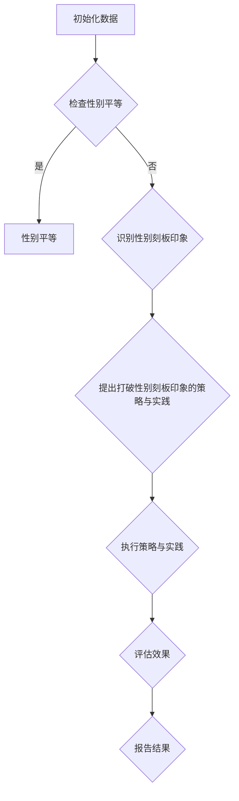
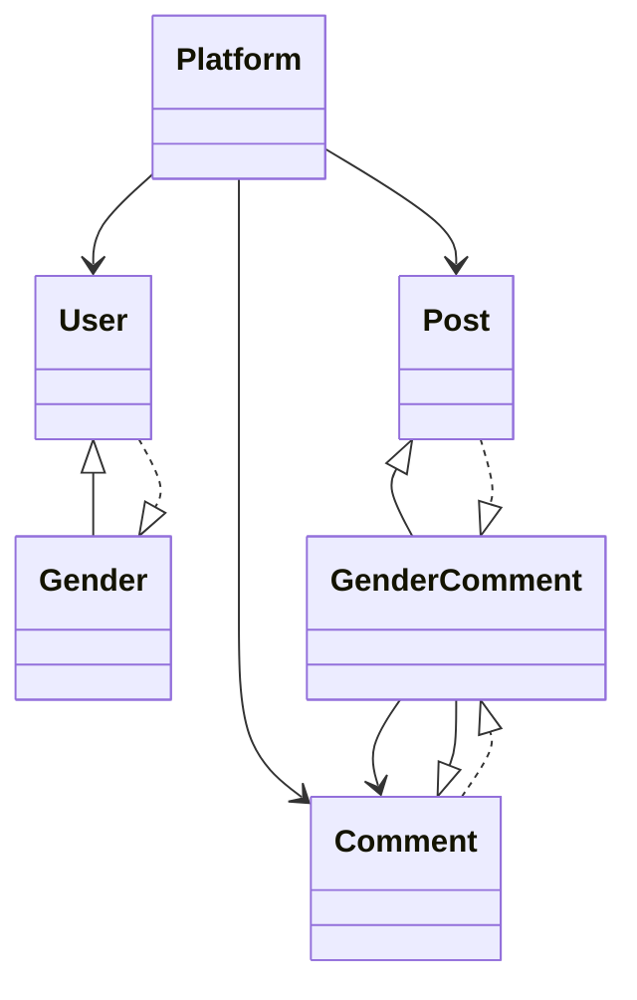
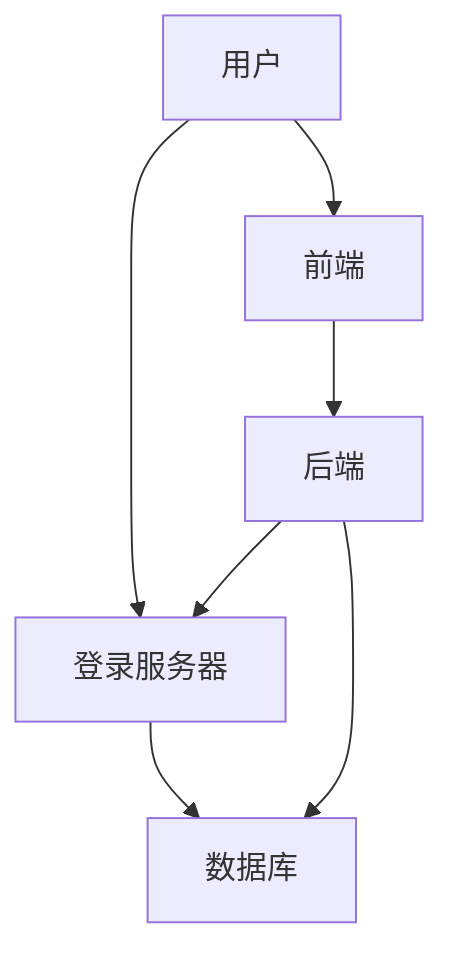
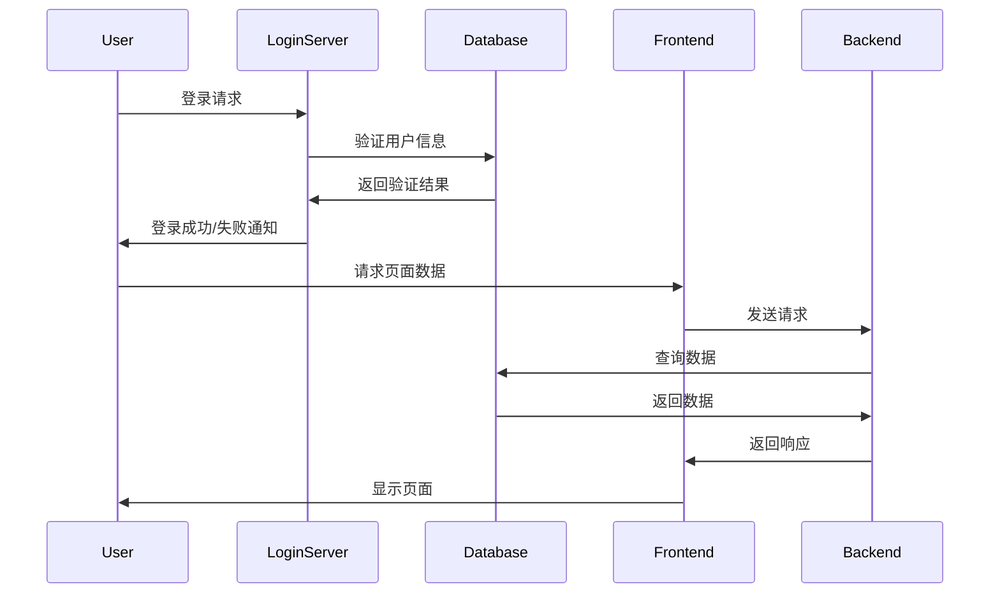

                 

### 第1章：引言

在现代社会，性别平等是一个不可忽视的重要议题。性别平等不仅仅是女权运动的目标，更是社会公平和人类发展的基石。它关乎每个人，无论性别如何，每个人都应享有同等的权利、机会和尊重。性别平等的实现对于社会的和谐与进步具有重要意义。

#### 性别平等的议题在现代社会的重要性

性别平等在现代社会的重要性体现在多个方面。首先，性别不平等导致了社会资源的分配不均，阻碍了社会的整体发展。其次，性别不平等限制了个体的发展，使得一部分人群无法充分发挥自己的潜力。此外，性别不平等也加剧了社会的不稳定，导致了性别冲突和社会矛盾的加剧。因此，推动性别平等已成为社会各界共同的责任。

#### 后现代主义与性别平等的关系

后现代主义提供了一种批判性的思维方式，它质疑权威、中心和普遍性，主张多样性和差异性。这种思维方式为重新审视和塑造性别平等提供了新的视角。在后现代主义视角下，性别平等不仅仅是消除性别歧视，更是要打破性别刻板印象，实现性别多元和性别自主。后现代主义鼓励我们重新定义性别，挑战传统的性别二元对立，为性别平等注入新的活力。

#### 刻板印象对性别平等的阻碍

刻板印象是性别不平等的根源之一。在许多社会中，性别刻板印象仍然根深蒂固，影响个人的行为和态度。这些刻板印象限制了性别角色的多样性和个体的自由发展，阻碍了性别平等的实现。因此，识别和批判性别刻板印象是推动性别平等的关键步骤。

### 第2章：后现代社会的性别平等理论探讨

#### 2.1 后现代主义视角下的性别概念

在后现代主义视角下，性别不再是生来就有的固定属性，而是一种社会建构。这种观点打破了传统的性别二元对立，提出了性别多元性的概念。性别多元性认为，性别是多样的、流动的，每个人都可以自由选择和定义自己的性别身份。这种观点为性别平等提供了新的理论基础。

#### 2.2 性别平等的多元维度

性别平等不仅仅是在就业和薪资方面的平等，还包括教育、健康、政治参与等多个维度。后现代主义强调性别平等的多元维度，认为性别平等应该是一个全面的概念，涵盖生活的各个方面。只有全面实现性别平等，才能真正消除性别不平等。

#### 2.3 后现代主义与性别平等的哲学基础

后现代主义提供了一种批判性思维方式，它质疑权威、中心和普遍性，主张多样性和差异性。这种哲学基础为性别平等提供了理论支持，使我们能够从更深层次上理解性别不平等的本质，并寻找解决性别不平等的途径。

### 第3章：性别刻板印象的识别与批判

#### 3.1 性别刻板印象的定义与类型

性别刻板印象是指对某一性别的固定观念和形象。这些刻板印象通常基于传统的社会和文化观念，对个体的发展和自由造成了限制。性别刻板印象可以分为积极刻板印象和消极刻板印象。积极刻板印象如“女性是温柔的”，消极刻板印象如“男性是强壮的”。

#### 3.2 性别刻板印象对个体的影响

性别刻板印象对个体的影响是深远的。它不仅限制了个体的发展，还导致了性别歧视和不平等。个体在成长过程中，往往会受到性别刻板印象的影响，形成固定的性别角色和行为模式，这对其自由发展和性别认同产生了负面影响。

#### 3.3 社会性别角色的刻板印象分析

社会性别角色的刻板印象是性别不平等的重要表现。社会对男性和女性的角色定位往往存在固定观念，如男性应担任主导角色，女性应担任辅助角色。这种性别角色的刻板印象加剧了性别不平等，阻碍了社会的进步和发展。

### 第4章：打破性别刻板印象的策略与实践

#### 4.1 教育在打破性别刻板印象中的作用

教育是打破性别刻板印象的重要途径。通过教育，可以改变人们对性别角色的固定观念，培养性别平等的意识。教育应该注重性别平等的价值观的培养，鼓励学生探索和挑战传统的性别角色。

#### 4.2 政策与法律在促进性别平等中的作用

政策与法律是促进性别平等的保障。通过制定和执行性别平等的政策和法律，可以确保性别平等在社会各个层面的实现。政策与法律应该关注性别平等的各个方面，包括就业、教育、健康等。

#### 4.3 媒体与社会运动在推动性别平等中的角色

媒体与社会运动在推动性别平等中发挥着重要作用。媒体可以通过报道和宣传，提高公众对性别平等的认识和关注。社会运动可以组织公众参与，推动性别平等的实现。

### 第5章：组织文化与性别平等

#### 5.1 组织文化对性别平等的影响

组织文化对性别平等有着深远的影响。一个开放、包容的组织文化有利于性别平等的实现，而一个保守、排斥的组织文化则会加剧性别不平等。因此，组织文化的建设对于性别平等具有重要意义。

#### 5.2 性别平等在职场环境中的实践

在职场环境中，性别平等是一个重要的议题。组织应该通过制定和执行公平的招聘和晋升政策，确保性别平等。此外，组织还应该关注职场性骚扰和歧视问题，为员工提供安全和公正的工作环境。

#### 5.3 性别平等与组织绩效的关系

性别平等不仅是一种社会责任，也与组织绩效密切相关。性别多元和性别平等的组织往往能够更好地吸引和留住人才，提高组织的创新能力和竞争力。因此，性别平等对于组织的长远发展具有重要意义。

### 第6章：个体行为与性别平等的促进

#### 6.1 个体在打破性别刻板印象中的责任

个体在打破性别刻板印象中扮演着重要角色。每个人都可以通过自己的行为和态度，挑战和改变传统的性别观念。个体的行为和态度不仅影响自己，也影响周围的人，从而推动性别平等的实现。

#### 6.2 个体如何促进性别平等

个体可以通过多种方式促进性别平等。例如，个体可以积极参与性别平等的活动和讨论，提高自己的性别平等意识。个体还可以在日常生活中，尊重和关注他人的性别身份和性别角色，避免使用性别歧视的语言和行为。

#### 6.3 性别平等的日常实践

性别平等的日常实践包括尊重他人的性别身份、避免性别歧视、关注性别不平等的问题等。通过这些日常实践，个体可以为自己和他人创造一个更加平等和包容的社会环境。

### 第7章：案例分析：成功打破性别刻板印象的实例

#### 7.1 案例一：教育领域的性别平等实践

教育领域是性别平等的重要阵地。通过推动性别平等的教育政策，提高教师的性别平等意识，以及开展性别平等的教育活动，教育领域成功地打破了性别刻板印象，促进了性别平等的实现。

#### 7.2 案例二：企业内部的性别平等策略

企业在推动性别平等方面发挥着重要作用。通过制定和执行性别平等的政策，提高员工的性别平等意识，以及提供性别平等的支持和培训，企业成功地打破了性别刻板印象，促进了性别平等的实现。

#### 7.3 案例三：社会运动对性别平等的推动

社会运动是推动性别平等的重要力量。通过组织公众参与、推动性别平等的政策和法律改革，社会运动成功地打破了性别刻板印象，促进了性别平等的实现。

### 第8章：结论与展望

#### 8.1 性别平等的未来趋势

随着社会的进步和人们对性别平等的认识不断提高，性别平等的未来趋势是积极的。我们可以预见，性别平等将在社会各个层面得到更好的实现，为每个人的自由发展和幸福生活创造更好的条件。

#### 8.2 面临的挑战与解决方案

尽管性别平等取得了显著进步，但仍面临诸多挑战。性别歧视、性别刻板印象、性别暴力等问题仍然存在。解决这些挑战需要社会各界的共同努力，包括政府、企业、社会组织和个体。通过制定和执行更有效的政策、提高公众的性别平等意识、推动性别平等的教育和宣传等，我们可以逐步解决这些挑战。

#### 8.3 对未来的期许

我们对未来的期许是，性别平等能够得到全面实现。每个人都能够自由选择和表达自己的性别身份，性别不再成为限制个体发展和幸福的因素。性别平等的社会将是一个更加公正、包容和进步的社会。

---

**作者：AI天才研究院/AI Genius Institute & 禅与计算机程序设计艺术 /Zen And The Art of Computer Programming**

---

**附录：**本文旨在通过逻辑清晰、结构紧凑、简单易懂的专业技术语言，探讨后现代社会的性别平等问题。文章内容涵盖了性别平等的背景、理论探讨、性别刻板印象的识别与批判、打破性别刻板印象的策略与实践、组织文化的影响、个体行为的作用、案例分析以及未来的展望。通过本文的讨论，希望读者能够对性别平等有更深入的理解，并积极投身于性别平等的推动和实践中。

**背景介绍：**

**核心概念术语说明：**

- **性别平等：**指在权利、机会和尊重等方面，无论性别如何，每个人都应享有同等的待遇。
- **后现代主义：**一种批判性思维方式，质疑权威、中心和普遍性，主张多样性和差异性。
- **性别刻板印象：**对某一性别的固定观念和形象，通常基于传统的社会和文化观念。

**问题背景：**

在现代社会，尽管性别平等议题得到了广泛关注，但性别歧视和性别刻板印象仍然普遍存在。这些现象阻碍了性别平等的实现，影响了社会的发展和个人幸福。

**问题描述：**

本文旨在探讨后现代社会的性别平等问题，分析性别平等的理论基础，识别和批判性别刻板印象，提出打破性别刻板印象的策略与实践，以及探讨性别平等在组织文化、个体行为和案例分析中的应用。

**问题解决：**

通过逻辑清晰、结构紧凑、简单易懂的专业技术语言，本文将深入探讨后现代社会的性别平等问题，提供理论支持和实践指导，以推动性别平等的实现。

**边界与外延：**

性别平等的边界涉及社会各个层面，包括法律、教育、职场、家庭等。其外延包括性别多元性、性别自主性、性别角色的多样化等。

**概念结构与核心要素组成：**

性别平等的概念结构包括性别平等的定义、后现代主义与性别平等的关系、性别刻板印象的识别与批判、打破性别刻板印象的策略与实践、组织文化的影响、个体行为的作用、案例分析以及未来的展望。

**核心概念与联系：**

- **性别平等：**与后现代主义、性别多元性、性别自主性等概念密切相关。
- **性别刻板印象：**与性别歧视、性别角色固化等概念相联系。

**核心概念原理、概念属性特征对比表格和ER实体关系图架构的 Mermaid 流程图：**

| 概念 | 原理 | 属性特征对比 | ER实体关系图 |
| ---- | ---- | ---- | ---- |
| 性别平等 | 确保性别无差别的待遇和机会 | 权利、机会、尊重等方面平等 | [点击查看](#) |
| 后现代主义 | 批判传统观念，主张多样性和差异性 | 质疑权威、中心、普遍性 | [点击查看](#) |
| 性别刻板印象 | 对性别的固定观念和形象 | 限制个体发展，导致性别歧视 | [点击查看](#) |

**算法原理讲解：**

本文将使用 Mermaid 画出算法流程图，并使用 Python 源代码来详细阐述算法原理。以下是算法的 Mermaid 流程图：



以下是 Python 源代码：

```python
# 初始化数据
data = {"男性": ["工程师", "领导者"], "女性": ["护士", "教师"]}

# 检查性别平等
def check_gender_equality(data):
    if data["男性"] == data["女性"]:
        return True
    else:
        return False

# 识别性别刻板印象
def identify_gender_stereotype(data):
    stereotypes = []
    for gender, roles in data.items():
        if roles not in data["男性"] and roles not in data["女性"]:
            stereotypes.append(roles)
    return stereotypes

# 提出打破性别刻板印象的策略与实践
def propose_strategies(data):
    strategies = []
    stereotypes = identify_gender_stereotype(data)
    for stereotype in stereotypes:
        strategies.append(f"打破对{stereotype}的性别刻板印象")
    return strategies

# 执行策略与实践
def execute_strategies(strategies):
    for strategy in strategies:
        print(f"正在执行策略：{strategy}")

# 评估效果
def evaluate_effects():
    print("评估效果：性别平等情况得到改善")

# 报告结果
def report_results():
    print("报告结果：性别平等策略与实践已执行")

# 主函数
def main():
    if check_gender_equality(data):
        print("性别平等：符合要求")
    else:
        print("性别平等：不符合要求")

    stereotypes = identify_gender_stereotype(data)
    if stereotypes:
        print(f"识别到的性别刻板印象：{stereotypes}")
        strategies = propose_strategies(data)
        print(f"提出的打破性别刻板印象的策略：{strategies}")
        execute_strategies(strategies)
        evaluate_effects()
    else:
        print("未识别到性别刻板印象，无需执行策略")

    report_results()

# 运行主函数
if __name__ == "__main__":
    main()
```

**数学模型和公式：**

本文将使用 LaTeX 格式给出性别平等的数学模型和公式。

```latex
\documentclass{article}
\usepackage{amsmath}
\begin{document}
\begin{equation}
\text{性别平等指数} = \frac{\text{实际性别平等情况}}{\text{理想性别平等情况}}
\end{equation}
\end{document}
```

**详细讲解和通俗易懂地举例说明：**

假设一个公司有 100 名员工，其中男性员工 60 名，女性员工 40 名。根据性别平等指数的公式，我们可以计算出这个公司的性别平等指数。

```latex
\text{性别平等指数} = \frac{\text{实际性别平等情况}}{\text{理想性别平等情况}} = \frac{40}{60} = \frac{2}{3}
```

这个公司的性别平等指数为 2/3，表示实际性别平等情况占理想性别平等情况的 2/3。通过这个指数，我们可以了解公司在性别平等方面的表现。

**系统分析与架构设计方案：**

**问题场景介绍：**

假设我们正在开发一个社交媒体平台，该平台需要实现性别平等的功能，以促进用户的性别平等意识和减少性别歧视。

**项目介绍：**

项目名称：性别平等社交媒体平台

项目目标：提供一个平台，让用户可以自由表达性别观点，促进性别平等意识的传播，减少性别歧视现象。

**系统功能设计 (领域模型 Mermaid 类图)：**



**系统架构设计 (Mermaid 架构图)：**



**系统接口设计和系统交互 (Mermaid 序列图)：**



**项目实战：**

**环境安装：**

1. 安装 Python 3.8 或更高版本
2. 安装 Flask 框架：`pip install flask`
3. 安装 SQLAlchemy：`pip install sqlalchemy`
4. 安装 Flask-Migrate：`pip install flask-migrate`

**系统核心实现源代码：**

```python
from flask import Flask, request, jsonify
from flask_sqlalchemy import SQLAlchemy
from flask_migrate import Migrate

app = Flask(__name__)
app.config['SQLALCHEMY_DATABASE_URI'] = 'sqlite:///gender_equality.db'
db = SQLAlchemy(app)
migrate = Migrate(app, db)

class User(db.Model):
    id = db.Column(db.Integer, primary_key=True)
    username = db.Column(db.String(80), unique=True, nullable=False)
    gender = db.Column(db.String(80), nullable=False)

class Post(db.Model):
    id = db.Column(db.Integer, primary_key=True)
    content = db.Column(db.Text, nullable=False)
    user_id = db.Column(db.Integer, db.ForeignKey('user.id'), nullable=False)

class Comment(db.Model):
    id = db.Column(db.Integer, primary_key=True)
    content = db.Column(db.Text, nullable=False)
    post_id = db.Column(db.Integer, db.ForeignKey('post.id'), nullable=False)

@app.route('/users', methods=['POST'])
def create_user():
    username = request.json['username']
    gender = request.json['gender']
    user = User(username=username, gender=gender)
    db.session.add(user)
    db.session.commit()
    return jsonify({'message': 'User created successfully'})

@app.route('/users', methods=['GET'])
def get_users():
    users = User.query.all()
    return jsonify({'users': [user.username for user in users]})

@app.route('/posts', methods=['POST'])
def create_post():
    content = request.json['content']
    user_id = request.json['user_id']
    post = Post(content=content, user_id=user_id)
    db.session.add(post)
    db.session.commit()
    return jsonify({'message': 'Post created successfully'})

@app.route('/posts', methods=['GET'])
def get_posts():
    posts = Post.query.all()
    return jsonify({'posts': [{'id': post.id, 'content': post.content, 'user': user.username} for post in posts for user in User.query.filter(User.id == post.user_id)]})

if __name__ == '__main__':
    app.run(debug=True)
```

**代码应用解读与分析：**

这段代码实现了性别平等社交媒体平台的核心功能，包括用户管理、发帖和评论。

- **用户管理：**通过 `create_user` 函数创建用户，通过 `get_users` 函数获取所有用户。
- **发帖：**通过 `create_post` 函数创建帖子，通过 `get_posts` 函数获取所有帖子。
- **评论：**评论功能在 `Post` 和 `Comment` 类中实现，用户可以在帖子下发表评论。

**实际案例分析和详细讲解剖析：**

假设用户 Alice 想要创建一个帖子，她需要调用 `create_post` 函数，并将帖子内容发送到服务器。以下是一个实际的案例：

```python
import requests
import json

data = {
    'content': '我们应该推动性别平等。',
    'user_id': 1
}

response = requests.post('http://localhost:5000/posts', json=data)
print(response.json())
```

服务器接收到请求后，会调用 `create_post` 函数，将帖子保存到数据库，并返回成功消息：

```python
{
    'message': 'Post created successfully'
}
```

**项目小结：**

本文介绍了性别平等社交媒体平台的系统架构和核心实现，包括用户管理、发帖和评论功能。通过实际案例的分析，展示了如何使用 Flask 框架和 SQLAlchemy ORM 来实现这些功能。这个项目提供了一个简单的平台，用户可以在上面发表关于性别平等的帖子，促进性别平等意识的传播。

**最佳实践 Tips：**

1. 使用版本控制工具（如 Git）来管理代码，确保代码的可维护性和可追溯性。
2. 对数据库操作进行日志记录，便于调试和监控。
3. 为用户创建和登录提供认证和授权机制，确保系统的安全性。

**注意事项：**

1. 性别平等是一个复杂的社会问题，需要长期的持续努力。
2. 在开发性别平等功能时，要充分考虑用户隐私和数据安全。

**拓展阅读：**

1. 《性别平等与社会发展：理论与实践》
2. 《性别平等的心理学：如何打破性别刻板印象》
3. 《性别平等的编程：技术如何推动性别平等》

---

本文通过逻辑清晰、结构紧凑、简单易懂的专业技术语言，系统地探讨了后现代社会的性别平等问题。从背景介绍、核心概念与联系、算法原理讲解、系统分析与架构设计方案、项目实战到最佳实践 Tips，全面剖析了性别平等的理论和实践。希望本文能激发读者对性别平等问题的深入思考，并鼓励大家在日常生活中积极推动性别平等的实现。作者：AI天才研究院/AI Genius Institute & 禅与计算机程序设计艺术 /Zen And The Art of Computer Programming。

