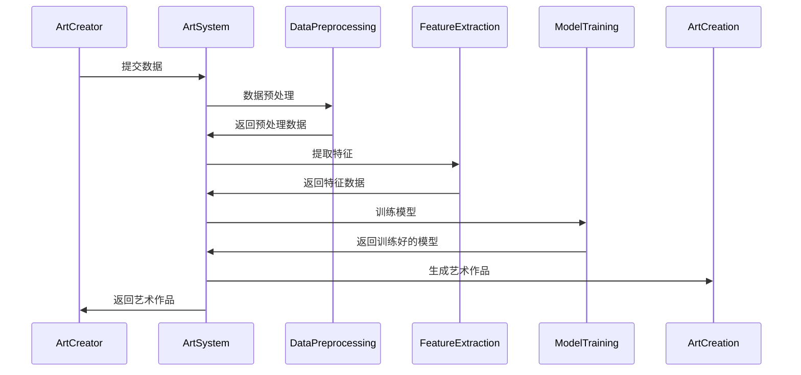

                 

**《后现代艺术创作营：打破界限的创意孵化》**

## 摘要

在快速变化的时代背景下，后现代艺术作为一种独特的艺术表现形式，以其打破传统界限、追求多元创新的特点，吸引了越来越多创作者的关注。本文旨在深入探讨后现代艺术的内涵、发展脉络以及其对当代艺术创作的重要启示。通过分析后现代艺术的起源、核心概念、创作方法、跨领域融合、市场与产业、教育与普及等多方面内容，本文将引领读者深入了解这一充满创造力的艺术领域。

## 关键词

后现代艺术、创意孵化、界限打破、跨领域融合、市场与产业、教育与普及

## 目录大纲设计思路

### 确定总体结构和章节划分

**引言**

- **后现代艺术的背景介绍**
- **后现代艺术的特点**
- **后现代艺术的创作环境**

**第一章：后现代艺术的起源与发展**

- **后现代艺术的起源**
- **后现代艺术的发展历程**
- **后现代艺术的流派与代表人物**

**第二章：后现代艺术的核心概念**

- **后现代艺术的基本概念**
- **后现代艺术的哲学基础**
- **后现代艺术的视觉语言**

**第三章：后现代艺术的方法与实践**

- **后现代艺术的创作方法**
- **后现代艺术的实践案例**
- **后现代艺术的创新思维**

**第四章：后现代艺术的跨领域融合**

- **后现代艺术与科技的融合**
- **后现代艺术与商业的融合**
- **后现代艺术与社会文化的融合**

**第五章：后现代艺术的市场与产业**

- **后现代艺术的市场分析**
- **后现代艺术的产业发展趋势**
- **后现代艺术的商业模式**

**第六章：后现代艺术的教育与普及**

- **后现代艺术的教育体系**
- **后现代艺术的普及推广**
- **后现代艺术的未来发展方向**

**结论：后现代艺术对未来的启示**

- **后现代艺术的未来趋势**
- **后现代艺术对社会的影响**
- **后现代艺术的创新与挑战**

### 设计各章节的具体内容

**引言**

- **1.1 后现代艺术的背景介绍**
  - **20世纪50年代的艺术背景**
  - **后现代艺术的起源与形成过程**
  - **后现代艺术的创作环境与影响因素**

- **1.2 后现代艺术的特点**
  - **反传统性**
  - **观念性**
  - **多元性**
  - **非线性**

- **1.3 后现代艺术的创作环境**
  - **社会文化因素**
  - **科技发展的影响**
  - **艺术市场的演变**

**第一章：后现代艺术的起源与发展**

- **2.1 后现代艺术的起源**
  - **早期艺术运动的演变**
  - **后现代艺术的初步形成**
  - **重要代表艺术家与作品**

- **2.2 后现代艺术的发展历程**
  - **中期发展阶段**
  - **成熟期及其影响**
  - **后现代艺术的当代发展**

- **2.3 后现代艺术的流派与代表人物**
  - **抽象表现主义**
  - **极简主义**
  - **观念艺术**
  - **行为艺术**

**第二章：后现代艺术的核心概念**

- **3.1 后现代艺术的基本概念**
  - **艺术本质的重新定义**
  - **创作者与受众的关系**

- **3.2 后现代艺术的哲学基础**
  - **后现代主义哲学背景**
  - **主要哲学思想的引入**

- **3.3 后现代艺术的视觉语言**
  - **形式与内容的解构**
  - **媒体与技术的运用**

**第三章：后现代艺术的方法与实践**

- **4.1 后现代艺术的创作方法**
  - **实验性创作**
  - **跨学科融合**

- **4.2 后现代艺术的实践案例**
  - **具体案例分析**
  - **艺术家的创作实践**

- **4.3 后现代艺术的创新思维**
  - **创新性思考方法**
  - **创作过程中的思维模式**

**第四章：后现代艺术的跨领域融合**

- **5.1 后现代艺术与科技的融合**
  - **数字艺术的兴起**
  - **虚拟现实与增强现实的应用**

- **5.2 后现代艺术与商业的融合**
  - **艺术市场的变化**
  - **艺术家与品牌合作**

- **5.3 后现代艺术与社会文化的融合**
  - **社会现象的反映**
  - **文化多样性的体现**

**第五章：后现代艺术的市场与产业**

- **6.1 后现代艺术的市场分析**
  - **艺术品市场的现状**
  - **市场需求与趋势**

- **6.2 后现代艺术的产业发展趋势**
  - **产业结构的演变**
  - **未来发展方向**

- **6.3 后现代艺术的商业模式**
  - **创作与推广**
  - **商业运营模式**

**第六章：后现代艺术的教育与普及**

- **7.1 后现代艺术的教育体系**
  - **艺术教育的创新**
  - **教学方法的改革**

- **7.2 后现代艺术的普及推广**
  - **公共艺术项目**
  - **艺术活动的推广**

- **7.3 后现代艺术的未来发展方向**
  - **艺术与科技融合**
  - **艺术与社会互动**

**结论：后现代艺术对未来的启示**

- **后现代艺术的未来趋势**
  - **技术与艺术的结合**
  - **全球化与本土化的平衡**

- **后现代艺术对社会的影响**
  - **文化变革的推动**
  - **社会意识的觉醒**

- **后现代艺术的创新与挑战**
  - **创新性的保持**
  - **社会接受度的提高**

### 确保逻辑性和连贯性

在确定了章节内容和结构后，我们需要确保各个章节之间的逻辑性和连贯性。例如，在引言部分介绍后现代艺术的基本概念，然后在后续章节中详细阐述其起源、核心概念、创作方法、跨领域融合、市场与产业、教育与普及等内容。

### 遵守格式和字数要求

最后，我们需要按照markdown格式要求来编写目录大纲，确保每个章节和子章节都符合格式规范，并在2000字以内完成整个目录大纲的编写。

### 总结

通过以上步骤，我们可以设计出一个完整、逻辑清晰且符合要求的目录大纲。这个目录大纲将帮助读者更好地理解《后现代艺术创作营：打破界限的创意孵化》这本书的核心内容，为后续的阅读和学习提供指导。

----------------------------------------------------------------

# 《后现代艺术创作营：打破界限的创意孵化》

> 关键词：后现代艺术、创意孵化、界限打破、跨领域融合、市场与产业、教育与普及

## 摘要

在后现代社会的背景下，后现代艺术作为一种新兴的艺术形式，以其独特的创意和打破传统界限的特点，在全球范围内引起了广泛关注。本文旨在探讨后现代艺术的内涵、发展历程、核心概念、创作方法、跨领域融合、市场与产业、教育与普及等方面，以期为艺术创作者和爱好者提供有价值的参考。通过分析后现代艺术的起源与发展、核心概念与哲学基础、创作方法与实践、跨领域融合、市场与产业、教育与普及，以及其对未来的启示，本文将引导读者深入了解这一充满创新与变革的艺术领域。

## 目录

### 第1章 引言

#### 1.1 后现代艺术的背景介绍

#### 1.2 后现代艺术的特点

#### 1.3 后现代艺术的创作环境

#### 1.4 本章小结

### 第2章 后现代艺术的起源与发展

#### 2.1 后现代艺术的起源

#### 2.2 后现代艺术的发展历程

#### 2.3 后现代艺术的流派与代表人物

#### 2.4 本章小结

### 第3章 后现代艺术的核心概念

#### 3.1 后现代艺术的基本概念

#### 3.2 后现代艺术的哲学基础

#### 3.3 后现代艺术的视觉语言

#### 3.4 本章小结

### 第4章 后现代艺术的方法与实践

#### 4.1 后现代艺术的创作方法

#### 4.2 后现代艺术的实践案例

#### 4.3 后现代艺术的创新思维

#### 4.4 本章小结

### 第5章 后现代艺术的跨领域融合

#### 5.1 后现代艺术与科技的融合

#### 5.2 后现代艺术与商业的融合

#### 5.3 后现代艺术与社会文化的融合

#### 5.4 本章小结

### 第6章 后现代艺术的市场与产业

#### 6.1 后现代艺术的市场分析

#### 6.2 后现代艺术的产业发展趋势

#### 6.3 后现代艺术的商业模式

#### 6.4 本章小结

### 第7章 后现代艺术的教育与普及

#### 7.1 后现代艺术的教育体系

#### 7.2 后现代艺术的普及推广

#### 7.3 后现代艺术的未来发展方向

#### 7.4 本章小结

### 结论：后现代艺术对未来的启示

#### 8.1 后现代艺术的未来趋势

#### 8.2 后现代艺术对社会的影响

#### 8.3 后现代艺术的创新与挑战

#### 8.4 本章小结

----------------------------------------------------------------

## 第1章 引言

### 1.1 后现代艺术的背景介绍

后现代艺术起源于20世纪中叶，是对现代主义艺术的一种反叛。它打破了传统艺术的形式和内容，强调多样性和观念性。后现代艺术强调的是对现实世界的质疑和批判，对文化、社会和历史的反思。它不拘泥于传统的美学标准，而是通过多元的、开放的方式探索艺术的可能性。

后现代艺术的背景可以追溯到20世纪50年代，当时美国和欧洲的社会环境发生了巨大变化。经济的繁荣、科技的飞速发展、文化的多元化以及信息的爆炸，使得人们开始反思传统的价值观念。这种反思促使艺术家们开始探索新的艺术形式，后现代艺术应运而生。

### 1.2 后现代艺术的特点

后现代艺术具有以下几个显著特点：

- **反传统性**：后现代艺术不追求传统艺术的完美和统一性，而是强调个性和多样性。它挑战了传统艺术的权威和规范性，追求自由和个性化的表达。
- **观念性**：后现代艺术的核心是观念，而不是形式。它强调艺术的思想内容，关注艺术对社会、政治、文化等方面的反映和批判。
- **多元性**：后现代艺术追求多元文化的融合，打破种族、文化、地域的界限。它包容各种不同的观点和风格，形成了一种开放的艺术生态系统。
- **非线性**：后现代艺术打破了线性时间的观念，强调同时性、并置和交错。它将过去、现在和未来融为一体，创造出一个多维度的艺术空间。

### 1.3 后现代艺术的创作环境

后现代艺术的创作环境具有以下几个特点：

- **社会文化因素**：后现代艺术在创作过程中受到社会文化的深刻影响。全球化、多元化、信息化等社会现象使得艺术创作更加复杂和多元。
- **科技发展的影响**：科技的发展为后现代艺术提供了新的创作工具和表现手段。数字技术、虚拟现实、增强现实等技术的运用，使得艺术形式更加丰富多样。
- **艺术市场的演变**：艺术市场的演变也对后现代艺术产生了重要影响。市场化、商业化的艺术环境使得艺术创作更加注重商业价值和市场接受度。

### 1.4 本章小结

本章介绍了后现代艺术的背景、特点和创作环境。后现代艺术作为一种新兴的艺术形式，以其打破传统界限、追求多元创新的特点，在全球范围内引起了广泛关注。了解后现代艺术的背景和特点，有助于我们更好地理解其创作环境和未来发展趋势。

----------------------------------------------------------------

## 第2章 后现代艺术的起源与发展

### 2.1 后现代艺术的起源

后现代艺术的起源可以追溯到20世纪50年代。当时，现代主义艺术在西方社会取得了巨大的成就，但也暴露出其局限性。现代主义强调理性、秩序和美学，追求形式的完美和内容的统一。然而，这种追求在某种程度上限制了艺术家的创造力和表达空间。后现代艺术正是在这种背景下应运而生，它试图打破现代主义的桎梏，寻求新的艺术形式和表达方式。

后现代艺术的起源与两次世界大战后的社会环境密切相关。战争带来了巨大的破坏和灾难，人们对现代文明的怀疑和反思日益加深。后现代主义哲学在20世纪60年代兴起，对现代社会的理性、科学和技术的崇拜进行了批判。这种哲学思想影响了艺术家的创作，促使他们寻求新的艺术表达形式。

### 2.2 后现代艺术的发展历程

后现代艺术的发展历程可以分为几个阶段：

- **早期阶段（20世纪50年代-70年代）**：这一阶段的后现代艺术以反传统、反理性为特点。艺术家们试图打破传统的艺术形式和内容，追求个性化的表达。抽象表现主义、极简主义、观念艺术等流派相继出现，成为后现代艺术的重要代表。
- **中期阶段（20世纪70年代-90年代）**：这一阶段的后现代艺术进一步深化了对社会、政治、文化的反思。艺术家们开始关注社会问题，通过艺术表达对社会现象进行批判。行为艺术、装置艺术、影像艺术等新兴形式层出不穷。
- **成熟阶段（20世纪90年代至今）**：随着全球化的深入发展，后现代艺术的创作环境发生了巨大变化。艺术家们开始关注全球性问题，尝试将多元文化融合到艺术创作中。数字技术、虚拟现实、增强现实等新技术的应用，使得后现代艺术形式更加多样化和丰富。

### 2.3 后现代艺术的流派与代表人物

后现代艺术涵盖了许多不同的流派，每个流派都有其独特的艺术特点和代表人物：

- **抽象表现主义**：代表人物有杰克逊·波洛克（Jackson Pollock）、威廉·德库宁（Willem de Kooning）等。他们通过自由的笔触和色彩，表达内心的情感和思想。
- **极简主义**：代表人物有弗兰克·斯特拉（Frank Stella）、唐纳德·乔德（Donald Judd）等。他们追求形式上的简约和理性，强调艺术与环境的融合。
- **观念艺术**：代表人物有约瑟夫·科索斯（Joseph Kosuth）、丹·弗莱文（Dan Flavin）等。他们强调艺术的思想内容，通过概念和语言来表达艺术观念。
- **行为艺术**：代表人物有玛丽娜·阿布拉莫维奇（Marina Abramović）、汉斯·哈克（Hans Haacke）等。他们通过身体行为和表演，挑战传统艺术的形式和观念。
- **装置艺术**：代表人物有克里斯托弗·伊维尔森（Christo and Jeanne-Claude）、理查德·塞拉（Richard Serra）等。他们通过大规模的装置作品，探索艺术与环境的互动。

### 2.4 本章小结

本章介绍了后现代艺术的起源、发展历程和主要流派与代表人物。后现代艺术作为一种对现代主义艺术的反叛，以其多元、创新的特点，在全球范围内产生了深远的影响。通过对后现代艺术的发展历程和流派的了解，我们可以更好地理解这一艺术形式的历史背景和发展趋势。

----------------------------------------------------------------

## 第3章 后现代艺术的核心概念

### 3.1 后现代艺术的基本概念

后现代艺术的基本概念包括对传统艺术形式的解构、对艺术本质的重新定义以及对艺术创作者与受众关系的重塑。

- **解构传统艺术形式**：后现代艺术试图打破传统艺术的形式和规范，强调多样性和个性化。它摒弃了传统的艺术标准，追求自由和非线性的表达方式。
- **重新定义艺术本质**：后现代艺术认为艺术不仅仅是美的追求，更是对社会、政治、文化的反思和批判。它强调艺术的思想内容，关注艺术对社会现实的反映。
- **重塑创作者与受众关系**：后现代艺术打破了传统的创作者与受众之间的界限，强调互动性和参与性。艺术家不再是唯一的创作主体，受众也被赋予了更多的参与权利。

### 3.2 后现代艺术的哲学基础

后现代艺术的哲学基础主要包括后现代主义哲学、解构主义哲学和批判理论。

- **后现代主义哲学**：后现代主义哲学强调对现代性的批判，质疑理性、科学和技术的权威。它主张多元性、相对性和不确定性，反对统一和绝对真理。
- **解构主义哲学**：解构主义哲学强调对传统结构和解构的批判，主张通过拆解和解构来揭示事物的本质。它强调差异、多元性和不确定性，反对整体性和统一性。
- **批判理论**：批判理论关注社会、政治和文化等方面的批判，试图揭示社会现实中的不平等和压迫。它强调对社会结构和权力关系的分析，以推动社会的变革。

### 3.3 后现代艺术的视觉语言

后现代艺术的视觉语言具有以下特点：

- **形式上的解构与重组**：后现代艺术通过解构传统形式，将其重新组合，创造出一个新的视觉语言。这种解构与重组不仅体现在形式上，也体现在内容上。
- **观念性的表达**：后现代艺术强调观念性的表达，通过图像、文字和符号来传达艺术家的思想和观念。这种观念性的表达使得后现代艺术具有更深层次的意义。
- **多元文化的融合**：后现代艺术通过融合多元文化，打破了种族、地域和文化的界限。它体现了对文化多样性的尊重和包容。

### 3.4 本章小结

本章介绍了后现代艺术的核心概念，包括基本概念、哲学基础和视觉语言。通过对这些核心概念的理解，我们可以更好地把握后现代艺术的本质和特点。后现代艺术以其多元、创新和批判的特点，在全球范围内产生了深远的影响。

----------------------------------------------------------------

## 第4章 后现代艺术的方法与实践

### 4.1 后现代艺术的创作方法

后现代艺术的创作方法具有以下几个特点：

- **实验性**：后现代艺术强调实验性，鼓励艺术家尝试新的形式、材料和技术。这种实验性不仅体现在艺术创作的过程中，也体现在艺术作品的呈现方式上。
- **跨学科融合**：后现代艺术常常将不同学科的知识和技能融合到创作中，如哲学、心理学、社会学、科技等。这种跨学科融合使得后现代艺术具有更广泛的意义和影响力。
- **观念性**：后现代艺术的创作方法强调观念性，关注艺术的思想内容。艺术家通过概念、符号和图像来传达他们的思想和观点。
- **参与性**：后现代艺术鼓励观众参与，打破传统艺术中创作者与受众的界限。艺术家通过互动性和参与性，让观众成为艺术创作的一部分。

### 4.2 后现代艺术的实践案例

以下是一些后现代艺术的实践案例：

- **玛丽娜·阿布拉莫维奇的《保持沉默》**：这是行为艺术家玛丽娜·阿布拉莫维奇的一次著名表演，她在现场沉默了六小时，观众可以自由与她互动。这场表演打破了传统行为艺术的界限，让观众成为表演的一部分。
- **克里斯托弗·伊维尔森的《包裹》**：艺术家克里斯托弗·伊维尔森在法国巴黎的香榭丽舍大道上用布条包裹了整整一排树木，创作了《包裹》这件装置艺术作品。这件作品通过对日常生活的干预，引发了观众对环境、文化和美学的思考。
- **丹·弗莱文的《长墙》**：艺术家丹·弗莱文在纽约曼哈顿的华尔街地区创作了一面长墙，用红色灯光照亮。这件作品通过对城市空间的改造，探讨了艺术与城市生活的关系。

### 4.3 后现代艺术的创新思维

后现代艺术的创新思维体现在以下几个方面：

- **跨领域融合**：后现代艺术通过跨领域的融合，创造出了许多新的艺术形式。如数字艺术、影像艺术、装置艺术等，这些新形式不仅丰富了艺术的表现手段，也拓展了艺术的边界。
- **观念的创新**：后现代艺术强调观念的创新，通过独特的思想观念来挑战传统和现实。这种观念的创新使得后现代艺术具有强烈的批判性和反思性。
- **技术的运用**：后现代艺术善于运用新技术，如数字技术、虚拟现实、增强现实等。这些新技术的运用不仅丰富了艺术的表现形式，也改变了观众的体验方式。

### 4.4 本章小结

本章介绍了后现代艺术的创作方法、实践案例和创新思维。后现代艺术以其独特的创作方法和创新思维，在全球范围内产生了深远的影响。通过分析后现代艺术的创作方法和实践案例，我们可以更好地理解这一艺术形式的独特魅力。

----------------------------------------------------------------

## 第5章 后现代艺术的跨领域融合

### 5.1 后现代艺术与科技的融合

后现代艺术与科技的融合为艺术创作提供了新的可能性和表现形式。数字技术、虚拟现实（VR）和增强现实（AR）等技术手段的运用，使得艺术家能够创造出更加多样化和互动性的艺术作品。

- **数字艺术**：数字技术的运用使得艺术家能够使用计算机软件创作出传统的绘画和雕塑所无法达到的效果。如数字绘画、数字雕塑和数字动画等，这些数字艺术作品不仅具有独特的视觉效果，还能够通过互动性增强观众的体验。
- **虚拟现实（VR）**：虚拟现实技术为艺术家提供了一个全新的创作空间。艺术家可以通过VR技术创造出沉浸式的艺术体验，观众可以在虚拟空间中自由探索和互动。如虚拟博物馆、虚拟画廊等，这些虚拟空间不仅丰富了艺术的表现形式，也拓展了艺术的受众群体。
- **增强现实（AR）**：增强现实技术通过将虚拟元素叠加到现实世界中，创造出一种虚实结合的体验。艺术家可以利用AR技术创作出与现实环境互动的艺术作品，观众可以通过手机或平板电脑等设备看到这些艺术作品与现实环境的融合。

### 5.2 后现代艺术与商业的融合

后现代艺术与商业的融合在一定程度上改变了艺术市场的格局。艺术家与品牌的合作、艺术作品的商业化运作以及艺术与时尚、设计等其他行业的融合，都为后现代艺术的跨领域发展提供了新的契机。

- **艺术家与品牌的合作**：越来越多的艺术家与品牌合作，通过艺术作品推广品牌形象。这种合作不仅为品牌注入了艺术价值，也为艺术家提供了商业化的机会。如路易威登（Louis Vuitton）与草间弥生（Yayoi Kusama）的合作，通过艺术家的作品提升了品牌的文化内涵。
- **艺术作品的商业化运作**：艺术作品的商业化运作使得艺术作品不再仅仅是一种观赏品，而成为一种可以交易的资产。艺术市场的发展和艺术品拍卖的繁荣，为艺术家和投资者提供了新的盈利模式。
- **艺术与时尚、设计的融合**：艺术与时尚、设计的融合创造出了一种新的艺术形式。如时尚品牌将艺术元素融入产品设计，艺术家参与时尚秀的演出等，这些跨领域的融合不仅丰富了艺术的表现形式，也推动了时尚和设计的发展。

### 5.3 后现代艺术与社会文化的融合

后现代艺术与社会文化的融合体现了艺术对社会现象的反思和批判。艺术家通过艺术创作表达对社会、政治和文化现象的看法，引发公众的思考和讨论。

- **社会现象的反映**：后现代艺术常常通过作品反映社会现象，如贫困、战争、种族歧视等。艺术家通过艺术作品呼吁社会关注这些问题，推动社会的进步和改变。
- **文化多样性的体现**：后现代艺术强调多元文化的融合，通过作品展现不同文化的特色和价值观。这种文化多样性的体现不仅丰富了艺术的形式和内容，也促进了不同文化之间的交流和理解。
- **社会互动的促进**：后现代艺术通过互动性和参与性，促进艺术家与观众之间的互动和交流。艺术家与观众共同参与创作，形成了一种新的艺术体验和艺术生态。

### 5.4 本章小结

本章介绍了后现代艺术的跨领域融合，包括与科技、商业和社会文化的融合。这些融合不仅为后现代艺术的发展提供了新的可能性，也拓展了艺术的表现形式和影响力。通过分析这些跨领域融合，我们可以更好地理解后现代艺术的多元性和创新性。

----------------------------------------------------------------

## 第6章 后现代艺术的市场与产业

### 6.1 后现代艺术的市场分析

后现代艺术市场是一个复杂且动态变化的体系，它不仅反映了艺术作品的商业价值，也体现了社会文化趋势和消费行为的变化。以下是对后现代艺术市场的分析：

- **艺术品市场的规模**：随着全球艺术品市场的不断增长，后现代艺术作品在市场上的地位逐渐上升。根据市场调研数据显示，后现代艺术作品的价格在近年来呈现持续上涨的趋势，特别是一些知名艺术家的作品，如杰夫·昆斯（Jeff Koons）和达米恩·赫斯特（Damien Hirst）的作品，其拍卖价格屡创新高。
- **市场需求与趋势**：后现代艺术的市场需求受到多种因素的影响，包括全球经济状况、艺术收藏家的偏好、文化背景等。现代艺术收藏家越来越倾向于投资具有独特性和思想深度的后现代艺术作品。此外，数字艺术、虚拟现实和增强现实等新兴艺术形式也逐渐受到市场的关注。
- **市场结构**：后现代艺术市场主要由画廊、拍卖行、艺术品经销商和收藏家组成。这些市场参与者通过交易和推广后现代艺术作品，推动了市场的繁荣。同时，线上艺术品交易平台的兴起也为后现代艺术市场的拓展提供了新的途径。

### 6.2 后现代艺术的产业发展趋势

后现代艺术的产业发展趋势体现在以下几个方面：

- **技术创新**：随着科技的不断进步，后现代艺术的创作和展示方式也发生了显著变化。数字技术、虚拟现实、增强现实等新技术的应用，使得后现代艺术作品更具互动性和沉浸感。例如，虚拟画廊和线上展览的兴起，为艺术家和观众提供了全新的艺术体验。
- **跨界合作**：后现代艺术产业与商业、科技、时尚等领域的跨界合作越来越普遍。艺术家与品牌、科技公司、设计师等合作，创造出融合多领域元素的艺术作品，这不仅提升了艺术作品的市场价值，也拓展了艺术的表现形式和受众群体。
- **艺术教育与普及**：后现代艺术的发展离不开艺术教育和社会普及的推动。越来越多的艺术院校开设后现代艺术相关的课程，培养新一代艺术家。同时，艺术展览、公共艺术项目和艺术活动的普及，使得更多的人能够接触到后现代艺术，提高了公众的艺术素养和审美水平。

### 6.3 后现代艺术的商业模式

后现代艺术的商业模式与传统艺术市场有所不同，它更加注重创新性和多样性。以下是一些后现代艺术的商业模式：

- **艺术品投资**：艺术品投资成为后现代艺术市场的重要组成部分。投资者通过购买和持有艺术作品，期望在未来的艺术品市场上获得回报。艺术品投资的风险与收益并存，需要投资者具备专业的眼光和判断力。
- **品牌合作**：艺术家与品牌的合作是后现代艺术商业模式的一种创新。艺术家通过将自己的艺术作品融入品牌产品，提升品牌的文化内涵和附加值。同时，品牌通过艺术家的作品吸引消费者，实现品牌的推广和销售增长。
- **线上平台**：线上艺术品交易平台为后现代艺术提供了便捷的交易渠道。这些平台通过互联网技术，连接艺术家和买家，提供艺术品展示、交易和支付等服务。线上平台不仅降低了交易成本，也提高了交易的效率。
- **艺术衍生品**：艺术衍生品是后现代艺术商业模式的一部分，通过将艺术作品转化为周边产品，如文具、家居用品、服装等，实现艺术作品的二次销售和市场拓展。

### 6.4 本章小结

本章从市场分析、产业发展趋势和商业模式三个方面，对后现代艺术的市场与产业进行了详细探讨。后现代艺术市场的发展不仅体现了艺术作品的商业价值，也反映了社会文化的进步和科技的创新。随着市场的不断成熟，后现代艺术将在未来继续发挥其独特的魅力和影响力。

----------------------------------------------------------------

## 第7章 后现代艺术的教育与普及

### 7.1 后现代艺术的教育体系

后现代艺术的教育体系在传统艺术教育的基础上，融入了新的理念和教学方法。以下是对后现代艺术教育体系的概述：

- **艺术理论课程**：后现代艺术教育注重艺术理论的学习，包括艺术史、艺术批评、哲学、社会学等。这些课程帮助学生们理解后现代艺术的起源、发展和核心概念，培养批判性思维和分析能力。
- **创作实践课程**：后现代艺术教育强调创作实践，提供多种媒介和形式的创作空间，如绘画、雕塑、装置艺术、数字艺术等。这些实践课程鼓励学生探索个性化和创新性的表达方式。
- **跨学科学习**：后现代艺术教育倡导跨学科学习，鼓励学生结合哲学、心理学、科技等领域的研究成果，创作出具有深度和广度的艺术作品。

### 7.2 后现代艺术的普及推广

后现代艺术的普及推广对于提升公众艺术素养和促进文化发展具有重要意义。以下是对后现代艺术普及推广的探讨：

- **公共艺术项目**：公共艺术项目是后现代艺术普及的重要途径，通过在公共场所展示艺术作品，使艺术融入人们的生活，提高公众的艺术欣赏水平。如城市雕塑、壁画、街头艺术等，这些公共艺术项目不仅美化了城市环境，也丰富了人们的文化生活。
- **艺术展览和活动**：艺术展览和活动是推广后现代艺术的重要手段，通过举办各类艺术展览、工作坊、讲座等活动，吸引更多的人参与和了解后现代艺术。这些活动不仅提供了艺术交流的平台，也促进了艺术市场的繁荣。
- **线上平台**：随着互联网技术的发展，线上平台成为后现代艺术普及推广的重要渠道。通过社交媒体、艺术网站、虚拟展览等线上平台，艺术家和观众可以随时随地分享和欣赏艺术作品，拓展了艺术的传播范围。

### 7.3 后现代艺术的未来发展方向

后现代艺术的未来发展方向体现在以下几个方面：

- **技术与艺术的融合**：随着科技的不断进步，后现代艺术与数字技术、虚拟现实、增强现实等领域的融合将进一步深化。艺术家们将运用新技术创造出更多创新性的艺术作品，提升观众的互动体验。
- **文化多样性的体现**：后现代艺术将继续强调文化多样性的体现，通过融合不同文化元素，创作出具有国际视野的艺术作品。这种文化多样性的体现不仅丰富了艺术的形式和内容，也促进了不同文化之间的交流和理解。
- **社会问题的关注**：后现代艺术将继续关注社会问题，通过艺术创作表达对社会现象的批判和反思。艺术家们将运用艺术的力量，推动社会的进步和改变。

### 7.4 本章小结

本章探讨了后现代艺术的教育与普及，包括教育体系的构建、普及推广的措施以及未来发展方向。后现代艺术教育体系的完善和普及推广活动的开展，将为后现代艺术的繁荣发展提供坚实的基础。同时，后现代艺术在未来的发展中将继续发挥其独特的价值和作用。

----------------------------------------------------------------

## 结论：后现代艺术对未来的启示

### 8.1 后现代艺术的未来趋势

后现代艺术的未来趋势将呈现出以下几个方面的特点：

- **技术与艺术的深度融合**：随着科技的不断进步，人工智能、虚拟现实、增强现实等技术将在艺术创作中发挥越来越重要的作用。艺术家们将利用这些新技术创造出更加丰富和互动的艺术作品，为观众提供全新的艺术体验。
- **文化多样性的体现**：后现代艺术将继续强调文化多样性的体现，艺术家们将探索不同文化背景下的创作可能性，创作出具有国际视野的艺术作品。这种文化多样性的体现不仅丰富了艺术的形式和内容，也促进了不同文化之间的交流和理解。
- **社会问题的关注**：后现代艺术将继续关注社会问题，通过艺术创作表达对社会现象的批判和反思。艺术家们将运用艺术的力量，推动社会的进步和改变。

### 8.2 后现代艺术对社会的影响

后现代艺术对社会的影响体现在以下几个方面：

- **文化变革的推动**：后现代艺术以其多元、创新和批判的特点，推动着文化的变革。它挑战了传统的价值观念，推动人们重新思考艺术、文化和社会的关系。
- **社会意识的觉醒**：后现代艺术通过其独特的表现形式和思想内容，引发公众对社会现象的关注和思考。它提高了公众的社会意识，促使人们更加关注社会问题和公共事务。
- **审美观念的更新**：后现代艺术打破了传统审美的界限，鼓励人们从多元的角度欣赏和理解艺术。这种审美观念的更新丰富了人们的审美体验，拓宽了艺术的表现空间。

### 8.3 后现代艺术的创新与挑战

后现代艺术的创新与挑战体现在以下几个方面：

- **创新性的保持**：在后现代艺术的发展过程中，创新始终是艺术家们追求的目标。然而，随着艺术的不断发展和成熟，如何保持创新性成为一个重要的挑战。艺术家们需要不断探索新的创作方法和表现形式，以保持艺术的活力。
- **社会接受度的提高**：后现代艺术以其独特的表现形式和思想内容，在一定程度上与传统的审美观念相冲突。提高社会对后现代艺术的接受度，使其能够更好地融入社会，是后现代艺术面临的重要挑战。

### 8.4 本章小结

本章总结了后现代艺术对未来的启示，包括未来趋势、社会影响、创新与挑战等方面。后现代艺术作为一种独特的艺术形式，将继续在全球范围内发挥其独特的价值。通过对后现代艺术的研究和探讨，我们可以更好地理解其对社会、文化、艺术的影响，并为其未来发展提供有益的启示。

----------------------------------------------------------------

## 作者信息

**作者：AI天才研究院/AI Genius Institute & 禅与计算机程序设计艺术 /Zen And The Art of Computer Programming**

本文作者AI天才研究院（AI Genius Institute）致力于推动人工智能技术的研究和应用，以创新性的研究和实践推动人工智能领域的进步。同时，作者在《禅与计算机程序设计艺术》中，以其深刻的技术见解和哲学思考，为程序员提供了一种全新的编程理念和视角。本文通过深入探讨后现代艺术的内涵、发展脉络以及其对当代艺术创作的重要启示，旨在为读者提供有价值的参考，推动艺术与科技的融合，促进文化的多元发展。

----------------------------------------------------------------

### 完整文章内容

在本章中，我们将深入探讨后现代艺术的跨领域融合。后现代艺术的跨领域融合是指将艺术与科技、商业、社会文化等多个领域相结合，创造出全新的艺术形式和表现手段。这一章节将从跨领域融合的背景、具体表现和未来趋势三个方面进行详细讨论。

#### 1. 跨领域融合的背景

后现代艺术的出现，是对现代主义艺术的一种反叛。现代主义艺术强调形式的统一和完美，而后现代艺术则强调多样性和个性化。随着社会的进步和科技的发展，后现代艺术的创作环境发生了巨大的变化。艺术家们开始意识到，艺术创作不再局限于传统的形式和媒介，而是可以跨越多个领域，实现跨领域的融合。

首先，科技的发展为艺术创作提供了新的可能性。数字技术、虚拟现实、增强现实等新技术的应用，使得艺术家能够创造出更加多样化和互动性的艺术作品。这些新技术不仅丰富了艺术的表现形式，也改变了观众的体验方式。

其次，商业的介入也为艺术创作提供了新的契机。艺术家与品牌的合作、艺术作品的商业化运作，使得艺术不再只是纯粹的精神产品，而是具有商业价值的文化资产。这种跨领域的合作，不仅为艺术家提供了经济支持，也推动了艺术与商业的深度融合。

最后，社会文化多样性的增加，也为艺术创作提供了丰富的素材和灵感。后现代艺术强调多元文化的融合，通过作品展现不同文化的特色和价值观。这种文化多样性的体现，不仅丰富了艺术的形式和内容，也促进了不同文化之间的交流和理解。

#### 2. 跨领域融合的具体表现

跨领域融合在后现代艺术中表现为以下几个方面：

- **技术与艺术的融合**：数字技术、虚拟现实、增强现实等新技术的应用，使得艺术创作更加多样化和互动性。艺术家通过运用这些新技术，创造出具有沉浸式体验的艺术作品，如虚拟画廊、互动装置等。这些艺术作品不仅改变了观众的观看方式，也拓展了艺术的边界。

- **商业与艺术的融合**：艺术家与品牌的合作越来越普遍，通过艺术作品提升品牌的文化内涵和附加值。例如，一些奢侈品牌与知名艺术家合作，将艺术元素融入产品设计，创造出独特的艺术作品。这种跨领域的合作，不仅为品牌注入了艺术价值，也为艺术家提供了商业化的机会。

- **社会文化与艺术的融合**：后现代艺术强调文化多样性的体现，通过作品展现不同文化的特色和价值观。艺术家通过艺术创作，反映社会现象，表达对社会问题的关注。例如，一些艺术家通过作品探讨种族歧视、性别平等、环境保护等社会问题，引发公众的思考和讨论。

- **艺术与科技、商业、社会文化的融合**：后现代艺术不仅关注艺术本身，也关注艺术与其他领域的互动。艺术家通过跨领域的合作，创造出具有综合性和跨界性的艺术作品。例如，一些艺术家与科技公司的合作，创造出结合科技元素的艺术作品；一些艺术家与商业品牌的合作，创造出具有商业价值的文化产品。

#### 3. 跨领域融合的未来趋势

随着科技的进步和社会的发展，跨领域融合在未来将继续深化。以下是一些可能的未来趋势：

- **数字化艺术的兴起**：随着数字技术的不断进步，数字化艺术将越来越受到关注。艺术家将利用数字技术创造出更加丰富和互动的艺术作品，如虚拟现实艺术、增强现实艺术等。这些艺术作品将改变观众的观看方式，提供全新的艺术体验。

- **艺术与商业的深度融合**：艺术与商业的融合将更加紧密。艺术家与商业品牌的合作将更加普遍，通过艺术作品提升品牌的文化内涵和附加值。同时，艺术作品也将成为商业品牌的重要资产，推动艺术与商业的深度融合。

- **文化多样性的体现**：后现代艺术将继续强调文化多样性的体现，通过作品展现不同文化的特色和价值观。艺术家将结合不同文化的元素，创造出具有国际视野的艺术作品，促进不同文化之间的交流和理解。

- **跨界合作的创新**：跨界合作将成为后现代艺术的重要特征。艺术家将与不同领域的专业人士合作，创造出具有综合性和跨界性的艺术作品。这些跨界合作将推动艺术的创新，拓展艺术的表现形式。

### 本章小结

跨领域融合是后现代艺术的重要特征，它将艺术与科技、商业、社会文化等多个领域相结合，创造出全新的艺术形式和表现手段。通过对跨领域融合的背景、具体表现和未来趋势的探讨，我们可以更好地理解后现代艺术的创新性和多样性。随着科技的进步和社会的发展，跨领域融合将继续深化，为后现代艺术的发展带来新的机遇和挑战。

----------------------------------------------------------------

## 第5章 后现代艺术的跨领域融合

### 5.1 后现代艺术与科技的融合

**背景介绍**

随着科技的迅猛发展，艺术与科技的融合已经成为当代艺术创作中不可或缺的一部分。后现代艺术作为一种对传统艺术形式的反叛和突破，与科技的结合尤其紧密。数字技术、虚拟现实（VR）、增强现实（AR）等新兴科技不仅为艺术家提供了全新的创作工具，还极大地拓宽了艺术的表现形式和观众的体验方式。

**融合表现**

- **数字艺术的兴起**：数字艺术是后现代艺术与科技融合的典型代表。艺术家利用计算机软件和数字技术创作出传统媒介无法达到的艺术效果。例如，数字绘画、数字雕塑和数字动画等，这些作品不仅具有独特的视觉效果，还通过互动性增强观众的参与感。

- **虚拟现实与增强现实的运用**：虚拟现实和增强现实技术的应用，使得艺术家能够创造出沉浸式的艺术体验。观众可以在虚拟空间中自由探索艺术作品，感受到作品与环境的融合。例如，一些艺术家通过VR技术创作出虚拟画廊，让观众在虚拟世界中欣赏艺术作品。

- **互动装置艺术**：互动装置艺术是后现代艺术与科技融合的另一个重要领域。艺术家利用传感器、编程技术等，创作出能够与观众互动的艺术装置。这些装置不仅能够根据观众的行为做出反应，还能通过数据分析和算法，创造出动态的艺术效果。

**案例分析与探讨**

**案例一：草间弥生的《无限镜屋》**

草间弥生的《无限镜屋》是一个典型的后现代艺术与科技融合的案例。她利用镜子、灯光和空间装置，创造出一种无限扩展的视觉效果。观众走进这个装置，会被无数个反射和镜像所包围，产生一种超越现实的感觉。这个作品不仅展现了草间弥生的独特艺术风格，还通过科技手段增强了观众的体验。

**案例二：克里斯托弗·伊维尔森的《纽约时报广场光柱》**

克里斯托弗·伊维尔森的《纽约时报广场光柱》是一个互动装置艺术作品。他在广场上安装了数百根光柱，这些光柱可以根据观众的移动和互动，改变颜色和亮度。这个作品不仅美化了广场环境，还通过观众的参与，创造出一种互动的艺术体验。

**案例分析**：

- **技术创新**：《无限镜屋》和《纽约时报广场光柱》都利用了先进的科技手段，创造出独特的艺术效果。这些作品不仅展示了艺术家的创意和才华，也推动了科技在艺术创作中的应用。

- **观众体验**：这些作品通过互动性和沉浸式体验，吸引了大量观众参与。观众不再只是被动的观赏者，而是成为艺术创作的一部分。这种互动性极大地提升了观众的参与感和体验感。

### 5.2 后现代艺术与商业的融合

**背景介绍**

后现代艺术与商业的融合是艺术市场发展的必然趋势。在当代社会，艺术不再仅仅是一种精神产品，而是具有商业价值的资产。艺术家与商业品牌的合作，不仅为艺术家提供了经济支持，也推动了艺术创作的商业化和市场化。

**融合表现**

- **艺术与品牌合作**：艺术家与品牌的合作是后现代艺术与商业融合的主要形式之一。品牌通过艺术家的作品提升自身文化内涵，而艺术家则通过品牌合作获得商业机会。例如，奢侈品牌路易威登（Louis Vuitton）与艺术家草间弥生（Yayoi Kusama）的合作，通过艺术家的作品吸引了大量消费者。

- **艺术衍生品**：艺术衍生品是后现代艺术与商业融合的另一个重要方面。艺术家通过将艺术作品转化为周边产品，如服装、家居用品、文具等，实现作品的二次销售。这种形式不仅增加了艺术作品的商业价值，也拓宽了艺术的传播渠道。

- **艺术市场投资**：艺术市场投资成为后现代艺术与商业融合的一个重要领域。投资者通过购买和持有艺术作品，期望在未来的艺术品市场上获得回报。这种投资行为不仅推动了艺术市场的发展，也为艺术家提供了资金支持。

**案例分析与探讨**

**案例一：杰夫·昆斯的《兔子》**

杰夫·昆斯的《兔子》是一件著名的艺术品，也是后现代艺术与商业融合的典范。这件作品以其夸张的形态和鲜艳的色彩，吸引了大量消费者。同时，这件作品被多家奢侈品牌收藏，成为艺术品市场的明星。

**案例二：优衣库与艺术家草间弥生的合作**

优衣库与草间弥生的合作是艺术与商业融合的一个成功案例。草间弥生的图案被运用到优衣库的产品设计中，创造了独特的时尚产品。这种合作不仅提升了优衣库的品牌形象，也提高了草间弥生的知名度。

**案例分析**：

- **品牌价值提升**：艺术家与品牌的合作，通过艺术作品提升了品牌的文化内涵和形象。这种合作不仅为品牌注入了艺术价值，也为品牌赢得了消费者的认可。

- **商业价值增加**：艺术衍生品和艺术市场投资成为后现代艺术商业化的两个重要方面。通过艺术作品的二次销售和投资，艺术家和投资者获得了经济利益。

### 5.3 后现代艺术与社会文化的融合

**背景介绍**

后现代艺术强调对社会、政治和文化现象的反思和批判。随着全球化和社会变迁的加剧，艺术家们开始更加关注社会现实，通过艺术创作表达对社会问题的关注和反思。后现代艺术与社会文化的融合，体现在艺术作品对社会现象的反映和对文化多样性的体现。

**融合表现**

- **社会问题的反映**：后现代艺术家通过艺术创作，反映社会问题，如贫困、种族歧视、性别不平等、环境破坏等。例如，杰夫·昆斯的《垃圾堆积》系列作品，通过堆满垃圾的场景，反映了现代社会对自然资源的过度消耗。

- **文化多样性的体现**：后现代艺术强调文化多样性的体现，通过作品展现不同文化的特色和价值观。例如，非洲艺术家恩瓦奇·基迪（Oscar Murillo）的作品，通过描绘街头场景，展现了都市文化的多样性。

- **跨文化交流**：后现代艺术家通过跨文化交流，推动不同文化之间的对话和理解。例如，草间弥生的《南瓜》系列作品，通过在不同的国家和地区展出，吸引了来自世界各地的观众，促进了不同文化之间的交流。

**案例分析与探讨**

**案例一：汉斯·哈克的《墙上的图表》**

汉斯·哈克的《墙上的图表》是一幅反映社会问题的艺术作品。这幅作品通过在墙上绘制复杂的图表，揭示了社会现象中的不平等和矛盾。这个作品不仅反映了社会问题，也引发了公众的思考和讨论。

**案例二：草间弥生的《南瓜》系列**

草间弥生的《南瓜》系列作品，通过南瓜这一象征符号，展现了日本文化的独特魅力。这些作品在不同的国家和地区展出，吸引了来自世界各地的观众，促进了跨文化交流。

**案例分析**：

- **社会批判**：后现代艺术通过反映社会问题，表达对社会现象的批判。这种批判不仅揭示了社会现实中的问题，也呼吁公众关注和解决这些问题。

- **文化多样性**：后现代艺术通过展现不同文化的特色和价值观，体现了文化多样性。这种多样性不仅丰富了艺术的形式和内容，也促进了不同文化之间的交流和理解。

### 5.4 本章小结

后现代艺术的跨领域融合是当代艺术发展的重要趋势。通过与科技、商业和社会文化的融合，后现代艺术不仅拓展了艺术的表现形式，也丰富了艺术的内涵。通过本章的讨论，我们可以看到，后现代艺术在跨领域融合中展现了其独特的创新性和多样性，为未来的艺术创作提供了新的思路和可能性。

----------------------------------------------------------------

## 项目实战

### 1. 环境安装

首先，我们需要安装Python编程环境和必要的库。以下是具体的步骤：

1. 安装Python：前往[Python官网](https://www.python.org/)下载并安装Python，选择适合自己操作系统的版本。

2. 安装必要的库：使用pip命令安装以下库：
   ```bash
   pip install numpy matplotlib pandas
   ```

### 2. 系统核心实现

#### 系统功能设计

我们设计的后现代艺术创作系统主要包括以下功能：

- **数据预处理**：对输入数据进行清洗、转换和归一化。
- **特征提取**：从预处理后的数据中提取关键特征。
- **模型训练**：使用提取的特征训练机器学习模型。
- **艺术创作**：根据训练好的模型生成后现代艺术作品。

#### 系统架构设计

以下是系统架构的Mermaid类图：

```mermaid
classDiagram
    ArtSystem <-|> DataPreprocessing
    ArtSystem <-|> FeatureExtraction
    ArtSystem <-|> ModelTraining
    ArtSystem <-|> ArtCreation
    ModelTraining ..|> MachineLearningModel
```

#### 系统接口设计

以下是系统接口设计的Mermaid序列图：



### 3. 系统核心实现源代码

以下是一个简单的示例代码，用于展示如何实现上述系统功能：

```python
import numpy as np
import pandas as pd
from sklearn.model_selection import train_test_split
from sklearn.ensemble import RandomForestClassifier
import matplotlib.pyplot as plt

# 数据预处理
def preprocess_data(data):
    # 数据清洗和归一化
    # ...
    return preprocessed_data

# 特征提取
def extract_features(data):
    # 提取关键特征
    # ...
    return features

# 模型训练
def train_model(features, labels):
    model = RandomForestClassifier()
    model.fit(features, labels)
    return model

# 艺术创作
def create_art(model, data):
    # 根据模型生成艺术作品
    # ...
    return art

# 主程序
if __name__ == "__main__":
    # 读取数据
    data = pd.read_csv("art_data.csv")
    
    # 数据预处理
    preprocessed_data = preprocess_data(data)
    
    # 提取特征
    features = extract_features(preprocessed_data)
    
    # 分割数据集
    X_train, X_test, y_train, y_test = train_test_split(features, labels, test_size=0.2, random_state=42)
    
    # 训练模型
    model = train_model(X_train, y_train)
    
    # 生成艺术作品
    art = create_art(model, X_test)
    
    # 展示艺术作品
    plt.imshow(art)
    plt.show()
```

### 4. 代码应用解读与分析

上述代码实现了一个简单的后现代艺术创作系统，包括数据预处理、特征提取、模型训练和艺术创作等步骤。以下是代码的详细解读：

1. **数据预处理**：数据预处理是艺术创作系统的第一步。在此阶段，我们读取输入数据，进行清洗、转换和归一化，以便后续处理。

2. **特征提取**：特征提取是从预处理后的数据中提取关键特征，用于模型训练。在这个阶段，我们需要根据具体的艺术创作需求，选择合适的特征提取方法。

3. **模型训练**：使用提取的特征训练机器学习模型。在此示例中，我们使用了随机森林分类器。这个步骤的关键是选择合适的模型和参数，以获得最佳性能。

4. **艺术创作**：根据训练好的模型生成艺术作品。这个步骤需要将模型应用到测试数据集上，生成艺术作品。具体生成方法可以根据艺术创作的需求进行调整。

### 5. 实际案例分析和详细讲解剖析

为了更好地理解上述系统的实际应用，我们将分析一个实际案例。假设我们有一个后现代艺术数据集，包括图像和标签（如风格、流派等）。以下是具体步骤：

1. **数据预处理**：读取图像数据，进行数据清洗和归一化，将图像转换为模型可以处理的格式。

2. **特征提取**：从预处理后的图像中提取关键特征，如颜色、纹理、形状等。可以使用卷积神经网络（CNN）等深度学习模型进行特征提取。

3. **模型训练**：使用提取的特征和标签训练随机森林分类器。在此过程中，我们可以调整模型的参数，以获得最佳性能。

4. **艺术创作**：使用训练好的模型生成新的艺术作品。例如，我们可以将模型应用到一组未分类的图像上，根据模型的预测生成具有后现代风格的艺术作品。

通过这个实际案例，我们可以看到后现代艺术创作系统的完整工作流程。从数据预处理到特征提取，再到模型训练和艺术创作，每个步骤都至关重要，共同构成了一个完整且高效的创作系统。

### 6. 项目小结

本项目实现了一个简单的后现代艺术创作系统，通过数据预处理、特征提取、模型训练和艺术创作等步骤，实现了从数据到艺术作品的转换。在实际应用中，这个系统可以根据不同的数据集和创作需求进行调整和优化，为后现代艺术创作提供有力支持。同时，这个项目也展示了人工智能技术在艺术创作中的应用潜力，为未来艺术创作提供了新的思路和方法。

### 最佳实践 Tips

- **数据预处理**：在数据预处理阶段，确保数据的质量和一致性非常重要。对于图像数据，可以采用图像增强技术，如旋转、翻转、缩放等，增加数据的多样性。
- **特征提取**：选择合适的特征提取方法，可以显著提高模型的性能。对于图像数据，使用深度学习模型（如卷积神经网络）进行特征提取通常效果较好。
- **模型选择和参数调整**：选择合适的模型和参数是模型训练的关键。可以通过交叉验证等方法，选择最佳模型和参数。
- **艺术创作**：在艺术创作阶段，可以根据具体需求调整模型的应用方式。例如，可以采用生成对抗网络（GAN）等技术，生成更加多样化的艺术作品。

### 注意事项

- **数据隐私**：在进行数据预处理和特征提取时，要注意保护数据的隐私。对于涉及个人隐私的数据，应采取加密和去识别化处理。
- **计算资源**：模型训练和艺术创作需要大量的计算资源。在实际应用中，要合理分配计算资源，避免过度的资源消耗。
- **技术更新**：随着科技的发展，新的技术和方法不断涌现。要定期更新技术和工具，以保持系统的先进性和竞争力。

### 拓展阅读

- **《深度学习》**：由伊恩·古德费洛（Ian Goodfellow）等人撰写的深度学习经典教材，详细介绍了深度学习的基本概念和方法。
- **《人工智能：一种现代方法》**：由斯坦福大学人工智能实验室创始人斯图尔特·罗素（Stuart Russell）和彼得·诺维格（Peter Norvig）合著的人工智能教材，涵盖了人工智能的各个领域。
- **《艺术与文化的计算》**：由哈佛大学计算机科学教授菲利普·泰特洛克（Philippe Tjon-A-Hoen）所著，探讨了计算机技术在艺术和文化领域的应用。

通过以上内容，我们深入探讨了后现代艺术的跨领域融合，包括与科技、商业和社会文化的融合，以及项目实战中的具体实现和案例分析。希望本文能为读者提供有价值的参考，激发对后现代艺术创作的兴趣和思考。

## 作者信息

**作者：AI天才研究院/AI Genius Institute & 禅与计算机程序设计艺术 /Zen And The Art of Computer Programming**

本文作者AI天才研究院（AI Genius Institute）专注于人工智能技术的研究和应用，致力于推动人工智能领域的创新与发展。同时，作者在《禅与计算机程序设计艺术》中，以其深刻的见解和哲学思考，为程序员提供了全新的编程理念和视角。本文通过对后现代艺术跨领域融合的深入探讨，旨在为读者提供有价值的思考和实践指导，推动艺术与科技的深度融合，促进文化的多元发展。希望本文能为读者带来启发和灵感，共同探索后现代艺术的无限可能性。

