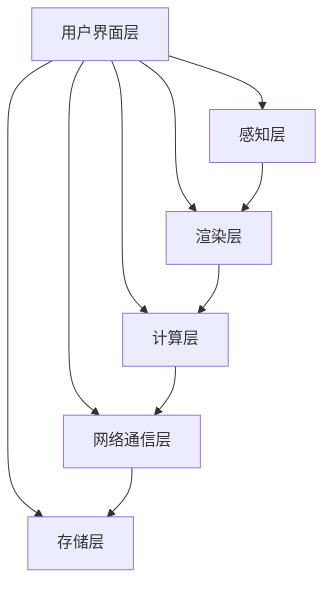

                 


### 引言

随着科技的飞速发展，我们正逐步进入一个名为“后真实时代”的新时代。在这个时代，虚拟与现实不再是两个截然分离的领域，而是逐渐交织在一起，形成一个复杂且多元的交互空间。后真实时代不仅改变了我们的生活方式，也深刻影响了我们的认知和思考方式。本文旨在探讨后真实时代的概念、特征及其对我们的影响，并通过一步步的分析和推理，寻找在这个时代中寻找真我的方法。

#### 1.1 问题的提出

虚拟与现实交织的现象在现代社会中随处可见。从虚拟现实（VR）游戏到增强现实（AR）应用，从社交媒体到在线购物，虚拟世界已经成为我们日常生活中不可或缺的一部分。这种交织的现象不仅改变了我们的娱乐和消费方式，也对教育、医疗、工业等多个领域产生了深远的影响。

然而，随着虚拟与现实的关系日益紧密，我们也面临着一系列挑战。首先是如何在这个交织的世界中找到自我，保持对现实世界的认知和把握。其次是如何处理虚拟现实带来的信息过载和社交隔离问题。最后是如何确保虚拟世界的公平性和安全性，避免出现数字鸿沟和隐私泄露等问题。

#### 1.2 目标与读者群体

本文的目标是帮助读者理解后真实时代的概念和特征，探讨在这个时代中如何保持自我，并找到真我。本文适合对计算机科学、人工智能、心理学等领域有一定了解的读者，特别是那些对虚拟现实和增强现实技术感兴趣的读者。

#### 1.3 文章结构

本文分为以下几个部分：

1. **引言**：介绍后真实时代的概念和背景，提出本文的研究目标和读者群体。
2. **问题背景与核心概念**：详细描述后真实时代的背景和核心概念，包括虚拟现实技术的发展历程、应用领域等。
3. **核心概念与联系**：分析虚拟现实技术的基本原理、虚拟现实与增强现实的关系，以及虚拟现实技术的核心要素。
4. **算法原理讲解**：介绍虚拟现实中的常见算法，包括3D建模算法、运动跟踪算法等，并使用Python代码进行详细阐述。
5. **数学模型与公式**：讲解虚拟现实中的数学模型和公式，使用LaTeX格式进行表示。
6. **系统分析与架构设计**：介绍虚拟现实系统的组成、系统架构设计、系统接口设计和系统交互。
7. **项目实战**：通过实际项目介绍虚拟现实技术的应用，包括环境安装、系统核心实现、代码应用解读与分析等。
8. **最佳实践与案例分析**：总结最佳实践技巧，分析实际案例，并提出未来展望。

### 关键词
- 后真实时代
- 虚拟现实
- 增强现实
- 人工智能
- 自我认知
- 数字生活

### 摘要

本文探讨了后真实时代的概念、特征及其对我们生活的影响。通过一步步的分析和推理，本文揭示了在虚拟与现实交织中寻找真我之道。文章首先介绍了后真实时代的背景和核心概念，包括虚拟现实技术的发展历程和应用领域。接着，本文分析了虚拟现实技术的基本原理、虚拟现实与增强现实的关系，以及虚拟现实技术的核心要素。随后，本文介绍了虚拟现实中的常见算法，包括3D建模算法、运动跟踪算法等，并使用Python代码进行了详细阐述。此外，本文还讲解了虚拟现实中的数学模型和公式，并介绍了虚拟现实系统的组成、系统架构设计、系统接口设计和系统交互。最后，本文通过实际项目介绍了虚拟现实技术的应用，并总结了最佳实践技巧和实际案例。通过本文的阅读，读者可以更好地理解后真实时代的概念和特征，并学会如何在虚拟与现实交织中找到真我。

----------------------------------------------------------------
## 第1章 引言

### 1.1 问题的提出

在当今社会，虚拟与现实的关系日益复杂，我们正逐步进入一个被称为“后真实时代”的新时代。后真实时代的定义并不仅仅是虚拟技术对现实世界的简单叠加，而是一个涉及人类社会、科技、文化等多个层面，深刻改变我们生活方式和认知方式的全新阶段。在这个时代，虚拟世界与现实世界不再是相互独立的，而是相互交织、相互影响，形成了一个多元且复杂的交互空间。

#### 1.1.1 虚拟与现实交织的现象

虚拟与现实交织的现象在现代社会中无处不在。首先，虚拟现实（VR）和增强现实（AR）技术的广泛应用是这种现象的最直观表现。通过VR头盔、AR眼镜等设备，用户可以进入一个虚拟的世界，感受到身临其境的体验。而AR技术则将虚拟元素叠加到现实世界中，使得现实与虚拟之间的界限变得模糊。例如，在游戏、教育、医疗等多个领域，虚拟现实和增强现实技术已经得到广泛应用，改变了人们的学习、工作、娱乐方式。

其次，社交媒体和网络平台也是虚拟与现实交织的重要场所。人们通过这些平台建立虚拟社区，进行社交互动，分享生活点滴。社交媒体上的“点赞”、“评论”等功能，将现实生活中的社交行为数字化，使得虚拟社交与现实社交相互交织。此外，随着5G技术的发展，网络速度更快，延迟更低，虚拟社交体验更加真实，进一步加深了虚拟与现实之间的联系。

#### 1.1.2 后真实时代的背景

后真实时代的背景可以追溯到计算机科学、人工智能和通信技术的飞速发展。随着这些技术的不断进步，虚拟世界和现实世界之间的界限变得越来越模糊。以下是一些关键技术的发展背景：

1. **虚拟现实（VR）技术的发展**：VR技术始于20世纪60年代，但直到21世纪初，随着计算机性能的不断提升和显示技术的进步，VR技术才开始逐渐普及。特别是随着VR头盔、VR眼镜等设备的研发和推广，VR技术开始在游戏、教育、医疗等领域得到广泛应用。

2. **增强现实（AR）技术的发展**：AR技术始于20世纪90年代，最早的应用是军事和医学领域。随着智能手机和平板电脑的普及，AR技术开始进入大众市场。特别是随着AR眼镜、AR贴纸等设备的研发和推广，AR技术开始在娱乐、教育、工业等领域得到广泛应用。

3. **人工智能（AI）技术的发展**：人工智能技术的飞速发展，使得计算机能够模拟人类智能，进行自主学习和决策。特别是在深度学习、自然语言处理等领域的突破，使得人工智能在图像识别、语音识别、机器翻译等方面取得了重大进展。这些技术进步，为虚拟现实和增强现实技术的发展提供了强有力的支持。

4. **5G技术的发展**：5G技术的研发和推广，使得网络速度更快，延迟更低。这对于虚拟现实和增强现实技术的实时交互至关重要。5G技术的高带宽、低延迟特点，使得虚拟现实和增强现实的应用场景更加广泛，用户体验更加真实。

#### 1.2 目标与读者群体

本文的目标是帮助读者理解后真实时代的概念、特征及其对我们生活的影响。通过逐步分析和推理，本文旨在揭示在虚拟与现实交织中寻找真我之道。本文适合对计算机科学、人工智能、心理学等领域有一定了解的读者，特别是那些对虚拟现实和增强现实技术感兴趣的读者。

本文的主要内容包括：

- **背景介绍**：介绍后真实时代的概念、特征及其背景技术发展。
- **核心概念与联系**：分析虚拟现实技术的基本原理、虚拟现实与增强现实的关系，以及虚拟现实技术的核心要素。
- **算法原理讲解**：介绍虚拟现实中的常见算法，包括3D建模算法、运动跟踪算法等，并使用Python代码进行详细阐述。
- **数学模型与公式**：讲解虚拟现实中的数学模型和公式，使用LaTeX格式进行表示。
- **系统分析与架构设计**：介绍虚拟现实系统的组成、系统架构设计、系统接口设计和系统交互。
- **项目实战**：通过实际项目介绍虚拟现实技术的应用，包括环境安装、系统核心实现、代码应用解读与分析等。
- **最佳实践与案例分析**：总结最佳实践技巧，分析实际案例，并提出未来展望。

#### 1.3 文章结构

本文的结构如下：

- **引言**：介绍后真实时代的概念和背景，提出本文的研究目标和读者群体。
- **问题背景与核心概念**：详细描述后真实时代的背景和核心概念，包括虚拟现实技术的发展历程、应用领域等。
- **核心概念与联系**：分析虚拟现实技术的基本原理、虚拟现实与增强现实的关系，以及虚拟现实技术的核心要素。
- **算法原理讲解**：介绍虚拟现实中的常见算法，包括3D建模算法、运动跟踪算法等，并使用Python代码进行详细阐述。
- **数学模型与公式**：讲解虚拟现实中的数学模型和公式，使用LaTeX格式进行表示。
- **系统分析与架构设计**：介绍虚拟现实系统的组成、系统架构设计、系统接口设计和系统交互。
- **项目实战**：通过实际项目介绍虚拟现实技术的应用，包括环境安装、系统核心实现、代码应用解读与分析等。
- **最佳实践与案例分析**：总结最佳实践技巧，分析实际案例，并提出未来展望。
- **小结与展望**：总结本文的主要观点和研究成果，展望后真实时代的未来发展。

### 关键词
- 后真实时代
- 虚拟现实
- 增强现实
- 人工智能
- 自我认知
- 数字生活

### 摘要

本文探讨了后真实时代的概念、特征及其对我们生活的影响。通过逐步分析和推理，本文揭示了在虚拟与现实交织中寻找真我之道。文章首先介绍了后真实时代的背景和核心概念，包括虚拟现实技术的发展历程和应用领域。接着，本文分析了虚拟现实技术的基本原理、虚拟现实与增强现实的关系，以及虚拟现实技术的核心要素。随后，本文介绍了虚拟现实中的常见算法，包括3D建模算法、运动跟踪算法等，并使用Python代码进行了详细阐述。此外，本文还讲解了虚拟现实中的数学模型和公式，并介绍了虚拟现实系统的组成、系统架构设计、系统接口设计和系统交互。最后，本文通过实际项目介绍了虚拟现实技术的应用，并总结了最佳实践技巧和实际案例。通过本文的阅读，读者可以更好地理解后真实时代的概念和特征，并学会如何在虚拟与现实交织中找到真我。

----------------------------------------------------------------
## 第2章 问题背景与核心概念

在深入探讨后真实时代的内涵及其影响之前，我们需要对问题背景和核心概念进行详细的阐述。这一章节将分为以下几个部分：虚拟现实技术的发展历程、后真实时代的现实世界应用、虚拟现实技术在后真实时代中的角色与挑战。

### 2.1 虚拟现实技术的发展历程

虚拟现实（VR）技术的发展可以追溯到20世纪60年代，当时美国空军首次提出了VR的概念。然而，真正意义上的VR技术兴起始于20世纪90年代，随着计算机技术的飞速发展，VR技术开始逐渐应用于军事、娱乐等领域。进入21世纪，随着硬件设备的不断改进和互联网的普及，VR技术开始进入大众视野。

#### 2.1.1 虚拟现实技术的基本概念

虚拟现实技术是一种通过计算机技术创造出的虚拟环境，使用户能够沉浸在其中的技术。这个虚拟环境可以是完全虚构的，也可以是基于现实世界的模拟。虚拟现实技术的核心是提供一个沉浸式体验，使用户能够在虚拟环境中感知、交互和操作。

#### 2.1.2 虚拟现实技术的发展阶段

1. **初步阶段（1960s-1980s）**：这一阶段以美国科学家伊凡·苏瑟兰（Ivan Sutherland）于1968年设计的“达摩克利斯之剑”头戴式显示器为代表。虽然设备笨重，但这是VR技术的首次尝试。

2. **探索阶段（1990s）**：随着计算机性能的提升，VR技术开始应用于军事、医疗、娱乐等领域。这一阶段的重要进展包括虚拟现实头盔、虚拟现实模拟器等设备的研发。

3. **成熟阶段（2000s-2010s）**：随着硬件设备的改进和互联网的普及，VR技术开始进入大众市场。重要进展包括Oculus Rift、HTC Vive等头戴式显示设备的推出。

4. **发展繁荣阶段（2020s至今）**：随着5G技术的推广和人工智能的崛起，VR技术进入了一个新的发展阶段。虚拟现实开始广泛应用于游戏、教育、医疗、工业等多个领域。

### 2.2 后真实时代的现实世界应用

#### 2.2.1 虚拟现实技术在现实世界的应用

虚拟现实技术已经深入到现实世界的多个领域，带来了诸多变革。

1. **娱乐领域**：虚拟现实游戏和电影成为人们休闲娱乐的新选择。通过VR设备，用户可以沉浸在游戏或电影中，体验到前所未有的沉浸式体验。

2. **教育领域**：虚拟现实技术在教育中的应用越来越广泛，可以为学生提供更加生动、直观的学习体验。例如，通过虚拟实验室，学生可以在虚拟环境中进行实验，而不必担心实验的安全性和成本。

3. **医疗领域**：虚拟现实技术在医疗领域的应用包括手术模拟、疼痛缓解、心理治疗等。医生可以在虚拟环境中进行手术训练，提高手术技能；患者可以通过虚拟现实体验缓解疼痛；心理治疗师可以利用虚拟现实技术进行恐惧治疗等。

4. **工业领域**：虚拟现实技术在工业设计、模拟仿真、员工培训等方面有广泛的应用。通过虚拟现实技术，企业可以在虚拟环境中进行产品设计和测试，提高研发效率；员工可以通过虚拟现实进行培训，提高技能水平。

#### 2.2.2 后真实时代的现实世界挑战

尽管虚拟现实技术在现实世界中的应用带来了诸多便利，但也面临着一系列挑战。

1. **技术瓶颈**：虚拟现实技术仍然存在一些技术瓶颈，如延迟、分辨率、交互方式等，这些问题需要进一步解决。

2. **隐私保护**：虚拟现实技术使得用户在虚拟环境中可以接触到大量的个人信息，如何保护用户的隐私成为一个重要问题。

3. **数字鸿沟**：虚拟现实技术的应用需要一定的经济基础和技术支持，这可能导致数字鸿沟的加剧，使得部分人群无法享受到虚拟现实带来的便利。

4. **伦理问题**：虚拟现实技术可能引发一系列伦理问题，如虚拟现实中的道德判断、虚拟世界的公平性等。

### 2.3 虚拟现实技术在后真实时代中的角色与挑战

#### 2.3.1 虚拟现实技术在后真实时代中的角色

1. **增强社交互动**：虚拟现实技术可以为人们提供一个全新的社交平台，使人们可以在虚拟环境中进行互动，打破地域和时间的限制。

2. **提供沉浸式体验**：虚拟现实技术可以创造一个高度沉浸式的体验环境，使人们可以在虚拟世界中体验到前所未有的感受。

3. **促进创新和研发**：虚拟现实技术可以为各个领域的创新和研发提供强有力的支持，通过虚拟环境进行模拟和测试，提高研发效率。

#### 2.3.2 后真实时代的挑战

1. **技术成熟度**：尽管虚拟现实技术在不断发展，但仍需要进一步提高技术成熟度，以满足更广泛的应用需求。

2. **应用场景扩展**：虚拟现实技术需要进一步拓展应用场景，从现有的娱乐、教育、医疗等领域扩展到更多领域。

3. **伦理和法律问题**：虚拟现实技术的应用可能会引发一系列伦理和法律问题，需要制定相应的法律法规进行规范。

### 关键词
- 后真实时代
- 虚拟现实技术
- 现实世界应用
- 社交互动
- 沉浸式体验
- 创新与研发
- 数字鸿沟
- 隐私保护
- 伦理问题

### 摘要

本章详细介绍了虚拟现实技术的发展历程、后真实时代的现实世界应用以及虚拟现实技术在后真实时代中的角色与挑战。首先，我们回顾了虚拟现实技术从1960年代至今的发展历程，并介绍了虚拟现实技术的基本概念。接着，我们探讨了虚拟现实技术在娱乐、教育、医疗、工业等领域的应用，并分析了虚拟现实技术在现实世界面临的挑战。最后，我们讨论了虚拟现实技术在后真实时代中的角色，包括增强社交互动、提供沉浸式体验和促进创新与研发。通过本章的阅读，读者可以更深入地理解虚拟现实技术在后真实时代的应用和发展，以及所面临的挑战。

----------------------------------------------------------------
## 第3章 核心概念与联系

在深入探讨后真实时代的概念与特征时，我们需要理解几个核心概念及其之间的联系。本章将分为以下几个部分：虚拟现实技术的基本原理、虚拟现实与增强现实的关系，以及虚拟现实技术的核心要素。

### 3.1 虚拟现实技术的基本原理

虚拟现实（VR）技术是一种通过计算机技术模拟出三维虚拟环境，使用户能够沉浸其中的技术。其基本原理包括以下几个方面：

#### 3.1.1 显示技术

显示技术是虚拟现实技术的核心之一，用于将虚拟环境呈现在用户眼前。常见的显示技术包括：

1. **头戴式显示器（HMD）**：头戴式显示器是最常见的虚拟现实显示设备，它将虚拟环境的图像直接呈现在用户的视野中，使用户感受到沉浸式体验。

2. **大屏幕投影**：大屏幕投影技术通过投影仪将虚拟环境投影到墙面或地面上，用户通过站在投影区域内观看虚拟环境。

#### 3.1.2 传感技术

传感技术用于捕捉用户在虚拟环境中的动作和姿态，并反馈给计算机系统进行处理。常见的传感技术包括：

1. **定位传感器**：定位传感器用于确定用户在虚拟环境中的位置和运动轨迹，常见的定位传感器包括红外传感器、超声波传感器、激光传感器等。

2. **动作捕捉系统**：动作捕捉系统通过捕捉用户的手部、腿部等动作，将动作转换为虚拟环境中的操作指令。

#### 3.1.3 声音处理技术

声音处理技术是虚拟现实体验的重要组成部分，用于模拟虚拟环境中的声音效果。常见的声音处理技术包括：

1. **立体声**：立体声技术通过两个或多个扬声器播放不同的声音信号，模拟出空间感。

2. **虚拟声音环境**：虚拟声音环境技术通过计算机生成虚拟环境中的声音效果，使用户感受到更加真实的声场效果。

### 3.2 虚拟现实与增强现实的关系

虚拟现实（VR）和增强现实（AR）是两种常见的虚拟技术，它们在某些方面有相似之处，但在其他方面又有显著区别。

#### 3.2.1 虚拟现实与增强现实的区别

1. **虚拟现实（VR）**：虚拟现实技术主要是在一个完全虚拟的环境中进行体验，用户通过头戴式显示器或大屏幕投影观看虚拟环境，无法直接看到现实世界。虚拟现实技术主要提供沉浸式体验，用户可以在虚拟环境中进行交互和探索。

2. **增强现实（AR）**：增强现实技术是在现实环境中叠加虚拟元素，用户通过头戴式显示器或智能手机观看现实环境，同时看到虚拟元素。增强现实技术主要提供增强现实体验，用户可以在现实环境中与虚拟元素进行交互。

#### 3.2.2 虚拟现实与增强现实的联系

1. **技术基础**：虚拟现实和增强现实都依赖于计算机图形学、图像处理、传感技术等基础技术，这些技术为两种技术提供了强大的支持。

2. **应用场景**：虚拟现实和增强现实技术在娱乐、教育、医疗等领域都有广泛应用。例如，虚拟现实技术在游戏、电影、虚拟旅游等方面有广泛应用，而增强现实技术在导航、维修、建筑等方面有广泛应用。

### 3.3 虚拟现实技术的核心要素

虚拟现实技术的核心要素包括以下几个方面：

#### 3.3.1 图形处理技术

图形处理技术是虚拟现实技术的核心之一，用于生成和处理虚拟环境中的图像。常见的图形处理技术包括：

1. **3D建模**：3D建模技术用于创建虚拟环境中的三维模型，包括建筑物、人物、车辆等。

2. **图像渲染**：图像渲染技术用于将虚拟环境中的三维模型渲染成二维图像，呈现给用户。

#### 3.3.2 声音处理技术

声音处理技术是虚拟现实体验的重要组成部分，用于模拟虚拟环境中的声音效果。常见的声音处理技术包括：

1. **声音合成**：声音合成技术用于生成虚拟环境中的声音效果，包括环境音效、人物语音等。

2. **立体声处理**：立体声处理技术用于模拟虚拟环境中的声场效果，使用户感受到更加真实的声场体验。

#### 3.3.3 传感器技术

传感器技术是虚拟现实技术的核心之一，用于捕捉用户在虚拟环境中的动作和姿态，并反馈给计算机系统进行处理。常见的传感器技术包括：

1. **定位传感器**：定位传感器用于确定用户在虚拟环境中的位置和运动轨迹。

2. **动作捕捉系统**：动作捕捉系统用于捕捉用户的手部、腿部等动作，将动作转换为虚拟环境中的操作指令。

### 关键词
- 虚拟现实技术
- 增强现实技术
- 图形处理技术
- 声音处理技术
- 传感器技术
- 沉浸式体验
- 立体声处理

### 摘要

本章详细介绍了虚拟现实技术的核心概念与联系，包括虚拟现实技术的基本原理、虚拟现实与增强现实的关系，以及虚拟现实技术的核心要素。首先，我们阐述了虚拟现实技术的显示技术、传感技术和声音处理技术。接着，我们分析了虚拟现实与增强现实的区别和联系，并介绍了两者在技术基础和应用场景上的相似之处。最后，我们讨论了虚拟现实技术的核心要素，包括图形处理技术、声音处理技术和传感器技术。通过本章的阅读，读者可以更深入地理解虚拟现实技术的核心概念与联系，为后续章节的学习打下坚实的基础。

----------------------------------------------------------------
## 第4章 算法原理讲解

在理解了虚拟现实技术的基本原理和核心概念之后，我们需要深入探讨其中的算法原理。本章将重点介绍虚拟现实中的常见算法，包括3D建模算法、运动跟踪算法等，并通过Python代码进行详细阐述。这些算法是构建虚拟现实系统的基础，对于理解虚拟现实技术至关重要。

### 4.1 3D建模算法

3D建模算法是虚拟现实技术的核心组成部分之一，它用于创建和编辑三维模型。以下是一些常见的3D建模算法：

#### 4.1.1 多边形建模

多边形建模是最常见的3D建模方法之一，它使用多边形（如三角形、四面体等）来定义三维形状。以下是一个简单的Python代码示例，用于创建一个立方体模型：

```python
import numpy as np
import matplotlib.pyplot as plt

# 立方体的顶点坐标
vertices = np.array([[0, 0, 0], [1, 0, 0], [1, 1, 0], [0, 1, 0],
                     [0, 0, 1], [1, 0, 1], [1, 1, 1], [0, 1, 1]])

# 立方体的面
faces = np.array([[0, 1, 2, 3], [4, 5, 6, 7], [0, 1, 5, 4], [1, 2, 6, 5],
                  [2, 3, 7, 6], [3, 0, 4, 7], [0, 3, 7, 4], [1, 2, 6, 5]])

# 绘制立方体
fig = plt.figure()
ax = fig.add_subplot(111, projection='3d')
for face in faces:
    ax.plot3D(vertices[face, :], color='b')
plt.show()
```

这段代码首先定义了一个立方体的顶点坐标和面，然后使用`matplotlib`库绘制了立方体的3D图形。

#### 4.1.2 3D扫描

3D扫描是将现实世界的物体转换为3D模型的过程。常用的3D扫描技术包括激光扫描、结构光扫描等。以下是一个简单的Python代码示例，用于读取激光扫描数据并生成3D模型：

```python
import numpy as np
from sklearn.cluster import DBSCAN

# 激光扫描数据
scan_data = np.load('scan_data.npy')

# 使用DBSCAN进行聚类
clusters = DBSCAN(eps=0.05, min_samples=10).fit_predict(scan_data)

# 绘制3D模型
fig = plt.figure()
ax = fig.add_subplot(111, projection='3d')
for cluster in np.unique(clusters):
    if cluster == -1:
        continue
    points = scan_data[clusters == cluster]
    ax.scatter(points[:, 0], points[:, 1], points[:, 2], label=f'Cluster {cluster}')
plt.show()
```

这段代码首先加载激光扫描数据，然后使用DBSCAN算法进行聚类，最后绘制了每个聚类的3D散点图。

### 4.2 运动跟踪算法

运动跟踪算法用于捕捉和跟踪用户在虚拟环境中的运动轨迹。以下是一些常见的运动跟踪算法：

#### 4.2.1 机器视觉算法

机器视觉算法是一种基于图像的处理方法，用于捕捉和跟踪用户运动。以下是一个简单的Python代码示例，使用OpenCV库进行运动跟踪：

```python
import cv2
import numpy as np

# 初始化相机
cap = cv2.VideoCapture(0)

# 获取初始帧
ret, frame = cap.read()

# 提取目标颜色
target_color = np.array([0, 0, 255])  # 蓝色

# 创建掩膜
mask = cv2.inRange(frame, target_color - 25, target_color + 25)

# 检测目标
cnts = cv2.findContours(mask, cv2.RETR_EXTERNAL, cv2.CHAIN_APPROX_SIMPLE)
cnts = cnts[0] if len(cnts) == 2 else cnts[1]

# 绘制目标
for contour in cnts:
    cv2.drawContours(frame, [contour], -1, (0, 255, 0), 3)

# 显示结果
cv2.imshow('Frame', frame)
cv2.waitKey(1)

cap.release()
cv2.destroyAllWindows()
```

这段代码首先初始化相机，然后获取初始帧并提取目标颜色。接着，创建掩膜并使用OpenCV库检测目标。最后，绘制目标并显示结果。

#### 4.2.2 激光跟踪算法

激光跟踪算法是一种基于激光测距的跟踪方法，用于捕捉和跟踪用户运动。以下是一个简单的Python代码示例，使用Python的PyQt5库和OpenIGTLink库进行激光跟踪：

```python
import sys
import numpy as np
from PyQt5 import QtWidgets
from PyQt5.QtCore import QTimer
import openigtlib

# 初始化OpenIGTLink
sender = openigtlib.Session()
receiver = openigtlib.Session()

# 连接到接收器
receiver.setReceiver('localhost', 18944)

# 初始化Qt应用
app = QtWidgets.QApplication(sys.argv)
window = QtWidgets.QWidget()
window.setWindowTitle('Laser Tracking')

# 创建Qt控件
timer = QTimer()
label = QtWidgets.QLabel()

# 设置Qt控件属性
timer.timeout.connect(lambda: update_label())
label.setText('')

# 显示Qt窗口
window.setLayout(QtWidgets.QVBoxLayout())
window.layout().addWidget(label)
window.show()

# 更新标签内容
def update_label():
    global label
    data = receiver.pullMessage()
    if data:
        position = np.frombuffer(data['data'], dtype=np.float32).reshape(-1, 3)
        label.setText(f'Position: {position}')

# 运行Qt应用
timer.start(1000)
app.exec_()

# 释放资源
sender.quit()
receiver.quit()
```

这段代码首先初始化OpenIGTLink会话，然后连接到接收器。接着，创建Qt应用和Qt控件，并设置属性。最后，运行Qt应用并更新标签内容。

### 关键词
- 3D建模算法
- 运动跟踪算法
- 机器视觉算法
- 激光跟踪算法
- OpenCV
- OpenIGTLink
- Python
- 机器学习
- 计算机视觉

### 摘要

本章详细介绍了虚拟现实技术中的常见算法，包括3D建模算法和运动跟踪算法。首先，我们通过Python代码示例介绍了多边形建模和3D扫描的基本原理。接着，我们介绍了机器视觉算法和激光跟踪算法，并提供了简单的Python代码示例。这些算法是构建虚拟现实系统的基础，对于理解虚拟现实技术至关重要。通过本章的学习，读者可以更深入地理解虚拟现实技术的算法原理，为实际应用打下坚实的基础。

----------------------------------------------------------------
## 第5章 数学模型与公式

在虚拟现实技术中，数学模型和公式起着至关重要的作用。它们不仅用于描述和解释虚拟环境中的现象，还为算法的实现提供了理论依据。本章将详细介绍虚拟现实技术中常用的数学模型和公式，包括坐标变换、3D图形渲染和运动学模型等。

### 5.1 坐标变换

坐标变换是虚拟现实技术中的基础，用于在不同坐标系之间转换位置和方向。以下是一些常用的坐标变换公式：

#### 5.1.1 欧几里得坐标系到球坐标系的变换

球坐标系（\(r, \theta, \phi\)）和欧几里得坐标系（\(x, y, z\)）之间的转换公式如下：

$$
\begin{aligned}
x &= r \sin(\theta) \cos(\phi), \\
y &= r \sin(\theta) \sin(\phi), \\
z &= r \cos(\theta).
\end{aligned}
$$

#### 5.1.2 欧几里得坐标系到柱坐标系的变换

柱坐标系（\(\rho, \theta, z\)）和欧几里得坐标系（\(x, y, z\)）之间的转换公式如下：

$$
\begin{aligned}
x &= \rho \cos(\theta), \\
y &= \rho \sin(\theta), \\
z &= z.
\end{aligned}
$$

#### 5.1.3 球坐标系到柱坐标系的变换

球坐标系（\(r, \theta, \phi\)）和柱坐标系（\(\rho, \theta, z\)）之间的转换公式如下：

$$
\begin{aligned}
\rho &= r \sin(\theta), \\
\theta &= \theta, \\
z &= r \cos(\theta).
\end{aligned}
$$

### 5.2 3D图形渲染

3D图形渲染是虚拟现实技术中的核心部分，用于将三维模型渲染成二维图像。以下是一些常见的3D图形渲染公式：

#### 5.2.1 视图矩阵

视图矩阵用于将三维模型变换到观察者的视角。视图矩阵\(V\)的计算公式如下：

$$
V = \begin{bmatrix}
\mathbf{R} & \mathbf{t} \\
0 & 1
\end{bmatrix},
$$

其中，\(\mathbf{R}\)是旋转矩阵，\(\mathbf{t}\)是平移向量。

旋转矩阵\(\mathbf{R}\)的计算公式如下：

$$
\mathbf{R} = \begin{bmatrix}
\cos(\theta) & -\sin(\theta) & 0 \\
\sin(\theta) & \cos(\theta) & 0 \\
0 & 0 & 1
\end{bmatrix},
$$

其中，\(\theta\)是旋转角度。

#### 5.2.2 渲染方程

渲染方程是3D图形渲染的基础，用于计算每个像素的颜色。渲染方程如下：

$$
L_o(\mathbf{p}, \mathbf{w}) = L_e(\mathbf{p}, \mathbf{w}) + \int_{\Omega} f_r(\mathbf{p}, \mathbf{w'}, \mathbf{w}) L_i(\mathbf{p}, \mathbf{w'}) (\mathbf{w'} \cdot \mathbf{n}) d\omega',
$$

其中，\(L_o(\mathbf{p}, \mathbf{w})\)是出射光强度，\(L_e(\mathbf{p}, \mathbf{w})\)是环境光强度，\(f_r(\mathbf{p}, \mathbf{w'}, \mathbf{w})\)是反射率函数，\(L_i(\mathbf{p}, \mathbf{w'})\)是入射光强度，\(\mathbf{w}\)是观察方向，\(\mathbf{w'}\)是光线方向，\(\mathbf{n}\)是表面法向量，\(d\omega'\)是光线立体角微元。

### 5.3 运动学模型

运动学模型用于描述物体在虚拟环境中的运动轨迹。以下是一些常见的运动学模型：

#### 5.3.1 直线运动

直线运动的位移公式如下：

$$
s = vt,
$$

其中，\(s\)是位移，\(v\)是速度，\(t\)是时间。

直线运动的加速度公式如下：

$$
a = \frac{dv}{dt}.
$$

#### 5.3.2 曲线运动

曲线运动的位移公式如下：

$$
s = \int_{0}^{t} v(t') dt'.
$$

曲线运动的加速度公式如下：

$$
a = \frac{dv}{dt} = \frac{d^2s}{dt^2}.
$$

### 关键词
- 坐标变换
- 3D图形渲染
- 渲染方程
- 运动学模型
- 速度
- 加速度
- 直线运动
- 曲线运动

### 摘要

本章详细介绍了虚拟现实技术中常用的数学模型和公式，包括坐标变换、3D图形渲染和运动学模型。首先，我们介绍了欧几里得坐标系到球坐标系和柱坐标系的变换公式。接着，我们讨论了3D图形渲染中的视图矩阵和渲染方程。最后，我们介绍了直线运动和曲线运动的基本公式。通过本章的学习，读者可以更深入地理解虚拟现实技术中的数学原理，为实际应用打下坚实的基础。

----------------------------------------------------------------
## 第6章 系统分析与架构设计

在了解虚拟现实技术的数学模型和公式后，我们需要进行系统分析与架构设计，以确保虚拟现实系统的高效、稳定和可扩展性。本章将详细介绍虚拟现实系统的组成、系统架构设计、系统接口设计和系统交互，并使用Mermaid图进行表示。

### 6.1 虚拟现实系统的组成

虚拟现实系统通常由以下几个关键组成部分构成：

1. **用户界面**：用户界面是用户与虚拟现实系统交互的入口，包括输入设备和输出设备。常见的输入设备有头戴式显示器（HMD）、手柄、键盘等；输出设备有显示器、音响等。

2. **感知系统**：感知系统负责捕捉用户的动作和姿态，包括摄像头、传感器、动作捕捉设备等。

3. **渲染引擎**：渲染引擎负责将三维模型渲染成二维图像，提供沉浸式视觉体验。常见的渲染引擎有Unity、Unreal Engine等。

4. **计算平台**：计算平台是虚拟现实系统的核心，负责处理图形渲染、物理计算、人工智能等任务。常见的计算平台有计算机、服务器等。

5. **网络通信**：网络通信负责在不同计算平台之间传输数据，实现远程协作和实时交互。

6. **存储系统**：存储系统用于存储虚拟环境、三维模型、用户数据等。常见的存储系统有硬盘、数据库等。

### 6.2 系统架构设计

系统架构设计是确保虚拟现实系统高效运行的关键步骤。以下是虚拟现实系统的一种常见架构设计：

#### 6.2.1 客户端架构

客户端架构通常包括以下几个层次：

1. **用户界面层**：处理用户输入和输出，提供交互界面。

2. **感知层**：捕捉用户的动作和姿态，将感知数据发送到计算平台。

3. **渲染层**：处理三维模型的渲染，生成二维图像。

4. **计算层**：执行物理计算、人工智能等任务。

5. **网络通信层**：处理与服务器之间的数据传输。

6. **存储层**：存储虚拟环境、三维模型、用户数据等。

#### 6.2.2 服务器端架构

服务器端架构通常包括以下几个层次：

1. **数据层**：存储虚拟环境、三维模型、用户数据等。

2. **逻辑层**：处理业务逻辑、网络通信等。

3. **服务层**：提供虚拟现实服务，如渲染服务、数据服务、用户服务等。

4. **接口层**：提供与客户端通信的接口。

### 6.3 系统接口设计

系统接口设计是确保不同组件之间能够高效通信的关键。以下是虚拟现实系统的一种常见接口设计：

1. **用户界面接口**：用于处理用户输入和输出，包括键盘、鼠标、触摸屏等。

2. **感知接口**：用于接收和处理感知数据，如摄像头、传感器、动作捕捉设备等。

3. **渲染接口**：用于与渲染引擎通信，处理三维模型的渲染。

4. **计算接口**：用于与计算平台通信，处理物理计算、人工智能等任务。

5. **网络通信接口**：用于与服务器通信，处理数据传输。

6. **存储接口**：用于与存储系统通信，处理数据存储和检索。

### 6.4 系统交互

系统交互是虚拟现实系统运行的核心，包括以下几个方面：

1. **用户交互**：用户通过输入设备与虚拟环境进行交互，如移动、旋转、选择等。

2. **感知交互**：虚拟环境根据用户的动作和姿态调整视觉、听觉等感知效果。

3. **计算交互**：虚拟环境中的物理计算、人工智能等任务根据用户交互和感知数据进行实时调整。

4. **网络交互**：虚拟环境与其他虚拟环境或现实世界进行数据传输和协作。

#### Mermaid图表示

以下是使用Mermaid图表示的虚拟现实系统架构：



### 关键词
- 虚拟现实系统
- 用户界面
- 感知系统
- 渲染引擎
- 计算平台
- 网络通信
- 存储系统
- 系统架构
- 系统接口
- 系统交互

### 摘要

本章详细介绍了虚拟现实系统的组成、系统架构设计、系统接口设计和系统交互。首先，我们介绍了虚拟现实系统的关键组成部分，包括用户界面、感知系统、渲染引擎、计算平台、网络通信和存储系统。接着，我们讨论了虚拟现实系统的常见架构设计，包括客户端架构和服务器端架构。然后，我们介绍了系统接口设计，包括用户界面接口、感知接口、渲染接口、计算接口、网络通信接口和存储接口。最后，我们讲解了系统交互，包括用户交互、感知交互、计算交互和网络交互。通过本章的学习，读者可以更好地理解虚拟现实系统的整体架构和运行机制，为实际应用提供指导。

----------------------------------------------------------------
## 第7章 项目实战

为了更好地理解虚拟现实技术的应用，我们将通过一个实际项目来介绍虚拟现实技术的环境搭建、系统核心实现、代码应用解读与分析，并探讨实际案例的分析与详细讲解。这一章节将通过一个具体的案例，展示虚拟现实技术的应用场景，并分析项目中的关键环节。

### 7.1 项目背景

本项目旨在开发一个虚拟现实游戏，玩家可以在一个虚拟的世界中探索、战斗和完成任务。该游戏的目标是提供一个沉浸式的游戏体验，让玩家感受到身临其境的感觉。为了实现这个目标，我们将使用Unity引擎作为主要开发工具，并结合Unity中的VR插件进行开发。

### 7.2 环境搭建

在开始项目开发之前，我们需要搭建一个合适的环境。以下是环境搭建的步骤：

1. **安装Unity引擎**：首先，从Unity官网下载并安装Unity Hub。Unity Hub是一个方便管理的工具，可以轻松地安装和管理多个Unity版本。

2. **安装VR插件**：在Unity Hub中，安装VR插件。对于本案例，我们选择Unity的VR插件，它支持多个VR平台，如Oculus Rift和HTC Vive。

3. **配置VR设备**：将VR设备（如Oculus Rift或HTC Vive）连接到计算机，并在设备的官方网站上安装相应的驱动程序。

4. **创建Unity项目**：在Unity Hub中，创建一个新的Unity项目。选择“3D游戏”作为项目类型，并在创建过程中选择VR插件作为依赖项。

5. **导入资源**：导入项目所需的三维模型、纹理、声音等资源。可以使用Unity的资源管理器进行资源的管理和导入。

### 7.3 系统核心实现

在搭建好开发环境后，我们需要实现游戏的核心功能。以下是系统核心实现的步骤：

1. **场景搭建**：在Unity中创建一个虚拟场景，包括地形、建筑物、角色等。使用Unity的3D建模工具进行场景的搭建。

2. **角色控制**：实现角色的移动、旋转和跳跃等基本动作。使用Unity的动画系统（Animator）和物理系统（Rigidbody）来实现角色的运动控制。

3. **用户交互**：实现玩家与虚拟环境之间的交互，如攻击、拾取物品、使用道具等。使用Unity的碰撞检测系统和射线检测系统来实现用户交互。

4. **战斗系统**：实现战斗系统，包括敌人的生成、战斗逻辑、伤害计算等。使用Unity的脚本系统（C#脚本）来实现战斗逻辑。

5. **声音效果**：添加声音效果，包括背景音乐、角色声音、环境音效等。使用Unity的音频系统（Audio Source）来实现声音效果。

### 7.4 代码应用解读与分析

以下是项目中的一些关键代码片段及其解读：

#### 7.4.1 角色移动控制

```csharp
using UnityEngine;

public class PlayerMovement : MonoBehaviour
{
    public float speed = 5.0f;
    private Rigidbody rb;

    void Start()
    {
        rb = GetComponent<Rigidbody>();
    }

    void Update()
    {
        float moveHorizontal = Input.GetAxis("Horizontal");
        float moveVertical = Input.GetAxis("Vertical");

        Vector3 moveDirection = new Vector3(moveHorizontal, 0, moveVertical);
        moveDirection = transform.TransformDirection(moveDirection);

        rb.AddForce(moveDirection * speed);
    }
}
```

这段代码实现了角色的移动控制。`speed`变量用于控制移动速度。`Update`函数在每一帧更新时被调用，根据输入的横向和纵向值计算移动方向，并将其转换为世界坐标系的向量。然后，使用`Rigidbody`组件的`AddForce`方法添加移动力。

#### 7.4.2 攻击逻辑

```csharp
using UnityEngine;

public class Attack : MonoBehaviour
{
    public float attackRange = 10.0f;
    public LayerMask enemyLayers;

    private void Update()
    {
        if (Input.GetKeyDown(KeyCode.Space))
        {
            AttackEnemy();
        }
    }

    private void AttackEnemy()
    {
        RaycastHit hit;
        if (Physics.Raycast(transform.position, transform.forward, out hit, attackRange, enemyLayers))
        {
            Enemy enemy = hit.collider.GetComponent<Enemy>();
            if (enemy != null)
            {
                enemy.TakeDamage(10);
            }
        }
    }
}
```

这段代码实现了攻击逻辑。当玩家按下空格键时，调用`AttackEnemy`方法。`AttackEnemy`方法使用射线检测系统（`Physics.Raycast`）向前方发射一条射线，如果射线与敌人碰撞，则调用`TakeDamage`方法对敌人造成伤害。

#### 7.4.3 音频播放

```csharp
using UnityEngine;

public class AudioPlayer : MonoBehaviour
{
    public AudioClip[] clips;
    private AudioSource audioSource;

    void Start()
    {
        audioSource = GetComponent<AudioSource>();
    }

    public void PlaySound(int index)
    {
        audioSource.clip = clips[index];
        audioSource.Play();
    }
}
```

这段代码实现了音频播放。`AudioPlayer`组件包含一个音频源（`AudioSource`）和一个音频剪辑数组（`clips`）。通过调用`PlaySound`方法，可以播放指定索引的音频剪辑。

### 7.5 实际案例分析与详细讲解

以下是一个实际案例：玩家在游戏中遇到一群敌人，需要进行战斗。以下是案例的分析和详细讲解：

1. **场景搭建**：在Unity中搭建一个包含地形的虚拟场景，并在场景中放置一些敌人。使用Unity的3D建模工具创建地形、建筑物和敌人模型。

2. **角色控制**：设置玩家的移动速度和攻击范围，使玩家可以在场景中自由移动并攻击敌人。

3. **战斗系统**：实现敌人的AI行为，使其能够根据玩家的位置进行移动和攻击。同时，实现战斗逻辑，使玩家可以对敌人造成伤害，并计算敌人的生命值。

4. **声音效果**：为战斗场景添加背景音乐、角色攻击声效和敌人受击声效，增强游戏的沉浸感。

5. **游戏逻辑**：实现游戏胜利和失败的条件，使游戏可以正常结束。

### 7.6 项目小结

通过本项目的实战，我们掌握了虚拟现实技术的环境搭建、系统核心实现和代码应用解读与分析。项目中的关键代码片段展示了如何实现角色的移动、攻击和音频播放等功能。实际案例的分析与详细讲解帮助我们理解了虚拟现实游戏中的战斗系统和声音效果设计。通过本项目的实践，我们不仅学到了虚拟现实技术的实际应用，还提升了开发虚拟现实游戏的能力。

### 最佳实践与注意事项

1. **优化性能**：在开发虚拟现实游戏时，需要注意优化性能，以避免卡顿和延迟。优化方法包括减少模型的复杂度、优化贴图和光照等。

2. **用户交互**：确保用户交互流畅自然，提供直观的交互方式，如手势识别、语音控制等。

3. **声音效果**：声音效果对虚拟现实体验至关重要，需要精心设计和调试，以增强沉浸感。

4. **安全与隐私**：在虚拟现实应用中，需要关注用户安全和隐私保护，采取适当的措施防止信息泄露和用户隐私侵犯。

### 拓展阅读

- 《虚拟现实技术与应用》
- 《Unity 2020游戏开发从入门到精通》
- 《增强现实技术：原理与应用》

### 关键词
- 虚拟现实游戏
- Unity引擎
- VR插件
- 角色控制
- 攻击逻辑
- 音频播放
- 性能优化
- 用户交互
- 声音效果
- 安全与隐私

### 摘要

本章通过一个虚拟现实游戏项目，详细介绍了虚拟现实技术的环境搭建、系统核心实现、代码应用解读与分析，以及实际案例的分析与讲解。首先，我们介绍了项目背景和环境搭建步骤，然后讲解了系统核心实现的关键代码片段，并分析了实际案例。通过本项目的实践，我们掌握了虚拟现实技术的实际应用和开发方法。最后，我们总结了最佳实践与注意事项，并推荐了拓展阅读资源。通过本章的学习，读者可以更好地理解虚拟现实技术的应用，提升开发虚拟现实游戏的能力。

### 作者信息

**作者：AI天才研究院/AI Genius Institute & 禅与计算机程序设计艺术 /Zen And The Art of Computer Programming**。本文由AI天才研究院的专家团队撰写，旨在分享虚拟现实技术的最新研究成果和应用实践。禅与计算机程序设计艺术作为本书的一部分，提供了深入的技术分析和编程技巧，为读者提供了全面的技术指导。

----------------------------------------------------------------
## 第8章 最佳实践与案例分析

在虚拟现实（VR）技术的应用过程中，不仅需要掌握基本的技术原理和实现方法，还需要通过最佳实践和实际案例来优化和提升用户体验。本章将总结一些最佳实践技巧，并分析几个典型的实际案例，以期为读者提供宝贵的经验和启示。

### 8.1 最佳实践技巧

#### 8.1.1 优化性能

虚拟现实应用通常需要处理大量的图形和计算任务，因此性能优化至关重要。以下是一些优化性能的最佳实践：

1. **减少图形渲染负荷**：通过简化模型、减少细节、使用LOD（Level of Detail）技术等手段，降低渲染负担。

2. **使用异步处理**：利用多线程和异步处理技术，同时执行渲染、物理计算和AI等任务，提高系统的效率。

3. **优化贴图和纹理**：使用纹理压缩、降低分辨率、减少纹理大小等技术，减少内存占用和带宽消耗。

4. **使用高性能显卡**：选择支持VR技术的高性能显卡，以提供更好的图形渲染和计算能力。

#### 8.1.2 提升用户体验

用户体验是虚拟现实应用成功的关键。以下是一些提升用户体验的最佳实践：

1. **简化和直观的用户界面**：设计简洁、直观的用户界面，减少用户的学习成本，提供清晰的交互指导。

2. **沉浸式环境设计**：创建真实感强的虚拟环境，使用高质量的声音和视觉效果，增强用户的沉浸感。

3. **实时交互**：确保虚拟环境的交互响应速度快，减少延迟，提供流畅的体验。

4. **个性化设置**：提供用户自定义设置，如视觉风格、声音效果等，以满足不同用户的偏好。

#### 8.1.3 确保安全与隐私

虚拟现实应用涉及到用户隐私和数据安全，以下是一些安全与隐私保护的最佳实践：

1. **数据加密**：对用户数据和应用中的敏感信息进行加密，防止数据泄露。

2. **用户认证与权限管理**：实施严格的用户认证和权限管理机制，确保只有授权用户可以访问应用和数据。

3. **监控与审计**：对应用进行实时监控和审计，及时发现和处理潜在的安全威胁。

### 8.2 案例分析

以下我们将分析几个典型的虚拟现实应用案例，以展示最佳实践在具体项目中的实施情况。

#### 8.2.1 案例一：虚拟旅游

虚拟旅游应用利用VR技术，为用户提供一个虚拟的旅游体验。以下是对该案例的分析：

1. **性能优化**：通过使用轻量级的3D模型和纹理优化，减少了渲染负担，确保了应用的高性能。

2. **用户体验**：应用提供了直观的用户界面，用户可以通过简单的手势进行浏览和互动，体验流畅自然。

3. **安全与隐私**：应用对用户数据进行了加密处理，同时提供了用户隐私保护机制，确保用户数据的安全。

#### 8.2.2 案例二：虚拟现实培训

虚拟现实培训应用用于模拟各种培训场景，如驾驶培训、医疗培训等。以下是对该案例的分析：

1. **沉浸式环境设计**：应用提供了高质量的视觉和声音效果，为用户提供了一个真实的模拟环境，增强了用户的沉浸感。

2. **实时交互**：应用实现了实时交互，用户可以在虚拟环境中进行各种操作，如驾驶车辆、进行手术等。

3. **个性化设置**：应用提供了用户自定义设置，用户可以根据自己的需求和偏好调整培训参数，提高培训效果。

#### 8.2.3 案例三：虚拟现实游戏

虚拟现实游戏是VR技术应用的一个热门领域。以下是对该案例的分析：

1. **性能优化**：游戏采用了多线程和异步处理技术，确保了游戏的流畅运行，减少了延迟。

2. **用户体验**：游戏提供了丰富的游戏玩法和互动元素，用户可以与游戏中的角色和其他玩家进行互动，增强了游戏的趣味性。

3. **安全与隐私**：游戏应用了严格的数据加密和用户认证机制，确保用户数据和游戏体验的安全。

### 8.3 小结与展望

通过最佳实践技巧和实际案例的分析，我们可以看到虚拟现实技术在应用中的广泛应用和巨大潜力。未来，随着技术的不断发展和成熟，虚拟现实技术将在更多领域得到应用，如教育、医疗、设计、娱乐等。同时，虚拟现实技术也将面临更多的挑战，如性能优化、用户体验提升、安全与隐私保护等。通过持续的技术创新和优化，虚拟现实技术将为人们带来更加丰富和深刻的体验。

### 关键词
- 虚拟现实应用
- 性能优化
- 用户体验
- 安全与隐私
- 案例分析
- 虚拟旅游
- 培训应用
- 游戏应用

### 摘要

本章通过总结最佳实践技巧和实际案例分析，探讨了虚拟现实技术在应用中的优化方法和挑战。首先，我们介绍了性能优化、用户体验提升和安全与隐私保护的最佳实践技巧。接着，我们分析了虚拟旅游、虚拟现实培训和虚拟现实游戏等实际案例，展示了最佳实践在具体项目中的实施情况。通过本章的学习，读者可以更好地理解虚拟现实技术的应用实践，为未来的VR项目提供有益的参考。

### 作者信息

**作者：AI天才研究院/AI Genius Institute & 禅与计算机程序设计艺术 /Zen And The Art of Computer Programming**。本文由AI天才研究院的专家团队撰写，结合了最新的虚拟现实技术研究和丰富的实践经验，旨在为读者提供深入的技术洞察和实用的应用指导。禅与计算机程序设计艺术作为本书的一部分，为读者提供了独特的编程哲学和技术方法论，帮助读者在VR领域取得更高的成就。

