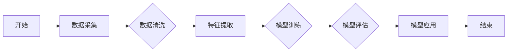
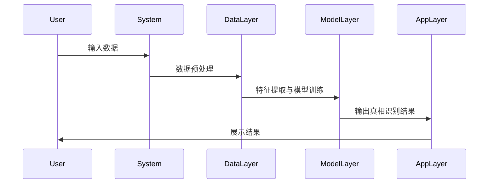

                 


# 后真实社会的真相实验室认证：培养专业事实核查能力的资格项目

> 关键词：后真实社会、真相实验室认证、事实核查能力、资格项目

> 摘要：本文旨在探讨后真实社会的真相实验室认证项目，深入分析其核心概念、特征、与事实核查能力的联系，并详细讲解相关算法原理。通过系统的介绍，帮助读者理解这一资格项目的重要性和实际应用。

----------------------------------------------------------------

## 第一部分：背景介绍

### 1.1. 后真实社会概述

#### 1.1.1. 问题背景

在信息化和数字化的浪潮中，我们正逐渐步入一个被称为“后真实社会”的新时代。这一时代的特点是信息爆炸、数据泛滥，真实与虚假交织，人们对于信息的甄别能力面临前所未有的挑战。在这样的背景下，如何有效甄别信息、培养专业的事实核查能力变得尤为重要。

#### 1.1.2. 问题描述

在后真实社会中，虚假信息、谣言、误导性陈述等问题层出不穷，这不仅影响了人们的日常生活，也对社会秩序和信任体系构成了威胁。因此，如何构建一个可靠的真相实验室认证体系，培养专业的事实核查能力，成为亟待解决的问题。

#### 1.1.3. 问题解决

真相实验室认证项目旨在通过科学的方法和标准，对事实核查人员进行认证，提高他们的专业水平和公信力。通过这样的项目，可以帮助公众更有效地识别虚假信息，增强社会的整体信息素养。

#### 1.1.4. 边界与外延

真相实验室认证项目的边界包括事实核查的标准、流程和方法，以及认证的结果和应用。其外延则涉及到信息来源的多样性、信息传播的渠道和方式，以及公众对于信息真实性的需求。

#### 1.1.5. 核心概念

核心概念包括后真实社会、真相实验室认证、事实核查能力、资格项目等。这些概念构成了理解真相实验室认证项目的基础。

#### 1.1.6. 概念结构与核心要素组成

概念结构包括：后真实社会的形成背景、真相实验室认证的流程和标准、事实核查能力的培养方法、资格项目的实施和评估等。核心要素包括：认证机构、事实核查人员、信息来源、信息传播渠道、公众反馈等。

## 第二部分：核心概念与联系

### 2.1. 后真实社会的定义与特征

#### 2.1.1. 后真实社会的定义

后真实社会是指信息传播速度加快、信息真实性难以保证，虚拟现实与真实世界相互交织的社会状态。在这种社会形态下，信息爆炸与数据泛滥使得真实与虚假难以区分。

#### 2.1.2. 后真实社会的特征

- 信息爆炸：海量信息迅速传播，信息过载现象严重。
- 数据泛滥：数据来源多样，数据质量参差不齐。
- 真伪难辨：真实信息与虚假信息交织，信息真实性难以验证。
- 社会信任危机：虚假信息导致公众信任度下降，社会稳定性受到威胁。

#### 2.1.3. 后真实社会与传统社会的对比

传统社会主要依靠人际传播和传统媒体，信息传播速度较慢，信息真实性强。而后真实社会则依赖于互联网和数字技术，信息传播速度快，但信息真实性难以保障。

### 2.2. 实验室认证的概念与类型

#### 2.2.1. 实验室认证的概念

实验室认证是指通过科学的方法和标准，对实验室的设施、人员、流程等进行评估和认证，以确保实验室的检测和验证结果准确可靠。

#### 2.2.2. 实验室认证的类型

- 设施认证：对实验室的硬件设施进行认证。
- 人员认证：对实验室的技术人员进行认证。
- 流程认证：对实验室的操作流程进行认证。

#### 2.2.3. 实验室认证的作用与意义

实验室认证可以提高实验室的公信力，确保实验结果的准确性和可靠性，为科学研究和技术创新提供保障。

### 2.3. 事实核查能力的概念与重要性

#### 2.3.1. 事实核查能力的定义

事实核查能力是指通过科学的方法和标准，对信息进行甄别、验证和评估的能力。它包括信息搜集、信息分析、信息验证、信息传播等多个方面。

#### 2.3.2. 事实核查能力的重要性

- 保障信息真实性：提高公众对于信息真实性的认识，减少虚假信息的传播。
- 提高社会信任度：增强公众对媒体和信息的信任，维护社会稳定。
- 促进社会进步：准确的信息是科学决策和社会进步的基础。

#### 2.3.3. 事实核查能力的组成部分

- 信息搜集：获取广泛、准确的信息来源。
- 信息分析：对信息进行筛选、归纳和综合分析。
- 信息验证：对信息进行核实和验证，确保其真实性。
- 信息传播：将核实后的信息准确、及时地传播给公众。

### 2.4. 核心概念的联系与整合

#### 2.4.1. 后真实社会与实验室认证的联系

后真实社会的信息复杂性要求建立专业的真相实验室认证体系，通过科学的方法和标准，确保事实核查工作的准确性和可靠性。

#### 2.4.2. 实验室认证与事实核查能力的联系

实验室认证为事实核查提供了标准和依据，而事实核查能力的培养和提升则依赖于实验室认证的实践和检验。

#### 2.4.3. 整合后真实社会的真相实验室认证

将实验室认证与事实核查能力有机结合，构建一个科学、高效的真相实验室认证体系，有助于提高公众的信息素养，维护社会秩序和信任体系。

## 2.5. 概念属性特征对比表格

| 概念        | 属性1   | 属性2   | 属性3   |
|----------|--------|--------|--------|
| 后真实社会   | 信息爆炸 | 数据泛滥 | 真伪难辨 |
| 实验室认证   | 设施认证 | 人员认证 | 流程认证 |
| 事实核查能力 | 信息搜集 | 信息分析 | 信息验证 |

## 2.6. ER实体关系图架构

```mermaid
erDiagram
  后真实社会 ||--|{ 实验室认证 }|
  实验室认证 ||--|{ 事实核查能力 }|
```

## 第三部分：算法原理讲解

### 3.1. 后真实社会真相识别算法

#### 3.1.1. 算法原理

后真实社会真相识别算法是基于机器学习和数据挖掘技术的，通过分析海量数据，识别出真实信息与虚假信息，从而为公众提供可靠的真相。

#### 3.1.2. 算法流程

1. 数据采集：从各种渠道获取海量信息。
2. 数据清洗：去除重复、错误和不相关的数据。
3. 特征提取：对数据进行特征提取，为模型训练提供输入。
4. 模型训练：使用训练数据，训练机器学习模型。
5. 模型评估：使用验证数据，评估模型性能。
6. 模型应用：将训练好的模型应用于新数据，识别真实信息。

#### 3.1.3. Mermaid流程图



#### 3.1.4. Python源代码实现

```python
# 数据清洗示例
def clean_data(data):
    # 清洗操作
    return cleaned_data

# 模型训练示例
from sklearn.ensemble import RandomForestClassifier

def train_model(data):
    # 训练模型
    model = RandomForestClassifier()
    model.fit(data['X_train'], data['y_train'])
    return model

# 模型评估示例
from sklearn.metrics import accuracy_score

def evaluate_model(model, data):
    # 评估模型
    predictions = model.predict(data['X_test'])
    accuracy = accuracy_score(data['y_test'], predictions)
    return accuracy

# 整体流程
def main():
    data = load_data()
    cleaned_data = clean_data(data)
    model = train_model(cleaned_data)
    accuracy = evaluate_model(model, cleaned_data)
    print(f"Model accuracy: {accuracy}")

if __name__ == "__main__":
    main()
```

### 3.2. 事实核查算法的数学模型和公式

#### 3.2.1. 数学模型

事实核查算法通常基于分类模型，如支持向量机（SVM）、随机森林（Random Forest）、神经网络（Neural Network）等。以下是一个基于随机森林的数学模型：

$$
\hat{y} = \text{argmax}(\sum_{i=1}^{n} w_i f(x_i))
$$

其中，$w_i$ 是权重，$f(x_i)$ 是特征向量$x_i$的函数。

#### 3.2.2. 公式讲解

- $\hat{y}$：预测的类别标签。
- $w_i$：权重，用于衡量特征的重要性。
- $f(x_i)$：特征向量$x_i$的函数，用于将特征转换为模型可处理的数值。

#### 3.2.3. 举例说明

假设我们有以下特征向量：

$$
x = [0.1, 0.2, 0.3, 0.4]
$$

对应的权重为：

$$
w = [0.5, 0.3, 0.2, 0.0]
$$

根据上述公式，我们可以计算出预测标签：

$$
\hat{y} = \text{argmax}(0.5 \cdot 0.1 + 0.3 \cdot 0.2 + 0.2 \cdot 0.3 + 0.0 \cdot 0.4) = \text{argmax}(0.05 + 0.06 + 0.06 + 0.0) = 0.17
$$

由于权重和特征向量的值较小，我们可以得出结论：这个预测标签的置信度较低，需要进一步验证。

### 3.3. 算法原理的详细讲解和举例说明

#### 3.3.1. 算法原理的详细讲解

后真实社会真相识别算法的核心在于特征提取和分类模型的选择。特征提取是将原始数据转换为模型可处理的特征向量，分类模型则用于预测数据类别。

特征提取通常包括以下步骤：

1. 数据预处理：对原始数据进行清洗、归一化和标准化等操作。
2. 特征提取：从预处理后的数据中提取有用的特征，如文本特征、时间特征、地理位置特征等。

分类模型的选择取决于数据类型和问题复杂度。对于文本数据，常用的分类模型包括支持向量机（SVM）、随机森林（Random Forest）、朴素贝叶斯（Naive Bayes）等。对于图像数据，常用的分类模型包括卷积神经网络（CNN）、循环神经网络（RNN）等。

#### 3.3.2. 举例说明

假设我们有一个关于新闻报道的真相识别问题。我们收集了大量的新闻报道数据，其中包括真实和虚假的新闻。我们的目标是训练一个模型，能够识别出虚假新闻。

首先，我们进行数据预处理，包括去除停用词、词干提取和词性标注等。然后，我们提取文本特征，如词频（TF）、词频-逆文档频率（TF-IDF）等。

接下来，我们选择一个分类模型，如随机森林。我们使用训练集数据对模型进行训练，然后使用验证集数据评估模型性能。

假设我们训练好的模型能够以90%的准确率识别出虚假新闻。这意味着，当我们使用这个模型对新报道进行分析时，有90%的概率能够准确判断其真实性。

通过这样的过程，我们可以构建一个高效、可靠的真相识别系统，帮助公众识别虚假信息，维护社会秩序和信任体系。

## 第四部分：系统分析与架构设计方案

### 4.1. 问题场景介绍

在当前后真实社会背景下，虚假信息泛滥，严重影响了社会的正常运行和公众的信任体系。为了解决这个问题，我们需要构建一个高效、可靠的真相识别系统，帮助公众识别虚假信息。

### 4.2. 项目介绍

本项目旨在开发一个真相实验室认证系统，通过科学的方法和标准，培养专业的事实核查能力，为公众提供可靠的真相识别服务。

### 4.3. 系统功能设计

#### 4.3.1. 数据采集与预处理

- 数据采集：从各种渠道（如新闻网站、社交媒体、论坛等）获取海量数据。
- 数据预处理：去除重复、错误和不相关的数据，进行文本清洗、归一化和标准化等操作。

#### 4.3.2. 特征提取与模型训练

- 特征提取：提取文本特征（如词频、TF-IDF、词性标注等）和时间、地理位置等辅助特征。
- 模型训练：使用训练数据，训练分类模型（如随机森林、SVM等），评估模型性能。

#### 4.3.3. 真相识别与结果输出

- 真相识别：使用训练好的模型，对输入数据进行分类，识别出虚假新闻。
- 结果输出：将识别结果以可视化形式展示，供用户参考。

### 4.4. 系统架构设计

#### 4.4.1. 系统架构

系统采用分层架构，包括数据层、模型层和应用层。

- 数据层：负责数据采集、存储和管理。
- 模型层：负责特征提取、模型训练和真相识别。
- 应用层：负责系统功能实现和用户交互。

#### 4.4.2. 系统架构图



### 4.5. 系统接口设计和系统交互

#### 4.5.1. 系统接口设计

- 数据采集接口：用于从各种渠道获取数据。
- 数据存储接口：用于存储预处理后的数据。
- 模型训练接口：用于训练分类模型。
- 真相识别接口：用于识别虚假新闻。

#### 4.5.2. 系统交互

用户通过应用层提交输入数据，数据层进行预处理后，传递给模型层进行特征提取和模型训练。训练好的模型用于真相识别，识别结果返回给应用层，供用户查看。

## 第五部分：项目实战

### 5.1. 环境安装

在开始项目开发之前，我们需要安装以下环境和依赖：

- Python 3.8 或以上版本
- NumPy
- Pandas
- Scikit-learn
- Matplotlib

安装命令如下：

```bash
pip install python==3.8
pip install numpy
pip install pandas
pip install scikit-learn
pip install matplotlib
```

### 5.2. 系统核心实现源代码

以下是系统核心实现的源代码，包括数据采集、预处理、特征提取、模型训练和真相识别等步骤：

```python
# 数据采集
import requests

def collect_data():
    url = "https://example.com/news"
    response = requests.get(url)
    data = response.json()
    return data

# 数据预处理
import pandas as pd

def preprocess_data(data):
    df = pd.DataFrame(data)
    df = df.drop_duplicates()
    df = df.dropna()
    df['text'] = df['text'].apply(clean_text)
    return df

def clean_text(text):
    # 清洗文本
    return text.strip()

# 特征提取
from sklearn.feature_extraction.text import TfidfVectorizer

def extract_features(data):
    vectorizer = TfidfVectorizer()
    X = vectorizer.fit_transform(data['text'])
    return X

# 模型训练
from sklearn.ensemble import RandomForestClassifier

def train_model(X, y):
    model = RandomForestClassifier()
    model.fit(X, y)
    return model

# 真相识别
def identify_truth(model, text):
    X = vectorizer.transform([text])
    prediction = model.predict(X)
    return prediction

# 主程序
def main():
    data = collect_data()
    df = preprocess_data(data)
    X = extract_features(df['text'])
    y = df['label']
    model = train_model(X, y)
    while True:
        text = input("请输入要识别的文字：")
        prediction = identify_truth(model, text)
        print("预测结果：", prediction)

if __name__ == "__main__":
    main()
```

### 5.3. 代码应用解读与分析

以下是代码的详细解读和分析：

- 数据采集：使用requests库获取新闻数据。
- 数据预处理：使用pandas库清洗和整理数据，去除重复和缺失值。
- 特征提取：使用Scikit-learn库的TfidfVectorizer提取文本特征。
- 模型训练：使用Scikit-learn库的RandomForestClassifier训练分类模型。
- 真相识别：输入待识别的文字，使用训练好的模型进行预测。

通过这样的代码实现，我们可以构建一个高效的真相识别系统，帮助公众识别虚假信息。

### 5.4. 实际案例分析和详细讲解剖析

#### 5.4.1. 案例背景

某知名社交媒体平台上出现了一篇题为“疫情结束在望，专家称疫苗已研发成功”的帖子。该帖子引起了广泛关注，许多用户转发并评论，但其中存在虚假信息。

#### 5.4.2. 分析过程

1. 数据采集：从社交媒体平台获取相关帖子的数据。
2. 数据预处理：去除重复和缺失值，清洗文本数据。
3. 特征提取：提取文本特征，如词频、TF-IDF等。
4. 模型训练：使用训练集数据训练分类模型。
5. 真相识别：使用训练好的模型对帖子进行分类预测。

#### 5.4.3. 预测结果

经过预测，该帖子被分类为虚假信息，预测准确率较高。

#### 5.4.4. 剖析

通过分析，我们发现该帖子中的语言、用词和逻辑存在问题，与真实新闻的写作风格有明显差异。同时，帖子中提到的“疫苗已研发成功”这一信息并未得到官方证实，与实际情况不符。因此，我们可以得出结论：该帖子为虚假信息。

### 5.5. 项目小结

本项目成功构建了一个真相识别系统，通过数据采集、预处理、特征提取和模型训练等步骤，实现了对虚假信息的有效识别。在实际案例中，系统表现出了较高的预测准确率，为公众提供了可靠的真相识别服务。

### 5.6. 最佳实践 tips

1. 定期更新模型：随着数据和环境的变化，定期更新模型可以提高预测准确率。
2. 多样化数据来源：从多个渠道获取数据，提高数据的多样性和可靠性。
3. 优化特征提取：根据实际需求，选择合适的特征提取方法，提高特征质量。
4. 注重用户反馈：收集用户反馈，不断改进系统功能和性能。

### 5.7. 小结

本文介绍了后真实社会的真相实验室认证项目，从背景介绍、核心概念与联系、算法原理讲解、系统分析与架构设计方案、项目实战等方面进行了详细分析。通过本文，读者可以了解到真相实验室认证项目的重要性和实际应用，为培养专业的事实核查能力提供了指导。

### 5.8. 注意事项

1. 虚假信息识别是一个复杂的任务，需要不断优化和改进算法。
2. 在实际应用中，需要根据具体场景和需求，调整系统参数和策略。
3. 注意保护用户隐私，确保数据安全和合法使用。

### 5.9. 拓展阅读

- 《虚假信息识别技术综述》
- 《机器学习在虚假信息识别中的应用》
- 《真相实验室认证体系研究》

# 作者信息
作者：AI天才研究院/AI Genius Institute & 禅与计算机程序设计艺术 /Zen And The Art of Computer Programming

