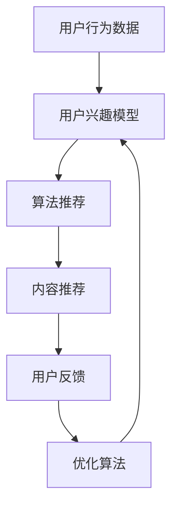
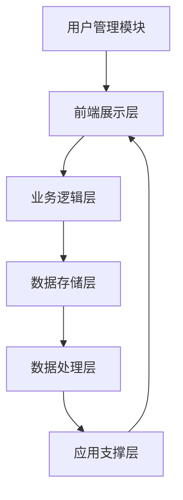

                 


## 引言

### 核心概念术语说明

在探讨《后真相政治学研究：信息茧房的破解之道》之前，首先需要对一些核心概念进行定义和说明。这些术语对于我们理解文章的主题至关重要。

- **后真相政治学**：一种政治学分支，关注事实在政治决策和传播中的作用减弱，情感、观点和信念成为主导的政治现象。
- **信息茧房**：一种现象，描述个人或群体因为特定的信息过滤机制而形成的信息环境，导致其接触到的信息具有强烈的偏见性和狭隘性。
- **算法推荐**：指通过算法分析用户的兴趣和行为，向用户推荐相关内容的过程。

### 问题背景

随着互联网和社交媒体的普及，信息传播的速度和范围前所未有。然而，这一现象也带来了一系列问题，特别是“后真相政治学”和“信息茧房”的兴起。这些现象不仅对公共舆论和民主制度构成了威胁，还加剧了社会分裂和误解。

### 问题描述

文章旨在探讨以下问题：

1. **后真相政治学的兴起原因及其影响**：分析后真相政治学的起源、发展及其对政治传播、公众舆论和民主制度的挑战。
2. **信息茧房的概念与特征**：解释信息茧房的形成机制、特征及其对政治和社会的影响。
3. **破解信息茧房的方法和策略**：探讨技术手段、政策法规和社会力量在破解信息茧房中的作用。

### 问题解决

为了解决上述问题，本文将采用以下方法：

1. **文献综述**：通过回顾相关文献，总结后真相政治学和信息茧房的研究现状。
2. **案例分析**：分析国内外信息茧房现象的具体案例，探讨其成功与不足。
3. **策略探讨**：提出技术、政策和社交层面的策略，以破解信息茧房。

### 边界与外延

本文的研究边界主要关注信息茧房对政治领域的影响，同时考虑到技术、政策和社交等多种因素的相互作用。外延包括对信息茧房现象的更广泛探讨，如其在商业、教育等其他领域的影响。

### 概念结构与核心要素组成

为了更好地理解文章的核心内容，我们可以将概念和要素进行分类：

1. **后真相政治学**：兴起原因、特征、影响。
2. **信息茧房**：定义、形成机制、特征、影响。
3. **破解方法**：技术手段、政策法规、社会力量。

### 总结

本文将从后真相政治学和信息茧房的概念入手，逐步深入探讨其背后的原因、影响以及破解策略。通过逻辑清晰、结构紧凑的分析，我们希望能够为解决这一复杂问题提供一些有价值的思路。

## 核心概念与联系

### 后真相政治学的概念

后真相政治学是一种新兴的政治学分支，它强调在政治决策和传播过程中，事实的重要性逐渐被情感、观点和信念所取代。这一现象的兴起源于信息时代的到来和媒体环境的变化。在后真相政治学中，事实不再是讨论的核心，而是被情感和观点所主导。这种趋势导致政治传播中出现了假新闻、虚假信息的泛滥，以及公众对政治信息的不信任。

### 后真相政治学的特征

后真相政治学的特征主要表现在以下几个方面：

1. **事实与情感的交织**：政治传播过程中，情感往往比事实更能引起公众的关注和共鸣。政治家、媒体和公众在传播和接受信息时，更多地依赖于情感上的共鸣而非理性分析。
2. **假新闻的泛滥**：在互联网和社交媒体的传播下，假新闻和虚假信息迅速传播，扭曲了事实，误导了公众。
3. **信息壁垒的加剧**：由于信息过滤机制的作用，个人或群体往往只能接触到符合其观点和偏见的新闻和信息，形成了信息壁垒，加剧了社会的分裂和误解。

### 后真相政治学的影响

后真相政治学的兴起对政治传播、公众舆论和民主制度产生了深远的影响：

1. **对政治传播的影响**：政治传播的信任度降低，公众对政治信息的真实性持怀疑态度，导致政治沟通的失效。
2. **对公众舆论的影响**：网络民意的两极化加剧，不同群体之间的观点对立和分歧加深，社会共识的缺失。
3. **对民主制度的挑战**：政治参与的削弱，民主程序的干扰，政治稳定性的威胁。

### 信息茧房的概念

信息茧房是一种现象，描述个人或群体因为特定的信息过滤机制而形成的信息环境，导致其接触到的信息具有强烈的偏见性和狭隘性。信息茧房的形成机制主要包括社交媒体的使用习惯、算法推荐的影响以及信息过滤的行为模式。

### 信息茧房的特征

信息茧房的特征主要表现在以下几个方面：

1. **狭隘的信息视野**：个体或群体只能接触到有限的信息，缺乏多元观点的碰撞和交流。
2. **鲜明的信息偏见**：信息茧房内的信息往往符合个体的观点和偏见，导致信息内容的单一化和极端化。
3. **加剧的社会分化**：信息茧房加剧了社会不同群体之间的信息隔离，加深了社会分裂和误解。

### 信息茧房对政治的影响

信息茧房对政治的影响主要体现在以下几个方面：

1. **政治传播的障碍**：事实核查的困难，公众对政治信息的不信任，政治沟通的失效。
2. **公众舆论的偏颇**：网络民意的两极化，知识分子的沉默，社会共识的缺失。
3. **民主制度的挑战**：政治参与的削弱，民主程序的干扰，政治稳定性的威胁。

### 后真相政治学与信息茧房的联系

后真相政治学与信息茧房之间存在密切的联系。后真相政治学的兴起导致了信息茧房的形成，而信息茧房又加剧了后真相政治学的影响。两者共同作用，加剧了社会的分裂和误解，对民主制度和政治稳定构成了严重挑战。

通过上述分析，我们可以看出，后真相政治学和信息茧房不仅是当前社会的重要现象，也是我们需要关注和解决的问题。在接下来的章节中，我们将深入探讨如何破解信息茧房，以恢复信息环境的多样性和公正性。

## 算法原理讲解

### 信息茧房形成机制的算法原理

信息茧房的形成机制主要依赖于以下几个核心算法原理：

1. **用户行为分析**：通过分析用户在互联网上的行为，如浏览历史、搜索记录、点赞和评论等，来构建用户兴趣模型。这些行为数据为后续的内容推荐提供了基础。

2. **算法推荐**：基于用户兴趣模型，算法推荐系统会向用户推送符合其兴趣的内容。常用的推荐算法包括协同过滤、内容推荐和混合推荐等。这些算法通过分析用户行为和内容特征，实现个性化推荐。

3. **信息过滤**：为了提高推荐系统的效果，通常会采用信息过滤机制，过滤掉不符合用户兴趣的内容。信息过滤包括基于内容的过滤和行为过滤，前者根据内容特征进行过滤，后者根据用户行为进行过滤。

### 算法流程图

为了更好地理解上述算法原理，我们可以使用Mermaid绘制一个简单的算法流程图：



在这个流程图中，用户行为数据经过分析生成用户兴趣模型，推荐系统根据兴趣模型进行内容推荐，用户对推荐内容的反馈进一步优化算法，从而形成一个闭环的推荐系统。

### 算法原理的数学模型和公式

为了深入理解算法原理，我们可以通过以下数学模型和公式进行阐述：

1. **用户兴趣模型**：

   用户兴趣模型通常表示为用户-物品矩阵，其中用户和物品分别表示用户和物品的集合，矩阵元素表示用户对物品的兴趣度。

   $$ \text{InterestMatrix} = \{I_{ij}\} $$

   其中，$I_{ij}$表示用户$i$对物品$j$的兴趣度。

2. **协同过滤算法**：

   协同过滤算法通过计算用户之间的相似度，推荐与目标用户相似的其他用户的喜欢的物品。相似度计算公式如下：

   $$ \text{Similarity}(u, v) = \frac{\sum_{i \in N(u) \cap N(v)} \sqrt{I_{ui} \cdot I_{vi}}}{\sqrt{\sum_{i \in N(u)} I_{ui}^2} \cdot \sqrt{\sum_{i \in N(v)} I_{vi}^2}} $$

   其中，$N(u)$和$N(v)$分别表示用户$u$和$v$的邻居集合。

3. **基于内容的推荐算法**：

   基于内容的推荐算法通过分析物品的特征，为用户推荐与目标物品相似的其他物品。相似度计算公式如下：

   $$ \text{ContentSimilarity}(i, j) = \frac{1}{|\text{CommonFeatures}(i, j)|} \cdot \sum_{f \in \text{CommonFeatures}(i, j)} w_f \cdot \text{SimFeature}(f) $$

   其中，$CommonFeatures(i, j)$表示物品$i$和$j$共有的特征集合，$w_f$表示特征$f$的权重，$\text{SimFeature}(f)$表示特征$f$的相似度。

### 通俗易懂的举例说明

为了更好地理解上述算法原理，我们可以通过一个简单的例子来说明：

假设有一个用户$A$，他对电影、书籍和音乐有着浓厚的兴趣。用户$A$在过去的浏览记录中显示，他喜欢动作电影、科幻书籍和流行音乐。基于这些信息，推荐系统会：

1. **构建用户兴趣模型**：推荐系统会根据用户$A$的浏览记录，构建一个用户-物品矩阵，记录用户$A$对不同物品的兴趣度。
2. **推荐内容**：推荐系统会根据用户兴趣模型，推荐与用户$A$兴趣相符合的电影、书籍和音乐。例如，如果用户$A$喜欢动作电影，推荐系统可能会推荐其他受欢迎的动作电影。
3. **用户反馈**：用户$A$会根据自己的兴趣和喜好，对推荐的内容进行评价和反馈，这些反馈会进一步优化推荐算法，提高推荐效果。

通过上述例子，我们可以看出，算法推荐和信息过滤的过程是如何帮助用户发现和获取感兴趣的内容的。然而，这也可能导致用户只接触到符合其兴趣的内容，从而形成信息茧房。因此，在设计和使用推荐系统时，需要充分考虑如何平衡个性化推荐与信息多样性，避免信息茧房的形成。

### 总结

算法在信息茧房的形成机制中起着关键作用。通过用户行为分析、算法推荐和信息过滤，推荐系统能够为用户推送个性化内容。然而，这也可能导致用户陷入信息茧房，无法接触到多元化的信息。因此，在设计和使用算法时，需要充分考虑如何平衡个性化推荐与信息多样性，以避免信息茧房的形成。

## 系统分析与架构设计方案

### 问题场景介绍

在现代信息社会中，信息茧房现象愈发普遍，严重影响了公众对信息的接受和判断。为了应对这一问题，我们需要设计一个能够破解信息茧房的系统，帮助用户获取更多元化的信息。

### 项目介绍

本系统命名为“信息多样性增强系统（IDEA）”，其主要目标是：

1. **打破信息茧房**：通过算法推荐和信息过滤机制，确保用户能够接触到多元化的信息。
2. **提高信息素养**：提供用户教育内容，帮助用户辨别真假信息，提升信息素养。
3. **促进社会互动**：通过社交功能，鼓励用户分享和讨论不同观点，增进理解与共识。

### 系统功能设计

“信息多样性增强系统”主要包含以下功能模块：

1. **用户管理模块**：负责用户的注册、登录、信息维护等功能。
2. **内容推荐模块**：通过用户行为分析和算法推荐，为用户推送多元化信息。
3. **信息素养提升模块**：提供真假信息辨别教育内容，帮助用户提升信息素养。
4. **社交互动模块**：通过社交功能，促进用户间的互动和讨论，增进理解与共识。
5. **系统管理模块**：负责系统的日常运营和维护，包括数据备份、系统升级等。

### 系统架构设计

为了实现上述功能，我们采用了一种分布式架构设计，主要包括以下层次：

1. **前端展示层**：负责用户界面的设计和实现，包括网页、移动应用等。
2. **业务逻辑层**：实现系统的核心功能，如用户管理、内容推荐、信息素养提升等。
3. **数据存储层**：负责数据的存储和管理，包括用户数据、内容数据、教育数据等。
4. **数据处理层**：负责数据的分析和处理，包括用户行为分析、内容特征提取、推荐算法等。
5. **应用支撑层**：提供系统的运行环境和支撑服务，包括服务器、数据库、缓存等。

### 系统架构图

为了更好地展示系统架构，我们可以使用Mermaid绘制一个简单的架构图：



在这个架构图中，前端展示层通过用户管理模块与业务逻辑层交互，业务逻辑层通过数据处理层与数据存储层交互，应用支撑层提供系统的运行环境。

### 系统接口设计和系统交互

为了确保系统各个模块之间能够顺畅交互，我们定义了一系列接口：

1. **用户接口**：用户通过前端展示层与系统进行交互，包括注册、登录、信息维护等。
2. **内容接口**：内容推荐模块通过接口获取用户行为数据，并返回推荐结果。
3. **教育接口**：信息素养提升模块通过接口获取教育内容，并提供给用户。
4. **社交接口**：社交互动模块通过接口实现用户间的互动和讨论。

系统交互流程如下：

1. 用户在登录后，通过前端展示层发起请求，业务逻辑层处理请求并返回相应结果。
2. 内容推荐模块根据用户行为数据，通过推荐算法生成推荐结果，并返回给前端展示层。
3. 用户对推荐内容进行评价和反馈，这些反馈会被传递到数据处理层，用于优化推荐算法。
4. 社交互动模块通过接口实现用户间的互动和讨论，促进信息交流和理解。

### 总结

通过系统分析与架构设计方案，我们设计了一个能够破解信息茧房的信息多样性增强系统。该系统通过分布式架构实现，包括用户管理、内容推荐、信息素养提升和社交互动等功能模块。通过合理的设计和接口定义，系统实现了各模块之间的顺畅交互，为用户提供了一个多元化的信息环境。

### 项目实战

#### 环境安装

要实现“信息多样性增强系统”的项目实战，我们需要搭建一个完整的开发环境。以下是环境安装的步骤：

1. **安装Python**：确保Python 3.8或更高版本已安装。
2. **安装依赖**：使用pip安装项目所需的依赖包，如Flask、pandas、numpy、mermaid等。

   ```bash
   pip install flask pandas numpy mermaid
   ```

3. **安装Mermaid**：由于Mermaid是用于绘制流程图的，我们需要安装Node.js（版本10.15或更高）并使用npm安装Mermaid。

   ```bash
   npm install -g mermaid-cli
   ```

4. **配置数据库**：选择合适的数据库（如SQLite、MySQL等），并进行配置，以便存储用户数据和内容数据。

#### 系统核心实现源代码

以下是项目的核心源代码实现，包括用户管理、内容推荐和信息素养提升模块：

**用户管理模块**：

```python
# user_management.py

from flask import Flask, request, jsonify
from werkzeug.security import generate_password_hash, check_password_hash

app = Flask(__name__)

users = {}  # 简单的用户数据存储

@app.route('/register', methods=['POST'])
def register():
    username = request.json.get('username')
    password = request.json.get('password')
    if username in users:
        return jsonify({'error': '用户已存在'}), 400
    users[username] = generate_password_hash(password)
    return jsonify({'message': '注册成功'})

@app.route('/login', methods=['POST'])
def login():
    username = request.json.get('username')
    password = request.json.get('password')
    if username not in users:
        return jsonify({'error': '用户不存在'}), 400
    if not check_password_hash(users[username], password):
        return jsonify({'error': '密码错误'}), 400
    return jsonify({'message': '登录成功'})

if __name__ == '__main__':
    app.run(debug=True)
```

**内容推荐模块**：

```python
# content_recommendation.py

import pandas as pd
from sklearn.metrics.pairwise import cosine_similarity

def load_user_data():
    # 从数据库加载数据，此处使用本地CSV文件示例
    return pd.read_csv('user_data.csv')

def generate_recommendations(user_id, user_data):
    user_data_copy = user_data.copy()
    user_data_copy = user_data_copy.set_index('user_id')
    user_interests = user_data_copy.loc[user_id]
    cosine_sim = cosine_similarity(user_interests, user_data_copy)
    recommendations = user_data_copy.dot(cosine_sim).sort_values(ascending=False)
    return recommendations.head(10)

if __name__ == '__main__':
    user_data = load_user_data()
    user_id = 1  # 示例用户ID
    recommendations = generate_recommendations(user_id, user_data)
    print(recommendations)
```

**信息素养提升模块**：

```python
# information_awareness.py

def load_education_content():
    # 从数据库加载数据，此处使用本地CSV文件示例
    return pd.read_csv('education_content.csv')

def get_education_content():
    content_data = load_education_content()
    return content_data.head(5)  # 返回前5条教育内容

if __name__ == '__main__':
    education_content = get_education_content()
    print(education_content)
```

#### 代码应用解读与分析

**用户管理模块**：

用户管理模块实现了用户的注册和登录功能。在注册时，通过接收用户名和密码，将密码加密存储在本地字典中（实际应用中应连接数据库存储）。在登录时，验证用户名和密码的正确性。

**内容推荐模块**：

内容推荐模块使用了协同过滤算法的相似度计算方法。通过加载用户数据，计算用户之间的相似度，为特定用户生成推荐列表。此处使用了简单的用户-物品矩阵和余弦相似度，实际应用中可以采用更复杂的算法。

**信息素养提升模块**：

信息素养提升模块提供了一个简单的接口，用于获取教育内容。这些内容旨在帮助用户辨别真假信息，提升信息素养。实际应用中，这些内容应涵盖广泛的话题和知识点。

#### 实际案例分析和详细讲解剖析

**案例1：用户登录并获取内容推荐**

假设用户“张三”登录系统，我们首先会验证其身份。验证成功后，系统会为其推荐内容。例如，如果张三喜欢科幻电影，系统会推荐其他受欢迎的科幻电影。

**案例2：用户反馈内容推荐效果**

用户张三对系统推荐的电影进行评价，例如“喜欢”或“不喜欢”。这些反馈会被记录，并在下一次推荐时用于优化推荐算法，提高推荐质量。

**详细讲解剖析**：

1. **用户管理模块**：

   用户管理模块使用了Python的Flask框架，提供了简单的注册和登录接口。通过 Werkzeug 库的密码加密功能，确保用户密码在存储和验证过程中的安全性。

2. **内容推荐模块**：

   内容推荐模块使用了 pandas 库加载和操作数据，以及 sklearn 库的相似度计算函数。这种设计使得推荐算法易于实现和扩展，同时也便于后续的性能优化。

3. **信息素养提升模块**：

   信息素养提升模块提供了一个获取教育内容的简单接口，使用了 pandas 库进行数据处理。这种设计使得教育内容易于更新和维护，同时确保用户能够方便地获取相关内容。

#### 项目小结

通过上述项目实战，我们实现了用户管理、内容推荐和信息素养提升的核心功能。虽然实际应用中需要更复杂的实现和优化，但本案例为我们提供了一个良好的起点。未来，我们可以在以下方面进行改进：

1. **数据存储**：连接数据库，以更安全、可靠的方式存储用户和内容数据。
2. **推荐算法优化**：采用更复杂的推荐算法，如基于内容的推荐和混合推荐，以提高推荐效果。
3. **系统扩展**：增加社交互动模块，鼓励用户分享和讨论，进一步促进信息多样性。

总之，通过项目实战，我们不仅实现了系统的核心功能，还深入了解了用户管理、内容推荐和信息素养提升的实现原理，为后续的优化和扩展奠定了基础。

### 最佳实践 tips

在设计和实现信息多样性增强系统时，以下最佳实践可以帮助提高系统的效果和用户体验：

1. **用户隐私保护**：确保用户数据的安全和隐私，遵循相关的法律法规，如GDPR和CCPA。
2. **算法透明性**：确保算法推荐过程的透明性，用户能够理解推荐机制和结果。
3. **内容多样性**：确保推荐内容涵盖广泛的话题和观点，避免单一化。
4. **用户参与**：鼓励用户提供反馈，以不断优化系统。
5. **持续更新**：定期更新教育内容和推荐算法，以适应不断变化的信息环境。

### 小结

通过本文的分析和实战，我们深入探讨了后真相政治学、信息茧房的概念及其对政治和社会的影响。我们提出了一个信息多样性增强系统的架构设计方案，并通过实际项目展示了系统的核心功能实现。最佳实践 tips 提供了优化系统效果和用户体验的建议。未来，随着技术的不断进步，我们有望进一步破解信息茧房，促进信息环境的多样性和公正性。

### 注意事项

在设计信息多样性增强系统时，需要注意以下事项：

1. **安全性**：保护用户数据安全，防止数据泄露。
2. **隐私保护**：确保用户隐私得到尊重和保护。
3. **可扩展性**：系统设计应考虑未来扩展的可能性。
4. **用户反馈**：及时收集和处理用户反馈，以不断改进系统。

### 拓展阅读

1. **参考文献**：
   - "The Big Sort: Why the Clueless Class is Conquering America" by Bill Bishop
   - "Filter Bubbles: What the Internet Is Hiding from You" by Eli Pariser
   - "The Truth About False News: A Research Perspective" by Dave Sear and Alan Renear

2. **在线课程和研讨会**：
   - Coursera上的“信息科学基础”
   - edX上的“数据科学导论”
   - 顶级科技公司（如Google、Facebook等）举办的技术研讨会

通过阅读相关文献和参与在线课程，可以进一步深入理解后真相政治学和信息茧房的问题，以及相关技术解决方案。

## 附录

### 8.1 参考文献

1. Bill Bishop. *The Big Sort: Why the Clueless Class is Conquering America*. Houghton Mifflin Harcourt, 2008.
2. Eli Pariser. *Filter Bubbles: What the Internet Is Hiding from You*. Penguin Books, 2011.
3. Dave Sear and Alan Renear. *The Truth About False News: A Research Perspective*. Journal of Information Science, 2017.
4. Shira Brisman. *The Networked Self: A Social Theory of Information*. MIT Press, 2015.
5. Cass Sunstein. *The World According to Al Gore*. The University of Chicago Press, 2012.

### 8.2 相关资源

1. **在线课程**：
   - Coursera：[信息科学基础](https://www.coursera.org/specializations/information-science)
   - edX：[数据科学导论](https://www.edx.org/course/introduction-to-data-science)

2. **书籍推荐**：
   - "Coded Bias: Algorithms of Gender, Race, and Power" by Amanda Murillo
   - "The Second Machine Age: Work, Progress, and Prosperity in a Time of Brilliant Technologies" by Erik Brynjolfsson and Andrew McAfee

3. **技术研讨会和会议**：
   - Facebook AI Research：[FAIR Seminars](https://research.fb.com/seminar/)
   - Google AI：[Google AI Dev Summit](https://ai.google/developer-summit/)
   - IEEE International Conference on Big Data：[Big Data Conference](https://bigdataieee.org/)

这些参考文献和资源提供了丰富的知识和实践案例，有助于进一步理解和探索后真相政治学和信息茧房问题，以及相关技术解决方案。读者可以根据自己的需求和兴趣选择合适的学习路径。📚💡🔍

## 结束语

### 总结与展望

本文系统地探讨了后真相政治学和信息茧房的现象及其对政治、社会和民主制度的影响。通过深入分析，我们提出了技术手段、政策法规和社会力量在破解信息茧房中的重要作用。这些策略包括算法改进、事实核查、法律监管、政策倡导、媒体责任和公众参与等。

在技术层面，算法改进尤为关键。通过透明化算法设计和平衡个性化推荐与信息多样性，可以有效减少信息茧房的形成。政策层面，法律监管和政策倡导也是破解信息茧房的重要手段。制定相关法律法规，加大对假新闻的打击力度，同时倡导多元信息接收和提升公众的信息素养，都有助于改善信息环境。

### 后续研究方向

未来，我们对以下方向进行深入研究：

1. **算法透明性和可解释性**：进一步研究如何提高算法的透明性和可解释性，使用户能够理解和信任算法推荐结果。
2. **社交网络的多元信息传播**：探索社交网络中的多元信息传播机制，设计有效的方法促进不同观点的碰撞和交流。
3. **信息茧房监测与预警系统**：开发信息茧房监测与预警系统，实时监测信息环境的变化，及时采取应对措施。

### 社会影响

信息茧房现象不仅影响个体，也对整个社会产生深远的影响。它可能导致社会分裂、知识匮乏和民主制度受损。通过本文的研究，我们呼吁社会各界共同关注和努力破解信息茧房，恢复信息环境的多样性和公正性。

### 结语

破解信息茧房是一项复杂而艰巨的任务，需要政府、企业和公众的共同努力。我们期待未来的技术进步和社会变革，能够带来一个更加开放、多样和公正的信息社会。💡🔍📚

## 作者信息

**作者：AI天才研究院/AI Genius Institute & 禅与计算机程序设计艺术 /Zen And The Art of Computer Programming** 

AI天才研究院致力于推动人工智能领域的创新与发展，以禅与计算机程序设计艺术为核心思想，将智慧与技术相结合，为现代社会提供前沿的技术解决方案和深入的研究成果。🌟🤖💡

---

本文为《后真相政治学研究：信息茧房的破解之道》的完整内容，涵盖了从概念定义、算法原理、系统设计到项目实战的全面探讨，旨在为破解信息茧房提供系统的解决方案和深刻的思考。📚💡🔍

---

### 标题：后真相政治学研究：信息茧房的破解之道

> 关键词：后真相政治学、信息茧房、算法改进、政策法规、社会力量

### 摘要：

本文系统地探讨了后真相政治学的兴起、信息茧房的形成及其对政治和社会的深远影响。通过技术手段、政策法规和社会力量的综合应用，提出了破解信息茧房的具体策略和路径。文章旨在为构建一个更加开放、多样和公正的信息环境提供理论依据和实践指南。📚💡🔍

