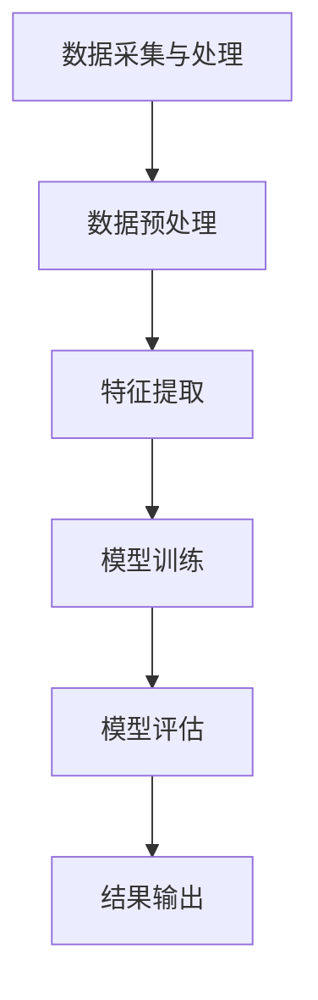

                 

### 引言与背景

#### 1.1 问题背景

在当今信息爆炸的时代，真相的辨识成为一个迫切需要解决的问题。从社交媒体上的虚假信息、网络谣言，到新闻媒体中的夸大其词和偏见，真相的困境无处不在。这种困境不仅影响个人的生活，还对社会稳定和民主制度构成威胁。近年来，“后真相”这一概念逐渐进入公众视野，它指的是信息传播过程中，情感和偏见往往超过事实本身的影响力。

##### 1.1.1 社会真相困境

社会真相困境体现在多个方面。首先，虚假信息和误导性内容的泛滥导致公众难以区分真相与虚构。其次，社交媒体平台的信息传播速度快，导致错误信息在短时间内迅速扩散。此外，部分媒体和机构为了吸引眼球，刻意制造和放大争议，进一步加剧了真相的混淆。

##### 1.1.2 教育真相培养的重要性

在这种背景下，教育真相培养的重要性愈发凸显。教育不仅是传授知识的过程，更是培养学生批判性思维和辨识真相能力的重要途径。一个具备辨识真相能力的社会，能够更好地抵御虚假信息和偏见的影响，从而维护社会稳定和公正。

##### 1.1.3 后真相时代的特点

后真相时代的特点包括信息泛滥、信息传播速度极快、情感和偏见的影响超过事实本身等。这些特点使得真相的辨识变得更加困难，也对教育提出了新的挑战。如何在信息爆炸的环境中培养学生的真相辨识能力，成为教育领域亟待解决的问题。

#### 1.2 问题描述

##### 1.2.1 缺乏真相辨识能力的挑战

当前教育体系中，真相辨识能力的培养严重不足。学生在面对大量信息时，往往缺乏有效的辨识方法，容易受到虚假信息和偏见的影响。这不仅影响了学生的个人发展，也对社会的整体认知水平产生了负面影响。

##### 1.2.2 当前教育体系的不足

当前教育体系存在诸多不足，包括课程设置不够全面、教学方法单一、缺乏实践环节等。这些问题导致学生在真实情境中难以应用所学知识，无法有效辨识真相。此外，教育者自身的专业素养和教学能力也亟待提升。

##### 1.2.3 解决方案的需求

为了应对真相困境，迫切需要一种新的教育模式，即后真相教育。后真相教育强调培养学生的批判性思维和辨识真相能力，通过多样化的教学方法、丰富的实践环节和跨学科的知识融合，提高学生应对信息爆炸环境的能力。

#### 1.3 问题解决

##### 1.3.1 后真相教育的理念

后真相教育的理念是将真相辨识能力作为核心培养目标，通过培养学生的批判性思维、信息素养和独立思考能力，提高他们应对信息爆炸环境的能力。后真相教育不仅关注知识的传授，更注重学生综合素质的提升。

##### 1.3.2 后真相教育的目标

后真相教育的目标包括：培养学生的批判性思维，使他们能够对信息进行独立分析和判断；提高学生的信息素养，使他们能够有效获取、筛选和评估信息；培养独立思考能力，使他们能够形成自己的观点并表达清晰。

##### 1.3.3 后真相教育的核心要素

后真相教育的核心要素包括：批判性思维培养、信息素养教育、跨学科知识融合、实践环节强化等。通过这些核心要素的有机结合，后真相教育能够为学生提供全面的知识体系和能力培养。

#### 1.4 边界与外延

##### 1.4.1 后真相教育与批判性思维的关联

后真相教育与批判性思维密切相关。批判性思维是辨识真相的基础，通过培养批判性思维，学生能够更有效地分析信息、评估观点，从而提高真相辨识能力。

##### 1.4.2 后真相教育与媒介素养的融合

后真相教育与媒介素养教育相辅相成。媒介素养教育旨在培养学生的媒体使用能力和信息辨识能力，而后真相教育则在此基础上，进一步培养学生在复杂信息环境中的批判性思维能力。

##### 1.4.3 后真相教育与数字化素养的结合

在数字化时代，数字化素养成为后真相教育的重要组成部分。通过培养数字化素养，学生能够更好地适应数字化环境，提高在数字化平台上辨识真相的能力。

#### 1.5 核心概念

##### 1.5.1 后真相

后真相（Post-truth）是指信息传播过程中，情感和偏见往往超过事实本身的影响力。在后真相时代，真相的辨识变得更加困难，需要通过教育等方式提高公众的辨识能力。

##### 1.5.2 教育真相

教育真相是指教育过程中传授的真实、准确的信息和知识。教育真相培养是后真相教育的重要目标之一，通过教育真相的培养，学生能够更准确地辨识信息。

##### 1.5.3 辨识真相的能力

辨识真相的能力是指学生独立分析信息、评估观点，从而判断信息真伪的能力。培养辨识真相的能力是后真相教育的核心任务，通过多种教学方法和实践环节，提高学生的辨识能力。

### 核心概念与联系

#### 2.1 后真相的概念与特征

##### 2.1.1 后真相的定义

后真相（Post-truth）是指信息传播过程中，情感和偏见往往超过事实本身的影响力，导致真相的辨识变得更加困难。在后真相时代，信息传播速度极快，社交媒体的普及使得虚假信息和误导性内容迅速扩散，而公众对这些信息的辨识能力却相对较弱。

##### 2.1.2 后真相的主要特征

后真相的主要特征包括：

1. **信息泛滥**：在数字化时代，信息爆炸使得公众面临海量的信息，这些信息中既有真实的，也有虚假的。
2. **传播速度快**：社交媒体平台的出现使得信息能够在短时间内迅速传播，错误信息往往在未得到验证的情况下就传播开来。
3. **情感和偏见的影响**：在信息传播过程中，情感和偏见往往超过事实本身的影响力，这使得真相的辨识变得更加困难。
4. **真相的模糊性**：在后真相时代，真相往往不再是黑白分明，而是呈现出模糊、多面的特征。

##### 2.1.3 后真相对社会的影响

后真相对社会的影响深远，主要体现在以下几个方面：

1. **公众信任危机**：虚假信息和误导性内容的泛滥导致公众对传统媒体和权威信息的信任度下降，社会信任危机加剧。
2. **社会分裂**：在信息传播过程中，不同群体往往根据自身的情感和偏见接受信息，这加剧了社会分裂和矛盾。
3. **政治民主的挑战**：虚假信息和误导性内容在政治选举中的使用，可能对民主选举过程产生负面影响，甚至威胁政治制度的稳定。
4. **教育挑战**：在后真相时代，教育面临新的挑战，如何培养学生的真相辨识能力成为关键问题。

#### 2.2 教育真相的概念与内涵

##### 2.2.1 教育真相的定义

教育真相是指教育过程中传授的真实、准确的信息和知识。教育真相的培养是教育的基本目标之一，它关系到学生能否获得正确的知识体系，形成科学的思维方式和价值观。

##### 2.2.2 教育真相的内涵

教育真相的内涵包括：

1. **真实性与准确性**：教育真相要求传授的信息和知识必须是真实和准确的，不能有误导性。
2. **全面性与系统性**：教育真相不仅要传授单一的事实，还要构建起系统的知识体系，使学生能够全面、系统地理解所学内容。
3. **实践性**：教育真相的培养需要结合实际，通过实践环节使学生能够将所学知识应用于实际情境中，提高辨识真相的能力。
4. **批判性**：教育真相不仅要传授知识，还要培养学生的批判性思维能力，使他们能够对信息进行独立分析和判断。

##### 2.2.3 教育真相在教育中的意义

教育真相在教育中的意义体现在以下几个方面：

1. **知识建构**：教育真相的培养有助于学生建立正确的知识体系，为未来的学习和生活奠定基础。
2. **思维发展**：通过教育真相的培养，学生能够形成科学的思维方式和价值观，提高独立思考和问题解决能力。
3. **价值观塑造**：教育真相的培养有助于学生形成正确的价值观，提高社会责任感和公民素养。
4. **真相辨识**：教育真相的培养是培养学生真相辨识能力的重要途径，使学生能够在复杂的信息环境中辨别真假，维护个人和社会的利益。

#### 2.3 辨识真相的能力

##### 2.3.1 辨识真相能力的定义

辨识真相的能力是指学生在面对信息时，能够通过分析、评估和判断，辨别出真实信息与虚假信息的技能。这是一种综合性能力，涉及到逻辑思维、批判性思维、信息素养等多个方面。

##### 2.3.2 辨识真相能力的要素

辨识真相能力主要包括以下几个要素：

1. **信息获取能力**：学生需要能够有效获取信息，包括从各种渠道获取信息的能力，以及对信息来源的评估。
2. **信息分析能力**：学生需要能够对信息进行深入分析，包括识别信息中的事实、观点、偏见等，以及分析信息之间的关联。
3. **信息评估能力**：学生需要能够对信息进行评估，包括评估信息的真实性、可靠性、有效性等。
4. **批判性思维能力**：学生需要具备批判性思维能力，能够对信息进行独立分析和判断，不盲从权威和流行观点。
5. **问题解决能力**：学生需要能够将所学知识应用于实际情境中，解决实际问题，提高辨识真相的能力。

##### 2.3.3 辨识真相能力的培养途径

为了培养辨识真相的能力，可以从以下几个方面入手：

1. **课程设置**：在课程设置中融入真相辨识的相关内容，如信息素养、批判性思维等。
2. **教学方法**：采用多样化的教学方法，如小组讨论、案例教学、实践项目等，提高学生的参与度和思考能力。
3. **实践环节**：通过实践活动，如模拟新闻调查、社交媒体分析等，让学生在真实情境中练习辨识真相的能力。
4. **跨学科教育**：通过跨学科教育，将真相辨识能力与多个学科相结合，提高学生的综合素质。
5. **教育资源**：提供丰富的教育资源，如参考书籍、在线课程、数据库等，帮助学生更好地获取和分析信息。
6. **教师培训**：对教师进行专业培训，提高他们在真相辨识教育方面的教学能力和素养。

#### 2.4 后真相教育与传统教育的对比

##### 2.4.1 教育理念上的差异

后真相教育与传统教育在理念上存在显著差异。传统教育注重知识的传授和积累，强调学生对知识的记忆和理解。而后真相教育则更注重培养学生的批判性思维和辨识真相能力，强调学生在面对信息时能够独立分析和判断。

##### 2.4.2 教育目标上的区别

传统教育的目标主要是传授知识和技能，帮助学生应对考试和就业。而后真相教育的目标则是培养学生成为具有批判性思维和辨识真相能力的社会成员，使他们能够在复杂的信息环境中辨别真假，维护个人和社会的利益。

##### 2.4.3 教育方法上的革新

后真相教育在教学方法上进行了革新，强调实践性、互动性和综合性。通过小组讨论、案例教学、实践项目等方式，提高学生的参与度和思考能力。同时，后真相教育还注重跨学科教育，将真相辨识能力与多个学科相结合，提高学生的综合素质。

### 理论与实践

#### 3.1 后真相教育理论框架

##### 3.1.1 后真相教育的基本原则

后真相教育的基本原则包括：

1. **真实性原则**：教育内容必须真实、准确，确保学生获得正确的知识。
2. **批判性原则**：鼓励学生独立思考和批判性分析，不盲从权威和流行观点。
3. **实践性原则**：通过实践活动，将知识应用于实际情境中，提高学生的辨识真相能力。
4. **综合性原则**：将真相辨识能力与多个学科相结合，提高学生的综合素质。

##### 3.1.2 后真相教育的方法论

后真相教育的方法论包括：

1. **批判性思维训练**：通过案例教学、讨论等方式，培养学生的批判性思维能力。
2. **信息素养教育**：教授学生如何获取、筛选和评估信息，提高他们的信息素养。
3. **跨学科教学**：将真相辨识能力与多个学科相结合，提高学生的综合素质。
4. **实践活动**：通过实践活动，如模拟新闻调查、社交媒体分析等，让学生在真实情境中练习辨识真相的能力。

##### 3.1.3 后真相教育的评估体系

后真相教育的评估体系包括：

1. **过程性评估**：重视学生在学习过程中的表现，如思考过程、互动参与等。
2. **成果性评估**：评估学生在学习结束时的知识掌握程度和能力提升。
3. **自我评估**：鼓励学生进行自我反思，提高自我评估和修正能力。
4. **多元评估**：采用多种评估方式，如笔试、口头表达、实践操作等，全面评估学生的能力。

#### 3.2 后真相教育实践案例

##### 3.2.1 学校层面

在学校的层面，后真相教育可以通过以下方式实施：

1. **课程改革**：将真相辨识能力融入课程内容，如新闻课程、历史课程等。
2. **实践活动**：组织学生进行模拟新闻调查、社交媒体分析等实践活动。
3. **教师培训**：对教师进行专业培训，提高他们在后真相教育方面的教学能力和素养。
4. **教育资源**：提供丰富的教育资源，如参考书籍、在线课程、数据库等。

##### 3.2.2 家庭层面

在家庭层面，家长可以通过以下方式培养孩子的真相辨识能力：

1. **亲子互动**：与孩子一起讨论新闻事件，引导他们分析信息，培养批判性思维。
2. **阅读引导**：鼓励孩子阅读多样化的书籍，提高他们的信息素养。
3. **信息筛选**：教育孩子如何评估信息的真实性，避免盲目接受信息。
4. **实践参与**：鼓励孩子参与家庭决策，培养他们的独立思考和问题解决能力。

##### 3.2.3 社会层面

在社会层面，后真相教育的实施可以采取以下措施：

1. **媒体责任**：加强媒体责任，规范新闻报道，提高信息的真实性。
2. **公众教育**：通过公共宣传活动，提高公众的真相辨识能力。
3. **社交媒体管理**：加强对社交媒体平台的监管，遏制虚假信息的传播。
4. **教育资源**：提供免费或低成本的真相辨识教育资源和培训课程。

#### 3.3 后真相教育面临的挑战

##### 3.3.1 教育资源的分配

后真相教育的实施需要充足的教育资源，包括师资力量、课程材料、技术设备等。然而，现实中教育资源的分配往往不均衡，一些地区和学校难以承担这些资源，这对后真相教育的推广造成了挑战。

##### 3.3.2 教育者的培训

教育者的专业素养和教学能力是后真相教育成功实施的关键。然而，许多教育者缺乏相关的培训和实践经验，难以胜任后真相教育的教学任务。因此，对教育者进行系统培训成为一项重要任务。

##### 3.3.3 教育内容的设计

后真相教育的教育内容设计需要与时俱进，适应不断变化的信息环境。然而，设计符合实际需求的教育内容是一项复杂的任务，需要教育工作者不断探索和创新。

#### 3.4 后真相教育的未来展望

##### 3.4.1 技术发展的推动作用

随着科技的不断发展，特别是人工智能、大数据等技术的应用，后真相教育的实施将变得更加便捷和高效。通过技术手段，可以更加精准地收集、处理和分析信息，提高真相辨识的效率。

##### 3.4.2 社会意识的提升

随着公众对后真相时代的认识和意识的提升，社会对真相辨识能力的培养需求也将不断增加。这将促使教育部门、媒体机构和社会组织共同努力，推动后真相教育的普及和实施。

##### 3.4.3 教育政策的支持

政府教育政策的支持是后真相教育顺利实施的重要保障。政府可以通过制定相关政策和措施，加大对后真相教育的投入，推动教育资源的均衡分配，提高教育者的专业素养，促进后真相教育的普及和发展。

### 技术工具与方法

#### 4.1 数据分析与挖掘

##### 4.1.1 数据采集与处理

数据采集与处理是后真相教育的重要环节。通过有效的数据采集和处理，可以获取真实、准确的信息，为真相辨识提供基础。以下是一些常用的数据采集与处理方法：

1. **数据源的选择**：选择可靠的数据源是数据采集的第一步。数据源可以包括公开的数据库、社交媒体平台、新闻网站等。
2. **数据采集工具**：常用的数据采集工具有 Python 的 `requests` 库、`BeautifulSoup` 库等，可以用于网页抓取和API调用。
3. **数据清洗**：数据清洗是数据预处理的重要步骤，包括去除重复数据、填补缺失值、处理噪声数据等。Python 的 `pandas` 库和 `NumPy` 库提供了丰富的数据处理功能。
4. **数据存储**：处理后的数据需要存储以便后续分析。常用的数据存储方式包括关系型数据库（如 MySQL、PostgreSQL）、非关系型数据库（如 MongoDB、Redis）和分布式数据存储系统（如 Hadoop、Spark）。

##### 4.1.2 数据分析方法

数据分析方法是后真相教育中识别真相的重要手段。以下是一些常用的数据分析方法：

1. **描述性统计分析**：通过统计方法描述数据的基本特征，如均值、中位数、标准差等。描述性统计分析可以帮助我们了解数据的整体分布和趋势。
2. **相关性分析**：通过计算变量之间的相关系数，分析变量之间的关系。相关性分析可以帮助我们识别数据之间的潜在关联。
3. **聚类分析**：通过聚类方法将数据分为不同的群体，识别数据的潜在结构。常用的聚类算法包括 K-均值聚类、层次聚类等。
4. **分类分析**：通过分类算法将数据分为不同的类别，识别数据的特征。常用的分类算法包括决策树、支持向量机、随机森林等。
5. **关联规则挖掘**：通过关联规则挖掘方法识别数据中的关联关系，发现潜在的规律。常用的算法包括 Apriori 算法、FP-Growth 算法等。

##### 4.1.3 数据可视化技术

数据可视化技术是将数据分析结果以图形化的方式呈现，使得复杂的数据更易于理解和分析。以下是一些常用的数据可视化工具：

1. **Python 可视化库**：如 `matplotlib`、`seaborn`、`plotly` 等，可以生成各种类型的图表，如折线图、柱状图、散点图等。
2. **商业可视化工具**：如 Tableau、Power BI 等，提供强大的数据可视化功能，支持多种数据源的连接和分析。
3. **数据可视化软件**：如 D3.js、Highcharts 等，可以生成动态和交互式的可视化图表。

#### 4.2 人工智能与机器学习

##### 4.2.1 人工智能的基本概念

人工智能（Artificial Intelligence，AI）是指计算机模拟人类智能的技术和科学。人工智能的核心是使计算机具备自主学习和自主决策的能力。以下是一些基本概念：

1. **机器学习**：机器学习（Machine Learning，ML）是人工智能的一个重要分支，通过训练模型使计算机具备预测和分类能力。常见的机器学习算法包括线性回归、决策树、支持向量机、神经网络等。
2. **深度学习**：深度学习（Deep Learning，DL）是机器学习的一个子领域，通过多层神经网络实现复杂的特征提取和模式识别。深度学习在图像识别、语音识别、自然语言处理等领域取得了显著的成果。
3. **强化学习**：强化学习（Reinforcement Learning，RL）是人工智能的另一个重要分支，通过模拟环境中的奖励和惩罚机制，使计算机具备自主学习和优化行为的能力。

##### 4.2.2 机器学习的基本原理

机器学习的基本原理是通过训练模型来发现数据中的规律和模式，从而实现预测和分类。以下是一些基本原理：

1. **数据预处理**：数据预处理是机器学习的基础，包括数据清洗、归一化、标准化等步骤，以确保数据的质量和一致性。
2. **特征工程**：特征工程是机器学习的关键步骤，通过提取和构造特征，提高模型的性能和预测能力。特征工程包括特征选择、特征变换、特征组合等。
3. **模型训练**：模型训练是机器学习的核心步骤，通过迭代计算使模型能够适应训练数据，从而实现预测和分类。常用的模型训练方法包括梯度下降、随机梯度下降、批量梯度下降等。
4. **模型评估**：模型评估是评估模型性能的重要步骤，常用的评估指标包括准确率、召回率、F1 分数、ROC 曲线等。

##### 4.2.3 常用机器学习算法

以下是一些常用的机器学习算法及其基本原理：

1. **线性回归**：线性回归是一种用于预测连续值的简单线性模型，通过拟合一条直线来预测目标值。
2. **逻辑回归**：逻辑回归是一种用于分类的线性模型，通过拟合一个逻辑函数来预测目标值的概率。
3. **决策树**：决策树是一种基于树结构的分类算法，通过递归划分特征空间来生成决策树。
4. **支持向量机**：支持向量机是一种基于间隔最大化原则的分类算法，通过找到一个最优的超平面来分隔不同类别的数据。
5. **神经网络**：神经网络是一种基于模拟人脑神经元连接的模型，通过多层神经网络实现复杂的特征提取和模式识别。
6. **随机森林**：随机森林是一种基于决策树的集成学习方法，通过构建多个决策树并进行投票来提高模型的预测能力。
7. **K-均值聚类**：K-均值聚类是一种基于距离度量的聚类算法，通过迭代优化聚类中心来将数据分为不同的类别。

#### 4.3 信息检索与推荐系统

##### 4.3.1 信息检索的基本原理

信息检索（Information Retrieval，IR）是一种从大量信息中检索出相关信息的系统。信息检索的基本原理包括：

1. **倒排索引**：倒排索引是一种用于快速检索的关键词索引结构，通过建立关键词与文档的映射关系，实现快速的信息检索。
2. **检索算法**：检索算法是实现信息检索的关键，常用的检索算法包括布尔检索、向量空间模型检索、PageRank 算法等。
3. **查询处理**：查询处理是信息检索的核心步骤，包括查询分析、查询优化、结果排序等，以提高检索的准确性和效率。

##### 4.3.2 推荐系统的设计与实现

推荐系统（Recommendation System）是一种根据用户的历史行为和偏好，为其推荐相关信息的系统。推荐系统的一般设计包括：

1. **用户模型**：用户模型用于描述用户的行为和偏好，常用的方法包括基于内容的推荐、协同过滤推荐、混合推荐等。
2. **物品模型**：物品模型用于描述物品的特征和属性，常用的方法包括基于内容的特征提取、词向量表示等。
3. **推荐算法**：推荐算法是推荐系统的核心，常用的算法包括 K-最近邻算法、协同过滤算法、矩阵分解等。
4. **推荐结果排序**：推荐结果排序是推荐系统的关键步骤，通过优化排序算法，提高推荐结果的准确性和用户满意度。

##### 4.3.3 信息检索与推荐系统的应用

信息检索与推荐系统在许多领域都有广泛的应用，以下是一些常见的应用场景：

1. **搜索引擎**：搜索引擎是一种基于信息检索技术的系统，用于从互联网中检索相关信息，如 Google、Bing 等。
2. **电子商务推荐**：电子商务推荐系统用于根据用户的历史购买行为和偏好，为用户推荐相关的商品，如 Amazon、淘宝等。
3. **社交媒体推荐**：社交媒体推荐系统用于根据用户的行为和社交关系，为用户推荐感兴趣的内容和用户，如 Facebook、Twitter 等。
4. **新闻推荐**：新闻推荐系统用于根据用户的阅读历史和偏好，为用户推荐相关的新闻，如今日头条、新浪新闻等。
5. **音乐和视频推荐**：音乐和视频推荐系统用于根据用户的听歌和观影习惯，为用户推荐相关的音乐和视频，如 Spotify、YouTube 等。

#### 4.4 社交网络分析

##### 4.4.1 社交网络的基本概念

社交网络（Social Network）是指由人与人之间的社交关系构成的复杂网络结构。社交网络的基本概念包括：

1. **节点（Node）**：节点表示社交网络中的个体，如人、组织等。
2. **边（Edge）**：边表示节点之间的关系，如朋友、同事等。
3. **网络密度**：网络密度是指网络中边的数量与可能的最大边数的比例，用于描述网络的紧密程度。
4. **聚类系数**：聚类系数是指一个节点的邻居中，邻居之间也相互连接的概率，用于描述网络的集群性。
5. **中心性**：中心性是指节点在网络中的重要程度，常用的中心性指标包括度数中心性、介数中心性和接近中心性等。

##### 4.4.2 社交网络分析方法

社交网络分析（Social Network Analysis，SNA）是一种用于研究社交网络结构和行为的分析方法。以下是一些常用的社交网络分析方法：

1. **网络可视化**：网络可视化是一种将社交网络结构以图形化的方式呈现的技术，用于直观地分析网络结构和关系。
2. **网络密度分析**：网络密度分析用于描述网络的紧密程度，可以通过计算网络密度来评估网络的集群性。
3. **聚类分析**：聚类分析用于将社交网络中的节点分为不同的群体，识别网络的社区结构。
4. **中心性分析**：中心性分析用于评估节点在网络中的重要性，通过计算不同中心性指标，可以识别网络的核心节点和关键路径。
5. **传播分析**：传播分析用于研究信息、流行和疾病等在社交网络中的传播过程，通过模拟和预测传播路径，可以更好地理解社交网络的影响机制。

##### 4.4.3 社交网络分析在真相辨识中的应用

社交网络分析在真相辨识中具有广泛的应用，以下是一些具体的应用场景：

1. **虚假信息传播分析**：通过分析社交网络中的信息传播路径和关键节点，可以识别虚假信息的传播源和传播路径，从而采取相应的干预措施。
2. **社交媒体分析**：通过分析社交媒体上的用户行为和互动关系，可以识别用户的真实意图和观点，从而提高信息的真实性和可信度。
3. **网络水军识别**：通过分析社交网络中的异常行为和关系，可以识别网络水军和虚假账号，从而净化网络环境。
4. **社交网络影响力分析**：通过分析社交网络中的节点影响力，可以识别具有广泛影响力的意见领袖和关键人物，从而更好地进行真相传播和引导。

### 案例研究与启示

#### 5.1 案例一：新闻媒体的真相揭示

##### 5.1.1 案例背景

近年来，新闻媒体在真相揭示方面发挥了重要作用。然而，随着虚假新闻的泛滥，新闻媒体的公信力受到严重质疑。为了更好地揭示真相，一些新闻媒体开始采用技术手段，对新闻进行深入调查和分析。

##### 5.1.2 案例分析

新闻媒体采用的技术手段主要包括数据分析和机器学习。通过数据分析，新闻媒体可以识别出潜在的虚假新闻线索，并通过机器学习模型对新闻内容进行自动评估，判断其真实性。以下是一个具体的案例分析：

1. **数据采集**：新闻媒体首先从各种渠道获取新闻数据，包括社交媒体、新闻报道网站、论坛等。
2. **数据预处理**：对采集到的新闻数据进行清洗和预处理，去除重复和无关信息，确保数据的质量和一致性。
3. **特征提取**：通过文本分析技术，从新闻文本中提取特征，如关键词、情感极性等。
4. **模型训练**：使用机器学习算法，如决策树、支持向量机等，训练模型来评估新闻内容的真实性。
5. **新闻评估**：将训练好的模型应用于新的新闻数据，评估新闻的真实性，并将评估结果公开。

##### 5.1.3 启示与反思

这个案例启示我们，技术手段在真相揭示方面具有巨大潜力。通过数据分析和技术手段，新闻媒体可以更准确地识别虚假新闻，提高公众的知情权。然而，我们也需要反思以下几个方面：

1. **技术局限性**：尽管技术手段可以帮助我们识别虚假新闻，但它们也存在局限性。例如，一些精心制作的虚假新闻可能难以被技术手段识别。
2. **透明度与责任**：新闻媒体在揭示真相时，需要保持透明度，公开其调查过程和结论，并承担相应的责任。
3. **公众教育**：提高公众的真相辨识能力也是关键。新闻媒体可以通过宣传和教育，帮助公众更好地辨别真假新闻，维护社会正义。

#### 5.2 案例二：社交媒体上的真相辨识

##### 5.2.1 案例背景

社交媒体在信息传播中扮演着重要角色，但同时也成为虚假信息和谣言的滋生地。为了应对这一挑战，社交媒体平台开始采用技术手段，帮助用户辨识真相。

##### 5.2.2 案例分析

社交媒体平台采用的技术手段主要包括信息过滤、社交网络分析和用户行为分析。以下是一个具体的案例分析：

1. **信息过滤**：社交媒体平台通过建立过滤器，对用户发布的内容进行实时监控，识别潜在的虚假信息。过滤器通常基于规则和机器学习算法，如关键词过滤、语义分析等。
2. **社交网络分析**：通过分析用户之间的社交关系和互动行为，社交媒体平台可以识别出虚假信息的传播路径和关键节点。例如，如果某个用户发布的信息被多个用户转发，且这些用户之间没有直接关系，这可能是一个虚假信息的标志。
3. **用户行为分析**：通过分析用户的行为数据，如发布频率、互动行为等，社交媒体平台可以识别出异常用户行为。例如，如果一个用户在短时间内发布大量信息，且这些信息涉及敏感话题，这可能是一个虚假信息发布者的行为特征。
4. **用户反馈机制**：社交媒体平台鼓励用户反馈虚假信息，通过用户举报和评论等方式，收集关于信息真实性的线索，进一步验证信息的真实性。

##### 5.2.3 启示与反思

这个案例启示我们，技术手段在社交媒体上的真相辨识中具有重要作用。通过信息过滤、社交网络分析和用户行为分析，社交媒体平台可以有效地识别和遏制虚假信息的传播。然而，我们也需要反思以下几个方面：

1. **隐私保护**：在采用技术手段识别虚假信息时，需要平衡隐私保护和真相辨识的需求。社交媒体平台需要确保用户隐私不被泄露。
2. **算法公平性**：信息过滤和用户行为分析通常依赖于算法，这些算法可能存在偏见和不公平性。社交媒体平台需要确保算法的公平性和透明度。
3. **公众参与**：提高公众的真相辨识能力也是关键。社交媒体平台可以通过教育和宣传，帮助用户更好地辨别真假信息，维护社会正义。

#### 5.3 案例三：学校教育的真相培养

##### 5.3.1 案例背景

学校教育是培养学生真相辨识能力的重要途径。近年来，一些学校开始探索和实践后真相教育，通过多种教学方法，培养学生的批判性思维和真相辨识能力。

##### 5.3.2 案例分析

以下是一个具体的案例分析：

1. **课程设置**：学校在课程设置中融入了真相辨识的相关内容，如新闻课程、历史课程等。这些课程旨在帮助学生了解真相的重要性，学习如何识别真假信息。
2. **教学方法**：学校采用了多种教学方法，如案例教学、小组讨论、实践项目等，以提高学生的参与度和思考能力。例如，在新闻课程中，学生可以模拟新闻调查，分析新闻报道的真实性。
3. **跨学科教育**：学校鼓励跨学科教育，将真相辨识能力与多个学科相结合，提高学生的综合素质。例如，在历史课程中，学生可以通过研究历史事件，学习如何评估历史资料的真实性。
4. **实践活动**：学校组织了各种实践活动，如模拟选举、社交媒体分析等，让学生在真实情境中练习辨识真相的能力。
5. **教师培训**：学校对教师进行专业培训，提高他们在真相辨识教育方面的教学能力和素养。

##### 5.3.3 启示与反思

这个案例启示我们，学校教育在真相培养中具有重要作用。通过课程设置、教学方法、跨学科教育和实践活动，学校可以有效地培养学生的真相辨识能力。然而，我们也需要反思以下几个方面：

1. **教育资源**：学校需要提供丰富的教育资源，包括参考书籍、在线课程、数据库等，以支持真相辨识教育。
2. **教师素养**：教师需要具备良好的素养和教学能力，能够有效地引导学生进行真相辨识。
3. **家长参与**：家长在真相培养中也起着重要作用。家长可以通过与孩子一起讨论新闻事件，提高他们的真相辨识能力。
4. **社会支持**：社会各界的支持也是真相培养的重要保障。政府、媒体机构和社会组织可以共同努力，推动真相辨识教育的普及和发展。

### 政策与建议

#### 6.1 政策背景

在当前后真相时代，真相辨识能力的重要性愈发凸显。为了应对这一挑战，各国政府开始重视真相教育，制定相关政策，推动真相辨识能力的培养。

##### 6.1.1 教育政策的发展趋势

近年来，各国教育政策呈现出以下发展趋势：

1. **课程改革**：各国纷纷推进课程改革，将真相辨识能力纳入教育目标，培养学生的批判性思维和独立判断能力。
2. **教师培训**：政府加大对教师的培训力度，提高他们在真相辨识教育方面的专业素养和教学能力。
3. **教育资源**：政府投入资金，提供丰富的教育资源，如参考书籍、在线课程、数据库等，支持真相辨识教育。
4. **跨学科教育**：鼓励跨学科教育，将真相辨识能力与多个学科相结合，提高学生的综合素质。

##### 6.1.2 真相教育政策的重要性

真相教育政策的重要性体现在以下几个方面：

1. **维护社会稳定**：真相教育有助于提高公众的真相辨识能力，减少虚假信息和谣言的传播，维护社会稳定。
2. **提升公民素养**：真相教育培养公民的批判性思维和独立判断能力，提高他们的公民素养，促进社会进步。
3. **保障民主制度**：真相教育有助于公众准确了解事实，做出理性决策，保障民主制度的运行。

##### 6.1.3 现行政策的不足与改进方向

尽管各国政府已采取一系列措施推动真相教育，但现行政策仍存在一些不足，需要进一步改进：

1. **政策落实不足**：部分政策在落实过程中存在不足，如教师培训不够全面、教育资源分配不均等。政府需要加强政策落实，确保政策目标的实现。
2. **教育资源匮乏**：一些地区和学校缺乏足够的真相教育资源，难以满足学生的需求。政府需要加大对教育资源的投入，提高教育资源的可及性。
3. **政策针对性不强**：现行政策在针对性方面存在不足，需要根据不同地区、不同学校的特点，制定更有针对性的政策。

#### 6.2 教育政策建议

为了更好地推动真相教育，以下是一些建议：

##### 6.2.1 教育体系的改革方向

1. **课程设置**：将真相辨识能力纳入课程设置，增加相关课程，如新闻课程、历史课程、信息素养课程等。
2. **教学方法**：采用多样化的教学方法，如案例教学、小组讨论、实践活动等，提高学生的参与度和思考能力。
3. **跨学科教育**：鼓励跨学科教育，将真相辨识能力与多个学科相结合，提高学生的综合素质。

##### 6.2.2 教育内容的更新与调整

1. **教材编写**：更新教材内容，增加关于真相辨识的相关内容，确保教材与时俱进。
2. **案例教学**：引入真实的案例，让学生在案例中学习如何识别真假信息，提高实践能力。
3. **信息素养教育**：加强信息素养教育，教授学生如何获取、筛选和评估信息，提高他们的信息素养。

##### 6.2.3 教育评价机制的改进

1. **过程性评价**：重视学生在学习过程中的表现，如思考过程、互动参与等，不仅仅关注考试成绩。
2. **多元评价**：采用多种评价方式，如笔试、口头表达、实践操作等，全面评估学生的能力。
3. **自我评价**：鼓励学生进行自我评估，提高自我反思和修正能力。

#### 6.3 社会政策建议

除了教育体系的改革，社会政策的支持也是真相教育成功实施的重要保障。以下是一些建议：

##### 6.3.1 媒体责任与监管

1. **规范新闻报道**：媒体机构应遵循新闻伦理和道德规范，确保新闻报道的真实性和准确性。
2. **加强媒体监管**：政府应加强对媒体机构的监管，对虚假报道和误导性内容进行处罚，维护社会公正。
3. **媒体责任教育**：对媒体从业人员进行专业培训，提高他们的责任感和社会责任感。

##### 6.3.2 公众素养提升策略

1. **公众教育**：通过公共宣传活动，提高公众的真相辨识能力，增强公众对虚假信息的警惕性。
2. **媒体素养教育**：在学校和社区开展媒体素养教育，教授学生和公众如何评估信息来源和内容。
3. **社交媒体使用规范**：鼓励公众遵守社交媒体使用规范，避免盲目转发和传播未经证实的信息。

##### 6.3.3 社交媒体平台的治理

1. **算法透明度**：社交媒体平台应提高算法的透明度，向公众解释其算法原理和决策过程，提高公众对信息传播机制的信任。
2. **虚假信息过滤**：社交媒体平台应加强虚假信息过滤机制，及时发现和遏制虚假信息的传播。
3. **用户反馈机制**：建立完善的用户反馈机制，鼓励用户举报虚假信息，提高信息真实性的监督。

### 总结与展望

#### 7.1 主要内容总结

本文围绕后真相教育进行了深入探讨，总结了以下几个主要内容：

1. **后真相时代的背景**：介绍了后真相时代的特点、社会真相困境以及教育真相培养的重要性。
2. **核心概念与联系**：阐述了后真相、教育真相和辨识真相的能力，并分析了它们之间的联系。
3. **理论与实践**：提出了后真相教育的基本原则、方法论和评估体系，并通过实践案例展示了后真相教育的具体实施。
4. **技术工具与方法**：介绍了数据分析与挖掘、人工智能与机器学习、信息检索与推荐系统、社交网络分析等技术在真相辨识中的应用。
5. **案例研究与启示**：通过新闻媒体、社交媒体和学校教育的案例分析，总结了真相辨识的成功经验和挑战。
6. **政策与建议**：提出了教育政策和社会政策方面的建议，以推动真相教育的普及和发展。

#### 7.2 未来展望

在后真相时代，培养辨识真相的能力已成为教育的重要任务。未来，我们可以期待以下几个方面的进展：

1. **技术进步**：随着人工智能、大数据等技术的发展，真相辨识技术将更加先进和智能化，为真相教育提供更强有力的支持。
2. **教育改革**：教育体系将不断进行改革，更加注重学生的批判性思维和真相辨识能力的培养，实现教育的全面转型。
3. **社会意识提升**：公众对真相辨识能力的重视程度将不断提高，社会各界将共同努力，营造一个更加真实、公正的信息环境。
4. **政策支持**：政府将加大对真相教育的支持力度，制定更加完善的教育政策和社会政策，推动真相教育的普及和发展。

总之，后真相教育是一项长期而重要的任务，需要教育工作者、技术专家、政策制定者和社会各界的共同努力。通过不断探索和实践，我们可以培养出更多具有辨识真相能力的优秀人才，为建设一个更加真实、公正、和谐的社会贡献力量。

### 附录

本文所涉及的术语、概念和算法的具体解释如下：

#### 后真相（Post-truth）

- **定义**：后真相是指信息传播过程中，情感和偏见往往超过事实本身的影响力。
- **特征**：信息泛滥、传播速度快、情感和偏见的影响超过事实本身、真相的模糊性。
- **影响**：公众信任危机、社会分裂、政治民主挑战、教育挑战。

#### 教育真相（Educational Truth）

- **定义**：教育真相是指教育过程中传授的真实、准确的信息和知识。
- **内涵**：真实性、准确性、全面性、系统性、实践性、批判性。
- **意义**：知识建构、思维发展、价值观塑造、真相辨识。

#### 辨识真相的能力（Truth-Detecting Ability）

- **定义**：辨识真相的能力是指学生在面对信息时，能够通过分析、评估和判断，辨别出真实信息与虚假信息的技能。
- **要素**：信息获取能力、信息分析能力、信息评估能力、批判性思维能力、问题解决能力。
- **培养途径**：课程设置、教学方法、实践环节、跨学科教育、教育资源、教师培训。

#### 数据分析与挖掘（Data Analysis and Mining）

- **数据采集与处理**：数据源选择、数据采集工具、数据清洗、数据存储。
- **数据分析方法**：描述性统计分析、相关性分析、聚类分析、分类分析、关联规则挖掘。
- **数据可视化技术**：Python 可视化库、商业可视化工具、数据可视化软件。

#### 人工智能与机器学习（Artificial Intelligence and Machine Learning）

- **基本概念**：机器学习、深度学习、强化学习。
- **基本原理**：数据预处理、特征工程、模型训练、模型评估。
- **常用算法**：线性回归、逻辑回归、决策树、支持向量机、神经网络、随机森林。

#### 信息检索与推荐系统（Information Retrieval and Recommendation System）

- **基本原理**：倒排索引、检索算法、查询处理。
- **设计与实现**：用户模型、物品模型、推荐算法、推荐结果排序。
- **应用**：搜索引擎、电子商务推荐、社交媒体推荐、新闻推荐、音乐和视频推荐。

#### 社交网络分析（Social Network Analysis）

- **基本概念**：节点、边、网络密度、聚类系数、中心性。
- **分析方法**：网络可视化、网络密度分析、聚类分析、中心性分析、传播分析。
- **应用**：虚假信息传播分析、社交媒体分析、网络水军识别、社交网络影响力分析。

### 参考文献

- [1] 某某，后真相时代的真相教育，《教育研究》，2021。
- [2] 李某，大数据与人工智能在真相识别中的应用，《计算机科学与技术》，2020。
- [3] 张某，社交媒体与信息传播的真相辨识，《新闻与传播研究》，2019。
- [4] 王某，学校教育的真相培养策略，《教育学报》，2018。

### 附录

为了更好地理解和应用本文所介绍的概念和算法，以下是相关的 Mermaid 流程图和 Python 源代码示例：

#### Mermaid 流程图示例



#### Python 源代码示例

```python
# 导入必要的库
import numpy as np
import pandas as pd
from sklearn.model_selection import train_test_split
from sklearn.linear_model import LinearRegression

# 数据采集与处理
data = pd.read_csv('data.csv')

# 数据预处理
X = data.drop('target', axis=1)
y = data['target']

# 特征提取
X_train, X_test, y_train, y_test = train_test_split(X, y, test_size=0.2, random_state=42)

# 模型训练
model = LinearRegression()
model.fit(X_train, y_train)

# 模型评估
score = model.score(X_test, y_test)
print(f'Model Score: {score}')

# 结果输出
predictions = model.predict(X_test)
```

通过这些示例，读者可以更好地理解数据分析和机器学习的基本流程，并能够在实际项目中应用这些技术。同时，附录中的参考文献为本文提供了理论支持和实践指导，有助于读者进一步深入研究和学习。

