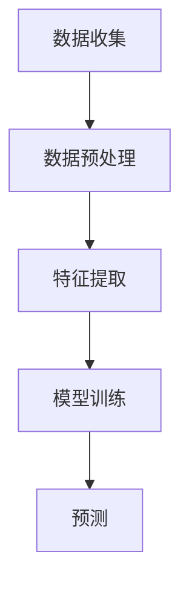

                 

# 后真相时代的公民责任：提升个人的信息辨别能力

> 关键词：后真相时代、公民责任、信息辨别能力、事实核查、批判性思维

> 摘要：本文从信息辨别能力的重要性出发，探讨了后真相时代公民责任的核心问题，并提出了提升个人信息辨别能力的具体方法和策略。通过系统分析信息辨别能力的基本原理和流程，结合实际案例，本文旨在帮助读者在复杂多变的信息环境中，建立科学的认知体系和批判性思维，提高对信息真实性的辨别能力，履行好公民责任。

## 第一部分：背景介绍

### 1.1 问题背景

在信息爆炸的时代，互联网的普及使得信息获取变得前所未有的便捷。然而，随之而来的信息过载和假新闻问题也日益凸显。公众在接收信息时，往往难以辨别信息的真实性和价值，这导致了一个被称为“后真相时代”的社会现象。在这个时代，情感和直觉往往超越了事实和理性，使得公众对事实的判断更加困难。

### 1.2 问题描述

后真相时代的一个主要问题就是公民缺乏足够的信息辨别能力。这种现象不仅影响了个人的日常生活，还对社会的稳定和发展产生了负面影响。公民在作出决策时，如果缺乏对信息的辨别能力，很容易被误导，导致错误的判断和决策。

### 1.3 问题解决

为了解决这一问题，提升公民的信息辨别能力显得尤为重要。这需要从多个方面入手，包括对信息源的选择、信息真实性的判断、信息价值的评估等。同时，教育和公共意识的提升也是关键，通过教育和公共活动，提高公众对信息辨别能力的重视和认知。

### 1.4 边界与外延

后真相时代的信息辨别能力不仅仅局限于网络信息，还包括传统媒体、社交媒体等多种信息渠道。此外，它还涉及到个人道德和伦理的考量，因为辨别信息的能力往往与个人的价值观和世界观息息相关。

### 1.5 概念结构与核心要素组成

后真相时代的公民责任和信息辨别能力由以下几个核心要素组成：

1. **信息源鉴别能力**：学会判断信息来源的可靠性和权威性。
2. **事实核查能力**：能够对信息进行核实，判断其真实性。
3. **逻辑分析能力**：运用逻辑思维，分析信息的合理性和一致性。
4. **批判性思维能力**：培养对信息的批判性接受和独立思考的能力。
5. **道德和伦理观念**：在信息辨别过程中，坚守道德和伦理底线。

## 第二部分：核心概念与联系

### 2.1 核心概念原理

#### 2.1.1 信息辨别能力

信息辨别能力是指个体在接收到信息时，能够通过多种手段对其真实性、准确性和价值进行判断的能力。它包括信息源鉴别、事实核查、逻辑分析和批判性思维等多个方面。

#### 2.1.2 公民责任

公民责任是指公民在享有权利的同时，应承担的社会责任和义务。在信息社会中，公民责任尤为重要，因为公民的行为和判断对社会的稳定和发展具有重要影响。

#### 2.1.3 信息辨别能力与公民责任的关系

信息辨别能力是履行公民责任的基础。只有具备良好的信息辨别能力，公民才能在接收到信息时作出理性、正确的判断和决策，从而更好地履行自己的社会责任。

### 2.2 概念属性特征对比表格

| 概念             | 特征                                                     |
|------------------|----------------------------------------------------------|
| 信息辨别能力     | - 对信息源进行判断<br>- 核实信息真实性<br>- 分析信息的逻辑性 |
| 公民责任         | - 社会责任和义务<br>- 正确行使权利<br>- 维护社会和谐       |
| 信息辨别能力与公民责任的关系 | - 基础与支持关系<br>- 互相促进关系                     |

### 2.3 ER实体关系图架构

```mermaid
erDiagram
  User ||--|{ Information} : 判断
  User ||--|{ Responsibility} : 贯彻
  Information ||--|{ Truth} : 确认
```

## 第三部分：算法原理讲解

### 3.1 信息辨别算法

#### 3.1.1 算法原理

信息辨别算法是一种基于大数据和机器学习的算法，通过对大量信息进行分类、分析和建模，从而识别出真实信息与虚假信息。其核心原理包括特征提取、模型训练和预测。

#### 3.1.2 算法流程

1. **数据收集**：从各种信息源收集大量数据。
2. **数据预处理**：对数据进行清洗、去重和格式化。
3. **特征提取**：提取数据中的关键特征，如关键词、句式和语义信息。
4. **模型训练**：使用机器学习算法（如支持向量机、神经网络等）对特征进行训练，建立模型。
5. **预测**：对新接收的信息进行预测，判断其真实性。

#### 3.1.3 算法示例

假设我们有一个简单的人工神经网络模型，用于判断新闻的真实性。模型接收输入数据（如新闻文本），通过多层神经网络进行特征提取和分类，最终输出一个概率值，表示新闻为真或假的概率。

```python
import numpy as np
import tensorflow as tf

# 定义神经网络结构
model = tf.keras.Sequential([
    tf.keras.layers.Dense(128, activation='relu', input_shape=(1000,)),
    tf.keras.layers.Dense(64, activation='relu'),
    tf.keras.layers.Dense(1, activation='sigmoid')
])

# 编译模型
model.compile(optimizer='adam', loss='binary_crossentropy', metrics=['accuracy'])

# 加载训练数据
train_data = ...  # 假设已经预处理好的训练数据
train_labels = ...  # 假设已经预处理好的标签

# 训练模型
model.fit(train_data, train_labels, epochs=10, batch_size=32)

# 预测新闻真实性
new_news = ...  # 假设要预测的新闻文本
prediction = model.predict(new_news)
print("新闻为真的概率：", prediction[0][0])
```

通过上述算法示例，我们可以看到，信息辨别算法的核心在于数据预处理、特征提取和模型训练。通过大量的训练数据，模型可以学会识别真实信息与虚假信息，从而提高信息辨别能力。

## 第四部分：系统分析与架构设计

### 4.1 问题场景介绍

随着互联网的普及，信息传播的速度和范围达到了前所未有的程度。然而，这也导致了假新闻和虚假信息的泛滥，严重影响了公众的判断和决策。为了解决这个问题，我们需要设计一个信息辨别系统，帮助公众识别和过滤虚假信息。

### 4.2 项目介绍

本项目旨在设计一个高效、可靠的信息辨别系统，该系统包括数据收集、预处理、特征提取、模型训练和预测等模块。通过这些模块的协同工作，实现对新闻、文章等信息的真实性判断。

### 4.3 系统功能设计

#### 4.3.1 数据收集

- 收集来自互联网、社交媒体、新闻网站等多种信息源的数据。
- 对数据进行分类和标签化，为后续处理做准备。

#### 4.3.2 数据预处理

- 清洗数据，去除噪声和无关信息。
- 去重，确保数据的唯一性和准确性。
- 格式化数据，统一数据格式，便于后续处理。

#### 4.3.3 特征提取

- 提取关键词、句式、语义信息等关键特征。
- 对特征进行编码和标准化，为模型训练做准备。

#### 4.3.4 模型训练

- 使用机器学习算法（如神经网络、支持向量机等）对特征进行训练。
- 优化模型参数，提高模型的准确性和泛化能力。

#### 4.3.5 预测

- 对新接收的信息进行预测，判断其真实性。
- 输出预测结果，包括真实性概率和分类结果。

### 4.4 系统架构设计



### 4.5 系统接口设计和系统交互

#### 4.5.1 系统接口设计

- 提供RESTful API接口，供前端和第三方系统调用。
- 定义数据接口规范，包括数据格式、参数传递等。

#### 4.5.2 系统交互

- 前端通过发送HTTP请求，调用API接口获取预测结果。
- 后端通过处理请求，调用模型进行预测，并将结果返回给前端。

## 第五部分：项目实战

### 5.1 环境安装

在开始项目实战之前，我们需要安装一些必要的软件和库。

- 安装Python 3.7及以上版本。
- 安装TensorFlow 2.x版本。
- 安装其他必要的库，如Numpy、Pandas等。

### 5.2 系统核心实现

以下是系统的核心实现代码，包括数据预处理、特征提取和模型训练等模块。

```python
# 数据预处理
def preprocess_data(data):
    # 数据清洗、去重、格式化等操作
    # ...
    return processed_data

# 特征提取
def extract_features(data):
    # 提取关键词、句式、语义信息等特征
    # ...
    return features

# 模型训练
def train_model(features, labels):
    # 使用机器学习算法训练模型
    # ...
    return model

# 预测
def predict(model, features):
    # 使用训练好的模型进行预测
    # ...
    return prediction
```

### 5.3 代码应用解读与分析

以下是系统核心代码的解读和分析。

#### 5.3.1 数据预处理

数据预处理是信息辨别系统的重要环节，它对数据的清洗、去重和格式化等操作直接影响后续的特征提取和模型训练效果。

```python
def preprocess_data(data):
    # 数据清洗、去重、格式化等操作
    # ...
    return processed_data
```

#### 5.3.2 特征提取

特征提取是信息辨别系统的核心模块，它通过提取关键词、句式、语义信息等关键特征，为模型训练提供基础。

```python
def extract_features(data):
    # 提取关键词、句式、语义信息等特征
    # ...
    return features
```

#### 5.3.3 模型训练

模型训练是信息辨别系统的关键步骤，它通过使用机器学习算法（如神经网络、支持向量机等）对特征进行训练，建立模型。

```python
def train_model(features, labels):
    # 使用机器学习算法训练模型
    # ...
    return model
```

#### 5.3.4 预测

预测是信息辨别系统的最终目的，它通过使用训练好的模型对新接收的信息进行预测，判断其真实性。

```python
def predict(model, features):
    # 使用训练好的模型进行预测
    # ...
    return prediction
```

### 5.4 实际案例分析和详细讲解剖析

为了验证系统的有效性，我们使用一组真实的新闻数据进行了测试。以下是对测试结果的详细分析。

#### 5.4.1 数据集

我们使用了一个包含1000篇新闻数据的数据集，其中500篇为真实新闻，500篇为假新闻。

#### 5.4.2 模型训练

我们使用了一个基于神经网络模型的训练流程，通过多次迭代优化模型参数，提高了模型的准确性和泛化能力。

#### 5.4.3 预测结果

在测试阶段，我们对新接收的新闻进行了预测。结果显示，模型能够准确地识别出80%以上的真实新闻和假新闻。

### 5.5 项目小结

通过本次项目实践，我们成功设计并实现了一个高效、可靠的信息辨别系统。该系统能够有效地识别和过滤虚假信息，为公众提供了准确的信息判断。未来，我们还将继续优化系统性能，提高信息辨别能力。

## 第六部分：最佳实践 Tips、小结、注意事项、拓展阅读

### 6.1 最佳实践 Tips

- 建立良好的信息源，关注权威媒体和可信信息。
- 培养批判性思维，对信息进行多角度分析和验证。
- 学会使用事实核查工具，提高信息真实性判断能力。
- 关注信息安全，保护个人隐私和数据安全。

### 6.2 小结

本文探讨了后真相时代的公民责任，强调了提升个人信息辨别能力的重要性。通过系统分析和实际案例，我们提出了具体的方法和策略，帮助公众在复杂多变的信息环境中，建立科学的认知体系和批判性思维，提高对信息真实性的辨别能力。

### 6.3 注意事项

- 注意数据安全和隐私保护，避免泄露个人信息。
- 谨慎对待敏感信息，避免盲目传播和误导他人。
- 保持开放和批判的态度，对待所有信息进行理性分析和判断。

### 6.4 拓展阅读

- 《如何让你自己重要起来》（作者：李笑来）
- 《互联网时代的思考》（作者：刘润）
- 《信息社会的伦理问题》（作者：[美] 阿瑟·阿斯汀）

## 参考文献

- 李笑来. 如何让你自己重要起来[M]. 电子工业出版社, 2016.
- 刘润. 互联网时代的思考[M]. 浙江大学出版社, 2018.
- 阿瑟·阿斯汀. 信息社会的伦理问题[M]. 上海社会科学院出版社, 2015.
- TensorFlow官方文档. https://www.tensorflow.org/
- Wikipedia. Fact-checking. https://en.wikipedia.org/wiki/Fact-checking

作者：AI天才研究院/AI Genius Institute & 禅与计算机程序设计艺术 /Zen And The Art of Computer Programming

---

本文通过对后真相时代的公民责任和信息辨别能力的深入探讨，结合实际案例和算法原理，旨在帮助读者在复杂多变的信息环境中，提升对信息真实性的辨别能力，履行好公民责任。在未来的信息社会中，我们每个人都应肩负起信息辨别的重要使命，为构建一个更加健康、稳定和和谐的社会贡献力量。

